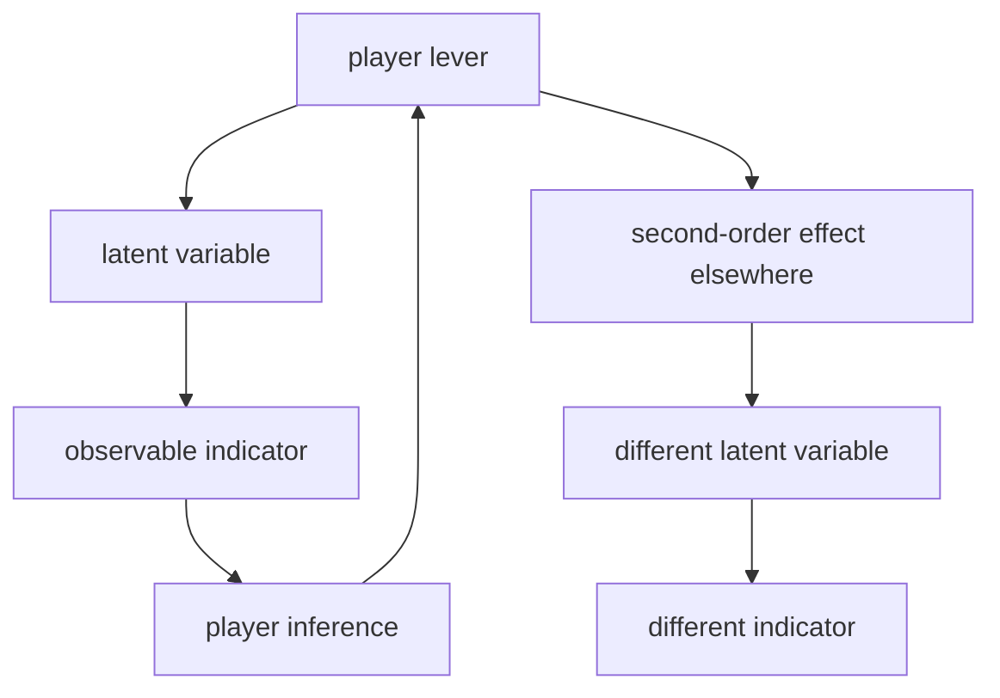
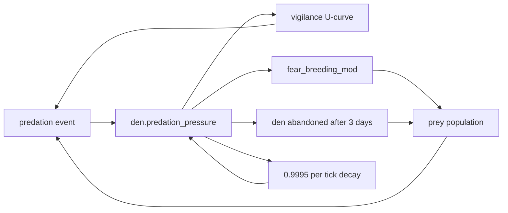

# Research: Institutional-agent simulator foundations

**Date**: 2026-09-02T18:18:06-04:00
**Substrate repository**: `clowder` — `github.com/wn-mitch/clowder`, commit `8f5f0302` (working tree dirty: 14 files), jj change `zuxyzklptpuq`
**Target workspace**: `/Users/will.mitchell/reservist` — empty

## Research Question

From `01-research-questions-simulator-foundations.md`:

1. What files and directories currently make up the workspace, and what application, runtime, build, asset, and test structure do they define?
2. How does the existing concept material distinguish observable economic indicators from latent system variables, and what causal relationships, feedback loops, delays, and second-order effects does it describe between them?
3. How does the existing material define the simulation's passage of time, morning briefing sequence, information arrival, weekly action limit, and end-of-term boundary?
4. What policy, operational, regulatory, diplomatic, and communications actions are described, and how does the concept material characterize their interactions with markets, government institutions, and other actors?
5. How are credibility, independence, market functioning, mandate performance, and institutional legitimacy defined, observed, and related to the proposed end-of-term assessment?
6. What design system, component library, visual assets, and frontend conventions exist today, including exact colors, typography, spacing, borders, shadows, chart treatments, responsive behavior, and theming?

**Two sources, and what each answers.** The concept material is `task.md` in this task directory; it answers questions 2 through 6 directly and is cited throughout as `task.md:<line>`. `~/clowder` is the designated reference for baseline questions about simulation agents — an existing Bevy ECS colony simulation whose agent machinery is prior art for the new game. The new game replaces cat agents with **institutional agents standing in for people**: the Federal Reserve chairs, institutional investors, the President, the Treasury, retail, the populace, banks, and sovereign funds. Because it is a math-and-money game, clowder's art pipeline is out of scope and UI effort takes its place.

This document therefore reads clowder as a set of simulation primitives, stating for each what it is parameterized over and what it hardcodes, and compares that against what the concept material actually calls for. It is a map of the starting position, not a design.

## Research Methodology (verbatim)

This document will remain objective and factual. It does not contain any recommendations or implementation suggestions.
Open questions will not ask Why things haven't been built or what should be built in the future.

There is no "implementation" section - that is intentional.

## Summary

The concept material's central mechanic is partial observability. Sixteen indicators are named as visible to the player — fed funds target, balance-sheet size, SRF usage, reserve levels, SOFR, term premium, bid-to-cover, dealer inventories, basis spreads, hedge-fund gross leverage, bank unrealized losses, mortgage rates, inflation expectations, unemployment, the dollar index, issuance composition — while four variables are named as the ones that matter and are explicitly *not* directly observable: market confidence, dealer balance-sheet elasticity, foreign reserve-manager appetite, and fiscal dominance expectations (`task.md:6-23`). The stated design principle is "no clean causal arrows. Almost every lever needs at least one second-order effect" (`task.md:33`), and the question the game is meant to provoke is "Did I solve the problem, or did I just change where the problem lives?" (`task.md:36`). Time is a weekly cadence opening on a timestamped morning briefing and constrained to roughly two consequential actions per week, because "scarcity of attention matters" (`task.md:39-48`). Assessment is five deliberately non-aligned institutional stats — Credibility, Independence, Market Functioning, Mandate, Institutional Legitimacy — with no conventional win condition, scored on the system the player leaves behind at end of term (`task.md:68-89`).

Clowder already enforces the observed/latent split structurally, and this is the closest and strongest correspondence between the two. Nearly every spatial, threat, and resource question resolves through a per-agent belief facet carrying `value`, a `prior` it decays toward, a `strength` confidence, an `EvidenceKind` provenance tag, and a last-updated tick (`src/components/beliefs.rs:66-101`) — with two documented god's-eye exceptions where a system reads other agents' components directly (§3). Shared knowledge is a quorum aggregate that exists only while enough living carriers independently hold it and emits a "forgotten" event when the last one lapses (`src/systems/colony_knowledge.rs:153-203`). The observability asymmetry is also already built: the live UI shows a curated fraction of agent state while a separate telemetry row carries the superset, with personality, corruption, and the entire belief substrate never surfacing in the UI at all. The facet *struct* is domain-neutral; only its six facet names are cat-social.

The decision machinery is likewise parameterized over almost everything. A DSE — the unit of action scoring — is declarative: it names its considerations, the response curve on each, how they compose, its eligibility filter, and its priority tier, and the evaluator is generic over all of it (`src/ai/dse.rs:470-487`). The curve library, the three composition modes with their geometric-mean compensation term, the saturating cap that stops agreeing modifiers from stacking additively, the Boltzmann selection at a state-coupled temperature, and the three commitment strategies that keep an agent from thrashing between actions are all pure mechanism with no cat in them. What is hardcoded is the *vocabulary*: the scalar names the considerations fetch, and the `Action`/`DispositionKind` enums. Above that sits a multiplicative priority cascade where unmet lower tiers suppress higher-tier scores rather than hard-gating them — a shape that is reusable even though its ten need names are not.

Four things the concept material requires have no counterpart in clowder, and they are the substantive gaps. There is **no loop or delay abstraction** — clowder's eight closed feedback loops emerge from systems reading and writing shared resources with per-site rate constants, and every lag is a bespoke timer or half-life rather than an instance of a shared primitive. There is **no turn boundary or action budget** — agents re-elect an action every tick with nothing resembling two-actions-per-week attention scarcity. There is **no utterance layer**: clowder generates prose as output, never as an input other agents parse, and a held intention is explicitly not legible across agents, so the brief's language-fragment construction and markets parsing statements "with an almost malicious literalism" (`task.md:62-67`) has no analogue — though a real signalling primitive does exist, where an agent performs a play-bow whose entire effect is to raise a witness's `perceived_intent_clarity` (§6). And **no actor-level reputation variable exists** — the nearest things are a per-agent `respect` need and colony-wide alignment scores, while clowder's five welfare axes get *averaged into one number* (`src/resources/colony_score.rs:140-148`), which is the opposite of the brief's requirement that the five stats trade off against each other and be reported separately. Conversely, the run-assessment apparatus is the most reusable subsystem in the repo: no victory condition, an explicit-elapsed footer, a throughput-invariant checkpoint, and an eight-channel pass/concern/fail/unprovable classifier whose only domain coupling is the names of its inputs. The two largest non-transferable blocks are the spatial substrate — tile grid, terrain costs, scent and influence maps, route cost, escape viability, eighteen planner zones — and the entire presentation layer: 27 rendering files, 5,272 sprite PNGs, and a pinned ComfyUI creature-rig pipeline. For a chart-dense terminal interface, clowder's UI contributes essentially nothing: eight shared color constants, no font ever loaded, hand-built two-node flex bars, no shadows, and no responsive handling.

## Detailed Findings

### 1. The target workspace is empty; the starting position is a concept brief plus a substrate repository

`/Users/will.mitchell/reservist` contains **zero regular files** and no VCS metadata. Its only contents are this task directory, holding the research-questions document and `task.md`. There is no application, runtime, build configuration, asset pipeline, test suite, design system, or component library — nothing to extend, and no naming or structural conventions inherited from the target workspace. The two additional working directories are riptide plugin installs containing skill definitions only; a search across both for `*.ts`, `*.tsx`, `*.css`, `package.json`, `*.svg`, and `*.png` returns nothing.

`~/clowder` is a separate repository at `github.com/wn-mitch/clowder`, package `clowder` v0.4.0, Rust edition 2021, built on `bevy 0.18` with `bevy_ecs_tilemap`, `linkme`, `rand_chacha`, `noise`, `ron`, `serde`, and `toml` (`Cargo.toml:8-33`). Its scale, by file counts under `src/`:

```text
src/                       513 .rs total
├── ai/           139   # scoring evaluator, DSE catalog, HTN methods, GOAP planners
├── steps/         70   # leaf action resolvers
├── systems/       67   # tick-driven ECS systems
├── scenarios/     63   # ~55 triage worlds + harness
├── components/    59   # ECS component definitions
├── resources/     57   # global state incl. sim_constants (~10,144 lines)
├── rendering/     27   # sprites, tilemap, day/night, VFX, ui/ (12 panels)
├── world_gen/      8   # Perlin terrain, colony siting, prey ecosystem
├── species/        6   ├── messages/  6   ├── plugins/  4   ├── events/  2
└── {main,lib,persistence,ui_data}.rs
```

Supporting material is unusually heavy relative to code: a ~910-line `justfile`, ~72 scripts including a family of `check_*.sh` convention gates each paired with an `.allowlist`, 581 files under `docs/open-work/`, 124 numbered balance-pass documents, 40 per-system design docs, and a 58-file mdbook wiki. Game data lives in RON (30 narrative template files, zodiac), JSON (four cat presets), and TOML (atlas bindings, art provenance).

#### Testing patterns

There are no tests in the target workspace. Clowder inverts the usual file distribution: `#[cfg(test)]` appears **329 times across 317 files** under `src/`, so nearly every module carries colocated unit tests, while `tests/` holds only ten top-level Rust integration files plus four Python subdirectories (`verdict/`, `logq/`, `similar/`, `llm/`). The CI target is three gates — `ci: check test check-determinism` (`justfile:900`) — which notably excludes the Python asset tooling and every atlas recipe.

### 2. The concept material makes partial observability the core mechanic, with sixteen indicators over four hidden variables

The brief lists what the player sees (`task.md:6-22`): fed funds target, balance-sheet size, Standing Repo Facility usage, reserve levels, SOFR, Treasury term premium, bid-to-cover ratios, dealer inventories, basis spreads, hedge-fund gross leverage, bank unrealized losses, mortgage rates, inflation expectations, unemployment, dollar index, and Treasury issuance composition.

It then states the inversion explicitly: "the important variables are latent" (`task.md:23`). Four are named — market confidence, dealer balance-sheet elasticity, foreign reserve-manager appetite, fiscal dominance expectations — with the inference channels given as spreads, auction tails, volatility, survey data, and market behavior. The design constraint is stated as a principle rather than a feature: "no clean causal arrows. Almost every lever needs at least one second-order effect" (`task.md:33`).



Three worked chains are given (`task.md:27-34`). Raising rates lowers inflation expectations while simultaneously raising bank losses into credit contraction and changing repo leverage economics into reduced Treasury liquidity — after which Treasury calls about an auction that tailed by 11 bp. A rate cut stabilizes Treasury funding while weakening the dollar and reaccelerating inflation. Changing SLR treatment expands dealer intermediation while encouraging banks to rebuild the balance-sheet structures post-2008 regulation was meant to suppress. Expanding repo access prevents a fire sale while increasing private-sector confidence that funding liquidity will remain available under stress — a second-order effect on expectations rather than on a quantity. The intended player experience is the question "Did I solve the problem, or did I just change where the problem lives?" (`task.md:36`).

Two structural properties are worth separating here, because the substrate treats them differently. The first is *hidden state* — variables that exist in the model but are never displayed. The second is *inference pressure* — the requirement that observables be informative but not sufficient. The brief asks for both.

#### Testing patterns

None — this is prose concept material, not code.

### 3. Clowder enforces the observed/latent split structurally: no decision path reads ground truth

This is the closest correspondence between the two sources. Clowder's agents act on beliefs, and the beliefs are designed to be wrong.

Four component families key a `MentalModel` by perceiver-specific keys (`src/components/beliefs.rs`): `CatBeliefs` (entity-keyed), `LocationBeliefs` (5-tile position buckets), `PredatorBeliefs` (species-keyed), and `ContextBeliefs` (either `HereNow` ambient context or `DispositionExecution(kind)` self-belief). The unit is a facet:

```rust
pub struct Facet {                    // src/components/beliefs.rs:66-91
    pub value: f32,
    pub prior: f32,                   // the value it decays toward
    pub strength: f32,                // [0,1] confidence / recency; 0 = forgettable
    pub last_source: EvidenceKind,
    pub last_updated_tick: u64,
}
```

`EvidenceKind` (`:101+`) records provenance: `Observation` for direct witness, `Implant` for species priors, `Forgetting` for passive decay to zero strength (marking the facet for removal), with `Transference` and `Confabulation` variants reserved. The facet names are cat-social — `perceived_injury_level`, `perceived_intent_clarity`, `recency_of_threat_cue`, `perceived_violence_capability`, `affiliation_history`, `predictability`, plus `perceived_hostility`, `perceived_receptivity`, `prey_yield`, `surplus_food` — but the struct, the decay-toward-prior behavior, and the provenance tagging carry no domain.

Belief updates arrive through a message channel rather than by reading world state. `WitnessableEvent` (`src/messages/witnessable_event.rs:26-345`) is a large enum of perceivable side-effects — Attack, Groom, Mate, Care, FleeFrom, Hunt, PlayBow, DenSieged, CarriesFesteringWound — broadcast by step resolvers and consumed the same tick by `belief_integrator::integrate_beliefs`. An agent's model is built mostly from what it was positioned to observe.

**Mostly, not entirely — there are two documented god's-eye exceptions.** The privacy rule is stated as an invariant in the code: "Sister DSEs never query other cats' `HeldIntention`. That would be mind-reading" (`src/components/held_intention.rs:14-16`, mirrored at `src/components/held_goal_stack.rs:24-31`). Two paths depart from it. The joint-intention matchmaker scores candidate partners from a `MatingFitness` snapshot read straight off the candidate's own `Mood`, `Needs`, `Age`, and `Fertility` components through a full-world query (`src/ai/mating.rs:29-96`) — bypassing the belief substrate entirely rather than merely reading a stale facet. And `populate_parenting_scalars` (`src/systems/parenting_activity.rs:361-423`) queries every agent's private `HeldIntention` and checks whether a co-parent currently holds `Action::Caretake` against one of the querying agent's dependents (`:412`, `:437-445`), collapsing its own caretake suppression factor if so — the one place the never-read-across-agents invariant is not observed. Both are worth knowing when reading the substrate for how strictly partial observability is actually enforced: the rule is architectural, the enforcement is by convention and has two live gaps.

**Shared knowledge requires a living quorum and evaporates without one.** `update_colony_knowledge` (`src/systems/colony_knowledge.rs:153+`) runs every `scan_interval` ticks, aggregating individual `LocationBeliefs` into `KnowledgeEntry` rows, and promotes a bucket only when enough agents independently hold a strong belief there — three agreeing carriers in the tested case, with below-quorum agreement producing no entry at all (`tests/colony_knowledge.rs:45-75`). Each entry tracks `carrier_count` and `witnesses`; when carriers die or their beliefs decay away and the count reaches zero, the entry is deleted and a "forgotten" narrative event fires at `NarrativeTier::Significant` (`colony_knowledge.rs:174-203`, tested at `tests/colony_knowledge.rs:79-124`). Colony knowledge then re-enters scoring through the `ColonyKnowledgeLift` modifier reading `colony_knowledge_resource_proximity` and `colony_knowledge_threat_proximity` scalars (`src/ai/scoring.rs:665-672`).

**The display asymmetry is also already built.** The live inspect panel and the `CatSnapshot` telemetry row are nested, not equivalent — the telemetry stream is a strict superset:

| Category | Live UI | Telemetry |
|---|---|---|
| 5 of 10 needs (hunger, energy, temperature, safety, social) | bars | yes |
| the other 5 needs (acceptance, respect, mastery, purpose, mating) | **never** | yes |
| all 18 personality axes | **never** — behavior only | yes |
| continuous per-part tissue damage | **never** | — |
| discrete part condition | shown, **filtered to ≥ Wounded** | — |
| 6 of 11 skills | shown | all 11 |
| relationship fondness / familiarity | fondness only | both |
| corruption, magic affinity | **never** | yes |
| per-action score breakdown | **never** | yes |
| fertility phase, pregnancy detail, mourning | **never** | bool or nothing |
| the entire belief substrate | **never** | **never** |

Mourning is documented as actor-private state that observers cannot read (`src/components/mourning.rs:20-27`); observers learn of a death only through the resulting grave entity. Personality is fixed at spawn — no system mutates it — and reaches behavior through three separate channels: as scoring scalars (`scoring.rs:893-1071`), as hard behavioral gates (`:2398-2438`), and by scaling need-decay rates directly (`src/systems/needs.rs`).

One axis is wired but inert, which matters when reading the codebase for reusable machinery: `Fulfillment.body_condition` has a writer scheduled every tick (`src/systems/fulfillment.rs:110-129`, `simulation.rs:1686`) that early-returns because both its rate constants ship at `0.0` (`sim_constants.rs:8828-8862`). Its one meaningful reader is a breeding-gate consideration behind a default-`false` flag (`src/ai/mating.rs:99,143-154`). Similarly, `ui_data.rs::build_inspect_data` (`:139-209`) and four of its types have **zero callers** anywhere in the repo; the panels query eighteen components directly instead (`cat_inspect.rs:94-120`). What is load-bearing in that module is `InspectionState`/`InspectionMode` and a single `terrain_label` call.

#### Testing patterns

Inline `#[cfg(test)]` modules cover `components/beliefs.rs`, `components/physical.rs` (tier-suppression math), `components/personality.rs` (RNG determinism, range, verified bell-curve mean over 1,000 samples), and `resources/relationships.rs`. `tests/colony_knowledge.rs` is the integration-level test for quorum promotion and carrier-loss forgetting. Test worlds are hand-built `bevy_ecs::World` plus a single-system `Schedule`; there is **no shared fixture-agent helper** — each module defines its own local spawn function with the minimal component bundle its system queries.

### 4. Clowder's feedback loops are real and lagged, but hand-wired — there is no loop or delay abstraction

Eight closed loops exist and each is genuinely closed, with delays long enough to be legible. What does not exist is any machinery that represents a loop as a first-class thing: loops emerge from separate systems reading and writing shared resources, and each lag is an independent timer, half-life, or duration constant at its own site. Anything wanting to enumerate, visualize, or tune loops as objects would find nothing to enumerate.



The predation loop is the clearest instance. A kill fires `PreyKilled`, consumed by `update_den_pressure` (`src/systems/prey.rs:1329-1345`) to raise `den.predation_pressure` within 15 tiles by 0.1. Pressure then acts through three channels at once: a deliberately **non-monotonic** vigilance response where moderate pressure raises vigilance and lowers huntable exposure but very high pressure collapses it again because prey must forage regardless (`prey.rs:175-184`); breeding suppression via `fear_breeding_mod = 1 − pressure × 0.8`; and after three sustained days of stress, outright den abandonment. Absent fresh kills, pressure decays at 0.9995/tick — a ≈1.4-day half-life (`prey.rs:1283`). Carrying capacity is separate, enforced as `density_pressure = 1 − pop/cap` driving breeding to zero at the cap (`prey.rs:1216-1258`).

The corruption loop is autocatalytic and only externally checked — the code comment names it so (`src/systems/magic.rs:693-694`). Corruption spreads tile-to-tile above 0.3 (`magic.rs:79-131`), spawns a shadow fox above ≈0.85 (`:698-781`), and that fox deposits more corruption, leaves corruption-emitting carcasses, and while besieging a ward erodes it at `sqrt(siege_count) × ward_siege_decay_bonus` (`:164-181`) — shortening the ward's life, which permits more corruption, which spawns more foxes. Every balancing force is external: births and bonds emit pushback, wards repel, a posse banishes. `docs/balance/healthy-colony.md` pins the equilibrium empirically at `shadow_fox_spawn_total ≈ 7.3 ± 5.2` and `wards_placed_total ≈ 141 ± 66`, naming failure modes on *both* sides — corruption climbing without ward placement, and corruption never crossing the spawn threshold at all.

**The second-order pattern the brief demands already exists in one place.** Weather does not touch mood directly. It folds a `comfort_modifier()` as a global offset into an environmental-quality field (`src/systems/env_quality.rs:208-212`), which is sampled per-agent as `local_comfort` (`src/ai/scoring.rs:1092-1098`) and consumed by the `EnvironmentalQualityModifier` in the score pipeline. Weather also independently scales movement and building decay, and dirty buildings then apply their own temperature penalty to nearby agents (`src/systems/buildings.rs:192-201`) — three distinct channels from one draw. Corruption likewise never touches prey population directly: it acts through herb and tile state, which acts through the food economy, which acts through hunting behavior. These are genuine A-through-C chains, built by wiring rather than by a mechanism for expressing them.

Season compounds two effects in the same window: `foraging_multiplier` runs 1.2 in Spring down to **0.15 in Winter** (`src/resources/time.rs:231-238`) while season simultaneously scales prey breeding — and Winter is the only fox breeding season (`src/systems/wildlife.rs:1209-1212`), so the leanest food period is when new predators appear. Injury spirals: damage authors `SevereInjury`/`Incapacitated` markers (`src/systems/interoception.rs:442-582`) that gate DSE eligibility via `.forbid("Incapacitated")`, so an injured agent stops contributing to hunting and guarding *and* becomes likelier to be caught again through the mobility term in `escape_viability`.

Representative delays, each configured at its own site:

| Delay | Duration | Source |
|---|---|---|
| Weather hold | 30–79 ticks | `src/systems/weather.rs:29` |
| Day phase / day / season | 250 / 1,000 / 20,000 ticks | `src/resources/time.rs:36-56` |
| Gestation | 1 season, stages at 33% / 66% | `src/systems/pregnancy.rs:74-90` |
| Fox life stages | 1 / 2 / 16 seasons | `sim_constants.rs:7027-7029` |
| Den pressure decay | ×0.9995/tick, ≈1.4-day half-life | `sim_constants.rs:1876` |
| Den abandonment | 3 days sustained stress | `:1880` |
| Scent decay: prey / carcass / fox territory | ≈1 / ≈2 / ≈10 days | `:1832`, `:6840`, `:7040` |
| Fox approach-corridor half-life | 20,000 ticks (≈4 days) | `:6822` |
| Ward lifespan: thornward / durable | ≈500 / ≈1,000 ticks | `src/components/magic.rs:676,685` |

Ward geometry is continuous rather than binary — `repel_radius()` scales linearly with current strength (`components/magic.rs:661-708`), so protection shrinks smoothly as a ward decays.

**Where the tuning values live.** All of it is hardcoded as Rust struct-field defaults inside one `SimConstants` resource (`src/resources/sim_constants.rs`, ~10,144 lines across dozens of sub-structs). There is no on-disk canonical balance config — the Rust struct *is* the schema. Variation happens through `SimConstants::default_with_overrides` (`:8946-9000`), which deep-merges an arbitrary `serde_json::Value` patch over the defaults; this is the mechanism behind the `logs/tuned-*` and `logs/sweep-*` experiment directories and the `CLOWDER_OVERRIDES` environment variable.

#### Testing patterns

`tests/ecosystem.rs:17-176` builds a bare `World` plus a three-system `Schedule` and asserts population growth, carrying-capacity respect, and predator thinning over thousands of ticks. `tests/route_cost_decision.rs:54-108` pins a substrate invariant directly. `tests/escape_viability_scenarios.rs` is scoped as a cross-crate callability contract, with the exhaustive matrix inline at `src/systems/interoception.rs:1197-1494` — the codebase's stated split is "integration test = callability contract, unit test = exhaustive behavior." Loop-level validation is empirical rather than asserted: `docs/balance/healthy-colony.md` tabulates mean ± stdev bands from a 15-run sweep (5 seeds × 3 reps), backed by hundreds of archived runs under `logs/`.

### 5. The brief's time structure is a weekly decision cadence; clowder's is a continuous per-tick election with no turn boundary

The brief structures each turn around a morning briefing with timestamped arrivals (`task.md:39-47`):

```text
07:30 — Markets Desk      "Sponsored repo volumes rose 18% overnight.
                           No evidence of impaired market functioning."
08:05 — Treasury          "Secretary requests discussion of long-end financing conditions."
08:30 — BLS               Core CPI: +0.4%.
09:07 — Primary dealer survey
                          Two firms report balance-sheet constraints ahead of Thursday auction.
```

Then: "you choose maybe two consequential actions per week. Not ten sliders. Scarcity of attention matters" (`task.md:48`). The end boundary is a term of office with no conventional win condition, scored on the resulting system state — the worked example retires the player in 2034 (`task.md:80-89`). Information arrival is thus scheduled, attributed to a named institutional source, and partly conversational (Treasury *requests a discussion*), and the action economy is an explicit per-period budget.

Clowder's time model shares the derivation machinery and none of the boundary structure. A tick is one pass of Bevy's `FixedUpdate`; in headless mode `TimeUpdateStrategy::ManualDuration` plus one `app.update()` per iteration makes one update exactly one tick (`src/main.rs:456-473`). `SimConfig` sets `ticks_per_day_phase = 250` and `ticks_per_season = 20000` (`src/resources/time.rs:36-56`), so a day is 1,000 ticks and a year 80,000; `DayPhase` (Dawn → Day → Dusk → Night) and `Season` are pure functions of tick count (`:155-165`, `:216-226`), and `TimeScale` (`:100-138`) is the single anchor tying tick rate to wall-clock for both headless and windowed builds — "two runs are only behaviorally comparable iff their `TimeScale` matches" (`:80-81`). One structural quirk: a world starts its clock at `start_tick = 60 × ticks_per_season` ≈ **tick 1,200,000**, not zero, so founders can have varied ages without clamping (`src/plugins/setup.rs:384-389`). All on-disk ticks are absolute, which is why the footer emits `start_tick`/`final_tick`/`elapsed_ticks` explicitly and consumers are warned never to divide by `final_tick` (`headless_io.rs:682-692`).

What is absent is the entire turn concept. Agents re-elect an action every tick through a fresh scoring pass; there is no per-period allowance, no notion of an action costing a budgeted unit of attention, and no boundary at which a decision window opens or closes. The nearest analogues are all continuous rather than periodic: `CommitmentStrategy` keeps an agent on a chosen action until belief proxies say to drop it (`src/ai/commitment.rs:155-269`), `target_trips` sets a personality-scaled repeat count, `CommitmentTenure` lifts the incumbent action for a tenure window, and `DispositionFailureCooldown` damps recently-failed actions. Hard preemption exists only at step boundaries and only tier-ordered: an urgency can abort a running plan when its Maslow tier is strictly lower than the running plan's (`src/systems/goap.rs:4970-4985`). Player-facing time control is pause plus a three-position speed cycle that retunes the fixed-update *frequency* rather than applying an in-tick multiplier (`main.rs:161-204`, `time.rs:297-300`).

On the information-arrival side, clowder has the delivery half but not the scheduling or attribution half. Prose reaches the player through a ring-buffered `NarrativeLog` (cap 200) rendered by a log panel and a fading toast, and a parallel structured `EventLog` (cap 500) carries machine-readable `EventKind` rows plus cumulative tallies that survive ring eviction. Emission is opportunistic rather than scheduled: `generate_narrative` (`src/systems/narrative.rs:28+`) fires once per agent whose current action has `ticks_remaining == 1`, rate-limited for high-frequency actions (Idle 1-in-5, Eat/Sleep 1-in-3, self-groom 1-in-2). Nothing arrives at a fixed time, nothing is attributed to an institutional sender, and no message expects a response.

#### Testing patterns

`tests/integration.rs:32-83` mirrors `run_headless`'s construction exactly — same plugin order, same manual `Time<Fixed>` scaffolding — deliberately, so tests exercise production code rather than a parallel scaffold that could drift. Inline tests at `resources/time.rs:349-464` cover phase derivation and bucket boundaries.

### 6. The brief's action space is a fixed catalog with communication as an instrument; clowder's is a scored catalog with no communication layer

Twelve action types are named (`task.md:49-61`): change policy rate, alter QT pace, conduct repo operation, modify SRF terms, coordinate with Treasury on buybacks, emergency discount-window messaging, change supervisory guidance, request enhanced hedge-fund reporting, push central-clearing implementation, issue public statement, call a foreign central bank, and privately pressure Treasury not to do something insane. These span the policy, operational, regulatory, diplomatic, and communications categories the research question asks about, and several are addressed at a specific counterparty rather than at the economy.

The brief then singles out communication: "communication itself is a policy instrument. You should have to construct statements from constrained language fragments" (`task.md:62`), with the worked example being a stem plus bracketed alternatives:

```text
"The Committee remains…"
  [attentive to inflation risks]
  [prepared to act as appropriate]
  [confident inflation is returning to target]
```

"Markets then parse your prose with an almost malicious literalism" (`task.md:67`). The mechanic is that an utterance is an *input* to other actors' interpretation, and the interpretation is adversarial.

Clowder's action layer is a large scored catalog with a generic evaluator over it. Roughly 70 cat DSEs plus per-species catalogs:

| Group | Actions |
|---|---|
| Feeding | Eat, Hunt (+target), Forage, Cook, Farm, DryFood, SmokeMeat, TendSmokingRack, BegForFood, four disposal siblings |
| Rest & self | Sleep, Idle, GroomSelf |
| Social & care | Socialize (+target), GroomOther, Mentor, Coordinate, Caretake, Mate, Bury, Wean/Teach/Release |
| Territorial | Flee, Fight (+target), Patrol, Build, Hide (scored but barred from selection) |
| Magic & herbcraft | three Herbcraft siblings, six Magic siblings |
| Crafting | CraftAtWorkshop, CraftAtTanningFrame |
| Movement | Explore, Wander |
| Non-cat | fox 9, hawk 3, snake 4, shadow-fox 3, prey 2 |

Two facts about this catalog matter for reuse. First, the evaluator is fully generic over it: a DSE declares its considerations, curves, composition, eligibility, and tier, and nothing in the scoring path knows what the action means (see §7). Second, the coupling point is a pair of hardcoded enums — `Action` and `DispositionKind` — and the seam shows: `Action::Hide` is unconditionally filtered out of the selection pool because `DispositionKind::from_action(Action::Hide) == None`, so it cannot be elected even though its eligibility marker is authored live by `update_hide_eligible_markers` (`src/systems/sensing.rs:1085-1104`) and it does score and appear in traces. The filter's own comment explains that keeping the score visible is deliberate — "informational for tuning + balance work without letting it silently mis-execute as Resting" (`src/ai/scoring.rs:2653-2667`).

Actions can be addressed at a counterparty. Thirteen **target-taking DSEs** score candidate targets rather than just the action (`src/plugins/simulation.rs:44-89`) — Hunt, Fight, Socialize, GroomOther, Bury, Mentor, Caretake, Wean, Teach, Release, Mate, Build, Herbcraft/ApplyRemedy — ranking candidates on distance, relationship state, target need, and recent-failure cooldown. There is also a coordination layer: a `Coordinator` marker is an emergent role evaluated periodically from social weight plus diligence and sociability (`src/components/coordination.rs:13-14`), gating `ActiveDirective`/`DirectiveQueue` dispatch across ten directive kinds, with an `ActiveDirectiveLift` modifier and loyalty-versus-independence friction when a directive is live (`src/systems/personality_friction.rs:26-101`).

**There is no utterance mechanic, but there is a signalling primitive.** Clowder's narrative system runs strictly one-way: a `TemplateContext` is assembled from agent and world state, matched against RON templates, and rendered to prose for the player (§10). No agent reads narrative text, no utterance is an input to another agent's beliefs, and nothing constructs a message from fragments. Nor is a held intention legible across agents — that is an explicit design invariant with the two exceptions noted in §3.

What does exist is a genuine communicative act. `emit_play_bows` (`src/systems/playbow_emitter.rs:47-114`) has a playful, positive-mood agent with a peer in range roll against a cooldown and, on success, broadcast `WitnessableEvent::PlayBow` — changing nothing about the actor's own state, so the broadcast *is* the entire effect. Witnesses then lift `perceived_intent_clarity` at full strength and `perceived_receptivity` at lower strength (`src/systems/belief_integrator.rs:969-995`), and the event's own doc comment describes it as the "strongest play-engagement signal" (`witnessable_event.rs:179-186`). `emit_reciprocal_advances` (`playbow_emitter.rs:122-182`) chains it: moving near a peer who recently bowed emits `ReciprocalAdvance`, which lifts intent-clarity at full strength when the perceiver was the target and half strength for bystanders (`belief_integrator.rs:997-1020`). That is an action performed in order to inform another agent about what the actor intends next — the structural shape of a signal. It is worth distinguishing from `track_sustained_copresence` (`src/systems/sustained_copresence.rs:69-260`), which no agent performs: it is a geometric detector over proximity duration that emits an event consumed identically, i.e. inference from an observable, not a signal.

Three limits bound how far that primitive goes today. The reader side is nearly dormant — `perceived_intent_clarity`'s only consumer is a hide-affordance axis shipping at weight `0.0` (`src/ai/dses/hide.rs:81-88,150`). The directive channel is not communication at all: `dispatch_urgent_directives` inserts an `ActiveDirective` component directly onto the recipient (`src/systems/coordination.rs:941-950`) and `ActiveDirectiveLift` applies an unconditional additive bonus whenever the component is present and the action ordinal matches (`src/ai/modifier.rs:3852-3874`) — the recipient's scoring never evaluates the request's content. `DirectiveRefused` accordingly is not a decision: it is a die roll on `stubbornness` alone, independent of what was asked (`src/systems/personality_events.rs:62-73`), whose consequences are a social cascade — coordinator mood penalty, fondness drop, penalties on loyal bystanders within 5 tiles — plus retraction of the component after the fact (`:175-243`). And there is no misrepresentation: `EvidenceKind::Transference` and `Confabulation` are declared with the annotation "emit path follows in a consumer ticket" (`src/components/beliefs.rs:116,119`) and have **zero producers** anywhere in `src/`.

`JointIntention` is a related but deliberately different category — the module doc calls it "mutually-public substrate… not the partner's internal commitment" (`src/components/joint_intention.rs:14-20`), and `PracticeStage` "cannot read the partner's internal stage; it can read the partner's *substrate*" (`:145-149`), producing a designed "codified irony" in which two partners' stages silently mismatch (`:30-44`).

The three registry slots that might have carried an utterance-election mechanic are dead: `coordinator_dses`, `narrative_dses`, and `aspiration_dses` are declared with push methods (`src/ai/eval.rs:79-81`, `:179-181`) that nothing ever calls, and nothing iterates them — the only read anywhere is `DseRegistry::len()` summing their permanently-zero lengths (`:147-149`). The constructor functions named for those slots in `docs/systems/ai-substrate-refactor.md:5797-5941` do not exist under `src/`.

#### Testing patterns

The primary instrument for action-selection work is the scenario harness: ~55 tiny worlds of one to five agents with specific needs, personality, markers, and positions, each running in about three seconds against `just soak`'s fifteen minutes. `runner::run` (`src/scenarios/runner.rs:168-373`) builds a headless `App` with `MinimalPlugins` + `SimulationPlugin`, injects setup through a `WorldSetup` resource that `setup_world_exclusive` consumes in preference to normal world-build (`src/plugins/setup.rs:264-271`), inserts trace resources *before* the plugin so `Option<Res<FocalScoreCapture>>` resolves `Some`, and drains a `TickReport` per tick exposing the winning action, the full ranked pool with softmax probabilities, the pre-bonus and pre-penalty pools, and a per-DSE row of eligible/pregate/raw/gated/final scores with per-modifier deltas. `tests/scenarios.rs` gates the registry twice: `all_scenarios_smoke_run_one_tick` (`:20-31`) catches resource drift, and `declared_expected_features_all_fire` (`:44-70`) asserts every declared feature fires at least once — a hard gate against a score being lifted while its resolver wiring was never landed.

### 7. The scoring evaluator is parameterized over everything except the scalar names and the action enum

This is the machinery the user pointed at as the baseline for simulation agents, and it is the most reusable non-trivial subsystem in the repo. A DSE is declarative:

```rust
trait Dse {                                    // src/ai/dse.rs:470-487
    fn id(&self) -> &str;
    fn considerations(&self) -> &[Consideration];
    fn composition(&self) -> &Composition;
    fn eligibility(&self) -> &EligibilityFilter;
    fn default_strategy(&self) -> CommitmentStrategy;
    fn emit(&self, score: f32, ctx: &EvalCtx) -> Intention;
    fn maslow_tier(&self) -> u8;               // 1-5, or u8::MAX to opt out
}
```

Considerations come in four kinds (`src/ai/considerations.rs:458-468`): `Scalar` (a named fetch closure through a curve), `Spatial` (distance to a resolved landmark, normalized by range), `Marker` (0/1 presence), and `Field` (sampling a per-agent cost field at a landmark). **The name is the coupling**: the evaluator looks up a string key in a context map built by `ctx_scalars` (`src/ai/scoring.rs:775-1098`), so the mechanism is domain-neutral and the vocabulary is not.

Curves are pure math (`src/ai/curves.rs:30-71`): `Linear`, `Quadratic`, `Logistic`, `Logit`, `Piecewise`, `Polynomial`, and `Composite` wrapping another with `Invert`/`Clamp` post-ops, all clamping to `[0,1]`. Composition offers three modes (`src/ai/composition.rs:26-30`). `CompensatedProduct` gates on every axis — any zero zeroes the whole score — softened by a geometric-mean compensation term `final = raw + strength × (raw^(1/n) − raw)` at default strength 0.75, which lifts a six-axis product at 0.7 per axis from raw 0.117 to above 0.5 (`:57`, `:159-177`). `WeightedSum` is the required-to-either-or mode with weights validated to sum to 1.0 at construction (`:79-104`). `Max` is retiring and exercised only by the file's own tests — its module doc states "no in-tree DSE registers with Max post-3c" (`:10-12`), and no file among the 70 in `src/ai/dses/` constructs it.

**A multiplicative priority cascade sits above scoring.** `tier_suppression(n)` (`src/components/physical.rs:403-455`) multiplies all lower-tier satisfactions, each a `smoothstep` — the physiological term over `min(hunger, energy, temperature)` on `[0.15, 0.65]`, so one critical deficiency suppresses the entire tier. The evaluator then computes `gated_score = tier_suppression(tier) × raw_score` (`src/ai/eval.rs:618-625`). The consequence is that priority is pressure rather than a queue: a high-urgency high-tier action can still occasionally win under partial suppression. The cascade *shape* is domain-neutral; the ten need names and five tier labels are not. Non-cat species already demonstrate the reparameterization — hawks are single-tier, snakes two, foxes three.

A `ModifierPipeline` (`eval.rs:307-429`) then applies ~35 named modifiers in registration order (`src/ai/modifier.rs:3911-4092`), with a **saturating-composition cap** that diminishes the sum of same-tick positive lifts as `MAX × (1 − Π(1 − lift_i/MAX))` (`eval.rs:363-410`) so that several modifiers agreeing don't stack additively into a runaway score.

Selection is Boltzmann softmax at a state-coupled temperature (`src/ai/scoring.rs:2628-2745`): `ceiling − (ceiling − floor) × max(body_distress_composite, threat_proximity_derivative)` (`:1336-1344`), so the distribution sharpens toward argmax under distress and broadens when calm, with one RNG roll against the cumulative weights. The temperature *mechanism* is generic; its two inputs are domain-named. `SoftmaxOutcome::margin()` records the chosen-versus-runner-up gap, feeding commitment strength.

**Anti-thrashing is a separate, fully generic layer.** `should_drop_intention` (`src/ai/commitment.rs:155-164`) is a pure gate over three strategies: `Blind` drops only on believed achievement; `SingleMinded` also drops when achievability is disbelieved; `OpenMinded` also drops on desire drift. `strategy_for_disposition` (`:190-269`) is the authoritative per-action table. This is a policy-persistence device with no domain content whatsoever — the strategies are named for how tightly an agent holds a commitment, not for what it committed to.

Two planning engines sit under the selection. A generic `GoapDomain` trait plus `make_plan<D>` A\* search with an admissible heuristic counting unsatisfied goal predicates, bounded by depth and node caps, using a per-species scratch arena (`src/ai/planner/core.rs:74-227`) — genuinely generic, instantiated four times. Above it for cats only, an HTN method registry where a `Method` decomposes a goal label into sub-goals, each either a recursive goal or a primitive bound to a target-taking DSE (`src/ai/methods/mod.rs:61-118`, `:235+`), with `ApplicableWhen::PendingSubstrate{blocker, eventual}` marking methods that are dormant but typed, lint-enforced against an open ticket (`:196-219`). The domain vocabulary is where the coupling concentrates: cats have 18 semantically-specific `PlannerZone` variants plus a `Carrying` inventory projection (`planner/mod.rs:41-108`), hawks have four generic regions.

Registration is a `linkme` distributed slice — each DSE file self-registers with an `order` number gapped by 100 (`src/ai/dses/mod.rs:9-56`), replacing a hand-maintained list that was the silent-failure surface behind two prior tickets. The gap is load-bearing because dispatch order fixes the RNG draw sequence, which is also why `always_emit_zero()` exists: it keeps a zero-scoring DSE in the pool purely so it still consumes its jitter draw.

#### Testing patterns

Inline tests cover every file examined here: `dse.rs:659-720`, `eval.rs:942-1572`, `curves.rs:268-489`, `composition.rs:196-320`, `considerations.rs:485-648`, `commitment.rs:610-1317`, and per-DSE modules such as `eat.rs:222-435`, which asserts curve anchoring and monotonicity (`score(0.9) > 0.9`, `score(0.1) < 0.3`). `tests/hawk_goap_smoke.rs` and `tests/snake_goap_smoke.rs` build a minimal `App` with a fixed seed and the species systems chained, asserting no panic across 100 ticks plus lifecycle outcomes.

### 8. The brief's five stats are deliberately non-aligned; clowder's five welfare axes are averaged into one number

The brief specifies institutional rather than RPG-style stats (`task.md:68-79`):

| Stat | Definition given |
|---|---|
| Credibility | Markets believe you will do what you say |
| Independence | Political actors tolerate your decisions |
| Market Functioning | Core financial plumbing remains orderly |
| Mandate | Inflation/employment performance |
| Institutional Legitimacy | Congress and the public still accept the Fed's role |

The design point is stated explicitly: "those are not aligned. You can absolutely save the financial system and lose legitimacy doing it" (`task.md:79`). Assessment is a state report, not a verdict — "resist having a conventional win condition. Give the player a term of office and score the ending based on the system they've created" (`task.md:80`) — and the worked ending lists final values side by side with no aggregation, closing on `MARKET FUNCTIONING: STABLE` and `Achievement unlocked: Nothing Happened` (`task.md:81-89`).

Clowder's aggregate assessment has the same *ending philosophy* and the opposite *scoring structure*. `ColonyScore` (`src/resources/colony_score.rs:68-119`) accumulates counters across a run, and `emit_colony_score` (`src/systems/colony_score.rs:92+`) computes five welfare axes as population means over living agents:

| Axis | Definition |
|---|---|
| shelter | mean per-agent shelter-belief security composite |
| nourishment | mean hunger |
| health | mean current health |
| happiness | mean effective mood valence remapped `[-1,1] → [0,1]` |
| fulfillment | mean of belonging/esteem/purpose tiers scaled by each agent's tier suppression |

Those five are then **averaged into a single `welfare` scalar**, and the aggregate is `welfare × max(seasons_survived, 1) + achievement_points + positive_activation_score` (`colony_score.rs:140-148`), where `achievement_points` is a weighted sum of bonds, aspirations, structures, kittens, and prey dens minus starvation and injury deaths plus an old-age bonus (`:124-133`). Collapsing the axes is the design there; the brief requires the axes to remain separate and to trade against one another. One notable structural feature does address a real measurement problem: because soaks run a fixed *wall-clock* budget, the end-of-run aggregate confounds "healthier colony" with "faster binary" — both `seasons_survived` and the achievement ledger grow with elapsed sim time. `emit_colony_score` therefore freezes a one-shot `ColonyScoreCheckpoint` (`:39-56`) at a fixed elapsed-tick mark so the checkpoint is "a pure function of (seed, constants, behavior)" (`:31-38`).

**No actor-level reputation or credibility variable exists anywhere in clowder.** The nearest analogues are a per-agent `respect` need in the esteem tier — which decays at 0.03/day scaled by ambition, with a "pride amplifier" below 0.4 (`src/systems/needs.rs`) — and colony-wide `update_colony_alignment_scores` feeding coordinator election. Nothing models whether other agents *expect an agent to follow through on a stated intention*, which is the Credibility definition in the brief. The belief facet named `predictability` (`src/components/beliefs.rs`) is the closest structural relative: a per-perceiver, decaying, provenance-tagged estimate of another agent's behavioral consistency. It exists as a facet slot within the mental-model machinery rather than as a global institutional stat.

Run termination matches the brief's shape closely. There is **no victory condition**: `tick_budget_check_and_exit` (`src/plugins/headless_io.rs:482-498`) exits when wall-clock elapsed exceeds `--duration` or when `alive == 0`, and the footer (`:506-759`) then reports explicit `start_tick`/`final_tick`/`elapsed_ticks`, throughput, ward statistics, belief-divergence duration, feature-activation breadth, cumulative `deaths_by_cause`/`plan_failures_by_reason`/`planning_failures_by_disposition`/`interrupts_by_reason`/`continuity_tallies` maps, the five welfare axes as mean/stdev/min/max, both colony-score blocks, and `founder_dispersion` as a per-3,000-tick-window mean distance to centroid — the one genuine time series among these fields. Everything else is a sampled end-state, though each emission also pushes an event row so a series is reconstructible post hoc.

#### Testing patterns

`resources/colony_score.rs:155-216` tests the aggregate arithmetic inline. `tests/integration.rs` covers the footer's shape from the production side (`footer_carries_colony_score_block`, `footer_carries_throughput_checkpoint_and_dispersion_surfaces`).

### 9. The verdict apparatus, determinism machinery, and witness contract are the least domain-coupled subsystems

Three subsystems carry essentially no domain content.

**Run judgment.** `python3 scripts/verdict.py <run-dir>` compares a run's footer against a stored baseline and emits a structured `Verdict` (`scripts/verdict.py:49-100`) across eight channels:

| Channel | Test | Bands |
|---|---|---|
| survival canary | starvation deaths == 0; ambush deaths ≤ 10; footer written; never-fired-expected-positives list empty | hard fail |
| continuity canary | six named behavior tallies each non-zero | fail → concern |
| `constants_drift` | did the constants change vs baseline | concern |
| `seed_match` | same seed, else comparison flagged incomparable | — |
| `footer_drift` | per-tick-rate-normalized delta on raw counts | noise ≤10%, significant >30% |
| `colony_score_drift` | per-field %, checkpoint preferred over end-of-run | pass ≤5%, concern ≤15%, fail >15%, plus `new-nonzero` |
| `plan_failure_canary` | per-tick rate crossing an absolute floor, or >10× baseline ratio clearing a floor | flagged rows → concern |
| `throughput_drift` | ticks/sec preferred, elapsed ticks fallback | pass ≥−15%, concern ≥−40%, strong-concern below; improvements never gate |
| `founder_dispersion_low` | per-window mean distance to centroid below 10 tiles, skipping the spawn clump | concern |

`derive_overall` (`:520-564`) resolves them by fixed priority to `pass`/`concern`/`fail`, and a `--require-feature NAME` flag downgrades an otherwise-passing run to **`unprovable`** when a named feature fired zero times — the run could not evaluate the hypothesis it was launched to test. Exit codes are `pass=0, concern=1, fail=2, unprovable=3`. Only the channel *inputs* are domain-named; the banding, priority resolution, baseline comparison, and rate normalization are generic. Two channels exist because of specific invisible regressions: the plan-failure canary after Wean failures went from 0 to **2,439 over 125k ticks** while no deaths occurred and welfare *improved*, and founder dispersion after a spatial collapse that no event-count metric registered.

**Determinism, enforced four ways.** One `SimRng` wrapping `rand_chacha::ChaCha8Rng` (`src/resources/rng.rs:14-27`), taken as `ResMut` by every stochastic system so the scheduler serializes consumption. Both `Startup` and `FixedUpdate` pinned to `ExecutorKind::SingleThreaded` (`src/plugins/simulation.rs:1088-1094`), because the multi-threaded scheduler picks among valid topological orders. Registration order treated as a contract. The full RNG *state* — not the seed — serialized into saves (`rng.rs:9`), so `--load` resumes the same stream. And a byte-equality test requiring two same-seed runs to produce identical event logs modulo wall-clock fields (`tests/integration.rs:135+`).

This has a real cost that shapes how code gets added, documented as a discovered hazard rather than a style rule (`simulation.rs:1305-1317`, `:1419-1426`, `:1955-1958`): adding or removing a sibling system — *even one with no data dependency* — perturbs the topological sort enough to change RNG consumption and silently collapse specific behaviors on the canary seed. The convention is to extend an existing chain by nesting a sub-tuple rather than register a new top-level system. It is also why the commitment gate was inlined into the plan executor: a prior standalone system's mere schedule presence starved the whole colony (`src/ai/commitment.rs:33-45`).

**The witness contract puts "did anything actually happen" in the type system.** Two regressions shipped as "the plan said it succeeded but nothing in the world changed" — an agent that mimed feeding a dependent without ever picking up food, and a tending step that silently no-opped. Every step resolver therefore returns `StepOutcome<W>` where `W` is a witness type (`src/steps/outcome.rs`): `StepOutcome<()>` for unconditional effects, where `()` deliberately does **not** implement `Witnessed`, making `record_if_witnessed` uncallable and thus making a false-positive telemetry event a compile error; `StepOutcome<bool>` for conditional effects; and `StepOutcome<Option<T>>` for conditional effects carrying a payload.

```text
resolve_feed_kitten                     # src/steps/disposition/feed_kitten.rs:40-64
  if ticks < 10                  -> Continue
  credit adult social need              # unconditional
  if target.is_some() and inventory.take_food()
      -> witnessed_with(Advance, target)     # feature may fire
  else
      -> unwitnessed(Advance)                # chain advances; no feature recorded
```

The chain still advances so the agent doesn't wedge, but the positive feature only fires when the effect really occurred. This pairs with the `declared_expected_features_all_fire` gate in §6 and with `scripts/check_step_contracts.sh`, which enforces the resolver contract repo-wide; `docs/systems/goap-resolver-contract.md` codifies five required rustdoc headings plus a never-fired canary per resolver.

**Telemetry and query.** Three headless streams — narrative JSONL, event JSONL, and an opt-in per-agent decision trace carrying layer-by-layer records for one named agent (`main.rs:38-44`, `:409-413`). Every file opens with a self-describing `_header` line carrying the constants hash, seed, commit hash and dirty flag, and the full constants JSON including any override patch (`headless_io.rs:262-377`). Query tooling is `just q <subtool> <log_dir>`, where every subtool returns a uniform `Envelope` (`scripts/logq/envelope.py:28-40`) of `{query, scan_stats, results with stable ids, narrative gloss, next suggested commands, optional hint}` — explicitly designed as an agent-friendly drill-down surface.

#### Testing patterns

`tests/verdict/` holds four Python `unittest` modules that **do not run the simulation**: they feed synthetic footer dictionaries into `verdict.py`'s pure functions and assert on the resulting bands and rows. `tests/logq/test_envelope.py` does the same for the query contract. `steps/outcome.rs:178-231` tests witness gating; `persistence.rs:528-802` tests save/load round-trips, entity-reference remapping through save-stable indices, and the silent dropping of references to already-despawned agents. `just check-determinism` is one of the three CI gates.

### 10. Information delivery is specificity-weighted template matching over a context struct

Clowder generates prose from state, which is the delivery half of what the brief's briefing needs. `TemplateRegistry::load_from_dir` (`src/resources/narrative_templates.rs:581-596`) parses each `.ron` file in `assets/narrative/` as a `Vec<NarrativeTemplate>`, in sorted filename order for determinism — one file per action verb, 30 files.

```rust
pub struct NarrativeTemplate {                 // narrative_templates.rs:298-333
    pub text: String,
    pub tier: NarrativeTier,        // Micro | Action | Significant | Danger | Nature | Legend
    #[serde(default = "default_weight")] pub weight: f32,
    pub action: Option<Action>,     // every condition field defaults to "matches any";
    pub day_phase: Option<DayPhase>,//   setting one only narrows
    pub season: Option<Season>,
    pub weather: Option<Weather>,
    pub mood: Option<MoodBucket>,
    pub personality: Vec<PersonalityReq>,   // {axis, bucket: Low|Mid|High}
    pub needs: Vec<NeedReq>,                // {axis, level: Critical|Low|Moderate|Satisfied}
    pub life_stage: Option<LifeStage>,
    pub has_target: Option<bool>,
    pub terrain: Option<Terrain>,
    pub event: Option<String>,      // sub-event tag: "catch" | "miss" | "scent"
}
```

Selection (`:616-648`) filters templates whose conditions all match the tick's context, scores survivors as `specificity().max(1) × weight` where specificity counts non-default condition fields (`:439-471`), then weighted-random-picks from the seeded RNG — so more-specific templates dominate probabilistically without ever being guaranteed. Tests assert a ~75% selection rate for a 3-specificity template against a 1-specificity sibling (`:899-930`). Substitution is a plain `.replace()` chain (`:498-521`) over `{name}`, gender-resolved pronouns, and context descriptors, passing unknown placeholders through verbatim. The selection math and specificity weighting are domain-neutral; the **context struct's axes are the seam**, and they are entirely cat-world (weather, season, mood bucket, personality axis, terrain, life stage).

Tier turns out to be presentational almost everywhere. The log panel renders all six tiers and uses tier only to pick a text color (`log_panel.rs:118-126`); the headless writer emits all six with tier as a string label (`headless_io.rs:399-406`); only the toast gates on it, with a hard allowlist of `Significant` alone (`narrative_toast.rs:19-33`, asserted at `:122-135`).

`tools/narrative-editor/` is a standalone Svelte 5 + Vite + TypeScript + Tailwind v4 app for authoring these templates, with a `ron-parser.ts`/`ron-serializer.ts` pair and a `CoverageView` for finding context combinations that no template matches — plus log and trace dashboards over the JSONL bundles using `uplot`.

#### Testing patterns

`resources/narrative_templates.rs:700-1077` is the densest inline test module in this area, covering match filtering, specificity scoring, the weighted-selection distribution, substitution, and RON round-tripping. `resources/narrative.rs:85-130` tests ring-buffer eviction and monotonic push counting.

### 11. The spatial substrate and the entire presentation layer have no counterpart in the concept material

Two large blocks of clowder are organized around assumptions the new game does not share.

**Spatial.** A flat row-major `TileMap` of `Tile { terrain, corruption, mystery }` (`src/resources/map.rs:220-251`) generated from two Perlin noise fields bucketed by elevation and moisture into seven natural terrain types (`src/world_gen/terrain.rs:43-59`), with per-terrain movement costs from 1 to 4 and `u32::MAX` for impassable (`map.rs:65-85`). On top of it: roughly two dozen influence and scent maps in `src/resources/` (cat/fox/prey/carcass scent, hunting, district, landmark, exploration, food/garden/herb/construction-site location, ward coverage and siege fear, grave aura, tremor, cover availability, fox approach corridor, kitten cry, patrol deterrent, corruption landmarks, five environmental-quality fields); a route-cost system where path weight is terrain *plus* personality-weighted scent and corruption overlays, so bold and timid agents compute different costs over the same map (`tests/route_cost_decision.rs:54-108`); an `escape_viability` scalar composed from terrain openness in a sprint-radius box, a mobility-advantage term, and a dependent penalty (`src/systems/interoception.rs:188-255`); and the 18-variant `PlannerZone` vocabulary. Colony siting itself rejects candidates within 15 tiles of the map edge or with fewer than 80 passable tiles in an 11×11 area (`src/world_gen/colony.rs:48-74`).

The brief describes counterparties, markets, and balance sheets — no space. The influence-map *pattern* (a field aggregating many agents' contributions, decaying over time, sampled by decision code) is the part with an obvious non-spatial reading; the tile grid, pathfinding, terrain costs, and zone vocabulary are not.

**Presentation.** 27 files in `src/rendering/`, 5,272 sprite PNGs, 67 `.aseprite` sources, 21 Tiled maps, twenty vendored third-party sprite packs, and an art pipeline comprising eight Python tools — including a pinned ComfyUI SDXL creature-rig workflow with SHA-256-pinned models, per-frame IoU/coverage/chamfer gates, and a promotion step, plus atlas builders and a sprite auditor. Given a math-and-money game, none of this attaches to anything.

The pipeline has also drifted from the tree in three traceable ways, which is worth recording since it bears on how much of it is live: `THIRD-PARTY-NOTICES.md:36-45` attributes the autotile atlases to Sprout Lands while `tools/build_grass_atlas.py:2-3` describes extracting them from Fan-tasy Tileset sheets — history resolves it, since commit `aca13acf` rewrote the script's source *and* changed the atlas bytes in the same commit without touching the notices file, and today's atlas blob is byte-identical to the one committed there. That same script no longer runs at all: its path constants point at `assets/new_sprites/` (`:33-37`), which commit `096f1dc7` renamed away in a 100%-rename without updating the script, so `just atlas-build` fails on a missing input. And `all_animals_reference.png` has no generator anywhere and never did — `git log --all --diff-filter=A` shows a single commit adding it as a finished binary.

#### Testing patterns

Rendering has **no pixel-diff or golden-image test anywhere in the repository** — a finding, not a gap in this research. What exists is unit tests of the underlying math: blob-bitmask correctness against a hand-built map with 47-value uniqueness (`terrain_sprites.rs:252-483`), atlas-index bounds and compass-boundary math (`cat_rig.rs:950-1223`), manifest completeness with PNG header dimension validation and exhaustive enum coverage (`sprite_bindings.rs:1072-1467`), and overlay-table exhaustiveness across weather × season × day/night (`weather_vfx.rs:316-399`). Visual verification is human-eyeball: three root-level atlas-verification grids from `tools/verify_atlas.py`, and a deterministic 12-pose runtime capture to `/tmp/` behind a calibration controller (`camera.rs:491-606`). Neither is compared against a baseline. The Python asset tests exist but no `justfile` recipe inside the `ci` target invokes them.

### 12. The brief specifies a visual language in detail; no design system exists in either repository

The concept material is specific about the intended look (`task.md:38`): dark mahogany desk, green accounting lamps, beige Fed memo paper, Bloomberg-terminal windows embedded in a 1980s institutional interface, "horrible dot-matrix charts," and a red phone the player assumes is for nuclear war that is actually the New York Fed Markets Desk. The interaction surfaces implied are a timestamped morning briefing (`:39-47`), incoming calls from Treasury, SEC, FDIC, foreign central banks, primary dealers, congressional leadership, and regional Fed presidents (`:38`), a statement-construction surface over constrained language fragments (`:62-66`), and an end-of-term report rendering final values as a plain list (`:81-89`). The dominant UI object across all of these is a dense numeric readout — sixteen named indicators plus derived series.

Nothing in either repository provides a starting point for that. The target workspace is empty. Clowder's game UI is eleven Bevy panels sharing exactly eight color constants (`src/rendering/ui/mod.rs:92-100`); **no custom font is ever loaded** — every text construction uses the default font and varies only `font_size` across nine values; there are no shadows; there is no theme, palette module, or token table beyond those eight constants, with the red/yellow/green bar thresholds independently redeclared in three separate files; and there is no `WindowResized` handler, scaling-mode configuration, or DPI override anywhere in `src/`, so resize is absorbed by percent-based layout while the camera's orthographic scale stays fixed. Every meter is a hand-built two-node flex row — a fixed-width filled child plus a `flex_grow: 1.0` remainder — copy-pasted per file at 100×10px, 50×4px, or 80px wide. The single genuine nine-slice in the game is a dialog-box texture used by one consumer, the narrative toast (`panel.rs:12-57`).

Real design tokens and real charting exist only in the Svelte tooling, which shares nothing with the game: `tools/narrative-editor/src/app.css:1-20` defines a Tailwind v4 `@theme` block (`--color-bg #1a1a2e`, `--color-surface #222244`, `--color-txt #e0d8c8`, `--color-accent #d4a574`, `--color-positive #7ec87e`, `--color-negative #c87e7e`, `--color-warning #d4c474`, plus serif/mono font and radius tokens), and its dashboards use `uplot` for line, stacked, and comparison charts. Two further standalone HTML tools carry a near-identical palette and a third unrelated one respectively, so across three web surfaces there are two independent palette lineages and no shared source. `docs/conventions/` contains **no visual conventions at all** — its four files cover commits, compile-time contracts, silent-canary discipline, and substrate stubs.

#### Testing patterns

See §11 — no automated verification of rendered output exists in clowder. There is no UI test infrastructure of any kind in the target workspace.

## Code References

### Concept material
- `task.md:6-23` — sixteen observable indicators; four named latent variables and the inference channels
- `task.md:27-36` — three worked second-order chains; "no clean causal arrows"; the intended player question
- `task.md:38` — visual language and the institutional callers
- `task.md:39-48` — the timestamped morning briefing; ~two consequential actions per week
- `task.md:49-61` — the twelve action types
- `task.md:62-67` — communication as an instrument; language fragments; "malicious literalism"
- `task.md:68-79` — the five institutional stats and their definitions; non-alignment
- `task.md:80-89` — term of office, no win condition, the end-of-term state report

### Clowder — least domain-coupled (most directly reusable as mechanism)
- `src/ai/dse.rs:407-487` — `EvalCtx`, the `Dse` trait; `:619-653` `CatDse`; `:64-92` `CommitmentStrategy`
- `src/ai/curves.rs:30-71` — the seven curve kinds; `:190-195` the shared logistic anchor
- `src/ai/composition.rs:26-177` — three modes, weight validation, compensation term
- `src/ai/eval.rs:307-429` — `ModifierPipeline` and the saturating lift cap; `:618-625` the tier pre-gate
- `src/ai/commitment.rs:155-269` — the drop gate and per-action strategy table
- `src/ai/planner/core.rs:74-227` — generic `GoapDomain`, A\* search, scratch arena
- `src/ai/methods/mod.rs:61-219` — HTN target hints and typed-dormant methods
- `src/components/beliefs.rs:66-101` — `Facet`, `EvidenceKind`
- `src/systems/colony_knowledge.rs:153-203` — quorum promotion and carrier-loss forgetting
- `src/systems/playbow_emitter.rs:47-182` — the signalling primitive (PlayBow, ReciprocalAdvance)
- `src/systems/belief_integrator.rs:645-1050` — every signal-to-facet writer; `:1318-1345` passive decay
- `src/systems/sustained_copresence.rs:69-260` — passive co-presence inference (not a signal)
- `src/components/held_intention.rs:14-16`, `held_goal_stack.rs:24-31` — the privacy invariant, stated
- `src/components/joint_intention.rs:14-149` — mutually-public substrate vs. private intention
- `src/systems/parenting_activity.rs:361-423`, `src/ai/mating.rs:29-96` — the two god's-eye reads
- `src/systems/coordination.rs:817-969` — directive dispatch by direct component insertion
- `src/systems/personality_events.rs:62-243` — the `DirectiveRefused` roll and its social cascade
- `src/steps/outcome.rs` — `StepOutcome<W>`, the `Witnessed` trait; `src/steps/mod.rs:13-20` `StepResult`
- `src/resources/rng.rs:14-27` — the single seeded RNG resource
- `src/persistence.rs:28-114`, `:337-446` — save shape, entity-reference remapping, load path
- `scripts/verdict.py:49-100`, `:452-648`, `:520-564` — verdict shape, channels, priority resolution
- `scripts/logq/envelope.py:28-40` — the uniform query-result contract
- `src/scenarios/runner.rs:93-493` — harness, per-tick report with full score breakdown
- `src/resources/narrative_templates.rs:298-648` — template schema, matching, specificity selection

### Clowder — domain vocabulary (the seams)
- `src/ai/scoring.rs:775-1098` — `ctx_scalars`, the string-keyed context map every consideration reads
- `src/ai/scoring.rs:1865-2076` — `score_actions`, eligibility and pre-dispatch gates
- `src/ai/scoring.rs:2628-2745`, `:1336-1344` — softmax selection and the distress-coupled temperature
- `src/ai/dses/` — 70 DSE files (exhaustive for the catalog); `mod.rs:9-56` the registry slice
- `src/ai/eval.rs:55-82` — `DseRegistry`; `:79-81` the three permanently-empty slots
- `src/components/physical.rs:330-455` — the ten needs, satisfactions, `tier_suppression`
- `src/components/personality.rs:16-102` — 18 axes; `:49-78` generation
- `src/ai/planner/mod.rs:41-108` — the 18 cat planner zones
- `src/resources/sim_constants.rs` — ~10,144 lines of tuning constants; `:8946-9000` the override merge
- `src/resources/colony_score.rs:39-148` — welfare axes, checkpoint, aggregate formula
- `src/plugins/simulation.rs:21-131` — registry population; `:1075-2107` the whole tick schedule
- `src/systems/goap.rs:3937+` — the plan executor; `:4956-5090` timeout and tier-ordered preemption
- `src/messages/witnessable_event.rs:26-345` — the perceivable-event enum

### Clowder — spatial and presentation (no counterpart in the brief)
- `src/resources/map.rs:9-251` — terrain kinds, movement costs, tile struct, `TileMap`
- `src/world_gen/` — 8 files: Perlin terrain, colony siting, prey ecosystem, herbs
- `src/resources/*_map.rs` — ~two dozen influence/scent/location fields (representative, not exhaustive)
- `src/ai/route_cost.rs`, `src/systems/interoception.rs:188-255` — weighted flood, escape viability
- `src/rendering/` — 27 files including `ui/` (12 panels); `ui/mod.rs:92-100` the eight color constants
- `src/ui_data.rs:18-246` — `InspectionState`/`InspectionMode` (live), `build_inspect_data` (uncalled)
- `tools/` — 8 Python asset tools plus `narrative-editor/` (Svelte) and two standalone HTML tools
- `assets/sprites/` — 20 vendored packs, 5,272 PNGs; `bindings.toml` all atlas geometry

### Tests (exhaustive for `tests/`)
- `tests/integration.rs:32-83` harness, `:135+` determinism; `tests/scenarios.rs:20-70` the two registry gates
- `tests/ecosystem.rs`, `colony_knowledge.rs`, `route_cost_decision.rs`, `escape_viability_scenarios.rs`
- `tests/{mentor,own_injury_site_resolver,hawk_goap_smoke,snake_goap_smoke}.rs`
- `tests/verdict/*.py` (4 files), `tests/logq/test_envelope.py`, `tests/similar/*.py`, `tests/llm/*.py`
- Inline `#[cfg(test)]` in 317 files under `src/`

### Documentation and process
- `docs/systems/` — 40 design docs incl. `ecs-rules.md`, `goap-resolver-contract.md`, `htn-methods.md`
- `docs/balance/healthy-colony.md` — the equilibrium-band reference; `docs/balance/` 124 files total
- `docs/conventions/` — 4 files, process only (no visual conventions)
- `scripts/check_*.sh` + `.allowlist` pairs — compile-time-contract enforcement gates
- `AGENTS.md` (authoritative index), `feed-kitten-flow.md` (worked cross-system walkthrough)

## Architecture Documentation

**Declarative scoring is the reason clowder's agent layer generalizes at all.** Scoring is expressed as data rather than code: a DSE names what it looks at, the response curve on each input, how the inputs combine, when it is eligible, and its priority tier, and one generic evaluator consumes all of it. That is what makes the harness able to emit a per-DSE row of eligible/pregate/raw/gated/final scores with per-modifier deltas — the intermediate values are addressable because each stage is a named transformation instead of inline arithmetic. The same evaluator already serves six agent kinds that differ only in catalog size, priority-ladder depth, and planner vocabulary, which is direct evidence about where the reparameterization boundary sits: the machinery holds, the string-keyed scalar map and the two action enums are what change.

**Perception is per-agent and lossy by construction, with the enforcement one notch weaker than the architecture.** Nearly every question resolves through a decaying, provenance-tagged belief facet, a memory entry, or a field sample, and the event channel that updates beliefs carries *observed actions*, so an agent's model is bounded by what it was positioned to see. Shared knowledge is a quorum aggregate that evaporates when its carriers do, announcing itself when it goes. The privacy rule is written down as an invariant — reading another agent's held intention is called mind-reading in the source — but it is a convention rather than a type-level guarantee, and two systems currently sit outside it: the partner matchmaker reads candidates' physiological components through a full-world query, and the parenting-scalar pass reads a co-parent's private held intention. So the omniscience shortcut does exist and has been taken twice, in both cases deliberately and with the read visible in the system's signature.

**Compile-time contracts substitute for runtime validation.** `docs/conventions/compile-time-contracts.md` codifies a preference the codebase follows consistently: exhaustive matches, traits, and distributed slices over runtime checks. `linkme` registration eliminated a hand-maintained list that had been a silent-failure surface; `()` not implementing `Witnessed` makes an entire class of false-positive telemetry a compile error; `docs/conventions/silent-canary.md` forbids catch-all match arms in classifiers so a new variant breaks the build rather than falling through. Where a contract cannot be expressed in types it becomes a `scripts/check_*.sh` gate with an explicit allowlist. The pattern extends to dormant work: an HTN method can ship as `PendingSubstrate{blocker, eventual}` — typed, lint-enforced, paired to an open ticket — rather than as a comment.

**Determinism is an architectural constraint that shapes how code may be added.** Four mechanisms enforce it, and the documented hazard is that adding a schedule sibling with no data dependency has silently collapsed behaviors on the canary seed. The convention that follows — extend an existing chain by nesting rather than register a new top-level system — is a real ongoing tax, and it is why one gate lives inlined inside a plan executor rather than as its own system. What it buys is that the entire balance apparatus means something: baselines, drift bands, and an eight-channel verdict are only interpretable if two same-seed runs are byte-identical.

**Balance is empirical, not asserted.** All tuning values are struct-field defaults in one large resource with a JSON deep-merge override path, so a sweep varies parameters without recompiling. Expected behavior is recorded as mean ± stdev bands from multi-seed sweeps with failure modes named on *both* sides of each band, and the judgment layer classifies runs against a stored baseline rather than against fixed thresholds. Two verdict channels exist specifically because a real regression slipped past every prior check — one where a failure count went from zero to thousands while welfare improved. The same philosophy reaches the query surface, where every subtool returns stable result ids, a one-sentence gloss, and suggested follow-up commands.

**Feedback loops and lags are patterns here, not primitives.** The loops are genuine and the delays are deliberate, but nothing represents either as a first-class object: loops are emergent from systems sharing resources, and each lag is an independent constant at its own site. The one repeated structural device is the field — an aggregate that many agents write, that decays on its own schedule, and that decision code samples — which is what carries the second-order chains that do exist. Anything that wanted to enumerate, visualize, or systematically tune loops would be reading the systems, not a registry.

**The presentation layer is thin, unfactored, and separate from where the tooling investment went.** The game UI has eight shared constants, no loaded font, no shadows, one nine-slice with one consumer, and hand-built bars duplicated across three files. Real tokens and real charting live in a Svelte toolchain that shares nothing with the game and that itself represents two independent palette lineages. The heavy tooling investment in this repo went into the analysis surface — sweeps, verdicts, log query, trace dashboards, the scenario harness — not into the player-facing interface.

## Open Questions

1. **How does the grief arc reach execution?** `Vigil`, `GriefSit`, and `ReleaseGrief` appear as HTN-only entries with no DSE of their own, and `Mourning` is documented as actor-private state observers cannot read (`src/components/mourning.rs:20-27`). The path from a bonded death through the bereavement modifiers to one of those three actually running was not traced end to end.
2. **What does `src/systems/plan_substrate/` do?** Six files, referenced from the abandonment path as `plan_substrate::try_preempt` and `plan_substrate::abandon_plan` (`src/systems/goap.rs:5052-5090`). Its internal division of responsibility, and its relationship to the commitment gate inlined in the plan executor, were not examined.
3. **What reads `perceived_intent_clarity` and `perceived_receptivity` in practice?** The signalling primitive in §6 writes both, but the intent-clarity reader found is a hide-affordance axis at weight `0.0` (`src/ai/dses/hide.rs:81-88,150`) and the receptivity reader is a single mate-target affordance input (`src/ai/dses/mate_target.rs:70-90`). Whether any other consumer closes the signal-to-behavior loop was not exhaustively established.
