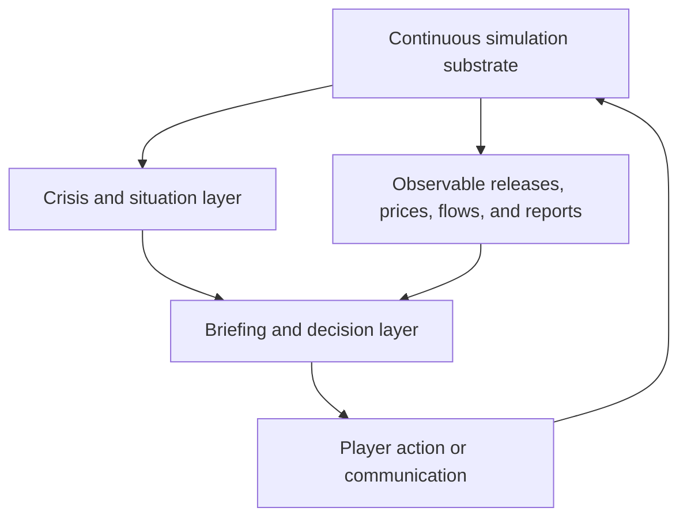
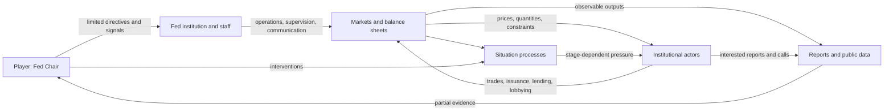

# Research: Comparative simulation-game precedents

## Research Question

How do rich economic and political simulations make complex causal systems playable, especially where the player has limited authority, delayed feedback, autonomous actors, incomplete information, and several non-aligned measures of success? What does each precedent cover or leave uncovered relative to the Federal Reserve Chair concept in `task.md` and the substrate findings in `02-research-clowder-simulation-substrate.md`?

## Scope and Sources

This pass examines seven games or game families:

1. *Victoria 3* — endogenous population, production, market, and political feedback.
2. *Stellaris* — the Situations framework for legible crises unfolding over time.
3. *Democracy 4* — an explicit causal graph, political capital, and population opinion simulation.
4. *Terra Invicta* — indirect control through institutional agents under adversarial uncertainty.
5. *Suzerain* — briefing-room presentation, authored political actors, hidden state, and term-based legacy.
6. *Frostpunk 2* — scarcity, factional legitimacy, negotiated authority, and crisis escalation.
7. *Capitalism Lab* — autonomous firms, macroeconomic cycles, inflation, and diagnostic views.

Primary developer descriptions and developer diaries were preferred. The Paradox community wikis and Hooded Horse wiki rejected non-browser requests, so claims that depend on those pages are limited to indexed excerpts or corroborated by official store/developer material. The detailed *Stellaris* Situations diary was recovered from Steam's official news API.

## Summary

No existing game combines the complete shape of the proposed Federal Reserve Chair simulator. The closest precedents divide cleanly by layer:

| Needed layer | Strongest precedent | What it demonstrates |
|---|---|---|
| Endogenous economy | *Victoria 3* | Economic positions produce political power rather than merely modifying approval |
| Legible crisis process | *Stellaris* Situations | A continuous process can have progress, stages, approaches, events, and multiple resolutions |
| Dense causal interface | *Democracy 4* | The causal graph itself can be the principal play surface |
| Institutional agency | *Terra Invicta* | The player can act through people and organizations without directly owning the state |
| Office drama and partial reports | *Suzerain* | Advisors, documents, news, and conversations can carry a term-long state machine |
| Legitimacy under emergency | *Frostpunk 2* | Material survival and political consent can be separate constraints on the same decision |
| Market response and diagnostics | *Capitalism Lab* | Autonomous firms and consumers can transmit macro conditions into local decisions and back again |

The Federal Reserve concept occupies the unfilled intersection. It needs *Victoria 3*'s endogenous causality without the player's god's-eye command of a nation; *Stellaris*' crisis legibility without exposing a single truthful progress bar for every latent condition; *Democracy 4*'s information density without reducing monetary policy to static arrows; *Terra Invicta*'s indirect institutional control without its map-conquest objective; and *Suzerain*'s office-bound drama without making the economy primarily a scripted consequence table.

The comparative evidence also strengthens the three-layer distinction already implicit in the prior research:



Rich systemic games usually excel at one or two of these layers. The proposed game depends on all three remaining distinct. If the briefing directly authors economic outcomes, it becomes *Suzerain*. If the player sees and operates the whole substrate, it becomes *Victoria 3* or *Democracy 4*. If crises are only thresholds in the substrate, they become difficult to follow; *Stellaris* created Situations specifically to solve that problem.

## Comparative Matrix

Ratings describe correspondence to this concept, not overall game quality.

| Game | Endogenous economy | Autonomous actors | Partial observability | Delayed crises | Limited authority | Narrative integration | Multi-axis legacy |
|---|---:|---:|---:|---:|---:|---:|---:|
| *Victoria 3* | High | Medium | Low | Medium | Low | Medium | Medium |
| *Stellaris* | Medium | Medium | Low | High | Low | High | Low |
| *Democracy 4* | Medium | Low | Low | Medium | Medium | Medium | Medium |
| *Terra Invicta* | Medium | High | High | Medium | High | Medium | Medium |
| *Suzerain* | Low-Medium | High, authored | High | High, authored | High | Very high | High |
| *Frostpunk 2* | Medium | Medium-High | Low-Medium | High | High | High | Medium |
| *Capitalism Lab* | High at firm/consumer level | High | Low | Medium | Varies by mode | Low | Low |

Two different meanings of "autonomous actor" matter here. *Victoria 3*, *Terra Invicta*, and *Capitalism Lab* simulate actors whose actions change the system continuously. *Suzerain* has strongly characterized actors with persistent agendas, but their autonomy is expressed through authored branches rather than an open action-selection simulation. Both produce believable opposition; they impose different content and testing costs.

## 1. Victoria 3: economic structure creates political structure

### Simulation shape

Paradox calls *Victoria 3* a "society builder grand strategy game." Its central ontology is the Pop: population cohorts work in buildings, earn wages, buy goods, own profitable enterprises, accumulate wealth, and contribute political strength to Interest Groups. The economy is not a separate production mini-game feeding a politics score. Employment, ownership, wages, consumption, wealth, and law determine who has political power.

The official retrospective gives several concrete feedback chains:

- Manufacturing centralizes employment, widens wealth gaps, and generates domestic demand.
- Replacing subsistence farms with modern agriculture can improve market output while reducing some workers' living standards.
- Owners may reinvest profits or spend them on luxury goods, changing demand.
- Wealth and laws determine Pop political strength, which empowers Interest Groups.
- Education institutions require administrative capacity and, in turn, create the qualifications advanced industries need.
- Imports satisfy domestic demand but enrich and create dependence on the exporter.
- Exports benefit owners while raising costs for domestic consumers.

This is the strongest precedent for the concept brief's "no clean causal arrows" rule (`task.md:33`). The important design unit is not a policy-to-stat modifier. It is a stock or flow that changes several actors' feasible choices and political positions.

### Actor legibility

*Victoria 3* aggregates individuals into Pops and Pops into Interest Groups. Paradox's retrospective describes a failed earlier design in which Interest Groups appeared, disappeared, changed beliefs, and opined on nearly everything. Players could not form a stable model of national politics or the outside limits of an action. The shipped structure uses eight stable Interest Group templates, issue-specific Political Movements, and leaders that modify group ideology.

That history is directly relevant to institutional agents. Agent dynamism can make the simulation less believable if identities and motives move too freely for the player to learn. Stable institutional mandates with changing leadership, incentives, and beliefs are more legible than institutions whose fundamental utility functions mutate in response to events.

### Control and information

The player is the "spirit of the nation" and can inspect unusually complete economic data. That supports systemic mastery but differs sharply from the Fed concept. The Chair does not own banks, Treasury issuance, dealer balance sheets, Congress, or foreign reserve managers. *Victoria 3* is therefore a model for causal propagation and actor aggregation, not for authority or partial observability.

### Most relevant precedent

The most important transferable pattern is:

```text
economic position -> incentives -> institutional alignment -> political power
```

For this concept, the analogue is not Pops joining Interest Groups. It is banks, dealers, funds, foreign reserve managers, Treasury officials, legislators, and households changing behavior and political pressure because policy changes their balance sheets, funding costs, risks, and constituencies.

## 2. Stellaris: Situations turn a threshold into a process

### Why the system exists

The *Stellaris* team introduced Situations after identifying a gap between stories about things that had happened and stories about things happening now. Existing event chains were difficult to follow, their connections were unclear, and bespoke implementations were time-consuming and bug-prone. Situations were designed both as a player-facing current-affairs interface and as a reusable content structure.

That is almost exactly the missing abstraction identified in `02-research-clowder-simulation-substrate.md`: clowder has feedback loops and one-off narrative emissions, but no first-class loop, delay, or crisis object.

### Situation anatomy

The official developer diary defines a Situation as:

1. A start condition, optionally scoped to an empire, planet, system, or other target.
2. A progress value that moves up or down each month.
3. A displayed breakdown of factors contributing to monthly movement.
4. Stages that can apply effects and fire connected events.
5. Random events that can occur on monthly ticks.
6. Player-selectable Approaches with continuing costs and effects.
7. Resolution when either end of the progress range is reached.

Some situations move linearly. Others begin in the middle and can resolve at either end. This creates an explicit grammar for a crisis that is neither a binary flag nor an arbitrary chain of popups.

### Deficit rework as a financial-crisis precedent

The diary's resource-deficit example is unusually close to a financial-plumbing crisis. Before Situations, a deficit was a switch: the full penalty appeared when stock hit zero with negative income and disappeared after one positive month. The rework starts a deficit Situation at 25%, changes escalation speed according to the shortfall relative to income, lets stockpiles or positive flows reduce it, increases penalties by stage, offers costly mitigating approaches, warns at 75%, and resolves full escalation as bankruptcy.

Bankruptcy liquidates assets and imposes long penalties, but also grants enough resources to survive and clears concurrent deficits. The explicit purpose is to prevent a shortage in one resource causing penalties that create shortages in others until the AI cannot recover.

This demonstrates two distinct crisis properties:

- **Escalation is path-dependent.** A short deficit and a persistent deficit are not equivalent states.
- **Failure can restructure the system rather than merely end the run.** The player survives, but in a damaged and altered regime.

### Limit relative to the Fed concept

The Situation progress bar is truthful. It tells the player how severe the crisis is, how fast it is moving, and which factors drive the next tick. That is appropriate for many strategy games but conflicts with the concept's latent variables. A Fed simulator can use the situation grammar internally while exposing only contested staff estimates, probability bands, stage-specific symptoms, and source-attributed interpretations.

## 3. Democracy 4: the causal graph is the play surface

### Simulation and interface

*Democracy 4* presents policies, situations, values, and voter groups as a dense network of influences. Its developer explicitly describes the main interface as a "giant super-complex and uber-connected infographic" and argues that information overload is part of the intended experience: running a country should exceed the player's available attention and force prioritization.

The official game description says its population model tracks the opinions, beliefs, thoughts, and biases of thousands of virtual citizens. The developer material adds several important details:

- Citizens can belong to several voter groups with conflicting interests.
- Political capital constrains policy changes.
- Ministers and donors make political demands.
- Emergency powers increase political capital during crises.
- Media reports translate simulated conditions into human stories.
- Events change simulation state, while media reports are state-dependent interpretation with no mechanical effect.
- Simulation data is stored in editable text files, making causal claims inspectable and moddable.

### Monetary policy precedent and warning

The developer's monetary-policy post documents the addition of quantitative easing, helicopter money, inflation, hyperinflation, currency effects, and distributional effects. It also states the central modeling problem plainly: a closed game model cannot keep adding interest rates, money supply, bonds, and every related variable without collapsing under its own complexity. The shipped abstraction therefore bends real mechanisms into a manageable set of causal links.

This is useful precedent for scope, but not a sufficient monetary-policy model for the proposed game. In *Democracy 4*, QE and helicopter money are national policy nodes with immediate GDP and constituency effects plus inflation risk. The Fed concept is specifically about the transmission mechanism, market plumbing, institutional incentives, and uncertainty that this abstraction omits.

### Narrative generated from state

The media-report system is a strong low-cost pattern. Reports are text templates gated by current policy ranges and simulated conditions. They do not change state; they express consequences already present in state. This keeps simulation causality separate from prose while giving aggregate numbers emotional and political meaning.

For a Federal Reserve setting, the direct analogue is not human-interest news alone. It includes desk commentary, dealer color, bank supervision reports, congressional statements, financial press, and calls from counterparties. Each can be generated from conditions without becoming the cause of those conditions. Communications issued by the player are the important exception: those must re-enter the simulation as signals.

### Limit relative to the Fed concept

*Democracy 4* maximizes causal transparency. The player can navigate the arrows and inspect why values move. The concept requires a split between a hidden canonical graph and an incomplete player model inferred from indicators. The reference is strongest for information density, policy costs, overlapping constituencies, and state-dependent reports; it is weakest for uncertainty.

## 4. Terra Invicta: indirect control through institutional agents

### Player role

*Terra Invicta* makes the player the leader of a transnational ideological faction rather than a country. Nations remain contested systems. The player acquires influence through control points representing military, economic, and political leadership, then acts through a council of politicians, scientists, and operatives.

This is the closest precedent for the concept's statement that institutions and people are agents while the player controls only one office. The player does not paint the map directly. Councilors take missions against regions, nations, organizations, spacecraft, and other councilors; their capabilities depend on experience and attached organizations such as intelligence agencies and corporations.

### Adversarial world model

Seven factions pursue incompatible interpretations of the same crisis. The shared global research system creates a public-goods problem: factions can invest in private projects or contribute to global research and thereby influence its direction. Public opinion is modeled on multiple axes, so two factions can align on one dimension while diverging on another. Evidence that changes what seems feasible can move supporters between positions.

This supplies three useful institutional patterns:

- Actors have goals, capabilities, and instruments that are distinct from one another.
- Control is partial, divisible, and contestable rather than binary ownership.
- Beliefs about what is possible can change alignment even when underlying values do not.

### Information and action scarcity

Councilors operate on a mission cadence. Choosing one operation means not assigning that actor elsewhere. Detection is conditional rather than automatic: the official wiki's indexed excerpt states that after a mission completes, each other faction checks whether it detected the councilor, with detection impossible in some locations absent a local observer.

This is a more concrete attention economy than a generic action-point pool. Scarcity attaches to institutional capacity and people: the same staff cannot simultaneously negotiate, investigate, supervise, and intervene.

### Limit relative to the Fed concept

*Terra Invicta* ultimately converts indirect influence into territorial and material control, and much of its uncertainty is covert-action fog. The Federal Reserve concept needs a different uncertainty: public data can be accurate while meaning remains contested, balance-sheet positions can be reported with delay, and counterparties can strategically frame information without behaving like hidden map units.

## 5. Suzerain: the office, the document, and the term

### Presentation model

*Suzerain* combines a branching political narrative with simulation state presented through conversations, policies, situations, reports, news, and locations. Its official material emphasizes a cabinet whose members have their own ideals and agendas, decisions across security, economy, welfare, and diplomacy, and a first-term boundary ending in a legacy rather than a sandbox score.

This is the closest precedent for the concept's morning briefings, incoming calls, beige memos, and office-bound authority. The world reaches the player as material prepared or spoken by interested parties. The interface can therefore make source, tone, omission, and institutional jurisdiction part of the mechanic.

### Authored actors and hidden consequences

More than fifty named characters carry persistent personalities, ideologies, ambitions, and relationships. The resulting opposition is highly legible because it is authored: the player learns what a minister values, whom they represent, and what they may do if ignored. Decisions can affect hidden state and unlock outcomes much later in the term.

This is a different solution from utility-scored autonomous institutions. It buys specificity and dramatic coherence at the cost of combinatorial content authoring. The economy can feel opaque and consequential, but much of that opacity comes from hidden branch variables rather than a continuously clearing market.

### End structure

The game's nine major endings and more than twenty-five sub-endings make the term itself the unit of assessment. This strongly matches `task.md:80-89`: the player should be judged by the system left behind, not only by whether a crisis meter hit zero.

### Limit relative to the Fed concept

Using *Suzerain* as the economic substrate would make outcomes feel prewritten once players learned the branches. Its strongest contribution is the delivery layer: interested advisors, constrained choices, institutional relationships, state-dependent documents, and legacy. The canonical economy still needs to exist independently beneath that authored surface.

## 6. Frostpunk 2: survival policy must pass through political consent

### Coupled material and political systems

*Frostpunk 2* combines a supply-and-demand survival economy with factions that have ideologies, proposals, demands, and power in a Council Hall. The player is a Steward, not an absolute owner of society. Resource allocation, research, and law therefore operate under both physical scarcity and factional consent.

The official description names the core combination directly: the city has expanding material needs while factional power rises; citizens demand a voice; and each faction pursues its own ideology and power. Heat allocation is an explicit triage instrument: the player chooses which districts receive scarce warmth.

### Correspondence to institutional legitimacy

The game separates whether a policy keeps the city functioning from whether political groups accept the regime using it. That is the closest analogue among the surveyed games to "save the financial system and lose legitimacy doing it" (`task.md:79`). Emergency action can be operationally effective and institutionally corrosive at the same time.

### Limit relative to the Fed concept

The political blocs and resource chains are intentionally coarse and dramatic. They produce clear distributive conflict, not the contested interpretation of subtle financial indicators. The relevant precedent is the coexistence of material and legitimacy constraints, not the underlying economics.

## 7. Capitalism Lab: macro conditions reach firms and households

### Simulation shape

*Capitalism Lab* models firms competing across production, logistics, retail, finance, property, and consumer demand. Its macroeconomic layer tracks GDP growth, unemployment, real wages, inflation, loan interest rates, and the consumer price index over thirty-year or lifetime graphs.

The developer describes a closed boom-bust sequence:

```text
growth and employment
  -> wages, confidence, and spending
  -> stock/property prices and inflation
  -> central-bank rate increases and tighter money
  -> falling demand and recession
  -> eventual recovery
```

Consumer demand changes with employment and real wages; rising income changes the product mix consumers can afford. Business investment contributes to GDP, creates jobs, raises wages and spending, and can therefore add inflation. Inflation reaches product prices, land, wages, operating costs, loans, and cash purchasing power rather than existing as one isolated penalty.

### Autonomous actors and delegated control

The game can run up to fifty AI competitors with differentiated strategies, including capital-constrained real-estate developers. It also allows AI delegation inside the player's organization: a CEO office can automatically adjust prices and advertising with inflation. This illustrates two scales of agency that the Federal Reserve concept may need to keep separate:

- External institutions choose strategies in competition with the player and one another.
- Internal staff execute standing policies and routines delegated by the player.

### Diagnostic presentation

The factory Analysis Mode consolidates inputs, freight, quality, inventory, and supply-demand status on one screen while retaining the detailed operational view. This is a useful precedent for layered inspection: a briefing can summarize a market or institution while allowing a deeper balance-sheet or flow view when the player spends attention.

### Central-bank inversion

Most importantly, monetary policy is autonomous in *Capitalism Lab*. The central bank changes rates and money supply in response to inflation; even in Government Mode, the player controls fiscal policy but not monetary policy. This makes the game a precedent for how banks and firms react to a central bank, not for playing the central bank itself.

The macro cycle is also explicitly stylized and deterministic. It is useful as a minimal closed loop and as evidence that inflation should propagate through nominal contracts and balance sheets. It is not sufficient for a game centered on expectations, financial plumbing, institutional credibility, or regime change.

## Cross-Game Findings

### 1. Complexity becomes playable when each layer has a different job

The surveyed games repeatedly separate the world model from the device that makes it readable:

- *Victoria 3* has a systemic economy and overlays it with Interest Groups, tooltips, and lenses.
- *Stellaris* wraps continuous conditions in Situation objects.
- *Democracy 4* turns model links into a navigable graph and state-dependent reports.
- *Suzerain* turns state into documents and conversations.
- *Capitalism Lab* pairs local operational screens with historical diagnostic graphs.

The Federal Reserve concept's morning briefing should therefore not be the simulation itself. It is a lossy, source-attributed projection of simulation state. Crisis objects should organize that state over time. Neither should replace the underlying stocks, flows, beliefs, and agent decisions.

### 2. Partial observability is the clearest point of differentiation

Most economic strategy games reveal canonical state because systemic mastery is their reward. *Terra Invicta* hides enemy operations, and *Suzerain* hides branch state and other actors' intentions, but neither centers macroeconomic inference. The proposed game does.

That suggests three simultaneous state representations:

| Representation | Holder | Example |
|---|---|---|
| Canonical state | Simulation only | Actual dealer capacity or foreign reserve appetite |
| Institutional belief | Each simulated actor | A bank's probability of an emergency facility expansion |
| Player estimate | Staff products and player memory | A confidence band inferred from auctions, calls, and spreads |

Clowder already has the first two structurally through world state and per-agent beliefs. None of the surveyed games provides a complete precedent for the third as the main play surface.

### 3. Stable identities matter more than maximal agent dynamism

Paradox's abandoned highly dynamic Interest Groups were confusing because players could not learn the country's political structure. *Suzerain* gets dramatic force from persistent characters. *Terra Invicta* gets strategic legibility from stable faction ideologies and variable methods.

Institutional agents therefore need stable constitutional identities and changing operational state. Treasury should remain Treasury; a primary dealer should remain a profit-seeking intermediary; a regional Fed president should retain an identifiable reaction function. Leaders, balance sheets, beliefs, risk tolerance, and coalitions can change without making the actor's core identity unreadable.

### 4. Attention costs are stronger when attached to capacity

The games use several scarcity models:

| Game | Scarcity device |
|---|---|
| *Democracy 4* | Political capital prices policy changes |
| *Terra Invicta* | A finite council assigns one mission per actor per cycle |
| *Stellaris* | Approaches impose continuing resource costs |
| *Frostpunk 2* | Laws require political support and negotiated concessions |
| *Suzerain* | The authored agenda limits which matters reach the player and when |

The concept brief's two consequential actions per week is closest to *Terra Invicta*, but the institutional setting supports several currencies rather than one generic pool: Chair attention, staff capacity, operational readiness, legal authority, political tolerance, and balance-sheet capacity. An action can consume one while preserving another.

### 5. Crises need gradients, stages, and recovery paths

The *Stellaris* deficit rework is the clearest evidence. Binary flags produce abrupt, gameable behavior. Staged crises allow early symptoms, compounding effects, costly mitigation, and altered post-crisis regimes. They also make feedback comprehensible without flattening it into a one-turn event.

For the Fed concept, a Treasury-market dysfunction process could move through latent phases such as reduced depth, dealer constraint, forced deleveraging, failed price discovery, and official backstop. The player need not see these labels as ground truth. The simulation still benefits from stages because actors can change behavior, reports can change tone, and interventions can have phase-specific effects.

### 6. Narrative is strongest when it interprets state rather than substitutes for it

*Democracy 4* explicitly separates mechanical events from non-mechanical media reports. *Suzerain* demonstrates the dramatic power of interested speakers. *Stellaris* connects events to stages so the player understands that they belong to one process.

Together they define a useful division:

- **Reports** interpret existing state and may be biased or incomplete.
- **Events** change state because something happened in the modeled world.
- **Signals** are actions by an actor intended to change another actor's beliefs.
- **Decisions** commit resources, authority, or language and alter future possibilities.

The prior clowder research found reports and events, plus one small signalling primitive, but no general utterance layer. The comparative research confirms that this distinction should remain explicit rather than treating every piece of prose as an event.

### 7. Failure should change the regime, not always stop the game

Several precedents support post-failure continuation:

- *Stellaris* bankruptcy liquidates assets, clears linked deficits, and leaves long penalties.
- *Victoria 3* revolutions alter the polity rather than serving only as a score screen.
- *Suzerain* branches into exile, removal, reelection, or different legacies.
- *Frostpunk 2* makes loss of political consent distinct from material collapse.

For a term-based Fed game, losing control of a crisis can plausibly continue as a different regime: Treasury intervention, emergency legislation, forced coordination, loss of independence, a new operating framework, or replacement of the Chair. Continuation preserves the concept's emphasis on what system the player leaves behind.

## What Each Game Does Not Solve

| Missing requirement | Why the precedents do not solve it |
|---|---|
| Markets parse constrained central-bank language | None models compositional policy language as a signal interpreted by heterogeneous financial actors |
| Data can be accurate while its meaning is uncertain | Most hide facts or reveal canonical state; few model rival inferences from common public releases |
| The player controls a narrow but powerful institution | Games usually grant nation-wide control, faction-wide control, or authored presidential authority |
| Financial plumbing has balance-sheet constraints | *Victoria 3* and *Capitalism Lab* model goods/firms more deeply than collateral, reserves, dealer capacity, or funding liquidity |
| Credibility is actor-specific and path-dependent | Reputation is usually a global score rather than beliefs about promises, reaction functions, and backstops held separately by each actor |
| Intervention creates moral hazard as a belief update | Existing games commonly model direct costs and modifiers, not changed expectations of future rescue that alter leverage choices now |

## Design Risks Exposed by the Comparisons

1. **God's-eye leakage.** A truthful crisis meter or complete causal tooltip would defeat the concept's inference game.
2. **Policy-node reduction.** Modeling QE, repo access, supervision, or communication as fixed arrows would reproduce *Democracy 4*'s necessary abstraction at precisely the point this game intends to examine.
3. **Script capture.** Relying on authored consequence branches would create strong first-run drama but weak systemic replay once players learn the routes.
4. **Unstable institutions.** Maximally dynamic agent motives would make the political economy impossible to learn, repeating *Victoria 3*'s discarded Interest Group design.
5. **Single-resource attention.** One generic action-point currency would hide the difference between staff capacity, legal authority, market capacity, and political tolerance.
6. **Death spirals without restructuring.** Financial contagion is thematically appropriate, but unrecoverable cascades need resolution mechanics that change the regime rather than merely trap the player.
7. **Narrative as decoration.** Reports that are not conditioned on live state become flavor text; reports that directly author outcomes bypass the simulation.
8. **One aggregate score.** The surveyed games often collapse performance into survival, reelection, power, or prosperity. The five non-aligned institutional axes in `task.md` are more distinctive when they remain separate.

## Resulting Model Boundary

The comparative set clarifies the likely boundary of the simulation without prescribing implementation technology:



The economy must be endogenous enough that institutional actions produce prices and constraints, as in *Victoria 3* and *Capitalism Lab*. Institutions must choose and act without direct player control, as in *Terra Invicta*. Ongoing breakdowns need a reusable process grammar, as in *Stellaris*. The player must encounter the system through reports, calls, and documents, as in *Suzerain* and *Democracy 4*. Political consent and operational success must remain separable, as in *Frostpunk 2*.

## Open Questions for the Next Research Pass

1. What minimum set of sectoral balance sheets can generate Treasury-market, bank-solvency, funding-liquidity, inflation, employment, exchange-rate, and fiscal-dominance feedback without becoming a general-equilibrium model?
2. Which institutional actors need fully simulated beliefs and decisions, and which can be represented as cohorts, response functions, or exogenous processes?
3. Which observables are public in real time, delayed, revised, survey-based, privately reported, or strategically framed?
4. How should a communication act decompose into semantic commitments, ambiguity, audience-specific interpretation, and later credibility updates?
5. What constitutes a crisis Situation internally, and which parts of its state should staff reports estimate rather than reveal?
6. How can the simulation distinguish liquidity support, solvency support, market-functioning support, and fiscal accommodation in both immediate effects and future expectations?
7. Which historical episodes provide bounded validation scenarios for the substrate: September 2019 repo stress, March 2020 Treasury dysfunction, 2023 bank failures, an inflation shock, and a failed long-duration auction cycle?

## Sources

- Paradox Interactive, [*Victoria 3* Dev Diary #57: The Journey So Far](https://www.paradoxinteractive.com/games/victoria-3/news/dev-diary-57-the-journey-so-far), 2022-08-31.
- Paradox Development Studio, [*Victoria 3* official Steam description](https://store.steampowered.com/app/529340/Victoria_3/).
- Paradox Development Studio, [*Stellaris* Dev Diary #245: We Have a Situation](https://store.steampowered.com/news/app/281990/view/3093415602292168352), 2022-03-10; full text recovered through the official Steam News API item `5631194088557847733`.
- Positech Games, [*Democracy 4* official page](https://www.positech.co.uk/democracy4/).
- Positech Games, [*Democracy 4* official Steam description](https://store.steampowered.com/app/1410710/Democracy_4/).
- Cliff Harris, [*Democracy 4*'s overcomplexity is by design](https://www.positech.co.uk/cliffsblog/2023/02/19/democracy-4s-overcomplexity-is-by-design/), 2023-02-19.
- Cliff Harris, [*Democracy 4*: A better economic simulation](https://www.positech.co.uk/cliffsblog/2020/04/06/democracy-4-a-better-economic-simulation/), 2020-04-06.
- Cliff Harris, [Consequences in *Democracy 4*](https://www.positech.co.uk/cliffsblog/2020/04/11/consequences-in-democracy-4/), 2020-04-11.
- Pavonis Interactive, [*Terra Invicta* official Steam description](https://store.steampowered.com/app/1176470/Terra_Invicta/).
- Hooded Horse Official Wiki indexed pages: [Factions](https://wiki.hoodedhorse.com/Terra_Invicta/Factions), [Councilors](https://wiki.hoodedhorse.com/Terra_Invicta/Councilors), and [Nations](https://wiki.hoodedhorse.com/Terra_Invicta/Nations).
- Torpor Games, [*Suzerain* official site](https://www.suzeraingame.com/) and [official Steam description](https://store.steampowered.com/app/1207650/Suzerain/).
- 11 bit studios, [*Frostpunk 2* official page](https://11bitstudios.com/games/frostpunk-2/) and [official Steam description](https://store.steampowered.com/app/1601580/Frostpunk_2/).
- Enlight Software, [*Capitalism Lab*: Enhanced Macroeconomic Simulation](https://www.capitalismlab.com/new-features/enhanced-macroeconomic-simulation/).
- Enlight Software, [*Capitalism Lab*: Inflation Simulation](https://www.capitalismlab.com/new-features/inflation/).
- Enlight Software, [*Capitalism Lab*: Improved AI](https://www.capitalismlab.com/improvements/improved-ai/) and [Analysis Mode for Factories](https://www.capitalismlab.com/analysis-mode-factories/).
