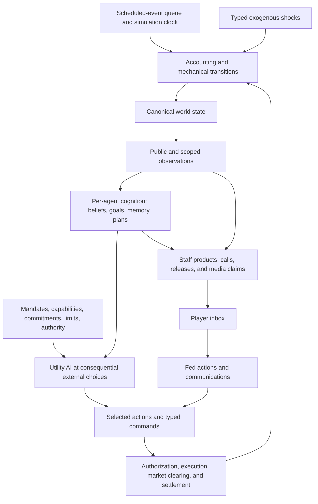
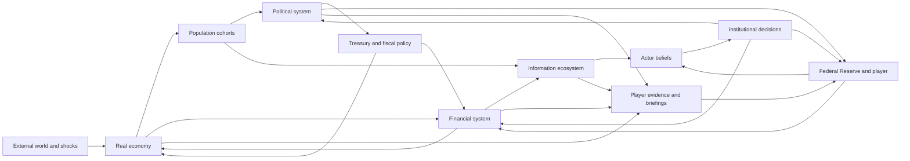
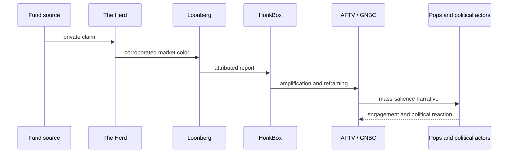

# Whole-Game Architecture and Minimum Simulation Kernel

### Summary of change request

Define the smallest simulation kernel that can deliver Reservist's central experience: the player receives incomplete evidence, makes bounded Federal Reserve commitments, and watches heterogeneous institutions adapt through accounting, markets, beliefs, and delayed effects. The design must make each actor's action inspectable without exposing a globally authoritative causal explanation. This pass also closes the remaining cross-document seams and establishes a cut line so implementation is no longer gated by expansion of the world model.

This discussion first narrows five coupled kernel decisions: market abstraction, agent resolution, belief representation, event cadence, and institutional capacity. It then sketches the larger game around that kernel: real-economy transmission, population experience, politics, media, communication, Federal Reserve governance, crises, scenarios, player information, progression, persistence, content authoring, and validation. The design is broad enough to define ownership and interfaces without pretending every equation or piece of content is already known.

`05-design-discussion-representation-bible.md` is authoritative for representation ontology. Its twenty-eight kinds, amended publication rule, amended instrument-family contract, and product/commodity-family contract are incorporated here. `06-design-discussion-representation-catalog.md` owns the roster, and `07-design-discussion-burrow-composition-probe.md` records the first completed composition probe. This document remains authoritative for causal invariants and committed interfaces: ownership-enforced mutation, accounting, observations, cognition, authorization, execution, commitments, transmission, persistence, deterministic ordering, and witnesses. Where representation language here conflicts with the Bible, the Bible governs without weakening those causal contracts.

Reservist's recognizable player loop is now institutional rather than event-card driven. The player manages an epistemic institution through a recurring calendar, staff organization, information-routing system, and portfolio of commitments while a continuous material simulation produces overlapping situations. Periodic institutional work provides moment-to-moment play; persistent systems, characters, plans, commitments, and relationships produce emergent campaigns. This is financial grand strategy.

The architecture questions are closed. The current phase is proof, initialization,
and tuning. The representation vocabulary is frozen unless the designated Treasury
basis-trade probe demonstrates a genuinely new owner, authority, information
boundary, persistence requirement, transaction boundary, or mutation class. Work
outside that proof obligation now defaults to implementation, content, calibration,
or deferral rather than further ontology growth.

### Current State

- Reservist has a detailed product spine, a structurally valid representation catalog, and a catalog test suite, but no application or simulation runtime. Catalog validity proves authored structural consistency, not scenario readiness.
- The causal architecture distinguishes canonical state, scoped observations and evidence delivery, beliefs, claims, authority, action attempts, persistent commitments, witnessed execution, accounting, and transmission. Burrow Bank has a completed prose composition trace. Treasury basis and Amazon replacement have structural catalog rows, but their generic member coverage is not executable acceptance; all three remain blocked on runtime initialization.
- Treasury duration and secured funding remain the first dependency-closed headless slice. A separate fixed-tape Treasury-stress day is the first player-facing prototype. `profile.early_2006.bernankey` remains a planning index, not a scenario representation manifest.
- World-profile planning, catalog eligibility, composition probes, and scenario resolution are orthogonal. A future manifest must select identity clades, owner classes, fidelity tiers, residual mappings, protected population dimensions, permitted cell transitions, boundary-interface versions, adapter status, initialization reconciliation, fallbacks, and a replay hash.
- External resolution is channel-specific. Overlapping providers may cover external demand, import supply, U.S. duration demand, dollar funding/FX, energy supply, foreign financial stress, and freight/shipping; each channel has its own residual. Physical `Region` entries remain overlapping non-owning scopes.
- Beliefs use typed estimates with uncertainty and source ledgers as a working mechanism; exact update mathematics remain deliberately unsettled.
- Real reservations belong to typed commitments and resources. Leash is a derived, rounded player-facing estimate of additional institutional exposure, not a conserved stock, transaction account, or substitute for legal, calendar, staff, operational, political, or balance-sheet constraints.

The current concept is a complete loop in prose but not yet a bounded executable model:

```text
latent state -> evidence -> beliefs -> decisions -> commitments
     ^                                           |
     |                                           v
delayed effects <- accounting and market clearing
```

### Desired End State

- A deterministic, headless simulation runs from a seed and an initial-condition bundle.
- A dependency-ordered task graph coordinates fixed-cadence and event-triggered systems over canonical snapshots; parallel calculation may vary in timing, but deterministic commits may not vary in order or result.
- Every mutation of canonical material or institutional state enters through an accounting transaction, market-clearing result, witnessed action execution, legal transition, mechanical process, or explicitly typed shock. Epistemic and cognitive state changes only through typed observation, evidence integration, deliberation, decision, and communication transitions.
- Simulated people act from private beliefs and constraints; institutional decisions arise from participant cognition, staff estimates, operative assumptions, authorized claims, and procedure rather than direct access to canonical world state.
- The leading first-slice candidate jointly prices Treasury duration and secured overnight funding, then transmits those prices into bank funding and aggregate credit conditions; architecture probes must test its boundaries before they become implementation commitments.
- The player acts through an elastic institutional calendar while the world advances continuously through scheduled releases, settlements, reviews, expirations, and crisis interrupts. FOMC windows are major governance periods within that calendar, not the only player turn.
- The player sees source-attributed evidence and staff estimates, never latent state or a truthful crisis progress bar.
- Every consequential attributable action records its considered alternatives, utility considerations, binding constraints, beliefs and goals used, authorization path, action result, and resulting commitments.
- Capacity constraints remain distinguishable: calendar attention, operational bandwidth, legal eligibility, political tolerance, and credibility exposure do not become interchangeable points.
- Historical mechanism scenarios can determine whether a run produced the expected class of behavior without requiring exact historical prices or outcomes.
- Every major aggregate is explainable through versioned derived caches, source ledgers, and task traces without making those caches canonical state or player-visible truth. A witnessed, authorized `PublishedReference` publication may bind only its declared third parties under its revision policy; its calculation cache may not.

### What we're not doing

- Building a complete macroeconomic general-equilibrium model.
- Simulating every Treasury security, bank, household, company, country, commodity, or shipping route.
- Implementing housing, labor, FX, commodities, fiscal politics, or mass media as independently deep games in the first kernel.
- Encoding historical episodes, crisis names, or policy-to-price consequence tables in the causal engine.
- Letting an LLM choose actions, update beliefs, clear markets, or determine outcomes.
- Giving the player an economy-health score, canonical causal graph, or omniscient actor debugger during play.
- Designing an art production pipeline, asset-generation workflow, or final visual component library in this phase.
- Selecting exact equations, final response curves, utility-AI weights, cohort counts, complete rosters, authority parameters, Leash conversion formulas, action catalogs, UI layouts, or narrative content before executable mechanisms can test them.
- Treating every module as equally mature or designing the whole game to uniform detail before implementation.
- Reopening frozen contracts because a deferred module or content family has not yet been populated.

### Architecture Development Strategy

#### Architectural discovery versus mechanism implementation

Architectural discovery continues where a later finding could invalidate foundational contracts or force bespoke mutation paths. Mechanism implementation begins only after those contracts are stable enough to be tested in executable form.

Design now:

- Canonical kinds of state and who owns each stock, condition, action, and decision.
- Accounting, conservation, and settlement boundaries.
- Commands, authorization, action results, domain events, and accounting witnesses.
- Information-access boundaries between canonical state, private observations, beliefs, reports, and player knowledge.
- Authority graphs, approval and veto paths, delegation, execution ownership, and failure stages.
- Persistent commitments, reservations, contingent obligations, expiration, breach, and settlement.
- Composition of named people, institutions, Pops, firms, sectors, sovereign systems, and aggregates.
- Module interfaces, aggregation seams, boundary adapters, and replacement contracts.
- Save-state completeness, deterministic event ordering, RNG persistence, and replay identity.
- Content-authoring limits and the closed vocabulary through which data may affect causal state.
- Promotion criteria for actors or systems that need richer representation.

Learn through executable mechanisms later:

- Exact equations, utility functions, response curves, and market-solver details.
- Numerical calibration, final utility-AI weights, and behavioral noise.
- Exact cohort counts, complete historical rosters, and parameters for every institution or sovereign.
- Final Leash conversion formulas and the complete action catalog.
- Final interface layout, narrative coverage, and content volume.

The line is whether an unanswered question can change what kinds of objects exist, who may mutate them, what must persist, or how modules communicate. If it can, it remains architecture work. If it selects a coefficient, functional form, population count, or content instance behind a stable contract, it belongs to mechanism implementation and calibration.

#### Design maturity labels

The document uses maturity labels selectively to distinguish representation from resolution:

| Label | Meaning |
|---|---|
| **Invariant** | Required by the game's premise; every implementation and content layer must preserve it. |
| **Committed interface** | Dependents may rely on this contract even if its internal implementation changes. |
| **Working mechanism** | A plausible implementation intended to be exercised, falsified, and revised. |
| **Boundary adapter** | A deliberately temporary implementation of a stable interface for an omitted module. |
| **Open ontology question** | A foundational issue that implementation must not answer accidentally. |
| **Content hypothesis** | A scenario, roster, parameter, or behavioral claim requiring research and playtesting. |

Current examples:

- **Invariant:** canonical state is physically separate from beliefs and player information; agents cannot read private cognition; incidents inject typed initiating conditions rather than authored downstream outcomes; execution requires a witness; no canonical owner accepts arbitrary untyped mutation.
- **Committed interface:** typed observation, evidence, command, authority, commitment, action result, domain event, accounting entry, and transmission contracts described below.
- **Working mechanism:** BDI-inspired cognition, utility AI for consequential external choices, policy portfolios with template-gated coalition options, derived situation views, sparse production links, Pop lenses, and the Leash portfolio model.
- **Boundary adapter:** reduced-form aggregate demand or foreign flows standing in for an omitted endogenous module during a slice.
- **Representation authority:** the Representation Bible owns its twenty-eight representation kinds, identity clades, owner classes, closed fidelity tiers, affiliation families, institution and organization cohorts, population representations, coalition binding subjects, sovereign and federated composition roots, market-mechanism distinctions, instrument-family and product/commodity-family type contracts, legal instruments, facilities, published references, records, public schedules, information distributors, external-process ownership, promotion manifests, approximation classes, and species exclusions. Numeric tolerances, parameters, and content instances remain calibration or content work.
- **Content hypothesis:** promoted sovereign rosters, strategic firms, Pop categories, scenario hazards, and historical calibration bands.

#### Clausewitz-Jomini reference posture

The Victoria 3 1.13.9 clean-room audit is a reference golden for how an expert economic grand-strategy engine separates simulation responsibilities at scale. It is not Reservist's baseline, an implementation plan, or evidence that Victoria's specific ontology and formulas fit a Federal Reserve game.

| Reference lesson | Reservist treatment | Reason |
|---|---|---|
| Dependency-ordered, multi-cadence task graph | Adopt as a working runtime mechanism beneath the scheduled-event queue | Reservist already needs deterministic ordering across accounting, markets, observations, cognition, and reports; explicit dependencies make that order enforceable and inspectable. |
| Canonical object stores plus staged derived caches | Adopt as a committed separation, with version and stale-read checks | Dense financial and institutional queries need acceleration, but player-facing estimates and caches must never become canonical truth. |
| Parallel calculation with deterministic command application | Adopt as a constraint, not an immediate performance requirement | Private result buffers and stable commits preserve replay identity if parallelism is introduced later without forcing premature concurrency. |
| Stable references and delayed object cleanup | Adapt to typed generational references, tombstones, and declared queued-reference fallbacks | Reservist's long-lived commitments, reports, and legal proceedings make dangling references materially dangerous. |
| Large fixed Pop key and aggressive merging | Adapt to the people-first B/E hybrid, protected correlations, flow buckets, and materiality-driven cell keys | Reservist must represent unusual household formations and financial ownership without copying Victoria's culture-profession-state ontology or exploding sparse intersections. |
| Hierarchical needs and rate-limited substitution | Adopt as a working household and firm demand mechanism | This produces shortages and adaptation through stocks and flows while damping implausible instantaneous switching. |
| Broad script layer for effects and lifecycle hooks | Narrow substantially | Reservist may script typed triggers, score terms, templates, clauses, cooldowns, and parameters, but not arbitrary effects, world scans, or causal mutation. |
| Truthful persistent situations and progress tracks | Reject for crises | Reservist's crises remain material attractors with derived situation views and fallible case files, not progress-owning runtime objects. |
| Journal entries and event pulses | Adapt into institutional projects, case files, narrative opportunities, and scheduled reviews | These structures organize attention and history without owning downstream economic consequences. |
| Treaty clauses, relationship state, and temporary crisis alignment | Adapt into agreements, commitments, proposition-bound coalition ledgers, and procedural authority | The compositional layers are useful, but Reservist's institutional and financial coordination differs from interstate war alignment. |
| Mobilization, readiness, casualties, military logistics, and treaty-war sequencing | Reject as a proposed implementation center | The audit's handoff prompt assumes a different Reservist premise. This game centers the Federal Reserve Chair; only economically causal defense demand, geopolitical incidents, veterans, mobilization labor effects, or military finance enter through the ordinary world-resolution rules. |
| Nationally omniscient simulation interface | Reject for player use | Developer traces may inspect canonical state; the Chair receives delayed, scoped, interested institutional products. |

The architecture therefore borrows scale-management techniques while preserving Reservist's distinct premise: one bounded office manages an epistemic institution inside a materially simulated world.

#### Representation Bible authority

`05-design-discussion-representation-bible.md` is the detailed and authoritative Representation Bible. It separates identity clade, canonical ownership, cognition, authority, scenario resolution, and presentation salience. It governs closed fidelity tiers, semantic affiliation families, population and organization cohorts, institutional flattening, operational-coalition binding, sovereign composition roots, market and infrastructure distinctions, instrument-family and product/commodity-family type contracts, hazard and process ownership, pre-run representation manifests, approximation classes, and species exclusions.

This document may name a representation when explaining a causal flow, but it does not independently define that representation's required state, fallback, promotion rule, or ownership class. Those details resolve through the Bible. The causal kernel still requires every canonical stock, condition, authority, obligation, belief, and attributable action to have one declared owner.

Product and commodity families are type-level definitions, not entities or canonical owners. Owner-held natural stocks, inventories, capacity, orders, contracts, and flows reference those families; production recipes, substitution sets, transport requirements, market listings, and household-basket uses compose through the Bible's product/commodity-family contract.

#### Intentionally uneven design resolution

End-state architecture is described at different depths according to proximity and foundational risk:

| Horizon | Required detail now | Deliberately deferred |
|---|---|---|
| **Kernel** | Concrete entities, ownership, mutation contracts, authorization and execution semantics, witnesses, invariants, event order, persistence | Final algorithms, tuning, content breadth |
| **Near-term modules** | Concrete ownership, public interfaces, replacement boundaries, failure surfaces | Internal equations, response curves, actor counts, calibration |
| **Distant modules** | Causal responsibilities, required inputs and outputs, aggregation and replacement boundaries | Detailed internal ontology unless a probe shows it changes a foundational contract |
| **Speculative world** | Scenario probes, candidate subjects and systems, representation-manifest tests, and content hypotheses | Complete rosters, uniform world detail, final content |

This unevenness is deliberate. The purpose is to stop the first kernel from becoming the accidental ceiling of the game, not to finish every module on paper.

### Proposed End State Architecture

The minimum vertical slice centers on one coupled financial circuit rather than several shallow markets:

```text
Treasury issuance and outstanding debt
  -> duration supply by maturity bucket
  -> dealer inventories and intermediation capacity
  -> investor desired holdings
  -> Treasury yield curve
  -> collateral values, haircuts, and repo funding
  -> leveraged-fund positions and bank liquidity
  -> lending conditions and aggregate demand pressure
  -> inflation and employment evidence
  -> expected Fed path and duration demand
```

The architecture keeps canonical state, actor cognition, and player information physically distinct:



#### Kernel boundaries and slice candidacy

**Working mechanism:** the leading tracer-bullet candidate is a Treasury-duration and secured-funding circuit. It is retained because it crosses accounting, markets, heterogeneous beliefs, institutional authority, commitments, settlement, delayed effects, and player evidence. Its present boundaries are provisional until the architecture probes test whether omitted modules can connect through the proposed interfaces without new mutation categories.

The candidate contains four initial state domains:

| Domain | Canonical state | Endogenous outputs |
|---|---|---|
| Treasury | Bills, notes, and bonds outstanding; issuance schedule; Treasury cash balance | Auction clearing, maturity supply, issuance composition |
| Secured funding | Cash and collateral availability; facility terms; counterparty eligibility | Repo rate, volume, haircuts, facility usage, unmet funding |
| Institutions | Cash, Treasury holdings, secured borrowing, deposits or investor capital, equity, risk limits | Orders, funding demand, deleveraging, lending posture |
| Stylized macro | Inflation pressure, labor slack, aggregate credit impulse, demand pressure | Delayed CPI/PCE, payroll, unemployment, wage, and activity evidence |

These rows identify coupled simulation circuits, not representation owners. Within each circuit, ownership follows the Representation Bible: participants own assets and orders; bilateral networks consist of `Agreement` instances plus a non-owning derived index; an infrastructure operator is an `Institution`; clearing mechanisms and auctions are `Market` instances; settlement systems are `MechanicalSystem` instances; and only the institution-owned, authority-gated terms sheet plus take-up ledger requires the distinct `Facility` kind. A derived market view may combine their outputs but owns none of them.

The discriminator is contractual: a `Market` endogenously forms price or allocation from participant orders, schedules, and constraints, while a `MechanicalSystem` processes a queue under posted, administered, contractual, or rule-derived terms. Either may ration, retain a residual, or fail. This rule preserves search friction, credit rationing, sticky deposit pricing, and settlement backlogs without pretending that every market clears completely or forcing every allocation process into fictitious price formation.

Housing, FX, energy, and politics initially enter through typed boundary variables and shocks. Their end-state ownership and interfaces are specified up front so each boundary can later be replaced by an endogenous module without changing the event, belief, accounting, or action contracts.

```text
end-state topology and invariants
  -> define module ownership and typed interfaces
  -> select a dependency-closed vertical slice
  -> use boundary adapters for omitted modules
  -> validate complete causal loops in that slice
  -> replace one adapter at a time with an endogenous module
```

**Boundary adapter:** an adapter is an explicit temporary implementation, not an empty future-market abstraction. It emits the same typed outputs as the eventual module from scenario data, reduced-form dynamics, or exogenous shocks. Tests identify which outputs are endogenous and which still come from adapters. An adapter owns a persisted external account, source, sink, or condition for every quantity it introduces or absorbs; it cannot bypass conservation merely because the supplying module is omitted.

#### Runtime order

```text
advance_to(next_event.time)
  apply_due_mechanical_transitions()
  settle_maturing_contracts_and_reserved_capacity()
  handle(next_event)
    mutate canonical state only through typed effects
    record completed transitions as immutable domain events
    produce scoped observations from accessible domain events and state
    mark affected agents for reconsideration
  integrate_observations_into_memory_and_beliefs()
  deliberate_goals_and_manage_persistent_plans()
  discover_actions_when_a_plan_requires_an_external_choice()
  score_eligible_actions_with_utility_ai()
  issue_typed_commands_through_current_roles()
  authorize_and_execute_commands()
  clear_affected_markets_until_converged_or_failed()
  settle_transactions_and enforce_accounting_invariants()
  schedule_delayed_effects_and_threshold_interrupts()
  append_decision_trace_and_player_visible_reports()
```

Markets may clear several times at one timestamp as orders and margin constraints feed back into one another. Cognition does not rerun on every numerical iteration. An agent reconsiders only when an observation crosses one of its declared relevance thresholds, a plan reaches a decision point, or its scheduled review arrives.

#### Hybrid task graph and cadence

The Clausewitz-Jomini reference supports a strong architectural lesson but not a direct transplant. Reservist should combine its deterministic scheduled-event queue with a dependency-ordered task graph. The event queue determines when discrete work becomes due; the task graph determines which affected systems consume which snapshots, which work may run in parallel, and which deterministic commit barriers make results canonical.

```text
ScheduledEvent becomes due
  -> select affected task subgraph
  -> validate input-cache versions
  -> snapshot declared canonical inputs
  -> run independent calculations into private result buffers
  -> join at dependency barriers
  -> stable-sort proposed changes by task, owner, entity, and sequence
  -> commit through canonical owners
  -> emit DomainEvents and invalidate dependent caches
  -> refresh player-safe projections and traces
```

**Committed interface:** every task declares its inputs, outputs, cadence or trigger, dependencies, invalidation conditions, output version, parallel-safety policy, and deterministic commit key. No task may read a cache produced from an incompatible canonical version. Debug and validation builds reject stale reads rather than silently accepting inconsistent snapshots.

```text
SimulationTask
  stable_id
  cadence_or_event_triggers[]
  phase: PREPARE | CALCULATE | COMMIT | PROJECT
  canonical_inputs[]
  derived_inputs_with_required_versions[]
  private_result_type
  output_owners[]
  invalidates[]
  dependency_task_ids[]
  deterministic_commit_key
  parallel_safety_policy
```

Reservist needs fewer universal cadences than Victoria 3 because financial plumbing, institutional cognition, calendar play, and slow population change operate on different clocks:

| Cadence | Candidate responsibilities |
|---|---|
| Intraday or timestamped | Payments, settlements, auctions, margin calls, market operations, acute deadlines, and delivered observations. |
| Daily | Balance snapshots, facility accounting, funding rolls, market close, media slates, and active crisis operations. |
| Weekly | Institutional agendas, staff allocation, broad portfolio review, household and firm settlement, distributed responses, and political-pressure aggregation. |
| Monthly or release-calendar | Demography, household formation trends, training and capability stocks, slow institutional relationships, statistical releases, and longer-horizon doctrine review. |
| Event-driven | Legal transitions, appointments, failures, incidents, commands, votes, claims, reminders, and threshold-triggered reconsideration. |

The cadence table is a working mechanism, not a demand that every system update at each boundary. Tasks may use prior-period values where simultaneous feedback would create a circular dependency. Iterative clearing is reserved for mechanisms that truly require convergence, and every loop has a bound, failure result, and trace.

#### Canonical state, derived caches, and stable references

Canonical state owns history-changing facts. Derived caches accelerate queries, aggregate canonical state, or prepare player-safe views. A cache cannot authorize action, settle a transaction, or survive as an independent source of truth.

There is one narrow publication exception. A named publisher may perform a witnessed, authorized publication of a `PublishedReference`; that published value or grade may bind only the third-party contracts, eligibility rules, risk weights, and mandates declared on the reference, subject to its publication and revision policy. The calculation remains a derived cache. It cannot bind anyone before publication, acquire authority from later use, or confer binding force on arbitrary claims or other derived values.

```text
DerivedCache
  stable_id and owning_task
  canonical_input_versions[]
  dependent_cache_versions[]
  calculated_at
  validity_scope
  value
  explanation_breakdown
```

Candidate caches include market-to-participant exposure, institution-to-claims, state-to-person-cells, household-to-person allocations, source-to-audience reach, authority-to-available-actions, and case-file relevance. Each has one owning task. Save files persist canonical inputs and only those caches whose exact contents can change future ordering or behavior; disposable caches rebuild deterministically and are never treated as evidence.

Stable references use typed identity and generation, not raw storage location:

```text
EntityRef
  entity_id
  generation
  entity_type
```

Deletion creates a tombstone or retention record while queued work, reports, commitments, proceedings, or notifications still reference the entity. Each queued reference declares whether disappearance cancels the work, retargets through a typed relationship, resolves from a captured snapshot, or activates a fallback. Compaction may move storage but may not change identity.

The runtime uses three non-overlapping event concepts:

| Term | Meaning |
|---|---|
| `ScheduledEvent` | Work waiting in the deterministic event queue, ordered by simulation time and stable tie-breakers. |
| `ScenarioIncident` | An authored or generated initiating occurrence, such as an earthquake, unauthorized interview, or initial outbreak. It supplies typed facts and shocks, not downstream consequences. |
| `DomainEvent` | An immutable fact emitted after a transition actually occurs, carrying transaction, execution, and witness references. It records execution without requiring full event sourcing. |

```text
ScheduledEvent
  stable_id
  due_time and phase_priority
  responsible_system
  typed_work_payload
  causal_parent
  cancellation_or_revision_policy
  stable_sequence

ScenarioIncident
  stable_id
  authored_or_generated_source
  occurrence_time
  typed_initiating_facts[]
  keyed_draw_references[]
  observation_policy

DomainEvent
  stable_id
  completion_time
  transition_kind
  responsible_owner
  action_result_and_transaction_references[]
  causal_parent_references[]
  observation_policy
```

A scenario incident may itself be queued as a scheduled event payload. When handled, it submits typed changes to responsible owners; each completed transition emits its own domain event. Queue membership, initiating occurrence, and completed fact remain different roles even when linked in one causal chain.

#### Core data contracts

```text
WorldState
  clock
  instrument_family_registry
  product_commodity_family_registry
  position_accounts[]
  markets[]
  institution_balance_sheets[]
  institutional_states[]
  mechanical_macro_state
  active_commitments[]
  scheduled_events[]
  institutional_calendars[]  # private planning and accepted agenda state
  scheduled_processes[]      # published schedules and derived public windows

RichPersonDecisionState
  person_identity       # continuity, temperament, relationships, reputation
  current_offices[]     # authority, duties, access, capabilities, bodies
  cognition             # beliefs, goals, memory, active plans
  institutional_context # scoped references to mandates, assumptions, resources, limits
  commitments[]         # durable obligations owned by person or institution
  decision_schedule
  agenda_drafts[]
  assigned_analytical_tasks[]

Observation
  proposition
  observed_value
  observation_time
  publication_time
  reference_period
  revision_status
  source
  access_scope
  measurement_error

EvidenceDelivery
  recipient
  observation_or_claim_reference
  delivery_time
  access_path_and_scope
  delay_uncertainty_and_revision_state
  provenance_and_delivery_witness

DecisionTrace
  selected_action
  alternatives[]
  utility_considerations[]
  binding_constraints[]
  beliefs_goals_and_plans_consulted[]
  role_and_capability_source
  command
  authorization
  action_result
  commitments_created_or_revised[]
```

`RichPersonDecisionState` is one fidelity-specific decision record, not a universal actor base type. Other fidelity tiers and non-deliberating representations use the closed contracts defined by the Representation Bible. The causal flow depends on typed observations, bounded decision contexts, commands, authorization, execution, and witnesses rather than on every represented subject sharing this record.

Reservist uses standard game and simulation vocabulary in its own contracts. Clowder citations may retain source names such as `Dse`, `HeldIntention`, and `WitnessableEvent`, but those names do not define Reservist's domain language:

| Reservist term | Meaning |
|---|---|
| `Entity` | Something with stable simulation identity. |
| `Agent` | An entity capable of perception and deliberation. |
| `Cognition` or `Brain` | Beliefs, goals, memory, and active plans. |
| `Goal` | A desired condition with current priority. |
| `Plan` | A persistent selected course toward a goal. |
| `Utility AI` | Inspectable scoring of eligible actions at a consequential choice. |
| `AvailableActionSet` | Actions afforded by the current roles, capabilities, and decision domain. |
| `SelectedAction` | The current utility-AI choice. |
| `Command` | A typed request sent to a responsible authority or system. |
| `ActionResult` | A rejected, failed, partial, or successful answer to a command. |
| `DomainEvent` and transaction references | Immutable evidence that an effect occurred. |
| `PopResponse` | Aggregate realization of decentralized behavior. |
| `Commitment` | Durable domain state created by action. |
| `SystemUpdate` | A rule-driven transition without discretionary choice. |

`Leash`, `Commitment`, `Claim`, `Evidence`, `Report`, `Pop`, `Authority`, `Office`, and `DecisionBody` remain domain terms.

#### Foundational causal contracts

These contracts are the proposed **committed interfaces**. Their field shapes remain provisional, but the distinctions between them are architectural.

```text
StateOwner
  owns canonical stock or condition
  exposes authorized queries and typed interfaces
  is the only component allowed to accept mutations for that state

Command
  requesting agent through an office or responsible mechanism
  target owner
  typed proposed effect
  claimed authority or causal basis
  requested effective time

AuthorizationDecision
  authority holder
  effective LegalInstrument clause or valid delegation used
  applicability, effective-period, and conformance references
  approved scope and limits
  required approvals or counterparties
  expiration and revocation conditions
  rejection or partial-approval reason

ActionExecution
  person, office, institution, and applicable decision body
  selected primitive action
  authorization used
  resources reserved and projected Leash impact
  target and intended effect

ActionResult
  rejected | authorized_not_executed | partially_executed | executed
  realized quantities and counterparties
  accounting entries or operational state changes
  unmet amount and failure stage
  witness references

DomainEvent
  immutable record that a typed transition occurred
  canonical owner and before/after references
  causal source and execution identifier
  accounting transaction and action-result references
  observation policy

Commitment
  responsible actor and institution
  promised or intended state
  resources currently reserved
  contingent obligations and trigger conditions
  horizon, expiry, breach, revision, and settlement rules

Facility
  terms, eligibility, collateral, pricing, caps, readiness, and status
  authorization and legal-basis references
  counterparty take-up ledger and outstanding-balance references
  reserved institutional capacity and disclosure rules

Observation
  proposition or measured quantity
  producing source and observation method
  observation time, reference period, publication time
  measurement uncertainty, revision status, and source witness

EvidenceDelivery
  recipient and observation-or-claim reference
  access path and delivery scope
  delivery time, delay, uncertainty, and revision state
  provenance and delivery witness

Transmission
  producing module and typed output
  consuming module contract
  quantity, distribution, or constraint conveyed
  effective time, persistence, and provenance
```

**Invariant:** no canonical owner accepts an untyped arbitrary mutation. Every mutation of canonical material or institutional state enters through an accounting transaction, market-clearing result, witnessed action execution, legal transition, mechanical process, or explicitly typed shock. Epistemic and cognitive state changes only through typed observation, evidence integration, deliberation, decision, and communication transitions.

**Invariant:** authorization, execution, action result, observation, take-up, and downstream transmission are distinct. Approval does not prove execution; execution does not prove take-up; take-up does not guarantee transmission; canonical effects do not automatically become evidence for every agent.

**Invariant:** every conserved stock has one canonical owner and every transfer has balanced entries or an explicitly modeled source, sink, production, loss, revaluation, or statistical discrepancy. Beliefs, confidence, salience, and political support are not conserved merely because they are stateful.

**Invariant:** every action has an owner. Named people may propose, authorize, direct, or communicate, while an institution, desk, market participant, or mechanical system may own execution. The trace preserves each link rather than attributing the whole chain to the most visible person.

**Invariant:** formal authority cited by a `Command` or `AuthorizationDecision` resolves to an effective `LegalInstrument` clause or a valid delegation from such authority. Office title, institutional custom, coalition support, staff interpretation, and personal influence cannot manufacture legal power. Other explicit authority records may project or certify that source but may not replace it.

**Invariant:** `Commitment` owns promises, reservations, contingent obligations, Leash exposure, and their settlement. It does not own facility terms, eligibility, operational readiness, take-up, or outstanding-balance history. Those belong to `Facility` and the transacting accounts; authorization, facility opening, counterparty draw, settlement, and transmission remain separate witnessed stages.

#### Clause-based agreements and obligations

The Victoria 3 reference usefully separates a relationship container from the clauses that create actual permissions, duties, transfers, access, maintenance costs, and breach consequences. Reservist should apply that pattern to formal coordination without reducing every relationship to a bespoke type or assuming all clauses are honored together.

```text
Agreement
  stable_id
  parties[]
  governing_authority_and_jurisdiction
  effective_period
  clauses[]
  amendment_termination_and_review_rules[]
  public_and_private_claim_references[]

AgreementClause
  typed_clause_kind
  obligated_and_benefited_parties[]
  activation_predicates[]
  permitted_or_required_commands[]
  reserved_and_contingent_resources[]
  observability_and_disclosure_rules[]
  partial_performance_rules[]
  breach_cure_expiry_and_exit_conditions[]
  related_commitments_and_accounting_refs[]
```

Swap arrangements, information-sharing agreements, Treasury-Fed coordination, guarantees, sanctions coordination, regulatory memoranda, and foreign liquidity support can share the container while using different closed clause vocabularies. Clauses affect eligibility and create commitments; they do not prove later performance. Each party may fully honor, partially honor, delay, refuse, or become unable to perform a clause, with a separate action result and downstream relationship evidence. Informal understandings remain structured claims and commitments rather than counterfeit legal clauses.

Persistent relationships, formal agreements, temporary coalitions, and decision-body membership remain separate layers. Trust or hostility informs choice; clauses define explicit obligations; operational coalitions coordinate one permitted concrete `CoordinatingProposition`; formal procedures create authoritative outcomes.

#### Cognition, utility AI, and canonical action flow

**Committed interface:** cognition owns internal persistence. Utility AI is invoked only when an active plan reaches a consequential, attributable, coordinated external choice.

```text
observation
  -> perception and memory
  -> belief revision
  -> goal deliberation
  -> plan formation, continuation, revision, or abandonment

active plan
  -> available capabilities and action set
  -> eligibility
  -> utility considerations and curves
  -> selected action
  -> command
  -> authorization
  -> execution
  -> action result
  -> commitments and domain events
```

The ownership boundary is explicit:

| Layer | Questions it answers |
|---|---|
| Cognition | What do I believe? What do I want? What am I already trying to accomplish? |
| Utility AI | Given this goal and context, which available external action should I choose? |
| World and institutional systems | Is the command authorized and feasible? What executes? What state changes? |

Utility AI does not own goals, personality, or long-lived strategy. It evaluates one action domain using goals, beliefs, mandates, constraints, commitments, relationships, and capabilities supplied by the decision context.

Utility AI also does not scan every agent-target-action combination. Candidate generation is an engine-owned bounded query over current offices, active plans, authority, geography, agreements, coalitions, counterparties, case files, and material exposure. Content may define eligibility predicates and score terms only after the engine produces a finite candidate set.

```text
active goal and plan
  -> role exposes action domains
  -> typed indices nominate relevant targets and packages
  -> cheap hard gates remove impossible candidates
  -> capability, authority, budget, and commitment preflight
  -> utility AI scores the bounded eligible set
  -> reservation arbitration across concurrent plans
  -> selected action emits Command
  -> rejection or changed state updates evidence, memory, and cooldowns
```

Candidate-query budgets are explicit and traced. A content rule may not perform an unbounded world scan, create arbitrary targets, or hide feasibility inside a utility score. Hard legality, reachability, authority, counterparty eligibility, and minimum operational capacity remain gates; preference, risk, expected benefit, relationship, and uncertainty remain considerations.

The canonical agent-action flow is:

| Stage | Owner | Processing | Output |
|---|---|---|---|
| World transition | Domain system | Mechanical rule, transaction, settlement, or incident | Updated canonical state |
| Domain-event recording | Domain system | Record completed transition | Immutable domain event |
| Observation production | Observation system | Access, measurement, delay, noise, and revision | Scoped observation |
| Perception | Agent cognition | Attention and access filtering | Attended percept and memory |
| Belief update | Agent cognition | BDI-inspired belief revision | Updated belief with provenance |
| Goal deliberation | Agent cognition | Reprioritize desired conditions | Active goals |
| Plan management | Agent cognition | Form, continue, revise, or abandon plans | Persistent plan |
| Action discovery | Capability system | Query role and institutional affordances | Eligible action set |
| Action selection | Utility AI | Score attributable alternatives | Selected action and utility trace |
| Command issuance | Agent through role | Construct typed request | Command |
| Authorization | Authority owner or decision body | Apply law, votes, delegation, and bargaining | Approved, modified, deferred, or rejected command |
| Execution | Responsible system | Resolve operations and accounting | Action result |
| Commitment update | Person or institution | Create, reserve, revise, breach, settle, or expire | Persistent commitments |
| Propagation | Domain systems | Run markets, accounting, physical, and social mechanisms | Further transitions |
| New observation | Information systems | Measure and distribute results | Asynchronous loop restarts |

`ActionResult` answers the requester. Domain events and accounting transactions prove what occurred. Authorization does not prove execution; execution does not prove take-up; take-up does not prove downstream transmission.

#### Persistence and deterministic identity

The persistence contract must be complete enough that save/resume is behaviorally identical to uninterrupted execution:

```text
ReplayIdentity
  seed and complete RNG state
  scenario, content, schema, constants, and engine hashes
  representation manifest and interface versions
  stable entity and event identifiers
  task-graph definition and scheduler version
  canonical state and accounting ledgers
  effective LegalInstrument versions, delegations, conformance, and compliance state
  Facility lifecycle, take-up, reservations, and outstanding-balance references
  PublishedReference publication, binder, revision, delay, and suspension history
  ScheduledProcess announcements, revisions, derived windows, and disruptions
  private beliefs, observations, memories, and source trust
  active plans, authorizations, commitments, reservations, and obligations
  event queue, timers, sequence counters, and pending settlements
  queued commands and unapplied deterministic result buffers
  persisted behavior-affecting cache values or deterministic rebuild versions
  situation-view derivation inputs and any validated caches
  coalition state and authority relationships
  private institutional calendars, agenda drafts, and all behavior-affecting Record subtype state
  Outlet slates, offices, queues, corrections, and access state
  Network membership and path-dependent propagation or decay state
  player information, unread reports, and institutional records
```

**Invariant:** hidden state cannot be reconstructed approximately on load. If a value can change future behavior, ordering, eligibility, interpretation, or random consumption, it belongs in persisted state or must be a pure derivation from persisted inputs.

Randomness enters only through declared stateful stochastic processes. Once current state, agent choices, and keyed draws are fixed, mechanical propagation is deterministic. Counterfactual experiments prefer keyed or counter-based draws, or recorded exogenous tapes, addressed by seed, subsystem, entity or region, process, simulation time, and draw purpose. A changed Chair decision must not shift unrelated future weather or incident draws merely by consuming a global RNG in another order.

The experiment harness supports three modes: locked exogenous streams across Chair treatments, endogenous stochastic responses to divergent state, and fully resampled sweeps for outcome distributions.

The scenario representation manifest declares identity clades, owner classes, fidelity tiers, residual mappings, protected population dimensions, permitted cell transitions, boundary-interface versions, adapter status, and fallback behavior. It is selected before the run, validated against ownership and authority coverage, and hashed into causal replay identity. Runtime salience may change freely. Causal fidelity may change only through a transition already expressible inside the predeclared representation ontology that preserves exact ownership, history, relationships, cognition, authority, accounting, and replay identity. Player-session metadata separately records interface, narrative-content, and presentation build hashes so presentation experiments remain comparable without making art or layout causal simulation state.

#### Whole-game system map

The financial kernel is the first executable circuit, not the intended limit of the game. Later modules connect through typed stocks, flows, observations, beliefs, claims, and commitments rather than by reaching into one another's private state.



Each arrow carries a narrow public contract. Examples include `CreditConditions`, `DurationSupply`, `EnergyCostShock`, `HouseholdExperience`, `PoliticalPressure`, `Evidence`, `Claim`, and `PolicyCommitment`. A module may be replaced by a deeper implementation later if it preserves those contracts.

#### Module contract map by maturity

This map applies the uneven-resolution strategy to the current whole-game inventory.

| Maturity | Module | Owns or is responsible for | Public inputs and outputs | Current limit |
|---|---|---|---|---|
| **Kernel: committed interface** | Causal runtime | Stable identity, scheduled-event order, dependency task graph, deterministic commit barriers, commands, authorization records, action results, domain events, commitments, observations, transmissions | Accepts typed commands and due work; emits immutable action results, domain events, observations, cache invalidations, and scheduled work | Exact task decomposition, snapshot boundaries, and runtime technology remain working mechanisms |
| **Kernel: committed interface** | Accounting and ownership | Canonical ownership of money, securities, collateral, claims, liabilities, equity, inventories, and reservations | Balanced entries, transfer/production/loss/revaluation events, settlement failures | Instrument taxonomy and valuation mechanisms remain working details |
| **Kernel: committed interface** | Epistemic boundary | Access grants, observations, evidence delivery, private beliefs, provenance, revisions, player-known state | Canonical effects in; scoped observations and evidence out | Belief-family algorithms remain working mechanisms |
| **Kernel: committed interface** | Authority and action execution | Role powers, approvals, vetoes, delegation, attempts, execution stages, failure reasons | Proposals and requests in; authorization and witnessed execution out | Country- and institution-specific graphs remain content hypotheses |
| **Kernel: committed interface** | Persistence and replay | All behaviorally relevant state, queue order, RNG state, content identity | Save, load, replay, deterministic comparison | Serialization format unset |
| **Kernel: committed interface** | Legal regime | Effective `LegalInstrument` clauses, amendment and repeal history, delegated rulemaking, applicability, conformance windows, and per-subject compliance | Enactment and legal-transition facts in; authority, restriction, obligation, designation, compliance, and enforcement results out | Exact statutes, rules, dates, bound classes, and enforcement parameters remain period content |
| **Kernel: committed interface** | Published references | `PublishedReference` specifications, named publishers, publication and revision history, declared binders, and failure state; calculation caches remain derived | Measurement or model inputs and authorized publication acts in; witnessed values or grades, revisions, delays, suspensions, and binder evaluations out | Calculation methods and reference rosters remain content and mechanism work |
| **Near-term: working mechanism** | Treasury and sovereign debt | Debt stock, maturities, issuance, auctions, buybacks, Treasury cash | Fiscal cash needs and policy actions in; securities, duration supply, auction evidence, interest expense out | Security granularity and auction solver provisional |
| **Near-term: working mechanism** | Central-bank money and secured funding circuit | Coordinates institution-owned reserves and facilities, participant-owned cash and collateral, contract-network state, clearing and rationing mechanisms, infrastructure operations, and settlement queues without merging their owners | Policy and funding orders in; rates, volumes, take-up, collateral calls, failures out through existing typed contracts | Counterparty classes, market structure, and solver provisional; representation distinctions governed by the Bible |
| **Near-term: committed boundary** | Federal Reserve interior | `FederatedSystem` identity and mandate, Board and FOMC authority, Reserve Bank accounts and operations, New York Desk execution, SOMA allocation, shared schedules, and consolidated projections | Chair and participant commands, votes, legal authority, facility and market work in; certified decisions, member-owned execution, accounting, publications, and observations out | Exact staff topology and period roster remain content; member ownership may not collapse into the consolidated view |
| **Near-term: working mechanism** | Financial institutions | Balance sheets, mandates, limits, private information, staff estimates, operative assumptions, participant belief distributions, orders, funding and portfolio commitments | Prices, evidence, flows, policy signals in; demand schedules, lending posture, failures, claims out | Agent resolution and behavior parameters provisional |
| **Near-term: boundary adapter** | Aggregate mandate economy | Demand pressure, labor slack, inflation pressure, delayed statistical releases | Credit and rate conditions, supply shocks in; activity, inflation, employment evidence out | Must later be replaced by production, firm, labor, housing, and Pop modules |
| **Distant: committed boundary** | Banks, deposits, and private credit | Deposit liabilities, loan and bond claims, underwriting, defaults, refinancing | Funding and payments in; deposit flows, credit conditions, losses, investment finance out | Internal market and cohort mechanisms unresolved |
| **Distant: committed boundary** | Production, firms, and labor | Capacity, input requirements, inventories, employment, wages, pricing, investment | Finance, product flows, labor and demand in; output, bottlenecks, income, prices out | Sparse network ontology and firm promotion rules remain provisional |
| **Distant: committed boundary** | People, households, and housing | Conserved person populations; household membership allocations; housing stock and finance; shared and separate assets, obligations, baskets, behavior, and sentiment | Rates, income, prices, media in; household formation, housing demand, consumption, deposits, labor, and votes out | Sparse-cell promotion, split, merge, and approximation policies remain working mechanisms |
| **Distant: committed boundary** | Politics and coalitions | Constituencies; proposition-bound operational coalitions; durable alignment; institutional authority; bargains; appointments; legislation | Pop pressure, claims, package alternatives, outcomes in; coalition evidence, authority changes, political tolerance, fiscal and legal actions out | Family-specific slots, contributions, demands, and procedures belong in the Representation Bible and scenario content |
| **Distant: committed boundary** | Media and information distribution | `Outlet` offices, role-holders, editorial slates, access, publication queues, framing, corrections, and audience reach; `Network` membership, latency, propagation, verification norms, and decay | Evidence and claims in; witnessed outlet publications, network deliveries, corrections, audience-scoped reports, salience, and secondary evidence out | Diffusion and attention mechanisms provisional; platform institutions and posting Pop lenses remain separate owners or projections |
| **Distant: committed boundary** | FX, foreign dollar funding, and sovereign systems | Currency and cross-border claims, reserves, swap arrangements, external authority graphs | Policy, trade, risk, and funding in; FX, reserve flows, dollar stress, sovereign actions out | Promoted rosters and country parameters are content hypotheses |
| **Speculative world: content hypothesis** | Commodities, climate, geopolitics, disease, and technology | Regional conditions and stateful external processes relevant to modeled flows | Scenario state and actor actions in; typed product, capacity, transport, hazard, and uncertainty shocks out | Candidate systems are retained to probe interfaces, not promise uniform depth |

`Committed boundary` means the module's causal responsibilities and exchange types should remain stable enough to replace an adapter. It does not mean its internal state model or equations are settled.

#### Composable simulation resolution

Resolution applies separately to people, institutions, populations, mechanisms, and places. It is not one ladder that assigns each real-world thing to exactly one implementation class. A richly represented person can occupy an institution, belong statistically to several Pops, and act through an institutionally bounded action set at the same time.

Reservist does not derive every relevant object from a universal `Actor`. Action is composed from distinct kinds of state:

| Representation kind or composed role | Durable state or role |
|---|---|
| `Person` | Private beliefs and interpretive models; goals and plans; temperament; relationships and personal trust; career interests; personal reputation; material interests and Pop memberships; health, availability, and memory across offices. |
| `Office` plus typed role relations | Formal authority sourced to effective `LegalInstrument` clauses or valid delegation; duties and private recurring calendar; privileged access; representational and delegation rights; decision-body membership; available capabilities and action domains; appointment, term, removal, and succession rules. Informal influence remains relationship state or attributable action, never authority. |
| `Institution` | Balance sheets and resources; staff and operational capacity; legal powers sourced to effective `LegalInstrument` clauses or valid delegation; jurisdiction; contracts and `Facility` instances; institutional commitments; `Record` subtypes and analytic products; processes, offices, decision bodies, and organizational reputation. |
| `DecisionBody` | Membership, voting eligibility, agenda rules, quorum and thresholds, deliberation windows, dissents, delegation, collective claims, and binding decisions. |
| `PopLens` | A non-owning lens over distributions of material state, exposure, beliefs, pressures, response intentions, access, and participation. A Pop is not an Agent. |

A person receives professional actions from current offices and roles. An institution does not hold one humanlike belief. Its epistemic state must distinguish personal beliefs, staff analytic estimates, participant belief distributions, operative institutional assumptions, official authorized claims, and beliefs attributed to it by outsiders. A decision body converts participant choices into authoritative outcomes through procedure; the FOMC has no singular mind.

A Pop never invokes utility AI or collectively selects an action unless a separate organization coordinates it. A union calling a strike vote, a campaign mobilizing voters, a venture capitalist contacting portfolio companies, a student organization calling a protest, or a corporate treasurer ordering transfers is an attributable Agent. The underlying Pop supplies distributed willingness, exposure, and response.

```text
decision context
  = person
  + current office or role
  + institution
  + applicable decision body or authority
  + available information
  + current goals and plans
  + institutional constraints
```

Powell personally does not own monetary-policy utility evaluators. His offices and memberships expose Chair, governor, FOMC, regulatory, agenda, coordination, and communication action domains in the relevant contexts.

Representation fidelity is selected from the closed tiers defined by the Representation Bible. Fidelity is independent of identity, ownership, authority, cognition, and presentation salience. A scenario representation manifest selects the permitted tier for each subject before the run, declares residual mappings and protected dimensions, and becomes part of replay identity.

During play, the simulation may foreground any subject without changing its causal fidelity. Population cells may split or merge only within the predeclared population ontology. No runtime transition may fabricate a named history, private cognition, authority, account, action domain, or bilateral relationship.

These representations compose rather than replace one another:

```text
named hedge-fund manager
  person: wealth, ideology, family, social identity, Colorado weather salience
  Pops: wealthy voter, homeowner, high-income professional, skier
  office: chief investment officer of Macro Fund 7
  institutional action set: duration, basis, volatility, leverage, liquidity
  institutional constraints: mandate, investors, margin, risk limits, staff

decision context
  = personal interpretation and risk tolerance
  + institutional beliefs and information
  + role authority
  + hard institutional constraints
```

Professional actions remain institutionally bounded. Personal state changes evidence salience, priors, discretion, relationships, and risk tolerance; it does not grant an executive actions outside the institution's mandate. Conversely, a person's institutional decisions affect their material interests, reputation, career, political alignment, and Pop memberships.

Resolution follows causal importance and discretionary power, not a global agent count. The Bible's closed fidelity tiers preserve the required state, action, information, and persistence contracts for named people, limited role-holders, organization cohorts, Pop distributions, and attributed models. A sector can contain named firms, typed organization cohorts, and an aggregate residual simultaneously, provided named-plus-residual accounting reconciles exactly.

#### Running world-resolution inventory

This inventory records illustrative scenario candidates, not representation classes, final rosters, or a commitment to equal implementation depth. The Representation Bible owns the authoritative kinds, fidelity tiers, fallbacks, and promotion contracts.

Promotion follows one governing rule:

> An external actor deserves separate simulation when it possesses a distinct action set capable of materially changing a modeled transmission channel.

The same test applies inside the United States. Separate simulation requires more than importance, fame, or geographic size. The candidate must make choices that cannot be represented adequately as another actor's parameter, a cohort response, a market schedule, or a typed shock.

##### Candidates for explicit causal representation

| Candidate | Distinct action set or discretion | Material channels |
|---|---|---|
| Fed Chair and individual FOMC participants | Agenda, vote, dissent, speech, coalition, emergency authority | Policy path, expectations, legitimacy, operations |
| Federal Reserve operating and supervisory institutions | Market operations, lending, examination, data access, implementation | Reserves, repo, bank behavior, market functioning |
| President and key White House principals | Appointments, public pressure, emergency coordination, fiscal agenda | Independence, fiscal expectations, confidence, trade |
| Treasury Secretary and Treasury | Issuance, cash management, guarantees, buybacks, coordination | Duration supply, collateral, fiscal credibility, crisis response |
| Congressional leaders and pivotal committee actors | Hearings, legislation, oversight, appointments, public claims | Legal authority, legitimacy, fiscal stance, leash |
| FDIC, OCC, SEC, CFTC, and other relevant regulators | Supervision, enforcement, resolution, market-structure decisions | Banks, funds, clearing, disclosure, contagion |
| Systemically important banks and primary dealers | Funding, inventory, lending, deposit pricing, asset sales | Treasury liquidity, credit, deposits, payments |
| Major leveraged funds and their key executives | Leverage, basis, duration, volatility, redemption and liquidity choices | Repo, Treasury demand, forced sales, volatility |
| Major pensions, insurers, money funds, and asset managers where mandates differ materially | Liability hedging, cash allocation, duration, redemption response | Yield curve, repo cash, corporate credit, fire sales |
| Major foreign reserve managers and sovereign wealth funds | Reserve composition, intervention, strategic allocation | Treasury demand, FX, dollar funding, confidence |
| Major foreign governments and central banks selected by scenario | Rates, intervention, capital controls, fiscal action, sanctions, swap requests | FX, trade, commodities, global dollar funding |
| Distinct commodity principals and cartels | Production targets, embargoes, spare capacity, pricing posture | Energy and input costs, trade, inflation expectations |
| Strategic firms and executives | Capacity investment, shutdown, sourcing, pricing, financing | Semiconductors, platforms, transport, defense, consumer supply |
| Major media owners, editors, and personalities where discretion changes distribution | Publish, verify, frame, amplify, suppress, endorse | Beliefs, salience, political pressure, market rumor |

Not every member of a row becomes a named person or explicit institution. A scenario manifest selects representation before initialization when concentration, authority, governance, bottlenecks, contracts, eligibility, feedback, failure, or discretion makes separate action ownership causal. Runtime state may change salience but does not promote causal fidelity.

##### Systemically relevant authorities and infrastructures

External resolution follows material action ownership rather than sovereign containers. Central banks, monetary authorities, finance ministries, reserve and foreign-exchange managers, deposit insurers, sovereign wealth funds, payment and settlement operators, clearinghouses, capital-control administrators, and international liquidity institutions can be promoted independently when they own a distinct modeled action.

The Bank of Japan may matter more than the Japanese government in a global-duration scenario, while Japan's Ministry of Finance, banks, insurers, and pensions remain separate candidates. Singapore may enter through its monetary authority, dollar-funding banks, sovereign investment institutions, trade, and shipping. China may require Party leadership, State Council, PBOC, SAFE, state banks, capital controls, local governments, and strategic firms. Capital controls change the feasible transaction graph; they are not a scalar capital-flow modifier.

##### Mechanistically aggregated: state and rules, with selective cohort behavior

| Candidate | State retained | Outputs into the wider simulation |
|---|---|---|
| People and household formations | Person mass; member-slot distributions; shared and separate income, wealth, debt, housing, baskets, beliefs, media, and participation | Household formation and dissolution, consumption, deposits, labor, housing, sentiment, and votes |
| Business and firm long tail | Margins, debt, capacity, inventory, financing, employment | Investment, hiring, prices, defaults, credit demand |
| Industry cohorts | Input recipes, capacity, inventories, substitution, financing | Product supply, wages, prices, bottlenecks |
| Labor markets | Matching, participation, vacancies, wages, sector mobility | Employment, income, wage pressure, output capacity |
| Housing and commercial property | Stock, construction, prices, rents, financing vintages, mobility | Payments, collateral, construction, household experience |
| Product and commodity flows | Regional production, inventories, transport, substitution | Input costs, shortages, household basket prices |
| Payments and settlement | Obligations, queues, reserves, finality, operational availability | Liquidity demand, failures, intraday stress |
| Regional climate | Temperature, precipitation, drought, fire, storm and crop conditions | Product yields, insurance losses, transport and migration pressure |
| Channel-specific external boundaries | External demand, import supply, U.S. duration demand, dollar funding/FX, energy supply, foreign financial stress, and freight/shipping; overlapping scopes with one residual per channel | Typed observations, schedules, quantities, capacities, and delays delivered to the actual receiving market or mechanism |
| Electoral and public-opinion processes | Constituencies, turnout, issue salience, coalition weights | Officeholders, mandates, political tolerance |

##### Hazard sources, stateful external processes, and actor-owned incidents

| Candidate | Generated event or process | Transmission outputs |
|---|---|---|
| Geopolitical incidents | War, blockade, sanctions, regime collapse, diplomatic rupture | Trade capacity, commodities, risk, fiscal and defense demand |
| Outbreak initiation and mutation | Pathogen appearance and changed properties | Regional disease-process initial conditions |
| Geological disasters | Earthquake, eruption, tsunami | Capacity loss, transport, insurance, fiscal response |
| Extreme local accidents | Canal blockage, infrastructure failure, industrial accident | Shipping, product supply, insurance, confidence |
| Cyber incidents | Payment, bank, exchange, government, or infrastructure outage | Operations, settlement, information integrity, confidence |
| Technological breakthroughs | Productivity or capability shock | Firm investment, capacity, labor demand, asset beliefs |
| Idiosyncratic human incidents | Gaffe, leak, unauthorized interview, illness, scandal | Claims, attention, succession, trust |
| Statistical and administrative incidents | Delayed release, revision error, shutdown, data breach | Evidence availability, uncertainty, belief dispersion |

A hazard source owns keyed draws and initiating conditions. A stateful process owns evolving physical or external state. People, institutions, firms, offices, and mechanisms own attributable interventions and incidents arising from their action sets. Causal references connect these records, but no source-only category may absorb process state or action ownership. Downstream consequences continue to propagate through ordinary typed mechanisms.

#### Real-economy transmission and production network

Real stocks and flows and financial claims and obligations are coequal canonical ground truth. Finance is not a modifier over an abstract economy, and physical reality is not reducible to finance. Contracts, markets, institutions, and payment systems couple housing, land, timber, energy, labor, inventories, productive capacity, transport, and consumption to money, deposits, loans, mortgages, bonds, repo, equity, insurance, taxes, and guarantees.

The Representation Bible's product/commodity-family contract governs product identity and the semantics that survive aggregation. A family owns nothing. `StatefulExternalProcess` instances own unowned evolving natural stocks and conditions; legal and accounting subjects own titled resources, harvested goods, work in progress, and inventories; `MechanicalSystem` instances own controlled transformations, operating conditions, queues, losses, and throughput; firms and industry cohorts own capacity and inventories; markets own clearing results; contracts and accounts own obligations and settled positions; Regions only scope these owners and processes.

The game needs enough macroeconomy to create delayed mandate outcomes, distributional consequences, and supply-chain aftershocks. It does not need equal detail for every product. The proposed model combines stock-flow macro state with a sparse production network whose detail follows monetary, market, household-budget, and geopolitical relevance:

```text
climate state and keyed weather realization
  -> harvestable standing biomass
  -> logging, transport, and milling capacity
  -> timber and lumber inventories
  -> supply and demand
  -> market clearing and price
  -> builder margins and housing starts
  -> employment and income
  -> mortgage origination and performance
  -> securities values and collateral
```

A climate process never emits `TimberPriceUp(12%)`. It changes physical state; clearing and contracts produce prices and balance-sheet effects.

Household and firm demand should use a small hierarchy of needs and substitutable baskets rather than per-item utility optimization or fixed one-good consumption. The Victoria 3 reference demonstrates why substitution needs inertia: instant target-share changes can make prices, shortages, and demand chase one another.

```text
survival
  -> housing and energy
  -> mobility and communications
  -> security and required services
  -> discretionary consumption

target_share(good, need)
  = f(effective_price, availability, access, habit, identity, household_form)

current_share
  -> capped movement toward target_share per settlement period
```

The hierarchy and adjustment cap are working mechanisms. Goods remain physical inventories, contracted services, or explicit capacity where those distinctions affect settlement; a need category never manufactures supply. Shortage, substitution, delayed adaptation, and household composition then change experienced inflation and material pressure through ordinary purchases and unmet requirements.

```text
policy path and yield curve
  -> borrowing costs and asset valuations
  -> credit availability and refinancing burden
  -> interest-sensitive demand and business investment
  -> labor demand, wage pressure, and household income
  -> consumption demand and pricing pressure
  -> inflation components and employment outcomes
  -> expectations, contracts, and the next policy path

external supply and productivity
  -> commodities, strategic inputs, and industry capacity
  -> substitution, inventories, and downstream bottlenecks
  -> unit costs and available consumer or capital goods
  -> prices, margins, wages, and shortages
```

Canonical macro state should distinguish at least:

| Stock or pressure | Why it exists |
|---|---|
| Demand pressure | Separates spending-driven inflation from supply loss |
| Productive capacity and utilization | Bounds output and creates nonlinear price pressure |
| Labor slack and matching friction | Allows vacancies, wages, and unemployment to move differently |
| Wage and price contract inertia | Produces delayed and staggered adjustment |
| Household income, debt service, and liquid buffers by cohort | Connects policy to lived experience |
| Business margins, debt service, and financing access by cohort | Connects credit to hiring and investment |
| Housing payment burden and mobility lock-in | Separates owners, recent buyers, and renters |
| Inflation expectations by horizon and audience | Feeds wage setting, pricing, duration demand, and credibility |

The production network contains three resolutions at once:

| Resolution | Examples | Representation |
|---|---|---|
| Strategic named firms | Major chip fabs, systemically important manufacturers, dominant platforms | Balance sheet, capacity, financing, beliefs, investments, shutdown and pricing choices |
| Industry cohorts | Autos, construction, energy-intensive industry, food processing, technology hardware | Capacity, inventories, input recipe, financing conditions, margins, employment, prices |
| Product and commodity flows | Oil, coffee, lumber, feed crops, pork, semiconductors, auto parts, electricity | Bible-defined type-level families referenced by owner-held resource stocks and inventories, production recipes, transport flows, market listings, substitution sets, input-output links, and household basket exposure |

Products earn explicit representation when they materially affect household salience, production bottlenecks, financial markets, or scenario transmission. Coffee can matter through regional climate, trade, grocery prices, and consumer salience without requiring individual farms. Pork can matter only through explicit feed-crop, livestock, processing, transport, market, and household-basket links; a regional condition affects pork only if those links carry the effect. Semiconductors warrant deeper industry and named-firm state because fabrication capacity, capital expenditure, Taiwan risk, autos, electronics, defense, and markets connect through the same flow.

A China-Taiwan conflict therefore injects legal, shipping, insurance, trade, capacity, and expectation shocks. Existing chip-fab, inventory, firm, market, labor, and household systems determine the aftershocks; the event does not contain a final inflation or recession result.

Published GDP, CPI, PCE, payroll, wage, and unemployment observations are measurement products generated from this state. They have release calendars, sampling noise, revisions, seasonal adjustments, and reference periods. They are not direct views of current canonical state.

#### Population experience and mass perception

People and their household formations bridge material outcomes and politics. A Pop is a non-owning lens defined only where attributes produce materially different exposure or behavior.

```text
PersonPopulationCellSummary
  person count and demographic weight
  geography and life stage
  gender, sexual orientation, and identity where causally relevant
  education and institutional affiliations
  employment sector and labor status
  income sources and wage exposure
  individually owned assets, debt, and benefits
  media diet and peer network
  institutional trust and ideological priors
  voting participation and political alignment distribution

HouseholdCohortSummary
  household count
  member-slot distributions with protected correlations
  relationship and dependency structure
  geography and housing arrangement
  shared and separate finances
  income-pooling and consumption-allocation rules
  care obligations
  tax and benefit treatment
  jointly owned assets, claims, and obligations
```

The perception path remains explicit:

```text
material state
  -> cohort-specific experienced economy
  -> noticed changes weighted by salience and memory
  -> interpreted claims from media and peers
  -> reported sentiment and political pressure
```

Reported sentiment does not feed the material economy as magic. It affects precautionary saving, discretionary consumption, labor behavior, voting, protest, elite rhetoric, and institutional tolerance through specific channels.

Pops follow a parallel distributed-response flow without becoming collective people:

```text
observation exposure distribution
  -> belief distribution
  -> goal-pressure distribution
  -> response-intention distribution
  -> behavioral response system
  -> aggregate requests, orders, or participation
  -> domain execution
  -> realized flows
```

A depositor cohort can therefore report that 42% received an alarming claim, 27% believed failure likely, 19% intended to withdraw, 14% attempted withdrawal, and 11% successfully settled. The differences identify information, intention, operational, and settlement mechanisms. They do not imply a collective `RUN` choice.

#### Population ontology: people, households, and lenses

**Committed interface:** people are the conserved population base. The canonical population uses sparse joint person cells for intersections that own stocks, constrain transactions, or materially change a transmission channel. Conditional factorized distributions preserve lower-priority and continuous variation within those cells. Cells may split, merge, appear, and disappear as people move through life, work, geography, institutions, and household arrangements.

The Representation Bible governs the scenario-bounded sparse-cell key, dynamic household cohorts, non-owning Pop lenses, parallel organization cohorts, protected correlations, and per-channel approximation budgets. Conservation and legal ownership remain exact. Approximation is budgeted separately for material stocks, behavior, timing, and distribution tails, with explicit protection for concentrated exposure, eligibility discontinuities, authority, bottlenecks, and pivotal tails.

```text
PersonPopulationCell
  person_count and sampling_weight
  geography
  age and life stage
  sex or gender where behaviorally relevant
  sexual orientation where causally relevant
  education and student status
  occupation, industry, and labor status
  income, wealth, and liquidity bands
  individually owned assets, claims, debt, and benefits
  citizenship and voting eligibility
  ideology and partisan alignment distributions
  religion, ethnicity, and language where causally relevant
  media and peer-network memberships
  institutional affiliations
  consumption basket and productive contributions
  conditional distributions and protected correlations

HouseholdCohort
  household_count
  member_slot_distributions[]
  protected_member_correlations[]
  relationship_structure
  dependents[]
  living_arrangement
  housing_tenure_and_financing
  shared_and_separate_finances
  income_pooling_and_consumption_rules
  care_obligations
  jointly_owned_assets_claims_and_debts
  formation_dissolution_and_recomposition_processes
```

Every person is allocated to exactly one current living arrangement, including one-person households, group quarters, temporary housing, and homelessness:

```text
sum(household member allocations by person cell)
  = person cell population
```

Households are first-class dynamic relationships, not the conserved population substrate and not mere lenses. They may own shared material stocks and obligations where law or behavior makes the household the relevant owner. People retain personal continuity, labor, votes, beliefs, and individually titled assets or debts. Taxes, benefits, property, and claims attach to the owner defined by the governing legal and accounting rule.

Member-slot distributions preserve arbitrary household formations without materializing every exact pairing. Protected correlations prevent implausible independent matching and retain materially important assortative formation. Identity never substitutes for material position: geography, occupation, income, wealth, housing, dependents, access, and financial arrangements determine why superficially similar couples or families experience different needs and policy transmission.

Population and household dynamics use four typed operations:

```text
TRANSFER  move person mass and associated stocks between cells or arrangements
TRANSFORM change an attribute or conditional distribution in place
SPLIT     create explicit cells when an outcome makes a correlation material
MERGE     combine sufficiently similar cells while preserving required moments
          and protected correlations
```

Formation, cohabitation, marriage, birth, adoption, fostering, departure, graduation, separation, divorce, death, roommate changes, and multigenerational consolidation update person allocations, household composition, ownership, obligations, and geography through explicit flows. Store an intersection canonically when it owns conserved stocks, constrains a transaction, or materially changes a transmission channel; otherwise retain it as a conditional distribution. Split and merge may materialize only partitions already expressible within the scenario representation manifest; they are not runtime promotion.

The Victoria 3 reference strengthens two practical controls already required by this hybrid: delayed flow realization and deterministic consolidation. Small continuous pressures must not create a new person cell or household composition every update.

```text
PopulationFlowBucket
  stable_key: source_cell + destination_signature + reason
  accumulated_person_mass
  associated_stock_transfer_policy
  protected_correlation_requirements[]
  first_accumulated_at and last_updated_at
  execution_threshold_or_deadline

PopulationDelta
  source_person_cell
  destination_signature_or_household_allocation
  person_mass
  reason: birth | death | migration | graduation | job_change |
          household_formation | household_dissolution | other_typed_reason
  personal_stock_transfer_policy
  household_stock_and_obligation_effects[]
  protected_correlation_effects[]
  stable_sequence_key
```

Sub-threshold migration, occupational change, household recomposition, and similar flows accumulate in buckets. A bucket executes when its mass becomes materially representable, reaches a deadline, or a transaction requires an explicit intersection. The deterministic population commit pass applies deltas in stable order, verifies person conservation where applicable, reconciles stocks and living-arrangement membership, then runs a merge pass.

Cells may merge only when their key dimensions, ownership semantics, and protected correlations are compatible. Weighted averages may combine continuous distributions; they may not erase a tail intersection that owns a distinct stock, changes eligibility, or drives a material transmission. Merge traces record the source cells, retained moments, discarded approximation detail, and reason the merge was permitted.

The canonical cell key is therefore not one fixed tuple copied from Victoria 3. Reservist's active key is scenario- and mechanism-bounded: geography, labor position, legal status, household allocation, identity, or another dimension enters the key only when the promotion rule requires it. Wealth, literacy, beliefs, qualifications, grievances, and similar quantities normally remain weighted or conditional state unless a threshold or ownership boundary makes their joint distribution causal.

A Pop lens selects weighted intersections and computes an aggregate identity without becoming a second population that double-counts its members:

```text
PopLens: leftist male college students at GT
  selectors
    geography: Atlanta / Georgia Tech catchment
    institution: Georgia Tech student
    gender: male
    ideology: left distribution tail

  likely material profile, derived rather than inherent
    renter or dorm resident
    low current income and financial capital
    education-financed debt exposure
    high urban housing and transport exposure
    current human-capital production
    future high-skill labor distribution

  likely political profile, derived from state
    Democratic vote probability: high
    turnout probability: variable
    direct donor influence: low
    geographic electoral leverage: district and statewide context dependent
    protest and peer-network capacity: potentially material
    institutional access: low individually, higher through university groups
```

The example's properties are distributions, not immutable truths attached to `leftist`, `male`, `student`, or `Georgia Tech`. Rent, tuition, labor markets, an election, campus organization, a war, or a media shock can move behavior without changing the cohort's label. Some effects also point forward: students provide little current financial capital but can accumulate human capital, enter strategic industries, migrate, and change lifetime income.

Pop dimensions affect several independent forms of weight:

| Weight | Inputs | Outputs |
|---|---|---|
| Demographic | Number of people or households | Aggregate demand, labor, raw vote count |
| Consumption | Income, basket, marginal propensity, credit access | Product demand and experienced inflation |
| Productive | Hours, skills, occupation, employment, productivity | Labor supply, output, wages, tax base |
| Financial | Wealth, savings vehicle, deposits, leverage, risk tolerance | Deposits, asset demand, housing and credit flows |
| Electoral | Eligibility, turnout, geography, partisan competitiveness | Votes and officeholder incentives |
| Organizational | Unions, associations, churches, firms, campuses, parties | Mobilization, bargaining, protest, message distribution |
| Elite access | Donations, office, profession, social network, media access | Agenda setting, appointments, direct persuasion |
| Disruptive | Strategic job, location, coordination, willingness to act | Strikes, runs, boycotts, protests, supply interruption |
| Narrative | Salience, symbolic status, outlet interest, message discipline | Media attention and coalition framing |

Political sway is therefore not proportional to population, wealth, or votes alone. A small cohort can have high disruptive or narrative power. A large cohort can have weak influence when turnout, organization, geographic concentration, or elite access is low.

#### Institutional affiliation and role composition

People connect to institutions through the separate semantic families defined by the Representation Bible: roles, contracts, memberships, accounts, and informal relationships. Shared identity, effective-period, provenance, observability, and lifecycle fields do not make their authority, access, ownership, obligation, or exit semantics interchangeable. Office holding, decision-body membership, employment, executive mandate, ownership, customer, depositor, borrower, investor, student, association, voter, supervisory, supplier, adviser, household, and coalition relationships retain their distinct rules.

An institution aggregates different constituencies for different decisions. A bank's executives, employees, shareholders, uninsured depositors, borrowers, regulators, and local political patrons exert pressure through different contracts and channels. The institution's decision context receives those pressures alongside its mandate and balance sheet; it does not average them into one stakeholder mood.

#### Running Pop category and transmission inventory

This is the starting table for category enumeration. A scenario can activate finer bands where a broad category hides a material difference. Categories should not be added merely because demographic data exists; each category needs a transmission, network, exposure, identity, or political reason.

| Category family | Candidate categories or bands | Changes directly | Important interactions |
|---|---|---|---|
| Geography | Country, state, metro, urban/suburban/rural, institution catchment, climate region | Housing market, prices, labor access, ballots, local media, hazards | Industry, education, race/ethnicity, income, migration |
| Age and life stage | Child/dependent, student, early career, family formation, prime age, retired | Labor, consumption basket, housing demand, transfer income, time horizon | Education, household, wealth, health, turnout |
| Sex and gender | Scenario-relevant categories and distributions | Labor participation, household roles, consumption, identity networks | Age, parenthood, occupation, ideology, policy salience |
| Education | Less than high school, high school, some college, degree, advanced degree, current student | Skills, wages, debt, media, occupation, migration | Age, institution, geography, ideology, industry |
| Institution affiliation | School, employer, union, church, party, military, professional body, online community | Peer network, organization, information, mobilization, access | Geography, occupation, identity, ideology |
| Employment status | Employed, unemployed, searching, out of labor force, student, retired | Income, labor supply, benefits, sentiment | Industry, skill, age, household buffer |
| Occupation and skill | Service, trades, clerical, professional, technical, managerial, care, production | Wage bargaining, productivity, remote work, strategic disruption | Industry, education, gender, geography |
| Industry | Government, finance, technology, manufacturing, energy, logistics, retail, hospitality, health, education, construction, agriculture | Labor demand, wages, layoffs, bottleneck exposure | Occupation, geography, firm type, trade |
| Income and income source | Quantiles plus wages, transfers, pensions, business, capital income | Consumption, taxes, credit, price sensitivity | Wealth, employment, household, age |
| Wealth and liquidity | Net-worth bands, liquid buffer, deposits, securities, business equity | Financial demand, resilience, donations, run propensity | Housing, income, age, financial access |
| Housing | Renter, dorm, outright owner, fixed mortgage by vintage, adjustable mortgage, unhoused | Rent/mortgage burden, mobility, collateral, local politics | Geography, age, household, rates, income |
| Household structure | Single, partnered, dependents, multigenerational, caregiver | Basket, childcare, housing, labor availability, transfers | Gender, age, income, geography |
| Debt | Student, mortgage, auto, revolving, medical, business guarantees | Debt service, defaults, refinancing, consumption | Rates, age, education, housing, employment |
| Consumption basket | Food, energy, shelter, childcare, health, transport, education, discretionary shares | Experienced inflation, substitution, sentiment | Household, geography, income, age |
| Financial role | Unbanked, depositor, borrower, homeowner, retirement saver, retail investor, accredited investor | Deposits, credit, asset demand, runs, market participation | Wealth, income, age, media, regulation |
| Citizenship and franchise | Citizen, noncitizen, voting eligibility, registration | Electoral weight, policy exposure, institutional access | Geography, age, migration, identity |
| Ideology and partisanship | Multidimensional issue beliefs plus party affinity | Vote, issue salience, trust, coalition affinity | Media, identity, material experience, candidate |
| Religion, ethnicity, language | Scenario-relevant identities and networks | Affiliation, trust, discrimination exposure, mobilization | Geography, party, institution, media |
| Media and peer network | Financial wire, cable, social platform, private professional network, local news, community network | Evidence access, salience, framing, rumor exposure | Education, profession, age, ideology, institution |
| Political participation | Turnout tendency, donor capacity, volunteer capacity, protest propensity, office access | Electoral, organizational, elite, disruptive power | Wealth, geography, affiliation, salience |

The transmission matrix should store direction, sensitivity, delay, saturation, and confidence rather than one fixed weight:

```text
PopTransmission
  category or lens
  source state             # rent burden, unemployment, oil price, claim exposure
  output channel           # consumption, labor, deposits, vote, protest, media
  response curve
  interaction conditions[]
  delay and persistence
  heterogeneity or uncertainty
  calibration provenance
```

Representative relationships to enumerate and calibrate:

| Pop condition | Material channel | Political or information channel |
|---|---|---|
| Renters in supply-constrained metros | Rent burden, low housing wealth, weak mobility | Local housing pressure, incumbent blame, tenant organization |
| Fixed-rate owners with low mortgage vintages | Reduced mobility, protected current payment, housing wealth | Resistance to moving; rate effects felt through opportunity rather than payment |
| Parents paying for childcare | Lower discretionary consumption, labor-participation pressure | High issue salience and family-policy pressure |
| Retirees with deposits and bonds | Interest income, duration exposure, health basket | High turnout, inflation sensitivity, institutional participation |
| Low-income service workers | High marginal propensity to consume, food/energy/rent exposure | Wage and employment salience; limited donor access |
| High-income finance professionals | Asset and bonus exposure, market information, high savings | Elite access, donations, professional media, institutional networks |
| College students | Tuition/debt, urban rent and transport, current low income, future skill formation | Variable turnout, campus organization, peer diffusion, low direct donor power |
| Small-business owners | Credit, payroll, local demand, input costs, personal guarantees | Local elite access, trade groups, regulation and tax salience |
| Strategic production workers | Wage income and cyclical layoffs | Disruptive power through scarce skills or bottleneck facilities |
| Uninsured bank depositors | Cash-management and counterparty exposure | Fast professional-network response and run amplification |

Weights are conditional. `College students` does not imply one ideology, housing arrangement, or turnout rate. A lens such as `leftist male college students at Georgia Tech` draws weighted mass from the underlying education, institution, geography, gender, ideology, housing, income, media, and participation categories, then reports the resulting distribution and channel outputs.

Named people are rare and reserved for offices or personalities whose individual discretion materially changes a modeled channel: the President, Chair, governors, pivotal sovereign principals, selected major executives, and major media personalities. Ordinary people remain in conserved person cells, household allocations, and Pop lenses; their employers and other legal-person organizations may use organization cohorts. There is no `Evelynn Normielib` agent.

Named people use the Bible's hybrid anchored overlay. They remain in aggregate Pops; their exceptional cognition and institutional discretion do not subtract demographic mass. A personal stock becomes explicit only when that individual's quantity independently changes a modeled channel, and the corresponding statistical allocation is replaced through a stock-specific residual offset. Limited role-holders retain only the continuity, memory, relationships, and disposition needed to differentiate their institutional choices.

A named person uses personal and institutional contexts selectively:

```text
professional decision
  hard boundary: office authority and institutional action catalog
  dominant state: mandate, balance sheet, counterparties, career risk
  interpretation modifiers: personal priors, identity, relationships, salience
  external pressures: owners, employees, customers, voters, family, coalition

personal decision or communication
  dominant state: household, ideology, identity, relationships, career
  institutional spillover: confidential knowledge, office norms, reputation
```

#### Coalitions and political power

Coalitions are issue-specific, overlapping, and maintained through commitments. They are neither permanent teams nor arbitrary clusters discovered by searching the entire relationship graph. Every coalition instance belongs to a closed, authored family that constrains its purpose, participant roles, valid contributions, valid demands, authority context, and lifecycle.

```text
CoalitionTemplate
  stable_id and family
  allowed_coordinating_proposition_kinds[]
  sponsor_role_requirements[]
  participant_slots[]
  represented_constituency_lenses[]
  permitted_contribution_types[]
  permitted_demand_and_commitment_types[]
  legal_and_authority_predicates[]
  formation_activation_and_dissolution_predicates[]
  maintenance_costs and review schedule
  overlap_exclusivity_and_successor_templates[]
  bounded_negotiation_protocol

Coalition
  stable_id and template_reference
  sponsor and coordinating_proposition_reference
  assigned_participant_slots[]
  represented_constituencies[]
  pledged_contributions[]
  demanded_commitments_and_side_payments[]
  participant_attributed_follow_through_estimate_references[]
  internal_fault_lines_and_pivotal_members[]
  supporting_evidence_and_participant_belief_references[]
  activation_window_maintenance_and_expiry
  status: DRAFT | SOUNDING | BARGAINED | ACTIVE | DEGRADED |
          DISSOLVED | EXPIRED | SUPERSEDED
  commitment_action_result_and_authority_references[]
```

The permitted coalition families bound what the simulation may form:

| Family | Permitted purpose and typical participants |
|---|---|
| `ELECTORAL_MOBILIZATION` | Parties, campaigns, officeholders, advocacy organizations, and represented voter lenses coordinate turnout, volunteers, local organization, and issue delivery. |
| `GOVERNING_AND_LEGISLATIVE` | Elected officials, parties, agencies, and pivotal institutional actors coordinate agenda access, votes, appointments, appropriations, oversight, and legislation. |
| `FINANCIAL_AND_ELITE_ACCESS` | Donors, firms, labor organizations, trade groups, professional networks, and officeholders exchange lawful funding, expertise, access, elite signaling, and policy demands. |
| `NARRATIVE_AMPLIFICATION` | Officeholders, outlets, advocacy groups, public figures, and organizations coordinate framing, sources, symbolic action, message discipline, and audience reach. |
| `INSTITUTIONAL_GOVERNANCE` | FOMC participants, Board members, Reserve Banks, staff principals, regulators, and decision-body participants coordinate agenda, analysis, expected votes, dissents, implementation, and institutional commitments. Formal authority remains procedural. |
| `CRISIS_RESPONSE` | Treasury, Fed, regulators, resolution authorities, legislators, affected institutions, and foreign counterparts coordinate information, emergency authority, operations, risk sharing, and public assurances. |
| `MARKET_FUNCTIONING` | Eligible participants, clearing and settlement infrastructures, and public authorities coordinate through lawful facilities, protocols, disclosures, and resolution procedures; the family never grants price-fixing or unmodeled collusion. |
| `FOREIGN_POLICY` | Sovereign principals, central banks, finance ministries, international institutions, and allied governments coordinate treaties, swaps, sanctions, security, trade, reserves, and crisis actions. |

The President carries several overlapping coalition views:

| Coalition view | Typical members | What it supplies | What it demands |
|---|---|---|---|
| Electoral | Partisan voters, swing blocs, geographic constituencies | Votes, turnout, volunteers | Material delivery, identity alignment, salient positions |
| Governing | Party legislators, cabinet, agencies, pivotal opposition | Laws, appointments, execution | Agenda access, concessions, protection |
| Financial | Donors, firms, labor organizations, wealthy networks | Money, expertise, elite signaling | Tax, spending, regulatory and appointment outcomes |
| Narrative | Party media, allied personalities, advocacy groups | Framing, amplification, attention | Message alignment and symbolic action |
| Crisis | Treasury, Fed, regulators, congressional principals, foreign allies | Emergency authority, information, operations, confidence | Risk sharing, credit, jurisdiction, future influence |

The President does not simply `want low rates`. The administration scores Fed pressure, fiscal action, appointments, rhetoric, and cooperation against inflation, employment, markets, reelection, coalition promises, ideology, national security, and blame allocation. Different principals inside the White House may interpret the same coalition differently.

Coalition membership changes action feasibility and expected payoff. It does not compel action. Actors can defect, free-ride, misrepresent support, or remain bound by legal and institutional constraints.

A coalition has no mind or shared private belief store. Confidence, support, and expected follow-through are attributed estimates owned by particular participating Agents or authored as an operative assumption through an authorized procedure. The coalition object stores references so disagreement remains inspectable.

Every operational coalition binds to one concrete `CoordinatingProposition` from the closed vocabulary defined by the Representation Bible. A policy package or package branch is the normal binding subject, but an appointment, procedural outcome, bounded crisis operation, or institutional program may also qualify. Broad objectives, durable alliances, shared preferences, and informal alignment remain relationship or epistemic state until an eligible sponsor initiates real coordination around a permitted concrete subject.

The proposition defines the substantive object of coordination; the coalition records how autonomous participants coordinate around it. Proposition revision and coalition revision have different owners and histories. Each operational coalition keeps its own participants, contributions, demands, deadlines, evidence, breaches, fault lines, and lifecycle.

```text
CoalitionOption
  stable_id
  coordinating_proposition_reference
  coalition_template_reference
  staff_owner
  proposed_sponsor
  proposed_participant_slots[]
  required_pivotal_roles[]
  expected_contributions[]
  expected_demands_and_concessions[]
  expected_fault_lines[]
  formation_tasks[]
  bargaining_deadline
  supporting_and_contrary_evidence[]
  confidence
  status: HYPOTHESIZED | PROPOSED | SUPERSEDED

CoalitionBelief
  observer
  known_or_hypothesized_coalition_reference
  believed_coordinating_proposition
  believed_participants_roles_pledges_and_demands[]
  expected_follow_through_by_participant[]
  expected_hidden_participants[]
  supporting_and_contrary_evidence[]
  confidence and provenance
  last_updated_at
```

`CoalitionOption` is a staff-authored epistemic proposal, not proof that a coalition exists. `CoalitionBelief` belongs to one observer. The canonical coalition contains actual invitations, pledges, demands, exits, and performed contributions even when the Chair does not know they occurred.

A `CoalitionOption` becomes a canonical coalition only when an authorized sponsor or delegate initiates the first real invitation, sounding, or negotiation. That transition creates a `Coalition` in `SOUNDING` and links back to the option and initiating command. The option remains an assessment record and cannot own invitations, negotiations, or pledges; later staff exploration updates beliefs about the canonical coalition rather than continuing to mutate the option as if it were the same object.

A coalition begins only when an eligible Agent uses an available action that exposes an authored template for an in-scope proposition or package. Invitees evaluate participation through their own beliefs, goals, authority, relationships, commitments, and constraints. Acceptance creates typed pledges and demands; it does not prove a later vote, contribution, statement, facility take-up, or operational action.

Pops may be represented constituencies, capacity sources, or evidence of support, but never coalition decision-makers. A party, union, campaign, firm, outlet, officeholder, or other coordinating Agent owns each attributable coalition action. Coalitions never grant authority: the relevant DecisionBody, office, contract, and execution system still determine binding outcomes. The runtime considers only templates exposed by current roles, objectives, institutions, scenario content, and legal state; it never invents a coalition family, role, bargain type, or membership grammar.

External and adversarial coalitions use the same proposition-bound contract and partial-observability rules. The Chair may initially see only coordinated language, access patterns, media activity, orders, or Pop responses. Staff can assemble those observations into competing coalition hypotheses. A President privately coordinating with a venture capitalist against a Fed package is canonical state only for the participants and appropriately privileged systems; it becomes player knowledge later, if evidence supports the connection.

#### Sovereign actors as internal political economies

A country is not one agent with one utility function. `SovereignSystem` is a scenario composition root and identity scope linking jurisdictions, authority graphs, people, offices, institutions, decision bodies, firms, organization cohorts, regions, agreements, relationships, and boundary interfaces. It owns no singular cognition, national utility function, undifferentiated capability stock, or direct action merely because those objects fall within the same sovereign scope.

```text
SovereignSystem
  constitutional and informal authority graph
  named principals and succession rules
  governing and opposition coalitions
  ministries, central bank, military, sovereign funds, state firms
  references to owners of fiscal, reserve, commodity, and coercive capabilities
  domestic Pops, firms, regions, and legitimacy pressures
  treaties, alliances, sanctions, rivalries, and security dependencies
  represented-person and attributed-model beliefs about external actors and regime survival
```

Regime-survival beliefs belong to represented people or attributed models. Fiscal, reserve, commodity, coercive, and operational capabilities belong to the institutions, offices, firms, mechanisms, or accounts that control them. External actions resolve to those internal owners through the ordinary command, authorization, execution, accounting, and observation contracts.

The master inventory starts with issue models, not national personality scores:

| Candidate sovereign system | Internal actors worth separating | Core state and coalition pressures | Distinct external actions | Primary U.S./Fed channels |
|---|---|---|---|---|
| Saudi Arabia | Crown, energy ministry, Saudi Aramco, SAMA, sovereign funds, security establishment | Oil revenue, domestic bargain, diversification, elite cohesion, regional security | OPEC production, reserve allocation, sovereign investment, diplomatic and security alignment | Oil inflation, Treasury demand, dollar peg, risk sentiment |
| Israel | Prime minister, governing coalition parties, cabinet, Bank of Israel, military/security institutions, firms | Coalition survival, domestic politics, security, mobilization, technology sector, fiscal burden | Military action, fiscal response, central-bank policy, capital and trade measures | Geopolitical risk, energy/shipping, technology supply, U.S. politics |
| Iran | Supreme Leader, presidency, IRGC, central bank, oil institutions, factional networks | Regime survival, sanctions, oil revenue, inflation, factional competition, regional deterrence | Hormuz pressure, oil exports, proxy activity, reserve and currency controls, escalation/de-escalation | Oil, shipping insurance, inflation expectations, risk, sanctions finance |
| China | Party leadership, State Council, PBOC, SAFE, policy banks, military, provinces, strategic firms | Growth, employment, property and local debt, regime legitimacy, technology, Taiwan | FX and reserve policy, credit stimulus, trade controls, industrial policy, military coercion | Treasury demand, dollar, trade prices, semiconductors, global demand |
| Euro area | ECB and national central banks, Commission, member governments, major banks | Inflation, growth, sovereign spreads, fiscal rules, coalition politics | Monetary policy, fiscal response, regulation, sanctions, swap coordination | FX, dollar funding, bank stress, external demand |
| Japan | Cabinet, BOJ, Ministry of Finance, banks, insurers, pensions | Inflation regime, wages, debt service, yen, aging savers | Yield policy, FX intervention, reserve and portfolio reallocation | Treasury demand, FX, global duration, carry trades |
| United Kingdom | Government, Bank of England, DMO, pensions, parties | Inflation, sterling, gilt stability, fiscal credibility, elections | Rates, gilt issuance, fiscal packages, regulation | Global duration, dollar funding, LDI-style contagion |
| Russia | Presidency, central bank, security institutions, energy firms, elite networks | Regime survival, war finance, sanctions, energy revenue | Energy supply, capital controls, reserve policy, war escalation | Commodities, risk, sanctions, European demand |
| UAE and Qatar | Ruling principals, energy companies, central banks, sovereign funds | Hydrocarbon revenue, diversification, regional position, asset values | Energy output, sovereign allocation, mediation, investment | Energy, dollar peg, capital flows, geopolitical coordination |

This list is intentionally incomplete. Separate country detail should be added only when its internal actors possess distinct actions that move modeled channels. For some scenarios, `Euro area` is sufficient; a sovereign-debt crisis may promote Italy, Germany, France, the ECB, and exposed banks separately.

Internal action owners evaluate a portfolio of pressures; the sovereign container does not score an external action:

```text
external_action_score
  regime and coalition survival
  domestic material conditions
  fiscal and balance-sheet constraints
  security objectives and threat beliefs
  sector and elite pressures
  public and regional legitimacy
  treaty and alliance commitments
  expected foreign response
  leader ideology, priors, career, and relationships
```

Saudi concern for oil prices, Hormuz stability, and U.S. proximity therefore belongs to different actors and mechanisms: fiscal dependence and Aramco favor revenue; security institutions value deterrence and shipping; SAMA protects the peg and reserves; the Crown balances domestic transformation, elite control, and U.S. ties. They can disagree, and their relative authority can change.

#### Political and institutional authority

The political model should represent pressure on the Fed without making the Chair a parliamentary whip. It contains named officeholders where discretion matters and aggregate institutions where process dominates.

| Institutional subject | Decision ownership | Mechanically enforced constraints |
|---|---|---|
| White House | Represented principals, offices, and procedures own public pressure, nominations, coordination, fiscal agenda, and crisis posture | Election calendar, statutory powers, administrative process |
| Treasury | Represented officials, offices, and authorized processes own issuance, cash management, buybacks, guarantees, exchange stabilization, and coordination | Debt obligations, cash balance, statute, auction calendar |
| Congress | Members and decision bodies own hearings, messaging, legislation, oversight, and mandate changes | Chamber composition, committees, procedural gates, election calendar |
| Regulators | Represented officials, offices, bodies, and procedures own supervision posture, information sharing, resolution, and emergency recommendations | Jurisdiction, confidentiality, legal thresholds |
| Board of Governors | Governors vote; the Board voting body owns certified facility and supervisory authorizations within effective legal authority | Membership, quorum, effective `LegalInstrument` clauses, required external approvals |
| FOMC | Participants vote; the decision body owns certified monetary-policy, market-operation, and FOMC communication outcomes | Membership, voting rotation, meeting rules, effective `LegalInstrument` clauses |

Political support is audience-specific. A senator may support low rates, oppose emergency lending, and defend Fed independence against the executive. The game should store propositions and coalitions rather than one left-right or approval scalar.

#### Institutional evolution and inheritance

Institutional continuity is canonical state separate from the private cognition of people temporarily occupying offices. Organization presets initialize this web; legal transitions, authorized actions, appointments, commitments, and operational experience change it during play.

```text
InstitutionalState
  institution_identity_and_jurisdiction
  offices_roles_and_decision_bodies[]
  authority_graph_and_active_delegations[]
  effective_legal_instrument_clause_references[]
  staff_legal_interpretation_records[]
  facility_and_scheduled_process_references[]
  staff_units_capacity_and_analytic_records[]
  active_commitments_reservations_and_monitoring_obligations[]
  current_doctrine_and_operative_assumptions[]
  institutional_records_and_precedent_references[]
  coalition_and_external_relationship_references[]
  appointment_succession_revocation_and_expiry_rules[]
```

The relationship web composes existing ownership rather than inventing an institutional experience score:

```text
Person
  -> Office or role
  -> Institution
  -> DecisionBody and Authority

Institution
  -> staff units, facilities, resources, records, commitments
  -> PolicyPortfolio and PolicyPackage
  -> coalitions, counterparties, and external commitments

AnalyticalTask
  -> Assessment
  -> CaseFile, agenda, monitoring, and plan revision

Command
  -> AuthorizationDecision
  -> ActionExecution
  -> ActionResult, accounting entries, and DomainEvents
  -> record, commitment revision, capability change, or legal transition
```

Formal power changes only through typed legal or authorization transitions. A record of precedent creates no power by itself; a later authority must retain, apply, revise, or revoke it. Facilities remain material and operational objects, while promises to operate, defend, revise, or close them remain commitments. Staff expertise persists through staff composition, practiced capabilities, analytic records, standing tasks, operative assumptions, monitoring obligations, and calendar habits rather than a generic research bonus.

```text
authorized action, appointment, or legal transition
  -> action result, transaction, and domain event
  -> changed authority, capability, facility, relationship, record,
     commitment, staff composition, or calendar state
  -> changed access, monitoring, agenda, and available action set
  -> changed assessments, decisions, and external interpretation
  -> expiry, revocation, revision, breach, succession, or settlement
```

Office succession transfers institution-owned authority, facilities, records, obligations, and unresolved proceedings according to law and organization rules. It does not transfer a predecessor's private beliefs, personal relationships, or person-owned commitments. Relationship state remains typed by its actual subject pair: person-person trust, person-institution reputation, institution-institution operating history, office-to-office protocol, coalition membership, and public attributed reputation may move differently after the same transition.

#### Federal Reserve interior

The Representation Bible's institutional-flattening rule governs this interior. A named desk, unit, committee, facility, subsidiary, or legal vehicle is descriptive institutional structure unless it independently owns a consequential queue, account, authority, access boundary, commitment, or execution result. Promotion gives the subobject stable identity but does not imply separate legal or accounting ownership; that owner must be declared explicitly.

Formal powers remain enumerated on offices, institutions, bodies, and procedures and sourced to effective `LegalInstrument` clauses or valid delegations. Informal pressure, gatekeeping, emergency custom, persuasion, and attempted de facto control are attributable actions with explicit targets, costs, exposure, contestability, and failure. They never manufacture legal authority.

The Federal Reserve System is a `FederatedSystem`, not one institution and not one Agent. The Board of Governors and twelve separately chartered Reserve Banks are member institutions under a shared statutory mandate; the FOMC is the spanning `DecisionBody`. The Board owns its statutory authorizations, district Reserve Banks operate lending and payment functions and own their accounts, the New York Fed Markets Desk executes FOMC market directives, and SOMA positions are legally allocated across the Reserve Banks. The consolidated balance sheet is a derived system projection and owns no stock.

The player manages this federated epistemic institution rather than directly operating every desk. Staff units have different access, methods, priors, incentives, and blind spots. Candidate units include the New York Fed Markets Desk, Supervision, Monetary Affairs, Financial Stability, Legal, Communications, Research, and International Affairs. Reserve Banks remain institutions rather than staff units merely because they sit within the same system identity.

An analysis request creates institutional work. `AnalyticalTask`, `Assessment`, `CaseFile`, `InstitutionalProject`, `PolicyPackage`, `ChairmanshipProgram`, `ResolutionProceeding`, and `LegacyDossier` are `Record` subtypes. They share stable identity, owning institution or staff unit, status, provenance, revision history, custody transfer, supersession, retention, persistence, and queued-reference fallback. Their subtype-specific fields do not give a record ownership of the world state, authority, commitments, or accounts it references.

```text
AnalyticalTask
  stable_id
  question
  requester
  assigned_unit
  access_permissions
  deadline
  requested_confidence
  assumptions_to_test[]
  displaced_work[]
  related_case_files[]
  related_plans_and_commitments[]
  related_policy_packages[]

Assessment
  stable_id and task_reference
  assessment_as_of_time and decision_horizon
  conclusion_distribution
  baseline_and_conditional_conclusion_distributions[]
  supporting_evidence[]
  contrary_evidence[]
  assumptions[]
  unavailable_or_stale_inputs[]
  model_or_analogy_used
  model_outputs_and_input_provenance[]
  analyst_judgments_and_rationales[]
  channel_hypotheses[]
  operational_and_authority_feasibility[]
  bounded_audience_interpretation_hypotheses[]
  package_alternative_assessments[]
  supporting_coalition_options_by_package[]
  known_opposition_by_package[]
  hidden_or_adversarial_coalition_hypotheses[]
  scenario_uncertainty_and_unmodeled_conditions[]
  authoring_unit
  dissent[]
  confidence
  expected_next_information
  delivery_surface_and_agenda_reference
  recommended_follow_up_or_monitoring[]
```

An Assessment is a persisted institutional record of what staff infer under named assumptions, not a hidden-world forecast. Model output, historical analogy, analyst judgment, authoring-unit synthesis, and dissent remain distinct. Conditional conclusions may describe a baseline and several policy-package branches, but no branch writes future canonical state or certifies authorization, votes, execution, take-up, settlement, or transmission.

Staff normally presents substantive package alternatives together with their coalition assemblies rather than presenting policy and politics in separate menus. Two packages with similar material actions may require different governors, agencies, political patrons, counterparties, concessions, communications, deadlines, and Leash exposure. The assessment identifies known support, uncertain participants, pivotal roles, expected demands, opposition, and possible hidden coordination for each branch without certifying that any coalition exists or will perform.

```text
PackageAlternativeAssessment
  package_or_branch_reference
  substantive_conclusion_distribution
  operational_and_authority_feasibility[]
  coalition_options[]
  required_pivotal_support[]
  expected_demands_and_concessions[]
  known_opposition[]
  hidden_or_adversarial_coalition_hypotheses[]
  supporting_and_contrary_evidence[]
  unavailable_or_stale_inputs[]
  dissent[]
  confidence
  next_discriminating_information[]
```

```text
scoped observation and evidence
  -> staff-member cognition, methods, priors, and task access
  -> authoring-unit synthesis, judgment, and dissent
  -> conditional Assessment
  -> briefing, agenda, CaseFile, or PolicyPackage
  -> participant belief revision, deliberation, and plan management
  -> command, authorization, execution, and world propagation
  -> later evidence confirms, revises, or discredits the Assessment
```

Channel hypotheses trace expected propagation through existing contracts without causing it. Deadline pressure, missing access, displaced work, stale inputs, and unfamiliar models explain omissions and confidence rather than modifying the assessed world. Audience interpretations may reference bounded attributed models, but cannot recursively create an open-ended hierarchy of beliefs about beliefs.

The Chair's chief of staff is a major Agent, not a scheduling-efficiency modifier. They receive mandatory obligations, access and escalation requests, active commitment reviews, political and foreign approaches, media opportunities, developing case files, player priorities, and protected preparation time. They produce a complete reasonable proposal:

```text
AgendaDraft
  calendar_period and draft_version
  mandatory_events[]
  recommended_meetings[]
  delegated_matters[]
  deferred_requests[]
  rejected_access_requests[]
  protected_preparation_time
  contingency_reserve
  conflict_warnings[]
  participant_availability[]
  task_plan_commitment_and_case_references[]
```

The chief has beliefs, goals, relationships, professional biases, and plans. They draft and revise schedules, gate access, bundle briefings, delegate requests, set interruption rules, protect contingency time, demand preparation, broker compromises, and learn the Chair's revealed priorities. The player can override them. Political, technocratic, loyal-gatekeeper, and ambitious-operator chiefs differ through cognition and action, not stat bonuses.

```text
player priorities
  -> chief and staff beliefs about the Chair
  -> changed scheduling and information routing
  -> changed future evidence exposure
  -> changed choices and external attribution
```

Institutional habits are path-dependent. The player may later have to fight the information-routing habits their earlier choices trained.

Private calendar entries and `AgendaDraft` records are canonical institutional planning state. Acceptance, override, interruption, deferral, completion, and cancellation use typed transitions and persist for replay. A `ScheduledProcess` is different: it owns a published recurrence, announced occurrences, revisions, dependent-party notifications, and deterministically derived eligibility windows such as blackout. Outside actors may plan against that publication, and a derived window may gate available actions. Private planning never becomes a public schedule merely because both objects mention a date. Assessments are institutional records linked to their analytical task, case files, delivery surface, and any follow-up monitoring obligation.

The player occupies the Chair, not the entire Federal Reserve. Internal actors convert Chair intent into analysis, votes, operations, supervision, and communication.

```text
Federal Reserve System: FederatedSystem
  Board of Governors: Institution
    Chair (player)
    governors and staff divisions
  Board voting body: DecisionBody
    authorizes Board facilities and supervisory actions
  FOMC: spanning DecisionBody
    voting members
    non-voting participants
    reaction functions and dissent thresholds
  Reserve Banks: separately chartered Institutions
    presidents
    district lending, payments, supervision, and accounts
  Federal Reserve Bank of New York
    Markets Desk executes FOMC directives
    SOMA positions allocated across Reserve Banks
  consolidated system view: derived, non-owning
  other staff units
    supervisory and regional information
    monetary affairs
    financial stability
    supervision
    legal
    communications
```

The Chair can set an agenda, request analysis, negotiate language, propose actions, delegate work, contact counterparties, and use emergency authorities where available. The Chair cannot guarantee votes, take-up, legal clearance, operational readiness, or market interpretation.

An FOMC decision therefore has an execution chain:

```text
Chair proposal
  -> staff and legal feasibility
  -> participant belief updates and negotiation
  -> formal vote or delegated authority
  -> statement and implementation note
  -> markets-desk operations or supervisory execution
  -> counterparty take-up and market response
```

#### Policy portfolios and packages

**Working mechanism:** the Chair maintains a portfolio of prepared, conditional, conflicting, and mutually exclusive plans rather than choosing isolated event-card responses.

```text
PolicyPortfolio
  owner_person_or_institution
  active_plans[]
  proposed_packages[]
  contingency_branches[]
  incompatibilities[]
  shared_dependencies[]
  current_commitments[]
  activation_conditions[]
  exit_conditions[]

PolicyPackage
  stable_id and proposing_subject
  objective_set
  policy_actions[]
  communication_acts[]
  coordination_requests[]
  preparatory_tasks[]
  sequencing_constraints[]
  activation_predicates[]
  exit_conditions[]
  internal_dependencies[]
  incompatible_actions[]
  expected_and_stressed_resource_calls
  authority_and_decision_body_requirements[]
  coalition_requirements[]
  coalition_option_references[]
  supporting_opposing_and_modifying_coalition_references[]
  opposition_assessment_and_coalition_belief_references[]
  activation_state and revision_history[]
```

The player may prepare mutually exclusive contingencies, preserve optionality, bind themselves publicly or privately, revise clauses and activation thresholds, reorder actions, abandon an incompatible goal, or execute only one prepared branch. Each exclusivity group distinguishes current preparation load, activation load, contingent load, shared preparation credit, decision deadline, and switching cost. Sale, resolution, and guarantee branches can share valuation work while competing for Legal, Operations, political tolerance, and calendar access.

Packages and portfolios persist as person- or institution-owned state. Preparing or revising a package updates plans, tasks, dependencies, and reservations through typed transitions. Proposal sends the package through its declared authority and decision-body procedures. Activation issues constituent commands in sequence; each command returns its own action result and creates or revises commitments independently. A package is never treated as proof that every clause executed.

Package and coalition design are one foreground activity. Staff may offer several packages, several coalition options for one package, or mutually exclusive package-coalition bundles. Revising collateral, sequencing, loss allocation, communication, or exit terms can recruit one participant while losing another. Support attaches at clause or branch level where the distinction matters; a generic `supports_package` score is insufficient.

The coalition still does not execute the package. Participant Agents deliberate and issue commands through offices; DecisionBodies and Authorities authorize; responsible systems execute; domain events prove performance. Coalition state updates from invitations, pledges, demands, breaches, exits, and results.

#### Action grammar

Actions are primitive institutional commitments with typed targets and effects. Historical strategies and player-facing labels compose from these primitives.

```text
ActionDefinition
  actor roles allowed
  target kind
  legal preconditions
  information requirements
  operational reservations
  decision and execution delay
  semantic signal, if any
  mechanical effects, if executed
  reconsideration and expiration rules
  observability and discoverability
```

The top-level action families are:

| Family | Primitive examples |
|---|---|
| Monetary stance | Set administered rates, alter target range, change balance-sheet runoff |
| Market operations | Offer repo, purchase or sell maturity buckets, change counterparty terms |
| Lending | Open facility, change collateral or pricing, authorize emergency lending |
| Supervision and regulation | Request data, alter examination posture, issue guidance, recommend rule change |
| Coordination | Call Treasury, foreign central bank, regulator, or market participant; propose joint action |
| Internal governance | Commission analysis, build coalition, delegate authority, schedule meeting |
| Communication | Publish statement, speech, minutes, testimony, background guidance, private assurance |

An action path can fail at authorization, coalition formation, execution, take-up, settlement, or transmission. `ActionResult` records only the command's authorization and execution result. Later take-up, settlement, and transmission outcomes emit separate domain events linked to that result. Each failure point creates different evidence and institutional consequences without retroactively rewriting the original result.

#### Failure and resolution lifecycle

**Committed interface:** a `ResolutionProceeding` is a `Record` subtype in the custody of the legally responsible authority. Its statutory transitions may reference and witness changes in control, stays, and transfers, but the record itself does not absorb the affected property, authority, or accounts. It is neither a derived `SituationView` nor a fallible `CaseFile`; neither of those may transfer property, stay contracts, or change legal control.

```text
ResolutionProceeding
  stable_id
  subject_institution_or_contract
  triggering_conditions_and_domain_events[]
  responsible_authority_and_legal_basis
  current_control_and_operating_status
  affected_financial_claims_and_priority_references[]
  stays_terminations_transfers_and_bridge_references[]
  active_commands_authorizations_and_action_results[]
  accounting_transaction_and_witness_references[]
  successor_commitments_and_obligations[]
  scheduled_reviews_expirations_and_settlement_work[]
  scoped_observation_policy
  closure_or_continuation_conditions[]
```

Illiquidity, insolvency, payment failure, capital impairment, and operational outage remain separate canonical conditions in balance sheets, contracts, markets, and settlement systems. They do not collapse into one failure-health variable. A proceeding begins only when an authorized legal transition establishes control, receivership, conservatorship, a bridge arrangement, a stay, transfer authority, or another regime-specific boundary.

```text
ordinary financial or operational deterioration
  -> observations, supervisory evidence, claims, and CaseFile activity
  -> attempted private or public intervention through Command
  -> authorization and ActionResult
  -> legal-boundary predicate becomes true
  -> authorized legal transition creates ResolutionProceeding
  -> control, stays, funding, transfers, bridge operations, claim treatment
  -> individual ActionResults, accounting entries, and DomainEvents
  -> successor obligations, remaining claims, or closure
  -> delayed observation, interpretation, and institutional consequences
```

Every change of control, asset transfer, bridge capitalization, payment, write-down, termination, or successor obligation requires an accounting transaction or typed legal transition with an explicit owner and witness. A bridge institution is an ordinary Institution with its own resources, commitments, offices, and subsequent actions. Failed intervention can restructure authority without ending the Chair's run.

The lifecycle is shared while legal predicates, responsible authorities, financial-claim priorities, stay rules, bridge forms, depositor protection, and available interventions remain period- and jurisdiction-specific content. This section uses `financial claim` for an owned asset or obligation and `Claim` for a communicative assertion.

#### Communication and claim semantics

Communication must affect beliefs without passing arbitrary prose into causal code. The engine represents a statement as structured claims; the presentation layer renders those claims into constrained language.

```text
CommunicationAct
  speaker and institutional authority
  venue and intended audiences
  claims[]
  disclosed evidence[]
  omissions[]
  tone and confidence
  effective time and horizon
  coordination status

Claim
  subject               # inflation, employment, facility, policy path
  predicate             # rising, contained, temporary, conditional, intended
  magnitude or category
  horizon
  modality               # observes, expects, intends, promises, rules out
  conditions[]
  confidence
```

Audience interpretation is deterministic for a given seed and state but heterogeneous:

```text
interpretation = parse(claim semantics)
  adjusted by source credibility on this claim class
  adjusted by audience prior and model
  adjusted by perceived strategic incentive
  adjusted by ambiguity, venue, coordination, and surprise
```

Prose is never reparsed to recover mechanics. If an LLM or template renderer produces a speech, the structured claims remain authoritative. Markets react to agents' resulting beliefs and orders, not directly to a statement-level yield modifier.

#### Contextual Investapedia

**Committed boundary, deferred content:** Reservist needs integrated explanation because its strategy depends on technical financial language. Investapedia distinguishes encyclopedic knowledge about how a mechanism works from run knowledge about what the player currently knows in this instance. It may explain repo, duration, IORB, swap lines, collateral, or held-to-maturity accounting; it may not reveal unobserved exposures.

Entries provide a general definition, why the concept matters to the inspected object, which known evidence links it to the current case, and related reports, institutions, contracts, and prior decisions. Educational prose remains separate from mechanics so changing an explanation cannot change simulation behavior.

#### Information and media ecosystem

The initial player-facing information architecture has four surfaces:

| Surface | Function |
|---|---|
| Decision queue | Matters requiring authorization, response, or delegation. |
| Morning book | Scheduled synthesis of changes, disagreements, and stale evidence. |
| Commitment watch | Evidence bearing on active plans, promises, facilities, and contingencies. |
| World wire | Markets, newspapers, politics, rumors, and other public stories. |

Every item supports progressive depth: headline, decision-relevant brief, source record, then provenance and disagreement. A staff conclusion exposes supporting observations, contrary evidence, assumptions, stale inputs, and dissent without exposing canonical truth.

The player organizes uncertain evidence through `CaseFile`, an epistemic `Record` subtype distinct from a derived situation view. A `BriefingThread` is a presentation over one case file or a scoped cross-file agenda thread; it is not a second canonical object or representation kind. A case file can combine unrelated evidence, split one underlying mechanism into several issues, close prematurely, remain open after danger passes, change staff ownership, compete for attention, and link evidence, assessments, plans, commitments, and monitoring. Its awareness state is one of `UNTRACKED`, `NOTICED`, `ASSESSED`, `WATCHING`, `ACTIVE`, `DEPRIORITIZED`, or `CLOSED`; these states describe institutional posture, not truthful crisis phases.

```text
CaseFile
  stable_id
  owning_unit and responsible_staff
  awareness_state
  linked_observations_evidence_and_claims[]
  assessments_and_dissents[]
  related_tasks_plans_packages_and_commitments[]
  monitoring_rules[]
  agenda_and_surface_references[]
  revision_and_ownership_history[]
```

Case files are canonical institutional records, not canonical claims about the world. Typed notice, reassignment, linkage, reprioritization, and closure transitions mutate them. Their full history and monitoring rules persist.

Active commitments create monitoring obligations without buying truth. Facilities and public promises require attention to take-up, counterparties, market functioning, collateral, public interpretation, and political reaction. This can create tunnel vision as prior commitments increasingly organize what staff watches and reports.

An `Outlet` owns its `EditorialSlate`, publication queue, access relationships, correction history, audience reach, and offices occupied by editorial role-holders. Its operating `Institution` separately owns money, contracts, employment, and facilities. A `Network` has membership, access bounds, latency, propagation, verification norms, and decay, but no offices or editorial discretion. Material importance, market importance, political importance, public salience, staff-perceived relevance, and player relevance remain separate. A dramatic bank queue can lead television while a more consequential settlement failure remains on professional terminals.

The named media examples decompose accordingly: The Herd is a `Network` with no offices; HonkBox is a platform `Institution`, a `Network` that owns ranking and diffusion state, and a posting `PopLens`; editorial brands such as Loonberg, GNBC, AFTV, and Wool Street Journal are `Outlet` instances linked to their operating institutions. These are representation examples for the information flow, not a catalog roster.

#### Hooked narrative opportunities and attention budgets

Reservist should adopt Victoria 3's typed hook, scope, cooldown, and delayed-delivery discipline without adopting a general consequence scripting language or treating persistent journals as causal crisis state. Domain events and changed observations nominate narrative opportunities; templates interpret or solicit action but cannot mutate canonical state directly.

```text
DomainEvent, Claim, or scheduled institutional review
  -> index candidate templates by typed hook and subject type
  -> evaluate cheap indexed gates
  -> evaluate full eligibility against scoped known state
  -> apply topic cooldown, uniqueness, incompatibility, and attention budget
  -> score salience, uncertainty, human impact, strategic impact, and agency
  -> deterministic keyed draw among eligible candidates
  -> capture typed EntityRefs and permitted presentation snapshots
  -> queue Report, meeting, communication opportunity, or decision item
  -> revalidate any selected action at decision time
  -> emit Commands through ordinary authority and execution paths
```

```text
NarrativeOpportunityTrace
  triggering_domain_event_claim_or_review
  candidate_template_ids[]
  passed_and_failed_gates[]
  score_breakdowns[]
  cooldown_budget_and_incompatibility_results[]
  keyed_random_draw
  selected_scope_refs[]
  captured_presentation_snapshot_refs[]
  rejected_higher_priority_conflicts[]
```

Each actor, institution, region, and active case-file topic has a bounded narrative attention budget. Topic cooldowns prevent equivalent stories from displacing unrelated consequential work. Incompatibility tags prevent simultaneous framings that presuppose mutually exclusive states. Case files and institutional projects receive priority over ambient incidents when a new item advances an existing thread, but no organizer owns the underlying material trajectory.

Typed scopes use `EntityRef` and explicit fallback behavior. If a subject disappears or changes ownership before delivery, the template cancels, retargets through an allowed relationship, resolves from a captured snapshot, or invokes a declared fallback. It never follows an invalid storage reference or silently substitutes another entity.


The runtime event taxonomy remains separate from information objects:

```text
DomainEvent      immutable record that a modeled transition occurred
Observation      a source produces a measurement or percept about an event or state
EvidenceDelivery a recipient receives an Observation or Claim through an access path
Claim            an agent asserts a stable typed proposition
Report           an outlet packages observations and claims for an audience
```

An outlet has access, speed, verification thresholds, audience reach, topic preferences, framing tendencies, and correction behavior. Distribution creates new evidence of social salience and elite coordination even when it adds no evidence about the underlying proposition.



Corrections do not erase prior distribution. Agents retain memory of both the original claim and the correction according to attention, trust, ideology, and repetition.

#### External world and asymmetric geography

The external world enters through interfaces relevant to the Fed's problem space. Geographic resolution follows differentiated action sets and transmission channels.

```text
ExternalRegion
  aggregate growth and demand
  monetary and fiscal stance
  currency and dollar-funding exposure
  sovereign and banking stress
  trade, commodity, and reserve flows
  boundary provenance and attribution limits
```

Named principals and internal action owners require a richer representation selected at scenario initialization. Aggregate boundary outputs cannot be inverted into missing internal history.

Global modules emit typed changes such as oil supply, shipping cost, foreign duration demand, dollar funding demand, import price, export demand, risk aversion, and migration. A geopolitical event may alter several channels, but it does not contain final U.S. inflation or yield consequences.

#### Crisis and situation layer

A historical crisis is an attractor of initialized material state, not a runtime object. Reservist has no `ScenarioPressure`, `CrisisMomentum`, historical inevitability meter, fixed bankruptcy date, or named crisis-progress variable. A scenario has a crisis attractor when a broad range of plausible continuations from its real stocks, financial claims, counterparties, schedules, strategies, authority, beliefs, observation gaps, and stochastic processes enter a recognizable instability mechanism.

Any internal `SituationView` is only a derived organizer for path memory, affordances, monitoring, and validation. It may not own independent causal pressure or advance history toward an authored outcome. Player-side case files remain fallible epistemic objects and can disagree with both the material mechanism and one another.

Pamplona Brothers begins with a precarious mortgage portfolio, runnable liabilities, limited liquid assets, collateral rules, rollover schedules, management strategy, and beliefs. Its possible unwind is ordinary propagation:

```text
mortgage cash-flow deterioration
  -> lower valuation
  -> reduced collateral
  -> margin calls
  -> liquidity demand
  -> asset sales
  -> market-price decline
  -> further revaluation
```

Pamplona may fail, survive, find a buyer, receive financing, or watch another institution fail first. Scenario authors sculpt contract vintages, leverage, funding maturities, borrower buffers, collateral and margin rules, counterparty concentration, productive capacity, agent beliefs, institutional preparation, and observation delays. They do not schedule historical consequences. Multi-seed validation asks whether plausible behavior produces the expected class of instability with plausible frequency and ordering, not an exact firm, date, or price.

Burrow Bank remains a leading scenario-flow probe. It must exercise canonical balance sheets, partial supervisory and player information, management utility decisions, distributed depositor response, named-network communication, media transformation, funding and payment settlement, facility authorization/readiness/take-up, FDIC/Treasury/Fed/White House/FOMC boundaries, calendar interruption, policy packages, and conflicting causal interpretations. Burrow Bank has no hidden health meter; its condition emerges from assets, liabilities, valuation, settlement queues, beliefs, and actions.

Crises enter through three routes and then propagate through the same modeled instruments and flows:

| Route | Source | Examples |
|---|---|---|
| Emergent endogenous failure | Accumulated positions, externalities, constraints, confidence, and threshold crossings | SVB-like bank failure, fund liquidation, repo dysfunction, failed auction |
| Structured exogenous process | A stateful external system with stages, adaptation, uncertainty, and regional effects | Pandemic, war, drought, wildfire, sovereign collapse |
| Discrete random incident | A bounded shock drawn from a hazard process | Canal blockage, cyber outage, public gaffe, delayed data release |

Flattened regional systems can generate both gradual pressure and discrete events. The Amazon-basin `Region` owns geographic scope and boundary relationships, not climate state, natural stocks, production, or prices. Amazon effects follow an ownership-preserving chain:

```text
keyed weather and fire Generators
  -> initiating facts scoped to the Amazon-basin Region
  -> regional climate and agriculture StatefulExternalProcess
  -> soil-moisture, fire, crop-yield, and river-navigability conditions
  -> legally or mechanically owned forests, farms, and transport capacity
  -> firm and industry-cohort production and inventories
  -> product-specific transport, trade, and market clearing
  -> downstream industry inputs and household baskets

forest conditions -> standing biomass -> logging -> TIMBER -> milling -> LUMBER -> construction
coffee conditions -> GREEN_COFFEE -> trade -> roasting -> ROASTED_COFFEE -> grocery baskets
feed-crop conditions -> FEED_GRAIN -> LIVE_HOGS -> slaughter and cold chain -> PORK
```

Insurance effects arise through damage to insured assets, claims, contracts, and insurer balance sheets rather than a direct regional insurance modifier. The player initially sees bulletins, prices, reports, claims, and interested interpretations rather than `AmazonClimateStress = 0.71`.

A multistage exogenous process such as a pandemic has hidden physical state, uncertain observations, geographic spread, behavioral adaptation, policy responses, production effects, and mutation hazards. An emergent bank failure instead arises from ordinary balance-sheet and belief dynamics until a legal or operational boundary becomes discrete. Both can be referenced by the same derived situation organizer, but neither receives an independent crisis trajectory.

A `SituationView` is a path-memory and affordance projection over ordinary simulation state:

```text
SituationView
  scope and exposed actors
  derivation predicates
  referenced canonical variables
  relevant domain events and elapsed durations
  actor-specific observed symptoms
  eligible primitive responses
  legal and operational boundary predicates
  mechanism trace for validation
```

`SituationView` can expose new affordances when actors recognize symptoms, contracts cross thresholds, or legal powers become available, but those affordances derive from ordinary state and authority. A bank-resolution boundary can trigger statutory action because insolvency is a legal condition; it cannot decide that Treasury yields rise seven basis points. A pathogen process can change transmissibility or regional labor availability; it cannot directly set GDP, equity prices, or inflation.

#### Player loop and information surfaces

The recurring foreground loop is:

```text
REVIEW       What happened, and what does staff think it means?
PRIORITIZE   Which issues deserve institutional attention?
DELEGATE     Who should investigate, monitor, negotiate, or prepare?
PREPARE      Which future actions and contingencies should become available?
DECIDE       Which package should be proposed, authorized, or executed?
COMMUNICATE  What should be said, to whom, with what semantic commitment?
OBSERVE      How did institutions, markets, politicians, and Pops adapt?
```

Every foreground feature must attach to this loop. Other material remains background simulation, Investapedia content, post-run analysis, ambient narrative, or is cut.

The calendar is the primary action surface. The chief of staff proposes a week from obligations, player doctrine, active case files and situation views, commitments, incoming requests, and protected preparation time. Recurring blocks may include staff briefing, internal direction, markets and operations, external coordination, political obligations, public communication, FOMC or Board governance, discretionary meetings or research, and contingency reserve. Literal weekdays need not share identical content.

Time is elastic while the event simulation remains continuous:

| Condition | Player cadence |
|---|---|
| Quiet | Compress multiple days or weeks. |
| Ordinary policy cycle | Weekly agenda turns. |
| FOMC window | Session-level or daily play. |
| Developing crisis | Several decision windows per day. |
| Acute crisis | Hour-scale deadlines without twitch gameplay. |
| Aftermath | Compress between consequential hearings, reviews, and effects. |

The player may pause to inspect information already delivered. Pressure comes from deadlines, unavailable participants, disrupted schedules, and competing obligations, not real-time menu navigation.

Calendar, staff bandwidth, and the institutional conditions summarized by Leash remain non-fungible. Calendar governs the Chair's time, access, and decision windows. Staff bandwidth governs analytic, legal, supervisory, and operational throughput. Typed commitments reserve credibility exposure, political tolerance, authority, operations, balance sheet, money, and staff capacity; Leash projects the expected and stressed headroom implied by those reservations. Reading an existing report costs none of them; requesting a report consumes staff bandwidth; calling a governor consumes calendar; preparing a facility consumes several staff units; promising public support creates a credibility-bearing commitment; executing lending also uses operations and the balance sheet. An emergency FOMC meeting disrupts calendars and relationships. These are not generic currencies.

Anti-slog principles govern foregrounding:

- Competent automation is the default; the chief proposes a complete reasonable schedule.
- Staff continue standing assignments, and plans persist until thresholds or events require reconsideration.
- Quiet periods compress, foreground complexity stays capped, and related actions arrive as packages.
- Repeated choices become standing doctrine or delegation; delivered information remains freely inspectable.
- Missed information follows meaningful choices, access failures, concealment, staff error, or resource allocation, never failure to click an obscure tab.
- Foreground scenes change evidence, relationships, plans, commitments, authority, interpretation, schedule, or future options.
- Failure creates new history rather than demanding reload.

An ordinary week contains only a few consequential interventions despite a much larger simulated world. The stable player verbs are `Inspect`, `Ask`, `Assign`, `Convene`, `Propose`, `Communicate`, `Commit`, and `Advance`.

The player loop alternates institutional routine with exceptions that break routine:

```text
intermeeting agenda
  review overnight and scheduled evidence
  choose what to inspect or delegate
  take limited communications and operational actions
  observe adaptation and delayed effects
  prepare staff forecast and policy alternatives

FOMC window
  set agenda and preferred package
  negotiate coalition and language
  make formal decisions
  communicate and execute

crisis interrupt
  receive partial urgent evidence
  convene available actors
  choose temporary or structural response
  manage execution, take-up, and public explanation
```

The four core surfaces route into deeper institutional views rather than a second parallel navigation model. Decision queue and Morning book open the agenda and governance views; Commitment watch opens plan, capacity, and monitoring views; World wire opens market, institution, and public-information views:

| Surface | Player purpose | Epistemic rule |
|---|---|---|
| Agenda and decision queue | Decide what deserves attention and when | Items arrive by source and access path |
| Morning book | See staff synthesis and disagreement | Estimates show provenance, confidence, and stale inputs |
| Markets terminal | Inspect prices, flows, curves, auctions, and chatter | Shows observations, not latent demand schedules |
| Institution file | Inspect known balance-sheet facts, contacts, and prior actions | Unknown and delayed fields remain unknown |
| Actor rationale | Understand a selected actor's action | Shows only explanations discoverable through appropriate reports or post-run tools |
| FOMC table | Build a package and coalition | Participants reveal positions strategically and may change them |
| Communications desk | Construct claims and inspect exposure | Shows semantic commitments, likely audiences, and known ambiguity |
| Commitment and capacity book | See active plans, monitoring, reservations, deadlines, legal gates, and staffing conflicts | Aggregate headroom is derived, not causal state |

The player can spend attention to request deeper analysis, call an actor, accelerate a report, or convene staff. This changes information and opportunity cost, not canonical truth.

#### Scenario and campaign structure

Campaigns compose four independently meaningful presets:

| Preset | Supplies |
|---|---|
| Chair | Personal beliefs and structural priors, goals, temperament, relationships, decision style, communication posture, initial plans, and reputation attributed by outside audiences. |
| Doctrine or operating stance | Defaults for evidence priorities, alert thresholds, delegation, report emphasis, package recommendations, communication conventions, and expected reaction function. |
| Organization | Period authority and legal interpretations, FOMC and Reserve Bank structure, staff capacity, facilities, operational readiness, models and blind spots, delegations and commitments, and external relationships. |
| Scenario | Real and financial stocks, contracts and ownership, maturity/payment/settlement calendars, representation manifest, roster and standing plans, public/private evidence, institutional regime, stochastic processes, and exogenous hazards. |

A "Cranesian" stance or Ben Bengali crisis posture changes how the institution initially operates; it does not alter reality or confer bonuses. The player may follow or betray expected doctrine. Repeated divergence changes staff expectations, coalition confidence, market interpretation, and public attribution rather than triggering a class restriction. Species, ideology, nationality, office, and public reputation remain independent.

Historical campaigns are bounded counterfactual laboratories. Potential entry points ask different questions: early structural buildup tests recognition and prevention; developing stress tests synthesis of partial signals; acute crisis tests inherited commitments and limited preparation; aftermath tests institutional reconstruction. Playable profiles can eventually include historically grounded Greenspan, Bernanke/Ben Bengali, Yellen, Powell, Warsh, other consequential figures, fictional Chairs, and custom Chairs.

The modes remain distinct:

| Mode | Constraint |
|---|---|
| Historical roleplay | Period person, knowledge, relationships, and organization. |
| Counterfactual appointment | Another Chair's doctrine and temperament, constrained to period evidence and authority. |
| Doctrine experiment | Operating stance without claiming the literal person occupied the office. |

A later Chair transplanted into 2005 does not import knowledge of later events or operational inventions. Human hindsight must enter through contemporary evidence, persuasion, law, staff, politics, and capacity.

Prevention transforms history rather than deleting gameplay. If the player changes the causal mechanism, the recognizable 2008 crisis may not occur; the game does not force a replacement crisis. Intervention redistributes risk, return, credit access, ownership, political support, institutional capacity, information, expectations, authority, and exposure to later shocks. There is no conservation law of misery. Calm campaigns remain active through mandate conflict, appointments, Treasury issuance, international divergence, institutional maintenance, reform, distributional outcomes, and accumulating vulnerabilities.

A scenario initializes a plausible regime, not a sequence of authored outcomes:

```text
ScenarioDefinition
  start date and term boundary
  representation manifest, residual mappings, protected dimensions, and fallbacks
  canonical initial stocks and contracts
  actor roster, leaders, mandates, and private priors
  public history and initial evidence available to each actor
  policy framework and legal authorities
  recurring calendars
  exogenous hazard distributions
  latent vulnerabilities
  mechanism predicates and calibration bands
```

Campaign variation can come from starting regimes, leader assignments, initial distributions, external hazard mixes, and institutional rules. Scenario-authored events are appropriate for facts fixed by the premise, such as an election result or war at scenario start. Subsequent economic consequences remain endogenous.

#### Chairmanship program and aspirations

**Working mechanism:** a `ChairmanshipProgram` is a `Record` subtype that gives the player a legible term-long direction analogous to a Paradox national aspiration system, but without bonuses, a truthful completion meter, or a unified victory score. The program contains one primary aspiration, up to two supporting aspirations, inherited and chosen institutional projects, and the commitments made in pursuit of them.

| Aspiration | Core question |
|---|---|
| `PRICE_STABILITY` | Did the Chair reduce inflation and stabilize expectations without treating one short-term print as final success? |
| `MAXIMUM_SUSTAINABLE_EMPLOYMENT` | Did the Chair preserve or restore broad, durable employment without promising an impossible employment level? |
| `MARKET_FUNCTIONING` | Did essential markets, payments, and intermediation continue without normalizing emergency dependence? |
| `INDEPENDENT_AUTHORITY` | Did the institution retain usable lawful discretion against political, market, and internal coercion? |
| `INSTITUTIONAL_LEGITIMACY` | Did the Fed retain procedural, public, and congressional acceptance while confronting distributional consequences? |
| `SYSTEM_RESILIENCE` | Did the Chair reduce fragile exposures and improve preparedness rather than merely transfer or defer risk? |

```text
ChairmanshipProgram
  owning_chair and institutional_context
  statutory_obligations[]
  doctrine_reference
  primary_aspiration
  supporting_aspirations[]
  inherited_and_authored_projects[]
  active_packages_and_commitments[]
  public_claims_and_private_goals[]
  review_schedule_and_revision_history[]
  known_tensions_and_unresolved_exposures[]

ChairmanshipAspiration
  stable_definition_id
  adoption_source
  status: INHERITED | ADOPTED | CONTESTED | SUSPENDED | RETIRED
  evidence_questions[]
  doctrine_affinities_and_tensions[]
  eligible_institutional_projects[]
  linked_goals_packages_and_commitments[]
  affected_legacy_axes[]
  public_claim_references[]

InstitutionalProject
  stable_id and owning_person_or_institution
  aspiration_references[]
  objective and horizon
  required_authority_staff_and_coalitions[]
  preparatory_tasks_packages_and_commitments[]
  review_predicates_and_exit_conditions[]
  action_result_and_evidence_references[]
  status: PROPOSED | PREPARING | ACTIVE | CONTESTED | COMPLETED |
          ABANDONED | SUPERSEDED
```

The layers remain distinct. Personal goals belong to Chair cognition. Statutory obligations belong to the office and cannot be selected away. Institutional goals and projects belong to the organization. Doctrine describes preferred operating methods and evidence posture. Aspirations state intended term-long direction. Commitments record actual promises, reservations, and contingent obligations. Legacy interprets the resulting record from several audience-specific perspectives.

Programs may be privately held, publicly declared, revised, suspended, or abandoned. Public declaration creates structured claims and credibility exposure; revision never erases prior commitments or attribution. An aspiration grants no authority and changes no canonical outcome directly. A gradualist doctrine can serve price stability, employment, resilience, or legitimacy, and a completed project can strengthen one legacy axis while weakening another.

#### Term, failure, and legacy

The default run has a term boundary but permits early removal, resignation, incapacitation, statutory reorganization, or continuation under diminished authority. A crisis failure should usually create a new regime before it creates a game-over screen.

End-state assessment remains multi-axis and evidence-based:

| Axis | Examples of end-state evidence |
|---|---|
| Mandate performance | Inflation distribution, employment, wage growth, duration and persistence of misses |
| Market functioning | Failed clearing, liquidity, emergency dependence, concentration, unresolved leverage |
| Credibility | Audience-specific calibration of promises, reaction-function predictability, inflation expectations |
| Independence | Political tolerance, statutory constraints, appointment outcomes, coercive coordination |
| Legitimacy | Public and congressional acceptance, distributional narratives, procedural compliance |
| Resilience | Buffers, backstop expectations, fragility transferred to other sectors, preparedness |

The report should show tradeoffs, unresolved exposures, and counterfactual uncertainty. It should not add these axes into a single victory score.

The term-end surface is a `LegacyDossier` `Record` subtype, not a scorecard:

```text
LegacyDossier
  chairmanship_program_history[]
  statutory_and_institutional_record[]
  aspiration_evidence_by_type[]
  mandate_performance_evidence[]
  market_functioning_evidence[]
  credibility_and_independence_evidence[]
  legitimacy_and_procedural_evidence[]
  resilience_and_risk_transfer_evidence[]
  audience_specific_interpretations[]
  inherited_conditions_and_counterfactual_uncertainty[]
  unresolved_commitments_and_successor_burdens[]
```

Each axis contains evidence, rival interpretations, attribution uncertainty, and relevant commitments. The dossier may show lower inflation with high employment costs, preserved markets with greater moral hazard, stronger independence with weaker legitimacy, or a successful crisis response that transfers fragility into the next Chair's term. It never emits an overall grade or convertible reward.

#### Persistence, replay, and authoring boundaries

The simulation should persist all causal state required for exact continuation. The foundational persistence contract above is authoritative; this view summarizes its major domains:

```text
SaveState
  canonical state and accounting ledger
  representation manifest and residual mappings
  agent cognition, constraints, and commitments
  scheduled-event queue and stable sequence counter
  RNG state
  situation-view derivation inputs and validated caches
  claim and evidence graph
  scenario and constants hashes
  player information state and institutional records
```

Content data should define scenarios, agents, actions, observation models, schedules, shocks, outlets, product and commodity family inventories, and narrative templates. Engine code should own accounting types, scheduled-event ordering, market solvers, belief-family and product/commodity-family semantics, utility-AI evaluation, persistence, and invariant enforcement. Data may parameterize mechanisms but may not introduce arbitrary mutation scripts that bypass typed effects.

#### Development and observability surfaces

The Clausewitz-Jomini audit reinforces that observability is kernel infrastructure, not late debugging polish. Before content scale-up, developer tooling must expose:

- A task-graph view showing cadence, trigger, dependencies, input and output versions, execution time, updated-entity count, and deterministic commit order.
- Stale-cache assertions and an invalidation trace identifying the canonical mutation that invalidated each derived value.
- Per-person-cell and household-allocation delta ledgers, flow-bucket contents, conservation checks, and merge traces.
- Command, authorization, action-result, settlement, and domain-event chains with stable references.
- Narrative-opportunity traces showing hooks, scopes, gates, cooldowns, attention budgets, scores, keyed draws, and rejected conflicts.
- Utility-AI candidate-generation and score breakdowns, including hard gates, query-budget use, reservations, and rejected targets.
- Daily or event-boundary replay hashes plus conservation reports for population, money, securities, collateral, goods, and institutional reservations.
- Profiler exports that compare the same scenario and checkpoint across engine, schema, content, and calibration versions.

Developer observability may inspect canonical truth. Player surfaces may not. Every tool declares whether it is a simulation debugger, authoring/calibration view, post-run dossier, or player-safe projection so a useful diagnostic cannot accidentally become an omniscient gameplay panel.

Developer tools can be omniscient even though the player interface cannot. The minimum toolset should include:

- A headless runner with seed, scenario, constants override, duration, and save/resume controls.
- An event and accounting ledger query surface with stable identifiers.
- Per-agent decision traces with score stages, beliefs used, and constraints.
- Belief-divergence views comparing canonical state, actor beliefs, and player-visible estimates.
- Market-clearing diagnostics showing schedules, residuals, rationing, and failed convergence.
- Situation mechanism traces and expected-feature activation.
- Multi-seed sweeps and verdicts against scenario-specific bands.

This is the primary balancing and debugging interface. The player-facing desk can remain deliberately incomplete because the development surface can prove what happened underneath.

#### Animal-satire guardrails

Species and animal form are presentation-only and are governed by the Representation Bible. They never encode causal identity, nationality, race, ethnicity, religion, ideology, intelligence, trustworthiness, or moral worth. Specific authored caricature may target an individual, dynasty, institution, brand, or conduct only within the Bible's contextual-review and counterweight rules. The Bible's categorical species exclusions are binding. Species choices remain content hypotheses and cannot change simulation behavior or replay identity.

### Architecture Stress Tests

The Clausewitz-Jomini reference adds four mandatory architecture probes without selecting an implementation slice:

1. **Task-order probe:** express accounting, clearing, observation production, belief integration, agent choice, and reporting as a dependency graph. Deliberately stale one input and verify that the downstream read fails with an ownership and version trace.
2. **Deterministic parallel probe:** calculate the same independent institution or person-cell updates under several worker counts, stable-sort private results, and prove identical domain events, ledgers, queue state, and replay hash.
3. **Population-fragmentation probe:** run years of migration, employment change, household formation and dissolution, belief change, and material shocks. Measure cell growth, flow-bucket delay, merge loss, protected-correlation retention, and stock conservation rather than selecting an arbitrary maximum cohort count.
4. **Narrative-load probe:** produce many simultaneous eligible reports, rumors, case-file developments, and access requests. Verify that attention budgets and topic cooldowns foreground consequential exceptions without changing material outcomes or hiding required decisions.

A fifth reference-informed probe should follow once agreements enter scope: partially honor one clause while breaching another and verify that authority, commitments, accounting, observations, and relationship updates remain clause-specific.

#### Completed Burrow Bank composition probe

Burrow Bank is the first completed composition probe, recorded in `07-design-discussion-burrow-composition-probe.md`. On Thursday afternoon, Supervision sees concentrated uninsured deposits, stale duration marks, management remediation claims, and an incomplete liquidity test. Markets sees falling equity, widening funding indications, peer hedging, and no broad repo dysfunction. Public information contains one alarming post and local press calls but no visible queue. The Chair asks whether Burrow can open Monday without extraordinary support.

The staff answer is not `Burrow risk: 72`. Supervision assigns a high probability to rapid outflow and distrusts public prices because examination data suggests hidden weakness. Markets assigns a lower failure probability but warns that a visible intervention could implicate peers. Legal finds authority for preparation but not every proposed intervention. Operations can ready a facility only by displacing other work. Communications expects depositors, bank equities, Congress, buyers, and media to interpret identical language differently.

The Morning Book presents conditional package-coalition bundles:

```text
baseline through Monday
  conclusion distribution and confidence
  assumptions and stale inputs

private sale package
  valuation and data-room tasks
  potential-buyer coalition options and likely demands
  information gaps and deadline

liquidity facility package
  eligibility and collateral uncertainty
  FOMC, Treasury, operational, and communication coalition options
  signaling risk and displaced work

resolution package
  legal predicates and authority path
  FDIC, Treasury, buyer, and White House coalition options
  successor obligations and loss-allocation demands

dissent
  Supervision: baseline understates hidden outflow risk
  Markets: intervention may create the system event it anticipates

next discriminating evidence
  wire outflows, buyer access, collateral marks,
  peer funding indications, media pickup
```

Later evidence updates each contributing belief, coalition hypothesis, and assessment record. It may vindicate a recommendation for the wrong reason, discredit one unit's model, reveal hidden political or financial coordination, or show that correct analysis arrived too late. The completed trace assigns an owner, typed interface, and witness at every stage and finds no missing causal primitive. All nine post-ladder kinds are either exercised cleanly or, for `StatefulExternalProcess`, explicitly inapplicable to this bank-only setup. The remaining work is content, module implementation, or calibration behind settled contracts.

The architecture will be developed against an adversarial ladder of dissimilar probes. These are not commitments to launch scenarios and should not yet be designed as complete content. Their purpose is to expose missing ownership, authority, evidence, persistence, execution, and transmission primitives before the first runtime fixes those boundaries accidentally.

#### Probe ladder

| Probe | Qualitative challenge | Architectural seams under pressure |
|---|---|---|
| **Routine soft landing** | No discrete crisis; policy works through delays, expectations, heterogeneous households and firms, and uncertain data | Macro state, releases and revisions, beliefs, ordinary FOMC authority, communication commitments, gradual Leash settlement |
| **Treasury basis-trade unwind — designated second probe** | Leverage and funding constraints turn a relative-value position into forced sales and impaired intermediation | Securities ownership, repo, collateral, margin, dealer inventory, market clearing, facilities, take-up, settlement witnesses |
| **Regional-bank run — Burrow completed cleanly** | Depositor beliefs and networked withdrawals interact with duration losses, liquidity, supervision, resolution, and political interpretation | Deposits, payments, bank balance sheets, private supervisory evidence, facility authority, collateral valuation, failure boundaries; clean composition result in `07-design-discussion-burrow-composition-probe.md` |
| **Supply shock during elevated inflation** | A real-side shortage worsens prices while contractionary policy threatens labor and credit | Regional and product shocks, production links, Pop baskets, firms, inflation evidence, dual mandate, fiscal and political coalitions |
| **Foreign dollar-funding crisis** | Offshore dollar liabilities, FX, collateral, foreign banks, reserve managers, and central-bank cooperation transmit stress into U.S. markets | Cross-border claims, FX and dollar funding, access boundaries, swap-line authority, sovereign actors, international commitments |
| **Presidential assault on Federal Reserve independence** | Political claims, appointments, threats, coalitions, markets, Congress, and FOMC behavior alter the Chair's usable authority | Named people, authority graph, media distribution, political coalitions, proposition-specific credibility, Leash, legal regime change |
| **Pandemic-like regime break** | A multistage external process changes behavior, labor, production, fiscal policy, markets, data quality, and institutional operating conditions at once | `StatefulExternalProcess`, regional spread, Pops, firms, production, evidence delays, emergency authority, persistence, correlated commitments |

The ladder is ordered loosely from routine operation to cross-module regime break, not by expected implementation order. A later probe may invalidate a contract that looked sufficient for an earlier one.

#### Probe worksheet

Future passes should trace each probe using the same questions:

```text
Probe
  1. Which object owns each relevant stock or condition?
  2. Which actor or mechanism owns each available action?
  3. What grants, limits, delegates, or blocks authority?
  4. Which typed interface carries each effect between owners?
  5. What does each participant observe, and through which access path?
  6. What becomes evidence, for whom, with what delay and uncertainty?
  7. What state, belief, relationship, or obligation persists afterward?
  8. Which commitments, resources, or Leash become reserved or contingent?
  9. At which stages can authorization, execution, take-up, settlement,
     transmission, or communication fail?
 10. Which witness proves that each attempted action or effect occurred?
 11. Can the probe be composed from existing causal primitives?
 12. Is a gap a missing causal primitive, a missing module implementation,
     missing content, or missing calibration?
```

A probe exposes an architectural gap only when the scenario requires a new kind of state ownership, information access, authority, mutation, commitment, execution, accounting, or transmission. A missing bank archetype, response curve, scenario-incident template, agent parameter, or calibration target is not by itself a new causal primitive.

#### Causal vocabulary closure

Implementation may begin when several dissimilar probes can be represented primarily by composing the same state, evidence, belief, authority, action, commitment, execution, witness, accounting, and transmission contracts. One qualifying probe is complete: Burrow Bank composes cleanly with no missing causal primitive. It is positive evidence, not closure by itself. The Treasury basis-trade unwind is the designated second probe and must test the materially different collateral, margin, intermediation, clearing, and settlement seams before the closure judgment.

```text
causal vocabulary closure
  completed evidence: Burrow Bank clean composition trace (doc 07)
  next required evidence: Treasury basis-trade unwind
  probes differ materially in actors, timing, authority, and propagation
  -> each probe assigns ownership without ambiguity
  -> every effect crosses a typed interface
  -> no probe needs privileged world reads
  -> no probe needs an arbitrary mutation or named consequence script
  -> authorization, execution, take-up, transmission, and observation remain distinct
  -> all behaviorally relevant state can persist and replay
  -> new work is mostly content, parameters, or module mechanisms
```

Closure is a judgment threshold, not a claim that interfaces will never change. The criterion is that new probes mostly demand implementations behind known contracts rather than new categories of causal mutation. Operational-coalition ownership is settled: coalitions remain non-owning coordination ledgers bound to a permitted concrete `CoordinatingProposition`. Family-specific templates and scenario instances remain authoring work behind that representation contract.

`Causal vocabulary closure` means that the owner, interface, mutation, persistence, and witness vocabulary composes without a new causal category. It does not mean the Representation Catalog is complete. A dependency-closed slice may begin only when every selected subject has its required catalog entry, fallback, ownership and residual relationships, and probe coverage, and every selected product or commodity family has a catalog inventory definition plus typed references from its stock owners, production and transport mechanisms, markets, contracts, and consuming uses. Campaign-wide catalog completion is not a prerequisite.

#### Purpose of the first executable slice

The first slice is a tracer bullet through the complete central loop:

```text
latent canonical state
  -> partial, delayed, and source-bound evidence
  -> heterogeneous actor beliefs
  -> bounded institutional decisions and authorization
  -> persistent commitments and contingent obligations
  -> market, accounting, legal, or operational execution
  -> witnessed effects and delayed distributed consequences
  -> new partial evidence
```

Its first purpose is falsification. It must be capable of revealing:

- Privileged reads of canonical or private state by actors that should not have access.
- Behaviorally relevant state missing from save files or deterministic replay.
- Unbalanced accounting, duplicate ownership, or transfers without a modeled source and destination.
- Historical labels or incident scripts substituting for endogenous outcomes.
- Actions, approvals, or effects with no responsible owner.
- Ambiguity between authorization, attempted execution, take-up, settlement, and transmission.
- Effects reported as successful without a mutation witness.
- Boundary interfaces too weak to carry one complete feedback loop.
- Content escape hatches that bypass typed causal contracts.

The slice does not initially need polished UI, broad content, final calibration, or the shape of a conventional player MVP. It needs headless execution, exact traces, and enough player-equivalent evidence to prove that the epistemic loop exists.

The Treasury-duration and secured-funding circuit remains the leading candidate because it exercises many central contracts with a bounded set of stocks and institutions. It is not selected finally until the probe ladder establishes that its market, bank, authority, evidence, and persistence boundaries do not preclude the other scenarios.

### Representation Decisions

Representation architecture is governed by `05-design-discussion-representation-bible.md`. Conservation and legal ownership remain exact. Approximation error is bounded separately by channel and scenario, with protected treatment for pivotal tails, concentrated exposure, eligibility discontinuities, authority, and bottlenecks. Numeric tolerances remain calibration work and do not reopen the representation ontology.

Dynamic population split and merge remain permitted only inside the scenario's predeclared ontology. They may not add a named Agent, action domain, private history, owner class, authority, or previously unavailable state category.

#### Representation Bible feedback reconciliation

This pass resolves all four formulations listed under the Bible's `Open Contradictions With the Master Architecture`; none is carried forward:

| Bible contradiction | Resolution in this master architecture | Status |
|---|---|---|
| One `primary causal clade` conflated identity with ownership and other axes | Identity clade, canonical ownership, cognition, authority, scenario resolution, and presentation salience are separate throughout the representation authority, composition, manifest, and progression contracts | Resolved |
| Dynamic population split could be read as runtime promotion | Split and merge are permitted only within predeclared manifest dimensions, ownership semantics, protected correlations, and transitions; they cannot create new named history, authority, or action domains | Resolved |
| Coalition binding was stated as package-only | Operational coalitions bind to the closed `CoordinatingProposition` vocabulary; durable alignment remains relationship state and coalitions remain non-owning | Resolved |
| Sovereign capabilities and survival beliefs could be attributed to the container | A `SovereignSystem` is only a composition root and scope; internal people, institutions, offices, firms, mechanisms, accounts, and attributed models own or project every capability, belief, and action | Resolved |

The Bible's mature feedback list is also incorporated rather than left as a shadow amendment queue:

| Mature Bible decision | Master contract location | Status |
|---|---|---|
| Separate representation axes; use closed fidelity tiers and semantic affiliation families | Representation authority, composable resolution, and scenario manifest | Incorporated |
| Extend named-plus-residual reconciliation to firms, facilities, sovereign modules, and materialized personal accounts | Aggregation, replacement, promotion, and persistence contracts | Incorporated |
| Separate generators, `StatefulExternalProcess` instances, and actor interventions | External-world, crisis, and resolved Question 6 contracts | Incorporated |
| Treat sovereign and federated systems as non-acting composition roots with internal owners | Sovereign-system and Federal Reserve interior contracts | Incorporated |
| Add legal-person organization cohorts alongside person Pops | Population, affiliation, bank, firm, payment, and contract boundaries | Incorporated |
| Keep named people in Pops and offset only independently causal personal stocks | Population ontology and named-person contracts | Incorporated |
| Flatten institutions and promote only consequential subobjects | Institutional authority, Federal Reserve interior, and representation decisions | Incorporated |
| Model informal power as costly attributable action, never legal authority | Authority and action contracts | Incorporated |
| Initialize rich external systems independently; never invert aggregates into history | Scenario manifest and module replacement contracts | Incorporated |
| Keep conservation and legal ownership exact with per-channel approximation budgets | Representation decisions and population contracts | Incorporated |
| Require the representation manifest in replay identity | Persistence and deterministic identity | Incorporated |
| Keep authored animal caricature presentational and enforce categorical exclusions | Animal-satire guardrails | Incorporated |

The three later Bible amendments are incorporated as well: P10 now has only the witnessed authorized `PublishedReference` publication exception stated above; P43 now uses the corrected instrument-family attributes without introducing an instrument kind; and product and commodity families use a closed type-level contract without introducing another representation kind.

### Closure Review and Cut Line

The design has converged on one central game core:

```text
source-bound evidence arrives
  -> the chief proposes an agenda
  -> the Chair inspects, asks, assigns, convenes, or prepares
  -> staff returns bounded and fallible institutional products
  -> the Chair proposes, communicates, or commits to a package
  -> authority, execution, take-up, clearing, and settlement resolve separately
  -> delayed evidence returns through attributable channels
  -> commitments and institutional history constrain the next cycle
```

Every foreground feature must strengthen this loop. A feature that does not change
what the player can know, prioritize, prepare, authorize, communicate, commit, or
later understand is background simulation, developer tooling, future content, or a
cut.

#### Closed cross-document seams

The following decisions close the remaining ambiguities without enlarging the
representation ontology:

1. **Market versus mechanical system.** A `Market` endogenously forms price or
   allocation from participant orders, schedules, and constraints. It may ration,
   retain a residual, or fail to converge. A `MechanicalSystem` processes a queue
   under posted, administered, contractual, or rule-derived terms. Queue persistence
   is an outcome in either system, not the identity discriminator.
2. **Observation, evidence, claim, and report.** An `Observation` is a
   source-produced measurement or percept. An `EvidenceDelivery` is one recipient's
   witnessed receipt of an observation or claim, carrying delivery time, access,
   uncertainty, and provenance. A `Claim` is a stable typed assertion in a dedicated
   high-volume registry, not a representation kind. `CommunicationAct`, `Report`,
   and `Assessment` are durable `Record` instances that reference observations,
   evidence deliveries, and claims.
3. **Leash.** Commitments and resource owners hold canonical reservations. Leash is
   a derived, rounded player-facing projection of expected and stressed ability to
   sustain additional commitments. It may warn, compare, and summarize; it may not
   settle, reconcile, or independently authorize an action. Every hard failure must
   resolve to a typed underlying constraint.
4. **Firm identity.** A corporate legal person has one identity clade. A state-owned
   or sovereign-adjacent company such as Aramco remains a `NamedFirm`; state
   ownership, public mandate, political access, and sovereign scope are relationships,
   authority records, and lenses rather than a second `Institution` clade.
5. **Cross-owner transactions.** Cash, securities, collateral, encumbrance, margin,
   and settlement use a two-phase reserve-and-commit envelope. The prepare phase
   validates versions, authority, availability, and reservations without mutating
   final balances. The commit phase applies all owner entries in stable order or
   emits a typed failure and releases reservations. No partial owner commit may be
   presented as completed settlement.
6. **Replay identity.** Causal replay identity excludes presentation metadata, but a
   player session separately records interface, narrative-content, and presentation
   build hashes. Two runs may be causally identical while belonging to different
   interface experiments.
7. **Commentator and media questions.** Recurring commentators use existing fidelity
   tiers; access and non-media actions require explicit roles or relationships; a
   Ghost persona is presentation-only; claims use the dedicated registry; debates use
   a bounded segment protocol when implemented; audiences are scenario-selected by
   actionable channel; and punditry reaches the Decision queue only through a real
   access or response choice. None requires another kind.

#### Two deliberately separate first proofs

The first headless proof and the first player-facing proof share contracts but do not
need to ship as one implementation:

| Proof | Includes | Excludes | Success criterion |
|---|---|---|---|
| Treasury basis kernel | Treasury notes and bonds, repo, futures, reserves, institution equity, one leveraged fund, dealer capacity, relevant infrastructures, two-phase settlement, scoped observations, and exact traces | Pops, campaign politics, commodity networks, broad media, term progression, polished UI | The unwind composes without a new causal primitive, privileged read, unbalanced transfer, or unwitnessed effect |
| Authored Treasury-stress day | Office, briefing, and operations scenes; Morning Book; one supporting exhibit; one staff disagreement; one bounded follow-up; one interruption; one package decision; one structured communication; stage-specific receipts; one staff postmortem | Dynamic pundits, free calendar, full FOMC politics, general archive, campaign, generated crises, systemic market simulation | Players can explain what they knew, could have requested, could not know, controlled, accepted as risk, and would do differently |

The authored day must use a fixed causal tape established before playtest choices are
collected. It validates the information experience, not the economic runtime. The
headless kernel validates causal composition, not the final player experience. The
same observation, evidence-delivery, command, action-result, commitment, and witness
contracts allow the fixed tape to be replaced later without redesigning the interface.

The shared core bet is:

> Can the player make a consequential, institutionally bounded decision from
> incomplete but fair evidence, then understand why the result occurred without
> receiving canonical truth?

The first proof takes priority because it tests the game's actual activity. The basis
kernel proceeds in parallel as the replacement proof: it must eventually produce the
same classes of evidence, choices, receipts, and retrospective explanation without
changing the player loop.

#### Authored Treasury-stress day proof fixture

This fixture is a prototype specification, not another architecture layer. Its
underlying vulnerability, evidence timings, inaccessible facts, intervention branches,
and random realization are written and locked before a playtest. Interface variants
may change routing and presentation, but they use the same tape and package effects.

The day contains one decision thread and the following bounded information set:

| Element | Fixed prototype choice | Purpose |
|---|---|---|
| Morning Book | One cover page with three decision-relevant findings, one explicit staff disagreement, and one supporting dealer-capacity exhibit; source, as-of time, uncertainty, and routing disposition remain inspectable | Enough evidence to form rival hypotheses without turning the opening into a document-completion exercise |
| Follow-up | One request to Markets: compare current dealer inventory and financing capacity with the last four refundings, including known basis positioning and margin sensitivity | Tests whether the player can improve one material uncertainty through bounded institutional work |
| Acceleration tradeoff | Accelerating that request delays the foreign-demand attribution appendix until after the decision deadline | Makes institutional attention legible by removing named work rather than charging an abstract point |
| Interruption | One attributed counterparty or operations call that updates urgency but does not resolve the staff disagreement | Tests adaptation without introducing a new causal vocabulary after the opening |
| Decision | One choice among three prepared packages, each with a plausible objective, authority path, known downside, and unresolved exposure | Tests judgment rather than answer recall |
| Communication | One structured claim attached to the selected package; language may change commitments and interpretation, not the fixed underlying vulnerability | Exercises communication as a bounded instrument |
| Close | Stage-specific receipts followed by an in-world staff postmortem | Tests whether action and outcome remain intelligible without omniscient reveal |

The three packages are deliberately defensible from different readings of the same
evidence:

| Package | Institutional course | Known exposure retained in the packet |
|---|---|---|
| **Narrow backstop** | Propose a temporary, Treasury-collateral-only repo operation through the period-correct FOMC and New York Desk path; pair it with a market-functioning claim that disclaims a rate-path signal | May relieve funding pressure while protecting leveraged positions, consuming operational capacity, and creating backstop expectations |
| **Signal and prepare** | Issue a narrower market-functioning communication, convene the responsible authorities, and reserve operational capacity without yet authorizing a transaction | May buy coordination time but can be read as evidence of hidden concern and may arrive after forced deleveraging begins |
| **Preserve price discovery** | Make no public intervention before the deadline; intensify scoped monitoring and retain a contingency package for a witnessed market-functioning failure | Avoids validating one-sided positions or spending institutional capacity, but accepts liquidation, dealer withdrawal, and nonlinear settlement risk |

These are package records, not Chair-owned outcome buttons. The first package is not
available in an executable prototype until the period-correct Chair-to-FOMC authority
source is present. Each package may be proposed by the Chair, modified or rejected by
the responsible authority, executed partially by the responsible operator, receive
limited counterparty take-up, settle incompletely, or transmit differently than its
supporters expect.

The consequence view renders five receipts separately:

```text
PROPOSAL       what the Chair submitted, when, and under which office
AUTHORIZATION  which body approved, modified, deferred, or rejected each command
EXECUTION      which desk or institution attempted what quantity and on what terms
SETTLEMENT     which cash, collateral, and margin transfers became final or failed
OBSERVED EFFECT which later measurements and attributed reports reached the Chair
```

Every receipt names its owner, timestamp, status, source record, and epistemic scope.
No receipt claims that the next stage occurred, and `OBSERVED EFFECT` is evidence of
what followed rather than a canonical attribution of why.

The staff postmortem must let players distinguish four different explanations while
preserving dispute:

| Explanation | Required support | Forbidden shortcut |
|---|---|---|
| Bad judgment | Decision-time evidence or a realistically obtainable product materially contradicted the chosen rationale, and the decision record did not acknowledge the conflict | Outcome failure alone proves poor judgment |
| Accepted risk | The packet or decision record identified the relevant downside, the Chair accepted it for a stated objective, and the downside later occurred | Any disclosed risk excuses the decision |
| Unavailable information | The decisive fact was outside lawful access, not measurable before the deadline, strategically concealed, or unavailable to the assigned institution | Canonical state is revealed merely to vindicate the tape |
| Bad luck | A keyed aleatory realization on the preexisting causal path changed magnitude, timing, or settlement after the decision | Randomness invents a new vulnerability or causal mechanism |

Crowded-out work and staff error remain separately attributable institutional failures;
they must not be relabeled as unavailable information. The postmortem presents staff
claims, evidence, dissent, and unresolved attribution. It never emits a canonical
verdict assigning the whole outcome to one category.

The player-facing proof passes when, after the postmortem, participants can explain:

1. the material evidence they had and the disagreement it supported;
2. the one additional answer they could have commissioned and its named cost;
3. which actions the Chair could propose versus which bodies had to authorize,
   execute, settle, or take up them;
4. the downside they knowingly accepted and the later evidence they used to assess it;
5. whether their current explanation is bad judgment, accepted risk, unavailable
   information, bad luck, institutional failure, or a still-disputed combination; and
6. one information-routing or decision habit they would transfer to another crisis.

Crisis prevention, market direction, package popularity, reading completion, and
decision speed are diagnostics only. They are not the verdict.

#### Parallel Treasury basis-kernel proof

The headless proof uses one fixed opening-state bundle and must trace this complete
causal chain without a scenario-success flag:

```text
Treasury collateral ownership and custody
  -> permitted pledge, rehypothecation, and reuse chain
  -> repo cash funding, haircut, maturity, and roll decision
  -> Treasury futures position and daily variation-margin obligation
  -> fund liquidity deficit and owned deleveraging decision
  -> dealer inventory, risk, and balance-sheet-capacity consumption
  -> forced cash-Treasury and futures orders
  -> bounded clearing, rationing, or explicit market failure
  -> two-phase cash, security, collateral, and margin settlement
  -> scoped observations, revised beliefs, and later actions
```

Each arrow requires a named producer, consumer, typed payload, delay, capacity or
saturation reference, failure result, and owner-specific witness. Reused collateral
must retain legal owner, custodian, pledgor, secured party, contractual reuse
permission, current controller, encumbrance priority, eligibility, haircut source,
and return obligation. Reuse is a permitted branch, not a required cause of leverage
or unwind. Repo and futures legs cannot net away their different counterparties,
maturities, margin schedules, or settlement systems. A failed prepare or commit
releases reservations and records no completed cross-owner settlement.

`Atomic settlement` applies only inside one declared transaction envelope or one
completed delivery-versus-payment transfer. It does not mean that the cash Treasury,
repo, futures, and variation-margin legs settle as one atomic package. CME clears the
futures leg; FICC may clear eligible cash-Treasury and repo activity; Fedwire provides
final delivery-versus-payment for a completed securities transfer. Each leg retains
its own deadline, intermediary, failure state, and finality witness. One leg may
settle while another remains pending or fails without fabricating or losing cash,
securities, collateral, or obligations.

The trigger logic preserves signs and contract timing. A short Treasury-futures
position owes variation margin when its futures settlement price rises, not when it
falls. A long cash Treasury may offset rate exposure economically while failing to
provide cash by the margin deadline. An overnight repo can reprice or fail to roll; a
term repo changes collateral requirements mid-term only when its agreement permits
mark-to-market margin or another adjustment. Dealer capacity amplifies replacement
funding and liquidation costs; it does not itself create a futures margin call.

The composition trace is closed at the following ownership boundaries:

| Stage | Canonical owners and required state | Attempt or transition | Required witness and invariant |
|---|---|---|---|
| Opening cash Treasury | Macro Fund 7 owns the economic position and account claim; its custodian controls the book-entry position; the security bucket retains deliverability and conversion-factor metadata | Fund purchase against an external seller | Trade, Fedwire Securities delivery-versus-payment finality, balanced cash entries, and one debit/credit of the same Treasury quantity |
| Repo financing | Fund is cash borrower and return-obligation owner; dealer or FICC sponsor intermediates; money-fund cohort supplies residual cash; repo agreement owns terms; collateral controller owns custody state | Submit, novate where eligible, settle, roll, reprice, margin, repay, or default | Contract, eligibility, cash transfer, collateral-control, haircut, maturity, and settlement witnesses; principal cannot exceed collateral value net of haircut |
| Collateral reuse | Original security remains one conserved position; each repo agreement owns one linked return claim; controller may originate a child pledge only if the parent agreement permits reuse | Repledge, substitute, release, or close out | Parent/child encumbrance graph, priority, quantity, and custody witnesses; every child pledge transfers or subordinates control without duplicating the physical position, while gross return claims may exceed the security quantity along a valid reuse chain |
| Futures hedge | Fund owns a short customer position; its FCM owns the customer account and faces CME through a clearing-member account; CME owns novation, margin, and clearing state; an external long book owns the offsetting position | Open, mark, margin, close, default, or deliver | Trade acceptance, equal aggregate long and short open interest, customer/house segregation, and close-or-delivery election |
| Daily futures margin | CME publishes the settlement price; CME, clearing member, FCM, and fund own their respective cash and restricted-collateral accounts | Initial-margin revision and daily variation-margin settlement | Publication, call, debit/credit, pass-through, shortfall, and release witnesses; variation margin nets to zero across clearing members and initial margin is not P&L |
| Funding shock | Cash provider owns its renewal choice; repo and clearing owners calculate calls; dealer owns balance-sheet and risk capacity; fund owns its liquidity response | Non-roll, haircut increase, repo/FICC/FCM call, dealer-limit breach, or fund risk trigger | At least one witnessed trigger and a timestamped liquidity deficit; no automatic renewal or infinite intermediary capacity |
| Forced unwind | Fund may sell only unencumbered or synchronously released Treasuries and buy futures to close; after default, the collateral controller, not the fund, owns liquidation | Order, partial fill, ration, cancel, default close-out, or fail | One controlling liquidator per lot, external buyer cash and capacity, offsetting futures long, clearing traces, and sale-proceeds allocation exactly once |
| Cash-market intermediation | Primary-dealer cohort owns orders, inventory, financing, capital, and risk limits; Treasury secondary market owns clearing results | Bid, offer, warehouse, hedge, withdraw, ration, or fail to converge | Order ownership, inventory change, capacity use, price/quantity result, residual, and explicit clearing-failure witness |
| Cleared repo and cash | FICC owns membership, sponsorship, novation, net obligations, margin, and default-management state; participants retain positions and accounts | Accept, novate, net, margin, settle, reject, or default-manage | FICC acceptance and net-obligation records plus underlying cash/security settlement; FICC inclusion is route-specific, not universal |
| Final settlement | Fedwire Funds owns final dollar transfers; Fedwire Securities owns Treasury book-entry delivery; CME owns futures close and margin release; FICC owns remaining net obligations | Two-phase prepare and commit within each transaction envelope | Matching version/reservation checks, finality or typed failure, no partial completed transaction envelope, no implied package-wide atomicity, and released reservations after failure |

The base probe does not use CME-FICC cross-margining. Any later cross-margin program
is a period-specific agreement and eligibility variant that may reduce eligible
initial margin but cannot net variation margin, repo haircuts, delivery obligations,
or dealer liquidity. The probe uses an ordinary pre-expiry close: sell the released
cash Treasury and buy futures to close. Futures delivery is a separate variant and
may not occur in the same run.

Primary mechanism references are the Treasury IAWG's
[Treasury market report](https://home.treasury.gov/system/files/136/IAWG-Treasury-Report.pdf),
the [CME clearing rulebook](https://www.cmegroup.com/rulebook/CME/I/8.pdf), the
[FICC Government Securities Division rulebook](https://www.dtcc.com/-/media/Files/Downloads/legal/rules/ficc-gov.pdf),
the SEC's [Treasury central-clearing release](https://www.sec.gov/files/rules/final/2023/34-99149.pdf),
and the Federal Reserve's
[Fedwire Securities finality description](https://www.federalreserve.gov/paymentsystems/fedsecs_about.htm).

The proof passes only if opening and closing cash, securities, collateral claims,
futures variation margin, repo obligations, and equity reconcile; every forced sale
has an owned decision or mandate trigger; every listed probe member fires its explicit
requirement; and the same seed, manifest, and opening bundle reproduce the same event,
transaction, and observation order.

#### Scenario manifest and initialization proof

The manifest is the machine-readable selection record. The initialization bundle is
the machine-readable opening state. Keeping them separate allows the same selected
causal structure to run against alternate researched or synthetic openings.

```text
ScenarioManifest
  manifest_id and schema_version
  catalog_definition_hash
  selected_entries[]
    catalog_id
    fidelity_tier
    period_variant
    provider_binding
    fallback_binding
  interface_bindings[]
    interface_id and version
    provider_id and provider_version
    adapter_or_endogenous
  residual_mappings[]
    source_total_id
    explicit_entry_ids[]
    residual_entry_id
    reconciled_state_ids[]
  protected_dimensions_and_transitions[]
  authority_source_bindings[]
  observation_and_access_profile
  replay_hash

InitializationBundle
  bundle_id and version
  manifest_id
  effective_time
  opening_entity_and_relationship_state[]
  opening_accounts_positions_and_encumbrances[]
  opening_market_orders_schedules_and_parameters[]
  opening_beliefs_memories_and_source_trust[]
  opening_commitments_facilities_and_queues[]
  opening_publications_calendars_and_pending_events[]
  residual_source_totals_and_discrepancy_accounts[]
  keyed_exogenous_tape_or_rng_state
  reconciliation_report_hash
```

Manifest validation proves selection closure before any opening value loads. Bundle
validation then proves referential integrity, authority applicability, unit and
currency consistency, balanced accounts, encumbrance priority, named-plus-residual
reconciliation, provider completeness, queue ordering, observation access, and replay
hash agreement. Initialization fails closed; it never synthesizes a missing position,
counterparty, authority, residual, parameter, belief, or history from an aggregate.

The canonical interchange is UTF-8 JSON under a versioned JSON Schema. Hashing uses
RFC 8785 JSON Canonicalization Scheme bytes and SHA-256. Authoring conveniences may
compile from another format, but only canonical JSON enters replay identity. Arrays
whose order is not causal are sorted by stable ID before hashing. Queues, agenda
items, ledger entries, and any array whose order is causal retain explicit sequence
keys and may not be resorted semantically.

```text
manifest_content_hash = sha256(canonical_json(manifest_without_replay_hash))

initialization_hash = sha256(canonical_json({
  manifest_content_hash,
  initialization_bundle_without_reconciliation_report_hash,
  reconciliation_report
}))

ReplayIdentity.scenario_hash = sha256(canonical_json({
  manifest_content_hash,
  initialization_hash,
  engine_hash,
  constants_hash,
  scheduler_version
}))
```

`provider_binding` is mandatory for every selected interface and contains exactly one
active provider. `fallback_binding` is mandatory even when its policy is `FAIL`; a
fallback never activates silently and always changes replay identity. A residual
mapping names one source total, every explicit carve-out, one residual owner, each
separately reconciled state, unit, tolerance policy, and discrepancy account. Exact
financial, security, collateral, authority, and identity reconciliations have zero
tolerance. Calibration tolerances may apply only to declared derived or behavioral
quantities.

#### Honest composition-probe acceptance

The current catalog's generic member sentence is not acceptance. Every member row
must name one executable obligation. For the Treasury basis probe, the member list is
closed as follows:

| Member or required addition | Executable obligation |
|---|---|
| `inst.us.fund.macro_fund_7` | Own the cash Treasury, futures short, repo liability, liquidity buffer, equity, and witnessed deleveraging rule |
| `cohort.us.dealer.primary` | Own intermediary orders, inventory, financing, risk limits, and capacity withdrawal |
| `cohort.us.fund.money_market_complex` | Supply a conserved residual cash account and own repo renewal/non-renewal choice |
| `inst.us.treasury` | Supply outstanding note/bond quantities, issuance state, and security terms; own no secondary-market result |
| `market.us.treasury.secondary_maturity` | Clear fund sale and dealer/external-buyer orders with bounded rationing or explicit failure |
| `market.us.treasury.futures` | Clear equal long and short futures positions and publish the trade result; replace duplicate alias `market.us.treasury_futures` |
| `inst.us.clearing.cme` | Own clearing-member eligibility, margin methodology, membership discretion, and default-management decisions |
| `mechanism.us.clearing.cme_futures` | Process futures novation, clearing-member accounts, performance bond, variation settlement, close-out, and shortfall results |
| `inst.us.clearing.ficc` | Own membership, sponsorship, margin, default management, and route-specific net obligations |
| `mechanism.us.clearing.ficc_repo` | Process the selected cleared-repo route and emit novation, netting, margin, and settlement obligations |
| `mechanism.us.repo.tri_party` | Process custody, collateral allocation, substitutions, release, and persistent failed requests for the selected tri-party route |
| `cohort.us.custodian.tri_party` | Own discretionary intraday credit and operational-capacity choices outside the non-discretionary allocation machinery |
| `mechanism.us.payment.fedwire_funds` | Prove final dollar debits and credits for DvP, repo, margin pass-through, and close-out proceeds |
| `mechanism.us.settlement.fedwire_securities` | Prove final Treasury delivery, release, and transfer without duplicate control |
| `inst.us.federal_reserve.new_york` | Own SOFR publication and applicable Reserve Bank operational records; replace duplicate alias `institution.us.new_york_fed` |
| `reference.us.nyfed.sofr` | Publish a witnessed rate with reference period and revision state; affect only contracts that declare SOFR as binder |
| `reference.us.treasury.par_yield_curve` | Publish an observed curve used by valuations and evidence; own no security price or position |
| `adapter.us.treasury.external_cash_buyer` | Supply conserved cash and demand capacity for the forced Treasury sale |
| `adapter.us.futures.external_long_book` | Supply the offsetting futures-long book and preserve zero net open interest |

The futures-clearing mechanism and two adapter IDs are selected-slice catalog
additions, not new representation kinds. A member with no distinct obligation is
removed. An obligation with no member adds the smallest existing-kind member or
explicit adapter that can own it.

`inst.us.federal_reserve.board` and `body.us.federal_reserve.fomc` are removed from
the headless unwind member list because the base fixture contains no Federal Reserve
policy treatment. Their authority obligations belong to the authored-day package
fixture and a separate `probe.authority.fomc_2006` negative-path test. A later
intervention treatment may add them to its own manifest without making them causal
participants in the untreated unwind.

Acceptance has four layers and no `covered` shortcut:

1. **Static contract:** every member and instrument bucket resolves to a selectable
   entry, fidelity, owner, transitions, relationships, interfaces, witnesses,
   provider, fallback, period variant, and opening-state requirement.
2. **Initialization:** exact accounts, positions, encumbrances, authorities, queues,
   provider selections, and residuals reconcile before tick zero.
3. **Execution:** the run emits the required trigger, decision, clearing, settlement,
   observation, and failure/success witnesses for every member obligation.
4. **Replacement and parity:** each replaceable provider runs once against the same
   boundary fixture; both providers conserve the same quantities, accept and emit the
   same versioned interface shapes, preserve failure semantics, and reconcile closing
   residuals. Exact paths and prices need not match unless declared invariant.

A probe result is `PASS`, `FAIL`, or `UNPROVABLE`. `UNPROVABLE` means an obligation
did not activate or required evidence was absent; it cannot be promoted to pass by a
catalog coverage flag. Negative-path fixtures must separately exercise non-roll,
margin shortfall, clearing rejection or failed convergence, and settlement prepare
failure.

#### Selected-slice catalog closure

The first runnable manifest selects only the rows in the member table, their note,
bond, repo, reserves, futures, and equity buckets, their direct type/fallback rows,
and the relationships, transmissions, authorities, and interfaces reached by the
trace. `inst.us.bank.burrow`, the regional-bank cohort and mechanism, discount window,
Amazon/product entries, broad external providers, Pops, and campaign media are not in
this manifest.

The selected slice is catalog-closed when every selected instance is
`probe_complete`, every type and endpoint resolves, and these exact content bundles
exist:

| Closure bundle | Required content |
|---|---|
| Identity and fidelity | The nineteen basis members above, their existing types, selected fidelity, fallback, scope, and no selectable duplicate aliases for New York Fed, FICC, CME, or Treasury-futures identities |
| Instruments and accounts | Note, bond, repo, reserves, futures, and equity buckets; cash, restricted margin, custody, encumbrance, return-claim, accrued repo, variation-margin, inventory, and equity accounts |
| Relationships | Fund-FCM, clearing-member-CME, dealer/sponsor-FICC, borrower-lender repo, custodian-control, FOMC-New York Desk selection, office holding, FOMC membership, and publication binder relationships |
| Transmissions | Treasury and futures clearing results to marks; marks to repo and margin calls; calls and non-roll to liquidity; liquidity to deleveraging; orders to dealer capacity and clearing; settlement results to accounts and scoped observations |
| Authority | The base unwind requires only institution, contract, market, clearing, custody, and settlement authority. Federal Reserve Act sections 12A and 14, the FOMC Chair election, New York Fed selection, domestic authorization, directive, and narrow Chair delegation belong to the authored-day authority fixture |
| Period content | One exact effective timestamp inside an initialized 2006 FOMC term; applicable contracts, market rules, holidays, settlement windows, and publication calendars |
| Opening state | Every participant account and position, repo and futures contract, margin balance, collateral chain, dealer capacity, market depth schedule, publication state, belief, queue, and pending event used by the probe |
| Residuals | Primary-dealer cohort, money-fund cash, external Treasury buyer, and external futures-long accounts reconcile to declared source totals; no named institution is also present inside an unreduced cohort total |
| Mechanism parameters | Valid-domain values for haircuts, margin, impact, capacity, rollover, timing, beliefs, and action curves, each versioned as probe configuration rather than architecture |

Alias cleanup is mandatory: one legal institution receives one canonical catalog ID.
Historical IDs may survive only as import aliases that cannot be selected, own state,
or enter hashes. Catalog-wide completeness remains irrelevant to this gate.

#### FOMC authority path for the 2006 slice

The authority chain is now fixed rather than left as generic period content:

```text
Federal Reserve Act section 12A
  -> creates FOMC composition and binds Reserve Bank open-market operations
     to FOMC direction and regulations
Federal Reserve Act section 14
  -> supplies the underlying Reserve Bank open-market transaction power
FOMC Rules of Organization section 3
  -> FOMC elects its Chair annually from its membership
2006 FOMC election record
  -> Ben Bernankey holds the separate FOMC Chair office from 2006-02-01
FOMC Rules of Procedure
  -> Secretary prepares the agenda in consultation with the Chair;
     Committee action or a valid intermeeting vote authorizes policy
2006 Domestic Authorization and operating directive
  -> FOMC selects and directs the New York Fed to execute SOMA transactions
  -> paragraph 4 supplies only the narrow exceptional-circumstances delegation
     stated in that authorization
New York Fed Markets Desk
  -> executes within the directive and reports transactions for ratification
```

The manifest therefore binds the player to both
`office.us.federal_reserve.board_chair` and a distinct
`office.us.federal_reserve.fomc_chair`, with separate appointment/election witnesses
and effective periods. The Board Chair may call an FOMC meeting under section 12A;
the FOMC Chair participates in agenda preparation and may issue only instructions
already delegated by the Committee. Neither office may authorize a new open-market
program alone. The FOMC owns the ordinary authorization or intermeeting vote; the New
York Fed owns execution; Fedwire owns final settlement.

The narrow 2006 delegation may adjust reserve pressure or the intended federal funds
rate only within its recorded exceptional-circumstances language and consistency with
the Committee's last decision. It cannot authorize the prototype's new temporary repo
package unless that package is already inside a valid FOMC authorization. An attempted
Chair-only command must produce `REJECTED_NO_APPLICABLE_DELEGATION`, not silently route
through Board authority or personal influence.

Primary authority content for this variant is the Federal Reserve Act sections 12A
and 14, the 2005 FOMC Rules of Organization and Procedure effective during 2006, and
the January 31 and March 27-28, 2006 FOMC minutes recording the Chair election, New
York Fed selection, Domestic Authorization, directive, and ratification procedure.
Catalog period rows cite those sources directly rather than paraphrasing authority
from later practice.

The binding source set is [12 U.S.C. 263 in the 2006 edition](https://uscode.house.gov/view.xhtml?req=granuleid:USC-2006-title12-section263&num=0&edition=2006),
[12 CFR Part 270 in the 2006 edition](https://www.govinfo.gov/content/pkg/CFR-2006-title12-vol3/xml/CFR-2006-title12-vol3-part270.xml),
the [January 31, 2006 FOMC minutes](https://www.federalreserve.gov/fomc/minutes/20060131.htm),
and the [March 27-28, 2006 FOMC minutes](https://www.federalreserve.gov/fomc/minutes/20060328.htm).

The first manifest selects only entries reached by the basis probe. The early-2006
profile remains non-runnable until those selected entries have period variants,
providers, fallbacks, authority sources, opening state, market parameters, and
reconciliation records. Unselected campaign catalog gaps do not block this proof.

#### Tuning posture

Equations, response curves, initial positions, market parameters, belief-update
weights, staff capacities, and calibration bands remain intentionally unset in this
architecture document. They enter versioned probe configurations with provenance,
declared valid ranges, and override history. Unit and invariant tests constrain their
legal domain; single-scenario traces establish mechanism activation; parameter sweeps
identify inert, unstable, and degenerate regions; multi-seed bands establish plausible
variation. A value graduates into a default only after the relevant proof remains
conserved, replayable, and nontrivial across its declared band.

#### Closed decisions and remaining implementation outputs

No design choice remains open in this group. The remaining work is to encode and tune
the decisions above:

1. Encode the closed basis trace as fixtures and conservation, margin, clearing,
   settlement, negative-path, and deterministic-replay tests.
2. Implement the canonical JSON manifest and initialization schemas, canonicalization,
   hash calculation, validation order, and fail-closed loader.
3. Replace generic composition-member requirements with the executable obligations
   above; add the cash owner, custodian, futures-clearing mechanism, settlement rails,
   and two external adapters; merge the duplicate IDs; and remove the Board and FOMC
   from the untreated unwind.
4. Populate only the selected-slice catalog bundles above and mark an entry
   `probe_complete` only after static, initialization, execution, and replacement
   acceptance pass.
5. Add the section 12A/section 14, FOMC office-election, procedure, delegation,
   directive, New York Fed execution, and Fedwire settlement records before exposing
   the package action.
6. Learn mechanism values through versioned single-path probes and sweeps. Values may
   change without revisiting these ownership, manifest, authority, or acceptance
   decisions.

#### Frozen and deferred areas

The following areas are now frozen behind their existing contracts. New catalog rows
may populate them, but they do not receive deeper architecture or implementation until
a selected scenario proves they are dependencies:

- The twenty-eight representation kinds, closed fidelity tiers, affiliation families,
  instrument-family contract, product-family contract, and no-runtime-promotion rule.
- Burrow Bank as a completed composition result; further bank content belongs to
  implementation, initialization, or calibration.
- Amazon forestry, coffee, hogs, transformations, global commodity flows, and consumer
  price measurement. Their boundary and replacement contracts survive; their runtime
  is outside the first financial circuit.
- Broad population, household, sovereign, coalition, legal-change, real-economy, and
  mass-politics internals. The first slice consumes only the typed adapters it needs.
- Economist personalities, booking careers, debate programming, Ghost segments, and
  pundit management. The first player prototype needs one authored report and one
  structured Fed communication, not a media game.
- Chairmanship aspirations, campaign presets, succession, removal, world-scale
  counterfactuals, and the full Legacy Dossier. The first player prototype ends with
  one in-world staff postmortem.
- Final art production, traversal, a universal entity browser, a global macro
  dashboard, a general archive search, generated narrative breadth, and save
  compatibility across engine or content versions.

The cut is asymmetric by design. Stable IDs, boundary interfaces, fallbacks, and
catalog research status remain. Runtime implementation, opening values, broad content,
and calibration do not advance merely because a schema can already describe them.

### Resolved Design Questions

#### 29. Close proof, initialization, and tuning boundaries without reopening architecture

**Chosen: one fixed authored player proof, one causally complete basis-kernel proof,
one canonical manifest/initialization format, and one selected catalog cut.** The
authored day fixes its evidence tape, one accelerated Markets request and displaced
foreign-demand appendix, three defensible packages, five stage receipts, and
non-canonical postmortem classifications. Its verdict is whether players can explain
their information position, authority, accepted risk, realized path, and transferable
lesson.

The basis proof includes the ultimate repo cash provider, FCM/CME margin chain,
dealer/FICC and tri-party routes, external cash-security and futures counterparties,
Fedwire finality, collateral reuse graph, explicit failure paths, and opening/closing
conservation. It uses an ordinary pre-expiry close and no cross-margining in the base
variant. Every probe member owns one executable obligation; absent activation makes a
run unprovable rather than covered.

The scenario manifest is canonical UTF-8 JSON validated by a versioned JSON Schema,
canonicalized under RFC 8785, and hashed with SHA-256. It selects representation and
providers; a separate initialization bundle supplies opening state. Provider choice,
fallback activation, residual reconciliation, period variants, authority sources, and
the opening reconciliation report enter replay identity. The loader fails closed
rather than inferring absent history or state.

The early-2006 authority path uses Federal Reserve Act sections 12A and 14, a separate
annually elected FOMC Chair office, the period-correct FOMC rules and records, FOMC
authorization or valid narrow delegation, New York Fed execution, and Fedwire
settlement. The Chair cannot convert Board office, agenda control, or personal
influence into unilateral open-market authority.

Exact positions, equations, response curves, market parameters, belief updates, staff
capacities, and empirical bands are not design questions. They become versioned probe
inputs and graduate to defaults only after conservation, replay, activation, and
non-degeneracy gates pass. Broad catalog population and frozen campaign systems remain
outside this cut.

#### 25. Freeze broad architecture and close through the designated basis probe

**Chosen: freeze the broad causal and representation architecture now.** The designated Treasury basis-trade probe is the final planned closure test because it stresses collateral, margin, intermediation, clearing, and settlement seams that Burrow does not. It may amend a foundational contract only if a requirement survives the existing ownership, authority, information, persistence, transaction, and witness vocabulary. Other gaps default to implementation, content, initialization, calibration, or deferral.

The architecture is intentionally uneven: the kernel receives concrete entities, invariants, and execution semantics; near-term modules receive concrete ownership and public interfaces with provisional mechanisms; distant modules receive causal responsibilities and replacement boundaries; the speculative world remains a set of probes, candidate subjects, and content hypotheses governed by the Representation Bible.

The headless implementation gate is the clean Burrow trace plus a clean basis-trade trace through the same observation, evidence-delivery, belief, authority, action, commitment, execution, witness, accounting, and transmission contracts. The separate player-facing implementation may begin from a fixed causal tape because it tests information routing and decision comprehension rather than economic emergence.

The first headless slice is the minimum Treasury basis kernel. The first player-facing slice is the authored Treasury-stress day. Neither is permission to implement the campaign-wide population, sovereign, commodity, media, politics, progression, or legacy systems already described behind their boundaries.

Premature implementation was rejected because it would let prototype choices silently determine the ontology, persistence model, mutation boundaries, and authoring model. Uniformly designing every mechanism in prose was also rejected because equations, calibration, actor counts, and detailed content are better learned from executable systems once their public contracts are stable.

#### 1. Design the end-state market topology, then implement closed vertical slices

**Chosen: Option D, with the minimum Treasury basis kernel selected as the first headless slice subject to a clean composition trace.** Define end-state module ownership, accounting boundaries, instruments, exchanged messages, observables, and hard invariants before implementing a module. Defer detailed equations, agent distributions, and calibration until the module enters a dependency-closed working slice. Omitted modules use explicit contract-compatible boundary adapters, which are replaced one at a time by endogenous implementations.

The selected minimum contains Treasury notes and bonds, repo, futures, reserves, institution equity, one leveraged fund, dealer capacity, and the relevant market, clearing, and settlement infrastructures. It uses maturity buckets as fungible risk factors while retaining security-level extension points. Markets form prices and allocations from constrained schedules and settlement feasibility; rationing or failed convergence becomes a simulated market-functioning outcome rather than a forced price. Bills, deposits, money-fund shares, and loans join only when the wider bank-liquidity and credit circuit becomes endogenous.

```text
end-state topology and invariants
  -> typed interfaces and temporary boundary adapters
  -> dependency-closed vertical slice
  -> complete feedback loop, player evidence, and actor decisions
  -> mechanism validation
  -> replace one adapter with the next endogenous module
```

The discarded alternatives were: Option A as the final architecture, because it would let the first Treasury/repo kernel harden into the game's ceiling; Option B as the initial slice, because deposit-price and loan clearing would enlarge calibration before the core funding circuit is proven; and Option C, because implementing every market shallowly would create many unvalidated causal claims and scripted-feeling policy effects.

#### 2. Compose closed fidelity tiers without a universal actor

**Chosen: the Representation Bible's closed fidelity tiers rather than one agent count, one resolution ladder, or arbitrary optional facets.** Named people carry private cognition and exceptional discretion; limited role-holders carry only the state required to distinguish institutional choices. Institutions own mandates, powers, accounts, records, constraints, commitments, procedures, and execution state, while represented participants and authorized procedures own deliberation and discretionary decisions. Conserved person cells and dynamic household cohorts own population and shared material state; Pops are non-owning statistical lenses over relevant intersections, beliefs, behavior, and political influence.

A person can simultaneously belong to Pops and hold an institutional office. Personal identity, finances, ideology, relationships, and salient experiences affect interpretation and discretionary style. Professional action remains bounded by the institution's mandate, authority, feasible action set, staff, balance sheet, and risk limits. The same person can therefore care about home finances and vacation weather while managing a hedge fund through institutionally permitted trades.

There is no target global agent count in the master design. Resolution follows causal relevance, discretionary power, and the need for local legibility. A sector may contain named firms, typed firm cohorts, and an aggregate long tail at once.

The discarded role-cohort-only model erased individual discretion. The small-fixed-population model incorrectly treated an implementation slice as the intended world design. Hundreds of uniformly thin agents would add quantity while losing the differences between people, institutions, and Pops.

#### 3. Represent beliefs as typed estimates with source ledgers

**Chosen: parametric or bounded belief families with structural priors, uncertainty, confidence, provenance, update time, and agent-specific observation models.** Continuous values can use Gaussian-like estimates, bounded probabilities beta-like estimates, regimes categorical weights, and poorly quantified risks intervals or scenario weights.

```text
integrate(agent, evidence, belief)
  likelihood = observation_model(agent, evidence.source, belief.kind)
  adjusted = account_for_delay_revision_and_measurement_error(evidence)
  posterior = belief.kind.update(belief.prior, adjusted, likelihood)
  posterior.confidence = evidence_strength * source_trust * model_familiarity
  posterior.provenance.append(evidence.id, contribution_weight)
  posterior.last_updated = now
```

Agents never fetch another agent's private belief, goal, or plan. Public commitments and observable actions produce evidence; authorized access produces private evidence. A point estimate plus confidence was rejected because it conflates kinds of uncertainty. Full forecasting models for every institution were rejected as an authoring and calibration burden, though selected agents may later receive specialized observation models.

#### 4. Run a discrete-event world beneath an elastic institutional calendar

**Chosen: a deterministic scheduled-event queue with recurring agenda windows, live intermeeting simulation, and crisis interrupts.** The chief-of-staff calendar structures player gameplay but does not pause the world. Weekly agendas, FOMC and Board sessions, and compressed or expanded crisis windows expose consequential decisions while commitments play out through fast markets, daily settlement, data releases, institutional reviews, adaptation, and delayed effects.

```text
1. contractual settlement and maturities
2. scenario incidents and scheduled system updates
3. domain-event recording and observation delivery
4. perception, belief revision, goal deliberation, and plan management
5. utility-AI selection at consequential external choices
6. command authorization, execution, market clearing, and accounting settlement
7. delayed-effect and interruption scheduling
8. report rendering and decision-trace emission
```

Fixed universal ticks were rejected because markets and institutions operate at different cadences. A fixed-microtick hybrid was rejected because irregular Sunday incidents and sparse cognition are represented more directly as scheduled events.

#### 6. Model emergent, structured exogenous, and random-incident crises through shared channels

**Chosen: material crisis attractors plus derived situation views over ordinary simulation systems.** Crises can emerge endogenously from externalities and constraints, evolve through stateful exogenous processes, or begin as discrete scenario incidents. All three inject or expose changes through modeled instruments, products, balance sheets, beliefs, production links, and population experience. None receives an independent crisis-pressure state.

Regional climate can gradually alter coffee and timber yield conditions, feed-crop production, river navigability, and insured-asset damage. Owner-held production, transport, market, contract, and accounting state determines the resulting product, insurance, and transport flows. A canal blockage can abruptly reduce shipping capacity. A pathogen process can evolve through hidden physical state and adaptation. A bank can deteriorate continuously until a legal boundary produces discrete failure. The player sees bulletins, prices, data, calls, claims, and fallible case files rather than canonical crisis progress.

Derived `SituationView` objects can reference path, schedule observations, expose available actions, and mark legal or operational boundaries. They cannot own causal momentum or assign downstream prices, losses, inflation, or GDP. Derived organizers are retained because path and recovery must remain inspectable and testable. Player-visible truthful meters were rejected because they violate partial observability.

#### 7. Validate capacities and mechanism classes, not exact history

**Chosen: hard invariants, scenario mechanism predicates, and multi-seed distribution bands.** Historical research identifies state, capacities, feasible actions, information, ordering, delays, and loops. A scenario passes when the same class of mechanism can arise under plausible conditions, not when it reproduces an exact historical path.

```text
event invariants: accounting, ownership, settlement, and reservations reconcile
mechanism tests: required actors and causal order activate through real paths
multi-seed verdicts: outcomes occupy plausible bands without inert or runaway systems
replay tests: identical seed and state produce identical output
```

Golden trajectories were rejected as historical overfitting. Designer judgment remains useful for calibration but cannot replace repeatable gates.

#### 8. Combine stock-flow macroeconomics with a sparse firm and production network

**Chosen: a model between a small aggregate sector system and a full input-output economy.** Household and business cohorts carry income, debt service, financing, capacity, employment, prices, and material exposures. Selected strategic firms receive rich representation. Industry cohorts and product flows connect commodities and intermediate inputs to downstream firms and household budgets through the Representation Bible's closed type-level product/commodity-family contract.

Coffee, lumber, feed crops, pork, oil, auto parts, electricity, and semiconductors can earn explicit flow representation because they produce salient household costs, bottlenecks, or market effects. Product families own nothing: declared legal owners, physical mechanisms, firms, industry cohorts, transport systems, markets, contracts, accounts, and household baskets own or reference each stage. Chip fabrication receives deeper firm and industry treatment because capital pressure, Taiwan risk, inventories, autos, electronics, defense, employment, and consumer goods connect through it. Detail follows causal relevance rather than a uniform industrial taxonomy.

The aggregate gap model was rejected because it cannot carry these distributional and supply-chain effects. A complete symmetric input-output economy was rejected because most products do not warrant equal resolution.

#### 9. Give Pops distributional state, bounded behavior, size, and institutional links

**Chosen: distributed response over person cells and household cohorts rather than collective-agent cognition.** Canonical person and household state stores population mass, material conditions, housing and financial exposure, consumption rules, media diets, belief distributions, participation, and political influence. Pop lenses select relevant intersections. Behavioral response systems realize bounded decentralized responses such as spending, saving, searching, moving, refinancing, withdrawing, participating, or disengaging; the Pop does not choose an action through utility AI.

People and institutions connect to Pops without collapsing into them. A named executive can be a member of several Pops; employees, owners, depositors, customers, and voters roll up into institutions through explicit relationships and weights. Pop size affects aggregate flows and political force, while wealth, participation, concentration, organization, institutional access, and issue salience determine how efficiently size becomes influence.

Purely mechanical cohorts were rejected as modifier tables. Synthetic individual populations were rejected because they add computational and calibration cost without improving player-facing legibility.

#### 10. Make the Chair powerful but unable to command the Federal Reserve

**Chosen: the Chair controls agenda, proposals, convening, delegation, negotiation, and privileged public signaling while internal actors remain autonomous.** Governors, presidents, staff, legal, supervision, and operations act from their roles, beliefs, rules, and constraints. The player does not own votes, legal clearance, execution, facility take-up, or market interpretation.

Frustration is intentional. Sometimes no available coalition or instrument can produce the player's desired outcome. The interface should identify known blockers when the institution knows them, but it should not guarantee that every crisis has a viable solution.

Direct Chair control was rejected because it erases the bounded-node premise. Treating the Chair as an ordinary peer was rejected because it understates real agenda-setting, coordination, and emergency authority.

#### 11. Make structured claims causal and rendered prose presentational

**Chosen: a clause-based claim grammar containing subject, predicate, magnitude, horizon, modality, conditions, confidence, venue, audience, evidence, omissions, and coordination status.** Claims receive stable typed identifiers in a dedicated high-volume registry without becoming representation kinds. Durable communication acts, reports, and assessments remain `Record` instances that reference those claims and their observation and evidence-delivery provenance. The communication editor previews explicit commitments, known ambiguities, audience exposure, and staff warnings without promising how audiences will interpret them.

Authored scenario-incident templates and language fragments can be selected from live state and claim combinations, so disparate communications emerge through gameplay without granting prose causal authority. Fixed statement packages were rejected because they become a solved choice table. Free text interpreted by an LLM was rejected because it is unstable, hard to test, and allows language parsing to decide simulation outcomes.

#### 5. Treat active commitments as an uncertain portfolio of institutional resources

**Chosen: resource-backed commitments over typed, non-fungible constraints.** Every consequential action creates typed commitments of people, money, balance sheet, authority, coalition support, political tolerance, credibility exposure, and operations, with possible contingent calls, a duration, exit conditions, and public or private propositions at risk. Expected and stressed Leash views are derived from this portfolio; Leash owns no reservation and is not an independent causal meter. A facility's terms, eligibility, readiness, status, take-up ledger, and outstanding-balance references belong to the separate `Facility` representation; linked `Commitment` records own the promised and contingent reservations.

```text
Action feasibility
  hard gates: law, authority, counterparty, vote, operational capability
  initial commitments: attention, teams, operations, money, balance sheet,
                       political tolerance, and credibility exposure
  contingent calls: resources required if conditions worsen or promises are defended
  settlement: resources released, consumed, impaired, or expanded
```

Outcomes are genuinely uncertain. Better decisions have better conditional distributions, not guaranteed success. A sound intervention can lose resources because an external shock overwhelms it. A reckless commitment can gain Leash because luck makes it look prescient. Each audience attributes skill, luck, honesty, and control differently from its own evidence and priors. The engine does not morally correct those judgments.

One generic pool was rejected because underlying resources are not interchangeable. A dashboard of independent spendable currencies was rejected because Leash is meant to summarize usable institutional capacity. Reservation-only commitments were rejected because active policies and promises create uncertain future calls and realized returns.

#### 12. Model media as audience-specific distribution and transformation

**Chosen: a distribution network with endogenous access, salience, framing, repetition, verification, correction, and audience belief updates.** Different Pops, people, and institutions consume different outlets and private networks. The same evidence or claim therefore reaches them at different times, with different framing and credibility, and can produce divergent behavior.

Reports do not directly apply bank-run, trade, vote, legitimacy, or consumption modifiers. They alter audience evidence, attention, and beliefs; actors then respond through their ordinary constraints and actions. Presentation-only media was rejected because it cannot create amplification or coordination. Narrative effect tables were rejected because they bypass cognition and recreate scripted consequence nodes.

#### 13. Promote external actors by distinct, material action sets

**Chosen: scenario-selected causal resolution fixed for the run.** An external subject receives separate causal representation when its distinct action ownership materially changes a modeled channel. Shared interfaces allow a regional aggregate to be replaced at scenario initialization by represented governments, central banks, commodity principals, reserve managers, sovereign funds, firms, or media actors without changing receiving systems. The scenario representation manifest selects that representation before initialization. State may change relevance and presentation salience during play, but it does not invent richer causal history.

The running inventory illustrates candidates across the Bible's representation kinds, closed fidelity tiers, mechanisms, hazard sources, stateful processes, and actor-owned incidents. Scenario research may change content candidates, but the scenario representation manifest fixes causal fidelity for each run.

A fixed great-power roster was rejected because geopolitical rank does not determine causal relevance. A symmetric world model was rejected because equal national detail would be broad, shallow, and contrary to the Fed-centered scope.

#### 15. Use scenario-defined terms with systemic variation

**Chosen: each campaign defines a researched starting regime, legal framework, actor roster, public history, vulnerabilities, calendars, and exogenous hazard distributions.** Subsequent crises, adaptations, and economic outcomes remain simulated. Historical episodes first become headless mechanism fixtures and may later provide scenario premises; they do not prescribe historical outcomes.

Authored-scenario-only design was rejected because learned branches would dominate replay. A fully procedural world was rejected because it weakens institutional specificity and makes calibration difficult.

#### 16. Let failure restructure authority before it ends the Chair's run

**Chosen: regime transitions continue while the Chair plausibly retains agency.** Failed interventions, emergency laws, imposed coordination, FOMC revolt, political coercion, or lost independence alter the player's action set and institutional environment. Resignation, death, final removal, or term expiry ends the playable role. The game does not switch the player to an omniscient Fed or successor.

Immediate game-over on any institutional failure was rejected because it hides what system the player leaves behind. Continuing as the institution or successor was rejected because it breaks identification with one Chair's authority and record.

#### 17. Put typed data over an engine-owned causal vocabulary

**Chosen: scenarios, agents, utility-AI parameters, schedules, observation models, shocks, outlets, product and commodity family inventories, and narrative templates live in schema-validated data.** Engine code owns accounting, scheduled-event ordering, market solvers, belief mathematics, product/commodity-family semantics, action evaluation, persistence, and invariant enforcement. Content may select and parameterize typed effects, predicates, and distributions; it may not mutate arbitrary state or inspect private cognition.

Code-defined content was rejected because it slows iteration and obscures calibration history. A general scripting API was rejected because it undermines determinism, invariants, traceability, and the rule that events specify shocks while systems determine consequences.

#### 14. Make Leash a derived, legible projection over institutional commitments

**Chosen: a legible strategy-game projection over capital planning.** The player sees rounded usable Leash and the pressure attributed to each active commitment. The engine derives maximum, available, and stressed Leash from concrete institutional conditions. Leash is not a canonical account, conserved stock, settlement quantity, or independent hard gate.

```text
Leash maximum
  base authority of the Chair and institution
  + FOMC confidence and delegated discretion
  + market confidence in Fed competence and follow-through
  + presidential and congressional tolerance
  + demonstrated mandate and crisis performance
  - legal, political, and institutional impairment

Leash currently available
  maximum
  - active policy and communication commitments
  - staff and operations assignments
  - contingent exposure under stressed outcomes
  - concentration penalty for correlated commitments
  - current political and market pressure
```

Leash is comparable enough to make decisions playable: a player can compare the approximate institutional exposure of rate-path preparation, emergency lending, Treasury-market support, supervision, coalition building, or forceful communication. It is not spent and is not sufficient to make an action feasible. Typed constraints still hard-gate legal authority, votes, counterparties, money, balance sheet, staff expertise, operational readiness, political tolerance, credibility-bearing commitments, and calendar windows.

The portfolio beneath Leash makes context matter. Staff assigned to preparing and defending a rapid rate-cut path reduce capacity for facility design or supervisory work. A hostile President, skeptical market professionals, FOMC dissent, and congressional agitation reduce the institution's ability to sustain additional commitments. Correlated bets produce more stressed Leash pressure than independent ones because one adverse state may call all of them simultaneously.

```text
Displayed commitment
  RAPID EASING PREPARATION
  Leash pressure: 3
  Current load: Monetary Affairs, Legal, Communications
  Contingent call: +2 if inflation expectations rise
  Correlated with: Soft-landing guidance
  Expected release: next FOMC + 2 weeks
```

Routine reading, navigation, and low-stakes conversation do not change Leash. Actions change the underlying portfolio when they redirect scarce institutional work, make consequential promises, consume political tolerance, expose the balance sheet, invoke exceptional authority, or create contingent obligations. Preparatory actions can reduce derived Leash before the public knows they exist because staff and coalition capacity are already tied up.

Commitment settlement changes future Leash through actual outcomes and audience attribution. Lucky success can expand the estimate; unlucky failure can collapse it. Losses generally arrive faster than gains because confidence can break immediately while demonstrated competence requires repeated evidence. The engine does not reveal a single objectively correct attribution of luck versus skill.

Canonical spendable Leash was rejected because a mana account would erase the institutional causes of incapacity and conflict with the interface's visible resource deficits. A raw dashboard of typed constraints alone was rejected because it would turn the game into operational resource accounting and remove the intended central metaphor. Calendar, staff, authority, political tolerance, credibility exposure, and balance-sheet commitments remain causal inputs beneath the projection.

#### 18. Conserve people and compose dynamic households

**Chosen: a hybrid of Options B and E with people as the conserved population base.** Canonical sparse joint person cells store intersections that own stocks, constrain transactions, or materially change transmission. Conditional factorized distributions represent continuous and lower-priority variation. Named Pops, constituencies, audiences, and identities are non-owning lenses over this state.

Households are first-class dynamic relational cohorts that allocate people into exactly one current living arrangement. They use member-slot distributions with protected correlations so arbitrary family, couple, roommate, dependent, group-quarter, temporary, and unhoused formations remain representable without materializing every exact combination. Households may own shared assets, claims, debts, housing, care obligations, and consumption rules; people retain personal continuity, labor, votes, beliefs, affiliations, and individually owned material state.

Cells and households evolve through typed transfer, transform, split, and merge operations. Every operation preserves person mass and reconciles associated stocks, ownership, household membership, and protected correlations. Fixed authored Pops were rejected because they double-count overlapping identities and grow combinatorially. Synthetic micro-populations were rejected because sampling and weight maintenance obscure canonical stocks. Pure marginal reconstruction was rejected because it loses tail intersections, path dependence, and ownership consistency.

The scenario manifest predeclares available dimensions, ownership semantics, protected correlations, and permitted split and merge transitions. Conservation and legal ownership remain exact; approximation budgets are separate by channel and scenario and protect pivotal tails, concentrated exposure, eligibility, authority, and bottlenecks.

#### 19. Separate Pop dimensions by their kind and transition rules

**Chosen: demographic traits, personal material state, household membership and shared material state, geography, roles and affiliations, behavior, and beliefs are separate dimension families.** Each family defines whether values are immutable, slow-moving, event-driven, or continuous and how distributions transition over time. Graduation, migration, employment, household formation or dissolution, housing, ideology, and institutional affiliation do not use one generic tag-change rule.

Sensitive identity dimensions exist only where they materially affect lived exposure, networks, discrimination, political alignment, or institutional access. A scenario can omit dimensions that have no active transmission channel. Treating every dimension as a categorical tag was rejected because it erases differences in mutability and mechanism. Deriving all identity and politics from material state was rejected because durable affiliation, targeted media, and coalition identity have independent effects.

#### 20. Convert Pop scale into distinct channel capacities

**Chosen: a hybrid resource and response model.** Population size supplies scale, while underlying resources, affiliations, and bounded response functions produce separate demographic, consumption, productive, financial, electoral, organizational, elite-access, disruptive, and narrative capacities. The running Pop table links categories to transmission channels and will accumulate calibrated direction, sensitivity, delay, saturation, interactions, uncertainty, and provenance.

```text
channel output
  = relevant population or household mass
  * controlled material resource
  * participation or utilization
  * organization and network access
  * issue-specific response curve
  * geographic and institutional conversion
```

These channels do not collapse into one political-sway score. The detailed design still needs to identify which resources conserve exactly and where behavioral multipliers are appropriate. Independent formulas with no shared resource grounding were rejected because they can double-count power. Full micro-level resource routing was rejected as unnecessary for most mass behavior.

#### 21. Reserve named people for rare actors with material discretion

**Chosen: named people are rare and linked to weighted Pop memberships without turning ordinary people into agents.** Explicit people are limited to offices and personalities whose individual discretion can materially change a modeled channel: the President, Chair, governors, pivotal sovereign principals, selected major executives, and major media personalities. Ordinary people remain in conserved person cells, household allocations, and Pop lenses; legal-person employers and institutions may use organization cohorts.

A named person's identity memberships supply priors, peers, media exposure, coalition affinity, and material context. Their institution supplies professional authority, action sets, information, and constraints. Named people remain in Pop mass. A personal stock becomes explicit only when that individual's quantity independently changes a modeled channel; the corresponding statistical allocation receives a stock-specific residual offset so the quantity is not duplicated.

Hand-authoring people independently of society was rejected because their state would not connect to population or material systems. Removing a literal unit of statistical Pop weight for every named person was rejected because these rare actors have negligible demographic mass but disproportionate institutional influence.

#### 22. Separate durable alignment from proposition-bound operational coalitions

**Chosen: durable alignment remains relationship state, while operational coalitions are template-gated ledgers bound to one concrete subject from the Representation Bible's closed `CoordinatingProposition` vocabulary.** A policy package or branch is the normal subject, but an appointment, procedural outcome, bounded crisis operation, or institutional program may also qualify. Broad objectives and shared preferences remain relationship or epistemic state until an eligible sponsor initiates real coordination around a permitted proposition. Staff may present proposition-specific `CoalitionOption` assemblies with pivotal roles, likely contributions, expected demands, opposition, formation work, deadlines, uncertainty, and hidden-coordination hypotheses.

Canonical coalitions use closed authored families and record actual invitations, pledges, demands, exits, breaches, and performed contributions. The Chair's knowledge remains separate: external or adversarial coalitions may be wholly or partly hidden and become known only through observations, claims, communications, commitments, and executed actions. A President and venture capitalist may privately coordinate against a Fed package while staff initially sees only correlated rhetoric, access, media, and financial behavior.

Coalitions own neither cognition, authority, commands, nor execution. Participants deliberate and act through their own roles; DecisionBodies and Authorities produce binding decisions; responsible systems execute; domain events prove performance. Researched successor templates may become eligible after a coalition's history changes the available political formations, but succession is a new attempted assembly rather than an automatic scripted transition.

#### 26. Scale attributed-model fidelity with causal relevance

**Chosen:** attributed cognition remains first-order and resolution-dependent. An `AttributedModel` may estimate a target's beliefs, goals, posture, and reaction function but may not contain another attributed model. Named pivotal people may receive several authored context facets; institutions and decision bodies use participant distributions, operative assumptions, authorized claims, and procedural expectations; typed institution cohorts use response distributions; Pops use exposure, belief, pressure, intention, and response distributions; background aggregates receive no theory of mind.

Evidence enters through the ordinary observation and belief-integration path, persists for a declared duration, decays toward structural priors, and eventually stops affecting deliberation. The Representation Bible defines fidelity tiers and promotion criteria. Individual Pops never receive nested political models merely because an aggregate such as Congress warrants a housing-price belief distribution.

#### 28. Use closed instrument families presented through staff packages

**Chosen:** instrument families are a closed type-level vocabulary referenced by positions; they are not instance-level representation kinds and own nothing. Positions live in accounts, buckets aggregate positions, and a specific security exists only through the declared pre-run extension point with residual reconciliation. Innovation and arbitrage combine, repackage, substitute, or migrate exposure among known families rather than inventing unrestricted runtime types.

Every family supports the amended P43 attribute set: duration is scalar for fixed cash flows and state-dependent where optionality requires it; collateral records both what secures the instrument and whether the instrument may itself be pledged, including eligibility and haircut source. The set also carries settlement role, demandability, credit state, currency denomination, separate notional, market value, and exposure quantities, contingency, liquidity, seniority, priority, rollover, rate, convertibility, margin, and counterparty exposure. Attributes may be null only where the family makes them inapplicable; omitting them from the vocabulary may not delete a mechanism.

The Chair normally receives staff-authored packages rather than a raw instrument constructor. Markets, Legal, Supervision, Financial Stability, and Operations expose cash flows, accounting treatment, authority, eligibility, readiness, stressed resource calls, arbitrage paths, and monitoring obligations with disagreement and provenance. The Representation Bible defines the closed family boundary and the attributes that survive aggregation; exact initial families remain scenario and content enumeration.

#### 30. Represent the financial long tail as typed institution cohorts

**Chosen:** named institutions coexist with typed organization cohorts, separate from person Pops. Systemically important or scenario-critical institutions retain explicit balance sheets, offices, counterparties, procedures, participant cognition, staff products, operative assumptions, authorized claims, attributed models, and action ownership. Smaller organizations may share charter, business-model, geography, size, balance-sheet, funding, capital, participant-belief, strategy, and response distributions where individual discretion does not change a modeled transmission.

Scenario initialization subtracts every named institution's opening stocks, obligations, and counterparty shares from its cohort and records reconciliation. Named-to-cohort transactions settle through typed residual accounts and named-counterparty exposure buckets. Cohort-to-cohort clearing transfers between canonical aggregate accounts without inventing bilateral identities. Runtime promotion remains prohibited unless complete prior history can be allocated exactly. The Representation Bible owns cohort keys, residual accounts, and coverage.

#### 31. Generate prospective assessments through attributed staff synthesis

**Chosen:** an Assessment separates model output, analyst judgment, unit synthesis, dissent, conditional distributions, channel hypotheses, feasibility, audience hypotheses, and unmodeled uncertainty. Authoring units do not acquire one institutional mind. They preserve contributing beliefs, evidence access, methods, confidence, omissions, and disagreement while producing a persisted staff product.

Burrow Bank supplied the first assessment-authoring worksheet and has now completed the composition probe in `07-design-discussion-burrow-composition-probe.md`. Multiple units answer the same question from different evidence, present baseline and package-conditional conclusions, attach distinct coalition options and authority paths, identify next discriminating evidence, and later revise both beliefs and the assessment record. The clean result adds no causal primitive; a correct conclusion may still be reached for the wrong reason or too late to help, and the product never certifies future votes, execution, take-up, settlement, or transmission.

#### 32. Make institutional progression concrete through the Representation Bible

**Chosen:** institutional progression uses typed transitions over state owned by people, offices, institutions, decision bodies, `Facility` instances, `ScheduledProcess` instances, `Record` subtypes, and the other representations defined by `05-design-discussion-representation-bible.md`. Identity clade, canonical ownership, cognition, authority, scenario resolution, and presentation salience remain separate axes. The Bible is the authoritative ontology; this document remains authoritative for the causal contracts through which those representations change.

#### 23. Model sovereigns as authority graphs with institution-specific action owners

**Chosen: a shared authority-and-coalition grammar with country-specific formal and informal relationships in data.** A `SovereignSystem` is a scenario composition root and identity scope, not an Agent. Rulers, cabinets, ministries, central banks, militaries, legislatures, sovereign funds, state firms, and other internal subjects own cognition, capabilities, accounts, and actions. Domestic coalitions, Pops, firms, balance sheets, law, and external relationships shape authorization, scoring, execution, veto, and defection.

This is where sovereign simulation gets its teeth: Saudi oil policy, Israeli security action, Iranian Hormuz posture, Chinese reserve or trade action, and euro-area monetary or fiscal choices emerge from different internal owners and conflicts rather than one national utility score. The running sovereign table begins the inventory; each promoted system still needs explicit action ownership and veto maps.

One sovereign utility evaluator was rejected because it hides authority and internal conflict. Bespoke country logic was rejected because it would become difficult to reuse, validate, and keep out of scripted geopolitics.

#### 24. Fix causal resolution per run while presentation changes dynamically

**Chosen: scenario initialization fixes the representation manifest, simulation roster, owner classes, fidelity tiers, residual mappings, protected population dimensions, permitted cell transitions, fallbacks, and aggregation boundaries.** A scenario generator can select represented subjects from predefined content before the run begins. During play, information surfaces may foreground whichever Pops, firms, countries, claims, or institutions become salient, but the engine does not invent richer causal history when an aggregate suddenly becomes visible. Population cells may split or merge only within the predeclared ontology; that is not representation promotion.

The player may therefore see `suburban women are upset about childcare costs` or `China restricts access through a Southeast Asian trade channel` as state-derived aggregate reports while the President receives named actions and dialogue. Visibility does not imply identical simulation resolution.

Unrestricted runtime promotion was rejected because allocating balances, beliefs, relationships, and history at the moment of promotion would fabricate causal state. Simulating every possible named actor richly from the start was rejected because most never become relevant. Runtime promotion remains an extension point only if continuity invariants can later make it exact and deterministic.

#### 33. Initialize a bounded Chairmanship Program at campaign start

**Chosen:** every Chair begins with a populated `ChairmanshipProgram` rather than entering as a blank slate. The Chair preset supplies one primary aspiration, up to two supporting aspirations, inherited institutional projects, prior public claims, and relevant organizational relationships. Custom and doctrine-experiment modes may let the player adjust compatible starting selections during setup; historical roleplay uses the researched preset.

Aspirations organize attention, project recommendations, and later interpretation but grant no authority, bonus, or truthful progress meter. The player may revise, suspend, betray, or abandon them during play. Staff expectations, public attribution, prior commitments, and the `LegacyDossier` preserve that history rather than treating a changed aspiration as a reset.

#### 41. Commit task results at stable deterministic barriers

**Chosen:** simulation tasks read declared versioned snapshots, calculate into private result buffers, and commit stable-sorted batches through canonical owners. Later stages consume the resulting versions and emit linked domain events. Normal saves occur only at completed commit barriers, avoiding serialization of partially applied task work.

Cross-owner transactions use a two-phase reserve-and-commit envelope. Preparation validates owner versions, authority, eligibility, available stocks, encumbrances, limits, and settlement paths, then records temporary reservations without changing final balances. Commit applies the balanced owner entries in deterministic order only if every required reservation remains valid. Otherwise the envelope emits a typed failure, releases its reservations, and leaves no partial settlement presented as final. Domain-specific clearing may still produce a partial executable quantity before preparation; the transaction envelope applies that accepted quantity atomically across its owners.

#### 29. Represent legal failure through resolution proceedings

**Chosen:** illiquidity, insolvency, payment failure, capital impairment, and operational outage remain ordinary canonical conditions rather than one failure meter. An authorized legal transition creates a `ResolutionProceeding` only when a period- and jurisdiction-specific boundary establishes receivership, conservatorship, control, a bridge arrangement, a stay, transfer authority, or an equivalent regime.

The proceeding records legal basis, responsible authority, control state, affected financial claims, priority references, commands, results, transactions, transfers, successor obligations, reviews, observations, and closure conditions. Every control change, asset transfer, capitalization, payment, write-down, termination, and successor obligation still uses typed legal, execution, and accounting paths. A bridge institution is an ordinary Institution, and a failed intervention may restructure authority without ending play.

#### 27. Let timed beliefs and BDI plan revision drive adaptation

**Chosen:** repeated policy changes agent behavior through the ordinary cognition loop rather than a separate universal `Strategy` object. Observations update beliefs with provenance and duration; absent evidence weakens confidence and draws estimates toward structural priors; changed beliefs alter goal priority, plan achievability, eligibility thresholds, and utility considerations. Plans continue, revise, or are abandoned according to their commitment strategy.

Material adaptation occurs when revised plans execute ordinary actions: change counterparties, shorten funding, raise liquidity, alter collateral, reduce leverage, migrate jurisdiction, build capability, or change business model. Those actions create commitments, transactions, capabilities, and domain events that persist independently of the beliefs that motivated them. BDI handles reconsideration; domain systems own the resulting balance-sheet and institutional change.

Clowder supplies the precedent for timed belief facets, decay toward priors, forgetting, persistent plans, commitment strategies, and failure evidence feeding later decisions (`~/clowder/src/components/beliefs.rs:55`, `~/clowder/src/systems/belief_integrator.rs:207`, `~/clowder/src/components/goap_plan.rs:15`, `~/clowder/src/ai/commitment.rs:155`). Reservist must add explicit belief dependencies and reconsideration triggers because Clowder does not generically cancel an in-flight plan when a relevant belief changes.

#### 34. Use standard game vocabulary and separate event meanings

**Chosen:** Reservist describes persistent cognition as beliefs, goals, memory, and plans; consequential external choice as utility AI; typed requests as commands; requester-facing execution outcomes as action results; and completed transitions as domain events. `ScheduledEvent`, `ScenarioIncident`, and `DomainEvent` are distinct. Clowder citations retain their original source identifiers where needed.

#### 35. Separate cognition, utility choice, authorization, and execution

**Chosen:** BDI-inspired cognition owns belief, goal, memory, and plan persistence. Utility AI selects among eligible external actions only when a plan reaches a consequential attributable choice. Role capabilities expose actions; authorities decide permission; responsible systems execute; action results answer requesters; domain events and transactions prove effects.

#### 36. Compose acting subjects from people, offices, institutions, and procedures

**Chosen:** no universal humanlike `Actor` owns every kind of state. A decision context composes a person, current office, institution, applicable decision body or authority, information, goals, plans, and constraints. Institutions have durable state but no singular mind. Pops have distributed responses and are not Agents unless an organization supplies coordination.

#### 37. Make the institutional calendar the primary action surface

**Chosen:** the recurring loop is review, prioritize, delegate, prepare, decide, communicate, and observe. The chief of staff is an autonomous agenda-setting Agent. Private institutional calendars and `AgendaDraft` records organize the Chair's planning; public `ScheduledProcess` instances announce occurrences and derive windows such as blackout that may gate actions. Calendar, staff bandwidth, authority, operations, political tolerance, credibility exposure, and balance-sheet capacity remain non-fungible; Leash summarizes their expected and stressed headroom. Elastic agenda windows expose exceptions while competent automation and persistent plans keep routine work out of the foreground.

#### 38. Build historical crises from material attractors

**Chosen:** historical scenarios initialize coequal real and financial state, contracts, schedules, strategies, institutions, beliefs, and stochastic processes. They do not own crisis momentum or schedule historical consequences. Derived situation views and fallible case files may organize the resulting mechanism without becoming causal pressure variables.

#### 39. Compose campaigns from independent presets

**Chosen:** Chair, doctrine, organization, and scenario presets vary independently. Counterfactual appointments remain constrained by period evidence, authority, staff, law, and operational knowledge. Prevention may genuinely avert a familiar crisis; the simulation does not conserve misery or force replacement drama.

#### 40. Keep education and animal satire outside causal identity

**Chosen:** Investapedia separates general mechanism knowledge from run-specific knowledge and never reveals hidden current state. Educational prose cannot change mechanics. Species is presentation-only and follows the Representation Bible's identity prohibitions, contextual-review rules, counterweights, and categorical exclusions. It cannot change simulation behavior or replay identity.

### Patterns to follow

The target workspace has no implementation conventions. These patterns come from the Clowder substrate assessed in `02-research-clowder-simulation-substrate.md`; they are architectural precedents, not code that can be imported unchanged.

#### Declarative action scoring with inspectable intermediate values

Clowder separates a DSE's action vocabulary from the generic evaluator. Each action declares considerations, composition, eligibility, commitment behavior, and emitted intention in `~/clowder/src/ai/dse.rs:470`.

```rust
trait Dse {
    fn id(&self) -> &str;
    fn considerations(&self) -> &[Consideration];
    fn composition(&self) -> &Composition;
    fn eligibility(&self) -> &EligibilityFilter;
    fn default_strategy(&self) -> CommitmentStrategy;
    fn emit(&self, score: f32, ctx: &EvalCtx) -> Intention;
}
```

Reservist should preserve the named stages so an actor inspector can explain a decision without inventing a post-hoc story:

```text
eligibility -> consideration values -> curve responses -> composed score
            -> constraint modifiers -> persistence bonus -> selection
```

#### Per-agent beliefs updated by evidence, not world reads

Clowder's reusable belief facet stores value, prior, confidence, provenance, and update time in `~/clowder/src/components/beliefs.rs:66`. Its two documented direct world reads are exceptions Reservist should prevent structurally.

```rust
pub struct Facet {
    pub value: f32,
    pub prior: f32,
    pub strength: f32,
    pub last_source: EvidenceKind,
    pub last_updated_tick: u64,
}
```

Reservist's richer belief families should retain that auditability:

```text
Belief<T>
  estimate: T
  structural_prior: T
  uncertainty
  confidence
  provenance[]
  last_updated_at
  observation_model_id
```

#### Persistent plans are separate from action selection

Clowder's `CommitmentStrategy` and drop gate in `~/clowder/src/ai/commitment.rs:155` prevent agents from re-electing behavior every tick. Reservist needs the same separation for orders, policy regimes, communications, and facilities whose effects and resource reservations persist.

```text
reconsider plan only when:
  believed objective achieved
  believed feasibility materially changed
  mandate or desire changed beyond threshold
  commitment expired
  hard constraint forced termination
```

#### Deterministic replay is an architecture rule

Clowder uses one seeded RNG, stable registration order, serialized RNG state, and same-seed byte comparison (`~/clowder/src/resources/rng.rs:14`, `~/clowder/tests/integration.rs:135`). Reservist should assign every queued event a stable sequence number, keep random draws in deterministic subsystem streams or a single ordered stream, and persist the complete queue and RNG state.

```text
EventOrder = (simulation_time, phase_priority, stable_sequence)
RunIdentity = (seed, scenario_hash, constants_hash, engine_version)
```

#### Effects require witnesses

Clowder's `StepOutcome<W>` in `~/clowder/src/steps/outcome.rs` distinguishes an action chain advancing from the intended world effect actually occurring. Reservist should apply that contract to policy execution and market settlement.

```text
Command
  -> AuthorizationDecision    # approved, modified, deferred, or rejected
  -> ActionResult             # failed, partial, or executed command
  -> DomainEvent              # immutable proof of each completed transition
  -> later take-up, settlement, and transmission DomainEvents
```

Only witnessed execution may produce positive feature telemetry or claim that an intervention occurred. Facility availability and facility take-up are separate transitions; an authorized facility with no borrowers is not an execution failure.

#### State-derived narrative remains downstream of causality

Clowder's specificity-weighted templates in `~/clowder/src/resources/narrative_templates.rs:298` render state without deciding it. Reservist should generate memos, terminal headlines, calls, and media reports from structured evidence, claims, actor beliefs, and situation observations. Player communications are the exception: their structured semantic commitments re-enter the engine as signals before prose rendering.

#### Tests combine invariants, scenarios, and empirical verdicts

Clowder colocates unit tests with mechanisms, uses small scenario worlds for action-selection behavior, checks deterministic replay, and compares multi-seed runs through a verdict tool (`~/clowder/src/scenarios/runner.rs:168`, `~/clowder/scripts/verdict.py:49`). Reservist should follow the same layering while replacing cat-domain metrics with accounting, market-clearing, belief-divergence, action-activation, and institutional-outcome channels.
