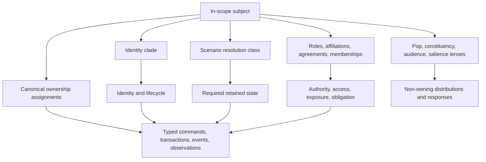

# Representation Bible

### Summary of change request

Define how Reservist represents people, offices, institutions, populations, affiliations, firms, coalitions, sovereign and federated systems, law, geography, markets, facilities, information distribution, published references, schedules, records, external processes, generators, and changes in causal resolution. `04-design-discussion-minimum-simulation-kernel.md` remains the parent architecture and source of inherited claims. The Representation Catalog population-tests this ontology; kind definitions belong here rather than in a shadow catalog ontology.

The purpose is ontology discovery. The document distinguishes inherited invariants, inherited committed interfaces, inherited working mechanisms, open ontology questions, and content hypotheses. It uses adversarial examples to identify where the parent representation is sufficient, where it is ambiguous, and where its resolved language exceeds what the ontology can yet support.

### Current State

- The parent architecture separates canonical state, beliefs, observations, authority, action, execution, accounting, and transmission.
- It commits to composable representation across people, offices, institutions, decision bodies, Pops, firms, sectors, sovereign systems, mechanisms, and generators.
- It makes people the conserved population base, Pops non-owning lenses, institutions durable state without singular minds, and operational coalitions proposition-bound coordination ledgers.
- It fixes causal resolution at scenario initialization and allows only presentation salience to change during play.
- It leaves numeric approximation tolerances, detailed category and content inventories, sovereign authority maps, coalition instances, physical-product family enumeration, and scenario parameters incomplete behind resolved representation contracts.
- The representation dialectic is complete. User review resolved the sparse-cell population hybrid, coalition binding, identity and ownership separation, fidelity tiers, affiliation families, institutional flattening, external-system initialization, market taxonomy, process ownership, approximation budgets, and satire boundaries.
- The Representation Catalog's first population pass is reconciled here: every kind referenced by its roster now has a kinds-table row. Conferred designations use legal or facility state rather than a new kind.
- The instrument attribute set is corrected under Question 54 and families are confirmed type-level, taking no kinds-table row. Enumerating the families themselves remains catalog work behind that contract.
- Physical product and commodity families are likewise a closed type-level inventory rather than instance-level kinds. Their family, bucket, inventory-position, transformation, and exceptional lot-level contracts are defined below; enumerating scenario families remains catalog work.

### Desired End State

- Every represented subject has one identity clade and one scenario resolution class, with an explicit fallback representation; canonical ownership, cognition, authority, and presentation salience remain separate axes.
- Cross-cutting identities, affiliations, exposures, and salience labels compose through relationships or lenses without duplicating canonical stocks.
- Every stock, authority, action, observation, and persistent obligation has an unambiguous owner.
- Aggregates and richer modules exchange the same typed contracts, including conservation and residual-account treatment.
- Promotion decisions can be made before a run from causal criteria and can be audited against scenario needs.
- Population intersections preserve material ownership, transaction eligibility, unusual but consequential tails, and household correlations without requiring synthetic individuals.
- Named people remain materially connected to Pops and households while their exceptional institutional influence is represented separately from demographic weight.
- Sovereign systems expose internal authority, institutional conflict, and distinct action owners without becoming bespoke country scripts.
- Representation-specific probes can falsify ownership, accounting, authority, information-access, persistence, replay, and replacement assumptions before implementation begins.

### What we're not doing

- Designing exact equations, final response curves, cohort counts, complete rosters, final DSE weights, or calibration thresholds.
- Selecting final Pop bands, country parameters, coalition participants, firm lists, or species assignments.
- Designing final UI, art production, complete narrative content, or all player-facing labels.
- Implementing a runtime, schema, serializer, market solver, population engine, or content pipeline.
- Allowing runtime invention of named histories, actions, authorities, stocks, or private beliefs.
- Treating a content example as a general causal law.
- Selecting final numeric approximation thresholds or resolving questions not explicitly decided through review.

## Parent Claim Extraction

### Classification rules

| Class | Meaning in this artifact |
|---|---|
| **Inherited invariant** | A premise-level constraint every representation must preserve. |
| **Inherited committed interface** | A parent contract on which another module may depend even while internal representation changes. |
| **Inherited working mechanism** | A proposed representation intended to be tested and revised. |
| **Open ontology question** | A question about what exists, who owns it, or how it composes that must not be answered accidentally. |
| **Content hypothesis** | A candidate category, roster entry, scenario fact, species joke, parameter, or behavioral association requiring research and playtesting. |

The ledger groups repeated statements that assert the same representation rule. References point to the clearest statement in the parent, not every repetition.

### Running claim ledger

| ID | Parent representation claim | Classification | Consequence for this Bible | Parent reference |
|---|---|---|---|---|
| P01 | Canonical state, private cognition, and player information are physically distinct. | Inherited invariant | No representation may use a player-safe projection or belief as canonical truth. | `04-design-discussion-minimum-simulation-kernel.md:44` |
| P02 | Every canonical mutation crosses a typed accounting, clearing, execution, legal, mechanical, or shock path. | Inherited invariant | Every clade must name its mutation owner and accepted transition kinds. | `04-design-discussion-minimum-simulation-kernel.md:46` |
| P03 | Every conserved stock has one canonical owner. | Inherited invariant | Lenses, memberships, coalitions, and reports cannot own duplicate population, money, goods, or claims. | `04-design-discussion-minimum-simulation-kernel.md:519` |
| P04 | Authorization, execution, take-up, settlement, transmission, and observation remain distinct. | Inherited invariant | Roles and action owners must be traced at each stage. | `04-design-discussion-minimum-simulation-kernel.md:517` |
| P05 | Every attributable action has an owner; visible principals do not absorb execution performed elsewhere. | Inherited invariant | Person, office, decision body, institution, and mechanism references must remain separate. | `04-design-discussion-minimum-simulation-kernel.md:521` |
| P06 | Hidden behavior-affecting state cannot be reconstructed approximately on load. | Inherited invariant | Resolution, residuals, private beliefs, and pending transitions must persist or rebuild exactly. | `04-design-discussion-minimum-simulation-kernel.md:646` |
| P07 | Stable identity is typed and generational; disappearance requires declared queued-reference behavior. | Inherited committed interface | Every durable represented entity needs identity, lifecycle, tombstone, and fallback semantics. | `04-design-discussion-minimum-simulation-kernel.md:334` |
| P08 | Tasks calculate from versioned snapshots and commit in deterministic stable order. | Inherited committed interface | Aggregation, split, merge, and replacement results require stable commit keys. | `04-design-discussion-minimum-simulation-kernel.md:288` |
| P09 | Commands, authorization, execution, results, commitments, observations, and transmissions are separate typed contracts. | Inherited committed interface | Representation kinds must declare which contracts they may originate, own, receive, or only project. | `04-design-discussion-minimum-simulation-kernel.md:451` |
| P10 | Derived caches cannot authorize actions, settle transactions, or become independent truth. A witnessed authorized publication by a named party may bind third-party transactions through a `PublishedReference`; its silent derived calculation cache may not. | Inherited invariant with a narrow publication exception | Pop lenses, coalition beliefs, situation views, exposure maps, and unpublished calculations remain derived. Binding force belongs only to the published value or grade, its named publisher, publication witness, declared binders, and revision policy; publication does not grant force to arbitrary claims or derived values. | `04-design-discussion-minimum-simulation-kernel.md:317` |
| P11 | There is no universal humanlike `Actor`. | Inherited invariant | Decision context is composition, not inheritance from one all-purpose actor type. | `04-design-discussion-minimum-simulation-kernel.md:714` |
| P12 | A person owns continuity, cognition, memory, relationships, material interests, reputation, and offices across time. | Inherited committed interface | Named and cohort people require a continuity boundary separate from office tenure. | `04-design-discussion-minimum-simulation-kernel.md:718` |
| P13 | An office owns authority, duties, access, capabilities, calendar, appointment, term, removal, and succession rules. | Inherited committed interface | Authority attaches to an office and is sourced to an effective `LegalInstrument`, valid delegation, or other explicit authority record, never personality. | `04-design-discussion-minimum-simulation-kernel.md:719` |
| P14 | An institution owns resources, powers, facilities, commitments, records, staff, processes, offices, and organizational reputation. | Inherited committed interface | Institutional powers resolve through effective `LegalInstrument` clauses and valid delegations; continuity survives officeholders and is not stored in private cognition. | `04-design-discussion-minimum-simulation-kernel.md:720` |
| P15 | A decision body owns membership, procedure, quorum, thresholds, votes, dissents, delegation, and binding collective outcomes. | Inherited committed interface | The FOMC cannot be represented as the Chair's action set or one aggregate mind. | `04-design-discussion-minimum-simulation-kernel.md:721` |
| P16 | Institutions have no singular humanlike belief. | Inherited invariant | Personal beliefs, staff products, participant distributions, operative assumptions, official claims, and outsider attributions remain distinct. | `04-design-discussion-minimum-simulation-kernel.md:724` |
| P17 | Professional action is afforded by role and bounded by institutional authority, resources, and procedure. | Inherited invariant | Personal ideology may alter interpretation and discretion but cannot create professional powers. | `04-design-discussion-minimum-simulation-kernel.md:739` |
| P18 | Named people are rare and selected when individual discretion materially changes a modeled channel. | Inherited working mechanism | The named-person threshold needs operational criteria and demotion/fallback treatment. | `04-design-discussion-minimum-simulation-kernel.md:768` |
| P19 | Less consequential officeholders may use limited role-holder representations. | Inherited working mechanism | A role-holder tier must preserve action ownership without a full personal biography. | `04-design-discussion-minimum-simulation-kernel.md:743` |
| P20 | People are the conserved population base. | Inherited committed interface | Question 18 now confirms scenario-bounded sparse cells, conditional distributions, and dynamic household cohorts. | `04-design-discussion-minimum-simulation-kernel.md:978` |
| P21 | Canonical sparse joint person cells hold intersections that own stocks, constrain transactions, or materially alter transmission. | Inherited working mechanism, resolved by Questions 18 and 52 | The promotion boundary and error classes are settled; scenario-specific protected dimensions and numeric tolerances remain catalog and calibration work. | `04-design-discussion-minimum-simulation-kernel.md:978` |
| P22 | Conditional factorized distributions retain lower-priority and continuous variation inside cells. | Inherited working mechanism, resolved by Questions 18 and 52 | Protected moments, tails, and correlations follow the scenario manifest and per-channel approximation budgets; their content inventory and numeric tolerances remain deferred. | `04-design-discussion-minimum-simulation-kernel.md:978` |
| P23 | Every person belongs to exactly one current living arrangement. | Inherited invariant | Household allocations must reconcile to conserved person mass. | `04-design-discussion-minimum-simulation-kernel.md:1014` |
| P24 | Households are dynamic relationships that may own shared stocks and obligations. | Inherited working mechanism, resolved by Question 18 | Legal and accounting rules select the owner; household accounts, member allocations, obligations, and dissolution transitions are part of the committed household contract. | `04-design-discussion-minimum-simulation-kernel.md:1021` |
| P25 | People retain individual labor, votes, beliefs, continuity, and personally titled assets or debts. | Inherited invariant | Household aggregation cannot erase individual franchise, labor, or title. | `04-design-discussion-minimum-simulation-kernel.md:1021` |
| P26 | Population changes use typed transfer, transform, split, and merge operations. | Inherited committed interface | Each operation needs conservation, stock-transfer, household-reconciliation, and stable-order contracts. | `04-design-discussion-minimum-simulation-kernel.md:1025` |
| P27 | Small flows accumulate in persisted buckets before deterministic realization. | Inherited working mechanism | Delay cannot fabricate or lose people, stocks, eligibility, or protected tails. | `04-design-discussion-minimum-simulation-kernel.md:1039` |
| P28 | Cells merge only when keys, ownership semantics, and protected correlations are compatible. | Inherited invariant with policy resolved by Question 52 | Compatibility and separate error classes are required; numeric per-channel and scenario tolerances remain calibration work. | `04-design-discussion-minimum-simulation-kernel.md:1062` |
| P29 | A Pop is a non-owning lens over weighted intersections and never a collective Agent. | Inherited invariant | Pops can project distributions and responses but cannot deliberate, authorize, command, or own conserved stocks. | `04-design-discussion-minimum-simulation-kernel.md:1066` |
| P30 | Pop responses proceed through exposure, belief, pressure, intention, attempts, execution, and realized flows. | Inherited working mechanism | Aggregate response must preserve stage attrition rather than emit one direct behavioral modifier. | `04-design-discussion-minimum-simulation-kernel.md:961` |
| P31 | Pop influence has distinct demographic, consumption, productive, financial, electoral, organizational, elite, disruptive, and narrative channels. | Inherited working mechanism | The Bible must prevent these weights from collapsing into population size or one sway score. | `04-design-discussion-minimum-simulation-kernel.md:1095` |
| P32 | Pop transmission stores direction, sensitivity, delay, saturation, interactions, uncertainty, and provenance. | Inherited working mechanism | Exact weights are deferred; required metadata and interaction structure are architectural. | `04-design-discussion-minimum-simulation-kernel.md:1156` |
| P33 | Sensitive identity dimensions exist only when causally relevant. | Inherited invariant | Identity cannot be included as ornamental determinism or omitted when it changes exposure, access, discrimination, or organization. | `04-design-discussion-minimum-simulation-kernel.md:2551` |
| P34 | People connect to institutions through typed affiliations and roles, not one membership flag. | Inherited committed interface | Employment, ownership, office, customer, depositor, student, voter, and other relations need distinct semantics. | `04-design-discussion-minimum-simulation-kernel.md:1111` |
| P35 | Institutions receive constituency pressure through different contracts and channels rather than one stakeholder mood. | Inherited invariant | Institutional decision context must preserve source, proposition, leverage, and mechanism. | `04-design-discussion-minimum-simulation-kernel.md:1127` |
| P36 | Named people's material quantities must not be double counted against Pop totals. | Inherited invariant | Named people stay in Pops; any independently causal personal stock receives a stock-specific residual offset without subtracting demographic mass. | `04-design-discussion-minimum-simulation-kernel.md:2571` |
| P37 | Financial long tails use typed institution cohorts separate from person Pops. | Inherited working mechanism | Organization cohorts also cover causally material firms, municipalities, nonprofits, and other legal persons. | `04-design-discussion-minimum-simulation-kernel.md:2599` |
| P38 | Named institution opening stocks and exposures are reconciled out of cohort residuals. | Inherited invariant | Scenario construction must prove named-plus-residual conservation. | `04-design-discussion-minimum-simulation-kernel.md:2601` |
| P39 | Cohort-to-cohort clearing uses aggregate accounts without invented bilateral identities. | Inherited committed interface | Bilateral facts cannot be fabricated merely to render a transaction. | `04-design-discussion-minimum-simulation-kernel.md:2601` |
| P40 | Production combines named strategic firms, industry cohorts, and product or commodity flows. | Inherited working mechanism | Firm identity, cohort accounts, and flow mechanisms coexist rather than form one ladder. | `04-design-discussion-minimum-simulation-kernel.md:906` |
| P41 | Products earn explicit representation through household salience, bottlenecks, financial markets, or scenario transmission. | Inherited working mechanism | Product granularity follows a causal test rather than a complete industrial taxonomy. | `04-design-discussion-minimum-simulation-kernel.md:914` |
| P42 | Markets determine prices from participant orders, constraints, contracts, and clearing rather than policy consequence tables. | Inherited invariant | A market is a mechanism with owners of instruments and orders, not a person or institution. | `04-design-discussion-minimum-simulation-kernel.md:184` |
| P43 | Instrument families retain duration, liquidity, seniority, collateral, rollover, rate, convertibility, priority, margin, and counterparty exposures. | Inherited working mechanism, amended | The attribute set is corrected below: `collateral` is bidirectional, `duration` may be state-dependent, and settlement role, demandability, credit state, currency, the notional/market-value/exposure split, and contingency are added. Families remain a closed type-level inventory rather than a kind or an unrestricted constructor. | `04-design-discussion-minimum-simulation-kernel.md:2593` |
| P44 | Agreements use clause-based permissions, duties, transfers, access, disclosure, performance, breach, and exit. | Inherited committed interface | Membership, relationship, agreement, coalition, and authority remain different objects. | `04-design-discussion-minimum-simulation-kernel.md:523` |
| P45 | Coalitions are issue-specific, overlapping, template-gated, and bound to a package or branch. | Inherited working mechanism, amended and resolved by Question 22 | Operational coalitions bind to one concrete subject from the closed `CoordinatingProposition` vocabulary; durable alignment remains relationship state. | `04-design-discussion-minimum-simulation-kernel.md:1203` |
| P46 | Coalitions have no mind, shared private belief store, authority, command ownership, or execution ownership. | Inherited invariant | Coalition state records coordination; autonomous participants own cognition and action. | `04-design-discussion-minimum-simulation-kernel.md:1263` |
| P47 | Canonical coalitions record invitations, pledges, demands, exits, breaches, contributions, fault lines, and lifecycle. | Inherited working mechanism, resolved by Question 22 | The contribution and obligation vocabulary below preserves participant ownership and requires a performance witness for every realized contribution. | `04-design-discussion-minimum-simulation-kernel.md:1222` |
| P48 | Staff coalition options and observer coalition beliefs are epistemic objects distinct from canonical coalitions. | Inherited invariant | Hypotheses cannot own invitations, pledges, or performed contributions. | `04-design-discussion-minimum-simulation-kernel.md:1270` |
| P49 | Pops may be represented by coalitions but never become coalition decision-makers. | Inherited invariant | Coordinating organizations or people must own invitations, bargains, and mobilization actions. | `04-design-discussion-minimum-simulation-kernel.md:1303` |
| P50 | Sovereigns are containers for internal political economies, not unitary Agents. | Inherited invariant | External actions must resolve to a principal, institution, body, or mechanism. | `04-design-discussion-minimum-simulation-kernel.md:1309` |
| P51 | Country detail follows distinct material action ownership, not rank or cartographic symmetry. | Inherited invariant | A central bank, sovereign fund, ministry, or firm may be promoted independently of its sovereign container. | `04-design-discussion-minimum-simulation-kernel.md:801` |
| P52 | Saudi Arabia, Israel, Iran, China, the euro area, Japan, the United Kingdom, Russia, UAE, and Qatar are candidate differentiated systems. | Content hypothesis | Each roster and authority graph requires scenario research; none is universal content. | `04-design-discussion-minimum-simulation-kernel.md:1325` |
| P53 | Aggregated foreign regions retain selected growth, policy, currency, funding, stress, trade, commodity, and reserve channels. | Inherited committed boundary | Rich sovereign modules must be substitutable behind these outputs where applicable. | `04-design-discussion-minimum-simulation-kernel.md:1839` |
| P54 | Geography may be named, flattened, or exogenous independently of person and institutional resolution. | Inherited working mechanism | Place is a scope and condition reference, not an owner by virtue of geography and not a proxy for all actors located there. | `04-design-discussion-minimum-simulation-kernel.md:741` |
| P55 | Generators provide initiating facts and typed shocks; stateful systems determine downstream consequences. | Inherited invariant | No generator may emit final prices, inflation, GDP, votes, or crisis conclusions. | `04-design-discussion-minimum-simulation-kernel.md:822` |
| P56 | Some exogenous processes become stateful and responsive after initiation. | Inherited working mechanism | A `StatefulExternalProcess` owns evolving external state after initiation, while generators retain keyed draws and actors retain interventions. | `04-design-discussion-minimum-simulation-kernel.md:835` |
| P57 | Crisis and situation views do not own independent causal momentum. | Inherited invariant | Representation cannot create a crisis entity that bypasses ordinary stocks, actions, and mechanisms. | `04-design-discussion-minimum-simulation-kernel.md:1855` |
| P58 | Resolution is fixed at scenario initialization; presentation salience may change dynamically. | Inherited working mechanism with declared extension | The no-runtime-promotion rule, representation manifest, reserve roster, residual mapping, and adapter contracts protect history; scenario instances remain catalog work. | `04-design-discussion-minimum-simulation-kernel.md:2625` |
| P59 | Runtime promotion is prohibited unless prior history can be allocated exactly and deterministically. | Inherited invariant | Any future exception must preserve ownership, cognition, relationships, accounting, and replay identity. | `04-design-discussion-minimum-simulation-kernel.md:2627` |
| P60 | Every entity has one primary causal clade, one resolution class, one fallback, and explicit relationships and lenses. | Inherited working mechanism, superseded by Question 43 | Every represented subject instead has one identity clade and separate canonical-owner, cognition, authority, resolution, and presentation assignments. Composition handles subjects that perform several causal functions without giving one clade all of their state. | `04-design-discussion-minimum-simulation-kernel.md:142` |
| P61 | Cross-cutting labels such as foreign, systemic, media-visible, or coalition participant are lenses or relationships. | Inherited invariant | Cross-cutting properties never compete with identity clade or canonical-owner assignments. | `04-design-discussion-minimum-simulation-kernel.md:165` |
| P62 | Species never deterministically encodes nationality, race, ethnicity, ideology, religion, or moral worth. | Inherited invariant | Animal satire must be specific, reversible, plural within groups, and aimed at institutions or behavior. | `04-design-discussion-minimum-simulation-kernel.md:2167` |
| P63 | Candidate species jokes include owls, foxes, camels, geese, pandas, lemmings, and alpacas. | Content hypothesis | Every assignment remains optional and must pass the forbidden-association test. | `04-design-discussion-minimum-simulation-kernel.md:2169` |
| P64 | Population approximation needs an explicit error budget rather than a universal minimum cohort size. | Open ontology question, resolved by Questions 18 and 52 | Conservation and ownership remain exact; separate material, behavior, timing, and tail-error channels are settled, while numeric tolerances remain calibration work. | `04-design-discussion-minimum-simulation-kernel.md:2316` |
| P65 | Coalition family slots, contributions, demands, and successor affordances remain Representation Bible work. | Open ontology question, resolved by Question 22 | Closed coalition families, proposition binding, participant-owned contributions, demands, witnesses, and successor-template eligibility are defined below. | `04-design-discussion-minimum-simulation-kernel.md:2279` |

## Proposed End State Architecture

The proposed ontology separates causal identity from cross-cutting relationships and from scenario resolution:



### Running table: representation kinds and required state

| Kind | Primary causal purpose | Required canonical state | May deliberate? | May own conserved stocks? | Required fallback |
|---|---|---|---:|---:|---|
| `Person` | Persistent human identity and discretion | Identity, continuity, private cognition, memory, relationships, personal commitments, Pop memberships, current roles, availability; personal accounts only when individually causal | Yes when named or role-holder fidelity supports it | Exceptionally, for individually causal titled stocks | Person-cell inclusion plus role-holder template or Pop-only inclusion |
| `Office` | Time-bounded source of authority and access | Holder, term, appointment, duties, powers and restrictions sourced to effective `LegalInstrument` clauses or valid delegations, access grants, calendar, succession | No independent mind | No, except office-controlled institutional accounts by reference | Institution procedure or vacant-office state |
| `Institution` | Durable organizational owner and operator | Identity, jurisdiction, accounts, financial `Facility` references, productive-site state, staff, commitments, records, doctrine, procedures, offices, relationships, and powers sourced to effective `LegalInstrument` clauses or valid delegations | Through people and procedures, not one mind | Yes | Typed organization cohort or mechanism |
| `DecisionBody` | Procedure converting participant acts into authoritative outcomes | Membership, eligibility, agenda, quorum, thresholds, votes, dissents, delegations, decisions | No singular cognition | Normally no; may authorize institution-owned stocks | Office or institution procedure only if legally valid |
| `StaffUnit` | Production of analysis and operations inside an institution | Personnel/capacity distribution, access, methods, tasks, products, readiness, records | Through represented staff participants or unit synthesis | Institution owns material stocks | Parent institution aggregate capability |
| `PersonPopulationCell` | Conserved population and individually owned distributional state | Person mass, active key, conditional distributions, personal stock accounts or allocations, household allocations, protected correlations | No | Yes, through canonical aggregate accounts | Broader compatible cell with retained protected state |
| `HouseholdCohort` | Living arrangement and shared economic unit | Household count, member slots, correlations, tenure, shared/separate finances, care, baskets, shared obligations, lifecycle | Distributed response only | Yes where household is legal or behavioral owner | Person cells plus explicit shared-account residuals |
| `PopLens` | Named intersection, constituency, audience, or analytic population | Definition, selectors, weights, provenance, validity time; derived outputs only | No | No | Parent lens or direct query over canonical cells |
| `OrganizationCohort` | Long-tail banks, firms, municipalities, nonprofits, and other legal persons with common causal grammar | Count/distribution, cohort accounts, organization kind, business or public mandate, geography, charter, staff composition, strategies, response distributions, residual exposures | Cohort response catalog shaped by staff and procedure, not person cognition | Yes, in aggregate accounts | Sector mechanism with residual account |
| `NamedFirm` | Firm-specific discretion and bottleneck ownership | Accounts, ownership, productive-site state and `MechanicalSystem` references, capacity, contracts, workforce, inventory, financing, beliefs, offices, actions | Through people and procedures | Yes | Industry or organization cohort plus explicit productive-site process or contract if still causal |
| `IndustryCohort` | Production and investment by similar firms | Firm mass, capacity, recipes, inventories, margins, finance, employment, response distributions | Bounded cohort response | Yes, in aggregate accounts | Product-flow or sector mechanism |
| `Coalition` | Package-specific coordination among autonomous participants | Template, package link, sponsor, slots, invitations, pledges, demands, contributions, breaches, fault lines, lifecycle | No | No, unless a separate legal vehicle is represented as an institution | Relationships, alignment, or separate agreements |
| `SovereignSystem` | Container and scope for an internal political economy | Authority graph, jurisdictions, institutions, principals, coalitions, regions, capabilities, treaties, external interfaces | No singular cognition | Container does not replace internal owners | `ExternalRegion` aggregate |
| `Region` | Geographic scope with causal conditions and jurisdiction links | Boundary/version, parent and overlapping scopes, population allocations, productive-site and infrastructure references, resource and inventory references, hazard and process references, policy jurisdictions, disputed-jurisdiction and de facto-control relationships | No | No by virtue of geography; a legal/accounting subject, `MechanicalSystem`, or `StatefulExternalProcess` owns every referenced stock or condition | Parent aggregate region |
| `Market` | Exchange, allocation, price discovery, rationing, and settlement | Instruments, participants/eligibility, orders or schedules, constraints, clearing state, residuals, failures, calendar | No | No; participants, custodians, or settlement systems own assets | Typed boundary adapter preserving outputs and residuals |
| `MechanicalSystem` | Rule-driven production, transformation, transport, settlement, or diffusion | Stocks/conditions it owns, transition rules, queues, capacities, losses, outputs | No | Yes when it is canonical owner | Boundary adapter with explicit source/sink accounts |
| `Generator` | Initiation of exogenous or semi-exogenous disturbances | Hazard identity, scope, keyed draw state, occurrence history, initiating facts, observation policy | No | No downstream stocks | Disabled or scenario-supplied incident tape |
| `Agreement` | Clause-based permissions and obligations | Parties, jurisdiction, clauses, effective period, amendments, performance, breach, exit | No | No; clauses create commitments or transfers owned elsewhere | Relationship or informal structured commitment |
| `LegalInstrument` | Deterministic rules that grant, restrict, or require action by a class of subjects, with dated effect and compliance windows | Identity; level — statute, agency rule, or designation order; enacting body and procedure; enactment, amendment, and repeal history; delegated rulemaking obligations with deadlines; typed requirement clauses, each naming the bound subject class, effective date, conformance deadline, required or forbidden commands, reporting obligations, and enforcement consequence; per-subject compliance state; supersession links | No | No | Fixed authority-graph state with no amendment path and no conformance window |
| `FederatedSystem` | Identity, shared mandate, and consolidated view for separately chartered institutions bound by a common mission and a decision body whose authority spans them | Identity; governing statute or treaty; mandate and mission; member institutions and charters; spanning decision bodies; authority map naming which member owns which act; consolidated accounting projection and its derivation; shared calendars; system-level commitments; membership and succession rules | No; spanning decision bodies and member institutions deliberate | No; members own every stock, and the consolidated view is derived | One `Institution` carrying the consolidated position, with member distinctions dropped |
| `Facility` | A standing offer of institution-owned terms to eligible counterparties, whose use is the counterparty's choice | Identity; owning institution; authorization reference and its limits; legal basis and any required external consent; counterparty eligibility rule; instrument and collateral schedule with haircuts; pricing rule; aggregate and per-counterparty caps; operational readiness; status; take-up ledger by counterparty and date; outstanding balances by reference; reserved institutional capacity; disclosure rules and lag; lifecycle and expiry | No | No; drawn balances are the operating institution's assets and the counterparty's liabilities | Terms recorded as operating-institution state, with take-up as an aggregate flow and no per-counterparty ledger |
| `PublishedReference` | A value or grade published on a schedule by an interested party, which third-party contracts and regulations bind to | Identity; publisher; input specification; calculation method and its derived-cache reference; publication schedule and lag; current published value and full publication history; revision policy and revision history; what binds to it — contracts, eligibility rules, risk weights, mandates; known incentive or bias structure; failure, delay, and suspension state | No | No | An exogenous series with no publisher, no revision, and nothing bound to it |
| `Outlet` | Discretionary selection, framing, and distribution of claims and evidence to audiences | Identity; operating institution reference; offices and role-holders; editorial slate (lead, active narratives, developing reports); reporter and airtime capacity; access grants and source relationships; verification threshold; audience reach by segment; latency; framing and amplification tendencies; correction and retraction record; topic preferences; legal exposure; publication queue | Through role-holders and editorial procedure, not one mind | No; the operating institution owns money, contracts, and facilities | Distribution parameters on an aggregate media channel |
| `Network` | Non-discretionary diffusion of claims among members | Identity; membership definition and affiliation edges; access boundary; latency distribution; verification norm; propagation and decay rules; reach by segment | No | No | A diffusion term in an aggregate information mechanism |
| `ScheduledProcess` | Recurring published occurrences other agents plan against, and the eligibility windows derived from them | Identity; owning institution; recurrence rule and published horizon; announced occurrences with dates and any published parameters; announcement and revision history; derived eligibility windows and what they gate; dependent parties and notification rules; delay, suspension, and disruption state | No | No | Occurrences emitted directly into the scheduled-event queue, with no announcement act and no derived windows |
| `Record` | Durable institutional work, proceeding, package, program, or assessment with stable identity and transferable custody | Identity; record subtype; owning institution or staff unit; status or awareness state; content and typed subject references; provenance; revision, transfer, and supersession history; lifecycle and retention rules; queued-work references and their disappearance fallback | No | No; a record references but does not absorb the stocks, authority, commitments, or world state it concerns | Parent-institution state with no independent identity, transfer, or queued reference |
| `StatefulExternalProcess` | Evolution of environmental, epidemiological, ecological, geopolitical, or other external state, including adaptation and intervention response | Identity; scope and responsible process module; evolving physical or external state; transition rules and stage history; keyed hazard-draw references where applicable; actor-owned intervention inputs; capacities, losses, and outputs; observation policy and history; replacement-boundary version; lifecycle and termination conditions | No | Yes when it is the canonical owner of physical stocks or conditions | Incident tape or hazard adapter preserving declared outputs but no actor feedback into the process |
| `BoundaryAdapter` | Temporary producer/consumer behind a committed boundary | Interface version, external accounts, state needed for deterministic outputs, provenance, replacement metadata | No unless interface explicitly models response distributions | Yes only through declared external/residual accounts | Endogenous module or another adapter with same contract |

Legal change is effective-dated canonical state, not a free-form parameter override. Offices, institutions, facilities, designations, and catalog `period_variants[]` reference the applicable `LegalInstrument` and clause versions; they do not duplicate authority rules that can drift from the amendment, repeal, or conformance ledger.

### Mechanical systems, stateful external processes, and productive sites

`MechanicalSystem` and `StatefulExternalProcess` are distinguished by the state whose evolution they own, not by whether the subject is physical, long-lived, stochastic, or affected by people.

| Kind | Owns | Typical inputs | Typical examples |
|---|---|---|---|
| `MechanicalSystem` | An operational queue, capacity, transformation, transport, settlement, or controlled production process | Owned inputs, commands, contracts, labor, energy, capacity, maintenance, and observed external conditions | Logging and milling, crop harvest and processing, livestock husbandry and slaughter, storage, freight, payment settlement |
| `StatefulExternalProcess` | Evolving environmental, epidemiological, ecological, geopolitical, or other external conditions that continue independently of one operator's queue or production plan | Keyed hazards, prior process state, regional conditions, and actor-owned interventions | Drought, regional climate and ecosystem state, epidemic spread, wildfire progression, war's physical disruption state |

A mixed physical chain is split at the ownership boundary. A regional climate or ecological process may own soil moisture, rainfall, fire conditions, or unowned biomass. A firm, institution, industry cohort, or other legal/accounting subject owns planted crops, livestock, harvested goods, inventories, contracts, and extraction rights. A `MechanicalSystem` owns the operational capacity, queues, losses, and transformations that convert those owned inputs into outputs. Typed relationships and transmissions connect the objects; neither kind may silently absorb the other's state.

`ProductiveSite` is a composition profile, not a twenty-ninth representation kind and not a synonym for `Facility`. A farm, forest concession, mine, fab, mill, slaughterhouse, warehouse, port, or power plant has:

```text
productive site
  geographic footprint        -> Region relationship
  legal and accounting owner  -> Institution, NamedFirm, or OrganizationCohort
  operator                     -> Institution, NamedFirm, StaffUnit, or cohort response
  operational process         -> MechanicalSystem when independently causal
  land, concession, permit,
  or extraction right         -> Agreement or LegalInstrument relationship
  capacity, queues, condition,
  losses, and outputs          -> MechanicalSystem state
  inputs and inventories       -> owner accounts referencing physical-product families
```

A site receives an independent `MechanicalSystem` identity only when it owns a consequential capacity, queue, condition, transformation, outage history, or execution result. Otherwise it remains structured state on its parent firm or cohort. The term `Facility` is reserved for the financial and institutional kind defined below: an authority-gated standing offer of terms with counterparty eligibility and a take-up ledger.

### Instrument families are type-level and take no kinds-table row

An instrument family is a type that positions reference, not a subject that exists once. Every row above is instance-level — one `LegalInstrument` is Dodd-Frank, one `PublishedReference` is SOFR — and no instance ever occupies an instrument row. Families therefore remain the closed inventory P43 requires, and the four levels stay distinct:

```text
family      a type with attributes           agency MBS          closed vocabulary
bucket      an aggregation over positions    MBS, 15-30y         account structure
position    what an owner actually holds     one bank's MBS book account entry
security    one identified issue             a specific CUSIP    extension point, not
                                                                 modeled by default
```

**Declared extension point.** A scenario centred on one failed auction, one downgraded issue, or one defaulted borrower needs the security level. Promoting it follows the ordinary pre-run promotion contract: the security becomes an explicitly represented subject whose position is removed from its bucket and reconciled against a residual, exactly as a named institution reconciles against its cohort. No runtime promotion.

### Running table: required instrument-family attributes

Eleven of these are load-bearing in the Treasury-duration and secured-funding circuit alone, so the set is not deferrable to calibration.

| Attribute | Requirement | Why it exists |
|---|---|---|
| Duration | Scalar where cash flows are fixed; a state-dependent function where optionality exists | MBS duration shortens as rates fall and extends as they rise; treating it as a scalar deletes convexity hedging as a transmission channel |
| Collateral role | Bidirectional: whether the instrument is secured *by* collateral, and whether it is usable *as* collateral, with the eligibility schedule and haircut source that governs it | The secured-funding circuit turns on what may be pledged and at what haircut; the original one-way attribute pointed away from the causal role |
| Settlement role | Whether the instrument is itself a means of settlement, and in which system | A bill is more liquid than almost anything and cannot settle a Fedwire payment; liquidity is not finality, and the gap is why reserve scarcity moves repo |
| Demandability | On demand at par, on demand at NAV, notice period, gated or fee-bearing, or not redeemable | Deposits and money-fund shares have near-identical duration and opposite run behaviour; this attribute is the difference |
| Credit state | Performing, delinquent, non-performing, defaulted, restructured | The bank-failure path runs through provisioning and capital, which need an impairment state rather than a seniority rank |
| Currency denomination | Required on every family; not a family of its own | A dollar liability held by a foreign bank is the entire offshore-funding mechanism, and cross-currency basis is the price of the mismatch |
| Notional, market value, exposure | Three quantities, tracked separately | A swap carries large notional at near-zero initial value; gross leverage is a player-visible indicator and is uncomputable from one number |
| Contingency | Undrawn, drawn, and the trigger condition between them | Guarantees and credit lines are off-balance-sheet until drawn, and drawing is what happens in a crisis |
| Liquidity | Retained | Market depth and price impact under sale |
| Seniority | Retained; null where inapplicable | Recovery ordering within a capital structure |
| Priority | Retained | Payment ordering in resolution |
| Rollover | Retained | Refinancing and maturity-wall risk |
| Rate | Retained | Fixed, floating, administered, or referenced to a `PublishedReference` |
| Convertibility | Retained | Conversion rights and triggers |
| Margin | Retained | Initial and variation, where variation margin is a recurring liquidity demand |
| Counterparty exposure | Retained | Bilateral or novated to a central counterparty |

Insurance status is not an attribute. It is a `LegalInstrument` clause conferring a condition on an account, so insured and uninsured deposits are one family under two legal conditions rather than two families.

### Physical product and commodity families are type-level and take no kinds-table row

A physical product or commodity family is a closed type referenced by resource stocks, inventories, recipes, contracts, transport tasks, baskets, and market orders. It is not an instance-level subject and owns nothing. The four levels remain distinct:

```text
family      a physical type and causal grammar    green coffee         closed vocabulary
bucket      fungible stock with material traits   green coffee, grade,
                                                   origin, crop year     account structure
position    what an owner holds                    one trader's inventory
lot         one identified batch, herd, cargo,
            harvest, or reserve                    extension point, not
                                                   modeled by default
```

Every family declares the following structural attributes. Values and scenario parameters remain catalog and calibration work.

| Attribute | Requirement |
|---|---|
| Conserved quantity and unit | Mass, volume, energy, count, or another declared physical dimensional quantity; incompatible units may not be summed without a typed conversion |
| Material stage | Unharvested resource, live biological stock, harvested raw material, intermediate input, finished good, by-product, or waste; transitions between stages require a recipe or loss witness |
| Ownership form | Which accounts may hold the stock, whether custody and legal ownership differ, and whether the family may represent an unowned natural stock |
| Origin and traceability | Region, productive site, process, cohort, or lot provenance retained only where it changes eligibility, quality, cost, exposure, or observation |
| Grade and quality | Closed dimensions that change substitutability, contract eligibility, processing yield, household use, or price |
| Storability and decay | Storage requirements, spoilage, degradation, biological loss, and maximum useful horizon where applicable |
| Production and transformation roles | Permitted recipe inputs and outputs, yields, co-products, losses, and required capacities |
| Biological or environmental dependencies | Growth, maturation, feed, water, climate, disease, season, or ecosystem inputs where applicable |
| Transport and handling | Bulk, cold-chain, hazardous, pipeline, grid, refrigerated, live-animal, or other capacity and loss constraints |
| Substitution class | Uses for which another family or bucket may substitute, with direction, delay, conversion cost, and saturation represented by the consuming mechanism |
| Delivery and market eligibility | Contract grades, delivery locations, timing windows, certification, and market or procurement eligibility |
| Demand role | Household basket, productive input, capital good, strategic reserve, required service, or discretionary use |

Stocks and inventories remain in owner accounts. Regions scope or originate them; firms and cohorts produce or hold them; mechanical systems transform or transport them; markets clear orders for them; contracts create delivery obligations. A family name never proves that a region owns, produces, exports, consumes, or is exposed to that family.

**Declared extension point.** A scenario centered on one contaminated shipment, failed harvest, diseased herd, blocked cargo, strategic reserve, or legally disputed resource may promote one lot before the run. The lot receives stable identity, explicit ownership, provenance, condition, location, obligations, and residual reconciliation. No runtime promotion may invent its prior ownership or history.

The initial inventory is catalog work. Candidate families already required by the parent architecture include timber and lumber stages, coffee stages, feed crops, live livestock and meat products, oil, electricity, semiconductors, auto parts, and other scenario-relevant goods. Naming a candidate here does not assert a production geography or causal relationship.

### Running table: canonical ownership by domain

| Domain | Canonical owner | Non-owners that may project or reference it | Required accounting or transition boundary |
|---|---|---|---|
| Person mass | `PersonPopulationCell` | Named-person overlay, Pop lens, household member slot, constituency | Population transfer/transform/split/merge ledger |
| Named person's personally titled asset or debt | Normally remains statistically allocated inside person-cell and household state; an explicit person account exists only when that individual's quantity changes a modeled channel | Pop lens, household, employer, coalition | If materialized, offset the corresponding aggregate residual for that stock without subtracting the person from population mass |
| Household-shared asset, debt, income pool, or care obligation | `HouseholdCohort` account when law/behavior makes household the subject | Member person cells, Pops, lenders, tax/benefit systems | Household formation, allocation, settlement, dissolution |
| Institution cash, securities, liabilities, equity, inventory | Named institution or `OrganizationCohort` account | Executives, owners, regulators, market lenses | Double-entry accounting, revaluation, production/loss witness |
| Firm capacity and inventory | Named firm or industry cohort | Workers, investors, suppliers, customers, sovereign system | Production, investment, transfer, depreciation, loss |
| Legal rule | `LegalInstrument` clause and its enactment record | Bound offices, institutions, facilities, designations, staff interpretations | Enactment, amendment, delegated rulemaking, effective date, conformance, enforcement, repeal, supersession |
| Office power | Office, sourced to an effective `LegalInstrument` clause, valid delegation, or other explicit authority record | Current person holder, coalition, public attribution | Appointment, delegation, legal transition, expiry, revocation |
| Decision-body outcome | `DecisionBody` procedural record | Participants, institution, coalition, media | Agenda, vote, threshold, certification, implementation request |
| Contractual obligation | Contract/agreement clause plus responsible party commitment | Coalition, officeholder, report, case file | Formation, amendment, performance, breach, cure, expiry |
| Coalition pledge or demand | Coalition ledger as coordination fact; underlying promised resource remains with pledging participant | Staff option, observer belief, represented Pop | Invitation/bargain witness and separate performance action result |
| Security, collateral, deposit, loan, payment | Legal/accounting owner or custodian account; the instrument family it references is a type, never an owner | Markets, beliefs, exposure caches, reports | Issue, transfer, encumber, settle, default, resolve |
| Natural resource or regional capacity | `StatefulExternalProcess` for unowned evolving physical conditions or stocks; otherwise the applicable legal/accounting owner or `MechanicalSystem` | Region, sovereign, firm, market, product-family and exposure lenses | Growth, production, depletion, harvest, damage, restoration, transfer, or revaluation |
| Harvested product, intermediate input, finished good, livestock, or inventory | Person, household, firm, institution, organization cohort, industry cohort, or declared external account holding the position | Region, market, productive site, contract, basket, report | Produce, transform, transfer, consume, spoil, destroy, store, transport, or settle |
| Belief | Individual person cognition or declared cohort distribution | Staff products and attributed models only by evidence | Observation integration, decay, revision |
| Operative institutional assumption | Institution-authorized record | Staff members, offices, outsiders' attributed models | Authorized adoption, review, supersession |
| Official claim | Speaker plus authorizing office/institution | Audiences, media, beliefs | Communication act and publication witness |
| Published value or grade with third-party force | `PublishedReference` publication record; its calculation remains a derived cache | Publisher, bound contracts, regulations, mandates, reports, beliefs | Authorized publication witness, revision, correction, delay, suspension |
| Market price and clearing result | Market mechanism's immutable result; holdings remain participant-owned | Reports, beliefs, valuation tasks | Submitted orders, clearing trace, settlement linkage |
| Facility terms and take-up history | `Facility`; drawn assets and liabilities remain with institution and counterparty accounts | Owning institution, eligible counterparties, commitments, reports | Authorization, readiness transition, term revision, counterparty choice, transaction and settlement |
| Generator keyed-draw and initiating state | `Generator` | Scenario, region, reports, stateful external process | Keyed draw and typed incident |
| Evolving external condition or physical process state | `StatefulExternalProcess` | Generator, scenario, region, actors, reports | Process transition, actor-intervention input, and observation |

## Dialectic I: Named People and Institutional Roles

### Parent proposal

Named people are rare, persistent persons whose discretion materially changes a channel. Their offices provide authority, duties, information, and action domains. Their personal identity, household position, ideology, relationships, and material interests affect interpretation and discretion but do not grant powers outside the office.

### Adversarial examples

**Hedge-fund head, wealthy voter, and homeowner.** One person belongs to wealthy-voter, homeowner, and finance-professional Pop lenses while serving as chief investment officer of a fund. The person's political and household categories are normally secondary modifiers on salience, priors, relationships, and discretionary style; the corresponding votes, housing demand, wealth, and consumption remain in aggregate Pop and household state. The individually modeled person exists because their professional discretion moves a material channel. Only if their personal donation, trade, account, or property becomes independently causal does that quantity receive an explicit personal account, offset against the corresponding aggregate residual. The person never receives authority to spend fund assets merely because the fund's action is attributed to them.

**Fed Chair and governors.** The Chair sets an agenda and negotiates, each governor forms beliefs and votes, the FOMC procedure creates a decision, and the Markets Desk executes. A model that attaches the rate-setting action to the Chair cannot express a losing vote, a modified package, a legal objection, or implementation failure. A model that attaches one belief to the FOMC cannot express dissent, strategic ambiguity, or persuasion.

**Vacancy and incapacity.** A governor becomes unavailable immediately before an emergency vote. The office persists, the person persists, the decision body's voting eligibility changes, and a delegation may or may not exist. Person and office cannot share one lifecycle.

### Representation boundary after review

- Named people remain members of the same Pops as everyone else. Their negligible demographic unit is not subtracted from person-cell mass.
- A named person's Pop categories usually influence cognition and presentation only. Aggregate Pops and households continue to carry the material quantities through which homeowners, older voters, racial groups, and similar categories matter at scale.
- The individually modeled state exists for exceptional discretion: the President's policy expression, the Chair's agenda control, a governor's vote, or an executive's institutional decision.
- A limited role-holder retains only the memory, relationships, and disposition needed to differentiate their institutional choices. It does not acquire a detailed personal balance sheet or household simulation by default.
- An explicit personal account is promoted only when that person's own quantity, rather than the aggregate category, materially changes a modeled channel. That account offsets the applicable aggregate stock but does not remove the person from Pop membership.
- Informal roles confer only the access, relationship, agenda, or influence state explicitly declared by their relationship type; they never confer legal authority.
- Acting, delegated, ex officio, advisory, observer, and non-voting roles compose through typed office-holding, delegation, access, and decision-body-membership records with separate effective periods and exit rules.
- Conflicts of interest are canonical relationship or exposure facts only for their owners and authorized holders. Other actors learn them through scoped observations; recusal, waiver, concealment, noncompliance, and exploitation are separate attributable actions or legal transitions.

### Alternatives

| Alternative | Advantages | Failure modes |
|---|---|---|
| Full named person removed from person-cell totals | Exact demographic and material accounting | Rejected: needless precision for negligible demographic mass |
| Zero-mass person overlay with references into cell distributions | Avoids perturbing aggregates; preserves exceptional agency | Insufficient when an individual's own account becomes causal |
| Hybrid anchored overlay | Keeps full Pop membership while directly representing only causally material personal accounts and exceptional discretion | Requires stock-specific residual offsets when a personal account is promoted |
| Office-first role-holder without persistent person | Compact for minor officials | Cannot preserve reputation, relationships, career, or cross-office continuity |

Chosen through review: the hybrid anchored overlay. Named people remain in Pops; personal categories are usually secondary to their institutional disposition and role. Every directly materialized personal stock replaces, rather than supplements, its statistical allocation for that stock.

### Consequence trace

| Concern | Required consequence |
|---|---|
| Ownership | Person identity, office authority, institution resources, and Pop mass remain separate owners. |
| Accounting | Demographic mass is not subtracted. A directly represented personal asset receives a stock-specific offset from the applicable aggregate residual. |
| Authority | Actions cite role source, delegation, decision body, and execution owner. |
| Information access | Access derives from roles and relationships and expires independently of remembered information. |
| Persistence | Person continuity, office tenure, vacancies, delegations, recusals, and material-account links survive saves. |
| Deterministic replay | Appointment, succession, absence, and vote eligibility resolve in stable event order. |
| Module replacement | A role-holder may become named only before run initialization unless full history can be allocated exactly. |

## Dialectic II: Institutions and Internal Authority

### Parent proposal

Institutions are durable owners of accounts, resources, staff, facilities, records, commitments, procedures, offices, and reputation. They do not possess one humanlike belief. People deliberate; staff products synthesize; decision bodies authorize; institutional systems execute.

### Adversarial examples

**Federal Reserve interior.** The Chair requests an analysis, Monetary Affairs and Financial Stability disagree, Legal narrows authority, governors negotiate, the FOMC votes, the Board separately authorizes a facility, and the New York Fed executes. `Federal Reserve` as one Agent cannot represent this chain. Treating each unit as an autonomous institution risks losing system-level ownership and shared commitments.

**Regional bank.** Executives want survival, the board considers a sale, treasury staff moves collateral, uninsured depositors withdraw, supervisors restrict actions, and the FDIC may take control. The bank institution owns liabilities and assets; no stakeholder mood can substitute for governance, contract, and resolution authority.

**Institutional succession.** A new Chair inherits facilities, records, unresolved proceedings, staff, and official commitments but not a predecessor's private beliefs or personal relationships. A reputation attributed to the office may persist while person-specific trust does not.

### Flattening rule after review

Reservist does not need a MECE runtime type for every organizational noun. The default representation is one institution containing staff composition, accounts, facilities, procedures, and an enumerated action catalog. A desk, unit, committee, facility, subsidiary, or legal vehicle becomes an independent typed subobject only when it independently owns at least one consequential queue, account, authority, access boundary, commitment, or execution result.

- Formal powers over agenda, proposal, veto, authorization, implementation, communication, information access, and account disposition are enumerated on the institution's offices and procedures only where they change feasible actions.
- Informal pressure, emergency custom, gatekeeping, and attempts at de facto control are ordinary actions in the acting person's or institution's catalog. They carry higher exposure, relationship, credibility, legal, or failure costs; they do not create counterfeit legal authority.
- Institution-cohort response differences arise primarily from staff composition, charter, procedure, resources, and leadership distributions. Staff composition can produce analysis quality, operational readiness, internal disagreement, and execution capacity. It cannot by itself create a legal power or procedural threshold, which remains an enumerated institutional constraint.

### Alternatives

| Alternative | Advantages | Failure modes |
|---|---|---|
| Every organizational subdivision is an institution | Uniform identity and ownership | Rejected: fragments shared accounts and creates false legal independence |
| One institution with staff composition and enumerated powers/actions | Compact and sufficient for most institutions and cohorts | Must still surface a consequential internal veto, access wall, account, or execution queue |
| Institution plus selectively promoted typed subobjects | Preserves a consequential owner or boundary without modeling the whole org chart | Promotion needs a causal test and explicit parent ownership |

Chosen through review: flatten to the institution by default and promote typed subobjects selectively. Do not infer powers from the containment tree or staff composition; enumerate consequential formal powers, and model informal power as costly, exposed action.

### Running table: affiliation and role types

| Type | Parties | State that must remain distinct | Can grant authority? | Can grant access? | Typical exit consequence |
|---|---|---|---:|---:|---|
| Office holding | Person ↔ office ↔ institution | Term, appointment basis, duties, powers, recusal, succession | Yes | Yes | Powers end; memory and some duties may persist |
| Decision-body membership | Person/office ↔ body | Voting status, rotation, quorum, dissent, delegation | Procedurally | Yes | Vote eligibility changes |
| Employment | Person/Pop ↔ institution | Occupation, compensation, hours, protections, confidentiality | Sometimes delegated | Usually | Income, access, obligations, relationships change |
| Executive mandate | Person/office ↔ institution | Account scope, risk limits, board delegation, fiduciary duties | Yes | Yes | Authority revoked; career and reputation persist |
| Ownership | Person/institution/cohort ↔ firm/institution | Shares, control rights, income, voting rights, encumbrance | Sometimes | Sometimes | Asset transfer and governance power change separately |
| Customer | Person/household/institution ↔ firm | Contract, demand, switching cost, service dependence | No | Limited | Contract terminates; dependency may remain |
| Depositor | Person/household/institution ↔ bank | Insured status, account type, balance, payment needs, access | No | Account information | Withdrawal/transfer settles or fails |
| Borrower | Subject ↔ lender | Principal, collateral, covenants, maturity, guarantee | No | Contract-scoped | Refinance, repay, default, resolve |
| Investor/beneficiary | Subject ↔ fund/pension/insurer | Claim, mandate exposure, redemption or benefit rights | Sometimes governance | Reporting rights | Redeem, vest, transfer, or remain locked |
| Student | Person/Pop ↔ education institution | Enrollment, program, finance, peer network, status calendar | No | Yes | Graduation/withdrawal changes skill, debt, and affiliation |
| Union/association member | Person/Pop ↔ organization | Eligibility, dues, bargaining unit, participation, representation | Organization acts separately | Yes | Representation and network effects change |
| Voter/constituent | Person/Pop ↔ jurisdiction/officeholder | Eligibility, registration, district, turnout, issue alignment | Through procedure only | Public channels | Migration, franchise, or term change |
| Regulator/supervisor relation | Authority ↔ institution | Jurisdiction, scope, confidentiality, examination status | Yes | Yes | Legal transition or jurisdiction change |
| Conferred designation | Subject ↔ designating institution, `LegalInstrument`, or `Facility` | Conferring authority, governing `DESIGNATION_REGIME` clause or facility eligibility rule, effective period, review and revocation, resulting action eligibility | Only through the referenced legal or facility rule | Rule-scoped | Eligibility changes; designation history persists |
| Supplier/customer contract | Firm/institution ↔ firm/institution | Product, quantity, price rule, priority, term, termination | No | Contract-scoped | Production and obligation graph changes |
| Informal adviser/confidant | Person ↔ person/office | Trust, access path, disclosure bounds, influence, no presumed power | No | Possibly | Access and trust decay independently |
| Household member/dependent | Person cell ↔ household cohort | Member slot, relationship, care, allocation, legal responsibility | Household-specific | Shared information | Recomposition and stock/obligation allocation |
| Coalition participant | Agent ↔ coalition | Slot, invitation, pledge, demand, status, package branch | No new authority | Coordination information | Pledge/breach history persists |

### Running table: structural relationship types

Structural relationships connect places, owners, processes, products, contracts, and markets without transferring state merely because an edge exists. Every relationship has a stable type, typed endpoints, effective period, provenance, observability, lifecycle, and disappearance fallback. It additionally declares whether it conveys authority, access, eligibility, an obligation, or no ownership effect; the default is no ownership effect.

| Type | Parties | State that must remain distinct | Ownership or authority effect | Required transition or witness |
|---|---|---|---|---|
| Geographic scope | Subject or process ↔ `Region` | Physical footprint, origin scope, jurisdiction scope, effective boundary version | None | Placement, relocation, boundary revision, or scoped-process transition |
| Overlapping scope | `Region` ↔ `Region` | Geographic overlap, hierarchy if any, jurisdiction, currency, watershed, climate, trade, or media purpose | None | Boundary/version record; no implied containment or control |
| Resource endowment | Resource stock or process ↔ `Region` | Product family, quantity or condition, owner, accessibility, renewal or depletion state | None; owner remains explicit | Measurement, growth, depletion, damage, discovery, or restoration witness |
| Legal control or extraction right | Subject ↔ resource, site, or region | Granting instrument or agreement, scope, exclusivity, term, conditions, transferability | Only the referenced legal or contractual rights | Enactment, grant, transfer, exercise, breach, expiry, or revocation |
| Owns or operates site | Firm, institution, or cohort ↔ productive site or `MechanicalSystem` | Legal ownership, operational control, account ownership, delegation, and liability | Only as declared by accounting, agreement, office, or legal state | Acquisition, delegation, operating action, transfer, shutdown, or loss |
| Produces | `MechanicalSystem` ↔ physical-product family or bucket | Recipe, inputs, capacity, yield, co-products, loss, owner accounts | No automatic transfer | Production result and balanced inventory entries |
| Transforms | Input family or bucket ↔ `MechanicalSystem` ↔ output family or bucket | Input ownership, output ownership, recipe version, conversion quantity, loss | No automatic ownership change beyond witnessed entries | Consumption and production entries linked to one transformation result |
| Uses as input | Firm, cohort, household, or system ↔ product family or bucket | Required quantity, quality, timing, substitution set, inventory source | None | Request, allocation, consumption, unmet-demand, or substitution result |
| Stores at | Inventory position ↔ site or storage system | Legal owner, custodian, location, condition, capacity reservation, loss risk | Custody does not imply ownership | Receipt, release, spoilage, loss, transfer, or inspection |
| Transported via | Inventory position or flow ↔ transport system or route | Owner, carrier, origin, destination, capacity, delay, loss, insurance | Carrier capacity does not imply cargo ownership | Dispatch, handoff, delay, damage, delivery, or loss |
| Supplied under | Supplier/customer parties ↔ `Agreement` | Product, quantity, quality, price rule, priority, term, delivery and breach | Contractual obligation only | Formation, order, delivery, settlement, shortfall, breach, or expiry |
| Traded on or deliverable at | Product family, bucket, or position ↔ `Market` and delivery scope | Eligibility, grade, location, timing, order owner, settlement path | Market owns neither goods nor money | Eligibility decision, order, clearing, delivery, and settlement |
| Substitutes for | Product family or bucket ↔ product family or bucket within a named use | Direction, consuming use, conversion cost, delay, saturation, quality and access constraints | None | Consuming-system substitution decision and resulting inventory flows |
| Exposed to process | Stock, site, capacity, region, firm, household, or cohort ↔ `StatefulExternalProcess` | Exposure channel, scope, sensitivity, delay, protection, uncertainty | None | Typed transmission followed by owner-specific damage, adaptation, or production result |

Relationships constrain candidate generation, authorization, recipes, transmissions, and observations. They never mutate a stock merely by existing. Production, depletion, damage, transport, substitution, delivery, and consumption require the responsible owner's typed result and the applicable accounting or physical witness.

For example, `Amazon basin -> timber`, `Amazon basin -> coffee`, or `Amazon basin -> pork` is not a valid causal assertion by itself:

```text
Amazon basin Region
  -> scopes a climate or ecological StatefulExternalProcess
  -> references separately owned forest, crop, livestock, land,
     concession, productive-site, and inventory state
  -> exposes those owners and MechanicalSystems to climate conditions
  -> MechanicalSystems grow, harvest, transform, store, or transport
     typed physical-product families
  -> owner accounts receive or surrender witnessed inventory
  -> contracts and Markets allocate and price the resulting goods
```

Each arrow must use one of the structural relationships above or a typed `Transmission`. The chain may omit stages that are outside scenario resolution, but a boundary adapter must preserve the same owner, unit, source/sink, provenance, and output contract.

### Running table: authority and action ownership

| Action stage | Canonical owner | Example: FOMC | Example: bank resolution | Forbidden shortcut |
|---|---|---|---|---|
| Goal and plan | Person cognition or institution-authorized project | Chair/governor plan | Bank executive plan; FDIC preparation | `Institution wants X` without source |
| Proposal | Person through role | Chair proposes package | Supervisor recommends action | Proposal directly mutates state |
| Agenda control | Office/body procedure | Chair and FOMC rules | Board/authority calendar | Fame implies agenda power |
| Authorization | Office, authority, or decision body | FOMC vote; Board action | Board consent; FDIC legal transition | Coalition support equals authority |
| Command | Authorized person/role or mechanism | Implementation instruction | Transfer, stay, bridge command | Decision outcome equals execution |
| Execution | Responsible institution, desk, facility, or system | Markets Desk operations | Bank operations, FDIC, bridge bank | Attribute all effects to visible principal |
| Counterparty choice/take-up | Autonomous counterparty | Dealer submits order | Depositor withdraws; buyer bids | Authorization guarantees use |
| Settlement | Market/accounting/payment owner | Reserve and securities settlement | Transfer, payout, write-down | Executed intent equals settled quantity |
| Communication | Speaker plus authorizing office/institution | Statement and individual speech | Assurance, notice, leak | Rendered prose owns mechanics |
| Observation | Observation/distribution system | Staff and market evidence | Examination, payment, media evidence | Canonical event is globally known |

## Dialectic III: Pops, Intersections, and Households

### Parent proposal

People are conserved in sparse joint cells. Conditional distributions preserve less important variation. Households allocate every person to one living arrangement and may own shared stocks. Pops are non-owning lenses. Distributed responses turn exposure into beliefs, intentions, attempts, and realized flows.

### Recurring worked examples

**Leftist male college students at Georgia Tech.** This is a Pop lens over geography, enrollment, gender, and an ideology distribution tail. It may intersect dorm residents, renters, commuters, citizens, noncitizens, scholarship recipients, borrowers, workers, dependents, and several media networks. It cannot own tuition debt, votes, labor, or consumption. The underlying person cells and households own or allocate those quantities. Campus organizations may coordinate protest; the Pop itself may not.

**Suburban parents facing childcare costs.** `Parent`, `suburban`, and `childcare burden` are insufficient. The causal intersection may depend on children's ages, household form, income pooling, caregiver labor, commute, provider capacity, housing tenure, benefits, and geography. A household can reduce one adult's labor supply while each adult retains an individual vote and employment relation. A one-person lens cannot express shared care and budget constraints.

**Uninsured regional-bank depositors.** The same depositor can be a small firm, municipal entity, nonprofit, wealthy household, payroll intermediary, or financial firm. Deposit insurance status attaches to account ownership and legal aggregation rules, not merely a person category. Network exposure and payment urgency alter withdrawal attempts. A Pop lens can summarize response, but deposit balances and settlement belong to account owners and banks.

### Resolved or deferred boundary handling

- Legal persons such as firms, municipalities, and nonprofits receive organization cohorts or named representation whenever their accounts, obligations, actions, or exposures materially affect another modeled channel. New York City's bond stock, financing calendar, cash needs, and market access can therefore be explicit without treating the city as a person Pop.
- Named people normally coexist with person-cell and household aggregates as cognitive and institutional overlays. Only an independently causal personal stock receives an explicit account and corresponding aggregate residual offset.
- Correlation protection is proportional to expected causal loss, not simply population size. A useful ordering quantity is `mass × exposure × response sensitivity`, augmented by concentration, threshold discontinuity, legal eligibility, authority, or bottleneck pivotality. A tiny tail can therefore outrank a large ordinary cohort.
- A Pop lens spanning person cells, household cohorts, or organization cohorts declares one aggregation unit and may aggregate compatible stocks, exposures, or flows. It may not sum counts across bases with different units or multiply a person's weight through household membership.
- Temporally thin intersections remain conditional distributions or persisted flow buckets until a predeclared transaction, threshold, deadline, or protected-tail rule requires a deterministic split within the scenario manifest.
- Ideology and identity distributions change only through their typed transition families. Belief and alignment distributions update from material experience, affiliation, media, relationships, and events with provenance; durable identity changes use their own lifecycle rules. Neither uses arbitrary generic tag mutation.

### Alternatives

| Alternative | Advantages | Failure modes |
|---|---|---|
| Fixed exhaustive joint key | Simple exact intersection queries | Combinatorial fragmentation and empty cells |
| Pure marginals with conditional reconstruction | Compact | Loses tails, ownership, household dependence, and path history |
| Synthetic weighted individuals | Flexible correlations | Sampling noise, difficult accounting, opaque merge and replay behavior |
| Sparse canonical cells plus conditional distributions and dynamic household cohorts | Preserves causal intersections and aggregate efficiency | Needs a declared approximation budget and protected-correlation registry |

Chosen through review: retain the sparse-cell/conditional-distribution/household hybrid. Legal persons use parallel organization representations when material; protected correlations are prioritized in proportion to modeled impact, with explicit overrides for pivotal tails and discontinuous eligibility.

### Running table: Pop category families and interaction weights

`Required interaction weights` names dimensions that a future response model must be able to condition on. It does not select final DSE weights or equations.

| Category family | Required state kind | Required interaction weights or conditions | Protected examples | Must not imply |
|---|---|---|---|---|
| Geography | Jurisdiction, labor/housing market, institution catchment, hazard and media scope | Industry, housing, access, ballot, migration, local prices | Georgia Tech catchment; regional-bank footprint | Nationality or uniform local behavior |
| Age/life stage | Cohort or conditional distribution with transitions | Education, dependency, labor, health, wealth, horizon | Student-to-worker transition; dependent childcare ages | One fixed consumption or ideology |
| Gender/sex | Scenario-relevant distribution | Care roles, labor, targeted exposure, networks, discrimination | Male students; parents with asymmetric care load | Deterministic occupation, politics, or species |
| Education/student status | Enrollment and attainment transitions | Debt, institution, skill, migration, labor timing, peer media | Georgia Tech enrollment and graduation | Guaranteed income or ideology |
| Household structure | Household member slots and correlations | Care, pooling, housing, benefits, labor, consumption | Suburban parents; roommates; multigenerational homes | One nuclear-family norm |
| Employment/labor status | Person-cell state and employer affiliation | Occupation, industry, income, benefits, schedule, bargaining | Semiconductor fab workers; caregivers leaving labor force | One worker class response |
| Occupation/skill | Distribution with mobility and scarcity | Industry, employer, geography, education, disruptive capacity | Fab technicians; bank treasury staff | Industry ownership or political alignment |
| Industry/employer | Affiliation plus sector exposure | Credit, trade, energy, labor, location, firm distress | Strategic semiconductor employees and suppliers | All workers share employer decisions |
| Income/source | Personal and household flows | Wealth, labor status, transfers, tax, basket, pooling | Wage versus capital income for fund executive | Wealth or liquidity equivalence |
| Wealth/liquidity | Owned stock distributions | Account type, housing, debt, access, horizon, risk | Uninsured deposits; homeowner equity | Political power automatically |
| Housing | Household tenure and financing | Geography, rates, vintage, mobility, income, household | Fixed-rate suburban owner; dorm resident | Homeowner support for one policy |
| Debt/claims | Legal/accounting exposure | Borrower, maturity, rate, collateral, guarantor, household | Student debt; mortgage; business guarantee | Debt is a personal identity |
| Consumption basket | Household allocation and need shares | Income, geography, household, access, substitution, habit | Childcare burden; rent; transport | Headline CPI equals experience |
| Financial role | Account/contract relationships | Wealth, institution, insurance, liquidity need, network | Uninsured regional-bank depositor | Depositor is necessarily a person |
| Citizenship/franchise | Legal status and jurisdiction | Age, registration, district, migration, turnout | Noncitizen student; wealthy voter | Population mass equals votes |
| Ideology/partisanship | Belief/alignment distributions with provenance | Material experience, identity, media, candidates, issues | Left ideology tail at Georgia Tech | Immutable or one-dimensional politics |
| Religion/ethnicity/language | Scenario-relevant identity/network distribution | Geography, access, discrimination, organization, media | Only when a channel is researched | Moral worth, national unity, species |
| Media/peer network | Membership and exposure distribution | Profession, campus, ideology, age, geography, trust | Professional depositor chats; campus networks | Exposure equals belief |
| Political participation | Response distribution and organizational links | Eligibility, salience, time, wealth, geography, networks | Turnout, protest, donations, volunteering | One aggregate influence score |
| Care and dependency | Household obligation and service access | Gender, age, labor, income, geography, benefits | Childcare costs and labor withdrawal | Care is always unpaid or maternal |
| Health/insurance | Person/household exposure and institutional relationship | Employment, income, age, geography, policy, risk | Health-cost burden where scenario relevant | Health state as flavor-only identity |

### Consequence trace

| Concern | Required consequence |
|---|---|
| Ownership | Pop definitions own no people or material stocks; cells and households reconcile all mass and accounts. |
| Accounting | Lens outputs use weights over one canonical base; direct named-person amounts replace aggregate allocations. |
| Authority | Organizations representing a Pop must have their own person, office, institution, and procedure. |
| Information access | Pop exposure distributions derive from media, peer, workplace, household, and institutional paths. |
| Persistence | Cells, household allocations, protected correlations, flow buckets, lens versions, and merge traces persist as required. |
| Deterministic replay | Split, merge, allocation, and response attempts commit in stable order with keyed draws. |
| Module replacement | Aggregate population modules expose person mass, household allocation, material exposure, belief/response distributions, and realized flows. |

## Dialectic IV: Firms, Industry Cohorts, and Markets

### Parent proposal

Strategic firms receive explicit accounts, facilities, capacity, financing, beliefs, and actions. Industry cohorts represent similar firms in aggregate. Product and commodity flows connect production to households and other firms. Markets clear orders or demand schedules under constraints; markets do not deliberate.

### Adversarial example: strategic semiconductor firm

A strategic semiconductor firm owns fabs, inventories, contracts, cash, debt, and intellectual property rights. Its executives authorize investment, shutdown, sourcing, pricing, and financing within governance constraints. Workers supply labor and may organize. Investors own claims and may vote or sell. Suppliers own upstream capacity and contracts. Customers hold purchase agreements and inventories. Governments provide subsidies, export licenses, procurement, sanctions, security relationships, or emergency authority.

One `strategic firm` object cannot safely absorb all of those relations. The firm does not own its workers, investor portfolios, supplier stocks, customer demand, or government authority. Conversely, an industry cohort that retains only average capacity cannot express one fab outage, one export-license denial, a concentrated customer dependency, or a firm-specific financing crisis.

### Resolved boundaries after review

- A productive site may be promoted independently when its capacity, queue, condition, transformation, outage, or execution result is causal. It uses a `MechanicalSystem` identity with explicit geographic, owner, operator, account, contract, and residual relationships; it is not a financial `Facility`.
- Corporate groups, subsidiaries, and joint ventures remain separate legal/accounting owners when their charters, accounts, liabilities, control rights, contracts, or action sets differ. Ownership and control use typed relationships; consolidated views remain derived. State ownership changes the ownership and governance graph without turning the firm into a sovereign action.
- A supply contract receives bilateral `Agreement` identity when counterparty, priority, quality, delivery, breach, or concentration changes a modeled result. Otherwise cohort-to-cohort flows settle through canonical residual accounts without invented counterparties.
- Investor ownership connects owner accounts to firm equity positions through the `Ownership` relationship. Named personal or institutional positions replace the applicable aggregate allocation through residual reconciliation; the issuing firm never owns the investor's claim.
- A `Market` owns clearing protocol and results; an infrastructure `Institution` owns discretionary operation; a `MechanicalSystem` owns persisting queues, transport, or settlement; and a financial `Facility` owns an authority-gated standing offer and take-up ledger. A player-facing view may project all four but owns none of them.

### Alternatives

| Alternative | Advantages | Failure modes |
|---|---|---|
| Promote whole firm whenever one facility matters | Coherent governance and accounts | Pulls irrelevant global operations into scope |
| Promote facility and key contracts behind an aggregated parent | Bounded causal detail | Control, financing, and loss allocation can become ambiguous |
| Keep all firms in cohorts with concentration parameters | Compact | Cannot attribute discretionary shutdown, investment, lobbying, or breach |
| Named firm plus cohort residual and explicit network edges | Preserves attribution and long tail | Requires scenario reconciliation and bounded edge selection |

Chosen through review: retain named-firm plus cohort residual, typed physical-product families, and explicit structural relationships. Permit independently represented productive sites only through the `MechanicalSystem` composition profile above, with declared control, accounts, contracts, inventory, loss allocation, and residual reconciliation.

### Markets and mechanisms boundary

```text
participant cognition and constraints
  -> owned order, quote, request, or schedule
  -> market eligibility and protocol
  -> clearing, rationing, or failed convergence
  -> contracts and provisional allocations
  -> settlement and accounting
  -> observations and revised participant state
```

A market owns protocol state and a clearing result, not participant assets or beliefs. A facility may be institution-owned and still use a market-like allocation mechanism. A bilateral contract may bypass price clearing but not authorization, accounting, or settlement.

## Dialectic V: Coalitions

### Parent proposal

Coalitions are first-class, package-bound ledgers instantiated from closed families. They record coordination among autonomous participants but own no mind, authority, commands, execution, or conserved stocks. Staff options and observer beliefs remain epistemic projections.

### Adversarial example: the President's overlapping coalitions

The President may rely simultaneously on:

- An electoral coalition promising employment protection and lower household costs.
- A governing coalition needed for appointments, appropriations, and emergency law.
- A financial and elite-access coalition supplying money, expertise, and market signaling.
- A narrative coalition coordinating framing and media access.
- A crisis coalition coordinating Treasury, regulators, Congress, the Fed, banks, and foreign allies.

These coalitions can overlap in participants but differ in package, authority context, contribution, obligation, and disclosure. A donor can support an electoral message while opposing an emergency guarantee. A governor can support liquidity preparation while dissenting from the rate path. A union can support a fiscal package and oppose a regulatory concession. `Member of presidential coalition` cannot represent these facts.

### Boundary challenges resolved by Question 22

- Durable governing alliances that predate and shape current packages remain relationship state until participants coordinate around a concrete `CoordinatingProposition`.
- Broad objectives, officeholder survival, and negative veto positions remain goals, relationships, or attributed beliefs until an eligible sponsor initiates coordination around a permitted concrete subject.
- A crisis coordination group handling several coupled packages is represented by separate proposition-bound operational coalitions whose participants, branches, deadlines, contributions, and demands may overlap.
- Tacit coordination remains participant action and observer belief unless an invitation, sounding, bargain, pledge, demand, or performed contribution creates canonical coalition history.
- A coalition that forms a legal vehicle or binding agreement creates a separate `Institution` or `Agreement`; coalition history remains coordination state and never acquires accounts or authority.

These cases are resolved by separating durable alignment, observer beliefs, operational coalitions, agreements, and legal organizations. None requires an objective-bound umbrella coalition or a coalition mind.

### Alternatives

| Alternative | Advantages | Failure modes |
|---|---|---|
| Mandatory one-package binding | Bounded formation, legible obligations, no free-floating faction mind | May force durable alliances and multi-package crisis coordination into artificial package wrappers |
| Objective-bound coalition with optional package branches | Expresses pre-package coordination | Risks vague permanent teams and unbounded search |
| Relationship network plus package-bound operational coalition | Separates durable alignment from active bargain | Requires clear transition and avoids duplicating pledges |
| Umbrella coalition containing package-specific cells | Handles governing and crisis complexes | Can become a hidden super-agent or duplicate membership state |

Chosen through review: use relationship state plus proposition-bound operational coalitions. The closed `CoordinatingProposition` vocabulary permits a policy package or branch, appointment, procedural outcome, bounded crisis operation, or institutional program. Question 22 is resolved.

### Running table: coalition contribution and obligation types

| Type | Supplied or promised by | Canonical underlying owner | Performance witness | Typical obligation or demand | Forbidden interpretation |
|---|---|---|---|---|---|
| Vote/consent | Eligible person, office, or body member | Participant/procedure | Recorded vote or certified consent | Clause, appointment, agenda, protection | Pledge equals vote |
| Agenda access | Officeholder or gatekeeper | Office/calendar | Scheduled or completed access | Hearing, concession, priority | Influence equals authority |
| Public endorsement | Person or organization | Speaker/authorizing institution | Communication act | Message alignment, policy concession | Endorsement transfers followers automatically |
| Message amplification | Outlet, campaign, organization, public figure | Distributor capacity | Distribution record | Access, exclusivity, framing | Audience belief changes automatically |
| Expertise/information | Staff, firm, association, official | Source and access owner | Delivered evidence/product | Confidentiality, access, policy consideration | Claim equals truth |
| Lawful funding | Donor, party, organization | Contributor account | Settled transfer and disclosure state | Access, policy preference, recognition | Money buys legal authority |
| Staff/operational capacity | Institution or office | Supplying institution | Assigned and completed task | Cost sharing, control, future support | Pledge proves readiness |
| Balance-sheet capacity | Bank, fund, Treasury, central bank | Participant account | Authorized transaction and settlement | Pricing, collateral, guarantee, risk share | Coalition owns the balance sheet |
| Risk/loss sharing | Institution, government, guarantor | Contracting parties | Agreement, funding, loss allocation | Seniority, indemnity, oversight | Stated support equals funded guarantee |
| Constituency mobilization | Party, union, campaign, association | Coordinating organization; people remain in cells | Attempts and realized turnout/protest | Material delivery, identity position | Pop deliberates as one person |
| Regulatory forbearance/action | Authorized regulator | Regulatory authority | Authorization and action result | Disclosure, remediation, jurisdiction | Coalition creates regulatory power |
| Diplomatic/security support | Sovereign office or institution | Acting authority | Agreement/action result | Trade, sanctions, basing, assurance | Sovereign container acts directly |
| Silence/non-opposition | Agent capable of opposing | Agent commitment | Observable omission only if access supports it | Concession, future influence | Silence proves support |
| Preparation/option value | Staff unit, office, participant | Supplying institution | Completed task or reserved capacity | Deadline, reimbursement, branch preference | Preparation activates package |

## Dialectic VI: Sovereign Systems and Geography

### Parent proposal

A sovereign system is an internal authority graph containing principals, state institutions, coalitions, sectors, Pops, firms, regions, law, capabilities, and external relationships. Geography is asymmetric. External actors are promoted when distinct actions materially alter a modeled channel; otherwise an `ExternalRegion` supplies typed aggregate outputs.

### Saudi Arabia

Saudi Arabia requires at least separable representation candidates for the Crown, energy institutions, Saudi Aramco, SAMA, sovereign funds, security institutions, and domestic coalition pressures. Oil production, reserve management, sovereign investment, dollar-peg defense, fiscal spending, security coordination, and public communication have different owners.

Adversarial case: the Crown favors a geopolitical accommodation, the energy apparatus recommends production restraint, Aramco faces capacity constraints, SAMA defends the peg, a sovereign fund liquidates foreign assets for domestic commitments, and domestic coalition obligations raise the fiscal break-even. A unitary Saudi utility score cannot express disagreement, authority, account ownership, or sequencing. A fully named roster is also unnecessary if only oil supply and reserve flows enter the scenario.

### Israel and Iran

Israel and Iran must be internally differentiated sovereign systems, never animalized national agents.

- Israel may require the prime minister, governing coalition parties, cabinet procedure, Bank of Israel, military/security institutions, mobilization state, technology firms, fiscal authority, domestic Pops, and U.S. political relationships.
- Iran may require the Supreme Leader, presidency, IRGC, central bank, oil institutions, sanctions and currency-control mechanisms, factional networks, domestic legitimacy pressures, and regional relationships.

Adversarial case: military/security action changes shipping risk while the central bank responds to currency stress and the governing coalition faces domestic fracture. A `country chooses escalation` action erases the owner of each act. Conversely, scenario detail that names every party or commander without a distinct action or information path creates content without causality.

### Aggregated foreign region and later scenario promotion

Suppose Southeast Asia is initially an aggregate source of trade demand, semiconductor assembly capacity, dollar liabilities, shipping throughput, and currency pressure. Another scenario requires Singapore's monetary authority, sovereign funds, banks, and shipping institutions to act independently.

The aggregate cannot be promoted during an existing run without inventing historical portfolios, beliefs, agreements, and actions. Across scenarios, however, a richer pre-run representation should replace the aggregate behind shared boundary outputs. The aggregate's output totals alone may be insufficient to initialize the richer model; scenario data must supply a complete disaggregation consistent with the scenario start state.

### Resolved boundaries and deferred content

- `SovereignSystem` is an identity clade and composition root, not a canonical-owner class, Agent, or mechanism. Internal subjects own every stock, belief, authority, capability, and action.
- Cross-border regions may overlap sovereign borders, currency zones, trade routes, waters, media spheres, climate systems, and military theaters through typed `Overlapping scope` relationships. Overlap creates no ownership, containment, authority, or action by itself.
- Disputed jurisdiction and de facto control use separate legal-jurisdiction, claimed-control, operational-access, and observed-control relationships with source, effective period, scope, and observability. A claim does not become legal authority, and de facto access does not transfer ownership without a typed transition.
- Joint institutions with a shared mandate their members cannot decline use `FederatedSystem`; optional proposition-bound coordination remains `Coalition`.
- Aggregate replacement preserves the versioned boundary outputs, units, source/sink and residual accounts, provenance, timing, and declared validation totals required by the receiving modules. Rich initialization still requires independently researched internal state and cannot be reconstructed from those totals.

### Alternatives

| Alternative | Advantages | Failure modes |
|---|---|---|
| Sovereign as primary container clade | Keeps country scope explicit | A container may violate the rule that every clade owns causal state |
| Sovereign as tagged graph projection over institutions and regions | Avoids false ownership | Harder to persist, inspect, and package scenario content |
| Jurisdiction as canonical object; sovereign system as composed view | Represents disputed and overlapping authority | Requires more legal geography than many scenarios need |

Chosen through review: treat `SovereignSystem` as a scenario composition root and identity scope, not as a universal action or stock owner. Composition roots retain an identity clade while canonical ownership, cognition, authority, resolution, and presentation remain separate assignments under Question 43.

### Consequence trace

| Concern | Required consequence |
|---|---|
| Ownership | Oil, reserves, sovereign-fund assets, authority, firms, and regional resources stay with specific institutions or mechanisms. |
| Accounting | Cross-border flows settle between named or aggregate accounts with currency and jurisdiction attributes. |
| Authority | Formal and informal authority graphs name proposal, veto, authorization, and execution owners. |
| Information access | Domestic secrecy, market data, intelligence, diplomatic access, and public reports remain scoped. |
| Persistence | Succession, coalitions, sanctions, controls, agreements, regional conditions, and private beliefs survive saves. |
| Deterministic replay | Scenario-fixed rosters, authority graphs, aggregate residuals, and incident streams determine stable behavior. |
| Module replacement | Rich modules reproduce committed external contracts but need scenario-authored disaggregation, not runtime historical invention. |

## Dialectic VII: Exogenous and Semi-Exogenous Generators

### Parent proposal

Generators emit typed initiating facts and shocks. Stateful systems propagate consequences. A pandemic, war, climate process, cyber incident, technological breakthrough, or human incident may evolve after initiation but cannot directly assign final economic outcomes.

### Adversarial examples

- A drought begins exogenously, then irrigation investment, trade substitution, fiscal relief, migration, and later rainfall alter its path. It is no longer purely exogenous after initiation.
- A war begins through sovereign actions and may also contain keyed battlefield uncertainty. Calling the entire war a generator would erase action ownership; calling every development endogenous would erase exogenous uncertainty.
- A technology breakthrough may originate from a hazard draw, but adoption depends on named firms, financing, labor, regulation, and supply chains.
- A public gaffe is an idiosyncratic incident, but its existence, recording, distribution, interpretation, and political consequences are separate transitions.

### Alternatives

| Alternative | Advantages | Failure modes |
|---|---|---|
| Generator owns full process trajectory | Easy scenario authoring | Reintroduces authored consequences and weakens actor agency |
| Generator only emits one initial incident | Clean causal boundary | Cannot represent continuing external stochastic state such as weather or mutation |
| Hazard source plus stateful process module | Separates draws from propagation and intervention | Requires process ownership and observation contracts |

Chosen through review: use a hazard source plus a stateful external process where continuing external state is required. The generator owns keyed draws and initiating facts; the process owns evolving external state; legal/accounting subjects own crops, livestock, inventories, and productive assets; `MechanicalSystem` instances own controlled production and transport operations; actors own interventions.

## Aggregation, Replacement, and Promotion

### Running table: aggregation and replacement contracts

| Rich representation | Aggregate or adapter representation | Contract that must remain stable | Reconciliation requirement | Known non-equivalence |
|---|---|---|---|---|
| Named person | Role-holder template or person-cell inclusion | Role actions, authority, observable claims, Pop memberships, and exceptional personal-account effects | Demographic mass remains aggregate; only an independently causal personal stock receives a residual offset | Private biography and relationships may be absent |
| Named institution | Institution cohort | Balance-sheet families, orders, funding, credit, failures, claims, observations | Named opening stocks and exposures removed from cohort residual | Bilateral counterparties and governance may be absent |
| Named firm | Industry cohort | Capacity, investment, hiring, pricing, finance, product flows | Named capacity, inventory, debt, employment removed from cohort | Firm-specific contracts and discretion may be absent |
| Explicit productive site represented as a `MechanicalSystem` | Firm/industry capacity bucket | Capacity, location, inputs, outputs, queues, condition, outage, investment | Site capacity, inventories, and other promoted state removed from the applicable aggregate residuals | Parent control and cross-site finance may be reduced |
| Person cells plus households | Aggregate demand/population adapter | Person mass, income, debt service, baskets, labor, deposits, votes, belief/response distributions | Population and account totals reconcile | Tail intersections and household formation may be unavailable |
| Differentiated sovereign system | `ExternalRegion` | Growth/demand, policy stance, currency, dollar funding, stress, trade, commodities, reserves, typed actions where exposed | Rich institutions aggregate to boundary totals and residuals | Internal authority and attribution disappear in aggregate |
| Explicit market | Reduced-form market adapter | Instruments/exposures, price/quantity, rationing/failure, settlement demands, observations | External source/sink and residual accounts balance | Participant heterogeneity and endogenous instability may be absent |
| Production network | Product-flow adapter | Supply, demand, inventory, capacity, bottleneck, price inputs/outputs | Goods and financial flows have declared sources and sinks | Network cascades may be absent |
| Stateful external process | Incident tape or hazard adapter | Typed shocks, scope, timing, provenance, observations | Draw identity and process state are scenario-consistent | Actor feedback into process may be absent |
| Package-bound coalition | Relationship and agreement projections | Participants, propositions/packages, contributions, obligations, evidence | No duplicate pledge or agreement state | Tacit and durable alliance structure may be less explicit |

An adapter is substitutable only at its public boundary. It is not behaviorally equivalent to a rich module. Validation must distinguish interface compatibility from mechanism equivalence.

### Running table: promotion criteria

Promotion is selected before a run from a predefined representational reserve. Presentation can foreground any aggregate dynamically without changing causal resolution.

| Candidate promotion | Promote when | Do not promote merely because | Required pre-run history | Demotion/fallback proof |
|---|---|---|---|---|
| Person to named person | Individual discretion, relationship, private information, or office continuity changes a material channel | Famous, narratively colorful, or politically salient | Beliefs/priors, offices, relationships, material-account links, commitments, public history | Role/Pop fallback preserves owned effects and removes no required action |
| Role-holder to rich person | Cross-office continuity, personal network, household interest, or private plans matter | More dialogue is desired | Prior tenure, memory, relationships, reputation, relevant material state | Limited role still owns all required actions |
| Institution cohort member to named institution | Bilateral exposure, concentration, governance, failure, or discretionary action is causal | It is large in absolute terms | Opening accounts, counterparties, management, beliefs, commitments, observations | Cohort residual reconciles exactly |
| Industry member to named firm | Firm-specific capacity, contract, technology, financing, or government relation changes transmission | Brand recognition | Accounts, facilities, workforce, contracts, ownership, prior actions | Cohort residual and network totals reconcile |
| Productive site to explicit `MechanicalSystem` | Location, outage, bottleneck, licensing, transformation, or site-specific ownership is causal | The site is visually interesting | Capacity, owner, operator, contracts, workforce, inventory, condition, prior outages and outputs | Aggregate capacity preserves outputs, inventories, losses, and obligations |
| Pop dimension to canonical cell key | It owns stock, changes eligibility, constrains transaction, or materially changes transmission | Data exists or a label is socially salient | Starting mass, stock allocation, household allocation, protected correlations | Merge error stays within declared class and preserves tails |
| Conditional tail to protected intersection | Small mass has pivotal financial, labor, organizational, authority, or narrative effect | It is unusual | Distribution tail and associated stocks/access | Parent distribution retains the same causal capacity |
| External region to sovereign/institution graph | Distinct action owners alter modeled trade, finance, commodity, security, or political channels | Geopolitical importance alone | Institutions, authority, accounts, coalitions, beliefs, relationships, incident history | Aggregate boundary outputs and residuals reconcile |
| Mechanism adapter to endogenous module | Feedback, constraints, failure, or actor response inside the boundary changes player choices | More numerical detail is possible | Complete initial stocks, queues, contracts, parameters, observations | Adapter remains a valid controlled comparison |
| Generator incident to stateful process | Ongoing hidden physical state, adaptation, intervention, and hazards affect trajectory | Event lasts several turns | Process state, draw stream, regional conditions, prior observations | Incident-tape fallback preserves declared outputs only |

### Promotion boundary invariant under test

```text
before run
  choose scenario representation manifest
  instantiate named entities and aggregate residuals
  reconcile every conserved stock and relationship share
  validate authority, information, and action coverage
  hash manifest into replay identity

during run
  allow presentation promotion
  allow predeclared cell split/merge within fixed schema
  forbid new named causal history or action domains
```

The distinction between a predeclared cell split and runtime promotion is credible only if the scenario manifest fixes all available dimensions, ownership semantics, transition rules, and protected correlations. Otherwise a split can smuggle in a new ontology during play.

## Persistence Requirements

### Running table: representation-specific persistence

| Representation | Behavior-affecting state that must persist | Rebuildable derived state | Forbidden approximate reconstruction |
|---|---|---|---|
| Named person | Identity, cognition, memories, relationships, roles, availability, commitments, material-account links, attributed reputation | Inspection summaries and Pop lens memberships from stable definitions | Private priors, forgotten evidence effects, or personal ownership |
| Office/role | Holder, vacancy, term, authority, delegation, recusal, access, duties, calendar, succession work | Current available-action view | Authority inferred from title alone |
| Institution/body | Accounts, facilities, staff, procedures, votes, records, assumptions, commitments, readiness, governance state | Exposure and capability caches | Internal disagreement or pending procedure |
| Person cells | Mass, active key, conditional distributions affecting behavior, personal aggregate accounts, household allocations, flow buckets | Disposable query indices | Tail mass, stock allocation, protected correlations |
| Households | Counts, member slots, correlations, shared/separate accounts, care, tenure, lifecycle transitions | Pop summaries | Household recomposition or shared debt allocation |
| Pop lens | Versioned definition and any behavior-affecting sampled/lagged response state | Current membership projection if pure | A changed selector definition under the same replay hash |
| Institution/industry cohorts | Counts/distributions, aggregate accounts, residual exposures, strategy/belief response state, pending flows | Query caches | Named residual reconciliation or path-dependent strategy state |
| Firm/productive site | Firm accounts, ownership, site capacity, inventory, contracts, workforce, process condition, plans, commitments, and outage history | Dashboard summaries | Site ownership, inventory, outage history, or contract state |
| Financial facility | Authorization, legal basis, terms, eligibility, readiness, status, take-up ledger, outstanding-balance references, reservations, disclosure, lifecycle | Dashboard summaries | Authorization, readiness, take-up, or balances reconstructed from one another |
| Coalition | Template/version, binding subject, sponsor, slots, invitations, pledges, demands, contributions, breaches, fault lines, lifecycle, evidence links | Observer-specific summaries | Hidden membership or performed contribution |
| Sovereign/region | Manifest composition, jurisdiction, authority graph, institutions, regional conditions, controls, agreements, residual accounts | Aggregate external-region projection | Succession, controls, sanctions, or hidden institutional state |
| Market/mechanism | Orders/schedules affecting future behavior, open contracts, clearing state where path-dependent, settlement queue, failures, protocol version | Pure price/exposure caches | Pending settlement, queue priority, or failed-convergence state |
| Legal instrument | Enactment, amendment, repeal and supersession history; effective clauses; delegated-rule deadlines; conformance and per-subject compliance state | Current applicability indexes and staff-readable summaries | Authority, restriction, designation, deadline, or compliance reconstructed from title or current outcome alone |
| Federated system | Identity, mandate, membership, spanning bodies, authority map, shared commitments, calendars, succession, derivation version for consolidated views | Consolidated accounting and attribution projections from member state | Member stock ownership, system mandate, or cross-member authority inferred from the consolidated balance |
| Facility and schedule | Authorization, legal basis, terms, eligibility, readiness, status, take-up ledger, capacity reservations, lifecycle; published occurrences, revisions, windows, gates, disruptions | Dashboard summaries and future-occurrence projections | Counterparty take-up, announcement history, or eligibility windows reconstructed from current balances or queue entries |
| Published reference and record | Publication and revision history, declared binders, publisher bias/failure state; record identity, custody, status, provenance, revision, transfer, supersession, retention, and queued references | Current display values, indexes, and summaries | A binding publication replaced by its calculation cache, or a durable record rebuilt from current institution state |
| Outlet and network | Slate, offices, access, source relations, capacity, queue, corrections; membership, access boundary, propagation/decay state where path-dependent | Current audience-reach and salience projections | Editorial choices, prior distribution, correction exposure, or private-network history |
| Generator/process | RNG/key state, hazard history, process state, actor-intervention references, queued incidents, observation history | Hazard and process summaries | Re-drawing future incident identity or reconstructing external process state after load |
| Replacement manifest | Resolution class, schema/content/interface versions, residual mappings, adapter status, initialization reconciliation | Human-readable report | Substituting a different module on load without an explicit migration |

## Representation-Specific Architecture Probes

### Running probe table

| Probe | Adversarial setup | What must be demonstrated | Failure indicates |
|---|---|---|---|
| Named-person accounting | Keep the hedge-fund head's homeownership, wealth, age, and vote in Pops while modeling fund discretion; then separately promote one personal donation or trade | Pop traits affect disposition without individual account duplication; the promoted stock receives one residual offset | Named-person overlay boundary is unsound |
| Chair/FOMC authority | Chair proposes a package; governor coalition modifies it; vote passes narrowly; desk execution is partial | Every stage has the correct owner, evidence, and witness | Person, office, body, and execution are conflated |
| Office succession | Replace Chair while commitments, staff records, and proceedings remain active | Institutional state transfers; private beliefs and person-owned commitments do not | Continuity boundary is wrong |
| Georgia Tech intersection | Query leftist male students across dorm, renter, commuter, citizenship, debt, work, and media states | Lens does not own mass; weighted outputs reconcile; no immutable stereotype | Pop lens or protected-correlation model is wrong |
| Childcare household | Childcare price rises for suburban households with different member slots and labor schedules | Household budget and care response change individual labor and votes without duplication | Household/person ownership is wrong |
| Depositor run | Households, firms, municipalities, and nonprofits hold uninsured regional-bank accounts | Account-level insurance, network exposure, attempts, rationing, and settlement remain distinct | Person Pop is being misused for legal-person behavior |
| Named/cohort bank reconciliation | Promote one regional bank before run from a cohort with concentrated deposits | Named plus residual opening accounts and flows exactly equal source cohort | Promotion accounting is incomplete |
| Semiconductor network | One strategic fab faces export control, supplier outage, worker action, customer shortage, and refinancing stress | Separate owners act; product and financial flows propagate without firm omniscience | Firm boundary absorbs counterparties |
| Coalition overlap | President assembles electoral, governing, financial, narrative, and crisis support around conflicting branches | Contributions and obligations remain package/proposition-specific; no coalition mind appears | Coalition grammar is too coarse |
| Pre-package coordination | Durable allies coordinate to shape which proposal reaches agenda before a package exists | Relationship, program, option, and coalition states remain distinguishable | Mandatory package binding is too narrow or being evaded |
| Saudi authority | Crown, energy institutions, Aramco, SAMA, sovereign funds, and domestic coalition disagree | Oil, peg, reserve, investment, fiscal, and diplomatic actions retain owners and veto paths | Sovereign has become a unitary Agent |
| Israel/Iran differentiation | Security action, fiscal response, central-bank action, and domestic coalition pressure diverge | Internally distinct owners and observations; no national species encoding | Sovereign or satire ontology is unsafe |
| Region replacement | Run equivalent boundary conditions with aggregate Southeast Asia and a richer Singapore-centered scenario module | Interface totals reconcile; richer model adds internal causality without receiver changes | Replacement contract is insufficient |
| Generator/process split | Drought or pandemic begins from keyed hazard, then actors adapt | Generator owns draws, process owns physical state, actors own interventions | Exogenous process bypasses agency |
| Population fragmentation | Run migration, graduation, job change, household recomposition, and belief change over years | Conservation, tail retention, bounded query error, stable merge traces, deterministic replay | Question 52 remains too underspecified for implementation |
| Runtime-promotion guard | Make an unpromoted foreign institution suddenly salient mid-run | Presentation can foreground it without creating accounts, beliefs, or history | Salience and causal resolution are conflated |
| Save/resume identity | Save amid vote, population flow bucket, coalition bargain, market clearing, and hazard process | Resumed domain events, ledgers, and observations equal uninterrupted run | Persistence inventory is incomplete |
| Module swap | Replace a market or region adapter before run using the same interface and initial boundary totals | Receiving modules remain unchanged; differences are attributable to internal mechanism | Boundary adapter leaks private representation |
| Animal-satire review | Apply candidate species across countries, ideologies, institutions, heroes, villains, and ordinary people | No protected group receives a deterministic or dehumanizing mapping | Presentation ontology violates inherited invariant |

## Animalistic Anthropomorphization

Animals are a presentation layer over represented people and institutions. Species is not a causal identity, national essence, race, ethnicity, religion, ideology, intelligence score, trustworthiness score, or moral alignment. Reservist may still use pointed, authored caricature: the House of Saud may be camels, and Xi Jinping may be rendered as a Pooh-like bear. These jokes attach to a specific dynasty, person, institution, brand, or behavior rather than defining every Saudi, Arab, Muslim, Chinese, or Asian character. Countries, parties, institutions, and Pops otherwise contain varied species, and recurring species appear across different alignments, classes, and moral roles.

The practical rule is: **would this species be out of place in another context?** If yes, the assignment probably encodes the target's identity rather than supporting a portable caricature. A camel passes because the same camel can become a Texas oil baron in a cowboy hat, an Australian logistics executive, or an ordinary character elsewhere. The costume, props, office, rhetoric, and behavior make the House of Saud joke; camel biology does not define Saudis.

### Running table: associated possibilities and forbidden items

| Satirical association class | Candidate animalistic treatment | Safe target of the joke | Required counterweight | Forbidden item |
|---|---|---|---|---|
| Central-bank patience or nocturnal study | Owl | Professional posture, visual silhouette, late-night briefing | Owls also appear outside central banking and may be wrong, vain, or ordinary | Owl means wise, superior, or a nationality |
| Hedge-fund opportunism | Fox | Strategy, cultivated cleverness, market mythology | Foxes appear as ethical and unethical actors across sectors and countries | Fox means innate dishonesty, ethnicity, or political party |
| Market-desk noise and flocking | Goose | Desk culture, honking terminals, collective excitement | Individual geese vary; non-market geese exist | Goose means a population is stupid |
| House of Saud dynastic and oil-state pageantry | Camel | The specific ruling house, its pomp, institutional branding, and authored principals | Other Saudi and Middle Eastern characters use varied species; camels may occur elsewhere | Camel as a deterministic Arab, Muslim, Saudi, or Middle Eastern population mapping |
| Establishment finance | Sheep, wool, or alpaca wordplay | Institutional branding and herd rhetoric | Individuals retain varied species and agency | Sheep means voters lack reason or deserve harm |
| Retail coordination mythology | Lemming joke used critically | Media's myth of irrational retail behavior | Explicitly undercut the suicide myth and show varied retail motives | Lemming as a biological truth about ordinary investors |
| High-energy media performance | Chimp or other expressive primate for a specific parody | One personality's theatrical behavior | Primates distributed broadly and never tied to protected identity | Any ape/monkey mapping to Black people, Africans, ethnicity, or nationality |
| Xi Jinping censorship and personality-cult satire | Pooh-like bear | A specific public figure and the existing political joke about suppressing the comparison | Other Chinese characters and institutions use varied species; bears occur elsewhere | Bear as universal Chinese or Asian identity or moral alignment |
| Administrative caution or slow procedure | Tortoise, snail | Process delay, bureaucracy, document burden | Same species may be diligent or heroic elsewhere | Disability, age, or nationality equated with slowness |
| Predatory lending or extraction | Shark, vulture | Specific business practice or self-branding | Species appears in non-villain roles; conduct creates the joke | Protected group or poor country depicted as vermin/predator by essence |
| Crisis scavenging | Hyena, vulture, raccoon | Specific opportunistic conduct with evidence | Avoid regional or racial coding; show institutional incentives | National, ethnic, or religious group as scavengers |
| Israeli characters and institutions | Multiple ordinary species selected person-by-person or institution-by-institution | Office, profession, individual mannerism, institutional behavior | Israeli and Jewish characters span species used globally | A single collective species or a species chosen from a protected-group stereotype |
| Iranian characters and institutions | Multiple ordinary species selected person-by-person or institution-by-institution | Office, profession, individual mannerism, institutional behavior | Iranian characters span factions, institutions, species, and moral roles | A single collective species or a species chosen from a protected-group stereotype |
| Any civilian Pop | Diverse species distribution | Human-scale material experience and social satire | Variation within every Pop and across intersections | Verminization, infestation language, extermination jokes, biologized collective guilt |

Additional forbidden rules:

- Species culturally associated with vermin, infestation, parasitism, or disease vectors are excluded from the character roster entirely. This includes rats, mice, cockroaches, lice, fleas, maggots, locusts, and comparable choices, regardless of the character being depicted.
- No predator/prey relation that implies one protected group naturally hunts, consumes, infects, breeds over, or replaces another.
- No species assignment based on skin color, facial stereotype, religious practice, accent, or colonial caricature.
- No animal metaphor for civilian death, displacement, starvation, or collective punishment.
- No procedural generation that maps demographic or ideological fields directly to species.
- No claim that a forbidden collective mapping becomes acceptable because antagonists also use animal forms. The full world is anthropomorphic; dehumanizing historical associations still matter.

Candidate assignments remain authored content hypotheses reviewed in context. Specific satire may be sharp; category-level species assignment may not be. The representation manifest keeps species independent of causal identity so art can change without altering replay or mechanics.

## Design Questions

None. All representation questions raised in this discussion have been resolved through review.

### Resolved Design Questions

#### 22. Separate durable alignment from package-bound operational coalitions

**Chosen: Option C, with a closed binding-subject extension from Option B.** Durable political, institutional, financial, and personal alignment remains relationship state. A first-class operational coalition begins when autonomous participants coordinate around a concrete package, branch, appointment, procedural outcome, crisis operation, or institutional program from a closed `CoordinatingProposition` vocabulary. A policy package remains the normal binding subject; the broader vocabulary covers cases that are concrete and actionable but not naturally policy packages.

This keeps pre-package agenda shaping in relationships, staff options, and attributed coalition beliefs until an eligible sponsor makes a real invitation, sounding, or bargain around a concrete subject. Presidential electoral, governing, financial, narrative, and crisis networks can overlap without becoming one umbrella actor. Each operational coalition has its own participants, contributions, demands, deadlines, and lifecycle even when several arise from the same durable alliance.

Strict package-only binding was rejected because appointments, procedural outcomes, and bounded crisis operations can require real coordination without being policy packages. Objective-bound coalitions were rejected because broad goals would create vague permanent teams. Umbrella coalitions were rejected because they risk a hidden super-agent and duplicate package-specific membership state. Coalitions retain no mind, authority, execution, or conserved stocks; every contribution and performance remains participant-owned and witnessed.

#### 49. Separate the repo view from its institutional and mechanical owners

**Chosen: retain the substantive separation, but correct the inference that five roles require five representation kinds.** A player-facing `Repo` view remains derived over owners with distinct action sets and failure modes. Of the five roles originally named, only the public facility requires a new kind.

The infrastructure operator is an `Institution`, promoted when its discretion materially changes a channel. A clearing mechanism or auction is a `Market`. A bilateral contract network is a set of `Agreement` instances plus a derived index. A payment or securities settlement system is a `MechanicalSystem`. A public facility is a `Facility`: an institution-owned, authority-gated terms sheet plus a take-up ledger. Four owners can therefore move the same displayed repo rate without requiring four additional kinds.

One universal market object remains rejected because it would assign the same action grammar to dealers, infrastructure institutions, the Federal Reserve, and settlement machinery. A purely derived market with no canonical mechanisms remains rejected because matching, rationing, margin, netting, eligibility, operational outages, and failed settlement are causal processes. The correction removes category errors without weakening the ownership separation.

#### 18. Conserve population through scenario-bounded sparse cells and dynamic household cohorts

**Chosen: Option D.** People remain conserved in scenario-bounded sparse cells, lower-priority variation remains in conditional distributions, and dynamic household cohorts preserve living arrangements, care, shared finances, and protected member correlations. Pops remain non-owning lenses. Firms, municipalities, nonprofits, and other legal persons use parallel organization representations when their accounts or obligations materially affect another modeled channel.

In practical terms, named people remain inside the same Pops as everyone else; the simulation does not subtract one President or one hedge-fund executive from demographic totals. Their individually modeled state exists because their discretion matters. Homeowner, racial, age, wealth, and similar memberships usually modify their priors, salience, relationships, and expression rather than creating a detailed personal economy. If one named person's own donation, trade, property, or account becomes causal, that stock is materialized explicitly and offset from the applicable aggregate residual without removing the person from Pop membership.

Protected-correlation priority is proportional to expected modeled impact rather than raw group size. The baseline is mass, exposure, and response sensitivity, with overrides for concentration, threshold eligibility, authority, bottlenecks, and other pivotal tails. Numeric thresholds remain open under Question 52.

Fixed exhaustive keys were rejected because they fragment combinatorially. Pure marginals were rejected because they lose ownership, household dependence, and consequential tails. Synthetic individuals were rejected because sampling and weight maintenance obscure accounting and replay.

#### 46. Model informal power as costly action, not legal authority

**Chosen: formal authority remains enumerated on the relevant institution, office, or procedure; informal pressure, gatekeeping, emergency custom, and attempted de facto control use the normal action grammar.** These actions can have higher calendar, relationship, credibility, legal, political, and exposure costs and can fail or provoke resistance. They never grant the formal power that they are attempting to influence or bypass.

Separate informal-authority edges were rejected because they risk counterfeit legal powers. Treating influence as an unstructured scalar was rejected because it would hide the attributable action, target, cost, exposure, and result.

#### 47. Flatten institutions and promote only consequential subobjects

**Chosen: represent one institution with staff composition, accounts, procedures, financial `Facility` references, productive-site state, and enumerated powers/actions by default.** A desk, unit, financial `Facility`, productive-site `MechanicalSystem`, subsidiary, committee, or legal vehicle becomes an independent typed subobject only when it owns a consequential queue, account, authority, access boundary, commitment, condition, transformation, or execution result. Stable identity does not imply legal personhood; every promoted subobject declares its parent legal and accounting owner.

Modeling every organizational noun as an institution was rejected because it fragments shared ownership and overbuilds the org chart. A completely opaque institution was rejected because it cannot expose consequential vetoes, access walls, or execution owners. Institution-cohort behavior arises from staff composition, charter, procedure, resources, and leadership distributions; staff composition does not create legal powers.

#### 51. Permit specific authored caricature while excluding vermin species

**Chosen: use contextual editorial review plus categorical exclusions.** Reservist can make pointed jokes about specific people, dynasties, institutions, and conduct. The House of Saud may be camels, and Xi Jinping may be a Pooh-like bear, because those are authored targets rather than mappings for every Saudi, Arab, Muslim, Chinese, or Asian character.

Species associated with vermin, infestation, parasitism, or disease vectors are excluded from the character roster entirely. Species never derives procedurally from nationality, ethnicity, race, religion, ideology, or another protected identity. Removing species from political and sovereign characters was rejected because it would discard the intended satire; relying only on a general non-determinism rule was rejected because it leaves known dehumanizing associations unguarded.

#### 43. Separate identity clade from canonical owner class

**Chosen: Option B.** Every represented subject has one identity clade, while canonical ownership is assigned separately where the subject owns a stock, condition, authority, obligation, belief, or action. Cognition and scenario resolution remain separate axes as well.

This lets `SovereignSystem` identify a composition root, `Region` identify a geographic scope, and `Market` identify a mechanism without pretending each is the owner of every internal account or action. The universal one-clade model was rejected because it conflates identity with ownership. Restricting clades to owners was rejected because stable scopes, bodies, and mechanisms still require identity and persistence.

#### 44. Use closed representation fidelity tiers

**Chosen: Option B.** Named people, limited role-holders, organization cohorts, Pop distributions, and attributed models use closed fidelity tiers with required state, permitted action or response forms, information boundaries, and persistence requirements. A scenario selects among those tiers but cannot assemble arbitrary facets that evade the contracts.

The closed tier roster is:

| Tier | Permitted subjects | Required retained state and behavior |
|---|---|---|
| `NAMED_COGNITION` | Named people whose individual discretion is causal | Persistent identity, private beliefs, goals, memory, plans, relationships, reputation, roles, availability, attributable choices, and any explicitly materialized personal accounts |
| `LIMITED_ROLE_HOLDER` | Officeholders or staff participants requiring differentiated choices without full biography | Stable role identity, bounded memory and beliefs, relevant relationships, disposition, role access, action ownership, tenure, and succession fallback |
| `PARTICIPANT_DISTRIBUTION` | Institutions and decision bodies represented through people and procedure | Participant belief and action distributions, staff products, operative assumptions, authorized claims, procedure, dissent, institutional execution state, and execution-owner references; never singular institutional cognition |
| `ORGANIZATION_COHORT_RESPONSE` | Long-tail firms, banks, municipalities, nonprofits, and other legal persons | Canonical aggregate accounts, charter or mandate class, staff and strategy distributions, bounded response catalog, residual exposures, observations, and settlement behavior |
| `POP_DISTRIBUTED_RESPONSE` | Person cells, household cohorts, and Pop projections | Conserved person or household state where applicable, exposure and belief distributions, bounded intentions and attempts, realized flows, and no collective deliberation |
| `ATTRIBUTED_MODEL` | Another actor's bounded model of a represented subject | Observer-owned first-order estimates of beliefs, goals, posture, or reaction function with provenance and no nested attributed model |
| `MECHANICAL_OR_ADAPTER` | Non-deliberating mechanisms, processes, regions, and omitted-module boundaries | The canonical or boundary state required by the subject's kind, deterministic transitions or declared stochastic state, observations, persistence, and no cognition |

One schema dominated by optional fields was rejected because invalid half-representations become easy to author. Per-scenario free composition was rejected because it weakens validation, replacement, and replay guarantees. Catalog entries declare which of these tiers their identity kind permits; the scenario manifest selects one permitted tier and may not remove its required state.

#### 45. Keep affiliations in separate semantic families

**Chosen: Option B.** Roles, contracts, memberships, accounts, and informal relationships remain separate semantic families while sharing common identity, effective-period, provenance, observability, and lifecycle fields. Each family defines its own authority, access, ownership, obligation, and exit semantics.

A universal affiliation edge was rejected because `student`, `depositor`, `governor`, `employee`, and `owner` do not create interchangeable rights or transitions. A componentized generic graph edge was rejected for the same reason: it would move foundational legal and accounting meaning into optional combinations that are harder to validate exhaustively.

#### 48. Initialize rich external systems from independent researched scenario state

**Chosen: Option C.** Replacing a channel-specific `BoundaryAdapter` with a
differentiated sovereign, institution, process, or firm is a pre-run
scenario-initialization operation. External baselines need not partition the
world geographically: providers are indexed by the Fed-facing channel they
serve, memberships may overlap, and each channel closes through one residual.

The profile role records only planning intent. `boundary_candidate` marks a
normal baseline provider; `reserve` marks richer content behind a thin-identity
promotion gate; `reference` marks non-causal identity or scope. None of these
roles selects a fidelity tier, changes ownership, or enters replay identity.
A thin identity is promoted only for a distinct modeled authority or
balance-sheet action and only after independently researched opening state and
history, interface-compatible transmissions, and complete named-plus-residual
reconciliation exist.

Aggregate outputs cannot be inverted to recover lost internal history. A
universal latent bundle was rejected because it would force every boundary to
carry the detail it exists to omit. Boundary totals remain useful for
controlled comparisons, but they are not a sufficient rich-model save state.

#### 50. Separate hazards, evolving processes, and actor-owned incidents

**Chosen: Option B.** A hazard source owns keyed stochastic draws and initiating conditions. A stateful process owns evolving physical or external state. People and institutions own attributable interventions and incidents through their distinct action sets. Causal references connect the three without making them one actor.

For example, a keyed weather hazard may initiate drought conditions; a regional climate or ecological process owns soil moisture, rainfall, fire conditions, and other evolving external state; legal/accounting subjects own land rights, planted crops, livestock, harvested goods, and inventories; `MechanicalSystem` instances own controlled irrigation, husbandry, harvest, processing, storage, and transport operations; firms and governments own attributable trade, relief, reserve, and investment actions. Source-only classification was rejected because one episode can contain all of these ownership kinds. A single incident graph was rejected because ownership tags alone do not enforce their different action sets and mutation boundaries.

The `StatefulExternalProcess` kinds-table row realizes this decision. Epidemics, regional climate and ecological processes, and war processes use it when continuing hidden external state, adaptation, interventions, and further hazard draws affect the trajectory. Owned agriculture, extraction, production, transformation, storage, and transport use owner accounts plus `MechanicalSystem` instances. A `Generator` remains only the source of keyed draws and initiating facts.

#### 53. Conferred designations require no new kind

**Chosen: dissolve catalog hole H9 into legal, facility, and affiliation state.** A designation is a `DESIGNATION_REGIME` clause on a `LegalInstrument` when an authority confers a status that binds the subject to other rules, as with SIFI or swap-line counterparty status. It is a `Facility` eligibility rule when the status only determines access to an offer, as with primary-dealer or discount-window eligibility. The conferred status is a typed affiliation edge carrying its source, effective period, review, revocation, and resulting eligibility.

A separate designation kind was rejected because it would duplicate the rule that creates the status, the facility rule that consumes it, and the affiliation edge that relates the subject to the conferring authority. The action-set change remains explicit without gaining an independent owner or lifecycle.

#### 54. Correct the instrument attribute set without adding a kind

**Chosen: amend P43 and keep instrument families as a closed type-level inventory.** The Representation Catalog's H6 test ran the fifteen rostered families against P43's ten attributes and found the list wrong in two places and short in six.

The two repairs matter more than their size suggests. `Collateral` was one-directional and pointed away from the causal role: in a secured-funding circuit, Treasuries and agency MBS matter as things pledged rather than as things secured. `Duration` was a scalar, which cannot express the prepayment behaviour that makes mortgage convexity a Treasury-market channel in its own right.

The six additions each carry a mechanism the design already depends on. Settlement role separates finality from liquidity, which is why reserve scarcity moves repo while abundant bill holdings do not. Demandability separates a deposit from a money-fund share whose duration is identical and whose run behaviour is not. Credit state carries the bank-failure path. Currency carries the offshore-dollar mechanism. The notional/market-value/exposure split makes gross leverage computable, and gross leverage is one of the sixteen player-visible indicators the premise names. Contingency separates a drawn credit line from an undrawn one, and drawing is what a crisis does.

An `Instrument` kind was rejected on the type-versus-instance discriminator: every kinds-table row is instance-level, an instrument family is type-level, and a row would sit permanently unoccupied. A bare vocabulary with no declared seam was also rejected, because a scenario centred on one failed auction or one downgraded issue plausibly needs the security level, and retrofitting a seam after entries are written is how the Q49 category error happened. The extension point is therefore declared now and governed by the ordinary pre-run promotion and residual-reconciliation contract.

#### 52. Use per-channel and scenario-specific population approximation budgets

**Chosen: combine Options B and C.** Conservation and legal ownership remain exact globally. Material stocks, behavior, timing, and distribution tails receive separate bounded-error channels, and scenarios add protected pivotal-tail overrides for concentration, eligibility thresholds, authority, bottlenecks, and discontinuities.

The Victoria 3 audit supports the mechanism boundary but not one transferable numeric threshold. It finds a large fixed Pop key, aggressive deterministic merging, delayed flow realization, and preservation of selected correlations and moments. Reservist adopts those controls in scenario-bounded form because its pivotal tails differ: uninsured depositors, scarce semiconductor workers, or a small institutional constituency can matter far beyond population mass. A global tolerance was rejected because equal numerical error has unequal causal consequences across channels. Leaving everything scenario-specific was rejected because conservation and legal ownership cannot become content-tuned approximations.

## Patterns to Follow

### Composition instead of one universal actor

The parent composes decision context from person, office, institution, authority or decision body, information, goals, plans, and constraints in `04-design-discussion-minimum-simulation-kernel.md:728`.

```text
decision context
  = person continuity and cognition
  + current office and delegated role
  + institution-owned resources and commitments
  + decision-body procedure
  + scoped information
  + current goal and plan
```

### Hole testing before kind growth

Population work tests the existing ontology before proposing a new kind. The required order is exhaustive because a missed relation in the affiliation table or a promotable subobject is not an ontology gap.

```text
for each newly named subject
  assign the nearest existing kind
  test every required-state field
  test every prohibition
  test every affiliation family for a relation that already carries the state
  test Q47 subobject promotion
  if a causal function the subject already has survives none of these
    record a hole; do not pick the least-wrong kind
```

The affiliation-family check is mandatory. Guarantees already fit the `Borrower` relation, and conferred designations already fit a legal or facility rule plus an affiliation edge. Category errors and unread rows must dissolve before the kinds table grows.

### Non-owning projections over canonical state

The parent distinguishes Pop lenses, staff products, coalition options, coalition beliefs, situation views, and derived caches from canonical owners. This pattern should govern every analytic or player-facing aggregate.

```text
canonical owners
  -> versioned observations and indices
  -> scoped projection or lens
  -> explanation and response estimate

projection cannot:
  authorize
  settle
  mutate owner state
  survive as independent truth
```

### Named-plus-residual reconciliation

The financial institution cohort rule in `04-design-discussion-minimum-simulation-kernel.md:2599` is the precedent for firms, facilities, sovereign institutions, and directly materialized personal accounts.

```text
source aggregate
  = promoted named objects
  + typed residual account
  + declared statistical discrepancy, if allowed
```

### Witnessed transitions and exact replay

Every representation change that affects history must use the parent's command, authority, action-result, domain-event, accounting, persistence, and deterministic commit contracts. Promotion-manifest selection and population split/merge operations are history-changing transitions, not storage maintenance.

## Representation Invariants

These invariants consolidate the resolved representation decisions.

1. Every canonical stock, condition, authority, obligation, belief, and action has exactly one owner at a time. Formal authority is sourced to an effective `LegalInstrument`, valid delegation, or other explicit authority record.
2. Identity, ownership, cognition, authority, resolution, and presentation salience are orthogonal properties; no one tag implies the others.
3. A named person remains part of the represented population without subtracting demographic mass. Their personal categories normally modify cognition; every independently causal personal stock receives a corresponding aggregate residual offset.
4. An office persists independently of its holder; an institution persists independently of its officeholders; private cognition does not transfer by succession.
5. Institutions and decision bodies never receive singular humanlike cognition. Authorized assumptions and claims remain records with provenance.
6. Pops, constituencies, audiences, coalition beliefs, staff options, situation views, consolidated system views, and calculation caches are non-owning projections. Only a witnessed authorized `PublishedReference` publication may bind declared third parties; its calculation cache may not.
7. Household and person allocations conserve person mass, and legal/accounting ownership decides whether a stock is personal, household, institutional, or external.
8. Sensitive identities may affect mechanics only through researched exposure, access, discrimination, network, affiliation, or political channels; they never encode moral worth or deterministic behavior.
9. Named institutions and firms coexist with canonical residual cohorts, and scenario initialization reconciles all promoted stocks and exposures.
10. Markets, mechanisms, infrastructure operators, and participants remain distinct; clearing does not own participant assets or cognition.
11. Coalitions own coordination history only. Participants own cognition, authority, resources, commands, and performance.
12. Sovereign containers never act directly when an internal office, institution, body, firm, or mechanism owns the action.
13. Generators own hazards and initiating facts, `StatefulExternalProcess` instances own evolving external conditions, and actors own interventions.
14. Scenario initialization fixes causal resolution and hashes the representation manifest into replay identity. Runtime presentation promotion cannot fabricate causal history.
15. Dynamic cell split and merge are allowed only within a predeclared scenario ontology and must preserve ownership, protected correlations, deterministic order, and replay identity.
16. Rich and aggregate modules are substitutable only through versioned typed contracts with explicit external and residual accounts; interface compatibility does not claim behavioral equivalence.
17. Species and animal form are presentation-only. They never deterministically encode nationality, race, ethnicity, religion, ideology, intelligence, trustworthiness, or moral worth.
18. Species associated with vermin, infestation, parasitism, or disease vectors are excluded from the character roster. No nationality, ethnicity, religion, race, migrant group, civilian population, or political out-group may be depicted as a biologized threat.
19. Specific authored caricature may target a person, dynasty, institution, brand, or conduct without assigning the same species to the surrounding nationality, ethnicity, religion, race, or region.
20. Institutions are flattened by default. Internal subobjects receive stable independent representation only when they own a consequential queue, account, authority, access boundary, commitment, or execution result.
21. Informal power uses the normal action grammar with explicit cost, exposure, contestability, and failure; it never creates formal legal authority or bypasses a `LegalInstrument` restriction.
22. Instrument families are type-level and own nothing. Positions live in accounts, buckets aggregate them, and a specific security exists only through the declared pre-run extension point with residual reconciliation.
23. Physical product and commodity families are type-level and own nothing. Resource stocks and inventories live in declared owner or process accounts; buckets aggregate fungible material state; an identified lot exists only through the declared pre-run extension point with residual reconciliation.
24. A Region scopes and relates subjects but owns no stock, condition, authority, or action by virtue of geography. Every regional resource, capacity, inventory, hazard condition, jurisdiction, and intervention retains its separate canonical owner.
25. Structural relationships have typed endpoints and semantics. An edge never implies ownership, authority, production, exposure, substitution, delivery, or state mutation unless its declared relationship type says so and the resulting effect has an owner-specific witness.
26. `StatefulExternalProcess` owns evolving external conditions; `MechanicalSystem` owns controlled transformations, queues, capacities, transport, settlement, or production operations. Mixed physical chains split at that boundary and communicate through typed relationships and transmissions.
27. `Facility` means an authority-gated standing offer of institutional terms with eligibility and take-up state. A productive site is represented through geographic, owner, operator, account, contract, inventory, and `MechanicalSystem` composition and is never typed as a financial `Facility`.

## Master Architecture Reconciliation

None remain unresolved. The master architecture has incorporated the four formulations previously carried from this artifact:

1. Identity clade, canonical ownership, cognition, authority, resolution, and presentation are separate axes.
2. Dynamic population splits operate only inside the scenario's predeclared ontology and do not constitute runtime promotion.
3. Operational coalitions bind to the closed `CoordinatingProposition` vocabulary while durable alignment remains relationship state.
4. Internal subjects own or project sovereign capabilities and regime-survival beliefs; the sovereign container owns neither cognition nor action.

## Decisions Incorporated Into the Master

These explicit review decisions have been incorporated into the master architecture:

- Separate representation identity, canonical ownership, cognition, authority, scenario resolution, and presentation salience explicitly.
- Use closed fidelity tiers for named people, limited role-holders, organization cohorts, Pop distributions, and attributed models.
- Keep roles, contracts, memberships, accounts, and informal relationships as separate semantic families with shared temporal and provenance fields.
- Extend named-plus-residual reconciliation beyond financial institutions to firms, facilities, differentiated sovereign modules, and any directly materialized named-person accounts.
- Distinguish hazard generators from stateful external processes and actor-owned interventions because each has a different action set and mutation boundary.
- Treat a sovereign system as a composition root and scope whose internal objects own actions and stocks.
- Add legal-person and organization response cohorts alongside person Pops for deposit, payment, procurement, and contract behavior.
- Keep named people inside aggregate Pops; model detailed personal accounts only when the individual's own quantity is independently causal, then offset that stock from the aggregate residual.
- Flatten institutions by default; derive ordinary institutional variation from staff composition, charter, procedure, resources, and leadership, and promote internal subobjects only at consequential ownership or authority boundaries.
- Model informal power as ordinary costly and exposed action rather than a parallel source of legal authority.
- Initialize rich external systems from independently researched scenario state; do not attempt to invert an aggregate into missing history.
- Keep conservation and legal ownership exact while calibrating separate approximation budgets by channel and scenario.
- Require a scenario representation manifest containing resolution classes, residual mappings, protected dimensions, interface versions, and replay identity.
- Permit specific authored caricatures such as the camel House of Saud and Pooh-like Xi while excluding vermin-associated species from the entire character roster.
- Keep physical product and commodity families type-level, with owner-held inventories, typed transformations, and a pre-run lot extension rather than an instance-level product kind.
- Use typed structural relationships for geographic scope, resource endowment, legal control, site operation, production, transformation, storage, transport, supply, market delivery, substitution, and external-process exposure.
- Reserve `Facility` for authority-gated standing offers and represent independently causal productive sites through `MechanicalSystem` composition.

## Questions Requiring Another Dialectic Pass

None at the representation-architecture level. Cross-border geographic instances, physical-product family enumeration, coalition family content, and numeric approximation tolerances belong to cataloguing, executable probes, and calibration behind the resolved contracts. A new dialectic is required only if those probes expose a new kind of owner, authority, action, information boundary, persistence state, structural relationship, or replacement contract.

## Master Architecture Status

The master-architecture feedback pass is complete. `04-design-discussion-minimum-simulation-kernel.md` preserves the causal invariants and committed interfaces, incorporates the resolved representation boundaries, and names this Representation Bible as the authoritative ontology inventory. Future master changes should consume the physical-product, structural-relationship, Region-ownership, process-boundary, and productive-site contracts defined here without duplicating them.
