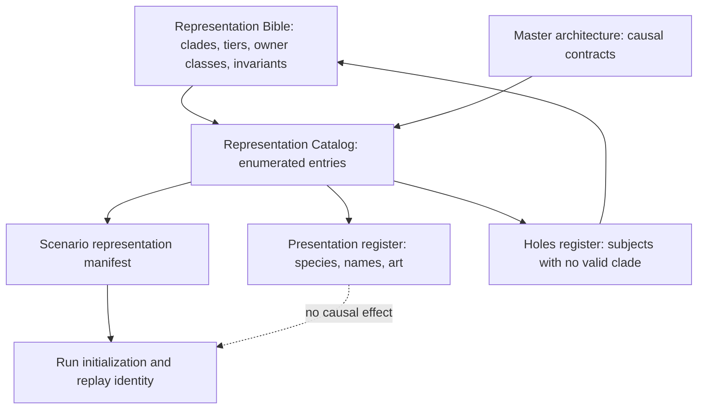

# Representation Catalog

### Summary of change request

The Representation Bible defines the compact: identity clades, owner classes, closed fidelity tiers, affiliation families, promotion contracts, approximation budgets, and species exclusions. It says how anything represented must be shaped. It does not say what is represented.

This pass develops the Representation Catalog: the enumerated inventory of subjects that actually receive representation, each assigned a clade, an owner class, permitted fidelity, fallback and residual contracts, and catalog eligibility. World-profile planning and future scenario-manifest selection are separate indexes over that catalog.

Its second purpose is falsification. Assigning real subjects to Bible clades is the cheapest available test of whether the clade set is complete. This document therefore performs a first population pass over everything already named across `task.md`, `04-design-discussion-minimum-simulation-kernel.md`, and `05-design-discussion-representation-bible.md`, and treats every subject that does not fit as a finding rather than an authoring problem to be smoothed over.

The complete first pass recorded fourteen candidate holes. Eight holes produced nine kind rows because H2 produced both `Outlet` and `Network`; six required no new kind, including the three category-error dissolutions H4, H8, and H9. All fourteen are closed. The remaining catalog work is to turn typed roster rows into complete stable-ID entries, define their relationships and transmissions, and deepen them in probe order.

### Current State

- The Bible's running kinds table enumerates twenty-eight representation kinds with required state, cognition permission, ownership permission, and fallback.
- The master document and the Bible together name several hundred candidate subjects — offices, institutions, staff units, banks, funds, infrastructures, markets, outlets, Pops, regions, sovereign systems, hazards, instruments, coalitions, and presets — scattered across illustrative tables that explicitly disclaim being rosters.
- The first population pass now has explicit authored fields and deterministic normalized roots. Catalog eligibility proves only that an instance contract may be selected by a future manifest; it is not campaign selection or runtime readiness.
- `profile.early_2006.bernankey` anchors Ben Bernankey to the Board Chair and FOMC Chair offices and assigns every instance one planning role. The future scenario representation manifest remains outside the catalog and must carry identity clades, owner classes, fidelity tiers, residual mappings, protected dimensions, permitted transitions, boundary-interface versions, adapter status, initialization reconciliation, fallbacks, and a replay hash.
- Burrow bank, Treasury basis trade, and Amazon region replacement are composition probes rather than scenarios. Their declared catalog requirements close; their runtime initialization remains blocked by explicit period, opening-state, residual, parameter, and calibration requirements. Probe acceptance must also account for every listed member rather than treating requirement-bearing members as coverage of the full composition.
- The nine post-ladder kinds are now present in the Bible: `LegalInstrument`, `FederatedSystem`, `Facility`, `PublishedReference`, `Outlet`, `Network`, `ScheduledProcess`, `Record`, and `StatefulExternalProcess`.
- Bible Question 54 now fixes a sixteen-attribute instrument-family contract. The
  fifteen rostered families are enumerated below, including honest nulls,
  first-slice buckets, and the Treasury-duration/secured-funding dependency cut.

### Desired End State

- Every subject Reservist intends to represent has one catalog entry with a stable identifier, an identity clade, a cognition class, a fidelity tier, a fallback entry, and a residual counterpart where one is required.
- A scenario representation manifest is assembled by selecting catalog entries and tiers, so manifest validity is checkable against the catalog rather than against prose.
- Every entry names which stocks, authorities, conditions, obligations, and observations it owns, and which it only projects or references.
- Entries that cannot be assigned a clade are recorded as holes with the specific mismatch, not forced into the nearest row.
- The catalog carries a research-status axis so an entry can be present and typed while its parameters, roster details, and prose remain unwritten.
- Presentation identity — species, name, art, voice — lives in a separate register keyed to catalog entries, so satire can change without touching causal identity or replay.
- Entry depth is prioritized by probe coverage, so the entries the probe ladder exercises are complete before the long tail is sketched.

### What we're not doing

- Selecting final parameters, balance-sheet values, response curves, cohort counts, or calibration bands for any entry.
- Writing complete historical rosters, biographies, dialogue, or prose for named people.
- Choosing final species assignments, character names, or art direction.
- Resolving the Bible's approximation tolerances or reopening any resolved Bible question.
- Building a simulation runtime, scenario initializer, or representation-manifest editor.
- Committing to a scenario launch list. Authored scenario availability remains empty until a real scenario manifest exists; profile and composition-probe rows never count as availability.
- Reopening closed holes without a requirement that survives the existing-kind, affiliation-family, Q47-promotion, fallback, and transmission dissolution tests.

## Proposed End State Architecture

The catalog sits between the Bible and the scenario manifest. It is content, but it is content that must typecheck against the Bible before a scenario may reference it.



The dashed edge is load-bearing. The presentation register must be able to change without changing the manifest hash.

### Catalog entry shape

```text
CatalogEntry
  catalog_id                    # stable across scenarios and content versions
  entry_class                   # type | instance
  instance_of                   # required type-entry catalog_id for instances
  selectable_in_manifest        # false for abstract type entries
  definition_version            # version of structural meaning, not tuning
  display_name
  identity_clade                # one Bible kind; a hole if none applies
  scope_refs[]                  # geographic or composition scopes; never ownership
  product_codes[]               # closed type-level flow vocabulary, where applicable
  canonical_ownership[]
    state_id
    state_kind                  # stock | condition | queue | authority |
                                # obligation | publication | clearing_result
    unit_or_value_domain
    conserved
    accepted_transition_kinds[]
    witness_kind
  projects_only[]               # what it references or displays but does not own
  cognition_class               # none | distributed_response | cohort_response
                                #      | participant_cognition | named_cognition
  authority_sources[]           # statute, charter, office, delegation, contract, none
  available_fidelity_tiers[]    # closed tiers from Bible Q44
  default_tier
  fallback_entry                # the catalog_id it degrades to
  fallback_preserves[]          # boundary outputs retained by the fallback
  fallback_loses[]              # internal causality honestly omitted
  residual_counterpart          # the cohort or aggregate it reconciles against
  residual_reconciliation[]     # stocks, capacity, exposure, or shares reconciled
  required_relationship_refs[]  # typed relationships without which it is invalid
  input_transmission_refs[]     # typed effects accepted from other owners
  output_transmission_refs[]    # typed effects exposed to other owners
  observation_surfaces[]        # what evidence it emits, to whom, with what delay
  action_domains[]              # action families it may originate, if any
  period_variants[]             # era-specific authority, charter, or eligibility
  scenario_availability[]       # probe or campaign scenarios that include it
  presentation_ref              # key into the presentation register
  research_status               # named | typed | sketched | researched | calibrated
  probe_coverage[]              # probes that exercise this entry
  fit                           # fits | strained | no_clade
  hole_refs[]
```

`fit` and `hole_refs` are permanent fields, not a migration artifact. The catalog's value as a falsification instrument depends on strain being recorded in the entry rather than resolved by picking the least-wrong clade.

Question 62 already establishes that catalog entries include types and instances. The added fields make that decision enforceable:

1. A type entry declares permitted state, interfaces, tiers, and fallback classes. It owns no runtime state and is not manifest-selectable.
2. A selectable instance references exactly one type entry whose `identity_clade` matches its own.
3. Every owned state row names its accepted mutation boundary and witness. `Owns climate state` or `owns inventory` is not a complete definition.
4. Every value crossing an owner boundary references a `TransmissionRecord`.
5. `fallback_entry` describes degradation. `residual_counterpart` describes named-plus-residual reconciliation. They may reference the same aggregate entry but answer different questions.
6. A null residual is valid only when selection does not carve a stock, capacity, exposure, population, or transaction share out of an aggregate.
7. Type entries may have null fallback and residual fields. Every selectable instance must declare the fallback required by its Bible kind.

### Catalog indexes

The primary index is by identity clade, because that is the axis the Bible governs and therefore the axis along which mismatch is visible. Four secondary indexes are derived:

```text
by clade          # primary; the fit test lives here
by scenario       # what a manifest may select
by channel        # which entries carry duration supply, dollar funding, CPI basket, ...
by presentation   # species and character register, causally inert
```

A domain-first index (`Fed`, `Treasury`, `markets`, `media`, `foreign`) was considered as primary and rejected: it groups by the thing the player experiences, which hides exactly the clade collisions this pass is meant to find. It remains useful as a reading view.

### Relationship and transmission registries

Relationships describe durable composition, scope, affiliation, ownership, or contractual structure. They do not stand in for causal propagation.

```text
CatalogRelationshipRecord
  relationship_id
  relationship_family          # Bible semantic family or closed structural relation
  subject_entry
  object_entry
  effective_period
  canonical_owner
  observability
  lifecycle_and_exit
  provenance
  witness_kind
```

Causal propagation uses the inherited `Transmission` committed interface:

```text
TransmissionRecord
  transmission_id
  producing_entry
  producing_state_or_output
  consuming_entry
  consuming_input
  payload_kind                 # quantity | distribution | constraint |
                               # availability | loss | clearing_result |
                               # observation
  unit_or_value_domain
  direction
  transformation_owner         # normally the consumer
  effective_delay
  persistence_or_expiry
  saturation_or_capacity_ref
  provenance
  witness_kind
  fallback_behavior
  scenario_availability[]
  probe_coverage[]
```

The producer may emit only state or results it owns. The consumer owns the response rule. A transmission may carry a constraint or distribution without claiming a fixed coefficient. Prices remain market clearing results; statistical releases remain measurement products; actor reactions remain owned decisions or distributed responses.

Products and commodities use the catalog's closed type-level flow vocabulary under resolved Question 74. `TIMBER`, `LUMBER`, `GREEN_COFFEE`, `ROASTED_COFFEE`, `FEED_GRAIN`, `LIVE_HOGS`, and `PORK` identify distinct material stages in stocks, flows, orders, contracts, and basket components. They are not instance-level subjects and receive no Bible kind. This applies the ownership boundaries established by the Bible and master architecture: industry cohorts own productive capacity and inventory; legal or accounting owners retain title to goods; stateful external processes own unowned evolving natural conditions and stocks; mechanical systems own transformations and queues; markets own clearing results.

### Physical product-family inventory

These definitions are normative catalog inventory records. Umbrella labels such as "timber," "coffee," and "pork" may organize a player-facing channel, but canonical positions and transmissions use the stage-specific codes below.

| Product code | Conserved quantity and stage | Ownership, origin, and quality | Decay and transformation | Dependencies and handling | Substitution, eligibility, and demand role |
|---|---|---|---|---|---|
| `TIMBER` | Standardized solid cubic meter; harvested raw roundwood | Titled inventory held by producer, trader, carrier, or buyer; region/site provenance retained where legality, grade, or exposure changes | Physical volume loss through damage or spoilage; consumed by witnessed milling recipe into `LUMBER` and by-products | Harvest rights, logging capacity, fuel, labor, road/river access, storage, and freight | Species/grade substitution is bounded; density and moisture are quality traits with typed conversion functions, not alternate additive units; delivery requires contract grade and legal provenance; demanded by mills and direct industrial users |
| `LUMBER` | Standardized volume; processed intermediate construction input | Titled inventory with mill, grade, treatment, and origin provenance where material | Damage and storage loss; produced only from `TIMBER` by witnessed milling yield | Mill capacity, energy, labor, treatment, storage, and freight | Substitution across grades and engineered materials is bounded; building-code and contract eligibility apply; demanded by construction and manufacturing |
| `GREEN_COFFEE` | Mass; harvested and processed raw agricultural commodity | Titled inventory with origin, crop year, grade, and certification where price or eligibility changes | Quality decay under moisture/storage conditions; consumed by witnessed roasting recipe | Harvest labor, water, processing, bags, storage, export handling, and freight | Origins and grades substitute imperfectly; delivery grades apply; demanded by roasters and traders |
| `ROASTED_COFFEE` | Mass; finished or near-finished food product | Titled inventory with roaster, roast profile, package, and origin blend where salient | Faster freshness decay than green coffee; produced only from `GREEN_COFFEE` with roasting and packaging loss | Roasting energy/capacity, packaging, storage, wholesale and retail distribution | Brand and beverage substitution is bounded; food-safety and contract eligibility apply; enters household and hospitality baskets |
| `FEED_GRAIN` | Mass and feed-energy equivalent; harvested agricultural input | Titled inventory with origin, crop year, moisture, and grade where material | Storage loss and quality decay; consumed as livestock feed through a witnessed husbandry input allocation | Crop yield, fertilizer, water, energy, storage, rail/barge/truck capacity, and competing food/fuel demand | Feed formulations substitute within nutrition constraints; delivery and contamination rules apply; demanded by livestock producers |
| `LIVE_HOGS` | Headcount; live biological stock, with live-weight as a non-additive distribution on the cohort | Producer-owned biological inventory with location, health, weight distribution, and cohort provenance | Birth and mortality change conserved headcount; growth changes the weight distribution; disease, sale, and slaughter are witnessed transitions; slaughter yields `PORK` and by-products through a typed headcount-and-weight-to-mass conversion | Feed, water, veterinary capacity, housing, labor, heat tolerance, and transport | Biological substitution is slow; movement and health eligibility apply; demanded by slaughter/processing systems |
| `PORK` | Carcass-weight equivalent; processed perishable food product | Titled chilled/frozen inventory with processor, cut/grade, origin, and custody provenance where material | Cold-chain spoilage and loss; produced only from `LIVE_HOGS` by witnessed slaughter/processing yield | Slaughter capacity, inspection, labor, energy, refrigeration, packaging, storage, and freight | Cuts and proteins substitute imperfectly; inspection and cold-chain eligibility apply; enters household, hospitality, and food-processing baskets |

The family definitions keep legal ownership separate from custody and process control. No family owns its inventory. A stateful ecological process may own standing unowned biomass or disease conditions, but a concession holder owns extraction rights and harvested `TIMBER`; livestock owners own `LIVE_HOGS`; processors own goods according to the applicable purchase, tolling, custody, and settlement clauses.

### Physical transformation definitions

| Transformation ID | Owner | Input and output accounts | Capacity, loss, and witness | Fallback |
|---|---|---|---|---|
| `recipe.timber.milling` | Selected mill `MechanicalSystem` | Consumes titled `TIMBER`; produces titled `LUMBER` plus declared by-products | Mill queue, grade-dependent yield, energy and labor constraints; transformation and balanced inventory witnesses | `adapter.transform.timber_milling` preserves accepted input, output, delay, loss, and provenance |
| `recipe.coffee.roasting` | Selected roaster `MechanicalSystem` | Consumes titled `GREEN_COFFEE`; produces titled `ROASTED_COFFEE` | Roaster queue, roast loss, energy, packaging, and quality constraints; transformation and inventory witnesses | `adapter.transform.coffee_roasting` preserves accepted input, output, delay, loss, and provenance |
| `recipe.hogs.slaughter` | Selected slaughter/cold-chain `MechanicalSystem` | Consumes titled `LIVE_HOGS`; produces titled `PORK` plus declared by-products and waste | Inspection, slaughter and refrigeration capacity, yield, mortality, and loss; transformation and inventory witnesses | `adapter.transform.hogs_slaughter` preserves accepted input, output, delay, loss, and provenance |

`FEED_GRAIN` consumption is not a direct conversion into meat. Husbandry allocates feed, water, labor, and capacity to `LIVE_HOGS`; biological growth and mortality occur through witnessed state transitions before any slaughter recipe can produce `PORK`.

### Regional entry completion contract

Every selectable regional entry below uses `definition_version: 1`, `selectable_in_manifest: true`, `hole_refs: []`, and a null `presentation_ref` until presentation content exists. Type entries remain non-selectable and own no runtime state. A selectable instance is invalid unless it supplies:

1. A matching `instance_of` type, scope references, permitted fidelity tiers, authority source or explicit `none`, fallback, residual rule, research status, and probe coverage. Scenario availability is required only when an authored manifest binds the entry.
2. Stable owned-state identifiers with state kind, unit or value domain, conservation flag, accepted transition kinds, and owner-specific witness.
3. Full relationship records with an effective period, relationship-ledger owner, observability, lifecycle, provenance, and witness.
4. Full transmission records with stable endpoints, payload kind and units, transformation owner, delay, persistence, capacity reference, provenance, witness, fallback behavior, and probe coverage. Scenario availability is present only when an authored scenario manifest binds the transmission.
5. Stage-correct product codes and a witnessed transfer, transformation, loss, delivery, and settlement route wherever goods change owner, custody, or material stage.

The selected manifest chooses exactly one implementation behind each process, transformation, flow, demand, and market boundary. Rich mechanisms and adapters share interface identifiers; a transmission targets the selected interface, while replay identity records the concrete provider. A fallback therefore changes the provider, not the consumer-visible endpoint.

### The holes register

A hole is recorded when a named subject cannot be assigned a clade without either inventing state the clade forbids or discarding a causal function the subject has. Each hole carries the subject that exposed it, the nearest clades and why each fails, whether the Bible already flagged it, and whether it is a catalog decision or a Bible amendment.

## First Population Pass

The roster below is the first pass over subjects already named in the prior documents. It is not complete and does not claim these are launch content. Every row is a content hypothesis; the `fit` column is the finding.

### Clade: Person, Office, DecisionBody, StaffUnit

| Subject | Clade | Notes | Fit |
|---|---|---|---|
| Fed Chair (player) | Person + Office | Board Chair and FOMC Chair are separate offices; the FOMC elects its own chair annually | fits |
| Vice Chair, Vice Chair for Supervision, governors | Person + Office | Vice Chair for Supervision holds statutory powers the others lack | fits |
| Reserve Bank presidents | Person + Office | NY president is FOMC Vice Chair by custom, not statute; voting rotation is statutory | fits |
| Chair's chief of staff | Person | Autonomous agenda Agent; office confers access, not authority | fits |
| Division directors (Monetary Affairs, Financial Stability, Supervision, Legal, Communications, Research, International, Markets) | Person or role-holder | Tier varies by whether individual discretion changes a channel | fits |
| President, Treasury Secretary, NEC/CEA principals | Person + Office | fits | fits |
| Congressional leaders, Banking/Financial Services chairs and ranking members | Person + Office + DecisionBody membership | fits | fits |
| FDIC chair, OCC Comptroller, SEC chair, CFTC chair | Person + Office | fits | fits |
| Bank and fund executives; primary-dealer rates heads | Person + executive mandate | Bible Dialectic I worked example | fits |
| Foreign principals: Saudi Crown, Aramco CEO, SAMA governor, PIF head, Israeli PM, BoI governor, Iranian Supreme Leader / president / IRGC / CBI head, Xi, PBOC governor, SAFE head, ECB president, BOJ governor, MOF vice-minister for international affairs, BoE governor, DMO chief | Person + Office | Promotion follows distinct action ownership, not rank | fits |
| Media role-holders: AFTV host, GNBC anchor, WSJ Fed reporter | Limited role-holder in an `Outlet` office | Action domain restricted to distribution verbs; they are the counterparty in an access trade, never a principal in a policy bargain — Q68 | fits |
| HonkBox macro accounts | Person, Institution, or automated account source plus a `Network` participation edge | The account originates claims into the platform network; it does not acquire an `Outlet` office unless a separately catalogued editorial operation selects and frames a slate | fits |
| Media owners and editorial principals | Person + Office | Distinct from on-air personalities: a proprietor holds elite access, coalition sponsorship, and political relationships that a host does not — see Q68 | fits |
| FOMC | DecisionBody | Membership, rotation, quorum, votes, dissents | fits |
| Board of Governors as a voting body | DecisionBody | Distinct from Board as Institution; authorizes facilities and supervisory actions | fits |
| Reserve Bank boards of directors | DecisionBody | Sets discount rate subject to Board review — a two-body authority chain | fits |
| FDIC board, FSOC, Senate (confirmation), Senate Banking, House Financial Services | DecisionBody | fits | fits |
| TBAC | DecisionBody with no authority | Advisory only; produces recommendations that are Claims, not authorizations | fits |
| ECB Governing Council, BOJ Policy Board | DecisionBody | fits | fits |
| Fed staff divisions and NY Fed Markets Group | StaffUnit | Markets Group owns SOMA execution; promotion justified by execution ownership | fits |
| Treasury Office of Debt Management; OFR | StaffUnit | fits | fits |
| Bank ALM/treasury; fund risk, PM, and execution desks | StaffUnit | fits | fits |

### Clade: Institution, OrganizationCohort, NamedFirm, IndustryCohort

| Subject | Clade | Notes | Fit |
|---|---|---|---|
| Federal Reserve System | FederatedSystem | Board, twelve separately chartered Reserve Banks, and FOMC bound by a dual mandate none may decline; owns no stocks, and the consolidated balance sheet is derived | fits |
| Board of Governors | Institution | Federal agency; owns no SOMA assets | fits |
| Federal Reserve Bank of New York; other eleven Reserve Banks | Institution | Separately chartered corporations with member-bank capital | fits |
| Treasury | Institution | Includes ESF as a distinct account with distinct authority | fits |
| White House / EOP | Institution | fits | fits |
| Congress | Institution + DecisionBody set | Chambers and committees are procedure, not subsidiaries | fits |
| FDIC, OCC, SEC, CFTC, NCUA, FHFA, CFPB | Institution | Overlapping jurisdiction is a relationship, not containment | fits |
| BLS, BEA, Census | Institution + owned MechanicalSystem | Two entries: the agency has a budget, staff, and a director; the measurement owns sampling, seasonal adjustment, reference period, and revision — Q60 | fits |
| Fannie Mae, Freddie Mac, FHLB system | Institution | Conservatorship is a live `ResolutionProceeding`, not a static attribute | fits |
| Systemically important banks; primary dealers | Institution | Primary-dealer status is a facility eligibility rule plus a conferred-designation affiliation, not a clade — Bible Q53 | fits |
| Burrow Bank (regional bank probe) | Institution | Control case; fully worked below | fits |
| Pamplona Brothers; Macro Fund 7 | Institution | fits | fits |
| Money-market fund complexes, pensions, insurers, asset managers | Institution or OrganizationCohort by tier | fits | fits |
| FICC, CME Clearing, DTCC, CLS, tri-party custodians | Institution | Each is a chartered firm with a board, members, accounts, and discretionary acts (margin, membership, default management); the machinery each operates is a promoted subobject under Bible Q47 — see H4 | fits |
| IMF, BIS | Institution | fits | fits |
| Foreign central banks, finance ministries, sovereign funds, state banks | Institution | Promoted independently of their sovereign container | fits |
| Community banks and credit unions by size, geography, funding mix | OrganizationCohort | fits | fits |
| Non-primary broker-dealers; small hedge funds; regional insurers | OrganizationCohort | fits | fits |
| Municipalities by rating and market access | OrganizationCohort | Bible Dialectic III worked example (New York City) | fits |
| Nonprofits, endowments, payroll intermediaries | OrganizationCohort | Uninsured-depositor probe requires these as legal persons | fits |
| Membership and advocacy organizations | Institution; OrganizationCohort for local chapters | Enumerated separately below | fits |
| Small businesses | OrganizationCohort or IndustryCohort | Ordinary firms with ordinary flows, differing from large firms in scale, financing access, formation and failure rates, and cash buffer — all parameters, not structure. The owner link is a `Borrower` affiliation edge carrying a guarantee, not a merged representation | fits |
| Strategic semiconductor fab; dominant platform; shipping line; defense prime; major energy producer | NamedFirm | Content hypotheses; Aramco remains a `NamedFirm`, with state ownership, public mandate, sovereign scope, and political access represented through relationships and authority records rather than a second clade | fits |
| Autos, construction, energy-intensive manufacturing, food processing, tech hardware, retail, hospitality, health, education, agriculture, logistics | IndustryCohort | fits | fits |

### Membership and advocacy organizations

Every one of these is an `Institution` — no clade pressure. They earn a dedicated table because they are the mechanism by which a Pop's material position becomes pressure on anyone, which Bible P49 requires and which nothing else in the catalog supplies. Local chapters and the long tail fall back to `OrganizationCohort`.

Ordered by proximity to a modeled Fed channel rather than by size:

| Organization | Represented constituency | Fed-facing channel | Fit |
|---|---|---|---|
| Investment company institute analogue | Money-market and mutual funds | Money-fund reform, gates and fees, RRP access — core to the repo circuit | fits |
| Bank policy institute; American Bankers Association; independent community bankers | Large banks; all banks; community banks | Capital and SLR treatment, deposit-insurance limits, discount-window stigma, supervisory burden. These three contest each other, which is the point | fits |
| Securities industry association | Dealers and market makers | Treasury market structure and central clearing — already a named player action | fits |
| Managed funds association | Hedge funds | Enhanced hedge-fund reporting — also already a named player action | fits |
| Mortgage bankers; realtors; homebuilders | Originators; agents; builders | Mortgage rates, housing supply, GSE policy — the most politically salient transmission channel | fits |
| Retiree association (AARP analogue) | Retirees and near-retirees | Interest income, inflation salience, benefit indexation, and the largest turnout weight of any constituency | fits |
| Small-business federation; chamber of commerce | Small firms; business generally | Small-business credit conditions, "Main Street versus Wall Street" framing | fits |
| Labor federation and member unions | Workers by sector | Employment mandate, wage pressure, the distributional critique of tightening | fits |
| Community reinvestment and consumer-finance advocates | Low-income and underserved borrowers | Supervision, CRA, and the legitimacy axis specifically | fits |
| Farm bureau analogue | Agricultural producers | Farm credit, commodity prices, regional bank concentration | fits |
| Policy institutes and think tanks | No membership; produce Claims | Testimony, published research entering as evidence, NARRATIVE_AMPLIFICATION participation | fits |

Four of these map onto player actions already named in the original brief — central clearing, hedge-fund reporting, supervisory guidance, and discount-window messaging — which is the argument that they are first-slice content rather than late flavor.

### Clade: population and lenses

| Subject | Clade | Notes | Fit |
|---|---|---|---|
| Person cells keyed by scenario-active dimensions | PersonPopulationCell | Active key is scenario-bounded per Bible Q18 | fits |
| Household cohorts with member-slot distributions | HouseholdCohort | fits | fits |
| Young renters; affluent homeowners; retirees; low-income service workers; high-income professionals; retail traders | PopLens | fits | fits |
| Fixed-rate owners by mortgage vintage | PopLens | Lock-in is a housing-tenure conditional, not a cell key unless it gates a transaction | fits |
| Suburban parents facing childcare costs | PopLens over households | Bible Dialectic III worked example | fits |
| Leftist male college students at Georgia Tech | PopLens | Bible Dialectic III worked example | fits |
| Strategic production workers (fab technicians) | PopLens over a protected tail | Pivotal-tail override applies | fits |
| Uninsured depositors | PopLens spanning person cells and organization cohorts | Must declare its aggregation unit — dollars of uninsured balance, never headcount, since `mass` means people on one side and organizations on the other. Worked below; Q61 | fits |

### Clade: markets, mechanisms, facilities, instruments

| Subject | Nearest clade | Notes | Fit |
|---|---|---|---|
| Treasury auction | Market | Single-price protocol with dealer, direct, and indirect bidders; the `Market` row's required state already covers eligibility, bids, constraints, clearing state, residuals, failure, and calendar | fits |
| Treasury secondary market by maturity bucket | Market | fits | fits |
| Bilateral repo contract network | `Agreement` instances + derived exposure cache | The network owns nothing; contracts own terms, participants own positions, an index makes the graph queryable | fits |
| Tri-party repo | MechanicalSystem, operated by an Institution | Allocation and operational availability are machinery; the custodian's intraday-credit decision is a discretionary institutional act | fits |
| FICC sponsored and GCF repo | Institution (FICC) + promoted clearing subobject | Margin methodology, netting, and default management are discretionary; the matching and netting engine is a Q47 subobject with FICC as declared parent owner | fits |
| Standing Repo Facility; Reverse Repo Facility; discount window; FIMA repo; 13(3) facilities | Facility | Institution-owned, authority-gated, take-up-dependent, Leash-reserving; worked below | fits |
| Swap lines | Agreement + Facility | Two objects: an agreement between two central banks that establishes a facility each side operates — Q56 | fits |
| Fed funds market | Market | fits | fits |
| IORB, discount rate, target range | Facility terms, or authorized institution state | Not a market and not a mechanism; an authorized parameter. IORB and the discount rate are facility terms; the target range is an authorized objective the desk implements toward | strained |
| Fedwire Funds, Fedwire Securities, NSS, CHIPS | MechanicalSystem, operated by an Institution | The `MechanicalSystem` row already names settlement, queues, and capacities; extending the operating window is a discretionary act by the operator, not by the system | fits |
| FX spot, forward, and cross-currency basis | Market | fits | fits |
| MBS TBA; corporate bond; equity markets | Market | fits | fits |
| Treasury and SOFR futures | Market + Institution (CME) + promoted clearing subobject | Same decomposition as FICC repo | fits |
| Mortgage origination | MechanicalSystem | Rates posted, applications rationed by underwriting rather than by price — Q71 | fits |
| Deposit rate setting | MechanicalSystem | Banks post; deposits do not clear to a market-clearing price, which is why deposit betas are sluggish — Q71 | fits |
| Labor market | MechanicalSystem | Wages posted, unemployment persists at the going wage; clearing would delete search friction — Q71 | fits |
| Housing sales | Market | Listings clear against bids — Q71 | fits |
| Housing rents | MechanicalSystem | Posted, with vacancy persisting — Q71 | fits |
| Oil physical and futures markets | Market | fits | fits |
| Instrument families: Treasury bills/notes/bonds, TIPS, reserves, deposits, money-fund shares, repo, loans, agency MBS, corporate bonds, equity, swaps, futures, guarantees and credit lines | Closed vocabulary, not a kind — Bible Q54 and Catalog Q70 | Type-level, so no instance ever occupies a row. Positions live in accounts. The complete family inventory and first-slice buckets are below. Insured versus uninsured is one family plus a `LegalInstrument` condition; FX is not a family at all, since currency is an attribute of every instrument | fits |
| SOFR, EFFR, OBFR; CPI, PCE; par yield curve; ACM term premium | PublishedReference | Published values that contracts settle against; worked below | fits |
| MOVE, VIX, vendor indices; index membership | PublishedReference | Same, with a private publisher; index inclusion and exclusion force mandated buying and selling | fits |
| Credit rating agencies | Institution (the firm) + PublishedReference (the rating) | Two entries. A rating gates money-fund eligibility, collateral schedules, and mandate-driven holdings, so a downgrade is a forced-seller event — a published opinion with contractual and regulatory force and a known structural bias in who pays for it | fits |

### Clade: coordination, sovereign, geography, information, generators

| Subject | Nearest clade | Notes | Fit |
|---|---|---|---|
| Eight coalition families and their instances | Coalition | Bound to a `CoordinatingProposition` per Bible Q22 | fits |
| Swap agreements, regulator MOUs, MRA/GMRA, ISDA/CSA, sanctions coordination | Agreement | fits | fits |
| Treasury indemnification of a 13(3) facility from the ESF | Agreement + authority + coalition | Loss-sharing across two institutions with separate statutes; tests the facility and coalition boundaries at once | strained |
| Deposit insurance | `PRUDENTIAL_REQUIREMENT` clause on a `LegalInstrument`, conferring a condition on an account | Not a contract and not an instrument; its limit changes by era through legislation, and a limit change is an enacted amendment rather than a parameter edit | fits |
| Saudi Arabia, Israel, Iran, China, Japan, UK, Russia, UAE, Qatar | SovereignSystem | Composition root per Bible Q43 | fits |
| Euro area | FederatedSystem | ECB plus national central banks under a treaty price-stability mandate; the case that a federated system need not sit inside one sovereign | fits |
| ExternalRegion aggregates (Southeast Asia, Latin America, aggregated Europe) | BoundaryAdapter over Region | fits | fits |
| US states, metros, Census divisions | Region | fits | fits |
| Federal Reserve Districts | Region + jurisdiction | Boundary is both a geography and an institutional catchment | fits |
| Hormuz, Suez, Panama, Taiwan Strait, Amazon basin | Region | Chokepoints are Regions whose capacity a mechanism owns | fits |
| Loonberg, Wool Street Journal, GNBC, AFTV | Outlet + Institution (operator) | Two entries each: the company owns money and contracts, the outlet owns the slate and access map | fits |
| GooseTogetherStrong | Network | Retail forum with no editorial office; a scenario needing discretionary moderation adds a separately catalogued operating Institution, moderator role-holder, and Outlet rather than changing this Network's clade | fits |
| HonkBox | Institution (platform firm) + Network (diffusion) + PopLens (posting population) | Three entries; the ranking model is `Network` state, not an actor | fits |
| The Herd | Network | No owner, no slate, no offices — the case `Network` exists for | fits |
| Weather, drought, wildfire, geological hazards, outbreak initiation, cyber, chokepoint blockage, technological breakthrough, gaffe and leak hazards, statistical release failure | Generator | fits | fits |
| Epidemic process, regional climate and agriculture process, war process | StatefulExternalProcess | Q50 separates evolving process state from Generator draws and actor-owned interventions | fits |
| Auction calendar, statistical release calendar, FOMC calendar, blackout period | ScheduledProcess | Published occurrences others plan against, plus the eligibility windows derived from them; distinct from the Chair's private agenda calendar | fits |
| Primary-dealer designation, SRF counterparty eligibility, discount-window eligibility, FIMA account holder status, swap-line counterparty status | `DESIGNATION_REGIME` or `Facility` eligibility rule plus conferred-designation affiliation | The rule owns conferral, review, and revocation; the affiliation edge records the subject's effective status and resulting eligibility — Bible Q53 | fits |
| CaseFile, Assessment, AnalyticalTask, InstitutionalProject, PolicyPackage, ChairmanshipProgram, ResolutionProceeding, LegacyDossier | Record | Durable records with identity, lifecycle, ownership transfer, and persistence; `ResolutionProceeding` is a subtype whose transitions are statutory | fits |
| Chair, doctrine, organization, and scenario presets | — | Catalog-adjacent; they select entries rather than being entries | strained |

## Regional Real-Economy Entity Definitions

This section converts the existing statement that Amazon climate state can affect timber, coffee, and pork into catalog entries and typed transmissions. It is a reusable pattern for every regional supply mapping:

```text
Generator
  -> StatefulExternalProcess
  -> IndustryCohort constraints
  -> IndustryCohort supply actions
  -> MechanicalSystem physical flows
  -> Market clearing
  -> downstream typed observations and input conditions
```

No `affects` edge is causal by itself. The Region scopes the mapping but owns none of its weather draws, process conditions, productive stocks, goods, prices, or downstream outcomes.

### Definition type entries

These entries define reusable structure and are not manifest-selectable.
Every row has `entry_class: type`, `instance_of: null`,
`selectable_in_manifest: false`, `definition_version: 1`, `fit: fits`, and no
runtime canonical ownership.

| Catalog ID | Bible kind | Required definition |
|---|---|---|
| `type.region.ecological_scope` | `Region` | Versioned boundary, parent scopes, jurisdiction intersections, process and industry references, observation scopes, parent-region fallback |
| `type.region.aggregate_scope` | `Region` | Versioned aggregate boundary, child/overlap refs, residual population/site/resource/process refs, observation scope, broader-region fallback |
| `type.generator.regional_climate_hazard` | `Generator` | Keyed draw state, occurrence history, typed initiating facts, scope, observation policy, incident-tape fallback |
| `type.process.regional_climate_agriculture` | `StatefulExternalProcess` | Evolving physical conditions, transition rules, stage history, hazard references, actor intervention inputs, typed production constraints, observations, replacement-boundary version |
| `type.industry.regional_product` | `IndustryCohort` | Product code, capacity, input and output inventories, employment, financing, margins, response distributions, supply actions, regional scope, aggregate residual |
| `type.mechanical.product_flow` | `MechanicalSystem` | Product code, physical transformations, delivery queues, transport capacity, storage, losses, titled-stock references, typed supply and delivery interfaces |
| `type.mechanical.product_demand` | `MechanicalSystem` | Product code, accepted participant requests, demand-aggregation queue, substitution and access constraints, versioned demand schedule, observation and replacement interfaces |
| `type.mechanical.regional_sector` | `MechanicalSystem` | Stage-correct sector capacity, inventories, input constraints, employment and finance aggregates, response state, supply outputs, observations, and explicit residual/source accounts |
| `type.market.product` | `Market` | Product code, eligible participants, orders or schedules, constraints, clearing state, residuals, failure state, calendar, observations |
| `type.adapter.typed_boundary` | `BoundaryAdapter` | Interface version, declared external accounts, deterministic state, preserved outputs, provenance, replacement metadata |

Type-entry permissions complete those definitions:

| Type ID | Permitted canonical state schema | Permitted interfaces | Permitted tiers and cognition | Required fallback class |
|---|---|---|---|---|
| `type.region.ecological_scope` | Boundary/version, parent and overlap refs, jurisdiction intersections, scoped population/site/resource/process refs | Region relationship and scoped-observation interfaces only | `MECHANICAL_OR_ADAPTER`; none | Parent `Region` aggregate |
| `type.region.aggregate_scope` | Boundary/version, child and overlap refs, residual population/site/resource/process refs | Region relationship and scoped-observation interfaces only | `MECHANICAL_OR_ADAPTER`; none | Broader `Region` aggregate or scenario external-region adapter |
| `type.generator.regional_climate_hazard` | Keyed draws, occurrence history, initiating facts, observation policy | Typed incident outputs only | `MECHANICAL_OR_ADAPTER`; none | Incident-tape `BoundaryAdapter` |
| `type.process.regional_climate_agriculture` | Evolving physical conditions, stages, recovery, access, intervention history, typed constraint outputs | Incident and actor-intervention inputs; condition, constraint, and observation outputs | `MECHANICAL_OR_ADAPTER`; none | Process `BoundaryAdapter` with output parity |
| `type.industry.regional_product` | Capacity, product-stage inventories, inputs, employment, finance, contracts, offers, response distributions | Environmental, input, finance, and market-observation inputs; offers, employment, finance, and observations out | `ORGANIZATION_COHORT_RESPONSE`; cohort response | Product-flow or sector `MechanicalSystem`; a separate compatible `IndustryCohort` carries residual reconciliation |
| `type.mechanical.product_flow` | Capacity, queues, work in progress, custody, loss, transformation or delivery state, typed outputs | Typed quantity, contract, schedule, and condition inputs; quantity, availability, schedule, loss, and observation outputs | `MECHANICAL_OR_ADAPTER`; none | Interface-compatible `BoundaryAdapter` |
| `type.mechanical.product_demand` | Request queue, access/substitution constraints, demand schedule, external-account refs where applicable | Participant request or external-series inputs; versioned demand schedule out | `MECHANICAL_OR_ADAPTER`; none or distributed response behind inputs | Demand `BoundaryAdapter` |
| `type.mechanical.regional_sector` | Flattened capacity, stage-correct inventory/input state, employment, finance, response state, supply outputs, observations, and residual/source accounts | Same constraint, market-observation, product-offer, employment, finance, and observation boundary as the richer industry cohort | `MECHANICAL_OR_ADAPTER`; none | Compatible `IndustryCohort` or typed sector adapter |
| `type.market.product` | Eligibility, orders/schedules, bounded clearing state, allocations, residuals, failure state, immutable results | Supply/demand schedules in; clearing results and scoped observations out | `MECHANICAL_OR_ADAPTER`; none | Market `BoundaryAdapter` with result parity |
| `type.adapter.typed_boundary` | Interface version, external/source/sink accounts, deterministic provider state, replacement metadata | Exactly the committed boundary interfaces named by its instance | `MECHANICAL_OR_ADAPTER`; none unless the interface declares a response distribution | Endogenous provider or another adapter with the same interface version |

### Instance identity, fidelity, fallback, and residual assignments

| Catalog ID | Instance of | Product code | Clade | Default tier and cognition | Fallback entry | Residual counterpart | Fit |
|---|---|---|---|---|---|---|---|
| `region.sa.amazon_basin` | `type.region.ecological_scope` | none | `Region` | `MECHANICAL_OR_ADAPTER`; none | `region.sa.aggregate` | null | fits |
| `generator.climate.amazon_basin` | `type.generator.regional_climate_hazard` | none | `Generator` | `MECHANICAL_OR_ADAPTER`; none | `adapter.incident.amazon_basin.climate` | null | fits |
| `process.climate_agriculture.amazon_basin` | `type.process.regional_climate_agriculture` | none | `StatefulExternalProcess` | `MECHANICAL_OR_ADAPTER`; none | `adapter.process.amazon_basin.climate_agriculture` | null | fits |
| `industry.amazon_basin.forestry` | `type.industry.regional_product` | `TIMBER` | `IndustryCohort` | `ORGANIZATION_COHORT_RESPONSE`; cohort response | `mechanism.sector.sa.forestry` | `industry.sa.forestry.aggregate` | fits |
| `industry.amazon_basin.coffee` | `type.industry.regional_product` | `GREEN_COFFEE` | `IndustryCohort` | `ORGANIZATION_COHORT_RESPONSE`; cohort response | `mechanism.sector.sa.coffee` | `industry.sa.coffee.aggregate` | fits |
| `industry.amazon_basin.pork` | `type.industry.regional_product` | `LIVE_HOGS` | `IndustryCohort` | `ORGANIZATION_COHORT_RESPONSE`; cohort response | `mechanism.sector.sa.hog_production` | `industry.sa.pork.aggregate` | fits |
| `adapter.input.amazon_basin.feed_grain` | `type.adapter.typed_boundary` | `FEED_GRAIN` | `BoundaryAdapter` | `MECHANICAL_OR_ADAPTER`; none | `adapter.input.sa.feed_grain` | null | fits |
| `mechanism.transform.global.timber_milling` | `type.mechanical.product_flow` | `TIMBER`; `LUMBER` | `MechanicalSystem` | `MECHANICAL_OR_ADAPTER`; none | `adapter.transform.timber_milling` | null | fits |
| `mechanism.transform.global.coffee_roasting` | `type.mechanical.product_flow` | `GREEN_COFFEE`; `ROASTED_COFFEE` | `MechanicalSystem` | `MECHANICAL_OR_ADAPTER`; none | `adapter.transform.coffee_roasting` | null | fits |
| `mechanism.transform.global.hogs_slaughter` | `type.mechanical.product_flow` | `LIVE_HOGS`; `PORK` | `MechanicalSystem` | `MECHANICAL_OR_ADAPTER`; none | `adapter.transform.hogs_slaughter` | null | fits |
| `mechanism.flow.global.timber` | `type.mechanical.product_flow` | `LUMBER` | `MechanicalSystem` | `MECHANICAL_OR_ADAPTER`; none | `adapter.flow.global.timber` | null | fits |
| `mechanism.flow.global.coffee` | `type.mechanical.product_flow` | `GREEN_COFFEE` | `MechanicalSystem` | `MECHANICAL_OR_ADAPTER`; none | `adapter.flow.global.coffee` | null | fits |
| `mechanism.flow.global.pork` | `type.mechanical.product_flow` | `PORK` | `MechanicalSystem` | `MECHANICAL_OR_ADAPTER`; none | `adapter.flow.global.pork` | null | fits |
| `market.product.global.timber` | `type.market.product` | `LUMBER` | `Market` | `MECHANICAL_OR_ADAPTER`; none | `adapter.market.global.timber` | null | fits |
| `market.product.global.coffee` | `type.market.product` | `GREEN_COFFEE` | `Market` | `MECHANICAL_OR_ADAPTER`; none | `adapter.market.global.coffee` | null | fits |
| `market.product.global.pork` | `type.market.product` | `PORK` | `Market` | `MECHANICAL_OR_ADAPTER`; none | `adapter.market.global.pork` | null | fits |

The instance rows above are manifest-selectable at the listed default tier. Their full permitted-tier and scope assignments are:

| Entry group | Display name and scope refs | Authority sources | Available fidelity tiers | Period variants | Scenario availability, research status, and probe coverage |
|---|---|---|---|---|---|
| `region.sa.amazon_basin` | Amazon Basin; `region.sa.aggregate` plus versioned jurisdiction overlaps | none; scope is not authority | `MECHANICAL_OR_ADAPTER` | Boundary versions only | Regional supply and climate scenarios; typed; regional supply mapping probe |
| `generator.climate.amazon_basin` | Amazon climate hazards; `region.sa.amazon_basin` | none | `MECHANICAL_OR_ADAPTER` | Hazard-model versions | Regional supply and climate scenarios; typed; hazard-to-process and replay probes |
| `process.climate_agriculture.amazon_basin` | Amazon climate/agriculture process; `region.sa.amazon_basin` | none; intervention authority remains with actors | `MECHANICAL_OR_ADAPTER` | Process-model versions | Regional supply and climate scenarios; typed; multi-output, fallback, partial-observation, and replay probes |
| Three Amazon industry cohorts | Amazon forestry, coffee production, and hog production; `region.sa.amazon_basin` | Charters, property/extraction rights, contracts, and applicable regulation by reference | `ORGANIZATION_COHORT_RESPONSE` | Era-specific rights and regulation refs | Product-specific regional supply scenarios; typed; differentiated-response, residual, and witness probes |
| `adapter.input.amazon_basin.feed_grain` | Amazon feed-grain boundary; `region.sa.amazon_basin` and `region.sa.aggregate` | none | `MECHANICAL_OR_ADAPTER` | Provider/interface versions | Hog-supply scenarios; typed; input-boundary and fallback probes |
| Three transformation mechanisms | Timber milling, coffee roasting, and hog slaughter/cold chain; selected site and market scopes | Contracts, permits, inspection rules, and operator delegations by reference | `MECHANICAL_OR_ADAPTER` | Recipe, inspection, and provider versions | Product-chain scenarios selecting the transformation; typed; stage, loss, title/custody, and fallback probes |
| Three global product flows | Global lumber, green-coffee, and pork logistics; route, storage, custody, and market scopes | Contracts and custody grants by reference | `MECHANICAL_OR_ADAPTER` | Route/provider versions | Product-chain scenarios; typed; residual supply, delivery, loss, and fallback probes |
| Three global product markets | Global lumber, green-coffee, and pork clearing; eligible participant and delivery scopes | Market rules, contracts, and applicable regulation by reference | `MECHANICAL_OR_ADAPTER` | Rulebook and provider versions | Product-chain scenarios; typed; clearing, failure, observation, and fallback probes |

All rows use `definition_version: 1`, `hole_refs: []`, and `presentation_ref: null`. The three grouped rows expand to one assignment per listed instance; grouping is editorial and does not create a runtime aggregate. Fallback preservation and loss are defined in the fallback table, and each selected provider's concrete relationship and transmission IDs are part of the manifest validation record.

The referenced supporting entries use compact catalog definitions rather than full worked-entry prose:

| Supporting catalog ID | Clade | Required preserved role |
|---|---|---|
| `region.sa.aggregate` | `Region` | Parent South American scope and boundary provenance |
| `adapter.incident.amazon_basin.climate` | `BoundaryAdapter` | Scenario-supplied initiating incidents with stable identity, timing, scope, and observation policy |
| `adapter.process.amazon_basin.climate_agriculture` | `BoundaryAdapter` | Amazon production-constraint outputs with timing and provenance but no actor feedback into physical state |
| `adapter.input.sa.feed_grain` | `BoundaryAdapter` | South American feed-grain availability, price, and provenance when the Amazon feed boundary is flattened |
| `adapter.transform.timber_milling` | `BoundaryAdapter` | Accepted `TIMBER`, delivered `LUMBER`, yield loss, delay, grade, title, and provenance |
| `adapter.transform.coffee_roasting` | `BoundaryAdapter` | Accepted `GREEN_COFFEE`, delivered `ROASTED_COFFEE`, roast loss, delay, title, and provenance |
| `adapter.transform.hogs_slaughter` | `BoundaryAdapter` | Accepted `LIVE_HOGS`, delivered `PORK`, by-products, loss, inspection, cold-chain state, title, and provenance |
| `industry.sa.forestry.aggregate` | `IndustryCohort` | Full South American forestry cohort when Amazon is flattened; non-Amazon residual when Amazon is explicit |
| `industry.sa.coffee.aggregate` | `IndustryCohort` | Full South American coffee cohort or reconciled non-Amazon residual |
| `industry.sa.pork.aggregate` | `IndustryCohort` | Full South American pork cohort or reconciled non-Amazon residual |
| `mechanism.sector.sa.forestry` | `MechanicalSystem` | Flattened South American forestry response preserving capacity, `TIMBER` inventory/supply, employment, finance, and observation boundaries |
| `mechanism.sector.sa.coffee` | `MechanicalSystem` | Flattened South American coffee response preserving capacity, `GREEN_COFFEE` inventory/supply, employment, finance, and observation boundaries |
| `mechanism.sector.sa.hog_production` | `MechanicalSystem` | Flattened South American hog response preserving capacity, `FEED_GRAIN` inputs, `LIVE_HOGS` inventory/supply, employment, finance, and observation boundaries |
| `adapter.flow.global.timber` | `BoundaryAdapter` | `LUMBER` supply, inventory, delivery, delay, loss, and failure outputs |
| `adapter.flow.global.coffee` | `BoundaryAdapter` | `GREEN_COFFEE` supply, inventory, delivery, delay, loss, and failure outputs |
| `adapter.flow.global.pork` | `BoundaryAdapter` | Pork supply, inventory, delivery, delay, loss, and failure outputs |
| `adapter.supply.row.timber` | `BoundaryAdapter` | Rest-of-world `TIMBER` offers backed by an external source account, with grade, origin, title, contract, timing, and provenance |
| `adapter.supply.row.green_coffee` | `BoundaryAdapter` | Rest-of-world `GREEN_COFFEE` offers backed by an external source account, with grade, origin, title, contract, timing, and provenance |
| `adapter.supply.row.live_hogs` | `BoundaryAdapter` | Rest-of-world `LIVE_HOGS` offers backed by an external source account, with health/weight distribution, origin, title, contract, timing, and provenance |
| `adapter.demand.global.timber` | `BoundaryAdapter` | Versioned aggregate `LUMBER` demand schedule, external demand account, provenance, and observation policy |
| `adapter.demand.global.coffee` | `BoundaryAdapter` | Versioned aggregate `GREEN_COFFEE` demand schedule from roasters, external demand account, provenance, and observation policy |
| `adapter.demand.global.pork` | `BoundaryAdapter` | Versioned aggregate pork demand schedule, external demand account, provenance, and observation policy |
| `mechanism.demand.global.timber` | `MechanicalSystem` | Endogenous aggregation of participant requests into a constrained timber demand schedule; falls back to `adapter.demand.global.timber` |
| `mechanism.demand.global.coffee` | `MechanicalSystem` | Endogenous aggregation of participant requests into a constrained coffee demand schedule; falls back to `adapter.demand.global.coffee` |
| `mechanism.demand.global.pork` | `MechanicalSystem` | Endogenous aggregation of participant requests into a constrained pork demand schedule; falls back to `adapter.demand.global.pork` |
| `adapter.market.global.timber` | `BoundaryAdapter` | `LUMBER` price, quantity, rationing, liquidity, failure, and observation outputs |
| `adapter.market.global.coffee` | `BoundaryAdapter` | `GREEN_COFFEE` price, quantity, rationing, liquidity, failure, and observation outputs |
| `adapter.market.global.pork` | `BoundaryAdapter` | Pork price, quantity, rationing, liquidity, failure, and observation outputs |
| `adapter.real.us.construction_inputs` | `BoundaryAdapter` | U.S. construction `LUMBER` demand schedule and received clearing-result inputs |
| `adapter.real.us.food_baskets` | `BoundaryAdapter` | U.S. `ROASTED_COFFEE` and `PORK` purchase schedules plus received price, quantity, and availability inputs |
| `adapter.real.us.housing_activity` | `BoundaryAdapter` | Construction input-cost/availability conditions to housing starts, builder margins, employment demand, and financing-demand boundary outputs |
| `mechanism.measurement.us.consumer_prices` | `MechanicalSystem` | CPI/PCE basket sampling, weights, quality treatment, reference periods, release schedule, revision state, and published-reference inputs |

Supporting entries are instances with `definition_version: 1`, `selectable_in_manifest: true`, `presentation_ref: null`, `hole_refs: []`, and `MECHANICAL_OR_ADAPTER` unless the row below states the cohort-response tier. Their remaining required fields are:

| Supporting group | `instance_of`, scope, and owned state | Fallback, residual, and reconciliation | Required interfaces and probe coverage |
|---|---|---|---|
| `region.sa.aggregate` | `type.region.aggregate_scope`; South America; owns boundary/version and child/overlap references, including `state.region_sa.boundary` | Broader external-region adapter; no residual because Region owns no represented goods or population by virtue of scope | Region relationships and scoped observations; parent-scope and replay probes |
| Amazon incident/process adapters | `type.adapter.typed_boundary`; Amazon Basin; own external incident/process-provider accounts, deterministic provider state, and the rich interface outputs | Endogenous generator/process providers; no residual | Exact incident or constraint interfaces of the replaced provider; fallback parity and replay probes |
| Three South American industry aggregates | `type.industry.regional_product`; South America; cohort-response tier; own full-or-residual capacity, stage-correct inventories, employment, finance, contracts, and supply offers | Matching `mechanism.sector.sa.*` fallback; when Amazon is explicit, each owns the non-Amazon residual | Same product-stage offer and observation interfaces as the explicit cohort; residual, global-supply closure, and fallback probes |
| Three South American sector mechanisms | Instances of `type.mechanical.regional_sector`; South America; own flattened capacity, inventory, input, employment, finance, supply, and observation-boundary state | Matching industry cohort when rich response is selected; no residual because each replaces behavior behind the cohort boundary | Exact stage-specific sector boundary interfaces; cohort-fallback parity and replay probes |
| Three transformation adapters | `type.adapter.typed_boundary`; selected transformation scope; own external source/sink accounts, deterministic work state, accepted input, released output, loss, delay, title/custody refs, and recipe-compatible outputs | Endogenous transformation mechanism; no residual | Exact recipe input/output interfaces; stage, loss, title/custody, and fallback probes |
| Three global flow adapters | `type.adapter.typed_boundary`; global delivery scope; own external source/sink accounts, deterministic queue/capacity state, supply schedules, delivery, loss, delay, and failure outputs | Endogenous global flow; no residual unless a route is promoted | Exact stage-specific flow inputs and supply-schedule outputs; delivery and fallback probes |
| Three rest-of-world supply adapters | `type.adapter.typed_boundary`; external-region source scope; own explicit source accounts and stage-specific supply offers | Rich regional/industry providers may replace a declared share; remaining external account persists as residual | Exact `TIMBER`, `GREEN_COFFEE`, or `LIVE_HOGS` offer interfaces; global-supply closure, residual, and replay probes |
| Three demand adapters | `type.adapter.typed_boundary`; global market scope; own external demand account and versioned stage-specific demand schedule | Endogenous demand mechanism; no residual | External-series input and exact demand-schedule output; demand-provider selection and fallback probes |
| Three endogenous demand mechanisms | `type.mechanical.product_demand`; global market scope; own participant-request queue, access/substitution constraints, and versioned demand schedule | Corresponding demand adapter; no residual | Participant requests in and exact demand schedule out; demand aggregation and replay probes |
| Three market adapters | `type.adapter.typed_boundary`; global delivery/clearing scope; own external clearing account and deterministic price, allocation, rationing, liquidity, failure, settlement-ref, and observation outputs | Endogenous product market; no residual | Exact supply/demand schedule inputs and `clearing_result`/observation outputs; no-magic-price and fallback probes |
| U.S. construction-input adapter | `type.adapter.typed_boundary`; U.S. construction scope; owns external construction-demand account and accepted lumber allocation/input state | Endogenous U.S. construction module; no residual | `LUMBER` demand schedule out and lumber clearing result in; downstream-isolation probe |
| U.S. food-basket adapter | `type.adapter.typed_boundary`; U.S. household/food scope; owns external purchase accounts and accepted `ROASTED_COFFEE` and `PORK` allocation/input state | Endogenous household basket and retail modules; no residual | Stage-correct purchase requests/results; downstream-isolation and CPI/PCE measurement-boundary probes |
| U.S. housing-activity adapter | `type.adapter.typed_boundary`; U.S. housing and construction scope; owns external housing/activity account and versioned builder-margin, starts, employment-demand, and financing-demand outputs | Endogenous housing/construction module; no residual | Construction cost/availability in and housing/activity boundary outputs; housing-transmission and fallback probes |
| U.S. consumer-price measurement | A `MechanicalSystem` instance of the Bible's measurement-system pattern; U.S. household basket scope; owns sampling, weights, methods, release/revision queue, and measurement outputs, not household goods or prices | Exogenous CPI/PCE series adapter; no residual | Basket expenditure/availability observations in and scheduled `PublishedReference` measurements out; measurement, revision, and partial-observation probes |

Each South American industry residual has separate state IDs for `capacity`, stage-correct `inventory`, `employment`, `finance`, `contracts`, and `supply_offer`. Initialization validates `source_total = explicit Amazon + non-Amazon residual` for every one of those states and rejects a full-total aggregate beside an explicit Amazon cohort. Each residual and rest-of-world provider submits its own offer into the selected global flow; neither is hidden inside the Amazon producer or its fallback.

### Canonical ownership and behavior

| Entry or group | Canonical ownership | Projects or references only | Action domains | Observation surfaces |
|---|---|---|---|---|
| `region.sa.amazon_basin` | Boundary and version; parent-scope links; jurisdiction intersections; scoped process and industry references | Process conditions, resources, firms, people, goods, prices | none | Boundary publications, regional bulletins, jurisdiction-scoped reports |
| `generator.climate.amazon_basin` | Keyed precipitation, temperature, ignition, wind, and fire draws; occurrence history; initiating facts; observation policy | Current process condition and downstream losses | none | Weather observations and incident notices under declared delays and measurement limits |
| `process.climate_agriculture.amazon_basin` | Soil moisture; precipitation and heat state; fire-affected area; ecological recovery; water, access, and navigability conditions; stage and intervention history | Producer inventory and decisions, goods, prices, downstream inflation | none; actor interventions enter as typed inputs | Delayed physical measurements, crop and fire bulletins, remote-sensing estimates |
| `industry.amazon_basin.forestry` | Productive and harvest capacity; harvested timber inventory; inputs; employment; financing; margins; contracts and supply offers | Process conditions, transport state, market price | harvest, substitution, inventory, employment, finance, contract, supply offer | Producer reports, inventory observations, employment data, claims |
| `industry.amazon_basin.coffee` | Productive capacity; plant and harvest state; `GREEN_COFFEE` inventory by modeled grade; inputs; employment; financing; margins; contracts and supply offers | Process conditions, transport state, green-coffee market price | planting, harvest, substitution, storage, employment, finance, contract, supply offer | Crop estimates, exporter reports, inventory observations, claims |
| `industry.amazon_basin.pork` | Husbandry capacity; `LIVE_HOGS` inventory by health and weight; `FEED_GRAIN`, water, and other inputs; employment; financing; margins; contracts and live-hog supply offers | Process conditions, feed inputs, transport state, pork-market observations | feed substitution, breeding, growth, herd reduction, inventory, employment, finance, contract, supply offer | Producer, herd, health, inventory, and attributed-claim observations |
| Three transformation mechanisms | Input acceptance, recipe queue, capacity, work in progress, by-products, yield, losses, and output release; title and custody remain on declared accounts | Participant-owned titled goods, contracts, energy, labor, inspection, and delivery state | none | Accepted input, output quantity and grade, loss, delay, rejection, and failure observations |
| Three product-flow mechanisms | Aggregation, storage and delivery queues; transport capacity; spoilage or physical loss; residual inventory only where assigned | Participant-owned titled goods and market prices | none | Delivered quantity, delay, congestion, loss, queue, and availability observations |
| Three product-demand adapters or mechanisms | Declared external demand accounts for adapters; accepted request queues and versioned aggregate demand schedules for endogenous mechanisms | Participant beliefs, preferences, budgets, and inventories | none | Submitted demand schedules, unmet requests, access limits, and provenance |
| Three product markets | Eligible participants; orders or schedules; clearing state; residual demand and supply; failure state; immutable clearing results | Participant inventories, process conditions, beliefs | none | Public or scoped clearing price, quantity, depth, rationing, and failure observations |

The external process owns constraints, not production. Its pork mapping is decomposed into feed availability and operating conditions such as heat, water, disease suitability, and regional transport. The pork cohort owns the response. No process transition writes `pork output down`.

Product-flow mechanisms own queues, capacities, transformations, and physical losses. Legal or accounting title to goods remains with the supplier, buyer, custodian, or another declared account owner while goods are in transit.

### Fallback and residual contracts

| Rich entry | Fallback must preserve | Honest loss under fallback | Residual rule |
|---|---|---|---|
| `region.sa.amazon_basin` | Scope attribution, boundary provenance, and aggregate output attribution | Internal jurisdiction and subregional variation | none; Region selection owns no carved-out stock |
| `generator.climate.amazon_basin` | Incident identity, timing, scope, initiating facts, and observation policy | Endogenous keyed hazard evolution | none |
| `process.climate_agriculture.amazon_basin` | Forest, green-coffee, feed-growing, husbandry, water, fire, and access constraint outputs with units, timing, persistence, and provenance | Internal physical stages and actor feedback into the process | none; fallback replaces a process rather than subtracting a stock cohort |
| Three Amazon industry cohorts | Capacity, inventory, inputs, employment, financing, supply, and loss boundary totals | Amazon-specific adaptation, attribution, and internal distribution | Explicit Amazon values are removed from the corresponding South American aggregate, which carries the non-Amazon residual |
| Three transformation mechanisms | Accepted input, released output, by-products, losses, delay, rejection, title/custody references, and provenance | Queue-level capacity, operational adaptation, and endogenous bottlenecks | none; titled inventories remain with declared legal/accounting owners |
| Three product-flow mechanisms | Supply accepted, delivered quantity, inventories, losses, delays, congestion, and failure outputs | Route substitution, queue-level causality, and endogenous bottlenecks | none unless a later manifest promotes a named route or site |
| Three product markets | Price, quantity, rationing, liquidity, failure, and observation outputs | Participant heterogeneity and endogenous instability | none; participant positions remain owned outside the market |

For each regional industry:

```text
Amazon cohort selected
  South American source total
    = explicit Amazon cohort
    + aggregate entry carrying the non-Amazon residual

Amazon cohort omitted
  aggregate entry carries the full South American source total
```

Manifest validation rejects a full-total aggregate initialized alongside the explicit Amazon cohort. Capacity, inventories, employment, contracts, opening supply, financial accounts, and historical flow shares reconcile separately; one net output check is insufficient.

### Required relationship records

These records establish scope. They do not transmit causal effects or grant jurisdiction, title, or authority. The relationship-domain ledger owns effective runtime relationship state; the scenario manifest only selects and initializes it.

| Relationship ID | Family and endpoints | Effective period and lifecycle | Canonical owner and observability | Provenance and witness |
|---|---|---|---|---|
| `rel.amazon_basin.part_of_south_america` | `PART_OF`: `region.sa.amazon_basin` -> `region.sa.aggregate` | Scenario start until boundary-version replacement; replacement must retarget or terminate dependent scopes deterministically | Region relationship ledger; public boundary with versioned geometry | Catalog boundary source; manifest-initialization and boundary-revision witnesses |
| `rel.amazon_hazard.scoped_to_basin` | `SCOPED_TO`: `generator.climate.amazon_basin` -> `region.sa.amazon_basin` | Active while both entries and the selected boundary version exist; cancels future draws on generator termination | Hazard-scope relationship ledger; visible only through published scope observations | Scenario definition; manifest-initialization, retarget, or termination witness |
| `rel.amazon_process.scoped_to_basin` | `SCOPED_TO`: `process.climate_agriculture.amazon_basin` -> `region.sa.amazon_basin` | Active while the process provider exists; provider replacement preserves the interface and scope | Process-scope relationship ledger; process internals are not implied by public scope | Catalog and scenario definition; initialization or provider-replacement witness |
| `rel.amazon_forestry.operates_in_basin` | `OPERATES_IN`: `industry.amazon_basin.forestry` -> `region.sa.amazon_basin` | Effective for the cohort allocation period; relocation, closure, split, or merge revises it | Industry affiliation ledger; aggregate location is observable under configured reporting lag | Industry census or scenario initialization; allocation, relocation, split, merge, or closure witness |
| `rel.amazon_coffee.operates_in_basin` | `OPERATES_IN`: `industry.amazon_basin.coffee` -> `region.sa.amazon_basin` | Effective for the cohort allocation period; relocation, closure, split, or merge revises it | Industry affiliation ledger; aggregate location is observable under configured reporting lag | Industry census or scenario initialization; allocation, relocation, split, merge, or closure witness |
| `rel.amazon_pork.operates_in_basin` | `OPERATES_IN`: `industry.amazon_basin.pork` -> `region.sa.amazon_basin` | Effective for the cohort allocation period; relocation, closure, split, or merge revises it | Industry affiliation ledger; aggregate location is observable under configured reporting lag | Industry census or scenario initialization; allocation, relocation, split, merge, or closure witness |
| `rel.amazon_forestry.extraction_right` | `AUTHORIZED_BY` and `SUPPLIED_UNDER`: `industry.amazon_basin.forestry` -> `process.climate_agriculture.amazon_basin` | Effective for the referenced concession, permit, or extraction agreement; quantity, area, grade, and period limits expire or revise with the governing clause | Agreement/legal relationship ledger; public, private, or regulator-scoped according to the instrument | Effective `Agreement` or `LegalInstrument`; grant, command, extraction, breach, suspension, expiry, or revocation witness |
| `rel.timber_milling.supplied_by_amazon_forestry` | `SUPPLIED_UNDER`: `mechanism.transform.global.timber_milling` <- `industry.amazon_basin.forestry` | Effective for the referenced supply agreement; expiry, breach, replacement, or termination revises it | Agreement/relationship ledger; observability follows contract disclosure | Catalogued supply agreement; contract activation, amendment, breach, or exit witness |
| `rel.green_coffee_flow.supplied_by_amazon_coffee` | `SUPPLIED_UNDER`: `mechanism.flow.global.coffee` <- `industry.amazon_basin.coffee` | Effective for the referenced supply agreement; expiry, breach, replacement, or termination revises it | Agreement/relationship ledger; observability follows contract disclosure | Catalogued supply agreement; contract activation, amendment, breach, or exit witness |
| `rel.hogs_slaughter.supplied_by_amazon_hogs` | `SUPPLIED_UNDER`: `mechanism.transform.global.hogs_slaughter` <- `industry.amazon_basin.pork` | Effective for the referenced supply and inspection agreement; expiry, breach, replacement, or termination revises it | Agreement/relationship ledger; observability follows contract and inspection disclosure | Catalogued supply/processing agreement; activation, inspection, amendment, breach, or exit witness |
| `rel.lumber_flow.receives_from_milling` | `DELIVERED_THROUGH`: `mechanism.transform.global.timber_milling` -> `mechanism.flow.global.timber` | Effective while the route/custody agreement and providers remain active | Custody/transport relationship ledger; observability follows shipping and inventory access | Delivery/custody agreement; acceptance, dispatch, custody-transfer, arrival, loss, or termination witness |
| `rel.pork_flow.receives_from_slaughter` | `DELIVERED_THROUGH`: `mechanism.transform.global.hogs_slaughter` -> `mechanism.flow.global.pork` | Effective while the cold-chain route/custody agreement and providers remain active | Custody/transport relationship ledger; observability follows shipping, inspection, and inventory access | Delivery/custody agreement; acceptance, dispatch, custody-transfer, cold-chain failure, arrival, loss, or termination witness |
| `rel.lumber_market.lists_lumber_flow` | `LISTED_ON`: `mechanism.flow.global.timber` -> `market.product.global.timber` | Effective for the selected market rulebook and delivery calendar | Market-membership ledger; public listing, scoped order and allocation data | Market rulebook; admission, schedule submission, suspension, or delisting witness |
| `rel.green_coffee_market.lists_green_flow` | `LISTED_ON`: `mechanism.flow.global.coffee` -> `market.product.global.coffee` | Effective for the selected market rulebook and delivery calendar | Market-membership ledger; public listing, scoped order and allocation data | Market rulebook; admission, schedule submission, suspension, or delisting witness |
| `rel.pork_market.lists_pork_flow` | `LISTED_ON`: `mechanism.flow.global.pork` -> `market.product.global.pork` | Effective for the selected market rulebook and delivery calendar | Market-membership ledger; public listing, scoped order and allocation data | Market rulebook; admission, schedule submission, suspension, or delisting witness |
| `rel.coffee_roasting.buys_on_green_market` | `PARTICIPATES_IN`: `mechanism.transform.global.coffee_roasting` -> `market.product.global.coffee` | Effective while the roaster remains eligible and funded | Market-membership ledger; participation and allocations are scoped | Market rulebook and participant agreement; admission, order, allocation, suspension, or exit witness |

The scenario manifest selects and instantiates these relationship records but does not become their canonical runtime owner. Relationship-domain ledgers own their effective state and mutation history after initialization.

### Owned state and interface identifiers

Transmission endpoints reference stable state, input, and output identifiers rather than display labels. Conserved inventory states use the family unit declared above and change only through balanced transfer, production, consumption, or loss entries. Conditions, capacities, schedules, and clearing results are non-conserved but still require owner-specific transition witnesses.

| Entry | Stable owned state and output IDs | Accepted transitions and witness | Accepted input IDs |
|---|---|---|---|
| `region.sa.amazon_basin` | `state.amazon_region.boundary_version`; `state.amazon_region.parent_overlaps`; `state.amazon_region.jurisdiction_intersections`; scoped subject references | Initialization, boundary revision, overlap revision, and relationship retarget; region-ledger transition witness | Versioned boundary source and registered Region relationships |
| `generator.climate.amazon_basin` | `state.amazon_hazard.draws` keyed draw state; `state.amazon_hazard.occurrences` incident history; `output.amazon_hazard.climate_incident` initiating facts | Keyed draw and incident emission; draw ledger plus incident witness | none |
| `process.climate_agriculture.amazon_basin` | `state.amazon_process.hydrothermal`; `state.amazon_process.fire`; `state.amazon_process.recovery`; `state.amazon_process.access`; `inventory.amazon_process.standing_biomass`; `output.amazon_process.forestry_constraint`; `output.amazon_process.timber_release`; `output.amazon_process.coffee_constraint`; `output.amazon_process.feed_growing_constraint`; `output.amazon_process.husbandry_constraint` | Process transition, intervention response, natural growth/mortality/fire loss, authorized extraction, recovery, and observation; before/after process, extraction-right, natural-stock, and loss witnesses | `input.amazon_process.climate_incident`; `input.amazon_process.timber_extraction_command`; declared actor-intervention inputs |
| `industry.amazon_basin.forestry` | `state.amazon_forestry.capacity`; `inventory.amazon_forestry.timber`; `state.amazon_forestry.employment`; `account.amazon_forestry.finance`; `output.amazon_forestry.timber_offer` | Accepted titled timber release, purchase, sale, loss, capacity, employment, and finance transitions; extraction-right, inventory, accounting, and offer witnesses | `input.amazon_forestry.environmental_constraint`; `input.amazon_forestry.timber_release`; `observation.market.lumber` |
| `industry.amazon_basin.coffee` | `state.amazon_coffee.capacity`; `state.amazon_coffee.crop`; `inventory.amazon_coffee.green_coffee`; `state.amazon_coffee.employment`; `account.amazon_coffee.finance`; `output.amazon_coffee.green_coffee_offer` | Planting, crop-state, harvest, purchase, sale, loss, storage, capacity, employment, and finance transitions; crop, inventory, accounting, and offer witnesses | `input.amazon_coffee.environmental_constraint`; `observation.market.green_coffee` |
| `adapter.input.amazon_basin.feed_grain` | `account.amazon_feed.external_source`; `inventory.amazon_feed.feed_grain`; `output.amazon_feed.availability` | Adapter source, purchase, delivery, loss, and price transition; external-account and inventory witnesses | `input.amazon_feed.growing_constraint` |
| `industry.amazon_basin.pork` | `state.amazon_hogs.capacity`; `inventory.amazon_hogs.feed_grain`; `state.amazon_hogs.water_access`; `inventory.amazon_hogs.live_hogs`; `state.amazon_hogs.health`; `state.amazon_hogs.employment`; `account.amazon_hogs.finance`; `output.amazon_hogs.live_offer` | Feed acquisition/consumption, water-access revision, birth, growth, mortality, sale, capacity, employment, and finance transitions; biological, inventory, accounting, and offer witnesses | `input.amazon_hogs.feed_availability`; `input.amazon_hogs.operations_constraint`; `observation.market.pork` |
| `mechanism.transform.global.timber_milling` | `state.timber_milling.capacity`; `queue.timber_milling.work`; `state.timber_milling.losses`; `output.timber_milling.lumber_release` | Input acceptance, recipe execution, rejection, loss, and release; queue, recipe, title/custody, and balanced inventory witnesses | `input.timber_milling.timber_offer` |
| `mechanism.transform.global.coffee_roasting` | `state.coffee_roasting.capacity`; `queue.coffee_roasting.work`; `state.coffee_roasting.losses`; `output.coffee_roasting.green_request`; `output.coffee_roasting.roasted_release` | Input request, acquired-input acceptance after green-coffee clearing, recipe execution, rejection, loss, and release; request, queue, recipe, title/custody, and inventory witnesses | `input.coffee_roasting.green_coffee_clearing`; household/retail roasted-coffee requests |
| `mechanism.transform.global.hogs_slaughter` | `state.hogs_slaughter.capacity`; `queue.hogs_slaughter.work`; `state.hogs_slaughter.inspection`; `state.hogs_slaughter.cold_chain`; `state.hogs_slaughter.losses`; `output.hogs_slaughter.pork_release` | Input acceptance, inspection, recipe execution, rejection, loss, and release; queue, inspection, recipe, title/custody, and inventory witnesses | `input.hogs_slaughter.live_offer` |
| `mechanism.flow.global.timber` | `state.lumber_flow.capacity`; `queue.lumber_flow.delivery`; `state.lumber_flow.losses`; `output.lumber_flow.supply_schedule` | Accepted delivery, custody, dispatch, loss, arrival, and schedule submission; queue and inventory witnesses | `input.lumber_flow.lumber_release`; declared non-Amazon supply inputs |
| `mechanism.flow.global.coffee` | `state.green_coffee_flow.capacity`; `queue.green_coffee_flow.delivery`; `state.green_coffee_flow.losses`; `output.green_coffee_flow.supply_schedule` | Accepted delivery, custody, dispatch, loss, arrival, and schedule submission; queue and inventory witnesses | `input.green_coffee_flow.supply_offer`; declared non-Amazon supply inputs |
| `mechanism.flow.global.pork` | `state.pork_flow.capacity`; `queue.pork_flow.delivery`; `state.pork_flow.cold_chain`; `state.pork_flow.losses`; `output.pork_flow.supply_schedule` | Accepted delivery, custody, dispatch, spoilage, arrival, and schedule submission; queue, cold-chain, and inventory witnesses | `input.pork_flow.pork_release`; declared non-Amazon supply inputs |
| Each selected product-demand provider | `account.<product>_demand.external` for an adapter or `queue.<product>_demand.requests` for a mechanism; versioned `output.<product>_demand.schedule` | External-account update or accepted participant requests and aggregation; account/request and schedule-submission witnesses | Provider-specific external series or participant requests |
| Each product market | `state.<product>_market.orders`; `state.<product>_market.clearing`; `state.<product>_market.residual`; `state.<product>_market.failure`; `output.<product>_market.result` | Order submission/cancellation, bounded clearing, rationing, failure, and immutable result publication; clearing trace | `input.<product>_market.supply_schedule`; `input.<product>_market.demand_schedule` |
| `adapter.real.us.construction_inputs` | `account.us_construction.external`; `state.us_construction.lumber_allocation`; `output.us_construction.cost_and_activity` | Demand request, allocation acceptance, purchase/settlement, input-cost revision, rationing, and boundary-output update; account, clearing, settlement, and adapter-transition witnesses | `input.us_construction.lumber_clearing` |
| `adapter.real.us.food_baskets` | `account.us_food.external`; `state.us_food.roasted_coffee_allocation`; `state.us_food.pork_allocation`; `output.us_food.expenditure_and_availability` | Purchase request, allocation acceptance, settlement, spoilage/consumption, expenditure, availability, and boundary-output update; account, inventory, settlement, and adapter-transition witnesses | `input.us_food_baskets.roasted_coffee`; `input.us_food_baskets.pork_clearing` |
| `adapter.real.us.housing_activity` | `account.us_housing.external`; `state.us_housing.input_conditions`; `output.us_housing.starts`; `output.us_housing.builder_margins`; `output.us_housing.employment_demand`; `output.us_housing.financing_demand` | Input-condition acceptance and deterministic boundary update; external-account and adapter-transition witnesses | `input.us_housing.construction_cost_and_availability` |
| `mechanism.measurement.us.consumer_prices` | `state.us_prices.sample`; `state.us_prices.weights`; `state.us_prices.method`; `queue.us_prices.releases`; `output.us_prices.cpi_pce_measurement` | Scoped sample delivery, method/weight versioning, measurement, scheduled release, and revision; source, method, release, and revision witnesses | `input.us_prices.food_expenditure_and_availability`; other declared basket inputs |

The identifier prefixes carry mandatory ownership metadata:

| Identifier pattern | `state_kind` | Unit or value domain | Conserved | Accepted transition classes and witness |
|---|---|---|---:|---|
| `inventory.*.<product>` | stock | The referenced product-family unit | yes, subject to witnessed recipe, production, consumption, transfer, and loss entries | Balanced inventory/accounting entry plus recipe, transfer, or loss witness |
| `account.*` | stock or obligation | Declared currency, claim, or external source/sink domain | yes where financial or material; external discrepancies explicit | Balanced accounting entry or typed external-account transition |
| `state.*.capacity` | condition | Product-family quantity per time, or declared operational unit | no | Capacity investment, damage, repair, reservation, or release event |
| `queue.*` | queue | Referenced product-family quantity plus stable request ordering | no as a queue; queued titled goods remain conserved in owner accounts | Acceptance, dispatch, completion, cancellation, expiry, rejection, or failure event |
| `state.*.losses` | condition plus accumulated flow | Product-family unit by cause | no; each realized loss consumes a conserved stock with a balanced loss entry | Loss event and inventory/accounting witness |
| Biological and crop `state.*` | condition or distribution | Headcount, weight/yield/health distribution, area, or stage as declared | Headcount conserved except witnessed birth/death; other conditions non-conserved | Biological/crop transition with keyed cause and before/after state |
| Hazard/process `state.*` | condition | Typed physical field, distribution, area, volume, or index with dimensional metadata | Only explicitly declared natural stocks are conserved | Keyed hazard or process transition event |
| Region `state.*` | condition/reference set | Versioned geometry and typed references | no | Region-ledger initialization or revision event |
| Market `state.*` | queue, condition, or clearing result | Orders and allocations in family units; prices in declared currency per unit; status enum | Participant positions remain conserved outside the market | Order, clearing, allocation, failure, publication, and settlement references |
| `output.*` | publication, clearing result, constraint, distribution, availability, or quantity | Declared by the producing state and transmission schema | no independent stock; quantity outputs reference an owner-held stock | Producing transition plus publication/delivery witness |

No generic prefix overrides an entry-specific declaration. Manifest validation expands every concrete identifier to one `state_kind`, one dimensional domain, one conservation policy, accepted transition kinds, and a witness before run initialization.

### Required transmission records

Every record below is manifest-eligible for the regional supply probe and records that probe in `probe_coverage[]`. `effective_delay` is a typed distribution selected by scenario content, not zero by omission. State persists until superseded, consumed, expired by contract, or invalidated by a witnessed owner transition. `saturation_or_capacity_ref` points to the consumer capacity or is explicitly `none`. Provenance includes the producing transition and selected provider. `fallback_behavior` preserves the same input/output identifier while replay identity names the fallback provider.

| Transmission ID | Producer output -> consumer input | Payload kind and unit | Transformation owner, delay, persistence, and capacity | Witness and fallback behavior | Forbidden shortcut |
|---|---|---|---|---|---|
| `tx.amazon_hazard.to_climate_process` | `output.amazon_hazard.climate_incident` -> `input.amazon_process.climate_incident` | `constraint`; typed incident facts | Amazon process; delivery-calendar delay; facts persist in process history; process scope | Keyed draw, incident, and accepted-delivery witnesses; incident-tape fallback | Generator writes yield, product output, loss, or price |
| `tx.amazon_process.to_forestry` | `output.amazon_process.forestry_constraint` -> `input.amazon_forestry.environmental_constraint` | `constraint`; versioned harvestable-area, moisture, fire, recovery, water, and access vector | Forestry cohort; observation/operational delay; valid until superseded; cohort capacity | Process transition and scoped delivery; process-adapter parity | Process sets timber output or price |
| `tx.amazon_process.biomass_to_forestry` | `output.amazon_process.timber_release` -> `input.amazon_forestry.timber_release` | `quantity`; `TIMBER` standardized solid cubic meters with origin, grade, title, concession, and extraction witness | `industry.amazon_basin.forestry`; extraction and custody-transfer delay; titled quantity persists in `inventory.amazon_forestry.timber`; `state.amazon_forestry.capacity` | Authorized extraction command, effective right, standing-biomass debit, titled-inventory credit, custody transfer, and delivery witnesses; process-adapter fallback preserves the same release interface | Forestry creates harvested inventory without consuming a natural stock or valid right |
| `tx.amazon_process.to_coffee` | `output.amazon_process.coffee_constraint` -> `input.amazon_coffee.environmental_constraint` | `distribution`; yield, quality, water, heat, fire, access, and harvest timing | Coffee cohort; biological/reporting delay; crop-period persistence; crop and harvest capacity | Process transition and scoped delivery; process-adapter parity | Process sets green-coffee output or price |
| `tx.amazon_process.to_feed_boundary` | `output.amazon_process.feed_growing_constraint` -> `input.amazon_feed.growing_constraint` | `constraint`; feed-growing condition vector | Feed boundary provider; crop/reporting delay; crop-period persistence; external source account | Process transition, delivery, and external-account response; provider fallback | Process creates feed inventory or sets its price |
| `tx.feed_boundary.to_hogs` | `output.amazon_feed.availability` -> `input.amazon_hogs.feed_availability` | `availability`; `FEED_GRAIN` mass, price observation, grade, and delivery window | Hog cohort; contract/delivery delay; availability expires with offer; feed inventory and budget | Source-account, offer, delivery, purchase, and inventory witnesses; South American feed adapter fallback | Climate scalar changes hog output directly |
| `tx.amazon_process.to_hog_operations` | `output.amazon_process.husbandry_constraint` -> `input.amazon_hogs.operations_constraint` | `constraint`; heat, water, disease, fire, access, and transport vector | Hog cohort; operational delay; valid until superseded; husbandry capacity | Process transition and scoped delivery; process-adapter parity | Process chooses herd reduction, slaughter, or pork supply |
| `tx.amazon_forestry.to_milling` | `output.amazon_forestry.timber_offer` -> `input.timber_milling.timber_offer` | `quantity`; `TIMBER` mass/volume by grade, origin, title, contract, and window | Milling provider; contract and delivery delay; offer expires by contract; mill capacity | Harvest-right, inventory-release, contract, queue, and title/custody witnesses; milling adapter fallback | Cohort creates lumber or sets construction cost |
| `tx.milling.to_lumber_flow` | `output.timber_milling.lumber_release` -> `input.lumber_flow.lumber_release` | `quantity`; `LUMBER` volume by grade, origin, title, and delivery window | Lumber flow; dispatch delay; persists as titled inventory; storage/transport capacity | Recipe, balanced inventory, release, custody, and queue witnesses; flow adapter fallback | Mill sets market price or housing output |
| `tx.amazon_coffee.to_green_flow` | `output.amazon_coffee.green_coffee_offer` -> `input.green_coffee_flow.supply_offer` | `quantity`; `GREEN_COFFEE` mass by grade, origin, crop year, title, contract, and window | Green-coffee flow; contract/delivery delay; offer expires by contract; storage/transport capacity | Harvest, inventory-release, contract, queue, and title/custody witnesses; flow adapter fallback | Cohort sets coffee price or household cost |
| `tx.amazon_hogs.to_slaughter` | `output.amazon_hogs.live_offer` -> `input.hogs_slaughter.live_offer` | `quantity`; `LIVE_HOGS` headcount with a live-weight/health distribution, origin, title, contract, and window | Slaughter provider; contract/transport delay; offer expires by contract; inspection and slaughter capacity | Biological inventory, typed headcount-and-weight-to-mass conversion input, contract, transport, acceptance, and custody witnesses; slaughter adapter fallback | Cohort creates pork or sets food price |
| `tx.sa_forestry_residual.to_milling` | `industry.sa.forestry.aggregate:output.sa_forestry.timber_offer` -> `input.timber_milling.timber_offer` | `quantity`; `TIMBER` cubic meters by grade, origin, title, contract, and window | `mechanism.transform.global.timber_milling`; contract/delivery delay; offer expiry; `state.timber_milling.capacity` | Residual inventory, contract, queue, and title/custody witnesses; sector-mechanism fallback | Residual cohort creates lumber or sets price |
| `tx.row_timber.to_milling` | `adapter.supply.row.timber:output.row_timber.offer` -> `input.timber_milling.timber_offer` | `quantity`; `TIMBER` cubic meters by grade, origin, title, contract, and window | `mechanism.transform.global.timber_milling`; external delivery delay; offer expiry; `state.timber_milling.capacity` | External source account, contract, queue, and title/custody witnesses; adapter provider parity | Unaccounted global supply appears in mill inventory |
| `tx.sa_coffee_residual.to_green_flow` | `industry.sa.coffee.aggregate:output.sa_coffee.green_offer` -> `input.green_coffee_flow.supply_offer` | `quantity`; `GREEN_COFFEE` mass by grade, origin, crop year, title, contract, and window | `mechanism.flow.global.coffee`; contract/delivery delay; offer expiry; `state.green_coffee_flow.capacity` | Residual inventory, contract, queue, and title/custody witnesses; sector-mechanism fallback | Residual cohort sets market or consumer price |
| `tx.row_green_coffee.to_green_flow` | `adapter.supply.row.green_coffee:output.row_green_coffee.offer` -> `input.green_coffee_flow.supply_offer` | `quantity`; `GREEN_COFFEE` mass by grade, origin, crop year, title, contract, and window | `mechanism.flow.global.coffee`; external delivery delay; offer expiry; `state.green_coffee_flow.capacity` | External source account, contract, queue, and title/custody witnesses; adapter provider parity | Unaccounted global supply appears in flow inventory |
| `tx.sa_hogs_residual.to_slaughter` | `industry.sa.pork.aggregate:output.sa_hogs.live_offer` -> `input.hogs_slaughter.live_offer` | `quantity`; `LIVE_HOGS` headcount with weight/health distribution, origin, title, contract, and window | `mechanism.transform.global.hogs_slaughter`; contract/transport delay; offer expiry; `state.hogs_slaughter.capacity` | Residual biological inventory, contract, transport, inspection, and custody witnesses; sector-mechanism fallback | Residual cohort creates pork or sets price |
| `tx.row_live_hogs.to_slaughter` | `adapter.supply.row.live_hogs:output.row_hogs.live_offer` -> `input.hogs_slaughter.live_offer` | `quantity`; `LIVE_HOGS` headcount with weight/health distribution, origin, title, contract, and window | `mechanism.transform.global.hogs_slaughter`; external transport delay; offer expiry; `state.hogs_slaughter.capacity` | External source account, contract, transport, inspection, and custody witnesses; adapter provider parity | Unaccounted global livestock appears in slaughter inventory |
| `tx.slaughter.to_pork_flow` | `output.hogs_slaughter.pork_release` -> `input.pork_flow.pork_release` | `quantity`; `PORK` carcass-weight by grade, temperature, origin, title, and window | Pork flow; cold-chain dispatch delay; persists as titled inventory until consumed/lost; refrigerated capacity | Recipe, inspection, balanced inventory, release, custody, and queue witnesses; flow adapter fallback | Slaughter mechanism sets market price or CPI |
| `tx.lumber_flow.to_market` | `output.lumber_flow.supply_schedule` -> `input.lumber_market.supply_schedule` | `distribution`; `LUMBER` quantity by price, grade, and window | Lumber market; submission delay; valid for clearing window; market eligibility | Queue and schedule-submission witnesses; market adapter consumes same interface | Flow chooses price |
| `tx.green_coffee_flow.to_market` | `output.green_coffee_flow.supply_schedule` -> `input.green_coffee_market.supply_schedule` | `distribution`; `GREEN_COFFEE` quantity by price, grade, origin, and window | Green-coffee market; submission delay; valid for clearing window; market eligibility | Queue and schedule-submission witnesses; market adapter consumes same interface | Flow chooses price |
| `tx.pork_flow.to_market` | `output.pork_flow.supply_schedule` -> `input.pork_market.supply_schedule` | `distribution`; `PORK` quantity by price, grade, temperature, and window | Pork market; submission delay; valid for clearing window; market eligibility | Queue and schedule-submission witnesses; market adapter consumes same interface | Flow chooses price |
| `tx.lumber_demand_adapter.to_market` | `adapter.demand.global.timber:output.lumber_demand.schedule` -> `input.lumber_market.demand_schedule` | `distribution`; `LUMBER` quantity by bid price, grade, and window | `market.product.global.timber`; adapter publication delay; valid for clearing window; `state.lumber_market.orders` | External-account provenance and submission; endogenous provider replaces this record | Demand adapter chooses price |
| `tx.lumber_demand_mechanism.to_market` | `mechanism.demand.global.timber:output.lumber_demand.schedule` -> `input.lumber_market.demand_schedule` | `distribution`; `LUMBER` quantity by bid price, grade, and window | `market.product.global.timber`; request aggregation delay; valid for clearing window; `state.lumber_market.orders` | Participant-request provenance and submission; demand adapter fallback activates its sibling record | Demand mechanism chooses price |
| `tx.green_coffee_demand_adapter.to_market` | `adapter.demand.global.coffee:output.green_coffee_demand.schedule` -> `input.green_coffee_market.demand_schedule` | `distribution`; `GREEN_COFFEE` quantity by bid price, grade, origin, and window | `market.product.global.coffee`; adapter publication delay; valid for clearing window; `state.green_coffee_market.orders` | External-account provenance and submission; endogenous provider replaces this record | Demand adapter chooses price |
| `tx.green_coffee_demand_mechanism.to_market` | `mechanism.demand.global.coffee:output.green_coffee_demand.schedule` -> `input.green_coffee_market.demand_schedule` | `distribution`; `GREEN_COFFEE` quantity by bid price, grade, origin, and window | `market.product.global.coffee`; request aggregation delay; valid for clearing window; `state.green_coffee_market.orders` | Participant-request provenance and submission; demand adapter fallback activates its sibling record | Demand mechanism chooses price |
| `tx.pork_demand_adapter.to_market` | `adapter.demand.global.pork:output.pork_demand.schedule` -> `input.pork_market.demand_schedule` | `distribution`; `PORK` quantity by bid price, grade, and window | `market.product.global.pork`; adapter publication delay; valid for clearing window; `state.pork_market.orders` | External-account provenance and submission; endogenous provider replaces this record | Demand adapter chooses price |
| `tx.pork_demand_mechanism.to_market` | `mechanism.demand.global.pork:output.pork_demand.schedule` -> `input.pork_market.demand_schedule` | `distribution`; `PORK` quantity by bid price, grade, and window | `market.product.global.pork`; request aggregation delay; valid for clearing window; `state.pork_market.orders` | Participant-request provenance and submission; demand adapter fallback activates its sibling record | Demand mechanism chooses price |
| `tx.lumber_market.to_us_construction` | `output.lumber_market.result` -> `input.us_construction.lumber_clearing` | `clearing_result`; price, allocated quantity, rationing, liquidity, failure, and settlement refs | U.S. construction adapter; publication/delivery delay; immutable result plus expiring opportunity; buyer budget and capacity | Clearing, allocation, settlement, and scoped-delivery witnesses; market-adapter parity | Direct housing, mortgage, CPI, or employment mutation |
| `tx.green_coffee_market.to_roasting` | `output.green_coffee_market.result` -> `input.coffee_roasting.green_coffee_clearing` | `clearing_result`; price, allocated `GREEN_COFFEE`, rationing, failure, title, and settlement refs | Roasting provider; settlement/delivery delay; result immutable and allocation persists as titled inventory; roaster budget/capacity | Clearing, settlement, title transfer, delivery, and recipe-queue witnesses; roasting adapter fallback | Market creates roasted coffee or writes CPI |
| `tx.coffee_roasting.request_to_demand` | `mechanism.transform.global.coffee_roasting:output.coffee_roasting.green_request` -> `mechanism.demand.global.coffee:input.green_coffee_demand.participant_request` | `distribution`; desired `GREEN_COFFEE` quantity by bid price, grade, origin, and delivery window | `mechanism.demand.global.coffee`; decision/aggregation delay; request expires with its market window; request-queue capacity | Roaster plan/budget, owned request, accepted queue, aggregation, and schedule-submission witnesses; absent when the exogenous demand adapter is selected | Structural market participation creates demand without a buyer-owned request |
| `tx.roasting.to_us_food_baskets` | `output.coffee_roasting.roasted_release` -> `input.us_food_baskets.roasted_coffee` | `quantity`; `ROASTED_COFFEE` mass, unit cost, quality, title, and window | U.S. food-basket adapter; wholesale/retail delay; inventory persists until sold, consumed, or lost; distribution capacity | Recipe, inventory, title/custody, delivery, and purchase witnesses; roasting adapter parity | Roaster writes consumption, sentiment, or CPI directly |
| `tx.pork_market.to_us_food_baskets` | `output.pork_market.result` -> `input.us_food_baskets.pork_clearing` | `clearing_result`; price, allocated `PORK`, rationing, liquidity, failure, and settlement refs | U.S. food-basket adapter; publication/retail delay; immutable result plus perishable allocation; buyer budget/cold chain | Clearing, allocation, settlement, cold-chain, and scoped-delivery witnesses; market-adapter parity | Direct CPI, consumption, sentiment, or politics mutation |
| `tx.lumber_market.observation_to_forestry` | `output.lumber_market.result` -> `observation.market.lumber` | `observation`; scoped price, volume, depth, rationing, and failure evidence | `industry.amazon_basin.forestry`; publication/reporting delay; evidence persists in cohort decision context by cognition policy; `none` | Clearing publication and scoped delivery; market-adapter parity | Market result directly changes capacity, harvest, inventory, or supply |
| `tx.green_coffee_market.observation_to_coffee` | `output.green_coffee_market.result` -> `observation.market.green_coffee` | `observation`; scoped price, volume, grade, origin, depth, rationing, and failure evidence | `industry.amazon_basin.coffee`; publication/reporting delay; evidence persists in cohort decision context by cognition policy; `none` | Clearing publication and scoped delivery; market-adapter parity | Market result directly changes planting, harvest, storage, or supply |
| `tx.pork_market.observation_to_hogs` | `output.pork_market.result` -> `observation.market.pork` | `observation`; scoped price, volume, depth, rationing, cold-chain, and failure evidence | `industry.amazon_basin.pork`; publication/reporting delay; evidence persists in cohort decision context by cognition policy; `none` | Clearing publication and scoped delivery; market-adapter parity | Market result directly changes feeding, breeding, herd size, or supply |
| `tx.us_construction.to_housing_activity` | `adapter.real.us.construction_inputs:output.us_construction.cost_and_activity` -> `input.us_housing.construction_cost_and_availability` | `constraint`; lumber cost, allocated quantity, rationing, inventory, and delivery conditions | `adapter.real.us.housing_activity`; construction planning delay; valid until superseded; external housing/activity account | Construction purchase/settlement and adapter-output witnesses; endogenous construction-module fallback preserves the interface | Lumber clearing writes housing starts, employment, mortgages, or securities directly |
| `tx.us_food_baskets.to_price_measurement` | `adapter.real.us.food_baskets:output.us_food.expenditure_and_availability` -> `input.us_prices.food_expenditure_and_availability` | `observation`; sampled expenditures, quantities, substitutions, availability, quality, and reference period | `mechanism.measurement.us.consumer_prices`; sampling/release delay; retained by reference period and revision policy; sample coverage | Household/retail purchase, sample-delivery, method, measurement, release, and revision witnesses; exogenous-series fallback preserves publication contract | Product market or basket adapter writes CPI/PCE directly |
| `tx.us_prices.to_cpi_pce_references` | `mechanism.measurement.us.consumer_prices:output.us_prices.cpi_pce_measurement` -> selected CPI/PCE `PublishedReference` publication input | `observation`; index level/change, reference period, method version, uncertainty, and revision state | Named publishing Institution and `PublishedReference`; scheduled release delay; publication/revision-history persistence; publication readiness | Measurement, authorization, publication, delivery, and revision witnesses; exogenous-series fallback | Silent measurement cache binds contracts or becomes player evidence before publication |

The descriptive owner and capacity terms in the table resolve to stable references as follows; these references populate `transformation_owner` and `saturation_or_capacity_ref` in the machine-facing record:

| Descriptive term | `transformation_owner` | `saturation_or_capacity_ref` |
|---|---|---|
| Amazon process | `process.climate_agriculture.amazon_basin` | `none` |
| Forestry cohort | `industry.amazon_basin.forestry` | `state.amazon_forestry.capacity` |
| Coffee cohort | `industry.amazon_basin.coffee` | `state.amazon_coffee.capacity` |
| Feed boundary provider | `adapter.input.amazon_basin.feed_grain` | `account.amazon_feed.external_source` |
| Hog cohort | `industry.amazon_basin.pork` | `state.amazon_hogs.capacity` |
| Milling provider | `mechanism.transform.global.timber_milling` or its manifest-selected fallback | `state.timber_milling.capacity` or fallback-equivalent interface state |
| Roasting provider | `mechanism.transform.global.coffee_roasting` or its manifest-selected fallback | `state.coffee_roasting.capacity` or fallback-equivalent interface state |
| Slaughter provider | `mechanism.transform.global.hogs_slaughter` or its manifest-selected fallback | `state.hogs_slaughter.capacity` or fallback-equivalent interface state |
| Lumber flow | `mechanism.flow.global.timber` or its manifest-selected fallback | `state.lumber_flow.capacity` or fallback-equivalent interface state |
| Green-coffee flow | `mechanism.flow.global.coffee` or its manifest-selected fallback | `state.green_coffee_flow.capacity` or fallback-equivalent interface state |
| Pork flow | `mechanism.flow.global.pork` or its manifest-selected fallback | `state.pork_flow.capacity` or fallback-equivalent interface state |
| Lumber market | `market.product.global.timber` or its manifest-selected fallback | `state.lumber_market.orders` |
| Green-coffee market | `market.product.global.coffee` or its manifest-selected fallback | `state.green_coffee_market.orders` |
| Pork market | `market.product.global.pork` or its manifest-selected fallback | `state.pork_market.orders` |
| U.S. construction adapter | `adapter.real.us.construction_inputs` | provider-declared construction input capacity |
| U.S. food-basket adapter | `adapter.real.us.food_baskets` | provider-declared purchase budget, retail throughput, or cold-chain capacity by input |

The active global flows also accept declared non-Amazon supply interfaces from South American residual cohorts and rest-of-world boundary accounts. Those providers use the same stage-specific product codes and cannot be replaced by the Amazon fallback: a fallback changes the Amazon component, while residual and rest-of-world providers remain concurrent sources. The scenario manifest rejects a global market whose supply closure consists only of an explicitly regional producer.

Downstream demand schedules enter each market from the relevant consumer or boundary adapter. The downstream chains remain separate from the Amazon entries:

```text
timber market result
  -> construction input cost and availability
  -> builder margins, capacity, and housing starts
  -> housing supply, rents, employment, and mortgage performance

coffee and pork market results
  -> household and food-industry purchase opportunities
  -> substitution, quantities purchased, and unmet demand
  -> experienced food inflation
  -> CPI and PCE measurement inputs
```

Neither chain permits a Region, Generator, external process, industry cohort, flow mechanism, market, report, or claim to write a later stage directly.

### Entry reference closure

Every primary Amazon instance resolves its required relationships and transmissions:

| Catalog ID | Required relationship refs | Input transmission refs | Output transmission refs |
|---|---|---|---|
| `region.sa.amazon_basin` | Subject of `rel.amazon_basin.part_of_south_america`; object of the five Amazon scope and operation records | none | none |
| `generator.climate.amazon_basin` | `rel.amazon_hazard.scoped_to_basin` | none | `tx.amazon_hazard.to_climate_process` |
| `process.climate_agriculture.amazon_basin` | `rel.amazon_process.scoped_to_basin`; object of `rel.amazon_forestry.extraction_right` | `tx.amazon_hazard.to_climate_process`; `input.amazon_process.timber_extraction_command`; declared actor interventions when selected | `tx.amazon_process.to_forestry`; `tx.amazon_process.biomass_to_forestry`; `tx.amazon_process.to_coffee`; `tx.amazon_process.to_feed_boundary`; `tx.amazon_process.to_hog_operations` |
| `industry.amazon_basin.forestry` | `rel.amazon_forestry.operates_in_basin`; `rel.amazon_forestry.extraction_right` | `tx.amazon_process.to_forestry`; `tx.amazon_process.biomass_to_forestry`; `tx.lumber_market.observation_to_forestry` | `tx.amazon_forestry.to_milling` |
| `industry.amazon_basin.coffee` | `rel.amazon_coffee.operates_in_basin` | `tx.amazon_process.to_coffee`; `tx.green_coffee_market.observation_to_coffee` | `tx.amazon_coffee.to_green_flow` |
| `adapter.input.amazon_basin.feed_grain` | `rel.amazon_process.scoped_to_basin`; provider contract selected by the manifest | `tx.amazon_process.to_feed_boundary` | `tx.feed_boundary.to_hogs` |
| `industry.amazon_basin.pork` | `rel.amazon_pork.operates_in_basin` | `tx.feed_boundary.to_hogs`; `tx.amazon_process.to_hog_operations`; `tx.pork_market.observation_to_hogs` | `tx.amazon_hogs.to_slaughter` |
| `mechanism.transform.global.timber_milling` | `rel.timber_milling.supplied_by_amazon_forestry` | `tx.amazon_forestry.to_milling`; `tx.sa_forestry_residual.to_milling`; `tx.row_timber.to_milling` | `tx.milling.to_lumber_flow` |
| `mechanism.transform.global.hogs_slaughter` | `rel.hogs_slaughter.supplied_by_amazon_hogs` | `tx.amazon_hogs.to_slaughter`; `tx.sa_hogs_residual.to_slaughter`; `tx.row_live_hogs.to_slaughter` | `tx.slaughter.to_pork_flow` |
| `mechanism.flow.global.timber` | `rel.lumber_flow.receives_from_milling`; `rel.lumber_market.lists_lumber_flow` | `tx.milling.to_lumber_flow` | `tx.lumber_flow.to_market` |
| `mechanism.flow.global.coffee` | `rel.green_coffee_flow.supplied_by_amazon_coffee`; `rel.green_coffee_market.lists_green_flow` | `tx.amazon_coffee.to_green_flow`; `tx.sa_coffee_residual.to_green_flow`; `tx.row_green_coffee.to_green_flow` | `tx.green_coffee_flow.to_market` |
| `mechanism.flow.global.pork` | `rel.pork_flow.receives_from_slaughter`; `rel.pork_market.lists_pork_flow` | `tx.slaughter.to_pork_flow` | `tx.pork_flow.to_market` |
| `adapter.demand.global.timber` or `mechanism.demand.global.timber` | none; exactly one selected | External series or participant requests | Matching `tx.lumber_demand_adapter.to_market` or `tx.lumber_demand_mechanism.to_market` |
| `adapter.demand.global.coffee` or `mechanism.demand.global.coffee` | `rel.coffee_roasting.buys_on_green_market` for endogenous roaster demand; exactly one provider selected | External series, or `tx.coffee_roasting.request_to_demand` for the endogenous provider | Matching `tx.green_coffee_demand_adapter.to_market` or `tx.green_coffee_demand_mechanism.to_market` |
| `adapter.demand.global.pork` or `mechanism.demand.global.pork` | none; exactly one selected | External series or participant requests | Matching `tx.pork_demand_adapter.to_market` or `tx.pork_demand_mechanism.to_market` |
| `market.product.global.timber` | `rel.lumber_market.lists_lumber_flow` | `tx.lumber_flow.to_market`; exactly one lumber-demand transmission | `tx.lumber_market.to_us_construction`; `tx.lumber_market.observation_to_forestry` |
| `market.product.global.coffee` | `rel.green_coffee_market.lists_green_flow`; `rel.coffee_roasting.buys_on_green_market` | `tx.green_coffee_flow.to_market`; exactly one green-coffee-demand transmission | `tx.green_coffee_market.to_roasting`; `tx.green_coffee_market.observation_to_coffee` |
| `mechanism.transform.global.coffee_roasting` | `rel.coffee_roasting.buys_on_green_market` | `tx.green_coffee_market.to_roasting`; household/retail roasted-coffee requests | `tx.coffee_roasting.request_to_demand`; `tx.roasting.to_us_food_baskets` |
| `market.product.global.pork` | `rel.pork_market.lists_pork_flow` | `tx.pork_flow.to_market`; exactly one pork-demand transmission | `tx.pork_market.to_us_food_baskets`; `tx.pork_market.observation_to_hogs` |
| `adapter.real.us.construction_inputs` | U.S. construction scope and selected buyer/account relationships | `tx.lumber_market.to_us_construction` | `tx.us_construction.to_housing_activity` |
| `adapter.real.us.housing_activity` | U.S. housing/construction scope | `tx.us_construction.to_housing_activity` | Housing starts, builder margins, employment demand, and financing demand through the master architecture's typed housing/labor/credit boundaries |
| `adapter.real.us.food_baskets` | U.S. household/retail scope and selected buyer/account relationships | `tx.roasting.to_us_food_baskets`; `tx.pork_market.to_us_food_baskets` | `tx.us_food_baskets.to_price_measurement` |
| `mechanism.measurement.us.consumer_prices` | U.S. statistical jurisdiction, release schedule, and publisher relationships | `tx.us_food_baskets.to_price_measurement`; other registered basket observations | `tx.us_prices.to_cpi_pce_references` |

### Entry observation, availability, and research status

| Entry group | Scenario availability | Research status | Required probe coverage |
|---|---|---|---|
| Amazon Region, Generator, and process | Supply shock; region-replacement fixture | typed; boundary and physical variables require research | generator/process split, partial observability, save/resume, region replacement |
| Amazon forestry | Supply shock; housing and construction extension | typed; grades, capacity, and trade shares require research | multi-output differentiation, residual reconciliation, downstream isolation |
| Amazon coffee | Supply shock; household-basket extension | typed; grades, harvest timing, and trade shares require research | multi-output differentiation, residual reconciliation, experienced-inflation path |
| Amazon pork | Supply shock; household-basket extension | typed; feed, heat, disease, water, transport, and regional production contributions require research | multi-hop transmission, residual reconciliation, no generic climate modifier |
| Product-flow mechanisms | Supply shock; shipping disruption; module-swap fixture | sketched | queue ownership, physical loss, module swap, save/resume |
| Product markets | Supply shock; inflation and housing extensions | sketched | clearing or failure, price ownership, scoped observation, no-magic-price guard |

The unresolved details are content, module, or calibration work: the period boundary for the basin; the physical state retained by the process; the relative importance of pork feed, heat, water, disease, and transport paths; product grades and buckets; downstream subscribers; delays; response curves; substitution; saturation; and calibration provenance. None requires another Bible kind.

### Regional supply mapping probe coverage

| Probe | Required demonstration | Failure indicates |
|---|---|---|
| Multi-output process | One process state emits separately typed forestry, coffee, pork-feed, and pork-operating constraints | A generic regional shock scalar replaced concrete interfaces |
| Differentiated response | The same drought or fire may constrain one industry strongly, leave another buffered, and reach pork through indirect inputs | The process owns production outcomes or industries lack autonomous response |
| Owner and witness chain | Every stage from hazard draw through clearing has an owner-specific transition and witness | Proposal, condition, supply, flow, and price are conflated |
| Residual reconciliation | Explicit Amazon plus the South American residual equals source capacity, inventory, employment, contracts, and opening flows | Regional promotion duplicates or loses canonical state |
| Fallback parity | Rich process, flow, and market entries can be replaced before a run without changing receiving interfaces | Boundary adapters leak private representation |
| No-magic-price guard | No Region, Generator, process, or industry transition writes a market price | An event-to-price consequence table entered content |
| Partial observability | The player receives measurements, bulletins, prices, reports, and claims rather than canonical process state | External state leaked into player information |
| Save/resume identity | Draw identity, process stage, interventions, inventories, queue order, market state, and observations match uninterrupted execution | Persistence or ordering is incomplete |
| Downstream isolation | Timber reaches housing through construction inputs; coffee and pork reach inflation through purchases and measurement | Upstream entries own downstream macro outcomes |

Required positive feature coverage:

```text
amazon_process_condition_changed
forestry_constraint_delivered
coffee_constraint_delivered
pork_feed_or_operating_constraint_delivered
industry_supply_action_witnessed
physical_flow_accepted
commodity_market_cleared_or_failed
scoped_market_observation_delivered
```

Required negative feature coverage:

```text
generator_wrote_product_output
process_wrote_market_price
region_owned_inventory
market_wrote_household_behavior
report_mutated_material_state
```

## Worked Entries

Five entries chosen because they stress the clade set, and one control that should fit cleanly.

### Control: Burrow Bank

```text
catalog_id: inst.us.bank.burrow
entry_class: instance
instance_of: type.institution.regional_bank
selectable_in_manifest: false
definition_version: 2
display_name: Burrow Bank
identity_clade: Institution
scope_refs: [region.us.home_district]
product_codes: []
canonical_ownership:
  account.burrow.loans:
    stock; USD notional, carrying value, market value, and exposure;
    conserved through origination, repayment, transfer, impairment, and writeoff;
    balanced accounting and credit-state witness
  account.burrow.securities:
    stock; instrument-family positions with accounting classification and marks;
    conserved through trade, settlement, maturity, pledge, release, and loss;
    position, custody, valuation, and settlement witness
  account.burrow.deposits:
    obligation; USD by account owner, demandability, and insurance condition;
    conserved through accepted account instructions and settlement;
    balanced account and payment-finality witness
  account.burrow.funding:
    obligation; USD secured and unsecured borrowing;
    conserved through contract, draw, repayment, revaluation, and loss;
    balanced accounting, collateral, and settlement witness
  account.burrow.equity:
    stock; USD book equity and accumulated revaluation/loss accounts;
    conserved through issuance, repurchase, income, revaluation, and loss;
    balanced accounting and corporate-action witness
  state.burrow.operating_capacity:
    condition; branches, staff, readiness, throughput, and limits;
    mutated by authorized investment, reservation, damage, repair, and release;
    operational action-result witness
  queue.burrow.payment_requests:
    queue; USD requests with account owner and stable arrival order;
    mutated by acceptance, cancellation, processing, settlement, rejection, and failure;
    queue transition and payment-finality witness
  commitment.burrow.remediation:
    obligation; accepted remediation promises and reserved resources;
    mutated by commitment creation, revision, performance, breach, expiry, or settlement;
    acknowledgement, performance, breach, expiry, or settlement witness
projects_only:
  supervisor-owned examination records, depositor beliefs, peer funding indications,
  and its own equity price
cognition_class: participant_cognition
authority_sources: state or national charter; board delegation to executives
available_fidelity_tiers: PARTICIPANT_DISTRIBUTION
default_tier: PARTICIPANT_DISTRIBUTION
fallback_entry: cohort.us.bank.regional_cre_concentrated
fallback_preserves:
  balance-sheet totals and distributions, funding/deposit channels, lending posture,
  supervisory status, action-result classes, and observation surfaces
fallback_loses:
  Burrow-specific management cognition, named relationships, branch detail,
  private history, and institution-specific action attribution
residual_counterpart: cohort.us.bank.regional_cre_concentrated
residual_reconciliation:
  loans, securities, deposits, borrowings, equity, staff/capacity, customer shares,
  committed facilities, and historical flows are removed separately from cohort totals
required_relationship_refs:
  rel.burrow.operates_in_home_district; rel.burrow.chartered_by;
  rel.burrow.supervised_by_fed; rel.burrow.supervised_by_state;
  rel.burrow.customer_accounts; rel.burrow.funding_counterparties;
  rel.burrow.potential_acquirers
input_transmission_refs:
  tx.market_observations.to_burrow; tx.published_references.to_burrow;
  tx.depositor_instructions.to_burrow; tx.supervision.to_burrow;
  tx.facility_offers.to_burrow; tx.settlement_results.to_burrow
output_transmission_refs:
  tx.burrow.orders.to_markets; tx.burrow.requests.to_payments;
  tx.burrow.requests.to_funding; tx.burrow.requests.to_facilities;
  tx.burrow.lending_posture.to_borrowers; tx.burrow.reports_and_claims.to_information
observation_surfaces:
  call report (quarterly, revised), examination findings (private to supervisors),
  equity price (continuous, public), funding indications (private, professional network),
  branch queue (public, incidental), management claims (public, self-interested)
action_domains: funding, asset sale, deposit pricing, lending posture, disclosure,
  counterparty solicitation, regulatory engagement
period_variants: pre-2010 and post-2010 supervisory regime; insurance limit by era
scenario_availability: catalog control only until every relationship and transmission endpoint is bound by a catalog record; not currently manifest-eligible
presentation_ref: null
research_status: sketched
probe_coverage: depositor-run probe; named/cohort reconciliation probe
fit: fits
hole_refs: []
```

`type.institution.regional_bank` is a non-selectable `Institution` type entry. It permits chartered bank accounts, operational state, staff, facilities, records, participant cognition, bank action domains, public/private observations, and named-institution or organization-cohort fidelity. It requires a compatible regional-bank cohort fallback and exact named-plus-residual reconciliation. `type.organization_cohort.regional_bank` is its non-selectable `OrganizationCohort` counterpart; it permits aggregate accounts, capacity, staff, response distributions, member-attribution state, and the same typed bank boundary interfaces, with a sector-mechanism fallback. `mechanism.us.bank.regional_aggregate` is a selectable `MechanicalSystem` boundary entry that owns aggregate bank-sector response state and explicit residual accounts while preserving the cohort's balance-sheet, funding, deposit, lending, supervision, and observation outputs without member heterogeneity.

`region.us` and `region.us.home_district` are compact `Region` instances of `type.region.aggregate_scope`. The home district has a versioned `PART_OF` relationship to the U.S. scope and a fallback to `region.us`; both own only boundary/reference state and never bank stocks. The Burrow relationship IDs above are full relationship-ledger records: each carries typed endpoints selected by the scenario, an effective period, relationship owner, access scope, exit behavior, provenance, and an initialization/change witness. Customer-account and funding relationships reference the governing `Agreement` and account owners; supervision relationships reference effective jurisdiction and legal clauses; the potential-acquirer relation is an eligibility/index relation and creates no agreement or authority by itself.

The Burrow transmission IDs are registered interface families rather than prose effects. Each concrete scenario binding supplies a producing entry/output, consuming entry/input, payload kind and dimensional domain, transformation owner, delay, persistence, capacity reference, provenance, witness, fallback behavior, availability, and Burrow probe reference. Market and publication inputs are observations; depositor instructions and Burrow requests are attempted actions; supervision carries scoped observations or commands; facility offers carry availability and terms; settlement results carry immutable result references. None may mutate a later stage directly.

```text
catalog_id: cohort.us.bank.regional_cre_concentrated
entry_class: instance
instance_of: type.organization_cohort.regional_bank
selectable_in_manifest: true
definition_version: 1
display_name: U.S. regional banks with concentrated commercial-real-estate exposure
identity_clade: OrganizationCohort
scope_refs: [region.us]
canonical_ownership:
  aggregate loan, securities, deposit, borrowing, equity, capacity, staff,
  customer-share, commitment, and historical-flow residual accounts, each with
  the same dimensional, conservation, accepted-transition, and witness contract
  as the corresponding named-bank boundary
projects_only: member identities and private cognition not promoted by the manifest
cognition_class: cohort_response
authority_sources: charter and applicable bank law/rule classes by distribution
available_fidelity_tiers: ORGANIZATION_COHORT_RESPONSE
default_tier: ORGANIZATION_COHORT_RESPONSE
fallback_entry: mechanism.us.bank.regional_aggregate
fallback_preserves: aggregate balance-sheet, funding, deposit, lending, supervision,
  action-result, and observation boundary outputs
fallback_loses: member heterogeneity, cohort response distribution, and member attribution
residual_counterpart: null
residual_reconciliation: receives each named regional bank's separately reconciled residual
required_relationship_refs: regional scope, charter class, supervisors, customer lenses,
  funding counterparties, facilities, markets, and settlement systems
input_transmission_refs: market/reference observations, customer instructions,
  supervisory inputs, facility offers, and settlement results
output_transmission_refs: cohort orders, payment/funding/facility requests,
  lending responses, reports, claims, and scoped observations
observation_surfaces: aggregate regulatory data, funding/deposit/lending conditions,
  failures and revisions under configured access and lag
action_domains: cohort funding, asset sale, deposit pricing, lending, disclosure,
  counterparty, and regulatory response
period_variants: charter, capital, liquidity, insurance, and supervisory regimes by era
scenario_availability: regional-bank run; supply shock; pandemic regime break
presentation_ref: null
research_status: typed
probe_coverage: depositor-run probe; named/cohort reconciliation probe
fit: fits
hole_refs: []
```

Burrow fits with no strain. It is a legal person, owns its stocks, has one charter, has one governance body, and degrades through an exact named-plus-residual mapping to a typed cohort whose own fallback preserves the bank-sector boundary.

### Stress 1: the Federal Reserve System

```text
catalog_id: federation.us.federal_reserve
identity_clade: FederatedSystem
fit: fits
```

The pre-amendment failure analysis below is retained because it established the discriminator for `FederatedSystem`. The Federal Reserve System is not one institution. The Board of Governors is a federal agency with no balance sheet of consequence. The twelve Reserve Banks are separately chartered corporations that hold member-bank capital and legally own the SOMA portfolio. The FOMC is a decision body whose membership spans both and which owns none of the assets its directives move. The Chair chairs the Board by presidential appointment and chairs the FOMC by annual election of the Committee.

Attempting each nearest clade:

| Candidate | Why it fails |
|---|---|
| One `Institution` with promoted subobjects | Bible Q47 promotion gives a subobject stable identity while requiring it to declare a parent legal and accounting owner. The Reserve Banks have no parent legal owner. The Board does not own their assets and cannot spend them. |
| Twelve independent `Institution` entries plus a Board entry | Loses system-level identity, shared-mandate attribution, the consolidated balance-sheet projection the player and world observe, and system-level commitments without changing member ownership of SOMA. |
| `SovereignSystem` as composition root | The Bible's composition root is a scenario identity scope for an internal political economy. Using it for a federated agency inside a sovereign nests composition roots and makes `SovereignSystem` mean two different things. |
| `Coalition` | Coalitions own no stocks, no authority, and no execution, and bind to a proposition. The Fed System is permanent and mission-bound; member institutions own stocks, and spanning bodies or member institutions exercise statutory authority. |

The same shape recurs for the euro area and potentially for the FHLB system when separately chartered members share a non-optional mission and a spanning decision body. H1 is resolved by `FederatedSystem`; an FDIC-plus-state-banking-department supervisory relationship does not qualify merely because two authorities coordinate.

### Stress 2: The Herd, HonkBox, and Loonberg

The pre-amendment decomposition is retained because it established the `Outlet`/`Network` discriminator. The resolved assignments are:

```text
Loonberg
  operating company                    -> Institution
  editorial organization              -> Outlet

HonkBox
  platform firm                        -> Institution
  ranking and diffusion                -> Network
  posting population                   -> PopLens over person cells

The Herd
  no firm, no editorial organization, no operator
  membership, latency, verification,
  propagation, and decay               -> Network
```

The rejected pre-amendment alternatives remain instructive. `Institution` covers the operating firm and staff but provides no typed home for audience reach, amplification, latency, or an `EditorialSlate`. `PopLens` covers an audience but cannot own a slate, reporter roster, or publication queue. `Market` is wrong because there is no price clearing. `MechanicalSystem` cannot own editorial discretion.

The Herd is the sharpest case because it has no operating institution or office. Its `Network` entry owns membership, access, latency, verification, propagation, and decay state without acquiring a mind or conserved stocks. H2 is closed by `Outlet` and `Network`.

### Stress 3: the Standing Repo Facility

```text
catalog_id: facility.us.federal_reserve.srf
identity_clade: Facility
fit: fits
```

The SRF is simultaneously:

```text
institution-owned property        the Fed operates it and books its transactions
an exercise of authority          the FOMC authorizes terms; the Board authorizes 13(3) analogues
a rationing mechanism             eligibility, counterparty limits, aggregate cap, pricing rule
a take-up-dependent outcome       authorization does not produce usage
a commitment                      the Chair reserves Leash while it stands
a signal                          its existence and terms change beliefs before any use
an operational readiness state    it can be authorized and not operable
a lifecycle                       propose, authorize, stand up, operate, revise, wind down
```

Bible Q49 named `public facility` as one of five distinct market-adjacent representation roles and resolved that it must remain distinct from exchanges, operators, contract networks, and settlement systems. H3 subsequently produced the `Facility` kinds-table row, which now supplies its required state, cognition rule, ownership rule, and fallback.

The distinction is not cosmetic. The `Commitment` contract, the Leash portfolio, the authorization-versus-take-up invariant, and the crisis-response coalition family all reference facilities as first-class objects. So does the FIMA facility, the discount window, every 13(3) vehicle, and every foreign swap line. H3 is closed.

### Stress 4: SOFR

```text
catalog_id: reference.us.nyfed.sofr
identity_clade: PublishedReference
fit: fits
```

SOFR is calculated by the New York Fed from tri-party, GCF, and bilateral repo transaction data, published on a schedule, revised under a stated policy, and referenced by contracts that settle against the published value. The pre-amendment alternatives below are retained because they established the calculation-versus-publication discriminator.

Pre-amendment P10 stated without exception that derived caches could not authorize actions, settle transactions, or become independent truth. A published benchmark does settle transactions. A floating-rate loan, a swap, and a futures contract all discharge obligations by reference to the published number, not by reference to the underlying transactions. If the publication is wrong, the contracts still settle on the wrong number until a revision policy says otherwise — and the revision policy is itself part of the benchmark, not part of the market.

The available readings are not equivalent:

| Reading | Consequence |
|---|---|
| Derived cache over market results | Violated pre-amendment P10 the moment a contract settled against it; remains forbidden because the cache itself is not the witnessed publication |
| Official claim by the publishing institution | Preserves P10; makes the publisher's error a live causal failure mode; requires `Claim` to gain settlement force, which the master document currently denies |
| Canonical state owned by the publishing institution | Makes a measurement an owned stock, which weakens the canonical/derived separation elsewhere |
| Instrument-adjacent contract term | Explains settlement, but not the calculation, the schedule, or the revision policy |

CPI and PCE have the same shape: TIPS and Social Security settle on a published index that BLS and BEA can revise. So do the par yield curve and the ACM term-premium estimate — the latter being an explicitly model-derived quantity the player treats as evidence and agents treat as belief input. H10 is closed by `PublishedReference` and the narrow P10 publication exception; the calculation cache remains derived and non-binding.

### Stress 5: uninsured depositors

```text
catalog_id: lens.us.depositor.uninsured
identity_clade: PopLens
aggregation_unit: currency          # dollars of uninsured balance, never headcount
base_set: person cells, household cohorts, organization cohorts
fit: fits, after Q61
```

The Bible's Dialectic III already established that the same uninsured depositor may be a household, a small firm, a municipality, a nonprofit, a payroll intermediary, or a financial firm, and that insurance status attaches to account ownership and legal aggregation rules rather than to a person category.

The strain the catalog adds is that this makes the lens span two non-overlapping canonical bases. Person cells and household cohorts hold one part of the mass; organization cohorts hold the other. The Bible's own remaining boundary question — *how one Pop lens spans person cells and household cohorts without multiplying weights* — was never answered, and the organization-cohort case makes it worse: the two bases have different units. `mass` means people or households on one side and organizations on the other. A run's aggregate withdrawal attempt is a sum over incommensurable units unless the lens declares a common denominator, which for a run is dollars of uninsured balance, not headcount.

This was never a new clade. It was a missing rule about lens composition across bases with different units, and it recurs anywhere a channel spans people and legal persons: deposit runs, payment urgency, credit demand, tax remittance, and insurance claims. Question 61 resolves it by requiring a cross-base lens to declare its aggregation unit and forbidding it from summing counts.

## Holes Surfaced by the First Pass

### Open

None. Every hole this pass surfaced is closed.
H6 was expected to be the largest remaining piece by volume and the smallest by risk — enumeration rather than ontology, since the Bible already required the vocabulary and named the attributes it must preserve. Testing it showed the opposite. The enumeration is straightforward; the attribute list is not.

### H6 complete: instrument families against amended P43

Bible Question 54 settles the shape: families are a closed type-level
vocabulary, buckets aggregate fungible risk positions, positions live in owner
accounts, and a specific security appears only through the declared pre-run
extension point. The amended P43 contract has sixteen attributes. In the tables
below, `null` means that the attribute has no causal meaning for that family; it
does not mean that content or calibration is unfinished.

Three interpretation rules keep the cells structural rather than numerical:

1. `Duration` names either a scalar form or the state variables accepted by a
   duration function. It does not set a duration or choose the function.
2. `Notional / market value / exposure` always keeps the three concepts
   separable. A cash instrument may use principal or units in place of notional;
   equity has no notional at all.
3. `Convertibility` means a contractual right to exchange one instrument for
   another. Ordinary redemption, payment, draw, and collateral reuse remain in
   demandability, contingency, settlement, and agreement/account state.

#### Family inventory: term, collateral, settlement, and demandability

| Family | Duration | Collateral role | Settlement role | Demandability |
|---|---|---|---|---|
| Treasury bills | Scalar for the fixed discount cash flow, keyed to remaining maturity and yield state | Secured by: no. Usable as: yes, under a named facility, repo, or CCP eligibility schedule and haircut source | Not final money. The security leg settles through the applicable securities-settlement system; the cash leg requires settlement money | Not redeemable on demand; principal is due at contractual maturity |
| Treasury notes | Scalar for fixed coupon cash flows, keyed to remaining maturity and yield state | Secured by: no. Usable as: yes, under a named facility, repo, or CCP eligibility schedule and haircut source | Not final money. The security leg settles through the applicable securities-settlement system; the cash leg requires settlement money | Not redeemable on demand; principal is due at contractual maturity |
| Treasury bonds | Scalar for fixed long-dated coupon cash flows, keyed to remaining maturity and yield state | Secured by: no. Usable as: yes, under a named facility, repo, or CCP eligibility schedule and haircut source | Not final money. The security leg settles through the applicable securities-settlement system; the cash leg requires settlement money | Not redeemable on demand; principal is due at contractual maturity |
| TIPS | State-dependent function over remaining maturity, real yields, and indexation state | Secured by: no. Usable as: yes, under the applicable eligibility schedule and haircut source | Same securities leg/cash leg distinction as nominal Treasuries | Not redeemable on demand; indexed principal is due under the instrument terms |
| Reserves | Overnight/administered-rate balance; no fixed cash-flow duration schedule | Secured by: no. Usable as: no; the balance is settlement money rather than pledged collateral | Final settlement asset within the issuing central-bank payment system | Transferable on demand at par by an eligible account holder |
| Deposits | State-dependent by account term, repricing convention, and withdrawal behavior | Secured by: normally no. Usable as: only where an explicit eligibility schedule admits the claim | Transferable commercial-bank money on the issuer's ledger and connected payment rails; interbank finality uses reserves | On demand at par, notice, gated or fee-bearing, or term-locked, as account terms specify |
| Money-fund shares | State-dependent function over portfolio duration and redemption terms | Secured by: no. Usable as: no by default | Not settlement money; redemption produces a payment claim | Redeemable at NAV, subject to applicable notice, fee, or gate conditions |
| Repo | Contractual remaining term; open and callable forms carry state-dependent effective duration | Secured by: yes, with identified collateral, eligibility, valuation, and haircut source. Usable as: null; received collateral, not the repo claim, may be reused under account and agreement rules | Not settlement money; cash and collateral legs settle in their declared systems | Open/callable or fixed-term according to the contract; not a par-redemption claim |
| Loans | Scalar for fixed bullet cash flows or state-dependent for amortization, prepayment, floating rates, and default | Secured by: yes or no by contract. Usable as: only under a facility or private eligibility schedule and haircut source | Not settlement money; repayments settle separately | Not redeemable by the lender; borrower repayment, prepayment, or contractual call governs |
| Agency MBS | State-dependent function over rates, prepayment, pool/vintage state, and embedded optionality | Secured by: mortgage-pool claims and any agency guarantee structure. Usable as: conditional on facility, repo, or CCP schedule and haircut source | Not settlement money; security and cash legs settle separately | Not redeemable on demand; principal arrives through scheduled amortization and prepayment |
| Corporate bonds | Scalar for fixed non-callable cash flows or state-dependent for calls, puts, and other optionality | Secured by: secured or unsecured by issue terms. Usable as: conditional on an eligibility schedule and haircut source | Not settlement money; security and cash legs settle separately | Not redeemable on demand; maturity, put, or call terms govern |
| Equity | `null`; no contractual maturity or promised cash-flow duration | Secured by: no. Usable as: conditional on a lender or CCP collateral schedule; otherwise no | Not settlement money; share and cash legs settle separately | Not redeemable from the issuer by default; issuer repurchase is a separate action |
| Swaps | Contractual remaining tenor, with state-dependent exposure where legs, optionality, or curves change | Secured by: only through a CSA or clearing arrangement. Usable as: no; posted collateral remains a separate position | Not settlement money; periodic, termination, and margin cash flows settle separately | Not redeemable; termination, break, assignment, or novation follows contract terms |
| Futures | Remaining time to expiry or delivery, with state-dependent exposure to the underlying risk factor | Secured by: `null` in the collateral sense; performance is supported through margin and the clearing framework. Usable as: no | Not settlement money; variation settlement and any delivery settle in declared systems | Not redeemable; expiry, close-out, or delivery governs |
| Guarantees and credit lines | Commitment horizon while undrawn; drawn exposure takes the duration form of the resulting claim | Secured by: optional under the commitment terms. Usable as: no | Not settlement money; a draw or guarantee payment creates a separate settlement obligation | Draw may be on demand or condition-triggered within the commitment; the undrawn promise is not redeemable |

#### Family inventory: credit, currency, quantities, and contingency

| Family | Credit state | Currency | Notional / market value / exposure | Contingency |
|---|---|---|---|---|
| Treasury bills | Performing, defaulted, or restructured where the scenario permits sovereign impairment | Required denomination on every position | Principal/par amount; market value; short-rate, liquidity, collateral, and issuer exposure | `null` |
| Treasury notes | Performing, defaulted, or restructured where the scenario permits sovereign impairment | Required denomination on every position | Principal/par amount; market value; key-rate duration, yield, liquidity, basis, and issuer exposure | `null` |
| Treasury bonds | Performing, defaulted, or restructured where the scenario permits sovereign impairment | Required denomination on every position | Principal/par amount; market value; long-duration, yield, liquidity, basis, and issuer exposure | `null` |
| TIPS | Performing, defaulted, or restructured where applicable | Required denomination plus named inflation-index reference | Indexed principal/par amount; market value; real-rate, inflation, liquidity, and issuer exposure | `null` |
| Reserves | `null`; a reserve balance has no loan-performance lifecycle | Required denomination | Account balance; par/book value; issuing-central-bank, settlement, and rate exposure | `null` |
| Deposits | `null` for the deposit claim itself; issuer impairment is counterparty state, not loan delinquency | Required denomination | Account balance; par claim/liability value and any market carrying value; bank, liquidity, and rate exposure | `null` |
| Money-fund shares | `null`; portfolio impairments remain on the assets held by the fund | Required denomination/NAV currency | Share units or subscribed principal; NAV market value; fund, portfolio, and redemption exposure | `null` |
| Repo | Performing, failed-to-settle, defaulted, or restructured/closed out as contract state requires | Required denomination for the cash leg; collateral positions retain their own currencies | Cash principal; accrued/market value; collateral, haircut, rate, maturity, and counterparty exposure | `null` |
| Loans | Performing, delinquent, non-performing, defaulted, or restructured | Required denomination | Principal or commitment amount; carrying/fair value; borrower, collateral, rate, and credit exposure | `null`; contingent lending belongs to the guarantees/credit-lines family until drawn |
| Agency MBS | Performing, delinquent, non-performing, defaulted, or modified at underlying-pool level, with guarantee performance separate | Required denomination | Current principal balance; market value; duration/convexity, prepayment, pool, agency, and liquidity exposure | `null` |
| Corporate bonds | Performing, defaulted, or restructured | Required denomination | Principal/par amount; market value; issuer, spread, duration, liquidity, and optionality exposure | `null` |
| Equity | `null`; issuer distress changes value but is not an instrument credit-state ladder | Required trading and accounting currency | Notional: `null`; share units and market value; issuer, factor, liquidity, and voting/control exposure | `null` |
| Swaps | Performing, disputed, terminated, or defaulted under contract/close-out state | Required for every leg and settlement amount | Contract notional by leg; current replacement/market value; gross, netted, rate, currency, and counterparty exposure | `null`; conditional leg payments are payoff terms, not undrawn commitments |
| Futures | Performing, in default management, closed, expired, or delivered as clearing state requires | Required contract quote and settlement currency | Contract notional; current marked value/variation balance; delta, duration, basis, and CCP exposure | `null` |
| Guarantees and credit lines | Performing commitment while undrawn; after draw, the resulting claim carries its own credit state | Required commitment, draw, and settlement currency | Committed notional/limit; fair value or provision; expected, current, drawn, guarantor, and beneficiary exposure | Required: undrawn, partially drawn, drawn, expired, cancelled, or called, with typed trigger conditions |

#### Family inventory: liquidity, claim ordering, and rollover

| Family | Liquidity | Seniority | Priority | Rollover |
|---|---|---|---|---|
| Treasury bills | Market depth, executable size, bid/ask, and price-impact state by bill bucket | `null`; no modeled corporate capital-structure ladder | `null`; contractual payment schedule applies, but no separate resolution waterfall in the first slice | High-frequency issuer refinancing/maturity-supply exposure and holder reinvestment exposure by bill bucket |
| Treasury notes | Market depth, executable size, bid/ask, and price-impact state by note bucket | `null`; no modeled corporate capital-structure ladder | `null`; contractual payment schedule applies, but no separate resolution waterfall in the first slice | Issuer refinancing/maturity-supply exposure and holder reinvestment exposure by note bucket |
| Treasury bonds | Market depth, executable size, bid/ask, and price-impact state by bond bucket | `null`; no modeled corporate capital-structure ladder | `null`; contractual payment schedule applies, but no separate resolution waterfall in the first slice | Issuer refinancing/maturity-supply exposure and holder reinvestment exposure by bond bucket |
| TIPS | Separate market-depth and price-impact state from nominal Treasuries | `null` for the same reason as nominal Treasuries | `null` in the first-slice resolution model | Issuer refinancing and holder reinvestment exposure by maturity bucket |
| Reserves | Immediately transferable subject to account and system availability | `null` | Payment-queue priority belongs to the settlement system, not the reserve instrument | `null`; no contractual maturity to refinance |
| Deposits | Withdrawal and transfer liquidity determined by demandability, bank operations, and payment-system state | Set by account terms and effective `LegalInstrument` clauses; not fixed by the family | Set by payment, insolvency, and resolution law at account level | Term-deposit maturity or repricing; demand deposits have no contractual refinancing event |
| Money-fund shares | Redemption capacity, portfolio liquidity, and any secondary-market depth | Residual beneficial claim on the fund portfolio, subject to governing law and share class | Redemption and liquidation ordering comes from fund terms and legal conditions | `null`; redemption pressure replaces issuer refinancing risk |
| Repo | Funding-market depth, collateral liquidity, and executable capacity by contract bucket | Secured claim to the extent collateral and close-out rights are effective | Collateral realization and close-out priority from agreement and law | Required: overnight, open, and term contracts mature, call, or renew |
| Loans | Sale/securitization liquidity and refinancing availability by loan bucket | Secured/unsecured and subordinated rank from contract | Payment and recovery order from contract and law | Required where borrower refinance, lender renewal, or maturity-wall risk exists |
| Agency MBS | Market depth and price impact by duration/convexity/liquidity bucket | Pool/tranche and guarantee structure where applicable | Cash-flow waterfall and guarantee rules where applicable | `null` for the holder; underlying refinancing appears as prepayment state |
| Corporate bonds | Market depth and price impact by maturity, rating/credit, and issue-liquidity bucket | Secured, senior, subordinated, or other contract rank | Payment and recovery order from indenture and law | Issuer refinancing and holder maturity/reinvestment exposure |
| Equity | Market depth and price impact by issuer/cohort and share class | Residual claim; preferred or class rank only when terms require it | Residual distribution/liquidation order from charter and law | `null`; no maturity wall |
| Swaps | Exit, novation, compression, and replacement liquidity | Close-out claim rank depends on collateral, netting agreement, and law | Netting, collateral, and default-management rules determine payment order | Maturity, reset, compression, replacement, or novation exposure |
| Futures | Order-book depth, position limits, and liquidation impact by contract bucket | `null` as an instrument rank; claims on a defaulting member follow clearing rules | CCP default waterfall and settlement ordering, not a corporate coupon rank | Expiry and roll into a later contract month |
| Guarantees and credit lines | Transferability is normally limited; draw and funding availability dominate | Rank of the drawn or paid claim follows commitment and resulting instrument terms | Draw, reimbursement, and recovery order follows contract and law | Commitment expiry, renewal, cancellation, and refinancing of drawn balances |

#### Family inventory: rates, conversion, margin, and counterparties

| Family | Rate | Convertibility | Margin | Counterparty exposure |
|---|---|---|---|---|
| Treasury bills | Discount cash-flow form | `null` | `null` for the cash security; financing margin belongs to repo or another financing contract | U.S. Treasury issuer exposure; trading counterparty ends at settlement, while custodian/settlement exposure remains operational state |
| Treasury notes | Fixed coupon cash-flow form | `null` | `null` for the cash security; financing margin belongs to repo or another financing contract | U.S. Treasury issuer exposure; trading counterparty ends at settlement, while custodian/settlement exposure remains operational state |
| Treasury bonds | Fixed long-dated coupon cash-flow form | `null` | `null` for the cash security; financing margin belongs to repo or another financing contract | U.S. Treasury issuer exposure; trading counterparty ends at settlement, while custodian/settlement exposure remains operational state |
| TIPS | Fixed real coupon plus principal/cash-flow indexation to a named `PublishedReference` | `null`; indexation is not conversion | `null` for the cash security | U.S. Treasury issuer plus index-publication and settlement dependencies |
| Reserves | Administered or tiered rate set by the issuing central bank | `null`; withdrawal or payment is settlement/demandability, not conversion | `null` | Issuing Reserve Bank/central bank and payment-system operational exposure |
| Deposits | Fixed, floating, administered, promotional, or referenced rate by account terms | `null`; withdrawal/payment is demandability | `null` for the deposit claim | Issuing bank, account custodian, and payment-path exposure |
| Money-fund shares | Variable portfolio income/distribution yield; no promised deposit rate | `null`; redemption at NAV is demandability | `null` for the share | Fund, sponsor where legally relevant, custodian, and portfolio exposure |
| Repo | Fixed or floating repo rate, optionally tied to a `PublishedReference` | `null` | Initial haircut/margin and variation or mark-to-market calls where terms require them | Bilateral counterparty, tri-party custodian, or novated CCP/clearing-member exposure, kept distinct |
| Loans | Fixed, floating, administered, or `PublishedReference`-linked, including reset terms | Optional only where the loan contract expressly converts into another claim; otherwise `null` | `null` for the loan itself unless a separate collateral/margin agreement requires calls | Borrower, guarantor, servicer, syndicate, and protection provider where represented |
| Agency MBS | Pass-through coupon and servicing/guarantee terms, with any index references named | `null` | `null` for settled cash MBS; forward/TBA obligations may carry agreement-based margin | Agency/guarantor, pool, servicer, seller, custodian, and clearing counterparty as applicable |
| Corporate bonds | Fixed, floating, step, or `PublishedReference`-linked coupon | Optional conversion into equity or another claim only where issue terms grant it | `null` for the cash bond; financing margin belongs to its financing contract | Issuer, guarantor, trustee, custodian, and settlement exposure as applicable |
| Equity | `null`; dividends are discretionary distributions, not a contractual rate | Optional class conversion only where charter terms grant it; otherwise `null` | `null` for settled cash equity; broker financing margin belongs to the financing contract | Issuer, custodian, broker, exchange/CCP, and settlement exposure as applicable |
| Swaps | Typed legs: fixed, floating, inflation, currency, or other named reference, each linked to its `PublishedReference` where applicable | `null`; exchange of legs is the payoff, not a conversion right | Initial and variation margin under CSA or CCP rules, with collateral source and settlement schedule | Bilateral under ISDA/CSA or novated to a CCP through a clearing member; gross and net exposure both retained |
| Futures | No cash coupon; contract price implies or carries exposure to the named underlying/reference | `null` | Initial and variation margin, intraday calls, settlement schedule, and margin authority | CCP and clearing-member exposure, plus delivery counterparty only where physical delivery survives clearing |
| Guarantees and credit lines | Commitment fee while undrawn and typed rate on any drawn claim | `null`; draw is a contingency transition | `null` unless the commitment agreement separately requires collateral or margin | Guarantor/lender, beneficiary/borrower, reference obligor, syndicate, and reimbursement counterparty as applicable |

#### First-slice bucket structure

A bucket is an account aggregation key over fungible risk, not another family
and not a synthetic security. Bucket keys contain only dimensions that change a
modeled demand, valuation, funding, margin, settlement, or risk-limit response.
Position-level legal terms and account state remain attached to the position;
bilateral identity remains in the repo/agreement network where it is material.

| Family needed by the first slice | Required maturity buckets | Required risk buckets | Boundary and security-level rule |
|---|---|---|---|
| Treasury bills | Short bill bands defined by remaining maturity | Short-rate/reinvestment exposure; benchmark versus seasoned liquidity cohort; repo collateral class; nominal currency | Bills supply cash-management and collateral channels. An issue-specific auction or specialness channel uses the pre-run security extension and is removed from the residual bill bucket |
| Treasury notes | Short-, intermediate-, and long-note bands defined by remaining maturity | Key-rate duration; benchmark/on-the-run versus seasoned/off-the-run liquidity cohort; futures-basis and repo collateral class; nominal currency | A basis position pairs a cash-note bucket with a futures bucket. A named CUSIP, cheapest-to-deliver issue, auction tail, or specialness uses the pre-run security extension and is removed from the residual note bucket |
| Treasury bonds | Long-bond bands defined by remaining maturity and duration | Long/key-rate duration; benchmark/on-the-run versus seasoned/off-the-run liquidity cohort; futures-basis and repo collateral class; nominal currency | A basis position pairs a cash-bond bucket with a futures bucket. A named CUSIP, cheapest-to-deliver issue, auction tail, or specialness uses the pre-run security extension and is removed from the residual bond bucket |
| Futures | Underlying Treasury duration/contract-tenor bucket and remaining expiry/delivery window | Basis exposure, deliverability class, liquidity/position-limit class, CCP and clearing-member exposure, margin regime | The default model aggregates deliverable exposure. If one deliverable or cheapest-to-deliver security controls the mechanism, promote that security before the run and reconcile both cash and deliverable-basket residuals |
| Repo | Overnight, open/callable, and term funding buckets | Cash lender/borrower class; bilateral, tri-party, sponsored, or GCF/cleared path; Treasury collateral bucket; eligibility/haircut source; margin/marking regime; counterparty or residual cohort | Contract instances retain bilateral terms and collateral ownership. Buckets aggregate only contracts whose rollover, collateral, margin, settlement, and counterparty responses are fungible |
| Reserves | No maturity ladder; current settlement balance is the relevant term bucket | Currency, issuing/settlement system, account eligibility/remuneration class, and available versus reserved settlement balance | Account ownership and payment-queue state remain canonical. A bucket cannot turn reserves at one Reserve Bank or in one currency into another settlement asset |
| Deposits | Demand, notice, and term/repricing bands | Currency, issuing bank or bank cohort, demandability, account owner class, payment access, and account-level legal conditions | Insurance remains a `LegalInstrument` condition on the account, never a family or bucket split that duplicates the deposit claim |
| Money-fund shares | Redemption horizon and any notice/gate window | NAV/redemption terms, portfolio liquidity cohort, currency, fund or residual cohort, and investor class where run behavior differs | Needed only when repo cash supply and investor redemption are endogenous; otherwise the cash-lender interface is a boundary adapter |
| Equity | No maturity bucket | Issuer or institution cohort, common/preferred or other claim rank where causal, tradable claim versus institution-owned accounting equity, and liquidity class | Dealer and fund net worth is canonical institution accounting state. Tradable equity claims are bucketed separately and never substitute for the issuer's own equity account |
| Loans | Short, intermediate, and long remaining maturity/refinancing bands | Credit state, borrower sector/cohort, secured/unsecured and collateral class, fixed/floating rate, currency, and seniority/priority where loss transmission requires them | Required only for the declared downstream bank-credit transmission. A borrower-specific default uses a named borrower/security extension only when cohort credit state cannot carry it |

TIPS, agency MBS, corporate bonds, and swaps use the same bucket grammar when
activated: remaining-maturity/duration or tenor first, then only the inflation,
convexity/prepayment, credit/rank, liquidity, currency, collateral, clearing, and
counterparty dimensions that change a modeled response. Guarantees and credit
lines bucket by commitment horizon, draw state, trigger class, currency,
beneficiary/obligor cohort, collateral, and the rank of the resulting drawn
claim. Those five families are not required to execute the basis-trade unwind.

#### First-slice dependency cut

The roster separates the minimum basis-trade probe from the larger declared
Treasury-duration and secured-funding slice. `Core` means the unwind cannot be
expressed without the family. `Circuit` means the family is required when the
already-declared bank-liquidity, runnable-cash, or credit-transmission boundary
is endogenous. `Long tail` means the family may add substitution or contagion
but is not a dependency of this circuit.

| Family | Cut | Required channel |
|---|---|---|
| Treasury bills | Circuit | Short-duration supply, cash-management demand, and general collateral; bills are not required for the cash/futures basis leg itself |
| Treasury notes | Core | Cash leg, benchmark duration supply, dealer inventory, collateral value, forced sale, and note-futures basis |
| Treasury bonds | Core | Long-duration cash leg, dealer inventory, collateral value, forced sale, and bond-futures basis |
| Repo | Core | Leveraged funding, collateral encumbrance/reuse rights, haircut and margin calls, rollover, and forced deleveraging |
| Futures | Core | Short futures leg, contract notional, variation margin, basis exposure, and CCP/clearing-member path |
| Reserves | Core | Final cash settlement for repo, margin, Treasury trades, and facility operations |
| Equity | Core | Dealer, bank, fund, and clearing-member loss absorption and balance-sheet/risk-limit capacity; accounting equity is distinct from a tradable equity position |
| Deposits | Circuit | Bank funding, payment outflows, and demandable cash claims once bank liquidity is endogenous |
| Money-fund shares | Circuit | Investor redemption and the repo cash-supplier channel once money funds are endogenous rather than an adapter |
| Loans | Circuit | Transmission from bank funding and capital constraints into lending posture and aggregate credit conditions |
| TIPS | Long tail | Inflation-linked duration substitution and real-yield information |
| Agency MBS | Long tail | Convexity hedging, alternative collateral, and duration substitution |
| Corporate bonds | Long tail | Credit-spread contagion and dealer-balance-sheet competition |
| Swaps | Long tail | Alternative duration hedging and cleared-margin demand |
| Guarantees and credit lines | Long tail | Contingent liquidity calls and official/private backstops |

This cut makes eleven of the sixteen attributes load-bearing in the complete
declared circuit rather than carrying the earlier count forward by assertion:

| Attribute | Load-bearing? | Evidence from the enumerated families |
|---|---:|---|
| Duration | Yes | Treasury cash/futures hedge ratios, valuation, and forced-sale exposure require duration buckets |
| Collateral role | Yes | Repo cannot determine eligibility, encumbrance, reuse, borrowing capacity, or haircut source without both directions |
| Settlement role | Yes | Reserves provide final cash settlement while Treasuries, repo claims, and futures do not |
| Demandability | Yes | Endogenous deposits and money-fund shares create runnable cash claims with different par/NAV and gate behavior |
| Credit state | No | The basis circuit can hold Treasury, repo, deposit, and reserve claims as performing; loan impairment belongs to the bank-failure/credit-loss extension |
| Currency | Yes | Every cash, collateral, margin, and settlement obligation must match a denomination even in a dollar-only first scenario |
| Notional / market value / exposure | Yes | Futures and repo leverage, basis size, revaluation loss, and gross/net exposure are different quantities |
| Contingency | No | No guarantee or credit-line draw is required to produce the unwind |
| Liquidity | Yes | Market depth and sale impact determine whether deleveraging impairs Treasury intermediation |
| Seniority | No | The circuit need not resolve a defaulting capital structure to produce funding and margin stress |
| Priority | No | Ordinary settlement ordering remains mechanism state; a claim waterfall is needed only if default management or resolution enters |
| Rollover | Yes | Overnight/open repo maturity and renewal are the funding instability |
| Rate | Yes | Treasury cash flows, repo funding, reserve remuneration, and futures/reference pricing all require typed rate forms |
| Convertibility | No | None of the core or circuit families relies on a contractual conversion right |
| Margin | Yes | Repo marks and futures variation/initial margin turn price moves into immediate liquidity demand |
| Counterparty exposure | Yes | Bilateral, tri-party, sponsored, clearing-member, and CCP paths transmit the same price shock differently |

The eleven are therefore duration, collateral role, settlement role,
demandability, currency, notional/market value/exposure, liquidity, rollover,
rate, margin, and counterparty exposure. A narrower probe that boundary-adapts
bank deposits and money-fund redemptions exercises ten; the full circuit already
declared in the minimum kernel exercises all eleven.

#### Seventeenth-attribute dissolution test

No seventeenth family attribute survives the required test:

| Candidate apparent gap | Existing home | Dissolution result |
|---|---|---|
| Underlying, deliverable, reference index, or payoff identity for a derivative | Typed `exposure` risk-factor vector; `rate`/index link to a `PublishedReference`; family and bucket key | Dissolves for fungible exposure. One named deliverable, reference security, or cheapest-to-deliver issue invokes the declared security extension |
| Cash-flow dates, maturity date, amortization, call, prepayment, or expiry | Position/contract terms plus `duration`, `rate`, `rollover`, `contingency`, and the maturity bucket | Dissolves into existing attributes and account-level contract state; family rows declare the permitted form rather than a value |
| Rehypothecation, collateral substitution, netting, close-out, and default waterfall | `Agreement` clauses, repo contract-network state, account encumbrance/custody state, `LegalInstrument` conditions, `collateral role`, `margin`, and `priority` | Dissolves outside the family. These rights vary by parties, venue, jurisdiction, and contract rather than by instrument family alone |
| Insurance, guarantee, tax, accounting classification, regulatory treatment, or collateral designation | `LegalInstrument` clauses, affiliation families, account/position metadata, and facility eligibility schedules | Dissolves outside the family. Insured and uninsured deposits remain one family |
| Issue-specific liquidity, auction failure, downgrade, specialness, or cheapest-to-deliver control | Security-level pre-run promotion with named-plus-residual reconciliation | Uses the declared instance extension; it is not evidence that the family contract is short |

H6 therefore remains closed. The inventory adds no `Instrument` kind, no
runtime security promotion, no currency family, and no deposit-family split.

### Closed

Kept as a one-line ledger so the reasoning stays findable without occupying the working table.

| ID | Outcome | Where it landed |
|---|---|---|
| H1 | Resolved — `FederatedSystem` | Q54 |
| H2 | Resolved — `Outlet` and `Network` | Q55 |
| H3 | Resolved — `Facility` | Q56 |
| H4 | Dissolved — four category errors; residue is a per-entry catalog call | Q67 |
| H5 | Resolved — `ScheduledProcess` | Q59 |
| H7 | Resolved without a new kind — `Institution` plus an owned `MechanicalSystem` | Q60 |
| H8 | Dissolved — the `Borrower` affiliation row already carried it | Q61 |
| H10 | Resolved — `PublishedReference`, plus a P10 amendment | Q57 |
| H12 | Resolved — `Record`, with `ResolutionProceeding` as a subtype | Q58 |
| H13 | Resolved — `LegalInstrument`; rules are deterministic, no courts modeled | Q69 |
| H9 | Dissolved in the Bible amendment — a designation is a `DESIGNATION_REGIME` clause or a `Facility` eligibility rule, and the conferred status is an affiliation edge | Bible Q53 |
| H11 | Resolved in the Bible amendment — `StatefulExternalProcess` | Bible kinds table |
| H14 | Resolved — endogenous price/allocation versus posted or administered queue processing, applied per entry | Q71 |
| H6 | Resolved — P43 amended with two repairs and six additions; families confirmed type-level, no kind | Bible Q54 |

Three dissolutions are worth keeping visible because they shaped the method. H4 collapsed because Q49 named four institutional roles and one machinery role as if they were representation kinds; its substance survived — four owners with four action sets moving the same displayed repo rate — while the inference that four owners need four kinds did not. H8 collapsed because the guarantee it was built around was already a field on an existing affiliation row. H9 collapsed because legal and facility rules confer designation state already carried by an affiliation edge. They are the reason the clade-index pattern below now checks the affiliation table before declaring a gap.

## Design Questions

None. Every question raised in this document has been resolved through review.

## Resolved Design Questions

#### 72. Apply the resolved type-instance model to the catalog schema

**Chosen:** `entry_class`, `instance_of`, `selectable_in_manifest`, and
`definition_version` remain the type-instance spine of `CatalogEntry`. Type
entries define permitted structure and are not manifest-selectable. An instance
with `selectable_in_manifest=true` has a complete catalog contract that a future
manifest may select. The flag never means that a campaign selected the entry.
Scenario availability is required only after an authored scenario manifest
binds the instance; composition-probe and world-profile membership do not
substitute for it.

This implements Question 62 rather than reopening it. A type entry cannot own
runtime state, and a manifest cannot select it in place of an instance.

#### Channel-first external atlas and catalog proof tables

External candidates are indexed by seven Fed-facing channels:
`channel.external_demand`, `channel.import_supply`,
`channel.us_duration_demand`, `channel.dollar_funding_fx`,
`channel.energy_supply`, `channel.foreign_financial_stress`, and
`channel.freight_shipping`. Providers use `adapter.external.<suffix>` and bind
to overlapping, non-owning `region.external.<suffix>` scopes. Each channel has
exactly one residual. The catalog publishes no country roster or geographic
completeness score.

The market-interface vocabulary comprises
`interface.external_demand.index`, `interface.external_policy.condition`,
`interface.import_supply.index`, `interface.import_supply.product_schedule`,
`interface.us_duration.demand_schedule`, `interface.foreign_reserves.flow`,
`interface.dollar_funding.capacity`, `interface.fx.condition`,
`interface.energy_supply.product_schedule`,
`interface.foreign_financial_stress.index`, `interface.freight.capacity`, and
`interface.freight.delay`. These are candidate outputs. A consumed output still
requires a transmission naming the actual receiving owner and input.

The generated proof separates `catalog_eligibility.csv`,
`profile_planning.csv`, `external_channel_coverage.csv`,
`scope_market_coverage.csv`, `composition_probe_coverage.csv`, and
`deferred_backlog.csv`. Structural defects alone enter `gaps.csv`. The
fifteen-family instrument vocabulary is complete; active buckets cover exactly
the ten Core and Circuit families, with one-to-many dimensions stored outside
the bucket identity.

The authored running tables use these exact divisions:

- profile planning: `world_profiles.csv`,
  `profile_catalog_roles.csv`, and `profile_required_offices.csv`;
- external candidates: `external_channels.csv`,
  `external_channel_providers.csv`, and `provider_scopes.csv`;
- typed boundaries: `market_interfaces.csv`,
  `external_market_channels.csv`, and `product_channel_roles.csv`;
- composition proof: `composition_probes.csv`,
  `composition_probe_members.csv`,
  `composition_probe_requirements.csv`, and
  `composition_probe_instrument_buckets.csv`;
- instruments: the fifteen rows in `instrument_families.csv`, stable bucket
  identities in `instrument_buckets.csv`, and one-to-many structural dimensions
  in `instrument_bucket_dimensions.csv`.

`scenario_candidates.csv` is a deferred hypothesis index.
`scenario_availability.csv` and `transmission_scenarios.csv` are inapplicable
extension seams until a real scenario manifest exists. The old geography-first
adapter and automatic foreign-promotion material has no alias or compatibility
path.

#### 73. Represent causal mappings with typed transmissions, not `affects` edges

**Chosen:** every value crossing a canonical owner boundary references a
`TransmissionRecord` using the parent architecture's committed
`Transmission` interface. Durable scope, affiliation, ownership, and contract
facts remain relationship records.

`Amazon basin affects timber` is rejected as a causal record because it does
not identify the owned source state, consuming owner, payload, unit, delay,
persistence, transformation owner, provenance, fallback, or witness. The
catalog may use that phrase as a reading index only when it resolves to the
specific transmission IDs above.

#### 74. Keep products and commodities type-level

**Chosen:** timber, coffee, pork, oil, semiconductors, and similar products use
a closed catalog-controlled flow vocabulary rather than a new representation
kind. Industry cohorts own production capacity and inventory; legal or
accounting owners retain title to goods; mechanical systems own
transformations and queues; markets own clearing results.

A `Product` kind is rejected because the product code has no independent
cognition, authority, action, lifecycle, or canonical ownership role that
survives those existing owners. Instrument families and promoted securities
remain governed by their separate Bible contract.

#### 75. Separate regional scope, external conditions, production, flow, and price

**Chosen:** a `Region` scopes the mapping, a `Generator` owns initiating draws,
a `StatefulExternalProcess` owns evolving external conditions, an
`IndustryCohort` owns production and supply response, a `MechanicalSystem`
owns physical transformations and queues, and a `Market` owns price discovery
and clearing results.

The Amazon mapping demonstrates the reusable pattern across three different
channels. Forestry receives harvest, moisture, fire, recovery, access, and
transport constraints. Coffee receives yield, quality, heat, water, fire, and
harvest-timing distributions. Pork receives separate feed and operating
constraints. Each industry determines its own response before physical flow
and market clearing occur.

#### 70. Instrument families are a closed vocabulary with a corrected attribute set, not a kind

The H6 test above shows P43's ten attributes are wrong in two places and short in six. The separate question is whether fixing them requires a kinds-table row.

**Chosen: Option C — a closed family vocabulary plus an amended P43, with a declared extension point for the instance level.**

The discriminator is type versus instance. Every row currently in the kinds table is instance-level: Dodd-Frank is one `LegalInstrument`, SOFR is one `PublishedReference`, The Herd is one `Network`. An instrument family is type-level — the thing positions reference, not a thing that exists once. Q28 already committed to buckets rather than individual securities, so the instance level is deliberately absent.

```text
family        a type with attributes            "agency MBS"        -> vocabulary
bucket        an aggregation over positions     "MBS, 15-30y"       -> account structure
position      what an owner actually holds      Burrow's MBS book   -> account entry
security      one identified issue              a specific CUSIP    -> not modeled by default
```

The attribute corrections are the substantive work and they belong on P43; a kind would add a row that no instance ever occupies. The extension point is declared explicitly, because a scenario centered on a single failed auction or a specific downgraded issue would need the instance level, and discovering that later without a seam already in place is how the H4 category error happened.

An `Instrument` kind was rejected for the type-versus-instance reason above. A bare vocabulary with no declared seam was rejected because the instance level is plausible enough to name now and expensive to retrofit.

The correction is not deferrable to calibration. Settlement role and demandability are the repo-spike and bank-run mechanisms; credit state is the bank-failure path; notional-versus-exposure is one of the sixteen player-visible indicators named in the original brief.

#### 71. Separate endogenous market formation from posted or administered queue processing

**Chosen: per-entry decision under a general rule.** `Market` and `MechanicalSystem` both fit labor and housing on their required state, which is why the question arose. The rule that separates them:

```text
Market             price or allocation forms endogenously from participant
                   orders, schedules, and constraints
MechanicalSystem   a queue is processed under posted, administered,
                   contractual, or rule-derived terms
```

Applying it:

| Mechanism | Clade | Why |
|---|---|---|
| Labor | MechanicalSystem | Wages are posted or bargained and matching processes applications and vacancies; unemployment may persist at the going wage |
| Housing sales | Market | Sellers and buyers submit listings and bids whose interaction forms transaction prices and allocations; listings may remain uncleared |
| Housing rents | MechanicalSystem | Landlords post terms and a matching process handles applications and vacancy |
| Deposit rate setting | MechanicalSystem | Banks post administered rates; deposits do not form one market-clearing price, which preserves sticky deposit betas and repricing shocks |
| Mortgage origination | MechanicalSystem | Lenders post terms and applications are rationed by underwriting, capacity, and eligibility rather than by one clearing price |

Treating all of them as one clade either way was rejected. Uniform `Market` deletes search friction, sticky deposit betas, and credit rationing — three mechanisms the mandate and the bank-funding channel depend on. Uniform `MechanicalSystem` would deny endogenous price formation in housing sales and securities markets. Queue persistence is not the discriminator: a market may ration, retain residual orders, or fail to converge, and a mechanical system may empty its queue.

The rule resolved three roster rows that had been sitting as unexplained strain beyond the two the question was asked about.


#### 65. Complete the holes first, then type everything, then deepen in probe order

**Chosen: D, then A, then B.** The holes gated a nontrivial fraction of the roster — markets, facilities, published references, media, records, and designations — and those are not peripheral. They are most of the Treasury-repo circuit and all of the information ecosystem. Typing the unblocked remainder first would have produced a catalog whose most-used entries were the untyped ones.

Completing by domain was rejected because finishing the Federal Reserve interior first is appealing and wrong: the Fed interior mostly instantiates kinds that were already settled, so it would have exercised the ontology least while consuming the most effort.

This ordering is what the pass executed. The hole phase and H6 family
enumeration are now complete; the typing phase continues in probe order.

#### 66. The catalog is the only input to the manifest

**Chosen: Option A.** A manifest selects a `catalog_id` plus a tier and may override parameters, never structure.

Bible invariant 14 hashes the manifest into replay identity and forbids runtime causal invention. Permitting inline structural definition would move ontology authoring into scenario data, where it escapes the clade validator entirely — the same content escape hatch the master document's authoring boundary forbids, arriving through a different door. A genuinely one-off subject is cheap to add to the catalog with `scenario_availability` listing exactly one scenario.

Scenario-local entries and promote-on-reuse were both rejected for that reason. Promote-on-reuse is additionally unsound because it makes an entry's clade depend on how many scenarios happen to use it.

#### 67. Name infrastructures whose discretion is itself a transmission channel

**Chosen: Option B.** H4's collapse moved this question from the Bible to the catalog: if an infrastructure operator is just an `Institution`, the real decision is per entry — does this operator's discretion change a modeled channel, or is only the machinery underneath causal?

Applying the Bible's promotion test — *a distinct action set capable of materially changing a modeled channel* — gives the starting assignment:

```text
FICC                  margin methodology, clearing-fund calls, membership,
                      default declaration and portfolio liquidation
                      -> discretion is a channel. Name it.

tri-party custodian   intraday credit extension or withdrawal to a dealer,
                      collateral allocation, operational availability
                      -> discretion is a channel. Name it.

CME                   margin changes on Treasury and SOFR futures
                      -> same shape as FICC; name it if a scenario uses futures

Fedwire operator      operating-window extension, daylight overdraft policy
                      -> the operator is the Fed, already a named institution.
                         A separate operator entry adds nothing.

CHIPS operator        no researched episode where its discretion moved a
                      modeled channel
                      -> machinery only until one appears.
```

Machinery-only was rejected because a CCP margin change is an announced, contestable, governance-backed act with an owner, and the funding-stress episodes the probe ladder targets turn on exactly that act. Naming every infrastructure was rejected because it would create a Fedwire operator that is the Fed under another name, duplicating an institution and splitting its calendar and staff across two entries.

Note the second-order effect on H3: `Facility` survives as the one Q49 kind earning a row precisely because no existing row carries its combination — institution-owned, authority-gated, take-up-dependent, and Leash-reserving at once. The collapse of the other four strengthens rather than weakens that case, because it shows the Bible's existing rows absorb infrastructure cleanly and still cannot absorb a facility.


#### 69. Legal regime is a `LegalInstrument` kind, and rules are deterministic

**Chosen: a `LegalInstrument` kind reusing the clause vocabulary, with law modeled as rules rather than as a contestable framework.** No judicial review, no constitutional challenge, no SCOTUS, no bankruptcy courts. Once something is illegal it is illegal; what varies is how long a bound subject has to come into compliance.

That constraint is what makes this tractable. The clause machinery already in `AgreementClause` is exactly right for rules — `activation_predicates`, `permitted_or_required_commands`, `breach_cure_expiry` — and the parts that would have been hard are the parts being cut. The container still cannot be `Agreement`, because a statute binds non-consenting parties and is enacted by procedure rather than by consent, but everything inside it transfers.

**Legislation is endogenous and needs almost no new machinery to produce.** Every stage below already exists except the instrument itself and the compliance clock:

```text
Pop material conditions
  -> association and coalition pressure          Institution, Coalition
  -> Congress proposes a legal package           DecisionBody, Record
  -> guidance sought from institutions           AnalyticalTask, Assessment
  -> chamber votes                               DecisionBody
  -> President signs or vetoes                   Office
  -> LegalInstrument enacted                     NEW
  -> delegated rulemakings with deadlines        NEW clause kind
  -> an agency writes the rule                   Institution; a Fed player action
  -> notice and comment                          associations respond as Claims
  -> rule effective, conformance clock starts    NEW
  -> bound subjects adjust during conformance    ordinary actions
  -> enforcement after the deadline              regulator action
```

Two consequences worth stating. First, the Fed does not merely receive legal regime — it *writes* part of it. Supervisory guidance, regulations, and interpretations are Fed outputs, and "recommend rule change" and "alter supervisory guidance" are already in the action families. Notice-and-comment closes a loop through the associations catalogued above. Second, the conformance period is itself a transmission channel: institutions selling assets, raising capital, or restructuring to meet a deadline is where a rule actually moves the economy, usually well before the deadline arrives.

Dodd-Frank read as a taxonomy gives the closed clause vocabulary:

```text
AUTHORITY_GRANT           creates a power                     orderly liquidation authority
AUTHORITY_RESTRICTION     conditions or removes one           13(3) requires Treasury consent,
                                                              must be broad-based, adds disclosure
PRUDENTIAL_REQUIREMENT    ratio binding a class               capital, leverage, liquidity
STRUCTURAL_PROHIBITION    a class may not do X                proprietary trading
MANDATED_PROCESS          a class must run a process          stress tests, living wills
REPORTING_OBLIGATION      who reports what, to whom, how often
DESIGNATION_REGIME        an authority may confer a status
                          that binds the subject to other clauses
MARKET_STRUCTURE_MANDATE  execution or clearing requirement   central clearing for swaps
INSTITUTIONAL_CHANGE      creates, merges, or reassigns jurisdiction
RULEMAKING_DELEGATION     an agency shall write rules implementing X by date D
```

| Kind | Primary causal purpose | Required canonical state | May deliberate? | May own conserved stocks? | Required fallback |
|---|---|---|---:|---:|---|
| `LegalInstrument` | Deterministic rules that grant, restrict, or require action by a class of subjects, with dated effect and compliance windows | Identity; level — statute, agency rule, or designation order; enacting body and procedure; enactment, amendment, and repeal history; delegated rulemaking obligations with deadlines; typed requirement clauses, each naming the bound subject class, effective date, conformance deadline, required or forbidden commands, reporting obligations, and enforcement consequence; per-subject compliance state; supersession links | No | No | Fixed authority-graph state with no amendment path and no conformance window |

Legal *uncertainty* survives, but only as staff epistemics. The Fed's Legal division can be wrong about whether a proposed action falls under a rule, and that stays a `Record` — which is what the Burrow Bank probe already assumes when Legal finds authority for preparation but not for every proposed intervention. What does not exist is an external authority that overturns the rule itself. Corporate failure continues to resolve through `ResolutionProceeding` under an administrative authority, which is how the master document already handles it and which is why cutting bankruptcy courts costs nothing.

Versioned authority-graph state on the `SovereignSystem` was the serious alternative and was rejected as the same object under a different name once it gains an amendment ledger and per-subject compliance state. Forbidding mid-run legal change was rejected outright: it would delete regime change, which the master document treats as the primary form of failure.

**This dissolves H9.** A conferred status that changes an action set is either a `DESIGNATION_REGIME` clause applied to a subject, such as SIFI designation, or a `Facility` eligibility rule. Both objects now exist, and the conferred status itself is an affiliation edge carrying source, effective period, review, revocation, and resulting eligibility.

#### 53. The catalog is indexed by clade

**Chosen: Option A as primary, with domain, scenario, and channel as derived reading views.** The clade index is what made this pass produce twelve candidate holes; a domain index would have hidden every one of them behind a plausible grouping, because grouping by what the player experiences puts an outlet next to a newspaper company and never asks which one owns the slate.

#### 60. The agency is an Institution; the measurement is a MechanicalSystem it owns

**Chosen: Option A.** It puts the release calendar, sampling error, seasonal adjustment, reference period, and revision policy in one owned object while leaving the agency free to have a budget, staff, a shutdown, a data breach, and a director. It also makes a delayed or corrupted release a mechanical failure with an institutional cause, which is the shape the master document's statistical-incident hazard already assumes.

Folding the measurement into institution state was rejected because the revision policy and sampling model would become unstructured fields. Promoting the `Observation` production system to a kind was rejected as unnecessary once the measurement has a mechanical owner.

#### 61. A cross-base lens must declare its unit and may aggregate stocks, never counts

**Chosen: Option A.** A run's aggregate withdrawal attempt is meaningful in dollars of uninsured balance and meaningless in headcount, because `mass` means people on one side of the lens and organizations on the other.

The question originally asked how to reconcile a person/household/organization *overlap*. There is no overlap. A small business is a firm: it owns its assets, carries its debt, hires, borrows, and fails exactly as a large firm does, differing in scale, financing access, formation and failure rates, and cash buffer depth — parameters, not structure. The household holds an *equity claim* on the firm, not the firm's assets, which is the same relation a shareholder has to a factory. The personal guarantee is a contingent household obligation created by a `Borrower` affiliation edge, where the Bible's affiliation table already lists `guarantee` as a field. Nothing is counted twice and no residual rule is needed. The commingled sole proprietorship is a distribution-policy parameter — a firm that pays out everything — not an ontology problem.

Forbidding cross-base lenses was rejected because it pushes the same problem downstream to every consumer. A declared count conversion was rejected because it invents a correspondence the world does not have.

#### 62. Catalog entries are both types and instances, joined by an `instance_of` edge

**Chosen: Option C.** Types alone cannot hold Burrow Bank's specific counterparties, supervisory history, or fallback residual. Instances alone force every cohort and every named entry to duplicate its clade, tier, and ownership declarations.

The edge also gives the promotion and demotion contracts something concrete to check: an instance may only be promoted to a tier its type declares, which turns the Bible's promotion criteria into a validation rather than a review judgment.

#### 63. Period variation lives inside the entry

**Chosen: Option A, `period_variants[]`.** The test is that 13(3) emergency lending before and after 2010 has different authorization requirements, different Treasury consent rules, and different disclosure obligations; FDIC resolution powers differ across the same boundary; deposit insurance limits differ by era. None of these are parameters — they change which commands are legal and who must approve them.

Separate entries per era were rejected because they multiply entries and break the identity continuity a historical campaign needs when it crosses a legal change mid-run. Pushing era variation into scenario data was rejected because it hides a legality difference inside content, which is the escape hatch the master document's authoring boundary forbids.

This resolution surfaced Question 69: period variants record *that* the law differed, and nothing yet records the law itself or owns a change to it.

#### 64. The presentation register is a separate file, excluded from the manifest hash

**Chosen: Option A.** The Bible requires species to be changeable without altering replay identity, and field-level hash exclusion is a weaker guarantee than file-level separation — a validator can assert that no causal field reads the register at all.

Per-scenario assignment is retained as an allowed override, since the same fund may reasonably be a fox in one campaign and something else in another, but the default is one stable assignment so recurring characters stay recognizable across scenarios.

#### 68. Media figures split by tier: personalities and editors restricted, owners not

The master document lists *major media owners, editors, and personalities where discretion changes distribution* as one candidate row with one action set. Separating them shows they are not one thing:

```text
on-air personality   books guests, frames a segment, endorses, sets tone, walks back a claim
                     discretion changes salience and framing
                     -> a distribution channel with a face

editor / bureau chief   assigns reporters, sets the slate, verifies, holds or runs a story,
                        grants or withholds source protection
                        -> distribution plus a real access relationship with sources

owner / proprietor   hires and fires editors, sets editorial line, donates, holds political
                     relationships, sponsors coalitions
                     -> an ordinary elite-access principal who happens to own an outlet
```

Question 55 supplies the offices these tiers attach to: anchor chair, bureau chief, Fed beat, and proprietor are `Outlet` offices, so a role-holder now has something to hold.

**Chosen: Option B — personalities and editors are limited role-holders with distribution-only action domains; owners are named people with ordinary elite-access action sets.** The action-domain constraint is the substantive part:

```text
media role-holder action domain
  permitted            publish, verify, frame, amplify, suppress, endorse, book, correct
  as coalition member  may supply `message amplification`
                       may demand `agenda access` or exclusivity
  forbidden            private coordination with principals as a policy actor,
                       coalition sponsorship, policy demands, market positions
```

A finance-TV host's causal contribution is what he does to belief distribution and salience; giving him private coordination, coalition sponsorship, or a policy agenda would make him a principal the Fed has to negotiate with, which is a category error and would also make the satire land wrong — he is funny because he is loud and consequential, not because he is powerful. But a proprietor genuinely does call presidents, fund campaigns, and trade access for coverage, and that is an ordinary elite-access pattern the Bible's coalition contribution table already types under `Lawful funding`, `Agenda access`, and `Public endorsement`. Collapsing owners into the restricted tier would silently delete a real political channel.

One tier for all three was rejected because collapsing owners into the restricted set silently deletes a real political channel. Treating personalities as outlet parameters with no person was rejected because the personality's own discretion — which guest, which framing, whether to correct — is a genuine source of variance in the information ecosystem and needs somewhere to live.

This is also the cleanest case in the catalog for the presentation/causal split holding up under load. The chimp, the pomposity, the theatrical certainty, and the species all sit in the presentation register. The causal entry is a bounded set of distribution verbs with discretion over framing. Neither reads the other.

#### 54. Federated institutional systems get their own composition root, discriminated by mission

**Chosen: a distinct `FederatedSystem` kind, not a generalization of `SovereignSystem`.** The defining attribute is a shared mandate that member institutions cannot opt out of. That is what makes a federated system one thing despite twelve charters, and it is the test that separates it from adjacent groupings:

```text
FederatedSystem   members share a mandate they cannot decline
                  a Reserve Bank cannot decide it is not doing monetary policy

Coalition         members opt in, bound to one proposition, and may exit
IndustryCohort    members share characteristics, not purpose
Institution       one charter, one legal person, subordinates not peers
SovereignSystem   bound by jurisdiction and coercive authority, not by mission
```

Proposed for the Bible's kinds table in its own format:

| Kind | Primary causal purpose | Required canonical state | May deliberate? | May own conserved stocks? | Required fallback |
|---|---|---|---:|---:|---|
| `FederatedSystem` | Identity, shared mandate, and consolidated view for separately chartered institutions bound by a common mission and a decision body whose authority spans them | Identity; governing statute or treaty; mandate and mission; member institutions and charters; spanning decision bodies; authority map naming which member owns which act; consolidated accounting projection and its derivation; shared calendars; system-level commitments; membership and succession rules | No; spanning decision bodies and member institutions deliberate | No; members own every stock, and the consolidated view is derived | One `Institution` carrying the consolidated position, with member distinctions dropped |

The FOMC directive remains the test the kind must pass:

```text
FOMC directive to purchase Treasury securities
  authorized by      FOMC             (owns no assets)
  executed by        NY Fed Markets Group  (a staff unit of one Reserve Bank)
  booked to          SOMA              (legally allocated across all twelve Reserve Banks)
  reported as        one consolidated System balance sheet  (what the world observes)
  remitted from      Reserve Bank earnings to Treasury      (a statutory flow)
```

Mission also explains a causal function nothing else in the ontology carries. Credibility, independence, and institutional legitimacy are three of the six `LegacyDossier` axes, and all three attach to *the Fed* rather than to the Reserve Bank of Richmond. Leash derives partly from market confidence in Fed competence. Those are system-level attributions over member-level acts, and they need a subject with identity. Per Bible Q43 the system is the subject of those beliefs without owning them, which is precisely what a composition root is for.

**This reverses the recommendation this document originally carried.** The earlier draft favored generalizing `SovereignSystem` into one `CompositionRoot` distinguished by a field, on the grounds that one root is a smaller change than two. Mission defeats that: a sovereign is bound by jurisdiction and coercive authority and has no mandate it could fail to meet, so a shared root would have to make the discriminator optional and unenforceable — the same optional-field pattern Bible Q44 and Q45 have already rejected. Two roots with two checkable discriminators is the better trade.

Also rejected: representing the system as institutions plus a statutory relationship graph with no container, because the consolidated balance sheet is the object the player, the market, and Congress actually observe and argue about; and letting `Institution` declare peers, because that leaves system-level mandate attribution homeless.

#### 59. Published schedules get their own kind, distinct from an institution's private agenda

**Chosen: a `ScheduledProcess` kind.** A published schedule does three things no existing row carries, and the third is the decisive one:

```text
1. publishes future occurrences other agents plan against
     dealers position for a refunding; desks staff up for an 8:30 print

2. changing it is an attributable, announced act with consequences
     a refunding-size change moves the curve before any auction happens

3. it derives eligibility windows that gate actions
     FOMC blackout runs from the second Saturday before a meeting
     through the Thursday after, and it stops the Chair from speaking
```

The third is why this cannot live as `ScheduledEvent` queue content. Blackout is not an occurrence; it is a window computed from a recurrence rule that removes communication actions from the Chair's available set. "You cannot answer that right now" is core play pressure, and it needs an object that owns the derivation.

| Kind | Primary causal purpose | Required canonical state | May deliberate? | May own conserved stocks? | Required fallback |
|---|---|---|---:|---:|---|
| `ScheduledProcess` | Recurring published occurrences other agents plan against, and the eligibility windows derived from them | Identity; owning institution; recurrence rule and published horizon; announced occurrences with dates and any published parameters; announcement and revision history; derived eligibility windows and what they gate; dependent parties and notification rules; delay, suspension, and disruption state | No | No | Occurrences emitted directly into the scheduled-event queue, with no announcement act and no derived windows |

**This is not the same object as the Chair's calendar,** and the names must not collide. The master architecture's `institutional_calendars[]` and `AgendaDraft` are private planning state owned by the chief of staff — what the Chair will do. A `ScheduledProcess` is a public commitment about when something will happen, which outsiders observe, position against, and react to when it changes. Treasury's refunding calendar, the statistical release calendar, the FOMC meeting calendar, and settlement windows are all the second kind.

Leaving them as institution state was rejected because it gives the announcement no owner and the blackout derivation no home. Pure queue content was rejected because a queue entry cannot be announced, revised, or reasoned about before it fires.

#### 56. Facility is a first-class kind

**Chosen: Option A, a `Facility` kind.** What is missing from the existing rows is specific rather than vague — a facility is a **terms sheet plus a take-up ledger**, and nothing carries either.

`Commitment` from the master architecture is the closest existing object and the gap is worth stating precisely. A commitment says *we promise to do X*, and carries the responsible actor, reserved resources, contingent obligations, horizon, and settlement rules. That covers the Leash reservation. It does not carry who is eligible, what collateral is accepted at what haircut, what the pricing rule is, what the caps are, whether the desk can actually transact tomorrow morning, or who has drawn how much.

The causal reason it needs a home is the authorization/take-up invariant the master document already commits to. A facility is the object where that gap lives, and the states are not interchangeable:

```text
proposed      staff design terms; Legal tests authority; no Leash reserved yet
authorized    the authority votes; terms fixed; Leash reserved
operational   the desk can actually transact
              authorized-but-not-operational is a real and dangerous state
open          eligible counterparties may draw; take-up is their choice
              zero take-up is not failure — it is stigma, or reassurance working
drawn         balances exist, owned by the institution, not by the facility
wound down    terms withdrawn; outstanding balances persist to maturity
```

| Kind | Primary causal purpose | Required canonical state | May deliberate? | May own conserved stocks? | Required fallback |
|---|---|---|---:|---:|---|
| `Facility` | A standing offer of institution-owned terms to eligible counterparties, whose use is the counterparty's choice | Identity; owning institution; authorization reference and its limits; legal basis and any required external consent; counterparty eligibility rule; instrument and collateral schedule with haircuts; pricing rule; aggregate and per-counterparty caps; operational readiness; status; take-up ledger by counterparty and date; outstanding balances by reference; reserved institutional capacity; disclosure rules and lag; lifecycle and expiry | No | No; drawn balances are the operating institution's assets and the counterparty's liabilities | Terms recorded as operating-institution state, with take-up as an aggregate flow and no per-counterparty ledger |

Composition without a facility object was rejected as the status quo that left the SRF homeless. An `Agreement` is right for swap lines and wrong for everything else — a swap line is genuinely an agreement between two central banks that *establishes* a facility each side operates, which is two objects with a declared link, while the discount window is a statutory standing offer with no counterparty agreement at all until a loan is made.

#### 57. Published references get their own kind, and P10 is amended

**Chosen: Option C, a `PublishedReference` kind, with a P10 amendment.** The approval covered "B or C"; C is the call, and the H10 broadening is what decides it.

The distinction that matters is between the calculation, which is genuinely derived and may be recomputed, and the publication, which is a witnessed act with binding force and a revision policy. P10 protects against a cache silently becoming truth. A published reference becomes truth loudly, through an attributable act by a named and interested party, which is the pattern P10 exists to preserve rather than the one it forbids. The amendment should say so explicitly.

Canonical state on the publisher was rejected once the family grew past benchmarks. Under it, the input specification, calculation method, publication schedule, revision policy, and bias structure become unstructured fields on an `Institution` — the same failure that left facilities homeless. And the required state is identical whether the publisher is a central bank, a rating agency, or an index vendor, which is the signature of a kind rather than of per-publisher state.

| Kind | Primary causal purpose | Required canonical state | May deliberate? | May own conserved stocks? | Required fallback |
|---|---|---|---:|---:|---|
| `PublishedReference` | A value or grade published on a schedule by an interested party, which third-party contracts and regulations bind to | Identity; publisher; input specification; calculation method and its derived-cache reference; publication schedule and lag; current published value and full publication history; revision policy and revision history; what binds to it — contracts, eligibility rules, risk weights, mandates; known incentive or bias structure; failure, delay, and suspension state | No | No | An exogenous series with no publisher, no revision, and nothing bound to it |

Naming: `Benchmark` was too narrow once ratings and index membership joined the family. Treating a reference as an `OfficialClaim` was rejected because giving `Claim` settlement force would open a path for every communicative assertion to bind third parties. Storing reference rules per contract was rejected because it loses publication failure, delay, and revision, all three of which are live content.

#### 58. Institutional records get a `Record` kind

**Chosen: Option A.** `CaseFile`, `Assessment`, `AnalyticalTask`, `InstitutionalProject`, `PolicyPackage`, `ResolutionProceeding`, and `ChairmanshipProgram` share a clade with identity, owner, lifecycle, status or awareness state, and persistence requirements.

`Agreement` and `Coalition` are already non-acting record kinds with rows, so the precedent exists. These objects have stable identity, transfer ownership between staff units, survive succession, carry persistence requirements the Bible's persistence table already enumerates, and are referenced by `EntityRef` from queued work — which is the definition of something needing a clade.

Leaving them as institution state was rejected because `EntityRef` and the queued-reference fallback rules need a typed subject. Splitting `ResolutionProceeding` into its own clade was rejected as defensible but unnecessary: it can be a subtype, since what makes it different is that a legal authority owns it and its transitions are statutory, not that its identity or persistence behave differently.

#### 55. Information distribution gets first-class media kinds

**Chosen: two kinds — `Outlet` and `Network`.** Media is not decomposable into existing rows. Both kinds are proposed for the Bible's kinds table in its own format:

| Kind | Primary causal purpose | Required canonical state | May deliberate? | May own conserved stocks? | Required fallback |
|---|---|---|---:|---:|---|
| `Outlet` | Discretionary selection, framing, and distribution of claims and evidence to audiences | Identity; operating institution reference; offices and role-holders; editorial slate (lead, active narratives, developing reports); reporter and airtime capacity; access grants and source relationships; verification threshold; audience reach by segment; latency; framing and amplification tendencies; correction and retraction record; topic preferences; legal exposure; publication queue | Through role-holders and editorial procedure, not one mind | No; the operating institution owns money, contracts, and facilities | Distribution parameters on an aggregate media channel |
| `Network` | Non-discretionary diffusion of claims among members | Identity; membership definition and affiliation edges; access boundary; latency distribution; verification norm; propagation and decay rules; reach by segment | No | No | A diffusion term in an aggregate information mechanism |

The discriminator is structural rather than a judgment call: **an `Outlet` has offices, a `Network` does not.** An anchor chair, a bureau chief, and a Fed beat are positions a person holds, vacates, and is replaced in, and whose occupant's discretion changes what gets distributed. Nobody holds the private-network chair, and nobody holds a ranking model.

Neither kind owns conserved stocks, which keeps P03 intact: `Loonberg the company` is an `Institution` that owns money and employment contracts; `Loonberg the outlet` owns a slate and an access map. They are two catalog entries with a declared relationship, and the same applies to AFTV, GNBC, and the WSJ.

Why the existing rows do not absorb this, having run the same dissolution test that reduced H4: `Institution` and `MechanicalSystem` have no field for audience reach, latency, verification threshold, framing, amplification, correction, or salience — which is the entire causal contribution of the media layer. Q47 subobject promotion gives an outlet stable identity while inheriting a contract with nowhere to put its state, and it fails outright for The Herd, which has no parent institution. `MechanicalSystem` does name diffusion and covers The Herd's mechanics adequately in isolation, but then a claim travelling The Herd → Loonberg → HonkBox → AFTV crosses two unrelated contracts with no shared interface, and that propagation chain is the point of the media system.

One `Channel` kind with an optional owner was rejected: it puts the discretionary/non-discretionary distinction in an optional field, which is the shape Bible Q44 and Q45 have already rejected twice. Decomposition into `Institution` + `MechanicalSystem` + `PopLens` was rejected for the state-fit and propagation reasons above. Extending `MechanicalSystem` to permit bounded discretion was rejected because it would let any mechanism acquire discretion by parameter.

## Patterns to Follow

### Named-plus-residual reconciliation extends to every promoted entry

The Bible establishes this for financial institutions and extends it to firms, facilities, sovereign modules, and named-person accounts. Every catalog entry with a `residual_counterpart` inherits the same obligation.

```text
source aggregate
  = promoted named entries
  + typed residual account
  + declared statistical discrepancy, if allowed

catalog check at manifest assembly
  for each selected entry with a residual_counterpart
    the counterpart entry must also be selected
    the counterpart must carry an opening residual for every stock the entry owns
```

### Fit is recorded, not resolved

The Bible's classification ledger distinguishes inherited invariants, committed interfaces, working mechanisms, open ontology questions, and content hypotheses rather than flattening everything into decisions. The catalog's `fit` field is the same discipline applied to instances.

```text
entry with fit = fits        may be selected by a manifest
entry with fit = strained    may be selected; the strain is a known approximation
entry with fit = no_clade    may not be selected until its hole resolves
```

An entry that cannot be selected is still worth writing while its hole remains open. The former `Standing Repo Facility` H3 entry demonstrated the pattern before `Facility` resolved it; new unresolved entries should retain `fit: no_clade` until their own requirement survives the dissolution test.

### The clade index is the falsification instrument

The complete pass recorded fourteen candidate holes by listing subjects under the clade they would have to occupy and writing down what broke. That is repeatable and should be repeated as the roster grows.

```text
for each newly named subject
  assign the nearest clade
  check every required-state field the clade demands
  check every prohibition the clade imposes
  check the affiliation families table for an edge that already carries the relation
  check whether Q47 subobject promotion covers it
  if a causal function the subject already has survives none of these
    record a hole; do not pick the least-wrong clade
```

The affiliation-table step is not optional decoration. Three holes dissolved on review: H8's guarantee was already a field on the `Borrower` row, H4's contract network was already a set of `Agreement` instances, and H9's designation state already fit a legal or facility rule plus an affiliation edge. A hole that turns out to be an unread row is worse than no hole, because it argues for enlarging the ontology to hold something the ontology already holds.

### Endogenous formation versus administered queue processing

From Question 71. `Market` and `MechanicalSystem` have overlapping required state, and several roster entries sat as unexplained strain until one test separated them.

```text
Market             price or allocation forms endogenously from participant
                   orders, schedules, and constraints
MechanicalSystem   a queue is processed under posted, administered,
                   contractual, or rule-derived terms
```

This is not a stylistic preference. Choosing `Market` for labor deletes search friction; choosing it for deposits deletes sticky betas; choosing it for mortgage origination deletes credit rationing. All three are mechanisms the mandate and the bank-funding channel depend on, and all three would have been lost silently. A market may still ration, retain residual orders, or fail to converge; queue persistence alone never changes its clade.

### Non-owning projections stay non-owning at instance level

The Bible's projection pattern governs Pop lenses, staff products, coalition options, coalition beliefs, and situation views. The uninsured-depositor worked entry shows the failure mode this pass found: a lens can stay formally non-owning and still be arithmetically wrong if it sums over bases with different units.

```text
lens declares
  base set          # person cells | household cohorts | organization cohorts
  aggregation unit  # people | households | organizations | currency
  and may not sum counts across bases whose units differ
```

## Recommendation for the Next Pass

**The Bible amendment has landed.** All eight drafted kinds plus `StatefulExternalProcess` are in the kinds table, P10 carries a narrow publication exception, H9 dissolved into legal, facility, and affiliation state, and the Bible's own Q49 resolution has been corrected. Twenty-eight kinds now.

**The P43 amendment has also landed**, as Bible Question 54. The attribute set is corrected — `collateral` bidirectional, `duration` state-dependent, plus settlement role, demandability, credit state, currency, the notional/market-value/exposure split, and contingency — families are confirmed type-level with no kinds-table row, and the security-level extension point is declared and governed by the ordinary pre-run promotion and residual contract. Bible invariant 22 records it.

**What remains before implementation is the Treasury basis probe and selected-slice
closure.** No open holes and no pending amendments remain. The fifteen instrument
families, first-slice bucket grammar, and dependency cut are complete enough for the
Treasury basis-trade unwind to reference actual entries. Only entries selected by
that probe and the first player-facing fixture should be deepened now. Sovereign
rosters, regional and commodity runtimes, coalition instances, broad population and
media content, the full Fed interior, and campaign presets remain typed backlog, not
an implementation gate.

For the record, the amendment that just landed contained eight kinds plus one invariant amendment:

```text
FederatedSystem      H1    members share a mandate they cannot decline
Outlet               H2    discretionary distribution; has offices
Network              H2    non-discretionary diffusion; has none
Facility             H3    terms sheet plus take-up ledger
ScheduledProcess     H5    published occurrences and derived eligibility windows
PublishedReference   H10   published value or grade that binds third parties
LegalInstrument      H13   deterministic rules with dated effect and conformance
Record               H12   durable institutional records with lifecycle and transfer

P10 amendment        H10   a witnessed authorized publication may bind third-party
                           transactions; a silent cache still may not
```

Of fourteen candidate holes, eight produced nine kind rows now in the Bible because H2 produced both `Outlet` and `Network`. Six required no new kind, including the three category-error dissolutions H4, H8, and H9. None remain.

Both late items were predicted before the pause, which is the useful signal here. The bet made when pausing was that hole discovery had slowed because the uncatalogued remainder mostly instantiates settled kinds, with instrument attributes and labor-housing matching named as the two places that could still bite. Both bit, neither produced a kind, and nothing unpredicted appeared. That is weak evidence the clade set is now close to complete — weak because most roster rows still lack complete stable-ID `CatalogEntry` records, and the sovereign rosters, regions, coalition instances, products and product flows, Fed interior, and scenario presets have not yet been defined at that depth.

H4's reduction is also a warning about this document's own method. The clade index found twelve candidate holes, and the first one reviewed turned out to be four category errors and one real gap. Before any hole is carried into an amendment pass, it should get the same treatment: try each existing row's required state and prohibitions explicitly, try the affiliation families table, and try Q47 subobject promotion, before concluding that a new kind is needed. A catalog that inflates the kinds table is worse than no catalog.

The Question 65 order is now at the probe-deepening stage for this circuit: run
the Treasury basis-trade unwind against the enumerated families and buckets,
then close only the entries selected by the resulting scenario manifest. Resume
the wider catalog only when another selected scenario creates a real dependency,
and do not reopen P43 unless a requirement survives the recorded dissolution test.

Do not update `05-design-discussion-representation-bible.md` during a catalog pass. Carry the holes to a dedicated amendment pass, the same way the Bible carried its four open contradictions to a master feedback pass rather than editing the master in place.
