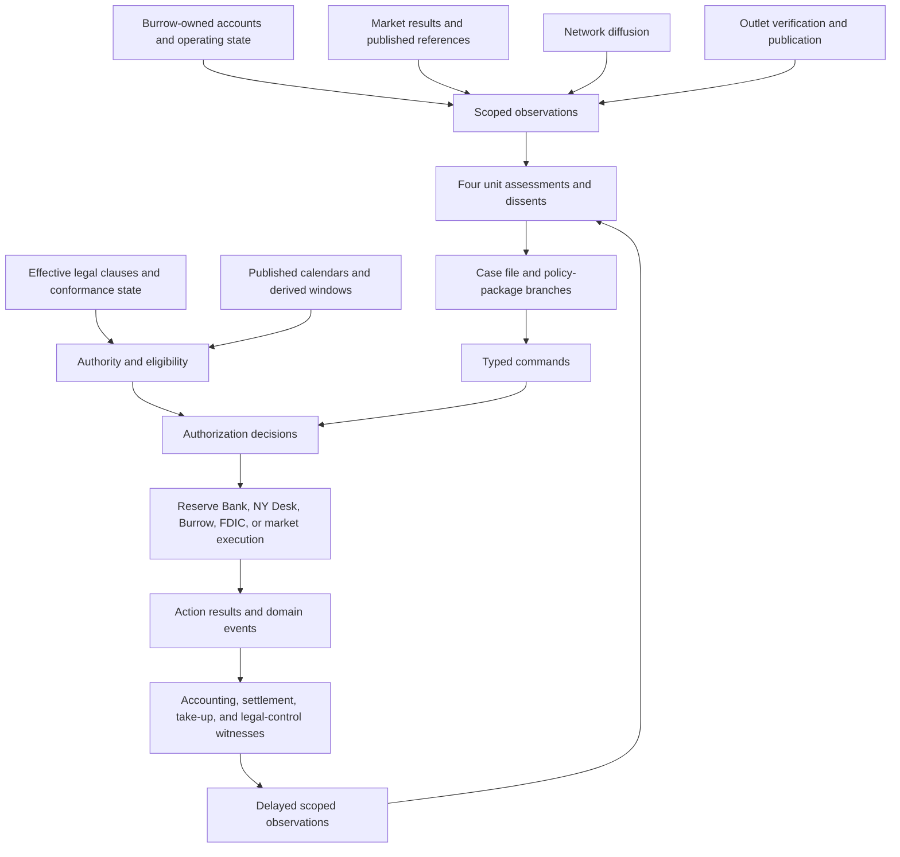

# Burrow Bank Composition Probe

### Summary of change request

Run the Burrow Bank regional-bank probe through all twelve questions in the
architecture worksheet. Name the owner, typed interface, and witness at every
step; exercise the representation kinds added after the probe ladder was
written; and distinguish a missing causal primitive from missing module work,
content, or calibration. The probe tests whether the amended ontology composes.
It does not design Burrow's balance sheet, response curves, or scenario prose.

### Current State

- The minimum kernel makes causal-vocabulary closure the implementation gate:
  several dissimilar probes must traverse the same state, evidence, belief,
  authority, action, commitment, execution, witness, accounting, and
  transmission contracts.
- The Representation Bible now defines twenty-eight kinds and amends the
  publication and instrument contracts. The nine kinds added after the probe
  ladder are `FederatedSystem`, `Facility`, `LegalInstrument`,
  `PublishedReference`, `Record`, `ScheduledProcess`, `Outlet`, `Network`, and
  `StatefulExternalProcess`.
- The Representation Catalog establishes Burrow as a named `Institution`,
  assigns deposit rate setting to `MechanicalSystem`, records the
  market-versus-persisting-queue rule, and closes all fourteen candidate holes.
- `probe.composition.burrow_bank` and
  `probe.composition.treasury_basis_trade` are bound to
  `profile.early_2006.bernankey` for catalog testing. They remain
  named-versus-cohort and financial-circuit controls, not authored crisis
  scenarios or availability claims.
- The Burrow catalog contract is complete. Runtime initialization remains
  blocked on period and legal content, opening accounts, residual values, and
  calibration.

### Desired End State

- Every worksheet question has named canonical owners, typed interfaces, and
  witnesses.
- Facility authorization, readiness, opening, take-up, balances, and
  transmission remain separate.
- Legal authority, dated applicability, conformance, enforcement, and
  resolution remain separate from staff interpretation and policy preference.
- Public, supervisory, market, and network information reach each participant
  only through declared access and distribution paths.
- Bank accounting, deposit queues, facility transactions, market execution,
  legal control, records, and published references retain their own owners.
- Every apparent gap receives the catalog's dissolution test before
  classification.
- The result says whether Burrow supplies evidence toward causal-vocabulary
  closure and whether another dissimilar probe is still required.

### What we're not doing

- Selecting Burrow's balances, capital ratios, outflow amounts, deposit betas,
  duration model, haircuts, probabilities, or response curves.
- Supplying period-specific legal facts, exact historical balances, governing
  counterparties, or a policy outcome. The early-2006 profile binds the
  composition test only; it does not convert this worksheet into crisis content.
- Writing dialogue, news copy, or a narrative sequence.
- Reopening resolved Questions 18, 22, or 43 through 54 in the Bible, or
  Questions 53 through 71 in the Catalog.
- Editing the minimum kernel, Representation Bible, or Representation Catalog.

## Probe Setup

The trace begins Thursday afternoon from the stipulated evidence split:

| Holder or surface | State available at probe start | State not implied |
|---|---|---|
| Supervision | Concentrated uninsured deposits, stale duration marks, management remediation claims, incomplete liquidity test | Current payment queue, depositor intentions, Monday solvency |
| Markets | Falling equity, widening professional funding indications, peer hedging, no broad repo dysfunction | Examination findings, Burrow's private liquidity position, future facility take-up |
| Public information | One alarming post and local press calls | Verified failure, visible branch queue, settled withdrawals |
| Chair | Delivered staff and public evidence through role-scoped access | Canonical bank state, private depositor beliefs, unpublished counterparty choices |

The decision question is whether Burrow can open Monday without extraordinary
support. That question is stored in a case file and answered through conditional
assessments and package branches. It is not a canonical crisis state.

## End-to-End Composition



No edge in this trace requires a privileged world read. No package or record
owns the bank's condition, and no rendered claim directly causes withdrawals,
facility use, market prices, or resolution.

## Twelve-Question Worksheet

### 1. Which object owns each relevant stock or condition?

| Stock or condition | Canonical owner | Typed interface | Witness |
|---|---|---|---|
| Loan-book positions and credit state | Burrow account ledger, referencing loan instrument families | Accounting transaction, impairment/revaluation transition | Balanced ledger entry and valuation or credit-state domain event |
| Treasury, agency MBS, and other securities positions | Burrow account ledger | Position transfer, encumbrance, revaluation, market order and settlement | Position ledger, market clearing result, and settlement record |
| HTM versus AFS classification and applicable carrying values | Burrow accounting records and position metadata; market prices remain market results | Authorized accounting-classification transition and revaluation interface | Classification record plus before/after accounting entries |
| Deposits, including account balance, owner, and demandability | Burrow liability accounts; depositors own corresponding claims | Account instruction, payment request, accounting transfer, settlement | Debit/credit entries and payment-system finality or failure event |
| Insurance coverage condition and limit | Effective `LegalInstrument` clause applied to each account relationship | Legal applicability and conferred-condition transition | Enactment/version reference and account-level applicability record |
| Cash, reserves, collateral encumbrance, borrowing, and equity | Burrow and relevant Reserve Bank accounts; custodians own custody state | Accounting, collateral pledge, lending transaction, settlement | Balanced entries, collateral witness, and settlement finality |
| Equity price, funding price, and broad repo-functioning result | Relevant `Market` mechanisms | Order/quote submission, clearing result, transmission | Immutable clearing trace and published observation |
| Posted deposit rate and unfilled withdrawal queue | Burrow-owned policy term plus deposit `MechanicalSystem` queue | Authorized rate-posting transition and queue-processing update | Posted-rate record; accepted, rejected, pending, and settled request events |
| Facility terms, readiness, status, and take-up history | The applicable `Facility` | Facility lifecycle transition and counterparty draw request | Authorization, readiness, opening, draw-result, and take-up-ledger witnesses |
| Drawn facility asset and liability | Operating Reserve Bank and Burrow accounts, not the `Facility` and not the Federal Reserve System aggregate | Lending transaction and settlement | Reserve Bank asset entry, Burrow liability entry, and funds/collateral settlement |
| Supervisory findings and remediation commitments | Supervisor-owned `Record` and Burrow-owned commitment | Record revision and commitment transition | Examination-product custody record and acknowledged remediation commitment |
| Capital threshold and Burrow conformance state | `LegalInstrument` clause plus its per-subject compliance ledger | Measurement input, clause evaluation, legal transition | Effective clause version, measured inputs, and conformance result |
| Resolution control, stays, transfers, and claim treatment if triggered | FDIC-owned `ResolutionProceeding`; successor institutions own transferred stocks | Authorized legal transition, accounting transfer, priority settlement | Receivership/control order, transfer entries, and claim-treatment events |

The ownership test is clean. `FederatedSystem` supplies system identity and a
consolidated view but owns none of these stocks. Staff assessments, case files,
Pop lenses, situation views, and media surfaces project or interpret state and
own no bank balances, prices, legal powers, or settlement queues.

### 2. Which actor or mechanism owns each available action?

| Available action | Action owner | Typed interface | Witness |
|---|---|---|---|
| Reprice deposits, pledge collateral, seek funding, sell assets, restrict lending, disclose, or pursue a buyer | Burrow executives through valid offices and board delegation; Burrow systems execute | Selected action, command, authorization, action execution, action result | Board or delegated approval, bank-operation result, transaction and settlement events |
| Withdraw or retain deposits | Each depositor or organization cohort response; the Pop lens does not act | Distributed response, account instruction, payment request | Attempt record and resulting pending, rejected, or settled payment |
| Sell Burrow debt after a rating action | Money-fund institution or cohort under its mandate | `PublishedReference` binder evaluation, owned market order | Rating publication, mandate/eligibility decision, order, clearing, settlement |
| Prepare or authorize a liquidity facility | Chair or staff may propose; Board or other applicable decision body owns authorization | Command and `AuthorizationDecision` | Certified decision and facility authorization record |
| Operate a discount-window advance to Burrow | The district Federal Reserve Bank responsible for the borrower | Facility readiness, eligibility, draw request, lending execution | Reserve Bank action result and bilateral accounting entries |
| Conduct a market operation included in a wider package | FOMC or valid delegated authority authorizes; New York Fed Markets Desk executes | Implementation command, market order, clearing and settlement | Certified directive, desk execution record, market clearing, SOMA accounting |
| Begin resolution and exercise receivership powers | FDIC office, decision body, and institution under effective law | Legal-boundary evaluation, authorization, `ResolutionProceeding` transition | Certified legal action, control transition, accounting and transfer events |
| Communicate publicly | Chair or another speaker through an authorizing office; `Outlet` decides whether and how to carry it | Communication act, claim publication, report distribution | Authorized communication record and outlet publication/distribution records |
| Verify, publish, correct, or withhold a story | Outlet role-holder and editorial procedure | Report production and distribution | Slate decision, publication, correction, or retraction record |
| Diffuse the alarming post or professional funding indication | `Network` rule, after a participant originates the claim | Network propagation | Per-hop delivery records with membership, latency, and decay provenance |

The `FederatedSystem` does not absorb any Federal Reserve action. Burrow borrows
from a district Reserve Bank. The New York Desk executes only the package's
market-operation component. The Board, FOMC, Reserve Banks, and Desk remain
distinct authorization, operating, accounting, and execution owners.

### 3. What grants, limits, delegates, or blocks authority?

| Authority question | Owner of the rule or decision | Typed interface | Witness |
|---|---|---|---|
| Can Burrow use ordinary Reserve Bank credit? | Effective statute/rule clauses, facility eligibility, district Reserve Bank procedure | `LegalInstrument` applicability plus facility preflight | Applicable clause version and eligibility decision |
| Does a proposed package invoke 13(3)? | Effective `LegalInstrument` clauses and Board legal process | Legal classification and authority preflight | Legal assessment record followed by the authority decision actually used |
| Is Treasury consent required? | Era-selected 13(3) restriction clause | Period-variant selection and required-approval link | Effective-date proof and Treasury approval, rejection, expiry, or absence result |
| Is Burrow within prompt-corrective-action restrictions? | Effective prudential clauses and per-subject conformance state | Measurement-to-clause evaluation | Input snapshot, threshold rule version, and conformance event |
| Does the deposit-insurance limit apply to an account? | Effective insurance clause and account aggregation rule | Account-level legal applicability | Clause version and coverage calculation record |
| May FDIC place Burrow into resolution or transfer claims? | Effective resolution-power clauses and FDIC procedure | Legal-boundary predicate and authorized legal transition | Certified resolution action and `ResolutionProceeding` state change |
| May the Chair communicate now? | Chair office powers limited by blackout eligibility window | `ScheduledProcess` window derivation and available-action gate | Published FOMC occurrence, deterministic blackout derivation, and rejected or admitted action preflight |
| May staff inspect examination material? | Supervisor relation, employment/office access, and confidentiality clauses | Access grant and scoped observation query | Access-decision record and delivery receipt |

The scenario does not state a calendar date or legal era. The probe therefore
does not assert Treasury consent or blackout as facts. The scenario's period
variant selects the effective 13(3), insurance, resolution, and prudential
clauses. The published FOMC calendar deterministically derives blackout. If
Thursday falls inside that window, public Chair communication is removed by
the derived gate; if it does not, the action remains eligible. Missing date and
era assignments are content, not missing authority primitives.

### 4. Which typed interface carries each effect between owners?

| Boundary crossed | Producing owner | Consuming owner | Typed interface | Witness |
|---|---|---|---|---|
| Bank position to accounting condition | Burrow accounts | Valuation, capital, and supervisory tasks | Accounting entry, revaluation, instrument-state transmission | Ledger and valuation domain event |
| Market price to Burrow mark or funding estimate | Market | Burrow valuation and participant cognition | Clearing result, observation, transmission | Clearing trace and delivered observation |
| SOFR publication to funding contracts | `PublishedReference` | Bound contracts and Burrow funding-cost calculation | Authorized publication and binder evaluation | Publication witness and contract accrual/settlement entry |
| Rating publication to money-fund eligibility | `PublishedReference` | Mandate or regulatory binder, then fund action discovery | Publication, eligibility transition, market order | Rating witness, mandate decision, order and settlement |
| Examination result to supervisory belief | Supervisory measurement and record | Supervisor cognition and assessment authoring | Scoped observation and evidence integration | Observation provenance and belief-revision record |
| Management remediation claim to staff | Burrow speaker/office | Supervisory and Chair-side cognition | Communication act and scoped evidence delivery | Claim record and delivery receipt, not truth of the claim |
| Alarming post to public and professional audiences | Claim originator | `Network`, `Outlet`, and audience cognition | Network propagation, editorial report, observation delivery | Distribution history and audience receipt |
| Assessment to case file and package branch | Staff unit | Institution-owned records and Chair decision context | Record creation, revision, linkage, and delivery | Authorship, custody, revision, dissent, and agenda receipt |
| Chair proposal to legal/operational authorization | Chair through office | Board, FOMC, Reserve Bank, Treasury, or FDIC as applicable | Command and authorization request | Submitted command and authority result |
| Authorization to facility readiness | Authorizing body | Operating Reserve Bank and facility | Authorization reference, preparatory task, readiness transition | Certified decision and readiness test result |
| Facility opening to counterparty option | Facility | Eligible Burrow office | Terms publication and access-scoped offer | Open-status event and delivered eligibility notice |
| Burrow draw to balances | Burrow and operating Reserve Bank | Accounting and settlement systems | Draw request, execution, collateral pledge, transaction | Action result, take-up entry, balanced accounts, settlement |
| Deposit requests to outflow | Depositors | Burrow and payment system | Account instruction, queue transition, payment settlement | Attempt, queue, finality, or failure event |
| Legal threshold to resolution control | Prudential/resolution rule | FDIC procedure and Burrow | Legal transition and proceeding creation | Threshold evaluation and control-order witness |

Every effect fits an existing interface. In particular, publication is not a
silent cache read, a report is not a state mutation, authorization is not
execution, and a facility being open is not a draw.

### 5. What does each participant observe, and through which access path?

| Participant | Observation scope and path | Explicitly unavailable | Witness |
|---|---|---|---|
| Burrow management | Own accounts, queues, collateral, contracts, delivered market data, supervisor communications | Depositor private beliefs, unpublished regulator decisions, buyer intentions | Internal access log and observation delivery |
| Supervision | Examination access, call reports, remediation record, confidential bank submissions, permitted market observations | Canonical depositor intentions, unreported transactions, other units' private beliefs | Supervisor access decision, examination observation, record receipt |
| Markets staff | Public market results, professional-network indications, dealer and counterparty contacts, facility-market observations | Examination file absent explicit sharing, Burrow's private queue | Market-data publication and network/contact delivery |
| Legal staff | Proposed package, effective legal instruments, delegated authority, applicable records | Canonical future compliance or execution success | Task access grant and document/version receipt |
| Operations staff | Facility terms, readiness, eligible counterparty data, collateral submissions, staffing and settlement state | Management truthfulness or depositor beliefs | Operational task assignment and scoped data receipt |
| Communications staff | Authorized claims, known audience models, public and media observations, blackout gate | Hidden audience beliefs and future interpretation | Access grant, delivered records, schedule-window result |
| Chair | Morning Book, case file, assessments, dissents, delivered calls and reports, office-scoped privileged products | Canonical world state and other people's private cognition | Agenda delivery and item-read record |
| Depositors | Account access, public claims, network messages, outlet reports, observed payment outcomes | Supervisory file and Burrow's full balance sheet | Channel delivery and account-status observation |
| Money funds and funding counterparties | Rating publication, SOFR, prices, contract data, professional network, disclosed Burrow information | Private examination findings unless lawfully shared | Publication, network delivery, and counterparty message receipt |
| FDIC and Treasury | Their statutory, agreement-based, and explicitly shared records | Federal Reserve private cognition and unauthorized examination data | Access decision and evidence delivery |

Observation is always a scoped product or delivered claim. Canonical possession
by one owner does not make the fact globally visible.

### 6. What becomes evidence, for whom, with what delay and uncertainty?

| Source fact or claim | Evidence recipients | Delay and uncertainty carried | Typed interface | Witness |
|---|---|---|---|---|
| Call report | Supervisors, other authorized institutions, later public users as configured | Reporting calendar, reference period, publication lag, revision, measurement limits | `ScheduledProcess` occurrence to measurement and observation | Filing receipt, release event, revision history |
| Examination findings | Supervision and authorized crisis participants | Examination date, confidentiality, sampling and judgment uncertainty | Scoped observation and record delivery | Examination record provenance and access receipt |
| Stale duration marks | Supervisory and valuation users with access | As-of date, model method, stale flag, uncertainty | Evidence referencing positions and valuation method | Mark record and delivery receipt |
| Management remediation claim | Recipients of the communication | Speaker incentive, claim modality, omitted support, confidence | Communication act and evidence integration | Claim publication/delivery; no witness of truth |
| Falling equity and widening funding indications | Markets staff and subscribed actors | Market timestamp versus indicative, non-binding network color | Market observation or network-delivered claim | Clearing publication or attributed delivery record |
| Peer hedging and no broad repo dysfunction | Markets and later staff synthesis | Coverage limits and distinction between observed absence and proof of absence | Market observation and assessment evidence | Market-query snapshot and assessment provenance |
| Alarming post | Network members, then outlet audiences if selected | Source identity, verification status, latency, propagation history | Network propagation and outlet report | Per-hop receipt and publication record |
| Local press calls | Burrow and contacted offices first; public only if published | Inquiry content, no implied truth, editorial delay | Communication/contact record | Call/contact receipt and later publication if any |
| Facility authorization, readiness, opening, and draw | Different audiences under disclosure rules | Disclosure lag, counterparty confidentiality, status-specific meaning | Facility domain events to scoped observations | Status event, take-up entry, later disclosure publication |
| Resolution transition | FDIC, Burrow, counterparties, then public under notice rules | Legal effective time and distribution lag | Legal domain event and observations | Control order and delivered notice |

Each staff unit integrates only received evidence into person-level or declared
cohort beliefs. The four assessments retain support, contrary evidence, stale
inputs, assumptions, confidence, and dissent. A unit's conclusion is witnessed
as an authored record; its correctness is not witnessed until later evidence
arrives, and even then attribution may remain uncertain.

### 7. What state, belief, relationship, or obligation persists afterward?

| Persistent item | Owner | Typed interface | Witness |
|---|---|---|---|
| Burrow account history, encumbrances, pending payments, marks, and credit states | Burrow and relevant settlement/custody owners | Accounting, queue, revaluation, instrument-state transitions | Ledgers and domain events |
| Supervisory case file and remediation history | Supervisory institution or staff unit | `Record` revision, transfer, supersession, retention | Version/custody history |
| Four unit assessments and dissents | Each authoring unit; linked by the case file | `Record` creation and revision | Authorship, evidence ledger, dissent and revision records |
| Policy package for each branch | Proposing person or institution as a `Record` subtype | Package revision, branch linkage, activation state | Revision and authorization history |
| Resolution proceeding, if triggered | FDIC or other legally responsible authority | Legal transition and proceeding lifecycle | Control, transfer, priority, closure, and continuation events |
| Participant beliefs and source trust | Individual cognition or declared cohort distributions | Evidence integration, decay, revision | Belief revision with provenance |
| Supervisor, counterparty, and inter-institution operating relationships | Parties to typed affiliations or agreements | Relationship or agreement transition | Attributable contact, performance, breach, or settlement event |
| Facility commitments, reservations, terms, take-up, and outstanding balances | Commitment owner, facility, and transacting accounts according to role | Commitment/facility/accounting transitions | Reservation, status, draw, maturity, and release records |
| Original and corrected network or outlet distribution | `Network` and `Outlet` history | Propagation, correction, retraction | Delivery and correction records; prior receipt is not erased |
| Calendar announcements and blackout derivation | Owning `ScheduledProcess` | Announcement, revision, window derivation | Published occurrence and derivation trace |

All behavior-affecting items either persist or rebuild exactly from persisted
inputs. A save during authorization, facility preparation, deposit requests, or
resolution must retain queue order, references, reservations, beliefs, record
versions, legal state, and disclosure delays.

### 8. Which commitments, resources, or Leash become reserved or contingent?

| Commitment or reservation | Owner | Activation point | Typed interface | Witness |
|---|---|---|---|---|
| Staff valuation, legal, operational, communications, and buyer work | Assigning institution and staff units | Task assignment or accepted package preparation | Analytical/preparatory task and resource reservation | Assignment record and capacity ledger |
| Burrow remediation promise | Burrow | Accepted management commitment, not mere assertion | Commitment creation/revision | Acknowledged commitment and monitoring obligation |
| Facility Leash | Authorizing Chair/institutional portfolio as defined by the package | Authorization, before readiness, opening, or any draw | Commitment and reservation transition linked to facility | Authorization plus reservation-ledger entry |
| Facility operating capacity | Operating Reserve Bank | Preparation and readiness work | Resource reservation and facility readiness transition | Staffing/system reservation and readiness test |
| Lending balance-sheet exposure | Operating Reserve Bank and Burrow | Draw execution, not authorization or opening | Lending transaction and contingent-to-drawn instrument transition | Bilateral accounting and settlement entries |
| Collateral availability | Burrow and custodian | Pledge or encumbrance | Collateral transfer/encumbrance | Custody and collateral ledger |
| Treasury consent or indemnity, if required by the selected package and era | Treasury under applicable law/agreement | Approval or executed agreement clause | Authorization or agreement/commitment transition | Approval and, if financial, funded or contingent accounting record |
| Public assurance credibility exposure | Speaker and authorizing institution | Authorized communication publication | Communication-linked commitment and Leash reservation | Publication witness and commitment record |
| FDIC resolution and successor obligations | FDIC, bridge institution, acquirer, or other party named by law and transaction | Authorized legal and transfer steps | Proceeding, commitment, agreement, accounting | Control and transfer events plus successor ledger |

The facility test passes its hardest distinction. `authorized`, `operational`,
`open`, and `drawn` are separate states. Leash begins at authorization, before
counterparty use. Zero take-up is a valid open-facility outcome and can become
evidence of stigma, successful reassurance, unattractive terms, or no need. It
is not an execution failure without additional evidence.

### 9. At which stages can the chain fail?

| Stage | Example failure without authored outcome | Owner of result | Typed interface | Witness |
|---|---|---|---|---|
| Information access | Examination data is withheld, stale, delayed, or outside scope | Access owner/observation system | Access decision or failed observation delivery | Denial, stale-version, delay, or delivery record |
| Assessment | A unit lacks data, uses a poor model, dissents, or misses deadline | Staff unit | Assessment status and revision | Record version with unavailable inputs and dissent |
| Authority | Board, FOMC, Treasury, FDIC, or another required party rejects, narrows, defers, or lacks power | Applicable authority owner | `AuthorizationDecision` | Certified rejection, partial approval, deferral, or expiry |
| Preparation | Legal or Operations cannot complete work before the deadline | Assigned staff/operating institution | Task result and readiness transition | Failed/partial task and readiness test |
| Facility opening | Authorized terms never become operational or open | Operating institution and facility | Facility lifecycle result | Authorized-not-operational or operational-not-open status event |
| Counterparty take-up | Burrow is ineligible, declines, cannot pledge collateral, or requests less | Burrow and facility | Eligibility and draw result | Rejection/partial/no-request plus take-up ledger |
| Market execution | Desk order is partial or clearing fails | NY Desk and market | Action result and clearing result | Execution report and clearing trace |
| Deposit response | Depositors do not receive or believe a claim, do not attempt, or encounter a queue | Depositors/network/mechanical system by stage | Exposure, belief, intention, request, queue transitions | Stage-specific delivery, belief, attempt, queue events |
| Settlement | Payment, securities, or collateral transfer remains pending or fails finality | Settlement `MechanicalSystem` | Settlement result | Final, pending, rejected, or failed settlement event |
| Transmission | Liquidity fails to restore confidence or lending; communication alarms peers | Consuming domain systems and actors | Typed transmission and later observations | Downstream transactions, decisions, and observations, not the original action result |
| Resolution | Predicate is unmet, authority does not act, transfer fails, or successor cannot perform | FDIC/proceeding/transaction owners | Legal transition, proceeding action, accounting | Boundary evaluation, control result, transfer and claim-treatment events |
| Publication | Rating, SOFR, or report is delayed, suspended, revised, or corrected | `PublishedReference` or `Outlet` | Publication lifecycle | Delay, suspension, publication, revision, correction record |

This stage table preserves the parent invariant: authorization, execution,
take-up, settlement, transmission, communication, and observation can fail
independently and cannot be inferred from one another.

### 10. Which witness proves that each attempted action or effect occurred?

The probe uses a witness chain rather than one scenario-success flag:

| Attempt or effect | Required witness | What the witness does not prove |
|---|---|---|
| Staff assigned | Task assignment and capacity reservation | Correct or timely assessment |
| Assessment delivered | Authored record, evidence ledger, dissent, delivery receipt | Canonical truth |
| Package proposed | Versioned package record and submitted command | Authorization or execution |
| Authority exercised | Certified `AuthorizationDecision` referencing effective clauses and procedure | Operational readiness |
| Facility readied | Completed operational readiness test | Open status or take-up |
| Facility opened | Open-status domain event and eligible-party notice | Draw or downstream confidence |
| Facility used | Accepted draw result, take-up ledger, collateral witness, balanced accounts, settlement | Broader transmission success |
| Deposit rate changed | Authorized posted-rate transition | Queue elimination or depositor retention |
| Withdrawal attempted | Account/payment request | Settlement |
| Withdrawal settled | Payment finality and balanced account entries | Why the depositor acted |
| Rating changed | Authorized rating publication and revision-policy reference | Fund sale until a binder and action execute |
| Money fund forced to sell | Binder/eligibility result, owned sell order, market clearing and settlement | Burrow failure |
| SOFR changed a funding obligation | Publication witness and contract accrual/settlement entry | Burrow's ability to refinance |
| Public claim traveled | Network delivery or outlet publication record | Belief update by every recipient |
| Belief changed | Recipient-owned belief revision with provenance | Correctness or later action |
| Desk acted | Desk execution result, clearing result, settlement, and SOMA entries | Burrow's direct borrowing from the Desk |
| Resolution began | Effective legal control order and proceeding creation | Successful transfer or depositor payout |

No positive feature may fire from a proposal, plan, rendered report, or
authorization alone. Every claimed material effect requires the owner-specific
domain event, accounting entry, legal transition, publication, delivery, or
settlement witness appropriate to that effect.

### 11. Can the probe be composed from existing causal primitives?

Yes. The complete route is:

```text
Burrow accounts, instrument states, legal conditions, schedules, and queues
  -> scoped market, supervisory, management, and public observations
  -> recipient-owned evidence and beliefs
  -> four unit-owned assessments with dissent
  -> case file and branch-specific policy-package records
  -> person/office proposals and typed commands
  -> period-correct authority and derived calendar gates
  -> Board, FOMC, Treasury, Reserve Bank, Desk, Burrow, or FDIC action results
  -> commitments and pre-draw Leash/resource reservations
  -> facility, market, bank, payment, publication, or legal execution
  -> owner-specific domain events, accounting entries, and settlement witnesses
  -> network/outlet distribution and delayed scoped observations
  -> revised beliefs, assessments, relationships, commitments, and records
```

The trace needs no Burrow-specific mutation verb, no hidden bank-health value,
no global Federal Reserve actor, no report-to-run modifier, no automatic policy
effect, and no untyped consequence script. The scenario name selects content;
it does not select a causal pathway unavailable to other banks or facilities.

### 12. How is each gap classified?

The probe finds no missing causal primitive. It identifies work behind settled
contracts:

| Finding | Classification | Why it is not a primitive gap | Dissolution result |
|---|---|---|---|
| Exact scenario date and pre-/post-2010 legal era are unset | Missing content | `period_variants[]`, effective `LegalInstrument` clauses, and schedule derivation already carry the distinction | Dissolves into `LegalInstrument`, `ScheduledProcess`, and catalog period variants |
| Exact 13(3), deposit-insurance, FDIC-resolution, and prompt-corrective-action clauses are not enumerated for Burrow | Missing content | The kind owns effective clauses, bound class, conformance, authority, and enforcement | Dissolves into `LegalInstrument`; no new authority object needed |
| The responsible district Reserve Bank, eligible facilities, rating publisher, debt binder, counterparties, and package participants are unset | Missing content | Existing catalog entries, affiliation families, facility eligibility, agreements, and package records carry each relation | Dissolves into institution entries and typed affiliations; Q47 is available only where a subobject owns a real boundary |
| Bank accounting, payment queues, deposit response, facility operations, resolution, publication, distribution, cognition, and assessment synthesis do not exist in code | Missing module implementation | Every owner, input, output, failure state, and witness is already typed | Survives as implementation work, not ontology work |
| Outflow propensity, sticky deposit beta, mark staleness, MBS duration function, haircuts, rating response, confidence updates, and package probabilities are unset | Missing calibration | They choose values or functions behind stable interfaces | Survives as calibration; prohibited from kind growth |
| Burrow archetype details, account mix, securities buckets, loan-credit distribution, and remediation specifics are unset | Missing content | `Institution`, account, instrument-family, `Record`, and affiliation state already own them | Dissolves into content fields and residual reconciliation |
| A single issue-level debt rating might be needed if the scenario centers on one bond | Missing content using a declared extension point | Bible Q54 already permits pre-run security promotion with residual reconciliation | Dissolves into the existing security-level extension; no runtime promotion or new kind |
| No evolving physical or external process appears in this bank-only probe | Not applicable | The probe begins from bank, market, legal, institutional, and information state; no hazard trajectory owns continuing external state | `StatefulExternalProcess` is explicitly excused and remains for pandemic, war, drought, and similar probes |

The dissolution test was applied in the required order: each nearest kind's
required state and prohibitions, the affiliation-family table, Q47 subobject
promotion, and all nine post-ladder kinds. None of the surviving work requires
a new owner, information-access mode, authority source, mutation category,
commitment form, execution owner, accounting boundary, or transmission type.

## New-Kind and Amendment Coverage

| Kind or amended rule | Burrow exercise | Result |
|---|---|---|
| `Facility` | Liquidity package separates proposal, authorization, readiness, opening, zero take-up, draw, outstanding balances, wind-down, and pre-draw Leash reservation | Exercised cleanly |
| `LegalInstrument` | 13(3) and era-specific Treasury consent, deposit-insurance limit, FDIC resolution powers, prompt-corrective-action threshold, and Burrow conformance | Exercised cleanly; exact clauses are content |
| `PublishedReference` | Burrow debt rating binds money-fund eligibility; SOFR binds funding costs | Exercised cleanly; publication, binder, action, and settlement remain separate |
| `Record` | Case file, four unit assessments with dissents, branch policy packages, and conditional resolution proceeding | Exercised cleanly |
| `ScheduledProcess` | Call-report calendar, FOMC calendar, and deterministically derived blackout gate | Exercised cleanly; exact date is content |
| `Outlet` | Local press inquiry, editorial verification, publication, correction, and audience distribution | Exercised cleanly |
| `Network` | Alarming post and professional funding indications traverse different memberships, latencies, verification norms, and decay | Exercised cleanly |
| `FederatedSystem` | Board authorization, district Reserve Bank window operation and accounting, FOMC market authority, and New York Desk execution remain distinct under one system identity | Exercised cleanly |
| `StatefulExternalProcess` | No evolving external physical process is required by the stipulated bank probe | Explicitly not applicable |
| Clearing rule | Deposit rates are posted and the withdrawal queue may persist; no fictitious market-clearing deposit price outbids the run | Exercised cleanly through `MechanicalSystem` |
| Amended P43 | HTM/AFS accounting, state-dependent MBS duration, deposits demandable at par, loan credit state, collateral role, rate references, and position values retain distinct state | Exercised cleanly; no instrument kind is needed |

## Instrument Amendment Trace

The hardest P43 cases stay compositional:

| Burrow exposure | Owner and representation | Typed transition | Witness |
|---|---|---|---|
| HTM security position | Burrow account position with accounting classification; market owns observed fair value | Classification, impairment, sale, or revaluation under applicable rule | Position and accounting ledger plus market-price reference |
| AFS security position | Burrow account position with fair-value accounting treatment | Revaluation through accumulated income/equity treatment as configured | Balanced revaluation entries |
| Agency MBS | Instrument family with state-dependent duration function and collateral role | Rate/prepayment state transmission to duration and value; pledge at facility haircut | Model-input provenance, valuation event, collateral witness |
| Uninsured deposit | Deposit family, demandable at par; insurance is an account-level legal condition | Withdrawal request to persistent queue and settlement | Request, queue transition, finality/failure |
| Loan book | Loan positions with performing, delinquent, non-performing, defaulted, or restructured credit state | Credit-state transition, provisioning, repayment, default, restructure | Credit event and balanced accounting entries |
| Floating funding tied to SOFR | Borrowing position references a `PublishedReference` | Publication to accrual and settlement | SOFR publication and contract ledger |

HTM versus AFS does not require a new representation kind. It is position and
accounting state governed by applicable legal/accounting content. Nor does an
uninsured deposit become a separate instrument family: demandability belongs
to the deposit family and insurance remains a legal condition on the account.

## Composition Finding

Burrow runs clean against the amended ontology. The probe finds no architectural
gap and no reason to enlarge the kinds table. The new kinds solve the exact
composition failures that the pre-amendment probe would have encountered:
facility lifecycle and take-up, effective legal authority, binding publication,
durable institutional work, derived calendar gates, heterogeneous information
paths, and Federal Reserve member-level action ownership.

Burrow moves the design materially closer to causal-vocabulary closure because
one dense scenario now composes across canonical state, partial evidence,
beliefs, authority, action, commitments, execution, witnesses, accounting, and
transmission without privileged reads or untyped mutation. Burrow alone does
not satisfy the closure gate. The gate requires several dissimilar probes, and
this one concentrates on bank accounting, legal authority, institutional
process, depositor queues, and information routing.

The next probe should be the Treasury basis-trade unwind. It is dissimilar in
the required way: it stresses collateral ownership and reuse, margin and
variation settlement, dealer intermediation, infrastructure discretion,
forced deleveraging, market convergence or failure, and binding
`PublishedReference` values where Burrow primarily stresses legal authority and
institutional process. A clean basis-trade trace would provide the second
composition result needed before judging whether implementation has reached
causal-vocabulary closure.

## Design Questions

None. This probe records a composition test against resolved contracts and does
not reopen the underlying ontology decisions.

## Resolved Design Questions

### Does Burrow Bank expose a missing causal primitive?

No. Every required owner, access path, authority, mutation, commitment,
execution, accounting step, and transmission composes from the existing
contracts. Apparent holes dissolve into existing kinds, affiliation families,
Q47 promotion, the security extension point, content, module implementation, or
calibration.

### Does one clean Burrow result establish causal-vocabulary closure?

No. It is positive evidence toward closure, not closure by itself. The minimum
kernel requires several materially dissimilar probes. The Treasury basis-trade
unwind is the required next composition test.

## Patterns to Follow

### Trace stages instead of scenario outcomes

The minimum kernel's action flow remains the governing pattern:

```text
observation -> evidence -> belief -> plan -> selected action -> command
  -> authorization -> execution -> action result -> commitment/domain event
  -> settlement/transmission -> new scoped observation
```

Every Burrow branch uses this flow. No branch is represented as `save bank`,
`cause run`, or `resolve crisis`.

### Keep witnesses owner-specific

```text
proposal witness       submitted command
authority witness      certified decision
execution witness      responsible operator's action result
take-up witness        facility ledger or counterparty request
accounting witness     balanced entries
settlement witness     finality/failure event
publication witness    authorized published value or report
observation witness    scoped delivery receipt
belief witness         recipient-owned revision with provenance
```

One witness may lead to another. It never substitutes for a later stage.

### Apply the dissolution test before ontology growth

```text
candidate mismatch
  -> test nearest kind's required state
  -> test its prohibitions
  -> test typed affiliation families
  -> test Q47 subobject promotion
  -> test post-ladder kinds and declared extension points
  -> classify only the surviving requirement
```

Burrow leaves no surviving requirement in the missing-primitive class.
