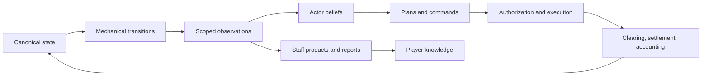
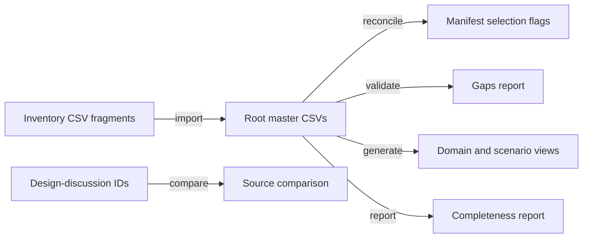

# Research: Federal Reserve Chair Simulator Foundations and Media Representation

**Date**: 2026-09-03T23:54:31-04:00
**Git Commit**: not applicable; the workspace is not a Git repository
**Branch**: not applicable
**Repository**: reservist

## Research Question

1. What files and directories currently make up the workspace, and what application, runtime, build, asset, and test structure do they define?
2. How does the existing concept material distinguish observable economic indicators from latent system variables, and what causal relationships, feedback loops, delays, and second-order effects does it describe between them?
3. How does the existing material define the simulation's passage of time, morning briefing sequence, information arrival, weekly action limit, and end-of-term boundary?
4. What policy, operational, regulatory, diplomatic, and communications actions are described, and how does the concept material characterize their interactions with markets, government institutions, and other actors?
5. How are credibility, independence, market functioning, mandate performance, and institutional legitimacy defined, observed, and related to the proposed end-of-term assessment?
6. What design system, component library, visual assets, and frontend conventions exist today, including exact colors, typography, spacing, borders, shadows, chart treatments, responsive behavior, and theming?

The supplied Tooze-Pettis discussion also raises a narrower inventory question: how does the current representation model treat media outlets, economist-pundit interpretations, structured public claims, and satirical animal presentation? This document records those elements only where they already exist in the workspace. Adam Goose, Paul Slugman, the Ghost of Milton Friedman, and other named economist characters are not present in the current artifacts or catalog.

## Research Methodology (verbatim)

This document will remain objective and factual. It does not contain any recommendations or implementation suggestions.
Open questions will not ask Why things haven't been built or what should be built in the future.

There is no "implementation" section - that is intentional.

## Summary

Reservist is presently a design-and-catalog workspace rather than an executable game. It contains architectural discussions, comparative research, a worked regional-bank composition probe, a normalized CSV representation catalog, a Python catalog validator/generator, and 14 PNG portrait assets. It has no simulator runtime, frontend application, package or build manifest, component library, asset-loading path, automated test suite, or CI configuration (`04-design-discussion-minimum-simulation-kernel.md:27-39`; `02-research-clowder-simulation-substrate.md:433-441`).

The architecture treats canonical state, institutional beliefs, observations, player knowledge, and rendered presentation as separate layers. A deterministic scheduled-event queue mutates canonical state through typed owners and contracts. Scoped observations then update actor beliefs, actors issue commands subject to institutional authority, and markets, settlement, accounting, and delayed transmissions feed subsequent events. The player sees evidence products rather than canonical truth (`04-design-discussion-minimum-simulation-kernel.md:190-204`, `237-266`, `403-521`).

Player decisions occur within an elastic calendar rather than a fixed turn or action-point system. The design names four information surfaces, an autonomous chief-of-staff agenda, public schedules, legal and operational gates, and a small number of consequential interventions during ordinary weeks. The term concludes with an evidence-based Legacy Dossier across mandate performance, market functioning, credibility, independence, legitimacy, and resilience rather than a scalar score (`04-design-discussion-minimum-simulation-kernel.md:1474-1565`, `1772-1783`, `1973-2000`, `2140-2172`).

Media is already represented as a causal information layer. GNBC, AFTV, Loonberg, and Wool Street Journal are cataloged outlets; generic hosts, anchors, and reporters hold outlet offices; and claims are structured records whose effects pass through audience belief and action rather than directly changing economic state. Named economist-pundits and supernatural guests are not represented. Animal form remains presentation metadata and cannot affect causal identity, behavior, or replay (`05-design-discussion-representation-bible.md:843-877`; `catalog/entities.csv:319-337`).

## Detailed Findings

### 1. The workspace contains specifications, catalog data, tooling, and portraits but no game application

The task directory contains seven prior research and design artifacts, a `catalog/` directory, and the research-question source. The workspace-level `assets/headshots/` directory contains anthropomorphic portraits. The only executable code is `catalog/catalog.py`, a Python command-line tool that imports, validates, reconciles, compares, reports on, and generates catalog data. No simulator source tree, dependency manifest, runtime entry point, frontend, stylesheet, test runner, or build configuration exists.

```text
reservist/
├── assets/
│   └── headshots/                 # 14 static PNG portraits and ensemble art
└── .humanlayer/tasks/federal-reserve-chair-crisis-management-simulator/
    ├── 01-research-questions-simulator-foundations.md
    ├── 02-research-clowder-simulation-substrate.md
    ├── 03-research-comparative-simulation-games.md
    ├── 04-design-discussion-minimum-simulation-kernel.md
    ├── 05-design-discussion-representation-bible.md
    ├── 06-design-discussion-representation-catalog.md
    ├── 07-design-discussion-burrow-composition-probe.md
    └── catalog/
        ├── catalog.py             # sole executable implementation
        ├── schema.json            # table and vocabulary contracts
        ├── *.csv                  # normalized master tables
        ├── inventory/             # domain-specific source fragments
        └── generated/             # validation and reporting outputs
```

The current assets include a six-chair ensemble plus portraits such as `jerome-owl-v2.png`, `ben-bernankey.png`, `janet-jackrabbit-v2.png`, `kevin-boarsh-v2.png`, `alan-greenspaniel-v2.png`, and `paul-vulture-v4.png`. They are not referenced by catalog data or application code. The architecture expects a presentation register downstream of causal identity, but no such register currently exists (`06-design-discussion-representation-catalog.md:43-72`; `catalog/schema.json:31`).

#### Testing patterns

There are no application, unit, integration, end-to-end, browser, visual-regression, or CI tests. `catalog.py` provides validation commands, but no test module or test-runner configuration exists. The Burrow Bank composition probe is a prose design probe, not an executable scenario (`07-design-discussion-burrow-composition-probe.md:328-353`).

### 2. Canonical state produces evidence, while beliefs and player knowledge remain scoped interpretations

The simulation model distinguishes three simultaneous representations of an economic subject: latent canonical state, actor-specific institutional beliefs, and player estimates assembled from delivered evidence and memory (`03-research-comparative-simulation-games.md:303-309`). Canonical state is available only to simulation mechanics. Actors receive observations within their access scopes, and the Chair receives staff and public products rather than direct reads of bank state, private plans, or other actors' beliefs (`07-design-discussion-burrow-composition-probe.md:71-78`, `199-210`).



An observation contains a proposition or measurement, source, access scope, reference time, publication time, delay, uncertainty, revision status, and provenance. Published macroeconomic data is therefore a delayed and revisable measurement product, not a direct display of current state (`04-design-discussion-minimum-simulation-kernel.md:403-424`, `509-512`, `938-955`). Beliefs retain a prior, estimate, uncertainty, confidence, provenance, and update time; incoming evidence is adjusted for delay, revision, and measurement error before belief revision (`04-design-discussion-minimum-simulation-kernel.md:2444-2468`).

Crisis state follows the same rule. There is no canonical crisis-progress meter. `SituationView`, `CaseFile`, and `BriefingThread` organize observed evidence and decisions, while material state, contracts, beliefs, schedules, and stochastic processes carry causal momentum (`04-design-discussion-minimum-simulation-kernel.md:1783-1891`, `1941-1953`).

#### Testing patterns

The architecture specifies invariant checks, mechanism tests, multi-seed verdict bands, and deterministic replay as verification layers, but none is implemented (`04-design-discussion-minimum-simulation-kernel.md:2485-2529`). The Burrow probe manually traces the information boundary from scoped evidence through beliefs, commands, settlement, and later observations (`07-design-discussion-burrow-composition-probe.md:86-112`, `328-353`).

### 3. Typed ownership and transmission contracts carry causality through delays and feedback loops

Material and institutional state may change only through typed accounting, clearing, execution, legal, mechanical, or shock paths; cognition changes through typed epistemic transitions (`04-design-discussion-minimum-simulation-kernel.md:449-521`). A `Transmission` records its producing owner, consuming contract, payload, distribution or constraint, effective time, persistence, provenance, witness, and fallback behavior. Producers emit only quantities they own, while consumers own their response rules (`04-design-discussion-minimum-simulation-kernel.md:514-520`; `06-design-discussion-representation-catalog.md:163-188`).

The leading financial circuit connects Treasury issuance and duration supply to dealer inventory, investor holdings, yields, collateral values, repo funding, leveraged positions, bank liquidity, credit conditions, macroeconomic evidence, expected policy, and subsequent duration demand (`04-design-discussion-minimum-simulation-kernel.md:173-188`). The broader macro loop passes policy and yields through borrowing costs, valuations, credit availability, demand, labor, wages, consumption, prices, observed mandate outcomes, expectations, contracts, and later policy choices (`04-design-discussion-minimum-simulation-kernel.md:896-938`).

| Delay or boundary | Current representation |
|---|---|
| Publication | Observation reference time differs from publication and delivery time |
| Revision | Evidence can be preliminary, revised, stale, or superseded |
| Contract | Maturity and scheduled obligations enter the event queue |
| Market | Orders clear before accounting and settlement mutate balances |
| Policy | Authorization, operational readiness, execution, take-up, and transmission are distinct stages |
| Information | Outlet and network latency determines when audiences receive claims |

Exact equations, behavioral response curves, and calibration values remain unresolved. The present artifacts define ownership, ordering, and propagation contracts rather than numerical closure (`04-design-discussion-minimum-simulation-kernel.md:95-103`). This allows the accounting system to reconcile outcomes without making an accounting identity itself the sole causal mechanism.

#### Testing patterns

The design documents define task-order, deterministic-parallel, population-fragmentation, narrative-load, and agreement probes (`04-design-discussion-minimum-simulation-kernel.md:2224-2276`). The catalog validator checks owners, endpoints, witnesses, units, fallbacks, and residual reconciliation, but does not execute the economic feedback loops (`catalog/catalog.py:281-493`).

### 4. Time advances by scheduled events while the player's calendar expands and compresses with circumstances

The proposed runtime advances to the next due event, applies transitions and maturities, produces observations, updates cognition, manages plans, selects and authorizes actions, executes commands, clears markets, settles accounting, schedules delayed effects, and appends player-safe reports (`04-design-discussion-minimum-simulation-kernel.md:237-256`). A dependency-ordered task graph may calculate from snapshots and private buffers, but canonical commits remain stable-sorted for deterministic replay (`04-design-discussion-minimum-simulation-kernel.md:262-288`).

```text
next_due_event
  apply mechanical transitions and maturities
  produce scoped observations
  update beliefs and plans
  select, authorize, and execute commands
  clear markets
  settle accounts
  schedule delayed effects
  append reports and traces
```

The model uses several cadences at once. Timestamped events cover payments, auctions, settlements, margin calls, and deadlines. Daily, weekly, release-calendar, and event-triggered processes cover slower institutional work (`04-design-discussion-minimum-simulation-kernel.md:296-329`). Quiet periods may compress days or weeks; ordinary policy uses weekly agendas; FOMC periods may use session or daily windows; crises may create several windows per day or hour-scale deadlines (`04-design-discussion-minimum-simulation-kernel.md:1973-1987`).

The current design does not define a fixed numeric weekly action limit. Ordinary weeks contain only a few consequential interventions, constrained by calendar access, staff bandwidth, legal authority, operational readiness, counterparties, decision-body procedure, and Leash (`04-design-discussion-minimum-simulation-kernel.md:1988-2000`, `2578-2608`). The chief of staff independently drafts agendas containing mandatory events, meetings, preparation time, reserve time, conflicts, delegations, and deferrals. Public `ScheduledProcess` records separately govern published recurrences, revisions, notifications, and windows such as FOMC blackouts (`04-design-discussion-minimum-simulation-kernel.md:1536-1565`).

#### Testing patterns

No event queue or calendar test exists. Deterministic event ordering, replay, and save/load restoration are specified as verification obligations rather than executable checks (`04-design-discussion-minimum-simulation-kernel.md:634-679`, `2485-2529`).

### 5. The Chair assembles policy packages but cannot collapse authority, execution, and market response into one action

The current action families are monetary stance, market operations, lending, supervision and regulation, coordination, internal governance, and communication. Each action primitive declares role eligibility, target type, legal and informational preconditions, reservations, decision and execution delays, signal semantics, expiration, and observability (`04-design-discussion-minimum-simulation-kernel.md:1655-1683`).

The Chair maintains a portfolio of prepared packages, including mutually incompatible alternatives. Activating a package issues individually authorized commands in sequence; it does not guarantee votes, legal clearance, operational readiness, counterparty take-up, settlement, or the audience's interpretation (`04-design-discussion-minimum-simulation-kernel.md:1596-1647`, `1685-1698`). Facilities have explicit proposal, authorization, operational, open, draw, and wind-down states, with terms, Leash reservation, eligibility, execution, and outstanding balances owned separately (`06-design-discussion-representation-catalog.md:1639-1671`).

The Federal Reserve System is represented as a federated institution. The Board owns statutory authorizations, Reserve Banks own accounts and lending/payment operations, the FOMC authorizes monetary-policy outcomes, and the New York Fed Markets Desk executes directives. The consolidated balance sheet is derived rather than an independent state owner (`04-design-discussion-minimum-simulation-kernel.md:1453-1469`, `1569-1594`). Other represented actors include the President, Treasury, Congress, regulators, banks and dealers, leveraged funds, long-horizon investors, foreign reserve managers, foreign governments and central banks, commodity principals, strategic firms, and media actors (`04-design-discussion-minimum-simulation-kernel.md:798-840`).

Communications use structured `CommunicationAct` and `Claim` records. Audience response combines claim semantics with source credibility, priors, perceived incentives, ambiguity, venue, coordination, and surprise. Belief changes and resulting orders affect markets; rendered prose is not reparsed to determine mechanics (`04-design-discussion-minimum-simulation-kernel.md:1727-1762`).

#### Testing patterns

No action, facility, voting, execution, market-response, or communications tests exist. The Burrow probe traces a facility package from evidence and authorization through member-level execution, accounting, settlement, take-up, and delayed observation (`07-design-discussion-burrow-composition-probe.md:199-328`).

### 6. The end of a term produces rival evidence-based interpretations rather than a universal score

The assessment model uses six axes with distinct evidence rather than one reputation statistic.

| Axis | Evidence currently named |
|---|---|
| Mandate performance | Inflation distribution, employment, wage growth, duration and persistence of misses |
| Market functioning | Failed clearing, liquidity, emergency dependence, concentration, unresolved leverage |
| Credibility | Audience-specific promise interpretation, reaction-function predictability, inflation expectations |
| Independence | Political tolerance, statutory constraints, appointments, coercive coordination |
| Legitimacy | Public and congressional acceptance, distributional narratives, procedural compliance |
| Resilience | Buffers, backstop expectations, transferred fragility, preparedness |

These definitions appear together in the term-end model (`04-design-discussion-minimum-simulation-kernel.md:2146-2151`). Credibility is audience- and claim-specific rather than a global meter. Political support is proposition-specific, so an actor may support one Federal Reserve action while opposing another (`04-design-discussion-minimum-simulation-kernel.md:1387-1402`, `2148-2149`). Market functioning depends on whether prices clear queues and whether stressed processes remain dependent on emergency support (`06-design-discussion-representation-catalog.md:1369-1392`).

A term normally ends at its scheduled boundary, but removal, resignation, incapacity, or statutory reorganization can end it earlier. A crisis may alter the authority regime without immediately ending play (`04-design-discussion-minimum-simulation-kernel.md:2140-2145`). The resulting `LegacyDossier` preserves evidence, inherited conditions, attribution uncertainty, rival interpretations, unresolved commitments, and successor burdens. It explicitly has no overall grade, victory score, or fungible reward (`04-design-discussion-minimum-simulation-kernel.md:2155-2172`).

#### Testing patterns

No term-boundary or Legacy Dossier tests exist. The dossier and assessment axes are prose and type-level design contracts only.

### 7. Four information surfaces define the intended UI, but no visual system or frontend conventions exist

The design names four player-facing information surfaces: Decision queue, Morning book, Commitment watch, and World wire. Each supports progressive disclosure from headline to brief, source record, provenance, disagreement, and dissent (`04-design-discussion-minimum-simulation-kernel.md:1772-1783`). `BriefingThread` is a presentation over a `CaseFile`, not duplicate canonical state. Staff products retain conditional conclusions, supporting and contrary evidence, stale inputs, feasibility, alternatives, coalition hypotheses, dissent, confidence, and expected next information (`04-design-discussion-minimum-simulation-kernel.md:1474-1535`).

```text
Player information shell
├── Decision queue       # decisions requiring attention
├── Morning book         # staff synthesis and evidence
├── Commitment watch     # active promises, facilities, and obligations
└── World wire           # public reports and incoming events
```

No frontend application realizes these surfaces. There are no exact colors, font definitions, spacing tokens, borders, shadows, chart treatments, breakpoint rules, responsive layouts, themes, or accessibility conventions. The Clowder research artifact records external Svelte, uPlot, and Tailwind precedents, but these are not Reservist dependencies or local conventions (`02-research-clowder-simulation-substrate.md:411-441`).

The portraits establish a sepia pixel-art direction with formal clothing, framed compositions, textured grounds, and dark brown/gold tones, but these properties are present only in raster assets. No code extracts them into reusable tokens or components.

#### Testing patterns

No frontend, browser, accessibility, responsive-layout, chart, screenshot, or visual-regression tests exist.

### 8. GNBC exists as an outlet, while economist pundits and supernatural guests do not yet exist in the catalog

The representation model separates an editorial `Outlet` from its operating `Institution`. An outlet owns editorial slate, publication queue, access, correction state, audience reach, latency, framing, and role-holder offices; its operating company owns money, employment, contracts, and facilities (`05-design-discussion-representation-bible.md:184-185`; `04-design-discussion-minimum-simulation-kernel.md:1802-1848`). A `Network` instead owns membership, access boundaries, latency, propagation, verification norms, and decay without an editorial office.

The catalog contains four outlets: AFTV, GNBC, Loonberg, and Wool Street Journal. GNBC has separate operating-company and outlet records, while an unnamed GNBC anchor holds the corresponding office (`catalog/entities.csv:319-337`; `catalog/relationships.csv:34-45`). The current media graph carries reports from The Herd to Loonberg, from Loonberg to HonkBox, and from HonkBox to AFTV and GNBC (`catalog/inventory/media_information/transmissions.csv:2-5`). AFTV and GNBC have proposed outputs toward mass public belief, but those consumer and transformation-owner endpoints remain `UNKNOWN` (`catalog/inventory/media_information/transmissions.csv:6-7`).


Three public claims are cataloged as `Record` instances. They preserve a proposition and source while leaving truth and other metadata unknown. Source attribution explicitly does not establish truth (`catalog/entities.csv:377-379`; `catalog/inventory/media_information/relationships.csv:16-18`). The catalog has no dedicated `Claim` table and its `observation_surfaces.csv` contains only a header.

The named concepts in the supplied conversation are absent from current workspace content. Searches found no catalog or prose occurrence of Adam Goose, Paul Slugman, the Ghost of Milton Friedman, Milton Friedman, economist, commentator, or pundit. The only media people are generic AFTV host, GNBC anchor, and Wool Street Journal Fed reporter records (`catalog/entities.csv:335-337`).

Animal species are presentation-only. The representation rules prohibit species from encoding causal identity, nationality, race, ethnicity, religion, ideology, intelligence, trustworthiness, moral worth, simulation behavior, or replay identity. The current satire vocabulary includes owl, goose, wool/alpaca, chimp, and vulture associations as authored presentation hypotheses rather than procedural mappings (`05-design-discussion-representation-bible.md:843-877`; `04-design-discussion-minimum-simulation-kernel.md:2222`).

#### Testing patterns

There are no executable media, claim-propagation, audience-response, character, booking, or presentation tests. Catalog validation checks media entity types, references, endpoints, witnesses, and transmission fallbacks. The checked-in gaps report records unresolved outlet-office witnesses and unresolved AFTV/GNBC public-belief transmissions (`catalog/generated/gaps.csv:56-74`, `139-145`).

### 9. The catalog is a normalized design inventory with deterministic validation, not a simulation database

The catalog schema defines 22 tables, stable dotted identifiers, 28 identity clades, seven fidelity tiers, and `UNKNOWN` as the shared null token (`catalog/schema.json:3-50`). Domain inventory fragments are imported into normalized root CSV tables. Import projects source rows onto schema columns, normalizes absent values, merges by stable key, and writes sorted master rows (`catalog/catalog.py:76-168`). Generated views are derived from those masters.



`reconcile` reevaluates manifest-selectable entities against type, fallback, owned-state, relationship, transmission, scenario, probe, and residual requirements. `validate` checks duplicates, entity references, residuals, state ownership and transitions, graph endpoints, transformations, scenario and probe references, economic closure, and selectable-record requirements. `generate`, `report`, and `compare` write derived views (`catalog/catalog.py:496-665`).

The checked-in report contains 493 entities: 220 `identity_only`, 164 `typed`, and 109 `structural`. Nine are manifest-selectable. The catalog includes 262 owned states, 180 transitions, 128 relationships, 229 transmissions, 102 scenario-availability rows, and 160 probe-coverage rows. The saved gaps report contains 162 warnings and no errors, covering endpoints, residual schema, witnesses, fallbacks, and conserved-state units (`catalog/generated/completeness.txt:2-63`; `catalog/generated/gaps.csv:1-162`).

#### Testing patterns

The CLI has no `test` subcommand. Its commands are `init`, `import`, `reconcile`, `validate`, `generate`, `report`, and `compare` (`catalog/catalog.py:665-704`). Validation and comparison are test-like structural checks that rewrite files under `catalog/generated/`; no isolated fixtures, assertions, or test runner exist.

## Code References

### Research and architecture artifacts

- `.humanlayer/tasks/federal-reserve-chair-crisis-management-simulator/01-research-questions-simulator-foundations.md:1-17` — Complete source research-question set.
- `.humanlayer/tasks/federal-reserve-chair-crisis-management-simulator/02-research-clowder-simulation-substrate.md:411-441` — External frontend/chart precedent and explicit absence of a local design system.
- `.humanlayer/tasks/federal-reserve-chair-crisis-management-simulator/03-research-comparative-simulation-games.md:303-339` — Canonical state, belief, player-knowledge, and event-layer distinctions.
- `.humanlayer/tasks/federal-reserve-chair-crisis-management-simulator/04-design-discussion-minimum-simulation-kernel.md` — Exhaustive primary architecture source for runtime ordering, state ownership, agents, actions, information, UI surfaces, assessment, and verification contracts.
- `.humanlayer/tasks/federal-reserve-chair-crisis-management-simulator/05-design-discussion-representation-bible.md:184-185` — Outlet and network identity boundaries.
- `.humanlayer/tasks/federal-reserve-chair-crisis-management-simulator/05-design-discussion-representation-bible.md:843-877` — Anthropomorphic presentation rules and candidate satire vocabulary.
- `.humanlayer/tasks/federal-reserve-chair-crisis-management-simulator/06-design-discussion-representation-catalog.md` — Exhaustive content-catalog architecture, actor inventory, presentation boundary, facility lifecycle, and typed transmission conventions.
- `.humanlayer/tasks/federal-reserve-chair-crisis-management-simulator/07-design-discussion-burrow-composition-probe.md` — Exhaustive worked regional-bank composition probe and information/action trace.

### Catalog implementation and schema

- `.humanlayer/tasks/federal-reserve-chair-crisis-management-simulator/catalog/catalog.py:1-704` — Complete executable catalog CLI.
- `.humanlayer/tasks/federal-reserve-chair-crisis-management-simulator/catalog/schema.json:1-50` — Complete schema, stable-ID, vocabulary, and table contract definition.
- `.humanlayer/tasks/federal-reserve-chair-crisis-management-simulator/catalog/` — Complete normalized catalog area; root CSVs are master data, `inventory/` holds source fragments, and `generated/` holds derived reports and views.
- `.humanlayer/tasks/federal-reserve-chair-crisis-management-simulator/catalog/entities.csv` — Master entity roster, including Federal Reserve, market, media, population, product, and sovereign subjects.
- `.humanlayer/tasks/federal-reserve-chair-crisis-management-simulator/catalog/owned_state.csv` — State ownership, units, conservation, witnesses, and completeness.
- `.humanlayer/tasks/federal-reserve-chair-crisis-management-simulator/catalog/relationships.csv` — Typed graph relationships and witnesses.
- `.humanlayer/tasks/federal-reserve-chair-crisis-management-simulator/catalog/transmissions.csv` — Producer-consumer transmissions, payloads, delays, transformation owners, witnesses, and fallbacks.
- `.humanlayer/tasks/federal-reserve-chair-crisis-management-simulator/catalog/inventory/` — Exhaustive source-fragment area organized by domain bundle.
- `.humanlayer/tasks/federal-reserve-chair-crisis-management-simulator/catalog/generated/completeness.txt:1-63` — Checked-in catalog coverage report.
- `.humanlayer/tasks/federal-reserve-chair-crisis-management-simulator/catalog/generated/gaps.csv:1-162` — Checked-in validation warnings.
- `.humanlayer/tasks/federal-reserve-chair-crisis-management-simulator/catalog/generated/economic_system_coverage.csv` — Baseline and promotion boundary-closure report.
- `.humanlayer/tasks/federal-reserve-chair-crisis-management-simulator/catalog/generated/source_comparison.csv` — Design-discussion ID comparison output.

### Media and information representation

- `.humanlayer/tasks/federal-reserve-chair-crisis-management-simulator/catalog/inventory/media_information/entities.csv:1-45` — Source entities for outlets, networks, operating companies, role-holder people, and public claims.
- `.humanlayer/tasks/federal-reserve-chair-crisis-management-simulator/catalog/inventory/media_information/relationships.csv:1-18` — Outlet ownership, offices, and claim-source attribution.
- `.humanlayer/tasks/federal-reserve-chair-crisis-management-simulator/catalog/inventory/media_information/transmissions.csv:1-7` — Current media-distribution graph and unresolved mass-public outputs.
- `.humanlayer/tasks/federal-reserve-chair-crisis-management-simulator/catalog/observation_surfaces.csv:1` — Declared but unpopulated observation-surface table.

### Visual assets

- `assets/headshots/` — Exhaustive current visual-asset directory containing 14 PNG portraits and ensemble variants; no code or catalog record consumes these files.

## Architecture Documentation

The architecture is owner-scoped and event-driven. A scheduled-event queue and dependency-ordered task graph provide deterministic control flow. Typed owners mutate canonical state through accounting, clearing, execution, legal, mechanical, or shock contracts. Observations cross the canonical-to-epistemic boundary with explicit access, timing, error, revision, and provenance. Actor cognition produces plans and commands, but decision bodies, legal authority, operations, counterparties, markets, and settlement remain independent gates.

The player layer is a projection over this state rather than a privileged debugger. Morning books, decision queues, commitment watches, world-wire reports, case files, and briefing threads expose scoped evidence and institutional interpretation. The same rule governs public media: structured claims pass through outlet selection, network propagation, audience beliefs, and audience actions. Neither staff prose nor a television segment directly mutates yields, legitimacy, votes, or economic activity.

The representation catalog encodes the nouns and causal boundaries used by the prose architecture. Stable IDs, identity clades, ownership rows, relationships, transmissions, scenarios, probes, fallbacks, and residual reconciliation make coverage inspectable before runtime code exists. The catalog validator checks structural closure and emits derived reports, but it does not implement event processing, behavioral equations, markets, cognition, UI, or save/load.

Presentation remains causally downstream. Anthropomorphic species, portrait art, wording, and outlet styling may change without altering simulation identity or replay. The present workspace has portrait assets and animal-presentation rules, but no presentation register, frontend implementation, or link between image files and catalog subjects.

## Open Questions

None.
