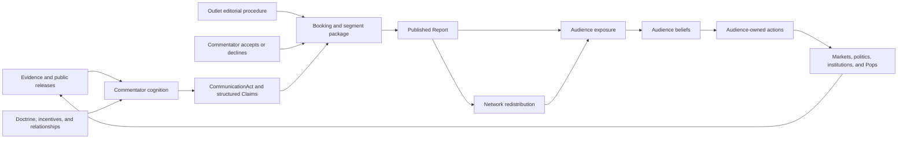

# Economist-Pundit Media Circuit

### Summary of change request

Define how recurring economist-commentators, television bookings, public debates,
and satirical doctrine personae fit into Reservist's existing media and belief
architecture. The immediate examples are Adam Goose, Paul Slugman, and the
Ghost of Milton Friedman. None currently exists in the representation catalog.

This discussion keeps the existing causal compact intact: a public figure may
originate structured claims, an outlet may select and frame them, a network may
redistribute them, and audiences may revise beliefs and act. A personality,
segment, or rendered joke never changes inflation, markets, legitimacy, or
policy directly.

### Current State

- The information ecosystem has four cataloged outlets, three networks, and a
  few generic media role-holders, but no recurring economist-commentators.
- Public claims exist as lightly typed durable records. Their proposition and
  source survive, but the catalog has no dedicated claim inventory and no
  populated observation-surface records.
- AFTV and GNBC can receive candidate claims from HonkBox, but their path to
  audience exposure ends at an unresolved mass-public-belief destination.
- The architecture distinguishes a media company, its editorial outlet, an
  outlet office, and the person occupying that office. It does not yet specify
  how an unaffiliated guest is booked, accepts, appears, debates, or recurs.
- Species, portraits, names, and caricature are presentation metadata. They are
  deliberately unable to change cognition, action eligibility, or replay.
- No runtime or UI exists. These are catalog and causal-design decisions, not
  changes to an executable media system.

### Desired End State

- Recurring public economists have stable identities, beliefs, relationships,
  reputations, institutional affiliations, and bounded communication actions.
- One-off guests can appear without requiring a full named-person biography or
  silently acquiring the action set of a political principal.
- Booking, acceptance, preparation, recording, editorial selection,
  publication, correction, network diffusion, audience exposure, belief
  revision, and audience action remain separately witnessed stages.
- Public arguments use structured claims with subject, predicate, magnitude,
  horizon, modality, conditions, confidence, evidence, and omissions.
- Competing economists may interpret the same release differently because of
  distinct priors, models, incentives, evidence access, and source trust.
- Audience responses close the existing media graph through explicit Pop,
  institutional, political, and market channels rather than one mass-opinion
  modifier.
- A satirical doctrine persona such as the Ghost of Milton Friedman can appear
  in presentation without inventing a supernatural source of causal truth.
- The player encounters punditry mainly through the World wire, Morning book,
  and Communications desk, with source and provenance available on inspection.

### What we're not doing

- Treating economists as omniscient narrators or allowing their prose to set
  canonical economic outcomes.
- Giving every guest full named cognition, a personal balance sheet, or a
  general political action set.
- Making economists members of an outlet merely because an outlet books them.
- Converting fame, credentials, airtime, or audience size into legal authority.
- Creating a universal left-right ideology scalar or making doctrine determine
  every claim mechanically.
- Modeling a literal afterlife, supernatural intervention, or authoritative
  message from a dead economist.
- Choosing final dialogue, species assignments, portrait art, voice direction,
  audience coefficients, or a complete commentator roster.
- Designing a dedicated pundit-management game or final television UI.

### Proposed End State Architecture

The media circuit composes existing representation kinds rather than adding a
new `Pundit`, `Debate`, or `Ghost` kind:



The core ownership split is:

```text
Person
  owns private beliefs, memory, relationships, personal reputation,
  communication choices, and recurring identity

Affiliated institution or employer
  owns employment, research resources, official publications, and any
  institution-authorized claims

Outlet
  owns booking invitations, editorial slate, segment framing, publication,
  correction, audience targeting, and airtime capacity

Network
  owns non-discretionary redistribution, latency, repetition, and decay

Audience cognition or distributed response
  owns attention, interpretation, belief revision, and later action
```

An appearance should traverse a two-sided, witnessed lifecycle:

```text
outlet proposes booking
  -> guest receives scoped invitation
  -> guest accepts, declines, conditions, or delegates
  -> outlet allocates airtime and prepares segment
  -> participants prepare claims and disclosed evidence
  -> recording or live appearance occurs
  -> outlet selects, frames, edits, or withholds publication
  -> report is published to declared audience segments
  -> networks redistribute attributed fragments
  -> recipients attend, interpret, remember, ignore, or act
  -> corrections and rebuttals travel as new publications
```

Neither a booking nor a recording proves publication. Publication proves
exposure only for recipients reached by a delivery path. Exposure does not prove
attention, belief revision, agreement, or action.

The proposed structured records are:

```text
CommentatorProfile
  person_ref
  fidelity_tier
  institutional_affiliations[]
  declared_doctrine_refs[]
  topic_expertise_and_model_familiarity[]
  outlet_and_source_relationships[]
  audience_specific_reputation_refs[]
  communication_action_domains[]

BookingInvitation
  outlet_ref and responsible_editor_ref
  invited_person_ref
  topic and proposed_format
  intended_audiences[]
  timing, live_or_recorded, and exclusivity
  requested_claim_scope
  preparation_and_access_offered[]
  status and response

CommunicationAct
  speaker and authorizing_affiliation, if any
  venue and intended audiences
  claims[]
  disclosed_evidence[] and omissions[]
  tone, confidence, timing, and coordination status

Claim
  subject, predicate, magnitude_or_category
  horizon, modality, and conditions[]
  confidence and supporting_evidence_refs[]
  source and authorization status

Report
  outlet and responsible editorial role-holder
  source_communication_refs[]
  selected_claim_refs[]
  headline, framing, omissions, and counterclaims[]
  audience_targets[], publication_time, and correction_links[]
```

The Ghost of Milton Friedman can use the same circuit without becoming an
agent. The presented character is attached to a segment package; causal claims
retain a living or institutional source:

```text
legacy doctrine records and archived claims
  -> current host, producer, guest, or institution selects an interpretation
  -> structured current Claim identifies that accountable source
  -> outlet frames the segment as "The Ghost of Milton Friedman"
  -> audiences receive both the claim and its satirical presentation metadata
```

This preserves the distinction between what Friedman historically argued, what
a current character attributes to him, and what the outlet dramatizes.

### Design Questions

None. The questions in this discussion are resolved below. The general media
contracts remain valid, but commentator-specific implementation is outside the
first player-facing prototype defined by the master architecture's cut line.

### Resolved Design Questions

#### 1. Which fidelity tiers should economist-commentators use?

Should every recurring commentator be a fully named cognitive person, or should
the system reserve full cognition for the small number whose relationships and
cross-outlet continuity materially change the information environment?

- Option A: Make every named economist a `NAMED_COGNITION` person. This gives
  each one persistent beliefs, goals, memory, relationships, plans, and
  reputation, but creates substantial content and calibration obligations.
- Option B: Make every economist a `LIMITED_ROLE_HOLDER`. This bounds their
  state and action catalog, but weakens recurring rivalries, doctrine changes,
  private advising, and reputation across institutions and outlets.
- Option C: Use both tiers. Recurring consequential figures receive named
  cognition; one-off experts use a limited guest template with only topic
  beliefs, source trust, relationships, and communication dispositions.

**Chosen: Option C.** Adam Goose and Paul Slugman should qualify for named
cognition only if their recurring interpretations, relationships, or private
access affect later choices. Background guests should use the limited template.

#### 2. What can a commentator do outside public communication?

Should a named public economist have only communication actions, or can they
also advise officials, participate in coalitions, or shape institutional work?

- Option A: Restrict all commentator actions to public communication and outlet
  participation. This is simple but cannot represent a real advisory,
  employment, or political relationship.
- Option B: Give named commentators a general elite-access action set. This
  captures influence but risks turning every television economist into a policy
  principal with implausible bargaining power.
- Option C: Keep public communication as the default action domain and unlock
  private advising, institutional research, or coalition contributions only
  through explicit scenario relationships and offices.

**Chosen: Option C.** A title, booking, or large audience grants no private
access by itself. An adviser relationship can permit advice or evidence delivery
without creating legal authority or a policy command.

#### 3. How should the Ghost of Milton Friedman exist?

Is the Ghost a represented person, a doctrine record, or a presentation device?

- Option A: Create a supernatural named person who forms beliefs and issues
  claims. This offers comic flexibility but violates the material ownership and
  evidence model unless the setting explicitly admits supernatural causality.
- Option B: Treat the Ghost as a causally inert presentation persona for a
  segment built from doctrine records, archival claims, and a current speaker's
  interpretation.
- Option C: Represent a living impersonator or host as the person and the Ghost
  as their performed character. This works for a recurring theatrical role but
  changes the joke from institutional necromancy to impersonation.

**Chosen: Option B by default.** The host, producer, guest, or outlet owns
the current interpretation and publication. Option C remains available for a
specific recurring performer. Option A should require an explicit change to the
game's world premise rather than slipping through presentation content.

#### 4. Where should structured claims live in the catalog and runtime?

The master architecture treats `Claim` as a distinct information object, while
the current catalog stores three public claims as generic `Record` instances.
Which representation should become authoritative?

- Option A: Keep every claim as a `Record` subtype. This supplies stable identity
  and persistence but risks overloading the broad institutional-record schema
  with high-volume utterance fragments.
- Option B: Embed claims only inside `CommunicationAct` and `Report`. This keeps
  the data local but makes quotation, correction, rebuttal, diffusion, and
  cross-report provenance harder to reference.
- Option C: Give claims stable typed IDs in a dedicated claim registry, without
  adding a twenty-ninth representation kind. Durable communication acts and
  reports remain `Record` instances and reference the claims they contain.

**Chosen: Option C.** A claim needs stable provenance and revision links,
but it does not need independent cognition, authority, or conserved ownership.
Catalog tooling should validate claim subjects, sources, evidence references,
modalities, and report links separately from general entity identity.

#### 5. How should debates and panel segments resolve?

Should a debate be a scripted report, a sequence of autonomous communication
choices, or one scored editorial package?

- Option A: Author a complete debate as one report template. This gives strong
  prose but makes disagreement and adaptation cosmetic.
- Option B: Let participants freely exchange claims until a stopping rule. This
  maximizes emergence but creates unbounded deliberation, repetition, and
  authoring complexity.
- Option C: Use a bounded segment protocol. The outlet selects topic, format,
  participants, and turn budget; each participant chooses among eligible claim,
  rebuttal, concession, refusal, and clarification acts; the outlet then selects
  and frames the published report.

**Chosen: Option C.** The protocol should preserve participant agency and
editorial discretion while keeping the number of causal communication acts
small, inspectable, and deterministically replayable. The protocol is deferred
until a selected scenario needs a live debate; the first prototype uses one
authored report rather than implementing bookings or panel exchange.

#### 6. Which audience groups close the first media circuit?

The current AFTV and GNBC transmissions point to an unresolved mass-public
belief layer. What is the minimum useful audience resolution?

- Option A: One aggregate mass-public audience. This closes the graph cheaply
  but reproduces the global opinion modifier the architecture rejects.
- Option B: Fully route every publication through all person cells,
  institutions, and political actors. This preserves heterogeneity but is too
  broad for a first media mechanism.
- Option C: Define a small scenario-selected audience set with distinct action
  channels: market professionals, policy elites, attentive partisans, affected
  household Pops, and a low-attention public residual.

**Chosen: Option C.** Each audience entry should declare reach, attention,
source trust, interpretation distribution, memory, and the actions it can
actually produce. Scenario manifests omit audiences with no active channel. The
first prototype may use authored reactions for market professionals, policy
elites, and a low-attention public residual without claiming to validate the
eventual audience simulation.

#### 7. How much pundit content should the player manage directly?

Should commentator appearances become player-facing appointments, ambient World
wire content, or both?

- Option A: Keep all punditry ambient. This protects the Chair's bounded office
  but misses opportunities to grant interviews, answer criticism, or recruit a
  credible surrogate.
- Option B: Give the player a dedicated pundit-management screen. This makes the
  media layer legible but overstates the Chair's control over independent media.
- Option C: Default to ambient World wire and Morning book coverage. Surface a
  pundit as a Decision queue or Communications desk option only when a real
  access request, interview invitation, rebuttal decision, or relationship
  creates an actionable choice.

**Chosen: Option C.** The player should manage the Fed's response and access
decisions, not the pundit's bookings or conclusions.

### Patterns to follow

These patterns come from the settled architecture and the current catalog. They
govern any later commentator implementation without reopening the resolved media
decisions.

#### Keep event, evidence, claim, and report distinct

The information taxonomy in
`04-design-discussion-minimum-simulation-kernel.md:1842` separates an occurrence
from its observation, assertion, and editorial package.

```text
DomainEvent      immutable record that a modeled transition occurred
Observation      a source produces a measurement or percept
EvidenceDelivery a recipient receives an Observation or Claim
Claim            an agent asserts a stable typed proposition
Report           an outlet packages observations and claims for an audience
```

The pundit circuit should preserve the same shape:

```text
CPI publication -> economist receives evidence -> economist asserts claim
  -> GNBC packages claim and counterclaim -> audiences receive report
```

#### Compose people, offices, outlets, and operating companies

The catalog already distinguishes the parts of a media brand in
`06-design-discussion-representation-catalog.md:973`.

```text
Loonberg
  operating company                    -> Institution
  editorial organization              -> Outlet

HonkBox
  platform firm                        -> Institution
  ranking and diffusion                -> Network
  posting population                   -> PopLens over person cells
```

An economist guest adds a relationship rather than collapsing these subjects:

```text
commentator Person
  -> employed by or affiliated with Institution, if applicable
  -> invited by Outlet through BookingInvitation
  -> appears through CommunicationAct
  -> remains independent of the outlet's offices unless they actually hold one
```

#### Make publication change exposure before behavior

The resolved media design in
`04-design-discussion-minimum-simulation-kernel.md:2544` requires reports to
alter audience evidence and beliefs before any audience-owned action occurs.

```text
publication
  -> delivered exposure
  -> attention
  -> interpretation and belief revision
  -> goal or pressure change
  -> audience-owned action attempt
  -> execution and world effect
```

No report should emit `legitimacy -5`, `market confidence +3`, or
`household spending -2`.

#### Require a witness for every stage

The Burrow probe's owner-specific witness chain in
`07-design-discussion-burrow-composition-probe.md:471` applies directly to media.

```text
invitation witness      submitted booking request
acceptance witness      guest response
appearance witness      completed communication act
publication witness     outlet publication record
delivery witness        audience-scoped receipt
belief witness          recipient-owned revision with provenance
action witness          recipient-owned attempt and execution result
correction witness      new publication linked to the original
```

One witness may cause a later opportunity. It never proves the later stage.

#### Keep presentation metadata causally inert

The Representation Bible's animal-satire rules in
`05-design-discussion-representation-bible.md:843` separate authored caricature
from simulation identity and behavior.

```text
causal record
  person, beliefs, affiliations, claims, relationships, actions

presentation register
  display name, species, portrait, costume, voice, segment persona

rule
  presentation may render causal state
  causal systems may not read presentation metadata
```

The same rule allows Adam Goose, Paul Slugman, or a Ghost persona to be renamed,
redrawn, or recast without changing replay identity.

#### Use bounded narrative opportunities

The narrative opportunity flow in
`04-design-discussion-minimum-simulation-kernel.md:1806` already defines typed
hooks, gates, cooldowns, attention budgets, and deterministic selection.

```text
release, crisis development, public claim, or scheduled review
  -> nominate eligible commentator and segment templates
  -> check topic expertise, availability, access, and outlet slate
  -> apply cooldown, incompatibility, and airtime budget
  -> deterministic keyed selection
  -> issue booking invitation through ordinary action paths
```

This pattern should generate recurring commentary without allowing one loud
character to consume every information window or changing material outcomes
merely because a segment template fired.

#### Testing approach

Follow the architecture's invariant, scenario, replay, and empirical-verdict
layers rather than asserting one correct ideological interpretation.

```text
unit and schema checks
  claim grammar, source attribution, modality, correction links, access gates

scenario checks
  booking declined; live segment aired; edited segment withheld; correction
  reaches fewer recipients; rival economists update from the same release

negative invariants
  report cannot mutate material state
  presentation metadata cannot enter cognition
  airtime cannot confer authority
  exposure cannot count as belief or action

replay checks
  same seed and state produce identical booking, publication, delivery,
  interpretation draws, and witness order

multi-seed verdicts
  commentary sometimes changes salience and action, never always or never;
  no single pundit monopolizes airtime outside configured scenario conditions
```
