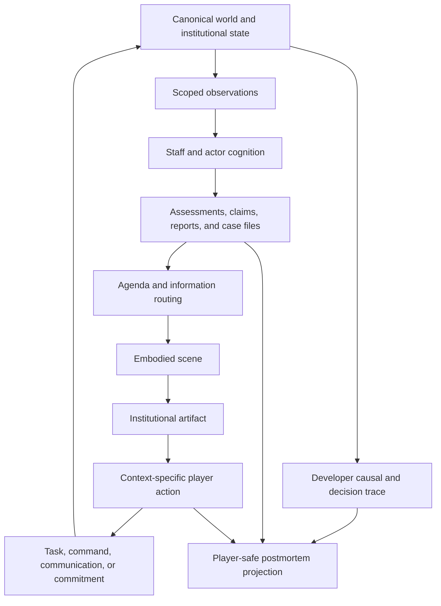

# Epistemic Fairness and Embodied Player Interface

### Summary of change request

Define how Reservist lets the player make defensible decisions under uncertainty
without revealing canonical world state or turning adverse outcomes into arbitrary
punishment. The interface must mediate an eventually very large simulation through
the Chair's office, staff, relationships, documents, meetings, calls, media, and
specialist views rather than exposing the Representation Catalog as a universal
entity browser.

The immediate product question is the shape of one playable day. The design must
show how matters arrive, how the player inspects and requests information, how
meetings bound available evidence and actions, how requests consume institutional
capacity, how documents accumulate, how time advances, and how a later postmortem
distinguishes poor reasoning from bad luck, bad institutional information, accepted
risk, and genuine unknowns.

This discussion does not replace the Treasury basis-trade unwind as the next causal
composition probe. It defines a parallel authored prototype for testing whether the
simulation's causal and epistemic architecture can become a playable information
experience before the full runtime exists.

### Current State

- Reservist has a large and growing representation vocabulary, but no player can
  reasonably browse or manage that vocabulary directly.
- The architecture already separates canonical state, scoped observations, private
  beliefs, staff assessments, claims, reports, case files, commitments, and player
  information. No executable interface realizes those distinctions.
- The player loop is defined as review, prioritize, delegate, prepare, decide,
  communicate, and observe. The institutional calendar is the primary action
  surface, with elastic time and crisis interruptions.
- The current information shell names a Decision queue, Morning book, Commitment
  watch, and World wire. These are functional surfaces, not yet a coherent embodied
  presentation.
- Requested analysis already has a causal home in `AnalyticalTask`, `Assessment`,
  staff capacity, access permissions, deadlines, displaced work, and delivery
  surfaces. The player-facing request grammar and arrival experience are undefined.
- Case files organize fallible institutional understanding without becoming crisis
  meters. The interface does not yet specify how case files remain accessible
  without becoming a generic notification center.
- The causal runtime requires decision traces, domain events, accounting witnesses,
  observation provenance, and deterministic replay. It does not yet define the
  player-safe postmortem projection over those developer records.
- Existing portraits and the working visual direction support a restrained
  first-person visual-novel treatment, but there is no frontend, design system,
  scene framework, navigation model, or visual test infrastructure.

### Desired End State

- Reservist presents the player as a physically and institutionally situated Chair,
  not as an omniscient operator of a world model.
- The building acts as compact information architecture: each recurring space
  implies a bounded class of evidence, people, actions, and obligations.
- A playable day alternates between authored agenda windows and simulation-driven
  interruptions while routine travel and routine work compress automatically.
- The Morning Book provides a bounded opening synthesis. New documents, requests,
  calls, and reports arrive through attributable institutional channels throughout
  the day.
- The player's stable verbs remain small: `Inspect`, `Ask`, `Assign`, `Convene`,
  `Propose`, `Communicate`, `Commit`, and `Advance`. Context determines their targets
  and consequences.
- Information requests become typed institutional work with a visible owner,
  expected delivery window, access limits, displaced work, and eventual artifact.
- Requested documents physically or visually accumulate in the Chair's inbox and
  remain retrievable. Overload is experienced as prioritization pressure, not as an
  invisible attention penalty or unreadable interface.
- The institutional archive exposes a bounded subject vocabulary across days. A
  player who recognizes a recurring topic such as coffee can open that subject and
  collate its appearances in briefings, calls, meetings, reports, and television.
- Meetings expose the documents, people, notes, and specialist views plausibly
  available in that scene. Preparation changes what can be asked and decided without
  turning memory or navigation into a punitive hidden-object test.
- The same simulated subject appears at the lowest presentation resolution that
  preserves the current decision: aggregate in one briefing, named in a crisis,
  and deeply inspectable only through a relevant specialist view.
- Uncertainty remains multidimensional and source-attributed. Measurement, model,
  strategic, institutional, aleatory, and reflexive uncertainty are not collapsed
  into one confidence bar.
- Consequential endogenous failures have a preexisting causal lineage. A player-safe
  postmortem can show one realized path, what was known, what could have been known,
  why information was missing, what remained disputed, and where chance entered.
- Repeated play teaches institutional geography, trustworthy sources by topic,
  controllable versus influenceable outcomes, useful preparation, and recurring
  mechanisms. It does not teach a fixed event chain or optimal build order.
- The chief of staff provides graduated institutional guidance. New players receive
  a competent agenda and legible reasons for its priorities; experienced players can
  increasingly override its routing as they learn how the Federal Reserve works.

### What we're not doing

- Exposing the Representation Catalog, canonical world state, private actor beliefs,
  or a truthful global causal graph during play.
- Making a world map, macro dashboard, trading terminal, or entity browser the
  default shell.
- Building a free-form observability query language or programmable predicate alarm
  system for the player.
- Making routine locomotion, pixel hunting, manual filing, or remembering hidden
  affordances the source of difficulty.
- Using a universal confidence bar, relationship meter, attention mana pool, or
  single score to summarize distinct causes and constraints.
- Guaranteeing that every reasonable decision succeeds or that every consequential
  outcome was predictable.
- Revealing all counterfactual outcomes, all latent state, or an omniscient moral
  verdict in the postmortem.
- Letting presentation salience promote an aggregate into a richer causal entity
  during a run.
- Selecting final room art, typography, animation tooling, frontend technology,
  dialogue volume, character roster, exact daily item count, or final numerical
  timing and capacity values in this discussion.
- Delaying the Treasury basis-trade composition probe. The embodied-interface
  prototype and the causal probe test different risks and should proceed as separate
  design tracks.

### Proposed End State Architecture

The player receives contextual projections of the simulation rather than a second
copy of simulation state:



`Scene` determines context, not truth. `Artifact` bounds the subject. `Action`
expresses the Chair's available intervention. Specialist views deepen one artifact
without becoming a permanent global dashboard.

```text
Embodied interface
  Office
    Morning Book
    physical inbox and outbox
    private calls and meetings
    television and World wire
    Commitment Book
  Briefing room
    staff presenter
    briefing deck
    supporting exhibits
    questions, challenges, and follow-up assignments
  FOMC room
    participant positions
    package and statement language
    negotiation, vote, dissent, and recess
  Operations room
    context-specific market and facility views
    execution status and operational constraints
  Press room
    structured claims, questions, and interpretation risk
  Hallway or transition
    bounded informal encounters and interruptions
```

The building is a small set of cognitively distinct scene families. It need not be
architecturally faithful or continuously traversable. A room can be a reusable
background, a foreground surface, a participant arrangement, and a set of available
artifacts and verbs.

#### One playable day

The target day combines an agenda spine with interruptions generated from the same
institutional routing rules:

```text
ARRIVE
  office establishes date, obligations, and current setting

OPEN
  chief of staff delivers Morning Book and proposed agenda
  player scans required decisions, changed evidence, and active commitments

PREPARE
  inspect selected exhibits
  request bounded follow-up
  carry or circulate materials
  revise meetings, delegations, and protected preparation time

MEET
  enter one bounded scene with brought materials and present participants
  inspect, ask, challenge, negotiate, defer, or decide

INTERRUPT
  receive only interruptions that cross the configured escalation threshold
  accept, delegate, defer, route into a later scene, or revise the agenda

ACT
  issue a command, make a commitment, communicate, or authorize the next stage

OBSERVE
  receive execution status, market/public reaction, new evidence, or no answer yet

CLOSE
  review unresolved decisions, new tasks, arrived documents, active commitments,
  and tomorrow's inherited agenda; then advance through compressible time
```

The order is a default rhythm rather than a fixed daily script. A quiet day may
compress after `OPEN`. An FOMC day may spend most of its foreground time in `MEET`.
An acute crisis may cycle repeatedly through `INTERRUPT`, `MEET`, `ACT`, and
`OBSERVE` before reaching `CLOSE`.

Foregrounding uses a consequence ladder rather than treating every simulation
change as an event card:

```text
ambient visual state
  establishes continuity, pressure, and institutional texture

micro interaction
  permits inspection, acknowledgment, a question, or a minor relationship response

minor event
  changes a task, record, schedule, belief, or local opportunity

major event
  changes several actors, commitments, or institutional processes

key decision scene
  requires bounded player judgment with material downstream exposure

core mechanical transition
  changes broad markets, institutions, populations, authority, or the policy regime
```

Each rung may nominate content above it only through typed salience and escalation
rules. Minutiae earns foreground time when it teaches an institutional pattern,
reveals character, supplies evidence, changes preparation, foreshadows a mechanism,
or creates a bounded decision. It should not ask the player to perform routine office
work merely because that work exists in the simulation.

#### Artifact and request lifecycle

Information requests should reuse the architecture's existing task and record
boundaries:

```text
player asks a bounded question
  -> request resolves to an AnalyticalTask template
  -> responsible unit estimates access, scope, confidence, and delivery
  -> assignment reserves staff capacity and identifies displaced work
  -> unit gathers available evidence and applies its methods
  -> Assessment is authored with support, contrary evidence, gaps, and dissent
  -> a memo, deck, call, or oral briefing is delivered into a scene
  -> the physical inbox and case file retain the delivered artifact
  -> later evidence may revise or discredit the Assessment
```

The player request is not a query against canonical state. Staff can return partial
work, a refusal, a delay, conflicting products, or an honest statement that the
question is not presently answerable.

```text
InformationRequest
  requester and scene
  question_template and bound subject refs
  requested_horizon and comparison
  requested_delivery_surface
  urgency and deadline
  candidate_staff_units[]
  access_requirements[]
  expected_displaced_work[]
  accepted_scope
  status and delivery_estimate
  resulting_task_and_record_refs[]
```

The interface may render that state as a sentence rather than a form:

```text
Ask Markets to compare current dealer inventories with the last four refundings.
Expected: before tomorrow's 08:30 briefing.
Tradeoff: delays the foreign-demand appendix.
```

Competent institutional synthesis is the default. The Chair does not inspect every
upstream source, attend every internal board meeting, or discover every relevant
external condition personally. Staff flatten those details into decision-relevant
claims while retaining provenance and a path to deeper support. A Sahel weather
report may never become directly inspectable; a resulting commodity-market
restriction should still appear in the appropriate briefing when it enters a modeled
Fed-facing channel. Abstraction may remove a scene or source document from play, but
it may not remove a material transmission from institutional synthesis.

#### Contextual resolution

Presentation resolution changes without changing causal fidelity:

```text
Morning Book
  "leveraged funds increased Treasury-basis exposure"

Supporting slide
  three strategy cohorts, aggregate financing and margin conditions

Crisis briefing
  one already represented fund becomes decision-relevant by stable reference

Specialist view
  known positions, counterparties, collateral paths, and evidence gaps for that fund
```

The projection chooses the lowest useful resolution according to current decision
relevance, observed concentration, attribution needs, available evidence, and the
scene's scope. It cannot invent a named actor, private history, bilateral exposure,
or richer causal state that the scenario manifest did not initialize.

```text
PresentationProjection
  source_record_refs[]
  scene_and_artifact_scope
  subject_grouping_key
  selected_resolution
  decision_relevance_reasons[]
  known_attribution_limits[]
  drill_down_paths[]
  omitted_detail_classes[]
```

#### Uncertainty presentation

Uncertainty should attach to claims and supporting evidence, not float as an
undifferentiated property of the screen.

| Uncertainty | Player-facing expression | Strategic implication |
|---|---|---|
| Measurement | Estimate range, stale mark, sample coverage, revision warning | Better measurement or later data may reduce it |
| Model | Competing forecasts, sensitivity to assumptions, staff dissent | Another competent model may change the recommendation |
| Strategic | Source incentives, disclosure limits, suspected adaptation | Asking the same actor again may not reveal truth |
| Institutional | Missing access, unassigned work, crowded-out analysis | Routing, staffing, or authority may reduce the blind spot |
| Aleatory | Scenario range or residual risk after available analysis | More information may not resolve the decision |
| Reflexive | Warning that policy or disclosure changes the forecasted behavior | The act of learning or acting can invalidate the estimate |

The UI should use prose, provenance, comparison, dissent, and visual treatment to
teach these differences through repeated encounters. A compact label may support
inspection, but the taxonomy should not become six decorative bars.

#### Scene-bounded information

Each decision window captures a player-safe context bundle:

```text
SceneContext
  location and simulation time
  agenda_item and decision_deadline
  present_people_and_roles[]
  brought_artifacts[]
  room_accessible_records[]
  player_notes[]
  callable_or_requestable_staff[]
  available_specialist_views[]
  available_player_verbs[]
  interruption_policy
```

The player may inspect any already delivered item without spending Leash or staff
capacity. Getting a missing answer can consume meeting time, require a recess,
create a new task, expose uncertainty to other participants, or miss the current
deadline. The cost belongs to the institutional action, not to clicking or reading.

The Federal Reserve's record keeping provides continuity across scenes and days:

```text
ArchiveIndex
  controlled_subject_terms[]
  aliases_and_display_labels[]
  linked_artifact_refs[]
  appearances_by_time_and_surface[]
  related_people_institutions_cases_and_commitments[]
  source_and_access_scope[]
```

For example, selecting `coffee` may collate a Morning Book bullet, Tuesday's
television report, Wednesday's governor call, the supporting commodity chart, and
the case file that linked them. Search returns only records delivered to or lawfully
available through the Chair's institution. It does not become a back door into the
Representation Catalog or canonical state.

#### Causal lineage and postmortem

The developer trace must remain more complete than the player-facing explanation:

```text
Developer lineage
  canonical precursor state
  relevant actor beliefs and plans
  keyed random draws
  commands, authorizations, action results, and commitments
  market, accounting, legal, operational, and settlement witnesses
  intermediate transmissions and domain events
  all observation production and delivery decisions

Player-safe postmortem
  realized causal path at the useful mechanism level
  evidence the Chair received before each decision
  evidence reasonably requestable before the deadline
  unavailable evidence and attributable reason
  staff recommendations, disagreement, and assumptions
  recognized and accepted risks
  stochastic or reflexive branches on the realized path
  unresolved attribution and credible rival interpretations
```

Every link in the player-safe path receives an epistemic classification relative to
the decision time:

```text
VISIBLE
WEAKLY_SIGNALED
MODEL_DISPUTED
STRATEGICALLY_CONCEALED
INSTITUTIONALLY_UNAVAILABLE
CROWDED_OUT
OUTSIDE_OBSERVATION
ALEATORY_REALIZATION
REFLEXIVELY_CHANGED
```

These labels describe the Chair's information position, not the moral quality of the
choice. The postmortem should not reveal unrelated canonical state or every unrealized
counterfactual. Its fairness purpose is to show that the realized mechanism existed
before the outcome and to explain the information boundary around it.

The core contract is:

> Reservist may surprise the player about facts, magnitude, timing, actor responses,
> and interactions. It may not surprise the player with a new causal vocabulary.

#### Authored information-architecture prototype

The first interface prototype can use a fixed causal tape rather than the final
simulation:

```text
Treasury conditions prototype
  morning folder
    reassuring top-line liquidity assessment
    weak dealer-capacity signal in supporting evidence
  governor encounter
    competing concern about policy interpretation
  staff deck
    clickable bullets and one model disagreement
  player request
    one follow-up with a delayed physical deliverable
  television segment
    public interpretation that is informative about salience, not truth
  decision
    incomplete evidence and more than one defensible option
  consequence
    fixed pre-authored basis-trade transmission path
  postmortem
    decision-time evidence, unavailable information, accepted risk, and realized path
```

The authored tape must be fixed before playtest choices are collected. A choice can
select among pre-authored interventions and information routes, but the prototype
must not invent a new vulnerability after the decision to manufacture drama.

### Design Questions

None. All questions raised in this discussion have been resolved through review.

### Resolved Design Questions

#### 1. Use a chief-proposed elastic agenda as graduated institutional guidance

**Chosen: Option C.** Mandatory obligations and a reasonable default day arrive
already assembled by the chief of staff. The player may inspect, reorder, delegate,
defer, protect preparation time, or reserve contingency space. Interruptions revise
the day through the same agenda rules rather than through a separate crisis UI.

The chief of staff is the principal anti-overload interface for new players. Their
recommendations explain why matters deserve attention and gradually expose the
Federal Reserve's people, procedures, information sources, and limits of control.
Reservist is not an educational game, but learning the institution should be an
ordinary consequence of play. Experienced players express mastery by selectively
overriding routing and preparation rather than constructing every schedule from
scratch.

A fixed authored scene order was rejected because it weakens preparation,
delegation, interruption, and institutional control. A fully free calendar was
rejected because it asks novices to understand the institution before play has
taught it and risks turning Reservist into a scheduling application.

#### 2. Separate mandatory decisions, graded foreground events, and the archive

**Chosen: Option C.** Known deadlines and required authorizations always surface.
Other eligible material passes through source-specific escalation, scene and topic
attention budgets, bundling, and cooldowns. Material that does not enter the
foreground continues to exist in a persistent, attributable archive and may remain
available through staff routing, case files, topic bundles, and the physical backlog.

Foreground presentation follows a consequence ladder from ambient visual state and
micro interactions through minor events, major events, key decision scenes, and core
mechanical transitions. Higher rungs may affect progressively broader actors and
systems. Lower-rung minutiae earns attention when it teaches an institutional
pattern, develops a recurring actor, supplies or contextualizes evidence, changes
preparation, foreshadows a mechanism, or creates a bounded choice. It does not become
player labor merely because the simulated institution generated it.

A hard daily cap was rejected because it can hide a required decision or make an
arbitrary cutoff causal. Sending every eligible item to the inbox was rejected
because it converts simulation scale directly into clerical workload. The foreground
budget governs presentation rather than existence or causal importance.

#### 3. Make the Morning Book a bounded product of competent institutional synthesis

**Chosen: Option C.** The Morning Book contains mandatory decisions, material changes
to active cases and commitments, newly escalated matters, and an explicit account of
what categories were routed elsewhere. Unprioritized public events remain in the
World wire. Delivered source documents remain in the inbox and linked records.

The player receives the Federal Reserve's decision-relevant projection of the world,
not universal access to every upstream observation or institutional scene. Staff are
assumed competent enough to carry material developments across abstraction
boundaries. The player need not inspect weather reports in the Sahel or personally
attend every internal meeting, but a commodity restriction produced through those
systems must become a briefing bullet when it materially affects an active Fed-facing
channel. The bullet retains its source, uncertainty, transmission hypothesis, and a
path to whatever supporting material the institution actually possesses.

A comprehensive overnight digest was rejected because it recreates the universal
dashboard on paper. A priority-only book with no routing account was rejected because
it obscures whether an issue was undetected, detected but not escalated, summarized
elsewhere, or judged immaterial. Institutional flattening may compress presentation;
it may not erase a material transmission from the staff synthesis merely because the
player cannot visit its source context directly.

#### 4. Use contextual request templates backed by typed institutional work

**Chosen: Option C.** Information requests begin from the current artifact, subject,
or scene and offer bounded modifiers such as source detail, historical comparison,
alternative assumptions, dissent, another office's view, accelerated delivery,
monitoring, or a meeting. The interface may render the resulting action as natural
conversation, but the authoritative request is a typed `AnalyticalTask`, monitoring
obligation, meeting request, or other institutional action with a responsible owner,
access requirements, deadline, displaced work, and witnessed result.

Free-text requests interpreted by an LLM were rejected because they are difficult to
authorize, cost, test, replay, and map to real evidence access. Programmable watch
conditions were rejected because they expose too much ontology and turn Reservist
into an observability-configuration game. The contextual grammar keeps the player's
verbs small while permitting strategically different questions about the same
briefing item.

#### 5. Make over-requesting create immediate, visible institutional deficits

**Chosen: Option C.** Tasks reserve specific staff capacity, compete for access and
deadlines, identify displaced work, and accumulate as pending or delivered artifacts.
The chief of staff warns when the proposed day or task portfolio is overloaded and
requires the player to narrow, defer, or delegate work. The player may refuse and
proceed anyway, but shortages begin affecting other assignments immediately rather
than waiting for a hidden threshold: deadlines slip, preparation narrows, staff enter
meetings without completed work, interruptions increase, and unrelated obligations
lose coverage.

This resembles undertaking a major commitment without the resources to support it:
the action remains available, but the institution starts running deficits elsewhere.
Staff may negotiate scope, return partial work, miss a deadline, or bring the conflict
back to the Chair. A generic attention currency was rejected because it duplicates
calendar, staff, access, and Leash. Hidden quality penalties were rejected because
the player could not connect the resulting failure to its institutional cause.

#### 6. Bound meeting access while preserving a searchable institutional archive

**Chosen: Option C.** Brought artifacts, notes, the current presentation, and people
in the room are immediately available. Before entering, the game clearly previews
the packet, participants, deadline, and available specialist views. During the
meeting, the player may ask an aide to retrieve an already known record, call an
available staff member, or request a recess for missing analysis when procedure and
time permit. Those actions impose time and social consequences rather than a memory
test.

The Fed's archive uses an explicit controlled subject vocabulary to collate delivered
records across days and surfaces. Selecting a recognized subject such as `coffee`
can show that it appeared in a Morning Book, a television report, and a governor call,
with links to the records the Chair may access. This search vocabulary is a player
index over institutional records, not the simulation ontology and not an omniscient
entity browser.

Full archive access without scene cost was rejected because it makes preparation and
setting cosmetic. Strict brought-item-only access was rejected because it punishes
memory and filing behavior rather than policy judgment.

#### 7. Resurface obligations through typed monitoring and chief-of-staff routing

**Chosen: Option C.** Monitoring obligations attach to commitments, case files,
tasks, and public schedules. The chief of staff routes due reviews into the proposed
agenda, Morning Book, meeting packet, or interruption queue according to standing
doctrine and current priority. Asking to revisit a subject selects a bounded
institutional monitoring template rather than an arbitrary condition over hidden
variables.

If the player overloads a future day, the chief requires an explicit narrowing,
deferral, or delegation choice. The player can insist on the overloaded agenda, but
the resulting staffing and preparation deficits are immediate and attributable.
Automatic global notifications were rejected because they flatten every obligation
into one alert channel. Arbitrary player reminders were rejected because they
recreate the programmable-alarm system through another interface.

#### 8. Use visual-novel vignettes and direct scene shortcuts, not traversal

**Chosen: a stronger form of Option C.** The building is represented as a set of
first-person visual-novel vignettes rather than a continuously traversable space.
Known rooms and recurring surfaces can be opened directly through stable keyboard
shortcuts, function-key-style controls, visible scene tabs, or contextual doors.
Short transitions establish place when useful; hallway movement appears only as a
specific encounter or authored interruption, not as locomotion between interfaces.

Continuous walking was rejected because repeated traversal creates labor with no
institutional decision. A wholly non-spatial screen menu was rejected because rooms,
rituals, and recurring compositions help players remember where information and
authority live. Vignettes retain that memory without requiring a movement system.

#### 9. Open specialist views from context and retain them with their source record

**Chosen: Option C.** Specialist views become available through a current artifact,
knowledgeable participant, or prepared scene. A yield curve opens from a deck bullet,
market report, or operations conversation rather than from an omnipresent global
dashboard. Once delivered or taught, the view remains reopenable from the relevant
archive or case-file record at its original information timestamp and access scope.

Global specialist access was rejected because it recreates the macro dashboard the
embodied interface is meant to avoid. Room-only access was rejected because it makes
repeat travel an arbitrary tax after the institution has already delivered the view.

#### 10. Represent relationships with typed history and legible role traits

**Chosen: Option C, with compact player-facing traits.** Canonical relationship state
and actor-specific beliefs track access, candor, reliability by subject, expected
follow-through, professional respect, grievance, confidentiality, and coalition
history only where they affect a channel. The interface summarizes stable, known
features with concise CK-like role traits and remembered incidents so the player does
not need to memorize an organization chart before understanding a recurring actor.

Traits describe known institutional behavior or role, such as `Markets specialist`,
`Habitual dissenter`, `Guards supervisory access`, or `Reliable on vote counts`.
They remain source- and context-bound, may be incomplete or revised, and do not
collapse into a universal competence, loyalty, or friendship score. Pure narrative
characterization was rejected because relationships must affect access and action.
One affinity meter was rejected because trust, expertise, authority, candor, and
alignment are not interchangeable.

#### 11. Deliver player postmortems as ordinary staff work

**Chosen: Option C, routed through the institutional record system.** The developer
trace preserves the full causal lineage continuously. The player receives no magical
causal reveal. A postmortem is an `AnalyticalTask` and resulting staff `Assessment`
or linked report, requested or triggered after a consequential outcome and delivered
through the same memo, briefing, meeting, archive, access, dissent, revision, and
capacity rules as other institutional work.

Staff can include only evidence and retrospective links available through later
observations, investigations, hearings, disclosures, and authorized records. A rapid
initial review may be partial; later reports may revise it or preserve disagreement.
Immediate omniscient revelation was rejected because it leaks facts and teaches event
scripts. End-of-term-only explanation was rejected because an apparently arbitrary
outcome may remain uninterpretable for too long.

#### 12. Test whether players can explain their information position and transfer a lesson

**Chosen: Option C.** After seeing the consequence and receiving the staff
postmortem, players should be able to explain what they knew, what additional
information was realistically obtainable, why important information was absent or
disputed, what the Chair could actually control, and one institutional habit they
would change on another run. Crisis prevention, completion time, overload, and click
errors remain supporting observations rather than the verdict.

The playtest succeeds when players can distinguish a bad decision from bad luck, bad
institutional information, accepted risk, or a genuine unknown and can name a lesson
that transfers beyond the authored crisis. This criterion evaluates the information
architecture; it does not grade the player or require a good policy outcome.

Using crisis prevention as the primary verdict was rejected because guessing or
memorizing the authored answer can produce success without understanding. Using
speed and document completion as the verdict was rejected because those measures
diagnose interface friction but do not establish epistemic fairness or comprehension
of the Chair's authority.

### Patterns to follow

These patterns come from the settled design artifacts. Reservist has no player UI
implementation to copy, so the examples are architectural contracts rather than
frontend conventions.

#### Keep canonical state, institutional interpretation, and player knowledge separate

The parent architecture defines the governing information boundary in
`04-design-discussion-minimum-simulation-kernel.md:186`.

```text
canonical world state
  -> scoped observations
  -> person and staff cognition
  -> assessments, claims, reports, and case files
  -> agenda routing and player delivery
```

The embodied interface must consume the last layer. A room, portrait, chart, folder,
or dialogue line may render a delivered record but may not read canonical state to
make itself more helpful.

#### Reuse institutional work instead of inventing UI queries

The analytical-task and assessment shapes in
`04-design-discussion-minimum-simulation-kernel.md:1457` already carry the state a
request interface needs.

```text
AnalyticalTask
  question
  requester and assigned unit
  access permissions
  deadline and requested confidence
  displaced work

Assessment
  conclusion distribution
  supporting and contrary evidence
  assumptions and stale inputs
  dissent, confidence, and expected next information
```

A player request should create or revise this work. It should not become a privileged
database query with an arbitrary latency animation.

#### Use case files as fallible organizers

The case-file rule in `04-design-discussion-minimum-simulation-kernel.md:1783` keeps
attention state separate from crisis truth.

```text
CaseFile awareness
  UNTRACKED | NOTICED | ASSESSED | WATCHING | ACTIVE |
  DEPRIORITIZED | CLOSED

awareness describes institutional posture
awareness does not describe canonical crisis severity
```

The inbox, Morning Book, meeting packets, and Commitment Book should link to case
files without showing case status as a truthful danger meter.

#### Preserve stage-specific witnesses

The Burrow probe records the pattern in
`07-design-discussion-burrow-composition-probe.md:306`.

```text
request witness         accepted task or refusal
assignment witness      staff and capacity reservation
delivery witness        memo, deck, call, or oral briefing receipt
read witness            player inspected the delivered artifact
decision witness        command, communication, or commitment
execution witness       responsible operator's action result
outcome witness         accounting, market, legal, or settlement transition
```

The postmortem can then distinguish information that existed, information that was
delivered, information the player inspected, and information that never became
available. One stage never proves another.

#### Keep presentation resolution separate from causal resolution

The Representation Bible fixes causal resolution before the run in
`05-design-discussion-representation-bible.md:758`, and the Catalog provides stable
identity and fallback contracts in
`06-design-discussion-representation-catalog.md:74`.

```text
scenario initialization
  fixes represented subjects, fidelity tiers, fallbacks, and residuals

runtime presentation
  groups, foregrounds, names, or drills into those subjects
  never invents accounts, beliefs, relationships, or history
```

Contextual entity resolution in the UI must be a projection over catalog-backed
references, not runtime promotion.

#### Route narrative opportunities through attention budgets

The narrative-load pattern in
`04-design-discussion-minimum-simulation-kernel.md:1806` already separates candidate
events from player-facing foreground items.

```text
domain event, claim, or scheduled review
  -> typed candidate templates
  -> eligibility and access gates
  -> topic cooldown and attention budget
  -> deterministic selection
  -> queued report, meeting, call, or decision item
```

This should govern interruptions, hallway encounters, television segments, and
ambient reports. A selected scene may affect later state through ordinary actions;
selection alone may not change material outcomes.

#### Test explanation, not only outcomes

The architecture's invariant, scenario, replay, and empirical-verdict layers in
`04-design-discussion-minimum-simulation-kernel.md:2485` apply to the interface
prototype as follows:

```text
content fixture checks
  vulnerability and transmission path exist before the player decision
  every surfaced item has a source, timestamp, and delivery reason

interaction checks
  every affordance is discoverable
  critical text remains readable
  scene entry previews available materials and deadlines

epistemic checks
  players distinguish known, disputed, unavailable, and stochastic links
  players can identify a useful unrequested question after the fact

negative invariants
  unreadable UI never causes a modeled failure
  postmortem never invents a missing precursor
  presentation never leaks unrelated canonical state

replay and comparison
  the authored causal tape stays fixed across interface variants
  compare folder, dashboard, office, deck-driven, and hybrid presentations
```

The prototype should record both player interpretation and trace evidence. A player
claim that the outcome felt arbitrary is a diagnostic input to classify against
missing precursor, missing representation, failed routing, unreadable presentation,
or consciously accepted risk.
