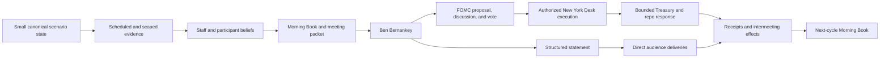

# Ben Bernankey MVP Vertical Slice

### Summary of change request

Select a small first playable vertical slice from the existing Reservist design.
The MVP should feel like a representative piece of playing Ben Bernankey as Federal
Reserve Chair without attempting a full campaign, a full financial network, or broad
coverage of every modeled institution and market.

The proposed cut is one early-2006 FOMC cycle. It begins with a bounded inherited
information position, carries one policy question through staff work and FOMC
procedure, executes one authorized package, publishes one structured statement,
shows immediate market and public interpretation, compresses through the
intermeeting period, and ends when the consequences and unresolved commitments
return in the next Morning Book.

The MVP samples each causal responsibility needed for that loop. It does not include
all twenty-eight representation kinds merely to demonstrate that each kind can be
instantiated. Every selected kind must own a consequential stage, state, or witness;
everything else stays behind an explicit adapter or outside the manifest.

### Current State

- Reservist has a settled whole-game architecture, representation vocabulary,
  catalog, one completed bank composition probe, and an embodied-interface design,
  but no simulation runtime or player interface.
- The early-2006 Bernankey profile fixes the player identity and the Board Chair and
  FOMC Chair offices. It remains a planning profile with no runnable scenario
  manifest, initialized state, or replay identity.
- The current architecture names two separate first proofs: a causally complete
  headless Treasury basis kernel and a fixed-tape authored Treasury-stress day. The
  first proves accounting and market composition; the second proves the player
  information experience. Neither alone is a playable MVP.
- The catalog reports full typed-subject coverage but zero closure across the current
  slice-candidate set. Catalog breadth therefore does not provide an implementation
  cut.
- The interface design already defines the Chair's stable verbs, Morning Book,
  bounded requests, meeting packets, direct scenes, stage-specific receipts, and
  staff postmortems. Those decisions can support a narrow playable cycle without a
  general archive, free calendar, or universal dashboard.
- The Treasury basis design deliberately exercises a network of repo, futures,
  clearing, custody, and settlement relationships. That remains an important
  mechanism proof, but requiring the complete network in the first playable build
  would make infrastructure validation dominate the Ben Bernankey experience.

The current proof split is:

```text
headless basis kernel
  proves: ownership, margin, collateral, clearing, settlement, replay
  misses: the Chair's recurring activity and institutional presentation

authored Treasury-stress day
  proves: evidence routing, requests, choice, receipts, postmortem
  misses: live beliefs, authority, execution, and market response
```

### Desired End State

- A player can complete one coherent early-2006 policy cycle as Ben Bernankey from
  inherited evidence through the next cycle's inherited consequences.
- The slice demonstrates the game's central activity: review, prioritize, ask,
  prepare, convene, propose, communicate, observe, and live with a commitment.
- Canonical state, observations, beliefs, staff assessments, player knowledge, and
  rendered presentation remain separate even in the smallest implementation.
- The Chair has material agenda and communication power but cannot manufacture a
  vote, legal authority, Desk execution, market interpretation, or economic success.
- A small live cast holds divergent beliefs about the same evidence and produces an
  inspectable FOMC decision without requiring a general social or institutional
  network.
- One bounded Treasury market and one bilateral secured-funding relationship react
  to the decision through owned orders, capacity, clearing, and settlement rather
  than a policy-to-yield consequence table.
- Two small population views show why the dual mandate and housing transmission have
  distributional stakes without implementing the national household economy.
- One outlet carries attributed claims directly to selected audiences. No network
  diffusion, virality, repost graph, or booking system is required.
- The complete slice is playable through a minimal text-and-graph harness. Documents,
  choices, timelines, state transitions, and receipts need clear functional
  representations, not finished scenes, illustration, animation, or UI design.
- The MVP ends with an in-world staff review that distinguishes received evidence,
  available but unrequested work, inaccessible facts, accepted risk, stochastic
  realization, and still-unresolved effects.
- The same opening state and seed reproduce the same event, decision, market,
  settlement, delivery, and receipt order.

The target experience is one closed institutional loop:



### What we're not doing

- Building a campaign, term progression, succession, removal, aspirations, or the
  complete Legacy Dossier.
- Implementing the full Treasury basis-trade unwind, futures margin chain, FICC/CME
  network, collateral-reuse graph, tri-party custody network, or systemic
  deleveraging cascade inside the playable MVP.
- Proving every representation kind. `NamedFirm`, `IndustryCohort`, `Coalition`,
  `SovereignSystem`, `Region`, `Generator`, `Facility`, `Network`, and
  `StatefulExternalProcess` are omitted unless review identifies a necessary role in
  the selected policy cycle.
- Simulating the full banking system, housing market, labor market, fiscal system,
  foreign sector, commodity system, or national population.
- Reenacting the historical March 2006 decision or forcing later housing and
  financial-crisis history to occur.
- Giving the player a truthful inflation-pressure meter, crisis meter, causal graph,
  global market terminal, catalog browser, or omniscient postmortem.
- Implementing generated pundit careers, debate protocols, outlet booking, network
  diffusion, or a general media attention economy.
- Building free-form scheduling, traversal, manual filing, a complete searchable
  archive, or arbitrary information queries.
- Producing character art, room art, animation, visual polish, a final layout, a
  design system, or a full frontend. Plain text, tables, graphs, and placeholders are
  sufficient wherever they expose the functional state and available action.
- Selecting final economic equations, calibrated historical values, full dialogue
  coverage, or long-term save compatibility in this design discussion.

### Proposed End State Architecture

#### MVP proposition

The recommended MVP is a **thin live FOMC cycle** in a minimal functional harness,
not a fixed visual novel, polished UI prototype, or full headless basis unwind.

```text
authored and locked before play
  opening state and public history
  scheduled data releases and external shocks
  external-sector and broad-macro adapter behavior
  text framing and narrative templates

resolved live during play
  evidence delivery and inspection
  bounded staff request and displaced work
  participant belief updates
  FOMC proposal, discussion, and vote
  legal authorization and New York Desk command
  statement claim construction
  Treasury orders, bounded clearing, and settlement
  direct audience interpretation
  commitments, receipts, and next-cycle staff synthesis
```

The distinction avoids two bad prototypes. A fully fixed tape can test readability
but cannot establish that the player occupies a bounded node in a live institution.
A complete financial-network proof can establish accounting rigor while postponing
the actual player activity. The thin live cycle joins the smallest useful part of
both proofs and leaves their deeper test fixtures available as independent
engineering gates.

#### Temporal cut

The cycle opens shortly before Bernankey's first 2006 FOMC decision and closes when
the next meeting's Morning Book arrives. The runtime shape is fixed:

```text
OPENING
  inherit one active policy question and prior Committee commitment
  receive the chief's Morning Book and proposed agenda

INTERMEETING PREPARATION
  inspect one supporting exhibit
  request or decline one bounded follow-up
  receive one scheduled release and one attributed interruption

FOMC WINDOW
  review staff forecast and disagreement
  propose one of three policy-and-language packages
  question two limited-role participants
  seek a vote under period-correct procedure

EXECUTION AND PUBLICATION
  issue only commands authorized by the vote
  New York Desk executes the permitted operation
  publish one structured statement through the Fed
  receive stage-specific receipts

AFTERMATH
  observe bounded Treasury, repo, outlet, and audience responses
  compress through scheduled intermeeting events
  open the next Morning Book with changed beliefs and active commitments
  receive a staff review of the realized path
```

Only the FOMC window and decision-relevant interruptions require foreground scenes.
Routine days compress automatically.

#### Policy question

The recommended first thread is **inflation persistence versus cooling
interest-sensitive activity**, with mild Treasury intermediation pressure as a
secondary signal rather than a crisis.

The scenario can expose:

| Hidden or private concern | Player-facing evidence |
|---|---|
| Inflation persistence | Recent core inflation release, staff forecast range, market inflation compensation |
| Labor momentum | Payroll and unemployment release, one model disagreement about slack |
| Housing sensitivity | Mortgage-rate and housing-activity summary produced by an adapter |
| Dealer capacity | Treasury inventory and financing exhibit with stale or partial coverage |
| Expected policy path | Yield-curve movement, attributed dealer color, and participant claims |

No single item answers the policy question. The evidence supports more than one
defensible package:

| Package | Policy stance | Communication commitment | Known downside |
|---|---|---|---|
| `WAIT_AND_WARN` | Hold the current target | Emphasize inflation vigilance and data dependence | May loosen expected policy and spend credibility if inflation persists |
| `MEASURED_FIRMING` | Propose one standard firming step | Keep the next decision explicitly conditional | May deepen housing cooling while leaving markets uncertain about the path |
| `FIRMING_BIAS` | Propose one standard firming step | Signal that further firming is likely unless evidence changes | May anchor inflation expectations while tightening financial conditions beyond the mechanical step |

These are package proposals, not buttons that directly change inflation, employment,
or yields. The FOMC can narrow or reject a proposal. The Desk can execute only the
authorized instrument. Audiences can interpret the same statement differently.

#### Selected clade cut

The MVP should cover causal responsibility lanes rather than all representation
kinds. This is the recommended manifest shape:

| Bible kind | Small selected content | What the MVP proves |
|---|---|---|
| `Person` | Ben Bernankey; chief of staff; two limited FOMC role-holders | Persistent identity, private belief, agenda advice, disagreement, and attributable speech |
| `Office` | Board Chair; FOMC Chair; selected member offices | Authority and access attach to offices rather than personality |
| `FederatedSystem` | Federal Reserve System | Shared identity does not absorb member-owned actions or accounts |
| `Institution` | Board of Governors; New York Fed; Treasury as an evidence source | Institutional ownership, procedure, records, and execution remain distinct |
| `DecisionBody` | FOMC | Proposal, discussion, vote, dissent, authorization, and narrow delegation |
| `StaffUnit` | Monetary Affairs; Markets; Communications | Different evidence, methods, tasks, confidence, and displaced work |
| `OrganizationCohort` | Primary dealers; leveraged funds; mortgage lenders | Bounded response distributions without a network of named firms |
| `PersonPopulationCell` | Employment-exposed and mortgage-exposed aggregate cells | Conserved person mass and distributional state at the minimum useful resolution |
| `HouseholdCohort` | Renter and mortgaged-homeowner household summaries | Shared housing-cost exposure without a general household economy |
| `PopLens` | Workers sensitive to labor risk; households sensitive to borrowing cost | Non-owning player and staff views over the selected population state |
| `Market` | Treasury secondary market with a small maturity-bucket set | Orders, capacity, prices, rationing, and clearing results are endogenous |
| `MechanicalSystem` | New York Desk operation; settlement; mortgage-rate adapter output | Rule-driven execution and posted or derived transmissions remain separate from market choice |
| `Agreement` | One bilateral repo relationship and its terms | Funding, collateral, maturity, non-roll, and settlement without a repo network |
| `LegalInstrument` | Federal Reserve Act sections 12A and 14 plus period FOMC procedure | The Chair cannot convert office, influence, or agenda control into unilateral market authority |
| `PublishedReference` | Core inflation release, labor release, target rate, par yield curve | Publication time, reference period, revision, and contractual or evidentiary use |
| `ScheduledProcess` | FOMC calendar, blackout window, data releases | Public timing creates planning and eligibility constraints |
| `Record` | Morning Book, assessments, package, statement, receipts, staff review | Institutional knowledge and action history persist across scenes |
| `Outlet` | Loonberg | Editorial selection and publication occur without a media-network simulation |
| `BoundaryAdapter` | Broad macro, housing, external Treasury demand, and residual audience | Omitted systems preserve typed inputs, outputs, uncertainty, and residual accounts |

The omitted kinds remain legitimate parts of the whole-game architecture. They are
not MVP dependencies merely because the catalog can describe them.

#### No-network rule

The MVP can prove heterogeneous interpretation without proving a graph topology.
Every delivery edge is explicit and bounded in the scenario manifest:

```text
Fed statement
  -> primary-dealer cohort
  -> leveraged-fund cohort
  -> Loonberg editorial queue
  -> attentive household audience lens

Loonberg report
  -> policy-elite recipient set
  -> market-professional recipient set
  -> low-attention public residual
```

Each recipient receives a separate `EvidenceDelivery` with delay, source, framing,
and access scope. There are no reposts, follower edges, virality scores, endogenous
reach cascades, or network centrality. A later `Network` implementation can replace
the direct-delivery adapter behind the same report-to-audience interface.

#### Minimum live state

```text
MvpScenarioState
  clock and deterministic event queue
  manifest and initialization hashes
  latent macro adapter state
    inflation_persistence
    labor_momentum
    housing_credit_sensitivity
  Treasury market state
    maturity_bucket_supply
    participant_orders
    dealer_inventory_and_capacity
    prices_and_clearing_residuals
  secured funding state
    one repo agreement
    collateral_control
    cash and return obligations
  institution state
    offices, access, staff capacity, tasks, records
    FOMC membership, agenda, votes, and decisions
    New York Desk authority and execution status
  cognition state
    Ben and two participant belief ledgers
    staff estimates, source trust, and disagreement
    cohort response distributions
  population projection state
    two person-cell balances
    two household exposure summaries
    two Pop lenses
  information state
    observations, deliveries, claims, reports, read receipts
  commitments
    policy and communication promises
    monitoring obligations and displaced work
```

The broad macro adapter owns its hidden state and scheduled outputs. The Treasury
market owns its clearing results. Participants own orders and positions. The FOMC
owns the policy decision. The New York Fed owns execution. The player receives only
delivered records and observations.

#### Functional surface cut

The MVP needs three bounded interaction contexts and no visual scene system. Each can
be rendered as a text screen, document view, table, or graph with placeholder labels:

```text
Office
  Morning Book
  agenda and bounded follow-up
  incoming call or interruption
  statement preparation
  next-cycle review

FOMC room
  staff forecast
  participant positions
  package proposal
  questions, discussion, vote, and dissent

Operations room
  authorized directive
  execution status
  Treasury and repo observations
  settlement and failure receipts
```

The World wire, Commitment watch, and Decision queue appear as text artifacts inside
these contexts rather than as full global applications. Loonberg appears as an
attributed report row, not a designed terminal or separate media-management screen.
The harness must make source, timestamp, uncertainty, available actions, and resulting
receipts inspectable. It need not establish typography, spatial composition, visual
hierarchy, animation, responsive behavior, or final navigation.

#### Player verbs and limits

The whole-game verbs remain intact, but the MVP exposes only the targets needed for
this cycle:

| Verb | MVP use |
|---|---|
| `Inspect` | Open a delivered brief, exhibit, source, provenance note, or receipt |
| `Ask` | Request one bounded comparison, dissent, or updated assumption |
| `Assign` | Accept the request's staff owner, delivery window, and displaced work |
| `Convene` | Enter the scheduled FOMC window or call a bounded participant |
| `Propose` | Put one prepared policy-and-language package before the FOMC |
| `Communicate` | Select structured claim clauses within the authorized outcome |
| `Commit` | Accept the resulting policy, language, monitoring, and staff obligations |
| `Advance` | Compress to the next consequential event or decision window |

Reading delivered material is free. New work consumes named staff capacity and moves
another named deliverable. The player cannot spend a generic point to bypass access,
authority, procedure, settlement, or uncertainty.

#### Runtime ownership and order

```text
advance_to(next_event)
  apply due schedules, maturities, and adapter transitions
  produce observations within declared access scopes
  deliver evidence and update selected beliefs
  revise staff assessments, plans, and agenda items
  open a player decision window when required
  issue typed tasks, proposals, claims, or commands
  apply FOMC procedure and period-correct authorization
  execute authorized New York Desk operations
  collect participant orders and clear the bounded market
  settle each transaction envelope or emit a typed failure
  deliver direct reports and audience evidence
  append commitments, receipts, and next scheduled work
```

The MVP does not need parallel execution. It does need the same deterministic task
order, stable references, typed mutation boundaries, and replay identity required by
the final architecture.

#### MVP acceptance gates

The vertical slice is complete only when all of these pass:

1. **Manifest closure:** every selected entry has a fidelity, period variant,
   authority source, provider, fallback, owned-state contract, and opening value.
2. **Epistemic separation:** no player, staff, participant, report, or UI component
   reads canonical latent state without an authorized observation path.
3. **Institutional agency:** the Chair can shape agenda, proposal, and language but
   cannot guarantee the vote, execution, take-up, interpretation, or outcome.
4. **Market causality:** at least one price and allocation result comes from owned
   participant orders and dealer capacity, not a package consequence table.
5. **Stage witnesses:** request, assignment, assessment, proposal, authorization,
   execution, clearing, settlement, publication, delivery, and belief revision are
   independently recorded.
6. **Persistence:** the next-cycle Morning Book reflects prior claims, votes,
   dissent, displaced work, market outcomes, and outstanding monitoring commitments.
7. **Replay:** identical manifest, initialization, choices, and seed produce identical
   event order, receipts, state hash, and player-visible evidence.
8. **Negative paths:** a Chair-only market command is rejected; a staff request can
   miss its deadline; the FOMC can narrow a package; clearing or settlement can be
   partial or fail; publication can reach one audience without changing another.
9. **Player comprehension:** after the staff review, the player can explain what was
   known, disputed, requestable, unavailable, controlled, and accepted as risk.
10. **No-network dependency:** the complete slice runs with direct bounded deliveries
    and one bilateral funding relationship; no general graph algorithm is required.

### Design Questions

None. All MVP selection questions have been resolved through review.

### Resolved Design Questions

#### 1. Use one meeting-to-meeting cycle

**Chosen: Option B.** The MVP opens shortly before Bernankey's first FOMC decision,
compresses the intermeeting period, and closes when the next meeting's Morning Book
arrives. This is the smallest boundary that includes one consequential decision,
immediate reaction, delayed evidence, and inherited obligations.

A one-week cut was rejected because it ends before commitments and displaced work
return. Appointment day through the second decision was rejected because onboarding
and a second governance window add breadth without proving another core stage.

#### 2. Integrate a thin live spine behind the playable harness

**Chosen: Option C.** Evidence delivery, staff work, selected beliefs, FOMC procedure,
authorization, structured communication, one Treasury/repo mechanism, commitments,
and receipts resolve live. Broad macro, housing, external demand, and audience reach
use typed adapters. The complete basis unwind remains a separate headless proof.

A fixed authored tape was rejected because it tests presentation but not bounded
institutional agency. Requiring the complete basis kernel was rejected because
futures, clearing, margin, and custody would dominate the first playable loop.

#### 3. Cover causal responsibilities rather than every representation kind

**Chosen: Option B.** The selected nineteen kinds each own a consequential state,
action, boundary, or witness across identity, authority, procedure, staff work,
material ownership, market formation, population exposure, information distribution,
records, schedules, and adapters. Kinds with no role in this cycle remain omitted.

Instantiating all twenty-eight kinds was rejected because catalog breadth is not an
MVP outcome. Selecting only the Chair, FOMC, staff, and one market was rejected
because it omits the distributional and publication paths the game must demonstrate.

#### 4. Center ordinary monetary-policy conflict

**Chosen: Option A.** The first cycle tests inflation persistence against cooling
interest-sensitive activity. Mild Treasury intermediation pressure remains a
secondary signal. The evidence supports several defensible policy-and-language
packages without forcing an acute crisis.

A basis-trade unwind was rejected as the playable premise because it would define the
game first as a market-plumbing emergency. A Burrow-style regional-bank run was
rejected because deposits, payments, supervision, facilities, and resolution would
substantially widen the runtime. Both remain later stress tests.

#### 5. Run one bounded Treasury market and one bilateral funding relationship

**Chosen: Option B.** One maturity-bucket Treasury market clears orders from a
primary-dealer cohort, leveraged-fund cohort, and external buyer residual. One
bilateral repo agreement carries funding, collateral, maturity, and settlement. The
MVP omits futures, FICC, CME, tri-party networks, and collateral reuse.

A package-to-yield response adapter was rejected because it recreates the scripted
policy consequence table. The entire basis member set was rejected from the playable
cut because one real price-formation and funding loop is sufficient; the deeper set
remains the independent accounting and replacement proof.

#### 6. Give live cognition to the smallest disagreeing cast

**Chosen: Option B.** Ben uses named cognition. Two FOMC participants and the chief of
staff use limited role-holder cognition. Staff units produce sourced assessments.
Market and audience cohorts use bounded response distributions.

Ben-only cognition was rejected because authored colleagues cannot prove local actor
legibility or institutional friction. Named cognition for every visible participant
was rejected because it adds biography, relationship, content, and calibration work
that the first cycle does not need.

#### 7. Lock exogenous state and key bounded live variation

**Chosen: Option C.** Exogenous releases and hidden adapter state are fixed before
play. Keyed draws apply only to declared attention, interpretation, and bounded market
variation. Player choices alter live commands, claims, orders, commitments, and
institutional history. The staff review identifies where chance entered.

Fully choice-deterministic results were rejected because they teach a solved package
table. Authored package outcomes were rejected because narrative content would decide
economic consequences rather than present them.

#### 8. End with the next Morning Book

**Chosen: Option B.** The slice closes after selected intermeeting data, staff
revisions, direct audience interpretations, market effects, and outstanding
commitments return in the next cycle's Morning Book. The ending presents consequence
and institutional memory without claiming the policy's macroeconomic effects are
settled.

Ending at market close was rejected because it overstates immediate reaction as a
policy verdict. Continuing until inflation or employment resolves was rejected
because one cycle cannot support that attribution and would turn the MVP into a
miniature campaign.

### Patterns to follow

These patterns come from the settled design artifacts and the existing catalog test
harness. Reservist still has no runtime or frontend conventions to copy.

#### Keep the central loop closed and source-bound

`04-design-discussion-minimum-simulation-kernel.md` defines the governing loop:

```text
latent canonical state
  -> partial, delayed, and source-bound evidence
  -> heterogeneous actor beliefs
  -> bounded institutional decisions and authorization
  -> persistent commitments and contingent obligations
  -> market, accounting, legal, or operational execution
  -> witnessed effects and delayed distributed consequences
  -> new partial evidence
```

The MVP narrows the nouns but does not remove a stage:

```text
macro adapter and Treasury positions
  -> Morning Book and scoped releases
  -> Ben, staff, and participant beliefs
  -> FOMC package and vote
  -> Desk command, statement claim, orders, and clearing
  -> receipts, direct audience deliveries, and commitments
  -> next-cycle Morning Book
```

#### Use bounded institutional contexts

`10-design-discussion-epistemic-fairness-interface.md` keeps scene context separate
from truth:

```text
SceneContext
  location and simulation time
  agenda_item and decision_deadline
  present_people_and_roles[]
  brought_artifacts[]
  room_accessible_records[]
  callable_or_requestable_staff[]
  available_specialist_views[]
  available_player_verbs[]
```

The MVP should implement Office, FOMC room, and Operations room as named functional
contexts in a text-and-graph harness. Each context receives delivered records; none
queries canonical state to make a table, graph, or answer more helpful. These names
preserve institutional boundaries without requiring room art or a frontend scene
framework.

#### Preserve owner-specific witnesses

`07-design-discussion-burrow-composition-probe.md` distinguishes every stage:

```text
proposal witness       submitted command
authority witness      certified decision
execution witness      responsible operator's action result
accounting witness     balanced entries
settlement witness     finality or failure event
publication witness    authorized published value or report
observation witness    scoped delivery receipt
belief witness         recipient-owned revision with provenance
```

The MVP adds player-work witnesses without collapsing them:

```text
request -> assignment -> assessment -> read -> proposal -> vote
  -> directive -> execution -> clearing -> settlement -> publication
  -> delivery -> interpretation -> next assessment
```

#### Make claims causal and prose presentational

`09-design-discussion-economist-pundit-media.md` preserves the information taxonomy:

```text
DomainEvent      modeled transition occurred
Observation      source produced a measurement or percept
EvidenceDelivery recipient received an Observation or Claim
Claim            agent asserted a stable typed proposition
Report           outlet packaged observations and claims for an audience
```

The statement editor should produce structured claims first. Rendered FOMC language
and Loonberg copy reference those claims but do not get reparsed to determine market
or audience effects.

#### Typecheck the selected manifest in isolation

`catalog/test_catalog.py` copies the catalog into an isolated temporary directory,
mutates one contract, invokes the real CLI, and checks the failure category:

```python
def assert_validation_category(self, category: str) -> None:
    self.run_catalog("import")
    result = self.run_catalog("validate", "--strict-warnings", expected=1)
    self.assertIn(f"[{category}]", result.stderr)
```

The MVP manifest and initialization tests should follow the same fail-closed shape:

```text
load selected catalog cut into isolated fixture
  -> validate every identity, owner, endpoint, provider, fallback, and authority
  -> load opening values
  -> reconcile accounts, positions, people, residuals, and queue order
  -> reject the fixture at the first typed boundary violation
```

#### Test the player explanation, not the preferred policy

`10-design-discussion-epistemic-fairness-interface.md` defines the playtest verdict.
The MVP should use the same questions after every package:

```text
Can the player explain:
  what evidence they received?
  what remained disputed?
  what they could reasonably request before the deadline?
  what was inaccessible and why?
  what the Chair controlled and did not control?
  which risk they knowingly accepted?
  where chance or reflexive behavior changed the path?
  what institutional habit they would change next cycle?
```

No package is the canonical correct answer. A negative economic result does not fail
the playtest if the player can explain the decision and information boundary.

#### Testing approach

```text
schema and fixture tests
  selected clades, period variants, authority, providers, fallbacks, residuals
  structured claim grammar and direct-delivery audience declarations

unit and invariant tests
  event ordering, belief provenance, FOMC voting, legal gates
  transaction conservation, market residuals, settlement failure
  text and graph projections cannot read canonical state

integration scenarios
  each of the three packages from the same opening state
  follow-up requested normally, accelerated, declined, and missed
  package accepted, narrowed, rejected, and unauthorized Chair-only command
  market clears, rations, and fails explicitly

replay tests
  same manifest, initialization, choices, and seed produce identical hashes
  direct audience delivery order and interpretation draws remain stable

playtests
  use the minimal text-and-graph harness without changing the causal fixture
  record whether players can explain their information position and authority
```
