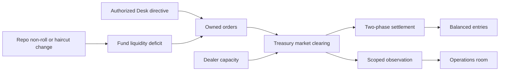

# Ben Bernankey MVP Cycle: Phased Implementation Outline

Build the thin live FOMC cycle from `11-design-discussion-bernankey-mvp-slice.md` as six vertical
slices. Each slice runs the whole spine — catalog selection, manifest and opening state, canonical
owners, scoped evidence, cognition, authority, execution, witnesses, and a text harness screen — and
each one adds a stage rather than a layer. The engine is new Python 3 in the repo root; the existing
representation catalog stays where it is and becomes a read-only identity source that each phase
closes a little further.

## Desired End State

- `just play` opens the Godot client for one early-2006 policy cycle from an inherited Morning Book
  through the next cycle's Morning Book. `just cli-play` retains the native text harness for
  parity and accessibility. Neither presentation path reads canonical state directly.
- Canonical state, observations, beliefs, staff assessments, player records, and rendered text live
  in separate modules with enforced import boundaries.
- One Treasury maturity-bucket market and one bilateral repo agreement form prices and allocations
  from participant orders and dealer capacity; no package-to-yield table exists in the codebase.
- The Chair can shape agenda, proposal, and language, and cannot manufacture a vote, a directive, a
  fill, a settlement, or an interpretation. A Chair-only market command returns
  `REJECTED_NO_APPLICABLE_DELEGATION`.
- Request, assignment, assessment, read, proposal, authorization, execution, clearing, settlement,
  publication, delivery, and belief revision are separately recorded witnesses.
- The same manifest, initialization bundle, choices, and seed reproduce the same event order,
  receipts, state hash, and player-visible evidence.
- The ten MVP acceptance gates run as an executable suite; the existing catalog contract suite still
  passes unchanged.

## Implementation Overview

- [x] Phase 1: Deterministic spine — manifest, clock, one release, one Morning Book
- [x] Phase 2: Authority — FOMC package, vote, directive, and the command that gets rejected
- [x] Phase 3: Endogenous market — Treasury clearing, repo funding, two-phase settlement
- [x] Phase 4: Institutional work — bounded requests, assessments, dissent, displaced work
- [x] Phase 5: Publication — structured claims, Loonberg, direct audiences, population views
- [x] Phase 6: Consequence — intermeeting compression, commitments, next Morning Book, postmortem

---

## ✅ Phase 1: Deterministic spine — manifest, clock, one release, one Morning Book

The smallest run that is recognizably Reservist: a scenario manifest and initialization bundle load
fail-closed, a scheduled event queue advances to a core-inflation release, a canonical macro adapter
produces an `Observation`, an `EvidenceDelivery` puts it in the Chair's hands, and a text Morning
Book renders it with source, as-of time, and uncertainty. Two runs with the same seed produce the
same hashes. Nothing decides anything yet — this phase exists to fix ownership, determinism, and the
epistemic boundary before any content leans on them.

### Change Outline

The repo currently holds only `assets/` and the design task directory. The engine is new, and the
catalog stays where it is: the engine reads it read-only and freezes a slice into the scenario so
runs do not depend on the artifacts path.

```diff
 reservist/
 ├── assets/headshots/
+├── engine/
+│   ├── canon.py                 + RFC 8785 canonical JSON, sha256 hashing
+│   ├── ids.py                   + EntityRef (entity_id, generation, entity_type)
+│   ├── catalog_slice.py         + read-only catalog CSV projection + freeze
+│   ├── manifest.py              + ScenarioManifest load and closure validation
+│   ├── initialization.py        + InitializationBundle load and reconciliation
+│   ├── clock.py                 + ScheduledEvent queue, stable sequence, advance_to
+│   ├── witness.py               + DomainEvent ledger and transcript writer
+│   ├── observation.py           + Observation, EvidenceDelivery, AccessScope
+│   ├── state/
+│   │   ├── registry.py          + canonical owner registry; typed mutation only
+│   │   └── macro_adapter.py     + hidden inflation/labor/housing state, scheduled outputs
+│   ├── player/records.py        + PlayerRecordStore: only delivered items
+│   ├── harness/office.py        + Morning Book text screen, Inspect, Advance
+│   └── cli.py                   + validate | freeze | run | replay-check | play
+├── scenarios/mvp_2006_cycle/
+│   ├── manifest.json
+│   ├── initialization.json
+│   ├── catalog_slice.json       + frozen projection, hashed into replay identity
+│   └── tape/releases.json       + locked exogenous release schedule
+├── tests/
+│   ├── test_canon.py
+│   ├── test_manifest_closure.py
+│   ├── test_initialization.py
+│   ├── test_event_order.py
+│   ├── test_access_boundary.py
+│   └── test_replay.py
+└── justfile                     + test, catalog-test, validate, run, replay, play
```

The manifest is the selection record and the bundle is the opening state, kept separate exactly as
`04-design-discussion-minimum-simulation-kernel.md` requires. Phase 1 selects five entries; later
phases append to the same file.

```json
{
  "manifest_id": "manifest.mvp_2006_cycle",
  "schema_version": 1,
  "catalog_definition_hash": "sha256:...",
  "selected_entries": [
    {"catalog_id": "person.us.ben_bernankey",
     "fidelity_tier": "NAMED_COGNITION",
     "period_variant": "variant.2006",
     "provider_binding": "person.us.ben_bernankey",
     "fallback_binding": {"policy": "FAIL"}},
    {"catalog_id": "office.us.federal_reserve.board_chair", "...": "..."},
    {"catalog_id": "office.us.federal_reserve.fomc_chair", "...": "..."},
    {"catalog_id": "reference.us.bls.cpi", "...": "..."},
    {"catalog_id": "adapter.macro.us.broad", "fidelity_tier": "MECHANICAL_OR_ADAPTER",
     "provider_binding": "adapter.macro.us.broad", "fallback_binding": {"policy": "FAIL"}}
  ],
  "observation_and_access_profile": "profile.chair_scoped",
  "replay_hash": "sha256:..."
}
```

Validation runs in the documented order and refuses to invent anything: manifest closure first, then
bundle referential integrity, then reconciliation, then the hash agreement.

```text
validate(scenario_dir)
  load frozen catalog_slice.json and verify catalog_definition_hash
  for each selected entry
    resolve identity, clade, fidelity tier, period variant
    require provider_binding with exactly one active provider
    require fallback_binding even when policy is FAIL
  load initialization bundle
    resolve every reference to a selected entry
    check units, currencies, and queue sequence keys
    reconcile named + residual totals at zero tolerance
  recompute manifest_content_hash, initialization_hash, scenario_hash
  fail closed at the first typed boundary violation
```

Canonical state is reachable only through the registry, and the harness never receives the registry.
This is the invariant the whole design rests on, so it gets a static test rather than a convention.

```text
CanonicalRegistry.owner(state_id) -> StateOwner        # engine internals only
StateOwner.apply(typed_transition) -> DomainEvent      # no untyped mutation path
ObservationSystem.produce(domain_event, access_scope) -> Observation
EvidenceDelivery(recipient, observation_ref, delivery_time, provenance)
PlayerRecordStore.deliver(EvidenceDelivery)            # the only thing harness/ can read
```

The run loop is the kernel order from the architecture, with the stages later phases fill in left as
explicit no-ops so the order never has to be rearranged.

```text
advance_to(next_event)
  apply due schedules and adapter transitions
  produce observations within declared access scopes
  deliver evidence and update selected beliefs        # phase 4 deepens
  open a player decision window when required         # phase 2
  apply procedure and authorization                   # phase 2
  execute authorized operations                       # phase 2
  collect orders and clear the bounded market         # phase 3
  settle each transaction envelope or emit failure    # phase 3
  deliver reports and audience evidence               # phase 5
  append commitments, receipts, and next work         # phase 6
```

Catalog work for this phase: promote the three anchor rows plus the CPI reference and a new
`adapter.macro.us.broad` entry to `probe_complete` with period variants, authority sources,
fallbacks, and owned-state contracts, through the existing inventory CSVs and `catalog.py import`.
The two Chair offices are `identity_only` today and cannot own state until promoted.

### Validation

#### Automated Verification

- [ ] `just catalog-test` — bounded Phase 1 additions introduce no new catalog-validation category, but the pre-existing `test_import_and_generation_are_byte_deterministic` and `test_vocabulary_boolean_and_semantic_null_validation` failures remain. Both import the unrelated media inventory and expose its existing unresolved relationship and transmission fields (214 structural issues); those baseline records are outside this phase.
- [x] `cd .humanlayer/tasks/federal-reserve-chair-crisis-management-simulator && python3 catalog/catalog.py validate --strict-warnings`
- [x] `just validate` — manifest and bundle load; deliberately broken fixtures fail with the expected typed category (missing provider, missing fallback, unreconciled residual, hash mismatch)
- [x] `just test` — `tests/test_access_boundary.py` asserts no module under `engine/harness/` or `engine/player/` imports `engine.state` or `engine.observation` internals
- [x] `just replay` — two runs from the same seed produce identical event order, transcript bytes, and `scenario_hash`

#### Manual Verification

- [x] `just play` opens the Godot Morning Book with inspectable source, reference period, publication time, and revision status; `Advance` moves to the next scheduled event. `just cli-play` exposes the same session boundary through the text harness.

---

## ✅ Phase 2: Authority — FOMC package, vote, directive, and the command that gets rejected

The Chair now has something to do and something they cannot do. The player proposes one of three
prepared packages to the FOMC, two limited-cognition participants respond from their own beliefs, the
Committee votes and may narrow the proposal, the New York Desk executes only what the directive
authorizes, and every stage leaves a separate receipt. The market side is still a declared boundary
adapter, flagged as such in the run report, so this phase can prove authority without waiting for
price formation.

### Change Outline

```diff
 engine/
 ├── state/
+│   └── institutions.py          + offices, access, FOMC membership, Desk authority status
+├── legal.py                     + LegalInstrument clauses, period variants, delegation resolution
+├── authority.py                 + Command, AuthorizationDecision, ActionResult
+├── cognition/
+│   ├── belief.py                + typed bounded estimate, uncertainty, source ledger
+│   └── participant.py           + LIMITED_ROLE_HOLDER reaction and dissent threshold
+├── bodies/fomc.py               + agenda, motion, discussion, vote, dissent, directive
+├── packages.py                  + PolicyPackage records and exclusivity groups
+├── execution/desk.py            + directive-bounded operation, execution status
+├── adapters/treasury_demand.py  + declared stub clearing result, replaced in phase 3
+├── records.py                   + Record base, receipt subtypes
+└── harness/
+    ├── fomc_room.py             + staff forecast, positions, Propose, question, vote result
+    └── operations_room.py       + directive, execution status, five-receipt view
 scenarios/mvp_2006_cycle/
+├── legal/                       + FRA 12A and 14, FOMC Rules of Organization s3,
+│                                  2006 Domestic Authorization and paragraph 4 delegation
+└── cast/fomc_2006.json          + Chair, two role-holders, votes, effective periods
 tests/
+├── test_authority_gates.py
+├── test_fomc_procedure.py
+└── test_receipts.py
```

The three packages are records with an authority path and a retained downside, not buttons. They are
the same three from the MVP design, and none of them writes a market outcome.

```text
PolicyPackage
  package_id: WAIT_AND_WARN | MEASURED_FIRMING | FIRMING_BIAS
  proposing_subject: office.us.federal_reserve.fomc_chair
  policy_actions[]            # target-rate action, permitted Desk operation
  communication_commitment    # claim clauses unlocked if authorized (phase 5)
  authority_requirements[]    # which clause must be effective, which body must vote
  known_downside              # carried in the packet, not a hidden penalty
  activation_state and revision_history[]
```

Authority resolution is the phase's hard edge. Every command must land on an effective clause or a
valid delegation, and the failure is explicit rather than a silent reroute.

```text
Command(requesting_office, target_owner, proposed_effect, claimed_authority)
  -> resolve claimed_authority against effective LegalInstrument clauses at scenario time
  -> if no clause and no valid delegation: ActionResult(REJECTED_NO_APPLICABLE_DELEGATION)
  -> if FOMC action required: motion, discussion, vote, dissent record
  -> AuthorizationDecision(approved | narrowed | deferred | rejected, scope, expiry)
  -> Desk executes strictly inside the directive
  -> ActionResult(rejected | authorized_not_executed | partially_executed | executed)
```

Five receipts render separately in the operations room, each naming owner, timestamp, status, source
record, and epistemic scope. No receipt implies the next stage occurred.

```text
PROPOSAL        what the Chair submitted, when, under which office
AUTHORIZATION   which body approved, narrowed, deferred, or rejected each command
EXECUTION       which desk attempted what quantity on what terms
SETTLEMENT      pending until phase 3
OBSERVED EFFECT adapter-sourced in this phase and labelled as such
```

Catalog work: promote `body.us.federal_reserve.fomc`, `inst.us.federal_reserve.board`,
`inst.us.federal_reserve.new_york`, the chief-of-staff and governor offices, and the FRA
`LegalInstrument` rows, with the 2006 period variants and authority sources cited to the primary
sources named in the architecture.

### Validation

#### Automated Verification

- [x] `just test` — a Chair-only market command returns `REJECTED_NO_APPLICABLE_DELEGATION` and mutates no state
- [x] `just test` — the Committee can narrow `FIRMING_BIAS` to a firming step without the language commitment, and the Desk then refuses the unauthorized leg
- [x] `just test` — a dissenting participant is recorded with their own belief provenance, and dissent does not change the outcome
- [x] `just test` — a blackout window derived from the published FOMC calendar removes `Communicate` from the available verb set
- [x] `just run --package WAIT_AND_WARN|MEASURED_FIRMING|FIRMING_BIAS` — each produces a distinct receipt chain from the same opening state
- [x] `just replay` — receipts and vote order are byte-identical across runs
- [ ] `just catalog-test` and `catalog.py validate --strict-warnings` still pass

#### Manual Verification

- [x] In the FOMC room the player can see each participant's stated position and its stated basis, propose a package, and read a vote result that they could not have guaranteed

---

## ✅ Phase 3: Endogenous market — Treasury clearing, repo funding, two-phase settlement

Replace the demand adapter with a real price. A primary-dealer cohort, a leveraged-fund cohort, and an
external-buyer residual submit owned orders into a small maturity-bucket Treasury market; dealer
capacity limits intermediation; clearing may ration or fail outright. One bilateral repo agreement
carries funding, collateral, maturity, and a non-roll decision. Every cross-owner transfer goes
through a two-phase envelope and balanced entries. This is the phase that proves the game has no
policy-to-yield table.

### Change Outline

```diff
 engine/
 ├── accounting/ledger.py         + balanced entries, conserved stocks, discrepancy accounts
 ├── markets/
+│   └── treasury_secondary.py    + maturity buckets, order book, capacity, clearing residual
 ├── participants/
+│   ├── dealer_cohort.py         + inventory, financing, risk limits, capacity withdrawal
+│   ├── leveraged_fund.py        + position, leverage, liquidity buffer, deleveraging rule
+│   └── external_buyer.py        + conserved residual cash and demand capacity
+├── agreements/repo.py           + terms, collateral control, haircut, maturity, roll or non-roll
+├── settlement/envelope.py       + prepare and commit, reservation release, typed failure
-├── adapters/treasury_demand.py  - replaced; interface and fallback contract preserved
 tests/
+├── test_clearing.py
+├── test_conservation.py
+├── test_settlement_failure.py
+└── test_provider_parity.py
```

The market owns clearing results and nothing else. Participants own their orders and positions, and
the outcome is allowed to be a failure.

```text
TreasuryMarket.clear(bucket, orders, dealer_capacity)
  -> ClearingResult
       price
       filled_by_participant[]
       rationed_quantity
       residual
       status: CLEARED | RATIONED | FAILED_TO_CONVERGE
```

Settlement is where most simulation bugs hide, so the envelope is explicit and partial completion is
not representable.

```diff
 transfer(cash, securities, collateral)
-  debit and credit in place
+  prepare: validate versions, authority, availability; take reservations
+  commit:  apply all owner entries in stable order
+  on failure: emit typed failure, release reservations, record no completed envelope
```

Order flow closes the loop back to the previous phase: the authorized Desk operation and the fund's
own liquidity position both produce orders, and the resulting price becomes a scoped observation that
reaches the Chair through the operations room rather than through a state read.



Catalog work: merge the duplicate Treasury secondary aliases into one canonical ID, add the
leveraged-fund cohort and external-buyer adapter rows the MVP needs, and record the repo agreement's
owned state and transitions. `cohort.us.dealer.primary` currently carries the `Institution` clade
while the MVP slice table calls it an `OrganizationCohort`; reconcile that row here.

### Validation

#### Automated Verification

- [x] `just test` — opening and closing cash, securities, collateral claims, repo obligations, and equity reconcile exactly
- [x] `just test` — a rationed clearing leaves an explicit residual and a `RATIONED` status; a non-converging clearing returns `FAILED_TO_CONVERGE` rather than a fabricated price
- [x] `just test` — a failed prepare releases every reservation and records no completed envelope
- [x] `just test` — repo non-roll produces a timestamped liquidity deficit with a witnessed trigger, never an automatic renewal
- [x] `just test` — provider parity: the phase 2 adapter and the endogenous market conserve the same quantities and emit the same interface shape against one boundary fixture
- [x] `just run --report-endogeneity` — the run report lists which outputs are endogenous and which still come from adapters
- [x] `just replay` — identical clearing, settlement, and observation order across runs

#### Manual Verification

- [x] Running the same package twice with different opening dealer capacity produces a visibly different price and fill, with no code path that maps a package to a yield

---

## ✅ Phase 4: Institutional work — bounded requests, assessments, dissent, displaced work

The player's actual activity arrives. `Ask` creates a typed `AnalyticalTask` against a named staff
unit; accepting it reserves capacity and names the work it displaces; the unit returns an `Assessment`
with supporting and contrary evidence, stale inputs, and dissent; the assessment reaches the meeting
packet and revises participant beliefs, which changes what the FOMC does with the same package. This
phase makes the phase 2 vote informationally live and makes attention cost concrete rather than
abstract.

### Change Outline

```diff
 engine/
 ├── staff/
+│   ├── units.py                 + Monetary Affairs, Markets, Communications: access and methods
+│   ├── capacity.py              + reservation, displacement, deadline slip
+│   ├── analytical_task.py       + question template, access requirements, deadline
+│   └── assessment.py            + conclusion distribution, dissent, unavailable inputs
 ├── cognition/
+│   └── revision.py              ~ beliefs revise from delivered assessments and evidence only
+├── uncertainty.py               + measurement, model, strategic, institutional, aleatory, reflexive
 └── harness/
+    ├── request.py               + contextual request grammar and its tradeoff sentence
+    └── office.py                ~ Morning Book gains routing account and exhibit drill-down
 tests/
+├── test_request_lifecycle.py
+├── test_displaced_work.py
+└── test_assessment_provenance.py
```

The request is institutional work with a visible cost, rendered as a sentence rather than a form.

```text
Ask Markets to compare current dealer inventory and financing capacity
    with the last four refundings.
Owner:    staff.us.federal_reserve.markets
Expected: before the 08:30 pre-meeting briefing
Tradeoff: delays the foreign-demand appendix past the decision deadline
```

An assessment is a record of what staff infer under named assumptions. It reads delivered evidence
only, and it is allowed to be late, partial, refused, or wrong.

```text
Assessment
  task_reference and as_of_time
  conclusion_distribution
  supporting_evidence[] and contrary_evidence[]
  assumptions[] and unavailable_or_stale_inputs[]
  package_alternative_assessments[]
  authoring_unit, dissent[], confidence
  expected_next_information
```

The stage chain the phase must keep separable — one witness never proves the next:

```text
request -> assignment -> assessment -> read -> proposal -> vote
```

### Validation

#### Automated Verification

- [x] `just test` — accelerating a request names and actually delays a specific other deliverable; the displaced item misses the decision deadline
- [x] `just test` — a declined request and a missed deadline both produce a witnessed result and no assessment
- [x] `just test` — assessment construction touches only `PlayerRecordStore` and unit-scoped deliveries; a canonical read raises
- [x] `just test` — the same package proposed with and without the follow-up assessment produces different participant beliefs and can produce a different vote
- [x] `just test` — reading a delivered artifact consumes no capacity; requesting one does
- [x] `just replay` — task assignment, delivery, and revision order stable across runs

#### Manual Verification

- [x] After the Morning Book and one follow-up, the player can state what was disputed and which unit disputed it, without the interface asserting which side is correct

---

## ✅ Phase 5: Publication — structured claims, Loonberg, direct audiences, population views

The decision becomes public. The statement editor assembles structured `Claim` clauses bounded by the
authorized outcome; Loonberg selects and frames them into a `Report`; each recipient gets its own
`EvidenceDelivery` over a declared edge with its own delay and framing; the dealer and fund cohorts
reinterpret and send new orders into the phase 3 market; two person cells, two household summaries,
and two Pop lenses show the distributional stakes. No network, no reposts, no reach cascade.

### Change Outline

```diff
 engine/
+├── claims.py                    + claim registry: subject, predicate, modality, horizon
+├── communication.py             + CommunicationAct bounded by the authorized outcome
 ├── media/
+│   └── loonberg.py              + editorial selection, framing, publication queue
+├── delivery.py                  + declared audience edges, per-recipient delay and scope
 ├── population/
+│   ├── person_cells.py          + conserved person mass, two cells
+│   ├── household_cohorts.py     + renter and mortgaged-owner exposure summaries
+│   └── pop_lens.py              + non-owning views over that state
 └── harness/
+    ├── statement.py             + clause selection and exposure preview
+    └── wire.py                  + attributed report rows, not a media screen
 tests/
+├── test_claim_grammar.py
+├── test_audience_delivery.py
+├── test_report_is_inert.py
+└── test_population_conservation.py
```

Prose is downstream of claims, and claims never carry an effect size for the market to read.

```text
Claim
  subject     inflation | employment | policy_path | market_functioning
  predicate   rising | contained | conditional | intended
  magnitude_or_category, horizon, conditions[]
  modality    observes | expects | intends | promises | rules_out
  confidence  and supporting_evidence_refs[]
```

Delivery edges are enumerated in the manifest. Each is a separate row with its own delay, framing,
and access scope, which is what makes the no-network rule enforceable.

```text
Fed statement -> primary-dealer cohort
              -> leveraged-fund cohort
              -> Loonberg editorial queue
              -> attentive household audience lens

Loonberg report -> policy-elite recipients
                -> market-professional recipients
                -> low-attention public residual
```

The reflexive path back into phase 3 is the point: publication changes exposure, exposure may change
belief, belief may change an order, and only the order can move a price.

```diff
 publication
+  -> delivered exposure
+  -> attention
+  -> interpretation and belief revision
+  -> audience-owned order or pressure
-  -> market confidence +3
```

### Validation

#### Automated Verification

- [x] `just test` — a `Report` cannot mutate any canonical stock; the negative invariant fails the run if it tries
- [x] `just test` — a claim clause outside the authorized outcome is rejected at construction
- [x] `just test` — one audience receives the report and another does not, and only the reached audience revises beliefs
- [x] `just test` — exposure does not imply attention, attention does not imply belief revision, belief revision does not imply an order
- [x] `just test` — person mass is conserved and household allocations sum to their cells
- [x] `just test` — presentation metadata (species, display name, portrait path) is unreadable from any cognition or market module
- [x] `just replay` — interpretation draws and delivery order stable under the same seed

#### Manual Verification

- [x] The two Pop lenses make the mandate tradeoff legible without exposing a truthful sentiment meter or an economy score

---

## ✅ Phase 6: Consequence — intermeeting compression, commitments, next Morning Book, postmortem

Close the loop. The cycle compresses through scheduled intermeeting events, commitments and monitoring
obligations persist and pull staff attention, the next Morning Book inherits prior claims, votes,
dissent, displaced work, and market outcomes, and an in-world staff review distinguishes what was
received, requestable, inaccessible, accepted as risk, realized by chance, and still unresolved. The
ten MVP acceptance gates become an executable suite.

### Change Outline

```diff
 engine/
+├── commitments.py               + reservations, contingent obligations, expiry, breach
+├── monitoring.py                + obligations attached to commitments and case files
+├── compression.py               + advance to the next consequential event or window
+├── postmortem.py                + player-safe projection over the developer lineage
 └── harness/
+    └── review.py                + next Morning Book and staff review screens
 tests/
+├── acceptance/test_mvp_gates.py + the ten gates from the MVP design
+├── test_commitment_carryover.py
+├── test_postmortem_labels.py
+└── test_multi_seed_band.py
```

The developer trace stays richer than what the player sees, and each link in the player-facing path
carries an epistemic label relative to the decision time.

```text
VISIBLE | WEAKLY_SIGNALED | MODEL_DISPUTED | STRATEGICALLY_CONCEALED
INSTITUTIONALLY_UNAVAILABLE | CROWDED_OUT | OUTSIDE_OBSERVATION
ALEATORY_REALIZATION | REFLEXIVELY_CHANGED
```

The postmortem must support four explanations without emitting a verdict for any of them.

```text
bad judgment            decision-time evidence contradicted the stated rationale
accepted risk           the packet named the downside and the Chair took it
unavailable information the decisive fact was outside lawful or timely access
bad luck                a keyed draw on the preexisting path changed magnitude or timing
```

The gate suite is the phase's real deliverable — one executable check per numbered MVP gate, with no
`covered` shortcut and an explicit `UNPROVABLE` result when an obligation never activates.

```text
1 manifest closure        6 persistence into the next Morning Book
2 epistemic separation    7 replay identity
3 institutional agency    8 negative paths
4 market causality        9 player comprehension harness
5 stage witnesses        10 no-network dependency
```

### Validation

#### Automated Verification

- [x] `just gates` — all ten acceptance gates pass; any unactivated obligation reports `UNPROVABLE` rather than passing
- [x] `just test` — interactive `propose MEASURED_FIRMING` followed by consequential `advance` commands reaches and renders both next-cycle review artifacts
- [x] `just test` — the next Morning Book cites the prior vote, dissent, displaced work, market outcome, and every outstanding monitoring obligation
- [x] `just test` — a commitment that expires releases its reservation; one that is breached leaves institutional history
- [x] `just test` — the postmortem never names a precursor absent from the pre-decision trace and never reveals unrelated canonical state
- [x] `just test` — multi-seed run: outcomes vary within a band while the mechanism class and witness order stay stable
- [x] `just replay` — full cycle, all three packages, identical hashes
- [ ] `just catalog-test` and `catalog.py validate --strict-warnings` still pass with the complete selected slice marked `probe_complete` — bounded Phase 6 inventory and frozen-slice checks pass in `tests/test_phase6_catalog_slice.py`; both global commands remain blocked by the pre-existing 214 unrelated media, relationship, and transmission issues.

#### Manual Verification

- [x] After the staff review, a player who has not read the design documents can say what they knew, what they could have asked for, what they could not know, what they controlled, and which risk they took

---

## Open Questions

- **Catalog closure pace.** Each phase promotes its selected entries to `probe_complete` in the
  existing inventory CSVs, which means every phase edits files under the task artifact directory
  alongside repo code. The alternative is one large catalog-closure pass before Phase 1. Phased
  promotion keeps each slice honest but spreads catalog churn across all six phases.
- **`cohort.us.dealer.primary` clade.** The catalog row carries `identity_clade=Institution`; the MVP
  slice table lists primary dealers under `OrganizationCohort`. Phase 3 assumes the row should become
  a cohort. If the Institution clade was deliberate — a flattened named intermediary rather than a
  cohort response — the MVP table is what needs the amendment instead.
- **Alias cleanup scope.** `market.us.treasury.secondary` / `market.us.treasury.secondary_maturity`,
  `market.us.treasury.futures` / `market.us.treasury_futures`,
  `reference.us.bls.cpi` / `reference.us.consumer_price_index`, and the two EFFR rows are duplicate
  identities. This outline merges only the pairs the MVP selects. Merging the rest is cheap now and
  more expensive after any of them enters a hash.
- **Harness graph output.** The design calls for a "text-and-graph harness." This outline assumes text
  tables and inline series dumps with no third-party dependency, matching the catalog tooling's
  stdlib-only convention. If real plots are wanted, that adds the project's first dependency.
