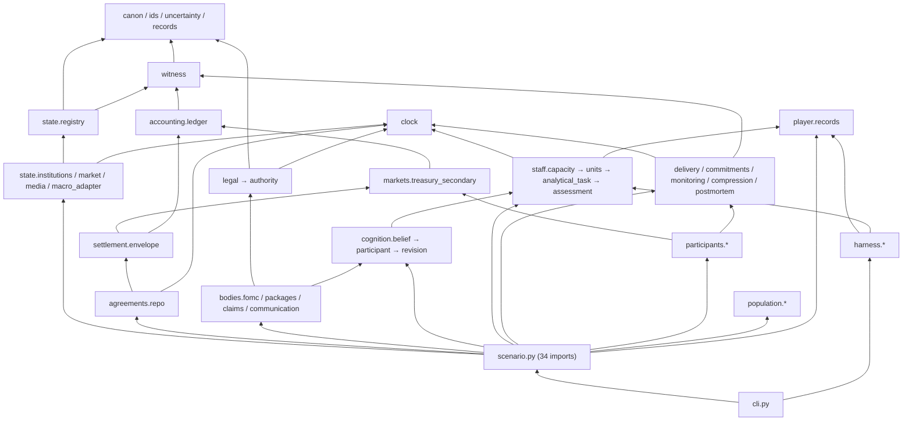
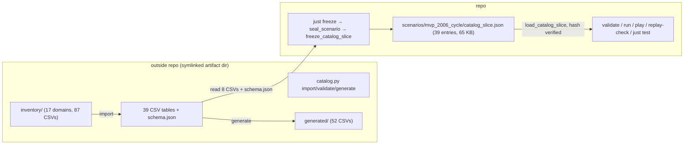
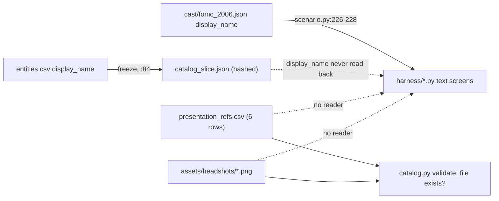

# Research: Game Architecture — Engine, Folder Structure, Art Pipeline, Actor Scaling

**Date**: 2026-09-04T20:09:34Z
**Git Commit**: 8679992af86a (jj change `okunkwwm`, "feat: Complete the policy cycle"); the working copy `@` is an empty child (`ompltnrm` / 9003f69d)
**Branch**: not applicable — jj workspace `federal-reserve-chair-crisis-management-simulator`; the repo's `default` workspace is `~/reservist` (colocated `.git`)
**Repository**: reservist

## Research Question

With the Ben Bernankey MVP slice completing, what is the factual starting position for the
game-architecture decisions ahead:

1. What is the underlying engine today — what does the runtime actually consist of, what does it
   depend on, what determinism guarantees does it make, and what have the design documents already
   committed to or left open about runtime technology?
2. What is the folder structure today — module layering, enforced boundaries, where content and
   the catalog live, and how the build/test topology is wired?
3. What is the art pipeline today — what assets exist, how the presentation register is defined
   and validated, what the rendering path is, and what rules govern presentation?
4. How are simulated actors ("agents") run today — how many exist, at what fidelity, what each
   costs per event, what scales with what — and what have the design documents committed to about
   actor fidelity, aggregation, and LLM use?
5. What platform could the game be built on — Bevy, Godot, or something else — given that the
   Clausewitz archetype is proprietary? What are the current, verifiable facts about each
   candidate against the requirements the codebase and design already fix?

The question uses "agents" without qualifying it. This document covers both readings: the
simulated actors (which is what every design artifact and every line of code means by the word)
and LLM-driven components (which the design permits only as prose renderers and which the code
does not contain).

Design-document citations use the shorthand `NN:line`, where `NN` is the artifact prefix in this
task directory (`04` = `04-design-discussion-minimum-simulation-kernel.md`, etc.).

## Research Methodology (verbatim)

This document will remain objective and factual. It does not contain any recommendations or implementation suggestions.
Open questions will not ask Why things haven't been built or what should be built in the future.

There is no "implementation" section - that is intentional.

## Summary

The engine is a 10,079-line, zero-dependency CPython 3.14 discrete-event kernel. There is no
game engine, no framework, no `pyproject.toml`, and no CI. Everything runs from `python3 -m
engine.cli` behind a nine-recipe `justfile`. Replay identity comes from a hand-rolled RFC 8785
canonical-JSON encoder plus SHA-256, layered into five content hashes that compose into one
`replay_hash`; randomness enters only through keyed SHA-256 draws, never a PRNG. A full MVP cycle
is 74 domain events and runs in about 26 ms. The design documents never chose a runtime technology
— they say so three times (`04:731`, `04:735`, `10:122-124`) — but they did commit to headless-first
execution, UTF-8 canonical JSON as the only interchange format, a task-graph model where
parallelism is "a constraint, not an immediate performance requirement" (`04:140`), and an
explicit list of runtime rejections (LLM decision-making, general scripting APIs, fixed universal
ticks). The prior research document (`08`) predates the engine and describes the workspace as
having "no simulator runtime"; that is no longer true.

The repository is one flat Python package with an acyclic import graph: `canon`/`ids`/`clock`/
`witness` at the bottom, `scenario.py` (1,817 lines, 34 imports) as the composition root,
`cli.py` on top. Two boundaries are enforced by tests — one AST-based (harness/player may not
import `engine.state` or `engine.observation`), one substring-based (cognition/markets/
participants may not contain `display_name`, `species`, `portrait_path`). The rest of the
layering is convention. The representation catalog (874-line `catalog.py`, 39 CSV tables, 527
entities) lives outside the repo under the symlinked task-artifact directory. The engine reads it
only during `just freeze`; the frozen `catalog_slice.json` (39 entries, 65 KB) makes `test`,
`run`, `play`, and `replay` independent of the catalog's presence. Three files hardcode the
single scenario path.

Art is fourteen 1254×1254 full-color PNGs and a six-row `presentation_refs.csv`. The catalog
validator checks that each referenced file exists and nothing else. No code in `engine/` or
`scenarios/` reads the register, opens an image, or knows the word "species"; the harness renders
plain monospace text by building `list[str]` and joining. The design mandates that the
presentation register be excluded from replay identity (`06:72`, `06:1583-1587`) and lists display
name among presentation fields (`09:444-460`); as built, `display_name` is copied from
`entities.csv` into the hashed `catalog_slice.json` (`engine/catalog_slice.py:84`) and therefore
participates in `replay_hash`.

The actor layer has no `Agent` base class and no per-tick loop. Roughly seventeen behavior-bearing
instances — one named person, two limited participants, one decision body, three staff units,
two organization cohorts, one external-buyer residual, two person cells, two household cohorts,
two Pop lens projections, one outlet — represent ten million people and five million households
as integer counts. The seven-tier fidelity ladder is enforced as catalog data validated at
manifest load, not as a Python type hierarchy. No loop is O(actors × actors); delivery is one
scheduled event per manifest edge (nine edges) regardless of represented mass. Beliefs are
overwritten, not accumulated. The witness ledger and canonical `history` lists are append-only.
The design commits to no target agent count (`04:3042`), a single promotion rule, cognition that
reconsiders only on declared triggers (`04:265`), and exactly four statements about LLMs — three
prohibitions and one permission to render prose that is "never reparsed to recover mechanics"
(`04:1783`).

On platform: the code already splits 7,447 lines of simulation from 617 lines of presentation
and CLI, and the design's requirements (headless-first, byte-identical replay, exact decimal
ledger, JSON-schema content, document-heavy non-spatial UI, open license) can be checked against
each candidate. Clausewitz is proprietary and appears in the design only as an archetype. Among
open-license engines, Bevy 0.19 (MIT/Apache, the developer's prior substrate) runs headless via
`MinimalPlugins` but has no first-class rich-text, table, or chart widgets and breaks its API
every release; Godot 4.7.1 (MIT) has `--headless`, `RichTextLabel`/`Tree`/`TabContainer`
built in, and Valve-documented Steam support, but its Rust binding is pre-1.0 and its JSON parser
floats all numbers. MonoGame 3.8.5.1 / FNA (Ms-PL) leave the loop to you and ship Stardew Valley
and Celeste. Web-shell (Tauri 2.11 / Electron 43) and Rust native toolkits (egui 0.36, iced 0.14)
give the strongest document UI and keep the Python core as a sidecar or PyO3 embed, at the cost of
no shipped-game precedent. Unity and Unreal are proprietary or royalty-bearing. No shipped Bevy or
Godot title with documented byte-identical replay was found.

## Detailed Findings

### 1. The engine is a zero-dependency CPython 3.14 discrete-event kernel, and the design never chose a runtime technology

#### What "the engine" is today

`engine/__init__.py:1` names itself "Reservist's deterministic simulation kernel." Every import
across `engine/` and `tests/` resolves to the standard library: `argparse, ast, collections, copy,
csv, dataclasses, datetime, decimal, enum, hashlib, heapq, json, math, pathlib, shutil, sys,
tempfile, typing, unittest`. There is no `pyproject.toml`, `setup.py`, `requirements.txt`, lock
file, or CI configuration. The interpreter in use is CPython 3.14.6 (bytecode caches are
`cpython-314`). Version control is jujutsu (`.jj/`); there is no `.git` directory.

```text
engine/                         8,064 LOC, 41 files
├── canon.py            99      RFC 8785-style canonical JSON, sha256, fail-closed JSON load
├── ids.py              32      EntityRef(entity_id, generation, entity_type) — leaf, no imports
├── clock.py            90      ScheduledEvent, SimulationClock (heapq), parse_time
├── witness.py          74      DomainEvent, WitnessLedger, transcript_bytes
├── state/registry.py   83      TypedTransition, StateOwner, CanonicalRegistry
├── scenario.py      1,817      ScenarioRuntime — composition root, dispatch table, run loop
├── cli.py             249      validate | freeze | run | replay-check | play
└── ... 35 domain modules (see §2 tree)
tests/                  2,074 LOC, 33 files, 86 test methods
scenarios/mvp_2006_cycle/       8 canonical-JSON files, one scenario
```

#### The run loop is a heap-ordered dispatch table, not a tick

The only externally driven primitive is `ScenarioRuntime.advance_next()` (`engine/scenario.py:
1693-1697`). It delegates to an intermeeting compressor, which pops the heap and calls `_handle`,
an `if/elif` chain over `work_kind` strings:

```text
ScenarioRuntime.advance_next()                           scenario.py:1693-1697
  IntermeetingCompressor.advance_next(handler, on_compression)   compression.py:73-84
    next_step()                                          # emits a step only if gap >= 1 day
    on_compression(step) -> ledger.append("intermeeting_time_compressed")
    SimulationClock.advance_to(event.due_time, handler)  clock.py:68-83
      while heap[0].sort_key[0] <= target:
        heappop -> handler(event)
          ScenarioRuntime._handle(scheduled)             scenario.py:1615-1691
            macro.publish_release                        inline, 1616-1645
            macro.publish_intermeeting_release           -> _handle_intermeeting_release 1440-1483
            staff.complete_analytical_task               -> _complete_analytical_task 503-572
            repo.process_non_roll                        inline, 1652-1663
            fomc.meeting                                 -> _handle_fomc_meeting 667-774
              FomcBody.conduct / DeskExecutor.execute / _run_market_cycle / commitments
            communication.publish_fomc_statement         -> _publish_fomc_statement 990-1033
            audience.receive_artifact                    -> _handle_audience_reception 881-988
            media.publish_loonberg_report                -> _publish_loonberg_report 1099-1139
            monitoring.review / commitment.expire / morning_book.next_cycle
            <unmatched>                                  -> ledger.append("scheduled_event_handled")
```

`run_all()` and `run_until_first_delivery()` (`scenario.py:1708-1715`) are `while
advance_next(): pass` loops with different stop conditions. Stage order within a handler is
Python statement order; there is no phase engine. Every canonical mutation goes through
`CanonicalRegistry.apply(owner_id, TypedTransition, ledger)` (`state/registry.py:60-75`), which
pairs the mutation with a `ledger.append` atomically — there is no path to mutate a registered
owner without emitting a `DomainEvent`.

`ScenarioRuntime.__init__` (`scenario.py:206-386`) is itself a fixed-order construction stage:
ledger → player records → observation system → registry → legal/authority → participants, staff,
FOMC → desk, accounting → market, cohorts, repo → population, households, lenses → claims, router,
outlet → clock (from `initialization.json["scheduled_events"]` + `tape["events"]`) → compressor →
two bootstrap ledger entries.

#### Ordering, hashing, and randomness are all specified to the byte

The event queue is a `heapq` list of `ScheduledEvent`, a `@dataclass(order=True, frozen=True)`
whose first field is a derived `sort_key: tuple[datetime, int, int, str]` set via
`object.__setattr__` in `__post_init__` (`clock.py:16-33`):

```text
sort_key = (due_time, phase_priority, stable_sequence, stable_id)
```

All other fields are `compare=False`. `schedule()` refuses events in the past and rejects
duplicate `stable_id` or `stable_sequence` with two linear scans of the pending list
(`clock.py:59-66`). Dynamically scheduled events draw `stable_sequence` from a counter starting
at 1000 (`scenario.py:328, 839-863`), disjoint from the statically seeded events.

Hashing is layered. Each layer strips its own hash field and canonicalizes the rest:

| Hash | Where computed | Over |
|---|---|---|
| `catalog_definition_hash` | `catalog_slice.py:27-32` | frozen slice minus its hash field |
| `manifest_content_hash` | `manifest.py:16-18` | manifest minus `{manifest_content_hash, replay_hash}` |
| `initialization_hash` | `initialization.py:11-12` | bundle minus `initialization_hash` |
| `release_tape_hash` | `scenario.py:69-70` | tape minus its hash field |
| `authority_content_hash` | `scenario.py:89-94` | every `legal/*.json` |
| `replay_hash` (= `scenario_hash`) | `scenario.py:73-86, 170-175` | dict of the four above |
| `CanonicalRegistry.state_hash()` | `state/registry.py:77-83` | owners in `sorted()` order |
| `ScenarioRuntime._state_hash()` | `scenario.py:1717-1747` | 23 subsystem snapshots |
| `_material_state_hash()` | `scenario.py:828-837` | accounting, registry, households, population, market — used as a pre/post guard; `PublicationInvariantError` at 985-988, 1025-1028, 1112-1115, 1136-1139 if audience handling mutates material state |

The canonicalizer (`canon.py:57-78`) sorts object keys by UTF-16BE bytes (`_key`, 53-54),
rejects NaN/Infinity at both hash time and load time (`_reject_constant`, 94-95), rejects `bool`
before the `int` check (24-25), and renders floats via `Decimal(repr(value))` to reproduce the
shortest round-trip form (35-49). `transcript_bytes()` is one canonical-JSON line per
`DomainEvent` (`witness.py:70-71`); `replay-check` compares transcripts byte-for-byte across two
independent runs per package (`cli.py:75-103`).

Randomness never touches `random`. Every draw is `int.from_bytes(sha256(key).digest()[:8],
"big") / 2**64` where the key is a pipe-joined string of seed, subsystem, entity, and purpose:
`compression.py:86-101` (`f"{seed}|{PATH_ID}|magnitude"`) and `delivery.py:221-224`
(`f"{seed}|{edge_id}|{artifact_id}|{stage}"` for `attention`, `revision`, `order`,
`interpretation`). `tests/test_multi_seed_band.py:9-38` proves four seeds change magnitudes but
not the `transition_kind` sequence.

#### Python-specific behavior the hashes depend on

These are the places where the current byte-level identity is tied to CPython semantics rather
than to the design's stated formats:

| Dependency | Location | What it pins |
|---|---|---|
| `Decimal` with `quantize(Decimal("0.0001"), ROUND_HALF_UP)` | `accounting/ledger.py:5,15-16,24-29,161-216`; `markets/treasury_secondary.py:28-29,62,189-191,227` | Exact conservation and fill prices; `str(Decimal)` is what gets hashed |
| `repr(float)` shortest round-trip | `canon.py:35` | Seed for canonical number rendering |
| UTF-16BE key sort with `surrogatepass` | `canon.py:53-54,73` | Object key order in every hash |
| `dataclass(order=True)` field declaration order | `clock.py:16-27`, `ids.py:7-11` | Heap comparison priority; `EntityRef` ordering |
| `object.__setattr__` on a frozen dataclass | `clock.py:29-33` | Derived `sort_key` on an immutable record |
| `datetime.fromisoformat` after `Z`→`+00:00` rewrite; aware-only | `clock.py:9-13` | Sort-key time comparison; accepted grammar varies by CPython version |
| `StrEnum` (3.11+) | `records.py:8`, `uncertainty.py:8`, `treasury_secondary.py:12,17` | Source-level only; wire form is a plain string |
| `csv.DictReader` defaults | `catalog_slice.py:3,22-24` | Bytes of the frozen slice from the same CSVs |
| Frozen-dataclass structural `__eq__` on `RunResult` | `scenario.py:181-198`; `cli.py:85`; `tests/acceptance/test_mvp_gates.py:138` | Replay equality check |

Nothing hashes on Python's randomized `hash()` builtin: every dict that enters a hash is either
`sorted()` first (`state/registry.py:80-82`, `catalog_slice.py:67`, `staff/units.py:107`) or
passes through `canonical_text`, which sorts keys itself. `PYTHONHASHSEED` appears nowhere.

#### Scale as measured

- `initialization.json` seeds 5 scheduled events; `tape/releases.json` adds 2; `opening_state` has
  46 rows, of which 21 are wrapped by `CanonicalRegistry` and 25 are owned by plain domain classes
  (`scenario.py:606-643` filters on `storage`).
- `python3 -m engine.cli run --report-endogeneity` for `MEASURED_FIRMING` produces `events=74`.
- Thirty in-process `ScenarioRuntime(...).run_all()` calls from one validated scenario took 0.788 s
  (≈26 ms per full cycle) in an ad hoc measurement; there is no tracked benchmark.
- `just test` (86 tests) runs in 3.75–3.92 s; `just gates` (10 tests) in 0.70 s.
- Superlinear surfaces, all at small n: `SimulationClock.schedule()` dedupe scans are O(k) per
  call (`clock.py:62-65`); `TreasurySecondaryMarket.clear()` is two-pointer with a 64-iteration cap
  returning `FAILED_TO_CONVERGE` (`treasury_secondary.py:124,166-167,247-261`);
  `AccountingLedger.assert_conserved()` sums all accounts per commit (`ledger.py:215-218`).

#### What the design committed to about the runtime

The design documents state three times that runtime technology is unchosen: "runtime technology
remain[s] working mechanisms" (`04:731`), "Serialization format unset" (`04:735`), and "frontend
technology" is in the not-doing list (`10:122-124`). `04:3371` adds that Clowder patterns "are
architectural precedents, not code that can be imported unchanged."

What is committed:

| Commitment | Source |
|---|---|
| Headless-first: "A deterministic, headless simulation runs from a seed and an initial-condition bundle" | `04:55`, `04:38`, `04:2385`, `04:2232` |
| Interchange is UTF-8 JSON under versioned JSON Schema; hashing is RFC 8785 + SHA-256; "only canonical JSON enters replay identity" | `04:2725-2730`, `04:2988-2993` |
| `EventOrder = (simulation_time, phase_priority, stable_sequence)`; `RunIdentity = (seed, scenario_hash, constants_hash, engine_version)` | `04:3440-3441` |
| Keyed or counter-based draws; "A changed Chair decision must not shift unrelated future weather or incident draws" | `04:686` |
| Task graph over snapshots with stable-sorted commits; parallelism "a constraint, not an immediate performance requirement" | `04:269-299`, `04:140`, `04:3321-3325` |
| Deterministic-parallel probe: same results under several worker counts | `04:2251` |
| No fixed universal tick; cadence classes only; every loop bounded with a failure result | `04:303-311`, `04:3077` |
| Save/resume behaviorally identical to uninterrupted execution; full `ReplayIdentity` inventory | `04:657-682` |
| Presentation excluded from causal replay identity; session records presentation build hashes separately | `04:690`, `04:2477-2480` |
| Two-phase reserve-and-commit envelope for all cross-owner transfers | `04:2471-2476` |
| Observability is kernel infrastructure: profiler exports, per-boundary replay hashes, conservation reports | `04:2217-2226` |
| No performance, memory, or entity-count budget anywhere; only query and attention budgets | `04:631`, `04:1858` |

Rejected: LLMs choosing actions/beliefs/outcomes (`04:73`); a general scripting API (`04:3177`,
`04:144`); fixed universal ticks (`04:3077`); premature implementation and uniform prose design
(`04:3017`); save compatibility across versions is deferred (`04:2963`).

The Clowder research (`02`) is the one substrate precedent studied. It declines by methodology to
recommend Rust/Bevy (`02:35-38`) and partitions Clowder into reusable (run-assessment verdict
apparatus, belief facet struct, anti-thrashing layer, witness contract — `02:48, 272, 286, 296,
340, 364`) and non-transferable (spatial substrate, 27 rendering files, 5,272 sprite PNGs, ComfyUI
rig pipeline — `02:48, 423-425`). Its determinism-cost finding is the reason `04` moves from a
serialized global RNG to keyed draws: "adding or removing a sibling system — even one with no
data dependency — perturbs the topological sort enough to change RNG consumption" (`02:362`).

#### Testing patterns

Unit tests pin exact literals for the bottom layer: `tests/test_canon.py:8-31` (key ordering with
a non-ASCII key, the RFC 8785 number examples `[333333333.3333333,1e+30,4.5,0.002,1e-27,0]`,
non-finite rejection, mapping-order invariance); `tests/test_event_order.py:8-42` (four events fed
in reverse isolating each tiebreak level, plus backward-advance refusal). Everything above that is
integration: `tests/test_replay.py`, `test_phase2..5_replay.py`, `test_multi_seed_band.py`, and
`tests/acceptance/test_mvp_gates.py` construct one or two full `ScenarioRuntime`s against the
single committed scenario and compare `RunResult` equality, transcript bytes, and `event_id`
sequences. `tests/support.py:15-20` provides `copied_scenario()` (copytree into a tempdir) so
seed-mutation tests can `seal_scenario` without touching the fixture. Gate 7 (`test_mvp_gates.py:
126-139`) runs all three packages twice. Gate 10 (`178-191`) AST-checks that no module imports
`aiohttp, http, networkx, requests, socket, urllib`.

### 2. The repository is one flat Python package with an acyclic import graph, two enforced boundaries, and a catalog that lives outside the repo

#### Layout and weight

```text
reservist/
├── justfile                     9 recipes; python/scenario/catalog_dir variables
├── .gitignore                   .humanlayer/tasks/  __pycache__/  *.py[cod]
├── PAPERCUTS.md                 63 lines, session friction log
├── .claude/settings.local.json  one Bash permission entry
├── .jj/                         jujutsu (no .git)
├── .ruff_cache/                 present; no ruff.toml or pyproject [tool.ruff]
├── assets/headshots/            14 PNG portraits (§3)
├── engine/                      8,064 LOC
│   ├── canon.py ids.py clock.py witness.py uncertainty.py records.py   # leaves
│   ├── manifest.py initialization.py catalog_slice.py                 # scenario loading + freeze
│   ├── legal.py authority.py packages.py claims.py communication.py   # authority + claims
│   ├── observation.py delivery.py commitments.py monitoring.py compression.py postmortem.py
│   ├── scenario.py              1,817 LOC — composition root, imports 34 siblings
│   ├── cli.py                     249 LOC — argparse top
│   ├── state/                   registry, institutions, macro_adapter, market, media
│   ├── accounting/ledger.py     Decimal ledger with optimistic account versions
│   ├── markets/treasury_secondary.py
│   ├── settlement/envelope.py   prepare/commit envelope
│   ├── agreements/repo.py
│   ├── execution/desk.py
│   ├── adapters/treasury_demand.py
│   ├── bodies/fomc.py
│   ├── cognition/               belief, participant, revision
│   ├── staff/                   units, capacity, analytical_task, assessment (+ re-export __init__)
│   ├── participants/            dealer_cohort, leveraged_fund, external_buyer
│   ├── population/              person_cells, household_cohorts, pop_lens
│   ├── media/loonberg.py
│   ├── player/records.py        PlayerRecordStore — the only thing harness/ may read
│   └── harness/                 office, fomc_room, operations_room, wire, statement, review, request
├── scenarios/mvp_2006_cycle/    manifest, initialization, catalog_slice, tape/, legal/ (4), cast/, staff/
└── tests/                       32 modules + support.py + acceptance/test_mvp_gates.py
```

Package `__init__.py` files are empty except `engine/staff/__init__.py` (12 lines, re-exports six
names) and `engine/state/__init__.py:1` (`"""Canonical state owners; presentation code must not
import this package."""`).

#### The import graph is a DAG with `scenario.py` as the sink



No cycles exist. `engine.ids` has zero intra-engine imports. `engine.clock` has the most inbound
edges (12 modules); `engine.canon` and `engine.witness` follow. `engine.harness.*` imports only
`engine.player.records` and `engine.staff.analytical_task`. `engine.cli` is the top and is
imported by nothing.

#### Two boundaries are enforced; the rest is convention

| Boundary | Mechanism | Scope | Test |
|---|---|---|---|
| harness/player may not import `engine.state` or `engine.observation` | `ast.parse` + `ast.walk` over `Import`/`ImportFrom`, prefix match | `engine/player/*.py`, `engine/harness/*.py` (non-recursive) | `tests/test_access_boundary.py:1-28`; duplicated as gate 2 in `test_mvp_gates.py:39-46,193-201` |
| cognition/markets/participants may not contain `display_name`, `species`, `portrait_path` | substring search over raw source text | `engine/cognition`, `engine/markets`, `engine/participants` | `tests/test_presentation_boundary.py:1-27` |
| player records never contain hidden adapter fields | runtime `repr()` substring check | `inflation_persistence`, `housing_credit_sensitivity`, `repo_obligation` absent | `tests/test_access_boundary.py:30-38` |
| `treasury_secondary.py` never references `package_id` | source substring check | one file | `test_mvp_gates.py:82` |
| no network imports | AST import-root check | all of `engine/` | `test_mvp_gates.py:178-191` |
| staff assessment cannot read canonical state | runtime `StaffEvidenceBoundaryError` | `AssessmentBuilder` | `tests/test_assessment_provenance.py:44-49` |

The bottom-to-top layering in the diagram above is not enforced by any test or lint rule. There
is no import-linter configuration, no `ruff` rule for import direction, and `PAPERCUTS.md:31`
records that `ruff format --check` flags 25 pre-existing files, so formatting is not gated either.
The token `portrait_path` in the presentation test matches no field that exists; the real
register columns are `asset_role` and `asset_path`.

#### The catalog lives outside the repo; the frozen slice makes the runtime independent of it

The catalog directory is `.humanlayer/tasks/federal-reserve-chair-crisis-management-simulator/
catalog/`. That parent is a symlink into the riptide artifact store and is `.gitignore`d. The
engine references it in exactly two places:

```python
# engine/catalog_slice.py:11-15
PROJECT_ROOT = Path(__file__).resolve().parent.parent
DEFAULT_CATALOG_DIR = PROJECT_ROOT / ".humanlayer/tasks/federal-reserve-chair-crisis-management-simulator/catalog"
```

and `tests/test_phase6_catalog_slice.py:11-15`, which reads `owned_state.csv` and
`owned_state_transitions.csv` directly to assert an inventory fact. `DEFAULT_CATALOG_DIR` is
consumed only by `seal_scenario(scenario_dir, catalog_dir=DEFAULT_CATALOG_DIR)`
(`scenario.py:148-178`) via `freeze_command` (`cli.py:34-37`); it is not overridable from the CLI
or environment.



`freeze_catalog_slice` (`catalog_slice.py:35-111`) reads `entities.csv`, `types.csv`,
`type_fidelity.csv`, `period_variants.csv`, `entity_authority_sources.csv`,
`entity_fallback_contracts.csv`, `owned_state.csv`, `owned_state_transitions.csv`, and
`schema.json`, projects the manifest's `selected_entries` into per-entry dicts with these keys —
`authority_sources, catalog_id, cognition_class, completeness_state, default_fidelity,
display_name, fallback_contracts, identity_clade, instance_of, owned_state_contracts,
period_variants, permitted_fidelity_tiers, source_definition_version` — and writes canonical
JSON. `load_catalog_slice` (`114-124`) recomputes and verifies `catalog_definition_hash`. At
runtime, `_build_registry` (`scenario.py:606-612`) reads only `catalog_id` and
`owned_state_contracts`; `ScenarioManifest.validate_catalog` (`manifest.py:42-70`) checks each
selected `fidelity_tier` against `permitted_fidelity_tiers`.

A grep of the whole tree for the catalog path finds exactly those two readers
(`engine/catalog_slice.py:14`, `tests/test_phase6_catalog_slice.py:11-13`), and only
`freeze_catalog_slice` and that test's module constant consume them. `validate`, `run`, `play`,
`replay-check`, and 85 of 86 tests therefore run without the catalog directory present. (An agent
in this research also renamed the artifact symlink aside and ran `just test`, `just validate`,
`just run`, `just play` successfully; the workspace's artifact sync restored the symlink within
moments — a behavior noted at `PAPERCUTS.md:27` — so the static reading is the load-bearing
evidence.)

`catalog.py:14` hardcodes `REPO_ROOT = Path.home() / "reservist"` and resolves
`presentation_refs.csv` asset paths against it. `~/reservist` is the `default` jujutsu workspace
of this same repository (it carries the colocated `.git`); this checkout is the
`federal-reserve-chair-crisis-management-simulator` workspace (`jj workspace list`). Both track
the same change graph, so `assets/headshots/` is identical in the two trees; the validator is
pinned to the default workspace's copy regardless of where `catalog.py` is invoked from.

The single scenario path is hardcoded in three places that must stay consistent: `justfile:2`,
`engine/cli.py:21` (`DEFAULT_SCENARIO`), and `tests/support.py:12`. All engine loaders take an
arbitrary `Path`, so a second scenario directory is structurally possible.

#### Build and test topology

| Recipe | Command | Result now |
|---|---|---|
| `test` | `python3 -m unittest discover -s tests -v` | 86 tests, OK, 3.75–3.92 s (includes the 10 gates) |
| `gates` | `unittest discover -s tests/acceptance` | 10 tests, OK, 0.70 s |
| `catalog-test` | `python3 {catalog_dir}/catalog/test_catalog.py` | 17 tests, **2 failures**, 5.31 s |
| `catalog-generate` | `catalog.py import` then `generate` | writes `generated/` |
| `validate` / `freeze` / `run *args` / `replay` / `play` | `python3 -m engine.cli <cmd> scenarios/mvp_2006_cycle` | — |

The two `catalog-test` failures are `test_import_and_generation_are_byte_deterministic` and
`test_vocabulary_boolean_and_semantic_null_validation`; both surface the same "validation failed:
214 structural issue(s)" from `UNKNOWN` values in `relationships.csv` and `transmissions.csv`
fields and eight unresolved transmission units (`tx.measurement.us_consumer_prices.*`,
`tx.media.*`). `12-structure-outline-bernankey-mvp-cycle.md:183,615` records these as
pre-existing and outside the MVP phases. The catalog suite is a separate `unittest` invocation
never discovered by `just test`. Total distinct test methods: 103.

#### Scenario data layout

| File | Size | Key content |
|---|---|---|
| `manifest.json` | — | `selected_entries` (39), `delivery_edges` (9), `observation_and_access_profile`, five hash fields |
| `catalog_slice.json` | 65,594 B | 39 frozen entries (shape above) |
| `initialization.json` | 18,514 B | `seed`, `clock_start`, `opening_state` (46 rows), `scheduled_events` (5) |
| `tape/releases.json` | small | 2 exogenous events + hash |
| `cast/fomc_2006.json` | 94 lines pretty | chair, two participants with `display_name`, quorum, threshold |
| `staff/work_2006.json` | 89 lines pretty | three staff units, capacities, standing deliverables |
| `legal/*.json` (4) | 16–19 lines each | FRA 12A, FRA 14, FOMC Rules §3, 2006 Domestic Authorization |

All are written as single-line canonical JSON by `write_canonical_json`.

#### Testing patterns

Boundary tests are described in the table above. Scenario loading has fail-closed fixture tests:
`tests/test_manifest_closure.py`, `test_initialization.py` mutate a copied scenario and assert
the typed `ManifestValidationError` category (missing provider, missing fallback, unreconciled
residual, hash mismatch). `tests/test_phase6_catalog_slice.py` is the only test that reads the
live catalog. `catalog/test_catalog.py` (17 methods) copies the catalog into a tempdir, mutates
one contract, runs the real CLI, and asserts the failure category on stderr.

### 3. Fourteen portraits and a six-row presentation register exist, are validated only for file existence, and are read by nothing executable

#### The raster inventory

```text
assets/headshots/                      dimensions   depth      size
├── alan-greenspaniel.png              1254×1254    8-bit sRGB 1.56 MiB
├── alan-greenspaniel-v2.png           1254×1254    8-bit sRGB 1.63 MiB   ← referenced
├── ben-bernankey.png                  1254×1254    8-bit sRGB 1.67 MiB   ← referenced
├── janet-jackrabbit.png / -v2.png     1254×1254    8-bit sRGB            ← v2 referenced
├── jerome-owl.png / -v2.png           1254×1254    8-bit sRGB            ← v2 referenced
├── kevin-boarsh.png / -v2.png         1254×1254    8-bit sRGB            ← v2 referenced
├── paul-vulture.png / -v2 / -v3 / -v4 1254×1254    8-bit sRGB            ← v2 referenced; v3, v4 orphaned
└── fed-chairs-ensemble.png            1432×992    16-bit sRGB 2.11 MiB   ← orphaned
```

All portraits are square, full-color, 1.4–2.2 MiB — consistent with rendered/painted art, not
indexed-palette pixel art (contrast `08:198`, which described them as "sepia pixel-art direction";
that was a visual reading, not a format one). There is no manifest, index, license, source file
(PSD/Aseprite), or generation record anywhere under `assets/`. `.gitignore` does not exclude
`assets/`. The base (unsuffixed) file remains alongside every `-vN` file.

#### The presentation register

`catalog/presentation_refs.csv` has four columns (`schema.json:74`), compound key `(catalog_id,
asset_role)` (`schema.json:156`), lifecycle `required` (`schema.json:116`), and six rows:

```text
catalog_id,asset_role,asset_path,provenance
person.us.alan_greenspaniel,headshot,assets/headshots/alan-greenspaniel-v2.png,User-selected presentation asset.
person.us.ben_bernankey,headshot,assets/headshots/ben-bernankey.png,User-selected presentation asset.
person.us.janet_jackrabbit,headshot,assets/headshots/janet-jackrabbit-v2.png,User-selected presentation asset.
person.us.jerome_owl,headshot,assets/headshots/jerome-owl-v2.png,User-selected presentation asset.
person.us.kevin_boarsh,headshot,assets/headshots/kevin-boarsh-v2.png,User-selected presentation asset.
person.us.paul_vulture,headshot,assets/headshots/paul-vulture-v2.png,User-selected presentation asset.
```

These six are the only populated presentation references in a 527-entity catalog. The validator's
entire treatment is `catalog.py:413-416`: reject absolute paths, require `REPO_ROOT /
asset_path` to be a file. No dimension, role-set, or name-consistency check exists.

#### Nothing executable reads it

A grep of `engine/` and `scenarios/` for `headshot|portrait|\.png|species|presentation` returns
one hit: the docstring at `engine/state/__init__.py:1`. `display_name` appears as a text label
in `catalog_slice.py:84`, `scenario.py:227` (participant labels from `cast/fomc_2006.json`),
`staff/units.py:52,64,78`, and `cli.py:173`. `freeze_catalog_slice` does not read
`presentation_refs.csv`; the frozen slice carries no `asset_path`, `asset_role`, or species field.



The animal-pun names live in `entities.csv`'s `display_name` column (`Alan Greenspaniel`, `Jerome
Owl`, `Ben Bernankey`, …). The MVP cast uses unrelated names (`Governor Heron`, `Governor Hare`)
from `cast/fomc_2006.json`.

#### The satirical names live in the hashed catalog field, not in the presentation register the design assigns them to

The design documents agree on where names go. The catalog design says "Presentation identity —
species, name, art, voice — lives in a separate register keyed to catalog entries, so satire can
change without touching causal identity or replay" (`06:43`), lists "Choosing final species
assignments, character names, or art direction" as out of scope for the catalog (`06:50`), gives
`CatalogEntry` a `presentation_ref` field commented "key into the presentation register"
(`06:113`), and requires that the register "must be able to change without changing the manifest
hash" (`06:72`, `06:1583-1587`). The media design lists the register's contents as "display name,
species, portrait, costume, voice, segment persona" (`09:454-455`). `CatalogEntry` also carries a
separate `display_name` field (`06:82`) — the only field in that forty-line record with no
explanatory comment — used in worked entries as a plain catalog label (`06:817` `display_name:
Burrow Bank`, `06:912` a cohort description).

As built, the register is `presentation_refs.csv` with columns `catalog_id, asset_role,
asset_path, provenance` (`schema.json:74`) — it has no name, species, or voice column. The
satirical names ("Ben Bernankey", "Alan Greenspaniel", "Jerome Owl") are stored in
`entities.csv.display_name` (`schema.json:50`), which `freeze_catalog_slice` copies into every
frozen entry (`catalog_slice.py:84`); the slice is hashed with only its own hash field stripped
(`catalog_slice.py:27-32`), and that hash is one of the four inputs to `replay_hash`
(`scenario.py:73-86`). Renaming an entity in `entities.csv` and re-freezing therefore changes
`replay_hash`, while changing a portrait path in `presentation_refs.csv` does not. The frozen
`display_name` is never read back by the runtime (§3 above); the harness takes its labels from
`cast/fomc_2006.json`.

#### The rendering path is per-screen `list[str]` + `"\n".join`

All seven harness modules use the same idiom with no shared formatter, table helper, or base
class (`engine/harness/__init__.py` is empty). Representative:

```python
# engine/harness/fomc_room.py:17-24
def render(self) -> str:
    lines = ["FOMC ROOM", "=========", "Participant positions:"]
    if self._decision is None:
        for participant in self._participants:
            name = self._labels.get(participant.participant_id, participant.participant_id)
            lines.append(f"- {name}: awaiting proposal")
        lines.append("Prepared packages: WAIT_AND_WARN | MEASURED_FIRMING | FIRMING_BIAS")
        return "\n".join(lines)
```

Screen titles and structural copy ("This is a non-owning view, not a sentiment or economy score.")
are hardcoded in the harness; entity names are data-driven from scenario JSON. `play` is a stdin
REPL over `input("reservist> ")` (`cli.py:106-200`) that exits immediately when stdin is not a TTY
(`cli.py:113-114`). Actual output is monospace text with no color, box-drawing, or image escapes:

```text
MORNING BOOK
============
[1] Core consumer prices increased in February.
    Core CPI: +0.3% month over month
    Source: reference.us.bls.cpi
    As of: 2006-02
    Published: 2006-03-27T08:30:00-05:00
    Revision: initial
    Uncertainty: Sampling error; subject to seasonal-factor revision

ROUTING ACCOUNT
Pending staff tasks: 0
Displaced work: 0
Unread delivered items: 1
```

#### What the design settles and defers about art

Settled: species and animal form are presentation-only and "never encode causal identity,
nationality, race, ethnicity, religion, ideology, intelligence, trustworthiness, or moral worth"
(`04:2242-2244`, `05:1096`); vermin/parasite/disease-vector species are excluded from the roster
entirely (`05:1097`, `05:868-875`); no procedural mapping from demographic fields to species
(`05:868-875`); presentation may render causal state, causal systems may not read presentation
(`09:456-460`); prose is never reparsed (`04:1783`); player-session metadata records presentation
build hashes separately from causal replay identity (`04:690`). The intended surface is
first-person visual-novel vignettes over a small set of scene families, not traversal
(`10:627-639`, `10:155-184`), with four information surfaces (`04:1793-1800`) and a six-rung
consequence ladder (`10:229-256`). The MVP is scoped to "a minimal text-and-graph harness" with
"clear functional representations, not finished scenes, illustration, animation, or UI design"
(`11:93-95`); the outline assumed text-only graph output (`12:639`).

Deferred: "Designing an art production pipeline, asset-generation workflow, or final visual
component library" (`04:75`); final art, typography, animation tooling, frontend technology
(`10:122-124`); species assignments and roster (`06:50`, `05:46`, `09:79-81`); `10:60-61` notes
the portraits "support a restrained first-person visual-novel treatment, but there is no frontend,
design system, scene framework, navigation model, or visual test infrastructure."

#### Testing patterns

No golden-file or snapshot tests of rendered text exist. `tests/test_postmortem_labels.py:16-44`
captures `play_command` stdout via `patch("sys.stdout", StringIO())` and asserts substrings;
`85-100` calls `ReviewHarness.render_staff_review()` and asserts fixed headings. Gate 9
(`test_mvp_gates.py:160-176`) asserts comprehension-prompt text is present. The presentation
boundary test is the substring scan described in §2. No test references `presentation_refs.csv`
or any PNG.

### 4. Seventeen behavior-bearing instances represent ten million people; the fidelity ladder is data, not a class hierarchy; nothing is O(actors²)

#### The seven-tier ladder and how it lands in code

The Bible defines seven closed tiers (`05:935-951`); a catalog type declares which tiers it
permits (`06:1569-1573`), and the manifest selects one. In code there is no `FidelityTier` enum.
The tier is a string in `catalog_slice.json` (`default_fidelity`, `permitted_fidelity_tiers`)
validated fail-closed by `ScenarioManifest.validate_catalog` (`manifest.py:42-70`).

| Tier (`05:943-949`) | Permitted subjects | Python type(s) in the MVP | MVP instances |
|---|---|---|---|
| `NAMED_COGNITION` | people whose individual discretion is causal | the player; no autonomous object | 1 (`person.us.ben_bernankey`) |
| `LIMITED_ROLE_HOLDER` | officeholders needing differentiated choices without biography | `LimitedParticipant` (`cognition/participant.py:34-95`) with a `BeliefLedger` | 2 participants (`role_holder.fomc.governor_1/2`) + 4 office shells + `outlet.media.loonberg` |
| `PARTICIPANT_DISTRIBUTION` | institutions and bodies represented through people and procedure | `FomcBody` (`bodies/fomc.py:58-199`), `StaffUnit`/`StaffDirectory` (`staff/units.py:49-107`) | 1 body, 2 institutions, 3 staff units, plus the cell/household containers |
| `ORGANIZATION_COHORT_RESPONSE` | long-tail legal persons | `DealerCohort` (`participants/dealer_cohort.py:12-103`), `LeveragedFundCohort` (`leveraged_fund.py:12-107`) | 2 |
| `POP_DISTRIBUTED_RESPONSE` | person cells, household cohorts, Pop projections | `PersonPopulation`/`PersonCell`, `HouseholdCohorts`/`HouseholdSummary`, `PopLensProjector`/`PopulationView` | 3 catalog lenses; 2 projected (`scenario.py:304-317`) |
| `ATTRIBUTED_MODEL` | another actor's first-order model of a subject | none | 0 |
| `MECHANICAL_OR_ADAPTER` | non-deliberating mechanisms and boundaries | `TreasuryDemandAdapter` (stateless), `ExternalBuyerResidual` (frozen dataclass), market, repo, legal, records, schedules | 18 catalog entries |

Underneath: 2 `PersonCell`s totaling 10,000,000 (`cell.us.employment_exposed` = 6,000,000,
`cell.us.mortgage_exposed` = 4,000,000) and 2 `HouseholdSummary` rows totaling 5,000,000
households. No per-person object exists anywhere. The catalog's `type_fidelity.csv` (66 rows)
uses only two tiers so far: 65 `MECHANICAL_OR_ADAPTER`, 1 `NAMED_COGNITION`.

#### Per-actor cost is one closed-form call per triggering event

There is no tick over actors. Each actor kind is invoked as a reaction to a specific scheduled
event; the cost is a small constant or the size of that actor's own delivered-item list.

| Actor kind | Entry point | Cost shape |
|---|---|---|
| Limited participant | `revise_from_assessment(participant, assessment, delivered_at) -> tuple[BeliefRevision, ...]` (`cognition/revision.py:30-65`); `position_for(...)` (`participant.py:50-88`) | O(conclusions in one assessment) per delivery; `BeliefLedger.revise` is a dict overwrite (`belief.py:96-97`) |
| FOMC body | `FomcBody.conduct(package, at_time) -> FomcDecision` (`fomc.py:78`) | O(participants), no cross-participant term (`fomc.py:102-107`) |
| Staff unit | `AssessmentBuilder.build(task, player_records, unit, completed_at)` (`staff/assessment.py:91-97`) | O(items delivered to that unit + to player) via two dict comprehensions (`100-114`); capacity properties re-sum deliverables on each access (`capacity.py:91-102`) |
| Dealer / fund cohort | `.order(ledger, bucket_id, witness) -> TreasuryOrder`; `.revise_from_publication(reception, witness)`; `.publication_order(...)` (`dealer_cohort.py:32,52,65`; mirrored in `leveraged_fund.py`) | O(1) Decimal arithmetic; no member loop |
| External buyer | `ExternalBuyerResidual.order(bucket_id, witness)` (`external_buyer.py:31`) | O(1) |
| Person cells / households | none during run; constructed once (`scenario.py:289-301`); `assert_conserved()` O(cells) (`person_cells.py:61-66`); `assert_allocations()` O(households × allocations) (`household_cohorts.py:74-85`) | invariant checks only |
| Pop lens | `PopLensProjector.project(definition) -> PopulationView` (`pop_lens.py:47-77`) | O(selected cells + households) over frozen snapshots; called once at init |
| Loonberg | `LoonbergOutlet.publish(communication, publication_time, audience_targets) -> Report` (`loonberg.py:39-66`) | O(claims) |
| Boundary adapter | `TreasuryDemandAdapter.project(result) -> AdapterClearingResult` (`treasury_demand.py:43-60`) | O(1) |

The two multiplicative loops in the codebase are bounded: `for participant in self.participants:
for revision in revise_from_assessment(...)` (`scenario.py:538-558`, participants × conclusions,
currently 2 × 1), and delivery fan-out (below). Market clearing is O(n log n) sort plus a
64-iteration two-pointer walk over 3–4 orders.

#### Delivery is one scheduled event per manifest edge, independent of represented mass

`manifest.json["delivery_edges"]` enumerates nine `AudienceEdge`s (`delivery.py:12-47`), each
with `source_id`, `artifact_kind`, `recipient_id`, and three probabilities.
`DirectAudienceRouter.plan_deliveries` (`delivery.py:173-219`) scans all edges once, filters on
`(source_id, artifact_kind)`, and produces one `AudienceReception` per match using keyed draws.
`_schedule_receptions` (`scenario.py:865-879`) makes each reception its own `ScheduledEvent`;
`_handle_audience_reception` (`881-988`) appends ledger events and, for dealer or fund recipients
only (`919-922`), calls `revise_from_publication`. The Fed statement matches 4 edges; the Loonberg
report matches 5. The 4,000,000-person mortgage lens is one edge and one reception.

```text
publication
  -> plan_deliveries: O(edges in manifest) = 9
  -> one ScheduledEvent per matching edge
  -> per event: ~4 ledger appends + at most one cohort revision
```

`AudienceBeliefStore` (`delivery.py:105-130`) keeps one running estimate per recipient and an
unbounded `_history: list[AudienceReception]` that grows by one per reception and is never pruned.

#### Conservation is integer bookkeeping over cells and allocations

`PersonPopulation.assert_conserved()` sums `cell.person_count` and compares to `expected_total`
(`person_cells.py:61-66`), called in `__init__` (line 42). `HouseholdCohorts.assert_allocations
(population)` sums `member_allocations[cell_id]` across households and requires exact equality
per cell (`household_cohorts.py:74-85`). `PopLensProjector` receives `snapshot_for_hash()` copies
at construction (`pop_lens.py:44-45`) and has no method that writes back — "non-owning" is
enforced by never holding the live objects.

#### What grows, what is overwritten, what is cached

- `BeliefLedger.revise` replaces the `BoundedEstimate` for a proposition (`belief.py:96-97`), and
  `revise_from_assessment` always builds a `source_ledger` of exactly one entry (`revision.py:
  45-53`). Per-belief provenance does not accumulate.
- The `BeliefRevision` audit trail goes into `WitnessLedger._events` (`witness.py:36,56-64`),
  which is append-only, as are the canonical `history` lists (`state/institutions.py:26-27`,
  `state/media.py:20`, `state/macro_adapter.py:33-39`). These grow with event count, not actor
  count.
- No memoization, caching, or dirty-flagging exists. `CapacityBook.used_units`/`available_units`
  re-sum on each access; `AssessmentBuilder.build` deep-copies `list_delivered()` on each call
  (`player/records.py:64-65`, `staff/units.py:37-38`); `PlayerRecordStore` deep-copies on store
  and on read (`records.py:57-61,76`); `_state_hash()` re-snapshots all 23 subsystems per call.

#### What the design commits to about actor scale

There is no target agent count: "There is no target global agent count in the master design.
Resolution follows causal relevance, discretionary power, and the need for local legibility"
(`04:3042`); "Resolution follows causal importance and discretionary power, not a global agent
count" (`04:807`); the small-fixed-population reading "incorrectly treated an implementation slice
as the intended world design" (`04:3044`). Cohort counts are explicitly not designed (`04:76`,
`05:45`); the population-fragmentation probe measures "cell growth, flow-bucket delay, merge loss,
protected-correlation retention, and stock conservation rather than selecting an arbitrary
maximum cohort count" (`04:2252`).

The governing promotion rule: "An external actor deserves separate simulation when it possesses a
distinct action set capable of materially changing a modeled transmission channel" (`04:813-815`);
"Separate simulation requires more than importance, fame, or geographic size" (`04:817`). Named
people are "rare and reserved for offices or personalities whose individual discretion materially
changes a modeled channel… There is no `Evelynn Normielib` agent" (`04:1218`). Institutions are
flattened by default (`05:1099`, `04:1470`). Runtime promotion is prohibited unless prior history
can be allocated exactly (`05:129`, `04:786`, `04:3313`). Named-plus-residual accounting must
reconcile at zero tolerance (`04:807`, `04:2754-2757`, `05:1061-1070`). Adapters own a persisted
external account for every quantity they introduce (`04:240`).

The runtime cost controls the design specifies, in place of an actor budget:

- "Cognition does not rerun on every numerical iteration. An agent reconsiders only when an
  observation crosses one of its declared relevance thresholds, a plan reaches a decision point,
  or its scheduled review arrives" (`04:265`).
- "Utility AI is invoked only when an active plan reaches a consequential, attributable,
  coordinated external choice" (`04:586`); it "does not scan every agent-target-action
  combination" (`04:617`); "Candidate-query budgets are explicit and traced" (`04:631`).
- Bounded narrative attention budget per actor/institution/region/topic (`04:1858`).
- Small continuous population pressures accumulate in `PopulationFlowBucket`s and commit in a
  deterministic pass rather than creating cells per update (`04:1080-1103`).
- Attributed models are first-order only; "background aggregates receive no theory of mind"
  (`04:3269-3273`).
- Parallelism via the task graph is adopted "as a constraint, not an immediate performance
  requirement" (`04:140`), with a mandatory deterministic-parallel probe (`04:2251`).
- "Synthetic individual populations were rejected because they add computational and calibration
  cost without improving player-facing legibility" (`04:3114`) — the only explicit cost argument.

The catalog has 527 entity rows (Institution 92, BoundaryAdapter 65, OrganizationCohort 50,
MechanicalSystem 34, Region 31, Record 31, Person 31, …). `06:28` states catalog eligibility "is
not campaign selection or runtime readiness"; the first closed slice was nineteen basis members
(`04:2765-2790, 2834`).

#### The four LLM statements

Exhaustive grep of the seven design artifacts finds four mentions. Nothing in `engine/` calls,
imports, or references a language model; the only "prompt" tokens are `comprehension_prompts` in
`postmortem.py:85,254` and `harness/review.py:61`.

| Statement | Source |
|---|---|
| Forbidden: "Letting an LLM choose actions, update beliefs, clear markets, or determine outcomes." | `04:73` |
| Forbidden: "Free text interpreted by an LLM was rejected because it is unstable, hard to test, and allows language parsing to decide simulation outcomes." | `04:3128` |
| Forbidden: "Free-text requests interpreted by an LLM were rejected because they are difficult to authorize, cost, test, replay, and map to real evidence access." | `10:565-570` |
| Permitted with constraint: "Prose is never reparsed to recover mechanics. If an LLM or template renderer produces a speech, the structured claims remain authoritative." | `04:1783` |

Adjacent: player communications' "structured semantic commitments re-enter the engine as signals
before prose rendering" (`04:3460`); "causal systems may not read presentation metadata"
(`09:456-460`); "Educational prose remains separate from mechanics" (`04:1789`).

#### Testing patterns

All actor-layer tests are integration tests over `ScenarioRuntime(validate_scenario(SCENARIO),
...)` + `run_all()`. `tests/test_assessment_provenance.py:12-65` asserts evidence-set containment,
dissent preservation, all six `UncertaintyKind`s exercised, `StaffEvidenceBoundaryError` on
canonical read, and no hidden fields in the delivered `Assessment` repr.
`tests/test_audience_delivery.py:10-111` builds bespoke `AudienceEdge`/`DirectAudienceRouter`
fixtures to prove each response stage gates on the prior one, then filters ledger events for
`treasury_order_submitted` with `source_stage == "publication_response"`.
`tests/test_population_conservation.py:12-47` asserts conservation, constructs a deliberately
inconsistent household allocation to get `"do not reconcile"`, and checks the lens `to_dict()`
contains no `sentiment`/`economy_score`. `tests/test_phase4_vote.py:12-40` runs with and without
the follow-up and asserts the vote flips and each participant's `source_ledger[0].evidence_id`
equals the assessment id. `tests/test_request_lifecycle.py:42-59` snapshots capacity before and
after `inspect` (unchanged) and `request_follow_up` (+1). `tests/test_displaced_work.py`,
`tests/test_multi_seed_band.py` as described.

### 5. External landscape: how comparable games split simulation from presentation, and what Python's ceilings are

This section records external facts gathered for the option space. Links are primary sources
where available.

#### Simulation core with a separate presentation layer

- Dwarf Fortress: C++ core; classic build rendered via SDL; Steam build (2022) added a first-party
  sprite compositor. History is generated by running an abstracted simulation "one week at a
  time"; sites de-materialize when left except historical figures and artifacts.
  [Stack Overflow blog](https://stackoverflow.blog/2021/12/31/700000-lines-of-code-20-years-and-one-developer-how-dwarf-fortress-is-built/),
  [DF Wiki: Graphics](https://dwarffortresswiki.org/Graphics),
  [DF Wiki: World activities](https://dwarffortresswiki.org/index.php/World_activities)
- Victoria 3 / Clausewitz: C++ engine, runtime-parsed Paradox script, `.gui` files editable
  without engine changes. Dev Diary #76 (Feb 2023) documents that pop-object count, not
  population, drives cost; the fix was merge-threshold tuning plus a parallel/serial split with a
  sort step to preserve determinism across threads, and `mimalloc` for ~4%.
  [Dev Diary #76](https://www.paradoxinteractive.com/games/victoria-3/news/dev-diary-76-performance)
- RimWorld 1.6: variable tick rate (off-screen systems down to 4 Hz vs 60 Hz); world pawns
  mothballed. [Modding reference](https://github.com/Dev-Jahn/rimworld-modding-reference/blob/main/01-rimworld-core/INDEX.md)
- Caves of Qud: Unity + XML blueprints with composable parts.
  [Unity case study](https://unity.com/resources/systems-driven-design-in-caves-of-qud)
- EVE Online: Stackless Python for game logic; renderer and physics in C++; one CPU-bound node per
  solar system. [High Scalability](https://highscalability.com/eve-online-architecture/),
  [Talk Python #52](https://talkpython.fm/episodes/show/52/eve-online-mmo-game-powered-by-python)
- Cataclysm: DDA ships an ncurses build and an SDL/tiles build from one C++ codebase.
  [Issue #65312](https://github.com/CleverRaven/Cataclysm-DDA/issues/65312)
- Cogmind: released as ASCII, later added tiles; the postmortem confirms the path but not its cost.
  [Grid Sage Games postmortem](https://www.gridsagegames.com/blog/2015/06/releasing-commercial-ascii-roguelike-post-mortem/)

No documented case was found of a shipped game with a dependency-free Python simulation core and a
separate thin client.

#### Determinism engineering practice

- Factorio: lockstep; auto-generated desync reports; FFF-415 documents a seven-year bug where
  immediate chunk generation used all cores and results varied by core count.
  [FFF-188](https://factorio.com/blog/post/fff-188), [FFF-415](https://www.factorio.com/blog/post/fff-415)
- "1500 Archers on a 28.8" (Bettner & Terrano, GDC 2001) — input-only lockstep for Age of Empires.
  [PDF](https://zoo.cs.yale.edu/classes/cs538/readings/papers/terrano_1500arch.pdf)
- Gaffer On Games, "Floating Point Determinism" — what breaks across CPUs, compilers, FMA, x87 vs
  SSE, and library FPU-control-word changes; remedies and their cost.
  [gafferongames.com](https://gafferongames.com/post/floating_point_determinism/)
- Fixed-point in the authoritative layer, floats in the render layer, one-directional sim→render
  flow. [Fixed-point math writeup](https://deepwiki.com/esengine/ecs-framework/3.2-fixed-point-math-for-deterministic-networking)
- Unity DOTS/Burst is not cross-platform float-deterministic by default; community soft-float
  layers exist. [Unity discussion](https://discussions.unity.com/t/dots-physics-and-determinism/736199)

#### Python performance facts

- CPython 3.14 free-threading is "supported" under PEP 779 as a separate `python3.14t` build;
  reported 2.2×–3.1× on CPU-bound multithreaded work with ~5–10% single-thread overhead and 15–20%
  more memory. The current engine's strictly ordered heap loop is single-threaded by design.
  [PEP 779](https://peps.python.org/pep-0779/), [CodSpeed](https://codspeed.io/blog/state-of-python-3-13-performance-free-threading),
  [Grinberg 3.14 benchmarks](https://blog.miguelgrinberg.com/post/python-3-14-is-here-how-fast-is-it)
- PyPy: ~4.2× average claimed; JIT warmup needs thousands of iterations; C-extension compatibility
  differs. [speed.pypy.org](https://speed.pypy.org/)
- `decimal` has shipped a C accelerator (`_decimal`/libmpdec) since 3.3; measured ~2.5× slower than
  float for arithmetic in one benchmark, ~20× for division in another.
  [jBoxer](http://jakeboxer.com/blog/2009/03/17/benchmarking-python-decimal-vs-float/),
  [LAAC](https://www.laac.dev/blog/float-vs-decimal-python/)
- Mesa (Python ABM) is not built for millions of agents; AMBER (2026 preprint) reports 1.2×–93×
  over Mesa via columnar population-wide operations.
  [AMBER arXiv 2601.16292](https://arxiv.org/pdf/2601.16292), [Mesa docs](https://mesa.readthedocs.io/latest/)
- Cities: Skylines II simulates every citizen individually; community reports slowdown around
  100k and unplayability near 350k. [Steam thread](https://steamcommunity.com/app/949230/discussions/0/4031347929700006128/)

#### Python-core-with-UI options as they exist

| Option | Maturity facts | Source |
|---|---|---|
| Godot 4 + Python (py4godot, godot-python-extension) | py4godot marked "unstable / experimental"; godot-python-extension tested only on Linux with 3.11/3.12 | [py4godot](https://store.godotengine.org/asset/niklas-zimmer/py4godot/), [godot-python-extension](https://godot-python-extension.readthedocs.io/en/latest/) |
| Web frontend + local FastAPI/WebSocket | native WS support; documented pattern bundling FastAPI + built React assets into one PyInstaller binary | [FastAPI WS](https://fastapi.tiangolo.com/advanced/websockets/), [arlaf.com](https://arlaf.com/en/blog/ui-web-local/) |
| PySide6/Qt | mature, LGPL; community frames it as editor/tool UI rather than game UI | [pythonguis.com](https://www.pythonguis.com/faq/which-python-gui-library/) |
| Dear ImGui via pyimgui | binding pinned to ImGui 1.82 (2021) | [pyimgui wiki](https://github.com/swistakm/pyimgui/wiki) |
| Textual (TUI) | mature, reactive, CSS-like; maintainers say its web mode is "not recommended to ship… as a production web app" | [Real Python](https://realpython.com/python-textual/), [Textualize blog](https://www.textualize.io/blog/7-things-ive-learned-building-a-modern-tui-framework/) |
| Rust/Bevy rewrite | ECS rethink, minute-scale builds, no editor, breaking API changes per release | [Rustify 2026](https://rustify.rs/articles/rust-for-game-development-bevy-2026), [bevy.org](https://bevy.org/) |
| Pyodide/PyScript (browser) | PyScript 2026.7.3; full CPython in Wasm; docs say not fast enough for frame-rate work but "modest difference" for non-realtime | [pyodide.org](https://pyodide.org/), [PyScript docs](https://docs.pyscript.net/2026.7.1/user-guide/pygame-ce/) |

#### Art pipeline tooling for small portrait sets

- Aseprite CLI: `--sheet`, `--data` JSON, `--tag`, `--layer`, spacing/padding flags — scriptable
  export. [Aseprite CLI docs](https://www.aseprite.org/docs/cli)
- Content-addressed generation with recipe versioning (`recipe.v1.json`, `recipe.v2.json`) and an
  approve-then-freeze promotion gate. [Skaldborn devlog #04](https://www.skaldborn.com/devlog/04-art-content-pipeline/)
- Generic atlas pipelines: uncooked source → cooked atlas keyed by SHA-256 of inputs.
  [dev.to](https://dev.to/powerc9000/the-ultimate-asset-pipeline-5c3m),
  [Game Developer](https://www.gamedeveloper.com/programming/practical-texture-atlases)
- Replay-hash scope: one practitioner post argues for hashing only tick, RNG state, and
  authoritative entities, excluding cosmetic data; direct fetch returned HTTP 403, so this is from
  the search snippet only. [mitander.xyz](https://mitander.xyz/posts/not-every-byte-gets-a-vote/)

### 6. Every open-license candidate can host the sim/presentation split the design requires; they differ on document-UI fit, determinism posture, and what happens to the Python core

This section lays the platform candidates against requirements that the codebase and design
documents already fix. It records facts and gaps; the comparison is the reader's.

#### The requirements the candidates are measured against

| # | Requirement | Where it is fixed |
|---|---|---|
| R1 | Byte-identical replay from `(seed, scenario_hash)`; exact decimal ledger; strict single-threaded event order independent of frame rate | §1; `04:56`, `04:686`, `04:3440-3441` |
| R2 | Headless execution with no window or GPU — CI, `replay-check`, multi-seed batches — from the same code path | `04:55`, `04:2232`, `04:2385` |
| R3 | Document/table/rich-text/time-series UI with static portraits and a few room backdrops; visual-novel vignettes, not traversal or tilemaps | `10:627-639`, `10:155-184`, `04:1793-1800` |
| R4 | Schema-validated canonical JSON content, hashed RFC 8785 + SHA-256 at load | `04:2725-2730`; `engine/canon.py` |
| R5 | Open-source or non-lock-in license. Clausewitz (Paradox) is proprietary and unavailable; the design cites it only as an archetype | `04:140`, `04:2217`; user constraint |
| R6 | One developer plus coding agents; macOS/Windows/Linux desktop; Steam later | project context |
| R7 | An existing 7,447-line Python simulation core (8,064 total minus 368 harness and 249 CLI); the developer's prior colony sim ran on Bevy 0.18 | §1, §2; `02:56` |

The current code already realizes the sim/presentation split R1–R3 depend on: `engine/harness/`
and `engine/cli.py` are the only modules that render, and the AST boundary test (§2) is what keeps
them from reaching below `PlayerRecordStore`.

#### Capability matrix

| Candidate | Version (Sep 2026) | License | Headless, same code | Rich text / table / chart built in | Determinism posture | Python core becomes | Cadence / stability |
|---|---|---|---|---|---|---|---|
| Bevy | 0.19 (Jun 2026) | MIT / Apache-2.0 | Yes — `MinimalPlugins` + `ScheduleRunnerPlugin`, no winit | No / no / no; `bevy_egui` fills the gap | Fixed timestep; system order deterministic only where `.before/.after` declared; ambiguity detector opt-in | Port to Rust, or PyO3 embed | Breaking changes every minor; migration guide per release; no 1.0 date |
| Godot 4 | 4.7.1 (Jul 2026) | MIT | Yes — `--headless`; server export preset | `RichTextLabel` BBCode / `Tree`, `ItemList`, `TabContainer` / addons (TauPlot, Easy Charts) | Fixed `physics_ticks_per_second`; float everywhere; `JSON` parses all numbers as float | Port to GDScript or C#, or gdext (Rust, ~0.5, MPL-2.0, breaking changes) | Minor every 3–6 months; last 4.x becomes LTS at 5.0 |
| MonoGame / FNA | 3.8.5.1 (Aug 2026) / rolling | Ms-PL | You own the loop | Third-party (Myra, Gum, GeonBit.UI) | Nothing imposed; C# `decimal` is exact base-10 | Port to C# | Stardew (MonoGame), Celeste (FNA) shipped |
| Löve2D | 11.5 (Dec 2023) | zlib | No native headless | Third-party | Nothing imposed; Lua doubles | Port to Lua | Very slow cadence; Balatro shipped |
| raylib | rolling | zlib | No (window library) | raygui immediate-mode only | Nothing imposed | Port | — |
| Tauri 2 | 2.11.x | MIT / Apache-2.0 | Sim in backend; DOM is presentation | DOM: any (uPlot, Observable Plot) | Sim untouched by shell | Kept — PyInstaller sidecar or PyO3 embed | Documented sidecar API; PID-tracking wrinkle with one-file PyInstaller |
| Electron | 43.x | MIT (+ Chromium/Node) | Same as Tauri | Same | Same | Kept — child process | Bundles Chromium; SteamDB tracks shipped Electron games |
| egui / iced | 0.36.1 / 0.14 | MIT / Apache-2.0; MIT | Renderer-agnostic mesh / iced 0.14 has headless testing | egui: `egui_extras` tables, `egui_plot`; iced: built-in `table` | Sim untouched | PyO3 embed, or port | No shipped game found using either as primary UI |
| Slint | current | Royalty-free 2.0 (attribution required) / GPLv3 / commercial | — | Declarative UI | — | — | Attribution badge or `AboutSlint` widget required under free license |
| SDL3 + SDL_ttf | 3.4.10 (May 2026) | zlib | Window library | Glyph rendering only; all widgets hand-rolled | Nothing imposed | Port or PyO3 | — |
| Unity | Unity 6 | Proprietary; free under $200k/yr | `-batchmode -nographics` | UI Toolkit (does not render in batch mode) | DOTS determinism an open forum topic | Port to C# | Runtime fee announced Sep 2023, cancelled Sep 12 2024 |
| Unreal 5 | 5.x | Source-available; 5% royalty over $1M | `-nullrhi` (community-documented) | UMG | `FixedFrameStep` (community-documented) | Port to C++/Blueprint | — |
| Clausewitz | — | Proprietary, not licensable | — | — | — | — | Archetype only (`04:140`, `04:2217`) |

#### Per-candidate facts

**Bevy.** 0.19 released June 19, 2026; observed cadence four to five months
([bevy.org/news](https://bevy.org/news/)). Each minor has an official migration guide
([migration guides](https://bevy.org/learn/migration-guides/)); there is no pre-1.0 stability
promise. `MinimalPlugins` (TaskPool, FrameCount, Time, ScheduleRunner) runs without winit or a GPU
([docs.rs](https://docs.rs/bevy/latest/bevy/prelude/struct.MinimalPlugins.html)); `DefaultPlugins`
assumes a window, so headless and windowed builds differ only in the plugin group
([issue #7173](https://github.com/bevyengine/bevy/issues/7173)). `bevy_ui` text is cosmic-text;
0.18 added `bevy_feathers` (editor-styled widgets). Rich text is community-crate territory
([bevy_simple_rich_text](https://github.com/rparrett/bevy_simple_rich_text),
[bevy_cosmic_edit](https://github.com/Dimchikkk/bevy_cosmic_edit)); no table or chart widget
ships. System ordering is deterministic only where explicitly constrained
([discussion #2480](https://github.com/bevyengine/bevy/discussions/2480),
[#1312](https://github.com/bevyengine/bevy/discussions/1312)); the Clowder precedent documented the
cost of relying on registration order (`02:362`). Physics crates route float math through libm for
cross-platform consistency ([Avian determinism](https://deepwiki.com/avianphysics/avian/10.3-determinism))
— a physics-layer concern, not a core guarantee. JSON assets load via `AssetLoader` or
[`bevy_common_assets`](https://docs.rs/bevy_common_assets/latest/bevy_common_assets/); hot reload
is the desktop-only `file_watcher` feature. Stripped release binaries around 54 MB are reported
([discussion #14864](https://github.com/bevyengine/bevy/discussions/14864)). Dual MIT/Apache-2.0
under the Bevy Foundation, a 501(c)(3) ([bevy.org/foundation](https://bevy.org/foundation/)).
Steam: community `bevy_steamworks` 0.17 bundling SDK 1.62 ([docs.rs](https://docs.rs/bevy-steamworks)).
No shipped commercial Bevy title with documented deterministic replay was found; Bevy's official
showcase was not fetched.

**Godot 4.** 4.7.1 stable July 14, 2026 ([release archive](https://godotengine.org/download/archive/));
minors every three to six months; the last 4.x branch becomes LTS when 5.0 ships
([release policy](https://docs.godotengine.org/en/stable/about/release_policy.html)). `--headless`
and a dedicated-server export preset exist; the framing is multiplayer servers, and logic is
expected in `_physics_process`. UI: `RichTextLabel` with BBCode (color, images, tables, lists,
links; tags must nest) ([docs](https://docs.godotengine.org/en/stable/tutorials/ui/bbcode_in_richtextlabel.html)),
[`Tree`](https://docs.godotengine.org/en/stable/classes/class_tree.html),
[`ItemList`](https://docs.godotengine.org/en/stable/classes/class_itemlist.html),
[`TabContainer`](https://docs.godotengine.org/en/stable/classes/class_tabcontainer.html); charts via
addons — [TauPlot](https://godotengine.org/asset-library/asset/5037) (4.5+, live series),
[Easy Charts](https://github.com/fenix-hub/godot-engine.easy-charts),
[Graph2D](https://godotengine.org/asset-library/asset/1304). The built-in `JSON` class parses every
number as float ([docs](https://docs.godotengine.org/en/stable/classes/class_json.html)), so an
RFC 8785 canonicalizer would be custom code regardless. Rust via
[gdext](https://godot-rust.github.io/book/) ~0.5, MPL-2.0, "usable" with breaking changes per the
[March 2026 update](https://godot-rust.github.io/dev/march-2026-update/). C# web export remains
unsupported in 4.x ([issue #70796](https://github.com/godotengine/godot/issues/70796)); desktop C#
export works. MIT ([license](https://godotengine.org/license/)) under the Godot Foundation. Steam:
GodotSteam is named in Valve's own partner docs
([partner.steamgames.com](https://partner.steamgames.com/doc/steamframe/engines/godot);
[GodotSteam](https://codeberg.org/godotsteam/godotsteam)). Shipped titles include Cassette Beasts
and Your Only Move Is HUSTLE; no Paradox-style panel-heavy Godot title was found.

**MonoGame / FNA.** MonoGame 3.8.5.1 (Aug 14, 2026) on a new native C++ backend
([release post](https://monogame.net/blog/2026-08-14-3.8.5.1-release-2026/)); FNA is Ms-PL
([license](https://fna-xna.github.io/license/)) with NativeAOT for consoles confirmed by Celeste's
co-creator ([post](https://mastodon.social/@noelfb/109615790903279510)); desktop AOT status not
confirmed. UI: [Myra](https://github.com/MyraUI/Myra) (Label, TextBox, ListView, TabControl, XML
markup), [GeonBit.UI](https://github.com/RonenNess/GeonBit.UI), and Gum, which MonoGame's own docs
teach ([tutorial](https://docs.monogame.net/articles/tutorials/building_2d_games/20_implementing_ui_with_gum/index.html)).
Stardew Valley moved from XNA to MonoGame and its author funds the project
([PC Gamer](https://www.pcgamer.com/games/eric-barone-makes-usd125-000-donation-to-the-c-framework-stardew-valley-uses-as-well-as-an-ongoing-monthly-commitment-in-what-the-team-behind-it-calls-an-extraordinary-show-of-support/));
Celeste shipped on FNA ([tools page](https://celestegame.tumblr.com/tools)). C# `decimal` is exact
base-10 with 28–29 significant digits ([Microsoft Learn](https://learn.microsoft.com/en-us/dotnet/csharp/language-reference/builtin-types/floating-point-numeric-types)).

**Löve2D, raylib, SDL3.** Löve 11.5 (Dec 2023, zlib) runs Balatro
([GameFromScratch](https://gamefromscratch.com/balatro-made-with-love-love2d-that-is/)); it has no
headless mode. raylib (zlib) is a window library with raygui immediate-mode widgets; `raylib-rs`
reports raygui 6.0 parity and a software-renderer test harness ([crates.io](https://crates.io/crates/raylib)).
SDL 3.4.10 (May 2026, zlib) with SDL_ttf 3's GPU text engine
([wiki](https://wiki.libsdl.org/SDL3_ttf/TTF_CreateGPUTextEngineWithProperties)) provides window,
input, GPU abstraction, and glyphs — every widget is hand-rolled.

**Web shells.** Tauri 2 is at v2.11.x (latest tag v2.11.5 on the
[releases page](https://github.com/tauri-apps/tauri/releases)), MIT/Apache-2.0, with a documented
[sidecar API](https://v2.tauri.app/develop/sidecar/) for bundling an external binary such as a
PyInstaller-built Python process; worked examples exist
([FastAPI + PyInstaller guide](https://aiechoes.substack.com/p/building-production-ready-desktop),
[example repo](https://github.com/dieharders/example-tauri-v2-python-server-sidecar)). One-file
PyInstaller sidecars expose only the bootloader PID to Tauri
([discussion #2759](https://github.com/tauri-apps/tauri/discussions/2759)). Electron 43.x (Jun 2026)
bundles Chromium and Node; SteamDB tracks shipped Electron games
([SteamDB tech tag](https://steamdb.info/tech/Container/Electron/)). No Tauri-based Steam title
was confirmed.

**Rust native toolkits.** egui 0.36.1 (Aug 2026, MIT/Apache) is renderer-agnostic, with tables in
`egui_extras` and plots in [`egui_plot`](https://docs.rs/egui_plot); `bevy_egui` is the standard
bridge inside Bevy. iced 0.14 (MIT) added a built-in
[`table`](https://docs.iced.rs/iced/widget/table/index.html) widget and headless testing
([Phoronix](https://www.phoronix.com/news/Iced-0.14-Rust-GUI-LIbrary)). Slint's royalty-free
license requires an `AboutSlint` widget or public attribution badge and excludes embedded use
([license text](https://github.com/slint-ui/slint/blob/master/LICENSES/LicenseRef-Slint-Royalty-free-2.0.md)).
Dioxus 0.7.10 (MIT/Apache) has community SVG charts ([dioxus-charts](https://github.com/dioxus-community/dioxus-charts)).
No shipped commercial game using any of these as its primary UI was found.

**Unity and Unreal.** Unity cancelled the runtime fee on September 12, 2024
([Unity blog](https://unity.com/blog/unity-is-canceling-the-runtime-fee)); Unity 6 is free under
$200k/yr revenue, Pro above, Enterprise above $25M ([pricing](https://unity.com/products/pricing-updates)).
`-batchmode`/`-nographics` are official ([manual](https://docs.unity3d.com/Manual/EditorCommandLineArguments.html));
UI Toolkit does not render in batch mode ([issue tracker](https://issuetracker.unity3d.com/issues/ui-toolkit-is-not-rendered-when-the-player-is-launched-in-batch-mode));
DOTS determinism is an open forum topic ([discussion](https://discussions.unity.com/t/dots-determinism-not-yet-or-is-it-restricted-some-tests/780803)).
Unreal charges 5% over $1M lifetime gross ([license](https://www.unrealengine.com/license)); `-nullrhi`
headless is documented in community forums only.

#### Cross-cutting facts

- **Canonical JSON in other languages.** Rust: [`serde_json_canonicalizer`](https://docs.rs/serde_json_canonicalizer/latest/serde_json_canonicalizer/)
  targets full RFC 8785 compatibility for multi-language environments. Python: Trail of Bits'
  [`rfc8785`](https://github.com/trailofbits/rfc8785.py). The RFC lists Java, Go, and .NET
  implementations ([datatracker](https://datatracker.ietf.org/doc/rfc8785/)). The current engine
  hand-rolls its own (`engine/canon.py`, §1).
- **Exact decimal in Rust.** [`rust_decimal`](https://docs.rs/rust_decimal/latest/rust_decimal/)
  1.43.0: 96-bit integer mantissa, scale 0–28, sign bit — the same layout as .NET `decimal`, exact
  with "no round-off errors." [`fixed`](https://docs.rs/fixed/latest/fixed/) provides compile-time
  fixed-point (`FixedI64<U32>` etc.). Python's `Decimal` uses arbitrary precision with a context;
  §1 lists where the engine quantizes to four places.
- **Embedding the Python core.** PyO3 0.29.0 (Jun 2026) supports free-threaded 3.14 and the
  3.15 `abi3t` stable ABI ([docs.rs](https://docs.rs/crate/pyo3/0.29.0)); maturin ≥1.14 builds
  `abi3t` wheels. This is the path by which a Rust shell (Bevy, Tauri, egui, iced) could call the
  existing engine in-process rather than over a sidecar boundary.
- **Steam bindings.** Godot: GodotSteam, named in Valve's partner docs. Bevy: community
  `bevy_steamworks`. Web shells: Electron titles exist on Steam; Tauri unconfirmed.
- **Determinism precedent by platform.** Factorio (C++), Paradox (C++), and the RTS lockstep
  literature (§5) are all custom engines. No shipped Bevy or Godot title with byte-identical replay
  as a documented feature was found.

#### Gaps in this section

Bevy's official showcase was not fetched, so no enumerated list of shipped Bevy titles is given.
Tauri and Electron version dates come from single sources. FNA desktop NativeAOT status is
unconfirmed. Unreal's `-nullrhi` and `FixedFrameStep` are sourced from community forums, not Epic
docs. The Godot Foundation headcount figure circulating online is from an aggregator and is
omitted. The only dated Godot-vs-Bevy comparisons found for data-heavy games are SEO-style pieces
([engineranked](https://engineranked.com/article/bevy-vs-godot-systems-heavy-2d-2026/)), not
developer postmortems.

## Code References

### Engine core and determinism (exhaustive for this area)

- `engine/__init__.py:1` — kernel docstring
- `engine/canon.py:16-99` — `_number` (23-50), `_key` (53-54), `canonical_text` (57-78), `canonical_bytes`, `sha256` (85-86), `load_json` with `_reject_constant` (89-95), `write_canonical_json` (98-99)
- `engine/ids.py:7-32` — `EntityRef` frozen ordered dataclass with validation
- `engine/clock.py:9-13` — `parse_time`; `16-33` — `ScheduledEvent` with derived `sort_key`; `45-90` — `SimulationClock` (`schedule` 59-66, `advance_to` 68-83, `advance_next` 85-90)
- `engine/witness.py:36-71` — `WitnessLedger`, `append` (56-64), `transcript_bytes` (70-71)
- `engine/state/registry.py:16-83` — `TypedTransition`, `StateOwner`, `CanonicalRegistry.apply` (60-75), `state_hash` (77-83)
- `engine/scenario.py:69-94` — tape hash, `scenario_hash`, `authority_content`; `112-145` — `validate_scenario`; `148-178` — `seal_scenario`; `181-198` — `RunResult`; `206-386` — `ScenarioRuntime.__init__`; `606-643` — `_build_registry`; `828-837` — `_material_state_hash`; `839-879` — dynamic scheduling and receptions; `1615-1691` — `_handle` dispatch; `1693-1715` — `advance_next`, `run_until_first_delivery`, `run_all`; `1717-1747` — `_state_hash`
- `engine/compression.py:57-101` — `IntermeetingCompressor`, keyed magnitude draw (86-101)
- `engine/cli.py:21-25` — `DEFAULT_SCENARIO`; `28-37` — validate/freeze; `40-72` — run; `75-103` — replay-check; `106-200` — play REPL; `203-241` — parser and main
- `engine/manifest.py:16-18, 42-70` — content hash, `validate_catalog`
- `engine/initialization.py:11-12` — content hash
- `engine/catalog_slice.py:11-15` — `DEFAULT_CATALOG_DIR`; `22-32` — CSV rows, hash; `35-111` — `freeze_catalog_slice`; `114-124` — `load_catalog_slice`
- `engine/accounting/ledger.py:5-29, 161-218` — Decimal amounts, `Account.version`, `commit` optimistic locking, `assert_conserved`
- `engine/markets/treasury_secondary.py:12-17, 28-75, 124-261` — enums, orders/fills with quantize, `clear` with iteration cap
- `engine/records.py:8`, `engine/uncertainty.py:8` — `StrEnum` usage

### Folder structure, boundaries, catalog coupling

- `justfile:1-31` — all recipes and variables
- `.gitignore` — three rules
- `engine/state/__init__.py:1`, `engine/staff/__init__.py:1-12` — the two non-empty package inits
- `tests/test_access_boundary.py:1-43` — AST import boundary + hidden-field repr check
- `tests/test_presentation_boundary.py:1-27` — substring token boundary
- `tests/acceptance/test_mvp_gates.py:39-46, 82, 178-201` — gate 2 import check, gate 4 source purity, gate 10 network check
- `tests/support.py:11-28` — `PROJECT_ROOT`, `SCENARIO`, `copied_scenario`, JSON helpers
- `tests/test_phase6_catalog_slice.py:8-15` — the only test reading the live catalog
- `.humanlayer/tasks/federal-reserve-chair-crisis-management-simulator/catalog/catalog.py:4-14, 152-159, 413-416, 586-870` — imports, `REPO_ROOT`, presentation validation, subcommands
- `.humanlayer/tasks/federal-reserve-chair-crisis-management-simulator/catalog/schema.json:74, 116, 156` — `presentation_refs.csv` columns, lifecycle, key
- `.humanlayer/tasks/federal-reserve-chair-crisis-management-simulator/catalog/test_catalog.py` — 17-method separate suite
- `.humanlayer/tasks/federal-reserve-chair-crisis-management-simulator/catalog/*.csv` — 39 root tables (key files listed in §2; others exist)
- `.humanlayer/tasks/federal-reserve-chair-crisis-management-simulator/catalog/inventory/` — 17 domain dirs, 87 CSVs
- `.humanlayer/tasks/federal-reserve-chair-crisis-management-simulator/catalog/generated/` — 52 derived CSVs
- `scenarios/mvp_2006_cycle/` — all eight files listed in §2 (exhaustive)
- `PAPERCUTS.md:11, 27, 31` — inventory unevenness, artifact-sync transience, ruff format state

### Art and presentation

- `assets/headshots/` — 14 PNGs (exhaustive)
- `.humanlayer/tasks/federal-reserve-chair-crisis-management-simulator/catalog/presentation_refs.csv:1-7` — the register
- `.humanlayer/tasks/federal-reserve-chair-crisis-management-simulator/catalog/entities.csv` — `display_name` source
- `engine/catalog_slice.py:84` — `display_name` copied into the hashed slice
- `engine/scenario.py:226-228` — participant label map from cast JSON
- `engine/staff/units.py:52, 64, 78` — staff `display_name`
- `engine/harness/office.py`, `fomc_room.py:17-24`, `operations_room.py`, `wire.py`, `statement.py:6-15`, `review.py`, `request.py` — all seven screens (exhaustive)
- `tests/test_postmortem_labels.py:16-44, 85-100` — stdout-capture and render assertions

### Actor layer

- `engine/cognition/belief.py:9-34, 37-78, 96-97` — `SourceLedgerEntry`, `BoundedEstimate`, `BeliefLedger.revise`
- `engine/cognition/participant.py:34-95` — `LimitedParticipant`, `position_for` (50-88)
- `engine/cognition/revision.py:12-27, 30-65` — `BeliefRevision`, `revise_from_assessment`
- `engine/bodies/fomc.py:58-199` — `FomcBody.conduct` (78, 102-107)
- `engine/staff/units.py:37-38, 49-107`; `capacity.py:91-139`; `analytical_task.py`; `assessment.py:91-137`
- `engine/participants/dealer_cohort.py:12-103`; `leveraged_fund.py:12-107`; `external_buyer.py:11-49`
- `engine/population/person_cells.py:35-72`; `household_cohorts.py:49-88`; `pop_lens.py:38-82`
- `engine/media/loonberg.py:36-66`
- `engine/adapters/treasury_demand.py:40-60`
- `engine/delivery.py:12-47, 105-130, 173-224, 259` — `AudienceEdge`, `AudienceBeliefStore`, `plan_deliveries`, `_draw`, `_interpret`
- `engine/player/records.py:57-76` — deep-copy store/read
- `engine/observation.py:1-115` — `Observation`, `EvidenceDelivery`, `ObservationSystem`
- `engine/state/institutions.py:10-29`, `state/market.py:9-22`, `state/media.py:9-22`, `state/macro_adapter.py:9-56` — the four `StateOwner` subclasses
- `engine/postmortem.py:85, 254`; `engine/harness/review.py:61` — only "prompt" tokens in the codebase
- `scenarios/mvp_2006_cycle/manifest.json` — nine `delivery_edges`
- `scenarios/mvp_2006_cycle/cast/fomc_2006.json:9-93`; `staff/work_2006.json:3-54`; `initialization.json` cell/household rows
- Tests: `tests/test_assessment_provenance.py`, `test_audience_delivery.py`, `test_population_conservation.py`, `test_phase4_vote.py`, `test_request_lifecycle.py`, `test_displaced_work.py`, `test_multi_seed_band.py`

### Design artifacts (in this task directory)

- `04-design-discussion-minimum-simulation-kernel.md` — runtime commitments `55, 140, 237-329, 657-690, 731-735, 2213-2232, 2242-2244, 2251-2252, 2471-2480, 2725-2748, 3017, 3036-3044, 3077, 3128, 3177, 3440-3441`; actor rules `265, 586, 617, 631, 765-769, 786, 807-838, 1019-1109, 1218, 1470, 1783, 1858, 3114, 3269-3273, 3313`; LLM statements `73, 1783, 3128`
- `05-design-discussion-representation-bible.md` — tier roster `935-951`; species rules `845-877, 1096-1098`; promotion table `756-771`; flattening `387, 917-921, 1099`; population `498-512, 743-754, 1046, 1061-1070`
- `06-design-discussion-representation-catalog.md` — presentation register `43, 72, 1583-1587`; catalog role `16-28, 58, 1458`; tier validation `1569-1573`; cross-base lenses `1561-1567, 1813-1822`
- `09-design-discussion-economist-pundit-media.md:41-43, 444-463, 497-502` — presentation rule and media negative invariants
- `10-design-discussion-epistemic-fairness-interface.md:60-61, 122-124, 155-184, 229-256, 565-570, 627-639, 712-727` — interface scope, LLM rejection, scene families
- `02-research-clowder-simulation-substrate.md:29-76, 340-364, 423-441, 530` — substrate precedent partition and determinism cost; `02:56` — Clowder on Bevy 0.18 (the R7 prior-substrate fact)
- `11-design-discussion-bernankey-mvp-slice.md:93-95, 413-415, 592-595` — harness scope, "does not need parallel execution"
- `12-structure-outline-bernankey-mvp-cycle.md:183, 615, 639` — known catalog-test failures, text-only graph assumption

## Architecture Documentation

The runtime is a discrete-event simulator with a single composition root. Time advances by
popping a four-part sort key from a heap; each event dispatches to one handler in `scenario.py`,
and each handler writes to the world only through `CanonicalRegistry.apply` (for the 21
registry-wrapped owners) or through domain-class methods that expose `snapshot_for_hash()` (for
the 25 others). Every write is paired with a `DomainEvent`. Determinism is a property of five
composed content hashes plus keyed SHA-256 draws; the canonicalizer, not the data model, is where
byte identity lives, and that canonicalizer is bound to CPython's `Decimal`, `repr(float)`, and
UTF-16 string comparison semantics.

Content and code separate at the scenario directory. The engine is generic over any directory
with the eight-file shape; the frozen `catalog_slice.json` carries everything the runtime needs
from the out-of-repo catalog, and the hash chain rejects any drift between them. The catalog
itself is an authoring tool with its own validator, its own test suite, its own hardcoded repo
root, and 214 known structural issues in tables the MVP does not select.

Layering is real but mostly unenforced. The dependency graph is acyclic with clear strata, but
only two directional rules have tests, and one of those is a token scan. The player-facing
harness is the one layer whose isolation is checked by AST: it may see `PlayerRecordStore` and
`AnalyticalTask` and nothing below them.

Presentation is a register that exists on paper and in six CSV rows, with no consumer. The
harness's display strings come from scenario JSON, not the register; the portraits are validated
for existence and never loaded; and `display_name` currently sits inside the hash the design says
presentation must stay out of.

Actors are not objects with a common interface; they are handlers reached through the event
table. The fidelity ladder is a validation rule on catalog data. Scale today is trivially small
(17 instances, 9 edges, 74 events, 26 ms), and the structural facts that would govern scale —
event-driven not tick-driven, one event per delivery edge, cohort math over aggregate counts,
beliefs overwritten not accumulated — are already the shape the design specifies, alongside the
design's own cost controls (reconsideration triggers, bounded candidate queries, attention
budgets, flow buckets) which are not yet implemented because no MVP mechanism required them.

## Open Questions

None.
