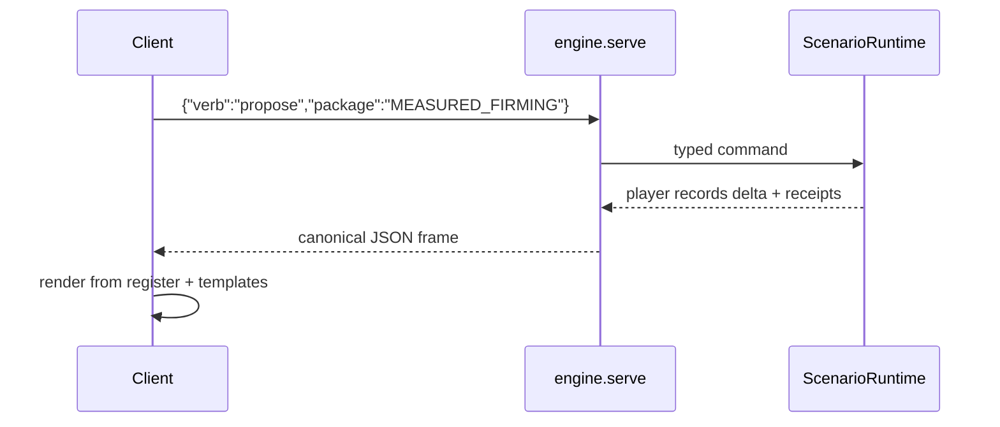

# Game Architecture After the MVP: Engine Substrate, Repository Shape, Presentation, and Actor Scale

### Summary of change request

The Ben Bernankey MVP cycle is complete and passes its ten gates. The design
documents deliberately never chose a runtime technology, a repository layout, an
art pipeline, or an actor-scaling strategy, because none of those could be
tested before an executable kernel existed. That kernel now exists: a
zero-dependency CPython 3.14 discrete-event runtime of about ten thousand lines,
with byte-level replay identity, two enforced module boundaries, a frozen
catalog slice, a text harness, and seventeen behavior-bearing actor instances.

This discussion decides the game-architecture questions the MVP left open, using
the running code as evidence rather than prose alone:

1. What the authoritative engine substrate is going forward, and what it must
   guarantee so that a later port or a second implementation can be verified.
2. How the player-facing client attaches to the engine.
3. How the runtime dispatches work as scenarios multiply.
4. How the repository is laid out, what boundaries are enforced, and where the
   representation catalog lives.
5. How presentation identity, portraits, and the animal-satire register reach
   the player without entering causal state or replay identity.
6. How the actor layer is allowed to grow without acquiring a universal actor
   class or an unbounded per-tick loop.
7. Where, if anywhere, a language-model renderer may attach.

It does not reopen any causal, representation, media, interface, or MVP-slice
decision. Every option below must preserve the invariants those documents fixed.

### Current State

- One playable early-2006 FOMC cycle runs from `just play`. The same manifest,
  bundle, choices, and seed reproduce identical transcripts. A full cycle is 74
  domain events in about 26 ms; the 86-test suite runs in under four seconds.
- The engine is standard-library Python only. There is no `pyproject.toml`,
  lock file, CI configuration, or formatter gate. `ruff format --check` flags
  25 files and is not enforced.
- Replay identity is five composed content hashes over RFC 8785-style canonical
  JSON plus SHA-256, with randomness drawn from keyed SHA-256 only. The byte
  identity currently depends on CPython semantics: `Decimal` quantize and
  `str(Decimal)`, `repr(float)` shortest round-trip, UTF-16BE key sort with
  `surrogatepass`, dataclass field order, and `datetime.fromisoformat`.
- All work dispatches through one `if/elif` chain over `work_kind` strings in a
  1,817-line composition root. Stage order inside a handler is Python statement
  order. There is no task graph, no declared inputs or outputs per handler, and
  no phase engine.
- The repository is one flat package with an acyclic import graph. Two
  boundaries are tested: harness and player code may not import canonical
  state or observation internals (AST check), and cognition, market, and
  participant modules may not contain the tokens `display_name`, `species`, or
  `portrait_path` (substring scan). The token `portrait_path` matches no real
  field; the register columns are `asset_role` and `asset_path`. Everything
  else in the layering is convention.
- The single scenario path is hardcoded in three places. All loaders accept an
  arbitrary path, so a second scenario is structurally possible but not wired.
- The representation catalog lives outside the repository in a gitignored,
  symlinked artifact directory. The engine reads it only during `just freeze`;
  the frozen `catalog_slice.json` makes every other command independent of it.
  The catalog's own validator hardcodes the default jujutsu workspace as its
  repo root, its 17-method suite is not discovered by `just test`, and two of
  those methods fail on 214 pre-existing structural issues in media,
  relationship, and transmission tables outside the MVP slice.
- Art is fourteen full-color 1254×1254 PNG portraits and a six-row
  `presentation_refs.csv`. The validator checks only that each referenced file
  exists. Nothing executable reads the register or opens an image. The harness
  renders plain monospace text by joining lists of strings; entity labels come
  from scenario JSON, not the register. Several `-vN` variants and one ensemble
  image are orphaned, and the base files remain beside every variant.
- `display_name` is copied from `entities.csv` into the frozen slice and is
  therefore inside `replay_hash`. The catalog design places `display_name` on
  `CatalogEntry`; the media design places display name in the presentation
  register that the catalog design says must not affect the manifest hash. The
  code follows the catalog entry.
- The actor layer has no shared base class and no per-tick loop. Each actor
  kind is a closed-form handler reached through the dispatch table. The
  seven-tier fidelity ladder is validated as catalog data at manifest load, not
  as a Python type. Delivery is one scheduled event per manifest edge. Beliefs
  are overwritten rather than accumulated; the audience belief store keeps an
  unbounded reception history; nothing is cached or dirty-flagged.
- The design's own runtime cost controls (reconsideration triggers, bounded
  candidate queries, attention budgets, population flow buckets) are not
  implemented because no MVP mechanism required them.
- No code calls, imports, or references a language model. The design permits
  an LLM only as a prose renderer whose output is never reparsed.

The shape today, as the research measured it:

```text
reservist/
├── engine/                  8,064 LOC, flat package, DAG with scenario.py as sink
│   ├── canon clock ids witness              leaves; byte identity lives here
│   ├── state/ accounting/ markets/ ...      canonical owners and mechanisms
│   ├── cognition/ staff/ participants/      actors as handlers, not objects
│   ├── player/records.py                    the only thing harness/ may read
│   ├── harness/                             seven list[str] text screens
│   ├── scenario.py                          1,817 lines, if/elif dispatch
│   └── cli.py                               validate | freeze | run | replay-check | play
├── scenarios/mvp_2006_cycle/                the only scenario; path hardcoded x3
├── assets/headshots/                        14 PNGs, no reader
├── tests/                                   86 tests + 10 gates, no CI
└── .humanlayer/tasks/.../catalog/           OUT OF REPO: 39 CSVs, catalog.py, 214 issues
```

### Desired End State

- The engine remains headless-first and can be run, replayed, and diffed
  without any client. Its interchange formats are specified precisely enough
  that a second implementation in any language can be checked byte-for-byte
  against committed golden transcripts.
- A player-facing client attaches to the engine only through the player-record
  projection and a versioned protocol. The client cannot reach canonical state
  by construction, not by convention.
- Work dispatch is table-driven with declared phase priorities, so adding a
  scenario or a mechanism adds a registration rather than a branch in the
  composition root, and the deterministic-parallel probe has a seam to attach
  to.
- The repository has an explicit layer map, an enforced import-direction rule
  covering the whole dependency graph, a project manifest, a formatter gate,
  and a CI run of `just test`, `just gates`, `just replay`, and the catalog
  suite.
- The representation catalog is version-controlled with the engine, its
  validator runs from any checkout, and the frozen slice remains the only
  runtime contract between content and engine.
- Presentation identity (display name, species, portrait, costume, voice) lives
  in a register that the engine never reads and that never enters
  `replay_hash`. A session records a separate presentation build hash so two
  runs can be causally identical and presentationally different.
- Portrait and scene assets have recorded provenance, cooked outputs addressed
  by content hash, and validation beyond file existence. Orphaned variants are
  either registered or removed.
- Actor kinds remain composed handlers with no universal actor class. Fidelity
  tiers are typed. Each actor kind declares when it reconsiders and how much it
  may query, so that adding actors adds registrations and edges, never a loop
  over all actors.
- Prose rendering, whether templated or model-assisted, sits in the client
  layer behind one renderer interface and cannot write back into the engine.

The target shape, with the seams this document decides marked:

```mermaid
flowchart LR
    subgraph content["content (versioned with engine)"]
        catalog["catalog/ CSVs + validator"]
        scen["scenarios/*/ canonical JSON"]
        reg["presentation register + assets"]
    end
    subgraph engine["engine (headless, stdlib Python)"]
        kernel["kernel: canon, clock, witness, registry"]
        domain["domain owners, mechanisms, actors"]
        dispatch["dispatch table + phase priorities"]
        proj["player-record projection"]
    end
    subgraph client["client (separate process)"]
        proto["protocol adapter"]
        render["renderer: templates now, LLM later"]
        ui["screens: office, FOMC room, ops room, wire"]
    end
    catalog -->|just freeze| scen
    scen --> kernel
    kernel --> domain --> dispatch --> proj
    proj -->|versioned JSON over stdio or socket| proto
    reg -->|presentation build hash| proto
    proto --> render --> ui
    ui -->|typed commands only| proto --> proj
```



### What we're not doing

- Reopening the causal invariants, committed interfaces, representation kinds,
  fidelity tiers, media contracts, interface verbs, or MVP cut. Every option
  here must keep them.
- Choosing final art direction, typography, animation tooling, room
  illustrations, or a design system. This pass decides how presentation
  attaches and is validated, not what it looks like.
- Selecting a specific web framework, TUI library, or game engine by name
  where the decision below is about the process boundary rather than the
  toolkit.
- Implementing the task graph, deterministic-parallel probe, or population
  flow buckets. This pass decides the seam they attach to.
- Fixing the 214 pre-existing catalog validation issues as part of this design.
  The catalog-location decision determines who owns that work and when.
- Adding any network dependency, model call, or third-party package to
  `engine/`. Gate 10 stands.
- Rewriting the engine in another language in this phase.

### Proposed End State Architecture

#### Engine substrate: keep the Python kernel, make its byte identity language-neutral

The kernel stays CPython and standard library. What changes is that the hashing
and transcript contract becomes a specification with committed conformance
vectors, so that "identical replay" is a property of the bytes and not of the
interpreter that produced them.

```text
replay identity today
  canonical_text(value)             CPython repr(float), str(Decimal), UTF-16BE sort
  sha256(...)                       five composed hashes
  transcript_bytes(ledger)          one canonical JSON line per DomainEvent

replay identity after this pass
  spec/canonical-json.md            RFC 8785 + number rendering + Decimal rule, written down
  tests/vectors/canon/*.json        input -> expected bytes, incl. the RFC examples already tested
  tests/vectors/transcripts/*.jsonl golden transcripts for each committed scenario and package
  engine.canon                      unchanged behavior, now proven against the vectors
```

The Decimal rule is the one place the current bytes are Python-specific in a
way another language would not reproduce by accident. Ledger amounts and fill
prices are quantized to four places and hashed as `str(Decimal)`. The spec
should state that money and price quantities are serialized as decimal strings
with a fixed scale, never as JSON floats, and the vectors should pin that.

#### Client boundary: a headless engine process and a thin client over the projection

The harness already consumes only `PlayerRecordStore` and `AnalyticalTask`. The
proposed end state moves that consumer out of process and gives it a versioned
protocol, which turns the existing AST-checked import rule into a process
boundary the client cannot cross.

```text
engine process (python3 -m engine.serve <scenario>)
  accepts   typed commands: inspect | ask | assign | convene | propose |
            communicate | commit | advance
  emits     player records, scene context, receipts, review artifacts
  never     emits registry snapshots, adapter fields, other actors' beliefs

client process
  renders   Office, FOMC room, Operations room, wire, review
  reads     presentation register + assets by presentation build hash
  sends     only the eight verbs with typed targets
```

The `play` REPL becomes the first client of that protocol rather than a special
path inside `cli.py`. The protocol messages are the same canonical JSON as
everything else, so a recorded client session is itself replayable.

#### Dispatch: a registry keyed by work kind with declared phase priorities

```diff
 ScenarioRuntime._handle(scheduled)
-  if work_kind == "macro.publish_release": ...
-  elif work_kind == "macro.publish_intermeeting_release": ...
-  elif work_kind == "staff.complete_analytical_task": ...
-  ... twelve more branches ...
-  else: ledger.append("scheduled_event_handled")
+  handler = HANDLERS[work_kind]          # fail closed on unknown kind
+  handler(self, scheduled)

+HANDLERS: dict[str, Handler]             # registered per module, not in scenario.py
+  work_kind -> (phase_priority, handler, declared_owners, declared_outputs)
```

Declared owners and outputs are recorded now and unused now. They are the
inputs the task-graph and deterministic-parallel probes need later, and
recording them at registration time is cheap while the handler set is fifteen.

#### Repository shape: one package, explicit layers, content inside the tree

```diff
 reservist/
+├── pyproject.toml                # project metadata, ruff config, no runtime deps
+├── .github/workflows/ci.yml     # just test gates replay catalog-test
 ├── justfile
 ├── engine/
-│   ├── canon.py clock.py ids.py witness.py ...   (flat, 41 files)
+│   ├── kernel/                   # canon, ids, clock, witness, state/registry
+│   ├── domain/                   # accounting, markets, settlement, agreements,
+│   │                             #   legal, authority, bodies, staff, cognition,
+│   │                             #   participants, population, media, delivery
+│   ├── scenario/                 # manifest, initialization, catalog_slice,
+│   │                             #   dispatch registry, runtime
+│   ├── projection/               # player records, observation scoping, postmortem
+│   ├── serve.py                  # protocol server over the projection
 │   └── cli.py
+├── client/                       # text client first; reads projection only
 ├── scenarios/
 │   └── mvp_2006_cycle/
+├── content/
+│   ├── catalog/                  # moved from .humanlayer/tasks/.../catalog
+│   └── presentation/             # register + cooked asset manifest
 ├── assets/
+│   ├── src/                      # editable sources with provenance
+│   └── cooked/                   # content-addressed outputs
 └── tests/
+    ├── vectors/                  # canonical JSON and transcript goldens
+    └── test_layering.py          # whole-graph import direction, not two spot checks
```

The layering rule the test enforces:

```text
kernel      may import nothing above kernel
domain      may import kernel
scenario    may import kernel, domain
projection  may import kernel, domain (read-only by contract), scenario
client      may import projection only
tests       may import anything
```

#### Presentation register: out of the hash, into the client

```diff
 frozen catalog_slice.json entry
   catalog_id, identity_clade, instance_of, cognition_class,
   default_fidelity, permitted_fidelity_tiers, owned_state_contracts,
   authority_sources, fallback_contracts, period_variants,
-  display_name
   source_definition_version

 content/presentation/register.csv   (not read by engine/)
+  catalog_id, display_name, species, asset_role, asset_path, asset_hash, provenance

 session metadata
   replay_hash                        causal identity, unchanged
+  presentation_build_hash            sha256 over register + cooked asset manifest
```

The harness gets its labels from the register through the client, keyed by
`catalog_id`. Cast and staff files in `scenarios/*/` keep their labels only if
they are causal (an office title is; a nickname is not), and the layering test
extends the presentation boundary from a token scan to an import rule.

#### Actor layer: composition with typed tiers and declared reconsideration

```text
FidelityTier (StrEnum)            the seven Bible tiers, validated at load as today

Reconsiders (Protocol)            implemented per actor kind, not inherited
  triggers: tuple[work_kind, ...]  which scheduled events wake this actor
  budget:   CandidateBudget        max targets / queries per wake, traced

register_actor(kind, tier, reconsiders, handler)
  -> adds handler rows to HANDLERS
  -> adds nothing to any per-tick loop, because there is none
```

Growth rules recorded now, enforced when a second scenario needs them:
per-recipient reception history is pruned to a declared window with a witness;
belief source ledgers may accumulate up to a declared depth; every new actor
kind declares its triggers and budget or fails manifest validation.

#### Renderer seam

```text
client/render/
  Renderer (Protocol)      render(record) -> str
  TemplateRenderer         the only implementation in this phase
  # a model-backed renderer may be added later behind the same protocol;
  # its output is display text and is never sent back through the protocol
```

### Design Questions

#### 1. Engine substrate and the portability of replay identity

The design never chose a runtime, and the Clowder research declined to
recommend Rust. The MVP proved the Python kernel is fast enough by five orders
of magnitude for the current scale and that its determinism holds. The open
question is what the kernel's status is and how binding its bytes are.

- Option A: Keep the Python kernel as the authoritative engine indefinitely and
  accept CPython-bound byte identity. Cheapest; hashes remain reproducible on
  any CPython 3.11+ but not necessarily elsewhere.
- Option B: Treat the Python kernel as a reference implementation and begin a
  Rust rewrite now, following the Clowder substrate. Gains performance headroom
  the design has not asked for; costs the whole ten-thousand-line kernel and
  reintroduces the Clowder finding that schedule siblings perturb RNG
  consumption unless keyed draws are preserved.
- Option C: Keep the Python kernel as the authoritative engine, and make its
  byte identity language-neutral: write the canonical-JSON and decimal rules
  down, commit conformance vectors and golden transcripts, and add a test that
  regenerates every committed transcript. A later port is then a verifiable
  engineering task rather than a design change.

```text
Option C acceptance
  python3 -m engine.cli replay-check scenarios/*       bytes == tests/vectors/transcripts/*
  canon vectors                                       every RFC 8785 example + Decimal cases
  no float ever enters a ledger or price hash          asserted by test, stated in spec
```

Recommendation: Option C. The design commits to headless execution, canonical
JSON, and keyed draws; none of those requires a particular language, and the
measured cost of the current kernel is 26 ms per cycle. The only thing that
would force a rewrite is a scale the design explicitly refuses to budget for.
Pinning the bytes now costs a spec file and a vectors directory.

#### 2. How the client attaches to the engine

Today the harness is in-process and the REPL is a branch of `cli.py`. The
interface design wants first-person vignettes over a small set of scene
families with four information surfaces, and the MVP design settled for a
text-and-graph harness with no third-party dependency.

- Option A: In-process client. A Python UI toolkit (TUI or desktop) imports the
  projection directly. Simplest deployment; the epistemic boundary stays an AST
  import check, and any UI dependency lands inside the same interpreter as the
  engine.
- Option B: Separate client process over a versioned canonical-JSON protocol
  (stdio or local socket). The engine serves the projection; the client may be
  written in anything and may take dependencies freely. The boundary becomes a
  process boundary, and a client session transcript is replayable.
- Option C: Embed the engine in a game engine with a Python binding. The
  research found the available bindings marked unstable or platform-limited.



Recommendation: Option B, with the existing text REPL rewritten as the first
client so the protocol is exercised by the acceptance gates from day one. The
"harness graph output" question from the outline resolves with it: plots belong
to the client, which may take a dependency; the engine stays stdlib-only.

#### 3. Dispatch table now, task graph later

The composition root dispatches fifteen work kinds through an `if/elif` chain
and falls through to a generic ledger entry on an unknown kind. The design
commits to a dependency-ordered task graph with declared inputs, outputs, and
commit keys, adopted "as a constraint, not an immediate performance requirement".

- Option A: Leave the chain until a second scenario forces a change. No work
  now; every new mechanism edits the composition root, and the unknown-kind
  fallthrough stays silent.
- Option B: Replace the chain with a registry keyed by `work_kind`, registered
  per module, failing closed on unknown kinds, and carrying declared phase
  priority, owners, and outputs as data that nothing consumes yet.
- Option C: Implement the full `SimulationTask` contract now, including
  snapshots, private result buffers, and commit barriers.

Recommendation: Option B. It shrinks the composition root, makes the unknown
kind a hard error, and records exactly the declarations the task-order and
deterministic-parallel probes need, without building machinery no mechanism
requires yet. Option C is the probe's job, not this pass.

#### 4. Repository layout and enforced layering

The import graph is a clean DAG, but only two edges are tested and one of
those tests matches a field that does not exist. There is no project manifest,
formatter gate, or CI.

- Option A: Keep the flat package; add `pyproject.toml`, a formatter gate, and
  CI. Fix the token scan. Leave layering as convention.
- Option B: Reorganize into `kernel/`, `domain/`, `scenario/`, `projection/`
  subpackages and add a whole-graph import-direction test. Every module moves
  once; imports change everywhere; the layer map becomes checkable.
- Option C: Split into separate distributable packages. Heavier than a
  single-developer, single-repo project needs, and it makes the scenario and
  test tree cross package boundaries.

Recommendation: Option B, done as one mechanical move with no behavior change,
verified by the existing replay test producing identical transcripts before
and after. The scenario path should become a required argument or an
environment default in one place rather than three constants. The formatter
gate should be applied in the same move, since every file is touched anyway.

#### 5. Where the representation catalog lives

The catalog is the identity source for every selected entry, yet it is outside
the repository, gitignored, symlinked, validated by a script that hardcodes a
different workspace as its root, and failing two of its own tests on issues
outside the MVP slice.

- Option A: Move `catalog/` into the repository under `content/catalog/`,
  point the validator at its own location, and discover its suite from
  `just test`. The frozen slice remains the runtime contract. The 214 issues
  become tracked debt in the tree.
- Option B: Keep the catalog in the artifact store as design content; the
  frozen slice is the only thing the engine needs. Cheapest now; `freeze` and
  one test depend on an unversioned symlink, and the validator cannot run from
  a second workspace.
- Option C: Move the catalog to its own repository or submodule. Adds a
  version-pinning step to `freeze` that a single-developer project does not
  need yet.

Recommendation: Option A. Anything that participates in `replay_hash` should be
version-controlled beside the code that hashes it. The pre-existing failures
should be quarantined by scope (the MVP slice passes today) so `just test`
stays green while the media and transmission tables are repaired separately.

#### 6. `display_name` and the presentation register

The catalog design lists `display_name` on `CatalogEntry`; the media design
puts display name in the presentation register that must not affect the
manifest hash. The code follows the catalog entry, so renaming an entity
changes `replay_hash`. The research recorded this as the one open design
question the code cannot settle.

- Option A: Keep `display_name` on the catalog entry and inside the hash.
  Names are stable; renames are rare; nothing moves.
- Option B: Move `display_name` to the presentation register beside species
  and portrait. Drop it from the frozen slice. The engine and scenario files
  never carry a human-facing name; the client resolves names by `catalog_id`.
  A session records `presentation_build_hash` separately.
- Option C: Keep a neutral, stable label on the catalog entry (for logs and
  developer traces) and put the satirical display name in the register.

Recommendation: Option B, with one carve-out: labels that are causal, such as
an office title or a legal instrument's short name, stay in scenario data as
what they are, not as display names. Species and portrait are already
register-only; display name should join them so that the "presentation may
render causal state; causal systems may not read presentation" rule holds by
construction. The catalog design's `CatalogEntry.display_name` field becomes
`presentation_ref` only.

#### 7. Art pipeline scope

Fourteen portraits exist with no manifest, license, source file, or generation
record. They are full-color renders, not the indexed-palette pixel art the
premise names. The design defers "an art production pipeline" but the register
exists and validation is file-existence only.

- Option A: No pipeline in this phase. Keep the PNGs where they are, register
  the six referenced files, and leave validation as is.
- Option B: A minimal content-addressed pipeline: editable sources under
  `assets/src/` with a provenance record per file, cooked outputs under
  `assets/cooked/` named by SHA-256, a manifest the register references by
  hash, and validation of dimensions and role set. Orphaned variants are
  registered with provenance or deleted. The presentation build hash is the
  hash of the register plus the manifest.
- Option C: A full sprite pipeline (Aseprite sources, atlas builders, a
  generation rig with promotion gates) modeled on Clowder. The research found
  most of Clowder's pipeline non-transferable and partially broken.

Recommendation: Option B. It is the smallest pipeline that lets two runs be
"causally identical, presentationally different" in a checkable way, and it
records where the existing portraits came from before that is forgotten. The
aesthetic mismatch (rendered portraits versus the stated pixel-art target) is
a content decision this pass only flags.

#### 8. Actor-layer growth without a universal actor

There is no `Agent` class, no per-tick loop, and no cost control. The design
forbids a universal actor and specifies reconsideration triggers, bounded
candidate queries, and attention budgets. Today, each actor kind is reached
through the dispatch chain, tiers are strings, and two stores grow without
bound.

- Option A: Leave the handler-per-kind shape as is. Add nothing until a
  scenario needs it. Tier remains a string; growth stays unbounded; a new
  actor kind is a new branch and a new bespoke store.
- Option B: Introduce a shared `Agent` base class with `perceive`, `decide`,
  `act`. Uniform, but it is the universal actor the Bible rejects and it
  invites a loop over all agents.
- Option C: Keep composition. Add a `FidelityTier` enum, a `Reconsiders`
  protocol (declared wake triggers and a traced candidate budget) that each
  actor kind implements, and registration through the same dispatch registry
  as other work. Declare pruning windows for reception history and a depth for
  belief source ledgers, each pruned with a witness so replay is unaffected.

```text
today                                   after Option C
LimitedParticipant                       LimitedParticipant: Reconsiders
  wakes on: assessment delivery            triggers = ("staff.complete_analytical_task",)
  budget:   implicit, one assessment       budget   = CandidateBudget(targets=1)
DealerCohort                             DealerCohort: Reconsiders
  wakes on: fomc.meeting, reception        triggers = ("fomc.meeting", "audience.receive_artifact")
  budget:   implicit                        budget   = CandidateBudget(targets=1, queries=2)
```

Recommendation: Option C. It writes down what the code already does implicitly
and gives the manifest validator something to check for every new actor kind,
without adding a class hierarchy or a tick.

#### 9. Where a language-model renderer may attach

The design permits an LLM to render prose from structured claims and forbids it
from choosing actions, updating beliefs, clearing markets, or having its output
reparsed. No code references a model. Gate 10 forbids network imports in
`engine/`.

- Option A: No renderer seam in this phase. Templates stay inline in the
  harness screens as `list[str]` joins.
- Option B: Define one `Renderer` protocol in the client with a template
  implementation as the only concrete renderer, and the rule that rendered text
  is display-only and never crosses the protocol back to the engine. A model
  renderer may implement the protocol later without touching `engine/`.
- Option C: Add a model renderer now behind a feature flag.

Recommendation: Option B. The seam costs one protocol and moves existing
string-building out of the harness; it keeps gate 10 trivially true because
the renderer lives in the client process; and it makes the design's "never
reparsed" rule a structural fact rather than a comment.

### Resolved Design Questions

None yet. All questions above are open for review.

### Patterns to follow

These patterns come from the running engine and the settled design documents.

#### Byte identity lives in the canonicalizer, not the data model

Every hash strips its own hash field and canonicalizes the rest. The pattern in
`engine/scenario.py:69-86` and `engine/catalog_slice.py:27-32` is what the
conformance vectors must pin:

```python
def scenario_hash(catalog_hash, manifest_hash, initialization_hash, tape_hash) -> str:
    return sha256(
        {
            "catalog_definition_hash": catalog_hash,
            "initialization_hash": initialization_hash,
            "manifest_content_hash": manifest_hash,
            "release_tape_hash": tape_hash,
        }
    )
```

The proposed vectors test the same function against committed bytes:

```text
tests/vectors/canon/numbers.json        [333333333.3333333, 1e+30, 4.5, 0.002, 1e-27, 0]
tests/vectors/canon/decimal.json        {"amount": "1250000.0000"}  never a float
tests/vectors/transcripts/mvp_2006_cycle.MEASURED_FIRMING.jsonl
```

#### Enforce a boundary by AST, then by process

The current boundary test in `tests/test_access_boundary.py` walks imports:

```python
FORBIDDEN_IMPORTS = ("engine.state", "engine.observation")

for directory in (PROJECT_ROOT / "engine/player", PROJECT_ROOT / "engine/harness"):
    for path in sorted(directory.glob("*.py")):
        tree = ast.parse(path.read_text(encoding="utf-8"), filename=str(path))
        ...
        self.assertFalse(any(name.startswith(FORBIDDEN_IMPORTS) for name in imported))
```

The whole-graph version generalizes the same walk to a layer table:

```text
LAYERS = {"engine.kernel": 0, "engine.domain": 1, "engine.scenario": 2,
          "engine.projection": 3, "client": 4}
rule: a module may import only modules whose layer <= its own,
      and client may import only engine.projection
```

The presentation boundary in `tests/test_presentation_boundary.py` currently
scans for tokens including one that does not exist:

```python
forbidden = ("display_name", "species", "portrait_path")
```

After Option 6 it becomes an import rule (nothing under `engine/` may import
`content.presentation`) plus a check that the frozen slice carries no
`display_name` key.

#### Ordered events with a derived sort key

`engine/clock.py:16-33` is the deterministic ordering primitive every registry
entry must respect:

```python
@dataclass(order=True, frozen=True)
class ScheduledEvent:
    sort_key: tuple[datetime, int, int, str] = field(init=False, repr=False)
    due_time: str
    phase_priority: int
    stable_sequence: int
    stable_id: str
    responsible_owner: str = field(compare=False)
    work_kind: str = field(compare=False)
```

The dispatch registry declares `phase_priority` per `work_kind` so a handler's
place in the order is data, not a number chosen at each `schedule()` call site.

#### Replace the chain with a registry that fails closed

The current shape in `engine/scenario.py:1615-1691`:

```python
def _handle(self, scheduled: ScheduledEvent) -> None:
    if scheduled.work_kind == "macro.publish_release":
        ...
        return
    if scheduled.work_kind == "macro.publish_intermeeting_release":
        self._handle_intermeeting_release(scheduled)
        return
```

The proposed shape:

```python
@register("staff.complete_analytical_task", phase_priority=20,
          owners=("staff.*",), outputs=("assessment_delivered",))
def complete_analytical_task(runtime, scheduled): ...

def _handle(self, scheduled):
    HANDLERS[scheduled.work_kind].run(self, scheduled)   # KeyError is the failure
```

#### The projection is the only client-visible surface

`engine/harness/fomc_room.py:17-24` already renders from delivered records and
labels, never from the registry:

```python
def render(self) -> str:
    lines = ["FOMC ROOM", "=========", "Participant positions:"]
    if self._decision is None:
        for participant in self._participants:
            name = self._labels.get(participant.participant_id, participant.participant_id)
            lines.append(f"- {name}: awaiting proposal")
```

Under Option 2 the same screen lives in `client/` and receives `participants`,
`decision`, and `labels` as protocol frames; the label map comes from the
presentation register rather than `cast/fomc_2006.json`.

#### Frozen slice as the content-to-engine contract

`engine/catalog_slice.py:35-111` projects only the fields the runtime needs and
hashes the result. The one line to remove under Option 6:

```python
"display_name": entity["display_name"],
```

Everything else about the freeze stays: read CSVs, project selected entries,
canonicalize, hash, verify on load.

#### Bounded growth with a witness

`engine/delivery.py:105-130` keeps an unbounded history:

```python
class AudienceBeliefStore:
    def __init__(self) -> None:
        self._policy_path: dict[str, float] = {}
        self._history: list[AudienceReception] = []

    def record(self, reception: AudienceReception) -> None:
        self._history.append(reception)
```

Under Option 8 a pruning window is declared on the store and every prune emits
a `DomainEvent`, so the transcript records what was dropped and replay stays
byte-identical:

```text
AudienceBeliefStore(window=DeclaredWindow(receptions=64))
  record(reception)
    append
    if len(history) > window: drop oldest -> ledger.append("reception_history_pruned")
```

#### Testing approach

```text
conformance
  canon vectors, decimal rule, golden transcripts per scenario and package

layering
  whole-graph import direction; frozen slice has no presentation keys;
  engine/ imports nothing from content.presentation or client

protocol
  a recorded client session replays to the same player-record transcript;
  a frame containing a hidden adapter field fails the test (extends the
  existing repr() check in test_access_boundary.py)

catalog
  catalog suite discovered by just test; MVP-slice scope passes;
  known-issue scope quarantined with an explicit allowlist that shrinks

presentation
  register rows resolve to cooked assets by hash; dimensions and role set
  validated; presentation_build_hash changes when a portrait changes and
  replay_hash does not

actors
  every registered actor kind declares triggers and a budget or manifest
  validation fails; multi-seed band test unchanged
```
