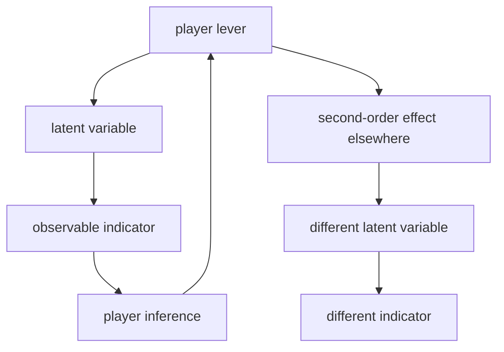
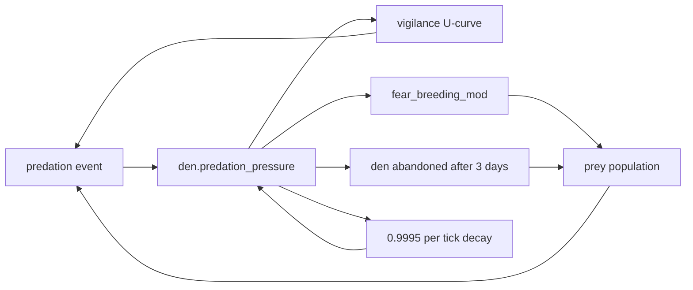
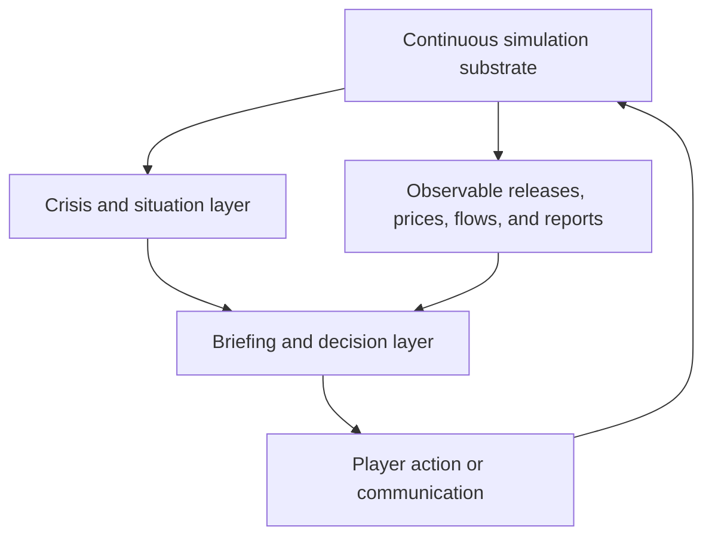
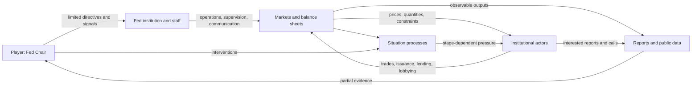
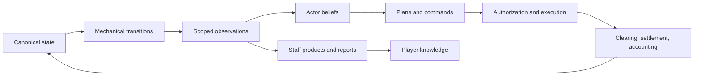
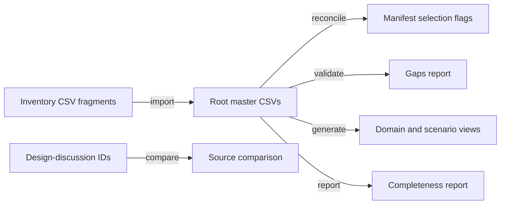
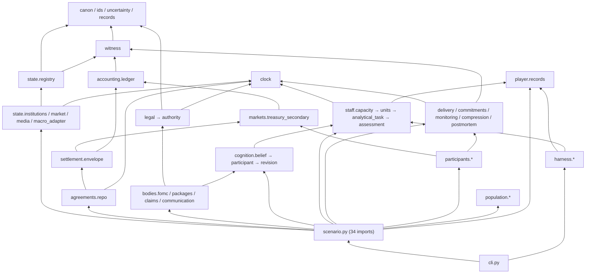
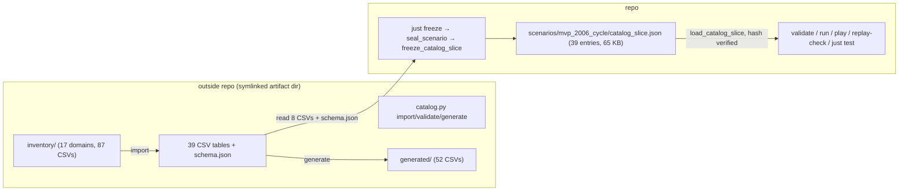
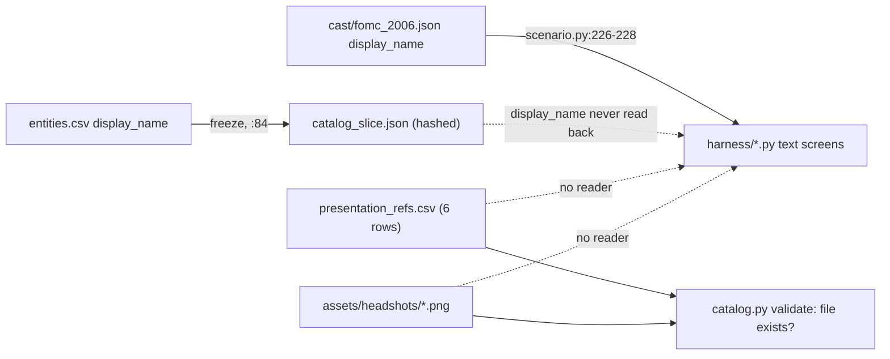

# 01-foundations-and-research

- conceptual scope: Project foundations, research evidence, and working design spines
- contained artifacts: 8
- source omnibus: `humanlayer-omni.md`
- preservation: artifact headings, YAML metadata, and payload bytes below are preserved from the source omnibus; outer Markdown fence delimiters are reselected collision-safely for compact model ingestion.

## Artifact: `federal-reserve-chair-crisis-management-simulator/01-research-questions-simulator-foundations.md`

```yaml
source_task: federal-reserve-chair-crisis-management-simulator
relative_path: 01-research-questions-simulator-foundations.md
size_bytes: 1390
mode_octal: "0644"
modified_at_utc: 2026-09-02T22:04:50.013058Z
sha256: 494730e19116fb5e94e6f2c9583380448e9a154b288816728a32bd986ea5ce0f
media_type: text/markdown
content_encoding: UTF-8
newline_style: LF
original_ends_with_newline: true
```

~~~~markdown
---
type: research-questions
---

# Research Questions

1. What files and directories currently make up the workspace, and what application, runtime, build, asset, and test structure do they define?
2. How does the existing concept material distinguish observable economic indicators from latent system variables, and what causal relationships, feedback loops, delays, and second-order effects does it describe between them?
3. How does the existing material define the simulation's passage of time, morning briefing sequence, information arrival, weekly action limit, and end-of-term boundary?
4. What policy, operational, regulatory, diplomatic, and communications actions are described, and how does the concept material characterize their interactions with markets, government institutions, and other actors?
5. How are credibility, independence, market functioning, mandate performance, and institutional legitimacy defined, observed, and related to the proposed end-of-term assessment?
6. What design system, component library, visual assets, and frontend conventions exist today, including exact colors, typography, spacing, borders, shadows, chart treatments, responsive behavior, and theming?

## Key Context Pointers

- Filepaths: `.humanlayer/tasks/federal-reserve-chair-crisis-management-simulator`, `.humanlayer/tasks/federal-reserve-chair-crisis-management-simulator/task.md`
~~~~

## Artifact: `federal-reserve-chair-crisis-management-simulator/02-research-clowder-simulation-substrate.md`

```yaml
source_task: federal-reserve-chair-crisis-management-simulator
relative_path: 02-research-clowder-simulation-substrate.md
size_bytes: 81595
mode_octal: "0644"
modified_at_utc: 2026-09-02T22:56:12.161884Z
sha256: cad754a4bd91964914cce7a6b4e67e117a73813f9523a7d7d48c4b7a38cd45f6
media_type: text/markdown
content_encoding: UTF-8
newline_style: LF
original_ends_with_newline: true
```

~~~~markdown
---
date: 2026-09-02T18:18:06-04:00
git_commit: 8f5f0302457fec0170342a21f8e8bbc6d52f9912
branch: HEAD (detached; jj change zuxyzklp / commit 5359c634)
repository: clowder (github.com/wn-mitch/clowder) — substrate reference; target workspace `reservist` is empty
topic: "Institutional-agent crisis simulator: the concept model, and what the clowder substrate provides for it"
type: research
tags: [research, concept-model, institutional-agents, latent-variables, feedback-loops, clowder, utility-ai, beliefs, determinism, assessment]
status: complete
---

# Research: Institutional-agent simulator foundations

**Date**: 2026-09-02T18:18:06-04:00
**Substrate repository**: `clowder` — `github.com/wn-mitch/clowder`, commit `8f5f0302` (working tree dirty: 14 files), jj change `zuxyzklptpuq`
**Target workspace**: `/Users/will.mitchell/reservist` — empty

## Research Question

From `01-research-questions-simulator-foundations.md`:

1. What files and directories currently make up the workspace, and what application, runtime, build, asset, and test structure do they define?
2. How does the existing concept material distinguish observable economic indicators from latent system variables, and what causal relationships, feedback loops, delays, and second-order effects does it describe between them?
3. How does the existing material define the simulation's passage of time, morning briefing sequence, information arrival, weekly action limit, and end-of-term boundary?
4. What policy, operational, regulatory, diplomatic, and communications actions are described, and how does the concept material characterize their interactions with markets, government institutions, and other actors?
5. How are credibility, independence, market functioning, mandate performance, and institutional legitimacy defined, observed, and related to the proposed end-of-term assessment?
6. What design system, component library, visual assets, and frontend conventions exist today, including exact colors, typography, spacing, borders, shadows, chart treatments, responsive behavior, and theming?

**Two sources, and what each answers.** The concept material is `task.md` in this task directory; it answers questions 2 through 6 directly and is cited throughout as `task.md:<line>`. `~/clowder` is the designated reference for baseline questions about simulation agents — an existing Bevy ECS colony simulation whose agent machinery is prior art for the new game. The new game replaces cat agents with **institutional agents standing in for people**: the Federal Reserve chairs, institutional investors, the President, the Treasury, retail, the populace, banks, and sovereign funds. Because it is a math-and-money game, clowder's art pipeline is out of scope and UI effort takes its place.

This document therefore reads clowder as a set of simulation primitives, stating for each what it is parameterized over and what it hardcodes, and compares that against what the concept material actually calls for. It is a map of the starting position, not a design.

## Research Methodology (verbatim)

This document will remain objective and factual. It does not contain any recommendations or implementation suggestions.
Open questions will not ask Why things haven't been built or what should be built in the future.

There is no "implementation" section - that is intentional.

## Summary

The concept material's central mechanic is partial observability. Sixteen indicators are named as visible to the player — fed funds target, balance-sheet size, SRF usage, reserve levels, SOFR, term premium, bid-to-cover, dealer inventories, basis spreads, hedge-fund gross leverage, bank unrealized losses, mortgage rates, inflation expectations, unemployment, the dollar index, issuance composition — while four variables are named as the ones that matter and are explicitly *not* directly observable: market confidence, dealer balance-sheet elasticity, foreign reserve-manager appetite, and fiscal dominance expectations (`task.md:6-23`). The stated design principle is "no clean causal arrows. Almost every lever needs at least one second-order effect" (`task.md:33`), and the question the game is meant to provoke is "Did I solve the problem, or did I just change where the problem lives?" (`task.md:36`). Time is a weekly cadence opening on a timestamped morning briefing and constrained to roughly two consequential actions per week, because "scarcity of attention matters" (`task.md:39-48`). Assessment is five deliberately non-aligned institutional stats — Credibility, Independence, Market Functioning, Mandate, Institutional Legitimacy — with no conventional win condition, scored on the system the player leaves behind at end of term (`task.md:68-89`).

Clowder already enforces the observed/latent split structurally, and this is the closest and strongest correspondence between the two. Nearly every spatial, threat, and resource question resolves through a per-agent belief facet carrying `value`, a `prior` it decays toward, a `strength` confidence, an `EvidenceKind` provenance tag, and a last-updated tick (`src/components/beliefs.rs:66-101`) — with two documented god's-eye exceptions where a system reads other agents' components directly (§3). Shared knowledge is a quorum aggregate that exists only while enough living carriers independently hold it and emits a "forgotten" event when the last one lapses (`src/systems/colony_knowledge.rs:153-203`). The observability asymmetry is also already built: the live UI shows a curated fraction of agent state while a separate telemetry row carries the superset, with personality, corruption, and the entire belief substrate never surfacing in the UI at all. The facet *struct* is domain-neutral; only its six facet names are cat-social.

The decision machinery is likewise parameterized over almost everything. A DSE — the unit of action scoring — is declarative: it names its considerations, the response curve on each, how they compose, its eligibility filter, and its priority tier, and the evaluator is generic over all of it (`src/ai/dse.rs:470-487`). The curve library, the three composition modes with their geometric-mean compensation term, the saturating cap that stops agreeing modifiers from stacking additively, the Boltzmann selection at a state-coupled temperature, and the three commitment strategies that keep an agent from thrashing between actions are all pure mechanism with no cat in them. What is hardcoded is the *vocabulary*: the scalar names the considerations fetch, and the `Action`/`DispositionKind` enums. Above that sits a multiplicative priority cascade where unmet lower tiers suppress higher-tier scores rather than hard-gating them — a shape that is reusable even though its ten need names are not.

Four things the concept material requires have no counterpart in clowder, and they are the substantive gaps. There is **no loop or delay abstraction** — clowder's eight closed feedback loops emerge from systems reading and writing shared resources with per-site rate constants, and every lag is a bespoke timer or half-life rather than an instance of a shared primitive. There is **no turn boundary or action budget** — agents re-elect an action every tick with nothing resembling two-actions-per-week attention scarcity. There is **no utterance layer**: clowder generates prose as output, never as an input other agents parse, and a held intention is explicitly not legible across agents, so the brief's language-fragment construction and markets parsing statements "with an almost malicious literalism" (`task.md:62-67`) has no analogue — though a real signalling primitive does exist, where an agent performs a play-bow whose entire effect is to raise a witness's `perceived_intent_clarity` (§6). And **no actor-level reputation variable exists** — the nearest things are a per-agent `respect` need and colony-wide alignment scores, while clowder's five welfare axes get *averaged into one number* (`src/resources/colony_score.rs:140-148`), which is the opposite of the brief's requirement that the five stats trade off against each other and be reported separately. Conversely, the run-assessment apparatus is the most reusable subsystem in the repo: no victory condition, an explicit-elapsed footer, a throughput-invariant checkpoint, and an eight-channel pass/concern/fail/unprovable classifier whose only domain coupling is the names of its inputs. The two largest non-transferable blocks are the spatial substrate — tile grid, terrain costs, scent and influence maps, route cost, escape viability, eighteen planner zones — and the entire presentation layer: 27 rendering files, 5,272 sprite PNGs, and a pinned ComfyUI creature-rig pipeline. For a chart-dense terminal interface, clowder's UI contributes essentially nothing: eight shared color constants, no font ever loaded, hand-built two-node flex bars, no shadows, and no responsive handling.

## Detailed Findings

### 1. The target workspace is empty; the starting position is a concept brief plus a substrate repository

`/Users/will.mitchell/reservist` contains **zero regular files** and no VCS metadata. Its only contents are this task directory, holding the research-questions document and `task.md`. There is no application, runtime, build configuration, asset pipeline, test suite, design system, or component library — nothing to extend, and no naming or structural conventions inherited from the target workspace. The two additional working directories are riptide plugin installs containing skill definitions only; a search across both for `*.ts`, `*.tsx`, `*.css`, `package.json`, `*.svg`, and `*.png` returns nothing.

`~/clowder` is a separate repository at `github.com/wn-mitch/clowder`, package `clowder` v0.4.0, Rust edition 2021, built on `bevy 0.18` with `bevy_ecs_tilemap`, `linkme`, `rand_chacha`, `noise`, `ron`, `serde`, and `toml` (`Cargo.toml:8-33`). Its scale, by file counts under `src/`:

```text
src/                       513 .rs total
├── ai/           139   # scoring evaluator, DSE catalog, HTN methods, GOAP planners
├── steps/         70   # leaf action resolvers
├── systems/       67   # tick-driven ECS systems
├── scenarios/     63   # ~55 triage worlds + harness
├── components/    59   # ECS component definitions
├── resources/     57   # global state incl. sim_constants (~10,144 lines)
├── rendering/     27   # sprites, tilemap, day/night, VFX, ui/ (12 panels)
├── world_gen/      8   # Perlin terrain, colony siting, prey ecosystem
├── species/        6   ├── messages/  6   ├── plugins/  4   ├── events/  2
└── {main,lib,persistence,ui_data}.rs
```

Supporting material is unusually heavy relative to code: a ~910-line `justfile`, ~72 scripts including a family of `check_*.sh` convention gates each paired with an `.allowlist`, 581 files under `docs/open-work/`, 124 numbered balance-pass documents, 40 per-system design docs, and a 58-file mdbook wiki. Game data lives in RON (30 narrative template files, zodiac), JSON (four cat presets), and TOML (atlas bindings, art provenance).

#### Testing patterns

There are no tests in the target workspace. Clowder inverts the usual file distribution: `#[cfg(test)]` appears **329 times across 317 files** under `src/`, so nearly every module carries colocated unit tests, while `tests/` holds only ten top-level Rust integration files plus four Python subdirectories (`verdict/`, `logq/`, `similar/`, `llm/`). The CI target is three gates — `ci: check test check-determinism` (`justfile:900`) — which notably excludes the Python asset tooling and every atlas recipe.

### 2. The concept material makes partial observability the core mechanic, with sixteen indicators over four hidden variables

The brief lists what the player sees (`task.md:6-22`): fed funds target, balance-sheet size, Standing Repo Facility usage, reserve levels, SOFR, Treasury term premium, bid-to-cover ratios, dealer inventories, basis spreads, hedge-fund gross leverage, bank unrealized losses, mortgage rates, inflation expectations, unemployment, dollar index, and Treasury issuance composition.

It then states the inversion explicitly: "the important variables are latent" (`task.md:23`). Four are named — market confidence, dealer balance-sheet elasticity, foreign reserve-manager appetite, fiscal dominance expectations — with the inference channels given as spreads, auction tails, volatility, survey data, and market behavior. The design constraint is stated as a principle rather than a feature: "no clean causal arrows. Almost every lever needs at least one second-order effect" (`task.md:33`).



Three worked chains are given (`task.md:27-34`). Raising rates lowers inflation expectations while simultaneously raising bank losses into credit contraction and changing repo leverage economics into reduced Treasury liquidity — after which Treasury calls about an auction that tailed by 11 bp. A rate cut stabilizes Treasury funding while weakening the dollar and reaccelerating inflation. Changing SLR treatment expands dealer intermediation while encouraging banks to rebuild the balance-sheet structures post-2008 regulation was meant to suppress. Expanding repo access prevents a fire sale while increasing private-sector confidence that funding liquidity will remain available under stress — a second-order effect on expectations rather than on a quantity. The intended player experience is the question "Did I solve the problem, or did I just change where the problem lives?" (`task.md:36`).

Two structural properties are worth separating here, because the substrate treats them differently. The first is *hidden state* — variables that exist in the model but are never displayed. The second is *inference pressure* — the requirement that observables be informative but not sufficient. The brief asks for both.

#### Testing patterns

None — this is prose concept material, not code.

### 3. Clowder enforces the observed/latent split structurally: no decision path reads ground truth

This is the closest correspondence between the two sources. Clowder's agents act on beliefs, and the beliefs are designed to be wrong.

Four component families key a `MentalModel` by perceiver-specific keys (`src/components/beliefs.rs`): `CatBeliefs` (entity-keyed), `LocationBeliefs` (5-tile position buckets), `PredatorBeliefs` (species-keyed), and `ContextBeliefs` (either `HereNow` ambient context or `DispositionExecution(kind)` self-belief). The unit is a facet:

```rust
pub struct Facet {                    // src/components/beliefs.rs:66-91
    pub value: f32,
    pub prior: f32,                   // the value it decays toward
    pub strength: f32,                // [0,1] confidence / recency; 0 = forgettable
    pub last_source: EvidenceKind,
    pub last_updated_tick: u64,
}
```

`EvidenceKind` (`:101+`) records provenance: `Observation` for direct witness, `Implant` for species priors, `Forgetting` for passive decay to zero strength (marking the facet for removal), with `Transference` and `Confabulation` variants reserved. The facet names are cat-social — `perceived_injury_level`, `perceived_intent_clarity`, `recency_of_threat_cue`, `perceived_violence_capability`, `affiliation_history`, `predictability`, plus `perceived_hostility`, `perceived_receptivity`, `prey_yield`, `surplus_food` — but the struct, the decay-toward-prior behavior, and the provenance tagging carry no domain.

Belief updates arrive through a message channel rather than by reading world state. `WitnessableEvent` (`src/messages/witnessable_event.rs:26-345`) is a large enum of perceivable side-effects — Attack, Groom, Mate, Care, FleeFrom, Hunt, PlayBow, DenSieged, CarriesFesteringWound — broadcast by step resolvers and consumed the same tick by `belief_integrator::integrate_beliefs`. An agent's model is built mostly from what it was positioned to observe.

**Mostly, not entirely — there are two documented god's-eye exceptions.** The privacy rule is stated as an invariant in the code: "Sister DSEs never query other cats' `HeldIntention`. That would be mind-reading" (`src/components/held_intention.rs:14-16`, mirrored at `src/components/held_goal_stack.rs:24-31`). Two paths depart from it. The joint-intention matchmaker scores candidate partners from a `MatingFitness` snapshot read straight off the candidate's own `Mood`, `Needs`, `Age`, and `Fertility` components through a full-world query (`src/ai/mating.rs:29-96`) — bypassing the belief substrate entirely rather than merely reading a stale facet. And `populate_parenting_scalars` (`src/systems/parenting_activity.rs:361-423`) queries every agent's private `HeldIntention` and checks whether a co-parent currently holds `Action::Caretake` against one of the querying agent's dependents (`:412`, `:437-445`), collapsing its own caretake suppression factor if so — the one place the never-read-across-agents invariant is not observed. Both are worth knowing when reading the substrate for how strictly partial observability is actually enforced: the rule is architectural, the enforcement is by convention and has two live gaps.

**Shared knowledge requires a living quorum and evaporates without one.** `update_colony_knowledge` (`src/systems/colony_knowledge.rs:153+`) runs every `scan_interval` ticks, aggregating individual `LocationBeliefs` into `KnowledgeEntry` rows, and promotes a bucket only when enough agents independently hold a strong belief there — three agreeing carriers in the tested case, with below-quorum agreement producing no entry at all (`tests/colony_knowledge.rs:45-75`). Each entry tracks `carrier_count` and `witnesses`; when carriers die or their beliefs decay away and the count reaches zero, the entry is deleted and a "forgotten" narrative event fires at `NarrativeTier::Significant` (`colony_knowledge.rs:174-203`, tested at `tests/colony_knowledge.rs:79-124`). Colony knowledge then re-enters scoring through the `ColonyKnowledgeLift` modifier reading `colony_knowledge_resource_proximity` and `colony_knowledge_threat_proximity` scalars (`src/ai/scoring.rs:665-672`).

**The display asymmetry is also already built.** The live inspect panel and the `CatSnapshot` telemetry row are nested, not equivalent — the telemetry stream is a strict superset:

| Category | Live UI | Telemetry |
|---|---|---|
| 5 of 10 needs (hunger, energy, temperature, safety, social) | bars | yes |
| the other 5 needs (acceptance, respect, mastery, purpose, mating) | **never** | yes |
| all 18 personality axes | **never** — behavior only | yes |
| continuous per-part tissue damage | **never** | — |
| discrete part condition | shown, **filtered to ≥ Wounded** | — |
| 6 of 11 skills | shown | all 11 |
| relationship fondness / familiarity | fondness only | both |
| corruption, magic affinity | **never** | yes |
| per-action score breakdown | **never** | yes |
| fertility phase, pregnancy detail, mourning | **never** | bool or nothing |
| the entire belief substrate | **never** | **never** |

Mourning is documented as actor-private state that observers cannot read (`src/components/mourning.rs:20-27`); observers learn of a death only through the resulting grave entity. Personality is fixed at spawn — no system mutates it — and reaches behavior through three separate channels: as scoring scalars (`scoring.rs:893-1071`), as hard behavioral gates (`:2398-2438`), and by scaling need-decay rates directly (`src/systems/needs.rs`).

One axis is wired but inert, which matters when reading the codebase for reusable machinery: `Fulfillment.body_condition` has a writer scheduled every tick (`src/systems/fulfillment.rs:110-129`, `simulation.rs:1686`) that early-returns because both its rate constants ship at `0.0` (`sim_constants.rs:8828-8862`). Its one meaningful reader is a breeding-gate consideration behind a default-`false` flag (`src/ai/mating.rs:99,143-154`). Similarly, `ui_data.rs::build_inspect_data` (`:139-209`) and four of its types have **zero callers** anywhere in the repo; the panels query eighteen components directly instead (`cat_inspect.rs:94-120`). What is load-bearing in that module is `InspectionState`/`InspectionMode` and a single `terrain_label` call.

#### Testing patterns

Inline `#[cfg(test)]` modules cover `components/beliefs.rs`, `components/physical.rs` (tier-suppression math), `components/personality.rs` (RNG determinism, range, verified bell-curve mean over 1,000 samples), and `resources/relationships.rs`. `tests/colony_knowledge.rs` is the integration-level test for quorum promotion and carrier-loss forgetting. Test worlds are hand-built `bevy_ecs::World` plus a single-system `Schedule`; there is **no shared fixture-agent helper** — each module defines its own local spawn function with the minimal component bundle its system queries.

### 4. Clowder's feedback loops are real and lagged, but hand-wired — there is no loop or delay abstraction

Eight closed loops exist and each is genuinely closed, with delays long enough to be legible. What does not exist is any machinery that represents a loop as a first-class thing: loops emerge from separate systems reading and writing shared resources, and each lag is an independent timer, half-life, or duration constant at its own site. Anything wanting to enumerate, visualize, or tune loops as objects would find nothing to enumerate.



The predation loop is the clearest instance. A kill fires `PreyKilled`, consumed by `update_den_pressure` (`src/systems/prey.rs:1329-1345`) to raise `den.predation_pressure` within 15 tiles by 0.1. Pressure then acts through three channels at once: a deliberately **non-monotonic** vigilance response where moderate pressure raises vigilance and lowers huntable exposure but very high pressure collapses it again because prey must forage regardless (`prey.rs:175-184`); breeding suppression via `fear_breeding_mod = 1 − pressure × 0.8`; and after three sustained days of stress, outright den abandonment. Absent fresh kills, pressure decays at 0.9995/tick — a ≈1.4-day half-life (`prey.rs:1283`). Carrying capacity is separate, enforced as `density_pressure = 1 − pop/cap` driving breeding to zero at the cap (`prey.rs:1216-1258`).

The corruption loop is autocatalytic and only externally checked — the code comment names it so (`src/systems/magic.rs:693-694`). Corruption spreads tile-to-tile above 0.3 (`magic.rs:79-131`), spawns a shadow fox above ≈0.85 (`:698-781`), and that fox deposits more corruption, leaves corruption-emitting carcasses, and while besieging a ward erodes it at `sqrt(siege_count) × ward_siege_decay_bonus` (`:164-181`) — shortening the ward's life, which permits more corruption, which spawns more foxes. Every balancing force is external: births and bonds emit pushback, wards repel, a posse banishes. `docs/balance/healthy-colony.md` pins the equilibrium empirically at `shadow_fox_spawn_total ≈ 7.3 ± 5.2` and `wards_placed_total ≈ 141 ± 66`, naming failure modes on *both* sides — corruption climbing without ward placement, and corruption never crossing the spawn threshold at all.

**The second-order pattern the brief demands already exists in one place.** Weather does not touch mood directly. It folds a `comfort_modifier()` as a global offset into an environmental-quality field (`src/systems/env_quality.rs:208-212`), which is sampled per-agent as `local_comfort` (`src/ai/scoring.rs:1092-1098`) and consumed by the `EnvironmentalQualityModifier` in the score pipeline. Weather also independently scales movement and building decay, and dirty buildings then apply their own temperature penalty to nearby agents (`src/systems/buildings.rs:192-201`) — three distinct channels from one draw. Corruption likewise never touches prey population directly: it acts through herb and tile state, which acts through the food economy, which acts through hunting behavior. These are genuine A-through-C chains, built by wiring rather than by a mechanism for expressing them.

Season compounds two effects in the same window: `foraging_multiplier` runs 1.2 in Spring down to **0.15 in Winter** (`src/resources/time.rs:231-238`) while season simultaneously scales prey breeding — and Winter is the only fox breeding season (`src/systems/wildlife.rs:1209-1212`), so the leanest food period is when new predators appear. Injury spirals: damage authors `SevereInjury`/`Incapacitated` markers (`src/systems/interoception.rs:442-582`) that gate DSE eligibility via `.forbid("Incapacitated")`, so an injured agent stops contributing to hunting and guarding *and* becomes likelier to be caught again through the mobility term in `escape_viability`.

Representative delays, each configured at its own site:

| Delay | Duration | Source |
|---|---|---|
| Weather hold | 30–79 ticks | `src/systems/weather.rs:29` |
| Day phase / day / season | 250 / 1,000 / 20,000 ticks | `src/resources/time.rs:36-56` |
| Gestation | 1 season, stages at 33% / 66% | `src/systems/pregnancy.rs:74-90` |
| Fox life stages | 1 / 2 / 16 seasons | `sim_constants.rs:7027-7029` |
| Den pressure decay | ×0.9995/tick, ≈1.4-day half-life | `sim_constants.rs:1876` |
| Den abandonment | 3 days sustained stress | `:1880` |
| Scent decay: prey / carcass / fox territory | ≈1 / ≈2 / ≈10 days | `:1832`, `:6840`, `:7040` |
| Fox approach-corridor half-life | 20,000 ticks (≈4 days) | `:6822` |
| Ward lifespan: thornward / durable | ≈500 / ≈1,000 ticks | `src/components/magic.rs:676,685` |

Ward geometry is continuous rather than binary — `repel_radius()` scales linearly with current strength (`components/magic.rs:661-708`), so protection shrinks smoothly as a ward decays.

**Where the tuning values live.** All of it is hardcoded as Rust struct-field defaults inside one `SimConstants` resource (`src/resources/sim_constants.rs`, ~10,144 lines across dozens of sub-structs). There is no on-disk canonical balance config — the Rust struct *is* the schema. Variation happens through `SimConstants::default_with_overrides` (`:8946-9000`), which deep-merges an arbitrary `serde_json::Value` patch over the defaults; this is the mechanism behind the `logs/tuned-*` and `logs/sweep-*` experiment directories and the `CLOWDER_OVERRIDES` environment variable.

#### Testing patterns

`tests/ecosystem.rs:17-176` builds a bare `World` plus a three-system `Schedule` and asserts population growth, carrying-capacity respect, and predator thinning over thousands of ticks. `tests/route_cost_decision.rs:54-108` pins a substrate invariant directly. `tests/escape_viability_scenarios.rs` is scoped as a cross-crate callability contract, with the exhaustive matrix inline at `src/systems/interoception.rs:1197-1494` — the codebase's stated split is "integration test = callability contract, unit test = exhaustive behavior." Loop-level validation is empirical rather than asserted: `docs/balance/healthy-colony.md` tabulates mean ± stdev bands from a 15-run sweep (5 seeds × 3 reps), backed by hundreds of archived runs under `logs/`.

### 5. The brief's time structure is a weekly decision cadence; clowder's is a continuous per-tick election with no turn boundary

The brief structures each turn around a morning briefing with timestamped arrivals (`task.md:39-47`):

```text
07:30 — Markets Desk      "Sponsored repo volumes rose 18% overnight.
                           No evidence of impaired market functioning."
08:05 — Treasury          "Secretary requests discussion of long-end financing conditions."
08:30 — BLS               Core CPI: +0.4%.
09:07 — Primary dealer survey
                          Two firms report balance-sheet constraints ahead of Thursday auction.
```

Then: "you choose maybe two consequential actions per week. Not ten sliders. Scarcity of attention matters" (`task.md:48`). The end boundary is a term of office with no conventional win condition, scored on the resulting system state — the worked example retires the player in 2034 (`task.md:80-89`). Information arrival is thus scheduled, attributed to a named institutional source, and partly conversational (Treasury *requests a discussion*), and the action economy is an explicit per-period budget.

Clowder's time model shares the derivation machinery and none of the boundary structure. A tick is one pass of Bevy's `FixedUpdate`; in headless mode `TimeUpdateStrategy::ManualDuration` plus one `app.update()` per iteration makes one update exactly one tick (`src/main.rs:456-473`). `SimConfig` sets `ticks_per_day_phase = 250` and `ticks_per_season = 20000` (`src/resources/time.rs:36-56`), so a day is 1,000 ticks and a year 80,000; `DayPhase` (Dawn → Day → Dusk → Night) and `Season` are pure functions of tick count (`:155-165`, `:216-226`), and `TimeScale` (`:100-138`) is the single anchor tying tick rate to wall-clock for both headless and windowed builds — "two runs are only behaviorally comparable iff their `TimeScale` matches" (`:80-81`). One structural quirk: a world starts its clock at `start_tick = 60 × ticks_per_season` ≈ **tick 1,200,000**, not zero, so founders can have varied ages without clamping (`src/plugins/setup.rs:384-389`). All on-disk ticks are absolute, which is why the footer emits `start_tick`/`final_tick`/`elapsed_ticks` explicitly and consumers are warned never to divide by `final_tick` (`headless_io.rs:682-692`).

What is absent is the entire turn concept. Agents re-elect an action every tick through a fresh scoring pass; there is no per-period allowance, no notion of an action costing a budgeted unit of attention, and no boundary at which a decision window opens or closes. The nearest analogues are all continuous rather than periodic: `CommitmentStrategy` keeps an agent on a chosen action until belief proxies say to drop it (`src/ai/commitment.rs:155-269`), `target_trips` sets a personality-scaled repeat count, `CommitmentTenure` lifts the incumbent action for a tenure window, and `DispositionFailureCooldown` damps recently-failed actions. Hard preemption exists only at step boundaries and only tier-ordered: an urgency can abort a running plan when its Maslow tier is strictly lower than the running plan's (`src/systems/goap.rs:4970-4985`). Player-facing time control is pause plus a three-position speed cycle that retunes the fixed-update *frequency* rather than applying an in-tick multiplier (`main.rs:161-204`, `time.rs:297-300`).

On the information-arrival side, clowder has the delivery half but not the scheduling or attribution half. Prose reaches the player through a ring-buffered `NarrativeLog` (cap 200) rendered by a log panel and a fading toast, and a parallel structured `EventLog` (cap 500) carries machine-readable `EventKind` rows plus cumulative tallies that survive ring eviction. Emission is opportunistic rather than scheduled: `generate_narrative` (`src/systems/narrative.rs:28+`) fires once per agent whose current action has `ticks_remaining == 1`, rate-limited for high-frequency actions (Idle 1-in-5, Eat/Sleep 1-in-3, self-groom 1-in-2). Nothing arrives at a fixed time, nothing is attributed to an institutional sender, and no message expects a response.

#### Testing patterns

`tests/integration.rs:32-83` mirrors `run_headless`'s construction exactly — same plugin order, same manual `Time<Fixed>` scaffolding — deliberately, so tests exercise production code rather than a parallel scaffold that could drift. Inline tests at `resources/time.rs:349-464` cover phase derivation and bucket boundaries.

### 6. The brief's action space is a fixed catalog with communication as an instrument; clowder's is a scored catalog with no communication layer

Twelve action types are named (`task.md:49-61`): change policy rate, alter QT pace, conduct repo operation, modify SRF terms, coordinate with Treasury on buybacks, emergency discount-window messaging, change supervisory guidance, request enhanced hedge-fund reporting, push central-clearing implementation, issue public statement, call a foreign central bank, and privately pressure Treasury not to do something insane. These span the policy, operational, regulatory, diplomatic, and communications categories the research question asks about, and several are addressed at a specific counterparty rather than at the economy.

The brief then singles out communication: "communication itself is a policy instrument. You should have to construct statements from constrained language fragments" (`task.md:62`), with the worked example being a stem plus bracketed alternatives:

```text
"The Committee remains…"
  [attentive to inflation risks]
  [prepared to act as appropriate]
  [confident inflation is returning to target]
```

"Markets then parse your prose with an almost malicious literalism" (`task.md:67`). The mechanic is that an utterance is an *input* to other actors' interpretation, and the interpretation is adversarial.

Clowder's action layer is a large scored catalog with a generic evaluator over it. Roughly 70 cat DSEs plus per-species catalogs:

| Group | Actions |
|---|---|
| Feeding | Eat, Hunt (+target), Forage, Cook, Farm, DryFood, SmokeMeat, TendSmokingRack, BegForFood, four disposal siblings |
| Rest & self | Sleep, Idle, GroomSelf |
| Social & care | Socialize (+target), GroomOther, Mentor, Coordinate, Caretake, Mate, Bury, Wean/Teach/Release |
| Territorial | Flee, Fight (+target), Patrol, Build, Hide (scored but barred from selection) |
| Magic & herbcraft | three Herbcraft siblings, six Magic siblings |
| Crafting | CraftAtWorkshop, CraftAtTanningFrame |
| Movement | Explore, Wander |
| Non-cat | fox 9, hawk 3, snake 4, shadow-fox 3, prey 2 |

Two facts about this catalog matter for reuse. First, the evaluator is fully generic over it: a DSE declares its considerations, curves, composition, eligibility, and tier, and nothing in the scoring path knows what the action means (see §7). Second, the coupling point is a pair of hardcoded enums — `Action` and `DispositionKind` — and the seam shows: `Action::Hide` is unconditionally filtered out of the selection pool because `DispositionKind::from_action(Action::Hide) == None`, so it cannot be elected even though its eligibility marker is authored live by `update_hide_eligible_markers` (`src/systems/sensing.rs:1085-1104`) and it does score and appear in traces. The filter's own comment explains that keeping the score visible is deliberate — "informational for tuning + balance work without letting it silently mis-execute as Resting" (`src/ai/scoring.rs:2653-2667`).

Actions can be addressed at a counterparty. Thirteen **target-taking DSEs** score candidate targets rather than just the action (`src/plugins/simulation.rs:44-89`) — Hunt, Fight, Socialize, GroomOther, Bury, Mentor, Caretake, Wean, Teach, Release, Mate, Build, Herbcraft/ApplyRemedy — ranking candidates on distance, relationship state, target need, and recent-failure cooldown. There is also a coordination layer: a `Coordinator` marker is an emergent role evaluated periodically from social weight plus diligence and sociability (`src/components/coordination.rs:13-14`), gating `ActiveDirective`/`DirectiveQueue` dispatch across ten directive kinds, with an `ActiveDirectiveLift` modifier and loyalty-versus-independence friction when a directive is live (`src/systems/personality_friction.rs:26-101`).

**There is no utterance mechanic, but there is a signalling primitive.** Clowder's narrative system runs strictly one-way: a `TemplateContext` is assembled from agent and world state, matched against RON templates, and rendered to prose for the player (§10). No agent reads narrative text, no utterance is an input to another agent's beliefs, and nothing constructs a message from fragments. Nor is a held intention legible across agents — that is an explicit design invariant with the two exceptions noted in §3.

What does exist is a genuine communicative act. `emit_play_bows` (`src/systems/playbow_emitter.rs:47-114`) has a playful, positive-mood agent with a peer in range roll against a cooldown and, on success, broadcast `WitnessableEvent::PlayBow` — changing nothing about the actor's own state, so the broadcast *is* the entire effect. Witnesses then lift `perceived_intent_clarity` at full strength and `perceived_receptivity` at lower strength (`src/systems/belief_integrator.rs:969-995`), and the event's own doc comment describes it as the "strongest play-engagement signal" (`witnessable_event.rs:179-186`). `emit_reciprocal_advances` (`playbow_emitter.rs:122-182`) chains it: moving near a peer who recently bowed emits `ReciprocalAdvance`, which lifts intent-clarity at full strength when the perceiver was the target and half strength for bystanders (`belief_integrator.rs:997-1020`). That is an action performed in order to inform another agent about what the actor intends next — the structural shape of a signal. It is worth distinguishing from `track_sustained_copresence` (`src/systems/sustained_copresence.rs:69-260`), which no agent performs: it is a geometric detector over proximity duration that emits an event consumed identically, i.e. inference from an observable, not a signal.

Three limits bound how far that primitive goes today. The reader side is nearly dormant — `perceived_intent_clarity`'s only consumer is a hide-affordance axis shipping at weight `0.0` (`src/ai/dses/hide.rs:81-88,150`). The directive channel is not communication at all: `dispatch_urgent_directives` inserts an `ActiveDirective` component directly onto the recipient (`src/systems/coordination.rs:941-950`) and `ActiveDirectiveLift` applies an unconditional additive bonus whenever the component is present and the action ordinal matches (`src/ai/modifier.rs:3852-3874`) — the recipient's scoring never evaluates the request's content. `DirectiveRefused` accordingly is not a decision: it is a die roll on `stubbornness` alone, independent of what was asked (`src/systems/personality_events.rs:62-73`), whose consequences are a social cascade — coordinator mood penalty, fondness drop, penalties on loyal bystanders within 5 tiles — plus retraction of the component after the fact (`:175-243`). And there is no misrepresentation: `EvidenceKind::Transference` and `Confabulation` are declared with the annotation "emit path follows in a consumer ticket" (`src/components/beliefs.rs:116,119`) and have **zero producers** anywhere in `src/`.

`JointIntention` is a related but deliberately different category — the module doc calls it "mutually-public substrate… not the partner's internal commitment" (`src/components/joint_intention.rs:14-20`), and `PracticeStage` "cannot read the partner's internal stage; it can read the partner's *substrate*" (`:145-149`), producing a designed "codified irony" in which two partners' stages silently mismatch (`:30-44`).

The three registry slots that might have carried an utterance-election mechanic are dead: `coordinator_dses`, `narrative_dses`, and `aspiration_dses` are declared with push methods (`src/ai/eval.rs:79-81`, `:179-181`) that nothing ever calls, and nothing iterates them — the only read anywhere is `DseRegistry::len()` summing their permanently-zero lengths (`:147-149`). The constructor functions named for those slots in `docs/systems/ai-substrate-refactor.md:5797-5941` do not exist under `src/`.

#### Testing patterns

The primary instrument for action-selection work is the scenario harness: ~55 tiny worlds of one to five agents with specific needs, personality, markers, and positions, each running in about three seconds against `just soak`'s fifteen minutes. `runner::run` (`src/scenarios/runner.rs:168-373`) builds a headless `App` with `MinimalPlugins` + `SimulationPlugin`, injects setup through a `WorldSetup` resource that `setup_world_exclusive` consumes in preference to normal world-build (`src/plugins/setup.rs:264-271`), inserts trace resources *before* the plugin so `Option<Res<FocalScoreCapture>>` resolves `Some`, and drains a `TickReport` per tick exposing the winning action, the full ranked pool with softmax probabilities, the pre-bonus and pre-penalty pools, and a per-DSE row of eligible/pregate/raw/gated/final scores with per-modifier deltas. `tests/scenarios.rs` gates the registry twice: `all_scenarios_smoke_run_one_tick` (`:20-31`) catches resource drift, and `declared_expected_features_all_fire` (`:44-70`) asserts every declared feature fires at least once — a hard gate against a score being lifted while its resolver wiring was never landed.

### 7. The scoring evaluator is parameterized over everything except the scalar names and the action enum

This is the machinery the user pointed at as the baseline for simulation agents, and it is the most reusable non-trivial subsystem in the repo. A DSE is declarative:

```rust
trait Dse {                                    // src/ai/dse.rs:470-487
    fn id(&self) -> &str;
    fn considerations(&self) -> &[Consideration];
    fn composition(&self) -> &Composition;
    fn eligibility(&self) -> &EligibilityFilter;
    fn default_strategy(&self) -> CommitmentStrategy;
    fn emit(&self, score: f32, ctx: &EvalCtx) -> Intention;
    fn maslow_tier(&self) -> u8;               // 1-5, or u8::MAX to opt out
}
```

Considerations come in four kinds (`src/ai/considerations.rs:458-468`): `Scalar` (a named fetch closure through a curve), `Spatial` (distance to a resolved landmark, normalized by range), `Marker` (0/1 presence), and `Field` (sampling a per-agent cost field at a landmark). **The name is the coupling**: the evaluator looks up a string key in a context map built by `ctx_scalars` (`src/ai/scoring.rs:775-1098`), so the mechanism is domain-neutral and the vocabulary is not.

Curves are pure math (`src/ai/curves.rs:30-71`): `Linear`, `Quadratic`, `Logistic`, `Logit`, `Piecewise`, `Polynomial`, and `Composite` wrapping another with `Invert`/`Clamp` post-ops, all clamping to `[0,1]`. Composition offers three modes (`src/ai/composition.rs:26-30`). `CompensatedProduct` gates on every axis — any zero zeroes the whole score — softened by a geometric-mean compensation term `final = raw + strength × (raw^(1/n) − raw)` at default strength 0.75, which lifts a six-axis product at 0.7 per axis from raw 0.117 to above 0.5 (`:57`, `:159-177`). `WeightedSum` is the required-to-either-or mode with weights validated to sum to 1.0 at construction (`:79-104`). `Max` is retiring and exercised only by the file's own tests — its module doc states "no in-tree DSE registers with Max post-3c" (`:10-12`), and no file among the 70 in `src/ai/dses/` constructs it.

**A multiplicative priority cascade sits above scoring.** `tier_suppression(n)` (`src/components/physical.rs:403-455`) multiplies all lower-tier satisfactions, each a `smoothstep` — the physiological term over `min(hunger, energy, temperature)` on `[0.15, 0.65]`, so one critical deficiency suppresses the entire tier. The evaluator then computes `gated_score = tier_suppression(tier) × raw_score` (`src/ai/eval.rs:618-625`). The consequence is that priority is pressure rather than a queue: a high-urgency high-tier action can still occasionally win under partial suppression. The cascade *shape* is domain-neutral; the ten need names and five tier labels are not. Non-cat species already demonstrate the reparameterization — hawks are single-tier, snakes two, foxes three.

A `ModifierPipeline` (`eval.rs:307-429`) then applies ~35 named modifiers in registration order (`src/ai/modifier.rs:3911-4092`), with a **saturating-composition cap** that diminishes the sum of same-tick positive lifts as `MAX × (1 − Π(1 − lift_i/MAX))` (`eval.rs:363-410`) so that several modifiers agreeing don't stack additively into a runaway score.

Selection is Boltzmann softmax at a state-coupled temperature (`src/ai/scoring.rs:2628-2745`): `ceiling − (ceiling − floor) × max(body_distress_composite, threat_proximity_derivative)` (`:1336-1344`), so the distribution sharpens toward argmax under distress and broadens when calm, with one RNG roll against the cumulative weights. The temperature *mechanism* is generic; its two inputs are domain-named. `SoftmaxOutcome::margin()` records the chosen-versus-runner-up gap, feeding commitment strength.

**Anti-thrashing is a separate, fully generic layer.** `should_drop_intention` (`src/ai/commitment.rs:155-164`) is a pure gate over three strategies: `Blind` drops only on believed achievement; `SingleMinded` also drops when achievability is disbelieved; `OpenMinded` also drops on desire drift. `strategy_for_disposition` (`:190-269`) is the authoritative per-action table. This is a policy-persistence device with no domain content whatsoever — the strategies are named for how tightly an agent holds a commitment, not for what it committed to.

Two planning engines sit under the selection. A generic `GoapDomain` trait plus `make_plan<D>` A\* search with an admissible heuristic counting unsatisfied goal predicates, bounded by depth and node caps, using a per-species scratch arena (`src/ai/planner/core.rs:74-227`) — genuinely generic, instantiated four times. Above it for cats only, an HTN method registry where a `Method` decomposes a goal label into sub-goals, each either a recursive goal or a primitive bound to a target-taking DSE (`src/ai/methods/mod.rs:61-118`, `:235+`), with `ApplicableWhen::PendingSubstrate{blocker, eventual}` marking methods that are dormant but typed, lint-enforced against an open ticket (`:196-219`). The domain vocabulary is where the coupling concentrates: cats have 18 semantically-specific `PlannerZone` variants plus a `Carrying` inventory projection (`planner/mod.rs:41-108`), hawks have four generic regions.

Registration is a `linkme` distributed slice — each DSE file self-registers with an `order` number gapped by 100 (`src/ai/dses/mod.rs:9-56`), replacing a hand-maintained list that was the silent-failure surface behind two prior tickets. The gap is load-bearing because dispatch order fixes the RNG draw sequence, which is also why `always_emit_zero()` exists: it keeps a zero-scoring DSE in the pool purely so it still consumes its jitter draw.

#### Testing patterns

Inline tests cover every file examined here: `dse.rs:659-720`, `eval.rs:942-1572`, `curves.rs:268-489`, `composition.rs:196-320`, `considerations.rs:485-648`, `commitment.rs:610-1317`, and per-DSE modules such as `eat.rs:222-435`, which asserts curve anchoring and monotonicity (`score(0.9) > 0.9`, `score(0.1) < 0.3`). `tests/hawk_goap_smoke.rs` and `tests/snake_goap_smoke.rs` build a minimal `App` with a fixed seed and the species systems chained, asserting no panic across 100 ticks plus lifecycle outcomes.

### 8. The brief's five stats are deliberately non-aligned; clowder's five welfare axes are averaged into one number

The brief specifies institutional rather than RPG-style stats (`task.md:68-79`):

| Stat | Definition given |
|---|---|
| Credibility | Markets believe you will do what you say |
| Independence | Political actors tolerate your decisions |
| Market Functioning | Core financial plumbing remains orderly |
| Mandate | Inflation/employment performance |
| Institutional Legitimacy | Congress and the public still accept the Fed's role |

The design point is stated explicitly: "those are not aligned. You can absolutely save the financial system and lose legitimacy doing it" (`task.md:79`). Assessment is a state report, not a verdict — "resist having a conventional win condition. Give the player a term of office and score the ending based on the system they've created" (`task.md:80`) — and the worked ending lists final values side by side with no aggregation, closing on `MARKET FUNCTIONING: STABLE` and `Achievement unlocked: Nothing Happened` (`task.md:81-89`).

Clowder's aggregate assessment has the same *ending philosophy* and the opposite *scoring structure*. `ColonyScore` (`src/resources/colony_score.rs:68-119`) accumulates counters across a run, and `emit_colony_score` (`src/systems/colony_score.rs:92+`) computes five welfare axes as population means over living agents:

| Axis | Definition |
|---|---|
| shelter | mean per-agent shelter-belief security composite |
| nourishment | mean hunger |
| health | mean current health |
| happiness | mean effective mood valence remapped `[-1,1] → [0,1]` |
| fulfillment | mean of belonging/esteem/purpose tiers scaled by each agent's tier suppression |

Those five are then **averaged into a single `welfare` scalar**, and the aggregate is `welfare × max(seasons_survived, 1) + achievement_points + positive_activation_score` (`colony_score.rs:140-148`), where `achievement_points` is a weighted sum of bonds, aspirations, structures, kittens, and prey dens minus starvation and injury deaths plus an old-age bonus (`:124-133`). Collapsing the axes is the design there; the brief requires the axes to remain separate and to trade against one another. One notable structural feature does address a real measurement problem: because soaks run a fixed *wall-clock* budget, the end-of-run aggregate confounds "healthier colony" with "faster binary" — both `seasons_survived` and the achievement ledger grow with elapsed sim time. `emit_colony_score` therefore freezes a one-shot `ColonyScoreCheckpoint` (`:39-56`) at a fixed elapsed-tick mark so the checkpoint is "a pure function of (seed, constants, behavior)" (`:31-38`).

**No actor-level reputation or credibility variable exists anywhere in clowder.** The nearest analogues are a per-agent `respect` need in the esteem tier — which decays at 0.03/day scaled by ambition, with a "pride amplifier" below 0.4 (`src/systems/needs.rs`) — and colony-wide `update_colony_alignment_scores` feeding coordinator election. Nothing models whether other agents *expect an agent to follow through on a stated intention*, which is the Credibility definition in the brief. The belief facet named `predictability` (`src/components/beliefs.rs`) is the closest structural relative: a per-perceiver, decaying, provenance-tagged estimate of another agent's behavioral consistency. It exists as a facet slot within the mental-model machinery rather than as a global institutional stat.

Run termination matches the brief's shape closely. There is **no victory condition**: `tick_budget_check_and_exit` (`src/plugins/headless_io.rs:482-498`) exits when wall-clock elapsed exceeds `--duration` or when `alive == 0`, and the footer (`:506-759`) then reports explicit `start_tick`/`final_tick`/`elapsed_ticks`, throughput, ward statistics, belief-divergence duration, feature-activation breadth, cumulative `deaths_by_cause`/`plan_failures_by_reason`/`planning_failures_by_disposition`/`interrupts_by_reason`/`continuity_tallies` maps, the five welfare axes as mean/stdev/min/max, both colony-score blocks, and `founder_dispersion` as a per-3,000-tick-window mean distance to centroid — the one genuine time series among these fields. Everything else is a sampled end-state, though each emission also pushes an event row so a series is reconstructible post hoc.

#### Testing patterns

`resources/colony_score.rs:155-216` tests the aggregate arithmetic inline. `tests/integration.rs` covers the footer's shape from the production side (`footer_carries_colony_score_block`, `footer_carries_throughput_checkpoint_and_dispersion_surfaces`).

### 9. The verdict apparatus, determinism machinery, and witness contract are the least domain-coupled subsystems

Three subsystems carry essentially no domain content.

**Run judgment.** `python3 scripts/verdict.py <run-dir>` compares a run's footer against a stored baseline and emits a structured `Verdict` (`scripts/verdict.py:49-100`) across eight channels:

| Channel | Test | Bands |
|---|---|---|
| survival canary | starvation deaths == 0; ambush deaths ≤ 10; footer written; never-fired-expected-positives list empty | hard fail |
| continuity canary | six named behavior tallies each non-zero | fail → concern |
| `constants_drift` | did the constants change vs baseline | concern |
| `seed_match` | same seed, else comparison flagged incomparable | — |
| `footer_drift` | per-tick-rate-normalized delta on raw counts | noise ≤10%, significant >30% |
| `colony_score_drift` | per-field %, checkpoint preferred over end-of-run | pass ≤5%, concern ≤15%, fail >15%, plus `new-nonzero` |
| `plan_failure_canary` | per-tick rate crossing an absolute floor, or >10× baseline ratio clearing a floor | flagged rows → concern |
| `throughput_drift` | ticks/sec preferred, elapsed ticks fallback | pass ≥−15%, concern ≥−40%, strong-concern below; improvements never gate |
| `founder_dispersion_low` | per-window mean distance to centroid below 10 tiles, skipping the spawn clump | concern |

`derive_overall` (`:520-564`) resolves them by fixed priority to `pass`/`concern`/`fail`, and a `--require-feature NAME` flag downgrades an otherwise-passing run to **`unprovable`** when a named feature fired zero times — the run could not evaluate the hypothesis it was launched to test. Exit codes are `pass=0, concern=1, fail=2, unprovable=3`. Only the channel *inputs* are domain-named; the banding, priority resolution, baseline comparison, and rate normalization are generic. Two channels exist because of specific invisible regressions: the plan-failure canary after Wean failures went from 0 to **2,439 over 125k ticks** while no deaths occurred and welfare *improved*, and founder dispersion after a spatial collapse that no event-count metric registered.

**Determinism, enforced four ways.** One `SimRng` wrapping `rand_chacha::ChaCha8Rng` (`src/resources/rng.rs:14-27`), taken as `ResMut` by every stochastic system so the scheduler serializes consumption. Both `Startup` and `FixedUpdate` pinned to `ExecutorKind::SingleThreaded` (`src/plugins/simulation.rs:1088-1094`), because the multi-threaded scheduler picks among valid topological orders. Registration order treated as a contract. The full RNG *state* — not the seed — serialized into saves (`rng.rs:9`), so `--load` resumes the same stream. And a byte-equality test requiring two same-seed runs to produce identical event logs modulo wall-clock fields (`tests/integration.rs:135+`).

This has a real cost that shapes how code gets added, documented as a discovered hazard rather than a style rule (`simulation.rs:1305-1317`, `:1419-1426`, `:1955-1958`): adding or removing a sibling system — *even one with no data dependency* — perturbs the topological sort enough to change RNG consumption and silently collapse specific behaviors on the canary seed. The convention is to extend an existing chain by nesting a sub-tuple rather than register a new top-level system. It is also why the commitment gate was inlined into the plan executor: a prior standalone system's mere schedule presence starved the whole colony (`src/ai/commitment.rs:33-45`).

**The witness contract puts "did anything actually happen" in the type system.** Two regressions shipped as "the plan said it succeeded but nothing in the world changed" — an agent that mimed feeding a dependent without ever picking up food, and a tending step that silently no-opped. Every step resolver therefore returns `StepOutcome<W>` where `W` is a witness type (`src/steps/outcome.rs`): `StepOutcome<()>` for unconditional effects, where `()` deliberately does **not** implement `Witnessed`, making `record_if_witnessed` uncallable and thus making a false-positive telemetry event a compile error; `StepOutcome<bool>` for conditional effects; and `StepOutcome<Option<T>>` for conditional effects carrying a payload.

```text
resolve_feed_kitten                     # src/steps/disposition/feed_kitten.rs:40-64
  if ticks < 10                  -> Continue
  credit adult social need              # unconditional
  if target.is_some() and inventory.take_food()
      -> witnessed_with(Advance, target)     # feature may fire
  else
      -> unwitnessed(Advance)                # chain advances; no feature recorded
```

The chain still advances so the agent doesn't wedge, but the positive feature only fires when the effect really occurred. This pairs with the `declared_expected_features_all_fire` gate in §6 and with `scripts/check_step_contracts.sh`, which enforces the resolver contract repo-wide; `docs/systems/goap-resolver-contract.md` codifies five required rustdoc headings plus a never-fired canary per resolver.

**Telemetry and query.** Three headless streams — narrative JSONL, event JSONL, and an opt-in per-agent decision trace carrying layer-by-layer records for one named agent (`main.rs:38-44`, `:409-413`). Every file opens with a self-describing `_header` line carrying the constants hash, seed, commit hash and dirty flag, and the full constants JSON including any override patch (`headless_io.rs:262-377`). Query tooling is `just q <subtool> <log_dir>`, where every subtool returns a uniform `Envelope` (`scripts/logq/envelope.py:28-40`) of `{query, scan_stats, results with stable ids, narrative gloss, next suggested commands, optional hint}` — explicitly designed as an agent-friendly drill-down surface.

#### Testing patterns

`tests/verdict/` holds four Python `unittest` modules that **do not run the simulation**: they feed synthetic footer dictionaries into `verdict.py`'s pure functions and assert on the resulting bands and rows. `tests/logq/test_envelope.py` does the same for the query contract. `steps/outcome.rs:178-231` tests witness gating; `persistence.rs:528-802` tests save/load round-trips, entity-reference remapping through save-stable indices, and the silent dropping of references to already-despawned agents. `just check-determinism` is one of the three CI gates.

### 10. Information delivery is specificity-weighted template matching over a context struct

Clowder generates prose from state, which is the delivery half of what the brief's briefing needs. `TemplateRegistry::load_from_dir` (`src/resources/narrative_templates.rs:581-596`) parses each `.ron` file in `assets/narrative/` as a `Vec<NarrativeTemplate>`, in sorted filename order for determinism — one file per action verb, 30 files.

```rust
pub struct NarrativeTemplate {                 // narrative_templates.rs:298-333
    pub text: String,
    pub tier: NarrativeTier,        // Micro | Action | Significant | Danger | Nature | Legend
    #[serde(default = "default_weight")] pub weight: f32,
    pub action: Option<Action>,     // every condition field defaults to "matches any";
    pub day_phase: Option<DayPhase>,//   setting one only narrows
    pub season: Option<Season>,
    pub weather: Option<Weather>,
    pub mood: Option<MoodBucket>,
    pub personality: Vec<PersonalityReq>,   // {axis, bucket: Low|Mid|High}
    pub needs: Vec<NeedReq>,                // {axis, level: Critical|Low|Moderate|Satisfied}
    pub life_stage: Option<LifeStage>,
    pub has_target: Option<bool>,
    pub terrain: Option<Terrain>,
    pub event: Option<String>,      // sub-event tag: "catch" | "miss" | "scent"
}
```

Selection (`:616-648`) filters templates whose conditions all match the tick's context, scores survivors as `specificity().max(1) × weight` where specificity counts non-default condition fields (`:439-471`), then weighted-random-picks from the seeded RNG — so more-specific templates dominate probabilistically without ever being guaranteed. Tests assert a ~75% selection rate for a 3-specificity template against a 1-specificity sibling (`:899-930`). Substitution is a plain `.replace()` chain (`:498-521`) over `{name}`, gender-resolved pronouns, and context descriptors, passing unknown placeholders through verbatim. The selection math and specificity weighting are domain-neutral; the **context struct's axes are the seam**, and they are entirely cat-world (weather, season, mood bucket, personality axis, terrain, life stage).

Tier turns out to be presentational almost everywhere. The log panel renders all six tiers and uses tier only to pick a text color (`log_panel.rs:118-126`); the headless writer emits all six with tier as a string label (`headless_io.rs:399-406`); only the toast gates on it, with a hard allowlist of `Significant` alone (`narrative_toast.rs:19-33`, asserted at `:122-135`).

`tools/narrative-editor/` is a standalone Svelte 5 + Vite + TypeScript + Tailwind v4 app for authoring these templates, with a `ron-parser.ts`/`ron-serializer.ts` pair and a `CoverageView` for finding context combinations that no template matches — plus log and trace dashboards over the JSONL bundles using `uplot`.

#### Testing patterns

`resources/narrative_templates.rs:700-1077` is the densest inline test module in this area, covering match filtering, specificity scoring, the weighted-selection distribution, substitution, and RON round-tripping. `resources/narrative.rs:85-130` tests ring-buffer eviction and monotonic push counting.

### 11. The spatial substrate and the entire presentation layer have no counterpart in the concept material

Two large blocks of clowder are organized around assumptions the new game does not share.

**Spatial.** A flat row-major `TileMap` of `Tile { terrain, corruption, mystery }` (`src/resources/map.rs:220-251`) generated from two Perlin noise fields bucketed by elevation and moisture into seven natural terrain types (`src/world_gen/terrain.rs:43-59`), with per-terrain movement costs from 1 to 4 and `u32::MAX` for impassable (`map.rs:65-85`). On top of it: roughly two dozen influence and scent maps in `src/resources/` (cat/fox/prey/carcass scent, hunting, district, landmark, exploration, food/garden/herb/construction-site location, ward coverage and siege fear, grave aura, tremor, cover availability, fox approach corridor, kitten cry, patrol deterrent, corruption landmarks, five environmental-quality fields); a route-cost system where path weight is terrain *plus* personality-weighted scent and corruption overlays, so bold and timid agents compute different costs over the same map (`tests/route_cost_decision.rs:54-108`); an `escape_viability` scalar composed from terrain openness in a sprint-radius box, a mobility-advantage term, and a dependent penalty (`src/systems/interoception.rs:188-255`); and the 18-variant `PlannerZone` vocabulary. Colony siting itself rejects candidates within 15 tiles of the map edge or with fewer than 80 passable tiles in an 11×11 area (`src/world_gen/colony.rs:48-74`).

The brief describes counterparties, markets, and balance sheets — no space. The influence-map *pattern* (a field aggregating many agents' contributions, decaying over time, sampled by decision code) is the part with an obvious non-spatial reading; the tile grid, pathfinding, terrain costs, and zone vocabulary are not.

**Presentation.** 27 files in `src/rendering/`, 5,272 sprite PNGs, 67 `.aseprite` sources, 21 Tiled maps, twenty vendored third-party sprite packs, and an art pipeline comprising eight Python tools — including a pinned ComfyUI SDXL creature-rig workflow with SHA-256-pinned models, per-frame IoU/coverage/chamfer gates, and a promotion step, plus atlas builders and a sprite auditor. Given a math-and-money game, none of this attaches to anything.

The pipeline has also drifted from the tree in three traceable ways, which is worth recording since it bears on how much of it is live: `THIRD-PARTY-NOTICES.md:36-45` attributes the autotile atlases to Sprout Lands while `tools/build_grass_atlas.py:2-3` describes extracting them from Fan-tasy Tileset sheets — history resolves it, since commit `aca13acf` rewrote the script's source *and* changed the atlas bytes in the same commit without touching the notices file, and today's atlas blob is byte-identical to the one committed there. That same script no longer runs at all: its path constants point at `assets/new_sprites/` (`:33-37`), which commit `096f1dc7` renamed away in a 100%-rename without updating the script, so `just atlas-build` fails on a missing input. And `all_animals_reference.png` has no generator anywhere and never did — `git log --all --diff-filter=A` shows a single commit adding it as a finished binary.

#### Testing patterns

Rendering has **no pixel-diff or golden-image test anywhere in the repository** — a finding, not a gap in this research. What exists is unit tests of the underlying math: blob-bitmask correctness against a hand-built map with 47-value uniqueness (`terrain_sprites.rs:252-483`), atlas-index bounds and compass-boundary math (`cat_rig.rs:950-1223`), manifest completeness with PNG header dimension validation and exhaustive enum coverage (`sprite_bindings.rs:1072-1467`), and overlay-table exhaustiveness across weather × season × day/night (`weather_vfx.rs:316-399`). Visual verification is human-eyeball: three root-level atlas-verification grids from `tools/verify_atlas.py`, and a deterministic 12-pose runtime capture to `/tmp/` behind a calibration controller (`camera.rs:491-606`). Neither is compared against a baseline. The Python asset tests exist but no `justfile` recipe inside the `ci` target invokes them.

### 12. The brief specifies a visual language in detail; no design system exists in either repository

The concept material is specific about the intended look (`task.md:38`): dark mahogany desk, green accounting lamps, beige Fed memo paper, Bloomberg-terminal windows embedded in a 1980s institutional interface, "horrible dot-matrix charts," and a red phone the player assumes is for nuclear war that is actually the New York Fed Markets Desk. The interaction surfaces implied are a timestamped morning briefing (`:39-47`), incoming calls from Treasury, SEC, FDIC, foreign central banks, primary dealers, congressional leadership, and regional Fed presidents (`:38`), a statement-construction surface over constrained language fragments (`:62-66`), and an end-of-term report rendering final values as a plain list (`:81-89`). The dominant UI object across all of these is a dense numeric readout — sixteen named indicators plus derived series.

Nothing in either repository provides a starting point for that. The target workspace is empty. Clowder's game UI is eleven Bevy panels sharing exactly eight color constants (`src/rendering/ui/mod.rs:92-100`); **no custom font is ever loaded** — every text construction uses the default font and varies only `font_size` across nine values; there are no shadows; there is no theme, palette module, or token table beyond those eight constants, with the red/yellow/green bar thresholds independently redeclared in three separate files; and there is no `WindowResized` handler, scaling-mode configuration, or DPI override anywhere in `src/`, so resize is absorbed by percent-based layout while the camera's orthographic scale stays fixed. Every meter is a hand-built two-node flex row — a fixed-width filled child plus a `flex_grow: 1.0` remainder — copy-pasted per file at 100×10px, 50×4px, or 80px wide. The single genuine nine-slice in the game is a dialog-box texture used by one consumer, the narrative toast (`panel.rs:12-57`).

Real design tokens and real charting exist only in the Svelte tooling, which shares nothing with the game: `tools/narrative-editor/src/app.css:1-20` defines a Tailwind v4 `@theme` block (`--color-bg #1a1a2e`, `--color-surface #222244`, `--color-txt #e0d8c8`, `--color-accent #d4a574`, `--color-positive #7ec87e`, `--color-negative #c87e7e`, `--color-warning #d4c474`, plus serif/mono font and radius tokens), and its dashboards use `uplot` for line, stacked, and comparison charts. Two further standalone HTML tools carry a near-identical palette and a third unrelated one respectively, so across three web surfaces there are two independent palette lineages and no shared source. `docs/conventions/` contains **no visual conventions at all** — its four files cover commits, compile-time contracts, silent-canary discipline, and substrate stubs.

#### Testing patterns

See §11 — no automated verification of rendered output exists in clowder. There is no UI test infrastructure of any kind in the target workspace.

## Code References

### Concept material
- `task.md:6-23` — sixteen observable indicators; four named latent variables and the inference channels
- `task.md:27-36` — three worked second-order chains; "no clean causal arrows"; the intended player question
- `task.md:38` — visual language and the institutional callers
- `task.md:39-48` — the timestamped morning briefing; ~two consequential actions per week
- `task.md:49-61` — the twelve action types
- `task.md:62-67` — communication as an instrument; language fragments; "malicious literalism"
- `task.md:68-79` — the five institutional stats and their definitions; non-alignment
- `task.md:80-89` — term of office, no win condition, the end-of-term state report

### Clowder — least domain-coupled (most directly reusable as mechanism)
- `src/ai/dse.rs:407-487` — `EvalCtx`, the `Dse` trait; `:619-653` `CatDse`; `:64-92` `CommitmentStrategy`
- `src/ai/curves.rs:30-71` — the seven curve kinds; `:190-195` the shared logistic anchor
- `src/ai/composition.rs:26-177` — three modes, weight validation, compensation term
- `src/ai/eval.rs:307-429` — `ModifierPipeline` and the saturating lift cap; `:618-625` the tier pre-gate
- `src/ai/commitment.rs:155-269` — the drop gate and per-action strategy table
- `src/ai/planner/core.rs:74-227` — generic `GoapDomain`, A\* search, scratch arena
- `src/ai/methods/mod.rs:61-219` — HTN target hints and typed-dormant methods
- `src/components/beliefs.rs:66-101` — `Facet`, `EvidenceKind`
- `src/systems/colony_knowledge.rs:153-203` — quorum promotion and carrier-loss forgetting
- `src/systems/playbow_emitter.rs:47-182` — the signalling primitive (PlayBow, ReciprocalAdvance)
- `src/systems/belief_integrator.rs:645-1050` — every signal-to-facet writer; `:1318-1345` passive decay
- `src/systems/sustained_copresence.rs:69-260` — passive co-presence inference (not a signal)
- `src/components/held_intention.rs:14-16`, `held_goal_stack.rs:24-31` — the privacy invariant, stated
- `src/components/joint_intention.rs:14-149` — mutually-public substrate vs. private intention
- `src/systems/parenting_activity.rs:361-423`, `src/ai/mating.rs:29-96` — the two god's-eye reads
- `src/systems/coordination.rs:817-969` — directive dispatch by direct component insertion
- `src/systems/personality_events.rs:62-243` — the `DirectiveRefused` roll and its social cascade
- `src/steps/outcome.rs` — `StepOutcome<W>`, the `Witnessed` trait; `src/steps/mod.rs:13-20` `StepResult`
- `src/resources/rng.rs:14-27` — the single seeded RNG resource
- `src/persistence.rs:28-114`, `:337-446` — save shape, entity-reference remapping, load path
- `scripts/verdict.py:49-100`, `:452-648`, `:520-564` — verdict shape, channels, priority resolution
- `scripts/logq/envelope.py:28-40` — the uniform query-result contract
- `src/scenarios/runner.rs:93-493` — harness, per-tick report with full score breakdown
- `src/resources/narrative_templates.rs:298-648` — template schema, matching, specificity selection

### Clowder — domain vocabulary (the seams)
- `src/ai/scoring.rs:775-1098` — `ctx_scalars`, the string-keyed context map every consideration reads
- `src/ai/scoring.rs:1865-2076` — `score_actions`, eligibility and pre-dispatch gates
- `src/ai/scoring.rs:2628-2745`, `:1336-1344` — softmax selection and the distress-coupled temperature
- `src/ai/dses/` — 70 DSE files (exhaustive for the catalog); `mod.rs:9-56` the registry slice
- `src/ai/eval.rs:55-82` — `DseRegistry`; `:79-81` the three permanently-empty slots
- `src/components/physical.rs:330-455` — the ten needs, satisfactions, `tier_suppression`
- `src/components/personality.rs:16-102` — 18 axes; `:49-78` generation
- `src/ai/planner/mod.rs:41-108` — the 18 cat planner zones
- `src/resources/sim_constants.rs` — ~10,144 lines of tuning constants; `:8946-9000` the override merge
- `src/resources/colony_score.rs:39-148` — welfare axes, checkpoint, aggregate formula
- `src/plugins/simulation.rs:21-131` — registry population; `:1075-2107` the whole tick schedule
- `src/systems/goap.rs:3937+` — the plan executor; `:4956-5090` timeout and tier-ordered preemption
- `src/messages/witnessable_event.rs:26-345` — the perceivable-event enum

### Clowder — spatial and presentation (no counterpart in the brief)
- `src/resources/map.rs:9-251` — terrain kinds, movement costs, tile struct, `TileMap`
- `src/world_gen/` — 8 files: Perlin terrain, colony siting, prey ecosystem, herbs
- `src/resources/*_map.rs` — ~two dozen influence/scent/location fields (representative, not exhaustive)
- `src/ai/route_cost.rs`, `src/systems/interoception.rs:188-255` — weighted flood, escape viability
- `src/rendering/` — 27 files including `ui/` (12 panels); `ui/mod.rs:92-100` the eight color constants
- `src/ui_data.rs:18-246` — `InspectionState`/`InspectionMode` (live), `build_inspect_data` (uncalled)
- `tools/` — 8 Python asset tools plus `narrative-editor/` (Svelte) and two standalone HTML tools
- `assets/sprites/` — 20 vendored packs, 5,272 PNGs; `bindings.toml` all atlas geometry

### Tests (exhaustive for `tests/`)
- `tests/integration.rs:32-83` harness, `:135+` determinism; `tests/scenarios.rs:20-70` the two registry gates
- `tests/ecosystem.rs`, `colony_knowledge.rs`, `route_cost_decision.rs`, `escape_viability_scenarios.rs`
- `tests/{mentor,own_injury_site_resolver,hawk_goap_smoke,snake_goap_smoke}.rs`
- `tests/verdict/*.py` (4 files), `tests/logq/test_envelope.py`, `tests/similar/*.py`, `tests/llm/*.py`
- Inline `#[cfg(test)]` in 317 files under `src/`

### Documentation and process
- `docs/systems/` — 40 design docs incl. `ecs-rules.md`, `goap-resolver-contract.md`, `htn-methods.md`
- `docs/balance/healthy-colony.md` — the equilibrium-band reference; `docs/balance/` 124 files total
- `docs/conventions/` — 4 files, process only (no visual conventions)
- `scripts/check_*.sh` + `.allowlist` pairs — compile-time-contract enforcement gates
- `AGENTS.md` (authoritative index), `feed-kitten-flow.md` (worked cross-system walkthrough)

## Architecture Documentation

**Declarative scoring is the reason clowder's agent layer generalizes at all.** Scoring is expressed as data rather than code: a DSE names what it looks at, the response curve on each input, how the inputs combine, when it is eligible, and its priority tier, and one generic evaluator consumes all of it. That is what makes the harness able to emit a per-DSE row of eligible/pregate/raw/gated/final scores with per-modifier deltas — the intermediate values are addressable because each stage is a named transformation instead of inline arithmetic. The same evaluator already serves six agent kinds that differ only in catalog size, priority-ladder depth, and planner vocabulary, which is direct evidence about where the reparameterization boundary sits: the machinery holds, the string-keyed scalar map and the two action enums are what change.

**Perception is per-agent and lossy by construction, with the enforcement one notch weaker than the architecture.** Nearly every question resolves through a decaying, provenance-tagged belief facet, a memory entry, or a field sample, and the event channel that updates beliefs carries *observed actions*, so an agent's model is bounded by what it was positioned to see. Shared knowledge is a quorum aggregate that evaporates when its carriers do, announcing itself when it goes. The privacy rule is written down as an invariant — reading another agent's held intention is called mind-reading in the source — but it is a convention rather than a type-level guarantee, and two systems currently sit outside it: the partner matchmaker reads candidates' physiological components through a full-world query, and the parenting-scalar pass reads a co-parent's private held intention. So the omniscience shortcut does exist and has been taken twice, in both cases deliberately and with the read visible in the system's signature.

**Compile-time contracts substitute for runtime validation.** `docs/conventions/compile-time-contracts.md` codifies a preference the codebase follows consistently: exhaustive matches, traits, and distributed slices over runtime checks. `linkme` registration eliminated a hand-maintained list that had been a silent-failure surface; `()` not implementing `Witnessed` makes an entire class of false-positive telemetry a compile error; `docs/conventions/silent-canary.md` forbids catch-all match arms in classifiers so a new variant breaks the build rather than falling through. Where a contract cannot be expressed in types it becomes a `scripts/check_*.sh` gate with an explicit allowlist. The pattern extends to dormant work: an HTN method can ship as `PendingSubstrate{blocker, eventual}` — typed, lint-enforced, paired to an open ticket — rather than as a comment.

**Determinism is an architectural constraint that shapes how code may be added.** Four mechanisms enforce it, and the documented hazard is that adding a schedule sibling with no data dependency has silently collapsed behaviors on the canary seed. The convention that follows — extend an existing chain by nesting rather than register a new top-level system — is a real ongoing tax, and it is why one gate lives inlined inside a plan executor rather than as its own system. What it buys is that the entire balance apparatus means something: baselines, drift bands, and an eight-channel verdict are only interpretable if two same-seed runs are byte-identical.

**Balance is empirical, not asserted.** All tuning values are struct-field defaults in one large resource with a JSON deep-merge override path, so a sweep varies parameters without recompiling. Expected behavior is recorded as mean ± stdev bands from multi-seed sweeps with failure modes named on *both* sides of each band, and the judgment layer classifies runs against a stored baseline rather than against fixed thresholds. Two verdict channels exist specifically because a real regression slipped past every prior check — one where a failure count went from zero to thousands while welfare improved. The same philosophy reaches the query surface, where every subtool returns stable result ids, a one-sentence gloss, and suggested follow-up commands.

**Feedback loops and lags are patterns here, not primitives.** The loops are genuine and the delays are deliberate, but nothing represents either as a first-class object: loops are emergent from systems sharing resources, and each lag is an independent constant at its own site. The one repeated structural device is the field — an aggregate that many agents write, that decays on its own schedule, and that decision code samples — which is what carries the second-order chains that do exist. Anything that wanted to enumerate, visualize, or systematically tune loops would be reading the systems, not a registry.

**The presentation layer is thin, unfactored, and separate from where the tooling investment went.** The game UI has eight shared constants, no loaded font, no shadows, one nine-slice with one consumer, and hand-built bars duplicated across three files. Real tokens and real charting live in a Svelte toolchain that shares nothing with the game and that itself represents two independent palette lineages. The heavy tooling investment in this repo went into the analysis surface — sweeps, verdicts, log query, trace dashboards, the scenario harness — not into the player-facing interface.

## Open Questions

1. **How does the grief arc reach execution?** `Vigil`, `GriefSit`, and `ReleaseGrief` appear as HTN-only entries with no DSE of their own, and `Mourning` is documented as actor-private state observers cannot read (`src/components/mourning.rs:20-27`). The path from a bonded death through the bereavement modifiers to one of those three actually running was not traced end to end.
2. **What does `src/systems/plan_substrate/` do?** Six files, referenced from the abandonment path as `plan_substrate::try_preempt` and `plan_substrate::abandon_plan` (`src/systems/goap.rs:5052-5090`). Its internal division of responsibility, and its relationship to the commitment gate inlined in the plan executor, were not examined.
3. **What reads `perceived_intent_clarity` and `perceived_receptivity` in practice?** The signalling primitive in §6 writes both, but the intent-clarity reader found is a hide-affordance axis at weight `0.0` (`src/ai/dses/hide.rs:81-88,150`) and the receptivity reader is a single mate-target affordance input (`src/ai/dses/mate_target.rs:70-90`). Whether any other consumer closes the signal-to-behavior loop was not exhaustively established.
~~~~

## Artifact: `federal-reserve-chair-crisis-management-simulator/03-research-comparative-simulation-games.md`

```yaml
source_task: federal-reserve-chair-crisis-management-simulator
relative_path: 03-research-comparative-simulation-games.md
size_bytes: 37836
mode_octal: "0644"
modified_at_utc: 2026-09-02T23:04:17.854470Z
sha256: 0da3cf036b032c230731d1578cc05b84cc7d8a891bed8178081dbe07ec118828
media_type: text/markdown
content_encoding: UTF-8
newline_style: LF
original_ends_with_newline: true
```

~~~~markdown
---
date: 2026-09-02
topic: "Comparative research: economic, political, and crisis simulation games"
type: research
tags: [research, game-design, victoria-3, stellaris, democracy-4, terra-invicta, suzerain, frostpunk-2, capitalism-lab]
status: complete
builds_on: 02-research-clowder-simulation-substrate.md
---

# Research: Comparative simulation-game precedents

## Research Question

How do rich economic and political simulations make complex causal systems playable, especially where the player has limited authority, delayed feedback, autonomous actors, incomplete information, and several non-aligned measures of success? What does each precedent cover or leave uncovered relative to the Federal Reserve Chair concept in `task.md` and the substrate findings in `02-research-clowder-simulation-substrate.md`?

## Scope and Sources

This pass examines seven games or game families:

1. *Victoria 3* — endogenous population, production, market, and political feedback.
2. *Stellaris* — the Situations framework for legible crises unfolding over time.
3. *Democracy 4* — an explicit causal graph, political capital, and population opinion simulation.
4. *Terra Invicta* — indirect control through institutional agents under adversarial uncertainty.
5. *Suzerain* — briefing-room presentation, authored political actors, hidden state, and term-based legacy.
6. *Frostpunk 2* — scarcity, factional legitimacy, negotiated authority, and crisis escalation.
7. *Capitalism Lab* — autonomous firms, macroeconomic cycles, inflation, and diagnostic views.

Primary developer descriptions and developer diaries were preferred. The Paradox community wikis and Hooded Horse wiki rejected non-browser requests, so claims that depend on those pages are limited to indexed excerpts or corroborated by official store/developer material. The detailed *Stellaris* Situations diary was recovered from Steam's official news API.

## Summary

No existing game combines the complete shape of the proposed Federal Reserve Chair simulator. The closest precedents divide cleanly by layer:

| Needed layer | Strongest precedent | What it demonstrates |
|---|---|---|
| Endogenous economy | *Victoria 3* | Economic positions produce political power rather than merely modifying approval |
| Legible crisis process | *Stellaris* Situations | A continuous process can have progress, stages, approaches, events, and multiple resolutions |
| Dense causal interface | *Democracy 4* | The causal graph itself can be the principal play surface |
| Institutional agency | *Terra Invicta* | The player can act through people and organizations without directly owning the state |
| Office drama and partial reports | *Suzerain* | Advisors, documents, news, and conversations can carry a term-long state machine |
| Legitimacy under emergency | *Frostpunk 2* | Material survival and political consent can be separate constraints on the same decision |
| Market response and diagnostics | *Capitalism Lab* | Autonomous firms and consumers can transmit macro conditions into local decisions and back again |

The Federal Reserve concept occupies the unfilled intersection. It needs *Victoria 3*'s endogenous causality without the player's god's-eye command of a nation; *Stellaris*' crisis legibility without exposing a single truthful progress bar for every latent condition; *Democracy 4*'s information density without reducing monetary policy to static arrows; *Terra Invicta*'s indirect institutional control without its map-conquest objective; and *Suzerain*'s office-bound drama without making the economy primarily a scripted consequence table.

The comparative evidence also strengthens the three-layer distinction already implicit in the prior research:



Rich systemic games usually excel at one or two of these layers. The proposed game depends on all three remaining distinct. If the briefing directly authors economic outcomes, it becomes *Suzerain*. If the player sees and operates the whole substrate, it becomes *Victoria 3* or *Democracy 4*. If crises are only thresholds in the substrate, they become difficult to follow; *Stellaris* created Situations specifically to solve that problem.

## Comparative Matrix

Ratings describe correspondence to this concept, not overall game quality.

| Game | Endogenous economy | Autonomous actors | Partial observability | Delayed crises | Limited authority | Narrative integration | Multi-axis legacy |
|---|---:|---:|---:|---:|---:|---:|---:|
| *Victoria 3* | High | Medium | Low | Medium | Low | Medium | Medium |
| *Stellaris* | Medium | Medium | Low | High | Low | High | Low |
| *Democracy 4* | Medium | Low | Low | Medium | Medium | Medium | Medium |
| *Terra Invicta* | Medium | High | High | Medium | High | Medium | Medium |
| *Suzerain* | Low-Medium | High, authored | High | High, authored | High | Very high | High |
| *Frostpunk 2* | Medium | Medium-High | Low-Medium | High | High | High | Medium |
| *Capitalism Lab* | High at firm/consumer level | High | Low | Medium | Varies by mode | Low | Low |

Two different meanings of "autonomous actor" matter here. *Victoria 3*, *Terra Invicta*, and *Capitalism Lab* simulate actors whose actions change the system continuously. *Suzerain* has strongly characterized actors with persistent agendas, but their autonomy is expressed through authored branches rather than an open action-selection simulation. Both produce believable opposition; they impose different content and testing costs.

## 1. Victoria 3: economic structure creates political structure

### Simulation shape

Paradox calls *Victoria 3* a "society builder grand strategy game." Its central ontology is the Pop: population cohorts work in buildings, earn wages, buy goods, own profitable enterprises, accumulate wealth, and contribute political strength to Interest Groups. The economy is not a separate production mini-game feeding a politics score. Employment, ownership, wages, consumption, wealth, and law determine who has political power.

The official retrospective gives several concrete feedback chains:

- Manufacturing centralizes employment, widens wealth gaps, and generates domestic demand.
- Replacing subsistence farms with modern agriculture can improve market output while reducing some workers' living standards.
- Owners may reinvest profits or spend them on luxury goods, changing demand.
- Wealth and laws determine Pop political strength, which empowers Interest Groups.
- Education institutions require administrative capacity and, in turn, create the qualifications advanced industries need.
- Imports satisfy domestic demand but enrich and create dependence on the exporter.
- Exports benefit owners while raising costs for domestic consumers.

This is the strongest precedent for the concept brief's "no clean causal arrows" rule (`task.md:33`). The important design unit is not a policy-to-stat modifier. It is a stock or flow that changes several actors' feasible choices and political positions.

### Actor legibility

*Victoria 3* aggregates individuals into Pops and Pops into Interest Groups. Paradox's retrospective describes a failed earlier design in which Interest Groups appeared, disappeared, changed beliefs, and opined on nearly everything. Players could not form a stable model of national politics or the outside limits of an action. The shipped structure uses eight stable Interest Group templates, issue-specific Political Movements, and leaders that modify group ideology.

That history is directly relevant to institutional agents. Agent dynamism can make the simulation less believable if identities and motives move too freely for the player to learn. Stable institutional mandates with changing leadership, incentives, and beliefs are more legible than institutions whose fundamental utility functions mutate in response to events.

### Control and information

The player is the "spirit of the nation" and can inspect unusually complete economic data. That supports systemic mastery but differs sharply from the Fed concept. The Chair does not own banks, Treasury issuance, dealer balance sheets, Congress, or foreign reserve managers. *Victoria 3* is therefore a model for causal propagation and actor aggregation, not for authority or partial observability.

### Most relevant precedent

The most important transferable pattern is:

```text
economic position -> incentives -> institutional alignment -> political power
```

For this concept, the analogue is not Pops joining Interest Groups. It is banks, dealers, funds, foreign reserve managers, Treasury officials, legislators, and households changing behavior and political pressure because policy changes their balance sheets, funding costs, risks, and constituencies.

## 2. Stellaris: Situations turn a threshold into a process

### Why the system exists

The *Stellaris* team introduced Situations after identifying a gap between stories about things that had happened and stories about things happening now. Existing event chains were difficult to follow, their connections were unclear, and bespoke implementations were time-consuming and bug-prone. Situations were designed both as a player-facing current-affairs interface and as a reusable content structure.

That is almost exactly the missing abstraction identified in `02-research-clowder-simulation-substrate.md`: clowder has feedback loops and one-off narrative emissions, but no first-class loop, delay, or crisis object.

### Situation anatomy

The official developer diary defines a Situation as:

1. A start condition, optionally scoped to an empire, planet, system, or other target.
2. A progress value that moves up or down each month.
3. A displayed breakdown of factors contributing to monthly movement.
4. Stages that can apply effects and fire connected events.
5. Random events that can occur on monthly ticks.
6. Player-selectable Approaches with continuing costs and effects.
7. Resolution when either end of the progress range is reached.

Some situations move linearly. Others begin in the middle and can resolve at either end. This creates an explicit grammar for a crisis that is neither a binary flag nor an arbitrary chain of popups.

### Deficit rework as a financial-crisis precedent

The diary's resource-deficit example is unusually close to a financial-plumbing crisis. Before Situations, a deficit was a switch: the full penalty appeared when stock hit zero with negative income and disappeared after one positive month. The rework starts a deficit Situation at 25%, changes escalation speed according to the shortfall relative to income, lets stockpiles or positive flows reduce it, increases penalties by stage, offers costly mitigating approaches, warns at 75%, and resolves full escalation as bankruptcy.

Bankruptcy liquidates assets and imposes long penalties, but also grants enough resources to survive and clears concurrent deficits. The explicit purpose is to prevent a shortage in one resource causing penalties that create shortages in others until the AI cannot recover.

This demonstrates two distinct crisis properties:

- **Escalation is path-dependent.** A short deficit and a persistent deficit are not equivalent states.
- **Failure can restructure the system rather than merely end the run.** The player survives, but in a damaged and altered regime.

### Limit relative to the Fed concept

The Situation progress bar is truthful. It tells the player how severe the crisis is, how fast it is moving, and which factors drive the next tick. That is appropriate for many strategy games but conflicts with the concept's latent variables. A Fed simulator can use the situation grammar internally while exposing only contested staff estimates, probability bands, stage-specific symptoms, and source-attributed interpretations.

## 3. Democracy 4: the causal graph is the play surface

### Simulation and interface

*Democracy 4* presents policies, situations, values, and voter groups as a dense network of influences. Its developer explicitly describes the main interface as a "giant super-complex and uber-connected infographic" and argues that information overload is part of the intended experience: running a country should exceed the player's available attention and force prioritization.

The official game description says its population model tracks the opinions, beliefs, thoughts, and biases of thousands of virtual citizens. The developer material adds several important details:

- Citizens can belong to several voter groups with conflicting interests.
- Political capital constrains policy changes.
- Ministers and donors make political demands.
- Emergency powers increase political capital during crises.
- Media reports translate simulated conditions into human stories.
- Events change simulation state, while media reports are state-dependent interpretation with no mechanical effect.
- Simulation data is stored in editable text files, making causal claims inspectable and moddable.

### Monetary policy precedent and warning

The developer's monetary-policy post documents the addition of quantitative easing, helicopter money, inflation, hyperinflation, currency effects, and distributional effects. It also states the central modeling problem plainly: a closed game model cannot keep adding interest rates, money supply, bonds, and every related variable without collapsing under its own complexity. The shipped abstraction therefore bends real mechanisms into a manageable set of causal links.

This is useful precedent for scope, but not a sufficient monetary-policy model for the proposed game. In *Democracy 4*, QE and helicopter money are national policy nodes with immediate GDP and constituency effects plus inflation risk. The Fed concept is specifically about the transmission mechanism, market plumbing, institutional incentives, and uncertainty that this abstraction omits.

### Narrative generated from state

The media-report system is a strong low-cost pattern. Reports are text templates gated by current policy ranges and simulated conditions. They do not change state; they express consequences already present in state. This keeps simulation causality separate from prose while giving aggregate numbers emotional and political meaning.

For a Federal Reserve setting, the direct analogue is not human-interest news alone. It includes desk commentary, dealer color, bank supervision reports, congressional statements, financial press, and calls from counterparties. Each can be generated from conditions without becoming the cause of those conditions. Communications issued by the player are the important exception: those must re-enter the simulation as signals.

### Limit relative to the Fed concept

*Democracy 4* maximizes causal transparency. The player can navigate the arrows and inspect why values move. The concept requires a split between a hidden canonical graph and an incomplete player model inferred from indicators. The reference is strongest for information density, policy costs, overlapping constituencies, and state-dependent reports; it is weakest for uncertainty.

## 4. Terra Invicta: indirect control through institutional agents

### Player role

*Terra Invicta* makes the player the leader of a transnational ideological faction rather than a country. Nations remain contested systems. The player acquires influence through control points representing military, economic, and political leadership, then acts through a council of politicians, scientists, and operatives.

This is the closest precedent for the concept's statement that institutions and people are agents while the player controls only one office. The player does not paint the map directly. Councilors take missions against regions, nations, organizations, spacecraft, and other councilors; their capabilities depend on experience and attached organizations such as intelligence agencies and corporations.

### Adversarial world model

Seven factions pursue incompatible interpretations of the same crisis. The shared global research system creates a public-goods problem: factions can invest in private projects or contribute to global research and thereby influence its direction. Public opinion is modeled on multiple axes, so two factions can align on one dimension while diverging on another. Evidence that changes what seems feasible can move supporters between positions.

This supplies three useful institutional patterns:

- Actors have goals, capabilities, and instruments that are distinct from one another.
- Control is partial, divisible, and contestable rather than binary ownership.
- Beliefs about what is possible can change alignment even when underlying values do not.

### Information and action scarcity

Councilors operate on a mission cadence. Choosing one operation means not assigning that actor elsewhere. Detection is conditional rather than automatic: the official wiki's indexed excerpt states that after a mission completes, each other faction checks whether it detected the councilor, with detection impossible in some locations absent a local observer.

This is a more concrete attention economy than a generic action-point pool. Scarcity attaches to institutional capacity and people: the same staff cannot simultaneously negotiate, investigate, supervise, and intervene.

### Limit relative to the Fed concept

*Terra Invicta* ultimately converts indirect influence into territorial and material control, and much of its uncertainty is covert-action fog. The Federal Reserve concept needs a different uncertainty: public data can be accurate while meaning remains contested, balance-sheet positions can be reported with delay, and counterparties can strategically frame information without behaving like hidden map units.

## 5. Suzerain: the office, the document, and the term

### Presentation model

*Suzerain* combines a branching political narrative with simulation state presented through conversations, policies, situations, reports, news, and locations. Its official material emphasizes a cabinet whose members have their own ideals and agendas, decisions across security, economy, welfare, and diplomacy, and a first-term boundary ending in a legacy rather than a sandbox score.

This is the closest precedent for the concept's morning briefings, incoming calls, beige memos, and office-bound authority. The world reaches the player as material prepared or spoken by interested parties. The interface can therefore make source, tone, omission, and institutional jurisdiction part of the mechanic.

### Authored actors and hidden consequences

More than fifty named characters carry persistent personalities, ideologies, ambitions, and relationships. The resulting opposition is highly legible because it is authored: the player learns what a minister values, whom they represent, and what they may do if ignored. Decisions can affect hidden state and unlock outcomes much later in the term.

This is a different solution from utility-scored autonomous institutions. It buys specificity and dramatic coherence at the cost of combinatorial content authoring. The economy can feel opaque and consequential, but much of that opacity comes from hidden branch variables rather than a continuously clearing market.

### End structure

The game's nine major endings and more than twenty-five sub-endings make the term itself the unit of assessment. This strongly matches `task.md:80-89`: the player should be judged by the system left behind, not only by whether a crisis meter hit zero.

### Limit relative to the Fed concept

Using *Suzerain* as the economic substrate would make outcomes feel prewritten once players learned the branches. Its strongest contribution is the delivery layer: interested advisors, constrained choices, institutional relationships, state-dependent documents, and legacy. The canonical economy still needs to exist independently beneath that authored surface.

## 6. Frostpunk 2: survival policy must pass through political consent

### Coupled material and political systems

*Frostpunk 2* combines a supply-and-demand survival economy with factions that have ideologies, proposals, demands, and power in a Council Hall. The player is a Steward, not an absolute owner of society. Resource allocation, research, and law therefore operate under both physical scarcity and factional consent.

The official description names the core combination directly: the city has expanding material needs while factional power rises; citizens demand a voice; and each faction pursues its own ideology and power. Heat allocation is an explicit triage instrument: the player chooses which districts receive scarce warmth.

### Correspondence to institutional legitimacy

The game separates whether a policy keeps the city functioning from whether political groups accept the regime using it. That is the closest analogue among the surveyed games to "save the financial system and lose legitimacy doing it" (`task.md:79`). Emergency action can be operationally effective and institutionally corrosive at the same time.

### Limit relative to the Fed concept

The political blocs and resource chains are intentionally coarse and dramatic. They produce clear distributive conflict, not the contested interpretation of subtle financial indicators. The relevant precedent is the coexistence of material and legitimacy constraints, not the underlying economics.

## 7. Capitalism Lab: macro conditions reach firms and households

### Simulation shape

*Capitalism Lab* models firms competing across production, logistics, retail, finance, property, and consumer demand. Its macroeconomic layer tracks GDP growth, unemployment, real wages, inflation, loan interest rates, and the consumer price index over thirty-year or lifetime graphs.

The developer describes a closed boom-bust sequence:

```text
growth and employment
  -> wages, confidence, and spending
  -> stock/property prices and inflation
  -> central-bank rate increases and tighter money
  -> falling demand and recession
  -> eventual recovery
```

Consumer demand changes with employment and real wages; rising income changes the product mix consumers can afford. Business investment contributes to GDP, creates jobs, raises wages and spending, and can therefore add inflation. Inflation reaches product prices, land, wages, operating costs, loans, and cash purchasing power rather than existing as one isolated penalty.

### Autonomous actors and delegated control

The game can run up to fifty AI competitors with differentiated strategies, including capital-constrained real-estate developers. It also allows AI delegation inside the player's organization: a CEO office can automatically adjust prices and advertising with inflation. This illustrates two scales of agency that the Federal Reserve concept may need to keep separate:

- External institutions choose strategies in competition with the player and one another.
- Internal staff execute standing policies and routines delegated by the player.

### Diagnostic presentation

The factory Analysis Mode consolidates inputs, freight, quality, inventory, and supply-demand status on one screen while retaining the detailed operational view. This is a useful precedent for layered inspection: a briefing can summarize a market or institution while allowing a deeper balance-sheet or flow view when the player spends attention.

### Central-bank inversion

Most importantly, monetary policy is autonomous in *Capitalism Lab*. The central bank changes rates and money supply in response to inflation; even in Government Mode, the player controls fiscal policy but not monetary policy. This makes the game a precedent for how banks and firms react to a central bank, not for playing the central bank itself.

The macro cycle is also explicitly stylized and deterministic. It is useful as a minimal closed loop and as evidence that inflation should propagate through nominal contracts and balance sheets. It is not sufficient for a game centered on expectations, financial plumbing, institutional credibility, or regime change.

## Cross-Game Findings

### 1. Complexity becomes playable when each layer has a different job

The surveyed games repeatedly separate the world model from the device that makes it readable:

- *Victoria 3* has a systemic economy and overlays it with Interest Groups, tooltips, and lenses.
- *Stellaris* wraps continuous conditions in Situation objects.
- *Democracy 4* turns model links into a navigable graph and state-dependent reports.
- *Suzerain* turns state into documents and conversations.
- *Capitalism Lab* pairs local operational screens with historical diagnostic graphs.

The Federal Reserve concept's morning briefing should therefore not be the simulation itself. It is a lossy, source-attributed projection of simulation state. Crisis objects should organize that state over time. Neither should replace the underlying stocks, flows, beliefs, and agent decisions.

### 2. Partial observability is the clearest point of differentiation

Most economic strategy games reveal canonical state because systemic mastery is their reward. *Terra Invicta* hides enemy operations, and *Suzerain* hides branch state and other actors' intentions, but neither centers macroeconomic inference. The proposed game does.

That suggests three simultaneous state representations:

| Representation | Holder | Example |
|---|---|---|
| Canonical state | Simulation only | Actual dealer capacity or foreign reserve appetite |
| Institutional belief | Each simulated actor | A bank's probability of an emergency facility expansion |
| Player estimate | Staff products and player memory | A confidence band inferred from auctions, calls, and spreads |

Clowder already has the first two structurally through world state and per-agent beliefs. None of the surveyed games provides a complete precedent for the third as the main play surface.

### 3. Stable identities matter more than maximal agent dynamism

Paradox's abandoned highly dynamic Interest Groups were confusing because players could not learn the country's political structure. *Suzerain* gets dramatic force from persistent characters. *Terra Invicta* gets strategic legibility from stable faction ideologies and variable methods.

Institutional agents therefore need stable constitutional identities and changing operational state. Treasury should remain Treasury; a primary dealer should remain a profit-seeking intermediary; a regional Fed president should retain an identifiable reaction function. Leaders, balance sheets, beliefs, risk tolerance, and coalitions can change without making the actor's core identity unreadable.

### 4. Attention costs are stronger when attached to capacity

The games use several scarcity models:

| Game | Scarcity device |
|---|---|
| *Democracy 4* | Political capital prices policy changes |
| *Terra Invicta* | A finite council assigns one mission per actor per cycle |
| *Stellaris* | Approaches impose continuing resource costs |
| *Frostpunk 2* | Laws require political support and negotiated concessions |
| *Suzerain* | The authored agenda limits which matters reach the player and when |

The concept brief's two consequential actions per week is closest to *Terra Invicta*, but the institutional setting supports several currencies rather than one generic pool: Chair attention, staff capacity, operational readiness, legal authority, political tolerance, and balance-sheet capacity. An action can consume one while preserving another.

### 5. Crises need gradients, stages, and recovery paths

The *Stellaris* deficit rework is the clearest evidence. Binary flags produce abrupt, gameable behavior. Staged crises allow early symptoms, compounding effects, costly mitigation, and altered post-crisis regimes. They also make feedback comprehensible without flattening it into a one-turn event.

For the Fed concept, a Treasury-market dysfunction process could move through latent phases such as reduced depth, dealer constraint, forced deleveraging, failed price discovery, and official backstop. The player need not see these labels as ground truth. The simulation still benefits from stages because actors can change behavior, reports can change tone, and interventions can have phase-specific effects.

### 6. Narrative is strongest when it interprets state rather than substitutes for it

*Democracy 4* explicitly separates mechanical events from non-mechanical media reports. *Suzerain* demonstrates the dramatic power of interested speakers. *Stellaris* connects events to stages so the player understands that they belong to one process.

Together they define a useful division:

- **Reports** interpret existing state and may be biased or incomplete.
- **Events** change state because something happened in the modeled world.
- **Signals** are actions by an actor intended to change another actor's beliefs.
- **Decisions** commit resources, authority, or language and alter future possibilities.

The prior clowder research found reports and events, plus one small signalling primitive, but no general utterance layer. The comparative research confirms that this distinction should remain explicit rather than treating every piece of prose as an event.

### 7. Failure should change the regime, not always stop the game

Several precedents support post-failure continuation:

- *Stellaris* bankruptcy liquidates assets, clears linked deficits, and leaves long penalties.
- *Victoria 3* revolutions alter the polity rather than serving only as a score screen.
- *Suzerain* branches into exile, removal, reelection, or different legacies.
- *Frostpunk 2* makes loss of political consent distinct from material collapse.

For a term-based Fed game, losing control of a crisis can plausibly continue as a different regime: Treasury intervention, emergency legislation, forced coordination, loss of independence, a new operating framework, or replacement of the Chair. Continuation preserves the concept's emphasis on what system the player leaves behind.

## What Each Game Does Not Solve

| Missing requirement | Why the precedents do not solve it |
|---|---|
| Markets parse constrained central-bank language | None models compositional policy language as a signal interpreted by heterogeneous financial actors |
| Data can be accurate while its meaning is uncertain | Most hide facts or reveal canonical state; few model rival inferences from common public releases |
| The player controls a narrow but powerful institution | Games usually grant nation-wide control, faction-wide control, or authored presidential authority |
| Financial plumbing has balance-sheet constraints | *Victoria 3* and *Capitalism Lab* model goods/firms more deeply than collateral, reserves, dealer capacity, or funding liquidity |
| Credibility is actor-specific and path-dependent | Reputation is usually a global score rather than beliefs about promises, reaction functions, and backstops held separately by each actor |
| Intervention creates moral hazard as a belief update | Existing games commonly model direct costs and modifiers, not changed expectations of future rescue that alter leverage choices now |

## Design Risks Exposed by the Comparisons

1. **God's-eye leakage.** A truthful crisis meter or complete causal tooltip would defeat the concept's inference game.
2. **Policy-node reduction.** Modeling QE, repo access, supervision, or communication as fixed arrows would reproduce *Democracy 4*'s necessary abstraction at precisely the point this game intends to examine.
3. **Script capture.** Relying on authored consequence branches would create strong first-run drama but weak systemic replay once players learn the routes.
4. **Unstable institutions.** Maximally dynamic agent motives would make the political economy impossible to learn, repeating *Victoria 3*'s discarded Interest Group design.
5. **Single-resource attention.** One generic action-point currency would hide the difference between staff capacity, legal authority, market capacity, and political tolerance.
6. **Death spirals without restructuring.** Financial contagion is thematically appropriate, but unrecoverable cascades need resolution mechanics that change the regime rather than merely trap the player.
7. **Narrative as decoration.** Reports that are not conditioned on live state become flavor text; reports that directly author outcomes bypass the simulation.
8. **One aggregate score.** The surveyed games often collapse performance into survival, reelection, power, or prosperity. The five non-aligned institutional axes in `task.md` are more distinctive when they remain separate.

## Resulting Model Boundary

The comparative set clarifies the likely boundary of the simulation without prescribing implementation technology:



The economy must be endogenous enough that institutional actions produce prices and constraints, as in *Victoria 3* and *Capitalism Lab*. Institutions must choose and act without direct player control, as in *Terra Invicta*. Ongoing breakdowns need a reusable process grammar, as in *Stellaris*. The player must encounter the system through reports, calls, and documents, as in *Suzerain* and *Democracy 4*. Political consent and operational success must remain separable, as in *Frostpunk 2*.

## Open Questions for the Next Research Pass

1. What minimum set of sectoral balance sheets can generate Treasury-market, bank-solvency, funding-liquidity, inflation, employment, exchange-rate, and fiscal-dominance feedback without becoming a general-equilibrium model?
2. Which institutional actors need fully simulated beliefs and decisions, and which can be represented as cohorts, response functions, or exogenous processes?
3. Which observables are public in real time, delayed, revised, survey-based, privately reported, or strategically framed?
4. How should a communication act decompose into semantic commitments, ambiguity, audience-specific interpretation, and later credibility updates?
5. What constitutes a crisis Situation internally, and which parts of its state should staff reports estimate rather than reveal?
6. How can the simulation distinguish liquidity support, solvency support, market-functioning support, and fiscal accommodation in both immediate effects and future expectations?
7. Which historical episodes provide bounded validation scenarios for the substrate: September 2019 repo stress, March 2020 Treasury dysfunction, 2023 bank failures, an inflation shock, and a failed long-duration auction cycle?

## Sources

- Paradox Interactive, [*Victoria 3* Dev Diary #57: The Journey So Far](https://www.paradoxinteractive.com/games/victoria-3/news/dev-diary-57-the-journey-so-far), 2022-08-31.
- Paradox Development Studio, [*Victoria 3* official Steam description](https://store.steampowered.com/app/529340/Victoria_3/).
- Paradox Development Studio, [*Stellaris* Dev Diary #245: We Have a Situation](https://store.steampowered.com/news/app/281990/view/3093415602292168352), 2022-03-10; full text recovered through the official Steam News API item `5631194088557847733`.
- Positech Games, [*Democracy 4* official page](https://www.positech.co.uk/democracy4/).
- Positech Games, [*Democracy 4* official Steam description](https://store.steampowered.com/app/1410710/Democracy_4/).
- Cliff Harris, [*Democracy 4*'s overcomplexity is by design](https://www.positech.co.uk/cliffsblog/2023/02/19/democracy-4s-overcomplexity-is-by-design/), 2023-02-19.
- Cliff Harris, [*Democracy 4*: A better economic simulation](https://www.positech.co.uk/cliffsblog/2020/04/06/democracy-4-a-better-economic-simulation/), 2020-04-06.
- Cliff Harris, [Consequences in *Democracy 4*](https://www.positech.co.uk/cliffsblog/2020/04/11/consequences-in-democracy-4/), 2020-04-11.
- Pavonis Interactive, [*Terra Invicta* official Steam description](https://store.steampowered.com/app/1176470/Terra_Invicta/).
- Hooded Horse Official Wiki indexed pages: [Factions](https://wiki.hoodedhorse.com/Terra_Invicta/Factions), [Councilors](https://wiki.hoodedhorse.com/Terra_Invicta/Councilors), and [Nations](https://wiki.hoodedhorse.com/Terra_Invicta/Nations).
- Torpor Games, [*Suzerain* official site](https://www.suzeraingame.com/) and [official Steam description](https://store.steampowered.com/app/1207650/Suzerain/).
- 11 bit studios, [*Frostpunk 2* official page](https://11bitstudios.com/games/frostpunk-2/) and [official Steam description](https://store.steampowered.com/app/1601580/Frostpunk_2/).
- Enlight Software, [*Capitalism Lab*: Enhanced Macroeconomic Simulation](https://www.capitalismlab.com/new-features/enhanced-macroeconomic-simulation/).
- Enlight Software, [*Capitalism Lab*: Inflation Simulation](https://www.capitalismlab.com/new-features/inflation/).
- Enlight Software, [*Capitalism Lab*: Improved AI](https://www.capitalismlab.com/improvements/improved-ai/) and [Analysis Mode for Factories](https://www.capitalismlab.com/analysis-mode-factories/).
~~~~

## Artifact: `federal-reserve-chair-crisis-management-simulator/08-research-simulator-foundations.md`

```yaml
source_task: federal-reserve-chair-crisis-management-simulator
relative_path: 08-research-simulator-foundations.md
size_bytes: 34015
mode_octal: "0644"
modified_at_utc: 2026-09-04T03:56:49.212621Z
sha256: 2c39dbd35599763a5ffdcb45c774767b0b24175c1156216eacf644e66db13ea6
media_type: text/markdown
content_encoding: UTF-8
newline_style: LF
original_ends_with_newline: true
```

~~~~markdown
---
date: 2026-09-03T23:54:31-04:00
git_commit: not-applicable
branch: not-applicable
repository: reservist
topic: "Federal Reserve chair simulator foundations and media representation"
type: research
tags: [research, codebase, simulation-kernel, representation-catalog, media-information]
status: complete
---

# Research: Federal Reserve Chair Simulator Foundations and Media Representation

**Date**: 2026-09-03T23:54:31-04:00
**Git Commit**: not applicable; the workspace is not a Git repository
**Branch**: not applicable
**Repository**: reservist

## Research Question

1. What files and directories currently make up the workspace, and what application, runtime, build, asset, and test structure do they define?
2. How does the existing concept material distinguish observable economic indicators from latent system variables, and what causal relationships, feedback loops, delays, and second-order effects does it describe between them?
3. How does the existing material define the simulation's passage of time, morning briefing sequence, information arrival, weekly action limit, and end-of-term boundary?
4. What policy, operational, regulatory, diplomatic, and communications actions are described, and how does the concept material characterize their interactions with markets, government institutions, and other actors?
5. How are credibility, independence, market functioning, mandate performance, and institutional legitimacy defined, observed, and related to the proposed end-of-term assessment?
6. What design system, component library, visual assets, and frontend conventions exist today, including exact colors, typography, spacing, borders, shadows, chart treatments, responsive behavior, and theming?

The supplied Tooze-Pettis discussion also raises a narrower inventory question: how does the current representation model treat media outlets, economist-pundit interpretations, structured public claims, and satirical animal presentation? This document records those elements only where they already exist in the workspace. Adam Goose, Paul Slugman, the Ghost of Milton Friedman, and other named economist characters are not present in the current artifacts or catalog.

## Research Methodology (verbatim)

This document will remain objective and factual. It does not contain any recommendations or implementation suggestions.
Open questions will not ask Why things haven't been built or what should be built in the future.

There is no "implementation" section - that is intentional.

## Summary

Reservist is presently a design-and-catalog workspace rather than an executable game. It contains architectural discussions, comparative research, a worked regional-bank composition probe, a normalized CSV representation catalog, a Python catalog validator/generator, and 14 PNG portrait assets. It has no simulator runtime, frontend application, package or build manifest, component library, asset-loading path, automated test suite, or CI configuration (`04-design-discussion-minimum-simulation-kernel.md:27-39`; `02-research-clowder-simulation-substrate.md:433-441`).

The architecture treats canonical state, institutional beliefs, observations, player knowledge, and rendered presentation as separate layers. A deterministic scheduled-event queue mutates canonical state through typed owners and contracts. Scoped observations then update actor beliefs, actors issue commands subject to institutional authority, and markets, settlement, accounting, and delayed transmissions feed subsequent events. The player sees evidence products rather than canonical truth (`04-design-discussion-minimum-simulation-kernel.md:190-204`, `237-266`, `403-521`).

Player decisions occur within an elastic calendar rather than a fixed turn or action-point system. The design names four information surfaces, an autonomous chief-of-staff agenda, public schedules, legal and operational gates, and a small number of consequential interventions during ordinary weeks. The term concludes with an evidence-based Legacy Dossier across mandate performance, market functioning, credibility, independence, legitimacy, and resilience rather than a scalar score (`04-design-discussion-minimum-simulation-kernel.md:1474-1565`, `1772-1783`, `1973-2000`, `2140-2172`).

Media is already represented as a causal information layer. GNBC, AFTV, Loonberg, and Wool Street Journal are cataloged outlets; generic hosts, anchors, and reporters hold outlet offices; and claims are structured records whose effects pass through audience belief and action rather than directly changing economic state. Named economist-pundits and supernatural guests are not represented. Animal form remains presentation metadata and cannot affect causal identity, behavior, or replay (`05-design-discussion-representation-bible.md:843-877`; `catalog/entities.csv:319-337`).

## Detailed Findings

### 1. The workspace contains specifications, catalog data, tooling, and portraits but no game application

The task directory contains seven prior research and design artifacts, a `catalog/` directory, and the research-question source. The workspace-level `assets/headshots/` directory contains anthropomorphic portraits. The only executable code is `catalog/catalog.py`, a Python command-line tool that imports, validates, reconciles, compares, reports on, and generates catalog data. No simulator source tree, dependency manifest, runtime entry point, frontend, stylesheet, test runner, or build configuration exists.

```text
reservist/
├── assets/
│   └── headshots/                 # 14 static PNG portraits and ensemble art
└── .humanlayer/tasks/federal-reserve-chair-crisis-management-simulator/
    ├── 01-research-questions-simulator-foundations.md
    ├── 02-research-clowder-simulation-substrate.md
    ├── 03-research-comparative-simulation-games.md
    ├── 04-design-discussion-minimum-simulation-kernel.md
    ├── 05-design-discussion-representation-bible.md
    ├── 06-design-discussion-representation-catalog.md
    ├── 07-design-discussion-burrow-composition-probe.md
    └── catalog/
        ├── catalog.py             # sole executable implementation
        ├── schema.json            # table and vocabulary contracts
        ├── *.csv                  # normalized master tables
        ├── inventory/             # domain-specific source fragments
        └── generated/             # validation and reporting outputs
```

The current assets include a six-chair ensemble plus portraits such as `jerome-owl-v2.png`, `ben-bernankey.png`, `janet-jackrabbit-v2.png`, `kevin-boarsh-v2.png`, `alan-greenspaniel-v2.png`, and `paul-vulture-v4.png`. They are not referenced by catalog data or application code. The architecture expects a presentation register downstream of causal identity, but no such register currently exists (`06-design-discussion-representation-catalog.md:43-72`; `catalog/schema.json:31`).

#### Testing patterns

There are no application, unit, integration, end-to-end, browser, visual-regression, or CI tests. `catalog.py` provides validation commands, but no test module or test-runner configuration exists. The Burrow Bank composition probe is a prose design probe, not an executable scenario (`07-design-discussion-burrow-composition-probe.md:328-353`).

### 2. Canonical state produces evidence, while beliefs and player knowledge remain scoped interpretations

The simulation model distinguishes three simultaneous representations of an economic subject: latent canonical state, actor-specific institutional beliefs, and player estimates assembled from delivered evidence and memory (`03-research-comparative-simulation-games.md:303-309`). Canonical state is available only to simulation mechanics. Actors receive observations within their access scopes, and the Chair receives staff and public products rather than direct reads of bank state, private plans, or other actors' beliefs (`07-design-discussion-burrow-composition-probe.md:71-78`, `199-210`).



An observation contains a proposition or measurement, source, access scope, reference time, publication time, delay, uncertainty, revision status, and provenance. Published macroeconomic data is therefore a delayed and revisable measurement product, not a direct display of current state (`04-design-discussion-minimum-simulation-kernel.md:403-424`, `509-512`, `938-955`). Beliefs retain a prior, estimate, uncertainty, confidence, provenance, and update time; incoming evidence is adjusted for delay, revision, and measurement error before belief revision (`04-design-discussion-minimum-simulation-kernel.md:2444-2468`).

Crisis state follows the same rule. There is no canonical crisis-progress meter. `SituationView`, `CaseFile`, and `BriefingThread` organize observed evidence and decisions, while material state, contracts, beliefs, schedules, and stochastic processes carry causal momentum (`04-design-discussion-minimum-simulation-kernel.md:1783-1891`, `1941-1953`).

#### Testing patterns

The architecture specifies invariant checks, mechanism tests, multi-seed verdict bands, and deterministic replay as verification layers, but none is implemented (`04-design-discussion-minimum-simulation-kernel.md:2485-2529`). The Burrow probe manually traces the information boundary from scoped evidence through beliefs, commands, settlement, and later observations (`07-design-discussion-burrow-composition-probe.md:86-112`, `328-353`).

### 3. Typed ownership and transmission contracts carry causality through delays and feedback loops

Material and institutional state may change only through typed accounting, clearing, execution, legal, mechanical, or shock paths; cognition changes through typed epistemic transitions (`04-design-discussion-minimum-simulation-kernel.md:449-521`). A `Transmission` records its producing owner, consuming contract, payload, distribution or constraint, effective time, persistence, provenance, witness, and fallback behavior. Producers emit only quantities they own, while consumers own their response rules (`04-design-discussion-minimum-simulation-kernel.md:514-520`; `06-design-discussion-representation-catalog.md:163-188`).

The leading financial circuit connects Treasury issuance and duration supply to dealer inventory, investor holdings, yields, collateral values, repo funding, leveraged positions, bank liquidity, credit conditions, macroeconomic evidence, expected policy, and subsequent duration demand (`04-design-discussion-minimum-simulation-kernel.md:173-188`). The broader macro loop passes policy and yields through borrowing costs, valuations, credit availability, demand, labor, wages, consumption, prices, observed mandate outcomes, expectations, contracts, and later policy choices (`04-design-discussion-minimum-simulation-kernel.md:896-938`).

| Delay or boundary | Current representation |
|---|---|
| Publication | Observation reference time differs from publication and delivery time |
| Revision | Evidence can be preliminary, revised, stale, or superseded |
| Contract | Maturity and scheduled obligations enter the event queue |
| Market | Orders clear before accounting and settlement mutate balances |
| Policy | Authorization, operational readiness, execution, take-up, and transmission are distinct stages |
| Information | Outlet and network latency determines when audiences receive claims |

Exact equations, behavioral response curves, and calibration values remain unresolved. The present artifacts define ownership, ordering, and propagation contracts rather than numerical closure (`04-design-discussion-minimum-simulation-kernel.md:95-103`). This allows the accounting system to reconcile outcomes without making an accounting identity itself the sole causal mechanism.

#### Testing patterns

The design documents define task-order, deterministic-parallel, population-fragmentation, narrative-load, and agreement probes (`04-design-discussion-minimum-simulation-kernel.md:2224-2276`). The catalog validator checks owners, endpoints, witnesses, units, fallbacks, and residual reconciliation, but does not execute the economic feedback loops (`catalog/catalog.py:281-493`).

### 4. Time advances by scheduled events while the player's calendar expands and compresses with circumstances

The proposed runtime advances to the next due event, applies transitions and maturities, produces observations, updates cognition, manages plans, selects and authorizes actions, executes commands, clears markets, settles accounting, schedules delayed effects, and appends player-safe reports (`04-design-discussion-minimum-simulation-kernel.md:237-256`). A dependency-ordered task graph may calculate from snapshots and private buffers, but canonical commits remain stable-sorted for deterministic replay (`04-design-discussion-minimum-simulation-kernel.md:262-288`).

```text
next_due_event
  apply mechanical transitions and maturities
  produce scoped observations
  update beliefs and plans
  select, authorize, and execute commands
  clear markets
  settle accounts
  schedule delayed effects
  append reports and traces
```

The model uses several cadences at once. Timestamped events cover payments, auctions, settlements, margin calls, and deadlines. Daily, weekly, release-calendar, and event-triggered processes cover slower institutional work (`04-design-discussion-minimum-simulation-kernel.md:296-329`). Quiet periods may compress days or weeks; ordinary policy uses weekly agendas; FOMC periods may use session or daily windows; crises may create several windows per day or hour-scale deadlines (`04-design-discussion-minimum-simulation-kernel.md:1973-1987`).

The current design does not define a fixed numeric weekly action limit. Ordinary weeks contain only a few consequential interventions, constrained by calendar access, staff bandwidth, legal authority, operational readiness, counterparties, decision-body procedure, and Leash (`04-design-discussion-minimum-simulation-kernel.md:1988-2000`, `2578-2608`). The chief of staff independently drafts agendas containing mandatory events, meetings, preparation time, reserve time, conflicts, delegations, and deferrals. Public `ScheduledProcess` records separately govern published recurrences, revisions, notifications, and windows such as FOMC blackouts (`04-design-discussion-minimum-simulation-kernel.md:1536-1565`).

#### Testing patterns

No event queue or calendar test exists. Deterministic event ordering, replay, and save/load restoration are specified as verification obligations rather than executable checks (`04-design-discussion-minimum-simulation-kernel.md:634-679`, `2485-2529`).

### 5. The Chair assembles policy packages but cannot collapse authority, execution, and market response into one action

The current action families are monetary stance, market operations, lending, supervision and regulation, coordination, internal governance, and communication. Each action primitive declares role eligibility, target type, legal and informational preconditions, reservations, decision and execution delays, signal semantics, expiration, and observability (`04-design-discussion-minimum-simulation-kernel.md:1655-1683`).

The Chair maintains a portfolio of prepared packages, including mutually incompatible alternatives. Activating a package issues individually authorized commands in sequence; it does not guarantee votes, legal clearance, operational readiness, counterparty take-up, settlement, or the audience's interpretation (`04-design-discussion-minimum-simulation-kernel.md:1596-1647`, `1685-1698`). Facilities have explicit proposal, authorization, operational, open, draw, and wind-down states, with terms, Leash reservation, eligibility, execution, and outstanding balances owned separately (`06-design-discussion-representation-catalog.md:1639-1671`).

The Federal Reserve System is represented as a federated institution. The Board owns statutory authorizations, Reserve Banks own accounts and lending/payment operations, the FOMC authorizes monetary-policy outcomes, and the New York Fed Markets Desk executes directives. The consolidated balance sheet is derived rather than an independent state owner (`04-design-discussion-minimum-simulation-kernel.md:1453-1469`, `1569-1594`). Other represented actors include the President, Treasury, Congress, regulators, banks and dealers, leveraged funds, long-horizon investors, foreign reserve managers, foreign governments and central banks, commodity principals, strategic firms, and media actors (`04-design-discussion-minimum-simulation-kernel.md:798-840`).

Communications use structured `CommunicationAct` and `Claim` records. Audience response combines claim semantics with source credibility, priors, perceived incentives, ambiguity, venue, coordination, and surprise. Belief changes and resulting orders affect markets; rendered prose is not reparsed to determine mechanics (`04-design-discussion-minimum-simulation-kernel.md:1727-1762`).

#### Testing patterns

No action, facility, voting, execution, market-response, or communications tests exist. The Burrow probe traces a facility package from evidence and authorization through member-level execution, accounting, settlement, take-up, and delayed observation (`07-design-discussion-burrow-composition-probe.md:199-328`).

### 6. The end of a term produces rival evidence-based interpretations rather than a universal score

The assessment model uses six axes with distinct evidence rather than one reputation statistic.

| Axis | Evidence currently named |
|---|---|
| Mandate performance | Inflation distribution, employment, wage growth, duration and persistence of misses |
| Market functioning | Failed clearing, liquidity, emergency dependence, concentration, unresolved leverage |
| Credibility | Audience-specific promise interpretation, reaction-function predictability, inflation expectations |
| Independence | Political tolerance, statutory constraints, appointments, coercive coordination |
| Legitimacy | Public and congressional acceptance, distributional narratives, procedural compliance |
| Resilience | Buffers, backstop expectations, transferred fragility, preparedness |

These definitions appear together in the term-end model (`04-design-discussion-minimum-simulation-kernel.md:2146-2151`). Credibility is audience- and claim-specific rather than a global meter. Political support is proposition-specific, so an actor may support one Federal Reserve action while opposing another (`04-design-discussion-minimum-simulation-kernel.md:1387-1402`, `2148-2149`). Market functioning depends on whether prices clear queues and whether stressed processes remain dependent on emergency support (`06-design-discussion-representation-catalog.md:1369-1392`).

A term normally ends at its scheduled boundary, but removal, resignation, incapacity, or statutory reorganization can end it earlier. A crisis may alter the authority regime without immediately ending play (`04-design-discussion-minimum-simulation-kernel.md:2140-2145`). The resulting `LegacyDossier` preserves evidence, inherited conditions, attribution uncertainty, rival interpretations, unresolved commitments, and successor burdens. It explicitly has no overall grade, victory score, or fungible reward (`04-design-discussion-minimum-simulation-kernel.md:2155-2172`).

#### Testing patterns

No term-boundary or Legacy Dossier tests exist. The dossier and assessment axes are prose and type-level design contracts only.

### 7. Four information surfaces define the intended UI, but no visual system or frontend conventions exist

The design names four player-facing information surfaces: Decision queue, Morning book, Commitment watch, and World wire. Each supports progressive disclosure from headline to brief, source record, provenance, disagreement, and dissent (`04-design-discussion-minimum-simulation-kernel.md:1772-1783`). `BriefingThread` is a presentation over a `CaseFile`, not duplicate canonical state. Staff products retain conditional conclusions, supporting and contrary evidence, stale inputs, feasibility, alternatives, coalition hypotheses, dissent, confidence, and expected next information (`04-design-discussion-minimum-simulation-kernel.md:1474-1535`).

```text
Player information shell
├── Decision queue       # decisions requiring attention
├── Morning book         # staff synthesis and evidence
├── Commitment watch     # active promises, facilities, and obligations
└── World wire           # public reports and incoming events
```

No frontend application realizes these surfaces. There are no exact colors, font definitions, spacing tokens, borders, shadows, chart treatments, breakpoint rules, responsive layouts, themes, or accessibility conventions. The Clowder research artifact records external Svelte, uPlot, and Tailwind precedents, but these are not Reservist dependencies or local conventions (`02-research-clowder-simulation-substrate.md:411-441`).

The portraits establish a sepia pixel-art direction with formal clothing, framed compositions, textured grounds, and dark brown/gold tones, but these properties are present only in raster assets. No code extracts them into reusable tokens or components.

#### Testing patterns

No frontend, browser, accessibility, responsive-layout, chart, screenshot, or visual-regression tests exist.

### 8. GNBC exists as an outlet, while economist pundits and supernatural guests do not yet exist in the catalog

The representation model separates an editorial `Outlet` from its operating `Institution`. An outlet owns editorial slate, publication queue, access, correction state, audience reach, latency, framing, and role-holder offices; its operating company owns money, employment, contracts, and facilities (`05-design-discussion-representation-bible.md:184-185`; `04-design-discussion-minimum-simulation-kernel.md:1802-1848`). A `Network` instead owns membership, access boundaries, latency, propagation, verification norms, and decay without an editorial office.

The catalog contains four outlets: AFTV, GNBC, Loonberg, and Wool Street Journal. GNBC has separate operating-company and outlet records, while an unnamed GNBC anchor holds the corresponding office (`catalog/entities.csv:319-337`; `catalog/relationships.csv:34-45`). The current media graph carries reports from The Herd to Loonberg, from Loonberg to HonkBox, and from HonkBox to AFTV and GNBC (`catalog/inventory/media_information/transmissions.csv:2-5`). AFTV and GNBC have proposed outputs toward mass public belief, but those consumer and transformation-owner endpoints remain `UNKNOWN` (`catalog/inventory/media_information/transmissions.csv:6-7`).


Three public claims are cataloged as `Record` instances. They preserve a proposition and source while leaving truth and other metadata unknown. Source attribution explicitly does not establish truth (`catalog/entities.csv:377-379`; `catalog/inventory/media_information/relationships.csv:16-18`). The catalog has no dedicated `Claim` table and its `observation_surfaces.csv` contains only a header.

The named concepts in the supplied conversation are absent from current workspace content. Searches found no catalog or prose occurrence of Adam Goose, Paul Slugman, the Ghost of Milton Friedman, Milton Friedman, economist, commentator, or pundit. The only media people are generic AFTV host, GNBC anchor, and Wool Street Journal Fed reporter records (`catalog/entities.csv:335-337`).

Animal species are presentation-only. The representation rules prohibit species from encoding causal identity, nationality, race, ethnicity, religion, ideology, intelligence, trustworthiness, moral worth, simulation behavior, or replay identity. The current satire vocabulary includes owl, goose, wool/alpaca, chimp, and vulture associations as authored presentation hypotheses rather than procedural mappings (`05-design-discussion-representation-bible.md:843-877`; `04-design-discussion-minimum-simulation-kernel.md:2222`).

#### Testing patterns

There are no executable media, claim-propagation, audience-response, character, booking, or presentation tests. Catalog validation checks media entity types, references, endpoints, witnesses, and transmission fallbacks. The checked-in gaps report records unresolved outlet-office witnesses and unresolved AFTV/GNBC public-belief transmissions (`catalog/generated/gaps.csv:56-74`, `139-145`).

### 9. The catalog is a normalized design inventory with deterministic validation, not a simulation database

The catalog schema defines 22 tables, stable dotted identifiers, 28 identity clades, seven fidelity tiers, and `UNKNOWN` as the shared null token (`catalog/schema.json:3-50`). Domain inventory fragments are imported into normalized root CSV tables. Import projects source rows onto schema columns, normalizes absent values, merges by stable key, and writes sorted master rows (`catalog/catalog.py:76-168`). Generated views are derived from those masters.



`reconcile` reevaluates manifest-selectable entities against type, fallback, owned-state, relationship, transmission, scenario, probe, and residual requirements. `validate` checks duplicates, entity references, residuals, state ownership and transitions, graph endpoints, transformations, scenario and probe references, economic closure, and selectable-record requirements. `generate`, `report`, and `compare` write derived views (`catalog/catalog.py:496-665`).

The checked-in report contains 493 entities: 220 `identity_only`, 164 `typed`, and 109 `structural`. Nine are manifest-selectable. The catalog includes 262 owned states, 180 transitions, 128 relationships, 229 transmissions, 102 scenario-availability rows, and 160 probe-coverage rows. The saved gaps report contains 162 warnings and no errors, covering endpoints, residual schema, witnesses, fallbacks, and conserved-state units (`catalog/generated/completeness.txt:2-63`; `catalog/generated/gaps.csv:1-162`).

#### Testing patterns

The CLI has no `test` subcommand. Its commands are `init`, `import`, `reconcile`, `validate`, `generate`, `report`, and `compare` (`catalog/catalog.py:665-704`). Validation and comparison are test-like structural checks that rewrite files under `catalog/generated/`; no isolated fixtures, assertions, or test runner exist.

## Code References

### Research and architecture artifacts

- `.humanlayer/tasks/federal-reserve-chair-crisis-management-simulator/01-research-questions-simulator-foundations.md:1-17` — Complete source research-question set.
- `.humanlayer/tasks/federal-reserve-chair-crisis-management-simulator/02-research-clowder-simulation-substrate.md:411-441` — External frontend/chart precedent and explicit absence of a local design system.
- `.humanlayer/tasks/federal-reserve-chair-crisis-management-simulator/03-research-comparative-simulation-games.md:303-339` — Canonical state, belief, player-knowledge, and event-layer distinctions.
- `.humanlayer/tasks/federal-reserve-chair-crisis-management-simulator/04-design-discussion-minimum-simulation-kernel.md` — Exhaustive primary architecture source for runtime ordering, state ownership, agents, actions, information, UI surfaces, assessment, and verification contracts.
- `.humanlayer/tasks/federal-reserve-chair-crisis-management-simulator/05-design-discussion-representation-bible.md:184-185` — Outlet and network identity boundaries.
- `.humanlayer/tasks/federal-reserve-chair-crisis-management-simulator/05-design-discussion-representation-bible.md:843-877` — Anthropomorphic presentation rules and candidate satire vocabulary.
- `.humanlayer/tasks/federal-reserve-chair-crisis-management-simulator/06-design-discussion-representation-catalog.md` — Exhaustive content-catalog architecture, actor inventory, presentation boundary, facility lifecycle, and typed transmission conventions.
- `.humanlayer/tasks/federal-reserve-chair-crisis-management-simulator/07-design-discussion-burrow-composition-probe.md` — Exhaustive worked regional-bank composition probe and information/action trace.

### Catalog implementation and schema

- `.humanlayer/tasks/federal-reserve-chair-crisis-management-simulator/catalog/catalog.py:1-704` — Complete executable catalog CLI.
- `.humanlayer/tasks/federal-reserve-chair-crisis-management-simulator/catalog/schema.json:1-50` — Complete schema, stable-ID, vocabulary, and table contract definition.
- `.humanlayer/tasks/federal-reserve-chair-crisis-management-simulator/catalog/` — Complete normalized catalog area; root CSVs are master data, `inventory/` holds source fragments, and `generated/` holds derived reports and views.
- `.humanlayer/tasks/federal-reserve-chair-crisis-management-simulator/catalog/entities.csv` — Master entity roster, including Federal Reserve, market, media, population, product, and sovereign subjects.
- `.humanlayer/tasks/federal-reserve-chair-crisis-management-simulator/catalog/owned_state.csv` — State ownership, units, conservation, witnesses, and completeness.
- `.humanlayer/tasks/federal-reserve-chair-crisis-management-simulator/catalog/relationships.csv` — Typed graph relationships and witnesses.
- `.humanlayer/tasks/federal-reserve-chair-crisis-management-simulator/catalog/transmissions.csv` — Producer-consumer transmissions, payloads, delays, transformation owners, witnesses, and fallbacks.
- `.humanlayer/tasks/federal-reserve-chair-crisis-management-simulator/catalog/inventory/` — Exhaustive source-fragment area organized by domain bundle.
- `.humanlayer/tasks/federal-reserve-chair-crisis-management-simulator/catalog/generated/completeness.txt:1-63` — Checked-in catalog coverage report.
- `.humanlayer/tasks/federal-reserve-chair-crisis-management-simulator/catalog/generated/gaps.csv:1-162` — Checked-in validation warnings.
- `.humanlayer/tasks/federal-reserve-chair-crisis-management-simulator/catalog/generated/economic_system_coverage.csv` — Baseline and promotion boundary-closure report.
- `.humanlayer/tasks/federal-reserve-chair-crisis-management-simulator/catalog/generated/source_comparison.csv` — Design-discussion ID comparison output.

### Media and information representation

- `.humanlayer/tasks/federal-reserve-chair-crisis-management-simulator/catalog/inventory/media_information/entities.csv:1-45` — Source entities for outlets, networks, operating companies, role-holder people, and public claims.
- `.humanlayer/tasks/federal-reserve-chair-crisis-management-simulator/catalog/inventory/media_information/relationships.csv:1-18` — Outlet ownership, offices, and claim-source attribution.
- `.humanlayer/tasks/federal-reserve-chair-crisis-management-simulator/catalog/inventory/media_information/transmissions.csv:1-7` — Current media-distribution graph and unresolved mass-public outputs.
- `.humanlayer/tasks/federal-reserve-chair-crisis-management-simulator/catalog/observation_surfaces.csv:1` — Declared but unpopulated observation-surface table.

### Visual assets

- `assets/headshots/` — Exhaustive current visual-asset directory containing 14 PNG portraits and ensemble variants; no code or catalog record consumes these files.

## Architecture Documentation

The architecture is owner-scoped and event-driven. A scheduled-event queue and dependency-ordered task graph provide deterministic control flow. Typed owners mutate canonical state through accounting, clearing, execution, legal, mechanical, or shock contracts. Observations cross the canonical-to-epistemic boundary with explicit access, timing, error, revision, and provenance. Actor cognition produces plans and commands, but decision bodies, legal authority, operations, counterparties, markets, and settlement remain independent gates.

The player layer is a projection over this state rather than a privileged debugger. Morning books, decision queues, commitment watches, world-wire reports, case files, and briefing threads expose scoped evidence and institutional interpretation. The same rule governs public media: structured claims pass through outlet selection, network propagation, audience beliefs, and audience actions. Neither staff prose nor a television segment directly mutates yields, legitimacy, votes, or economic activity.

The representation catalog encodes the nouns and causal boundaries used by the prose architecture. Stable IDs, identity clades, ownership rows, relationships, transmissions, scenarios, probes, fallbacks, and residual reconciliation make coverage inspectable before runtime code exists. The catalog validator checks structural closure and emits derived reports, but it does not implement event processing, behavioral equations, markets, cognition, UI, or save/load.

Presentation remains causally downstream. Anthropomorphic species, portrait art, wording, and outlet styling may change without altering simulation identity or replay. The present workspace has portrait assets and animal-presentation rules, but no presentation register, frontend implementation, or link between image files and catalog subjects.

## Open Questions

None.
~~~~

## Artifact: `federal-reserve-chair-crisis-management-simulator/13-research-game-architecture.md`

```yaml
source_task: federal-reserve-chair-crisis-management-simulator
relative_path: 13-research-game-architecture.md
size_bytes: 92007
mode_octal: "0644"
modified_at_utc: 2026-09-04T22:02:18.883565Z
sha256: a6f333e545991237ea7e4a851f925650115c4c1134b4c72e0c4281f0ed00edcd
media_type: text/markdown
content_encoding: UTF-8
newline_style: LF
original_ends_with_newline: true
```

~~~~markdown
---
date: 2026-09-04T20:09:34Z
git_commit: 8679992af86a (jj change okunkwwm, "feat: Complete the policy cycle"; working copy @ is an empty child ompltnrm/9003f69d)
branch: not-applicable (jj workspace `federal-reserve-chair-crisis-management-simulator`; default workspace is ~/reservist)
repository: reservist
topic: "Game architecture: engine substrate, folder structure, art pipeline, and actor scaling"
type: research
tags: [research, codebase, engine, determinism, folder-structure, catalog, presentation, art-pipeline, actors, fidelity-tiers, scaling]
status: complete
---

# Research: Game Architecture — Engine, Folder Structure, Art Pipeline, Actor Scaling

**Date**: 2026-09-04T20:09:34Z
**Git Commit**: 8679992af86a (jj change `okunkwwm`, "feat: Complete the policy cycle"); the working copy `@` is an empty child (`ompltnrm` / 9003f69d)
**Branch**: not applicable — jj workspace `federal-reserve-chair-crisis-management-simulator`; the repo's `default` workspace is `~/reservist` (colocated `.git`)
**Repository**: reservist

## Research Question

With the Ben Bernankey MVP slice completing, what is the factual starting position for the
game-architecture decisions ahead:

1. What is the underlying engine today — what does the runtime actually consist of, what does it
   depend on, what determinism guarantees does it make, and what have the design documents already
   committed to or left open about runtime technology?
2. What is the folder structure today — module layering, enforced boundaries, where content and
   the catalog live, and how the build/test topology is wired?
3. What is the art pipeline today — what assets exist, how the presentation register is defined
   and validated, what the rendering path is, and what rules govern presentation?
4. How are simulated actors ("agents") run today — how many exist, at what fidelity, what each
   costs per event, what scales with what — and what have the design documents committed to about
   actor fidelity, aggregation, and LLM use?
5. What platform could the game be built on — Bevy, Godot, or something else — given that the
   Clausewitz archetype is proprietary? What are the current, verifiable facts about each
   candidate against the requirements the codebase and design already fix?

The question uses "agents" without qualifying it. This document covers both readings: the
simulated actors (which is what every design artifact and every line of code means by the word)
and LLM-driven components (which the design permits only as prose renderers and which the code
does not contain).

Design-document citations use the shorthand `NN:line`, where `NN` is the artifact prefix in this
task directory (`04` = `04-design-discussion-minimum-simulation-kernel.md`, etc.).

## Research Methodology (verbatim)

This document will remain objective and factual. It does not contain any recommendations or implementation suggestions.
Open questions will not ask Why things haven't been built or what should be built in the future.

There is no "implementation" section - that is intentional.

## Summary

The engine is a 10,079-line, zero-dependency CPython 3.14 discrete-event kernel. There is no
game engine, no framework, no `pyproject.toml`, and no CI. Everything runs from `python3 -m
engine.cli` behind a nine-recipe `justfile`. Replay identity comes from a hand-rolled RFC 8785
canonical-JSON encoder plus SHA-256, layered into five content hashes that compose into one
`replay_hash`; randomness enters only through keyed SHA-256 draws, never a PRNG. A full MVP cycle
is 74 domain events and runs in about 26 ms. The design documents never chose a runtime technology
— they say so three times (`04:731`, `04:735`, `10:122-124`) — but they did commit to headless-first
execution, UTF-8 canonical JSON as the only interchange format, a task-graph model where
parallelism is "a constraint, not an immediate performance requirement" (`04:140`), and an
explicit list of runtime rejections (LLM decision-making, general scripting APIs, fixed universal
ticks). The prior research document (`08`) predates the engine and describes the workspace as
having "no simulator runtime"; that is no longer true.

The repository is one flat Python package with an acyclic import graph: `canon`/`ids`/`clock`/
`witness` at the bottom, `scenario.py` (1,817 lines, 34 imports) as the composition root,
`cli.py` on top. Two boundaries are enforced by tests — one AST-based (harness/player may not
import `engine.state` or `engine.observation`), one substring-based (cognition/markets/
participants may not contain `display_name`, `species`, `portrait_path`). The rest of the
layering is convention. The representation catalog (874-line `catalog.py`, 39 CSV tables, 527
entities) lives outside the repo under the symlinked task-artifact directory. The engine reads it
only during `just freeze`; the frozen `catalog_slice.json` (39 entries, 65 KB) makes `test`,
`run`, `play`, and `replay` independent of the catalog's presence. Three files hardcode the
single scenario path.

Art is fourteen 1254×1254 full-color PNGs and a six-row `presentation_refs.csv`. The catalog
validator checks that each referenced file exists and nothing else. No code in `engine/` or
`scenarios/` reads the register, opens an image, or knows the word "species"; the harness renders
plain monospace text by building `list[str]` and joining. The design mandates that the
presentation register be excluded from replay identity (`06:72`, `06:1583-1587`) and lists display
name among presentation fields (`09:444-460`); as built, `display_name` is copied from
`entities.csv` into the hashed `catalog_slice.json` (`engine/catalog_slice.py:84`) and therefore
participates in `replay_hash`.

The actor layer has no `Agent` base class and no per-tick loop. Roughly seventeen behavior-bearing
instances — one named person, two limited participants, one decision body, three staff units,
two organization cohorts, one external-buyer residual, two person cells, two household cohorts,
two Pop lens projections, one outlet — represent ten million people and five million households
as integer counts. The seven-tier fidelity ladder is enforced as catalog data validated at
manifest load, not as a Python type hierarchy. No loop is O(actors × actors); delivery is one
scheduled event per manifest edge (nine edges) regardless of represented mass. Beliefs are
overwritten, not accumulated. The witness ledger and canonical `history` lists are append-only.
The design commits to no target agent count (`04:3042`), a single promotion rule, cognition that
reconsiders only on declared triggers (`04:265`), and exactly four statements about LLMs — three
prohibitions and one permission to render prose that is "never reparsed to recover mechanics"
(`04:1783`).

On platform: the code already splits 7,447 lines of simulation from 617 lines of presentation
and CLI, and the design's requirements (headless-first, byte-identical replay, exact decimal
ledger, JSON-schema content, document-heavy non-spatial UI, open license) can be checked against
each candidate. Clausewitz is proprietary and appears in the design only as an archetype. Among
open-license engines, Bevy 0.19 (MIT/Apache, the developer's prior substrate) runs headless via
`MinimalPlugins` but has no first-class rich-text, table, or chart widgets and breaks its API
every release; Godot 4.7.1 (MIT) has `--headless`, `RichTextLabel`/`Tree`/`TabContainer`
built in, and Valve-documented Steam support, but its Rust binding is pre-1.0 and its JSON parser
floats all numbers. MonoGame 3.8.5.1 / FNA (Ms-PL) leave the loop to you and ship Stardew Valley
and Celeste. Web-shell (Tauri 2.11 / Electron 43) and Rust native toolkits (egui 0.36, iced 0.14)
give the strongest document UI and keep the Python core as a sidecar or PyO3 embed, at the cost of
no shipped-game precedent. Unity and Unreal are proprietary or royalty-bearing. No shipped Bevy or
Godot title with documented byte-identical replay was found.

## Detailed Findings

### 1. The engine is a zero-dependency CPython 3.14 discrete-event kernel, and the design never chose a runtime technology

#### What "the engine" is today

`engine/__init__.py:1` names itself "Reservist's deterministic simulation kernel." Every import
across `engine/` and `tests/` resolves to the standard library: `argparse, ast, collections, copy,
csv, dataclasses, datetime, decimal, enum, hashlib, heapq, json, math, pathlib, shutil, sys,
tempfile, typing, unittest`. There is no `pyproject.toml`, `setup.py`, `requirements.txt`, lock
file, or CI configuration. The interpreter in use is CPython 3.14.6 (bytecode caches are
`cpython-314`). Version control is jujutsu (`.jj/`); there is no `.git` directory.

```text
engine/                         8,064 LOC, 41 files
├── canon.py            99      RFC 8785-style canonical JSON, sha256, fail-closed JSON load
├── ids.py              32      EntityRef(entity_id, generation, entity_type) — leaf, no imports
├── clock.py            90      ScheduledEvent, SimulationClock (heapq), parse_time
├── witness.py          74      DomainEvent, WitnessLedger, transcript_bytes
├── state/registry.py   83      TypedTransition, StateOwner, CanonicalRegistry
├── scenario.py      1,817      ScenarioRuntime — composition root, dispatch table, run loop
├── cli.py             249      validate | freeze | run | replay-check | play
└── ... 35 domain modules (see §2 tree)
tests/                  2,074 LOC, 33 files, 86 test methods
scenarios/mvp_2006_cycle/       8 canonical-JSON files, one scenario
```

#### The run loop is a heap-ordered dispatch table, not a tick

The only externally driven primitive is `ScenarioRuntime.advance_next()` (`engine/scenario.py:
1693-1697`). It delegates to an intermeeting compressor, which pops the heap and calls `_handle`,
an `if/elif` chain over `work_kind` strings:

```text
ScenarioRuntime.advance_next()                           scenario.py:1693-1697
  IntermeetingCompressor.advance_next(handler, on_compression)   compression.py:73-84
    next_step()                                          # emits a step only if gap >= 1 day
    on_compression(step) -> ledger.append("intermeeting_time_compressed")
    SimulationClock.advance_to(event.due_time, handler)  clock.py:68-83
      while heap[0].sort_key[0] <= target:
        heappop -> handler(event)
          ScenarioRuntime._handle(scheduled)             scenario.py:1615-1691
            macro.publish_release                        inline, 1616-1645
            macro.publish_intermeeting_release           -> _handle_intermeeting_release 1440-1483
            staff.complete_analytical_task               -> _complete_analytical_task 503-572
            repo.process_non_roll                        inline, 1652-1663
            fomc.meeting                                 -> _handle_fomc_meeting 667-774
              FomcBody.conduct / DeskExecutor.execute / _run_market_cycle / commitments
            communication.publish_fomc_statement         -> _publish_fomc_statement 990-1033
            audience.receive_artifact                    -> _handle_audience_reception 881-988
            media.publish_loonberg_report                -> _publish_loonberg_report 1099-1139
            monitoring.review / commitment.expire / morning_book.next_cycle
            <unmatched>                                  -> ledger.append("scheduled_event_handled")
```

`run_all()` and `run_until_first_delivery()` (`scenario.py:1708-1715`) are `while
advance_next(): pass` loops with different stop conditions. Stage order within a handler is
Python statement order; there is no phase engine. Every canonical mutation goes through
`CanonicalRegistry.apply(owner_id, TypedTransition, ledger)` (`state/registry.py:60-75`), which
pairs the mutation with a `ledger.append` atomically — there is no path to mutate a registered
owner without emitting a `DomainEvent`.

`ScenarioRuntime.__init__` (`scenario.py:206-386`) is itself a fixed-order construction stage:
ledger → player records → observation system → registry → legal/authority → participants, staff,
FOMC → desk, accounting → market, cohorts, repo → population, households, lenses → claims, router,
outlet → clock (from `initialization.json["scheduled_events"]` + `tape["events"]`) → compressor →
two bootstrap ledger entries.

#### Ordering, hashing, and randomness are all specified to the byte

The event queue is a `heapq` list of `ScheduledEvent`, a `@dataclass(order=True, frozen=True)`
whose first field is a derived `sort_key: tuple[datetime, int, int, str]` set via
`object.__setattr__` in `__post_init__` (`clock.py:16-33`):

```text
sort_key = (due_time, phase_priority, stable_sequence, stable_id)
```

All other fields are `compare=False`. `schedule()` refuses events in the past and rejects
duplicate `stable_id` or `stable_sequence` with two linear scans of the pending list
(`clock.py:59-66`). Dynamically scheduled events draw `stable_sequence` from a counter starting
at 1000 (`scenario.py:328, 839-863`), disjoint from the statically seeded events.

Hashing is layered. Each layer strips its own hash field and canonicalizes the rest:

| Hash | Where computed | Over |
|---|---|---|
| `catalog_definition_hash` | `catalog_slice.py:27-32` | frozen slice minus its hash field |
| `manifest_content_hash` | `manifest.py:16-18` | manifest minus `{manifest_content_hash, replay_hash}` |
| `initialization_hash` | `initialization.py:11-12` | bundle minus `initialization_hash` |
| `release_tape_hash` | `scenario.py:69-70` | tape minus its hash field |
| `authority_content_hash` | `scenario.py:89-94` | every `legal/*.json` |
| `replay_hash` (= `scenario_hash`) | `scenario.py:73-86, 170-175` | dict of the four above |
| `CanonicalRegistry.state_hash()` | `state/registry.py:77-83` | owners in `sorted()` order |
| `ScenarioRuntime._state_hash()` | `scenario.py:1717-1747` | 23 subsystem snapshots |
| `_material_state_hash()` | `scenario.py:828-837` | accounting, registry, households, population, market — used as a pre/post guard; `PublicationInvariantError` at 985-988, 1025-1028, 1112-1115, 1136-1139 if audience handling mutates material state |

The canonicalizer (`canon.py:57-78`) sorts object keys by UTF-16BE bytes (`_key`, 53-54),
rejects NaN/Infinity at both hash time and load time (`_reject_constant`, 94-95), rejects `bool`
before the `int` check (24-25), and renders floats via `Decimal(repr(value))` to reproduce the
shortest round-trip form (35-49). `transcript_bytes()` is one canonical-JSON line per
`DomainEvent` (`witness.py:70-71`); `replay-check` compares transcripts byte-for-byte across two
independent runs per package (`cli.py:75-103`).

Randomness never touches `random`. Every draw is `int.from_bytes(sha256(key).digest()[:8],
"big") / 2**64` where the key is a pipe-joined string of seed, subsystem, entity, and purpose:
`compression.py:86-101` (`f"{seed}|{PATH_ID}|magnitude"`) and `delivery.py:221-224`
(`f"{seed}|{edge_id}|{artifact_id}|{stage}"` for `attention`, `revision`, `order`,
`interpretation`). `tests/test_multi_seed_band.py:9-38` proves four seeds change magnitudes but
not the `transition_kind` sequence.

#### Python-specific behavior the hashes depend on

These are the places where the current byte-level identity is tied to CPython semantics rather
than to the design's stated formats:

| Dependency | Location | What it pins |
|---|---|---|
| `Decimal` with `quantize(Decimal("0.0001"), ROUND_HALF_UP)` | `accounting/ledger.py:5,15-16,24-29,161-216`; `markets/treasury_secondary.py:28-29,62,189-191,227` | Exact conservation and fill prices; `str(Decimal)` is what gets hashed |
| `repr(float)` shortest round-trip | `canon.py:35` | Seed for canonical number rendering |
| UTF-16BE key sort with `surrogatepass` | `canon.py:53-54,73` | Object key order in every hash |
| `dataclass(order=True)` field declaration order | `clock.py:16-27`, `ids.py:7-11` | Heap comparison priority; `EntityRef` ordering |
| `object.__setattr__` on a frozen dataclass | `clock.py:29-33` | Derived `sort_key` on an immutable record |
| `datetime.fromisoformat` after `Z`→`+00:00` rewrite; aware-only | `clock.py:9-13` | Sort-key time comparison; accepted grammar varies by CPython version |
| `StrEnum` (3.11+) | `records.py:8`, `uncertainty.py:8`, `treasury_secondary.py:12,17` | Source-level only; wire form is a plain string |
| `csv.DictReader` defaults | `catalog_slice.py:3,22-24` | Bytes of the frozen slice from the same CSVs |
| Frozen-dataclass structural `__eq__` on `RunResult` | `scenario.py:181-198`; `cli.py:85`; `tests/acceptance/test_mvp_gates.py:138` | Replay equality check |

Nothing hashes on Python's randomized `hash()` builtin: every dict that enters a hash is either
`sorted()` first (`state/registry.py:80-82`, `catalog_slice.py:67`, `staff/units.py:107`) or
passes through `canonical_text`, which sorts keys itself. `PYTHONHASHSEED` appears nowhere.

#### Scale as measured

- `initialization.json` seeds 5 scheduled events; `tape/releases.json` adds 2; `opening_state` has
  46 rows, of which 21 are wrapped by `CanonicalRegistry` and 25 are owned by plain domain classes
  (`scenario.py:606-643` filters on `storage`).
- `python3 -m engine.cli run --report-endogeneity` for `MEASURED_FIRMING` produces `events=74`.
- Thirty in-process `ScenarioRuntime(...).run_all()` calls from one validated scenario took 0.788 s
  (≈26 ms per full cycle) in an ad hoc measurement; there is no tracked benchmark.
- `just test` (86 tests) runs in 3.75–3.92 s; `just gates` (10 tests) in 0.70 s.
- Superlinear surfaces, all at small n: `SimulationClock.schedule()` dedupe scans are O(k) per
  call (`clock.py:62-65`); `TreasurySecondaryMarket.clear()` is two-pointer with a 64-iteration cap
  returning `FAILED_TO_CONVERGE` (`treasury_secondary.py:124,166-167,247-261`);
  `AccountingLedger.assert_conserved()` sums all accounts per commit (`ledger.py:215-218`).

#### What the design committed to about the runtime

The design documents state three times that runtime technology is unchosen: "runtime technology
remain[s] working mechanisms" (`04:731`), "Serialization format unset" (`04:735`), and "frontend
technology" is in the not-doing list (`10:122-124`). `04:3371` adds that Clowder patterns "are
architectural precedents, not code that can be imported unchanged."

What is committed:

| Commitment | Source |
|---|---|
| Headless-first: "A deterministic, headless simulation runs from a seed and an initial-condition bundle" | `04:55`, `04:38`, `04:2385`, `04:2232` |
| Interchange is UTF-8 JSON under versioned JSON Schema; hashing is RFC 8785 + SHA-256; "only canonical JSON enters replay identity" | `04:2725-2730`, `04:2988-2993` |
| `EventOrder = (simulation_time, phase_priority, stable_sequence)`; `RunIdentity = (seed, scenario_hash, constants_hash, engine_version)` | `04:3440-3441` |
| Keyed or counter-based draws; "A changed Chair decision must not shift unrelated future weather or incident draws" | `04:686` |
| Task graph over snapshots with stable-sorted commits; parallelism "a constraint, not an immediate performance requirement" | `04:269-299`, `04:140`, `04:3321-3325` |
| Deterministic-parallel probe: same results under several worker counts | `04:2251` |
| No fixed universal tick; cadence classes only; every loop bounded with a failure result | `04:303-311`, `04:3077` |
| Save/resume behaviorally identical to uninterrupted execution; full `ReplayIdentity` inventory | `04:657-682` |
| Presentation excluded from causal replay identity; session records presentation build hashes separately | `04:690`, `04:2477-2480` |
| Two-phase reserve-and-commit envelope for all cross-owner transfers | `04:2471-2476` |
| Observability is kernel infrastructure: profiler exports, per-boundary replay hashes, conservation reports | `04:2217-2226` |
| No performance, memory, or entity-count budget anywhere; only query and attention budgets | `04:631`, `04:1858` |

Rejected: LLMs choosing actions/beliefs/outcomes (`04:73`); a general scripting API (`04:3177`,
`04:144`); fixed universal ticks (`04:3077`); premature implementation and uniform prose design
(`04:3017`); save compatibility across versions is deferred (`04:2963`).

The Clowder research (`02`) is the one substrate precedent studied. It declines by methodology to
recommend Rust/Bevy (`02:35-38`) and partitions Clowder into reusable (run-assessment verdict
apparatus, belief facet struct, anti-thrashing layer, witness contract — `02:48, 272, 286, 296,
340, 364`) and non-transferable (spatial substrate, 27 rendering files, 5,272 sprite PNGs, ComfyUI
rig pipeline — `02:48, 423-425`). Its determinism-cost finding is the reason `04` moves from a
serialized global RNG to keyed draws: "adding or removing a sibling system — even one with no
data dependency — perturbs the topological sort enough to change RNG consumption" (`02:362`).

#### Testing patterns

Unit tests pin exact literals for the bottom layer: `tests/test_canon.py:8-31` (key ordering with
a non-ASCII key, the RFC 8785 number examples `[333333333.3333333,1e+30,4.5,0.002,1e-27,0]`,
non-finite rejection, mapping-order invariance); `tests/test_event_order.py:8-42` (four events fed
in reverse isolating each tiebreak level, plus backward-advance refusal). Everything above that is
integration: `tests/test_replay.py`, `test_phase2..5_replay.py`, `test_multi_seed_band.py`, and
`tests/acceptance/test_mvp_gates.py` construct one or two full `ScenarioRuntime`s against the
single committed scenario and compare `RunResult` equality, transcript bytes, and `event_id`
sequences. `tests/support.py:15-20` provides `copied_scenario()` (copytree into a tempdir) so
seed-mutation tests can `seal_scenario` without touching the fixture. Gate 7 (`test_mvp_gates.py:
126-139`) runs all three packages twice. Gate 10 (`178-191`) AST-checks that no module imports
`aiohttp, http, networkx, requests, socket, urllib`.

### 2. The repository is one flat Python package with an acyclic import graph, two enforced boundaries, and a catalog that lives outside the repo

#### Layout and weight

```text
reservist/
├── justfile                     9 recipes; python/scenario/catalog_dir variables
├── .gitignore                   .humanlayer/tasks/  __pycache__/  *.py[cod]
├── PAPERCUTS.md                 63 lines, session friction log
├── .claude/settings.local.json  one Bash permission entry
├── .jj/                         jujutsu (no .git)
├── .ruff_cache/                 present; no ruff.toml or pyproject [tool.ruff]
├── assets/headshots/            14 PNG portraits (§3)
├── engine/                      8,064 LOC
│   ├── canon.py ids.py clock.py witness.py uncertainty.py records.py   # leaves
│   ├── manifest.py initialization.py catalog_slice.py                 # scenario loading + freeze
│   ├── legal.py authority.py packages.py claims.py communication.py   # authority + claims
│   ├── observation.py delivery.py commitments.py monitoring.py compression.py postmortem.py
│   ├── scenario.py              1,817 LOC — composition root, imports 34 siblings
│   ├── cli.py                     249 LOC — argparse top
│   ├── state/                   registry, institutions, macro_adapter, market, media
│   ├── accounting/ledger.py     Decimal ledger with optimistic account versions
│   ├── markets/treasury_secondary.py
│   ├── settlement/envelope.py   prepare/commit envelope
│   ├── agreements/repo.py
│   ├── execution/desk.py
│   ├── adapters/treasury_demand.py
│   ├── bodies/fomc.py
│   ├── cognition/               belief, participant, revision
│   ├── staff/                   units, capacity, analytical_task, assessment (+ re-export __init__)
│   ├── participants/            dealer_cohort, leveraged_fund, external_buyer
│   ├── population/              person_cells, household_cohorts, pop_lens
│   ├── media/loonberg.py
│   ├── player/records.py        PlayerRecordStore — the only thing harness/ may read
│   └── harness/                 office, fomc_room, operations_room, wire, statement, review, request
├── scenarios/mvp_2006_cycle/    manifest, initialization, catalog_slice, tape/, legal/ (4), cast/, staff/
└── tests/                       32 modules + support.py + acceptance/test_mvp_gates.py
```

Package `__init__.py` files are empty except `engine/staff/__init__.py` (12 lines, re-exports six
names) and `engine/state/__init__.py:1` (`"""Canonical state owners; presentation code must not
import this package."""`).

#### The import graph is a DAG with `scenario.py` as the sink



No cycles exist. `engine.ids` has zero intra-engine imports. `engine.clock` has the most inbound
edges (12 modules); `engine.canon` and `engine.witness` follow. `engine.harness.*` imports only
`engine.player.records` and `engine.staff.analytical_task`. `engine.cli` is the top and is
imported by nothing.

#### Two boundaries are enforced; the rest is convention

| Boundary | Mechanism | Scope | Test |
|---|---|---|---|
| harness/player may not import `engine.state` or `engine.observation` | `ast.parse` + `ast.walk` over `Import`/`ImportFrom`, prefix match | `engine/player/*.py`, `engine/harness/*.py` (non-recursive) | `tests/test_access_boundary.py:1-28`; duplicated as gate 2 in `test_mvp_gates.py:39-46,193-201` |
| cognition/markets/participants may not contain `display_name`, `species`, `portrait_path` | substring search over raw source text | `engine/cognition`, `engine/markets`, `engine/participants` | `tests/test_presentation_boundary.py:1-27` |
| player records never contain hidden adapter fields | runtime `repr()` substring check | `inflation_persistence`, `housing_credit_sensitivity`, `repo_obligation` absent | `tests/test_access_boundary.py:30-38` |
| `treasury_secondary.py` never references `package_id` | source substring check | one file | `test_mvp_gates.py:82` |
| no network imports | AST import-root check | all of `engine/` | `test_mvp_gates.py:178-191` |
| staff assessment cannot read canonical state | runtime `StaffEvidenceBoundaryError` | `AssessmentBuilder` | `tests/test_assessment_provenance.py:44-49` |

The bottom-to-top layering in the diagram above is not enforced by any test or lint rule. There
is no import-linter configuration, no `ruff` rule for import direction, and `PAPERCUTS.md:31`
records that `ruff format --check` flags 25 pre-existing files, so formatting is not gated either.
The token `portrait_path` in the presentation test matches no field that exists; the real
register columns are `asset_role` and `asset_path`.

#### The catalog lives outside the repo; the frozen slice makes the runtime independent of it

The catalog directory is `.humanlayer/tasks/federal-reserve-chair-crisis-management-simulator/
catalog/`. That parent is a symlink into the riptide artifact store and is `.gitignore`d. The
engine references it in exactly two places:

```python
# engine/catalog_slice.py:11-15
PROJECT_ROOT = Path(__file__).resolve().parent.parent
DEFAULT_CATALOG_DIR = PROJECT_ROOT / ".humanlayer/tasks/federal-reserve-chair-crisis-management-simulator/catalog"
```

and `tests/test_phase6_catalog_slice.py:11-15`, which reads `owned_state.csv` and
`owned_state_transitions.csv` directly to assert an inventory fact. `DEFAULT_CATALOG_DIR` is
consumed only by `seal_scenario(scenario_dir, catalog_dir=DEFAULT_CATALOG_DIR)`
(`scenario.py:148-178`) via `freeze_command` (`cli.py:34-37`); it is not overridable from the CLI
or environment.



`freeze_catalog_slice` (`catalog_slice.py:35-111`) reads `entities.csv`, `types.csv`,
`type_fidelity.csv`, `period_variants.csv`, `entity_authority_sources.csv`,
`entity_fallback_contracts.csv`, `owned_state.csv`, `owned_state_transitions.csv`, and
`schema.json`, projects the manifest's `selected_entries` into per-entry dicts with these keys —
`authority_sources, catalog_id, cognition_class, completeness_state, default_fidelity,
display_name, fallback_contracts, identity_clade, instance_of, owned_state_contracts,
period_variants, permitted_fidelity_tiers, source_definition_version` — and writes canonical
JSON. `load_catalog_slice` (`114-124`) recomputes and verifies `catalog_definition_hash`. At
runtime, `_build_registry` (`scenario.py:606-612`) reads only `catalog_id` and
`owned_state_contracts`; `ScenarioManifest.validate_catalog` (`manifest.py:42-70`) checks each
selected `fidelity_tier` against `permitted_fidelity_tiers`.

A grep of the whole tree for the catalog path finds exactly those two readers
(`engine/catalog_slice.py:14`, `tests/test_phase6_catalog_slice.py:11-13`), and only
`freeze_catalog_slice` and that test's module constant consume them. `validate`, `run`, `play`,
`replay-check`, and 85 of 86 tests therefore run without the catalog directory present. (An agent
in this research also renamed the artifact symlink aside and ran `just test`, `just validate`,
`just run`, `just play` successfully; the workspace's artifact sync restored the symlink within
moments — a behavior noted at `PAPERCUTS.md:27` — so the static reading is the load-bearing
evidence.)

`catalog.py:14` hardcodes `REPO_ROOT = Path.home() / "reservist"` and resolves
`presentation_refs.csv` asset paths against it. `~/reservist` is the `default` jujutsu workspace
of this same repository (it carries the colocated `.git`); this checkout is the
`federal-reserve-chair-crisis-management-simulator` workspace (`jj workspace list`). Both track
the same change graph, so `assets/headshots/` is identical in the two trees; the validator is
pinned to the default workspace's copy regardless of where `catalog.py` is invoked from.

The single scenario path is hardcoded in three places that must stay consistent: `justfile:2`,
`engine/cli.py:21` (`DEFAULT_SCENARIO`), and `tests/support.py:12`. All engine loaders take an
arbitrary `Path`, so a second scenario directory is structurally possible.

#### Build and test topology

| Recipe | Command | Result now |
|---|---|---|
| `test` | `python3 -m unittest discover -s tests -v` | 86 tests, OK, 3.75–3.92 s (includes the 10 gates) |
| `gates` | `unittest discover -s tests/acceptance` | 10 tests, OK, 0.70 s |
| `catalog-test` | `python3 {catalog_dir}/catalog/test_catalog.py` | 17 tests, **2 failures**, 5.31 s |
| `catalog-generate` | `catalog.py import` then `generate` | writes `generated/` |
| `validate` / `freeze` / `run *args` / `replay` / `play` | `python3 -m engine.cli <cmd> scenarios/mvp_2006_cycle` | — |

The two `catalog-test` failures are `test_import_and_generation_are_byte_deterministic` and
`test_vocabulary_boolean_and_semantic_null_validation`; both surface the same "validation failed:
214 structural issue(s)" from `UNKNOWN` values in `relationships.csv` and `transmissions.csv`
fields and eight unresolved transmission units (`tx.measurement.us_consumer_prices.*`,
`tx.media.*`). `12-structure-outline-bernankey-mvp-cycle.md:183,615` records these as
pre-existing and outside the MVP phases. The catalog suite is a separate `unittest` invocation
never discovered by `just test`. Total distinct test methods: 103.

#### Scenario data layout

| File | Size | Key content |
|---|---|---|
| `manifest.json` | — | `selected_entries` (39), `delivery_edges` (9), `observation_and_access_profile`, five hash fields |
| `catalog_slice.json` | 65,594 B | 39 frozen entries (shape above) |
| `initialization.json` | 18,514 B | `seed`, `clock_start`, `opening_state` (46 rows), `scheduled_events` (5) |
| `tape/releases.json` | small | 2 exogenous events + hash |
| `cast/fomc_2006.json` | 94 lines pretty | chair, two participants with `display_name`, quorum, threshold |
| `staff/work_2006.json` | 89 lines pretty | three staff units, capacities, standing deliverables |
| `legal/*.json` (4) | 16–19 lines each | FRA 12A, FRA 14, FOMC Rules §3, 2006 Domestic Authorization |

All are written as single-line canonical JSON by `write_canonical_json`.

#### Testing patterns

Boundary tests are described in the table above. Scenario loading has fail-closed fixture tests:
`tests/test_manifest_closure.py`, `test_initialization.py` mutate a copied scenario and assert
the typed `ManifestValidationError` category (missing provider, missing fallback, unreconciled
residual, hash mismatch). `tests/test_phase6_catalog_slice.py` is the only test that reads the
live catalog. `catalog/test_catalog.py` (17 methods) copies the catalog into a tempdir, mutates
one contract, runs the real CLI, and asserts the failure category on stderr.

### 3. Fourteen portraits and a six-row presentation register exist, are validated only for file existence, and are read by nothing executable

#### The raster inventory

```text
assets/headshots/                      dimensions   depth      size
├── alan-greenspaniel.png              1254×1254    8-bit sRGB 1.56 MiB
├── alan-greenspaniel-v2.png           1254×1254    8-bit sRGB 1.63 MiB   ← referenced
├── ben-bernankey.png                  1254×1254    8-bit sRGB 1.67 MiB   ← referenced
├── janet-jackrabbit.png / -v2.png     1254×1254    8-bit sRGB            ← v2 referenced
├── jerome-owl.png / -v2.png           1254×1254    8-bit sRGB            ← v2 referenced
├── kevin-boarsh.png / -v2.png         1254×1254    8-bit sRGB            ← v2 referenced
├── paul-vulture.png / -v2 / -v3 / -v4 1254×1254    8-bit sRGB            ← v2 referenced; v3, v4 orphaned
└── fed-chairs-ensemble.png            1432×992    16-bit sRGB 2.11 MiB   ← orphaned
```

All portraits are square, full-color, 1.4–2.2 MiB — consistent with rendered/painted art, not
indexed-palette pixel art (contrast `08:198`, which described them as "sepia pixel-art direction";
that was a visual reading, not a format one). There is no manifest, index, license, source file
(PSD/Aseprite), or generation record anywhere under `assets/`. `.gitignore` does not exclude
`assets/`. The base (unsuffixed) file remains alongside every `-vN` file.

#### The presentation register

`catalog/presentation_refs.csv` has four columns (`schema.json:74`), compound key `(catalog_id,
asset_role)` (`schema.json:156`), lifecycle `required` (`schema.json:116`), and six rows:

```text
catalog_id,asset_role,asset_path,provenance
person.us.alan_greenspaniel,headshot,assets/headshots/alan-greenspaniel-v2.png,User-selected presentation asset.
person.us.ben_bernankey,headshot,assets/headshots/ben-bernankey.png,User-selected presentation asset.
person.us.janet_jackrabbit,headshot,assets/headshots/janet-jackrabbit-v2.png,User-selected presentation asset.
person.us.jerome_owl,headshot,assets/headshots/jerome-owl-v2.png,User-selected presentation asset.
person.us.kevin_boarsh,headshot,assets/headshots/kevin-boarsh-v2.png,User-selected presentation asset.
person.us.paul_vulture,headshot,assets/headshots/paul-vulture-v2.png,User-selected presentation asset.
```

These six are the only populated presentation references in a 527-entity catalog. The validator's
entire treatment is `catalog.py:413-416`: reject absolute paths, require `REPO_ROOT /
asset_path` to be a file. No dimension, role-set, or name-consistency check exists.

#### Nothing executable reads it

A grep of `engine/` and `scenarios/` for `headshot|portrait|\.png|species|presentation` returns
one hit: the docstring at `engine/state/__init__.py:1`. `display_name` appears as a text label
in `catalog_slice.py:84`, `scenario.py:227` (participant labels from `cast/fomc_2006.json`),
`staff/units.py:52,64,78`, and `cli.py:173`. `freeze_catalog_slice` does not read
`presentation_refs.csv`; the frozen slice carries no `asset_path`, `asset_role`, or species field.



The animal-pun names live in `entities.csv`'s `display_name` column (`Alan Greenspaniel`, `Jerome
Owl`, `Ben Bernankey`, …). The MVP cast uses unrelated names (`Governor Heron`, `Governor Hare`)
from `cast/fomc_2006.json`.

#### The satirical names live in the hashed catalog field, not in the presentation register the design assigns them to

The design documents agree on where names go. The catalog design says "Presentation identity —
species, name, art, voice — lives in a separate register keyed to catalog entries, so satire can
change without touching causal identity or replay" (`06:43`), lists "Choosing final species
assignments, character names, or art direction" as out of scope for the catalog (`06:50`), gives
`CatalogEntry` a `presentation_ref` field commented "key into the presentation register"
(`06:113`), and requires that the register "must be able to change without changing the manifest
hash" (`06:72`, `06:1583-1587`). The media design lists the register's contents as "display name,
species, portrait, costume, voice, segment persona" (`09:454-455`). `CatalogEntry` also carries a
separate `display_name` field (`06:82`) — the only field in that forty-line record with no
explanatory comment — used in worked entries as a plain catalog label (`06:817` `display_name:
Burrow Bank`, `06:912` a cohort description).

As built, the register is `presentation_refs.csv` with columns `catalog_id, asset_role,
asset_path, provenance` (`schema.json:74`) — it has no name, species, or voice column. The
satirical names ("Ben Bernankey", "Alan Greenspaniel", "Jerome Owl") are stored in
`entities.csv.display_name` (`schema.json:50`), which `freeze_catalog_slice` copies into every
frozen entry (`catalog_slice.py:84`); the slice is hashed with only its own hash field stripped
(`catalog_slice.py:27-32`), and that hash is one of the four inputs to `replay_hash`
(`scenario.py:73-86`). Renaming an entity in `entities.csv` and re-freezing therefore changes
`replay_hash`, while changing a portrait path in `presentation_refs.csv` does not. The frozen
`display_name` is never read back by the runtime (§3 above); the harness takes its labels from
`cast/fomc_2006.json`.

#### The rendering path is per-screen `list[str]` + `"\n".join`

All seven harness modules use the same idiom with no shared formatter, table helper, or base
class (`engine/harness/__init__.py` is empty). Representative:

```python
# engine/harness/fomc_room.py:17-24
def render(self) -> str:
    lines = ["FOMC ROOM", "=========", "Participant positions:"]
    if self._decision is None:
        for participant in self._participants:
            name = self._labels.get(participant.participant_id, participant.participant_id)
            lines.append(f"- {name}: awaiting proposal")
        lines.append("Prepared packages: WAIT_AND_WARN | MEASURED_FIRMING | FIRMING_BIAS")
        return "\n".join(lines)
```

Screen titles and structural copy ("This is a non-owning view, not a sentiment or economy score.")
are hardcoded in the harness; entity names are data-driven from scenario JSON. `play` is a stdin
REPL over `input("reservist> ")` (`cli.py:106-200`) that exits immediately when stdin is not a TTY
(`cli.py:113-114`). Actual output is monospace text with no color, box-drawing, or image escapes:

```text
MORNING BOOK
============
[1] Core consumer prices increased in February.
    Core CPI: +0.3% month over month
    Source: reference.us.bls.cpi
    As of: 2006-02
    Published: 2006-03-27T08:30:00-05:00
    Revision: initial
    Uncertainty: Sampling error; subject to seasonal-factor revision

ROUTING ACCOUNT
Pending staff tasks: 0
Displaced work: 0
Unread delivered items: 1
```

#### What the design settles and defers about art

Settled: species and animal form are presentation-only and "never encode causal identity,
nationality, race, ethnicity, religion, ideology, intelligence, trustworthiness, or moral worth"
(`04:2242-2244`, `05:1096`); vermin/parasite/disease-vector species are excluded from the roster
entirely (`05:1097`, `05:868-875`); no procedural mapping from demographic fields to species
(`05:868-875`); presentation may render causal state, causal systems may not read presentation
(`09:456-460`); prose is never reparsed (`04:1783`); player-session metadata records presentation
build hashes separately from causal replay identity (`04:690`). The intended surface is
first-person visual-novel vignettes over a small set of scene families, not traversal
(`10:627-639`, `10:155-184`), with four information surfaces (`04:1793-1800`) and a six-rung
consequence ladder (`10:229-256`). The MVP is scoped to "a minimal text-and-graph harness" with
"clear functional representations, not finished scenes, illustration, animation, or UI design"
(`11:93-95`); the outline assumed text-only graph output (`12:639`).

Deferred: "Designing an art production pipeline, asset-generation workflow, or final visual
component library" (`04:75`); final art, typography, animation tooling, frontend technology
(`10:122-124`); species assignments and roster (`06:50`, `05:46`, `09:79-81`); `10:60-61` notes
the portraits "support a restrained first-person visual-novel treatment, but there is no frontend,
design system, scene framework, navigation model, or visual test infrastructure."

#### Testing patterns

No golden-file or snapshot tests of rendered text exist. `tests/test_postmortem_labels.py:16-44`
captures `play_command` stdout via `patch("sys.stdout", StringIO())` and asserts substrings;
`85-100` calls `ReviewHarness.render_staff_review()` and asserts fixed headings. Gate 9
(`test_mvp_gates.py:160-176`) asserts comprehension-prompt text is present. The presentation
boundary test is the substring scan described in §2. No test references `presentation_refs.csv`
or any PNG.

### 4. Seventeen behavior-bearing instances represent ten million people; the fidelity ladder is data, not a class hierarchy; nothing is O(actors²)

#### The seven-tier ladder and how it lands in code

The Bible defines seven closed tiers (`05:935-951`); a catalog type declares which tiers it
permits (`06:1569-1573`), and the manifest selects one. In code there is no `FidelityTier` enum.
The tier is a string in `catalog_slice.json` (`default_fidelity`, `permitted_fidelity_tiers`)
validated fail-closed by `ScenarioManifest.validate_catalog` (`manifest.py:42-70`).

| Tier (`05:943-949`) | Permitted subjects | Python type(s) in the MVP | MVP instances |
|---|---|---|---|
| `NAMED_COGNITION` | people whose individual discretion is causal | the player; no autonomous object | 1 (`person.us.ben_bernankey`) |
| `LIMITED_ROLE_HOLDER` | officeholders needing differentiated choices without biography | `LimitedParticipant` (`cognition/participant.py:34-95`) with a `BeliefLedger` | 2 participants (`role_holder.fomc.governor_1/2`) + 4 office shells + `outlet.media.loonberg` |
| `PARTICIPANT_DISTRIBUTION` | institutions and bodies represented through people and procedure | `FomcBody` (`bodies/fomc.py:58-199`), `StaffUnit`/`StaffDirectory` (`staff/units.py:49-107`) | 1 body, 2 institutions, 3 staff units, plus the cell/household containers |
| `ORGANIZATION_COHORT_RESPONSE` | long-tail legal persons | `DealerCohort` (`participants/dealer_cohort.py:12-103`), `LeveragedFundCohort` (`leveraged_fund.py:12-107`) | 2 |
| `POP_DISTRIBUTED_RESPONSE` | person cells, household cohorts, Pop projections | `PersonPopulation`/`PersonCell`, `HouseholdCohorts`/`HouseholdSummary`, `PopLensProjector`/`PopulationView` | 3 catalog lenses; 2 projected (`scenario.py:304-317`) |
| `ATTRIBUTED_MODEL` | another actor's first-order model of a subject | none | 0 |
| `MECHANICAL_OR_ADAPTER` | non-deliberating mechanisms and boundaries | `TreasuryDemandAdapter` (stateless), `ExternalBuyerResidual` (frozen dataclass), market, repo, legal, records, schedules | 18 catalog entries |

Underneath: 2 `PersonCell`s totaling 10,000,000 (`cell.us.employment_exposed` = 6,000,000,
`cell.us.mortgage_exposed` = 4,000,000) and 2 `HouseholdSummary` rows totaling 5,000,000
households. No per-person object exists anywhere. The catalog's `type_fidelity.csv` (66 rows)
uses only two tiers so far: 65 `MECHANICAL_OR_ADAPTER`, 1 `NAMED_COGNITION`.

#### Per-actor cost is one closed-form call per triggering event

There is no tick over actors. Each actor kind is invoked as a reaction to a specific scheduled
event; the cost is a small constant or the size of that actor's own delivered-item list.

| Actor kind | Entry point | Cost shape |
|---|---|---|
| Limited participant | `revise_from_assessment(participant, assessment, delivered_at) -> tuple[BeliefRevision, ...]` (`cognition/revision.py:30-65`); `position_for(...)` (`participant.py:50-88`) | O(conclusions in one assessment) per delivery; `BeliefLedger.revise` is a dict overwrite (`belief.py:96-97`) |
| FOMC body | `FomcBody.conduct(package, at_time) -> FomcDecision` (`fomc.py:78`) | O(participants), no cross-participant term (`fomc.py:102-107`) |
| Staff unit | `AssessmentBuilder.build(task, player_records, unit, completed_at)` (`staff/assessment.py:91-97`) | O(items delivered to that unit + to player) via two dict comprehensions (`100-114`); capacity properties re-sum deliverables on each access (`capacity.py:91-102`) |
| Dealer / fund cohort | `.order(ledger, bucket_id, witness) -> TreasuryOrder`; `.revise_from_publication(reception, witness)`; `.publication_order(...)` (`dealer_cohort.py:32,52,65`; mirrored in `leveraged_fund.py`) | O(1) Decimal arithmetic; no member loop |
| External buyer | `ExternalBuyerResidual.order(bucket_id, witness)` (`external_buyer.py:31`) | O(1) |
| Person cells / households | none during run; constructed once (`scenario.py:289-301`); `assert_conserved()` O(cells) (`person_cells.py:61-66`); `assert_allocations()` O(households × allocations) (`household_cohorts.py:74-85`) | invariant checks only |
| Pop lens | `PopLensProjector.project(definition) -> PopulationView` (`pop_lens.py:47-77`) | O(selected cells + households) over frozen snapshots; called once at init |
| Loonberg | `LoonbergOutlet.publish(communication, publication_time, audience_targets) -> Report` (`loonberg.py:39-66`) | O(claims) |
| Boundary adapter | `TreasuryDemandAdapter.project(result) -> AdapterClearingResult` (`treasury_demand.py:43-60`) | O(1) |

The two multiplicative loops in the codebase are bounded: `for participant in self.participants:
for revision in revise_from_assessment(...)` (`scenario.py:538-558`, participants × conclusions,
currently 2 × 1), and delivery fan-out (below). Market clearing is O(n log n) sort plus a
64-iteration two-pointer walk over 3–4 orders.

#### Delivery is one scheduled event per manifest edge, independent of represented mass

`manifest.json["delivery_edges"]` enumerates nine `AudienceEdge`s (`delivery.py:12-47`), each
with `source_id`, `artifact_kind`, `recipient_id`, and three probabilities.
`DirectAudienceRouter.plan_deliveries` (`delivery.py:173-219`) scans all edges once, filters on
`(source_id, artifact_kind)`, and produces one `AudienceReception` per match using keyed draws.
`_schedule_receptions` (`scenario.py:865-879`) makes each reception its own `ScheduledEvent`;
`_handle_audience_reception` (`881-988`) appends ledger events and, for dealer or fund recipients
only (`919-922`), calls `revise_from_publication`. The Fed statement matches 4 edges; the Loonberg
report matches 5. The 4,000,000-person mortgage lens is one edge and one reception.

```text
publication
  -> plan_deliveries: O(edges in manifest) = 9
  -> one ScheduledEvent per matching edge
  -> per event: ~4 ledger appends + at most one cohort revision
```

`AudienceBeliefStore` (`delivery.py:105-130`) keeps one running estimate per recipient and an
unbounded `_history: list[AudienceReception]` that grows by one per reception and is never pruned.

#### Conservation is integer bookkeeping over cells and allocations

`PersonPopulation.assert_conserved()` sums `cell.person_count` and compares to `expected_total`
(`person_cells.py:61-66`), called in `__init__` (line 42). `HouseholdCohorts.assert_allocations
(population)` sums `member_allocations[cell_id]` across households and requires exact equality
per cell (`household_cohorts.py:74-85`). `PopLensProjector` receives `snapshot_for_hash()` copies
at construction (`pop_lens.py:44-45`) and has no method that writes back — "non-owning" is
enforced by never holding the live objects.

#### What grows, what is overwritten, what is cached

- `BeliefLedger.revise` replaces the `BoundedEstimate` for a proposition (`belief.py:96-97`), and
  `revise_from_assessment` always builds a `source_ledger` of exactly one entry (`revision.py:
  45-53`). Per-belief provenance does not accumulate.
- The `BeliefRevision` audit trail goes into `WitnessLedger._events` (`witness.py:36,56-64`),
  which is append-only, as are the canonical `history` lists (`state/institutions.py:26-27`,
  `state/media.py:20`, `state/macro_adapter.py:33-39`). These grow with event count, not actor
  count.
- No memoization, caching, or dirty-flagging exists. `CapacityBook.used_units`/`available_units`
  re-sum on each access; `AssessmentBuilder.build` deep-copies `list_delivered()` on each call
  (`player/records.py:64-65`, `staff/units.py:37-38`); `PlayerRecordStore` deep-copies on store
  and on read (`records.py:57-61,76`); `_state_hash()` re-snapshots all 23 subsystems per call.

#### What the design commits to about actor scale

There is no target agent count: "There is no target global agent count in the master design.
Resolution follows causal relevance, discretionary power, and the need for local legibility"
(`04:3042`); "Resolution follows causal importance and discretionary power, not a global agent
count" (`04:807`); the small-fixed-population reading "incorrectly treated an implementation slice
as the intended world design" (`04:3044`). Cohort counts are explicitly not designed (`04:76`,
`05:45`); the population-fragmentation probe measures "cell growth, flow-bucket delay, merge loss,
protected-correlation retention, and stock conservation rather than selecting an arbitrary
maximum cohort count" (`04:2252`).

The governing promotion rule: "An external actor deserves separate simulation when it possesses a
distinct action set capable of materially changing a modeled transmission channel" (`04:813-815`);
"Separate simulation requires more than importance, fame, or geographic size" (`04:817`). Named
people are "rare and reserved for offices or personalities whose individual discretion materially
changes a modeled channel… There is no `Evelynn Normielib` agent" (`04:1218`). Institutions are
flattened by default (`05:1099`, `04:1470`). Runtime promotion is prohibited unless prior history
can be allocated exactly (`05:129`, `04:786`, `04:3313`). Named-plus-residual accounting must
reconcile at zero tolerance (`04:807`, `04:2754-2757`, `05:1061-1070`). Adapters own a persisted
external account for every quantity they introduce (`04:240`).

The runtime cost controls the design specifies, in place of an actor budget:

- "Cognition does not rerun on every numerical iteration. An agent reconsiders only when an
  observation crosses one of its declared relevance thresholds, a plan reaches a decision point,
  or its scheduled review arrives" (`04:265`).
- "Utility AI is invoked only when an active plan reaches a consequential, attributable,
  coordinated external choice" (`04:586`); it "does not scan every agent-target-action
  combination" (`04:617`); "Candidate-query budgets are explicit and traced" (`04:631`).
- Bounded narrative attention budget per actor/institution/region/topic (`04:1858`).
- Small continuous population pressures accumulate in `PopulationFlowBucket`s and commit in a
  deterministic pass rather than creating cells per update (`04:1080-1103`).
- Attributed models are first-order only; "background aggregates receive no theory of mind"
  (`04:3269-3273`).
- Parallelism via the task graph is adopted "as a constraint, not an immediate performance
  requirement" (`04:140`), with a mandatory deterministic-parallel probe (`04:2251`).
- "Synthetic individual populations were rejected because they add computational and calibration
  cost without improving player-facing legibility" (`04:3114`) — the only explicit cost argument.

The catalog has 527 entity rows (Institution 92, BoundaryAdapter 65, OrganizationCohort 50,
MechanicalSystem 34, Region 31, Record 31, Person 31, …). `06:28` states catalog eligibility "is
not campaign selection or runtime readiness"; the first closed slice was nineteen basis members
(`04:2765-2790, 2834`).

#### The four LLM statements

Exhaustive grep of the seven design artifacts finds four mentions. Nothing in `engine/` calls,
imports, or references a language model; the only "prompt" tokens are `comprehension_prompts` in
`postmortem.py:85,254` and `harness/review.py:61`.

| Statement | Source |
|---|---|
| Forbidden: "Letting an LLM choose actions, update beliefs, clear markets, or determine outcomes." | `04:73` |
| Forbidden: "Free text interpreted by an LLM was rejected because it is unstable, hard to test, and allows language parsing to decide simulation outcomes." | `04:3128` |
| Forbidden: "Free-text requests interpreted by an LLM were rejected because they are difficult to authorize, cost, test, replay, and map to real evidence access." | `10:565-570` |
| Permitted with constraint: "Prose is never reparsed to recover mechanics. If an LLM or template renderer produces a speech, the structured claims remain authoritative." | `04:1783` |

Adjacent: player communications' "structured semantic commitments re-enter the engine as signals
before prose rendering" (`04:3460`); "causal systems may not read presentation metadata"
(`09:456-460`); "Educational prose remains separate from mechanics" (`04:1789`).

#### Testing patterns

All actor-layer tests are integration tests over `ScenarioRuntime(validate_scenario(SCENARIO),
...)` + `run_all()`. `tests/test_assessment_provenance.py:12-65` asserts evidence-set containment,
dissent preservation, all six `UncertaintyKind`s exercised, `StaffEvidenceBoundaryError` on
canonical read, and no hidden fields in the delivered `Assessment` repr.
`tests/test_audience_delivery.py:10-111` builds bespoke `AudienceEdge`/`DirectAudienceRouter`
fixtures to prove each response stage gates on the prior one, then filters ledger events for
`treasury_order_submitted` with `source_stage == "publication_response"`.
`tests/test_population_conservation.py:12-47` asserts conservation, constructs a deliberately
inconsistent household allocation to get `"do not reconcile"`, and checks the lens `to_dict()`
contains no `sentiment`/`economy_score`. `tests/test_phase4_vote.py:12-40` runs with and without
the follow-up and asserts the vote flips and each participant's `source_ledger[0].evidence_id`
equals the assessment id. `tests/test_request_lifecycle.py:42-59` snapshots capacity before and
after `inspect` (unchanged) and `request_follow_up` (+1). `tests/test_displaced_work.py`,
`tests/test_multi_seed_band.py` as described.

### 5. External landscape: how comparable games split simulation from presentation, and what Python's ceilings are

This section records external facts gathered for the option space. Links are primary sources
where available.

#### Simulation core with a separate presentation layer

- Dwarf Fortress: C++ core; classic build rendered via SDL; Steam build (2022) added a first-party
  sprite compositor. History is generated by running an abstracted simulation "one week at a
  time"; sites de-materialize when left except historical figures and artifacts.
  [Stack Overflow blog](https://stackoverflow.blog/2021/12/31/700000-lines-of-code-20-years-and-one-developer-how-dwarf-fortress-is-built/),
  [DF Wiki: Graphics](https://dwarffortresswiki.org/Graphics),
  [DF Wiki: World activities](https://dwarffortresswiki.org/index.php/World_activities)
- Victoria 3 / Clausewitz: C++ engine, runtime-parsed Paradox script, `.gui` files editable
  without engine changes. Dev Diary #76 (Feb 2023) documents that pop-object count, not
  population, drives cost; the fix was merge-threshold tuning plus a parallel/serial split with a
  sort step to preserve determinism across threads, and `mimalloc` for ~4%.
  [Dev Diary #76](https://www.paradoxinteractive.com/games/victoria-3/news/dev-diary-76-performance)
- RimWorld 1.6: variable tick rate (off-screen systems down to 4 Hz vs 60 Hz); world pawns
  mothballed. [Modding reference](https://github.com/Dev-Jahn/rimworld-modding-reference/blob/main/01-rimworld-core/INDEX.md)
- Caves of Qud: Unity + XML blueprints with composable parts.
  [Unity case study](https://unity.com/resources/systems-driven-design-in-caves-of-qud)
- EVE Online: Stackless Python for game logic; renderer and physics in C++; one CPU-bound node per
  solar system. [High Scalability](https://highscalability.com/eve-online-architecture/),
  [Talk Python #52](https://talkpython.fm/episodes/show/52/eve-online-mmo-game-powered-by-python)
- Cataclysm: DDA ships an ncurses build and an SDL/tiles build from one C++ codebase.
  [Issue #65312](https://github.com/CleverRaven/Cataclysm-DDA/issues/65312)
- Cogmind: released as ASCII, later added tiles; the postmortem confirms the path but not its cost.
  [Grid Sage Games postmortem](https://www.gridsagegames.com/blog/2015/06/releasing-commercial-ascii-roguelike-post-mortem/)

No documented case was found of a shipped game with a dependency-free Python simulation core and a
separate thin client.

#### Determinism engineering practice

- Factorio: lockstep; auto-generated desync reports; FFF-415 documents a seven-year bug where
  immediate chunk generation used all cores and results varied by core count.
  [FFF-188](https://factorio.com/blog/post/fff-188), [FFF-415](https://www.factorio.com/blog/post/fff-415)
- "1500 Archers on a 28.8" (Bettner & Terrano, GDC 2001) — input-only lockstep for Age of Empires.
  [PDF](https://zoo.cs.yale.edu/classes/cs538/readings/papers/terrano_1500arch.pdf)
- Gaffer On Games, "Floating Point Determinism" — what breaks across CPUs, compilers, FMA, x87 vs
  SSE, and library FPU-control-word changes; remedies and their cost.
  [gafferongames.com](https://gafferongames.com/post/floating_point_determinism/)
- Fixed-point in the authoritative layer, floats in the render layer, one-directional sim→render
  flow. [Fixed-point math writeup](https://deepwiki.com/esengine/ecs-framework/3.2-fixed-point-math-for-deterministic-networking)
- Unity DOTS/Burst is not cross-platform float-deterministic by default; community soft-float
  layers exist. [Unity discussion](https://discussions.unity.com/t/dots-physics-and-determinism/736199)

#### Python performance facts

- CPython 3.14 free-threading is "supported" under PEP 779 as a separate `python3.14t` build;
  reported 2.2×–3.1× on CPU-bound multithreaded work with ~5–10% single-thread overhead and 15–20%
  more memory. The current engine's strictly ordered heap loop is single-threaded by design.
  [PEP 779](https://peps.python.org/pep-0779/), [CodSpeed](https://codspeed.io/blog/state-of-python-3-13-performance-free-threading),
  [Grinberg 3.14 benchmarks](https://blog.miguelgrinberg.com/post/python-3-14-is-here-how-fast-is-it)
- PyPy: ~4.2× average claimed; JIT warmup needs thousands of iterations; C-extension compatibility
  differs. [speed.pypy.org](https://speed.pypy.org/)
- `decimal` has shipped a C accelerator (`_decimal`/libmpdec) since 3.3; measured ~2.5× slower than
  float for arithmetic in one benchmark, ~20× for division in another.
  [jBoxer](http://jakeboxer.com/blog/2009/03/17/benchmarking-python-decimal-vs-float/),
  [LAAC](https://www.laac.dev/blog/float-vs-decimal-python/)
- Mesa (Python ABM) is not built for millions of agents; AMBER (2026 preprint) reports 1.2×–93×
  over Mesa via columnar population-wide operations.
  [AMBER arXiv 2601.16292](https://arxiv.org/pdf/2601.16292), [Mesa docs](https://mesa.readthedocs.io/latest/)
- Cities: Skylines II simulates every citizen individually; community reports slowdown around
  100k and unplayability near 350k. [Steam thread](https://steamcommunity.com/app/949230/discussions/0/4031347929700006128/)

#### Python-core-with-UI options as they exist

| Option | Maturity facts | Source |
|---|---|---|
| Godot 4 + Python (py4godot, godot-python-extension) | py4godot marked "unstable / experimental"; godot-python-extension tested only on Linux with 3.11/3.12 | [py4godot](https://store.godotengine.org/asset/niklas-zimmer/py4godot/), [godot-python-extension](https://godot-python-extension.readthedocs.io/en/latest/) |
| Web frontend + local FastAPI/WebSocket | native WS support; documented pattern bundling FastAPI + built React assets into one PyInstaller binary | [FastAPI WS](https://fastapi.tiangolo.com/advanced/websockets/), [arlaf.com](https://arlaf.com/en/blog/ui-web-local/) |
| PySide6/Qt | mature, LGPL; community frames it as editor/tool UI rather than game UI | [pythonguis.com](https://www.pythonguis.com/faq/which-python-gui-library/) |
| Dear ImGui via pyimgui | binding pinned to ImGui 1.82 (2021) | [pyimgui wiki](https://github.com/swistakm/pyimgui/wiki) |
| Textual (TUI) | mature, reactive, CSS-like; maintainers say its web mode is "not recommended to ship… as a production web app" | [Real Python](https://realpython.com/python-textual/), [Textualize blog](https://www.textualize.io/blog/7-things-ive-learned-building-a-modern-tui-framework/) |
| Rust/Bevy rewrite | ECS rethink, minute-scale builds, no editor, breaking API changes per release | [Rustify 2026](https://rustify.rs/articles/rust-for-game-development-bevy-2026), [bevy.org](https://bevy.org/) |
| Pyodide/PyScript (browser) | PyScript 2026.7.3; full CPython in Wasm; docs say not fast enough for frame-rate work but "modest difference" for non-realtime | [pyodide.org](https://pyodide.org/), [PyScript docs](https://docs.pyscript.net/2026.7.1/user-guide/pygame-ce/) |

#### Art pipeline tooling for small portrait sets

- Aseprite CLI: `--sheet`, `--data` JSON, `--tag`, `--layer`, spacing/padding flags — scriptable
  export. [Aseprite CLI docs](https://www.aseprite.org/docs/cli)
- Content-addressed generation with recipe versioning (`recipe.v1.json`, `recipe.v2.json`) and an
  approve-then-freeze promotion gate. [Skaldborn devlog #04](https://www.skaldborn.com/devlog/04-art-content-pipeline/)
- Generic atlas pipelines: uncooked source → cooked atlas keyed by SHA-256 of inputs.
  [dev.to](https://dev.to/powerc9000/the-ultimate-asset-pipeline-5c3m),
  [Game Developer](https://www.gamedeveloper.com/programming/practical-texture-atlases)
- Replay-hash scope: one practitioner post argues for hashing only tick, RNG state, and
  authoritative entities, excluding cosmetic data; direct fetch returned HTTP 403, so this is from
  the search snippet only. [mitander.xyz](https://mitander.xyz/posts/not-every-byte-gets-a-vote/)

### 6. Every open-license candidate can host the sim/presentation split the design requires; they differ on document-UI fit, determinism posture, and what happens to the Python core

This section lays the platform candidates against requirements that the codebase and design
documents already fix. It records facts and gaps; the comparison is the reader's.

#### The requirements the candidates are measured against

| # | Requirement | Where it is fixed |
|---|---|---|
| R1 | Byte-identical replay from `(seed, scenario_hash)`; exact decimal ledger; strict single-threaded event order independent of frame rate | §1; `04:56`, `04:686`, `04:3440-3441` |
| R2 | Headless execution with no window or GPU — CI, `replay-check`, multi-seed batches — from the same code path | `04:55`, `04:2232`, `04:2385` |
| R3 | Document/table/rich-text/time-series UI with static portraits and a few room backdrops; visual-novel vignettes, not traversal or tilemaps | `10:627-639`, `10:155-184`, `04:1793-1800` |
| R4 | Schema-validated canonical JSON content, hashed RFC 8785 + SHA-256 at load | `04:2725-2730`; `engine/canon.py` |
| R5 | Open-source or non-lock-in license. Clausewitz (Paradox) is proprietary and unavailable; the design cites it only as an archetype | `04:140`, `04:2217`; user constraint |
| R6 | One developer plus coding agents; macOS/Windows/Linux desktop; Steam later | project context |
| R7 | An existing 7,447-line Python simulation core (8,064 total minus 368 harness and 249 CLI); the developer's prior colony sim ran on Bevy 0.18 | §1, §2; `02:56` |

The current code already realizes the sim/presentation split R1–R3 depend on: `engine/harness/`
and `engine/cli.py` are the only modules that render, and the AST boundary test (§2) is what keeps
them from reaching below `PlayerRecordStore`.

#### Capability matrix

| Candidate | Version (Sep 2026) | License | Headless, same code | Rich text / table / chart built in | Determinism posture | Python core becomes | Cadence / stability |
|---|---|---|---|---|---|---|---|
| Bevy | 0.19 (Jun 2026) | MIT / Apache-2.0 | Yes — `MinimalPlugins` + `ScheduleRunnerPlugin`, no winit | No / no / no; `bevy_egui` fills the gap | Fixed timestep; system order deterministic only where `.before/.after` declared; ambiguity detector opt-in | Port to Rust, or PyO3 embed | Breaking changes every minor; migration guide per release; no 1.0 date |
| Godot 4 | 4.7.1 (Jul 2026) | MIT | Yes — `--headless`; server export preset | `RichTextLabel` BBCode / `Tree`, `ItemList`, `TabContainer` / addons (TauPlot, Easy Charts) | Fixed `physics_ticks_per_second`; float everywhere; `JSON` parses all numbers as float | Port to GDScript or C#, or gdext (Rust, ~0.5, MPL-2.0, breaking changes) | Minor every 3–6 months; last 4.x becomes LTS at 5.0 |
| MonoGame / FNA | 3.8.5.1 (Aug 2026) / rolling | Ms-PL | You own the loop | Third-party (Myra, Gum, GeonBit.UI) | Nothing imposed; C# `decimal` is exact base-10 | Port to C# | Stardew (MonoGame), Celeste (FNA) shipped |
| Löve2D | 11.5 (Dec 2023) | zlib | No native headless | Third-party | Nothing imposed; Lua doubles | Port to Lua | Very slow cadence; Balatro shipped |
| raylib | rolling | zlib | No (window library) | raygui immediate-mode only | Nothing imposed | Port | — |
| Tauri 2 | 2.11.x | MIT / Apache-2.0 | Sim in backend; DOM is presentation | DOM: any (uPlot, Observable Plot) | Sim untouched by shell | Kept — PyInstaller sidecar or PyO3 embed | Documented sidecar API; PID-tracking wrinkle with one-file PyInstaller |
| Electron | 43.x | MIT (+ Chromium/Node) | Same as Tauri | Same | Same | Kept — child process | Bundles Chromium; SteamDB tracks shipped Electron games |
| egui / iced | 0.36.1 / 0.14 | MIT / Apache-2.0; MIT | Renderer-agnostic mesh / iced 0.14 has headless testing | egui: `egui_extras` tables, `egui_plot`; iced: built-in `table` | Sim untouched | PyO3 embed, or port | No shipped game found using either as primary UI |
| Slint | current | Royalty-free 2.0 (attribution required) / GPLv3 / commercial | — | Declarative UI | — | — | Attribution badge or `AboutSlint` widget required under free license |
| SDL3 + SDL_ttf | 3.4.10 (May 2026) | zlib | Window library | Glyph rendering only; all widgets hand-rolled | Nothing imposed | Port or PyO3 | — |
| Unity | Unity 6 | Proprietary; free under $200k/yr | `-batchmode -nographics` | UI Toolkit (does not render in batch mode) | DOTS determinism an open forum topic | Port to C# | Runtime fee announced Sep 2023, cancelled Sep 12 2024 |
| Unreal 5 | 5.x | Source-available; 5% royalty over $1M | `-nullrhi` (community-documented) | UMG | `FixedFrameStep` (community-documented) | Port to C++/Blueprint | — |
| Clausewitz | — | Proprietary, not licensable | — | — | — | — | Archetype only (`04:140`, `04:2217`) |

#### Per-candidate facts

**Bevy.** 0.19 released June 19, 2026; observed cadence four to five months
([bevy.org/news](https://bevy.org/news/)). Each minor has an official migration guide
([migration guides](https://bevy.org/learn/migration-guides/)); there is no pre-1.0 stability
promise. `MinimalPlugins` (TaskPool, FrameCount, Time, ScheduleRunner) runs without winit or a GPU
([docs.rs](https://docs.rs/bevy/latest/bevy/prelude/struct.MinimalPlugins.html)); `DefaultPlugins`
assumes a window, so headless and windowed builds differ only in the plugin group
([issue #7173](https://github.com/bevyengine/bevy/issues/7173)). `bevy_ui` text is cosmic-text;
0.18 added `bevy_feathers` (editor-styled widgets). Rich text is community-crate territory
([bevy_simple_rich_text](https://github.com/rparrett/bevy_simple_rich_text),
[bevy_cosmic_edit](https://github.com/Dimchikkk/bevy_cosmic_edit)); no table or chart widget
ships. System ordering is deterministic only where explicitly constrained
([discussion #2480](https://github.com/bevyengine/bevy/discussions/2480),
[#1312](https://github.com/bevyengine/bevy/discussions/1312)); the Clowder precedent documented the
cost of relying on registration order (`02:362`). Physics crates route float math through libm for
cross-platform consistency ([Avian determinism](https://deepwiki.com/avianphysics/avian/10.3-determinism))
— a physics-layer concern, not a core guarantee. JSON assets load via `AssetLoader` or
[`bevy_common_assets`](https://docs.rs/bevy_common_assets/latest/bevy_common_assets/); hot reload
is the desktop-only `file_watcher` feature. Stripped release binaries around 54 MB are reported
([discussion #14864](https://github.com/bevyengine/bevy/discussions/14864)). Dual MIT/Apache-2.0
under the Bevy Foundation, a 501(c)(3) ([bevy.org/foundation](https://bevy.org/foundation/)).
Steam: community `bevy_steamworks` 0.17 bundling SDK 1.62 ([docs.rs](https://docs.rs/bevy-steamworks)).
No shipped commercial Bevy title with documented deterministic replay was found; Bevy's official
showcase was not fetched.

**Godot 4.** 4.7.1 stable July 14, 2026 ([release archive](https://godotengine.org/download/archive/));
minors every three to six months; the last 4.x branch becomes LTS when 5.0 ships
([release policy](https://docs.godotengine.org/en/stable/about/release_policy.html)). `--headless`
and a dedicated-server export preset exist; the framing is multiplayer servers, and logic is
expected in `_physics_process`. UI: `RichTextLabel` with BBCode (color, images, tables, lists,
links; tags must nest) ([docs](https://docs.godotengine.org/en/stable/tutorials/ui/bbcode_in_richtextlabel.html)),
[`Tree`](https://docs.godotengine.org/en/stable/classes/class_tree.html),
[`ItemList`](https://docs.godotengine.org/en/stable/classes/class_itemlist.html),
[`TabContainer`](https://docs.godotengine.org/en/stable/classes/class_tabcontainer.html); charts via
addons — [TauPlot](https://godotengine.org/asset-library/asset/5037) (4.5+, live series),
[Easy Charts](https://github.com/fenix-hub/godot-engine.easy-charts),
[Graph2D](https://godotengine.org/asset-library/asset/1304). The built-in `JSON` class parses every
number as float ([docs](https://docs.godotengine.org/en/stable/classes/class_json.html)), so an
RFC 8785 canonicalizer would be custom code regardless. Rust via
[gdext](https://godot-rust.github.io/book/) ~0.5, MPL-2.0, "usable" with breaking changes per the
[March 2026 update](https://godot-rust.github.io/dev/march-2026-update/). C# web export remains
unsupported in 4.x ([issue #70796](https://github.com/godotengine/godot/issues/70796)); desktop C#
export works. MIT ([license](https://godotengine.org/license/)) under the Godot Foundation. Steam:
GodotSteam is named in Valve's own partner docs
([partner.steamgames.com](https://partner.steamgames.com/doc/steamframe/engines/godot);
[GodotSteam](https://codeberg.org/godotsteam/godotsteam)). Shipped titles include Cassette Beasts
and Your Only Move Is HUSTLE; no Paradox-style panel-heavy Godot title was found.

**MonoGame / FNA.** MonoGame 3.8.5.1 (Aug 14, 2026) on a new native C++ backend
([release post](https://monogame.net/blog/2026-08-14-3.8.5.1-release-2026/)); FNA is Ms-PL
([license](https://fna-xna.github.io/license/)) with NativeAOT for consoles confirmed by Celeste's
co-creator ([post](https://mastodon.social/@noelfb/109615790903279510)); desktop AOT status not
confirmed. UI: [Myra](https://github.com/MyraUI/Myra) (Label, TextBox, ListView, TabControl, XML
markup), [GeonBit.UI](https://github.com/RonenNess/GeonBit.UI), and Gum, which MonoGame's own docs
teach ([tutorial](https://docs.monogame.net/articles/tutorials/building_2d_games/20_implementing_ui_with_gum/index.html)).
Stardew Valley moved from XNA to MonoGame and its author funds the project
([PC Gamer](https://www.pcgamer.com/games/eric-barone-makes-usd125-000-donation-to-the-c-framework-stardew-valley-uses-as-well-as-an-ongoing-monthly-commitment-in-what-the-team-behind-it-calls-an-extraordinary-show-of-support/));
Celeste shipped on FNA ([tools page](https://celestegame.tumblr.com/tools)). C# `decimal` is exact
base-10 with 28–29 significant digits ([Microsoft Learn](https://learn.microsoft.com/en-us/dotnet/csharp/language-reference/builtin-types/floating-point-numeric-types)).

**Löve2D, raylib, SDL3.** Löve 11.5 (Dec 2023, zlib) runs Balatro
([GameFromScratch](https://gamefromscratch.com/balatro-made-with-love-love2d-that-is/)); it has no
headless mode. raylib (zlib) is a window library with raygui immediate-mode widgets; `raylib-rs`
reports raygui 6.0 parity and a software-renderer test harness ([crates.io](https://crates.io/crates/raylib)).
SDL 3.4.10 (May 2026, zlib) with SDL_ttf 3's GPU text engine
([wiki](https://wiki.libsdl.org/SDL3_ttf/TTF_CreateGPUTextEngineWithProperties)) provides window,
input, GPU abstraction, and glyphs — every widget is hand-rolled.

**Web shells.** Tauri 2 is at v2.11.x (latest tag v2.11.5 on the
[releases page](https://github.com/tauri-apps/tauri/releases)), MIT/Apache-2.0, with a documented
[sidecar API](https://v2.tauri.app/develop/sidecar/) for bundling an external binary such as a
PyInstaller-built Python process; worked examples exist
([FastAPI + PyInstaller guide](https://aiechoes.substack.com/p/building-production-ready-desktop),
[example repo](https://github.com/dieharders/example-tauri-v2-python-server-sidecar)). One-file
PyInstaller sidecars expose only the bootloader PID to Tauri
([discussion #2759](https://github.com/tauri-apps/tauri/discussions/2759)). Electron 43.x (Jun 2026)
bundles Chromium and Node; SteamDB tracks shipped Electron games
([SteamDB tech tag](https://steamdb.info/tech/Container/Electron/)). No Tauri-based Steam title
was confirmed.

**Rust native toolkits.** egui 0.36.1 (Aug 2026, MIT/Apache) is renderer-agnostic, with tables in
`egui_extras` and plots in [`egui_plot`](https://docs.rs/egui_plot); `bevy_egui` is the standard
bridge inside Bevy. iced 0.14 (MIT) added a built-in
[`table`](https://docs.iced.rs/iced/widget/table/index.html) widget and headless testing
([Phoronix](https://www.phoronix.com/news/Iced-0.14-Rust-GUI-LIbrary)). Slint's royalty-free
license requires an `AboutSlint` widget or public attribution badge and excludes embedded use
([license text](https://github.com/slint-ui/slint/blob/master/LICENSES/LicenseRef-Slint-Royalty-free-2.0.md)).
Dioxus 0.7.10 (MIT/Apache) has community SVG charts ([dioxus-charts](https://github.com/dioxus-community/dioxus-charts)).
No shipped commercial game using any of these as its primary UI was found.

**Unity and Unreal.** Unity cancelled the runtime fee on September 12, 2024
([Unity blog](https://unity.com/blog/unity-is-canceling-the-runtime-fee)); Unity 6 is free under
$200k/yr revenue, Pro above, Enterprise above $25M ([pricing](https://unity.com/products/pricing-updates)).
`-batchmode`/`-nographics` are official ([manual](https://docs.unity3d.com/Manual/EditorCommandLineArguments.html));
UI Toolkit does not render in batch mode ([issue tracker](https://issuetracker.unity3d.com/issues/ui-toolkit-is-not-rendered-when-the-player-is-launched-in-batch-mode));
DOTS determinism is an open forum topic ([discussion](https://discussions.unity.com/t/dots-determinism-not-yet-or-is-it-restricted-some-tests/780803)).
Unreal charges 5% over $1M lifetime gross ([license](https://www.unrealengine.com/license)); `-nullrhi`
headless is documented in community forums only.

#### Cross-cutting facts

- **Canonical JSON in other languages.** Rust: [`serde_json_canonicalizer`](https://docs.rs/serde_json_canonicalizer/latest/serde_json_canonicalizer/)
  targets full RFC 8785 compatibility for multi-language environments. Python: Trail of Bits'
  [`rfc8785`](https://github.com/trailofbits/rfc8785.py). The RFC lists Java, Go, and .NET
  implementations ([datatracker](https://datatracker.ietf.org/doc/rfc8785/)). The current engine
  hand-rolls its own (`engine/canon.py`, §1).
- **Exact decimal in Rust.** [`rust_decimal`](https://docs.rs/rust_decimal/latest/rust_decimal/)
  1.43.0: 96-bit integer mantissa, scale 0–28, sign bit — the same layout as .NET `decimal`, exact
  with "no round-off errors." [`fixed`](https://docs.rs/fixed/latest/fixed/) provides compile-time
  fixed-point (`FixedI64<U32>` etc.). Python's `Decimal` uses arbitrary precision with a context;
  §1 lists where the engine quantizes to four places.
- **Embedding the Python core.** PyO3 0.29.0 (Jun 2026) supports free-threaded 3.14 and the
  3.15 `abi3t` stable ABI ([docs.rs](https://docs.rs/crate/pyo3/0.29.0)); maturin ≥1.14 builds
  `abi3t` wheels. This is the path by which a Rust shell (Bevy, Tauri, egui, iced) could call the
  existing engine in-process rather than over a sidecar boundary.
- **Steam bindings.** Godot: GodotSteam, named in Valve's partner docs. Bevy: community
  `bevy_steamworks`. Web shells: Electron titles exist on Steam; Tauri unconfirmed.
- **Determinism precedent by platform.** Factorio (C++), Paradox (C++), and the RTS lockstep
  literature (§5) are all custom engines. No shipped Bevy or Godot title with byte-identical replay
  as a documented feature was found.

#### Gaps in this section

Bevy's official showcase was not fetched, so no enumerated list of shipped Bevy titles is given.
Tauri and Electron version dates come from single sources. FNA desktop NativeAOT status is
unconfirmed. Unreal's `-nullrhi` and `FixedFrameStep` are sourced from community forums, not Epic
docs. The Godot Foundation headcount figure circulating online is from an aggregator and is
omitted. The only dated Godot-vs-Bevy comparisons found for data-heavy games are SEO-style pieces
([engineranked](https://engineranked.com/article/bevy-vs-godot-systems-heavy-2d-2026/)), not
developer postmortems.

## Code References

### Engine core and determinism (exhaustive for this area)

- `engine/__init__.py:1` — kernel docstring
- `engine/canon.py:16-99` — `_number` (23-50), `_key` (53-54), `canonical_text` (57-78), `canonical_bytes`, `sha256` (85-86), `load_json` with `_reject_constant` (89-95), `write_canonical_json` (98-99)
- `engine/ids.py:7-32` — `EntityRef` frozen ordered dataclass with validation
- `engine/clock.py:9-13` — `parse_time`; `16-33` — `ScheduledEvent` with derived `sort_key`; `45-90` — `SimulationClock` (`schedule` 59-66, `advance_to` 68-83, `advance_next` 85-90)
- `engine/witness.py:36-71` — `WitnessLedger`, `append` (56-64), `transcript_bytes` (70-71)
- `engine/state/registry.py:16-83` — `TypedTransition`, `StateOwner`, `CanonicalRegistry.apply` (60-75), `state_hash` (77-83)
- `engine/scenario.py:69-94` — tape hash, `scenario_hash`, `authority_content`; `112-145` — `validate_scenario`; `148-178` — `seal_scenario`; `181-198` — `RunResult`; `206-386` — `ScenarioRuntime.__init__`; `606-643` — `_build_registry`; `828-837` — `_material_state_hash`; `839-879` — dynamic scheduling and receptions; `1615-1691` — `_handle` dispatch; `1693-1715` — `advance_next`, `run_until_first_delivery`, `run_all`; `1717-1747` — `_state_hash`
- `engine/compression.py:57-101` — `IntermeetingCompressor`, keyed magnitude draw (86-101)
- `engine/cli.py:21-25` — `DEFAULT_SCENARIO`; `28-37` — validate/freeze; `40-72` — run; `75-103` — replay-check; `106-200` — play REPL; `203-241` — parser and main
- `engine/manifest.py:16-18, 42-70` — content hash, `validate_catalog`
- `engine/initialization.py:11-12` — content hash
- `engine/catalog_slice.py:11-15` — `DEFAULT_CATALOG_DIR`; `22-32` — CSV rows, hash; `35-111` — `freeze_catalog_slice`; `114-124` — `load_catalog_slice`
- `engine/accounting/ledger.py:5-29, 161-218` — Decimal amounts, `Account.version`, `commit` optimistic locking, `assert_conserved`
- `engine/markets/treasury_secondary.py:12-17, 28-75, 124-261` — enums, orders/fills with quantize, `clear` with iteration cap
- `engine/records.py:8`, `engine/uncertainty.py:8` — `StrEnum` usage

### Folder structure, boundaries, catalog coupling

- `justfile:1-31` — all recipes and variables
- `.gitignore` — three rules
- `engine/state/__init__.py:1`, `engine/staff/__init__.py:1-12` — the two non-empty package inits
- `tests/test_access_boundary.py:1-43` — AST import boundary + hidden-field repr check
- `tests/test_presentation_boundary.py:1-27` — substring token boundary
- `tests/acceptance/test_mvp_gates.py:39-46, 82, 178-201` — gate 2 import check, gate 4 source purity, gate 10 network check
- `tests/support.py:11-28` — `PROJECT_ROOT`, `SCENARIO`, `copied_scenario`, JSON helpers
- `tests/test_phase6_catalog_slice.py:8-15` — the only test reading the live catalog
- `.humanlayer/tasks/federal-reserve-chair-crisis-management-simulator/catalog/catalog.py:4-14, 152-159, 413-416, 586-870` — imports, `REPO_ROOT`, presentation validation, subcommands
- `.humanlayer/tasks/federal-reserve-chair-crisis-management-simulator/catalog/schema.json:74, 116, 156` — `presentation_refs.csv` columns, lifecycle, key
- `.humanlayer/tasks/federal-reserve-chair-crisis-management-simulator/catalog/test_catalog.py` — 17-method separate suite
- `.humanlayer/tasks/federal-reserve-chair-crisis-management-simulator/catalog/*.csv` — 39 root tables (key files listed in §2; others exist)
- `.humanlayer/tasks/federal-reserve-chair-crisis-management-simulator/catalog/inventory/` — 17 domain dirs, 87 CSVs
- `.humanlayer/tasks/federal-reserve-chair-crisis-management-simulator/catalog/generated/` — 52 derived CSVs
- `scenarios/mvp_2006_cycle/` — all eight files listed in §2 (exhaustive)
- `PAPERCUTS.md:11, 27, 31` — inventory unevenness, artifact-sync transience, ruff format state

### Art and presentation

- `assets/headshots/` — 14 PNGs (exhaustive)
- `.humanlayer/tasks/federal-reserve-chair-crisis-management-simulator/catalog/presentation_refs.csv:1-7` — the register
- `.humanlayer/tasks/federal-reserve-chair-crisis-management-simulator/catalog/entities.csv` — `display_name` source
- `engine/catalog_slice.py:84` — `display_name` copied into the hashed slice
- `engine/scenario.py:226-228` — participant label map from cast JSON
- `engine/staff/units.py:52, 64, 78` — staff `display_name`
- `engine/harness/office.py`, `fomc_room.py:17-24`, `operations_room.py`, `wire.py`, `statement.py:6-15`, `review.py`, `request.py` — all seven screens (exhaustive)
- `tests/test_postmortem_labels.py:16-44, 85-100` — stdout-capture and render assertions

### Actor layer

- `engine/cognition/belief.py:9-34, 37-78, 96-97` — `SourceLedgerEntry`, `BoundedEstimate`, `BeliefLedger.revise`
- `engine/cognition/participant.py:34-95` — `LimitedParticipant`, `position_for` (50-88)
- `engine/cognition/revision.py:12-27, 30-65` — `BeliefRevision`, `revise_from_assessment`
- `engine/bodies/fomc.py:58-199` — `FomcBody.conduct` (78, 102-107)
- `engine/staff/units.py:37-38, 49-107`; `capacity.py:91-139`; `analytical_task.py`; `assessment.py:91-137`
- `engine/participants/dealer_cohort.py:12-103`; `leveraged_fund.py:12-107`; `external_buyer.py:11-49`
- `engine/population/person_cells.py:35-72`; `household_cohorts.py:49-88`; `pop_lens.py:38-82`
- `engine/media/loonberg.py:36-66`
- `engine/adapters/treasury_demand.py:40-60`
- `engine/delivery.py:12-47, 105-130, 173-224, 259` — `AudienceEdge`, `AudienceBeliefStore`, `plan_deliveries`, `_draw`, `_interpret`
- `engine/player/records.py:57-76` — deep-copy store/read
- `engine/observation.py:1-115` — `Observation`, `EvidenceDelivery`, `ObservationSystem`
- `engine/state/institutions.py:10-29`, `state/market.py:9-22`, `state/media.py:9-22`, `state/macro_adapter.py:9-56` — the four `StateOwner` subclasses
- `engine/postmortem.py:85, 254`; `engine/harness/review.py:61` — only "prompt" tokens in the codebase
- `scenarios/mvp_2006_cycle/manifest.json` — nine `delivery_edges`
- `scenarios/mvp_2006_cycle/cast/fomc_2006.json:9-93`; `staff/work_2006.json:3-54`; `initialization.json` cell/household rows
- Tests: `tests/test_assessment_provenance.py`, `test_audience_delivery.py`, `test_population_conservation.py`, `test_phase4_vote.py`, `test_request_lifecycle.py`, `test_displaced_work.py`, `test_multi_seed_band.py`

### Design artifacts (in this task directory)

- `04-design-discussion-minimum-simulation-kernel.md` — runtime commitments `55, 140, 237-329, 657-690, 731-735, 2213-2232, 2242-2244, 2251-2252, 2471-2480, 2725-2748, 3017, 3036-3044, 3077, 3128, 3177, 3440-3441`; actor rules `265, 586, 617, 631, 765-769, 786, 807-838, 1019-1109, 1218, 1470, 1783, 1858, 3114, 3269-3273, 3313`; LLM statements `73, 1783, 3128`
- `05-design-discussion-representation-bible.md` — tier roster `935-951`; species rules `845-877, 1096-1098`; promotion table `756-771`; flattening `387, 917-921, 1099`; population `498-512, 743-754, 1046, 1061-1070`
- `06-design-discussion-representation-catalog.md` — presentation register `43, 72, 1583-1587`; catalog role `16-28, 58, 1458`; tier validation `1569-1573`; cross-base lenses `1561-1567, 1813-1822`
- `09-design-discussion-economist-pundit-media.md:41-43, 444-463, 497-502` — presentation rule and media negative invariants
- `10-design-discussion-epistemic-fairness-interface.md:60-61, 122-124, 155-184, 229-256, 565-570, 627-639, 712-727` — interface scope, LLM rejection, scene families
- `02-research-clowder-simulation-substrate.md:29-76, 340-364, 423-441, 530` — substrate precedent partition and determinism cost; `02:56` — Clowder on Bevy 0.18 (the R7 prior-substrate fact)
- `11-design-discussion-bernankey-mvp-slice.md:93-95, 413-415, 592-595` — harness scope, "does not need parallel execution"
- `12-structure-outline-bernankey-mvp-cycle.md:183, 615, 639` — known catalog-test failures, text-only graph assumption

## Architecture Documentation

The runtime is a discrete-event simulator with a single composition root. Time advances by
popping a four-part sort key from a heap; each event dispatches to one handler in `scenario.py`,
and each handler writes to the world only through `CanonicalRegistry.apply` (for the 21
registry-wrapped owners) or through domain-class methods that expose `snapshot_for_hash()` (for
the 25 others). Every write is paired with a `DomainEvent`. Determinism is a property of five
composed content hashes plus keyed SHA-256 draws; the canonicalizer, not the data model, is where
byte identity lives, and that canonicalizer is bound to CPython's `Decimal`, `repr(float)`, and
UTF-16 string comparison semantics.

Content and code separate at the scenario directory. The engine is generic over any directory
with the eight-file shape; the frozen `catalog_slice.json` carries everything the runtime needs
from the out-of-repo catalog, and the hash chain rejects any drift between them. The catalog
itself is an authoring tool with its own validator, its own test suite, its own hardcoded repo
root, and 214 known structural issues in tables the MVP does not select.

Layering is real but mostly unenforced. The dependency graph is acyclic with clear strata, but
only two directional rules have tests, and one of those is a token scan. The player-facing
harness is the one layer whose isolation is checked by AST: it may see `PlayerRecordStore` and
`AnalyticalTask` and nothing below them.

Presentation is a register that exists on paper and in six CSV rows, with no consumer. The
harness's display strings come from scenario JSON, not the register; the portraits are validated
for existence and never loaded; and `display_name` currently sits inside the hash the design says
presentation must stay out of.

Actors are not objects with a common interface; they are handlers reached through the event
table. The fidelity ladder is a validation rule on catalog data. Scale today is trivially small
(17 instances, 9 edges, 74 events, 26 ms), and the structural facts that would govern scale —
event-driven not tick-driven, one event per delivery edge, cohort math over aggregate counts,
beliefs overwritten not accumulated — are already the shape the design specifies, alongside the
design's own cost controls (reconsideration triggers, bounded candidate queries, attention
budgets, flow buckets) which are not yet implemented because no MVP mechanism required them.

## Open Questions

None.
~~~~

## Artifact: `federal-reserve-chair-crisis-management-simulator/pr-description.md`

```yaml
source_task: federal-reserve-chair-crisis-management-simulator
relative_path: pr-description.md
size_bytes: 2974
mode_octal: "0644"
modified_at_utc: 2026-09-04T20:03:44.527528Z
sha256: 9c1b189439ca976e8a6f10711cece190caef5cbb22eb3a1de95530836e9463ed
media_type: text/markdown
content_encoding: UTF-8
newline_style: LF
original_ends_with_newline: true
```

~~~~markdown
[HumanLayer Task](https://cloud.humanlayer.com/artifacts/01a06425-b741-7618-9c5f-f5342373bfc4)

## Why the change

Reservist needs a playable proof that one bounded Federal Reserve policy cycle can preserve institutional authority, partial information, endogenous market response, and deterministic replay without building the full campaign.

## Special things to note

- The runtime is standard-library Python and intentionally uses direct audience delivery plus one bilateral repo relationship rather than a general network model.
- `just test`, `just gates`, and `just replay` pass, but the catalog commands and `tests/test_phase6_catalog_slice.py` depend on the ignored `.humanlayer/tasks/federal-reserve-chair-crisis-management-simulator/catalog` artifact, and the global catalog still has 214 pre-existing validation issues outside this slice.

## Change outline

The new codebase separates scenario data, canonical owners, player-safe projections, and executable acceptance checks.

```text
reservist/
├── engine/
│   ├── state/ + accounting/ + markets/   # canonical ownership and material transitions
│   ├── staff/ + cognition/ + bodies/     # evidence, beliefs, FOMC procedure, authority
│   ├── communication.py + delivery.py    # structured claims and bounded audiences
│   ├── commitments.py + postmortem.py    # persistent obligations and player-safe review
│   ├── harness/                          # Office, FOMC, operations, wire, and review screens
│   └── scenario.py                       # deterministic cycle orchestration
├── scenarios/mvp_2006_cycle/             # frozen manifest, opening state, cast, law, and tape
└── tests/                                # invariants, replay checks, negative paths, ten gates
```

The cycle carries one decision from scoped evidence into institutional memory without giving the Chair direct control over later stages.

```text
scheduled release
  -> scoped observation -> Morning Book
  -> bounded staff request -> sourced assessment -> belief revision
  -> Chair package -> FOMC vote -> certified directive
  -> New York Desk order -> Treasury clearing -> two-phase settlement
  -> structured statement -> Loonberg/direct audiences -> participant orders
  -> commitments + intermeeting realization -> next Morning Book -> staff review
```

Hard boundaries keep authority, causality, and player knowledge distinct.

```diff
- policy package -> scripted yield and public response
+ package -> FOMC authorization -> Desk execution
+         -> participant-owned orders + dealer capacity -> market clearing
+         -> structured claims -> per-recipient delivery -> optional belief revision

- harness reads canonical scenario state
+ canonical owner -> witnessed transition -> scoped observation/delivery -> player record

- outcome text decides what happened
+ witnessed events and receipts determine state; text renders player-safe records
```
~~~~

## Artifact: `federal-reserve-chair-crisis-management-simulator/task.md`

```yaml
source_task: federal-reserve-chair-crisis-management-simulator
relative_path: task.md
size_bytes: 22691
mode_octal: "0644"
modified_at_utc: 2026-09-04T14:29:49.008853Z
sha256: bbbdd49403ad5d71e91fe689001ee1b7653b248fece2406335bdf359a8c61e82
media_type: text/markdown
content_encoding: UTF-8
newline_style: LF
original_ends_with_newline: true
```

~~~~markdown
# Reservist - Working Design Spine

## Core Premise

Reservist is a satirical institutional crisis simulator centered on the Federal Reserve Chair.

The player does not control "the economy." They occupy one powerful but bounded node inside a large adaptive system composed of markets, institutions, businesses, political actors, population cohorts, media systems, and external shocks.

The central question is not:

> What policy fixes the economy?

It is:

> Given partial information, institutional constraints, competing mandates, delayed effects, and other actors pursuing their own goals, what do you do - and what system do you leave behind?

The player should be able to understand why individual actors acted as they did without being able to reduce the entire system to a transparent causal diagram.

Locally legible, globally difficult.

### Campaign direction

The first intended world profile opens in early 2006 with Ben Bernankey holding
the Board Chair and FOMC Chair offices. Alan Greenspaniel, Janet Jackrabbit,
Jerome Owl, Kevin Boarsh, and Paul Vulture are stable later-profile candidates,
not participants in the early-2006 campaign. This direction fixes the player
anchor and office continuity only. It does not script a housing crisis, select
a scenario representation manifest, or supply opening state and calibration.


## 1. World Model

The simulation contains a real underlying state, but the player cannot directly inspect it.

Relevant latent variables may include:

- inflationary pressure
- labor-market slack
- dealer balance-sheet elasticity
- bank funding stress
- foreign appetite for U.S. duration
- fiscal-dominance expectations
- financial-system leverage
- household financial stress
- political tolerance for unemployment/inflation
- institutional confidence
- market liquidity

The engine knows some underlying state. Actors know beliefs about that state. The player sees evidence.

This distinction is foundational.

The game should never expose:

> Fiscal credibility: 63/100

Instead, the player sees:

- an ugly Treasury auction
- rising term premium estimates
- foreign reserve flows
- dealer commentary
- widening basis spreads
- political rhetoric
- changing survey responses

The player infers the state of the world.

## 2. Observations and Beliefs

The world produces observable evidence:

- CPI / PCE
- payrolls
- unemployment
- wage growth
- GDP
- SOFR
- repo volume
- SRF usage
- bank balance sheets
- Treasury auction results
- dealer inventories
- Treasury yields
- yield-curve shape
- basis spreads
- mortgage rates
- lending standards
- FX moves
- surveys
- media reporting
- private market chatter

Each agent interprets evidence according to its own priors, models, incentives, and information access.

A belief should approximately carry:

- value
- prior
- confidence
- provenance
- last update
- possibly uncertainty/distribution rather than only a point value

Example:

```text
Fed staff
Fiscal-dominance risk: moderate
Confidence: high
Evidence: staff models, surveys, auctions

Macro hedge fund
Fiscal-dominance risk: high
Confidence: medium
Evidence: auctions, political rhetoric, positioning

Foreign reserve manager
Fiscal-dominance risk: rising
Confidence: low
Evidence: long-term fiscal projections, FX behavior
```

There is no requirement that those estimates converge quickly.

## 3. Actors

The model should distinguish three broad scales.

### Named People

Individuals whose discretion matters.

Examples:

- Fed Chair
- President
- Treasury Secretary
- major central-bank heads
- major sovereign principals
- important regulators
- selected bank/fund executives
- media personalities

A person has:

- material interests
- ideology
- personal priors
- career incentives
- social identity
- political preferences
- institutional roles

A Republican hedge-fund manager is simultaneously:

- a wealthy individual
- a voter
- a homeowner
- perhaps a skier
- a member of a social class
- a professional investor
- the holder of an institutional mandate

Those identities affect different decisions differently.

Institutional rules should strongly constrain professional actions, but personal beliefs can affect interpretation, discretionary choices, and risk tolerance.

### Institutions

These are the main BDI/DSE agents.

Examples:

- Federal Reserve
- Treasury
- White House
- Congress
- banks
- hedge funds
- pensions
- insurers
- money-market funds
- foreign reserve managers
- sovereign wealth funds
- major foreign governments
- central banks
- OPEC actors

Institutions possess:

- balance sheets
- mandates
- legal authority
- action sets
- risk limits
- internal models
- information access
- organizational incentives
- beliefs

### Pops

Vicky-style statistical cohorts representing large groups.

Examples:

- young renters
- affluent homeowners
- retirees
- low-income service workers
- small-business owners
- high-income professionals
- retail traders

Pops generate:

- consumption
- labor supply
- housing demand
- deposit behavior
- sentiment
- voting
- political pressure
- media consumption

They are not individually simulated people.

## 4. Institutional Cognition: BDI + DSE

Clowder's most useful inheritance is the separation between beliefs and action scoring.

BDI supplies the epistemic and intentional context. DSEs determine which available action is attractive under that context.

Example hedge-fund action:

> Expand basis trade

Inputs might include:

- expected basis convergence
- repo funding cost
- margin requirement
- volatility belief
- liquidity buffer
- available risk budget
- gross leverage
- drawdown
- redemption risk
- expected Fed policy
- expected Treasury issuance

No agent needs an action called:

> Respond to Warsh Twist

Instead:

Treasury chooses:

- alter issuance composition
- conduct buybacks
- change auction sizes

Fed chooses:

- issue hawkish guidance
- change policy stance
- alter liquidity facilities

Funds choose:

- increase duration
- decrease duration
- expand basis
- reduce basis
- buy volatility
- raise cash

The "twist trade" is the emergent result of multiple primitive actions.

Historical episodes should not become named branches in the causal kernel.

## 5. Markets

Agents should propose desired positions or actions. Markets determine prices.

This is essential.

The engine should not contain:

> Treasury buys $100B long bonds -> 10Y falls 7 bp.

Instead, the Treasury action changes supply. Other agents change desired holdings. Markets clear.

Long-duration demand may come from:

- pensions
- banks
- insurers
- reserve managers
- asset managers
- leveraged funds
- dealers

Each has different constraints and demand sensitivity.

Then:

```text
sum(DesiredHoldings_i(P)) approximately equals Supply
```

determines price.

This permits policy to "work" mechanically while failing in equilibrium.

Treasury may reduce long-duration supply while simultaneously:

- foreign demand falls
- inflation risk rises
- fiscal risk rises
- private capital demand rises

Result:

> 10-year yield: 4.80%

No special failure script required.

## 6. Three Levels of Causality

### Level 1 - Accounting and Hard Constraints

These should be close to physics.

- assets = liabilities + equity
- cash must come from somewhere
- securities mature
- interest must be paid
- collateral has ownership and eligibility
- margin calls consume liquidity
- borrowing creates obligations
- Treasury issuance creates securities

These rules should not depend on agent beliefs.

### Level 2 - Market Mechanisms

Empirically calibrated mechanisms:

- demand schedules
- market clearing
- repo financing
- haircuts
- dealer intermediation
- liquidity and market impact
- yield-curve behavior
- FX transmission
- credit transmission

These contain uncertainty and empirical approximation.

### Level 3 - Behavioral Response

Deliberately imperfect:

- beliefs
- priors
- risk tolerance
- political preferences
- organizational incentives
- mandates
- precautionary behavior
- career incentives

This is where BDI/DSE lives.

Do not hide Level 1 inside behavioral AI.

## 7. Time

The best structure appears to be:

> continuous/event-driven simulation underneath + FOMC-centered player turns

### Strategic Cadence

The major player turn is the FOMC meeting cycle.

Roughly:

1. previous decision
2. immediate market response
3. intermeeting data
4. institutional adaptation
5. delayed effects
6. political/media response
7. blackout period
8. formal staff briefing
9. next FOMC decision

### Intermeeting Period

The world continues without waiting for the player.

Most agents do not wake every simulation tick.

Agents reconsider actions when:

- relevant evidence arrives
- a price moves materially
- a constraint approaches a boundary
- a scheduled review occurs
- an intention expires
- another actor contacts them

Markets can update much faster than cognition.

Possible cadence:

- intraday: fast-market repricing
- daily: settlement, funding, balances
- weekly: institutional reviews
- scheduled: auctions, reports, speeches
- six-week: FOMC

### Crisis Interrupts

Normal cadence should occasionally break.

Examples:

```text
SUNDAY 18:42
bank failure
repo dysfunction
war
pandemic
currency crisis
Treasury-market disorder
```

The interface itself should communicate that normal institutional time has broken.

## 8. Player Capacity: "Mana"

The player has a finite amount of usable institutional capacity.

This is not stamina.

Actions reserve capacity while they remain active.

Example:

```text
Emergency lending facility
Capacity reserved: 3
Duration: 4 weeks
```

Those points are unavailable while the commitment is active.

When the action expires:

- capacity is released
- successful outcomes may increase future capacity
- failures may reduce future capacity

The player is therefore staking institutional capital on commitments.

### Leash

Maximum usable capacity is determined partly by others' confidence in the Chair.

```text
Capacity_max = Base + f(Credibility, MandatePerformance, Legitimacy, PoliticalSupport)
```

Performance produces leash. Leash enables greater concurrent intervention. Poor performance reduces leash.

Losing leash should generally be easier than gaining it.

A confident public prediction that proves wrong should hurt more than cautious language.

### Commitment and Communication

Public statements can themselves reserve reputation.

Compare:

> "Inflation has moderated, though risks remain."

versus:

> "The Committee is confident inflation is returning sustainably to 2 percent."

The second has greater signaling power. It also collateralizes more future credibility.

Reality can call that loan.

### Loss of Office

Very low leash does not instantly end the game.

Instead:

- markets discount statements
- colleagues dissent
- political pressure rises
- extraordinary actions become difficult
- capacity falls
- institutional independence erodes

Eventually a political/institutional process may produce resignation, replacement, non-renomination, or removal.

Failure screen:

> HIT THE BREAD LINE, JEROME

## 9. Events and "Random Bullshit"

Events should not usually specify their final economic consequences.

They inject shocks into generic transmission channels.

Rule:

> The event specifies the shock. The simulation specifies the consequences.

### Exogenous Shocks

Examples:

- war
- pandemic
- drought
- wildfire
- earthquake
- crop failure
- canal blockage
- cyberattack
- political collapse
- technological breakthrough

Ever Given does not require simulated container ships.

It may inject:

- shipping capacity down
- congestion up
- freight cost up
- delays up

Australian wildfire may inject:

- regional agricultural output down
- insurance losses up

Hormuz closure may inject:

- oil supply down
- shipping insurance up
- geopolitical uncertainty up

The engine propagates these through existing systems.

### Endogenous Crises

These arise from system conditions:

- bank failure
- hedge-fund liquidation
- Treasury auction dysfunction
- deposit run
- market liquidity breakdown
- currency stress

These should generally emerge from continuous processes and probabilistic hazards, not event cards.

A bank should deteriorate through:

- deposit outflows
- liquidity
- capital
- unrealized losses
- collateral
- borrowing capacity
- confidence

Failure is discrete because the legal/institutional boundary eventually becomes discrete.

The path is not.

### Random Bullshit

Some small events should primarily alter beliefs or salience:

- CEO says something stupid
- Fed official gives an unexpected interview
- Treasury leaks a plan
- famous investor announces a giant short
- data release is delayed
- President posts at 2:14 AM
- ship gets stuck somewhere

These provide texture without requiring every event to be an elegant consequence of macro structure.

## 10. World Scope and Flattening

The game should not simulate "the world."

It simulates the interfaces through which the world enters the Fed's problem space.

A useful resolution hierarchy:

### Fully Simulated

Balance sheets + beliefs + actions.

Examples:

- Fed
- Treasury
- banks
- hedge funds
- major sovereign actors

### Mechanistically Aggregated

State + rules, but no cognition.

Examples:

- housing
- labor
- agriculture
- shipping
- energy markets

### Exogenous Generators

Shock producers.

Examples:

- weather
- earthquakes
- outbreak initiation
- geopolitical incidents

This allows asymmetric geographic resolution.

"Europe" may often be adequately modeled as:

- growth
- ECB policy
- EUR/USD
- sovereign stress
- aggregate demand
- energy demand

while the Middle East may remain much more granular because Saudi Arabia, UAE, Iran, Qatar, Israel, and others possess materially distinct action sets and transmission channels.

Granularity follows causal relevance, not cartographic symmetry.

## 11. Historical Research

The purpose of historical research is system identification, not reenactment.

Study:

- SVB
- 2022 LDI
- March 2020 Treasury dysfunction
- 2019 repo spike
- COVID
- inflation episodes
- oil shocks
- sovereign crises
- historical Fed communications failures

For each episode ask:

- what state variables mattered?
- what balance-sheet constraints mattered?
- what actors had which feasible actions?
- what information arrived when?
- what loops activated?
- what delays mattered?
- what behavior recurred across institutions?
- what was historically contingent?

The validation criterion is not:

> Does the simulation reproduce history exactly?

It is:

> Under historically plausible initial conditions, can the simulation produce the same class of mechanism and response?

Historical episodes become integration tests.

## 12. Vibecession and Mass Perception

The simulation must distinguish:

```text
MaterialEconomy -> ExperiencedEconomy -> InformationEnvironment -> ReportedBelief
```

A pop may experience employment and rising real wages while simultaneously experiencing elevated rent, high mortgage rates, expensive groceries, childcare costs, and poor housing mobility.

Its belief that "the economy is bad" can therefore be internally coherent even during good aggregate GDP growth.

Perception is shaped by:

- actual material experience
- salient price levels
- expectations
- peer information
- ideology
- media
- institutional trust

This allows sentiment to diverge from headline aggregates without a `VibecessionEvent`.

## 13. Media and Information Ecosystem

The game's information environment is itself simulated.

### Loonberg

High-quality financial wire/terminal.

- fast
- institutionally connected
- terse
- usually reliable

> HONK - UST 10Y AUCTION TAILS 8.7BP

### The Herd

Private professional information network. Bloomberg-chat / Signal / WhatsApp equivalent.

- fastest market rumor
- narrow audience
- high informational value
- uncertain verification

> "Hearing one large fox shop cutting 10s."

### HonkBox

Twitter/X.

- maximal speed
- primary-source posts
- rumors
- bots
- screenshots
- shitposts
- political signaling

### GNBC

Great Nation Broadcasting Channel. Cable-news ecosystem.

- mass salience
- partisan framing
- political feedback
- slower than HonkBox

### GooseTogetherStrong

Retail-investor slop.

- options mania
- meme stocks
- conspiracy narratives
- accidental insight
- extreme amplification

> THEY CANNOT MARGIN CALL US ALL

### Wool Street Journal

Establishment financial press.

- elite consensus
- Fed signaling
- slower, authoritative interpretation

### AFTV

Alpaca Financial Television. CNBC analogue.

- CEOs
- portfolio managers
- instant narrative construction
- theatrical certainty

### Media Mechanics

A claim should carry:

- proposition
- source
- hidden truth relation
- evidence strength
- novelty
- ambiguity
- salience
- distribution history

An outlet carries:

- audience
- speed
- access
- accuracy
- sensationalism
- ideological tendencies
- topic preferences
- amplification behavior

Media should transform information, not simply display it.

The same underlying event might move through:

```text
The Herd -> Loonberg -> HonkBox -> AFTV/GNBC -> mass public belief
```

Sometimes that order reverses.

## 14. Art and Tone

The world is represented by animals.

The target aesthetic is approximately:

> Papers, Please-like restrained pixel art + 1980s institutional finance + editorial-cartoon animal satire.

Core visual scene:

- dark desk
- green accounting lamps
- beige memos
- terminals
- dot-matrix charts
- institutional clutter
- sparse animation

Characters are animals in professional dress.

Examples:

- goose markets-desk analyst
- chimp finance-TV host loosely evoking Jim Cramer
- fox hedge-fund manager
- owl central banker
- camel oil minister
- wool/alpaca establishment financier

Species should provide visual suggestion rather than deterministic morality.

The satire should live in:

- names
- species
- props
- media framing
- pompous institutional language
- contradictory rhetoric

Serious outcomes should remain serious.

The world is funny. The consequences are not.

## 15. Design Principle for Legibility

The player should be able to inspect:

> Why did this actor do this?

Example:

```text
MACRO FUND 7
Selected: Reduce long duration

Drivers:
- fiscal-risk expectation
- inflation-path expectation
- portfolio drawdown
- Treasury supply outlook

Against:
- attractive current yield
- mean-reversion prior

Constraints:
- leverage near limit
- weak liquidity buffer

Beliefs:
- 12m policy rate: 4.2%, medium confidence
- fiscal risk: high, low confidence
```

That is legible.

The player should not necessarily be able to answer:

> Why exactly did the 10-year move 23 bp today?

That is the aggregate result of many locally explicable decisions.

## 16. What Not to Do

Avoid:

- `if TwistTrade`
- `if Vibecession`
- `if SVB`
- historical event-response scripts
- LLMs deciding the causal outcome of markets
- omniscient agents
- one universal representative investor
- one "economy health" score
- one global mana currency explaining every constraint
- simulating unnecessary physical detail
- making every country equally detailed

LLMs may safely assist with:

- rendering structured events into news copy
- phone dialogue
- staff memos
- flavor variation
- post-hoc explanation

They should not determine the simulation's physical/economic outcome.

## 17. Current Technical Hypothesis

The emerging architecture is:

```text
LATENT WORLD STATE
        |
        v
OBSERVABLE EVIDENCE / PRIVATE SIGNALS
        |
        v
PER-AGENT BELIEF UPDATES
        |
        v
BDI CONTEXT
        |
        v
DSE ACTION SCORING
        |
        v
PERSISTENT INTENTIONS / ORDERS / POLICY COMMITMENTS
        |
        v
MARKET CLEARING + ACCOUNTING + MECHANICAL SYSTEMS
        |
        v
DELAYED EFFECTS
        |
        v
NEW WORLD STATE
```

External shocks enter the world state/mechanism layer. Media transforms evidence and beliefs. Pops transform lived economic conditions into sentiment and politics. The player occupies one institutional node inside the graph.

The player never gets `World`. The player gets an inbox.

## 18. Design Closure

The questions formerly collected here no longer form an active architecture
backlog. The later design discussions resolve their contract-level content:

- Market topology uses dependency-closed slices and typed adapters. Exact solvers,
  equations, and calibration remain implementation work.
- Agent resolution uses closed fidelity tiers and promotion by distinct material
  action ownership, not a target global agent count.
- Beliefs use typed bounded estimates, source ledgers, uncertainty, provenance, and
  recipient-scoped evidence delivery. Exact update mathematics remain testable
  mechanism work.
- Population and geography use scenario-bounded representation, exact ownership and
  residual reconciliation, protected tails, and pre-run promotion.
- Leash is a derived player-facing projection over typed institutional commitments
  and constraints, not a canonical resource account.
- Communications use structured claims whose rendered prose remains presentational.
- Historical validation uses hard invariants, mechanism predicates, deterministic
  replay, and multi-seed outcome bands rather than exact reenactment.
- Epistemic fairness uses embodied institutional routing, bounded requests, visible
  displaced work, source-specific uncertainty, and in-world staff postmortems.
- Failure changes authority and institutional history before resignation, removal,
  incapacity, or term expiry ends the playable role.

The remaining gates are narrower: complete the Treasury basis-trade composition
trace, define the machine-readable scenario manifest and initialization contract,
close only the selected first-slice catalog entries, and implement and calibrate the
two first proofs described in the master architecture. Broader catalog population is
not permission to widen the initial runtime.

## North Star

Reservist should not attempt to answer what the correct monetary policy is.

It should construct a materially coherent institutional system in which:

- actors have incomplete beliefs
- everyone has constraints
- markets aggregate incompatible intentions
- shocks enter through real transmission channels
- policy creates second-order effects
- media changes beliefs
- material experience creates politics
- institutions remember prior performance
- the player must act without ever possessing the complete causal model

Or, in shorter form:

> Nobody understands the whole machine. Every local action has a reason. The machine remembers what happened.
~~~~

## Artifact: `federal-reserve-chair-crisis-simulator-game/task.md`

```yaml
source_task: federal-reserve-chair-crisis-simulator-game
relative_path: task.md
size_bytes: 20434
mode_octal: "0644"
modified_at_utc: 2026-09-03T00:54:07.190613Z
sha256: c2993fd675935bae13a853b5df3a2a7f3b18565d07ffeabd79a724757ec95459
media_type: text/markdown
content_encoding: UTF-8
newline_style: LF
original_ends_with_newline: false
```

````markdown
Reservist — Working Design Spine
Core premise
Reservist is a satirical institutional crisis simulator centered on the Federal Reserve Chair.
The player does not control “the economy.” They occupy one powerful but bounded node inside a large adaptive system composed of markets, institutions, businesses, political actors, population cohorts, media systems, and external shocks.
The central question is not:
What policy fixes the economy?
It is:
Given partial information, institutional constraints, competing mandates, delayed effects, and other actors pursuing their own goals, what do you do—and what system do you leave behind?
The player should be able to understand why individual actors acted as they did without being able to reduce the entire system to a transparent causal diagram.
Locally legible, globally difficult.
1. World model
The simulation contains a real underlying state, but the player cannot directly inspect it.
Relevant latent variables may include:
inflationary pressure
labor-market slack
dealer balance-sheet elasticity
bank funding stress
foreign appetite for U.S. duration
fiscal-dominance expectations
financial-system leverage
household financial stress
political tolerance for unemployment/inflation
institutional confidence
market liquidity
The engine knows some underlying state.
Actors know beliefs about that state.
The player sees evidence.
This distinction is foundational.
The game should never expose:
Fiscal credibility: 63/100
Instead, the player sees:
an ugly Treasury auction
rising term premium estimates
foreign reserve flows
dealer commentary
widening basis spreads
political rhetoric
changing survey responses
The player infers the state of the world.
2. Observations and beliefs
The world produces observable evidence:
CPI / PCE
payrolls
unemployment
wage growth
GDP
SOFR
repo volume
SRF usage
bank balance sheets
Treasury auction results
dealer inventories
Treasury yields
yield-curve shape
basis spreads
mortgage rates
lending standards
FX moves
surveys
media reporting
private market chatter
Each agent interprets evidence according to its own priors, models, incentives, and information access.
A belief should approximately carry:
value
prior
confidence
provenance
last update
possibly uncertainty/distribution rather than only a point value
Example:
Fed staff
Fiscal-dominance risk: moderate
Confidence: high
Evidence: staff models, surveys, auctions
Macro hedge fund
Fiscal-dominance risk: high
Confidence: medium
Evidence: auctions, political rhetoric, positioning
Foreign reserve manager
Fiscal-dominance risk: rising
Confidence: low
Evidence: long-term fiscal projections, FX behavior
There is no requirement that those estimates converge quickly.
3. Actors
The model should distinguish three broad scales.
Named people
Individuals whose discretion matters.
Examples:
Fed Chair
President
Treasury Secretary
major central-bank heads
major sovereign principals
important regulators
selected bank/fund executives
media personalities
A person has:
material interests
ideology
personal priors
career incentives
social identity
political preferences
institutional roles
A Republican hedge-fund manager is simultaneously:
a wealthy individual
a voter
a homeowner
perhaps a skier
a member of a social class
a professional investor
the holder of an institutional mandate
Those identities affect different decisions differently.
Institutional rules should strongly constrain professional actions, but personal beliefs can affect interpretation, discretionary choices, and risk tolerance.
Institutions
These are the main BDI/DSE agents.
Examples:
Federal Reserve
Treasury
White House
Congress
banks
hedge funds
pensions
insurers
money-market funds
foreign reserve managers
sovereign wealth funds
major foreign governments
central banks
OPEC actors
Institutions possess:
balance sheets
mandates
legal authority
action sets
risk limits
internal models
information access
organizational incentives
beliefs
Pops
Vicky-style statistical cohorts representing large groups.
Examples:
young renters
affluent homeowners
retirees
low-income service workers
small-business owners
high-income professionals
retail traders
Pops generate:
consumption
labor supply
housing demand
deposit behavior
sentiment
voting
political pressure
media consumption
They are not individually simulated people.
4. Institutional cognition: BDI + DSE
Clowder’s most useful inheritance is the separation between beliefs and action scoring.
BDI supplies the epistemic and intentional context.
DSEs determine which available action is attractive under that context.
Example hedge-fund action:
Expand basis trade
Inputs might include:
expected basis convergence
repo funding cost
margin requirement
volatility belief
liquidity buffer
available risk budget
gross leverage
drawdown
redemption risk
expected Fed policy
expected Treasury issuance
No agent needs an action called:
Respond to Warsh Twist
Instead:
Treasury chooses:
alter issuance composition
conduct buybacks
change auction sizes
Fed chooses:
issue hawkish guidance
change policy stance
alter liquidity facilities
Funds choose:
increase duration
decrease duration
expand basis
reduce basis
buy volatility
raise cash
The “twist trade” is the emergent result of multiple primitive actions.
Historical episodes should not become named branches in the causal kernel.
5. Markets
Agents should propose desired positions or actions.
Markets determine prices.
This is essential.
The engine should not contain:
Treasury buys $100B long bonds → 10Y falls 7 bp.
Instead, the Treasury action changes supply.
Other agents change desired holdings.
Markets clear.
Long-duration demand may come from:
pensions
banks
insurers
reserve managers
asset managers
leveraged funds
dealers
Each has different constraints and demand sensitivity.
Then:
∑DesiredHoldingsi(P)≈Supply
determines price.
This permits policy to “work” mechanically while failing in equilibrium.
Treasury may reduce long-duration supply while simultaneously:
foreign demand falls
inflation risk rises
fiscal risk rises
private capital demand rises
Result:
10-year yield: 4.80%
No special failure script required.
6. Three levels of causality
Level 1 — accounting and hard constraints
These should be close to physics.
assets = liabilities + equity
cash must come from somewhere
securities mature
interest must be paid
collateral has ownership and eligibility
margin calls consume liquidity
borrowing creates obligations
Treasury issuance creates securities
These rules should not depend on agent beliefs.
Level 2 — market mechanisms
Empirically calibrated mechanisms:
demand schedules
market clearing
repo financing
haircuts
dealer intermediation
liquidity and market impact
yield-curve behavior
FX transmission
credit transmission
These contain uncertainty and empirical approximation.
Level 3 — behavioral response
Deliberately imperfect:
beliefs
priors
risk tolerance
political preferences
organizational incentives
mandates
precautionary behavior
career incentives
This is where BDI/DSE lives.
Do not hide Level 1 inside behavioral AI.
7. Time
The best structure appears to be:
continuous/event-driven simulation underneath + FOMC-centered player turns.
Strategic cadence
The major player turn is the FOMC meeting cycle.
Roughly:
previous decision
immediate market response
intermeeting data
institutional adaptation
delayed effects
political/media response
blackout period
formal staff briefing
next FOMC decision
Intermeeting period
The world continues without waiting for the player.
Most agents do not wake every simulation tick.
Agents reconsider actions when:
relevant evidence arrives
a price moves materially
a constraint approaches a boundary
a scheduled review occurs
an intention expires
another actor contacts them
Markets can update much faster than cognition.
Possible cadence:
intraday: fast-market repricing
daily: settlement, funding, balances
weekly: institutional reviews
scheduled: auctions, reports, speeches
six-week: FOMC
Crisis interrupts
Normal cadence should occasionally break.
Examples:
SUNDAY 18:42
bank failure
repo dysfunction
war
pandemic
currency crisis
Treasury-market disorder
The interface itself should communicate that normal institutional time has broken.
8. Player capacity: “mana”
The player has a finite amount of usable institutional capacity.
This is not stamina.
Actions reserve capacity while they remain active.
Example:
Emergency lending facility
Capacity reserved: 3
Duration: 4 weeks
Those points are unavailable while the commitment is active.
When the action expires:
capacity is released
successful outcomes may increase future capacity
failures may reduce future capacity
The player is therefore staking institutional capital on commitments.
Leash
Maximum usable capacity is determined partly by others’ confidence in the Chair.
Capacitymax=Base+f(Credibility,MandatePerformance,Legitimacy,PoliticalSupport)
Performance produces leash.
Leash enables greater concurrent intervention.
Poor performance reduces leash.
Losing leash should generally be easier than gaining it.
A confident public prediction that proves wrong should hurt more than cautious language.
Commitment and communication
Public statements can themselves reserve reputation.
Compare:
“Inflation has moderated, though risks remain.”
versus:
“The Committee is confident inflation is returning sustainably to 2 percent.”
The second has greater signaling power.
It also collateralizes more future credibility.
Reality can call that loan.
Loss of office
Very low leash does not instantly end the game.
Instead:
markets discount statements
colleagues dissent
political pressure rises
extraordinary actions become difficult
capacity falls
institutional independence erodes
Eventually a political/institutional process may produce resignation, replacement, non-renomination, or removal.
Failure screen:
HIT THE BREAD LINE, JEROME
9. Events and “random bullshit”
Events should not usually specify their final economic consequences.
They inject shocks into generic transmission channels.
Rule:
The event specifies the shock. The simulation specifies the consequences.
Exogenous shocks
Examples:
war
pandemic
drought
wildfire
earthquake
crop failure
canal blockage
cyberattack
political collapse
technological breakthrough
Ever Given does not require simulated container ships.
It may inject:
shipping capacity ↓
congestion ↑
freight cost ↑
delays ↑
Australian wildfire may inject:
regional agricultural output ↓
insurance losses ↑
Hormuz closure may inject:
oil supply ↓
shipping insurance ↑
geopolitical uncertainty ↑
The engine propagates these through existing systems.
Endogenous crises
These arise from system conditions:
bank failure
hedge-fund liquidation
Treasury auction dysfunction
deposit run
market liquidity breakdown
currency stress
These should generally emerge from continuous processes and probabilistic hazards, not event cards.
A bank should deteriorate through:
deposit outflows
liquidity
capital
unrealized losses
collateral
borrowing capacity
confidence
Failure is discrete because the legal/institutional boundary eventually becomes discrete.
The path is not.
Random bullshit
Some small events should primarily alter beliefs or salience:
CEO says something stupid
Fed official gives an unexpected interview
Treasury leaks a plan
famous investor announces a giant short
data release is delayed
President posts at 2:14 AM
ship gets stuck somewhere
These provide texture without requiring every event to be an elegant consequence of macro structure.
10. World scope and flattening
The game should not simulate “the world.”
It simulates the interfaces through which the world enters the Fed’s problem space.
A useful resolution hierarchy:
Fully simulated
Balance sheets + beliefs + actions.
Examples:
Fed
Treasury
banks
hedge funds
major sovereign actors
Mechanistically aggregated
State + rules, but no cognition.
Examples:
housing
labor
agriculture
shipping
energy markets
Exogenous generators
Shock producers.
Examples:
weather
earthquakes
outbreak initiation
geopolitical incidents
This allows asymmetric geographic resolution.
“Europe” may often be adequately modeled as:
growth
ECB policy
EUR/USD
sovereign stress
aggregate demand
energy demand
while the Middle East may remain much more granular because:
Saudi Arabia
UAE
Iran
Qatar
Israel
etc.
possess materially distinct action sets and transmission channels.
Granularity follows causal relevance, not cartographic symmetry.
11. Historical research
The purpose of historical research is system identification, not reenactment.
Study:
SVB
2022 LDI
March 2020 Treasury dysfunction
2019 repo spike
COVID
inflation episodes
oil shocks
sovereign crises
historical Fed communications failures
For each episode ask:
what state variables mattered?
what balance-sheet constraints mattered?
what actors had which feasible actions?
what information arrived when?
what loops activated?
what delays mattered?
what behavior recurred across institutions?
what was historically contingent?
The validation criterion is not:
Does the simulation reproduce history exactly?
It is:
Under historically plausible initial conditions, can the simulation produce the same class of mechanism and response?
Historical episodes become integration tests.
12. Vibecession and mass perception
The simulation must distinguish:
MaterialEconomy→ExperiencedEconomy→InformationEnvironment→ReportedBelief
A pop may experience:
employment
rising real wages
while simultaneously experiencing:
elevated rent
high mortgage rates
expensive groceries
childcare costs
poor housing mobility
Its belief that “the economy is bad” can therefore be internally coherent even during good aggregate GDP growth.
Perception is shaped by:
actual material experience
salient price levels
expectations
peer information
ideology
media
institutional trust
This allows sentiment to diverge from headline aggregates without a VibecessionEvent.
13. Media and information ecosystem
The game’s information environment is itself simulated.
Loonberg
High-quality financial wire/terminal.
fast
institutionally connected
terse
usually reliable
HONK — UST 10Y AUCTION TAILS 8.7BP
The Herd
Private professional information network.
Bloomberg-chat / Signal / WhatsApp equivalent.
fastest market rumor
narrow audience
high informational value
uncertain verification
“Hearing one large fox shop cutting 10s.”
HonkBox
Twitter/X.
maximal speed
primary-source posts
rumors
bots
screenshots
shitposts
political signaling
GNBC
Great Nation Broadcasting Channel.
Cable-news ecosystem.
mass salience
partisan framing
political feedback
slower than HonkBox
GooseTogetherStrong
Retail-investor slop.
options mania
meme stocks
conspiracy narratives
accidental insight
extreme amplification
THEY CANNOT MARGIN CALL US ALL
Wool Street Journal
Establishment financial press.
elite consensus
Fed signaling
slower, authoritative interpretation
AFTV
Alpaca Financial Television.
CNBC analogue.
CEOs
portfolio managers
instant narrative construction
theatrical certainty
Media mechanics
A claim should carry:
proposition
source
hidden truth relation
evidence strength
novelty
ambiguity
salience
distribution history
An outlet carries:
audience
speed
access
accuracy
sensationalism
ideological tendencies
topic preferences
amplification behavior
Media should transform information, not simply display it.
The same underlying event might move through:
The Herd → Loonberg → HonkBox → AFTV/GNBC → mass public belief.
Sometimes that order reverses.
14. Art and tone
The world is represented by animals.
The target aesthetic is approximately:
Papers, Please-like restrained pixel art + 1980s institutional finance + editorial-cartoon animal satire.
Core visual scene:
dark desk
green accounting lamps
beige memos
terminals
dot-matrix charts
institutional clutter
sparse animation
Characters are animals in professional dress.
Examples:
goose markets-desk analyst
chimp finance-TV host loosely evoking Jim Cramer
fox hedge-fund manager
owl central banker
camel oil minister
wool/alpaca establishment financier
Species should provide visual suggestion rather than deterministic morality.
The satire should live in:
names
species
props
media framing
pompous institutional language
contradictory rhetoric
Serious outcomes should remain serious.
The world is funny.
The consequences are not.
15. Design principle for legibility
The player should be able to inspect:
Why did this actor do this?
Example:
MACRO FUND 7
Selected: Reduce long duration
Drivers:
fiscal-risk expectation
inflation-path expectation
portfolio drawdown
Treasury supply outlook
Against:
attractive current yield
mean-reversion prior
Constraints:
leverage near limit
weak liquidity buffer
Beliefs:
12m policy rate: 4.2%, medium confidence
fiscal risk: high, low confidence
That is legible.
The player should not necessarily be able to answer:
Why exactly did the 10-year move 23 bp today?
That is the aggregate result of many locally explicable decisions.
16. What not to do
Avoid:
if TwistTrade
if Vibecession
if SVB
historical event-response scripts
LLMs deciding the causal outcome of markets
omniscient agents
one universal representative investor
one “economy health” score
one global mana currency explaining every constraint
simulating unnecessary physical detail
making every country equally detailed
LLMs may safely assist with:
rendering structured events into news copy
phone dialogue
staff memos
flavor variation
post-hoc explanation
They should not determine the simulation’s physical/economic outcome.
17. Current technical hypothesis
The emerging architecture is:
LATENT WORLD STATE
        ↓
OBSERVABLE EVIDENCE / PRIVATE SIGNALS
        ↓
PER-AGENT BELIEF UPDATES
        ↓
BDI CONTEXT
        ↓
DSE ACTION SCORING
        ↓
PERSISTENT INTENTIONS / ORDERS / POLICY COMMITMENTS
        ↓
MARKET CLEARING + ACCOUNTING + MECHANICAL SYSTEMS
        ↓
DELAYED EFFECTS
        ↓
NEW WORLD STATE

External shocks enter the world state/mechanism layer.
Media transforms evidence and beliefs.
Pops transform lived economic conditions into sentiment and politics.
The player occupies one institutional node inside the graph.
The player never gets World.
The player gets an inbox.
18. Major unresolved questions
These remain genuinely open.
Market abstraction
How detailed must Treasury, repo, bank funding, housing, FX, commodities, and labor markets be before their interactions feel credible?
Agent resolution
How many agents are needed before heterogeneity produces useful emergent behavior rather than noise?
Belief formation
How sophisticated do actor models need to be?
Simple Bayesian-ish updating may be insufficient; fully specified macro models per institution are infeasible.
Population modeling
What attributes should pops carry before the political/sentiment system becomes convincing without turning into a separate Victoria game?
Geographic resolution
Which external actors deserve full agency, and which can remain aggregated transmission systems?
Capacity/leash
How should institutional capacity, credibility, political support, and operational bandwidth interact without becoming an opaque bundle of meters?
Communications
How much structured semantic content is necessary for FOMC language to be strategic while still remaining authorable and predictable?
Historical calibration
What constitutes a sufficiently good replication of a known mechanism?
Difficulty and epistemic uncertainty
How much information should the player receive before uncertainty becomes frustrating rather than interesting?
Failure
Exactly what institutional and legal sequence can end a Chair’s tenure, and how much latitude should alternative-history scenarios permit?
North star
Reservist should not attempt to answer what the correct monetary policy is.
It should construct a materially coherent institutional system in which:
actors have incomplete beliefs,
everyone has constraints,
markets aggregate incompatible intentions,
shocks enter through real transmission channels,
policy creates second-order effects,
media changes beliefs,
material experience creates politics,
institutions remember prior performance,
and the player must act without ever possessing the complete causal model.
Or, in shorter form:
Nobody understands the whole machine. Every local action has a reason. The machine remembers what happened.
````

