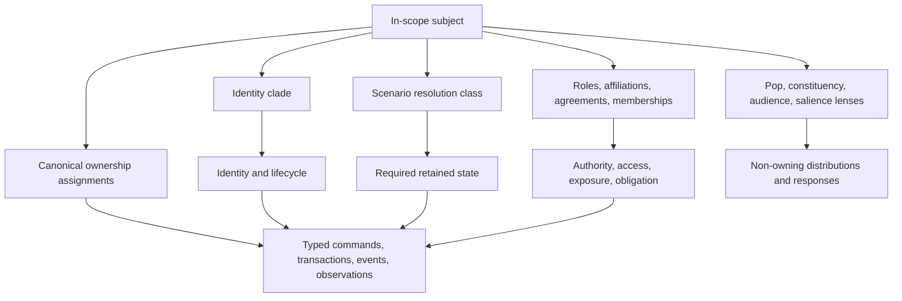
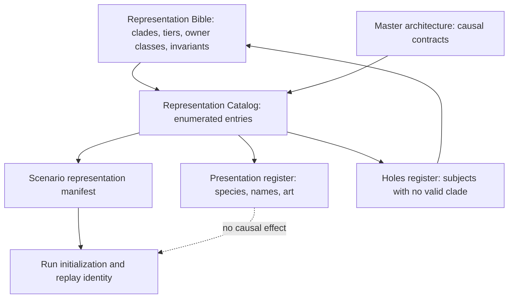
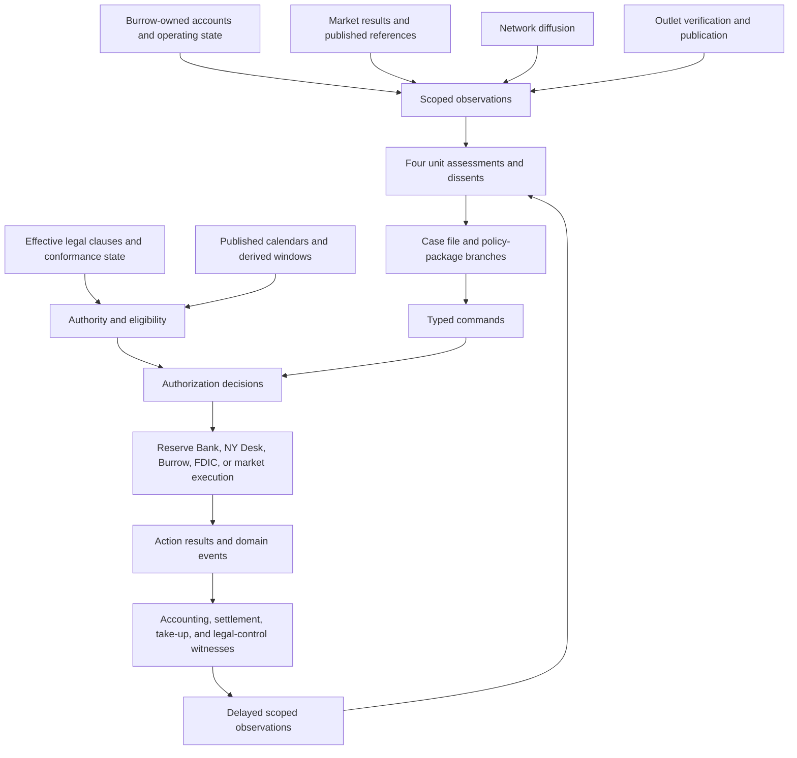

# 03-representation-ontology-and-composition

- conceptual scope: Representation Bible, Representation Catalog, and Burrow Bank composition probe
- contained artifacts: 3
- source omnibus: `humanlayer-omni.md`
- preservation: artifact headings, YAML metadata, and payload bytes below are preserved from the source omnibus; outer Markdown fence delimiters are reselected collision-safely for compact model ingestion.

## Artifact: `federal-reserve-chair-crisis-management-simulator/05-design-discussion-representation-bible.md`

```yaml
source_task: federal-reserve-chair-crisis-management-simulator
relative_path: 05-design-discussion-representation-bible.md
size_bytes: 162113
mode_octal: "0644"
modified_at_utc: 2026-09-04T04:15:24.776398Z
sha256: ecef48fbe338327099a833ce2bd1ee9a022e8217d7c9d2b3a5580cd4b06fcd07
media_type: text/markdown
content_encoding: UTF-8
newline_style: LF
original_ends_with_newline: true
```

~~~~markdown
---
task: federal-reserve-chair-crisis-management-simulator
type: design-discussion
repo: reservist
branch: not-initialized
sha: not-applicable
builds_on:
  - 04-design-discussion-minimum-simulation-kernel.md
---

# Representation Bible

### Summary of change request

Define how Reservist represents people, offices, institutions, populations, affiliations, firms, coalitions, sovereign and federated systems, law, geography, markets, facilities, information distribution, published references, schedules, records, external processes, generators, and changes in causal resolution. `04-design-discussion-minimum-simulation-kernel.md` remains the parent architecture and source of inherited claims. The Representation Catalog population-tests this ontology; kind definitions belong here rather than in a shadow catalog ontology.

The purpose is ontology discovery. The document distinguishes inherited invariants, inherited committed interfaces, inherited working mechanisms, open ontology questions, and content hypotheses. It uses adversarial examples to identify where the parent representation is sufficient, where it is ambiguous, and where its resolved language exceeds what the ontology can yet support.

### Current State

- The parent architecture separates canonical state, beliefs, observations, authority, action, execution, accounting, and transmission.
- It commits to composable representation across people, offices, institutions, decision bodies, Pops, firms, sectors, sovereign systems, mechanisms, and generators.
- It makes people the conserved population base, Pops non-owning lenses, institutions durable state without singular minds, and operational coalitions proposition-bound coordination ledgers.
- It fixes causal resolution at scenario initialization and allows only presentation salience to change during play.
- It leaves numeric approximation tolerances, detailed category and content inventories, sovereign authority maps, coalition instances, physical-product family enumeration, and scenario parameters incomplete behind resolved representation contracts.
- The representation dialectic is complete. User review resolved the sparse-cell population hybrid, coalition binding, identity and ownership separation, fidelity tiers, affiliation families, institutional flattening, external-system initialization, market taxonomy, process ownership, approximation budgets, and satire boundaries.
- The Representation Catalog's first population pass is reconciled here: every kind referenced by its roster now has a kinds-table row. Conferred designations use legal or facility state rather than a new kind.
- The instrument attribute set is corrected under Question 54 and families are confirmed type-level, taking no kinds-table row. Enumerating the families themselves remains catalog work behind that contract.
- Physical product and commodity families are likewise a closed type-level inventory rather than instance-level kinds. Their family, bucket, inventory-position, transformation, and exceptional lot-level contracts are defined below; enumerating scenario families remains catalog work.

### Desired End State

- Every represented subject has one identity clade and one scenario resolution class, with an explicit fallback representation; canonical ownership, cognition, authority, and presentation salience remain separate axes.
- Cross-cutting identities, affiliations, exposures, and salience labels compose through relationships or lenses without duplicating canonical stocks.
- Every stock, authority, action, observation, and persistent obligation has an unambiguous owner.
- Aggregates and richer modules exchange the same typed contracts, including conservation and residual-account treatment.
- Promotion decisions can be made before a run from causal criteria and can be audited against scenario needs.
- Population intersections preserve material ownership, transaction eligibility, unusual but consequential tails, and household correlations without requiring synthetic individuals.
- Named people remain materially connected to Pops and households while their exceptional institutional influence is represented separately from demographic weight.
- Sovereign systems expose internal authority, institutional conflict, and distinct action owners without becoming bespoke country scripts.
- Representation-specific probes can falsify ownership, accounting, authority, information-access, persistence, replay, and replacement assumptions before implementation begins.

### What we're not doing

- Designing exact equations, final response curves, cohort counts, complete rosters, final DSE weights, or calibration thresholds.
- Selecting final Pop bands, country parameters, coalition participants, firm lists, or species assignments.
- Designing final UI, art production, complete narrative content, or all player-facing labels.
- Implementing a runtime, schema, serializer, market solver, population engine, or content pipeline.
- Allowing runtime invention of named histories, actions, authorities, stocks, or private beliefs.
- Treating a content example as a general causal law.
- Selecting final numeric approximation thresholds or resolving questions not explicitly decided through review.

## Parent Claim Extraction

### Classification rules

| Class | Meaning in this artifact |
|---|---|
| **Inherited invariant** | A premise-level constraint every representation must preserve. |
| **Inherited committed interface** | A parent contract on which another module may depend even while internal representation changes. |
| **Inherited working mechanism** | A proposed representation intended to be tested and revised. |
| **Open ontology question** | A question about what exists, who owns it, or how it composes that must not be answered accidentally. |
| **Content hypothesis** | A candidate category, roster entry, scenario fact, species joke, parameter, or behavioral association requiring research and playtesting. |

The ledger groups repeated statements that assert the same representation rule. References point to the clearest statement in the parent, not every repetition.

### Running claim ledger

| ID | Parent representation claim | Classification | Consequence for this Bible | Parent reference |
|---|---|---|---|---|
| P01 | Canonical state, private cognition, and player information are physically distinct. | Inherited invariant | No representation may use a player-safe projection or belief as canonical truth. | `04-design-discussion-minimum-simulation-kernel.md:44` |
| P02 | Every canonical mutation crosses a typed accounting, clearing, execution, legal, mechanical, or shock path. | Inherited invariant | Every clade must name its mutation owner and accepted transition kinds. | `04-design-discussion-minimum-simulation-kernel.md:46` |
| P03 | Every conserved stock has one canonical owner. | Inherited invariant | Lenses, memberships, coalitions, and reports cannot own duplicate population, money, goods, or claims. | `04-design-discussion-minimum-simulation-kernel.md:519` |
| P04 | Authorization, execution, take-up, settlement, transmission, and observation remain distinct. | Inherited invariant | Roles and action owners must be traced at each stage. | `04-design-discussion-minimum-simulation-kernel.md:517` |
| P05 | Every attributable action has an owner; visible principals do not absorb execution performed elsewhere. | Inherited invariant | Person, office, decision body, institution, and mechanism references must remain separate. | `04-design-discussion-minimum-simulation-kernel.md:521` |
| P06 | Hidden behavior-affecting state cannot be reconstructed approximately on load. | Inherited invariant | Resolution, residuals, private beliefs, and pending transitions must persist or rebuild exactly. | `04-design-discussion-minimum-simulation-kernel.md:646` |
| P07 | Stable identity is typed and generational; disappearance requires declared queued-reference behavior. | Inherited committed interface | Every durable represented entity needs identity, lifecycle, tombstone, and fallback semantics. | `04-design-discussion-minimum-simulation-kernel.md:334` |
| P08 | Tasks calculate from versioned snapshots and commit in deterministic stable order. | Inherited committed interface | Aggregation, split, merge, and replacement results require stable commit keys. | `04-design-discussion-minimum-simulation-kernel.md:288` |
| P09 | Commands, authorization, execution, results, commitments, observations, and transmissions are separate typed contracts. | Inherited committed interface | Representation kinds must declare which contracts they may originate, own, receive, or only project. | `04-design-discussion-minimum-simulation-kernel.md:451` |
| P10 | Derived caches cannot authorize actions, settle transactions, or become independent truth. A witnessed authorized publication by a named party may bind third-party transactions through a `PublishedReference`; its silent derived calculation cache may not. | Inherited invariant with a narrow publication exception | Pop lenses, coalition beliefs, situation views, exposure maps, and unpublished calculations remain derived. Binding force belongs only to the published value or grade, its named publisher, publication witness, declared binders, and revision policy; publication does not grant force to arbitrary claims or derived values. | `04-design-discussion-minimum-simulation-kernel.md:317` |
| P11 | There is no universal humanlike `Actor`. | Inherited invariant | Decision context is composition, not inheritance from one all-purpose actor type. | `04-design-discussion-minimum-simulation-kernel.md:714` |
| P12 | A person owns continuity, cognition, memory, relationships, material interests, reputation, and offices across time. | Inherited committed interface | Named and cohort people require a continuity boundary separate from office tenure. | `04-design-discussion-minimum-simulation-kernel.md:718` |
| P13 | An office owns authority, duties, access, capabilities, calendar, appointment, term, removal, and succession rules. | Inherited committed interface | Authority attaches to an office and is sourced to an effective `LegalInstrument`, valid delegation, or other explicit authority record, never personality. | `04-design-discussion-minimum-simulation-kernel.md:719` |
| P14 | An institution owns resources, powers, facilities, commitments, records, staff, processes, offices, and organizational reputation. | Inherited committed interface | Institutional powers resolve through effective `LegalInstrument` clauses and valid delegations; continuity survives officeholders and is not stored in private cognition. | `04-design-discussion-minimum-simulation-kernel.md:720` |
| P15 | A decision body owns membership, procedure, quorum, thresholds, votes, dissents, delegation, and binding collective outcomes. | Inherited committed interface | The FOMC cannot be represented as the Chair's action set or one aggregate mind. | `04-design-discussion-minimum-simulation-kernel.md:721` |
| P16 | Institutions have no singular humanlike belief. | Inherited invariant | Personal beliefs, staff products, participant distributions, operative assumptions, official claims, and outsider attributions remain distinct. | `04-design-discussion-minimum-simulation-kernel.md:724` |
| P17 | Professional action is afforded by role and bounded by institutional authority, resources, and procedure. | Inherited invariant | Personal ideology may alter interpretation and discretion but cannot create professional powers. | `04-design-discussion-minimum-simulation-kernel.md:739` |
| P18 | Named people are rare and selected when individual discretion materially changes a modeled channel. | Inherited working mechanism | The named-person threshold needs operational criteria and demotion/fallback treatment. | `04-design-discussion-minimum-simulation-kernel.md:768` |
| P19 | Less consequential officeholders may use limited role-holder representations. | Inherited working mechanism | A role-holder tier must preserve action ownership without a full personal biography. | `04-design-discussion-minimum-simulation-kernel.md:743` |
| P20 | People are the conserved population base. | Inherited committed interface | Question 18 now confirms scenario-bounded sparse cells, conditional distributions, and dynamic household cohorts. | `04-design-discussion-minimum-simulation-kernel.md:978` |
| P21 | Canonical sparse joint person cells hold intersections that own stocks, constrain transactions, or materially alter transmission. | Inherited working mechanism, resolved by Questions 18 and 52 | The promotion boundary and error classes are settled; scenario-specific protected dimensions and numeric tolerances remain catalog and calibration work. | `04-design-discussion-minimum-simulation-kernel.md:978` |
| P22 | Conditional factorized distributions retain lower-priority and continuous variation inside cells. | Inherited working mechanism, resolved by Questions 18 and 52 | Protected moments, tails, and correlations follow the scenario manifest and per-channel approximation budgets; their content inventory and numeric tolerances remain deferred. | `04-design-discussion-minimum-simulation-kernel.md:978` |
| P23 | Every person belongs to exactly one current living arrangement. | Inherited invariant | Household allocations must reconcile to conserved person mass. | `04-design-discussion-minimum-simulation-kernel.md:1014` |
| P24 | Households are dynamic relationships that may own shared stocks and obligations. | Inherited working mechanism, resolved by Question 18 | Legal and accounting rules select the owner; household accounts, member allocations, obligations, and dissolution transitions are part of the committed household contract. | `04-design-discussion-minimum-simulation-kernel.md:1021` |
| P25 | People retain individual labor, votes, beliefs, continuity, and personally titled assets or debts. | Inherited invariant | Household aggregation cannot erase individual franchise, labor, or title. | `04-design-discussion-minimum-simulation-kernel.md:1021` |
| P26 | Population changes use typed transfer, transform, split, and merge operations. | Inherited committed interface | Each operation needs conservation, stock-transfer, household-reconciliation, and stable-order contracts. | `04-design-discussion-minimum-simulation-kernel.md:1025` |
| P27 | Small flows accumulate in persisted buckets before deterministic realization. | Inherited working mechanism | Delay cannot fabricate or lose people, stocks, eligibility, or protected tails. | `04-design-discussion-minimum-simulation-kernel.md:1039` |
| P28 | Cells merge only when keys, ownership semantics, and protected correlations are compatible. | Inherited invariant with policy resolved by Question 52 | Compatibility and separate error classes are required; numeric per-channel and scenario tolerances remain calibration work. | `04-design-discussion-minimum-simulation-kernel.md:1062` |
| P29 | A Pop is a non-owning lens over weighted intersections and never a collective Agent. | Inherited invariant | Pops can project distributions and responses but cannot deliberate, authorize, command, or own conserved stocks. | `04-design-discussion-minimum-simulation-kernel.md:1066` |
| P30 | Pop responses proceed through exposure, belief, pressure, intention, attempts, execution, and realized flows. | Inherited working mechanism | Aggregate response must preserve stage attrition rather than emit one direct behavioral modifier. | `04-design-discussion-minimum-simulation-kernel.md:961` |
| P31 | Pop influence has distinct demographic, consumption, productive, financial, electoral, organizational, elite, disruptive, and narrative channels. | Inherited working mechanism | The Bible must prevent these weights from collapsing into population size or one sway score. | `04-design-discussion-minimum-simulation-kernel.md:1095` |
| P32 | Pop transmission stores direction, sensitivity, delay, saturation, interactions, uncertainty, and provenance. | Inherited working mechanism | Exact weights are deferred; required metadata and interaction structure are architectural. | `04-design-discussion-minimum-simulation-kernel.md:1156` |
| P33 | Sensitive identity dimensions exist only when causally relevant. | Inherited invariant | Identity cannot be included as ornamental determinism or omitted when it changes exposure, access, discrimination, or organization. | `04-design-discussion-minimum-simulation-kernel.md:2551` |
| P34 | People connect to institutions through typed affiliations and roles, not one membership flag. | Inherited committed interface | Employment, ownership, office, customer, depositor, student, voter, and other relations need distinct semantics. | `04-design-discussion-minimum-simulation-kernel.md:1111` |
| P35 | Institutions receive constituency pressure through different contracts and channels rather than one stakeholder mood. | Inherited invariant | Institutional decision context must preserve source, proposition, leverage, and mechanism. | `04-design-discussion-minimum-simulation-kernel.md:1127` |
| P36 | Named people's material quantities must not be double counted against Pop totals. | Inherited invariant | Named people stay in Pops; any independently causal personal stock receives a stock-specific residual offset without subtracting demographic mass. | `04-design-discussion-minimum-simulation-kernel.md:2571` |
| P37 | Financial long tails use typed institution cohorts separate from person Pops. | Inherited working mechanism | Organization cohorts also cover causally material firms, municipalities, nonprofits, and other legal persons. | `04-design-discussion-minimum-simulation-kernel.md:2599` |
| P38 | Named institution opening stocks and exposures are reconciled out of cohort residuals. | Inherited invariant | Scenario construction must prove named-plus-residual conservation. | `04-design-discussion-minimum-simulation-kernel.md:2601` |
| P39 | Cohort-to-cohort clearing uses aggregate accounts without invented bilateral identities. | Inherited committed interface | Bilateral facts cannot be fabricated merely to render a transaction. | `04-design-discussion-minimum-simulation-kernel.md:2601` |
| P40 | Production combines named strategic firms, industry cohorts, and product or commodity flows. | Inherited working mechanism | Firm identity, cohort accounts, and flow mechanisms coexist rather than form one ladder. | `04-design-discussion-minimum-simulation-kernel.md:906` |
| P41 | Products earn explicit representation through household salience, bottlenecks, financial markets, or scenario transmission. | Inherited working mechanism | Product granularity follows a causal test rather than a complete industrial taxonomy. | `04-design-discussion-minimum-simulation-kernel.md:914` |
| P42 | Markets determine prices from participant orders, constraints, contracts, and clearing rather than policy consequence tables. | Inherited invariant | A market is a mechanism with owners of instruments and orders, not a person or institution. | `04-design-discussion-minimum-simulation-kernel.md:184` |
| P43 | Instrument families retain duration, liquidity, seniority, collateral, rollover, rate, convertibility, priority, margin, and counterparty exposures. | Inherited working mechanism, amended | The attribute set is corrected below: `collateral` is bidirectional, `duration` may be state-dependent, and settlement role, demandability, credit state, currency, the notional/market-value/exposure split, and contingency are added. Families remain a closed type-level inventory rather than a kind or an unrestricted constructor. | `04-design-discussion-minimum-simulation-kernel.md:2593` |
| P44 | Agreements use clause-based permissions, duties, transfers, access, disclosure, performance, breach, and exit. | Inherited committed interface | Membership, relationship, agreement, coalition, and authority remain different objects. | `04-design-discussion-minimum-simulation-kernel.md:523` |
| P45 | Coalitions are issue-specific, overlapping, template-gated, and bound to a package or branch. | Inherited working mechanism, amended and resolved by Question 22 | Operational coalitions bind to one concrete subject from the closed `CoordinatingProposition` vocabulary; durable alignment remains relationship state. | `04-design-discussion-minimum-simulation-kernel.md:1203` |
| P46 | Coalitions have no mind, shared private belief store, authority, command ownership, or execution ownership. | Inherited invariant | Coalition state records coordination; autonomous participants own cognition and action. | `04-design-discussion-minimum-simulation-kernel.md:1263` |
| P47 | Canonical coalitions record invitations, pledges, demands, exits, breaches, contributions, fault lines, and lifecycle. | Inherited working mechanism, resolved by Question 22 | The contribution and obligation vocabulary below preserves participant ownership and requires a performance witness for every realized contribution. | `04-design-discussion-minimum-simulation-kernel.md:1222` |
| P48 | Staff coalition options and observer coalition beliefs are epistemic objects distinct from canonical coalitions. | Inherited invariant | Hypotheses cannot own invitations, pledges, or performed contributions. | `04-design-discussion-minimum-simulation-kernel.md:1270` |
| P49 | Pops may be represented by coalitions but never become coalition decision-makers. | Inherited invariant | Coordinating organizations or people must own invitations, bargains, and mobilization actions. | `04-design-discussion-minimum-simulation-kernel.md:1303` |
| P50 | Sovereigns are containers for internal political economies, not unitary Agents. | Inherited invariant | External actions must resolve to a principal, institution, body, or mechanism. | `04-design-discussion-minimum-simulation-kernel.md:1309` |
| P51 | Country detail follows distinct material action ownership, not rank or cartographic symmetry. | Inherited invariant | A central bank, sovereign fund, ministry, or firm may be promoted independently of its sovereign container. | `04-design-discussion-minimum-simulation-kernel.md:801` |
| P52 | Saudi Arabia, Israel, Iran, China, the euro area, Japan, the United Kingdom, Russia, UAE, and Qatar are candidate differentiated systems. | Content hypothesis | Each roster and authority graph requires scenario research; none is universal content. | `04-design-discussion-minimum-simulation-kernel.md:1325` |
| P53 | Aggregated foreign regions retain selected growth, policy, currency, funding, stress, trade, commodity, and reserve channels. | Inherited committed boundary | Rich sovereign modules must be substitutable behind these outputs where applicable. | `04-design-discussion-minimum-simulation-kernel.md:1839` |
| P54 | Geography may be named, flattened, or exogenous independently of person and institutional resolution. | Inherited working mechanism | Place is a scope and condition reference, not an owner by virtue of geography and not a proxy for all actors located there. | `04-design-discussion-minimum-simulation-kernel.md:741` |
| P55 | Generators provide initiating facts and typed shocks; stateful systems determine downstream consequences. | Inherited invariant | No generator may emit final prices, inflation, GDP, votes, or crisis conclusions. | `04-design-discussion-minimum-simulation-kernel.md:822` |
| P56 | Some exogenous processes become stateful and responsive after initiation. | Inherited working mechanism | A `StatefulExternalProcess` owns evolving external state after initiation, while generators retain keyed draws and actors retain interventions. | `04-design-discussion-minimum-simulation-kernel.md:835` |
| P57 | Crisis and situation views do not own independent causal momentum. | Inherited invariant | Representation cannot create a crisis entity that bypasses ordinary stocks, actions, and mechanisms. | `04-design-discussion-minimum-simulation-kernel.md:1855` |
| P58 | Resolution is fixed at scenario initialization; presentation salience may change dynamically. | Inherited working mechanism with declared extension | The no-runtime-promotion rule, representation manifest, reserve roster, residual mapping, and adapter contracts protect history; scenario instances remain catalog work. | `04-design-discussion-minimum-simulation-kernel.md:2625` |
| P59 | Runtime promotion is prohibited unless prior history can be allocated exactly and deterministically. | Inherited invariant | Any future exception must preserve ownership, cognition, relationships, accounting, and replay identity. | `04-design-discussion-minimum-simulation-kernel.md:2627` |
| P60 | Every entity has one primary causal clade, one resolution class, one fallback, and explicit relationships and lenses. | Inherited working mechanism, superseded by Question 43 | Every represented subject instead has one identity clade and separate canonical-owner, cognition, authority, resolution, and presentation assignments. Composition handles subjects that perform several causal functions without giving one clade all of their state. | `04-design-discussion-minimum-simulation-kernel.md:142` |
| P61 | Cross-cutting labels such as foreign, systemic, media-visible, or coalition participant are lenses or relationships. | Inherited invariant | Cross-cutting properties never compete with identity clade or canonical-owner assignments. | `04-design-discussion-minimum-simulation-kernel.md:165` |
| P62 | Species never deterministically encodes nationality, race, ethnicity, ideology, religion, or moral worth. | Inherited invariant | Animal satire must be specific, reversible, plural within groups, and aimed at institutions or behavior. | `04-design-discussion-minimum-simulation-kernel.md:2167` |
| P63 | Candidate species jokes include owls, foxes, camels, geese, pandas, lemmings, and alpacas. | Content hypothesis | Every assignment remains optional and must pass the forbidden-association test. | `04-design-discussion-minimum-simulation-kernel.md:2169` |
| P64 | Population approximation needs an explicit error budget rather than a universal minimum cohort size. | Open ontology question, resolved by Questions 18 and 52 | Conservation and ownership remain exact; separate material, behavior, timing, and tail-error channels are settled, while numeric tolerances remain calibration work. | `04-design-discussion-minimum-simulation-kernel.md:2316` |
| P65 | Coalition family slots, contributions, demands, and successor affordances remain Representation Bible work. | Open ontology question, resolved by Question 22 | Closed coalition families, proposition binding, participant-owned contributions, demands, witnesses, and successor-template eligibility are defined below. | `04-design-discussion-minimum-simulation-kernel.md:2279` |

## Proposed End State Architecture

The proposed ontology separates causal identity from cross-cutting relationships and from scenario resolution:



### Running table: representation kinds and required state

| Kind | Primary causal purpose | Required canonical state | May deliberate? | May own conserved stocks? | Required fallback |
|---|---|---|---:|---:|---|
| `Person` | Persistent human identity and discretion | Identity, continuity, private cognition, memory, relationships, personal commitments, Pop memberships, current roles, availability; personal accounts only when individually causal | Yes when named or role-holder fidelity supports it | Exceptionally, for individually causal titled stocks | Person-cell inclusion plus role-holder template or Pop-only inclusion |
| `Office` | Time-bounded source of authority and access | Holder, term, appointment, duties, powers and restrictions sourced to effective `LegalInstrument` clauses or valid delegations, access grants, calendar, succession | No independent mind | No, except office-controlled institutional accounts by reference | Institution procedure or vacant-office state |
| `Institution` | Durable organizational owner and operator | Identity, jurisdiction, accounts, financial `Facility` references, productive-site state, staff, commitments, records, doctrine, procedures, offices, relationships, and powers sourced to effective `LegalInstrument` clauses or valid delegations | Through people and procedures, not one mind | Yes | Typed organization cohort or mechanism |
| `DecisionBody` | Procedure converting participant acts into authoritative outcomes | Membership, eligibility, agenda, quorum, thresholds, votes, dissents, delegations, decisions | No singular cognition | Normally no; may authorize institution-owned stocks | Office or institution procedure only if legally valid |
| `StaffUnit` | Production of analysis and operations inside an institution | Personnel/capacity distribution, access, methods, tasks, products, readiness, records | Through represented staff participants or unit synthesis | Institution owns material stocks | Parent institution aggregate capability |
| `PersonPopulationCell` | Conserved population and individually owned distributional state | Person mass, active key, conditional distributions, personal stock accounts or allocations, household allocations, protected correlations | No | Yes, through canonical aggregate accounts | Broader compatible cell with retained protected state |
| `HouseholdCohort` | Living arrangement and shared economic unit | Household count, member slots, correlations, tenure, shared/separate finances, care, baskets, shared obligations, lifecycle | Distributed response only | Yes where household is legal or behavioral owner | Person cells plus explicit shared-account residuals |
| `PopLens` | Named intersection, constituency, audience, or analytic population | Definition, selectors, weights, provenance, validity time; derived outputs only | No | No | Parent lens or direct query over canonical cells |
| `OrganizationCohort` | Long-tail banks, firms, municipalities, nonprofits, and other legal persons with common causal grammar | Count/distribution, cohort accounts, organization kind, business or public mandate, geography, charter, staff composition, strategies, response distributions, residual exposures | Cohort response catalog shaped by staff and procedure, not person cognition | Yes, in aggregate accounts | Sector mechanism with residual account |
| `NamedFirm` | Firm-specific discretion and bottleneck ownership | Accounts, ownership, productive-site state and `MechanicalSystem` references, capacity, contracts, workforce, inventory, financing, beliefs, offices, actions | Through people and procedures | Yes | Industry or organization cohort plus explicit productive-site process or contract if still causal |
| `IndustryCohort` | Production and investment by similar firms | Firm mass, capacity, recipes, inventories, margins, finance, employment, response distributions | Bounded cohort response | Yes, in aggregate accounts | Product-flow or sector mechanism |
| `Coalition` | Package-specific coordination among autonomous participants | Template, package link, sponsor, slots, invitations, pledges, demands, contributions, breaches, fault lines, lifecycle | No | No, unless a separate legal vehicle is represented as an institution | Relationships, alignment, or separate agreements |
| `SovereignSystem` | Container and scope for an internal political economy | Authority graph, jurisdictions, institutions, principals, coalitions, regions, capabilities, treaties, external interfaces | No singular cognition | Container does not replace internal owners | `ExternalRegion` aggregate |
| `Region` | Geographic scope with causal conditions and jurisdiction links | Boundary/version, parent and overlapping scopes, population allocations, productive-site and infrastructure references, resource and inventory references, hazard and process references, policy jurisdictions, disputed-jurisdiction and de facto-control relationships | No | No by virtue of geography; a legal/accounting subject, `MechanicalSystem`, or `StatefulExternalProcess` owns every referenced stock or condition | Parent aggregate region |
| `Market` | Exchange, allocation, price discovery, rationing, and settlement | Instruments, participants/eligibility, orders or schedules, constraints, clearing state, residuals, failures, calendar | No | No; participants, custodians, or settlement systems own assets | Typed boundary adapter preserving outputs and residuals |
| `MechanicalSystem` | Rule-driven production, transformation, transport, settlement, or diffusion | Stocks/conditions it owns, transition rules, queues, capacities, losses, outputs | No | Yes when it is canonical owner | Boundary adapter with explicit source/sink accounts |
| `Generator` | Initiation of exogenous or semi-exogenous disturbances | Hazard identity, scope, keyed draw state, occurrence history, initiating facts, observation policy | No | No downstream stocks | Disabled or scenario-supplied incident tape |
| `Agreement` | Clause-based permissions and obligations | Parties, jurisdiction, clauses, effective period, amendments, performance, breach, exit | No | No; clauses create commitments or transfers owned elsewhere | Relationship or informal structured commitment |
| `LegalInstrument` | Deterministic rules that grant, restrict, or require action by a class of subjects, with dated effect and compliance windows | Identity; level — statute, agency rule, or designation order; enacting body and procedure; enactment, amendment, and repeal history; delegated rulemaking obligations with deadlines; typed requirement clauses, each naming the bound subject class, effective date, conformance deadline, required or forbidden commands, reporting obligations, and enforcement consequence; per-subject compliance state; supersession links | No | No | Fixed authority-graph state with no amendment path and no conformance window |
| `FederatedSystem` | Identity, shared mandate, and consolidated view for separately chartered institutions bound by a common mission and a decision body whose authority spans them | Identity; governing statute or treaty; mandate and mission; member institutions and charters; spanning decision bodies; authority map naming which member owns which act; consolidated accounting projection and its derivation; shared calendars; system-level commitments; membership and succession rules | No; spanning decision bodies and member institutions deliberate | No; members own every stock, and the consolidated view is derived | One `Institution` carrying the consolidated position, with member distinctions dropped |
| `Facility` | A standing offer of institution-owned terms to eligible counterparties, whose use is the counterparty's choice | Identity; owning institution; authorization reference and its limits; legal basis and any required external consent; counterparty eligibility rule; instrument and collateral schedule with haircuts; pricing rule; aggregate and per-counterparty caps; operational readiness; status; take-up ledger by counterparty and date; outstanding balances by reference; reserved institutional capacity; disclosure rules and lag; lifecycle and expiry | No | No; drawn balances are the operating institution's assets and the counterparty's liabilities | Terms recorded as operating-institution state, with take-up as an aggregate flow and no per-counterparty ledger |
| `PublishedReference` | A value or grade published on a schedule by an interested party, which third-party contracts and regulations bind to | Identity; publisher; input specification; calculation method and its derived-cache reference; publication schedule and lag; current published value and full publication history; revision policy and revision history; what binds to it — contracts, eligibility rules, risk weights, mandates; known incentive or bias structure; failure, delay, and suspension state | No | No | An exogenous series with no publisher, no revision, and nothing bound to it |
| `Outlet` | Discretionary selection, framing, and distribution of claims and evidence to audiences | Identity; operating institution reference; offices and role-holders; editorial slate (lead, active narratives, developing reports); reporter and airtime capacity; access grants and source relationships; verification threshold; audience reach by segment; latency; framing and amplification tendencies; correction and retraction record; topic preferences; legal exposure; publication queue | Through role-holders and editorial procedure, not one mind | No; the operating institution owns money, contracts, and facilities | Distribution parameters on an aggregate media channel |
| `Network` | Non-discretionary diffusion of claims among members | Identity; membership definition and affiliation edges; access boundary; latency distribution; verification norm; propagation and decay rules; reach by segment | No | No | A diffusion term in an aggregate information mechanism |
| `ScheduledProcess` | Recurring published occurrences other agents plan against, and the eligibility windows derived from them | Identity; owning institution; recurrence rule and published horizon; announced occurrences with dates and any published parameters; announcement and revision history; derived eligibility windows and what they gate; dependent parties and notification rules; delay, suspension, and disruption state | No | No | Occurrences emitted directly into the scheduled-event queue, with no announcement act and no derived windows |
| `Record` | Durable institutional work, proceeding, package, program, or assessment with stable identity and transferable custody | Identity; record subtype; owning institution or staff unit; status or awareness state; content and typed subject references; provenance; revision, transfer, and supersession history; lifecycle and retention rules; queued-work references and their disappearance fallback | No | No; a record references but does not absorb the stocks, authority, commitments, or world state it concerns | Parent-institution state with no independent identity, transfer, or queued reference |
| `StatefulExternalProcess` | Evolution of environmental, epidemiological, ecological, geopolitical, or other external state, including adaptation and intervention response | Identity; scope and responsible process module; evolving physical or external state; transition rules and stage history; keyed hazard-draw references where applicable; actor-owned intervention inputs; capacities, losses, and outputs; observation policy and history; replacement-boundary version; lifecycle and termination conditions | No | Yes when it is the canonical owner of physical stocks or conditions | Incident tape or hazard adapter preserving declared outputs but no actor feedback into the process |
| `BoundaryAdapter` | Temporary producer/consumer behind a committed boundary | Interface version, external accounts, state needed for deterministic outputs, provenance, replacement metadata | No unless interface explicitly models response distributions | Yes only through declared external/residual accounts | Endogenous module or another adapter with same contract |

Legal change is effective-dated canonical state, not a free-form parameter override. Offices, institutions, facilities, designations, and catalog `period_variants[]` reference the applicable `LegalInstrument` and clause versions; they do not duplicate authority rules that can drift from the amendment, repeal, or conformance ledger.

### Mechanical systems, stateful external processes, and productive sites

`MechanicalSystem` and `StatefulExternalProcess` are distinguished by the state whose evolution they own, not by whether the subject is physical, long-lived, stochastic, or affected by people.

| Kind | Owns | Typical inputs | Typical examples |
|---|---|---|---|
| `MechanicalSystem` | An operational queue, capacity, transformation, transport, settlement, or controlled production process | Owned inputs, commands, contracts, labor, energy, capacity, maintenance, and observed external conditions | Logging and milling, crop harvest and processing, livestock husbandry and slaughter, storage, freight, payment settlement |
| `StatefulExternalProcess` | Evolving environmental, epidemiological, ecological, geopolitical, or other external conditions that continue independently of one operator's queue or production plan | Keyed hazards, prior process state, regional conditions, and actor-owned interventions | Drought, regional climate and ecosystem state, epidemic spread, wildfire progression, war's physical disruption state |

A mixed physical chain is split at the ownership boundary. A regional climate or ecological process may own soil moisture, rainfall, fire conditions, or unowned biomass. A firm, institution, industry cohort, or other legal/accounting subject owns planted crops, livestock, harvested goods, inventories, contracts, and extraction rights. A `MechanicalSystem` owns the operational capacity, queues, losses, and transformations that convert those owned inputs into outputs. Typed relationships and transmissions connect the objects; neither kind may silently absorb the other's state.

`ProductiveSite` is a composition profile, not a twenty-ninth representation kind and not a synonym for `Facility`. A farm, forest concession, mine, fab, mill, slaughterhouse, warehouse, port, or power plant has:

```text
productive site
  geographic footprint        -> Region relationship
  legal and accounting owner  -> Institution, NamedFirm, or OrganizationCohort
  operator                     -> Institution, NamedFirm, StaffUnit, or cohort response
  operational process         -> MechanicalSystem when independently causal
  land, concession, permit,
  or extraction right         -> Agreement or LegalInstrument relationship
  capacity, queues, condition,
  losses, and outputs          -> MechanicalSystem state
  inputs and inventories       -> owner accounts referencing physical-product families
```

A site receives an independent `MechanicalSystem` identity only when it owns a consequential capacity, queue, condition, transformation, outage history, or execution result. Otherwise it remains structured state on its parent firm or cohort. The term `Facility` is reserved for the financial and institutional kind defined below: an authority-gated standing offer of terms with counterparty eligibility and a take-up ledger.

### Instrument families are type-level and take no kinds-table row

An instrument family is a type that positions reference, not a subject that exists once. Every row above is instance-level — one `LegalInstrument` is Dodd-Frank, one `PublishedReference` is SOFR — and no instance ever occupies an instrument row. Families therefore remain the closed inventory P43 requires, and the four levels stay distinct:

```text
family      a type with attributes           agency MBS          closed vocabulary
bucket      an aggregation over positions    MBS, 15-30y         account structure
position    what an owner actually holds     one bank's MBS book account entry
security    one identified issue             a specific CUSIP    extension point, not
                                                                 modeled by default
```

**Declared extension point.** A scenario centred on one failed auction, one downgraded issue, or one defaulted borrower needs the security level. Promoting it follows the ordinary pre-run promotion contract: the security becomes an explicitly represented subject whose position is removed from its bucket and reconciled against a residual, exactly as a named institution reconciles against its cohort. No runtime promotion.

### Running table: required instrument-family attributes

Eleven of these are load-bearing in the Treasury-duration and secured-funding circuit alone, so the set is not deferrable to calibration.

| Attribute | Requirement | Why it exists |
|---|---|---|
| Duration | Scalar where cash flows are fixed; a state-dependent function where optionality exists | MBS duration shortens as rates fall and extends as they rise; treating it as a scalar deletes convexity hedging as a transmission channel |
| Collateral role | Bidirectional: whether the instrument is secured *by* collateral, and whether it is usable *as* collateral, with the eligibility schedule and haircut source that governs it | The secured-funding circuit turns on what may be pledged and at what haircut; the original one-way attribute pointed away from the causal role |
| Settlement role | Whether the instrument is itself a means of settlement, and in which system | A bill is more liquid than almost anything and cannot settle a Fedwire payment; liquidity is not finality, and the gap is why reserve scarcity moves repo |
| Demandability | On demand at par, on demand at NAV, notice period, gated or fee-bearing, or not redeemable | Deposits and money-fund shares have near-identical duration and opposite run behaviour; this attribute is the difference |
| Credit state | Performing, delinquent, non-performing, defaulted, restructured | The bank-failure path runs through provisioning and capital, which need an impairment state rather than a seniority rank |
| Currency denomination | Required on every family; not a family of its own | A dollar liability held by a foreign bank is the entire offshore-funding mechanism, and cross-currency basis is the price of the mismatch |
| Notional, market value, exposure | Three quantities, tracked separately | A swap carries large notional at near-zero initial value; gross leverage is a player-visible indicator and is uncomputable from one number |
| Contingency | Undrawn, drawn, and the trigger condition between them | Guarantees and credit lines are off-balance-sheet until drawn, and drawing is what happens in a crisis |
| Liquidity | Retained | Market depth and price impact under sale |
| Seniority | Retained; null where inapplicable | Recovery ordering within a capital structure |
| Priority | Retained | Payment ordering in resolution |
| Rollover | Retained | Refinancing and maturity-wall risk |
| Rate | Retained | Fixed, floating, administered, or referenced to a `PublishedReference` |
| Convertibility | Retained | Conversion rights and triggers |
| Margin | Retained | Initial and variation, where variation margin is a recurring liquidity demand |
| Counterparty exposure | Retained | Bilateral or novated to a central counterparty |

Insurance status is not an attribute. It is a `LegalInstrument` clause conferring a condition on an account, so insured and uninsured deposits are one family under two legal conditions rather than two families.

### Physical product and commodity families are type-level and take no kinds-table row

A physical product or commodity family is a closed type referenced by resource stocks, inventories, recipes, contracts, transport tasks, baskets, and market orders. It is not an instance-level subject and owns nothing. The four levels remain distinct:

```text
family      a physical type and causal grammar    green coffee         closed vocabulary
bucket      fungible stock with material traits   green coffee, grade,
                                                   origin, crop year     account structure
position    what an owner holds                    one trader's inventory
lot         one identified batch, herd, cargo,
            harvest, or reserve                    extension point, not
                                                   modeled by default
```

Every family declares the following structural attributes. Values and scenario parameters remain catalog and calibration work.

| Attribute | Requirement |
|---|---|
| Conserved quantity and unit | Mass, volume, energy, count, or another declared physical dimensional quantity; incompatible units may not be summed without a typed conversion |
| Material stage | Unharvested resource, live biological stock, harvested raw material, intermediate input, finished good, by-product, or waste; transitions between stages require a recipe or loss witness |
| Ownership form | Which accounts may hold the stock, whether custody and legal ownership differ, and whether the family may represent an unowned natural stock |
| Origin and traceability | Region, productive site, process, cohort, or lot provenance retained only where it changes eligibility, quality, cost, exposure, or observation |
| Grade and quality | Closed dimensions that change substitutability, contract eligibility, processing yield, household use, or price |
| Storability and decay | Storage requirements, spoilage, degradation, biological loss, and maximum useful horizon where applicable |
| Production and transformation roles | Permitted recipe inputs and outputs, yields, co-products, losses, and required capacities |
| Biological or environmental dependencies | Growth, maturation, feed, water, climate, disease, season, or ecosystem inputs where applicable |
| Transport and handling | Bulk, cold-chain, hazardous, pipeline, grid, refrigerated, live-animal, or other capacity and loss constraints |
| Substitution class | Uses for which another family or bucket may substitute, with direction, delay, conversion cost, and saturation represented by the consuming mechanism |
| Delivery and market eligibility | Contract grades, delivery locations, timing windows, certification, and market or procurement eligibility |
| Demand role | Household basket, productive input, capital good, strategic reserve, required service, or discretionary use |

Stocks and inventories remain in owner accounts. Regions scope or originate them; firms and cohorts produce or hold them; mechanical systems transform or transport them; markets clear orders for them; contracts create delivery obligations. A family name never proves that a region owns, produces, exports, consumes, or is exposed to that family.

**Declared extension point.** A scenario centered on one contaminated shipment, failed harvest, diseased herd, blocked cargo, strategic reserve, or legally disputed resource may promote one lot before the run. The lot receives stable identity, explicit ownership, provenance, condition, location, obligations, and residual reconciliation. No runtime promotion may invent its prior ownership or history.

The initial inventory is catalog work. Candidate families already required by the parent architecture include timber and lumber stages, coffee stages, feed crops, live livestock and meat products, oil, electricity, semiconductors, auto parts, and other scenario-relevant goods. Naming a candidate here does not assert a production geography or causal relationship.

### Running table: canonical ownership by domain

| Domain | Canonical owner | Non-owners that may project or reference it | Required accounting or transition boundary |
|---|---|---|---|
| Person mass | `PersonPopulationCell` | Named-person overlay, Pop lens, household member slot, constituency | Population transfer/transform/split/merge ledger |
| Named person's personally titled asset or debt | Normally remains statistically allocated inside person-cell and household state; an explicit person account exists only when that individual's quantity changes a modeled channel | Pop lens, household, employer, coalition | If materialized, offset the corresponding aggregate residual for that stock without subtracting the person from population mass |
| Household-shared asset, debt, income pool, or care obligation | `HouseholdCohort` account when law/behavior makes household the subject | Member person cells, Pops, lenders, tax/benefit systems | Household formation, allocation, settlement, dissolution |
| Institution cash, securities, liabilities, equity, inventory | Named institution or `OrganizationCohort` account | Executives, owners, regulators, market lenses | Double-entry accounting, revaluation, production/loss witness |
| Firm capacity and inventory | Named firm or industry cohort | Workers, investors, suppliers, customers, sovereign system | Production, investment, transfer, depreciation, loss |
| Legal rule | `LegalInstrument` clause and its enactment record | Bound offices, institutions, facilities, designations, staff interpretations | Enactment, amendment, delegated rulemaking, effective date, conformance, enforcement, repeal, supersession |
| Office power | Office, sourced to an effective `LegalInstrument` clause, valid delegation, or other explicit authority record | Current person holder, coalition, public attribution | Appointment, delegation, legal transition, expiry, revocation |
| Decision-body outcome | `DecisionBody` procedural record | Participants, institution, coalition, media | Agenda, vote, threshold, certification, implementation request |
| Contractual obligation | Contract/agreement clause plus responsible party commitment | Coalition, officeholder, report, case file | Formation, amendment, performance, breach, cure, expiry |
| Coalition pledge or demand | Coalition ledger as coordination fact; underlying promised resource remains with pledging participant | Staff option, observer belief, represented Pop | Invitation/bargain witness and separate performance action result |
| Security, collateral, deposit, loan, payment | Legal/accounting owner or custodian account; the instrument family it references is a type, never an owner | Markets, beliefs, exposure caches, reports | Issue, transfer, encumber, settle, default, resolve |
| Natural resource or regional capacity | `StatefulExternalProcess` for unowned evolving physical conditions or stocks; otherwise the applicable legal/accounting owner or `MechanicalSystem` | Region, sovereign, firm, market, product-family and exposure lenses | Growth, production, depletion, harvest, damage, restoration, transfer, or revaluation |
| Harvested product, intermediate input, finished good, livestock, or inventory | Person, household, firm, institution, organization cohort, industry cohort, or declared external account holding the position | Region, market, productive site, contract, basket, report | Produce, transform, transfer, consume, spoil, destroy, store, transport, or settle |
| Belief | Individual person cognition or declared cohort distribution | Staff products and attributed models only by evidence | Observation integration, decay, revision |
| Operative institutional assumption | Institution-authorized record | Staff members, offices, outsiders' attributed models | Authorized adoption, review, supersession |
| Official claim | Speaker plus authorizing office/institution | Audiences, media, beliefs | Communication act and publication witness |
| Published value or grade with third-party force | `PublishedReference` publication record; its calculation remains a derived cache | Publisher, bound contracts, regulations, mandates, reports, beliefs | Authorized publication witness, revision, correction, delay, suspension |
| Market price and clearing result | Market mechanism's immutable result; holdings remain participant-owned | Reports, beliefs, valuation tasks | Submitted orders, clearing trace, settlement linkage |
| Facility terms and take-up history | `Facility`; drawn assets and liabilities remain with institution and counterparty accounts | Owning institution, eligible counterparties, commitments, reports | Authorization, readiness transition, term revision, counterparty choice, transaction and settlement |
| Generator keyed-draw and initiating state | `Generator` | Scenario, region, reports, stateful external process | Keyed draw and typed incident |
| Evolving external condition or physical process state | `StatefulExternalProcess` | Generator, scenario, region, actors, reports | Process transition, actor-intervention input, and observation |

## Dialectic I: Named People and Institutional Roles

### Parent proposal

Named people are rare, persistent persons whose discretion materially changes a channel. Their offices provide authority, duties, information, and action domains. Their personal identity, household position, ideology, relationships, and material interests affect interpretation and discretion but do not grant powers outside the office.

### Adversarial examples

**Hedge-fund head, wealthy voter, and homeowner.** One person belongs to wealthy-voter, homeowner, and finance-professional Pop lenses while serving as chief investment officer of a fund. The person's political and household categories are normally secondary modifiers on salience, priors, relationships, and discretionary style; the corresponding votes, housing demand, wealth, and consumption remain in aggregate Pop and household state. The individually modeled person exists because their professional discretion moves a material channel. Only if their personal donation, trade, account, or property becomes independently causal does that quantity receive an explicit personal account, offset against the corresponding aggregate residual. The person never receives authority to spend fund assets merely because the fund's action is attributed to them.

**Fed Chair and governors.** The Chair sets an agenda and negotiates, each governor forms beliefs and votes, the FOMC procedure creates a decision, and the Markets Desk executes. A model that attaches the rate-setting action to the Chair cannot express a losing vote, a modified package, a legal objection, or implementation failure. A model that attaches one belief to the FOMC cannot express dissent, strategic ambiguity, or persuasion.

**Vacancy and incapacity.** A governor becomes unavailable immediately before an emergency vote. The office persists, the person persists, the decision body's voting eligibility changes, and a delegation may or may not exist. Person and office cannot share one lifecycle.

### Representation boundary after review

- Named people remain members of the same Pops as everyone else. Their negligible demographic unit is not subtracted from person-cell mass.
- A named person's Pop categories usually influence cognition and presentation only. Aggregate Pops and households continue to carry the material quantities through which homeowners, older voters, racial groups, and similar categories matter at scale.
- The individually modeled state exists for exceptional discretion: the President's policy expression, the Chair's agenda control, a governor's vote, or an executive's institutional decision.
- A limited role-holder retains only the memory, relationships, and disposition needed to differentiate their institutional choices. It does not acquire a detailed personal balance sheet or household simulation by default.
- An explicit personal account is promoted only when that person's own quantity, rather than the aggregate category, materially changes a modeled channel. That account offsets the applicable aggregate stock but does not remove the person from Pop membership.
- Informal roles confer only the access, relationship, agenda, or influence state explicitly declared by their relationship type; they never confer legal authority.
- Acting, delegated, ex officio, advisory, observer, and non-voting roles compose through typed office-holding, delegation, access, and decision-body-membership records with separate effective periods and exit rules.
- Conflicts of interest are canonical relationship or exposure facts only for their owners and authorized holders. Other actors learn them through scoped observations; recusal, waiver, concealment, noncompliance, and exploitation are separate attributable actions or legal transitions.

### Alternatives

| Alternative | Advantages | Failure modes |
|---|---|---|
| Full named person removed from person-cell totals | Exact demographic and material accounting | Rejected: needless precision for negligible demographic mass |
| Zero-mass person overlay with references into cell distributions | Avoids perturbing aggregates; preserves exceptional agency | Insufficient when an individual's own account becomes causal |
| Hybrid anchored overlay | Keeps full Pop membership while directly representing only causally material personal accounts and exceptional discretion | Requires stock-specific residual offsets when a personal account is promoted |
| Office-first role-holder without persistent person | Compact for minor officials | Cannot preserve reputation, relationships, career, or cross-office continuity |

Chosen through review: the hybrid anchored overlay. Named people remain in Pops; personal categories are usually secondary to their institutional disposition and role. Every directly materialized personal stock replaces, rather than supplements, its statistical allocation for that stock.

### Consequence trace

| Concern | Required consequence |
|---|---|
| Ownership | Person identity, office authority, institution resources, and Pop mass remain separate owners. |
| Accounting | Demographic mass is not subtracted. A directly represented personal asset receives a stock-specific offset from the applicable aggregate residual. |
| Authority | Actions cite role source, delegation, decision body, and execution owner. |
| Information access | Access derives from roles and relationships and expires independently of remembered information. |
| Persistence | Person continuity, office tenure, vacancies, delegations, recusals, and material-account links survive saves. |
| Deterministic replay | Appointment, succession, absence, and vote eligibility resolve in stable event order. |
| Module replacement | A role-holder may become named only before run initialization unless full history can be allocated exactly. |

## Dialectic II: Institutions and Internal Authority

### Parent proposal

Institutions are durable owners of accounts, resources, staff, facilities, records, commitments, procedures, offices, and reputation. They do not possess one humanlike belief. People deliberate; staff products synthesize; decision bodies authorize; institutional systems execute.

### Adversarial examples

**Federal Reserve interior.** The Chair requests an analysis, Monetary Affairs and Financial Stability disagree, Legal narrows authority, governors negotiate, the FOMC votes, the Board separately authorizes a facility, and the New York Fed executes. `Federal Reserve` as one Agent cannot represent this chain. Treating each unit as an autonomous institution risks losing system-level ownership and shared commitments.

**Regional bank.** Executives want survival, the board considers a sale, treasury staff moves collateral, uninsured depositors withdraw, supervisors restrict actions, and the FDIC may take control. The bank institution owns liabilities and assets; no stakeholder mood can substitute for governance, contract, and resolution authority.

**Institutional succession.** A new Chair inherits facilities, records, unresolved proceedings, staff, and official commitments but not a predecessor's private beliefs or personal relationships. A reputation attributed to the office may persist while person-specific trust does not.

### Flattening rule after review

Reservist does not need a MECE runtime type for every organizational noun. The default representation is one institution containing staff composition, accounts, facilities, procedures, and an enumerated action catalog. A desk, unit, committee, facility, subsidiary, or legal vehicle becomes an independent typed subobject only when it independently owns at least one consequential queue, account, authority, access boundary, commitment, or execution result.

- Formal powers over agenda, proposal, veto, authorization, implementation, communication, information access, and account disposition are enumerated on the institution's offices and procedures only where they change feasible actions.
- Informal pressure, emergency custom, gatekeeping, and attempts at de facto control are ordinary actions in the acting person's or institution's catalog. They carry higher exposure, relationship, credibility, legal, or failure costs; they do not create counterfeit legal authority.
- Institution-cohort response differences arise primarily from staff composition, charter, procedure, resources, and leadership distributions. Staff composition can produce analysis quality, operational readiness, internal disagreement, and execution capacity. It cannot by itself create a legal power or procedural threshold, which remains an enumerated institutional constraint.

### Alternatives

| Alternative | Advantages | Failure modes |
|---|---|---|
| Every organizational subdivision is an institution | Uniform identity and ownership | Rejected: fragments shared accounts and creates false legal independence |
| One institution with staff composition and enumerated powers/actions | Compact and sufficient for most institutions and cohorts | Must still surface a consequential internal veto, access wall, account, or execution queue |
| Institution plus selectively promoted typed subobjects | Preserves a consequential owner or boundary without modeling the whole org chart | Promotion needs a causal test and explicit parent ownership |

Chosen through review: flatten to the institution by default and promote typed subobjects selectively. Do not infer powers from the containment tree or staff composition; enumerate consequential formal powers, and model informal power as costly, exposed action.

### Running table: affiliation and role types

| Type | Parties | State that must remain distinct | Can grant authority? | Can grant access? | Typical exit consequence |
|---|---|---|---:|---:|---|
| Office holding | Person ↔ office ↔ institution | Term, appointment basis, duties, powers, recusal, succession | Yes | Yes | Powers end; memory and some duties may persist |
| Decision-body membership | Person/office ↔ body | Voting status, rotation, quorum, dissent, delegation | Procedurally | Yes | Vote eligibility changes |
| Employment | Person/Pop ↔ institution | Occupation, compensation, hours, protections, confidentiality | Sometimes delegated | Usually | Income, access, obligations, relationships change |
| Executive mandate | Person/office ↔ institution | Account scope, risk limits, board delegation, fiduciary duties | Yes | Yes | Authority revoked; career and reputation persist |
| Ownership | Person/institution/cohort ↔ firm/institution | Shares, control rights, income, voting rights, encumbrance | Sometimes | Sometimes | Asset transfer and governance power change separately |
| Customer | Person/household/institution ↔ firm | Contract, demand, switching cost, service dependence | No | Limited | Contract terminates; dependency may remain |
| Depositor | Person/household/institution ↔ bank | Insured status, account type, balance, payment needs, access | No | Account information | Withdrawal/transfer settles or fails |
| Borrower | Subject ↔ lender | Principal, collateral, covenants, maturity, guarantee | No | Contract-scoped | Refinance, repay, default, resolve |
| Investor/beneficiary | Subject ↔ fund/pension/insurer | Claim, mandate exposure, redemption or benefit rights | Sometimes governance | Reporting rights | Redeem, vest, transfer, or remain locked |
| Student | Person/Pop ↔ education institution | Enrollment, program, finance, peer network, status calendar | No | Yes | Graduation/withdrawal changes skill, debt, and affiliation |
| Union/association member | Person/Pop ↔ organization | Eligibility, dues, bargaining unit, participation, representation | Organization acts separately | Yes | Representation and network effects change |
| Voter/constituent | Person/Pop ↔ jurisdiction/officeholder | Eligibility, registration, district, turnout, issue alignment | Through procedure only | Public channels | Migration, franchise, or term change |
| Regulator/supervisor relation | Authority ↔ institution | Jurisdiction, scope, confidentiality, examination status | Yes | Yes | Legal transition or jurisdiction change |
| Conferred designation | Subject ↔ designating institution, `LegalInstrument`, or `Facility` | Conferring authority, governing `DESIGNATION_REGIME` clause or facility eligibility rule, effective period, review and revocation, resulting action eligibility | Only through the referenced legal or facility rule | Rule-scoped | Eligibility changes; designation history persists |
| Supplier/customer contract | Firm/institution ↔ firm/institution | Product, quantity, price rule, priority, term, termination | No | Contract-scoped | Production and obligation graph changes |
| Informal adviser/confidant | Person ↔ person/office | Trust, access path, disclosure bounds, influence, no presumed power | No | Possibly | Access and trust decay independently |
| Household member/dependent | Person cell ↔ household cohort | Member slot, relationship, care, allocation, legal responsibility | Household-specific | Shared information | Recomposition and stock/obligation allocation |
| Coalition participant | Agent ↔ coalition | Slot, invitation, pledge, demand, status, package branch | No new authority | Coordination information | Pledge/breach history persists |

### Running table: structural relationship types

Structural relationships connect places, owners, processes, products, contracts, and markets without transferring state merely because an edge exists. Every relationship has a stable type, typed endpoints, effective period, provenance, observability, lifecycle, and disappearance fallback. It additionally declares whether it conveys authority, access, eligibility, an obligation, or no ownership effect; the default is no ownership effect.

| Type | Parties | State that must remain distinct | Ownership or authority effect | Required transition or witness |
|---|---|---|---|---|
| Geographic scope | Subject or process ↔ `Region` | Physical footprint, origin scope, jurisdiction scope, effective boundary version | None | Placement, relocation, boundary revision, or scoped-process transition |
| Overlapping scope | `Region` ↔ `Region` | Geographic overlap, hierarchy if any, jurisdiction, currency, watershed, climate, trade, or media purpose | None | Boundary/version record; no implied containment or control |
| Resource endowment | Resource stock or process ↔ `Region` | Product family, quantity or condition, owner, accessibility, renewal or depletion state | None; owner remains explicit | Measurement, growth, depletion, damage, discovery, or restoration witness |
| Legal control or extraction right | Subject ↔ resource, site, or region | Granting instrument or agreement, scope, exclusivity, term, conditions, transferability | Only the referenced legal or contractual rights | Enactment, grant, transfer, exercise, breach, expiry, or revocation |
| Owns or operates site | Firm, institution, or cohort ↔ productive site or `MechanicalSystem` | Legal ownership, operational control, account ownership, delegation, and liability | Only as declared by accounting, agreement, office, or legal state | Acquisition, delegation, operating action, transfer, shutdown, or loss |
| Produces | `MechanicalSystem` ↔ physical-product family or bucket | Recipe, inputs, capacity, yield, co-products, loss, owner accounts | No automatic transfer | Production result and balanced inventory entries |
| Transforms | Input family or bucket ↔ `MechanicalSystem` ↔ output family or bucket | Input ownership, output ownership, recipe version, conversion quantity, loss | No automatic ownership change beyond witnessed entries | Consumption and production entries linked to one transformation result |
| Uses as input | Firm, cohort, household, or system ↔ product family or bucket | Required quantity, quality, timing, substitution set, inventory source | None | Request, allocation, consumption, unmet-demand, or substitution result |
| Stores at | Inventory position ↔ site or storage system | Legal owner, custodian, location, condition, capacity reservation, loss risk | Custody does not imply ownership | Receipt, release, spoilage, loss, transfer, or inspection |
| Transported via | Inventory position or flow ↔ transport system or route | Owner, carrier, origin, destination, capacity, delay, loss, insurance | Carrier capacity does not imply cargo ownership | Dispatch, handoff, delay, damage, delivery, or loss |
| Supplied under | Supplier/customer parties ↔ `Agreement` | Product, quantity, quality, price rule, priority, term, delivery and breach | Contractual obligation only | Formation, order, delivery, settlement, shortfall, breach, or expiry |
| Traded on or deliverable at | Product family, bucket, or position ↔ `Market` and delivery scope | Eligibility, grade, location, timing, order owner, settlement path | Market owns neither goods nor money | Eligibility decision, order, clearing, delivery, and settlement |
| Substitutes for | Product family or bucket ↔ product family or bucket within a named use | Direction, consuming use, conversion cost, delay, saturation, quality and access constraints | None | Consuming-system substitution decision and resulting inventory flows |
| Exposed to process | Stock, site, capacity, region, firm, household, or cohort ↔ `StatefulExternalProcess` | Exposure channel, scope, sensitivity, delay, protection, uncertainty | None | Typed transmission followed by owner-specific damage, adaptation, or production result |

Relationships constrain candidate generation, authorization, recipes, transmissions, and observations. They never mutate a stock merely by existing. Production, depletion, damage, transport, substitution, delivery, and consumption require the responsible owner's typed result and the applicable accounting or physical witness.

For example, `Amazon basin -> timber`, `Amazon basin -> coffee`, or `Amazon basin -> pork` is not a valid causal assertion by itself:

```text
Amazon basin Region
  -> scopes a climate or ecological StatefulExternalProcess
  -> references separately owned forest, crop, livestock, land,
     concession, productive-site, and inventory state
  -> exposes those owners and MechanicalSystems to climate conditions
  -> MechanicalSystems grow, harvest, transform, store, or transport
     typed physical-product families
  -> owner accounts receive or surrender witnessed inventory
  -> contracts and Markets allocate and price the resulting goods
```

Each arrow must use one of the structural relationships above or a typed `Transmission`. The chain may omit stages that are outside scenario resolution, but a boundary adapter must preserve the same owner, unit, source/sink, provenance, and output contract.

### Running table: authority and action ownership

| Action stage | Canonical owner | Example: FOMC | Example: bank resolution | Forbidden shortcut |
|---|---|---|---|---|
| Goal and plan | Person cognition or institution-authorized project | Chair/governor plan | Bank executive plan; FDIC preparation | `Institution wants X` without source |
| Proposal | Person through role | Chair proposes package | Supervisor recommends action | Proposal directly mutates state |
| Agenda control | Office/body procedure | Chair and FOMC rules | Board/authority calendar | Fame implies agenda power |
| Authorization | Office, authority, or decision body | FOMC vote; Board action | Board consent; FDIC legal transition | Coalition support equals authority |
| Command | Authorized person/role or mechanism | Implementation instruction | Transfer, stay, bridge command | Decision outcome equals execution |
| Execution | Responsible institution, desk, facility, or system | Markets Desk operations | Bank operations, FDIC, bridge bank | Attribute all effects to visible principal |
| Counterparty choice/take-up | Autonomous counterparty | Dealer submits order | Depositor withdraws; buyer bids | Authorization guarantees use |
| Settlement | Market/accounting/payment owner | Reserve and securities settlement | Transfer, payout, write-down | Executed intent equals settled quantity |
| Communication | Speaker plus authorizing office/institution | Statement and individual speech | Assurance, notice, leak | Rendered prose owns mechanics |
| Observation | Observation/distribution system | Staff and market evidence | Examination, payment, media evidence | Canonical event is globally known |

## Dialectic III: Pops, Intersections, and Households

### Parent proposal

People are conserved in sparse joint cells. Conditional distributions preserve less important variation. Households allocate every person to one living arrangement and may own shared stocks. Pops are non-owning lenses. Distributed responses turn exposure into beliefs, intentions, attempts, and realized flows.

### Recurring worked examples

**Leftist male college students at Georgia Tech.** This is a Pop lens over geography, enrollment, gender, and an ideology distribution tail. It may intersect dorm residents, renters, commuters, citizens, noncitizens, scholarship recipients, borrowers, workers, dependents, and several media networks. It cannot own tuition debt, votes, labor, or consumption. The underlying person cells and households own or allocate those quantities. Campus organizations may coordinate protest; the Pop itself may not.

**Suburban parents facing childcare costs.** `Parent`, `suburban`, and `childcare burden` are insufficient. The causal intersection may depend on children's ages, household form, income pooling, caregiver labor, commute, provider capacity, housing tenure, benefits, and geography. A household can reduce one adult's labor supply while each adult retains an individual vote and employment relation. A one-person lens cannot express shared care and budget constraints.

**Uninsured regional-bank depositors.** The same depositor can be a small firm, municipal entity, nonprofit, wealthy household, payroll intermediary, or financial firm. Deposit insurance status attaches to account ownership and legal aggregation rules, not merely a person category. Network exposure and payment urgency alter withdrawal attempts. A Pop lens can summarize response, but deposit balances and settlement belong to account owners and banks.

### Resolved or deferred boundary handling

- Legal persons such as firms, municipalities, and nonprofits receive organization cohorts or named representation whenever their accounts, obligations, actions, or exposures materially affect another modeled channel. New York City's bond stock, financing calendar, cash needs, and market access can therefore be explicit without treating the city as a person Pop.
- Named people normally coexist with person-cell and household aggregates as cognitive and institutional overlays. Only an independently causal personal stock receives an explicit account and corresponding aggregate residual offset.
- Correlation protection is proportional to expected causal loss, not simply population size. A useful ordering quantity is `mass × exposure × response sensitivity`, augmented by concentration, threshold discontinuity, legal eligibility, authority, or bottleneck pivotality. A tiny tail can therefore outrank a large ordinary cohort.
- A Pop lens spanning person cells, household cohorts, or organization cohorts declares one aggregation unit and may aggregate compatible stocks, exposures, or flows. It may not sum counts across bases with different units or multiply a person's weight through household membership.
- Temporally thin intersections remain conditional distributions or persisted flow buckets until a predeclared transaction, threshold, deadline, or protected-tail rule requires a deterministic split within the scenario manifest.
- Ideology and identity distributions change only through their typed transition families. Belief and alignment distributions update from material experience, affiliation, media, relationships, and events with provenance; durable identity changes use their own lifecycle rules. Neither uses arbitrary generic tag mutation.

### Alternatives

| Alternative | Advantages | Failure modes |
|---|---|---|
| Fixed exhaustive joint key | Simple exact intersection queries | Combinatorial fragmentation and empty cells |
| Pure marginals with conditional reconstruction | Compact | Loses tails, ownership, household dependence, and path history |
| Synthetic weighted individuals | Flexible correlations | Sampling noise, difficult accounting, opaque merge and replay behavior |
| Sparse canonical cells plus conditional distributions and dynamic household cohorts | Preserves causal intersections and aggregate efficiency | Needs a declared approximation budget and protected-correlation registry |

Chosen through review: retain the sparse-cell/conditional-distribution/household hybrid. Legal persons use parallel organization representations when material; protected correlations are prioritized in proportion to modeled impact, with explicit overrides for pivotal tails and discontinuous eligibility.

### Running table: Pop category families and interaction weights

`Required interaction weights` names dimensions that a future response model must be able to condition on. It does not select final DSE weights or equations.

| Category family | Required state kind | Required interaction weights or conditions | Protected examples | Must not imply |
|---|---|---|---|---|
| Geography | Jurisdiction, labor/housing market, institution catchment, hazard and media scope | Industry, housing, access, ballot, migration, local prices | Georgia Tech catchment; regional-bank footprint | Nationality or uniform local behavior |
| Age/life stage | Cohort or conditional distribution with transitions | Education, dependency, labor, health, wealth, horizon | Student-to-worker transition; dependent childcare ages | One fixed consumption or ideology |
| Gender/sex | Scenario-relevant distribution | Care roles, labor, targeted exposure, networks, discrimination | Male students; parents with asymmetric care load | Deterministic occupation, politics, or species |
| Education/student status | Enrollment and attainment transitions | Debt, institution, skill, migration, labor timing, peer media | Georgia Tech enrollment and graduation | Guaranteed income or ideology |
| Household structure | Household member slots and correlations | Care, pooling, housing, benefits, labor, consumption | Suburban parents; roommates; multigenerational homes | One nuclear-family norm |
| Employment/labor status | Person-cell state and employer affiliation | Occupation, industry, income, benefits, schedule, bargaining | Semiconductor fab workers; caregivers leaving labor force | One worker class response |
| Occupation/skill | Distribution with mobility and scarcity | Industry, employer, geography, education, disruptive capacity | Fab technicians; bank treasury staff | Industry ownership or political alignment |
| Industry/employer | Affiliation plus sector exposure | Credit, trade, energy, labor, location, firm distress | Strategic semiconductor employees and suppliers | All workers share employer decisions |
| Income/source | Personal and household flows | Wealth, labor status, transfers, tax, basket, pooling | Wage versus capital income for fund executive | Wealth or liquidity equivalence |
| Wealth/liquidity | Owned stock distributions | Account type, housing, debt, access, horizon, risk | Uninsured deposits; homeowner equity | Political power automatically |
| Housing | Household tenure and financing | Geography, rates, vintage, mobility, income, household | Fixed-rate suburban owner; dorm resident | Homeowner support for one policy |
| Debt/claims | Legal/accounting exposure | Borrower, maturity, rate, collateral, guarantor, household | Student debt; mortgage; business guarantee | Debt is a personal identity |
| Consumption basket | Household allocation and need shares | Income, geography, household, access, substitution, habit | Childcare burden; rent; transport | Headline CPI equals experience |
| Financial role | Account/contract relationships | Wealth, institution, insurance, liquidity need, network | Uninsured regional-bank depositor | Depositor is necessarily a person |
| Citizenship/franchise | Legal status and jurisdiction | Age, registration, district, migration, turnout | Noncitizen student; wealthy voter | Population mass equals votes |
| Ideology/partisanship | Belief/alignment distributions with provenance | Material experience, identity, media, candidates, issues | Left ideology tail at Georgia Tech | Immutable or one-dimensional politics |
| Religion/ethnicity/language | Scenario-relevant identity/network distribution | Geography, access, discrimination, organization, media | Only when a channel is researched | Moral worth, national unity, species |
| Media/peer network | Membership and exposure distribution | Profession, campus, ideology, age, geography, trust | Professional depositor chats; campus networks | Exposure equals belief |
| Political participation | Response distribution and organizational links | Eligibility, salience, time, wealth, geography, networks | Turnout, protest, donations, volunteering | One aggregate influence score |
| Care and dependency | Household obligation and service access | Gender, age, labor, income, geography, benefits | Childcare costs and labor withdrawal | Care is always unpaid or maternal |
| Health/insurance | Person/household exposure and institutional relationship | Employment, income, age, geography, policy, risk | Health-cost burden where scenario relevant | Health state as flavor-only identity |

### Consequence trace

| Concern | Required consequence |
|---|---|
| Ownership | Pop definitions own no people or material stocks; cells and households reconcile all mass and accounts. |
| Accounting | Lens outputs use weights over one canonical base; direct named-person amounts replace aggregate allocations. |
| Authority | Organizations representing a Pop must have their own person, office, institution, and procedure. |
| Information access | Pop exposure distributions derive from media, peer, workplace, household, and institutional paths. |
| Persistence | Cells, household allocations, protected correlations, flow buckets, lens versions, and merge traces persist as required. |
| Deterministic replay | Split, merge, allocation, and response attempts commit in stable order with keyed draws. |
| Module replacement | Aggregate population modules expose person mass, household allocation, material exposure, belief/response distributions, and realized flows. |

## Dialectic IV: Firms, Industry Cohorts, and Markets

### Parent proposal

Strategic firms receive explicit accounts, facilities, capacity, financing, beliefs, and actions. Industry cohorts represent similar firms in aggregate. Product and commodity flows connect production to households and other firms. Markets clear orders or demand schedules under constraints; markets do not deliberate.

### Adversarial example: strategic semiconductor firm

A strategic semiconductor firm owns fabs, inventories, contracts, cash, debt, and intellectual property rights. Its executives authorize investment, shutdown, sourcing, pricing, and financing within governance constraints. Workers supply labor and may organize. Investors own claims and may vote or sell. Suppliers own upstream capacity and contracts. Customers hold purchase agreements and inventories. Governments provide subsidies, export licenses, procurement, sanctions, security relationships, or emergency authority.

One `strategic firm` object cannot safely absorb all of those relations. The firm does not own its workers, investor portfolios, supplier stocks, customer demand, or government authority. Conversely, an industry cohort that retains only average capacity cannot express one fab outage, one export-license denial, a concentrated customer dependency, or a firm-specific financing crisis.

### Resolved boundaries after review

- A productive site may be promoted independently when its capacity, queue, condition, transformation, outage, or execution result is causal. It uses a `MechanicalSystem` identity with explicit geographic, owner, operator, account, contract, and residual relationships; it is not a financial `Facility`.
- Corporate groups, subsidiaries, and joint ventures remain separate legal/accounting owners when their charters, accounts, liabilities, control rights, contracts, or action sets differ. Ownership and control use typed relationships; consolidated views remain derived. State ownership changes the ownership and governance graph without turning the firm into a sovereign action.
- A supply contract receives bilateral `Agreement` identity when counterparty, priority, quality, delivery, breach, or concentration changes a modeled result. Otherwise cohort-to-cohort flows settle through canonical residual accounts without invented counterparties.
- Investor ownership connects owner accounts to firm equity positions through the `Ownership` relationship. Named personal or institutional positions replace the applicable aggregate allocation through residual reconciliation; the issuing firm never owns the investor's claim.
- A `Market` owns clearing protocol and results; an infrastructure `Institution` owns discretionary operation; a `MechanicalSystem` owns persisting queues, transport, or settlement; and a financial `Facility` owns an authority-gated standing offer and take-up ledger. A player-facing view may project all four but owns none of them.

### Alternatives

| Alternative | Advantages | Failure modes |
|---|---|---|
| Promote whole firm whenever one facility matters | Coherent governance and accounts | Pulls irrelevant global operations into scope |
| Promote facility and key contracts behind an aggregated parent | Bounded causal detail | Control, financing, and loss allocation can become ambiguous |
| Keep all firms in cohorts with concentration parameters | Compact | Cannot attribute discretionary shutdown, investment, lobbying, or breach |
| Named firm plus cohort residual and explicit network edges | Preserves attribution and long tail | Requires scenario reconciliation and bounded edge selection |

Chosen through review: retain named-firm plus cohort residual, typed physical-product families, and explicit structural relationships. Permit independently represented productive sites only through the `MechanicalSystem` composition profile above, with declared control, accounts, contracts, inventory, loss allocation, and residual reconciliation.

### Markets and mechanisms boundary

```text
participant cognition and constraints
  -> owned order, quote, request, or schedule
  -> market eligibility and protocol
  -> clearing, rationing, or failed convergence
  -> contracts and provisional allocations
  -> settlement and accounting
  -> observations and revised participant state
```

A market owns protocol state and a clearing result, not participant assets or beliefs. A facility may be institution-owned and still use a market-like allocation mechanism. A bilateral contract may bypass price clearing but not authorization, accounting, or settlement.

## Dialectic V: Coalitions

### Parent proposal

Coalitions are first-class, package-bound ledgers instantiated from closed families. They record coordination among autonomous participants but own no mind, authority, commands, execution, or conserved stocks. Staff options and observer beliefs remain epistemic projections.

### Adversarial example: the President's overlapping coalitions

The President may rely simultaneously on:

- An electoral coalition promising employment protection and lower household costs.
- A governing coalition needed for appointments, appropriations, and emergency law.
- A financial and elite-access coalition supplying money, expertise, and market signaling.
- A narrative coalition coordinating framing and media access.
- A crisis coalition coordinating Treasury, regulators, Congress, the Fed, banks, and foreign allies.

These coalitions can overlap in participants but differ in package, authority context, contribution, obligation, and disclosure. A donor can support an electoral message while opposing an emergency guarantee. A governor can support liquidity preparation while dissenting from the rate path. A union can support a fiscal package and oppose a regulatory concession. `Member of presidential coalition` cannot represent these facts.

### Boundary challenges resolved by Question 22

- Durable governing alliances that predate and shape current packages remain relationship state until participants coordinate around a concrete `CoordinatingProposition`.
- Broad objectives, officeholder survival, and negative veto positions remain goals, relationships, or attributed beliefs until an eligible sponsor initiates coordination around a permitted concrete subject.
- A crisis coordination group handling several coupled packages is represented by separate proposition-bound operational coalitions whose participants, branches, deadlines, contributions, and demands may overlap.
- Tacit coordination remains participant action and observer belief unless an invitation, sounding, bargain, pledge, demand, or performed contribution creates canonical coalition history.
- A coalition that forms a legal vehicle or binding agreement creates a separate `Institution` or `Agreement`; coalition history remains coordination state and never acquires accounts or authority.

These cases are resolved by separating durable alignment, observer beliefs, operational coalitions, agreements, and legal organizations. None requires an objective-bound umbrella coalition or a coalition mind.

### Alternatives

| Alternative | Advantages | Failure modes |
|---|---|---|
| Mandatory one-package binding | Bounded formation, legible obligations, no free-floating faction mind | May force durable alliances and multi-package crisis coordination into artificial package wrappers |
| Objective-bound coalition with optional package branches | Expresses pre-package coordination | Risks vague permanent teams and unbounded search |
| Relationship network plus package-bound operational coalition | Separates durable alignment from active bargain | Requires clear transition and avoids duplicating pledges |
| Umbrella coalition containing package-specific cells | Handles governing and crisis complexes | Can become a hidden super-agent or duplicate membership state |

Chosen through review: use relationship state plus proposition-bound operational coalitions. The closed `CoordinatingProposition` vocabulary permits a policy package or branch, appointment, procedural outcome, bounded crisis operation, or institutional program. Question 22 is resolved.

### Running table: coalition contribution and obligation types

| Type | Supplied or promised by | Canonical underlying owner | Performance witness | Typical obligation or demand | Forbidden interpretation |
|---|---|---|---|---|---|
| Vote/consent | Eligible person, office, or body member | Participant/procedure | Recorded vote or certified consent | Clause, appointment, agenda, protection | Pledge equals vote |
| Agenda access | Officeholder or gatekeeper | Office/calendar | Scheduled or completed access | Hearing, concession, priority | Influence equals authority |
| Public endorsement | Person or organization | Speaker/authorizing institution | Communication act | Message alignment, policy concession | Endorsement transfers followers automatically |
| Message amplification | Outlet, campaign, organization, public figure | Distributor capacity | Distribution record | Access, exclusivity, framing | Audience belief changes automatically |
| Expertise/information | Staff, firm, association, official | Source and access owner | Delivered evidence/product | Confidentiality, access, policy consideration | Claim equals truth |
| Lawful funding | Donor, party, organization | Contributor account | Settled transfer and disclosure state | Access, policy preference, recognition | Money buys legal authority |
| Staff/operational capacity | Institution or office | Supplying institution | Assigned and completed task | Cost sharing, control, future support | Pledge proves readiness |
| Balance-sheet capacity | Bank, fund, Treasury, central bank | Participant account | Authorized transaction and settlement | Pricing, collateral, guarantee, risk share | Coalition owns the balance sheet |
| Risk/loss sharing | Institution, government, guarantor | Contracting parties | Agreement, funding, loss allocation | Seniority, indemnity, oversight | Stated support equals funded guarantee |
| Constituency mobilization | Party, union, campaign, association | Coordinating organization; people remain in cells | Attempts and realized turnout/protest | Material delivery, identity position | Pop deliberates as one person |
| Regulatory forbearance/action | Authorized regulator | Regulatory authority | Authorization and action result | Disclosure, remediation, jurisdiction | Coalition creates regulatory power |
| Diplomatic/security support | Sovereign office or institution | Acting authority | Agreement/action result | Trade, sanctions, basing, assurance | Sovereign container acts directly |
| Silence/non-opposition | Agent capable of opposing | Agent commitment | Observable omission only if access supports it | Concession, future influence | Silence proves support |
| Preparation/option value | Staff unit, office, participant | Supplying institution | Completed task or reserved capacity | Deadline, reimbursement, branch preference | Preparation activates package |

## Dialectic VI: Sovereign Systems and Geography

### Parent proposal

A sovereign system is an internal authority graph containing principals, state institutions, coalitions, sectors, Pops, firms, regions, law, capabilities, and external relationships. Geography is asymmetric. External actors are promoted when distinct actions materially alter a modeled channel; otherwise an `ExternalRegion` supplies typed aggregate outputs.

### Saudi Arabia

Saudi Arabia requires at least separable representation candidates for the Crown, energy institutions, Saudi Aramco, SAMA, sovereign funds, security institutions, and domestic coalition pressures. Oil production, reserve management, sovereign investment, dollar-peg defense, fiscal spending, security coordination, and public communication have different owners.

Adversarial case: the Crown favors a geopolitical accommodation, the energy apparatus recommends production restraint, Aramco faces capacity constraints, SAMA defends the peg, a sovereign fund liquidates foreign assets for domestic commitments, and domestic coalition obligations raise the fiscal break-even. A unitary Saudi utility score cannot express disagreement, authority, account ownership, or sequencing. A fully named roster is also unnecessary if only oil supply and reserve flows enter the scenario.

### Israel and Iran

Israel and Iran must be internally differentiated sovereign systems, never animalized national agents.

- Israel may require the prime minister, governing coalition parties, cabinet procedure, Bank of Israel, military/security institutions, mobilization state, technology firms, fiscal authority, domestic Pops, and U.S. political relationships.
- Iran may require the Supreme Leader, presidency, IRGC, central bank, oil institutions, sanctions and currency-control mechanisms, factional networks, domestic legitimacy pressures, and regional relationships.

Adversarial case: military/security action changes shipping risk while the central bank responds to currency stress and the governing coalition faces domestic fracture. A `country chooses escalation` action erases the owner of each act. Conversely, scenario detail that names every party or commander without a distinct action or information path creates content without causality.

### Aggregated foreign region and later scenario promotion

Suppose Southeast Asia is initially an aggregate source of trade demand, semiconductor assembly capacity, dollar liabilities, shipping throughput, and currency pressure. Another scenario requires Singapore's monetary authority, sovereign funds, banks, and shipping institutions to act independently.

The aggregate cannot be promoted during an existing run without inventing historical portfolios, beliefs, agreements, and actions. Across scenarios, however, a richer pre-run representation should replace the aggregate behind shared boundary outputs. The aggregate's output totals alone may be insufficient to initialize the richer model; scenario data must supply a complete disaggregation consistent with the scenario start state.

### Resolved boundaries and deferred content

- `SovereignSystem` is an identity clade and composition root, not a canonical-owner class, Agent, or mechanism. Internal subjects own every stock, belief, authority, capability, and action.
- Cross-border regions may overlap sovereign borders, currency zones, trade routes, waters, media spheres, climate systems, and military theaters through typed `Overlapping scope` relationships. Overlap creates no ownership, containment, authority, or action by itself.
- Disputed jurisdiction and de facto control use separate legal-jurisdiction, claimed-control, operational-access, and observed-control relationships with source, effective period, scope, and observability. A claim does not become legal authority, and de facto access does not transfer ownership without a typed transition.
- Joint institutions with a shared mandate their members cannot decline use `FederatedSystem`; optional proposition-bound coordination remains `Coalition`.
- Aggregate replacement preserves the versioned boundary outputs, units, source/sink and residual accounts, provenance, timing, and declared validation totals required by the receiving modules. Rich initialization still requires independently researched internal state and cannot be reconstructed from those totals.

### Alternatives

| Alternative | Advantages | Failure modes |
|---|---|---|
| Sovereign as primary container clade | Keeps country scope explicit | A container may violate the rule that every clade owns causal state |
| Sovereign as tagged graph projection over institutions and regions | Avoids false ownership | Harder to persist, inspect, and package scenario content |
| Jurisdiction as canonical object; sovereign system as composed view | Represents disputed and overlapping authority | Requires more legal geography than many scenarios need |

Chosen through review: treat `SovereignSystem` as a scenario composition root and identity scope, not as a universal action or stock owner. Composition roots retain an identity clade while canonical ownership, cognition, authority, resolution, and presentation remain separate assignments under Question 43.

### Consequence trace

| Concern | Required consequence |
|---|---|
| Ownership | Oil, reserves, sovereign-fund assets, authority, firms, and regional resources stay with specific institutions or mechanisms. |
| Accounting | Cross-border flows settle between named or aggregate accounts with currency and jurisdiction attributes. |
| Authority | Formal and informal authority graphs name proposal, veto, authorization, and execution owners. |
| Information access | Domestic secrecy, market data, intelligence, diplomatic access, and public reports remain scoped. |
| Persistence | Succession, coalitions, sanctions, controls, agreements, regional conditions, and private beliefs survive saves. |
| Deterministic replay | Scenario-fixed rosters, authority graphs, aggregate residuals, and incident streams determine stable behavior. |
| Module replacement | Rich modules reproduce committed external contracts but need scenario-authored disaggregation, not runtime historical invention. |

## Dialectic VII: Exogenous and Semi-Exogenous Generators

### Parent proposal

Generators emit typed initiating facts and shocks. Stateful systems propagate consequences. A pandemic, war, climate process, cyber incident, technological breakthrough, or human incident may evolve after initiation but cannot directly assign final economic outcomes.

### Adversarial examples

- A drought begins exogenously, then irrigation investment, trade substitution, fiscal relief, migration, and later rainfall alter its path. It is no longer purely exogenous after initiation.
- A war begins through sovereign actions and may also contain keyed battlefield uncertainty. Calling the entire war a generator would erase action ownership; calling every development endogenous would erase exogenous uncertainty.
- A technology breakthrough may originate from a hazard draw, but adoption depends on named firms, financing, labor, regulation, and supply chains.
- A public gaffe is an idiosyncratic incident, but its existence, recording, distribution, interpretation, and political consequences are separate transitions.

### Alternatives

| Alternative | Advantages | Failure modes |
|---|---|---|
| Generator owns full process trajectory | Easy scenario authoring | Reintroduces authored consequences and weakens actor agency |
| Generator only emits one initial incident | Clean causal boundary | Cannot represent continuing external stochastic state such as weather or mutation |
| Hazard source plus stateful process module | Separates draws from propagation and intervention | Requires process ownership and observation contracts |

Chosen through review: use a hazard source plus a stateful external process where continuing external state is required. The generator owns keyed draws and initiating facts; the process owns evolving external state; legal/accounting subjects own crops, livestock, inventories, and productive assets; `MechanicalSystem` instances own controlled production and transport operations; actors own interventions.

## Aggregation, Replacement, and Promotion

### Running table: aggregation and replacement contracts

| Rich representation | Aggregate or adapter representation | Contract that must remain stable | Reconciliation requirement | Known non-equivalence |
|---|---|---|---|---|
| Named person | Role-holder template or person-cell inclusion | Role actions, authority, observable claims, Pop memberships, and exceptional personal-account effects | Demographic mass remains aggregate; only an independently causal personal stock receives a residual offset | Private biography and relationships may be absent |
| Named institution | Institution cohort | Balance-sheet families, orders, funding, credit, failures, claims, observations | Named opening stocks and exposures removed from cohort residual | Bilateral counterparties and governance may be absent |
| Named firm | Industry cohort | Capacity, investment, hiring, pricing, finance, product flows | Named capacity, inventory, debt, employment removed from cohort | Firm-specific contracts and discretion may be absent |
| Explicit productive site represented as a `MechanicalSystem` | Firm/industry capacity bucket | Capacity, location, inputs, outputs, queues, condition, outage, investment | Site capacity, inventories, and other promoted state removed from the applicable aggregate residuals | Parent control and cross-site finance may be reduced |
| Person cells plus households | Aggregate demand/population adapter | Person mass, income, debt service, baskets, labor, deposits, votes, belief/response distributions | Population and account totals reconcile | Tail intersections and household formation may be unavailable |
| Differentiated sovereign system | `ExternalRegion` | Growth/demand, policy stance, currency, dollar funding, stress, trade, commodities, reserves, typed actions where exposed | Rich institutions aggregate to boundary totals and residuals | Internal authority and attribution disappear in aggregate |
| Explicit market | Reduced-form market adapter | Instruments/exposures, price/quantity, rationing/failure, settlement demands, observations | External source/sink and residual accounts balance | Participant heterogeneity and endogenous instability may be absent |
| Production network | Product-flow adapter | Supply, demand, inventory, capacity, bottleneck, price inputs/outputs | Goods and financial flows have declared sources and sinks | Network cascades may be absent |
| Stateful external process | Incident tape or hazard adapter | Typed shocks, scope, timing, provenance, observations | Draw identity and process state are scenario-consistent | Actor feedback into process may be absent |
| Package-bound coalition | Relationship and agreement projections | Participants, propositions/packages, contributions, obligations, evidence | No duplicate pledge or agreement state | Tacit and durable alliance structure may be less explicit |

An adapter is substitutable only at its public boundary. It is not behaviorally equivalent to a rich module. Validation must distinguish interface compatibility from mechanism equivalence.

### Running table: promotion criteria

Promotion is selected before a run from a predefined representational reserve. Presentation can foreground any aggregate dynamically without changing causal resolution.

| Candidate promotion | Promote when | Do not promote merely because | Required pre-run history | Demotion/fallback proof |
|---|---|---|---|---|
| Person to named person | Individual discretion, relationship, private information, or office continuity changes a material channel | Famous, narratively colorful, or politically salient | Beliefs/priors, offices, relationships, material-account links, commitments, public history | Role/Pop fallback preserves owned effects and removes no required action |
| Role-holder to rich person | Cross-office continuity, personal network, household interest, or private plans matter | More dialogue is desired | Prior tenure, memory, relationships, reputation, relevant material state | Limited role still owns all required actions |
| Institution cohort member to named institution | Bilateral exposure, concentration, governance, failure, or discretionary action is causal | It is large in absolute terms | Opening accounts, counterparties, management, beliefs, commitments, observations | Cohort residual reconciles exactly |
| Industry member to named firm | Firm-specific capacity, contract, technology, financing, or government relation changes transmission | Brand recognition | Accounts, facilities, workforce, contracts, ownership, prior actions | Cohort residual and network totals reconcile |
| Productive site to explicit `MechanicalSystem` | Location, outage, bottleneck, licensing, transformation, or site-specific ownership is causal | The site is visually interesting | Capacity, owner, operator, contracts, workforce, inventory, condition, prior outages and outputs | Aggregate capacity preserves outputs, inventories, losses, and obligations |
| Pop dimension to canonical cell key | It owns stock, changes eligibility, constrains transaction, or materially changes transmission | Data exists or a label is socially salient | Starting mass, stock allocation, household allocation, protected correlations | Merge error stays within declared class and preserves tails |
| Conditional tail to protected intersection | Small mass has pivotal financial, labor, organizational, authority, or narrative effect | It is unusual | Distribution tail and associated stocks/access | Parent distribution retains the same causal capacity |
| External region to sovereign/institution graph | Distinct action owners alter modeled trade, finance, commodity, security, or political channels | Geopolitical importance alone | Institutions, authority, accounts, coalitions, beliefs, relationships, incident history | Aggregate boundary outputs and residuals reconcile |
| Mechanism adapter to endogenous module | Feedback, constraints, failure, or actor response inside the boundary changes player choices | More numerical detail is possible | Complete initial stocks, queues, contracts, parameters, observations | Adapter remains a valid controlled comparison |
| Generator incident to stateful process | Ongoing hidden physical state, adaptation, intervention, and hazards affect trajectory | Event lasts several turns | Process state, draw stream, regional conditions, prior observations | Incident-tape fallback preserves declared outputs only |

### Promotion boundary invariant under test

```text
before run
  choose scenario representation manifest
  instantiate named entities and aggregate residuals
  reconcile every conserved stock and relationship share
  validate authority, information, and action coverage
  hash manifest into replay identity

during run
  allow presentation promotion
  allow predeclared cell split/merge within fixed schema
  forbid new named causal history or action domains
```

The distinction between a predeclared cell split and runtime promotion is credible only if the scenario manifest fixes all available dimensions, ownership semantics, transition rules, and protected correlations. Otherwise a split can smuggle in a new ontology during play.

## Persistence Requirements

### Running table: representation-specific persistence

| Representation | Behavior-affecting state that must persist | Rebuildable derived state | Forbidden approximate reconstruction |
|---|---|---|---|
| Named person | Identity, cognition, memories, relationships, roles, availability, commitments, material-account links, attributed reputation | Inspection summaries and Pop lens memberships from stable definitions | Private priors, forgotten evidence effects, or personal ownership |
| Office/role | Holder, vacancy, term, authority, delegation, recusal, access, duties, calendar, succession work | Current available-action view | Authority inferred from title alone |
| Institution/body | Accounts, facilities, staff, procedures, votes, records, assumptions, commitments, readiness, governance state | Exposure and capability caches | Internal disagreement or pending procedure |
| Person cells | Mass, active key, conditional distributions affecting behavior, personal aggregate accounts, household allocations, flow buckets | Disposable query indices | Tail mass, stock allocation, protected correlations |
| Households | Counts, member slots, correlations, shared/separate accounts, care, tenure, lifecycle transitions | Pop summaries | Household recomposition or shared debt allocation |
| Pop lens | Versioned definition and any behavior-affecting sampled/lagged response state | Current membership projection if pure | A changed selector definition under the same replay hash |
| Institution/industry cohorts | Counts/distributions, aggregate accounts, residual exposures, strategy/belief response state, pending flows | Query caches | Named residual reconciliation or path-dependent strategy state |
| Firm/productive site | Firm accounts, ownership, site capacity, inventory, contracts, workforce, process condition, plans, commitments, and outage history | Dashboard summaries | Site ownership, inventory, outage history, or contract state |
| Financial facility | Authorization, legal basis, terms, eligibility, readiness, status, take-up ledger, outstanding-balance references, reservations, disclosure, lifecycle | Dashboard summaries | Authorization, readiness, take-up, or balances reconstructed from one another |
| Coalition | Template/version, binding subject, sponsor, slots, invitations, pledges, demands, contributions, breaches, fault lines, lifecycle, evidence links | Observer-specific summaries | Hidden membership or performed contribution |
| Sovereign/region | Manifest composition, jurisdiction, authority graph, institutions, regional conditions, controls, agreements, residual accounts | Aggregate external-region projection | Succession, controls, sanctions, or hidden institutional state |
| Market/mechanism | Orders/schedules affecting future behavior, open contracts, clearing state where path-dependent, settlement queue, failures, protocol version | Pure price/exposure caches | Pending settlement, queue priority, or failed-convergence state |
| Legal instrument | Enactment, amendment, repeal and supersession history; effective clauses; delegated-rule deadlines; conformance and per-subject compliance state | Current applicability indexes and staff-readable summaries | Authority, restriction, designation, deadline, or compliance reconstructed from title or current outcome alone |
| Federated system | Identity, mandate, membership, spanning bodies, authority map, shared commitments, calendars, succession, derivation version for consolidated views | Consolidated accounting and attribution projections from member state | Member stock ownership, system mandate, or cross-member authority inferred from the consolidated balance |
| Facility and schedule | Authorization, legal basis, terms, eligibility, readiness, status, take-up ledger, capacity reservations, lifecycle; published occurrences, revisions, windows, gates, disruptions | Dashboard summaries and future-occurrence projections | Counterparty take-up, announcement history, or eligibility windows reconstructed from current balances or queue entries |
| Published reference and record | Publication and revision history, declared binders, publisher bias/failure state; record identity, custody, status, provenance, revision, transfer, supersession, retention, and queued references | Current display values, indexes, and summaries | A binding publication replaced by its calculation cache, or a durable record rebuilt from current institution state |
| Outlet and network | Slate, offices, access, source relations, capacity, queue, corrections; membership, access boundary, propagation/decay state where path-dependent | Current audience-reach and salience projections | Editorial choices, prior distribution, correction exposure, or private-network history |
| Generator/process | RNG/key state, hazard history, process state, actor-intervention references, queued incidents, observation history | Hazard and process summaries | Re-drawing future incident identity or reconstructing external process state after load |
| Replacement manifest | Resolution class, schema/content/interface versions, residual mappings, adapter status, initialization reconciliation | Human-readable report | Substituting a different module on load without an explicit migration |

## Representation-Specific Architecture Probes

### Running probe table

| Probe | Adversarial setup | What must be demonstrated | Failure indicates |
|---|---|---|---|
| Named-person accounting | Keep the hedge-fund head's homeownership, wealth, age, and vote in Pops while modeling fund discretion; then separately promote one personal donation or trade | Pop traits affect disposition without individual account duplication; the promoted stock receives one residual offset | Named-person overlay boundary is unsound |
| Chair/FOMC authority | Chair proposes a package; governor coalition modifies it; vote passes narrowly; desk execution is partial | Every stage has the correct owner, evidence, and witness | Person, office, body, and execution are conflated |
| Office succession | Replace Chair while commitments, staff records, and proceedings remain active | Institutional state transfers; private beliefs and person-owned commitments do not | Continuity boundary is wrong |
| Georgia Tech intersection | Query leftist male students across dorm, renter, commuter, citizenship, debt, work, and media states | Lens does not own mass; weighted outputs reconcile; no immutable stereotype | Pop lens or protected-correlation model is wrong |
| Childcare household | Childcare price rises for suburban households with different member slots and labor schedules | Household budget and care response change individual labor and votes without duplication | Household/person ownership is wrong |
| Depositor run | Households, firms, municipalities, and nonprofits hold uninsured regional-bank accounts | Account-level insurance, network exposure, attempts, rationing, and settlement remain distinct | Person Pop is being misused for legal-person behavior |
| Named/cohort bank reconciliation | Promote one regional bank before run from a cohort with concentrated deposits | Named plus residual opening accounts and flows exactly equal source cohort | Promotion accounting is incomplete |
| Semiconductor network | One strategic fab faces export control, supplier outage, worker action, customer shortage, and refinancing stress | Separate owners act; product and financial flows propagate without firm omniscience | Firm boundary absorbs counterparties |
| Coalition overlap | President assembles electoral, governing, financial, narrative, and crisis support around conflicting branches | Contributions and obligations remain package/proposition-specific; no coalition mind appears | Coalition grammar is too coarse |
| Pre-package coordination | Durable allies coordinate to shape which proposal reaches agenda before a package exists | Relationship, program, option, and coalition states remain distinguishable | Mandatory package binding is too narrow or being evaded |
| Saudi authority | Crown, energy institutions, Aramco, SAMA, sovereign funds, and domestic coalition disagree | Oil, peg, reserve, investment, fiscal, and diplomatic actions retain owners and veto paths | Sovereign has become a unitary Agent |
| Israel/Iran differentiation | Security action, fiscal response, central-bank action, and domestic coalition pressure diverge | Internally distinct owners and observations; no national species encoding | Sovereign or satire ontology is unsafe |
| Region replacement | Run equivalent boundary conditions with aggregate Southeast Asia and a richer Singapore-centered scenario module | Interface totals reconcile; richer model adds internal causality without receiver changes | Replacement contract is insufficient |
| Generator/process split | Drought or pandemic begins from keyed hazard, then actors adapt | Generator owns draws, process owns physical state, actors own interventions | Exogenous process bypasses agency |
| Population fragmentation | Run migration, graduation, job change, household recomposition, and belief change over years | Conservation, tail retention, bounded query error, stable merge traces, deterministic replay | Question 52 remains too underspecified for implementation |
| Runtime-promotion guard | Make an unpromoted foreign institution suddenly salient mid-run | Presentation can foreground it without creating accounts, beliefs, or history | Salience and causal resolution are conflated |
| Save/resume identity | Save amid vote, population flow bucket, coalition bargain, market clearing, and hazard process | Resumed domain events, ledgers, and observations equal uninterrupted run | Persistence inventory is incomplete |
| Module swap | Replace a market or region adapter before run using the same interface and initial boundary totals | Receiving modules remain unchanged; differences are attributable to internal mechanism | Boundary adapter leaks private representation |
| Animal-satire review | Apply candidate species across countries, ideologies, institutions, heroes, villains, and ordinary people | No protected group receives a deterministic or dehumanizing mapping | Presentation ontology violates inherited invariant |

## Animalistic Anthropomorphization

Animals are a presentation layer over represented people and institutions. Species is not a causal identity, national essence, race, ethnicity, religion, ideology, intelligence score, trustworthiness score, or moral alignment. Reservist may still use pointed, authored caricature: the House of Saud may be camels, and Xi Jinping may be rendered as a Pooh-like bear. These jokes attach to a specific dynasty, person, institution, brand, or behavior rather than defining every Saudi, Arab, Muslim, Chinese, or Asian character. Countries, parties, institutions, and Pops otherwise contain varied species, and recurring species appear across different alignments, classes, and moral roles.

The practical rule is: **would this species be out of place in another context?** If yes, the assignment probably encodes the target's identity rather than supporting a portable caricature. A camel passes because the same camel can become a Texas oil baron in a cowboy hat, an Australian logistics executive, or an ordinary character elsewhere. The costume, props, office, rhetoric, and behavior make the House of Saud joke; camel biology does not define Saudis.

### Running table: associated possibilities and forbidden items

| Satirical association class | Candidate animalistic treatment | Safe target of the joke | Required counterweight | Forbidden item |
|---|---|---|---|---|
| Central-bank patience or nocturnal study | Owl | Professional posture, visual silhouette, late-night briefing | Owls also appear outside central banking and may be wrong, vain, or ordinary | Owl means wise, superior, or a nationality |
| Hedge-fund opportunism | Fox | Strategy, cultivated cleverness, market mythology | Foxes appear as ethical and unethical actors across sectors and countries | Fox means innate dishonesty, ethnicity, or political party |
| Market-desk noise and flocking | Goose | Desk culture, honking terminals, collective excitement | Individual geese vary; non-market geese exist | Goose means a population is stupid |
| House of Saud dynastic and oil-state pageantry | Camel | The specific ruling house, its pomp, institutional branding, and authored principals | Other Saudi and Middle Eastern characters use varied species; camels may occur elsewhere | Camel as a deterministic Arab, Muslim, Saudi, or Middle Eastern population mapping |
| Establishment finance | Sheep, wool, or alpaca wordplay | Institutional branding and herd rhetoric | Individuals retain varied species and agency | Sheep means voters lack reason or deserve harm |
| Retail coordination mythology | Lemming joke used critically | Media's myth of irrational retail behavior | Explicitly undercut the suicide myth and show varied retail motives | Lemming as a biological truth about ordinary investors |
| High-energy media performance | Chimp or other expressive primate for a specific parody | One personality's theatrical behavior | Primates distributed broadly and never tied to protected identity | Any ape/monkey mapping to Black people, Africans, ethnicity, or nationality |
| Xi Jinping censorship and personality-cult satire | Pooh-like bear | A specific public figure and the existing political joke about suppressing the comparison | Other Chinese characters and institutions use varied species; bears occur elsewhere | Bear as universal Chinese or Asian identity or moral alignment |
| Administrative caution or slow procedure | Tortoise, snail | Process delay, bureaucracy, document burden | Same species may be diligent or heroic elsewhere | Disability, age, or nationality equated with slowness |
| Predatory lending or extraction | Shark, vulture | Specific business practice or self-branding | Species appears in non-villain roles; conduct creates the joke | Protected group or poor country depicted as vermin/predator by essence |
| Crisis scavenging | Hyena, vulture, raccoon | Specific opportunistic conduct with evidence | Avoid regional or racial coding; show institutional incentives | National, ethnic, or religious group as scavengers |
| Israeli characters and institutions | Multiple ordinary species selected person-by-person or institution-by-institution | Office, profession, individual mannerism, institutional behavior | Israeli and Jewish characters span species used globally | A single collective species or a species chosen from a protected-group stereotype |
| Iranian characters and institutions | Multiple ordinary species selected person-by-person or institution-by-institution | Office, profession, individual mannerism, institutional behavior | Iranian characters span factions, institutions, species, and moral roles | A single collective species or a species chosen from a protected-group stereotype |
| Any civilian Pop | Diverse species distribution | Human-scale material experience and social satire | Variation within every Pop and across intersections | Verminization, infestation language, extermination jokes, biologized collective guilt |

Additional forbidden rules:

- Species culturally associated with vermin, infestation, parasitism, or disease vectors are excluded from the character roster entirely. This includes rats, mice, cockroaches, lice, fleas, maggots, locusts, and comparable choices, regardless of the character being depicted.
- No predator/prey relation that implies one protected group naturally hunts, consumes, infects, breeds over, or replaces another.
- No species assignment based on skin color, facial stereotype, religious practice, accent, or colonial caricature.
- No animal metaphor for civilian death, displacement, starvation, or collective punishment.
- No procedural generation that maps demographic or ideological fields directly to species.
- No claim that a forbidden collective mapping becomes acceptable because antagonists also use animal forms. The full world is anthropomorphic; dehumanizing historical associations still matter.

Candidate assignments remain authored content hypotheses reviewed in context. Specific satire may be sharp; category-level species assignment may not be. The representation manifest keeps species independent of causal identity so art can change without altering replay or mechanics.

## Design Questions

None. All representation questions raised in this discussion have been resolved through review.

### Resolved Design Questions

#### 22. Separate durable alignment from package-bound operational coalitions

**Chosen: Option C, with a closed binding-subject extension from Option B.** Durable political, institutional, financial, and personal alignment remains relationship state. A first-class operational coalition begins when autonomous participants coordinate around a concrete package, branch, appointment, procedural outcome, crisis operation, or institutional program from a closed `CoordinatingProposition` vocabulary. A policy package remains the normal binding subject; the broader vocabulary covers cases that are concrete and actionable but not naturally policy packages.

This keeps pre-package agenda shaping in relationships, staff options, and attributed coalition beliefs until an eligible sponsor makes a real invitation, sounding, or bargain around a concrete subject. Presidential electoral, governing, financial, narrative, and crisis networks can overlap without becoming one umbrella actor. Each operational coalition has its own participants, contributions, demands, deadlines, and lifecycle even when several arise from the same durable alliance.

Strict package-only binding was rejected because appointments, procedural outcomes, and bounded crisis operations can require real coordination without being policy packages. Objective-bound coalitions were rejected because broad goals would create vague permanent teams. Umbrella coalitions were rejected because they risk a hidden super-agent and duplicate package-specific membership state. Coalitions retain no mind, authority, execution, or conserved stocks; every contribution and performance remains participant-owned and witnessed.

#### 49. Separate the repo view from its institutional and mechanical owners

**Chosen: retain the substantive separation, but correct the inference that five roles require five representation kinds.** A player-facing `Repo` view remains derived over owners with distinct action sets and failure modes. Of the five roles originally named, only the public facility requires a new kind.

The infrastructure operator is an `Institution`, promoted when its discretion materially changes a channel. A clearing mechanism or auction is a `Market`. A bilateral contract network is a set of `Agreement` instances plus a derived index. A payment or securities settlement system is a `MechanicalSystem`. A public facility is a `Facility`: an institution-owned, authority-gated terms sheet plus a take-up ledger. Four owners can therefore move the same displayed repo rate without requiring four additional kinds.

One universal market object remains rejected because it would assign the same action grammar to dealers, infrastructure institutions, the Federal Reserve, and settlement machinery. A purely derived market with no canonical mechanisms remains rejected because matching, rationing, margin, netting, eligibility, operational outages, and failed settlement are causal processes. The correction removes category errors without weakening the ownership separation.

#### 18. Conserve population through scenario-bounded sparse cells and dynamic household cohorts

**Chosen: Option D.** People remain conserved in scenario-bounded sparse cells, lower-priority variation remains in conditional distributions, and dynamic household cohorts preserve living arrangements, care, shared finances, and protected member correlations. Pops remain non-owning lenses. Firms, municipalities, nonprofits, and other legal persons use parallel organization representations when their accounts or obligations materially affect another modeled channel.

In practical terms, named people remain inside the same Pops as everyone else; the simulation does not subtract one President or one hedge-fund executive from demographic totals. Their individually modeled state exists because their discretion matters. Homeowner, racial, age, wealth, and similar memberships usually modify their priors, salience, relationships, and expression rather than creating a detailed personal economy. If one named person's own donation, trade, property, or account becomes causal, that stock is materialized explicitly and offset from the applicable aggregate residual without removing the person from Pop membership.

Protected-correlation priority is proportional to expected modeled impact rather than raw group size. The baseline is mass, exposure, and response sensitivity, with overrides for concentration, threshold eligibility, authority, bottlenecks, and other pivotal tails. Numeric thresholds remain open under Question 52.

Fixed exhaustive keys were rejected because they fragment combinatorially. Pure marginals were rejected because they lose ownership, household dependence, and consequential tails. Synthetic individuals were rejected because sampling and weight maintenance obscure accounting and replay.

#### 46. Model informal power as costly action, not legal authority

**Chosen: formal authority remains enumerated on the relevant institution, office, or procedure; informal pressure, gatekeeping, emergency custom, and attempted de facto control use the normal action grammar.** These actions can have higher calendar, relationship, credibility, legal, political, and exposure costs and can fail or provoke resistance. They never grant the formal power that they are attempting to influence or bypass.

Separate informal-authority edges were rejected because they risk counterfeit legal powers. Treating influence as an unstructured scalar was rejected because it would hide the attributable action, target, cost, exposure, and result.

#### 47. Flatten institutions and promote only consequential subobjects

**Chosen: represent one institution with staff composition, accounts, procedures, financial `Facility` references, productive-site state, and enumerated powers/actions by default.** A desk, unit, financial `Facility`, productive-site `MechanicalSystem`, subsidiary, committee, or legal vehicle becomes an independent typed subobject only when it owns a consequential queue, account, authority, access boundary, commitment, condition, transformation, or execution result. Stable identity does not imply legal personhood; every promoted subobject declares its parent legal and accounting owner.

Modeling every organizational noun as an institution was rejected because it fragments shared ownership and overbuilds the org chart. A completely opaque institution was rejected because it cannot expose consequential vetoes, access walls, or execution owners. Institution-cohort behavior arises from staff composition, charter, procedure, resources, and leadership distributions; staff composition does not create legal powers.

#### 51. Permit specific authored caricature while excluding vermin species

**Chosen: use contextual editorial review plus categorical exclusions.** Reservist can make pointed jokes about specific people, dynasties, institutions, and conduct. The House of Saud may be camels, and Xi Jinping may be a Pooh-like bear, because those are authored targets rather than mappings for every Saudi, Arab, Muslim, Chinese, or Asian character.

Species associated with vermin, infestation, parasitism, or disease vectors are excluded from the character roster entirely. Species never derives procedurally from nationality, ethnicity, race, religion, ideology, or another protected identity. Removing species from political and sovereign characters was rejected because it would discard the intended satire; relying only on a general non-determinism rule was rejected because it leaves known dehumanizing associations unguarded.

#### 43. Separate identity clade from canonical owner class

**Chosen: Option B.** Every represented subject has one identity clade, while canonical ownership is assigned separately where the subject owns a stock, condition, authority, obligation, belief, or action. Cognition and scenario resolution remain separate axes as well.

This lets `SovereignSystem` identify a composition root, `Region` identify a geographic scope, and `Market` identify a mechanism without pretending each is the owner of every internal account or action. The universal one-clade model was rejected because it conflates identity with ownership. Restricting clades to owners was rejected because stable scopes, bodies, and mechanisms still require identity and persistence.

#### 44. Use closed representation fidelity tiers

**Chosen: Option B.** Named people, limited role-holders, organization cohorts, Pop distributions, and attributed models use closed fidelity tiers with required state, permitted action or response forms, information boundaries, and persistence requirements. A scenario selects among those tiers but cannot assemble arbitrary facets that evade the contracts.

The closed tier roster is:

| Tier | Permitted subjects | Required retained state and behavior |
|---|---|---|
| `NAMED_COGNITION` | Named people whose individual discretion is causal | Persistent identity, private beliefs, goals, memory, plans, relationships, reputation, roles, availability, attributable choices, and any explicitly materialized personal accounts |
| `LIMITED_ROLE_HOLDER` | Officeholders or staff participants requiring differentiated choices without full biography | Stable role identity, bounded memory and beliefs, relevant relationships, disposition, role access, action ownership, tenure, and succession fallback |
| `PARTICIPANT_DISTRIBUTION` | Institutions and decision bodies represented through people and procedure | Participant belief and action distributions, staff products, operative assumptions, authorized claims, procedure, dissent, institutional execution state, and execution-owner references; never singular institutional cognition |
| `ORGANIZATION_COHORT_RESPONSE` | Long-tail firms, banks, municipalities, nonprofits, and other legal persons | Canonical aggregate accounts, charter or mandate class, staff and strategy distributions, bounded response catalog, residual exposures, observations, and settlement behavior |
| `POP_DISTRIBUTED_RESPONSE` | Person cells, household cohorts, and Pop projections | Conserved person or household state where applicable, exposure and belief distributions, bounded intentions and attempts, realized flows, and no collective deliberation |
| `ATTRIBUTED_MODEL` | Another actor's bounded model of a represented subject | Observer-owned first-order estimates of beliefs, goals, posture, or reaction function with provenance and no nested attributed model |
| `MECHANICAL_OR_ADAPTER` | Non-deliberating mechanisms, processes, regions, and omitted-module boundaries | The canonical or boundary state required by the subject's kind, deterministic transitions or declared stochastic state, observations, persistence, and no cognition |

One schema dominated by optional fields was rejected because invalid half-representations become easy to author. Per-scenario free composition was rejected because it weakens validation, replacement, and replay guarantees. Catalog entries declare which of these tiers their identity kind permits; the scenario manifest selects one permitted tier and may not remove its required state.

#### 45. Keep affiliations in separate semantic families

**Chosen: Option B.** Roles, contracts, memberships, accounts, and informal relationships remain separate semantic families while sharing common identity, effective-period, provenance, observability, and lifecycle fields. Each family defines its own authority, access, ownership, obligation, and exit semantics.

A universal affiliation edge was rejected because `student`, `depositor`, `governor`, `employee`, and `owner` do not create interchangeable rights or transitions. A componentized generic graph edge was rejected for the same reason: it would move foundational legal and accounting meaning into optional combinations that are harder to validate exhaustively.

#### 48. Initialize rich external systems from independent researched scenario state

**Chosen: Option C.** Replacing a channel-specific `BoundaryAdapter` with a
differentiated sovereign, institution, process, or firm is a pre-run
scenario-initialization operation. External baselines need not partition the
world geographically: providers are indexed by the Fed-facing channel they
serve, memberships may overlap, and each channel closes through one residual.

The profile role records only planning intent. `boundary_candidate` marks a
normal baseline provider; `reserve` marks richer content behind a thin-identity
promotion gate; `reference` marks non-causal identity or scope. None of these
roles selects a fidelity tier, changes ownership, or enters replay identity.
A thin identity is promoted only for a distinct modeled authority or
balance-sheet action and only after independently researched opening state and
history, interface-compatible transmissions, and complete named-plus-residual
reconciliation exist.

Aggregate outputs cannot be inverted to recover lost internal history. A
universal latent bundle was rejected because it would force every boundary to
carry the detail it exists to omit. Boundary totals remain useful for
controlled comparisons, but they are not a sufficient rich-model save state.

#### 50. Separate hazards, evolving processes, and actor-owned incidents

**Chosen: Option B.** A hazard source owns keyed stochastic draws and initiating conditions. A stateful process owns evolving physical or external state. People and institutions own attributable interventions and incidents through their distinct action sets. Causal references connect the three without making them one actor.

For example, a keyed weather hazard may initiate drought conditions; a regional climate or ecological process owns soil moisture, rainfall, fire conditions, and other evolving external state; legal/accounting subjects own land rights, planted crops, livestock, harvested goods, and inventories; `MechanicalSystem` instances own controlled irrigation, husbandry, harvest, processing, storage, and transport operations; firms and governments own attributable trade, relief, reserve, and investment actions. Source-only classification was rejected because one episode can contain all of these ownership kinds. A single incident graph was rejected because ownership tags alone do not enforce their different action sets and mutation boundaries.

The `StatefulExternalProcess` kinds-table row realizes this decision. Epidemics, regional climate and ecological processes, and war processes use it when continuing hidden external state, adaptation, interventions, and further hazard draws affect the trajectory. Owned agriculture, extraction, production, transformation, storage, and transport use owner accounts plus `MechanicalSystem` instances. A `Generator` remains only the source of keyed draws and initiating facts.

#### 53. Conferred designations require no new kind

**Chosen: dissolve catalog hole H9 into legal, facility, and affiliation state.** A designation is a `DESIGNATION_REGIME` clause on a `LegalInstrument` when an authority confers a status that binds the subject to other rules, as with SIFI or swap-line counterparty status. It is a `Facility` eligibility rule when the status only determines access to an offer, as with primary-dealer or discount-window eligibility. The conferred status is a typed affiliation edge carrying its source, effective period, review, revocation, and resulting eligibility.

A separate designation kind was rejected because it would duplicate the rule that creates the status, the facility rule that consumes it, and the affiliation edge that relates the subject to the conferring authority. The action-set change remains explicit without gaining an independent owner or lifecycle.

#### 54. Correct the instrument attribute set without adding a kind

**Chosen: amend P43 and keep instrument families as a closed type-level inventory.** The Representation Catalog's H6 test ran the fifteen rostered families against P43's ten attributes and found the list wrong in two places and short in six.

The two repairs matter more than their size suggests. `Collateral` was one-directional and pointed away from the causal role: in a secured-funding circuit, Treasuries and agency MBS matter as things pledged rather than as things secured. `Duration` was a scalar, which cannot express the prepayment behaviour that makes mortgage convexity a Treasury-market channel in its own right.

The six additions each carry a mechanism the design already depends on. Settlement role separates finality from liquidity, which is why reserve scarcity moves repo while abundant bill holdings do not. Demandability separates a deposit from a money-fund share whose duration is identical and whose run behaviour is not. Credit state carries the bank-failure path. Currency carries the offshore-dollar mechanism. The notional/market-value/exposure split makes gross leverage computable, and gross leverage is one of the sixteen player-visible indicators the premise names. Contingency separates a drawn credit line from an undrawn one, and drawing is what a crisis does.

An `Instrument` kind was rejected on the type-versus-instance discriminator: every kinds-table row is instance-level, an instrument family is type-level, and a row would sit permanently unoccupied. A bare vocabulary with no declared seam was also rejected, because a scenario centred on one failed auction or one downgraded issue plausibly needs the security level, and retrofitting a seam after entries are written is how the Q49 category error happened. The extension point is therefore declared now and governed by the ordinary pre-run promotion and residual-reconciliation contract.

#### 52. Use per-channel and scenario-specific population approximation budgets

**Chosen: combine Options B and C.** Conservation and legal ownership remain exact globally. Material stocks, behavior, timing, and distribution tails receive separate bounded-error channels, and scenarios add protected pivotal-tail overrides for concentration, eligibility thresholds, authority, bottlenecks, and discontinuities.

The Victoria 3 audit supports the mechanism boundary but not one transferable numeric threshold. It finds a large fixed Pop key, aggressive deterministic merging, delayed flow realization, and preservation of selected correlations and moments. Reservist adopts those controls in scenario-bounded form because its pivotal tails differ: uninsured depositors, scarce semiconductor workers, or a small institutional constituency can matter far beyond population mass. A global tolerance was rejected because equal numerical error has unequal causal consequences across channels. Leaving everything scenario-specific was rejected because conservation and legal ownership cannot become content-tuned approximations.

## Patterns to Follow

### Composition instead of one universal actor

The parent composes decision context from person, office, institution, authority or decision body, information, goals, plans, and constraints in `04-design-discussion-minimum-simulation-kernel.md:728`.

```text
decision context
  = person continuity and cognition
  + current office and delegated role
  + institution-owned resources and commitments
  + decision-body procedure
  + scoped information
  + current goal and plan
```

### Hole testing before kind growth

Population work tests the existing ontology before proposing a new kind. The required order is exhaustive because a missed relation in the affiliation table or a promotable subobject is not an ontology gap.

```text
for each newly named subject
  assign the nearest existing kind
  test every required-state field
  test every prohibition
  test every affiliation family for a relation that already carries the state
  test Q47 subobject promotion
  if a causal function the subject already has survives none of these
    record a hole; do not pick the least-wrong kind
```

The affiliation-family check is mandatory. Guarantees already fit the `Borrower` relation, and conferred designations already fit a legal or facility rule plus an affiliation edge. Category errors and unread rows must dissolve before the kinds table grows.

### Non-owning projections over canonical state

The parent distinguishes Pop lenses, staff products, coalition options, coalition beliefs, situation views, and derived caches from canonical owners. This pattern should govern every analytic or player-facing aggregate.

```text
canonical owners
  -> versioned observations and indices
  -> scoped projection or lens
  -> explanation and response estimate

projection cannot:
  authorize
  settle
  mutate owner state
  survive as independent truth
```

### Named-plus-residual reconciliation

The financial institution cohort rule in `04-design-discussion-minimum-simulation-kernel.md:2599` is the precedent for firms, facilities, sovereign institutions, and directly materialized personal accounts.

```text
source aggregate
  = promoted named objects
  + typed residual account
  + declared statistical discrepancy, if allowed
```

### Witnessed transitions and exact replay

Every representation change that affects history must use the parent's command, authority, action-result, domain-event, accounting, persistence, and deterministic commit contracts. Promotion-manifest selection and population split/merge operations are history-changing transitions, not storage maintenance.

## Representation Invariants

These invariants consolidate the resolved representation decisions.

1. Every canonical stock, condition, authority, obligation, belief, and action has exactly one owner at a time. Formal authority is sourced to an effective `LegalInstrument`, valid delegation, or other explicit authority record.
2. Identity, ownership, cognition, authority, resolution, and presentation salience are orthogonal properties; no one tag implies the others.
3. A named person remains part of the represented population without subtracting demographic mass. Their personal categories normally modify cognition; every independently causal personal stock receives a corresponding aggregate residual offset.
4. An office persists independently of its holder; an institution persists independently of its officeholders; private cognition does not transfer by succession.
5. Institutions and decision bodies never receive singular humanlike cognition. Authorized assumptions and claims remain records with provenance.
6. Pops, constituencies, audiences, coalition beliefs, staff options, situation views, consolidated system views, and calculation caches are non-owning projections. Only a witnessed authorized `PublishedReference` publication may bind declared third parties; its calculation cache may not.
7. Household and person allocations conserve person mass, and legal/accounting ownership decides whether a stock is personal, household, institutional, or external.
8. Sensitive identities may affect mechanics only through researched exposure, access, discrimination, network, affiliation, or political channels; they never encode moral worth or deterministic behavior.
9. Named institutions and firms coexist with canonical residual cohorts, and scenario initialization reconciles all promoted stocks and exposures.
10. Markets, mechanisms, infrastructure operators, and participants remain distinct; clearing does not own participant assets or cognition.
11. Coalitions own coordination history only. Participants own cognition, authority, resources, commands, and performance.
12. Sovereign containers never act directly when an internal office, institution, body, firm, or mechanism owns the action.
13. Generators own hazards and initiating facts, `StatefulExternalProcess` instances own evolving external conditions, and actors own interventions.
14. Scenario initialization fixes causal resolution and hashes the representation manifest into replay identity. Runtime presentation promotion cannot fabricate causal history.
15. Dynamic cell split and merge are allowed only within a predeclared scenario ontology and must preserve ownership, protected correlations, deterministic order, and replay identity.
16. Rich and aggregate modules are substitutable only through versioned typed contracts with explicit external and residual accounts; interface compatibility does not claim behavioral equivalence.
17. Species and animal form are presentation-only. They never deterministically encode nationality, race, ethnicity, religion, ideology, intelligence, trustworthiness, or moral worth.
18. Species associated with vermin, infestation, parasitism, or disease vectors are excluded from the character roster. No nationality, ethnicity, religion, race, migrant group, civilian population, or political out-group may be depicted as a biologized threat.
19. Specific authored caricature may target a person, dynasty, institution, brand, or conduct without assigning the same species to the surrounding nationality, ethnicity, religion, race, or region.
20. Institutions are flattened by default. Internal subobjects receive stable independent representation only when they own a consequential queue, account, authority, access boundary, commitment, or execution result.
21. Informal power uses the normal action grammar with explicit cost, exposure, contestability, and failure; it never creates formal legal authority or bypasses a `LegalInstrument` restriction.
22. Instrument families are type-level and own nothing. Positions live in accounts, buckets aggregate them, and a specific security exists only through the declared pre-run extension point with residual reconciliation.
23. Physical product and commodity families are type-level and own nothing. Resource stocks and inventories live in declared owner or process accounts; buckets aggregate fungible material state; an identified lot exists only through the declared pre-run extension point with residual reconciliation.
24. A Region scopes and relates subjects but owns no stock, condition, authority, or action by virtue of geography. Every regional resource, capacity, inventory, hazard condition, jurisdiction, and intervention retains its separate canonical owner.
25. Structural relationships have typed endpoints and semantics. An edge never implies ownership, authority, production, exposure, substitution, delivery, or state mutation unless its declared relationship type says so and the resulting effect has an owner-specific witness.
26. `StatefulExternalProcess` owns evolving external conditions; `MechanicalSystem` owns controlled transformations, queues, capacities, transport, settlement, or production operations. Mixed physical chains split at that boundary and communicate through typed relationships and transmissions.
27. `Facility` means an authority-gated standing offer of institutional terms with eligibility and take-up state. A productive site is represented through geographic, owner, operator, account, contract, inventory, and `MechanicalSystem` composition and is never typed as a financial `Facility`.

## Master Architecture Reconciliation

None remain unresolved. The master architecture has incorporated the four formulations previously carried from this artifact:

1. Identity clade, canonical ownership, cognition, authority, resolution, and presentation are separate axes.
2. Dynamic population splits operate only inside the scenario's predeclared ontology and do not constitute runtime promotion.
3. Operational coalitions bind to the closed `CoordinatingProposition` vocabulary while durable alignment remains relationship state.
4. Internal subjects own or project sovereign capabilities and regime-survival beliefs; the sovereign container owns neither cognition nor action.

## Decisions Incorporated Into the Master

These explicit review decisions have been incorporated into the master architecture:

- Separate representation identity, canonical ownership, cognition, authority, scenario resolution, and presentation salience explicitly.
- Use closed fidelity tiers for named people, limited role-holders, organization cohorts, Pop distributions, and attributed models.
- Keep roles, contracts, memberships, accounts, and informal relationships as separate semantic families with shared temporal and provenance fields.
- Extend named-plus-residual reconciliation beyond financial institutions to firms, facilities, differentiated sovereign modules, and any directly materialized named-person accounts.
- Distinguish hazard generators from stateful external processes and actor-owned interventions because each has a different action set and mutation boundary.
- Treat a sovereign system as a composition root and scope whose internal objects own actions and stocks.
- Add legal-person and organization response cohorts alongside person Pops for deposit, payment, procurement, and contract behavior.
- Keep named people inside aggregate Pops; model detailed personal accounts only when the individual's own quantity is independently causal, then offset that stock from the aggregate residual.
- Flatten institutions by default; derive ordinary institutional variation from staff composition, charter, procedure, resources, and leadership, and promote internal subobjects only at consequential ownership or authority boundaries.
- Model informal power as ordinary costly and exposed action rather than a parallel source of legal authority.
- Initialize rich external systems from independently researched scenario state; do not attempt to invert an aggregate into missing history.
- Keep conservation and legal ownership exact while calibrating separate approximation budgets by channel and scenario.
- Require a scenario representation manifest containing resolution classes, residual mappings, protected dimensions, interface versions, and replay identity.
- Permit specific authored caricatures such as the camel House of Saud and Pooh-like Xi while excluding vermin-associated species from the entire character roster.
- Keep physical product and commodity families type-level, with owner-held inventories, typed transformations, and a pre-run lot extension rather than an instance-level product kind.
- Use typed structural relationships for geographic scope, resource endowment, legal control, site operation, production, transformation, storage, transport, supply, market delivery, substitution, and external-process exposure.
- Reserve `Facility` for authority-gated standing offers and represent independently causal productive sites through `MechanicalSystem` composition.

## Questions Requiring Another Dialectic Pass

None at the representation-architecture level. Cross-border geographic instances, physical-product family enumeration, coalition family content, and numeric approximation tolerances belong to cataloguing, executable probes, and calibration behind the resolved contracts. A new dialectic is required only if those probes expose a new kind of owner, authority, action, information boundary, persistence state, structural relationship, or replacement contract.

## Master Architecture Status

The master-architecture feedback pass is complete. `04-design-discussion-minimum-simulation-kernel.md` preserves the causal invariants and committed interfaces, incorporates the resolved representation boundaries, and names this Representation Bible as the authoritative ontology inventory. Future master changes should consume the physical-product, structural-relationship, Region-ownership, process-boundary, and productive-site contracts defined here without duplicating them.
~~~~

## Artifact: `federal-reserve-chair-crisis-management-simulator/06-design-discussion-representation-catalog.md`

```yaml
source_task: federal-reserve-chair-crisis-management-simulator
relative_path: 06-design-discussion-representation-catalog.md
size_bytes: 229368
mode_octal: "0644"
modified_at_utc: 2026-09-04T14:30:02.448656Z
sha256: 8e8e4ca76e119c7cd172fbe450e5c436a83cdfa8839af5259da0904ce883723a
media_type: text/markdown
content_encoding: UTF-8
newline_style: LF
original_ends_with_newline: true
```

~~~~markdown
---
task: federal-reserve-chair-crisis-management-simulator
type: design-discussion
repo: reservist
branch: not-initialized
sha: not-applicable
builds_on:
  - 04-design-discussion-minimum-simulation-kernel.md
  - 05-design-discussion-representation-bible.md
---

# Representation Catalog

### Summary of change request

The Representation Bible defines the compact: identity clades, owner classes, closed fidelity tiers, affiliation families, promotion contracts, approximation budgets, and species exclusions. It says how anything represented must be shaped. It does not say what is represented.

This pass develops the Representation Catalog: the enumerated inventory of subjects that actually receive representation, each assigned a clade, an owner class, permitted fidelity, fallback and residual contracts, and catalog eligibility. World-profile planning and future scenario-manifest selection are separate indexes over that catalog.

Its second purpose is falsification. Assigning real subjects to Bible clades is the cheapest available test of whether the clade set is complete. This document therefore performs a first population pass over everything already named across `task.md`, `04-design-discussion-minimum-simulation-kernel.md`, and `05-design-discussion-representation-bible.md`, and treats every subject that does not fit as a finding rather than an authoring problem to be smoothed over.

The complete first pass recorded fourteen candidate holes. Eight holes produced nine kind rows because H2 produced both `Outlet` and `Network`; six required no new kind, including the three category-error dissolutions H4, H8, and H9. All fourteen are closed. The remaining catalog work is to turn typed roster rows into complete stable-ID entries, define their relationships and transmissions, and deepen them in probe order.

### Current State

- The Bible's running kinds table enumerates twenty-eight representation kinds with required state, cognition permission, ownership permission, and fallback.
- The master document and the Bible together name several hundred candidate subjects — offices, institutions, staff units, banks, funds, infrastructures, markets, outlets, Pops, regions, sovereign systems, hazards, instruments, coalitions, and presets — scattered across illustrative tables that explicitly disclaim being rosters.
- The first population pass now has explicit authored fields and deterministic normalized roots. Catalog eligibility proves only that an instance contract may be selected by a future manifest; it is not campaign selection or runtime readiness.
- `profile.early_2006.bernankey` anchors Ben Bernankey to the Board Chair and FOMC Chair offices and assigns every instance one planning role. The future scenario representation manifest remains outside the catalog and must carry identity clades, owner classes, fidelity tiers, residual mappings, protected dimensions, permitted transitions, boundary-interface versions, adapter status, initialization reconciliation, fallbacks, and a replay hash.
- Burrow bank, Treasury basis trade, and Amazon region replacement are composition probes rather than scenarios. Their declared catalog requirements close; their runtime initialization remains blocked by explicit period, opening-state, residual, parameter, and calibration requirements. Probe acceptance must also account for every listed member rather than treating requirement-bearing members as coverage of the full composition.
- The nine post-ladder kinds are now present in the Bible: `LegalInstrument`, `FederatedSystem`, `Facility`, `PublishedReference`, `Outlet`, `Network`, `ScheduledProcess`, `Record`, and `StatefulExternalProcess`.
- Bible Question 54 now fixes a sixteen-attribute instrument-family contract. The
  fifteen rostered families are enumerated below, including honest nulls,
  first-slice buckets, and the Treasury-duration/secured-funding dependency cut.

### Desired End State

- Every subject Reservist intends to represent has one catalog entry with a stable identifier, an identity clade, a cognition class, a fidelity tier, a fallback entry, and a residual counterpart where one is required.
- A scenario representation manifest is assembled by selecting catalog entries and tiers, so manifest validity is checkable against the catalog rather than against prose.
- Every entry names which stocks, authorities, conditions, obligations, and observations it owns, and which it only projects or references.
- Entries that cannot be assigned a clade are recorded as holes with the specific mismatch, not forced into the nearest row.
- The catalog carries a research-status axis so an entry can be present and typed while its parameters, roster details, and prose remain unwritten.
- Presentation identity — species, name, art, voice — lives in a separate register keyed to catalog entries, so satire can change without touching causal identity or replay.
- Entry depth is prioritized by probe coverage, so the entries the probe ladder exercises are complete before the long tail is sketched.

### What we're not doing

- Selecting final parameters, balance-sheet values, response curves, cohort counts, or calibration bands for any entry.
- Writing complete historical rosters, biographies, dialogue, or prose for named people.
- Choosing final species assignments, character names, or art direction.
- Resolving the Bible's approximation tolerances or reopening any resolved Bible question.
- Building a simulation runtime, scenario initializer, or representation-manifest editor.
- Committing to a scenario launch list. Authored scenario availability remains empty until a real scenario manifest exists; profile and composition-probe rows never count as availability.
- Reopening closed holes without a requirement that survives the existing-kind, affiliation-family, Q47-promotion, fallback, and transmission dissolution tests.

## Proposed End State Architecture

The catalog sits between the Bible and the scenario manifest. It is content, but it is content that must typecheck against the Bible before a scenario may reference it.



The dashed edge is load-bearing. The presentation register must be able to change without changing the manifest hash.

### Catalog entry shape

```text
CatalogEntry
  catalog_id                    # stable across scenarios and content versions
  entry_class                   # type | instance
  instance_of                   # required type-entry catalog_id for instances
  selectable_in_manifest        # false for abstract type entries
  definition_version            # version of structural meaning, not tuning
  display_name
  identity_clade                # one Bible kind; a hole if none applies
  scope_refs[]                  # geographic or composition scopes; never ownership
  product_codes[]               # closed type-level flow vocabulary, where applicable
  canonical_ownership[]
    state_id
    state_kind                  # stock | condition | queue | authority |
                                # obligation | publication | clearing_result
    unit_or_value_domain
    conserved
    accepted_transition_kinds[]
    witness_kind
  projects_only[]               # what it references or displays but does not own
  cognition_class               # none | distributed_response | cohort_response
                                #      | participant_cognition | named_cognition
  authority_sources[]           # statute, charter, office, delegation, contract, none
  available_fidelity_tiers[]    # closed tiers from Bible Q44
  default_tier
  fallback_entry                # the catalog_id it degrades to
  fallback_preserves[]          # boundary outputs retained by the fallback
  fallback_loses[]              # internal causality honestly omitted
  residual_counterpart          # the cohort or aggregate it reconciles against
  residual_reconciliation[]     # stocks, capacity, exposure, or shares reconciled
  required_relationship_refs[]  # typed relationships without which it is invalid
  input_transmission_refs[]     # typed effects accepted from other owners
  output_transmission_refs[]    # typed effects exposed to other owners
  observation_surfaces[]        # what evidence it emits, to whom, with what delay
  action_domains[]              # action families it may originate, if any
  period_variants[]             # era-specific authority, charter, or eligibility
  scenario_availability[]       # probe or campaign scenarios that include it
  presentation_ref              # key into the presentation register
  research_status               # named | typed | sketched | researched | calibrated
  probe_coverage[]              # probes that exercise this entry
  fit                           # fits | strained | no_clade
  hole_refs[]
```

`fit` and `hole_refs` are permanent fields, not a migration artifact. The catalog's value as a falsification instrument depends on strain being recorded in the entry rather than resolved by picking the least-wrong clade.

Question 62 already establishes that catalog entries include types and instances. The added fields make that decision enforceable:

1. A type entry declares permitted state, interfaces, tiers, and fallback classes. It owns no runtime state and is not manifest-selectable.
2. A selectable instance references exactly one type entry whose `identity_clade` matches its own.
3. Every owned state row names its accepted mutation boundary and witness. `Owns climate state` or `owns inventory` is not a complete definition.
4. Every value crossing an owner boundary references a `TransmissionRecord`.
5. `fallback_entry` describes degradation. `residual_counterpart` describes named-plus-residual reconciliation. They may reference the same aggregate entry but answer different questions.
6. A null residual is valid only when selection does not carve a stock, capacity, exposure, population, or transaction share out of an aggregate.
7. Type entries may have null fallback and residual fields. Every selectable instance must declare the fallback required by its Bible kind.

### Catalog indexes

The primary index is by identity clade, because that is the axis the Bible governs and therefore the axis along which mismatch is visible. Four secondary indexes are derived:

```text
by clade          # primary; the fit test lives here
by scenario       # what a manifest may select
by channel        # which entries carry duration supply, dollar funding, CPI basket, ...
by presentation   # species and character register, causally inert
```

A domain-first index (`Fed`, `Treasury`, `markets`, `media`, `foreign`) was considered as primary and rejected: it groups by the thing the player experiences, which hides exactly the clade collisions this pass is meant to find. It remains useful as a reading view.

### Relationship and transmission registries

Relationships describe durable composition, scope, affiliation, ownership, or contractual structure. They do not stand in for causal propagation.

```text
CatalogRelationshipRecord
  relationship_id
  relationship_family          # Bible semantic family or closed structural relation
  subject_entry
  object_entry
  effective_period
  canonical_owner
  observability
  lifecycle_and_exit
  provenance
  witness_kind
```

Causal propagation uses the inherited `Transmission` committed interface:

```text
TransmissionRecord
  transmission_id
  producing_entry
  producing_state_or_output
  consuming_entry
  consuming_input
  payload_kind                 # quantity | distribution | constraint |
                               # availability | loss | clearing_result |
                               # observation
  unit_or_value_domain
  direction
  transformation_owner         # normally the consumer
  effective_delay
  persistence_or_expiry
  saturation_or_capacity_ref
  provenance
  witness_kind
  fallback_behavior
  scenario_availability[]
  probe_coverage[]
```

The producer may emit only state or results it owns. The consumer owns the response rule. A transmission may carry a constraint or distribution without claiming a fixed coefficient. Prices remain market clearing results; statistical releases remain measurement products; actor reactions remain owned decisions or distributed responses.

Products and commodities use the catalog's closed type-level flow vocabulary under resolved Question 74. `TIMBER`, `LUMBER`, `GREEN_COFFEE`, `ROASTED_COFFEE`, `FEED_GRAIN`, `LIVE_HOGS`, and `PORK` identify distinct material stages in stocks, flows, orders, contracts, and basket components. They are not instance-level subjects and receive no Bible kind. This applies the ownership boundaries established by the Bible and master architecture: industry cohorts own productive capacity and inventory; legal or accounting owners retain title to goods; stateful external processes own unowned evolving natural conditions and stocks; mechanical systems own transformations and queues; markets own clearing results.

### Physical product-family inventory

These definitions are normative catalog inventory records. Umbrella labels such as "timber," "coffee," and "pork" may organize a player-facing channel, but canonical positions and transmissions use the stage-specific codes below.

| Product code | Conserved quantity and stage | Ownership, origin, and quality | Decay and transformation | Dependencies and handling | Substitution, eligibility, and demand role |
|---|---|---|---|---|---|
| `TIMBER` | Standardized solid cubic meter; harvested raw roundwood | Titled inventory held by producer, trader, carrier, or buyer; region/site provenance retained where legality, grade, or exposure changes | Physical volume loss through damage or spoilage; consumed by witnessed milling recipe into `LUMBER` and by-products | Harvest rights, logging capacity, fuel, labor, road/river access, storage, and freight | Species/grade substitution is bounded; density and moisture are quality traits with typed conversion functions, not alternate additive units; delivery requires contract grade and legal provenance; demanded by mills and direct industrial users |
| `LUMBER` | Standardized volume; processed intermediate construction input | Titled inventory with mill, grade, treatment, and origin provenance where material | Damage and storage loss; produced only from `TIMBER` by witnessed milling yield | Mill capacity, energy, labor, treatment, storage, and freight | Substitution across grades and engineered materials is bounded; building-code and contract eligibility apply; demanded by construction and manufacturing |
| `GREEN_COFFEE` | Mass; harvested and processed raw agricultural commodity | Titled inventory with origin, crop year, grade, and certification where price or eligibility changes | Quality decay under moisture/storage conditions; consumed by witnessed roasting recipe | Harvest labor, water, processing, bags, storage, export handling, and freight | Origins and grades substitute imperfectly; delivery grades apply; demanded by roasters and traders |
| `ROASTED_COFFEE` | Mass; finished or near-finished food product | Titled inventory with roaster, roast profile, package, and origin blend where salient | Faster freshness decay than green coffee; produced only from `GREEN_COFFEE` with roasting and packaging loss | Roasting energy/capacity, packaging, storage, wholesale and retail distribution | Brand and beverage substitution is bounded; food-safety and contract eligibility apply; enters household and hospitality baskets |
| `FEED_GRAIN` | Mass and feed-energy equivalent; harvested agricultural input | Titled inventory with origin, crop year, moisture, and grade where material | Storage loss and quality decay; consumed as livestock feed through a witnessed husbandry input allocation | Crop yield, fertilizer, water, energy, storage, rail/barge/truck capacity, and competing food/fuel demand | Feed formulations substitute within nutrition constraints; delivery and contamination rules apply; demanded by livestock producers |
| `LIVE_HOGS` | Headcount; live biological stock, with live-weight as a non-additive distribution on the cohort | Producer-owned biological inventory with location, health, weight distribution, and cohort provenance | Birth and mortality change conserved headcount; growth changes the weight distribution; disease, sale, and slaughter are witnessed transitions; slaughter yields `PORK` and by-products through a typed headcount-and-weight-to-mass conversion | Feed, water, veterinary capacity, housing, labor, heat tolerance, and transport | Biological substitution is slow; movement and health eligibility apply; demanded by slaughter/processing systems |
| `PORK` | Carcass-weight equivalent; processed perishable food product | Titled chilled/frozen inventory with processor, cut/grade, origin, and custody provenance where material | Cold-chain spoilage and loss; produced only from `LIVE_HOGS` by witnessed slaughter/processing yield | Slaughter capacity, inspection, labor, energy, refrigeration, packaging, storage, and freight | Cuts and proteins substitute imperfectly; inspection and cold-chain eligibility apply; enters household, hospitality, and food-processing baskets |

The family definitions keep legal ownership separate from custody and process control. No family owns its inventory. A stateful ecological process may own standing unowned biomass or disease conditions, but a concession holder owns extraction rights and harvested `TIMBER`; livestock owners own `LIVE_HOGS`; processors own goods according to the applicable purchase, tolling, custody, and settlement clauses.

### Physical transformation definitions

| Transformation ID | Owner | Input and output accounts | Capacity, loss, and witness | Fallback |
|---|---|---|---|---|
| `recipe.timber.milling` | Selected mill `MechanicalSystem` | Consumes titled `TIMBER`; produces titled `LUMBER` plus declared by-products | Mill queue, grade-dependent yield, energy and labor constraints; transformation and balanced inventory witnesses | `adapter.transform.timber_milling` preserves accepted input, output, delay, loss, and provenance |
| `recipe.coffee.roasting` | Selected roaster `MechanicalSystem` | Consumes titled `GREEN_COFFEE`; produces titled `ROASTED_COFFEE` | Roaster queue, roast loss, energy, packaging, and quality constraints; transformation and inventory witnesses | `adapter.transform.coffee_roasting` preserves accepted input, output, delay, loss, and provenance |
| `recipe.hogs.slaughter` | Selected slaughter/cold-chain `MechanicalSystem` | Consumes titled `LIVE_HOGS`; produces titled `PORK` plus declared by-products and waste | Inspection, slaughter and refrigeration capacity, yield, mortality, and loss; transformation and inventory witnesses | `adapter.transform.hogs_slaughter` preserves accepted input, output, delay, loss, and provenance |

`FEED_GRAIN` consumption is not a direct conversion into meat. Husbandry allocates feed, water, labor, and capacity to `LIVE_HOGS`; biological growth and mortality occur through witnessed state transitions before any slaughter recipe can produce `PORK`.

### Regional entry completion contract

Every selectable regional entry below uses `definition_version: 1`, `selectable_in_manifest: true`, `hole_refs: []`, and a null `presentation_ref` until presentation content exists. Type entries remain non-selectable and own no runtime state. A selectable instance is invalid unless it supplies:

1. A matching `instance_of` type, scope references, permitted fidelity tiers, authority source or explicit `none`, fallback, residual rule, research status, and probe coverage. Scenario availability is required only when an authored manifest binds the entry.
2. Stable owned-state identifiers with state kind, unit or value domain, conservation flag, accepted transition kinds, and owner-specific witness.
3. Full relationship records with an effective period, relationship-ledger owner, observability, lifecycle, provenance, and witness.
4. Full transmission records with stable endpoints, payload kind and units, transformation owner, delay, persistence, capacity reference, provenance, witness, fallback behavior, and probe coverage. Scenario availability is present only when an authored scenario manifest binds the transmission.
5. Stage-correct product codes and a witnessed transfer, transformation, loss, delivery, and settlement route wherever goods change owner, custody, or material stage.

The selected manifest chooses exactly one implementation behind each process, transformation, flow, demand, and market boundary. Rich mechanisms and adapters share interface identifiers; a transmission targets the selected interface, while replay identity records the concrete provider. A fallback therefore changes the provider, not the consumer-visible endpoint.

### The holes register

A hole is recorded when a named subject cannot be assigned a clade without either inventing state the clade forbids or discarding a causal function the subject has. Each hole carries the subject that exposed it, the nearest clades and why each fails, whether the Bible already flagged it, and whether it is a catalog decision or a Bible amendment.

## First Population Pass

The roster below is the first pass over subjects already named in the prior documents. It is not complete and does not claim these are launch content. Every row is a content hypothesis; the `fit` column is the finding.

### Clade: Person, Office, DecisionBody, StaffUnit

| Subject | Clade | Notes | Fit |
|---|---|---|---|
| Fed Chair (player) | Person + Office | Board Chair and FOMC Chair are separate offices; the FOMC elects its own chair annually | fits |
| Vice Chair, Vice Chair for Supervision, governors | Person + Office | Vice Chair for Supervision holds statutory powers the others lack | fits |
| Reserve Bank presidents | Person + Office | NY president is FOMC Vice Chair by custom, not statute; voting rotation is statutory | fits |
| Chair's chief of staff | Person | Autonomous agenda Agent; office confers access, not authority | fits |
| Division directors (Monetary Affairs, Financial Stability, Supervision, Legal, Communications, Research, International, Markets) | Person or role-holder | Tier varies by whether individual discretion changes a channel | fits |
| President, Treasury Secretary, NEC/CEA principals | Person + Office | fits | fits |
| Congressional leaders, Banking/Financial Services chairs and ranking members | Person + Office + DecisionBody membership | fits | fits |
| FDIC chair, OCC Comptroller, SEC chair, CFTC chair | Person + Office | fits | fits |
| Bank and fund executives; primary-dealer rates heads | Person + executive mandate | Bible Dialectic I worked example | fits |
| Foreign principals: Saudi Crown, Aramco CEO, SAMA governor, PIF head, Israeli PM, BoI governor, Iranian Supreme Leader / president / IRGC / CBI head, Xi, PBOC governor, SAFE head, ECB president, BOJ governor, MOF vice-minister for international affairs, BoE governor, DMO chief | Person + Office | Promotion follows distinct action ownership, not rank | fits |
| Media role-holders: AFTV host, GNBC anchor, WSJ Fed reporter | Limited role-holder in an `Outlet` office | Action domain restricted to distribution verbs; they are the counterparty in an access trade, never a principal in a policy bargain — Q68 | fits |
| HonkBox macro accounts | Person, Institution, or automated account source plus a `Network` participation edge | The account originates claims into the platform network; it does not acquire an `Outlet` office unless a separately catalogued editorial operation selects and frames a slate | fits |
| Media owners and editorial principals | Person + Office | Distinct from on-air personalities: a proprietor holds elite access, coalition sponsorship, and political relationships that a host does not — see Q68 | fits |
| FOMC | DecisionBody | Membership, rotation, quorum, votes, dissents | fits |
| Board of Governors as a voting body | DecisionBody | Distinct from Board as Institution; authorizes facilities and supervisory actions | fits |
| Reserve Bank boards of directors | DecisionBody | Sets discount rate subject to Board review — a two-body authority chain | fits |
| FDIC board, FSOC, Senate (confirmation), Senate Banking, House Financial Services | DecisionBody | fits | fits |
| TBAC | DecisionBody with no authority | Advisory only; produces recommendations that are Claims, not authorizations | fits |
| ECB Governing Council, BOJ Policy Board | DecisionBody | fits | fits |
| Fed staff divisions and NY Fed Markets Group | StaffUnit | Markets Group owns SOMA execution; promotion justified by execution ownership | fits |
| Treasury Office of Debt Management; OFR | StaffUnit | fits | fits |
| Bank ALM/treasury; fund risk, PM, and execution desks | StaffUnit | fits | fits |

### Clade: Institution, OrganizationCohort, NamedFirm, IndustryCohort

| Subject | Clade | Notes | Fit |
|---|---|---|---|
| Federal Reserve System | FederatedSystem | Board, twelve separately chartered Reserve Banks, and FOMC bound by a dual mandate none may decline; owns no stocks, and the consolidated balance sheet is derived | fits |
| Board of Governors | Institution | Federal agency; owns no SOMA assets | fits |
| Federal Reserve Bank of New York; other eleven Reserve Banks | Institution | Separately chartered corporations with member-bank capital | fits |
| Treasury | Institution | Includes ESF as a distinct account with distinct authority | fits |
| White House / EOP | Institution | fits | fits |
| Congress | Institution + DecisionBody set | Chambers and committees are procedure, not subsidiaries | fits |
| FDIC, OCC, SEC, CFTC, NCUA, FHFA, CFPB | Institution | Overlapping jurisdiction is a relationship, not containment | fits |
| BLS, BEA, Census | Institution + owned MechanicalSystem | Two entries: the agency has a budget, staff, and a director; the measurement owns sampling, seasonal adjustment, reference period, and revision — Q60 | fits |
| Fannie Mae, Freddie Mac, FHLB system | Institution | Conservatorship is a live `ResolutionProceeding`, not a static attribute | fits |
| Systemically important banks; primary dealers | Institution | Primary-dealer status is a facility eligibility rule plus a conferred-designation affiliation, not a clade — Bible Q53 | fits |
| Burrow Bank (regional bank probe) | Institution | Control case; fully worked below | fits |
| Pamplona Brothers; Macro Fund 7 | Institution | fits | fits |
| Money-market fund complexes, pensions, insurers, asset managers | Institution or OrganizationCohort by tier | fits | fits |
| FICC, CME Clearing, DTCC, CLS, tri-party custodians | Institution | Each is a chartered firm with a board, members, accounts, and discretionary acts (margin, membership, default management); the machinery each operates is a promoted subobject under Bible Q47 — see H4 | fits |
| IMF, BIS | Institution | fits | fits |
| Foreign central banks, finance ministries, sovereign funds, state banks | Institution | Promoted independently of their sovereign container | fits |
| Community banks and credit unions by size, geography, funding mix | OrganizationCohort | fits | fits |
| Non-primary broker-dealers; small hedge funds; regional insurers | OrganizationCohort | fits | fits |
| Municipalities by rating and market access | OrganizationCohort | Bible Dialectic III worked example (New York City) | fits |
| Nonprofits, endowments, payroll intermediaries | OrganizationCohort | Uninsured-depositor probe requires these as legal persons | fits |
| Membership and advocacy organizations | Institution; OrganizationCohort for local chapters | Enumerated separately below | fits |
| Small businesses | OrganizationCohort or IndustryCohort | Ordinary firms with ordinary flows, differing from large firms in scale, financing access, formation and failure rates, and cash buffer — all parameters, not structure. The owner link is a `Borrower` affiliation edge carrying a guarantee, not a merged representation | fits |
| Strategic semiconductor fab; dominant platform; shipping line; defense prime; major energy producer | NamedFirm | Content hypotheses; Aramco remains a `NamedFirm`, with state ownership, public mandate, sovereign scope, and political access represented through relationships and authority records rather than a second clade | fits |
| Autos, construction, energy-intensive manufacturing, food processing, tech hardware, retail, hospitality, health, education, agriculture, logistics | IndustryCohort | fits | fits |

### Membership and advocacy organizations

Every one of these is an `Institution` — no clade pressure. They earn a dedicated table because they are the mechanism by which a Pop's material position becomes pressure on anyone, which Bible P49 requires and which nothing else in the catalog supplies. Local chapters and the long tail fall back to `OrganizationCohort`.

Ordered by proximity to a modeled Fed channel rather than by size:

| Organization | Represented constituency | Fed-facing channel | Fit |
|---|---|---|---|
| Investment company institute analogue | Money-market and mutual funds | Money-fund reform, gates and fees, RRP access — core to the repo circuit | fits |
| Bank policy institute; American Bankers Association; independent community bankers | Large banks; all banks; community banks | Capital and SLR treatment, deposit-insurance limits, discount-window stigma, supervisory burden. These three contest each other, which is the point | fits |
| Securities industry association | Dealers and market makers | Treasury market structure and central clearing — already a named player action | fits |
| Managed funds association | Hedge funds | Enhanced hedge-fund reporting — also already a named player action | fits |
| Mortgage bankers; realtors; homebuilders | Originators; agents; builders | Mortgage rates, housing supply, GSE policy — the most politically salient transmission channel | fits |
| Retiree association (AARP analogue) | Retirees and near-retirees | Interest income, inflation salience, benefit indexation, and the largest turnout weight of any constituency | fits |
| Small-business federation; chamber of commerce | Small firms; business generally | Small-business credit conditions, "Main Street versus Wall Street" framing | fits |
| Labor federation and member unions | Workers by sector | Employment mandate, wage pressure, the distributional critique of tightening | fits |
| Community reinvestment and consumer-finance advocates | Low-income and underserved borrowers | Supervision, CRA, and the legitimacy axis specifically | fits |
| Farm bureau analogue | Agricultural producers | Farm credit, commodity prices, regional bank concentration | fits |
| Policy institutes and think tanks | No membership; produce Claims | Testimony, published research entering as evidence, NARRATIVE_AMPLIFICATION participation | fits |

Four of these map onto player actions already named in the original brief — central clearing, hedge-fund reporting, supervisory guidance, and discount-window messaging — which is the argument that they are first-slice content rather than late flavor.

### Clade: population and lenses

| Subject | Clade | Notes | Fit |
|---|---|---|---|
| Person cells keyed by scenario-active dimensions | PersonPopulationCell | Active key is scenario-bounded per Bible Q18 | fits |
| Household cohorts with member-slot distributions | HouseholdCohort | fits | fits |
| Young renters; affluent homeowners; retirees; low-income service workers; high-income professionals; retail traders | PopLens | fits | fits |
| Fixed-rate owners by mortgage vintage | PopLens | Lock-in is a housing-tenure conditional, not a cell key unless it gates a transaction | fits |
| Suburban parents facing childcare costs | PopLens over households | Bible Dialectic III worked example | fits |
| Leftist male college students at Georgia Tech | PopLens | Bible Dialectic III worked example | fits |
| Strategic production workers (fab technicians) | PopLens over a protected tail | Pivotal-tail override applies | fits |
| Uninsured depositors | PopLens spanning person cells and organization cohorts | Must declare its aggregation unit — dollars of uninsured balance, never headcount, since `mass` means people on one side and organizations on the other. Worked below; Q61 | fits |

### Clade: markets, mechanisms, facilities, instruments

| Subject | Nearest clade | Notes | Fit |
|---|---|---|---|
| Treasury auction | Market | Single-price protocol with dealer, direct, and indirect bidders; the `Market` row's required state already covers eligibility, bids, constraints, clearing state, residuals, failure, and calendar | fits |
| Treasury secondary market by maturity bucket | Market | fits | fits |
| Bilateral repo contract network | `Agreement` instances + derived exposure cache | The network owns nothing; contracts own terms, participants own positions, an index makes the graph queryable | fits |
| Tri-party repo | MechanicalSystem, operated by an Institution | Allocation and operational availability are machinery; the custodian's intraday-credit decision is a discretionary institutional act | fits |
| FICC sponsored and GCF repo | Institution (FICC) + promoted clearing subobject | Margin methodology, netting, and default management are discretionary; the matching and netting engine is a Q47 subobject with FICC as declared parent owner | fits |
| Standing Repo Facility; Reverse Repo Facility; discount window; FIMA repo; 13(3) facilities | Facility | Institution-owned, authority-gated, take-up-dependent, Leash-reserving; worked below | fits |
| Swap lines | Agreement + Facility | Two objects: an agreement between two central banks that establishes a facility each side operates — Q56 | fits |
| Fed funds market | Market | fits | fits |
| IORB, discount rate, target range | Facility terms, or authorized institution state | Not a market and not a mechanism; an authorized parameter. IORB and the discount rate are facility terms; the target range is an authorized objective the desk implements toward | strained |
| Fedwire Funds, Fedwire Securities, NSS, CHIPS | MechanicalSystem, operated by an Institution | The `MechanicalSystem` row already names settlement, queues, and capacities; extending the operating window is a discretionary act by the operator, not by the system | fits |
| FX spot, forward, and cross-currency basis | Market | fits | fits |
| MBS TBA; corporate bond; equity markets | Market | fits | fits |
| Treasury and SOFR futures | Market + Institution (CME) + promoted clearing subobject | Same decomposition as FICC repo | fits |
| Mortgage origination | MechanicalSystem | Rates posted, applications rationed by underwriting rather than by price — Q71 | fits |
| Deposit rate setting | MechanicalSystem | Banks post; deposits do not clear to a market-clearing price, which is why deposit betas are sluggish — Q71 | fits |
| Labor market | MechanicalSystem | Wages posted, unemployment persists at the going wage; clearing would delete search friction — Q71 | fits |
| Housing sales | Market | Listings clear against bids — Q71 | fits |
| Housing rents | MechanicalSystem | Posted, with vacancy persisting — Q71 | fits |
| Oil physical and futures markets | Market | fits | fits |
| Instrument families: Treasury bills/notes/bonds, TIPS, reserves, deposits, money-fund shares, repo, loans, agency MBS, corporate bonds, equity, swaps, futures, guarantees and credit lines | Closed vocabulary, not a kind — Bible Q54 and Catalog Q70 | Type-level, so no instance ever occupies a row. Positions live in accounts. The complete family inventory and first-slice buckets are below. Insured versus uninsured is one family plus a `LegalInstrument` condition; FX is not a family at all, since currency is an attribute of every instrument | fits |
| SOFR, EFFR, OBFR; CPI, PCE; par yield curve; ACM term premium | PublishedReference | Published values that contracts settle against; worked below | fits |
| MOVE, VIX, vendor indices; index membership | PublishedReference | Same, with a private publisher; index inclusion and exclusion force mandated buying and selling | fits |
| Credit rating agencies | Institution (the firm) + PublishedReference (the rating) | Two entries. A rating gates money-fund eligibility, collateral schedules, and mandate-driven holdings, so a downgrade is a forced-seller event — a published opinion with contractual and regulatory force and a known structural bias in who pays for it | fits |

### Clade: coordination, sovereign, geography, information, generators

| Subject | Nearest clade | Notes | Fit |
|---|---|---|---|
| Eight coalition families and their instances | Coalition | Bound to a `CoordinatingProposition` per Bible Q22 | fits |
| Swap agreements, regulator MOUs, MRA/GMRA, ISDA/CSA, sanctions coordination | Agreement | fits | fits |
| Treasury indemnification of a 13(3) facility from the ESF | Agreement + authority + coalition | Loss-sharing across two institutions with separate statutes; tests the facility and coalition boundaries at once | strained |
| Deposit insurance | `PRUDENTIAL_REQUIREMENT` clause on a `LegalInstrument`, conferring a condition on an account | Not a contract and not an instrument; its limit changes by era through legislation, and a limit change is an enacted amendment rather than a parameter edit | fits |
| Saudi Arabia, Israel, Iran, China, Japan, UK, Russia, UAE, Qatar | SovereignSystem | Composition root per Bible Q43 | fits |
| Euro area | FederatedSystem | ECB plus national central banks under a treaty price-stability mandate; the case that a federated system need not sit inside one sovereign | fits |
| ExternalRegion aggregates (Southeast Asia, Latin America, aggregated Europe) | BoundaryAdapter over Region | fits | fits |
| US states, metros, Census divisions | Region | fits | fits |
| Federal Reserve Districts | Region + jurisdiction | Boundary is both a geography and an institutional catchment | fits |
| Hormuz, Suez, Panama, Taiwan Strait, Amazon basin | Region | Chokepoints are Regions whose capacity a mechanism owns | fits |
| Loonberg, Wool Street Journal, GNBC, AFTV | Outlet + Institution (operator) | Two entries each: the company owns money and contracts, the outlet owns the slate and access map | fits |
| GooseTogetherStrong | Network | Retail forum with no editorial office; a scenario needing discretionary moderation adds a separately catalogued operating Institution, moderator role-holder, and Outlet rather than changing this Network's clade | fits |
| HonkBox | Institution (platform firm) + Network (diffusion) + PopLens (posting population) | Three entries; the ranking model is `Network` state, not an actor | fits |
| The Herd | Network | No owner, no slate, no offices — the case `Network` exists for | fits |
| Weather, drought, wildfire, geological hazards, outbreak initiation, cyber, chokepoint blockage, technological breakthrough, gaffe and leak hazards, statistical release failure | Generator | fits | fits |
| Epidemic process, regional climate and agriculture process, war process | StatefulExternalProcess | Q50 separates evolving process state from Generator draws and actor-owned interventions | fits |
| Auction calendar, statistical release calendar, FOMC calendar, blackout period | ScheduledProcess | Published occurrences others plan against, plus the eligibility windows derived from them; distinct from the Chair's private agenda calendar | fits |
| Primary-dealer designation, SRF counterparty eligibility, discount-window eligibility, FIMA account holder status, swap-line counterparty status | `DESIGNATION_REGIME` or `Facility` eligibility rule plus conferred-designation affiliation | The rule owns conferral, review, and revocation; the affiliation edge records the subject's effective status and resulting eligibility — Bible Q53 | fits |
| CaseFile, Assessment, AnalyticalTask, InstitutionalProject, PolicyPackage, ChairmanshipProgram, ResolutionProceeding, LegacyDossier | Record | Durable records with identity, lifecycle, ownership transfer, and persistence; `ResolutionProceeding` is a subtype whose transitions are statutory | fits |
| Chair, doctrine, organization, and scenario presets | — | Catalog-adjacent; they select entries rather than being entries | strained |

## Regional Real-Economy Entity Definitions

This section converts the existing statement that Amazon climate state can affect timber, coffee, and pork into catalog entries and typed transmissions. It is a reusable pattern for every regional supply mapping:

```text
Generator
  -> StatefulExternalProcess
  -> IndustryCohort constraints
  -> IndustryCohort supply actions
  -> MechanicalSystem physical flows
  -> Market clearing
  -> downstream typed observations and input conditions
```

No `affects` edge is causal by itself. The Region scopes the mapping but owns none of its weather draws, process conditions, productive stocks, goods, prices, or downstream outcomes.

### Definition type entries

These entries define reusable structure and are not manifest-selectable.
Every row has `entry_class: type`, `instance_of: null`,
`selectable_in_manifest: false`, `definition_version: 1`, `fit: fits`, and no
runtime canonical ownership.

| Catalog ID | Bible kind | Required definition |
|---|---|---|
| `type.region.ecological_scope` | `Region` | Versioned boundary, parent scopes, jurisdiction intersections, process and industry references, observation scopes, parent-region fallback |
| `type.region.aggregate_scope` | `Region` | Versioned aggregate boundary, child/overlap refs, residual population/site/resource/process refs, observation scope, broader-region fallback |
| `type.generator.regional_climate_hazard` | `Generator` | Keyed draw state, occurrence history, typed initiating facts, scope, observation policy, incident-tape fallback |
| `type.process.regional_climate_agriculture` | `StatefulExternalProcess` | Evolving physical conditions, transition rules, stage history, hazard references, actor intervention inputs, typed production constraints, observations, replacement-boundary version |
| `type.industry.regional_product` | `IndustryCohort` | Product code, capacity, input and output inventories, employment, financing, margins, response distributions, supply actions, regional scope, aggregate residual |
| `type.mechanical.product_flow` | `MechanicalSystem` | Product code, physical transformations, delivery queues, transport capacity, storage, losses, titled-stock references, typed supply and delivery interfaces |
| `type.mechanical.product_demand` | `MechanicalSystem` | Product code, accepted participant requests, demand-aggregation queue, substitution and access constraints, versioned demand schedule, observation and replacement interfaces |
| `type.mechanical.regional_sector` | `MechanicalSystem` | Stage-correct sector capacity, inventories, input constraints, employment and finance aggregates, response state, supply outputs, observations, and explicit residual/source accounts |
| `type.market.product` | `Market` | Product code, eligible participants, orders or schedules, constraints, clearing state, residuals, failure state, calendar, observations |
| `type.adapter.typed_boundary` | `BoundaryAdapter` | Interface version, declared external accounts, deterministic state, preserved outputs, provenance, replacement metadata |

Type-entry permissions complete those definitions:

| Type ID | Permitted canonical state schema | Permitted interfaces | Permitted tiers and cognition | Required fallback class |
|---|---|---|---|---|
| `type.region.ecological_scope` | Boundary/version, parent and overlap refs, jurisdiction intersections, scoped population/site/resource/process refs | Region relationship and scoped-observation interfaces only | `MECHANICAL_OR_ADAPTER`; none | Parent `Region` aggregate |
| `type.region.aggregate_scope` | Boundary/version, child and overlap refs, residual population/site/resource/process refs | Region relationship and scoped-observation interfaces only | `MECHANICAL_OR_ADAPTER`; none | Broader `Region` aggregate or scenario external-region adapter |
| `type.generator.regional_climate_hazard` | Keyed draws, occurrence history, initiating facts, observation policy | Typed incident outputs only | `MECHANICAL_OR_ADAPTER`; none | Incident-tape `BoundaryAdapter` |
| `type.process.regional_climate_agriculture` | Evolving physical conditions, stages, recovery, access, intervention history, typed constraint outputs | Incident and actor-intervention inputs; condition, constraint, and observation outputs | `MECHANICAL_OR_ADAPTER`; none | Process `BoundaryAdapter` with output parity |
| `type.industry.regional_product` | Capacity, product-stage inventories, inputs, employment, finance, contracts, offers, response distributions | Environmental, input, finance, and market-observation inputs; offers, employment, finance, and observations out | `ORGANIZATION_COHORT_RESPONSE`; cohort response | Product-flow or sector `MechanicalSystem`; a separate compatible `IndustryCohort` carries residual reconciliation |
| `type.mechanical.product_flow` | Capacity, queues, work in progress, custody, loss, transformation or delivery state, typed outputs | Typed quantity, contract, schedule, and condition inputs; quantity, availability, schedule, loss, and observation outputs | `MECHANICAL_OR_ADAPTER`; none | Interface-compatible `BoundaryAdapter` |
| `type.mechanical.product_demand` | Request queue, access/substitution constraints, demand schedule, external-account refs where applicable | Participant request or external-series inputs; versioned demand schedule out | `MECHANICAL_OR_ADAPTER`; none or distributed response behind inputs | Demand `BoundaryAdapter` |
| `type.mechanical.regional_sector` | Flattened capacity, stage-correct inventory/input state, employment, finance, response state, supply outputs, observations, and residual/source accounts | Same constraint, market-observation, product-offer, employment, finance, and observation boundary as the richer industry cohort | `MECHANICAL_OR_ADAPTER`; none | Compatible `IndustryCohort` or typed sector adapter |
| `type.market.product` | Eligibility, orders/schedules, bounded clearing state, allocations, residuals, failure state, immutable results | Supply/demand schedules in; clearing results and scoped observations out | `MECHANICAL_OR_ADAPTER`; none | Market `BoundaryAdapter` with result parity |
| `type.adapter.typed_boundary` | Interface version, external/source/sink accounts, deterministic provider state, replacement metadata | Exactly the committed boundary interfaces named by its instance | `MECHANICAL_OR_ADAPTER`; none unless the interface declares a response distribution | Endogenous provider or another adapter with the same interface version |

### Instance identity, fidelity, fallback, and residual assignments

| Catalog ID | Instance of | Product code | Clade | Default tier and cognition | Fallback entry | Residual counterpart | Fit |
|---|---|---|---|---|---|---|---|
| `region.sa.amazon_basin` | `type.region.ecological_scope` | none | `Region` | `MECHANICAL_OR_ADAPTER`; none | `region.sa.aggregate` | null | fits |
| `generator.climate.amazon_basin` | `type.generator.regional_climate_hazard` | none | `Generator` | `MECHANICAL_OR_ADAPTER`; none | `adapter.incident.amazon_basin.climate` | null | fits |
| `process.climate_agriculture.amazon_basin` | `type.process.regional_climate_agriculture` | none | `StatefulExternalProcess` | `MECHANICAL_OR_ADAPTER`; none | `adapter.process.amazon_basin.climate_agriculture` | null | fits |
| `industry.amazon_basin.forestry` | `type.industry.regional_product` | `TIMBER` | `IndustryCohort` | `ORGANIZATION_COHORT_RESPONSE`; cohort response | `mechanism.sector.sa.forestry` | `industry.sa.forestry.aggregate` | fits |
| `industry.amazon_basin.coffee` | `type.industry.regional_product` | `GREEN_COFFEE` | `IndustryCohort` | `ORGANIZATION_COHORT_RESPONSE`; cohort response | `mechanism.sector.sa.coffee` | `industry.sa.coffee.aggregate` | fits |
| `industry.amazon_basin.pork` | `type.industry.regional_product` | `LIVE_HOGS` | `IndustryCohort` | `ORGANIZATION_COHORT_RESPONSE`; cohort response | `mechanism.sector.sa.hog_production` | `industry.sa.pork.aggregate` | fits |
| `adapter.input.amazon_basin.feed_grain` | `type.adapter.typed_boundary` | `FEED_GRAIN` | `BoundaryAdapter` | `MECHANICAL_OR_ADAPTER`; none | `adapter.input.sa.feed_grain` | null | fits |
| `mechanism.transform.global.timber_milling` | `type.mechanical.product_flow` | `TIMBER`; `LUMBER` | `MechanicalSystem` | `MECHANICAL_OR_ADAPTER`; none | `adapter.transform.timber_milling` | null | fits |
| `mechanism.transform.global.coffee_roasting` | `type.mechanical.product_flow` | `GREEN_COFFEE`; `ROASTED_COFFEE` | `MechanicalSystem` | `MECHANICAL_OR_ADAPTER`; none | `adapter.transform.coffee_roasting` | null | fits |
| `mechanism.transform.global.hogs_slaughter` | `type.mechanical.product_flow` | `LIVE_HOGS`; `PORK` | `MechanicalSystem` | `MECHANICAL_OR_ADAPTER`; none | `adapter.transform.hogs_slaughter` | null | fits |
| `mechanism.flow.global.timber` | `type.mechanical.product_flow` | `LUMBER` | `MechanicalSystem` | `MECHANICAL_OR_ADAPTER`; none | `adapter.flow.global.timber` | null | fits |
| `mechanism.flow.global.coffee` | `type.mechanical.product_flow` | `GREEN_COFFEE` | `MechanicalSystem` | `MECHANICAL_OR_ADAPTER`; none | `adapter.flow.global.coffee` | null | fits |
| `mechanism.flow.global.pork` | `type.mechanical.product_flow` | `PORK` | `MechanicalSystem` | `MECHANICAL_OR_ADAPTER`; none | `adapter.flow.global.pork` | null | fits |
| `market.product.global.timber` | `type.market.product` | `LUMBER` | `Market` | `MECHANICAL_OR_ADAPTER`; none | `adapter.market.global.timber` | null | fits |
| `market.product.global.coffee` | `type.market.product` | `GREEN_COFFEE` | `Market` | `MECHANICAL_OR_ADAPTER`; none | `adapter.market.global.coffee` | null | fits |
| `market.product.global.pork` | `type.market.product` | `PORK` | `Market` | `MECHANICAL_OR_ADAPTER`; none | `adapter.market.global.pork` | null | fits |

The instance rows above are manifest-selectable at the listed default tier. Their full permitted-tier and scope assignments are:

| Entry group | Display name and scope refs | Authority sources | Available fidelity tiers | Period variants | Scenario availability, research status, and probe coverage |
|---|---|---|---|---|---|
| `region.sa.amazon_basin` | Amazon Basin; `region.sa.aggregate` plus versioned jurisdiction overlaps | none; scope is not authority | `MECHANICAL_OR_ADAPTER` | Boundary versions only | Regional supply and climate scenarios; typed; regional supply mapping probe |
| `generator.climate.amazon_basin` | Amazon climate hazards; `region.sa.amazon_basin` | none | `MECHANICAL_OR_ADAPTER` | Hazard-model versions | Regional supply and climate scenarios; typed; hazard-to-process and replay probes |
| `process.climate_agriculture.amazon_basin` | Amazon climate/agriculture process; `region.sa.amazon_basin` | none; intervention authority remains with actors | `MECHANICAL_OR_ADAPTER` | Process-model versions | Regional supply and climate scenarios; typed; multi-output, fallback, partial-observation, and replay probes |
| Three Amazon industry cohorts | Amazon forestry, coffee production, and hog production; `region.sa.amazon_basin` | Charters, property/extraction rights, contracts, and applicable regulation by reference | `ORGANIZATION_COHORT_RESPONSE` | Era-specific rights and regulation refs | Product-specific regional supply scenarios; typed; differentiated-response, residual, and witness probes |
| `adapter.input.amazon_basin.feed_grain` | Amazon feed-grain boundary; `region.sa.amazon_basin` and `region.sa.aggregate` | none | `MECHANICAL_OR_ADAPTER` | Provider/interface versions | Hog-supply scenarios; typed; input-boundary and fallback probes |
| Three transformation mechanisms | Timber milling, coffee roasting, and hog slaughter/cold chain; selected site and market scopes | Contracts, permits, inspection rules, and operator delegations by reference | `MECHANICAL_OR_ADAPTER` | Recipe, inspection, and provider versions | Product-chain scenarios selecting the transformation; typed; stage, loss, title/custody, and fallback probes |
| Three global product flows | Global lumber, green-coffee, and pork logistics; route, storage, custody, and market scopes | Contracts and custody grants by reference | `MECHANICAL_OR_ADAPTER` | Route/provider versions | Product-chain scenarios; typed; residual supply, delivery, loss, and fallback probes |
| Three global product markets | Global lumber, green-coffee, and pork clearing; eligible participant and delivery scopes | Market rules, contracts, and applicable regulation by reference | `MECHANICAL_OR_ADAPTER` | Rulebook and provider versions | Product-chain scenarios; typed; clearing, failure, observation, and fallback probes |

All rows use `definition_version: 1`, `hole_refs: []`, and `presentation_ref: null`. The three grouped rows expand to one assignment per listed instance; grouping is editorial and does not create a runtime aggregate. Fallback preservation and loss are defined in the fallback table, and each selected provider's concrete relationship and transmission IDs are part of the manifest validation record.

The referenced supporting entries use compact catalog definitions rather than full worked-entry prose:

| Supporting catalog ID | Clade | Required preserved role |
|---|---|---|
| `region.sa.aggregate` | `Region` | Parent South American scope and boundary provenance |
| `adapter.incident.amazon_basin.climate` | `BoundaryAdapter` | Scenario-supplied initiating incidents with stable identity, timing, scope, and observation policy |
| `adapter.process.amazon_basin.climate_agriculture` | `BoundaryAdapter` | Amazon production-constraint outputs with timing and provenance but no actor feedback into physical state |
| `adapter.input.sa.feed_grain` | `BoundaryAdapter` | South American feed-grain availability, price, and provenance when the Amazon feed boundary is flattened |
| `adapter.transform.timber_milling` | `BoundaryAdapter` | Accepted `TIMBER`, delivered `LUMBER`, yield loss, delay, grade, title, and provenance |
| `adapter.transform.coffee_roasting` | `BoundaryAdapter` | Accepted `GREEN_COFFEE`, delivered `ROASTED_COFFEE`, roast loss, delay, title, and provenance |
| `adapter.transform.hogs_slaughter` | `BoundaryAdapter` | Accepted `LIVE_HOGS`, delivered `PORK`, by-products, loss, inspection, cold-chain state, title, and provenance |
| `industry.sa.forestry.aggregate` | `IndustryCohort` | Full South American forestry cohort when Amazon is flattened; non-Amazon residual when Amazon is explicit |
| `industry.sa.coffee.aggregate` | `IndustryCohort` | Full South American coffee cohort or reconciled non-Amazon residual |
| `industry.sa.pork.aggregate` | `IndustryCohort` | Full South American pork cohort or reconciled non-Amazon residual |
| `mechanism.sector.sa.forestry` | `MechanicalSystem` | Flattened South American forestry response preserving capacity, `TIMBER` inventory/supply, employment, finance, and observation boundaries |
| `mechanism.sector.sa.coffee` | `MechanicalSystem` | Flattened South American coffee response preserving capacity, `GREEN_COFFEE` inventory/supply, employment, finance, and observation boundaries |
| `mechanism.sector.sa.hog_production` | `MechanicalSystem` | Flattened South American hog response preserving capacity, `FEED_GRAIN` inputs, `LIVE_HOGS` inventory/supply, employment, finance, and observation boundaries |
| `adapter.flow.global.timber` | `BoundaryAdapter` | `LUMBER` supply, inventory, delivery, delay, loss, and failure outputs |
| `adapter.flow.global.coffee` | `BoundaryAdapter` | `GREEN_COFFEE` supply, inventory, delivery, delay, loss, and failure outputs |
| `adapter.flow.global.pork` | `BoundaryAdapter` | Pork supply, inventory, delivery, delay, loss, and failure outputs |
| `adapter.supply.row.timber` | `BoundaryAdapter` | Rest-of-world `TIMBER` offers backed by an external source account, with grade, origin, title, contract, timing, and provenance |
| `adapter.supply.row.green_coffee` | `BoundaryAdapter` | Rest-of-world `GREEN_COFFEE` offers backed by an external source account, with grade, origin, title, contract, timing, and provenance |
| `adapter.supply.row.live_hogs` | `BoundaryAdapter` | Rest-of-world `LIVE_HOGS` offers backed by an external source account, with health/weight distribution, origin, title, contract, timing, and provenance |
| `adapter.demand.global.timber` | `BoundaryAdapter` | Versioned aggregate `LUMBER` demand schedule, external demand account, provenance, and observation policy |
| `adapter.demand.global.coffee` | `BoundaryAdapter` | Versioned aggregate `GREEN_COFFEE` demand schedule from roasters, external demand account, provenance, and observation policy |
| `adapter.demand.global.pork` | `BoundaryAdapter` | Versioned aggregate pork demand schedule, external demand account, provenance, and observation policy |
| `mechanism.demand.global.timber` | `MechanicalSystem` | Endogenous aggregation of participant requests into a constrained timber demand schedule; falls back to `adapter.demand.global.timber` |
| `mechanism.demand.global.coffee` | `MechanicalSystem` | Endogenous aggregation of participant requests into a constrained coffee demand schedule; falls back to `adapter.demand.global.coffee` |
| `mechanism.demand.global.pork` | `MechanicalSystem` | Endogenous aggregation of participant requests into a constrained pork demand schedule; falls back to `adapter.demand.global.pork` |
| `adapter.market.global.timber` | `BoundaryAdapter` | `LUMBER` price, quantity, rationing, liquidity, failure, and observation outputs |
| `adapter.market.global.coffee` | `BoundaryAdapter` | `GREEN_COFFEE` price, quantity, rationing, liquidity, failure, and observation outputs |
| `adapter.market.global.pork` | `BoundaryAdapter` | Pork price, quantity, rationing, liquidity, failure, and observation outputs |
| `adapter.real.us.construction_inputs` | `BoundaryAdapter` | U.S. construction `LUMBER` demand schedule and received clearing-result inputs |
| `adapter.real.us.food_baskets` | `BoundaryAdapter` | U.S. `ROASTED_COFFEE` and `PORK` purchase schedules plus received price, quantity, and availability inputs |
| `adapter.real.us.housing_activity` | `BoundaryAdapter` | Construction input-cost/availability conditions to housing starts, builder margins, employment demand, and financing-demand boundary outputs |
| `mechanism.measurement.us.consumer_prices` | `MechanicalSystem` | CPI/PCE basket sampling, weights, quality treatment, reference periods, release schedule, revision state, and published-reference inputs |

Supporting entries are instances with `definition_version: 1`, `selectable_in_manifest: true`, `presentation_ref: null`, `hole_refs: []`, and `MECHANICAL_OR_ADAPTER` unless the row below states the cohort-response tier. Their remaining required fields are:

| Supporting group | `instance_of`, scope, and owned state | Fallback, residual, and reconciliation | Required interfaces and probe coverage |
|---|---|---|---|
| `region.sa.aggregate` | `type.region.aggregate_scope`; South America; owns boundary/version and child/overlap references, including `state.region_sa.boundary` | Broader external-region adapter; no residual because Region owns no represented goods or population by virtue of scope | Region relationships and scoped observations; parent-scope and replay probes |
| Amazon incident/process adapters | `type.adapter.typed_boundary`; Amazon Basin; own external incident/process-provider accounts, deterministic provider state, and the rich interface outputs | Endogenous generator/process providers; no residual | Exact incident or constraint interfaces of the replaced provider; fallback parity and replay probes |
| Three South American industry aggregates | `type.industry.regional_product`; South America; cohort-response tier; own full-or-residual capacity, stage-correct inventories, employment, finance, contracts, and supply offers | Matching `mechanism.sector.sa.*` fallback; when Amazon is explicit, each owns the non-Amazon residual | Same product-stage offer and observation interfaces as the explicit cohort; residual, global-supply closure, and fallback probes |
| Three South American sector mechanisms | Instances of `type.mechanical.regional_sector`; South America; own flattened capacity, inventory, input, employment, finance, supply, and observation-boundary state | Matching industry cohort when rich response is selected; no residual because each replaces behavior behind the cohort boundary | Exact stage-specific sector boundary interfaces; cohort-fallback parity and replay probes |
| Three transformation adapters | `type.adapter.typed_boundary`; selected transformation scope; own external source/sink accounts, deterministic work state, accepted input, released output, loss, delay, title/custody refs, and recipe-compatible outputs | Endogenous transformation mechanism; no residual | Exact recipe input/output interfaces; stage, loss, title/custody, and fallback probes |
| Three global flow adapters | `type.adapter.typed_boundary`; global delivery scope; own external source/sink accounts, deterministic queue/capacity state, supply schedules, delivery, loss, delay, and failure outputs | Endogenous global flow; no residual unless a route is promoted | Exact stage-specific flow inputs and supply-schedule outputs; delivery and fallback probes |
| Three rest-of-world supply adapters | `type.adapter.typed_boundary`; external-region source scope; own explicit source accounts and stage-specific supply offers | Rich regional/industry providers may replace a declared share; remaining external account persists as residual | Exact `TIMBER`, `GREEN_COFFEE`, or `LIVE_HOGS` offer interfaces; global-supply closure, residual, and replay probes |
| Three demand adapters | `type.adapter.typed_boundary`; global market scope; own external demand account and versioned stage-specific demand schedule | Endogenous demand mechanism; no residual | External-series input and exact demand-schedule output; demand-provider selection and fallback probes |
| Three endogenous demand mechanisms | `type.mechanical.product_demand`; global market scope; own participant-request queue, access/substitution constraints, and versioned demand schedule | Corresponding demand adapter; no residual | Participant requests in and exact demand schedule out; demand aggregation and replay probes |
| Three market adapters | `type.adapter.typed_boundary`; global delivery/clearing scope; own external clearing account and deterministic price, allocation, rationing, liquidity, failure, settlement-ref, and observation outputs | Endogenous product market; no residual | Exact supply/demand schedule inputs and `clearing_result`/observation outputs; no-magic-price and fallback probes |
| U.S. construction-input adapter | `type.adapter.typed_boundary`; U.S. construction scope; owns external construction-demand account and accepted lumber allocation/input state | Endogenous U.S. construction module; no residual | `LUMBER` demand schedule out and lumber clearing result in; downstream-isolation probe |
| U.S. food-basket adapter | `type.adapter.typed_boundary`; U.S. household/food scope; owns external purchase accounts and accepted `ROASTED_COFFEE` and `PORK` allocation/input state | Endogenous household basket and retail modules; no residual | Stage-correct purchase requests/results; downstream-isolation and CPI/PCE measurement-boundary probes |
| U.S. housing-activity adapter | `type.adapter.typed_boundary`; U.S. housing and construction scope; owns external housing/activity account and versioned builder-margin, starts, employment-demand, and financing-demand outputs | Endogenous housing/construction module; no residual | Construction cost/availability in and housing/activity boundary outputs; housing-transmission and fallback probes |
| U.S. consumer-price measurement | A `MechanicalSystem` instance of the Bible's measurement-system pattern; U.S. household basket scope; owns sampling, weights, methods, release/revision queue, and measurement outputs, not household goods or prices | Exogenous CPI/PCE series adapter; no residual | Basket expenditure/availability observations in and scheduled `PublishedReference` measurements out; measurement, revision, and partial-observation probes |

Each South American industry residual has separate state IDs for `capacity`, stage-correct `inventory`, `employment`, `finance`, `contracts`, and `supply_offer`. Initialization validates `source_total = explicit Amazon + non-Amazon residual` for every one of those states and rejects a full-total aggregate beside an explicit Amazon cohort. Each residual and rest-of-world provider submits its own offer into the selected global flow; neither is hidden inside the Amazon producer or its fallback.

### Canonical ownership and behavior

| Entry or group | Canonical ownership | Projects or references only | Action domains | Observation surfaces |
|---|---|---|---|---|
| `region.sa.amazon_basin` | Boundary and version; parent-scope links; jurisdiction intersections; scoped process and industry references | Process conditions, resources, firms, people, goods, prices | none | Boundary publications, regional bulletins, jurisdiction-scoped reports |
| `generator.climate.amazon_basin` | Keyed precipitation, temperature, ignition, wind, and fire draws; occurrence history; initiating facts; observation policy | Current process condition and downstream losses | none | Weather observations and incident notices under declared delays and measurement limits |
| `process.climate_agriculture.amazon_basin` | Soil moisture; precipitation and heat state; fire-affected area; ecological recovery; water, access, and navigability conditions; stage and intervention history | Producer inventory and decisions, goods, prices, downstream inflation | none; actor interventions enter as typed inputs | Delayed physical measurements, crop and fire bulletins, remote-sensing estimates |
| `industry.amazon_basin.forestry` | Productive and harvest capacity; harvested timber inventory; inputs; employment; financing; margins; contracts and supply offers | Process conditions, transport state, market price | harvest, substitution, inventory, employment, finance, contract, supply offer | Producer reports, inventory observations, employment data, claims |
| `industry.amazon_basin.coffee` | Productive capacity; plant and harvest state; `GREEN_COFFEE` inventory by modeled grade; inputs; employment; financing; margins; contracts and supply offers | Process conditions, transport state, green-coffee market price | planting, harvest, substitution, storage, employment, finance, contract, supply offer | Crop estimates, exporter reports, inventory observations, claims |
| `industry.amazon_basin.pork` | Husbandry capacity; `LIVE_HOGS` inventory by health and weight; `FEED_GRAIN`, water, and other inputs; employment; financing; margins; contracts and live-hog supply offers | Process conditions, feed inputs, transport state, pork-market observations | feed substitution, breeding, growth, herd reduction, inventory, employment, finance, contract, supply offer | Producer, herd, health, inventory, and attributed-claim observations |
| Three transformation mechanisms | Input acceptance, recipe queue, capacity, work in progress, by-products, yield, losses, and output release; title and custody remain on declared accounts | Participant-owned titled goods, contracts, energy, labor, inspection, and delivery state | none | Accepted input, output quantity and grade, loss, delay, rejection, and failure observations |
| Three product-flow mechanisms | Aggregation, storage and delivery queues; transport capacity; spoilage or physical loss; residual inventory only where assigned | Participant-owned titled goods and market prices | none | Delivered quantity, delay, congestion, loss, queue, and availability observations |
| Three product-demand adapters or mechanisms | Declared external demand accounts for adapters; accepted request queues and versioned aggregate demand schedules for endogenous mechanisms | Participant beliefs, preferences, budgets, and inventories | none | Submitted demand schedules, unmet requests, access limits, and provenance |
| Three product markets | Eligible participants; orders or schedules; clearing state; residual demand and supply; failure state; immutable clearing results | Participant inventories, process conditions, beliefs | none | Public or scoped clearing price, quantity, depth, rationing, and failure observations |

The external process owns constraints, not production. Its pork mapping is decomposed into feed availability and operating conditions such as heat, water, disease suitability, and regional transport. The pork cohort owns the response. No process transition writes `pork output down`.

Product-flow mechanisms own queues, capacities, transformations, and physical losses. Legal or accounting title to goods remains with the supplier, buyer, custodian, or another declared account owner while goods are in transit.

### Fallback and residual contracts

| Rich entry | Fallback must preserve | Honest loss under fallback | Residual rule |
|---|---|---|---|
| `region.sa.amazon_basin` | Scope attribution, boundary provenance, and aggregate output attribution | Internal jurisdiction and subregional variation | none; Region selection owns no carved-out stock |
| `generator.climate.amazon_basin` | Incident identity, timing, scope, initiating facts, and observation policy | Endogenous keyed hazard evolution | none |
| `process.climate_agriculture.amazon_basin` | Forest, green-coffee, feed-growing, husbandry, water, fire, and access constraint outputs with units, timing, persistence, and provenance | Internal physical stages and actor feedback into the process | none; fallback replaces a process rather than subtracting a stock cohort |
| Three Amazon industry cohorts | Capacity, inventory, inputs, employment, financing, supply, and loss boundary totals | Amazon-specific adaptation, attribution, and internal distribution | Explicit Amazon values are removed from the corresponding South American aggregate, which carries the non-Amazon residual |
| Three transformation mechanisms | Accepted input, released output, by-products, losses, delay, rejection, title/custody references, and provenance | Queue-level capacity, operational adaptation, and endogenous bottlenecks | none; titled inventories remain with declared legal/accounting owners |
| Three product-flow mechanisms | Supply accepted, delivered quantity, inventories, losses, delays, congestion, and failure outputs | Route substitution, queue-level causality, and endogenous bottlenecks | none unless a later manifest promotes a named route or site |
| Three product markets | Price, quantity, rationing, liquidity, failure, and observation outputs | Participant heterogeneity and endogenous instability | none; participant positions remain owned outside the market |

For each regional industry:

```text
Amazon cohort selected
  South American source total
    = explicit Amazon cohort
    + aggregate entry carrying the non-Amazon residual

Amazon cohort omitted
  aggregate entry carries the full South American source total
```

Manifest validation rejects a full-total aggregate initialized alongside the explicit Amazon cohort. Capacity, inventories, employment, contracts, opening supply, financial accounts, and historical flow shares reconcile separately; one net output check is insufficient.

### Required relationship records

These records establish scope. They do not transmit causal effects or grant jurisdiction, title, or authority. The relationship-domain ledger owns effective runtime relationship state; the scenario manifest only selects and initializes it.

| Relationship ID | Family and endpoints | Effective period and lifecycle | Canonical owner and observability | Provenance and witness |
|---|---|---|---|---|
| `rel.amazon_basin.part_of_south_america` | `PART_OF`: `region.sa.amazon_basin` -> `region.sa.aggregate` | Scenario start until boundary-version replacement; replacement must retarget or terminate dependent scopes deterministically | Region relationship ledger; public boundary with versioned geometry | Catalog boundary source; manifest-initialization and boundary-revision witnesses |
| `rel.amazon_hazard.scoped_to_basin` | `SCOPED_TO`: `generator.climate.amazon_basin` -> `region.sa.amazon_basin` | Active while both entries and the selected boundary version exist; cancels future draws on generator termination | Hazard-scope relationship ledger; visible only through published scope observations | Scenario definition; manifest-initialization, retarget, or termination witness |
| `rel.amazon_process.scoped_to_basin` | `SCOPED_TO`: `process.climate_agriculture.amazon_basin` -> `region.sa.amazon_basin` | Active while the process provider exists; provider replacement preserves the interface and scope | Process-scope relationship ledger; process internals are not implied by public scope | Catalog and scenario definition; initialization or provider-replacement witness |
| `rel.amazon_forestry.operates_in_basin` | `OPERATES_IN`: `industry.amazon_basin.forestry` -> `region.sa.amazon_basin` | Effective for the cohort allocation period; relocation, closure, split, or merge revises it | Industry affiliation ledger; aggregate location is observable under configured reporting lag | Industry census or scenario initialization; allocation, relocation, split, merge, or closure witness |
| `rel.amazon_coffee.operates_in_basin` | `OPERATES_IN`: `industry.amazon_basin.coffee` -> `region.sa.amazon_basin` | Effective for the cohort allocation period; relocation, closure, split, or merge revises it | Industry affiliation ledger; aggregate location is observable under configured reporting lag | Industry census or scenario initialization; allocation, relocation, split, merge, or closure witness |
| `rel.amazon_pork.operates_in_basin` | `OPERATES_IN`: `industry.amazon_basin.pork` -> `region.sa.amazon_basin` | Effective for the cohort allocation period; relocation, closure, split, or merge revises it | Industry affiliation ledger; aggregate location is observable under configured reporting lag | Industry census or scenario initialization; allocation, relocation, split, merge, or closure witness |
| `rel.amazon_forestry.extraction_right` | `AUTHORIZED_BY` and `SUPPLIED_UNDER`: `industry.amazon_basin.forestry` -> `process.climate_agriculture.amazon_basin` | Effective for the referenced concession, permit, or extraction agreement; quantity, area, grade, and period limits expire or revise with the governing clause | Agreement/legal relationship ledger; public, private, or regulator-scoped according to the instrument | Effective `Agreement` or `LegalInstrument`; grant, command, extraction, breach, suspension, expiry, or revocation witness |
| `rel.timber_milling.supplied_by_amazon_forestry` | `SUPPLIED_UNDER`: `mechanism.transform.global.timber_milling` <- `industry.amazon_basin.forestry` | Effective for the referenced supply agreement; expiry, breach, replacement, or termination revises it | Agreement/relationship ledger; observability follows contract disclosure | Catalogued supply agreement; contract activation, amendment, breach, or exit witness |
| `rel.green_coffee_flow.supplied_by_amazon_coffee` | `SUPPLIED_UNDER`: `mechanism.flow.global.coffee` <- `industry.amazon_basin.coffee` | Effective for the referenced supply agreement; expiry, breach, replacement, or termination revises it | Agreement/relationship ledger; observability follows contract disclosure | Catalogued supply agreement; contract activation, amendment, breach, or exit witness |
| `rel.hogs_slaughter.supplied_by_amazon_hogs` | `SUPPLIED_UNDER`: `mechanism.transform.global.hogs_slaughter` <- `industry.amazon_basin.pork` | Effective for the referenced supply and inspection agreement; expiry, breach, replacement, or termination revises it | Agreement/relationship ledger; observability follows contract and inspection disclosure | Catalogued supply/processing agreement; activation, inspection, amendment, breach, or exit witness |
| `rel.lumber_flow.receives_from_milling` | `DELIVERED_THROUGH`: `mechanism.transform.global.timber_milling` -> `mechanism.flow.global.timber` | Effective while the route/custody agreement and providers remain active | Custody/transport relationship ledger; observability follows shipping and inventory access | Delivery/custody agreement; acceptance, dispatch, custody-transfer, arrival, loss, or termination witness |
| `rel.pork_flow.receives_from_slaughter` | `DELIVERED_THROUGH`: `mechanism.transform.global.hogs_slaughter` -> `mechanism.flow.global.pork` | Effective while the cold-chain route/custody agreement and providers remain active | Custody/transport relationship ledger; observability follows shipping, inspection, and inventory access | Delivery/custody agreement; acceptance, dispatch, custody-transfer, cold-chain failure, arrival, loss, or termination witness |
| `rel.lumber_market.lists_lumber_flow` | `LISTED_ON`: `mechanism.flow.global.timber` -> `market.product.global.timber` | Effective for the selected market rulebook and delivery calendar | Market-membership ledger; public listing, scoped order and allocation data | Market rulebook; admission, schedule submission, suspension, or delisting witness |
| `rel.green_coffee_market.lists_green_flow` | `LISTED_ON`: `mechanism.flow.global.coffee` -> `market.product.global.coffee` | Effective for the selected market rulebook and delivery calendar | Market-membership ledger; public listing, scoped order and allocation data | Market rulebook; admission, schedule submission, suspension, or delisting witness |
| `rel.pork_market.lists_pork_flow` | `LISTED_ON`: `mechanism.flow.global.pork` -> `market.product.global.pork` | Effective for the selected market rulebook and delivery calendar | Market-membership ledger; public listing, scoped order and allocation data | Market rulebook; admission, schedule submission, suspension, or delisting witness |
| `rel.coffee_roasting.buys_on_green_market` | `PARTICIPATES_IN`: `mechanism.transform.global.coffee_roasting` -> `market.product.global.coffee` | Effective while the roaster remains eligible and funded | Market-membership ledger; participation and allocations are scoped | Market rulebook and participant agreement; admission, order, allocation, suspension, or exit witness |

The scenario manifest selects and instantiates these relationship records but does not become their canonical runtime owner. Relationship-domain ledgers own their effective state and mutation history after initialization.

### Owned state and interface identifiers

Transmission endpoints reference stable state, input, and output identifiers rather than display labels. Conserved inventory states use the family unit declared above and change only through balanced transfer, production, consumption, or loss entries. Conditions, capacities, schedules, and clearing results are non-conserved but still require owner-specific transition witnesses.

| Entry | Stable owned state and output IDs | Accepted transitions and witness | Accepted input IDs |
|---|---|---|---|
| `region.sa.amazon_basin` | `state.amazon_region.boundary_version`; `state.amazon_region.parent_overlaps`; `state.amazon_region.jurisdiction_intersections`; scoped subject references | Initialization, boundary revision, overlap revision, and relationship retarget; region-ledger transition witness | Versioned boundary source and registered Region relationships |
| `generator.climate.amazon_basin` | `state.amazon_hazard.draws` keyed draw state; `state.amazon_hazard.occurrences` incident history; `output.amazon_hazard.climate_incident` initiating facts | Keyed draw and incident emission; draw ledger plus incident witness | none |
| `process.climate_agriculture.amazon_basin` | `state.amazon_process.hydrothermal`; `state.amazon_process.fire`; `state.amazon_process.recovery`; `state.amazon_process.access`; `inventory.amazon_process.standing_biomass`; `output.amazon_process.forestry_constraint`; `output.amazon_process.timber_release`; `output.amazon_process.coffee_constraint`; `output.amazon_process.feed_growing_constraint`; `output.amazon_process.husbandry_constraint` | Process transition, intervention response, natural growth/mortality/fire loss, authorized extraction, recovery, and observation; before/after process, extraction-right, natural-stock, and loss witnesses | `input.amazon_process.climate_incident`; `input.amazon_process.timber_extraction_command`; declared actor-intervention inputs |
| `industry.amazon_basin.forestry` | `state.amazon_forestry.capacity`; `inventory.amazon_forestry.timber`; `state.amazon_forestry.employment`; `account.amazon_forestry.finance`; `output.amazon_forestry.timber_offer` | Accepted titled timber release, purchase, sale, loss, capacity, employment, and finance transitions; extraction-right, inventory, accounting, and offer witnesses | `input.amazon_forestry.environmental_constraint`; `input.amazon_forestry.timber_release`; `observation.market.lumber` |
| `industry.amazon_basin.coffee` | `state.amazon_coffee.capacity`; `state.amazon_coffee.crop`; `inventory.amazon_coffee.green_coffee`; `state.amazon_coffee.employment`; `account.amazon_coffee.finance`; `output.amazon_coffee.green_coffee_offer` | Planting, crop-state, harvest, purchase, sale, loss, storage, capacity, employment, and finance transitions; crop, inventory, accounting, and offer witnesses | `input.amazon_coffee.environmental_constraint`; `observation.market.green_coffee` |
| `adapter.input.amazon_basin.feed_grain` | `account.amazon_feed.external_source`; `inventory.amazon_feed.feed_grain`; `output.amazon_feed.availability` | Adapter source, purchase, delivery, loss, and price transition; external-account and inventory witnesses | `input.amazon_feed.growing_constraint` |
| `industry.amazon_basin.pork` | `state.amazon_hogs.capacity`; `inventory.amazon_hogs.feed_grain`; `state.amazon_hogs.water_access`; `inventory.amazon_hogs.live_hogs`; `state.amazon_hogs.health`; `state.amazon_hogs.employment`; `account.amazon_hogs.finance`; `output.amazon_hogs.live_offer` | Feed acquisition/consumption, water-access revision, birth, growth, mortality, sale, capacity, employment, and finance transitions; biological, inventory, accounting, and offer witnesses | `input.amazon_hogs.feed_availability`; `input.amazon_hogs.operations_constraint`; `observation.market.pork` |
| `mechanism.transform.global.timber_milling` | `state.timber_milling.capacity`; `queue.timber_milling.work`; `state.timber_milling.losses`; `output.timber_milling.lumber_release` | Input acceptance, recipe execution, rejection, loss, and release; queue, recipe, title/custody, and balanced inventory witnesses | `input.timber_milling.timber_offer` |
| `mechanism.transform.global.coffee_roasting` | `state.coffee_roasting.capacity`; `queue.coffee_roasting.work`; `state.coffee_roasting.losses`; `output.coffee_roasting.green_request`; `output.coffee_roasting.roasted_release` | Input request, acquired-input acceptance after green-coffee clearing, recipe execution, rejection, loss, and release; request, queue, recipe, title/custody, and inventory witnesses | `input.coffee_roasting.green_coffee_clearing`; household/retail roasted-coffee requests |
| `mechanism.transform.global.hogs_slaughter` | `state.hogs_slaughter.capacity`; `queue.hogs_slaughter.work`; `state.hogs_slaughter.inspection`; `state.hogs_slaughter.cold_chain`; `state.hogs_slaughter.losses`; `output.hogs_slaughter.pork_release` | Input acceptance, inspection, recipe execution, rejection, loss, and release; queue, inspection, recipe, title/custody, and inventory witnesses | `input.hogs_slaughter.live_offer` |
| `mechanism.flow.global.timber` | `state.lumber_flow.capacity`; `queue.lumber_flow.delivery`; `state.lumber_flow.losses`; `output.lumber_flow.supply_schedule` | Accepted delivery, custody, dispatch, loss, arrival, and schedule submission; queue and inventory witnesses | `input.lumber_flow.lumber_release`; declared non-Amazon supply inputs |
| `mechanism.flow.global.coffee` | `state.green_coffee_flow.capacity`; `queue.green_coffee_flow.delivery`; `state.green_coffee_flow.losses`; `output.green_coffee_flow.supply_schedule` | Accepted delivery, custody, dispatch, loss, arrival, and schedule submission; queue and inventory witnesses | `input.green_coffee_flow.supply_offer`; declared non-Amazon supply inputs |
| `mechanism.flow.global.pork` | `state.pork_flow.capacity`; `queue.pork_flow.delivery`; `state.pork_flow.cold_chain`; `state.pork_flow.losses`; `output.pork_flow.supply_schedule` | Accepted delivery, custody, dispatch, spoilage, arrival, and schedule submission; queue, cold-chain, and inventory witnesses | `input.pork_flow.pork_release`; declared non-Amazon supply inputs |
| Each selected product-demand provider | `account.<product>_demand.external` for an adapter or `queue.<product>_demand.requests` for a mechanism; versioned `output.<product>_demand.schedule` | External-account update or accepted participant requests and aggregation; account/request and schedule-submission witnesses | Provider-specific external series or participant requests |
| Each product market | `state.<product>_market.orders`; `state.<product>_market.clearing`; `state.<product>_market.residual`; `state.<product>_market.failure`; `output.<product>_market.result` | Order submission/cancellation, bounded clearing, rationing, failure, and immutable result publication; clearing trace | `input.<product>_market.supply_schedule`; `input.<product>_market.demand_schedule` |
| `adapter.real.us.construction_inputs` | `account.us_construction.external`; `state.us_construction.lumber_allocation`; `output.us_construction.cost_and_activity` | Demand request, allocation acceptance, purchase/settlement, input-cost revision, rationing, and boundary-output update; account, clearing, settlement, and adapter-transition witnesses | `input.us_construction.lumber_clearing` |
| `adapter.real.us.food_baskets` | `account.us_food.external`; `state.us_food.roasted_coffee_allocation`; `state.us_food.pork_allocation`; `output.us_food.expenditure_and_availability` | Purchase request, allocation acceptance, settlement, spoilage/consumption, expenditure, availability, and boundary-output update; account, inventory, settlement, and adapter-transition witnesses | `input.us_food_baskets.roasted_coffee`; `input.us_food_baskets.pork_clearing` |
| `adapter.real.us.housing_activity` | `account.us_housing.external`; `state.us_housing.input_conditions`; `output.us_housing.starts`; `output.us_housing.builder_margins`; `output.us_housing.employment_demand`; `output.us_housing.financing_demand` | Input-condition acceptance and deterministic boundary update; external-account and adapter-transition witnesses | `input.us_housing.construction_cost_and_availability` |
| `mechanism.measurement.us.consumer_prices` | `state.us_prices.sample`; `state.us_prices.weights`; `state.us_prices.method`; `queue.us_prices.releases`; `output.us_prices.cpi_pce_measurement` | Scoped sample delivery, method/weight versioning, measurement, scheduled release, and revision; source, method, release, and revision witnesses | `input.us_prices.food_expenditure_and_availability`; other declared basket inputs |

The identifier prefixes carry mandatory ownership metadata:

| Identifier pattern | `state_kind` | Unit or value domain | Conserved | Accepted transition classes and witness |
|---|---|---|---:|---|
| `inventory.*.<product>` | stock | The referenced product-family unit | yes, subject to witnessed recipe, production, consumption, transfer, and loss entries | Balanced inventory/accounting entry plus recipe, transfer, or loss witness |
| `account.*` | stock or obligation | Declared currency, claim, or external source/sink domain | yes where financial or material; external discrepancies explicit | Balanced accounting entry or typed external-account transition |
| `state.*.capacity` | condition | Product-family quantity per time, or declared operational unit | no | Capacity investment, damage, repair, reservation, or release event |
| `queue.*` | queue | Referenced product-family quantity plus stable request ordering | no as a queue; queued titled goods remain conserved in owner accounts | Acceptance, dispatch, completion, cancellation, expiry, rejection, or failure event |
| `state.*.losses` | condition plus accumulated flow | Product-family unit by cause | no; each realized loss consumes a conserved stock with a balanced loss entry | Loss event and inventory/accounting witness |
| Biological and crop `state.*` | condition or distribution | Headcount, weight/yield/health distribution, area, or stage as declared | Headcount conserved except witnessed birth/death; other conditions non-conserved | Biological/crop transition with keyed cause and before/after state |
| Hazard/process `state.*` | condition | Typed physical field, distribution, area, volume, or index with dimensional metadata | Only explicitly declared natural stocks are conserved | Keyed hazard or process transition event |
| Region `state.*` | condition/reference set | Versioned geometry and typed references | no | Region-ledger initialization or revision event |
| Market `state.*` | queue, condition, or clearing result | Orders and allocations in family units; prices in declared currency per unit; status enum | Participant positions remain conserved outside the market | Order, clearing, allocation, failure, publication, and settlement references |
| `output.*` | publication, clearing result, constraint, distribution, availability, or quantity | Declared by the producing state and transmission schema | no independent stock; quantity outputs reference an owner-held stock | Producing transition plus publication/delivery witness |

No generic prefix overrides an entry-specific declaration. Manifest validation expands every concrete identifier to one `state_kind`, one dimensional domain, one conservation policy, accepted transition kinds, and a witness before run initialization.

### Required transmission records

Every record below is manifest-eligible for the regional supply probe and records that probe in `probe_coverage[]`. `effective_delay` is a typed distribution selected by scenario content, not zero by omission. State persists until superseded, consumed, expired by contract, or invalidated by a witnessed owner transition. `saturation_or_capacity_ref` points to the consumer capacity or is explicitly `none`. Provenance includes the producing transition and selected provider. `fallback_behavior` preserves the same input/output identifier while replay identity names the fallback provider.

| Transmission ID | Producer output -> consumer input | Payload kind and unit | Transformation owner, delay, persistence, and capacity | Witness and fallback behavior | Forbidden shortcut |
|---|---|---|---|---|---|
| `tx.amazon_hazard.to_climate_process` | `output.amazon_hazard.climate_incident` -> `input.amazon_process.climate_incident` | `constraint`; typed incident facts | Amazon process; delivery-calendar delay; facts persist in process history; process scope | Keyed draw, incident, and accepted-delivery witnesses; incident-tape fallback | Generator writes yield, product output, loss, or price |
| `tx.amazon_process.to_forestry` | `output.amazon_process.forestry_constraint` -> `input.amazon_forestry.environmental_constraint` | `constraint`; versioned harvestable-area, moisture, fire, recovery, water, and access vector | Forestry cohort; observation/operational delay; valid until superseded; cohort capacity | Process transition and scoped delivery; process-adapter parity | Process sets timber output or price |
| `tx.amazon_process.biomass_to_forestry` | `output.amazon_process.timber_release` -> `input.amazon_forestry.timber_release` | `quantity`; `TIMBER` standardized solid cubic meters with origin, grade, title, concession, and extraction witness | `industry.amazon_basin.forestry`; extraction and custody-transfer delay; titled quantity persists in `inventory.amazon_forestry.timber`; `state.amazon_forestry.capacity` | Authorized extraction command, effective right, standing-biomass debit, titled-inventory credit, custody transfer, and delivery witnesses; process-adapter fallback preserves the same release interface | Forestry creates harvested inventory without consuming a natural stock or valid right |
| `tx.amazon_process.to_coffee` | `output.amazon_process.coffee_constraint` -> `input.amazon_coffee.environmental_constraint` | `distribution`; yield, quality, water, heat, fire, access, and harvest timing | Coffee cohort; biological/reporting delay; crop-period persistence; crop and harvest capacity | Process transition and scoped delivery; process-adapter parity | Process sets green-coffee output or price |
| `tx.amazon_process.to_feed_boundary` | `output.amazon_process.feed_growing_constraint` -> `input.amazon_feed.growing_constraint` | `constraint`; feed-growing condition vector | Feed boundary provider; crop/reporting delay; crop-period persistence; external source account | Process transition, delivery, and external-account response; provider fallback | Process creates feed inventory or sets its price |
| `tx.feed_boundary.to_hogs` | `output.amazon_feed.availability` -> `input.amazon_hogs.feed_availability` | `availability`; `FEED_GRAIN` mass, price observation, grade, and delivery window | Hog cohort; contract/delivery delay; availability expires with offer; feed inventory and budget | Source-account, offer, delivery, purchase, and inventory witnesses; South American feed adapter fallback | Climate scalar changes hog output directly |
| `tx.amazon_process.to_hog_operations` | `output.amazon_process.husbandry_constraint` -> `input.amazon_hogs.operations_constraint` | `constraint`; heat, water, disease, fire, access, and transport vector | Hog cohort; operational delay; valid until superseded; husbandry capacity | Process transition and scoped delivery; process-adapter parity | Process chooses herd reduction, slaughter, or pork supply |
| `tx.amazon_forestry.to_milling` | `output.amazon_forestry.timber_offer` -> `input.timber_milling.timber_offer` | `quantity`; `TIMBER` mass/volume by grade, origin, title, contract, and window | Milling provider; contract and delivery delay; offer expires by contract; mill capacity | Harvest-right, inventory-release, contract, queue, and title/custody witnesses; milling adapter fallback | Cohort creates lumber or sets construction cost |
| `tx.milling.to_lumber_flow` | `output.timber_milling.lumber_release` -> `input.lumber_flow.lumber_release` | `quantity`; `LUMBER` volume by grade, origin, title, and delivery window | Lumber flow; dispatch delay; persists as titled inventory; storage/transport capacity | Recipe, balanced inventory, release, custody, and queue witnesses; flow adapter fallback | Mill sets market price or housing output |
| `tx.amazon_coffee.to_green_flow` | `output.amazon_coffee.green_coffee_offer` -> `input.green_coffee_flow.supply_offer` | `quantity`; `GREEN_COFFEE` mass by grade, origin, crop year, title, contract, and window | Green-coffee flow; contract/delivery delay; offer expires by contract; storage/transport capacity | Harvest, inventory-release, contract, queue, and title/custody witnesses; flow adapter fallback | Cohort sets coffee price or household cost |
| `tx.amazon_hogs.to_slaughter` | `output.amazon_hogs.live_offer` -> `input.hogs_slaughter.live_offer` | `quantity`; `LIVE_HOGS` headcount with a live-weight/health distribution, origin, title, contract, and window | Slaughter provider; contract/transport delay; offer expires by contract; inspection and slaughter capacity | Biological inventory, typed headcount-and-weight-to-mass conversion input, contract, transport, acceptance, and custody witnesses; slaughter adapter fallback | Cohort creates pork or sets food price |
| `tx.sa_forestry_residual.to_milling` | `industry.sa.forestry.aggregate:output.sa_forestry.timber_offer` -> `input.timber_milling.timber_offer` | `quantity`; `TIMBER` cubic meters by grade, origin, title, contract, and window | `mechanism.transform.global.timber_milling`; contract/delivery delay; offer expiry; `state.timber_milling.capacity` | Residual inventory, contract, queue, and title/custody witnesses; sector-mechanism fallback | Residual cohort creates lumber or sets price |
| `tx.row_timber.to_milling` | `adapter.supply.row.timber:output.row_timber.offer` -> `input.timber_milling.timber_offer` | `quantity`; `TIMBER` cubic meters by grade, origin, title, contract, and window | `mechanism.transform.global.timber_milling`; external delivery delay; offer expiry; `state.timber_milling.capacity` | External source account, contract, queue, and title/custody witnesses; adapter provider parity | Unaccounted global supply appears in mill inventory |
| `tx.sa_coffee_residual.to_green_flow` | `industry.sa.coffee.aggregate:output.sa_coffee.green_offer` -> `input.green_coffee_flow.supply_offer` | `quantity`; `GREEN_COFFEE` mass by grade, origin, crop year, title, contract, and window | `mechanism.flow.global.coffee`; contract/delivery delay; offer expiry; `state.green_coffee_flow.capacity` | Residual inventory, contract, queue, and title/custody witnesses; sector-mechanism fallback | Residual cohort sets market or consumer price |
| `tx.row_green_coffee.to_green_flow` | `adapter.supply.row.green_coffee:output.row_green_coffee.offer` -> `input.green_coffee_flow.supply_offer` | `quantity`; `GREEN_COFFEE` mass by grade, origin, crop year, title, contract, and window | `mechanism.flow.global.coffee`; external delivery delay; offer expiry; `state.green_coffee_flow.capacity` | External source account, contract, queue, and title/custody witnesses; adapter provider parity | Unaccounted global supply appears in flow inventory |
| `tx.sa_hogs_residual.to_slaughter` | `industry.sa.pork.aggregate:output.sa_hogs.live_offer` -> `input.hogs_slaughter.live_offer` | `quantity`; `LIVE_HOGS` headcount with weight/health distribution, origin, title, contract, and window | `mechanism.transform.global.hogs_slaughter`; contract/transport delay; offer expiry; `state.hogs_slaughter.capacity` | Residual biological inventory, contract, transport, inspection, and custody witnesses; sector-mechanism fallback | Residual cohort creates pork or sets price |
| `tx.row_live_hogs.to_slaughter` | `adapter.supply.row.live_hogs:output.row_hogs.live_offer` -> `input.hogs_slaughter.live_offer` | `quantity`; `LIVE_HOGS` headcount with weight/health distribution, origin, title, contract, and window | `mechanism.transform.global.hogs_slaughter`; external transport delay; offer expiry; `state.hogs_slaughter.capacity` | External source account, contract, transport, inspection, and custody witnesses; adapter provider parity | Unaccounted global livestock appears in slaughter inventory |
| `tx.slaughter.to_pork_flow` | `output.hogs_slaughter.pork_release` -> `input.pork_flow.pork_release` | `quantity`; `PORK` carcass-weight by grade, temperature, origin, title, and window | Pork flow; cold-chain dispatch delay; persists as titled inventory until consumed/lost; refrigerated capacity | Recipe, inspection, balanced inventory, release, custody, and queue witnesses; flow adapter fallback | Slaughter mechanism sets market price or CPI |
| `tx.lumber_flow.to_market` | `output.lumber_flow.supply_schedule` -> `input.lumber_market.supply_schedule` | `distribution`; `LUMBER` quantity by price, grade, and window | Lumber market; submission delay; valid for clearing window; market eligibility | Queue and schedule-submission witnesses; market adapter consumes same interface | Flow chooses price |
| `tx.green_coffee_flow.to_market` | `output.green_coffee_flow.supply_schedule` -> `input.green_coffee_market.supply_schedule` | `distribution`; `GREEN_COFFEE` quantity by price, grade, origin, and window | Green-coffee market; submission delay; valid for clearing window; market eligibility | Queue and schedule-submission witnesses; market adapter consumes same interface | Flow chooses price |
| `tx.pork_flow.to_market` | `output.pork_flow.supply_schedule` -> `input.pork_market.supply_schedule` | `distribution`; `PORK` quantity by price, grade, temperature, and window | Pork market; submission delay; valid for clearing window; market eligibility | Queue and schedule-submission witnesses; market adapter consumes same interface | Flow chooses price |
| `tx.lumber_demand_adapter.to_market` | `adapter.demand.global.timber:output.lumber_demand.schedule` -> `input.lumber_market.demand_schedule` | `distribution`; `LUMBER` quantity by bid price, grade, and window | `market.product.global.timber`; adapter publication delay; valid for clearing window; `state.lumber_market.orders` | External-account provenance and submission; endogenous provider replaces this record | Demand adapter chooses price |
| `tx.lumber_demand_mechanism.to_market` | `mechanism.demand.global.timber:output.lumber_demand.schedule` -> `input.lumber_market.demand_schedule` | `distribution`; `LUMBER` quantity by bid price, grade, and window | `market.product.global.timber`; request aggregation delay; valid for clearing window; `state.lumber_market.orders` | Participant-request provenance and submission; demand adapter fallback activates its sibling record | Demand mechanism chooses price |
| `tx.green_coffee_demand_adapter.to_market` | `adapter.demand.global.coffee:output.green_coffee_demand.schedule` -> `input.green_coffee_market.demand_schedule` | `distribution`; `GREEN_COFFEE` quantity by bid price, grade, origin, and window | `market.product.global.coffee`; adapter publication delay; valid for clearing window; `state.green_coffee_market.orders` | External-account provenance and submission; endogenous provider replaces this record | Demand adapter chooses price |
| `tx.green_coffee_demand_mechanism.to_market` | `mechanism.demand.global.coffee:output.green_coffee_demand.schedule` -> `input.green_coffee_market.demand_schedule` | `distribution`; `GREEN_COFFEE` quantity by bid price, grade, origin, and window | `market.product.global.coffee`; request aggregation delay; valid for clearing window; `state.green_coffee_market.orders` | Participant-request provenance and submission; demand adapter fallback activates its sibling record | Demand mechanism chooses price |
| `tx.pork_demand_adapter.to_market` | `adapter.demand.global.pork:output.pork_demand.schedule` -> `input.pork_market.demand_schedule` | `distribution`; `PORK` quantity by bid price, grade, and window | `market.product.global.pork`; adapter publication delay; valid for clearing window; `state.pork_market.orders` | External-account provenance and submission; endogenous provider replaces this record | Demand adapter chooses price |
| `tx.pork_demand_mechanism.to_market` | `mechanism.demand.global.pork:output.pork_demand.schedule` -> `input.pork_market.demand_schedule` | `distribution`; `PORK` quantity by bid price, grade, and window | `market.product.global.pork`; request aggregation delay; valid for clearing window; `state.pork_market.orders` | Participant-request provenance and submission; demand adapter fallback activates its sibling record | Demand mechanism chooses price |
| `tx.lumber_market.to_us_construction` | `output.lumber_market.result` -> `input.us_construction.lumber_clearing` | `clearing_result`; price, allocated quantity, rationing, liquidity, failure, and settlement refs | U.S. construction adapter; publication/delivery delay; immutable result plus expiring opportunity; buyer budget and capacity | Clearing, allocation, settlement, and scoped-delivery witnesses; market-adapter parity | Direct housing, mortgage, CPI, or employment mutation |
| `tx.green_coffee_market.to_roasting` | `output.green_coffee_market.result` -> `input.coffee_roasting.green_coffee_clearing` | `clearing_result`; price, allocated `GREEN_COFFEE`, rationing, failure, title, and settlement refs | Roasting provider; settlement/delivery delay; result immutable and allocation persists as titled inventory; roaster budget/capacity | Clearing, settlement, title transfer, delivery, and recipe-queue witnesses; roasting adapter fallback | Market creates roasted coffee or writes CPI |
| `tx.coffee_roasting.request_to_demand` | `mechanism.transform.global.coffee_roasting:output.coffee_roasting.green_request` -> `mechanism.demand.global.coffee:input.green_coffee_demand.participant_request` | `distribution`; desired `GREEN_COFFEE` quantity by bid price, grade, origin, and delivery window | `mechanism.demand.global.coffee`; decision/aggregation delay; request expires with its market window; request-queue capacity | Roaster plan/budget, owned request, accepted queue, aggregation, and schedule-submission witnesses; absent when the exogenous demand adapter is selected | Structural market participation creates demand without a buyer-owned request |
| `tx.roasting.to_us_food_baskets` | `output.coffee_roasting.roasted_release` -> `input.us_food_baskets.roasted_coffee` | `quantity`; `ROASTED_COFFEE` mass, unit cost, quality, title, and window | U.S. food-basket adapter; wholesale/retail delay; inventory persists until sold, consumed, or lost; distribution capacity | Recipe, inventory, title/custody, delivery, and purchase witnesses; roasting adapter parity | Roaster writes consumption, sentiment, or CPI directly |
| `tx.pork_market.to_us_food_baskets` | `output.pork_market.result` -> `input.us_food_baskets.pork_clearing` | `clearing_result`; price, allocated `PORK`, rationing, liquidity, failure, and settlement refs | U.S. food-basket adapter; publication/retail delay; immutable result plus perishable allocation; buyer budget/cold chain | Clearing, allocation, settlement, cold-chain, and scoped-delivery witnesses; market-adapter parity | Direct CPI, consumption, sentiment, or politics mutation |
| `tx.lumber_market.observation_to_forestry` | `output.lumber_market.result` -> `observation.market.lumber` | `observation`; scoped price, volume, depth, rationing, and failure evidence | `industry.amazon_basin.forestry`; publication/reporting delay; evidence persists in cohort decision context by cognition policy; `none` | Clearing publication and scoped delivery; market-adapter parity | Market result directly changes capacity, harvest, inventory, or supply |
| `tx.green_coffee_market.observation_to_coffee` | `output.green_coffee_market.result` -> `observation.market.green_coffee` | `observation`; scoped price, volume, grade, origin, depth, rationing, and failure evidence | `industry.amazon_basin.coffee`; publication/reporting delay; evidence persists in cohort decision context by cognition policy; `none` | Clearing publication and scoped delivery; market-adapter parity | Market result directly changes planting, harvest, storage, or supply |
| `tx.pork_market.observation_to_hogs` | `output.pork_market.result` -> `observation.market.pork` | `observation`; scoped price, volume, depth, rationing, cold-chain, and failure evidence | `industry.amazon_basin.pork`; publication/reporting delay; evidence persists in cohort decision context by cognition policy; `none` | Clearing publication and scoped delivery; market-adapter parity | Market result directly changes feeding, breeding, herd size, or supply |
| `tx.us_construction.to_housing_activity` | `adapter.real.us.construction_inputs:output.us_construction.cost_and_activity` -> `input.us_housing.construction_cost_and_availability` | `constraint`; lumber cost, allocated quantity, rationing, inventory, and delivery conditions | `adapter.real.us.housing_activity`; construction planning delay; valid until superseded; external housing/activity account | Construction purchase/settlement and adapter-output witnesses; endogenous construction-module fallback preserves the interface | Lumber clearing writes housing starts, employment, mortgages, or securities directly |
| `tx.us_food_baskets.to_price_measurement` | `adapter.real.us.food_baskets:output.us_food.expenditure_and_availability` -> `input.us_prices.food_expenditure_and_availability` | `observation`; sampled expenditures, quantities, substitutions, availability, quality, and reference period | `mechanism.measurement.us.consumer_prices`; sampling/release delay; retained by reference period and revision policy; sample coverage | Household/retail purchase, sample-delivery, method, measurement, release, and revision witnesses; exogenous-series fallback preserves publication contract | Product market or basket adapter writes CPI/PCE directly |
| `tx.us_prices.to_cpi_pce_references` | `mechanism.measurement.us.consumer_prices:output.us_prices.cpi_pce_measurement` -> selected CPI/PCE `PublishedReference` publication input | `observation`; index level/change, reference period, method version, uncertainty, and revision state | Named publishing Institution and `PublishedReference`; scheduled release delay; publication/revision-history persistence; publication readiness | Measurement, authorization, publication, delivery, and revision witnesses; exogenous-series fallback | Silent measurement cache binds contracts or becomes player evidence before publication |

The descriptive owner and capacity terms in the table resolve to stable references as follows; these references populate `transformation_owner` and `saturation_or_capacity_ref` in the machine-facing record:

| Descriptive term | `transformation_owner` | `saturation_or_capacity_ref` |
|---|---|---|
| Amazon process | `process.climate_agriculture.amazon_basin` | `none` |
| Forestry cohort | `industry.amazon_basin.forestry` | `state.amazon_forestry.capacity` |
| Coffee cohort | `industry.amazon_basin.coffee` | `state.amazon_coffee.capacity` |
| Feed boundary provider | `adapter.input.amazon_basin.feed_grain` | `account.amazon_feed.external_source` |
| Hog cohort | `industry.amazon_basin.pork` | `state.amazon_hogs.capacity` |
| Milling provider | `mechanism.transform.global.timber_milling` or its manifest-selected fallback | `state.timber_milling.capacity` or fallback-equivalent interface state |
| Roasting provider | `mechanism.transform.global.coffee_roasting` or its manifest-selected fallback | `state.coffee_roasting.capacity` or fallback-equivalent interface state |
| Slaughter provider | `mechanism.transform.global.hogs_slaughter` or its manifest-selected fallback | `state.hogs_slaughter.capacity` or fallback-equivalent interface state |
| Lumber flow | `mechanism.flow.global.timber` or its manifest-selected fallback | `state.lumber_flow.capacity` or fallback-equivalent interface state |
| Green-coffee flow | `mechanism.flow.global.coffee` or its manifest-selected fallback | `state.green_coffee_flow.capacity` or fallback-equivalent interface state |
| Pork flow | `mechanism.flow.global.pork` or its manifest-selected fallback | `state.pork_flow.capacity` or fallback-equivalent interface state |
| Lumber market | `market.product.global.timber` or its manifest-selected fallback | `state.lumber_market.orders` |
| Green-coffee market | `market.product.global.coffee` or its manifest-selected fallback | `state.green_coffee_market.orders` |
| Pork market | `market.product.global.pork` or its manifest-selected fallback | `state.pork_market.orders` |
| U.S. construction adapter | `adapter.real.us.construction_inputs` | provider-declared construction input capacity |
| U.S. food-basket adapter | `adapter.real.us.food_baskets` | provider-declared purchase budget, retail throughput, or cold-chain capacity by input |

The active global flows also accept declared non-Amazon supply interfaces from South American residual cohorts and rest-of-world boundary accounts. Those providers use the same stage-specific product codes and cannot be replaced by the Amazon fallback: a fallback changes the Amazon component, while residual and rest-of-world providers remain concurrent sources. The scenario manifest rejects a global market whose supply closure consists only of an explicitly regional producer.

Downstream demand schedules enter each market from the relevant consumer or boundary adapter. The downstream chains remain separate from the Amazon entries:

```text
timber market result
  -> construction input cost and availability
  -> builder margins, capacity, and housing starts
  -> housing supply, rents, employment, and mortgage performance

coffee and pork market results
  -> household and food-industry purchase opportunities
  -> substitution, quantities purchased, and unmet demand
  -> experienced food inflation
  -> CPI and PCE measurement inputs
```

Neither chain permits a Region, Generator, external process, industry cohort, flow mechanism, market, report, or claim to write a later stage directly.

### Entry reference closure

Every primary Amazon instance resolves its required relationships and transmissions:

| Catalog ID | Required relationship refs | Input transmission refs | Output transmission refs |
|---|---|---|---|
| `region.sa.amazon_basin` | Subject of `rel.amazon_basin.part_of_south_america`; object of the five Amazon scope and operation records | none | none |
| `generator.climate.amazon_basin` | `rel.amazon_hazard.scoped_to_basin` | none | `tx.amazon_hazard.to_climate_process` |
| `process.climate_agriculture.amazon_basin` | `rel.amazon_process.scoped_to_basin`; object of `rel.amazon_forestry.extraction_right` | `tx.amazon_hazard.to_climate_process`; `input.amazon_process.timber_extraction_command`; declared actor interventions when selected | `tx.amazon_process.to_forestry`; `tx.amazon_process.biomass_to_forestry`; `tx.amazon_process.to_coffee`; `tx.amazon_process.to_feed_boundary`; `tx.amazon_process.to_hog_operations` |
| `industry.amazon_basin.forestry` | `rel.amazon_forestry.operates_in_basin`; `rel.amazon_forestry.extraction_right` | `tx.amazon_process.to_forestry`; `tx.amazon_process.biomass_to_forestry`; `tx.lumber_market.observation_to_forestry` | `tx.amazon_forestry.to_milling` |
| `industry.amazon_basin.coffee` | `rel.amazon_coffee.operates_in_basin` | `tx.amazon_process.to_coffee`; `tx.green_coffee_market.observation_to_coffee` | `tx.amazon_coffee.to_green_flow` |
| `adapter.input.amazon_basin.feed_grain` | `rel.amazon_process.scoped_to_basin`; provider contract selected by the manifest | `tx.amazon_process.to_feed_boundary` | `tx.feed_boundary.to_hogs` |
| `industry.amazon_basin.pork` | `rel.amazon_pork.operates_in_basin` | `tx.feed_boundary.to_hogs`; `tx.amazon_process.to_hog_operations`; `tx.pork_market.observation_to_hogs` | `tx.amazon_hogs.to_slaughter` |
| `mechanism.transform.global.timber_milling` | `rel.timber_milling.supplied_by_amazon_forestry` | `tx.amazon_forestry.to_milling`; `tx.sa_forestry_residual.to_milling`; `tx.row_timber.to_milling` | `tx.milling.to_lumber_flow` |
| `mechanism.transform.global.hogs_slaughter` | `rel.hogs_slaughter.supplied_by_amazon_hogs` | `tx.amazon_hogs.to_slaughter`; `tx.sa_hogs_residual.to_slaughter`; `tx.row_live_hogs.to_slaughter` | `tx.slaughter.to_pork_flow` |
| `mechanism.flow.global.timber` | `rel.lumber_flow.receives_from_milling`; `rel.lumber_market.lists_lumber_flow` | `tx.milling.to_lumber_flow` | `tx.lumber_flow.to_market` |
| `mechanism.flow.global.coffee` | `rel.green_coffee_flow.supplied_by_amazon_coffee`; `rel.green_coffee_market.lists_green_flow` | `tx.amazon_coffee.to_green_flow`; `tx.sa_coffee_residual.to_green_flow`; `tx.row_green_coffee.to_green_flow` | `tx.green_coffee_flow.to_market` |
| `mechanism.flow.global.pork` | `rel.pork_flow.receives_from_slaughter`; `rel.pork_market.lists_pork_flow` | `tx.slaughter.to_pork_flow` | `tx.pork_flow.to_market` |
| `adapter.demand.global.timber` or `mechanism.demand.global.timber` | none; exactly one selected | External series or participant requests | Matching `tx.lumber_demand_adapter.to_market` or `tx.lumber_demand_mechanism.to_market` |
| `adapter.demand.global.coffee` or `mechanism.demand.global.coffee` | `rel.coffee_roasting.buys_on_green_market` for endogenous roaster demand; exactly one provider selected | External series, or `tx.coffee_roasting.request_to_demand` for the endogenous provider | Matching `tx.green_coffee_demand_adapter.to_market` or `tx.green_coffee_demand_mechanism.to_market` |
| `adapter.demand.global.pork` or `mechanism.demand.global.pork` | none; exactly one selected | External series or participant requests | Matching `tx.pork_demand_adapter.to_market` or `tx.pork_demand_mechanism.to_market` |
| `market.product.global.timber` | `rel.lumber_market.lists_lumber_flow` | `tx.lumber_flow.to_market`; exactly one lumber-demand transmission | `tx.lumber_market.to_us_construction`; `tx.lumber_market.observation_to_forestry` |
| `market.product.global.coffee` | `rel.green_coffee_market.lists_green_flow`; `rel.coffee_roasting.buys_on_green_market` | `tx.green_coffee_flow.to_market`; exactly one green-coffee-demand transmission | `tx.green_coffee_market.to_roasting`; `tx.green_coffee_market.observation_to_coffee` |
| `mechanism.transform.global.coffee_roasting` | `rel.coffee_roasting.buys_on_green_market` | `tx.green_coffee_market.to_roasting`; household/retail roasted-coffee requests | `tx.coffee_roasting.request_to_demand`; `tx.roasting.to_us_food_baskets` |
| `market.product.global.pork` | `rel.pork_market.lists_pork_flow` | `tx.pork_flow.to_market`; exactly one pork-demand transmission | `tx.pork_market.to_us_food_baskets`; `tx.pork_market.observation_to_hogs` |
| `adapter.real.us.construction_inputs` | U.S. construction scope and selected buyer/account relationships | `tx.lumber_market.to_us_construction` | `tx.us_construction.to_housing_activity` |
| `adapter.real.us.housing_activity` | U.S. housing/construction scope | `tx.us_construction.to_housing_activity` | Housing starts, builder margins, employment demand, and financing demand through the master architecture's typed housing/labor/credit boundaries |
| `adapter.real.us.food_baskets` | U.S. household/retail scope and selected buyer/account relationships | `tx.roasting.to_us_food_baskets`; `tx.pork_market.to_us_food_baskets` | `tx.us_food_baskets.to_price_measurement` |
| `mechanism.measurement.us.consumer_prices` | U.S. statistical jurisdiction, release schedule, and publisher relationships | `tx.us_food_baskets.to_price_measurement`; other registered basket observations | `tx.us_prices.to_cpi_pce_references` |

### Entry observation, availability, and research status

| Entry group | Scenario availability | Research status | Required probe coverage |
|---|---|---|---|
| Amazon Region, Generator, and process | Supply shock; region-replacement fixture | typed; boundary and physical variables require research | generator/process split, partial observability, save/resume, region replacement |
| Amazon forestry | Supply shock; housing and construction extension | typed; grades, capacity, and trade shares require research | multi-output differentiation, residual reconciliation, downstream isolation |
| Amazon coffee | Supply shock; household-basket extension | typed; grades, harvest timing, and trade shares require research | multi-output differentiation, residual reconciliation, experienced-inflation path |
| Amazon pork | Supply shock; household-basket extension | typed; feed, heat, disease, water, transport, and regional production contributions require research | multi-hop transmission, residual reconciliation, no generic climate modifier |
| Product-flow mechanisms | Supply shock; shipping disruption; module-swap fixture | sketched | queue ownership, physical loss, module swap, save/resume |
| Product markets | Supply shock; inflation and housing extensions | sketched | clearing or failure, price ownership, scoped observation, no-magic-price guard |

The unresolved details are content, module, or calibration work: the period boundary for the basin; the physical state retained by the process; the relative importance of pork feed, heat, water, disease, and transport paths; product grades and buckets; downstream subscribers; delays; response curves; substitution; saturation; and calibration provenance. None requires another Bible kind.

### Regional supply mapping probe coverage

| Probe | Required demonstration | Failure indicates |
|---|---|---|
| Multi-output process | One process state emits separately typed forestry, coffee, pork-feed, and pork-operating constraints | A generic regional shock scalar replaced concrete interfaces |
| Differentiated response | The same drought or fire may constrain one industry strongly, leave another buffered, and reach pork through indirect inputs | The process owns production outcomes or industries lack autonomous response |
| Owner and witness chain | Every stage from hazard draw through clearing has an owner-specific transition and witness | Proposal, condition, supply, flow, and price are conflated |
| Residual reconciliation | Explicit Amazon plus the South American residual equals source capacity, inventory, employment, contracts, and opening flows | Regional promotion duplicates or loses canonical state |
| Fallback parity | Rich process, flow, and market entries can be replaced before a run without changing receiving interfaces | Boundary adapters leak private representation |
| No-magic-price guard | No Region, Generator, process, or industry transition writes a market price | An event-to-price consequence table entered content |
| Partial observability | The player receives measurements, bulletins, prices, reports, and claims rather than canonical process state | External state leaked into player information |
| Save/resume identity | Draw identity, process stage, interventions, inventories, queue order, market state, and observations match uninterrupted execution | Persistence or ordering is incomplete |
| Downstream isolation | Timber reaches housing through construction inputs; coffee and pork reach inflation through purchases and measurement | Upstream entries own downstream macro outcomes |

Required positive feature coverage:

```text
amazon_process_condition_changed
forestry_constraint_delivered
coffee_constraint_delivered
pork_feed_or_operating_constraint_delivered
industry_supply_action_witnessed
physical_flow_accepted
commodity_market_cleared_or_failed
scoped_market_observation_delivered
```

Required negative feature coverage:

```text
generator_wrote_product_output
process_wrote_market_price
region_owned_inventory
market_wrote_household_behavior
report_mutated_material_state
```

## Worked Entries

Five entries chosen because they stress the clade set, and one control that should fit cleanly.

### Control: Burrow Bank

```text
catalog_id: inst.us.bank.burrow
entry_class: instance
instance_of: type.institution.regional_bank
selectable_in_manifest: false
definition_version: 2
display_name: Burrow Bank
identity_clade: Institution
scope_refs: [region.us.home_district]
product_codes: []
canonical_ownership:
  account.burrow.loans:
    stock; USD notional, carrying value, market value, and exposure;
    conserved through origination, repayment, transfer, impairment, and writeoff;
    balanced accounting and credit-state witness
  account.burrow.securities:
    stock; instrument-family positions with accounting classification and marks;
    conserved through trade, settlement, maturity, pledge, release, and loss;
    position, custody, valuation, and settlement witness
  account.burrow.deposits:
    obligation; USD by account owner, demandability, and insurance condition;
    conserved through accepted account instructions and settlement;
    balanced account and payment-finality witness
  account.burrow.funding:
    obligation; USD secured and unsecured borrowing;
    conserved through contract, draw, repayment, revaluation, and loss;
    balanced accounting, collateral, and settlement witness
  account.burrow.equity:
    stock; USD book equity and accumulated revaluation/loss accounts;
    conserved through issuance, repurchase, income, revaluation, and loss;
    balanced accounting and corporate-action witness
  state.burrow.operating_capacity:
    condition; branches, staff, readiness, throughput, and limits;
    mutated by authorized investment, reservation, damage, repair, and release;
    operational action-result witness
  queue.burrow.payment_requests:
    queue; USD requests with account owner and stable arrival order;
    mutated by acceptance, cancellation, processing, settlement, rejection, and failure;
    queue transition and payment-finality witness
  commitment.burrow.remediation:
    obligation; accepted remediation promises and reserved resources;
    mutated by commitment creation, revision, performance, breach, expiry, or settlement;
    acknowledgement, performance, breach, expiry, or settlement witness
projects_only:
  supervisor-owned examination records, depositor beliefs, peer funding indications,
  and its own equity price
cognition_class: participant_cognition
authority_sources: state or national charter; board delegation to executives
available_fidelity_tiers: PARTICIPANT_DISTRIBUTION
default_tier: PARTICIPANT_DISTRIBUTION
fallback_entry: cohort.us.bank.regional_cre_concentrated
fallback_preserves:
  balance-sheet totals and distributions, funding/deposit channels, lending posture,
  supervisory status, action-result classes, and observation surfaces
fallback_loses:
  Burrow-specific management cognition, named relationships, branch detail,
  private history, and institution-specific action attribution
residual_counterpart: cohort.us.bank.regional_cre_concentrated
residual_reconciliation:
  loans, securities, deposits, borrowings, equity, staff/capacity, customer shares,
  committed facilities, and historical flows are removed separately from cohort totals
required_relationship_refs:
  rel.burrow.operates_in_home_district; rel.burrow.chartered_by;
  rel.burrow.supervised_by_fed; rel.burrow.supervised_by_state;
  rel.burrow.customer_accounts; rel.burrow.funding_counterparties;
  rel.burrow.potential_acquirers
input_transmission_refs:
  tx.market_observations.to_burrow; tx.published_references.to_burrow;
  tx.depositor_instructions.to_burrow; tx.supervision.to_burrow;
  tx.facility_offers.to_burrow; tx.settlement_results.to_burrow
output_transmission_refs:
  tx.burrow.orders.to_markets; tx.burrow.requests.to_payments;
  tx.burrow.requests.to_funding; tx.burrow.requests.to_facilities;
  tx.burrow.lending_posture.to_borrowers; tx.burrow.reports_and_claims.to_information
observation_surfaces:
  call report (quarterly, revised), examination findings (private to supervisors),
  equity price (continuous, public), funding indications (private, professional network),
  branch queue (public, incidental), management claims (public, self-interested)
action_domains: funding, asset sale, deposit pricing, lending posture, disclosure,
  counterparty solicitation, regulatory engagement
period_variants: pre-2010 and post-2010 supervisory regime; insurance limit by era
scenario_availability: catalog control only until every relationship and transmission endpoint is bound by a catalog record; not currently manifest-eligible
presentation_ref: null
research_status: sketched
probe_coverage: depositor-run probe; named/cohort reconciliation probe
fit: fits
hole_refs: []
```

`type.institution.regional_bank` is a non-selectable `Institution` type entry. It permits chartered bank accounts, operational state, staff, facilities, records, participant cognition, bank action domains, public/private observations, and named-institution or organization-cohort fidelity. It requires a compatible regional-bank cohort fallback and exact named-plus-residual reconciliation. `type.organization_cohort.regional_bank` is its non-selectable `OrganizationCohort` counterpart; it permits aggregate accounts, capacity, staff, response distributions, member-attribution state, and the same typed bank boundary interfaces, with a sector-mechanism fallback. `mechanism.us.bank.regional_aggregate` is a selectable `MechanicalSystem` boundary entry that owns aggregate bank-sector response state and explicit residual accounts while preserving the cohort's balance-sheet, funding, deposit, lending, supervision, and observation outputs without member heterogeneity.

`region.us` and `region.us.home_district` are compact `Region` instances of `type.region.aggregate_scope`. The home district has a versioned `PART_OF` relationship to the U.S. scope and a fallback to `region.us`; both own only boundary/reference state and never bank stocks. The Burrow relationship IDs above are full relationship-ledger records: each carries typed endpoints selected by the scenario, an effective period, relationship owner, access scope, exit behavior, provenance, and an initialization/change witness. Customer-account and funding relationships reference the governing `Agreement` and account owners; supervision relationships reference effective jurisdiction and legal clauses; the potential-acquirer relation is an eligibility/index relation and creates no agreement or authority by itself.

The Burrow transmission IDs are registered interface families rather than prose effects. Each concrete scenario binding supplies a producing entry/output, consuming entry/input, payload kind and dimensional domain, transformation owner, delay, persistence, capacity reference, provenance, witness, fallback behavior, availability, and Burrow probe reference. Market and publication inputs are observations; depositor instructions and Burrow requests are attempted actions; supervision carries scoped observations or commands; facility offers carry availability and terms; settlement results carry immutable result references. None may mutate a later stage directly.

```text
catalog_id: cohort.us.bank.regional_cre_concentrated
entry_class: instance
instance_of: type.organization_cohort.regional_bank
selectable_in_manifest: true
definition_version: 1
display_name: U.S. regional banks with concentrated commercial-real-estate exposure
identity_clade: OrganizationCohort
scope_refs: [region.us]
canonical_ownership:
  aggregate loan, securities, deposit, borrowing, equity, capacity, staff,
  customer-share, commitment, and historical-flow residual accounts, each with
  the same dimensional, conservation, accepted-transition, and witness contract
  as the corresponding named-bank boundary
projects_only: member identities and private cognition not promoted by the manifest
cognition_class: cohort_response
authority_sources: charter and applicable bank law/rule classes by distribution
available_fidelity_tiers: ORGANIZATION_COHORT_RESPONSE
default_tier: ORGANIZATION_COHORT_RESPONSE
fallback_entry: mechanism.us.bank.regional_aggregate
fallback_preserves: aggregate balance-sheet, funding, deposit, lending, supervision,
  action-result, and observation boundary outputs
fallback_loses: member heterogeneity, cohort response distribution, and member attribution
residual_counterpart: null
residual_reconciliation: receives each named regional bank's separately reconciled residual
required_relationship_refs: regional scope, charter class, supervisors, customer lenses,
  funding counterparties, facilities, markets, and settlement systems
input_transmission_refs: market/reference observations, customer instructions,
  supervisory inputs, facility offers, and settlement results
output_transmission_refs: cohort orders, payment/funding/facility requests,
  lending responses, reports, claims, and scoped observations
observation_surfaces: aggregate regulatory data, funding/deposit/lending conditions,
  failures and revisions under configured access and lag
action_domains: cohort funding, asset sale, deposit pricing, lending, disclosure,
  counterparty, and regulatory response
period_variants: charter, capital, liquidity, insurance, and supervisory regimes by era
scenario_availability: regional-bank run; supply shock; pandemic regime break
presentation_ref: null
research_status: typed
probe_coverage: depositor-run probe; named/cohort reconciliation probe
fit: fits
hole_refs: []
```

Burrow fits with no strain. It is a legal person, owns its stocks, has one charter, has one governance body, and degrades through an exact named-plus-residual mapping to a typed cohort whose own fallback preserves the bank-sector boundary.

### Stress 1: the Federal Reserve System

```text
catalog_id: federation.us.federal_reserve
identity_clade: FederatedSystem
fit: fits
```

The pre-amendment failure analysis below is retained because it established the discriminator for `FederatedSystem`. The Federal Reserve System is not one institution. The Board of Governors is a federal agency with no balance sheet of consequence. The twelve Reserve Banks are separately chartered corporations that hold member-bank capital and legally own the SOMA portfolio. The FOMC is a decision body whose membership spans both and which owns none of the assets its directives move. The Chair chairs the Board by presidential appointment and chairs the FOMC by annual election of the Committee.

Attempting each nearest clade:

| Candidate | Why it fails |
|---|---|
| One `Institution` with promoted subobjects | Bible Q47 promotion gives a subobject stable identity while requiring it to declare a parent legal and accounting owner. The Reserve Banks have no parent legal owner. The Board does not own their assets and cannot spend them. |
| Twelve independent `Institution` entries plus a Board entry | Loses system-level identity, shared-mandate attribution, the consolidated balance-sheet projection the player and world observe, and system-level commitments without changing member ownership of SOMA. |
| `SovereignSystem` as composition root | The Bible's composition root is a scenario identity scope for an internal political economy. Using it for a federated agency inside a sovereign nests composition roots and makes `SovereignSystem` mean two different things. |
| `Coalition` | Coalitions own no stocks, no authority, and no execution, and bind to a proposition. The Fed System is permanent and mission-bound; member institutions own stocks, and spanning bodies or member institutions exercise statutory authority. |

The same shape recurs for the euro area and potentially for the FHLB system when separately chartered members share a non-optional mission and a spanning decision body. H1 is resolved by `FederatedSystem`; an FDIC-plus-state-banking-department supervisory relationship does not qualify merely because two authorities coordinate.

### Stress 2: The Herd, HonkBox, and Loonberg

The pre-amendment decomposition is retained because it established the `Outlet`/`Network` discriminator. The resolved assignments are:

```text
Loonberg
  operating company                    -> Institution
  editorial organization              -> Outlet

HonkBox
  platform firm                        -> Institution
  ranking and diffusion                -> Network
  posting population                   -> PopLens over person cells

The Herd
  no firm, no editorial organization, no operator
  membership, latency, verification,
  propagation, and decay               -> Network
```

The rejected pre-amendment alternatives remain instructive. `Institution` covers the operating firm and staff but provides no typed home for audience reach, amplification, latency, or an `EditorialSlate`. `PopLens` covers an audience but cannot own a slate, reporter roster, or publication queue. `Market` is wrong because there is no price clearing. `MechanicalSystem` cannot own editorial discretion.

The Herd is the sharpest case because it has no operating institution or office. Its `Network` entry owns membership, access, latency, verification, propagation, and decay state without acquiring a mind or conserved stocks. H2 is closed by `Outlet` and `Network`.

### Stress 3: the Standing Repo Facility

```text
catalog_id: facility.us.federal_reserve.srf
identity_clade: Facility
fit: fits
```

The SRF is simultaneously:

```text
institution-owned property        the Fed operates it and books its transactions
an exercise of authority          the FOMC authorizes terms; the Board authorizes 13(3) analogues
a rationing mechanism             eligibility, counterparty limits, aggregate cap, pricing rule
a take-up-dependent outcome       authorization does not produce usage
a commitment                      the Chair reserves Leash while it stands
a signal                          its existence and terms change beliefs before any use
an operational readiness state    it can be authorized and not operable
a lifecycle                       propose, authorize, stand up, operate, revise, wind down
```

Bible Q49 named `public facility` as one of five distinct market-adjacent representation roles and resolved that it must remain distinct from exchanges, operators, contract networks, and settlement systems. H3 subsequently produced the `Facility` kinds-table row, which now supplies its required state, cognition rule, ownership rule, and fallback.

The distinction is not cosmetic. The `Commitment` contract, the Leash portfolio, the authorization-versus-take-up invariant, and the crisis-response coalition family all reference facilities as first-class objects. So does the FIMA facility, the discount window, every 13(3) vehicle, and every foreign swap line. H3 is closed.

### Stress 4: SOFR

```text
catalog_id: reference.us.nyfed.sofr
identity_clade: PublishedReference
fit: fits
```

SOFR is calculated by the New York Fed from tri-party, GCF, and bilateral repo transaction data, published on a schedule, revised under a stated policy, and referenced by contracts that settle against the published value. The pre-amendment alternatives below are retained because they established the calculation-versus-publication discriminator.

Pre-amendment P10 stated without exception that derived caches could not authorize actions, settle transactions, or become independent truth. A published benchmark does settle transactions. A floating-rate loan, a swap, and a futures contract all discharge obligations by reference to the published number, not by reference to the underlying transactions. If the publication is wrong, the contracts still settle on the wrong number until a revision policy says otherwise — and the revision policy is itself part of the benchmark, not part of the market.

The available readings are not equivalent:

| Reading | Consequence |
|---|---|
| Derived cache over market results | Violated pre-amendment P10 the moment a contract settled against it; remains forbidden because the cache itself is not the witnessed publication |
| Official claim by the publishing institution | Preserves P10; makes the publisher's error a live causal failure mode; requires `Claim` to gain settlement force, which the master document currently denies |
| Canonical state owned by the publishing institution | Makes a measurement an owned stock, which weakens the canonical/derived separation elsewhere |
| Instrument-adjacent contract term | Explains settlement, but not the calculation, the schedule, or the revision policy |

CPI and PCE have the same shape: TIPS and Social Security settle on a published index that BLS and BEA can revise. So do the par yield curve and the ACM term-premium estimate — the latter being an explicitly model-derived quantity the player treats as evidence and agents treat as belief input. H10 is closed by `PublishedReference` and the narrow P10 publication exception; the calculation cache remains derived and non-binding.

### Stress 5: uninsured depositors

```text
catalog_id: lens.us.depositor.uninsured
identity_clade: PopLens
aggregation_unit: currency          # dollars of uninsured balance, never headcount
base_set: person cells, household cohorts, organization cohorts
fit: fits, after Q61
```

The Bible's Dialectic III already established that the same uninsured depositor may be a household, a small firm, a municipality, a nonprofit, a payroll intermediary, or a financial firm, and that insurance status attaches to account ownership and legal aggregation rules rather than to a person category.

The strain the catalog adds is that this makes the lens span two non-overlapping canonical bases. Person cells and household cohorts hold one part of the mass; organization cohorts hold the other. The Bible's own remaining boundary question — *how one Pop lens spans person cells and household cohorts without multiplying weights* — was never answered, and the organization-cohort case makes it worse: the two bases have different units. `mass` means people or households on one side and organizations on the other. A run's aggregate withdrawal attempt is a sum over incommensurable units unless the lens declares a common denominator, which for a run is dollars of uninsured balance, not headcount.

This was never a new clade. It was a missing rule about lens composition across bases with different units, and it recurs anywhere a channel spans people and legal persons: deposit runs, payment urgency, credit demand, tax remittance, and insurance claims. Question 61 resolves it by requiring a cross-base lens to declare its aggregation unit and forbidding it from summing counts.

## Holes Surfaced by the First Pass

### Open

None. Every hole this pass surfaced is closed.
H6 was expected to be the largest remaining piece by volume and the smallest by risk — enumeration rather than ontology, since the Bible already required the vocabulary and named the attributes it must preserve. Testing it showed the opposite. The enumeration is straightforward; the attribute list is not.

### H6 complete: instrument families against amended P43

Bible Question 54 settles the shape: families are a closed type-level
vocabulary, buckets aggregate fungible risk positions, positions live in owner
accounts, and a specific security appears only through the declared pre-run
extension point. The amended P43 contract has sixteen attributes. In the tables
below, `null` means that the attribute has no causal meaning for that family; it
does not mean that content or calibration is unfinished.

Three interpretation rules keep the cells structural rather than numerical:

1. `Duration` names either a scalar form or the state variables accepted by a
   duration function. It does not set a duration or choose the function.
2. `Notional / market value / exposure` always keeps the three concepts
   separable. A cash instrument may use principal or units in place of notional;
   equity has no notional at all.
3. `Convertibility` means a contractual right to exchange one instrument for
   another. Ordinary redemption, payment, draw, and collateral reuse remain in
   demandability, contingency, settlement, and agreement/account state.

#### Family inventory: term, collateral, settlement, and demandability

| Family | Duration | Collateral role | Settlement role | Demandability |
|---|---|---|---|---|
| Treasury bills | Scalar for the fixed discount cash flow, keyed to remaining maturity and yield state | Secured by: no. Usable as: yes, under a named facility, repo, or CCP eligibility schedule and haircut source | Not final money. The security leg settles through the applicable securities-settlement system; the cash leg requires settlement money | Not redeemable on demand; principal is due at contractual maturity |
| Treasury notes | Scalar for fixed coupon cash flows, keyed to remaining maturity and yield state | Secured by: no. Usable as: yes, under a named facility, repo, or CCP eligibility schedule and haircut source | Not final money. The security leg settles through the applicable securities-settlement system; the cash leg requires settlement money | Not redeemable on demand; principal is due at contractual maturity |
| Treasury bonds | Scalar for fixed long-dated coupon cash flows, keyed to remaining maturity and yield state | Secured by: no. Usable as: yes, under a named facility, repo, or CCP eligibility schedule and haircut source | Not final money. The security leg settles through the applicable securities-settlement system; the cash leg requires settlement money | Not redeemable on demand; principal is due at contractual maturity |
| TIPS | State-dependent function over remaining maturity, real yields, and indexation state | Secured by: no. Usable as: yes, under the applicable eligibility schedule and haircut source | Same securities leg/cash leg distinction as nominal Treasuries | Not redeemable on demand; indexed principal is due under the instrument terms |
| Reserves | Overnight/administered-rate balance; no fixed cash-flow duration schedule | Secured by: no. Usable as: no; the balance is settlement money rather than pledged collateral | Final settlement asset within the issuing central-bank payment system | Transferable on demand at par by an eligible account holder |
| Deposits | State-dependent by account term, repricing convention, and withdrawal behavior | Secured by: normally no. Usable as: only where an explicit eligibility schedule admits the claim | Transferable commercial-bank money on the issuer's ledger and connected payment rails; interbank finality uses reserves | On demand at par, notice, gated or fee-bearing, or term-locked, as account terms specify |
| Money-fund shares | State-dependent function over portfolio duration and redemption terms | Secured by: no. Usable as: no by default | Not settlement money; redemption produces a payment claim | Redeemable at NAV, subject to applicable notice, fee, or gate conditions |
| Repo | Contractual remaining term; open and callable forms carry state-dependent effective duration | Secured by: yes, with identified collateral, eligibility, valuation, and haircut source. Usable as: null; received collateral, not the repo claim, may be reused under account and agreement rules | Not settlement money; cash and collateral legs settle in their declared systems | Open/callable or fixed-term according to the contract; not a par-redemption claim |
| Loans | Scalar for fixed bullet cash flows or state-dependent for amortization, prepayment, floating rates, and default | Secured by: yes or no by contract. Usable as: only under a facility or private eligibility schedule and haircut source | Not settlement money; repayments settle separately | Not redeemable by the lender; borrower repayment, prepayment, or contractual call governs |
| Agency MBS | State-dependent function over rates, prepayment, pool/vintage state, and embedded optionality | Secured by: mortgage-pool claims and any agency guarantee structure. Usable as: conditional on facility, repo, or CCP schedule and haircut source | Not settlement money; security and cash legs settle separately | Not redeemable on demand; principal arrives through scheduled amortization and prepayment |
| Corporate bonds | Scalar for fixed non-callable cash flows or state-dependent for calls, puts, and other optionality | Secured by: secured or unsecured by issue terms. Usable as: conditional on an eligibility schedule and haircut source | Not settlement money; security and cash legs settle separately | Not redeemable on demand; maturity, put, or call terms govern |
| Equity | `null`; no contractual maturity or promised cash-flow duration | Secured by: no. Usable as: conditional on a lender or CCP collateral schedule; otherwise no | Not settlement money; share and cash legs settle separately | Not redeemable from the issuer by default; issuer repurchase is a separate action |
| Swaps | Contractual remaining tenor, with state-dependent exposure where legs, optionality, or curves change | Secured by: only through a CSA or clearing arrangement. Usable as: no; posted collateral remains a separate position | Not settlement money; periodic, termination, and margin cash flows settle separately | Not redeemable; termination, break, assignment, or novation follows contract terms |
| Futures | Remaining time to expiry or delivery, with state-dependent exposure to the underlying risk factor | Secured by: `null` in the collateral sense; performance is supported through margin and the clearing framework. Usable as: no | Not settlement money; variation settlement and any delivery settle in declared systems | Not redeemable; expiry, close-out, or delivery governs |
| Guarantees and credit lines | Commitment horizon while undrawn; drawn exposure takes the duration form of the resulting claim | Secured by: optional under the commitment terms. Usable as: no | Not settlement money; a draw or guarantee payment creates a separate settlement obligation | Draw may be on demand or condition-triggered within the commitment; the undrawn promise is not redeemable |

#### Family inventory: credit, currency, quantities, and contingency

| Family | Credit state | Currency | Notional / market value / exposure | Contingency |
|---|---|---|---|---|
| Treasury bills | Performing, defaulted, or restructured where the scenario permits sovereign impairment | Required denomination on every position | Principal/par amount; market value; short-rate, liquidity, collateral, and issuer exposure | `null` |
| Treasury notes | Performing, defaulted, or restructured where the scenario permits sovereign impairment | Required denomination on every position | Principal/par amount; market value; key-rate duration, yield, liquidity, basis, and issuer exposure | `null` |
| Treasury bonds | Performing, defaulted, or restructured where the scenario permits sovereign impairment | Required denomination on every position | Principal/par amount; market value; long-duration, yield, liquidity, basis, and issuer exposure | `null` |
| TIPS | Performing, defaulted, or restructured where applicable | Required denomination plus named inflation-index reference | Indexed principal/par amount; market value; real-rate, inflation, liquidity, and issuer exposure | `null` |
| Reserves | `null`; a reserve balance has no loan-performance lifecycle | Required denomination | Account balance; par/book value; issuing-central-bank, settlement, and rate exposure | `null` |
| Deposits | `null` for the deposit claim itself; issuer impairment is counterparty state, not loan delinquency | Required denomination | Account balance; par claim/liability value and any market carrying value; bank, liquidity, and rate exposure | `null` |
| Money-fund shares | `null`; portfolio impairments remain on the assets held by the fund | Required denomination/NAV currency | Share units or subscribed principal; NAV market value; fund, portfolio, and redemption exposure | `null` |
| Repo | Performing, failed-to-settle, defaulted, or restructured/closed out as contract state requires | Required denomination for the cash leg; collateral positions retain their own currencies | Cash principal; accrued/market value; collateral, haircut, rate, maturity, and counterparty exposure | `null` |
| Loans | Performing, delinquent, non-performing, defaulted, or restructured | Required denomination | Principal or commitment amount; carrying/fair value; borrower, collateral, rate, and credit exposure | `null`; contingent lending belongs to the guarantees/credit-lines family until drawn |
| Agency MBS | Performing, delinquent, non-performing, defaulted, or modified at underlying-pool level, with guarantee performance separate | Required denomination | Current principal balance; market value; duration/convexity, prepayment, pool, agency, and liquidity exposure | `null` |
| Corporate bonds | Performing, defaulted, or restructured | Required denomination | Principal/par amount; market value; issuer, spread, duration, liquidity, and optionality exposure | `null` |
| Equity | `null`; issuer distress changes value but is not an instrument credit-state ladder | Required trading and accounting currency | Notional: `null`; share units and market value; issuer, factor, liquidity, and voting/control exposure | `null` |
| Swaps | Performing, disputed, terminated, or defaulted under contract/close-out state | Required for every leg and settlement amount | Contract notional by leg; current replacement/market value; gross, netted, rate, currency, and counterparty exposure | `null`; conditional leg payments are payoff terms, not undrawn commitments |
| Futures | Performing, in default management, closed, expired, or delivered as clearing state requires | Required contract quote and settlement currency | Contract notional; current marked value/variation balance; delta, duration, basis, and CCP exposure | `null` |
| Guarantees and credit lines | Performing commitment while undrawn; after draw, the resulting claim carries its own credit state | Required commitment, draw, and settlement currency | Committed notional/limit; fair value or provision; expected, current, drawn, guarantor, and beneficiary exposure | Required: undrawn, partially drawn, drawn, expired, cancelled, or called, with typed trigger conditions |

#### Family inventory: liquidity, claim ordering, and rollover

| Family | Liquidity | Seniority | Priority | Rollover |
|---|---|---|---|---|
| Treasury bills | Market depth, executable size, bid/ask, and price-impact state by bill bucket | `null`; no modeled corporate capital-structure ladder | `null`; contractual payment schedule applies, but no separate resolution waterfall in the first slice | High-frequency issuer refinancing/maturity-supply exposure and holder reinvestment exposure by bill bucket |
| Treasury notes | Market depth, executable size, bid/ask, and price-impact state by note bucket | `null`; no modeled corporate capital-structure ladder | `null`; contractual payment schedule applies, but no separate resolution waterfall in the first slice | Issuer refinancing/maturity-supply exposure and holder reinvestment exposure by note bucket |
| Treasury bonds | Market depth, executable size, bid/ask, and price-impact state by bond bucket | `null`; no modeled corporate capital-structure ladder | `null`; contractual payment schedule applies, but no separate resolution waterfall in the first slice | Issuer refinancing/maturity-supply exposure and holder reinvestment exposure by bond bucket |
| TIPS | Separate market-depth and price-impact state from nominal Treasuries | `null` for the same reason as nominal Treasuries | `null` in the first-slice resolution model | Issuer refinancing and holder reinvestment exposure by maturity bucket |
| Reserves | Immediately transferable subject to account and system availability | `null` | Payment-queue priority belongs to the settlement system, not the reserve instrument | `null`; no contractual maturity to refinance |
| Deposits | Withdrawal and transfer liquidity determined by demandability, bank operations, and payment-system state | Set by account terms and effective `LegalInstrument` clauses; not fixed by the family | Set by payment, insolvency, and resolution law at account level | Term-deposit maturity or repricing; demand deposits have no contractual refinancing event |
| Money-fund shares | Redemption capacity, portfolio liquidity, and any secondary-market depth | Residual beneficial claim on the fund portfolio, subject to governing law and share class | Redemption and liquidation ordering comes from fund terms and legal conditions | `null`; redemption pressure replaces issuer refinancing risk |
| Repo | Funding-market depth, collateral liquidity, and executable capacity by contract bucket | Secured claim to the extent collateral and close-out rights are effective | Collateral realization and close-out priority from agreement and law | Required: overnight, open, and term contracts mature, call, or renew |
| Loans | Sale/securitization liquidity and refinancing availability by loan bucket | Secured/unsecured and subordinated rank from contract | Payment and recovery order from contract and law | Required where borrower refinance, lender renewal, or maturity-wall risk exists |
| Agency MBS | Market depth and price impact by duration/convexity/liquidity bucket | Pool/tranche and guarantee structure where applicable | Cash-flow waterfall and guarantee rules where applicable | `null` for the holder; underlying refinancing appears as prepayment state |
| Corporate bonds | Market depth and price impact by maturity, rating/credit, and issue-liquidity bucket | Secured, senior, subordinated, or other contract rank | Payment and recovery order from indenture and law | Issuer refinancing and holder maturity/reinvestment exposure |
| Equity | Market depth and price impact by issuer/cohort and share class | Residual claim; preferred or class rank only when terms require it | Residual distribution/liquidation order from charter and law | `null`; no maturity wall |
| Swaps | Exit, novation, compression, and replacement liquidity | Close-out claim rank depends on collateral, netting agreement, and law | Netting, collateral, and default-management rules determine payment order | Maturity, reset, compression, replacement, or novation exposure |
| Futures | Order-book depth, position limits, and liquidation impact by contract bucket | `null` as an instrument rank; claims on a defaulting member follow clearing rules | CCP default waterfall and settlement ordering, not a corporate coupon rank | Expiry and roll into a later contract month |
| Guarantees and credit lines | Transferability is normally limited; draw and funding availability dominate | Rank of the drawn or paid claim follows commitment and resulting instrument terms | Draw, reimbursement, and recovery order follows contract and law | Commitment expiry, renewal, cancellation, and refinancing of drawn balances |

#### Family inventory: rates, conversion, margin, and counterparties

| Family | Rate | Convertibility | Margin | Counterparty exposure |
|---|---|---|---|---|
| Treasury bills | Discount cash-flow form | `null` | `null` for the cash security; financing margin belongs to repo or another financing contract | U.S. Treasury issuer exposure; trading counterparty ends at settlement, while custodian/settlement exposure remains operational state |
| Treasury notes | Fixed coupon cash-flow form | `null` | `null` for the cash security; financing margin belongs to repo or another financing contract | U.S. Treasury issuer exposure; trading counterparty ends at settlement, while custodian/settlement exposure remains operational state |
| Treasury bonds | Fixed long-dated coupon cash-flow form | `null` | `null` for the cash security; financing margin belongs to repo or another financing contract | U.S. Treasury issuer exposure; trading counterparty ends at settlement, while custodian/settlement exposure remains operational state |
| TIPS | Fixed real coupon plus principal/cash-flow indexation to a named `PublishedReference` | `null`; indexation is not conversion | `null` for the cash security | U.S. Treasury issuer plus index-publication and settlement dependencies |
| Reserves | Administered or tiered rate set by the issuing central bank | `null`; withdrawal or payment is settlement/demandability, not conversion | `null` | Issuing Reserve Bank/central bank and payment-system operational exposure |
| Deposits | Fixed, floating, administered, promotional, or referenced rate by account terms | `null`; withdrawal/payment is demandability | `null` for the deposit claim | Issuing bank, account custodian, and payment-path exposure |
| Money-fund shares | Variable portfolio income/distribution yield; no promised deposit rate | `null`; redemption at NAV is demandability | `null` for the share | Fund, sponsor where legally relevant, custodian, and portfolio exposure |
| Repo | Fixed or floating repo rate, optionally tied to a `PublishedReference` | `null` | Initial haircut/margin and variation or mark-to-market calls where terms require them | Bilateral counterparty, tri-party custodian, or novated CCP/clearing-member exposure, kept distinct |
| Loans | Fixed, floating, administered, or `PublishedReference`-linked, including reset terms | Optional only where the loan contract expressly converts into another claim; otherwise `null` | `null` for the loan itself unless a separate collateral/margin agreement requires calls | Borrower, guarantor, servicer, syndicate, and protection provider where represented |
| Agency MBS | Pass-through coupon and servicing/guarantee terms, with any index references named | `null` | `null` for settled cash MBS; forward/TBA obligations may carry agreement-based margin | Agency/guarantor, pool, servicer, seller, custodian, and clearing counterparty as applicable |
| Corporate bonds | Fixed, floating, step, or `PublishedReference`-linked coupon | Optional conversion into equity or another claim only where issue terms grant it | `null` for the cash bond; financing margin belongs to its financing contract | Issuer, guarantor, trustee, custodian, and settlement exposure as applicable |
| Equity | `null`; dividends are discretionary distributions, not a contractual rate | Optional class conversion only where charter terms grant it; otherwise `null` | `null` for settled cash equity; broker financing margin belongs to the financing contract | Issuer, custodian, broker, exchange/CCP, and settlement exposure as applicable |
| Swaps | Typed legs: fixed, floating, inflation, currency, or other named reference, each linked to its `PublishedReference` where applicable | `null`; exchange of legs is the payoff, not a conversion right | Initial and variation margin under CSA or CCP rules, with collateral source and settlement schedule | Bilateral under ISDA/CSA or novated to a CCP through a clearing member; gross and net exposure both retained |
| Futures | No cash coupon; contract price implies or carries exposure to the named underlying/reference | `null` | Initial and variation margin, intraday calls, settlement schedule, and margin authority | CCP and clearing-member exposure, plus delivery counterparty only where physical delivery survives clearing |
| Guarantees and credit lines | Commitment fee while undrawn and typed rate on any drawn claim | `null`; draw is a contingency transition | `null` unless the commitment agreement separately requires collateral or margin | Guarantor/lender, beneficiary/borrower, reference obligor, syndicate, and reimbursement counterparty as applicable |

#### First-slice bucket structure

A bucket is an account aggregation key over fungible risk, not another family
and not a synthetic security. Bucket keys contain only dimensions that change a
modeled demand, valuation, funding, margin, settlement, or risk-limit response.
Position-level legal terms and account state remain attached to the position;
bilateral identity remains in the repo/agreement network where it is material.

| Family needed by the first slice | Required maturity buckets | Required risk buckets | Boundary and security-level rule |
|---|---|---|---|
| Treasury bills | Short bill bands defined by remaining maturity | Short-rate/reinvestment exposure; benchmark versus seasoned liquidity cohort; repo collateral class; nominal currency | Bills supply cash-management and collateral channels. An issue-specific auction or specialness channel uses the pre-run security extension and is removed from the residual bill bucket |
| Treasury notes | Short-, intermediate-, and long-note bands defined by remaining maturity | Key-rate duration; benchmark/on-the-run versus seasoned/off-the-run liquidity cohort; futures-basis and repo collateral class; nominal currency | A basis position pairs a cash-note bucket with a futures bucket. A named CUSIP, cheapest-to-deliver issue, auction tail, or specialness uses the pre-run security extension and is removed from the residual note bucket |
| Treasury bonds | Long-bond bands defined by remaining maturity and duration | Long/key-rate duration; benchmark/on-the-run versus seasoned/off-the-run liquidity cohort; futures-basis and repo collateral class; nominal currency | A basis position pairs a cash-bond bucket with a futures bucket. A named CUSIP, cheapest-to-deliver issue, auction tail, or specialness uses the pre-run security extension and is removed from the residual bond bucket |
| Futures | Underlying Treasury duration/contract-tenor bucket and remaining expiry/delivery window | Basis exposure, deliverability class, liquidity/position-limit class, CCP and clearing-member exposure, margin regime | The default model aggregates deliverable exposure. If one deliverable or cheapest-to-deliver security controls the mechanism, promote that security before the run and reconcile both cash and deliverable-basket residuals |
| Repo | Overnight, open/callable, and term funding buckets | Cash lender/borrower class; bilateral, tri-party, sponsored, or GCF/cleared path; Treasury collateral bucket; eligibility/haircut source; margin/marking regime; counterparty or residual cohort | Contract instances retain bilateral terms and collateral ownership. Buckets aggregate only contracts whose rollover, collateral, margin, settlement, and counterparty responses are fungible |
| Reserves | No maturity ladder; current settlement balance is the relevant term bucket | Currency, issuing/settlement system, account eligibility/remuneration class, and available versus reserved settlement balance | Account ownership and payment-queue state remain canonical. A bucket cannot turn reserves at one Reserve Bank or in one currency into another settlement asset |
| Deposits | Demand, notice, and term/repricing bands | Currency, issuing bank or bank cohort, demandability, account owner class, payment access, and account-level legal conditions | Insurance remains a `LegalInstrument` condition on the account, never a family or bucket split that duplicates the deposit claim |
| Money-fund shares | Redemption horizon and any notice/gate window | NAV/redemption terms, portfolio liquidity cohort, currency, fund or residual cohort, and investor class where run behavior differs | Needed only when repo cash supply and investor redemption are endogenous; otherwise the cash-lender interface is a boundary adapter |
| Equity | No maturity bucket | Issuer or institution cohort, common/preferred or other claim rank where causal, tradable claim versus institution-owned accounting equity, and liquidity class | Dealer and fund net worth is canonical institution accounting state. Tradable equity claims are bucketed separately and never substitute for the issuer's own equity account |
| Loans | Short, intermediate, and long remaining maturity/refinancing bands | Credit state, borrower sector/cohort, secured/unsecured and collateral class, fixed/floating rate, currency, and seniority/priority where loss transmission requires them | Required only for the declared downstream bank-credit transmission. A borrower-specific default uses a named borrower/security extension only when cohort credit state cannot carry it |

TIPS, agency MBS, corporate bonds, and swaps use the same bucket grammar when
activated: remaining-maturity/duration or tenor first, then only the inflation,
convexity/prepayment, credit/rank, liquidity, currency, collateral, clearing, and
counterparty dimensions that change a modeled response. Guarantees and credit
lines bucket by commitment horizon, draw state, trigger class, currency,
beneficiary/obligor cohort, collateral, and the rank of the resulting drawn
claim. Those five families are not required to execute the basis-trade unwind.

#### First-slice dependency cut

The roster separates the minimum basis-trade probe from the larger declared
Treasury-duration and secured-funding slice. `Core` means the unwind cannot be
expressed without the family. `Circuit` means the family is required when the
already-declared bank-liquidity, runnable-cash, or credit-transmission boundary
is endogenous. `Long tail` means the family may add substitution or contagion
but is not a dependency of this circuit.

| Family | Cut | Required channel |
|---|---|---|
| Treasury bills | Circuit | Short-duration supply, cash-management demand, and general collateral; bills are not required for the cash/futures basis leg itself |
| Treasury notes | Core | Cash leg, benchmark duration supply, dealer inventory, collateral value, forced sale, and note-futures basis |
| Treasury bonds | Core | Long-duration cash leg, dealer inventory, collateral value, forced sale, and bond-futures basis |
| Repo | Core | Leveraged funding, collateral encumbrance/reuse rights, haircut and margin calls, rollover, and forced deleveraging |
| Futures | Core | Short futures leg, contract notional, variation margin, basis exposure, and CCP/clearing-member path |
| Reserves | Core | Final cash settlement for repo, margin, Treasury trades, and facility operations |
| Equity | Core | Dealer, bank, fund, and clearing-member loss absorption and balance-sheet/risk-limit capacity; accounting equity is distinct from a tradable equity position |
| Deposits | Circuit | Bank funding, payment outflows, and demandable cash claims once bank liquidity is endogenous |
| Money-fund shares | Circuit | Investor redemption and the repo cash-supplier channel once money funds are endogenous rather than an adapter |
| Loans | Circuit | Transmission from bank funding and capital constraints into lending posture and aggregate credit conditions |
| TIPS | Long tail | Inflation-linked duration substitution and real-yield information |
| Agency MBS | Long tail | Convexity hedging, alternative collateral, and duration substitution |
| Corporate bonds | Long tail | Credit-spread contagion and dealer-balance-sheet competition |
| Swaps | Long tail | Alternative duration hedging and cleared-margin demand |
| Guarantees and credit lines | Long tail | Contingent liquidity calls and official/private backstops |

This cut makes eleven of the sixteen attributes load-bearing in the complete
declared circuit rather than carrying the earlier count forward by assertion:

| Attribute | Load-bearing? | Evidence from the enumerated families |
|---|---:|---|
| Duration | Yes | Treasury cash/futures hedge ratios, valuation, and forced-sale exposure require duration buckets |
| Collateral role | Yes | Repo cannot determine eligibility, encumbrance, reuse, borrowing capacity, or haircut source without both directions |
| Settlement role | Yes | Reserves provide final cash settlement while Treasuries, repo claims, and futures do not |
| Demandability | Yes | Endogenous deposits and money-fund shares create runnable cash claims with different par/NAV and gate behavior |
| Credit state | No | The basis circuit can hold Treasury, repo, deposit, and reserve claims as performing; loan impairment belongs to the bank-failure/credit-loss extension |
| Currency | Yes | Every cash, collateral, margin, and settlement obligation must match a denomination even in a dollar-only first scenario |
| Notional / market value / exposure | Yes | Futures and repo leverage, basis size, revaluation loss, and gross/net exposure are different quantities |
| Contingency | No | No guarantee or credit-line draw is required to produce the unwind |
| Liquidity | Yes | Market depth and sale impact determine whether deleveraging impairs Treasury intermediation |
| Seniority | No | The circuit need not resolve a defaulting capital structure to produce funding and margin stress |
| Priority | No | Ordinary settlement ordering remains mechanism state; a claim waterfall is needed only if default management or resolution enters |
| Rollover | Yes | Overnight/open repo maturity and renewal are the funding instability |
| Rate | Yes | Treasury cash flows, repo funding, reserve remuneration, and futures/reference pricing all require typed rate forms |
| Convertibility | No | None of the core or circuit families relies on a contractual conversion right |
| Margin | Yes | Repo marks and futures variation/initial margin turn price moves into immediate liquidity demand |
| Counterparty exposure | Yes | Bilateral, tri-party, sponsored, clearing-member, and CCP paths transmit the same price shock differently |

The eleven are therefore duration, collateral role, settlement role,
demandability, currency, notional/market value/exposure, liquidity, rollover,
rate, margin, and counterparty exposure. A narrower probe that boundary-adapts
bank deposits and money-fund redemptions exercises ten; the full circuit already
declared in the minimum kernel exercises all eleven.

#### Seventeenth-attribute dissolution test

No seventeenth family attribute survives the required test:

| Candidate apparent gap | Existing home | Dissolution result |
|---|---|---|
| Underlying, deliverable, reference index, or payoff identity for a derivative | Typed `exposure` risk-factor vector; `rate`/index link to a `PublishedReference`; family and bucket key | Dissolves for fungible exposure. One named deliverable, reference security, or cheapest-to-deliver issue invokes the declared security extension |
| Cash-flow dates, maturity date, amortization, call, prepayment, or expiry | Position/contract terms plus `duration`, `rate`, `rollover`, `contingency`, and the maturity bucket | Dissolves into existing attributes and account-level contract state; family rows declare the permitted form rather than a value |
| Rehypothecation, collateral substitution, netting, close-out, and default waterfall | `Agreement` clauses, repo contract-network state, account encumbrance/custody state, `LegalInstrument` conditions, `collateral role`, `margin`, and `priority` | Dissolves outside the family. These rights vary by parties, venue, jurisdiction, and contract rather than by instrument family alone |
| Insurance, guarantee, tax, accounting classification, regulatory treatment, or collateral designation | `LegalInstrument` clauses, affiliation families, account/position metadata, and facility eligibility schedules | Dissolves outside the family. Insured and uninsured deposits remain one family |
| Issue-specific liquidity, auction failure, downgrade, specialness, or cheapest-to-deliver control | Security-level pre-run promotion with named-plus-residual reconciliation | Uses the declared instance extension; it is not evidence that the family contract is short |

H6 therefore remains closed. The inventory adds no `Instrument` kind, no
runtime security promotion, no currency family, and no deposit-family split.

### Closed

Kept as a one-line ledger so the reasoning stays findable without occupying the working table.

| ID | Outcome | Where it landed |
|---|---|---|
| H1 | Resolved — `FederatedSystem` | Q54 |
| H2 | Resolved — `Outlet` and `Network` | Q55 |
| H3 | Resolved — `Facility` | Q56 |
| H4 | Dissolved — four category errors; residue is a per-entry catalog call | Q67 |
| H5 | Resolved — `ScheduledProcess` | Q59 |
| H7 | Resolved without a new kind — `Institution` plus an owned `MechanicalSystem` | Q60 |
| H8 | Dissolved — the `Borrower` affiliation row already carried it | Q61 |
| H10 | Resolved — `PublishedReference`, plus a P10 amendment | Q57 |
| H12 | Resolved — `Record`, with `ResolutionProceeding` as a subtype | Q58 |
| H13 | Resolved — `LegalInstrument`; rules are deterministic, no courts modeled | Q69 |
| H9 | Dissolved in the Bible amendment — a designation is a `DESIGNATION_REGIME` clause or a `Facility` eligibility rule, and the conferred status is an affiliation edge | Bible Q53 |
| H11 | Resolved in the Bible amendment — `StatefulExternalProcess` | Bible kinds table |
| H14 | Resolved — endogenous price/allocation versus posted or administered queue processing, applied per entry | Q71 |
| H6 | Resolved — P43 amended with two repairs and six additions; families confirmed type-level, no kind | Bible Q54 |

Three dissolutions are worth keeping visible because they shaped the method. H4 collapsed because Q49 named four institutional roles and one machinery role as if they were representation kinds; its substance survived — four owners with four action sets moving the same displayed repo rate — while the inference that four owners need four kinds did not. H8 collapsed because the guarantee it was built around was already a field on an existing affiliation row. H9 collapsed because legal and facility rules confer designation state already carried by an affiliation edge. They are the reason the clade-index pattern below now checks the affiliation table before declaring a gap.

## Design Questions

None. Every question raised in this document has been resolved through review.

## Resolved Design Questions

#### 72. Apply the resolved type-instance model to the catalog schema

**Chosen:** `entry_class`, `instance_of`, `selectable_in_manifest`, and
`definition_version` remain the type-instance spine of `CatalogEntry`. Type
entries define permitted structure and are not manifest-selectable. An instance
with `selectable_in_manifest=true` has a complete catalog contract that a future
manifest may select. The flag never means that a campaign selected the entry.
Scenario availability is required only after an authored scenario manifest
binds the instance; composition-probe and world-profile membership do not
substitute for it.

This implements Question 62 rather than reopening it. A type entry cannot own
runtime state, and a manifest cannot select it in place of an instance.

#### Channel-first external atlas and catalog proof tables

External candidates are indexed by seven Fed-facing channels:
`channel.external_demand`, `channel.import_supply`,
`channel.us_duration_demand`, `channel.dollar_funding_fx`,
`channel.energy_supply`, `channel.foreign_financial_stress`, and
`channel.freight_shipping`. Providers use `adapter.external.<suffix>` and bind
to overlapping, non-owning `region.external.<suffix>` scopes. Each channel has
exactly one residual. The catalog publishes no country roster or geographic
completeness score.

The market-interface vocabulary comprises
`interface.external_demand.index`, `interface.external_policy.condition`,
`interface.import_supply.index`, `interface.import_supply.product_schedule`,
`interface.us_duration.demand_schedule`, `interface.foreign_reserves.flow`,
`interface.dollar_funding.capacity`, `interface.fx.condition`,
`interface.energy_supply.product_schedule`,
`interface.foreign_financial_stress.index`, `interface.freight.capacity`, and
`interface.freight.delay`. These are candidate outputs. A consumed output still
requires a transmission naming the actual receiving owner and input.

The generated proof separates `catalog_eligibility.csv`,
`profile_planning.csv`, `external_channel_coverage.csv`,
`scope_market_coverage.csv`, `composition_probe_coverage.csv`, and
`deferred_backlog.csv`. Structural defects alone enter `gaps.csv`. The
fifteen-family instrument vocabulary is complete; active buckets cover exactly
the ten Core and Circuit families, with one-to-many dimensions stored outside
the bucket identity.

The authored running tables use these exact divisions:

- profile planning: `world_profiles.csv`,
  `profile_catalog_roles.csv`, and `profile_required_offices.csv`;
- external candidates: `external_channels.csv`,
  `external_channel_providers.csv`, and `provider_scopes.csv`;
- typed boundaries: `market_interfaces.csv`,
  `external_market_channels.csv`, and `product_channel_roles.csv`;
- composition proof: `composition_probes.csv`,
  `composition_probe_members.csv`,
  `composition_probe_requirements.csv`, and
  `composition_probe_instrument_buckets.csv`;
- instruments: the fifteen rows in `instrument_families.csv`, stable bucket
  identities in `instrument_buckets.csv`, and one-to-many structural dimensions
  in `instrument_bucket_dimensions.csv`.

`scenario_candidates.csv` is a deferred hypothesis index.
`scenario_availability.csv` and `transmission_scenarios.csv` are inapplicable
extension seams until a real scenario manifest exists. The old geography-first
adapter and automatic foreign-promotion material has no alias or compatibility
path.

#### 73. Represent causal mappings with typed transmissions, not `affects` edges

**Chosen:** every value crossing a canonical owner boundary references a
`TransmissionRecord` using the parent architecture's committed
`Transmission` interface. Durable scope, affiliation, ownership, and contract
facts remain relationship records.

`Amazon basin affects timber` is rejected as a causal record because it does
not identify the owned source state, consuming owner, payload, unit, delay,
persistence, transformation owner, provenance, fallback, or witness. The
catalog may use that phrase as a reading index only when it resolves to the
specific transmission IDs above.

#### 74. Keep products and commodities type-level

**Chosen:** timber, coffee, pork, oil, semiconductors, and similar products use
a closed catalog-controlled flow vocabulary rather than a new representation
kind. Industry cohorts own production capacity and inventory; legal or
accounting owners retain title to goods; mechanical systems own
transformations and queues; markets own clearing results.

A `Product` kind is rejected because the product code has no independent
cognition, authority, action, lifecycle, or canonical ownership role that
survives those existing owners. Instrument families and promoted securities
remain governed by their separate Bible contract.

#### 75. Separate regional scope, external conditions, production, flow, and price

**Chosen:** a `Region` scopes the mapping, a `Generator` owns initiating draws,
a `StatefulExternalProcess` owns evolving external conditions, an
`IndustryCohort` owns production and supply response, a `MechanicalSystem`
owns physical transformations and queues, and a `Market` owns price discovery
and clearing results.

The Amazon mapping demonstrates the reusable pattern across three different
channels. Forestry receives harvest, moisture, fire, recovery, access, and
transport constraints. Coffee receives yield, quality, heat, water, fire, and
harvest-timing distributions. Pork receives separate feed and operating
constraints. Each industry determines its own response before physical flow
and market clearing occur.

#### 70. Instrument families are a closed vocabulary with a corrected attribute set, not a kind

The H6 test above shows P43's ten attributes are wrong in two places and short in six. The separate question is whether fixing them requires a kinds-table row.

**Chosen: Option C — a closed family vocabulary plus an amended P43, with a declared extension point for the instance level.**

The discriminator is type versus instance. Every row currently in the kinds table is instance-level: Dodd-Frank is one `LegalInstrument`, SOFR is one `PublishedReference`, The Herd is one `Network`. An instrument family is type-level — the thing positions reference, not a thing that exists once. Q28 already committed to buckets rather than individual securities, so the instance level is deliberately absent.

```text
family        a type with attributes            "agency MBS"        -> vocabulary
bucket        an aggregation over positions     "MBS, 15-30y"       -> account structure
position      what an owner actually holds      Burrow's MBS book   -> account entry
security      one identified issue              a specific CUSIP    -> not modeled by default
```

The attribute corrections are the substantive work and they belong on P43; a kind would add a row that no instance ever occupies. The extension point is declared explicitly, because a scenario centered on a single failed auction or a specific downgraded issue would need the instance level, and discovering that later without a seam already in place is how the H4 category error happened.

An `Instrument` kind was rejected for the type-versus-instance reason above. A bare vocabulary with no declared seam was rejected because the instance level is plausible enough to name now and expensive to retrofit.

The correction is not deferrable to calibration. Settlement role and demandability are the repo-spike and bank-run mechanisms; credit state is the bank-failure path; notional-versus-exposure is one of the sixteen player-visible indicators named in the original brief.

#### 71. Separate endogenous market formation from posted or administered queue processing

**Chosen: per-entry decision under a general rule.** `Market` and `MechanicalSystem` both fit labor and housing on their required state, which is why the question arose. The rule that separates them:

```text
Market             price or allocation forms endogenously from participant
                   orders, schedules, and constraints
MechanicalSystem   a queue is processed under posted, administered,
                   contractual, or rule-derived terms
```

Applying it:

| Mechanism | Clade | Why |
|---|---|---|
| Labor | MechanicalSystem | Wages are posted or bargained and matching processes applications and vacancies; unemployment may persist at the going wage |
| Housing sales | Market | Sellers and buyers submit listings and bids whose interaction forms transaction prices and allocations; listings may remain uncleared |
| Housing rents | MechanicalSystem | Landlords post terms and a matching process handles applications and vacancy |
| Deposit rate setting | MechanicalSystem | Banks post administered rates; deposits do not form one market-clearing price, which preserves sticky deposit betas and repricing shocks |
| Mortgage origination | MechanicalSystem | Lenders post terms and applications are rationed by underwriting, capacity, and eligibility rather than by one clearing price |

Treating all of them as one clade either way was rejected. Uniform `Market` deletes search friction, sticky deposit betas, and credit rationing — three mechanisms the mandate and the bank-funding channel depend on. Uniform `MechanicalSystem` would deny endogenous price formation in housing sales and securities markets. Queue persistence is not the discriminator: a market may ration, retain residual orders, or fail to converge, and a mechanical system may empty its queue.

The rule resolved three roster rows that had been sitting as unexplained strain beyond the two the question was asked about.


#### 65. Complete the holes first, then type everything, then deepen in probe order

**Chosen: D, then A, then B.** The holes gated a nontrivial fraction of the roster — markets, facilities, published references, media, records, and designations — and those are not peripheral. They are most of the Treasury-repo circuit and all of the information ecosystem. Typing the unblocked remainder first would have produced a catalog whose most-used entries were the untyped ones.

Completing by domain was rejected because finishing the Federal Reserve interior first is appealing and wrong: the Fed interior mostly instantiates kinds that were already settled, so it would have exercised the ontology least while consuming the most effort.

This ordering is what the pass executed. The hole phase and H6 family
enumeration are now complete; the typing phase continues in probe order.

#### 66. The catalog is the only input to the manifest

**Chosen: Option A.** A manifest selects a `catalog_id` plus a tier and may override parameters, never structure.

Bible invariant 14 hashes the manifest into replay identity and forbids runtime causal invention. Permitting inline structural definition would move ontology authoring into scenario data, where it escapes the clade validator entirely — the same content escape hatch the master document's authoring boundary forbids, arriving through a different door. A genuinely one-off subject is cheap to add to the catalog with `scenario_availability` listing exactly one scenario.

Scenario-local entries and promote-on-reuse were both rejected for that reason. Promote-on-reuse is additionally unsound because it makes an entry's clade depend on how many scenarios happen to use it.

#### 67. Name infrastructures whose discretion is itself a transmission channel

**Chosen: Option B.** H4's collapse moved this question from the Bible to the catalog: if an infrastructure operator is just an `Institution`, the real decision is per entry — does this operator's discretion change a modeled channel, or is only the machinery underneath causal?

Applying the Bible's promotion test — *a distinct action set capable of materially changing a modeled channel* — gives the starting assignment:

```text
FICC                  margin methodology, clearing-fund calls, membership,
                      default declaration and portfolio liquidation
                      -> discretion is a channel. Name it.

tri-party custodian   intraday credit extension or withdrawal to a dealer,
                      collateral allocation, operational availability
                      -> discretion is a channel. Name it.

CME                   margin changes on Treasury and SOFR futures
                      -> same shape as FICC; name it if a scenario uses futures

Fedwire operator      operating-window extension, daylight overdraft policy
                      -> the operator is the Fed, already a named institution.
                         A separate operator entry adds nothing.

CHIPS operator        no researched episode where its discretion moved a
                      modeled channel
                      -> machinery only until one appears.
```

Machinery-only was rejected because a CCP margin change is an announced, contestable, governance-backed act with an owner, and the funding-stress episodes the probe ladder targets turn on exactly that act. Naming every infrastructure was rejected because it would create a Fedwire operator that is the Fed under another name, duplicating an institution and splitting its calendar and staff across two entries.

Note the second-order effect on H3: `Facility` survives as the one Q49 kind earning a row precisely because no existing row carries its combination — institution-owned, authority-gated, take-up-dependent, and Leash-reserving at once. The collapse of the other four strengthens rather than weakens that case, because it shows the Bible's existing rows absorb infrastructure cleanly and still cannot absorb a facility.


#### 69. Legal regime is a `LegalInstrument` kind, and rules are deterministic

**Chosen: a `LegalInstrument` kind reusing the clause vocabulary, with law modeled as rules rather than as a contestable framework.** No judicial review, no constitutional challenge, no SCOTUS, no bankruptcy courts. Once something is illegal it is illegal; what varies is how long a bound subject has to come into compliance.

That constraint is what makes this tractable. The clause machinery already in `AgreementClause` is exactly right for rules — `activation_predicates`, `permitted_or_required_commands`, `breach_cure_expiry` — and the parts that would have been hard are the parts being cut. The container still cannot be `Agreement`, because a statute binds non-consenting parties and is enacted by procedure rather than by consent, but everything inside it transfers.

**Legislation is endogenous and needs almost no new machinery to produce.** Every stage below already exists except the instrument itself and the compliance clock:

```text
Pop material conditions
  -> association and coalition pressure          Institution, Coalition
  -> Congress proposes a legal package           DecisionBody, Record
  -> guidance sought from institutions           AnalyticalTask, Assessment
  -> chamber votes                               DecisionBody
  -> President signs or vetoes                   Office
  -> LegalInstrument enacted                     NEW
  -> delegated rulemakings with deadlines        NEW clause kind
  -> an agency writes the rule                   Institution; a Fed player action
  -> notice and comment                          associations respond as Claims
  -> rule effective, conformance clock starts    NEW
  -> bound subjects adjust during conformance    ordinary actions
  -> enforcement after the deadline              regulator action
```

Two consequences worth stating. First, the Fed does not merely receive legal regime — it *writes* part of it. Supervisory guidance, regulations, and interpretations are Fed outputs, and "recommend rule change" and "alter supervisory guidance" are already in the action families. Notice-and-comment closes a loop through the associations catalogued above. Second, the conformance period is itself a transmission channel: institutions selling assets, raising capital, or restructuring to meet a deadline is where a rule actually moves the economy, usually well before the deadline arrives.

Dodd-Frank read as a taxonomy gives the closed clause vocabulary:

```text
AUTHORITY_GRANT           creates a power                     orderly liquidation authority
AUTHORITY_RESTRICTION     conditions or removes one           13(3) requires Treasury consent,
                                                              must be broad-based, adds disclosure
PRUDENTIAL_REQUIREMENT    ratio binding a class               capital, leverage, liquidity
STRUCTURAL_PROHIBITION    a class may not do X                proprietary trading
MANDATED_PROCESS          a class must run a process          stress tests, living wills
REPORTING_OBLIGATION      who reports what, to whom, how often
DESIGNATION_REGIME        an authority may confer a status
                          that binds the subject to other clauses
MARKET_STRUCTURE_MANDATE  execution or clearing requirement   central clearing for swaps
INSTITUTIONAL_CHANGE      creates, merges, or reassigns jurisdiction
RULEMAKING_DELEGATION     an agency shall write rules implementing X by date D
```

| Kind | Primary causal purpose | Required canonical state | May deliberate? | May own conserved stocks? | Required fallback |
|---|---|---|---:|---:|---|
| `LegalInstrument` | Deterministic rules that grant, restrict, or require action by a class of subjects, with dated effect and compliance windows | Identity; level — statute, agency rule, or designation order; enacting body and procedure; enactment, amendment, and repeal history; delegated rulemaking obligations with deadlines; typed requirement clauses, each naming the bound subject class, effective date, conformance deadline, required or forbidden commands, reporting obligations, and enforcement consequence; per-subject compliance state; supersession links | No | No | Fixed authority-graph state with no amendment path and no conformance window |

Legal *uncertainty* survives, but only as staff epistemics. The Fed's Legal division can be wrong about whether a proposed action falls under a rule, and that stays a `Record` — which is what the Burrow Bank probe already assumes when Legal finds authority for preparation but not for every proposed intervention. What does not exist is an external authority that overturns the rule itself. Corporate failure continues to resolve through `ResolutionProceeding` under an administrative authority, which is how the master document already handles it and which is why cutting bankruptcy courts costs nothing.

Versioned authority-graph state on the `SovereignSystem` was the serious alternative and was rejected as the same object under a different name once it gains an amendment ledger and per-subject compliance state. Forbidding mid-run legal change was rejected outright: it would delete regime change, which the master document treats as the primary form of failure.

**This dissolves H9.** A conferred status that changes an action set is either a `DESIGNATION_REGIME` clause applied to a subject, such as SIFI designation, or a `Facility` eligibility rule. Both objects now exist, and the conferred status itself is an affiliation edge carrying source, effective period, review, revocation, and resulting eligibility.

#### 53. The catalog is indexed by clade

**Chosen: Option A as primary, with domain, scenario, and channel as derived reading views.** The clade index is what made this pass produce twelve candidate holes; a domain index would have hidden every one of them behind a plausible grouping, because grouping by what the player experiences puts an outlet next to a newspaper company and never asks which one owns the slate.

#### 60. The agency is an Institution; the measurement is a MechanicalSystem it owns

**Chosen: Option A.** It puts the release calendar, sampling error, seasonal adjustment, reference period, and revision policy in one owned object while leaving the agency free to have a budget, staff, a shutdown, a data breach, and a director. It also makes a delayed or corrupted release a mechanical failure with an institutional cause, which is the shape the master document's statistical-incident hazard already assumes.

Folding the measurement into institution state was rejected because the revision policy and sampling model would become unstructured fields. Promoting the `Observation` production system to a kind was rejected as unnecessary once the measurement has a mechanical owner.

#### 61. A cross-base lens must declare its unit and may aggregate stocks, never counts

**Chosen: Option A.** A run's aggregate withdrawal attempt is meaningful in dollars of uninsured balance and meaningless in headcount, because `mass` means people on one side of the lens and organizations on the other.

The question originally asked how to reconcile a person/household/organization *overlap*. There is no overlap. A small business is a firm: it owns its assets, carries its debt, hires, borrows, and fails exactly as a large firm does, differing in scale, financing access, formation and failure rates, and cash buffer depth — parameters, not structure. The household holds an *equity claim* on the firm, not the firm's assets, which is the same relation a shareholder has to a factory. The personal guarantee is a contingent household obligation created by a `Borrower` affiliation edge, where the Bible's affiliation table already lists `guarantee` as a field. Nothing is counted twice and no residual rule is needed. The commingled sole proprietorship is a distribution-policy parameter — a firm that pays out everything — not an ontology problem.

Forbidding cross-base lenses was rejected because it pushes the same problem downstream to every consumer. A declared count conversion was rejected because it invents a correspondence the world does not have.

#### 62. Catalog entries are both types and instances, joined by an `instance_of` edge

**Chosen: Option C.** Types alone cannot hold Burrow Bank's specific counterparties, supervisory history, or fallback residual. Instances alone force every cohort and every named entry to duplicate its clade, tier, and ownership declarations.

The edge also gives the promotion and demotion contracts something concrete to check: an instance may only be promoted to a tier its type declares, which turns the Bible's promotion criteria into a validation rather than a review judgment.

#### 63. Period variation lives inside the entry

**Chosen: Option A, `period_variants[]`.** The test is that 13(3) emergency lending before and after 2010 has different authorization requirements, different Treasury consent rules, and different disclosure obligations; FDIC resolution powers differ across the same boundary; deposit insurance limits differ by era. None of these are parameters — they change which commands are legal and who must approve them.

Separate entries per era were rejected because they multiply entries and break the identity continuity a historical campaign needs when it crosses a legal change mid-run. Pushing era variation into scenario data was rejected because it hides a legality difference inside content, which is the escape hatch the master document's authoring boundary forbids.

This resolution surfaced Question 69: period variants record *that* the law differed, and nothing yet records the law itself or owns a change to it.

#### 64. The presentation register is a separate file, excluded from the manifest hash

**Chosen: Option A.** The Bible requires species to be changeable without altering replay identity, and field-level hash exclusion is a weaker guarantee than file-level separation — a validator can assert that no causal field reads the register at all.

Per-scenario assignment is retained as an allowed override, since the same fund may reasonably be a fox in one campaign and something else in another, but the default is one stable assignment so recurring characters stay recognizable across scenarios.

#### 68. Media figures split by tier: personalities and editors restricted, owners not

The master document lists *major media owners, editors, and personalities where discretion changes distribution* as one candidate row with one action set. Separating them shows they are not one thing:

```text
on-air personality   books guests, frames a segment, endorses, sets tone, walks back a claim
                     discretion changes salience and framing
                     -> a distribution channel with a face

editor / bureau chief   assigns reporters, sets the slate, verifies, holds or runs a story,
                        grants or withholds source protection
                        -> distribution plus a real access relationship with sources

owner / proprietor   hires and fires editors, sets editorial line, donates, holds political
                     relationships, sponsors coalitions
                     -> an ordinary elite-access principal who happens to own an outlet
```

Question 55 supplies the offices these tiers attach to: anchor chair, bureau chief, Fed beat, and proprietor are `Outlet` offices, so a role-holder now has something to hold.

**Chosen: Option B — personalities and editors are limited role-holders with distribution-only action domains; owners are named people with ordinary elite-access action sets.** The action-domain constraint is the substantive part:

```text
media role-holder action domain
  permitted            publish, verify, frame, amplify, suppress, endorse, book, correct
  as coalition member  may supply `message amplification`
                       may demand `agenda access` or exclusivity
  forbidden            private coordination with principals as a policy actor,
                       coalition sponsorship, policy demands, market positions
```

A finance-TV host's causal contribution is what he does to belief distribution and salience; giving him private coordination, coalition sponsorship, or a policy agenda would make him a principal the Fed has to negotiate with, which is a category error and would also make the satire land wrong — he is funny because he is loud and consequential, not because he is powerful. But a proprietor genuinely does call presidents, fund campaigns, and trade access for coverage, and that is an ordinary elite-access pattern the Bible's coalition contribution table already types under `Lawful funding`, `Agenda access`, and `Public endorsement`. Collapsing owners into the restricted tier would silently delete a real political channel.

One tier for all three was rejected because collapsing owners into the restricted set silently deletes a real political channel. Treating personalities as outlet parameters with no person was rejected because the personality's own discretion — which guest, which framing, whether to correct — is a genuine source of variance in the information ecosystem and needs somewhere to live.

This is also the cleanest case in the catalog for the presentation/causal split holding up under load. The chimp, the pomposity, the theatrical certainty, and the species all sit in the presentation register. The causal entry is a bounded set of distribution verbs with discretion over framing. Neither reads the other.

#### 54. Federated institutional systems get their own composition root, discriminated by mission

**Chosen: a distinct `FederatedSystem` kind, not a generalization of `SovereignSystem`.** The defining attribute is a shared mandate that member institutions cannot opt out of. That is what makes a federated system one thing despite twelve charters, and it is the test that separates it from adjacent groupings:

```text
FederatedSystem   members share a mandate they cannot decline
                  a Reserve Bank cannot decide it is not doing monetary policy

Coalition         members opt in, bound to one proposition, and may exit
IndustryCohort    members share characteristics, not purpose
Institution       one charter, one legal person, subordinates not peers
SovereignSystem   bound by jurisdiction and coercive authority, not by mission
```

Proposed for the Bible's kinds table in its own format:

| Kind | Primary causal purpose | Required canonical state | May deliberate? | May own conserved stocks? | Required fallback |
|---|---|---|---:|---:|---|
| `FederatedSystem` | Identity, shared mandate, and consolidated view for separately chartered institutions bound by a common mission and a decision body whose authority spans them | Identity; governing statute or treaty; mandate and mission; member institutions and charters; spanning decision bodies; authority map naming which member owns which act; consolidated accounting projection and its derivation; shared calendars; system-level commitments; membership and succession rules | No; spanning decision bodies and member institutions deliberate | No; members own every stock, and the consolidated view is derived | One `Institution` carrying the consolidated position, with member distinctions dropped |

The FOMC directive remains the test the kind must pass:

```text
FOMC directive to purchase Treasury securities
  authorized by      FOMC             (owns no assets)
  executed by        NY Fed Markets Group  (a staff unit of one Reserve Bank)
  booked to          SOMA              (legally allocated across all twelve Reserve Banks)
  reported as        one consolidated System balance sheet  (what the world observes)
  remitted from      Reserve Bank earnings to Treasury      (a statutory flow)
```

Mission also explains a causal function nothing else in the ontology carries. Credibility, independence, and institutional legitimacy are three of the six `LegacyDossier` axes, and all three attach to *the Fed* rather than to the Reserve Bank of Richmond. Leash derives partly from market confidence in Fed competence. Those are system-level attributions over member-level acts, and they need a subject with identity. Per Bible Q43 the system is the subject of those beliefs without owning them, which is precisely what a composition root is for.

**This reverses the recommendation this document originally carried.** The earlier draft favored generalizing `SovereignSystem` into one `CompositionRoot` distinguished by a field, on the grounds that one root is a smaller change than two. Mission defeats that: a sovereign is bound by jurisdiction and coercive authority and has no mandate it could fail to meet, so a shared root would have to make the discriminator optional and unenforceable — the same optional-field pattern Bible Q44 and Q45 have already rejected. Two roots with two checkable discriminators is the better trade.

Also rejected: representing the system as institutions plus a statutory relationship graph with no container, because the consolidated balance sheet is the object the player, the market, and Congress actually observe and argue about; and letting `Institution` declare peers, because that leaves system-level mandate attribution homeless.

#### 59. Published schedules get their own kind, distinct from an institution's private agenda

**Chosen: a `ScheduledProcess` kind.** A published schedule does three things no existing row carries, and the third is the decisive one:

```text
1. publishes future occurrences other agents plan against
     dealers position for a refunding; desks staff up for an 8:30 print

2. changing it is an attributable, announced act with consequences
     a refunding-size change moves the curve before any auction happens

3. it derives eligibility windows that gate actions
     FOMC blackout runs from the second Saturday before a meeting
     through the Thursday after, and it stops the Chair from speaking
```

The third is why this cannot live as `ScheduledEvent` queue content. Blackout is not an occurrence; it is a window computed from a recurrence rule that removes communication actions from the Chair's available set. "You cannot answer that right now" is core play pressure, and it needs an object that owns the derivation.

| Kind | Primary causal purpose | Required canonical state | May deliberate? | May own conserved stocks? | Required fallback |
|---|---|---|---:|---:|---|
| `ScheduledProcess` | Recurring published occurrences other agents plan against, and the eligibility windows derived from them | Identity; owning institution; recurrence rule and published horizon; announced occurrences with dates and any published parameters; announcement and revision history; derived eligibility windows and what they gate; dependent parties and notification rules; delay, suspension, and disruption state | No | No | Occurrences emitted directly into the scheduled-event queue, with no announcement act and no derived windows |

**This is not the same object as the Chair's calendar,** and the names must not collide. The master architecture's `institutional_calendars[]` and `AgendaDraft` are private planning state owned by the chief of staff — what the Chair will do. A `ScheduledProcess` is a public commitment about when something will happen, which outsiders observe, position against, and react to when it changes. Treasury's refunding calendar, the statistical release calendar, the FOMC meeting calendar, and settlement windows are all the second kind.

Leaving them as institution state was rejected because it gives the announcement no owner and the blackout derivation no home. Pure queue content was rejected because a queue entry cannot be announced, revised, or reasoned about before it fires.

#### 56. Facility is a first-class kind

**Chosen: Option A, a `Facility` kind.** What is missing from the existing rows is specific rather than vague — a facility is a **terms sheet plus a take-up ledger**, and nothing carries either.

`Commitment` from the master architecture is the closest existing object and the gap is worth stating precisely. A commitment says *we promise to do X*, and carries the responsible actor, reserved resources, contingent obligations, horizon, and settlement rules. That covers the Leash reservation. It does not carry who is eligible, what collateral is accepted at what haircut, what the pricing rule is, what the caps are, whether the desk can actually transact tomorrow morning, or who has drawn how much.

The causal reason it needs a home is the authorization/take-up invariant the master document already commits to. A facility is the object where that gap lives, and the states are not interchangeable:

```text
proposed      staff design terms; Legal tests authority; no Leash reserved yet
authorized    the authority votes; terms fixed; Leash reserved
operational   the desk can actually transact
              authorized-but-not-operational is a real and dangerous state
open          eligible counterparties may draw; take-up is their choice
              zero take-up is not failure — it is stigma, or reassurance working
drawn         balances exist, owned by the institution, not by the facility
wound down    terms withdrawn; outstanding balances persist to maturity
```

| Kind | Primary causal purpose | Required canonical state | May deliberate? | May own conserved stocks? | Required fallback |
|---|---|---|---:|---:|---|
| `Facility` | A standing offer of institution-owned terms to eligible counterparties, whose use is the counterparty's choice | Identity; owning institution; authorization reference and its limits; legal basis and any required external consent; counterparty eligibility rule; instrument and collateral schedule with haircuts; pricing rule; aggregate and per-counterparty caps; operational readiness; status; take-up ledger by counterparty and date; outstanding balances by reference; reserved institutional capacity; disclosure rules and lag; lifecycle and expiry | No | No; drawn balances are the operating institution's assets and the counterparty's liabilities | Terms recorded as operating-institution state, with take-up as an aggregate flow and no per-counterparty ledger |

Composition without a facility object was rejected as the status quo that left the SRF homeless. An `Agreement` is right for swap lines and wrong for everything else — a swap line is genuinely an agreement between two central banks that *establishes* a facility each side operates, which is two objects with a declared link, while the discount window is a statutory standing offer with no counterparty agreement at all until a loan is made.

#### 57. Published references get their own kind, and P10 is amended

**Chosen: Option C, a `PublishedReference` kind, with a P10 amendment.** The approval covered "B or C"; C is the call, and the H10 broadening is what decides it.

The distinction that matters is between the calculation, which is genuinely derived and may be recomputed, and the publication, which is a witnessed act with binding force and a revision policy. P10 protects against a cache silently becoming truth. A published reference becomes truth loudly, through an attributable act by a named and interested party, which is the pattern P10 exists to preserve rather than the one it forbids. The amendment should say so explicitly.

Canonical state on the publisher was rejected once the family grew past benchmarks. Under it, the input specification, calculation method, publication schedule, revision policy, and bias structure become unstructured fields on an `Institution` — the same failure that left facilities homeless. And the required state is identical whether the publisher is a central bank, a rating agency, or an index vendor, which is the signature of a kind rather than of per-publisher state.

| Kind | Primary causal purpose | Required canonical state | May deliberate? | May own conserved stocks? | Required fallback |
|---|---|---|---:|---:|---|
| `PublishedReference` | A value or grade published on a schedule by an interested party, which third-party contracts and regulations bind to | Identity; publisher; input specification; calculation method and its derived-cache reference; publication schedule and lag; current published value and full publication history; revision policy and revision history; what binds to it — contracts, eligibility rules, risk weights, mandates; known incentive or bias structure; failure, delay, and suspension state | No | No | An exogenous series with no publisher, no revision, and nothing bound to it |

Naming: `Benchmark` was too narrow once ratings and index membership joined the family. Treating a reference as an `OfficialClaim` was rejected because giving `Claim` settlement force would open a path for every communicative assertion to bind third parties. Storing reference rules per contract was rejected because it loses publication failure, delay, and revision, all three of which are live content.

#### 58. Institutional records get a `Record` kind

**Chosen: Option A.** `CaseFile`, `Assessment`, `AnalyticalTask`, `InstitutionalProject`, `PolicyPackage`, `ResolutionProceeding`, and `ChairmanshipProgram` share a clade with identity, owner, lifecycle, status or awareness state, and persistence requirements.

`Agreement` and `Coalition` are already non-acting record kinds with rows, so the precedent exists. These objects have stable identity, transfer ownership between staff units, survive succession, carry persistence requirements the Bible's persistence table already enumerates, and are referenced by `EntityRef` from queued work — which is the definition of something needing a clade.

Leaving them as institution state was rejected because `EntityRef` and the queued-reference fallback rules need a typed subject. Splitting `ResolutionProceeding` into its own clade was rejected as defensible but unnecessary: it can be a subtype, since what makes it different is that a legal authority owns it and its transitions are statutory, not that its identity or persistence behave differently.

#### 55. Information distribution gets first-class media kinds

**Chosen: two kinds — `Outlet` and `Network`.** Media is not decomposable into existing rows. Both kinds are proposed for the Bible's kinds table in its own format:

| Kind | Primary causal purpose | Required canonical state | May deliberate? | May own conserved stocks? | Required fallback |
|---|---|---|---:|---:|---|
| `Outlet` | Discretionary selection, framing, and distribution of claims and evidence to audiences | Identity; operating institution reference; offices and role-holders; editorial slate (lead, active narratives, developing reports); reporter and airtime capacity; access grants and source relationships; verification threshold; audience reach by segment; latency; framing and amplification tendencies; correction and retraction record; topic preferences; legal exposure; publication queue | Through role-holders and editorial procedure, not one mind | No; the operating institution owns money, contracts, and facilities | Distribution parameters on an aggregate media channel |
| `Network` | Non-discretionary diffusion of claims among members | Identity; membership definition and affiliation edges; access boundary; latency distribution; verification norm; propagation and decay rules; reach by segment | No | No | A diffusion term in an aggregate information mechanism |

The discriminator is structural rather than a judgment call: **an `Outlet` has offices, a `Network` does not.** An anchor chair, a bureau chief, and a Fed beat are positions a person holds, vacates, and is replaced in, and whose occupant's discretion changes what gets distributed. Nobody holds the private-network chair, and nobody holds a ranking model.

Neither kind owns conserved stocks, which keeps P03 intact: `Loonberg the company` is an `Institution` that owns money and employment contracts; `Loonberg the outlet` owns a slate and an access map. They are two catalog entries with a declared relationship, and the same applies to AFTV, GNBC, and the WSJ.

Why the existing rows do not absorb this, having run the same dissolution test that reduced H4: `Institution` and `MechanicalSystem` have no field for audience reach, latency, verification threshold, framing, amplification, correction, or salience — which is the entire causal contribution of the media layer. Q47 subobject promotion gives an outlet stable identity while inheriting a contract with nowhere to put its state, and it fails outright for The Herd, which has no parent institution. `MechanicalSystem` does name diffusion and covers The Herd's mechanics adequately in isolation, but then a claim travelling The Herd → Loonberg → HonkBox → AFTV crosses two unrelated contracts with no shared interface, and that propagation chain is the point of the media system.

One `Channel` kind with an optional owner was rejected: it puts the discretionary/non-discretionary distinction in an optional field, which is the shape Bible Q44 and Q45 have already rejected twice. Decomposition into `Institution` + `MechanicalSystem` + `PopLens` was rejected for the state-fit and propagation reasons above. Extending `MechanicalSystem` to permit bounded discretion was rejected because it would let any mechanism acquire discretion by parameter.

## Patterns to Follow

### Named-plus-residual reconciliation extends to every promoted entry

The Bible establishes this for financial institutions and extends it to firms, facilities, sovereign modules, and named-person accounts. Every catalog entry with a `residual_counterpart` inherits the same obligation.

```text
source aggregate
  = promoted named entries
  + typed residual account
  + declared statistical discrepancy, if allowed

catalog check at manifest assembly
  for each selected entry with a residual_counterpart
    the counterpart entry must also be selected
    the counterpart must carry an opening residual for every stock the entry owns
```

### Fit is recorded, not resolved

The Bible's classification ledger distinguishes inherited invariants, committed interfaces, working mechanisms, open ontology questions, and content hypotheses rather than flattening everything into decisions. The catalog's `fit` field is the same discipline applied to instances.

```text
entry with fit = fits        may be selected by a manifest
entry with fit = strained    may be selected; the strain is a known approximation
entry with fit = no_clade    may not be selected until its hole resolves
```

An entry that cannot be selected is still worth writing while its hole remains open. The former `Standing Repo Facility` H3 entry demonstrated the pattern before `Facility` resolved it; new unresolved entries should retain `fit: no_clade` until their own requirement survives the dissolution test.

### The clade index is the falsification instrument

The complete pass recorded fourteen candidate holes by listing subjects under the clade they would have to occupy and writing down what broke. That is repeatable and should be repeated as the roster grows.

```text
for each newly named subject
  assign the nearest clade
  check every required-state field the clade demands
  check every prohibition the clade imposes
  check the affiliation families table for an edge that already carries the relation
  check whether Q47 subobject promotion covers it
  if a causal function the subject already has survives none of these
    record a hole; do not pick the least-wrong clade
```

The affiliation-table step is not optional decoration. Three holes dissolved on review: H8's guarantee was already a field on the `Borrower` row, H4's contract network was already a set of `Agreement` instances, and H9's designation state already fit a legal or facility rule plus an affiliation edge. A hole that turns out to be an unread row is worse than no hole, because it argues for enlarging the ontology to hold something the ontology already holds.

### Endogenous formation versus administered queue processing

From Question 71. `Market` and `MechanicalSystem` have overlapping required state, and several roster entries sat as unexplained strain until one test separated them.

```text
Market             price or allocation forms endogenously from participant
                   orders, schedules, and constraints
MechanicalSystem   a queue is processed under posted, administered,
                   contractual, or rule-derived terms
```

This is not a stylistic preference. Choosing `Market` for labor deletes search friction; choosing it for deposits deletes sticky betas; choosing it for mortgage origination deletes credit rationing. All three are mechanisms the mandate and the bank-funding channel depend on, and all three would have been lost silently. A market may still ration, retain residual orders, or fail to converge; queue persistence alone never changes its clade.

### Non-owning projections stay non-owning at instance level

The Bible's projection pattern governs Pop lenses, staff products, coalition options, coalition beliefs, and situation views. The uninsured-depositor worked entry shows the failure mode this pass found: a lens can stay formally non-owning and still be arithmetically wrong if it sums over bases with different units.

```text
lens declares
  base set          # person cells | household cohorts | organization cohorts
  aggregation unit  # people | households | organizations | currency
  and may not sum counts across bases whose units differ
```

## Recommendation for the Next Pass

**The Bible amendment has landed.** All eight drafted kinds plus `StatefulExternalProcess` are in the kinds table, P10 carries a narrow publication exception, H9 dissolved into legal, facility, and affiliation state, and the Bible's own Q49 resolution has been corrected. Twenty-eight kinds now.

**The P43 amendment has also landed**, as Bible Question 54. The attribute set is corrected — `collateral` bidirectional, `duration` state-dependent, plus settlement role, demandability, credit state, currency, the notional/market-value/exposure split, and contingency — families are confirmed type-level with no kinds-table row, and the security-level extension point is declared and governed by the ordinary pre-run promotion and residual contract. Bible invariant 22 records it.

**What remains before implementation is the Treasury basis probe and selected-slice
closure.** No open holes and no pending amendments remain. The fifteen instrument
families, first-slice bucket grammar, and dependency cut are complete enough for the
Treasury basis-trade unwind to reference actual entries. Only entries selected by
that probe and the first player-facing fixture should be deepened now. Sovereign
rosters, regional and commodity runtimes, coalition instances, broad population and
media content, the full Fed interior, and campaign presets remain typed backlog, not
an implementation gate.

For the record, the amendment that just landed contained eight kinds plus one invariant amendment:

```text
FederatedSystem      H1    members share a mandate they cannot decline
Outlet               H2    discretionary distribution; has offices
Network              H2    non-discretionary diffusion; has none
Facility             H3    terms sheet plus take-up ledger
ScheduledProcess     H5    published occurrences and derived eligibility windows
PublishedReference   H10   published value or grade that binds third parties
LegalInstrument      H13   deterministic rules with dated effect and conformance
Record               H12   durable institutional records with lifecycle and transfer

P10 amendment        H10   a witnessed authorized publication may bind third-party
                           transactions; a silent cache still may not
```

Of fourteen candidate holes, eight produced nine kind rows now in the Bible because H2 produced both `Outlet` and `Network`. Six required no new kind, including the three category-error dissolutions H4, H8, and H9. None remain.

Both late items were predicted before the pause, which is the useful signal here. The bet made when pausing was that hole discovery had slowed because the uncatalogued remainder mostly instantiates settled kinds, with instrument attributes and labor-housing matching named as the two places that could still bite. Both bit, neither produced a kind, and nothing unpredicted appeared. That is weak evidence the clade set is now close to complete — weak because most roster rows still lack complete stable-ID `CatalogEntry` records, and the sovereign rosters, regions, coalition instances, products and product flows, Fed interior, and scenario presets have not yet been defined at that depth.

H4's reduction is also a warning about this document's own method. The clade index found twelve candidate holes, and the first one reviewed turned out to be four category errors and one real gap. Before any hole is carried into an amendment pass, it should get the same treatment: try each existing row's required state and prohibitions explicitly, try the affiliation families table, and try Q47 subobject promotion, before concluding that a new kind is needed. A catalog that inflates the kinds table is worse than no catalog.

The Question 65 order is now at the probe-deepening stage for this circuit: run
the Treasury basis-trade unwind against the enumerated families and buckets,
then close only the entries selected by the resulting scenario manifest. Resume
the wider catalog only when another selected scenario creates a real dependency,
and do not reopen P43 unless a requirement survives the recorded dissolution test.

Do not update `05-design-discussion-representation-bible.md` during a catalog pass. Carry the holes to a dedicated amendment pass, the same way the Bible carried its four open contradictions to a master feedback pass rather than editing the master in place.
~~~~

## Artifact: `federal-reserve-chair-crisis-management-simulator/07-design-discussion-burrow-composition-probe.md`

```yaml
source_task: federal-reserve-chair-crisis-management-simulator
relative_path: 07-design-discussion-burrow-composition-probe.md
size_bytes: 46496
mode_octal: "0644"
modified_at_utc: 2026-09-04T04:15:24.858161Z
sha256: 624940e64cff550cb6ed1c411db29767bc614b5f5ecf0a7074db1eb365b51371
media_type: text/markdown
content_encoding: UTF-8
newline_style: LF
original_ends_with_newline: true
```

~~~~markdown
---
task: federal-reserve-chair-crisis-management-simulator
type: design-discussion
repo: reservist
branch: not-initialized
sha: not-applicable
builds_on:
  - 04-design-discussion-minimum-simulation-kernel.md
  - 05-design-discussion-representation-bible.md
  - 06-design-discussion-representation-catalog.md
---

# Burrow Bank Composition Probe

### Summary of change request

Run the Burrow Bank regional-bank probe through all twelve questions in the
architecture worksheet. Name the owner, typed interface, and witness at every
step; exercise the representation kinds added after the probe ladder was
written; and distinguish a missing causal primitive from missing module work,
content, or calibration. The probe tests whether the amended ontology composes.
It does not design Burrow's balance sheet, response curves, or scenario prose.

### Current State

- The minimum kernel makes causal-vocabulary closure the implementation gate:
  several dissimilar probes must traverse the same state, evidence, belief,
  authority, action, commitment, execution, witness, accounting, and
  transmission contracts.
- The Representation Bible now defines twenty-eight kinds and amends the
  publication and instrument contracts. The nine kinds added after the probe
  ladder are `FederatedSystem`, `Facility`, `LegalInstrument`,
  `PublishedReference`, `Record`, `ScheduledProcess`, `Outlet`, `Network`, and
  `StatefulExternalProcess`.
- The Representation Catalog establishes Burrow as a named `Institution`,
  assigns deposit rate setting to `MechanicalSystem`, records the
  market-versus-persisting-queue rule, and closes all fourteen candidate holes.
- `probe.composition.burrow_bank` and
  `probe.composition.treasury_basis_trade` are bound to
  `profile.early_2006.bernankey` for catalog testing. They remain
  named-versus-cohort and financial-circuit controls, not authored crisis
  scenarios or availability claims.
- The Burrow catalog contract is complete. Runtime initialization remains
  blocked on period and legal content, opening accounts, residual values, and
  calibration.

### Desired End State

- Every worksheet question has named canonical owners, typed interfaces, and
  witnesses.
- Facility authorization, readiness, opening, take-up, balances, and
  transmission remain separate.
- Legal authority, dated applicability, conformance, enforcement, and
  resolution remain separate from staff interpretation and policy preference.
- Public, supervisory, market, and network information reach each participant
  only through declared access and distribution paths.
- Bank accounting, deposit queues, facility transactions, market execution,
  legal control, records, and published references retain their own owners.
- Every apparent gap receives the catalog's dissolution test before
  classification.
- The result says whether Burrow supplies evidence toward causal-vocabulary
  closure and whether another dissimilar probe is still required.

### What we're not doing

- Selecting Burrow's balances, capital ratios, outflow amounts, deposit betas,
  duration model, haircuts, probabilities, or response curves.
- Supplying period-specific legal facts, exact historical balances, governing
  counterparties, or a policy outcome. The early-2006 profile binds the
  composition test only; it does not convert this worksheet into crisis content.
- Writing dialogue, news copy, or a narrative sequence.
- Reopening resolved Questions 18, 22, or 43 through 54 in the Bible, or
  Questions 53 through 71 in the Catalog.
- Editing the minimum kernel, Representation Bible, or Representation Catalog.

## Probe Setup

The trace begins Thursday afternoon from the stipulated evidence split:

| Holder or surface | State available at probe start | State not implied |
|---|---|---|
| Supervision | Concentrated uninsured deposits, stale duration marks, management remediation claims, incomplete liquidity test | Current payment queue, depositor intentions, Monday solvency |
| Markets | Falling equity, widening professional funding indications, peer hedging, no broad repo dysfunction | Examination findings, Burrow's private liquidity position, future facility take-up |
| Public information | One alarming post and local press calls | Verified failure, visible branch queue, settled withdrawals |
| Chair | Delivered staff and public evidence through role-scoped access | Canonical bank state, private depositor beliefs, unpublished counterparty choices |

The decision question is whether Burrow can open Monday without extraordinary
support. That question is stored in a case file and answered through conditional
assessments and package branches. It is not a canonical crisis state.

## End-to-End Composition



No edge in this trace requires a privileged world read. No package or record
owns the bank's condition, and no rendered claim directly causes withdrawals,
facility use, market prices, or resolution.

## Twelve-Question Worksheet

### 1. Which object owns each relevant stock or condition?

| Stock or condition | Canonical owner | Typed interface | Witness |
|---|---|---|---|
| Loan-book positions and credit state | Burrow account ledger, referencing loan instrument families | Accounting transaction, impairment/revaluation transition | Balanced ledger entry and valuation or credit-state domain event |
| Treasury, agency MBS, and other securities positions | Burrow account ledger | Position transfer, encumbrance, revaluation, market order and settlement | Position ledger, market clearing result, and settlement record |
| HTM versus AFS classification and applicable carrying values | Burrow accounting records and position metadata; market prices remain market results | Authorized accounting-classification transition and revaluation interface | Classification record plus before/after accounting entries |
| Deposits, including account balance, owner, and demandability | Burrow liability accounts; depositors own corresponding claims | Account instruction, payment request, accounting transfer, settlement | Debit/credit entries and payment-system finality or failure event |
| Insurance coverage condition and limit | Effective `LegalInstrument` clause applied to each account relationship | Legal applicability and conferred-condition transition | Enactment/version reference and account-level applicability record |
| Cash, reserves, collateral encumbrance, borrowing, and equity | Burrow and relevant Reserve Bank accounts; custodians own custody state | Accounting, collateral pledge, lending transaction, settlement | Balanced entries, collateral witness, and settlement finality |
| Equity price, funding price, and broad repo-functioning result | Relevant `Market` mechanisms | Order/quote submission, clearing result, transmission | Immutable clearing trace and published observation |
| Posted deposit rate and unfilled withdrawal queue | Burrow-owned policy term plus deposit `MechanicalSystem` queue | Authorized rate-posting transition and queue-processing update | Posted-rate record; accepted, rejected, pending, and settled request events |
| Facility terms, readiness, status, and take-up history | The applicable `Facility` | Facility lifecycle transition and counterparty draw request | Authorization, readiness, opening, draw-result, and take-up-ledger witnesses |
| Drawn facility asset and liability | Operating Reserve Bank and Burrow accounts, not the `Facility` and not the Federal Reserve System aggregate | Lending transaction and settlement | Reserve Bank asset entry, Burrow liability entry, and funds/collateral settlement |
| Supervisory findings and remediation commitments | Supervisor-owned `Record` and Burrow-owned commitment | Record revision and commitment transition | Examination-product custody record and acknowledged remediation commitment |
| Capital threshold and Burrow conformance state | `LegalInstrument` clause plus its per-subject compliance ledger | Measurement input, clause evaluation, legal transition | Effective clause version, measured inputs, and conformance result |
| Resolution control, stays, transfers, and claim treatment if triggered | FDIC-owned `ResolutionProceeding`; successor institutions own transferred stocks | Authorized legal transition, accounting transfer, priority settlement | Receivership/control order, transfer entries, and claim-treatment events |

The ownership test is clean. `FederatedSystem` supplies system identity and a
consolidated view but owns none of these stocks. Staff assessments, case files,
Pop lenses, situation views, and media surfaces project or interpret state and
own no bank balances, prices, legal powers, or settlement queues.

### 2. Which actor or mechanism owns each available action?

| Available action | Action owner | Typed interface | Witness |
|---|---|---|---|
| Reprice deposits, pledge collateral, seek funding, sell assets, restrict lending, disclose, or pursue a buyer | Burrow executives through valid offices and board delegation; Burrow systems execute | Selected action, command, authorization, action execution, action result | Board or delegated approval, bank-operation result, transaction and settlement events |
| Withdraw or retain deposits | Each depositor or organization cohort response; the Pop lens does not act | Distributed response, account instruction, payment request | Attempt record and resulting pending, rejected, or settled payment |
| Sell Burrow debt after a rating action | Money-fund institution or cohort under its mandate | `PublishedReference` binder evaluation, owned market order | Rating publication, mandate/eligibility decision, order, clearing, settlement |
| Prepare or authorize a liquidity facility | Chair or staff may propose; Board or other applicable decision body owns authorization | Command and `AuthorizationDecision` | Certified decision and facility authorization record |
| Operate a discount-window advance to Burrow | The district Federal Reserve Bank responsible for the borrower | Facility readiness, eligibility, draw request, lending execution | Reserve Bank action result and bilateral accounting entries |
| Conduct a market operation included in a wider package | FOMC or valid delegated authority authorizes; New York Fed Markets Desk executes | Implementation command, market order, clearing and settlement | Certified directive, desk execution record, market clearing, SOMA accounting |
| Begin resolution and exercise receivership powers | FDIC office, decision body, and institution under effective law | Legal-boundary evaluation, authorization, `ResolutionProceeding` transition | Certified legal action, control transition, accounting and transfer events |
| Communicate publicly | Chair or another speaker through an authorizing office; `Outlet` decides whether and how to carry it | Communication act, claim publication, report distribution | Authorized communication record and outlet publication/distribution records |
| Verify, publish, correct, or withhold a story | Outlet role-holder and editorial procedure | Report production and distribution | Slate decision, publication, correction, or retraction record |
| Diffuse the alarming post or professional funding indication | `Network` rule, after a participant originates the claim | Network propagation | Per-hop delivery records with membership, latency, and decay provenance |

The `FederatedSystem` does not absorb any Federal Reserve action. Burrow borrows
from a district Reserve Bank. The New York Desk executes only the package's
market-operation component. The Board, FOMC, Reserve Banks, and Desk remain
distinct authorization, operating, accounting, and execution owners.

### 3. What grants, limits, delegates, or blocks authority?

| Authority question | Owner of the rule or decision | Typed interface | Witness |
|---|---|---|---|
| Can Burrow use ordinary Reserve Bank credit? | Effective statute/rule clauses, facility eligibility, district Reserve Bank procedure | `LegalInstrument` applicability plus facility preflight | Applicable clause version and eligibility decision |
| Does a proposed package invoke 13(3)? | Effective `LegalInstrument` clauses and Board legal process | Legal classification and authority preflight | Legal assessment record followed by the authority decision actually used |
| Is Treasury consent required? | Era-selected 13(3) restriction clause | Period-variant selection and required-approval link | Effective-date proof and Treasury approval, rejection, expiry, or absence result |
| Is Burrow within prompt-corrective-action restrictions? | Effective prudential clauses and per-subject conformance state | Measurement-to-clause evaluation | Input snapshot, threshold rule version, and conformance event |
| Does the deposit-insurance limit apply to an account? | Effective insurance clause and account aggregation rule | Account-level legal applicability | Clause version and coverage calculation record |
| May FDIC place Burrow into resolution or transfer claims? | Effective resolution-power clauses and FDIC procedure | Legal-boundary predicate and authorized legal transition | Certified resolution action and `ResolutionProceeding` state change |
| May the Chair communicate now? | Chair office powers limited by blackout eligibility window | `ScheduledProcess` window derivation and available-action gate | Published FOMC occurrence, deterministic blackout derivation, and rejected or admitted action preflight |
| May staff inspect examination material? | Supervisor relation, employment/office access, and confidentiality clauses | Access grant and scoped observation query | Access-decision record and delivery receipt |

The scenario does not state a calendar date or legal era. The probe therefore
does not assert Treasury consent or blackout as facts. The scenario's period
variant selects the effective 13(3), insurance, resolution, and prudential
clauses. The published FOMC calendar deterministically derives blackout. If
Thursday falls inside that window, public Chair communication is removed by
the derived gate; if it does not, the action remains eligible. Missing date and
era assignments are content, not missing authority primitives.

### 4. Which typed interface carries each effect between owners?

| Boundary crossed | Producing owner | Consuming owner | Typed interface | Witness |
|---|---|---|---|---|
| Bank position to accounting condition | Burrow accounts | Valuation, capital, and supervisory tasks | Accounting entry, revaluation, instrument-state transmission | Ledger and valuation domain event |
| Market price to Burrow mark or funding estimate | Market | Burrow valuation and participant cognition | Clearing result, observation, transmission | Clearing trace and delivered observation |
| SOFR publication to funding contracts | `PublishedReference` | Bound contracts and Burrow funding-cost calculation | Authorized publication and binder evaluation | Publication witness and contract accrual/settlement entry |
| Rating publication to money-fund eligibility | `PublishedReference` | Mandate or regulatory binder, then fund action discovery | Publication, eligibility transition, market order | Rating witness, mandate decision, order and settlement |
| Examination result to supervisory belief | Supervisory measurement and record | Supervisor cognition and assessment authoring | Scoped observation and evidence integration | Observation provenance and belief-revision record |
| Management remediation claim to staff | Burrow speaker/office | Supervisory and Chair-side cognition | Communication act and scoped evidence delivery | Claim record and delivery receipt, not truth of the claim |
| Alarming post to public and professional audiences | Claim originator | `Network`, `Outlet`, and audience cognition | Network propagation, editorial report, observation delivery | Distribution history and audience receipt |
| Assessment to case file and package branch | Staff unit | Institution-owned records and Chair decision context | Record creation, revision, linkage, and delivery | Authorship, custody, revision, dissent, and agenda receipt |
| Chair proposal to legal/operational authorization | Chair through office | Board, FOMC, Reserve Bank, Treasury, or FDIC as applicable | Command and authorization request | Submitted command and authority result |
| Authorization to facility readiness | Authorizing body | Operating Reserve Bank and facility | Authorization reference, preparatory task, readiness transition | Certified decision and readiness test result |
| Facility opening to counterparty option | Facility | Eligible Burrow office | Terms publication and access-scoped offer | Open-status event and delivered eligibility notice |
| Burrow draw to balances | Burrow and operating Reserve Bank | Accounting and settlement systems | Draw request, execution, collateral pledge, transaction | Action result, take-up entry, balanced accounts, settlement |
| Deposit requests to outflow | Depositors | Burrow and payment system | Account instruction, queue transition, payment settlement | Attempt, queue, finality, or failure event |
| Legal threshold to resolution control | Prudential/resolution rule | FDIC procedure and Burrow | Legal transition and proceeding creation | Threshold evaluation and control-order witness |

Every effect fits an existing interface. In particular, publication is not a
silent cache read, a report is not a state mutation, authorization is not
execution, and a facility being open is not a draw.

### 5. What does each participant observe, and through which access path?

| Participant | Observation scope and path | Explicitly unavailable | Witness |
|---|---|---|---|
| Burrow management | Own accounts, queues, collateral, contracts, delivered market data, supervisor communications | Depositor private beliefs, unpublished regulator decisions, buyer intentions | Internal access log and observation delivery |
| Supervision | Examination access, call reports, remediation record, confidential bank submissions, permitted market observations | Canonical depositor intentions, unreported transactions, other units' private beliefs | Supervisor access decision, examination observation, record receipt |
| Markets staff | Public market results, professional-network indications, dealer and counterparty contacts, facility-market observations | Examination file absent explicit sharing, Burrow's private queue | Market-data publication and network/contact delivery |
| Legal staff | Proposed package, effective legal instruments, delegated authority, applicable records | Canonical future compliance or execution success | Task access grant and document/version receipt |
| Operations staff | Facility terms, readiness, eligible counterparty data, collateral submissions, staffing and settlement state | Management truthfulness or depositor beliefs | Operational task assignment and scoped data receipt |
| Communications staff | Authorized claims, known audience models, public and media observations, blackout gate | Hidden audience beliefs and future interpretation | Access grant, delivered records, schedule-window result |
| Chair | Morning Book, case file, assessments, dissents, delivered calls and reports, office-scoped privileged products | Canonical world state and other people's private cognition | Agenda delivery and item-read record |
| Depositors | Account access, public claims, network messages, outlet reports, observed payment outcomes | Supervisory file and Burrow's full balance sheet | Channel delivery and account-status observation |
| Money funds and funding counterparties | Rating publication, SOFR, prices, contract data, professional network, disclosed Burrow information | Private examination findings unless lawfully shared | Publication, network delivery, and counterparty message receipt |
| FDIC and Treasury | Their statutory, agreement-based, and explicitly shared records | Federal Reserve private cognition and unauthorized examination data | Access decision and evidence delivery |

Observation is always a scoped product or delivered claim. Canonical possession
by one owner does not make the fact globally visible.

### 6. What becomes evidence, for whom, with what delay and uncertainty?

| Source fact or claim | Evidence recipients | Delay and uncertainty carried | Typed interface | Witness |
|---|---|---|---|---|
| Call report | Supervisors, other authorized institutions, later public users as configured | Reporting calendar, reference period, publication lag, revision, measurement limits | `ScheduledProcess` occurrence to measurement and observation | Filing receipt, release event, revision history |
| Examination findings | Supervision and authorized crisis participants | Examination date, confidentiality, sampling and judgment uncertainty | Scoped observation and record delivery | Examination record provenance and access receipt |
| Stale duration marks | Supervisory and valuation users with access | As-of date, model method, stale flag, uncertainty | Evidence referencing positions and valuation method | Mark record and delivery receipt |
| Management remediation claim | Recipients of the communication | Speaker incentive, claim modality, omitted support, confidence | Communication act and evidence integration | Claim publication/delivery; no witness of truth |
| Falling equity and widening funding indications | Markets staff and subscribed actors | Market timestamp versus indicative, non-binding network color | Market observation or network-delivered claim | Clearing publication or attributed delivery record |
| Peer hedging and no broad repo dysfunction | Markets and later staff synthesis | Coverage limits and distinction between observed absence and proof of absence | Market observation and assessment evidence | Market-query snapshot and assessment provenance |
| Alarming post | Network members, then outlet audiences if selected | Source identity, verification status, latency, propagation history | Network propagation and outlet report | Per-hop receipt and publication record |
| Local press calls | Burrow and contacted offices first; public only if published | Inquiry content, no implied truth, editorial delay | Communication/contact record | Call/contact receipt and later publication if any |
| Facility authorization, readiness, opening, and draw | Different audiences under disclosure rules | Disclosure lag, counterparty confidentiality, status-specific meaning | Facility domain events to scoped observations | Status event, take-up entry, later disclosure publication |
| Resolution transition | FDIC, Burrow, counterparties, then public under notice rules | Legal effective time and distribution lag | Legal domain event and observations | Control order and delivered notice |

Each staff unit integrates only received evidence into person-level or declared
cohort beliefs. The four assessments retain support, contrary evidence, stale
inputs, assumptions, confidence, and dissent. A unit's conclusion is witnessed
as an authored record; its correctness is not witnessed until later evidence
arrives, and even then attribution may remain uncertain.

### 7. What state, belief, relationship, or obligation persists afterward?

| Persistent item | Owner | Typed interface | Witness |
|---|---|---|---|
| Burrow account history, encumbrances, pending payments, marks, and credit states | Burrow and relevant settlement/custody owners | Accounting, queue, revaluation, instrument-state transitions | Ledgers and domain events |
| Supervisory case file and remediation history | Supervisory institution or staff unit | `Record` revision, transfer, supersession, retention | Version/custody history |
| Four unit assessments and dissents | Each authoring unit; linked by the case file | `Record` creation and revision | Authorship, evidence ledger, dissent and revision records |
| Policy package for each branch | Proposing person or institution as a `Record` subtype | Package revision, branch linkage, activation state | Revision and authorization history |
| Resolution proceeding, if triggered | FDIC or other legally responsible authority | Legal transition and proceeding lifecycle | Control, transfer, priority, closure, and continuation events |
| Participant beliefs and source trust | Individual cognition or declared cohort distributions | Evidence integration, decay, revision | Belief revision with provenance |
| Supervisor, counterparty, and inter-institution operating relationships | Parties to typed affiliations or agreements | Relationship or agreement transition | Attributable contact, performance, breach, or settlement event |
| Facility commitments, reservations, terms, take-up, and outstanding balances | Commitment owner, facility, and transacting accounts according to role | Commitment/facility/accounting transitions | Reservation, status, draw, maturity, and release records |
| Original and corrected network or outlet distribution | `Network` and `Outlet` history | Propagation, correction, retraction | Delivery and correction records; prior receipt is not erased |
| Calendar announcements and blackout derivation | Owning `ScheduledProcess` | Announcement, revision, window derivation | Published occurrence and derivation trace |

All behavior-affecting items either persist or rebuild exactly from persisted
inputs. A save during authorization, facility preparation, deposit requests, or
resolution must retain queue order, references, reservations, beliefs, record
versions, legal state, and disclosure delays.

### 8. Which commitments, resources, or Leash become reserved or contingent?

| Commitment or reservation | Owner | Activation point | Typed interface | Witness |
|---|---|---|---|---|
| Staff valuation, legal, operational, communications, and buyer work | Assigning institution and staff units | Task assignment or accepted package preparation | Analytical/preparatory task and resource reservation | Assignment record and capacity ledger |
| Burrow remediation promise | Burrow | Accepted management commitment, not mere assertion | Commitment creation/revision | Acknowledged commitment and monitoring obligation |
| Facility Leash | Authorizing Chair/institutional portfolio as defined by the package | Authorization, before readiness, opening, or any draw | Commitment and reservation transition linked to facility | Authorization plus reservation-ledger entry |
| Facility operating capacity | Operating Reserve Bank | Preparation and readiness work | Resource reservation and facility readiness transition | Staffing/system reservation and readiness test |
| Lending balance-sheet exposure | Operating Reserve Bank and Burrow | Draw execution, not authorization or opening | Lending transaction and contingent-to-drawn instrument transition | Bilateral accounting and settlement entries |
| Collateral availability | Burrow and custodian | Pledge or encumbrance | Collateral transfer/encumbrance | Custody and collateral ledger |
| Treasury consent or indemnity, if required by the selected package and era | Treasury under applicable law/agreement | Approval or executed agreement clause | Authorization or agreement/commitment transition | Approval and, if financial, funded or contingent accounting record |
| Public assurance credibility exposure | Speaker and authorizing institution | Authorized communication publication | Communication-linked commitment and Leash reservation | Publication witness and commitment record |
| FDIC resolution and successor obligations | FDIC, bridge institution, acquirer, or other party named by law and transaction | Authorized legal and transfer steps | Proceeding, commitment, agreement, accounting | Control and transfer events plus successor ledger |

The facility test passes its hardest distinction. `authorized`, `operational`,
`open`, and `drawn` are separate states. Leash begins at authorization, before
counterparty use. Zero take-up is a valid open-facility outcome and can become
evidence of stigma, successful reassurance, unattractive terms, or no need. It
is not an execution failure without additional evidence.

### 9. At which stages can the chain fail?

| Stage | Example failure without authored outcome | Owner of result | Typed interface | Witness |
|---|---|---|---|---|
| Information access | Examination data is withheld, stale, delayed, or outside scope | Access owner/observation system | Access decision or failed observation delivery | Denial, stale-version, delay, or delivery record |
| Assessment | A unit lacks data, uses a poor model, dissents, or misses deadline | Staff unit | Assessment status and revision | Record version with unavailable inputs and dissent |
| Authority | Board, FOMC, Treasury, FDIC, or another required party rejects, narrows, defers, or lacks power | Applicable authority owner | `AuthorizationDecision` | Certified rejection, partial approval, deferral, or expiry |
| Preparation | Legal or Operations cannot complete work before the deadline | Assigned staff/operating institution | Task result and readiness transition | Failed/partial task and readiness test |
| Facility opening | Authorized terms never become operational or open | Operating institution and facility | Facility lifecycle result | Authorized-not-operational or operational-not-open status event |
| Counterparty take-up | Burrow is ineligible, declines, cannot pledge collateral, or requests less | Burrow and facility | Eligibility and draw result | Rejection/partial/no-request plus take-up ledger |
| Market execution | Desk order is partial or clearing fails | NY Desk and market | Action result and clearing result | Execution report and clearing trace |
| Deposit response | Depositors do not receive or believe a claim, do not attempt, or encounter a queue | Depositors/network/mechanical system by stage | Exposure, belief, intention, request, queue transitions | Stage-specific delivery, belief, attempt, queue events |
| Settlement | Payment, securities, or collateral transfer remains pending or fails finality | Settlement `MechanicalSystem` | Settlement result | Final, pending, rejected, or failed settlement event |
| Transmission | Liquidity fails to restore confidence or lending; communication alarms peers | Consuming domain systems and actors | Typed transmission and later observations | Downstream transactions, decisions, and observations, not the original action result |
| Resolution | Predicate is unmet, authority does not act, transfer fails, or successor cannot perform | FDIC/proceeding/transaction owners | Legal transition, proceeding action, accounting | Boundary evaluation, control result, transfer and claim-treatment events |
| Publication | Rating, SOFR, or report is delayed, suspended, revised, or corrected | `PublishedReference` or `Outlet` | Publication lifecycle | Delay, suspension, publication, revision, correction record |

This stage table preserves the parent invariant: authorization, execution,
take-up, settlement, transmission, communication, and observation can fail
independently and cannot be inferred from one another.

### 10. Which witness proves that each attempted action or effect occurred?

The probe uses a witness chain rather than one scenario-success flag:

| Attempt or effect | Required witness | What the witness does not prove |
|---|---|---|
| Staff assigned | Task assignment and capacity reservation | Correct or timely assessment |
| Assessment delivered | Authored record, evidence ledger, dissent, delivery receipt | Canonical truth |
| Package proposed | Versioned package record and submitted command | Authorization or execution |
| Authority exercised | Certified `AuthorizationDecision` referencing effective clauses and procedure | Operational readiness |
| Facility readied | Completed operational readiness test | Open status or take-up |
| Facility opened | Open-status domain event and eligible-party notice | Draw or downstream confidence |
| Facility used | Accepted draw result, take-up ledger, collateral witness, balanced accounts, settlement | Broader transmission success |
| Deposit rate changed | Authorized posted-rate transition | Queue elimination or depositor retention |
| Withdrawal attempted | Account/payment request | Settlement |
| Withdrawal settled | Payment finality and balanced account entries | Why the depositor acted |
| Rating changed | Authorized rating publication and revision-policy reference | Fund sale until a binder and action execute |
| Money fund forced to sell | Binder/eligibility result, owned sell order, market clearing and settlement | Burrow failure |
| SOFR changed a funding obligation | Publication witness and contract accrual/settlement entry | Burrow's ability to refinance |
| Public claim traveled | Network delivery or outlet publication record | Belief update by every recipient |
| Belief changed | Recipient-owned belief revision with provenance | Correctness or later action |
| Desk acted | Desk execution result, clearing result, settlement, and SOMA entries | Burrow's direct borrowing from the Desk |
| Resolution began | Effective legal control order and proceeding creation | Successful transfer or depositor payout |

No positive feature may fire from a proposal, plan, rendered report, or
authorization alone. Every claimed material effect requires the owner-specific
domain event, accounting entry, legal transition, publication, delivery, or
settlement witness appropriate to that effect.

### 11. Can the probe be composed from existing causal primitives?

Yes. The complete route is:

```text
Burrow accounts, instrument states, legal conditions, schedules, and queues
  -> scoped market, supervisory, management, and public observations
  -> recipient-owned evidence and beliefs
  -> four unit-owned assessments with dissent
  -> case file and branch-specific policy-package records
  -> person/office proposals and typed commands
  -> period-correct authority and derived calendar gates
  -> Board, FOMC, Treasury, Reserve Bank, Desk, Burrow, or FDIC action results
  -> commitments and pre-draw Leash/resource reservations
  -> facility, market, bank, payment, publication, or legal execution
  -> owner-specific domain events, accounting entries, and settlement witnesses
  -> network/outlet distribution and delayed scoped observations
  -> revised beliefs, assessments, relationships, commitments, and records
```

The trace needs no Burrow-specific mutation verb, no hidden bank-health value,
no global Federal Reserve actor, no report-to-run modifier, no automatic policy
effect, and no untyped consequence script. The scenario name selects content;
it does not select a causal pathway unavailable to other banks or facilities.

### 12. How is each gap classified?

The probe finds no missing causal primitive. It identifies work behind settled
contracts:

| Finding | Classification | Why it is not a primitive gap | Dissolution result |
|---|---|---|---|
| Exact scenario date and pre-/post-2010 legal era are unset | Missing content | `period_variants[]`, effective `LegalInstrument` clauses, and schedule derivation already carry the distinction | Dissolves into `LegalInstrument`, `ScheduledProcess`, and catalog period variants |
| Exact 13(3), deposit-insurance, FDIC-resolution, and prompt-corrective-action clauses are not enumerated for Burrow | Missing content | The kind owns effective clauses, bound class, conformance, authority, and enforcement | Dissolves into `LegalInstrument`; no new authority object needed |
| The responsible district Reserve Bank, eligible facilities, rating publisher, debt binder, counterparties, and package participants are unset | Missing content | Existing catalog entries, affiliation families, facility eligibility, agreements, and package records carry each relation | Dissolves into institution entries and typed affiliations; Q47 is available only where a subobject owns a real boundary |
| Bank accounting, payment queues, deposit response, facility operations, resolution, publication, distribution, cognition, and assessment synthesis do not exist in code | Missing module implementation | Every owner, input, output, failure state, and witness is already typed | Survives as implementation work, not ontology work |
| Outflow propensity, sticky deposit beta, mark staleness, MBS duration function, haircuts, rating response, confidence updates, and package probabilities are unset | Missing calibration | They choose values or functions behind stable interfaces | Survives as calibration; prohibited from kind growth |
| Burrow archetype details, account mix, securities buckets, loan-credit distribution, and remediation specifics are unset | Missing content | `Institution`, account, instrument-family, `Record`, and affiliation state already own them | Dissolves into content fields and residual reconciliation |
| A single issue-level debt rating might be needed if the scenario centers on one bond | Missing content using a declared extension point | Bible Q54 already permits pre-run security promotion with residual reconciliation | Dissolves into the existing security-level extension; no runtime promotion or new kind |
| No evolving physical or external process appears in this bank-only probe | Not applicable | The probe begins from bank, market, legal, institutional, and information state; no hazard trajectory owns continuing external state | `StatefulExternalProcess` is explicitly excused and remains for pandemic, war, drought, and similar probes |

The dissolution test was applied in the required order: each nearest kind's
required state and prohibitions, the affiliation-family table, Q47 subobject
promotion, and all nine post-ladder kinds. None of the surviving work requires
a new owner, information-access mode, authority source, mutation category,
commitment form, execution owner, accounting boundary, or transmission type.

## New-Kind and Amendment Coverage

| Kind or amended rule | Burrow exercise | Result |
|---|---|---|
| `Facility` | Liquidity package separates proposal, authorization, readiness, opening, zero take-up, draw, outstanding balances, wind-down, and pre-draw Leash reservation | Exercised cleanly |
| `LegalInstrument` | 13(3) and era-specific Treasury consent, deposit-insurance limit, FDIC resolution powers, prompt-corrective-action threshold, and Burrow conformance | Exercised cleanly; exact clauses are content |
| `PublishedReference` | Burrow debt rating binds money-fund eligibility; SOFR binds funding costs | Exercised cleanly; publication, binder, action, and settlement remain separate |
| `Record` | Case file, four unit assessments with dissents, branch policy packages, and conditional resolution proceeding | Exercised cleanly |
| `ScheduledProcess` | Call-report calendar, FOMC calendar, and deterministically derived blackout gate | Exercised cleanly; exact date is content |
| `Outlet` | Local press inquiry, editorial verification, publication, correction, and audience distribution | Exercised cleanly |
| `Network` | Alarming post and professional funding indications traverse different memberships, latencies, verification norms, and decay | Exercised cleanly |
| `FederatedSystem` | Board authorization, district Reserve Bank window operation and accounting, FOMC market authority, and New York Desk execution remain distinct under one system identity | Exercised cleanly |
| `StatefulExternalProcess` | No evolving external physical process is required by the stipulated bank probe | Explicitly not applicable |
| Clearing rule | Deposit rates are posted and the withdrawal queue may persist; no fictitious market-clearing deposit price outbids the run | Exercised cleanly through `MechanicalSystem` |
| Amended P43 | HTM/AFS accounting, state-dependent MBS duration, deposits demandable at par, loan credit state, collateral role, rate references, and position values retain distinct state | Exercised cleanly; no instrument kind is needed |

## Instrument Amendment Trace

The hardest P43 cases stay compositional:

| Burrow exposure | Owner and representation | Typed transition | Witness |
|---|---|---|---|
| HTM security position | Burrow account position with accounting classification; market owns observed fair value | Classification, impairment, sale, or revaluation under applicable rule | Position and accounting ledger plus market-price reference |
| AFS security position | Burrow account position with fair-value accounting treatment | Revaluation through accumulated income/equity treatment as configured | Balanced revaluation entries |
| Agency MBS | Instrument family with state-dependent duration function and collateral role | Rate/prepayment state transmission to duration and value; pledge at facility haircut | Model-input provenance, valuation event, collateral witness |
| Uninsured deposit | Deposit family, demandable at par; insurance is an account-level legal condition | Withdrawal request to persistent queue and settlement | Request, queue transition, finality/failure |
| Loan book | Loan positions with performing, delinquent, non-performing, defaulted, or restructured credit state | Credit-state transition, provisioning, repayment, default, restructure | Credit event and balanced accounting entries |
| Floating funding tied to SOFR | Borrowing position references a `PublishedReference` | Publication to accrual and settlement | SOFR publication and contract ledger |

HTM versus AFS does not require a new representation kind. It is position and
accounting state governed by applicable legal/accounting content. Nor does an
uninsured deposit become a separate instrument family: demandability belongs
to the deposit family and insurance remains a legal condition on the account.

## Composition Finding

Burrow runs clean against the amended ontology. The probe finds no architectural
gap and no reason to enlarge the kinds table. The new kinds solve the exact
composition failures that the pre-amendment probe would have encountered:
facility lifecycle and take-up, effective legal authority, binding publication,
durable institutional work, derived calendar gates, heterogeneous information
paths, and Federal Reserve member-level action ownership.

Burrow moves the design materially closer to causal-vocabulary closure because
one dense scenario now composes across canonical state, partial evidence,
beliefs, authority, action, commitments, execution, witnesses, accounting, and
transmission without privileged reads or untyped mutation. Burrow alone does
not satisfy the closure gate. The gate requires several dissimilar probes, and
this one concentrates on bank accounting, legal authority, institutional
process, depositor queues, and information routing.

The next probe should be the Treasury basis-trade unwind. It is dissimilar in
the required way: it stresses collateral ownership and reuse, margin and
variation settlement, dealer intermediation, infrastructure discretion,
forced deleveraging, market convergence or failure, and binding
`PublishedReference` values where Burrow primarily stresses legal authority and
institutional process. A clean basis-trade trace would provide the second
composition result needed before judging whether implementation has reached
causal-vocabulary closure.

## Design Questions

None. This probe records a composition test against resolved contracts and does
not reopen the underlying ontology decisions.

## Resolved Design Questions

### Does Burrow Bank expose a missing causal primitive?

No. Every required owner, access path, authority, mutation, commitment,
execution, accounting step, and transmission composes from the existing
contracts. Apparent holes dissolve into existing kinds, affiliation families,
Q47 promotion, the security extension point, content, module implementation, or
calibration.

### Does one clean Burrow result establish causal-vocabulary closure?

No. It is positive evidence toward closure, not closure by itself. The minimum
kernel requires several materially dissimilar probes. The Treasury basis-trade
unwind is the required next composition test.

## Patterns to Follow

### Trace stages instead of scenario outcomes

The minimum kernel's action flow remains the governing pattern:

```text
observation -> evidence -> belief -> plan -> selected action -> command
  -> authorization -> execution -> action result -> commitment/domain event
  -> settlement/transmission -> new scoped observation
```

Every Burrow branch uses this flow. No branch is represented as `save bank`,
`cause run`, or `resolve crisis`.

### Keep witnesses owner-specific

```text
proposal witness       submitted command
authority witness      certified decision
execution witness      responsible operator's action result
take-up witness        facility ledger or counterparty request
accounting witness     balanced entries
settlement witness     finality/failure event
publication witness    authorized published value or report
observation witness    scoped delivery receipt
belief witness         recipient-owned revision with provenance
```

One witness may lead to another. It never substitutes for a later stage.

### Apply the dissolution test before ontology growth

```text
candidate mismatch
  -> test nearest kind's required state
  -> test its prohibitions
  -> test typed affiliation families
  -> test Q47 subobject promotion
  -> test post-ladder kinds and declared extension points
  -> classify only the surviving requirement
```

Burrow leaves no surviving requirement in the missing-primitive class.
~~~~

