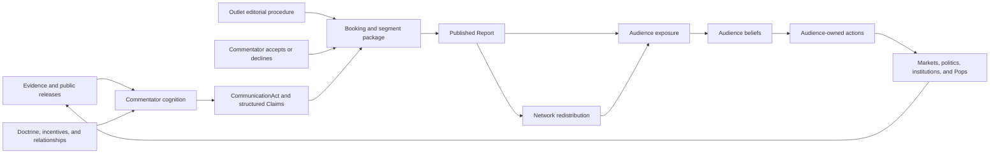
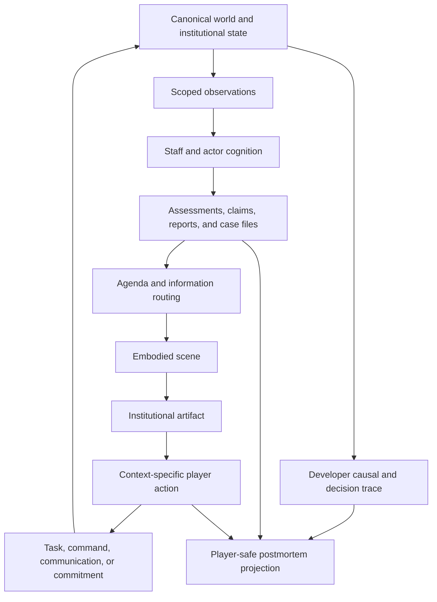

# 09-world-inventories-media-and-interface

- conceptual scope: Information and interface design with geographic, institutional, product, population, and external-world inventories
- contained artifacts: 25
- source omnibus: `humanlayer-omni.md`
- preservation: artifact headings, YAML metadata, and payload bytes below are preserved from the source omnibus; outer Markdown fence delimiters are reselected collision-safely for compact model ingestion.

## Artifact: `federal-reserve-chair-crisis-management-simulator/09-design-discussion-economist-pundit-media.md`

```yaml
source_task: federal-reserve-chair-crisis-management-simulator
relative_path: 09-design-discussion-economist-pundit-media.md
size_bytes: 21634
mode_octal: "0644"
modified_at_utc: 2026-09-04T14:31:08.279789Z
sha256: d1c28738ca627b2b654d51b16bdd880b65c5e9a8c82c65c196bede1077e7a032
media_type: text/markdown
content_encoding: UTF-8
newline_style: LF
original_ends_with_newline: true
```

~~~~markdown
---
task: federal-reserve-chair-crisis-management-simulator
type: design-discussion
repo: reservist
branch: not-applicable
sha: not-applicable
builds_on:
  - 04-design-discussion-minimum-simulation-kernel.md
  - 05-design-discussion-representation-bible.md
  - 06-design-discussion-representation-catalog.md
  - 08-research-simulator-foundations.md
---

# Economist-Pundit Media Circuit

### Summary of change request

Define how recurring economist-commentators, television bookings, public debates,
and satirical doctrine personae fit into Reservist's existing media and belief
architecture. The immediate examples are Adam Goose, Paul Slugman, and the
Ghost of Milton Friedman. None currently exists in the representation catalog.

This discussion keeps the existing causal compact intact: a public figure may
originate structured claims, an outlet may select and frame them, a network may
redistribute them, and audiences may revise beliefs and act. A personality,
segment, or rendered joke never changes inflation, markets, legitimacy, or
policy directly.

### Current State

- The information ecosystem has four cataloged outlets, three networks, and a
  few generic media role-holders, but no recurring economist-commentators.
- Public claims exist as lightly typed durable records. Their proposition and
  source survive, but the catalog has no dedicated claim inventory and no
  populated observation-surface records.
- AFTV and GNBC can receive candidate claims from HonkBox, but their path to
  audience exposure ends at an unresolved mass-public-belief destination.
- The architecture distinguishes a media company, its editorial outlet, an
  outlet office, and the person occupying that office. It does not yet specify
  how an unaffiliated guest is booked, accepts, appears, debates, or recurs.
- Species, portraits, names, and caricature are presentation metadata. They are
  deliberately unable to change cognition, action eligibility, or replay.
- No runtime or UI exists. These are catalog and causal-design decisions, not
  changes to an executable media system.

### Desired End State

- Recurring public economists have stable identities, beliefs, relationships,
  reputations, institutional affiliations, and bounded communication actions.
- One-off guests can appear without requiring a full named-person biography or
  silently acquiring the action set of a political principal.
- Booking, acceptance, preparation, recording, editorial selection,
  publication, correction, network diffusion, audience exposure, belief
  revision, and audience action remain separately witnessed stages.
- Public arguments use structured claims with subject, predicate, magnitude,
  horizon, modality, conditions, confidence, evidence, and omissions.
- Competing economists may interpret the same release differently because of
  distinct priors, models, incentives, evidence access, and source trust.
- Audience responses close the existing media graph through explicit Pop,
  institutional, political, and market channels rather than one mass-opinion
  modifier.
- A satirical doctrine persona such as the Ghost of Milton Friedman can appear
  in presentation without inventing a supernatural source of causal truth.
- The player encounters punditry mainly through the World wire, Morning book,
  and Communications desk, with source and provenance available on inspection.

### What we're not doing

- Treating economists as omniscient narrators or allowing their prose to set
  canonical economic outcomes.
- Giving every guest full named cognition, a personal balance sheet, or a
  general political action set.
- Making economists members of an outlet merely because an outlet books them.
- Converting fame, credentials, airtime, or audience size into legal authority.
- Creating a universal left-right ideology scalar or making doctrine determine
  every claim mechanically.
- Modeling a literal afterlife, supernatural intervention, or authoritative
  message from a dead economist.
- Choosing final dialogue, species assignments, portrait art, voice direction,
  audience coefficients, or a complete commentator roster.
- Designing a dedicated pundit-management game or final television UI.

### Proposed End State Architecture

The media circuit composes existing representation kinds rather than adding a
new `Pundit`, `Debate`, or `Ghost` kind:



The core ownership split is:

```text
Person
  owns private beliefs, memory, relationships, personal reputation,
  communication choices, and recurring identity

Affiliated institution or employer
  owns employment, research resources, official publications, and any
  institution-authorized claims

Outlet
  owns booking invitations, editorial slate, segment framing, publication,
  correction, audience targeting, and airtime capacity

Network
  owns non-discretionary redistribution, latency, repetition, and decay

Audience cognition or distributed response
  owns attention, interpretation, belief revision, and later action
```

An appearance should traverse a two-sided, witnessed lifecycle:

```text
outlet proposes booking
  -> guest receives scoped invitation
  -> guest accepts, declines, conditions, or delegates
  -> outlet allocates airtime and prepares segment
  -> participants prepare claims and disclosed evidence
  -> recording or live appearance occurs
  -> outlet selects, frames, edits, or withholds publication
  -> report is published to declared audience segments
  -> networks redistribute attributed fragments
  -> recipients attend, interpret, remember, ignore, or act
  -> corrections and rebuttals travel as new publications
```

Neither a booking nor a recording proves publication. Publication proves
exposure only for recipients reached by a delivery path. Exposure does not prove
attention, belief revision, agreement, or action.

The proposed structured records are:

```text
CommentatorProfile
  person_ref
  fidelity_tier
  institutional_affiliations[]
  declared_doctrine_refs[]
  topic_expertise_and_model_familiarity[]
  outlet_and_source_relationships[]
  audience_specific_reputation_refs[]
  communication_action_domains[]

BookingInvitation
  outlet_ref and responsible_editor_ref
  invited_person_ref
  topic and proposed_format
  intended_audiences[]
  timing, live_or_recorded, and exclusivity
  requested_claim_scope
  preparation_and_access_offered[]
  status and response

CommunicationAct
  speaker and authorizing_affiliation, if any
  venue and intended audiences
  claims[]
  disclosed_evidence[] and omissions[]
  tone, confidence, timing, and coordination status

Claim
  subject, predicate, magnitude_or_category
  horizon, modality, and conditions[]
  confidence and supporting_evidence_refs[]
  source and authorization status

Report
  outlet and responsible editorial role-holder
  source_communication_refs[]
  selected_claim_refs[]
  headline, framing, omissions, and counterclaims[]
  audience_targets[], publication_time, and correction_links[]
```

The Ghost of Milton Friedman can use the same circuit without becoming an
agent. The presented character is attached to a segment package; causal claims
retain a living or institutional source:

```text
legacy doctrine records and archived claims
  -> current host, producer, guest, or institution selects an interpretation
  -> structured current Claim identifies that accountable source
  -> outlet frames the segment as "The Ghost of Milton Friedman"
  -> audiences receive both the claim and its satirical presentation metadata
```

This preserves the distinction between what Friedman historically argued, what
a current character attributes to him, and what the outlet dramatizes.

### Design Questions

None. The questions in this discussion are resolved below. The general media
contracts remain valid, but commentator-specific implementation is outside the
first player-facing prototype defined by the master architecture's cut line.

### Resolved Design Questions

#### 1. Which fidelity tiers should economist-commentators use?

Should every recurring commentator be a fully named cognitive person, or should
the system reserve full cognition for the small number whose relationships and
cross-outlet continuity materially change the information environment?

- Option A: Make every named economist a `NAMED_COGNITION` person. This gives
  each one persistent beliefs, goals, memory, relationships, plans, and
  reputation, but creates substantial content and calibration obligations.
- Option B: Make every economist a `LIMITED_ROLE_HOLDER`. This bounds their
  state and action catalog, but weakens recurring rivalries, doctrine changes,
  private advising, and reputation across institutions and outlets.
- Option C: Use both tiers. Recurring consequential figures receive named
  cognition; one-off experts use a limited guest template with only topic
  beliefs, source trust, relationships, and communication dispositions.

**Chosen: Option C.** Adam Goose and Paul Slugman should qualify for named
cognition only if their recurring interpretations, relationships, or private
access affect later choices. Background guests should use the limited template.

#### 2. What can a commentator do outside public communication?

Should a named public economist have only communication actions, or can they
also advise officials, participate in coalitions, or shape institutional work?

- Option A: Restrict all commentator actions to public communication and outlet
  participation. This is simple but cannot represent a real advisory,
  employment, or political relationship.
- Option B: Give named commentators a general elite-access action set. This
  captures influence but risks turning every television economist into a policy
  principal with implausible bargaining power.
- Option C: Keep public communication as the default action domain and unlock
  private advising, institutional research, or coalition contributions only
  through explicit scenario relationships and offices.

**Chosen: Option C.** A title, booking, or large audience grants no private
access by itself. An adviser relationship can permit advice or evidence delivery
without creating legal authority or a policy command.

#### 3. How should the Ghost of Milton Friedman exist?

Is the Ghost a represented person, a doctrine record, or a presentation device?

- Option A: Create a supernatural named person who forms beliefs and issues
  claims. This offers comic flexibility but violates the material ownership and
  evidence model unless the setting explicitly admits supernatural causality.
- Option B: Treat the Ghost as a causally inert presentation persona for a
  segment built from doctrine records, archival claims, and a current speaker's
  interpretation.
- Option C: Represent a living impersonator or host as the person and the Ghost
  as their performed character. This works for a recurring theatrical role but
  changes the joke from institutional necromancy to impersonation.

**Chosen: Option B by default.** The host, producer, guest, or outlet owns
the current interpretation and publication. Option C remains available for a
specific recurring performer. Option A should require an explicit change to the
game's world premise rather than slipping through presentation content.

#### 4. Where should structured claims live in the catalog and runtime?

The master architecture treats `Claim` as a distinct information object, while
the current catalog stores three public claims as generic `Record` instances.
Which representation should become authoritative?

- Option A: Keep every claim as a `Record` subtype. This supplies stable identity
  and persistence but risks overloading the broad institutional-record schema
  with high-volume utterance fragments.
- Option B: Embed claims only inside `CommunicationAct` and `Report`. This keeps
  the data local but makes quotation, correction, rebuttal, diffusion, and
  cross-report provenance harder to reference.
- Option C: Give claims stable typed IDs in a dedicated claim registry, without
  adding a twenty-ninth representation kind. Durable communication acts and
  reports remain `Record` instances and reference the claims they contain.

**Chosen: Option C.** A claim needs stable provenance and revision links,
but it does not need independent cognition, authority, or conserved ownership.
Catalog tooling should validate claim subjects, sources, evidence references,
modalities, and report links separately from general entity identity.

#### 5. How should debates and panel segments resolve?

Should a debate be a scripted report, a sequence of autonomous communication
choices, or one scored editorial package?

- Option A: Author a complete debate as one report template. This gives strong
  prose but makes disagreement and adaptation cosmetic.
- Option B: Let participants freely exchange claims until a stopping rule. This
  maximizes emergence but creates unbounded deliberation, repetition, and
  authoring complexity.
- Option C: Use a bounded segment protocol. The outlet selects topic, format,
  participants, and turn budget; each participant chooses among eligible claim,
  rebuttal, concession, refusal, and clarification acts; the outlet then selects
  and frames the published report.

**Chosen: Option C.** The protocol should preserve participant agency and
editorial discretion while keeping the number of causal communication acts
small, inspectable, and deterministically replayable. The protocol is deferred
until a selected scenario needs a live debate; the first prototype uses one
authored report rather than implementing bookings or panel exchange.

#### 6. Which audience groups close the first media circuit?

The current AFTV and GNBC transmissions point to an unresolved mass-public
belief layer. What is the minimum useful audience resolution?

- Option A: One aggregate mass-public audience. This closes the graph cheaply
  but reproduces the global opinion modifier the architecture rejects.
- Option B: Fully route every publication through all person cells,
  institutions, and political actors. This preserves heterogeneity but is too
  broad for a first media mechanism.
- Option C: Define a small scenario-selected audience set with distinct action
  channels: market professionals, policy elites, attentive partisans, affected
  household Pops, and a low-attention public residual.

**Chosen: Option C.** Each audience entry should declare reach, attention,
source trust, interpretation distribution, memory, and the actions it can
actually produce. Scenario manifests omit audiences with no active channel. The
first prototype may use authored reactions for market professionals, policy
elites, and a low-attention public residual without claiming to validate the
eventual audience simulation.

#### 7. How much pundit content should the player manage directly?

Should commentator appearances become player-facing appointments, ambient World
wire content, or both?

- Option A: Keep all punditry ambient. This protects the Chair's bounded office
  but misses opportunities to grant interviews, answer criticism, or recruit a
  credible surrogate.
- Option B: Give the player a dedicated pundit-management screen. This makes the
  media layer legible but overstates the Chair's control over independent media.
- Option C: Default to ambient World wire and Morning book coverage. Surface a
  pundit as a Decision queue or Communications desk option only when a real
  access request, interview invitation, rebuttal decision, or relationship
  creates an actionable choice.

**Chosen: Option C.** The player should manage the Fed's response and access
decisions, not the pundit's bookings or conclusions.

### Patterns to follow

These patterns come from the settled architecture and the current catalog. They
govern any later commentator implementation without reopening the resolved media
decisions.

#### Keep event, evidence, claim, and report distinct

The information taxonomy in
`04-design-discussion-minimum-simulation-kernel.md:1842` separates an occurrence
from its observation, assertion, and editorial package.

```text
DomainEvent      immutable record that a modeled transition occurred
Observation      a source produces a measurement or percept
EvidenceDelivery a recipient receives an Observation or Claim
Claim            an agent asserts a stable typed proposition
Report           an outlet packages observations and claims for an audience
```

The pundit circuit should preserve the same shape:

```text
CPI publication -> economist receives evidence -> economist asserts claim
  -> GNBC packages claim and counterclaim -> audiences receive report
```

#### Compose people, offices, outlets, and operating companies

The catalog already distinguishes the parts of a media brand in
`06-design-discussion-representation-catalog.md:973`.

```text
Loonberg
  operating company                    -> Institution
  editorial organization              -> Outlet

HonkBox
  platform firm                        -> Institution
  ranking and diffusion                -> Network
  posting population                   -> PopLens over person cells
```

An economist guest adds a relationship rather than collapsing these subjects:

```text
commentator Person
  -> employed by or affiliated with Institution, if applicable
  -> invited by Outlet through BookingInvitation
  -> appears through CommunicationAct
  -> remains independent of the outlet's offices unless they actually hold one
```

#### Make publication change exposure before behavior

The resolved media design in
`04-design-discussion-minimum-simulation-kernel.md:2544` requires reports to
alter audience evidence and beliefs before any audience-owned action occurs.

```text
publication
  -> delivered exposure
  -> attention
  -> interpretation and belief revision
  -> goal or pressure change
  -> audience-owned action attempt
  -> execution and world effect
```

No report should emit `legitimacy -5`, `market confidence +3`, or
`household spending -2`.

#### Require a witness for every stage

The Burrow probe's owner-specific witness chain in
`07-design-discussion-burrow-composition-probe.md:471` applies directly to media.

```text
invitation witness      submitted booking request
acceptance witness      guest response
appearance witness      completed communication act
publication witness     outlet publication record
delivery witness        audience-scoped receipt
belief witness          recipient-owned revision with provenance
action witness          recipient-owned attempt and execution result
correction witness      new publication linked to the original
```

One witness may cause a later opportunity. It never proves the later stage.

#### Keep presentation metadata causally inert

The Representation Bible's animal-satire rules in
`05-design-discussion-representation-bible.md:843` separate authored caricature
from simulation identity and behavior.

```text
causal record
  person, beliefs, affiliations, claims, relationships, actions

presentation register
  display name, species, portrait, costume, voice, segment persona

rule
  presentation may render causal state
  causal systems may not read presentation metadata
```

The same rule allows Adam Goose, Paul Slugman, or a Ghost persona to be renamed,
redrawn, or recast without changing replay identity.

#### Use bounded narrative opportunities

The narrative opportunity flow in
`04-design-discussion-minimum-simulation-kernel.md:1806` already defines typed
hooks, gates, cooldowns, attention budgets, and deterministic selection.

```text
release, crisis development, public claim, or scheduled review
  -> nominate eligible commentator and segment templates
  -> check topic expertise, availability, access, and outlet slate
  -> apply cooldown, incompatibility, and airtime budget
  -> deterministic keyed selection
  -> issue booking invitation through ordinary action paths
```

This pattern should generate recurring commentary without allowing one loud
character to consume every information window or changing material outcomes
merely because a segment template fired.

#### Testing approach

Follow the architecture's invariant, scenario, replay, and empirical-verdict
layers rather than asserting one correct ideological interpretation.

```text
unit and schema checks
  claim grammar, source attribution, modality, correction links, access gates

scenario checks
  booking declined; live segment aired; edited segment withheld; correction
  reaches fewer recipients; rival economists update from the same release

negative invariants
  report cannot mutate material state
  presentation metadata cannot enter cognition
  airtime cannot confer authority
  exposure cannot count as belief or action

replay checks
  same seed and state produce identical booking, publication, delivery,
  interpretation draws, and witness order

multi-seed verdicts
  commentary sometimes changes salience and action, never always or never;
  no single pundit monopolizes airtime outside configured scenario conditions
```
~~~~

## Artifact: `federal-reserve-chair-crisis-management-simulator/10-design-discussion-epistemic-fairness-interface.md`

```yaml
source_task: federal-reserve-chair-crisis-management-simulator
relative_path: 10-design-discussion-epistemic-fairness-interface.md
size_bytes: 39605
mode_octal: "0644"
modified_at_utc: 2026-09-04T14:09:47.561398Z
sha256: 83efa180af3b9029513db6f79f325d613928504bbe545d72ba424c39e9d0b4b6
media_type: text/markdown
content_encoding: UTF-8
newline_style: LF
original_ends_with_newline: true
```

~~~~markdown
---
task: reservist-epistemic-fairness-and-player-interface
type: design-discussion
repo: reservist
branch: not-initialized
sha: not-applicable
builds_on:
  - 04-design-discussion-minimum-simulation-kernel.md
  - 05-design-discussion-representation-bible.md
  - 06-design-discussion-representation-catalog.md
  - 07-design-discussion-burrow-composition-probe.md
---

# Epistemic Fairness and Embodied Player Interface

### Summary of change request

Define how Reservist lets the player make defensible decisions under uncertainty
without revealing canonical world state or turning adverse outcomes into arbitrary
punishment. The interface must mediate an eventually very large simulation through
the Chair's office, staff, relationships, documents, meetings, calls, media, and
specialist views rather than exposing the Representation Catalog as a universal
entity browser.

The immediate product question is the shape of one playable day. The design must
show how matters arrive, how the player inspects and requests information, how
meetings bound available evidence and actions, how requests consume institutional
capacity, how documents accumulate, how time advances, and how a later postmortem
distinguishes poor reasoning from bad luck, bad institutional information, accepted
risk, and genuine unknowns.

This discussion does not replace the Treasury basis-trade unwind as the next causal
composition probe. It defines a parallel authored prototype for testing whether the
simulation's causal and epistemic architecture can become a playable information
experience before the full runtime exists.

### Current State

- Reservist has a large and growing representation vocabulary, but no player can
  reasonably browse or manage that vocabulary directly.
- The architecture already separates canonical state, scoped observations, private
  beliefs, staff assessments, claims, reports, case files, commitments, and player
  information. No executable interface realizes those distinctions.
- The player loop is defined as review, prioritize, delegate, prepare, decide,
  communicate, and observe. The institutional calendar is the primary action
  surface, with elastic time and crisis interruptions.
- The current information shell names a Decision queue, Morning book, Commitment
  watch, and World wire. These are functional surfaces, not yet a coherent embodied
  presentation.
- Requested analysis already has a causal home in `AnalyticalTask`, `Assessment`,
  staff capacity, access permissions, deadlines, displaced work, and delivery
  surfaces. The player-facing request grammar and arrival experience are undefined.
- Case files organize fallible institutional understanding without becoming crisis
  meters. The interface does not yet specify how case files remain accessible
  without becoming a generic notification center.
- The causal runtime requires decision traces, domain events, accounting witnesses,
  observation provenance, and deterministic replay. It does not yet define the
  player-safe postmortem projection over those developer records.
- Existing portraits and the working visual direction support a restrained
  first-person visual-novel treatment, but there is no frontend, design system,
  scene framework, navigation model, or visual test infrastructure.

### Desired End State

- Reservist presents the player as a physically and institutionally situated Chair,
  not as an omniscient operator of a world model.
- The building acts as compact information architecture: each recurring space
  implies a bounded class of evidence, people, actions, and obligations.
- A playable day alternates between authored agenda windows and simulation-driven
  interruptions while routine travel and routine work compress automatically.
- The Morning Book provides a bounded opening synthesis. New documents, requests,
  calls, and reports arrive through attributable institutional channels throughout
  the day.
- The player's stable verbs remain small: `Inspect`, `Ask`, `Assign`, `Convene`,
  `Propose`, `Communicate`, `Commit`, and `Advance`. Context determines their targets
  and consequences.
- Information requests become typed institutional work with a visible owner,
  expected delivery window, access limits, displaced work, and eventual artifact.
- Requested documents physically or visually accumulate in the Chair's inbox and
  remain retrievable. Overload is experienced as prioritization pressure, not as an
  invisible attention penalty or unreadable interface.
- The institutional archive exposes a bounded subject vocabulary across days. A
  player who recognizes a recurring topic such as coffee can open that subject and
  collate its appearances in briefings, calls, meetings, reports, and television.
- Meetings expose the documents, people, notes, and specialist views plausibly
  available in that scene. Preparation changes what can be asked and decided without
  turning memory or navigation into a punitive hidden-object test.
- The same simulated subject appears at the lowest presentation resolution that
  preserves the current decision: aggregate in one briefing, named in a crisis,
  and deeply inspectable only through a relevant specialist view.
- Uncertainty remains multidimensional and source-attributed. Measurement, model,
  strategic, institutional, aleatory, and reflexive uncertainty are not collapsed
  into one confidence bar.
- Consequential endogenous failures have a preexisting causal lineage. A player-safe
  postmortem can show one realized path, what was known, what could have been known,
  why information was missing, what remained disputed, and where chance entered.
- Repeated play teaches institutional geography, trustworthy sources by topic,
  controllable versus influenceable outcomes, useful preparation, and recurring
  mechanisms. It does not teach a fixed event chain or optimal build order.
- The chief of staff provides graduated institutional guidance. New players receive
  a competent agenda and legible reasons for its priorities; experienced players can
  increasingly override its routing as they learn how the Federal Reserve works.

### What we're not doing

- Exposing the Representation Catalog, canonical world state, private actor beliefs,
  or a truthful global causal graph during play.
- Making a world map, macro dashboard, trading terminal, or entity browser the
  default shell.
- Building a free-form observability query language or programmable predicate alarm
  system for the player.
- Making routine locomotion, pixel hunting, manual filing, or remembering hidden
  affordances the source of difficulty.
- Using a universal confidence bar, relationship meter, attention mana pool, or
  single score to summarize distinct causes and constraints.
- Guaranteeing that every reasonable decision succeeds or that every consequential
  outcome was predictable.
- Revealing all counterfactual outcomes, all latent state, or an omniscient moral
  verdict in the postmortem.
- Letting presentation salience promote an aggregate into a richer causal entity
  during a run.
- Selecting final room art, typography, animation tooling, frontend technology,
  dialogue volume, character roster, exact daily item count, or final numerical
  timing and capacity values in this discussion.
- Delaying the Treasury basis-trade composition probe. The embodied-interface
  prototype and the causal probe test different risks and should proceed as separate
  design tracks.

### Proposed End State Architecture

The player receives contextual projections of the simulation rather than a second
copy of simulation state:



`Scene` determines context, not truth. `Artifact` bounds the subject. `Action`
expresses the Chair's available intervention. Specialist views deepen one artifact
without becoming a permanent global dashboard.

```text
Embodied interface
  Office
    Morning Book
    physical inbox and outbox
    private calls and meetings
    television and World wire
    Commitment Book
  Briefing room
    staff presenter
    briefing deck
    supporting exhibits
    questions, challenges, and follow-up assignments
  FOMC room
    participant positions
    package and statement language
    negotiation, vote, dissent, and recess
  Operations room
    context-specific market and facility views
    execution status and operational constraints
  Press room
    structured claims, questions, and interpretation risk
  Hallway or transition
    bounded informal encounters and interruptions
```

The building is a small set of cognitively distinct scene families. It need not be
architecturally faithful or continuously traversable. A room can be a reusable
background, a foreground surface, a participant arrangement, and a set of available
artifacts and verbs.

#### One playable day

The target day combines an agenda spine with interruptions generated from the same
institutional routing rules:

```text
ARRIVE
  office establishes date, obligations, and current setting

OPEN
  chief of staff delivers Morning Book and proposed agenda
  player scans required decisions, changed evidence, and active commitments

PREPARE
  inspect selected exhibits
  request bounded follow-up
  carry or circulate materials
  revise meetings, delegations, and protected preparation time

MEET
  enter one bounded scene with brought materials and present participants
  inspect, ask, challenge, negotiate, defer, or decide

INTERRUPT
  receive only interruptions that cross the configured escalation threshold
  accept, delegate, defer, route into a later scene, or revise the agenda

ACT
  issue a command, make a commitment, communicate, or authorize the next stage

OBSERVE
  receive execution status, market/public reaction, new evidence, or no answer yet

CLOSE
  review unresolved decisions, new tasks, arrived documents, active commitments,
  and tomorrow's inherited agenda; then advance through compressible time
```

The order is a default rhythm rather than a fixed daily script. A quiet day may
compress after `OPEN`. An FOMC day may spend most of its foreground time in `MEET`.
An acute crisis may cycle repeatedly through `INTERRUPT`, `MEET`, `ACT`, and
`OBSERVE` before reaching `CLOSE`.

Foregrounding uses a consequence ladder rather than treating every simulation
change as an event card:

```text
ambient visual state
  establishes continuity, pressure, and institutional texture

micro interaction
  permits inspection, acknowledgment, a question, or a minor relationship response

minor event
  changes a task, record, schedule, belief, or local opportunity

major event
  changes several actors, commitments, or institutional processes

key decision scene
  requires bounded player judgment with material downstream exposure

core mechanical transition
  changes broad markets, institutions, populations, authority, or the policy regime
```

Each rung may nominate content above it only through typed salience and escalation
rules. Minutiae earns foreground time when it teaches an institutional pattern,
reveals character, supplies evidence, changes preparation, foreshadows a mechanism,
or creates a bounded decision. It should not ask the player to perform routine office
work merely because that work exists in the simulation.

#### Artifact and request lifecycle

Information requests should reuse the architecture's existing task and record
boundaries:

```text
player asks a bounded question
  -> request resolves to an AnalyticalTask template
  -> responsible unit estimates access, scope, confidence, and delivery
  -> assignment reserves staff capacity and identifies displaced work
  -> unit gathers available evidence and applies its methods
  -> Assessment is authored with support, contrary evidence, gaps, and dissent
  -> a memo, deck, call, or oral briefing is delivered into a scene
  -> the physical inbox and case file retain the delivered artifact
  -> later evidence may revise or discredit the Assessment
```

The player request is not a query against canonical state. Staff can return partial
work, a refusal, a delay, conflicting products, or an honest statement that the
question is not presently answerable.

```text
InformationRequest
  requester and scene
  question_template and bound subject refs
  requested_horizon and comparison
  requested_delivery_surface
  urgency and deadline
  candidate_staff_units[]
  access_requirements[]
  expected_displaced_work[]
  accepted_scope
  status and delivery_estimate
  resulting_task_and_record_refs[]
```

The interface may render that state as a sentence rather than a form:

```text
Ask Markets to compare current dealer inventories with the last four refundings.
Expected: before tomorrow's 08:30 briefing.
Tradeoff: delays the foreign-demand appendix.
```

Competent institutional synthesis is the default. The Chair does not inspect every
upstream source, attend every internal board meeting, or discover every relevant
external condition personally. Staff flatten those details into decision-relevant
claims while retaining provenance and a path to deeper support. A Sahel weather
report may never become directly inspectable; a resulting commodity-market
restriction should still appear in the appropriate briefing when it enters a modeled
Fed-facing channel. Abstraction may remove a scene or source document from play, but
it may not remove a material transmission from institutional synthesis.

#### Contextual resolution

Presentation resolution changes without changing causal fidelity:

```text
Morning Book
  "leveraged funds increased Treasury-basis exposure"

Supporting slide
  three strategy cohorts, aggregate financing and margin conditions

Crisis briefing
  one already represented fund becomes decision-relevant by stable reference

Specialist view
  known positions, counterparties, collateral paths, and evidence gaps for that fund
```

The projection chooses the lowest useful resolution according to current decision
relevance, observed concentration, attribution needs, available evidence, and the
scene's scope. It cannot invent a named actor, private history, bilateral exposure,
or richer causal state that the scenario manifest did not initialize.

```text
PresentationProjection
  source_record_refs[]
  scene_and_artifact_scope
  subject_grouping_key
  selected_resolution
  decision_relevance_reasons[]
  known_attribution_limits[]
  drill_down_paths[]
  omitted_detail_classes[]
```

#### Uncertainty presentation

Uncertainty should attach to claims and supporting evidence, not float as an
undifferentiated property of the screen.

| Uncertainty | Player-facing expression | Strategic implication |
|---|---|---|
| Measurement | Estimate range, stale mark, sample coverage, revision warning | Better measurement or later data may reduce it |
| Model | Competing forecasts, sensitivity to assumptions, staff dissent | Another competent model may change the recommendation |
| Strategic | Source incentives, disclosure limits, suspected adaptation | Asking the same actor again may not reveal truth |
| Institutional | Missing access, unassigned work, crowded-out analysis | Routing, staffing, or authority may reduce the blind spot |
| Aleatory | Scenario range or residual risk after available analysis | More information may not resolve the decision |
| Reflexive | Warning that policy or disclosure changes the forecasted behavior | The act of learning or acting can invalidate the estimate |

The UI should use prose, provenance, comparison, dissent, and visual treatment to
teach these differences through repeated encounters. A compact label may support
inspection, but the taxonomy should not become six decorative bars.

#### Scene-bounded information

Each decision window captures a player-safe context bundle:

```text
SceneContext
  location and simulation time
  agenda_item and decision_deadline
  present_people_and_roles[]
  brought_artifacts[]
  room_accessible_records[]
  player_notes[]
  callable_or_requestable_staff[]
  available_specialist_views[]
  available_player_verbs[]
  interruption_policy
```

The player may inspect any already delivered item without spending Leash or staff
capacity. Getting a missing answer can consume meeting time, require a recess,
create a new task, expose uncertainty to other participants, or miss the current
deadline. The cost belongs to the institutional action, not to clicking or reading.

The Federal Reserve's record keeping provides continuity across scenes and days:

```text
ArchiveIndex
  controlled_subject_terms[]
  aliases_and_display_labels[]
  linked_artifact_refs[]
  appearances_by_time_and_surface[]
  related_people_institutions_cases_and_commitments[]
  source_and_access_scope[]
```

For example, selecting `coffee` may collate a Morning Book bullet, Tuesday's
television report, Wednesday's governor call, the supporting commodity chart, and
the case file that linked them. Search returns only records delivered to or lawfully
available through the Chair's institution. It does not become a back door into the
Representation Catalog or canonical state.

#### Causal lineage and postmortem

The developer trace must remain more complete than the player-facing explanation:

```text
Developer lineage
  canonical precursor state
  relevant actor beliefs and plans
  keyed random draws
  commands, authorizations, action results, and commitments
  market, accounting, legal, operational, and settlement witnesses
  intermediate transmissions and domain events
  all observation production and delivery decisions

Player-safe postmortem
  realized causal path at the useful mechanism level
  evidence the Chair received before each decision
  evidence reasonably requestable before the deadline
  unavailable evidence and attributable reason
  staff recommendations, disagreement, and assumptions
  recognized and accepted risks
  stochastic or reflexive branches on the realized path
  unresolved attribution and credible rival interpretations
```

Every link in the player-safe path receives an epistemic classification relative to
the decision time:

```text
VISIBLE
WEAKLY_SIGNALED
MODEL_DISPUTED
STRATEGICALLY_CONCEALED
INSTITUTIONALLY_UNAVAILABLE
CROWDED_OUT
OUTSIDE_OBSERVATION
ALEATORY_REALIZATION
REFLEXIVELY_CHANGED
```

These labels describe the Chair's information position, not the moral quality of the
choice. The postmortem should not reveal unrelated canonical state or every unrealized
counterfactual. Its fairness purpose is to show that the realized mechanism existed
before the outcome and to explain the information boundary around it.

The core contract is:

> Reservist may surprise the player about facts, magnitude, timing, actor responses,
> and interactions. It may not surprise the player with a new causal vocabulary.

#### Authored information-architecture prototype

The first interface prototype can use a fixed causal tape rather than the final
simulation:

```text
Treasury conditions prototype
  morning folder
    reassuring top-line liquidity assessment
    weak dealer-capacity signal in supporting evidence
  governor encounter
    competing concern about policy interpretation
  staff deck
    clickable bullets and one model disagreement
  player request
    one follow-up with a delayed physical deliverable
  television segment
    public interpretation that is informative about salience, not truth
  decision
    incomplete evidence and more than one defensible option
  consequence
    fixed pre-authored basis-trade transmission path
  postmortem
    decision-time evidence, unavailable information, accepted risk, and realized path
```

The authored tape must be fixed before playtest choices are collected. A choice can
select among pre-authored interventions and information routes, but the prototype
must not invent a new vulnerability after the decision to manufacture drama.

### Design Questions

None. All questions raised in this discussion have been resolved through review.

### Resolved Design Questions

#### 1. Use a chief-proposed elastic agenda as graduated institutional guidance

**Chosen: Option C.** Mandatory obligations and a reasonable default day arrive
already assembled by the chief of staff. The player may inspect, reorder, delegate,
defer, protect preparation time, or reserve contingency space. Interruptions revise
the day through the same agenda rules rather than through a separate crisis UI.

The chief of staff is the principal anti-overload interface for new players. Their
recommendations explain why matters deserve attention and gradually expose the
Federal Reserve's people, procedures, information sources, and limits of control.
Reservist is not an educational game, but learning the institution should be an
ordinary consequence of play. Experienced players express mastery by selectively
overriding routing and preparation rather than constructing every schedule from
scratch.

A fixed authored scene order was rejected because it weakens preparation,
delegation, interruption, and institutional control. A fully free calendar was
rejected because it asks novices to understand the institution before play has
taught it and risks turning Reservist into a scheduling application.

#### 2. Separate mandatory decisions, graded foreground events, and the archive

**Chosen: Option C.** Known deadlines and required authorizations always surface.
Other eligible material passes through source-specific escalation, scene and topic
attention budgets, bundling, and cooldowns. Material that does not enter the
foreground continues to exist in a persistent, attributable archive and may remain
available through staff routing, case files, topic bundles, and the physical backlog.

Foreground presentation follows a consequence ladder from ambient visual state and
micro interactions through minor events, major events, key decision scenes, and core
mechanical transitions. Higher rungs may affect progressively broader actors and
systems. Lower-rung minutiae earns attention when it teaches an institutional
pattern, develops a recurring actor, supplies or contextualizes evidence, changes
preparation, foreshadows a mechanism, or creates a bounded choice. It does not become
player labor merely because the simulated institution generated it.

A hard daily cap was rejected because it can hide a required decision or make an
arbitrary cutoff causal. Sending every eligible item to the inbox was rejected
because it converts simulation scale directly into clerical workload. The foreground
budget governs presentation rather than existence or causal importance.

#### 3. Make the Morning Book a bounded product of competent institutional synthesis

**Chosen: Option C.** The Morning Book contains mandatory decisions, material changes
to active cases and commitments, newly escalated matters, and an explicit account of
what categories were routed elsewhere. Unprioritized public events remain in the
World wire. Delivered source documents remain in the inbox and linked records.

The player receives the Federal Reserve's decision-relevant projection of the world,
not universal access to every upstream observation or institutional scene. Staff are
assumed competent enough to carry material developments across abstraction
boundaries. The player need not inspect weather reports in the Sahel or personally
attend every internal meeting, but a commodity restriction produced through those
systems must become a briefing bullet when it materially affects an active Fed-facing
channel. The bullet retains its source, uncertainty, transmission hypothesis, and a
path to whatever supporting material the institution actually possesses.

A comprehensive overnight digest was rejected because it recreates the universal
dashboard on paper. A priority-only book with no routing account was rejected because
it obscures whether an issue was undetected, detected but not escalated, summarized
elsewhere, or judged immaterial. Institutional flattening may compress presentation;
it may not erase a material transmission from the staff synthesis merely because the
player cannot visit its source context directly.

#### 4. Use contextual request templates backed by typed institutional work

**Chosen: Option C.** Information requests begin from the current artifact, subject,
or scene and offer bounded modifiers such as source detail, historical comparison,
alternative assumptions, dissent, another office's view, accelerated delivery,
monitoring, or a meeting. The interface may render the resulting action as natural
conversation, but the authoritative request is a typed `AnalyticalTask`, monitoring
obligation, meeting request, or other institutional action with a responsible owner,
access requirements, deadline, displaced work, and witnessed result.

Free-text requests interpreted by an LLM were rejected because they are difficult to
authorize, cost, test, replay, and map to real evidence access. Programmable watch
conditions were rejected because they expose too much ontology and turn Reservist
into an observability-configuration game. The contextual grammar keeps the player's
verbs small while permitting strategically different questions about the same
briefing item.

#### 5. Make over-requesting create immediate, visible institutional deficits

**Chosen: Option C.** Tasks reserve specific staff capacity, compete for access and
deadlines, identify displaced work, and accumulate as pending or delivered artifacts.
The chief of staff warns when the proposed day or task portfolio is overloaded and
requires the player to narrow, defer, or delegate work. The player may refuse and
proceed anyway, but shortages begin affecting other assignments immediately rather
than waiting for a hidden threshold: deadlines slip, preparation narrows, staff enter
meetings without completed work, interruptions increase, and unrelated obligations
lose coverage.

This resembles undertaking a major commitment without the resources to support it:
the action remains available, but the institution starts running deficits elsewhere.
Staff may negotiate scope, return partial work, miss a deadline, or bring the conflict
back to the Chair. A generic attention currency was rejected because it duplicates
calendar, staff, access, and Leash. Hidden quality penalties were rejected because
the player could not connect the resulting failure to its institutional cause.

#### 6. Bound meeting access while preserving a searchable institutional archive

**Chosen: Option C.** Brought artifacts, notes, the current presentation, and people
in the room are immediately available. Before entering, the game clearly previews
the packet, participants, deadline, and available specialist views. During the
meeting, the player may ask an aide to retrieve an already known record, call an
available staff member, or request a recess for missing analysis when procedure and
time permit. Those actions impose time and social consequences rather than a memory
test.

The Fed's archive uses an explicit controlled subject vocabulary to collate delivered
records across days and surfaces. Selecting a recognized subject such as `coffee`
can show that it appeared in a Morning Book, a television report, and a governor call,
with links to the records the Chair may access. This search vocabulary is a player
index over institutional records, not the simulation ontology and not an omniscient
entity browser.

Full archive access without scene cost was rejected because it makes preparation and
setting cosmetic. Strict brought-item-only access was rejected because it punishes
memory and filing behavior rather than policy judgment.

#### 7. Resurface obligations through typed monitoring and chief-of-staff routing

**Chosen: Option C.** Monitoring obligations attach to commitments, case files,
tasks, and public schedules. The chief of staff routes due reviews into the proposed
agenda, Morning Book, meeting packet, or interruption queue according to standing
doctrine and current priority. Asking to revisit a subject selects a bounded
institutional monitoring template rather than an arbitrary condition over hidden
variables.

If the player overloads a future day, the chief requires an explicit narrowing,
deferral, or delegation choice. The player can insist on the overloaded agenda, but
the resulting staffing and preparation deficits are immediate and attributable.
Automatic global notifications were rejected because they flatten every obligation
into one alert channel. Arbitrary player reminders were rejected because they
recreate the programmable-alarm system through another interface.

#### 8. Use visual-novel vignettes and direct scene shortcuts, not traversal

**Chosen: a stronger form of Option C.** The building is represented as a set of
first-person visual-novel vignettes rather than a continuously traversable space.
Known rooms and recurring surfaces can be opened directly through stable keyboard
shortcuts, function-key-style controls, visible scene tabs, or contextual doors.
Short transitions establish place when useful; hallway movement appears only as a
specific encounter or authored interruption, not as locomotion between interfaces.

Continuous walking was rejected because repeated traversal creates labor with no
institutional decision. A wholly non-spatial screen menu was rejected because rooms,
rituals, and recurring compositions help players remember where information and
authority live. Vignettes retain that memory without requiring a movement system.

#### 9. Open specialist views from context and retain them with their source record

**Chosen: Option C.** Specialist views become available through a current artifact,
knowledgeable participant, or prepared scene. A yield curve opens from a deck bullet,
market report, or operations conversation rather than from an omnipresent global
dashboard. Once delivered or taught, the view remains reopenable from the relevant
archive or case-file record at its original information timestamp and access scope.

Global specialist access was rejected because it recreates the macro dashboard the
embodied interface is meant to avoid. Room-only access was rejected because it makes
repeat travel an arbitrary tax after the institution has already delivered the view.

#### 10. Represent relationships with typed history and legible role traits

**Chosen: Option C, with compact player-facing traits.** Canonical relationship state
and actor-specific beliefs track access, candor, reliability by subject, expected
follow-through, professional respect, grievance, confidentiality, and coalition
history only where they affect a channel. The interface summarizes stable, known
features with concise CK-like role traits and remembered incidents so the player does
not need to memorize an organization chart before understanding a recurring actor.

Traits describe known institutional behavior or role, such as `Markets specialist`,
`Habitual dissenter`, `Guards supervisory access`, or `Reliable on vote counts`.
They remain source- and context-bound, may be incomplete or revised, and do not
collapse into a universal competence, loyalty, or friendship score. Pure narrative
characterization was rejected because relationships must affect access and action.
One affinity meter was rejected because trust, expertise, authority, candor, and
alignment are not interchangeable.

#### 11. Deliver player postmortems as ordinary staff work

**Chosen: Option C, routed through the institutional record system.** The developer
trace preserves the full causal lineage continuously. The player receives no magical
causal reveal. A postmortem is an `AnalyticalTask` and resulting staff `Assessment`
or linked report, requested or triggered after a consequential outcome and delivered
through the same memo, briefing, meeting, archive, access, dissent, revision, and
capacity rules as other institutional work.

Staff can include only evidence and retrospective links available through later
observations, investigations, hearings, disclosures, and authorized records. A rapid
initial review may be partial; later reports may revise it or preserve disagreement.
Immediate omniscient revelation was rejected because it leaks facts and teaches event
scripts. End-of-term-only explanation was rejected because an apparently arbitrary
outcome may remain uninterpretable for too long.

#### 12. Test whether players can explain their information position and transfer a lesson

**Chosen: Option C.** After seeing the consequence and receiving the staff
postmortem, players should be able to explain what they knew, what additional
information was realistically obtainable, why important information was absent or
disputed, what the Chair could actually control, and one institutional habit they
would change on another run. Crisis prevention, completion time, overload, and click
errors remain supporting observations rather than the verdict.

The playtest succeeds when players can distinguish a bad decision from bad luck, bad
institutional information, accepted risk, or a genuine unknown and can name a lesson
that transfers beyond the authored crisis. This criterion evaluates the information
architecture; it does not grade the player or require a good policy outcome.

Using crisis prevention as the primary verdict was rejected because guessing or
memorizing the authored answer can produce success without understanding. Using
speed and document completion as the verdict was rejected because those measures
diagnose interface friction but do not establish epistemic fairness or comprehension
of the Chair's authority.

### Patterns to follow

These patterns come from the settled design artifacts. Reservist has no player UI
implementation to copy, so the examples are architectural contracts rather than
frontend conventions.

#### Keep canonical state, institutional interpretation, and player knowledge separate

The parent architecture defines the governing information boundary in
`04-design-discussion-minimum-simulation-kernel.md:186`.

```text
canonical world state
  -> scoped observations
  -> person and staff cognition
  -> assessments, claims, reports, and case files
  -> agenda routing and player delivery
```

The embodied interface must consume the last layer. A room, portrait, chart, folder,
or dialogue line may render a delivered record but may not read canonical state to
make itself more helpful.

#### Reuse institutional work instead of inventing UI queries

The analytical-task and assessment shapes in
`04-design-discussion-minimum-simulation-kernel.md:1457` already carry the state a
request interface needs.

```text
AnalyticalTask
  question
  requester and assigned unit
  access permissions
  deadline and requested confidence
  displaced work

Assessment
  conclusion distribution
  supporting and contrary evidence
  assumptions and stale inputs
  dissent, confidence, and expected next information
```

A player request should create or revise this work. It should not become a privileged
database query with an arbitrary latency animation.

#### Use case files as fallible organizers

The case-file rule in `04-design-discussion-minimum-simulation-kernel.md:1783` keeps
attention state separate from crisis truth.

```text
CaseFile awareness
  UNTRACKED | NOTICED | ASSESSED | WATCHING | ACTIVE |
  DEPRIORITIZED | CLOSED

awareness describes institutional posture
awareness does not describe canonical crisis severity
```

The inbox, Morning Book, meeting packets, and Commitment Book should link to case
files without showing case status as a truthful danger meter.

#### Preserve stage-specific witnesses

The Burrow probe records the pattern in
`07-design-discussion-burrow-composition-probe.md:306`.

```text
request witness         accepted task or refusal
assignment witness      staff and capacity reservation
delivery witness        memo, deck, call, or oral briefing receipt
read witness            player inspected the delivered artifact
decision witness        command, communication, or commitment
execution witness       responsible operator's action result
outcome witness         accounting, market, legal, or settlement transition
```

The postmortem can then distinguish information that existed, information that was
delivered, information the player inspected, and information that never became
available. One stage never proves another.

#### Keep presentation resolution separate from causal resolution

The Representation Bible fixes causal resolution before the run in
`05-design-discussion-representation-bible.md:758`, and the Catalog provides stable
identity and fallback contracts in
`06-design-discussion-representation-catalog.md:74`.

```text
scenario initialization
  fixes represented subjects, fidelity tiers, fallbacks, and residuals

runtime presentation
  groups, foregrounds, names, or drills into those subjects
  never invents accounts, beliefs, relationships, or history
```

Contextual entity resolution in the UI must be a projection over catalog-backed
references, not runtime promotion.

#### Route narrative opportunities through attention budgets

The narrative-load pattern in
`04-design-discussion-minimum-simulation-kernel.md:1806` already separates candidate
events from player-facing foreground items.

```text
domain event, claim, or scheduled review
  -> typed candidate templates
  -> eligibility and access gates
  -> topic cooldown and attention budget
  -> deterministic selection
  -> queued report, meeting, call, or decision item
```

This should govern interruptions, hallway encounters, television segments, and
ambient reports. A selected scene may affect later state through ordinary actions;
selection alone may not change material outcomes.

#### Test explanation, not only outcomes

The architecture's invariant, scenario, replay, and empirical-verdict layers in
`04-design-discussion-minimum-simulation-kernel.md:2485` apply to the interface
prototype as follows:

```text
content fixture checks
  vulnerability and transmission path exist before the player decision
  every surfaced item has a source, timestamp, and delivery reason

interaction checks
  every affordance is discoverable
  critical text remains readable
  scene entry previews available materials and deadlines

epistemic checks
  players distinguish known, disputed, unavailable, and stochastic links
  players can identify a useful unrequested question after the fact

negative invariants
  unreadable UI never causes a modeled failure
  postmortem never invents a missing precursor
  presentation never leaks unrelated canonical state

replay and comparison
  the authored causal tape stays fixed across interface variants
  compare folder, dashboard, office, deck-driven, and hybrid presentations
```

The prototype should record both player interpretation and trace evidence. A player
claim that the outcome felt arbitrary is a diagnostic input to classify against
missing precursor, missing representation, failed routing, unreadable presentation,
or consciously accepted risk.
~~~~

## Artifact: `federal-reserve-chair-crisis-management-simulator/catalog/inventory/arabian_peninsula/entities.csv`

```yaml
source_task: federal-reserve-chair-crisis-management-simulator
relative_path: catalog/inventory/arabian_peninsula/entities.csv
size_bytes: 3957
mode_octal: "0644"
modified_at_utc: 2026-09-04T04:03:06.734585Z
sha256: e83de2b22e04196a630ac35094f6a43c298b7e0efc39c2e6bf261b6d198147a6
media_type: text/csv
content_encoding: UTF-8
newline_style: LF
original_ends_with_newline: true
```

````csv
catalog_id,display_name,entry_class,instance_of,identity_clade,domain,selectable_in_manifest,definition_version,cognition_class,default_fidelity,research_status,completeness_state,fit,fallback_entry_id,residual_counterpart_id,uncertainty_notes,provenance
adapter.export.arabian_peninsula.petroleum,Arabian Peninsula petroleum export adapter,instance,type.adapter.resource_boundary,BoundaryAdapter,physical_products,false,1,none,MECHANICAL_OR_ADAPTER,typed,typed,fits,UNKNOWN,NONE,Custody title loss delay and capacity outputs require definition.,user-request:strategic-resource-regions
adapter.process.arabian_peninsula.resources,Arabian Peninsula resource process adapter,instance,type.adapter.resource_boundary,BoundaryAdapter,physical_products,false,1,none,MECHANICAL_OR_ADAPTER,typed,typed,fits,UNKNOWN,NONE,Preserved process outputs require definition.,user-request:strategic-resource-regions
adapter.sector.arabian_peninsula.gas,Arabian Peninsula gas sector adapter,instance,type.adapter.resource_boundary,BoundaryAdapter,physical_products,false,1,none,MECHANICAL_OR_ADAPTER,typed,typed,fits,UNKNOWN,NONE,External accounts and output parity require definition.,user-request:strategic-resource-regions
adapter.sector.arabian_peninsula.petroleum,Arabian Peninsula petroleum sector adapter,instance,type.adapter.resource_boundary,BoundaryAdapter,physical_products,false,1,none,MECHANICAL_OR_ADAPTER,typed,typed,fits,UNKNOWN,NONE,External accounts and output parity require definition.,user-request:strategic-resource-regions
adapter.water.arabian_peninsula,Arabian Peninsula water-system adapter,instance,type.adapter.resource_boundary,BoundaryAdapter,physical_products,false,1,none,MECHANICAL_OR_ADAPTER,typed,typed,fits,UNKNOWN,NONE,Water availability energy demand and allocation outputs require definition.,user-request:strategic-resource-regions
industry.arabian_peninsula.gas,Arabian Peninsula gas production,instance,type.industry.resource_production,IndustryCohort,physical_products,false,1,cohort_response,ORGANIZATION_COHORT_RESPONSE,named,identity_only,fits,UNKNOWN,NONE,Country and firm allocation LNG capability and residual shares UNKNOWN.,user-request:strategic-resource-regions
industry.arabian_peninsula.petroleum,Arabian Peninsula petroleum production,instance,type.industry.resource_production,IndustryCohort,physical_products,false,1,cohort_response,ORGANIZATION_COHORT_RESPONSE,named,identity_only,fits,UNKNOWN,NONE,Named firms institutions rights capacity inventories and residual shares UNKNOWN.,05-design-discussion-representation-bible.md:665-667
mechanism.export.arabian_peninsula.petroleum,Arabian Peninsula petroleum export handling,instance,type.mechanical.resource_operation,MechanicalSystem,physical_products,false,1,none,MECHANICAL_OR_ADAPTER,named,identity_only,fits,UNKNOWN,NONE,Ports pipelines storage custody title and capacity topology UNKNOWN.,05-design-discussion-representation-bible.md:286
mechanism.water.arabian_peninsula,Arabian Peninsula water and desalination systems,instance,type.mechanical.resource_operation,MechanicalSystem,physical_products,false,1,none,MECHANICAL_OR_ADAPTER,named,identity_only,fits,UNKNOWN,NONE,Operators energy inputs capacities and allocation queues UNKNOWN.,user-request:strategic-resource-regions
process.resources.arabian_peninsula,Arabian Peninsula resource conditions,instance,type.process.regional_resource_system,StatefulExternalProcess,physical_products,false,1,none,MECHANICAL_OR_ADAPTER,named,identity_only,fits,UNKNOWN,NONE,Exact subsurface stocks water conditions and process partition UNKNOWN.,05-design-discussion-representation-bible.md:665-667
region.me.arabian_peninsula,Arabian Peninsula,instance,type.region.resource_macroregion,Region,physical_products,false,1,none,MECHANICAL_OR_ADAPTER,typed,typed,fits,UNKNOWN,NONE,Boundary version and exact sovereign overlap geometry UNKNOWN; scope owns no resources or inventories.,user-request:strategic-resource-regions
````

## Artifact: `federal-reserve-chair-crisis-management-simulator/catalog/inventory/caucasus/entities.csv`

```yaml
source_task: federal-reserve-chair-crisis-management-simulator
relative_path: catalog/inventory/caucasus/entities.csv
size_bytes: 4131
mode_octal: "0644"
modified_at_utc: 2026-09-04T04:03:06.734817Z
sha256: a9dc4d6c14015d09e08ba7c97cee06c2f5e683f775ee98ce867d26eb54e3ed37
media_type: text/csv
content_encoding: UTF-8
newline_style: LF
original_ends_with_newline: true
```

````csv
catalog_id,display_name,entry_class,instance_of,identity_clade,domain,selectable_in_manifest,definition_version,cognition_class,default_fidelity,research_status,completeness_state,fit,fallback_entry_id,residual_counterpart_id,uncertainty_notes,provenance
adapter.hydropower.caucasus,Caucasus hydropower adapter,instance,type.adapter.resource_boundary,BoundaryAdapter,physical_products,false,1,none,MECHANICAL_OR_ADAPTER,typed,typed,fits,UNKNOWN,NONE,Hydrology generation grid and delivery outputs require definition.,user-request:strategic-resource-regions
adapter.process.caucasus.resources,Caucasus resource process adapter,instance,type.adapter.resource_boundary,BoundaryAdapter,physical_products,false,1,none,MECHANICAL_OR_ADAPTER,typed,typed,fits,UNKNOWN,NONE,Process output parity requires definition.,user-request:strategic-resource-regions
adapter.sector.caucasus.petroleum,Caucasus petroleum sector adapter,instance,type.adapter.resource_boundary,BoundaryAdapter,physical_products,false,1,none,MECHANICAL_OR_ADAPTER,typed,typed,fits,UNKNOWN,NONE,External source accounts and CRUDE_OIL output parity require definition.,user-request:strategic-resource-regions
adapter.transit.caucasus.energy,Caucasus energy transit adapter,instance,type.adapter.resource_boundary,BoundaryAdapter,physical_products,false,1,none,MECHANICAL_OR_ADAPTER,typed,typed,fits,UNKNOWN,NONE,CRUDE_OIL and NATURAL_GAS custody title delay loss and capacity outputs require definition.,user-request:strategic-resource-regions
industry.caucasus.petroleum,Caucasus petroleum production,instance,type.industry.resource_production,IndustryCohort,physical_products,false,1,cohort_response,ORGANIZATION_COHORT_RESPONSE,named,identity_only,fits,UNKNOWN,NONE,Country firm field rights capacity inventories and residual shares UNKNOWN.,user-request:strategic-resource-regions
mechanism.hydropower.caucasus,Caucasus hydropower and electricity systems,instance,type.mechanical.resource_operation,MechanicalSystem,physical_products,false,1,none,MECHANICAL_OR_ADAPTER,named,identity_only,fits,UNKNOWN,NONE,Operators reservoirs grid links dispatch and delivery ownership UNKNOWN.,04-design-discussion-minimum-simulation-kernel.md:932
mechanism.transit.caucasus.energy,Caucasus energy transit corridors,instance,type.mechanical.resource_operation,MechanicalSystem,physical_products,false,1,none,MECHANICAL_OR_ADAPTER,named,identity_only,fits,UNKNOWN,NONE,Pipeline rail road port operators title custody capacity routes and losses UNKNOWN.,05-design-discussion-representation-bible.md:286
process.resources.caucasus,Caucasus resource and hydrology conditions,instance,type.process.regional_resource_system,StatefulExternalProcess,physical_products,false,1,none,MECHANICAL_OR_ADAPTER,named,identity_only,fits,UNKNOWN,NONE,Resource stocks hydrology hazards and jurisdiction partition UNKNOWN.,user-request:strategic-resource-regions
region.eurasia.caucasus,Caucasus,instance,type.region.resource_macroregion,Region,physical_products,false,1,none,MECHANICAL_OR_ADAPTER,typed,typed,fits,UNKNOWN,NONE,Boundary version North/South partition and disputed jurisdiction relationships UNKNOWN; scope owns no resources or transit assets.,user-request:strategic-resource-regions
sovereign.armenia,Armenia,instance,type.sovereign_system.default,SovereignSystem,sovereign_regional,false,1,none,MECHANICAL_OR_ADAPTER,named,identity_only,fits,UNKNOWN,NONE,Composition root only; institutions firms and mechanisms retain ownership and action.,user-request:strategic-resource-regions
sovereign.azerbaijan,Azerbaijan,instance,type.sovereign_system.default,SovereignSystem,sovereign_regional,false,1,none,MECHANICAL_OR_ADAPTER,named,identity_only,fits,UNKNOWN,NONE,Composition root only; institutions firms and mechanisms retain ownership and action.,user-request:strategic-resource-regions
sovereign.georgia,Georgia,instance,type.sovereign_system.default,SovereignSystem,sovereign_regional,false,1,none,MECHANICAL_OR_ADAPTER,named,identity_only,fits,UNKNOWN,NONE,Composition root only; institutions firms and mechanisms retain ownership and action.,user-request:strategic-resource-regions
````

## Artifact: `federal-reserve-chair-crisis-management-simulator/catalog/inventory/congo/entities.csv`

```yaml
source_task: federal-reserve-chair-crisis-management-simulator
relative_path: catalog/inventory/congo/entities.csv
size_bytes: 4317
mode_octal: "0644"
modified_at_utc: 2026-09-04T04:03:06.735176Z
sha256: e01c256a3ff9c8892c840c3ce637aeefe49ac07f28da3d0eee0c32130a674389
media_type: text/csv
content_encoding: UTF-8
newline_style: LF
original_ends_with_newline: true
```

````csv
catalog_id,display_name,entry_class,instance_of,identity_clade,domain,selectable_in_manifest,definition_version,cognition_class,default_fidelity,research_status,completeness_state,fit,fallback_entry_id,residual_counterpart_id,uncertainty_notes,provenance
adapter.hydropower.congo_basin,Congo Basin hydropower adapter,instance,type.adapter.resource_boundary,BoundaryAdapter,physical_products,false,1,none,MECHANICAL_OR_ADAPTER,typed,typed,fits,UNKNOWN,NONE,Hydrology capacity generation grid and delivery outputs require definition.,user-request:strategic-resource-regions
adapter.process.congo_basin.ecology,Congo Basin ecological process adapter,instance,type.adapter.resource_boundary,BoundaryAdapter,physical_products,false,1,none,MECHANICAL_OR_ADAPTER,typed,typed,fits,UNKNOWN,NONE,Process output parity requires definition.,user-request:strategic-resource-regions
adapter.sector.congo_basin.forestry,Congo Basin forestry sector adapter,instance,type.adapter.resource_boundary,BoundaryAdapter,physical_products,false,1,none,MECHANICAL_OR_ADAPTER,typed,typed,fits,UNKNOWN,NONE,External source accounts title legality and output parity require definition.,user-request:strategic-resource-regions
adapter.sector.drc.copper_cobalt,DRC copper and cobalt sector adapter,instance,type.adapter.resource_boundary,BoundaryAdapter,physical_products,false,1,none,MECHANICAL_OR_ADAPTER,typed,typed,fits,UNKNOWN,NONE,External source accounts and stage-specific output parity require definition.,user-request:strategic-resource-regions
adapter.transport.drc.minerals,DRC mineral transport adapter,instance,type.adapter.resource_boundary,BoundaryAdapter,physical_products,false,1,none,MECHANICAL_OR_ADAPTER,typed,typed,fits,UNKNOWN,NONE,Custody title delay loss and capacity outputs require definition.,user-request:strategic-resource-regions
industry.congo_basin.forestry,Congo Basin forestry,instance,type.industry.resource_production,IndustryCohort,physical_products,false,1,cohort_response,ORGANIZATION_COHORT_RESPONSE,named,identity_only,fits,UNKNOWN,NONE,Concessions operators legal harvest shares and residual reconciliation UNKNOWN.,https://www.fao.org/interactive/forest-resources-assessment/2020/en/
industry.drc.copper_cobalt,DRC copper and cobalt extraction,instance,type.industry.resource_production,IndustryCohort,physical_products,false,1,cohort_response,ORGANIZATION_COHORT_RESPONSE,named,identity_only,fits,UNKNOWN,NONE,Named owners rights sites ore grades capacity and residual shares UNKNOWN.,https://pubs.usgs.gov/myb/vol3/2020/myb3-2020-congo-kinshasa.pdf
mechanism.hydropower.congo_basin,Congo Basin hydropower systems,instance,type.mechanical.resource_operation,MechanicalSystem,physical_products,false,1,none,MECHANICAL_OR_ADAPTER,named,identity_only,fits,UNKNOWN,NONE,Operators reservoirs grid topology dispatch and delivery ownership UNKNOWN.,https://documents.worldbank.org/en/publication/documents-reports/documentdetail/099640012082414965
mechanism.transport.drc.minerals,DRC mineral transport and export corridors,instance,type.mechanical.resource_operation,MechanicalSystem,physical_products,false,1,none,MECHANICAL_OR_ADAPTER,named,identity_only,fits,UNKNOWN,NONE,Routes operators custody title queues capacity and loss UNKNOWN.,https://pubs.usgs.gov/myb/vol3/2020/myb3-2020-congo-kinshasa.pdf
process.ecology.congo_basin,Congo Basin ecology and hydrology,instance,type.process.ecological_stock,StatefulExternalProcess,physical_products,false,1,none,MECHANICAL_OR_ADAPTER,named,identity_only,fits,UNKNOWN,NONE,Standing biomass hydrology fire and regeneration state partition UNKNOWN.,https://www.fao.org/interactive/forest-resources-assessment/2020/en/
region.af.congo_basin,Congo Basin,instance,type.region.ecological_scope,Region,physical_products,false,1,none,MECHANICAL_OR_ADAPTER,typed,typed,fits,UNKNOWN,NONE,Transnational ecological boundary version and jurisdiction overlaps UNKNOWN; owns no stocks by geography.,user-request:strategic-resource-regions
sovereign.drc,Democratic Republic of the Congo,instance,type.sovereign.jurisdiction_scope,SovereignSystem,sovereign_regional,false,1,none,MECHANICAL_OR_ADAPTER,named,identity_only,fits,UNKNOWN,NONE,Composition root only; institutions firms communities and mechanisms retain ownership and action.,user-request:strategic-resource-regions
````

## Artifact: `federal-reserve-chair-crisis-management-simulator/catalog/inventory/financial/entities.csv`

```yaml
source_task: federal-reserve-chair-crisis-management-simulator
relative_path: catalog/inventory/financial/entities.csv
size_bytes: 21579
mode_octal: "0644"
modified_at_utc: 2026-09-04T18:30:52.976940Z
sha256: cd62025665a1006c9e2224056281ed9aac96ac01756295d4875977bedc4efe6b
media_type: text/csv
content_encoding: UTF-8
newline_style: LF
original_ends_with_newline: true
```

````csv
catalog_id,display_name,entry_class,instance_of,identity_clade,domain,selectable_in_manifest,definition_version,cognition_class,default_fidelity,research_status,completeness_state,fit,fallback_entry_id,residual_counterpart_id,uncertainty_notes,provenance
cohort.foreign.central_bank,Foreign central banks,instance,type.institution.default,Institution,financial,false,1,participant_cognition,PARTICIPANT_DISTRIBUTION,named,typed,fits,UNKNOWN,NONE,Promoted independently of sovereign container; membership and scope unresolved. Manifest selection deferred until ownership/relationship/transmission/scenario/probe closure validates.,06-design-discussion-representation-catalog.md:284;05-design-discussion-representation-bible.md:121
cohort.foreign.finance_ministry,Foreign finance ministries,instance,type.institution.default,Institution,financial,false,1,participant_cognition,PARTICIPANT_DISTRIBUTION,named,typed,fits,UNKNOWN,NONE,Promoted independently of sovereign container; membership and scope unresolved. Manifest selection deferred until ownership/relationship/transmission/scenario/probe closure validates.,06-design-discussion-representation-catalog.md:284;05-design-discussion-representation-bible.md:121
cohort.foreign.sovereign_fund,Foreign sovereign funds,instance,type.institution.default,Institution,financial,false,1,participant_cognition,PARTICIPANT_DISTRIBUTION,named,typed,fits,UNKNOWN,NONE,Promoted independently of sovereign container; membership and scope unresolved. Manifest selection deferred until ownership/relationship/transmission/scenario/probe closure validates.,06-design-discussion-representation-catalog.md:284;05-design-discussion-representation-bible.md:121
cohort.foreign.state_bank,Foreign state banks,instance,type.institution.default,Institution,financial,false,1,participant_cognition,PARTICIPANT_DISTRIBUTION,named,typed,fits,UNKNOWN,NONE,Promoted independently of sovereign container; membership and scope unresolved. Manifest selection deferred until ownership/relationship/transmission/scenario/probe closure validates.,06-design-discussion-representation-catalog.md:284;05-design-discussion-representation-bible.md:121
cohort.us.asset_manager,Asset managers,instance,type.organization_cohort.default,OrganizationCohort,financial,false,1,cohort_response,ORGANIZATION_COHORT_RESPONSE,named,typed,fits,UNKNOWN,NONE,May instead be promoted as Institution by selected tier; exact selection unresolved. Manifest selection deferred until ownership/relationship/transmission/scenario/probe closure validates.,06-design-discussion-representation-catalog.md:281
cohort.us.bank.community_credit_union,Community banks and credit unions,instance,type.organization_cohort.default,OrganizationCohort,financial,false,1,cohort_response,ORGANIZATION_COHORT_RESPONSE,named,typed,fits,UNKNOWN,NONE,"Distribution is by size, geography, and funding mix. Manifest selection deferred until ownership/relationship/transmission/scenario/probe closure validates.",06-design-discussion-representation-catalog.md:285
cohort.us.bank.regional_cre_concentrated,U.S. regional banks with concentrated commercial-real-estate exposure,instance,type.organization_cohort.regional_bank,OrganizationCohort,financial,false,1,cohort_response,ORGANIZATION_COHORT_RESPONSE,typed,structural,fits,UNKNOWN,NONE,Receives separately reconciled residual for each named regional bank; scope region.us. Manifest selection deferred until ownership/relationship/transmission/scenario/probe closure validates.,06-design-discussion-representation-catalog.md:907-947
cohort.us.bank.systemically_important,Systemically important banks,instance,type.institution.default,Institution,financial,false,1,participant_cognition,PARTICIPANT_DISTRIBUTION,named,typed,fits,UNKNOWN,NONE,"Primary-dealer status is eligibility plus conferred designation affiliation, not a clade. Manifest selection deferred until ownership/relationship/transmission/scenario/probe closure validates.",06-design-discussion-representation-catalog.md:278
cohort.us.custodian.tri_party,Tri-party custodians,instance,type.institution.default,Institution,financial,false,1,participant_cognition,PARTICIPANT_DISTRIBUTION,named,typed,fits,UNKNOWN,NONE,Custodian makes discretionary intraday-credit decisions; tri-party allocation and operational availability belong to a separate MechanicalSystem. Manifest selection deferred until ownership/relationship/transmission/scenario/probe closure validates.,06-design-discussion-representation-catalog.md:282;06-design-discussion-representation-catalog.md:336
cohort.us.dealer.non_primary,Non-primary broker-dealers,instance,type.organization_cohort.default,OrganizationCohort,financial,false,1,cohort_response,ORGANIZATION_COHORT_RESPONSE,named,typed,fits,UNKNOWN,NONE,Shallow cohort; member roster and fallback unresolved. Manifest selection deferred until ownership/relationship/transmission/scenario/probe closure validates.,06-design-discussion-representation-catalog.md:286
cohort.us.dealer.primary,Primary dealers,instance,type.organization_cohort.default,OrganizationCohort,financial,false,2,cohort_response,ORGANIZATION_COHORT_RESPONSE,researched,probe_complete,fits,UNKNOWN,NONE,"The MVP models aggregate cash, Treasury inventory, repo claim, collateral control, and capacity; designation remains an affiliation rather than a clade.",12-structure-outline-bernankey-mvp-cycle.md:299-319
cohort.us.fund.money_market_complex,Money-market fund complexes,instance,type.organization_cohort.default,OrganizationCohort,financial,false,1,cohort_response,ORGANIZATION_COHORT_RESPONSE,named,typed,fits,UNKNOWN,NONE,May instead be promoted as Institution by selected tier; exact selection unresolved. Manifest selection deferred until ownership/relationship/transmission/scenario/probe closure validates.,06-design-discussion-representation-catalog.md:281
cohort.us.fund.small_hedge,Small hedge funds,instance,type.organization_cohort.default,OrganizationCohort,financial,false,1,cohort_response,ORGANIZATION_COHORT_RESPONSE,named,typed,fits,UNKNOWN,NONE,Shallow cohort; member roster and fallback unresolved. Manifest selection deferred until ownership/relationship/transmission/scenario/probe closure validates.,06-design-discussion-representation-catalog.md:286
cohort.us.insurer,Insurers,instance,type.organization_cohort.default,OrganizationCohort,financial,false,1,cohort_response,ORGANIZATION_COHORT_RESPONSE,named,typed,fits,UNKNOWN,NONE,May instead be promoted as Institution by selected tier; exact selection unresolved. Manifest selection deferred until ownership/relationship/transmission/scenario/probe closure validates.,06-design-discussion-representation-catalog.md:281
cohort.us.insurer.regional,Regional insurers,instance,type.organization_cohort.default,OrganizationCohort,financial,false,1,cohort_response,ORGANIZATION_COHORT_RESPONSE,named,typed,fits,UNKNOWN,NONE,Shallow cohort; member roster and fallback unresolved. Manifest selection deferred until ownership/relationship/transmission/scenario/probe closure validates.,06-design-discussion-representation-catalog.md:286
cohort.us.pension,Pensions,instance,type.organization_cohort.default,OrganizationCohort,financial,false,1,cohort_response,ORGANIZATION_COHORT_RESPONSE,named,typed,fits,UNKNOWN,NONE,May instead be promoted as Institution by selected tier; exact selection unresolved. Manifest selection deferred until ownership/relationship/transmission/scenario/probe closure validates.,06-design-discussion-representation-catalog.md:281
inst.global.bis,Bank for International Settlements,instance,type.institution.default,Institution,financial,false,1,participant_cognition,PARTICIPANT_DISTRIBUTION,named,typed,fits,UNKNOWN,NONE,"Structure, ownership, fallback, and residual unresolved. Manifest selection deferred until ownership/relationship/transmission/scenario/probe closure validates.",06-design-discussion-representation-catalog.md:283
inst.global.imf,International Monetary Fund,instance,type.institution.default,Institution,financial,false,1,participant_cognition,PARTICIPANT_DISTRIBUTION,named,typed,fits,UNKNOWN,NONE,"Structure, ownership, fallback, and residual unresolved. Manifest selection deferred until ownership/relationship/transmission/scenario/probe closure validates.",06-design-discussion-representation-catalog.md:283
inst.global.settlement.cls,CLS,instance,type.institution.default,Institution,financial,false,1,participant_cognition,PARTICIPANT_DISTRIBUTION,named,typed,fits,UNKNOWN,NONE,"Chartered firm with board, members, accounts, and discretionary acts; operated machinery is a promoted subobject. Manifest selection deferred until ownership/relationship/transmission/scenario/probe closure validates.",06-design-discussion-representation-catalog.md:282
inst.us.bank.burrow,Burrow Bank,instance,type.institution.regional_bank,Institution,financial,false,2,participant_cognition,PARTICIPANT_DISTRIBUTION,sketched,structural,fits,UNKNOWN,NONE,"Catalog control only: non-manifest-selectable until every relationship and transmission endpoint is bound. Scope is region.us.home_district; charter era, insurance limit, counterparties, date, and legal era are unresolved.",06-design-discussion-representation-catalog.md:812-897;07-design-discussion-burrow-composition-probe.md:168-174
inst.us.clearing.cme,CME Clearing,instance,type.institution.default,Institution,financial,false,1,participant_cognition,PARTICIPANT_DISTRIBUTION,named,typed,fits,UNKNOWN,NONE,"Chartered firm with board, members, accounts, and discretionary margin, membership, and default-management acts; operates a promoted clearing subobject. Manifest selection deferred until ownership/relationship/transmission/scenario/probe closure validates.",06-design-discussion-representation-catalog.md:282;06-design-discussion-representation-catalog.md:345
inst.us.clearing.ficc,Fixed Income Clearing Corporation,instance,type.institution.default,Institution,financial,false,1,participant_cognition,PARTICIPANT_DISTRIBUTION,named,typed,fits,UNKNOWN,NONE,"Chartered firm with board, members, accounts, and discretionary margin, membership, and default-management acts; operates a promoted clearing subobject. Manifest selection deferred until ownership/relationship/transmission/scenario/probe closure validates.",06-design-discussion-representation-catalog.md:282;06-design-discussion-representation-catalog.md:337
inst.us.depository.dtcc,Depository Trust & Clearing Corporation,instance,type.institution.default,Institution,financial,false,1,participant_cognition,PARTICIPANT_DISTRIBUTION,named,typed,fits,UNKNOWN,NONE,"Chartered firm with board, members, accounts, and discretionary margin, membership, and default-management acts; operated machinery is a promoted subobject. Manifest selection deferred until ownership/relationship/transmission/scenario/probe closure validates.",06-design-discussion-representation-catalog.md:282
inst.us.fhlb.system,Federal Home Loan Bank system,instance,type.institution.default,Institution,financial,false,1,participant_cognition,PARTICIPANT_DISTRIBUTION,named,typed,fits,UNKNOWN,NONE,"Structure, ownership, fallback, and residual unresolved. Manifest selection deferred until ownership/relationship/transmission/scenario/probe closure validates.",06-design-discussion-representation-catalog.md:277
inst.us.fund.macro_fund_7,Macro Fund 7,instance,type.institution.default,Institution,financial,false,1,participant_cognition,PARTICIPANT_DISTRIBUTION,named,typed,fits,UNKNOWN,NONE,"Specific fund type, ownership, relationships, and fallback unresolved. Manifest selection deferred until ownership/relationship/transmission/scenario/probe closure validates.",06-design-discussion-representation-catalog.md:280;task.md:880-889
inst.us.fund.pamplona_brothers,Pamplona Brothers,instance,type.institution.default,Institution,financial,false,1,participant_cognition,PARTICIPANT_DISTRIBUTION,named,typed,fits,UNKNOWN,NONE,"Specific fund type, ownership, relationships, and fallback unresolved. Manifest selection deferred until ownership/relationship/transmission/scenario/probe closure validates.",06-design-discussion-representation-catalog.md:280
inst.us.gse.fannie_mae,Fannie Mae,instance,type.institution.default,Institution,financial,false,1,participant_cognition,PARTICIPANT_DISTRIBUTION,named,typed,fits,UNKNOWN,NONE,"Conservatorship is a live ResolutionProceeding, not a static attribute. Manifest selection deferred until ownership/relationship/transmission/scenario/probe closure validates.",06-design-discussion-representation-catalog.md:277
inst.us.gse.freddie_mac,Freddie Mac,instance,type.institution.default,Institution,financial,false,1,participant_cognition,PARTICIPANT_DISTRIBUTION,named,typed,fits,UNKNOWN,NONE,"Conservatorship is a live ResolutionProceeding, not a static attribute. Manifest selection deferred until ownership/relationship/transmission/scenario/probe closure validates.",06-design-discussion-representation-catalog.md:277
market.global.fx_spot_forward_basis,"FX spot, forward, and cross-currency basis markets",instance,type.market.default,Market,financial,false,1,none,MECHANICAL_OR_ADAPTER,named,typed,fits,UNKNOWN,NONE,Grouped editorial subject; market-instance split and scope unresolved. Manifest selection deferred until ownership/relationship/transmission/scenario/probe closure validates.,06-design-discussion-representation-catalog.md:343
market.us.corporate_bond,Corporate bond market,instance,type.market.default,Market,financial,false,1,none,MECHANICAL_OR_ADAPTER,named,typed,fits,UNKNOWN,NONE,"Ownership, fallback, and residual unresolved. Manifest selection deferred until ownership/relationship/transmission/scenario/probe closure validates.",06-design-discussion-representation-catalog.md:344
market.us.equity,Equity market,instance,type.market.default,Market,financial,false,1,none,MECHANICAL_OR_ADAPTER,named,typed,fits,UNKNOWN,NONE,"Ownership, fallback, and residual unresolved. Manifest selection deferred until ownership/relationship/transmission/scenario/probe closure validates.",06-design-discussion-representation-catalog.md:344
market.us.fed_funds,Federal funds market,instance,type.market.default,Market,financial,false,1,none,MECHANICAL_OR_ADAPTER,named,typed,fits,UNKNOWN,NONE,"Ownership, fallback, and residual unresolved. Manifest selection deferred until ownership/relationship/transmission/scenario/probe closure validates.",06-design-discussion-representation-catalog.md:340
market.us.mbs_tba,MBS TBA market,instance,type.market.default,Market,financial,false,1,none,MECHANICAL_OR_ADAPTER,named,typed,fits,UNKNOWN,NONE,"Ownership, fallback, and residual unresolved. Manifest selection deferred until ownership/relationship/transmission/scenario/probe closure validates.",06-design-discussion-representation-catalog.md:344
market.us.sofr_futures,SOFR futures market,instance,type.market.default,Market,financial,false,1,none,MECHANICAL_OR_ADAPTER,named,typed,fits,UNKNOWN,NONE,CME is the institution and clearing is a separate promoted subobject. Manifest selection deferred until ownership/relationship/transmission/scenario/probe closure validates.,06-design-discussion-representation-catalog.md:345
market.us.treasury.auction,Treasury auction,instance,type.market.default,Market,financial,false,1,none,MECHANICAL_OR_ADAPTER,typed,typed,fits,UNKNOWN,NONE,"Single-price protocol with dealer, direct, and indirect bidders; owns eligibility, bids, constraints, clearing state, residuals, failure, and calendar. Manifest selection deferred until ownership/relationship/transmission/scenario/probe closure validates.",06-design-discussion-representation-catalog.md:333
market.us.treasury_futures,Treasury futures market,instance,type.market.default,Market,financial,false,1,none,MECHANICAL_OR_ADAPTER,named,typed,fits,UNKNOWN,NONE,CME is the institution and clearing is a separate promoted subobject. Manifest selection deferred until ownership/relationship/transmission/scenario/probe closure validates.,06-design-discussion-representation-catalog.md:345
mechanism.us.bank.regional_aggregate,U.S. regional-bank aggregate boundary mechanism,instance,type.mechanical.bank.regional_aggregate,MechanicalSystem,financial,false,1,none,MECHANICAL_OR_ADAPTER,typed,typed,fits,UNKNOWN,NONE,Preserves aggregate bank-sector boundary when the regional-bank cohort degrades; exact provider state unresolved. Manifest selection deferred until ownership/relationship/transmission/scenario/probe closure validates.,06-design-discussion-representation-catalog.md:900;06-design-discussion-representation-catalog.md:925-928
mechanism.us.clearing.ficc_repo,FICC sponsored and GCF repo matching and netting,instance,type.mechanical_system.default,MechanicalSystem,financial,false,1,none,MECHANICAL_OR_ADAPTER,typed,typed,fits,UNKNOWN,NONE,"Promoted clearing subobject; FICC remains parent institution responsible for discretionary margin methodology, netting, and default management. Manifest selection deferred until ownership/relationship/transmission/scenario/probe closure validates.",06-design-discussion-representation-catalog.md:337
mechanism.us.external_market_inputs,U.S. external market input boundary,instance,type.mechanical_system.default,MechanicalSystem,financial,false,1,none,MECHANICAL_OR_ADAPTER,typed,structural,fits,UNKNOWN,NONE,Typed receiving boundary; domestic prices and macro outcomes remain owned by their markets and mechanisms.,Representation Bible P41 and external boundary contract.
mechanism.us.payment.chips,Clearing House Interbank Payments System,instance,type.mechanical_system.default,MechanicalSystem,financial,false,1,none,MECHANICAL_OR_ADAPTER,typed,typed,fits,UNKNOWN,NONE,Settlement system with queues and capacities; operating institution and window extension endpoint unresolved. Manifest selection deferred until ownership/relationship/transmission/scenario/probe closure validates.,06-design-discussion-representation-catalog.md:342;04-design-discussion-minimum-simulation-kernel.md:220-222
mechanism.us.payment.fedwire_funds,Fedwire Funds,instance,type.mechanical_system.default,MechanicalSystem,financial,false,1,none,MECHANICAL_OR_ADAPTER,typed,typed,fits,UNKNOWN,NONE,Settlement system with queues and capacities; operating institution and window extension endpoint unresolved. Manifest selection deferred until ownership/relationship/transmission/scenario/probe closure validates.,06-design-discussion-representation-catalog.md:342;04-design-discussion-minimum-simulation-kernel.md:220-222
mechanism.us.repo.tri_party,Tri-party repo allocation and operations,instance,type.mechanical_system.default,MechanicalSystem,financial,false,1,none,MECHANICAL_OR_ADAPTER,typed,typed,fits,UNKNOWN,NONE,Allocation and operational availability machinery; operator/custodian endpoint unresolved. Manifest selection deferred until ownership/relationship/transmission/scenario/probe closure validates.,06-design-discussion-representation-catalog.md:336;04-design-discussion-minimum-simulation-kernel.md:220-222
mechanism.us.settlement.fedwire_securities,Fedwire Securities,instance,type.mechanical_system.default,MechanicalSystem,financial,false,1,none,MECHANICAL_OR_ADAPTER,typed,typed,fits,UNKNOWN,NONE,Settlement system with queues and capacities; operating institution and window extension endpoint unresolved. Manifest selection deferred until ownership/relationship/transmission/scenario/probe closure validates.,06-design-discussion-representation-catalog.md:342;04-design-discussion-minimum-simulation-kernel.md:220-222
mechanism.us.settlement.nss,National Settlement Service,instance,type.mechanical_system.default,MechanicalSystem,financial,false,1,none,MECHANICAL_OR_ADAPTER,typed,typed,fits,UNKNOWN,NONE,Settlement system with queues and capacities; operating institution and window extension endpoint unresolved. Manifest selection deferred until ownership/relationship/transmission/scenario/probe closure validates.,06-design-discussion-representation-catalog.md:342;04-design-discussion-minimum-simulation-kernel.md:220-222
region.us.home_district,Burrow home Federal Reserve district,instance,type.region.aggregate_scope,Region,financial,false,1,none,MECHANICAL_OR_ADAPTER,typed,typed,fits,UNKNOWN,NONE,Scenario binding selects the actual district; this scope owns no bank state.,06-design-discussion-representation-catalog.md:818-904;07-design-discussion-burrow-composition-probe.md
type.institution.regional_bank,Regional bank,type,NONE,Institution,financial,false,1,participant_cognition,PARTICIPANT_DISTRIBUTION,typed,structural,fits,NONE,NONE,"Permits chartered bank accounts, operations, staff, facilities, records, participant cognition, bank actions, and public/private observations; requires compatible regional-bank cohort fallback and exact named-plus-residual reconciliation.",06-design-discussion-representation-catalog.md:900
type.mechanical.bank.regional_aggregate,Regional-bank aggregate boundary mechanism,type,NONE,MechanicalSystem,financial,false,1,none,MECHANICAL_OR_ADAPTER,typed,typed,fits,NONE,NONE,Selectable boundary provider owns aggregate regional-bank interface state; detailed attributes unresolved in prose.,06-design-discussion-representation-catalog.md:900
type.organization_cohort.regional_bank,Regional-bank organization cohort,type,NONE,OrganizationCohort,financial,false,1,cohort_response,ORGANIZATION_COHORT_RESPONSE,typed,structural,fits,NONE,NONE,"Permits aggregate accounts, capacity, staff, response distributions, member-attribution state, and bank boundary interfaces; sector-mechanism fallback.",06-design-discussion-representation-catalog.md:900
````

## Artifact: `federal-reserve-chair-crisis-management-simulator/catalog/inventory/legal_records/entities.csv`

```yaml
source_task: federal-reserve-chair-crisis-management-simulator
relative_path: catalog/inventory/legal_records/entities.csv
size_bytes: 13148
mode_octal: "0644"
modified_at_utc: 2026-09-04T04:03:06.736422Z
sha256: 2935e9f990b09494f3a94bd7f232d5f237e2e9f2b365d4eae3518e77b8478c05
media_type: text/csv
content_encoding: UTF-8
newline_style: LF
original_ends_with_newline: true
```

````csv
catalog_id,display_name,entry_class,instance_of,identity_clade,domain,selectable_in_manifest,definition_version,cognition_class,default_fidelity,research_status,completeness_state,fit,fallback_entry_id,residual_counterpart_id,uncertainty_notes,provenance
legal.us.dodd_frank,Dodd-Frank,instance,type.legal_instrument.statute,LegalInstrument,legal_records,false,1,none,MECHANICAL_OR_ADAPTER,named,identity_only,fits,UNKNOWN,NONE,"Fallback: fixed authority-graph state. Exact clause set, enactment history, and selected legal era are UNKNOWN.",05-design-discussion-representation-bible.md:223
reference.unknown.move_index,MOVE,instance,type.published_reference.market_index,PublishedReference,legal_records,false,1,none,MECHANICAL_OR_ADAPTER,named,identity_only,fits,UNKNOWN,NONE,"Fallback: market index. Jurisdiction, publisher, calculation method, and binders are UNKNOWN.",06-design-discussion-representation-catalog.md:354
reference.unknown.vix,VIX,instance,type.published_reference.market_index,PublishedReference,legal_records,false,1,none,MECHANICAL_OR_ADAPTER,named,identity_only,fits,UNKNOWN,NONE,"Fallback: market index. Jurisdiction, publisher, calculation method, and binders are UNKNOWN.",06-design-discussion-representation-catalog.md:354
reference.us.consumer_price_index,CPI,instance,type.published_reference.statistical_measurement,PublishedReference,legal_records,false,1,none,MECHANICAL_OR_ADAPTER,named,identity_only,fits,UNKNOWN,NONE,"Fallback: statistical measurement reference. Publisher, calculation method, release schedule, and binders are UNKNOWN.",task.md:63
reference.us.personal_consumption_expenditures,PCE,instance,type.published_reference.statistical_measurement,PublishedReference,legal_records,false,1,none,MECHANICAL_OR_ADAPTER,named,identity_only,fits,UNKNOWN,NONE,"Fallback: statistical measurement reference. Publisher, calculation method, release schedule, and binders are UNKNOWN.",task.md:63
scheduled_process.unknown.call_report_calendar,Call report calendar,instance,type.scheduled_process.call_report_calendar,ScheduledProcess,legal_records,false,1,none,MECHANICAL_OR_ADAPTER,named,identity_only,fits,UNKNOWN,NONE,"Fallback: call report calendar type. Owning institution, legal era, announced occurrences, and publication parameters are UNKNOWN.",07-design-discussion-burrow-composition-probe.md:221
type.facility.emergency_lending,Emergency lending facility,type,NONE,Facility,legal_records,false,1,none,MECHANICAL_OR_ADAPTER,typed,typed,fits,NONE,NONE,"Fallback: standing offer. Legal basis, capacity, duration, eligibility, and counterparty take-up are UNKNOWN until an instance is selected.",task.md:447
type.facility.standing_offer,Authority-gated standing offer,type,NONE,Facility,legal_records,false,1,none,MECHANICAL_OR_ADAPTER,typed,typed,fits,NONE,NONE,"Fallback: operating-institution terms with aggregate take-up flow. Owning institution, authorization, eligibility, and terms are UNKNOWN until an instance is selected.",05-design-discussion-representation-bible.md:182
type.legal_instrument.agency_rule,Agency rule,type,NONE,LegalInstrument,legal_records,false,1,none,MECHANICAL_OR_ADAPTER,typed,typed,fits,NONE,NONE,Fallback: generic legal regime. Delegated authority source and deadline are UNKNOWN until an instance is selected.,05-design-discussion-representation-bible.md:180
type.legal_instrument.deposit_insurance_condition,Deposit insurance legal condition,type,NONE,LegalInstrument,legal_records,false,1,none,MECHANICAL_OR_ADAPTER,typed,typed,fits,NONE,NONE,"Fallback: generic prudential requirement clause. Governing instrument, account aggregation rule, coverage limit, and period variant are UNKNOWN.",06-design-discussion-representation-catalog.md:364
type.legal_instrument.designation_order,Designation order,type,NONE,LegalInstrument,legal_records,false,1,none,MECHANICAL_OR_ADAPTER,typed,typed,fits,NONE,NONE,"Fallback: generic legal regime. Conferral subject, review, and revocation facts are UNKNOWN until an instance is selected.",05-design-discussion-representation-bible.md:180
type.legal_instrument.designation_regime,Designation regime clause,type,NONE,LegalInstrument,legal_records,false,1,none,MECHANICAL_OR_ADAPTER,typed,typed,fits,NONE,NONE,"Fallback: generic legal regime. Conferral, review, revocation, and resulting eligibility are UNKNOWN until a governing instrument is selected.",05-design-discussion-representation-bible.md:1478
type.legal_instrument.prudential_requirement,Prudential requirement clause,type,NONE,LegalInstrument,legal_records,false,1,none,MECHANICAL_OR_ADAPTER,typed,typed,fits,NONE,NONE,"Fallback: generic legal regime. Bound class, threshold, effective period, and enforcement consequence are UNKNOWN.",05-design-discussion-representation-bible.md:1477
type.legal_instrument.regime,Legal regime,type,NONE,LegalInstrument,legal_records,false,1,none,MECHANICAL_OR_ADAPTER,typed,typed,fits,NONE,NONE,Fallback: fixed authority-graph state without amendment or conformance path. Period-specific clauses are UNKNOWN.,05-design-discussion-representation-bible.md:180
type.legal_instrument.statute,Statute,type,NONE,LegalInstrument,legal_records,false,1,none,MECHANICAL_OR_ADAPTER,typed,typed,fits,NONE,NONE,Fallback: generic legal regime. Enacting body and period applicability are UNKNOWN until an instance is selected.,05-design-discussion-representation-bible.md:180
type.published_reference.credit_rating,Credit rating,type,NONE,PublishedReference,legal_records,false,1,none,MECHANICAL_OR_ADAPTER,typed,typed,fits,NONE,NONE,"Fallback: scheduled published value. Rating publisher, issue scope, binder, and revision policy are UNKNOWN until an instance is selected.",06-design-discussion-representation-catalog.md:355
type.published_reference.index_membership,Index membership,type,NONE,PublishedReference,legal_records,false,1,none,MECHANICAL_OR_ADAPTER,typed,typed,fits,NONE,NONE,"Fallback: scheduled published value. Publisher, index, member, binder, and effective period are UNKNOWN until an instance is selected.",06-design-discussion-representation-catalog.md:354
type.published_reference.market_index,Market index,type,NONE,PublishedReference,legal_records,false,1,none,MECHANICAL_OR_ADAPTER,typed,typed,fits,NONE,NONE,"Fallback: scheduled published value. Publisher, constituent method, binders, and revision policy are UNKNOWN until an instance is selected.",06-design-discussion-representation-catalog.md:354
type.published_reference.scheduled_value,Scheduled published value or grade,type,NONE,PublishedReference,legal_records,false,1,none,MECHANICAL_OR_ADAPTER,typed,typed,fits,NONE,NONE,"Fallback: exogenous series with no publisher, revision, or binders. Publisher, method, schedule, and declared binders are UNKNOWN until an instance is selected.",05-design-discussion-representation-bible.md:183
type.published_reference.statistical_measurement,Statistical measurement reference,type,NONE,PublishedReference,legal_records,false,1,none,MECHANICAL_OR_ADAPTER,typed,typed,fits,NONE,NONE,"Fallback: scheduled published value. Publisher, sampling method, release schedule, and revision policy are UNKNOWN until an instance is selected.",04-design-discussion-minimum-simulation-kernel.md:938
type.record.analytical_task,AnalyticalTask,type,NONE,Record,legal_records,false,1,none,MECHANICAL_OR_ADAPTER,typed,typed,fits,NONE,NONE,"Fallback: durable institutional record. Owner, assigned work, status, and retention are UNKNOWN until an instance is selected.",06-design-discussion-representation-catalog.md:379
type.record.assessment,Assessment,type,NONE,Record,legal_records,false,1,none,MECHANICAL_OR_ADAPTER,typed,typed,fits,NONE,NONE,"Fallback: durable institutional record. Authoring unit, evidence, decision horizon, conclusion distribution, dissent, and custody are UNKNOWN until an instance is selected.",04-design-discussion-minimum-simulation-kernel.md:1502
type.record.call_report,Call report,type,NONE,Record,legal_records,false,1,none,MECHANICAL_OR_ADAPTER,typed,typed,fits,NONE,NONE,"Fallback: durable institutional record. Filer, receiving authority, reference period, revision history, and retention are UNKNOWN until an instance is selected.",07-design-discussion-burrow-composition-probe.md:221
type.record.case_file,CaseFile,type,NONE,Record,legal_records,false,1,none,MECHANICAL_OR_ADAPTER,typed,typed,fits,NONE,NONE,"Fallback: durable institutional record. Owning institution, subject, status, custody, and retention are UNKNOWN until an instance is selected.",06-design-discussion-representation-catalog.md:379
type.record.chairmanship_program,ChairmanshipProgram,type,NONE,Record,legal_records,false,1,none,MECHANICAL_OR_ADAPTER,typed,typed,fits,NONE,NONE,"Fallback: durable institutional record. Owner, program scope, status, and retention are UNKNOWN until an instance is selected.",06-design-discussion-representation-catalog.md:379
type.record.durable_institutional_work,Durable institutional record,type,NONE,Record,legal_records,false,1,none,MECHANICAL_OR_ADAPTER,typed,typed,fits,NONE,NONE,"Fallback: parent-institution state without independent identity, transfer, or queued reference. Owner, retention, custody, and subtype fields are UNKNOWN until an instance is selected.",05-design-discussion-representation-bible.md:187
type.record.examination_product,Examination product,type,NONE,Record,legal_records,false,1,none,MECHANICAL_OR_ADAPTER,typed,typed,fits,NONE,NONE,"Fallback: durable institutional record. Supervisor, examined subject, confidentiality, findings, and custody are UNKNOWN until an instance is selected.",07-design-discussion-burrow-composition-probe.md:126
type.record.institutional_project,InstitutionalProject,type,NONE,Record,legal_records,false,1,none,MECHANICAL_OR_ADAPTER,typed,typed,fits,NONE,NONE,"Fallback: durable institutional record. Owner, project scope, status, and retention are UNKNOWN until an instance is selected.",06-design-discussion-representation-catalog.md:379
type.record.legacy_dossier,LegacyDossier,type,NONE,Record,legal_records,false,1,none,MECHANICAL_OR_ADAPTER,typed,typed,fits,NONE,NONE,"Fallback: durable institutional record. Owning institution, contents, transfer history, and retention are UNKNOWN until an instance is selected.",06-design-discussion-representation-catalog.md:379
type.record.legal_interpretation,Legal interpretation,type,NONE,Record,legal_records,false,1,none,MECHANICAL_OR_ADAPTER,typed,typed,fits,NONE,NONE,"Fallback: durable institutional record. Author, applicable instrument, confidence, and custody are UNKNOWN until an instance is selected.",05-design-discussion-representation-bible.md:1489
type.record.policy_package,PolicyPackage,type,NONE,Record,legal_records,false,1,none,MECHANICAL_OR_ADAPTER,typed,typed,fits,NONE,NONE,"Fallback: durable institutional record. Proposer, alternatives, activation state, authority path, and retention are UNKNOWN until an instance is selected.",06-design-discussion-representation-catalog.md:379
type.record.resolution_proceeding,ResolutionProceeding,type,NONE,Record,legal_records,false,1,none,MECHANICAL_OR_ADAPTER,typed,typed,fits,NONE,NONE,"Fallback: durable institutional record. Responsible authority, statutory transitions, control state, and retention are UNKNOWN until an instance is selected.",06-design-discussion-representation-catalog.md:379
type.scheduled_process.auction_calendar,Auction calendar,type,NONE,ScheduledProcess,legal_records,false,1,none,MECHANICAL_OR_ADAPTER,typed,typed,fits,NONE,NONE,"Fallback: published calendar. Owning issuer, horizon, occurrence parameters, and disruptions are UNKNOWN until an instance is selected.",06-design-discussion-representation-catalog.md:377
type.scheduled_process.blackout_window,Blackout period,type,NONE,ScheduledProcess,legal_records,false,1,none,MECHANICAL_OR_ADAPTER,typed,typed,fits,NONE,NONE,"Fallback: published calendar. Governing occurrence, derived eligibility gate, and disruption rules are UNKNOWN until an instance is selected.",06-design-discussion-representation-catalog.md:377
type.scheduled_process.call_report_calendar,Call report calendar,type,NONE,ScheduledProcess,legal_records,false,1,none,MECHANICAL_OR_ADAPTER,typed,typed,fits,NONE,NONE,"Fallback: published calendar. Owning institution, reporting cadence, reference period, and release lag are UNKNOWN until an instance is selected.",07-design-discussion-burrow-composition-probe.md:221
type.scheduled_process.published_calendar,Published calendar,type,NONE,ScheduledProcess,legal_records,false,1,none,MECHANICAL_OR_ADAPTER,typed,typed,fits,NONE,NONE,"Fallback: direct scheduled-event queue occurrences without announcement or derived windows. Owner, recurrence, and notification rules are UNKNOWN until an instance is selected.",05-design-discussion-representation-bible.md:186
type.scheduled_process.statistical_release_calendar,Statistical release calendar,type,NONE,ScheduledProcess,legal_records,false,1,none,MECHANICAL_OR_ADAPTER,typed,typed,fits,NONE,NONE,"Fallback: published calendar. Owning publisher, release horizon, revisions, and delays are UNKNOWN until an instance is selected.",06-design-discussion-representation-catalog.md:377
````

## Artifact: `federal-reserve-chair-crisis-management-simulator/catalog/inventory/media_information/entities.csv`

```yaml
source_task: federal-reserve-chair-crisis-management-simulator
relative_path: catalog/inventory/media_information/entities.csv
size_bytes: 15332
mode_octal: "0644"
modified_at_utc: 2026-09-04T19:14:11.659777Z
sha256: d92fa7612d8823ead8bc151b663b78b7a4d693c60ddb7f228c2513150f43d4f2
media_type: text/csv
content_encoding: UTF-8
newline_style: LF
original_ends_with_newline: true
```

````csv
catalog_id,display_name,entry_class,instance_of,identity_clade,domain,selectable_in_manifest,definition_version,cognition_class,default_fidelity,research_status,completeness_state,fit,fallback_entry_id,residual_counterpart_id,uncertainty_notes,provenance
institution.media.aftv,AFTV operating company,instance,type.institution.default,Institution,media_information,false,1,none,PARTICIPANT_DISTRIBUTION,named,typed,fits,UNKNOWN,NONE,The source distinguishes the company from the Outlet; operating-company legal name is UNKNOWN.,06-design-discussion-representation-catalog.md:371;05-design-discussion-representation-bible.md:1691
institution.media.gnbc,GNBC operating company,instance,type.institution.default,Institution,media_information,false,1,none,PARTICIPANT_DISTRIBUTION,named,typed,fits,UNKNOWN,NONE,The source distinguishes the company from the Outlet; operating-company legal name is UNKNOWN.,06-design-discussion-representation-catalog.md:371;05-design-discussion-representation-bible.md:1691
institution.media.honkbox,HonkBox platform firm,instance,type.institution.default,Institution,media_information,false,1,none,PARTICIPANT_DISTRIBUTION,named,typed,fits,UNKNOWN,NONE,Platform-firm component of HonkBox; it is distinct from ranking and diffusion.,06-design-discussion-representation-catalog.md:373;06-design-discussion-representation-catalog.md:982-985
institution.media.loonberg,Loonberg operating company,instance,type.institution.default,Institution,media_information,false,1,none,PARTICIPANT_DISTRIBUTION,named,typed,fits,UNKNOWN,NONE,"The source distinguishes the company, which owns money and employment contracts, from its Outlet; operating-company legal name is UNKNOWN.",06-design-discussion-representation-catalog.md:371;05-design-discussion-representation-bible.md:1691
institution.media.wool_street_journal,Wool Street Journal operating company,instance,type.institution.default,Institution,media_information,false,1,none,PARTICIPANT_DISTRIBUTION,named,typed,fits,UNKNOWN,NONE,The source distinguishes the company from the Outlet; operating-company legal name is UNKNOWN.,06-design-discussion-representation-catalog.md:371;05-design-discussion-representation-bible.md:1691
institution.us.bea,Bureau of Economic Analysis,instance,type.institution.default,Institution,media_information,false,1,none,PARTICIPANT_DISTRIBUTION,named,typed,fits,UNKNOWN,NONE,Publisher of PCE; institution details outside this inventory are UNKNOWN.,06-design-discussion-representation-catalog.md:1043
institution.us.bls,Bureau of Labor Statistics,instance,type.institution.default,Institution,media_information,false,1,none,PARTICIPANT_DISTRIBUTION,named,typed,fits,UNKNOWN,NONE,Publisher of CPI; institution details outside this inventory are UNKNOWN.,06-design-discussion-representation-catalog.md:1043
institution.us.new_york_fed,New York Fed,instance,type.institution.default,Institution,media_information,false,1,none,PARTICIPANT_DISTRIBUTION,named,typed,fits,UNKNOWN,NONE,"Calculates and publishes SOFR from tri-party, GCF, and bilateral repo transaction data; broader Federal Reserve role details are outside this inventory.",06-design-discussion-representation-catalog.md:1030
mechanism.measurement.us.consumer_prices,U.S. consumer-price measurement,instance,type.mechanical_system.default,MechanicalSystem,physical_products,false,1,none,MECHANICAL_OR_ADAPTER,typed,structural,fits,UNKNOWN,NONE,Measurement-system type identifier and publishing institution UNKNOWN Manifest selection deferred until ownership/relationship/transmission/scenario/probe closure validates.,06-design-discussion-representation-catalog.md:523
network.media.goosetogetherstrong,GooseTogetherStrong,instance,type.network.default,Network,media_information,false,1,none,MECHANICAL_OR_ADAPTER,named,typed,fits,UNKNOWN,NONE,"Retail-investor forum: options mania, meme stocks, conspiracy narratives, accidental insight, and extreme amplification. No editorial office is defined.",task.md:765-775;06-design-discussion-representation-catalog.md:372
network.media.honkbox,HonkBox,instance,type.network.default,Network,media_information,false,1,none,MECHANICAL_OR_ADAPTER,named,typed,fits,UNKNOWN,NONE,"Twitter/X analogue: maximal speed; primary-source posts, rumors, bots, screenshots, shitposts, and political signaling. Ranking and diffusion are Network state, not an actor.",task.md:744-754;06-design-discussion-representation-catalog.md:373;06-design-discussion-representation-catalog.md:982-985
network.media.the_herd,The Herd,instance,type.network.default,Network,media_information,false,1,none,MECHANICAL_OR_ADAPTER,named,typed,fits,UNKNOWN,NONE,"Private professional information network equivalent to Bloomberg chat, Signal, or WhatsApp: fastest market rumor, narrow audience, high informational value, uncertain verification. It has no owner, slate, or offices.",task.md:733-742;06-design-discussion-representation-catalog.md:374;06-design-discussion-representation-catalog.md:995
office.media.aftv.anchor_chair,AFTV anchor chair,instance,type.office.default,Office,media_information,false,1,none,LIMITED_ROLE_HOLDER,named,typed,fits,UNKNOWN,NONE,Outlet office held by a role-holder; succession and authority details are UNKNOWN.,06-design-discussion-representation-catalog.md:1551;06-design-discussion-representation-catalog.md:1689
office.media.gnbc.anchor_chair,GNBC anchor chair,instance,type.office.default,Office,media_information,false,1,none,LIMITED_ROLE_HOLDER,named,typed,fits,UNKNOWN,NONE,Outlet office held by a role-holder; succession and authority details are UNKNOWN.,06-design-discussion-representation-catalog.md:1551;06-design-discussion-representation-catalog.md:1689
office.media.wool_street_journal.fed_beat,Wool Street Journal Fed beat,instance,type.office.default,Office,media_information,false,1,none,LIMITED_ROLE_HOLDER,named,typed,fits,UNKNOWN,NONE,Outlet office held by a role-holder; succession and authority details are UNKNOWN.,06-design-discussion-representation-catalog.md:1551;06-design-discussion-representation-catalog.md:1689
organization_cohort.market.credit_rating_agencies,Credit rating agencies,instance,type.organization_cohort.default,OrganizationCohort,media_information,false,1,cohort_response,ORGANIZATION_COHORT_RESPONSE,named,typed,fits,UNKNOWN,NONE,"Firms publish ratings that gate money-fund eligibility, collateral schedules, and mandate-driven holdings; named firms and their parameters are UNKNOWN.",06-design-discussion-representation-catalog.md:355
outlet.media.aftv,AFTV,instance,type.outlet.default,Outlet,media_information,false,1,none,LIMITED_ROLE_HOLDER,named,typed,fits,UNKNOWN,NONE,"Alpaca Financial Television, a CNBC analogue: CEOs and portfolio managers construct instant narratives with theatrical certainty.",task.md:785-792;06-design-discussion-representation-catalog.md:371
outlet.media.gnbc,GNBC,instance,type.outlet.default,Outlet,media_information,false,1,none,LIMITED_ROLE_HOLDER,named,typed,fits,UNKNOWN,NONE,"Great Nation Broadcasting Channel cable-news ecosystem: mass salience, partisan framing, political feedback, and slower delivery than HonkBox.",task.md:756-763;06-design-discussion-representation-catalog.md:371
outlet.media.loonberg,Loonberg,instance,type.outlet.default,Outlet,media_information,false,1,none,LIMITED_ROLE_HOLDER,named,probe_complete,fits,UNKNOWN,NONE,Phase 5 bounds Loonberg to one delivered FOMC statement one editorial report and declared direct audiences; no media network is selected.,12-structure-outline-bernankey-mvp-cycle.md:465-543
outlet.media.wool_street_journal,Wool Street Journal,instance,type.outlet.default,Outlet,media_information,false,1,none,LIMITED_ROLE_HOLDER,named,typed,fits,UNKNOWN,NONE,"Establishment financial press: elite consensus, Fed signaling, and slower authoritative interpretation.",task.md:777-783;06-design-discussion-representation-catalog.md:371
person.media.aftv_host,AFTV host,instance,type.person.default,Person,media_information,false,1,named_cognition,LIMITED_ROLE_HOLDER,named,typed,fits,UNKNOWN,NONE,Limited role-holder with distribution-only action domain; individual identity is UNKNOWN.,06-design-discussion-representation-catalog.md:252;06-design-discussion-representation-catalog.md:1533-1566
person.media.gnbc_anchor,GNBC anchor,instance,type.person.default,Person,media_information,false,1,named_cognition,LIMITED_ROLE_HOLDER,named,typed,fits,UNKNOWN,NONE,Limited role-holder with distribution-only action domain; individual identity is UNKNOWN.,06-design-discussion-representation-catalog.md:252;06-design-discussion-representation-catalog.md:1533-1566
person.media.wool_street_journal_fed_reporter,Wool Street Journal Fed reporter,instance,type.person.default,Person,media_information,false,1,named_cognition,LIMITED_ROLE_HOLDER,named,typed,fits,UNKNOWN,NONE,Limited role-holder with distribution-only action domain; individual identity is UNKNOWN.,06-design-discussion-representation-catalog.md:252;06-design-discussion-representation-catalog.md:1533-1566
poplens.media.honkbox.posting_population,HonkBox posting population,instance,type.pop_lens.default,PopLens,media_information,false,1,distributed_response,POP_DISTRIBUTED_RESPONSE,named,typed,fits,UNKNOWN,NONE,Posting-population lens over person cells; audience composition and weights are UNKNOWN.,06-design-discussion-representation-catalog.md:373;06-design-discussion-representation-catalog.md:982-985
process.us.statistical_release_calendar,Statistical release calendar,instance,type.scheduled_process.default,ScheduledProcess,media_information,false,1,none,MECHANICAL_OR_ADAPTER,named,typed,fits,UNKNOWN,NONE,"Published recurring occurrences that other agents plan against; dates, owner, and individual release parameters are UNKNOWN.",06-design-discussion-representation-catalog.md:377;05-design-discussion-representation-bible.md:186
record.media.goosetogetherstrong.margin_call,GooseTogetherStrong claim: THEY CANNOT MARGIN CALL US ALL,instance,type.record.default,Record,media_information,false,1,none,MECHANICAL_OR_ADAPTER,named,typed,fits,UNKNOWN,NONE,Claim record proposition is preserved verbatim; source is GooseTogetherStrong. Hidden truth relation and all other claim metadata are UNKNOWN.,task.md:775;task.md:794-805
record.media.loonberg.ust_10y_auction_tail,Loonberg claim: UST 10Y auction tails 8.7BP,instance,type.record.default,Record,media_information,false,1,none,MECHANICAL_OR_ADAPTER,named,typed,fits,UNKNOWN,NONE,"Claim record proposition is preserved verbatim; source is Loonberg. Hidden truth relation, evidence strength, novelty, ambiguity, salience, and distribution history are required claim fields but their values are UNKNOWN.",task.md:731;task.md:794-805
record.media.the_herd.large_fox_shop_cutting_10s,The Herd claim: one large fox shop cutting 10s,instance,type.record.default,Record,media_information,false,1,none,MECHANICAL_OR_ADAPTER,named,typed,fits,UNKNOWN,NONE,Claim record proposition is preserved verbatim; source is The Herd. Hidden truth relation and all other claim metadata are UNKNOWN.,task.md:742;task.md:794-805
reference.market.credit_ratings,Credit ratings,instance,type.published_reference.default,PublishedReference,media_information,false,1,none,MECHANICAL_OR_ADAPTER,named,typed,fits,UNKNOWN,NONE,Published opinion with contractual and regulatory force; a downgrade can create a forced-seller event. Publisher-specific identity is UNKNOWN.,06-design-discussion-representation-catalog.md:355
reference.market.index_membership,Index membership,instance,type.published_reference.default,PublishedReference,media_information,false,1,none,MECHANICAL_OR_ADAPTER,named,typed,fits,UNKNOWN,NONE,Published inclusion/exclusion reference with forced buying and selling consequences; publisher and index are UNKNOWN.,06-design-discussion-representation-catalog.md:354
reference.market.move,MOVE,instance,type.published_reference.default,PublishedReference,media_information,false,1,none,MECHANICAL_OR_ADAPTER,named,typed,fits,UNKNOWN,NONE,Vendor-published index; publisher and binding details are UNKNOWN.,06-design-discussion-representation-catalog.md:354
reference.market.vendor_indices,Vendor indices,instance,type.published_reference.default,PublishedReference,media_information,false,1,none,MECHANICAL_OR_ADAPTER,named,typed,fits,UNKNOWN,NONE,Named plural category of privately published indices; individual publishers and index identities are UNKNOWN.,06-design-discussion-representation-catalog.md:354
reference.market.vix,VIX,instance,type.published_reference.default,PublishedReference,media_information,false,1,none,MECHANICAL_OR_ADAPTER,named,typed,fits,UNKNOWN,NONE,Vendor-published index; publisher and binding details are UNKNOWN.,06-design-discussion-representation-catalog.md:354
reference.us.bea.pce,PCE,instance,type.published_reference.default,PublishedReference,media_information,false,1,none,MECHANICAL_OR_ADAPTER,named,typed,fits,UNKNOWN,NONE,Published measurement; calculation remains derived and non-binding until a witnessed publication; revision details are UNKNOWN.,06-design-discussion-representation-catalog.md:353;06-design-discussion-representation-catalog.md:1043
reference.us.bls.cpi,CPI,instance,type.published_reference.default,PublishedReference,media_information,false,1,none,MECHANICAL_OR_ADAPTER,named,probe_complete,fits,UNKNOWN,NONE,Phase 1 freezes publication identity and revision-bearing output; calculation remains adapter-owned.,12-structure-outline-bernankey-mvp-cycle.md:174-177
reference.us.federal_reserve.acm_term_premium,ACM term premium,instance,type.published_reference.default,PublishedReference,media_information,false,1,none,MECHANICAL_OR_ADAPTER,named,typed,fits,UNKNOWN,NONE,"Explicitly model-derived quantity treated by the player as evidence and by agents as belief input; calculation cache is derived, non-binding, and distinct from publication.",06-design-discussion-representation-catalog.md:353;06-design-discussion-representation-catalog.md:1043
reference.us.nyfed.effr,EFFR,instance,type.published_reference.default,PublishedReference,media_information,false,1,none,MECHANICAL_OR_ADAPTER,named,typed,fits,UNKNOWN,NONE,Published value; publisher and binding details must be reconciled with the Federal Reserve inventory.,06-design-discussion-representation-catalog.md:353
reference.us.nyfed.obfr,OBFR,instance,type.published_reference.default,PublishedReference,media_information,false,1,none,MECHANICAL_OR_ADAPTER,named,typed,fits,UNKNOWN,NONE,Published value; publisher and binding details must be reconciled with the Federal Reserve inventory.,06-design-discussion-representation-catalog.md:353
reference.us.nyfed.sofr,SOFR,instance,type.published_reference.default,PublishedReference,media_information,false,1,none,MECHANICAL_OR_ADAPTER,named,typed,fits,UNKNOWN,NONE,Published value; publisher and binding details must be reconciled with the Federal Reserve inventory.,06-design-discussion-representation-catalog.md:353;06-design-discussion-representation-catalog.md:1025-1028
reference.us.treasury.par_yield_curve,Par yield curve,instance,type.published_reference.default,PublishedReference,media_information,false,1,none,MECHANICAL_OR_ADAPTER,named,typed,fits,UNKNOWN,NONE,Published value; publisher is UNKNOWN.,06-design-discussion-representation-catalog.md:353;06-design-discussion-representation-catalog.md:1043
````

## Artifact: `federal-reserve-chair-crisis-management-simulator/catalog/inventory/media_information/relationships.csv`

```yaml
source_task: federal-reserve-chair-crisis-management-simulator
relative_path: catalog/inventory/media_information/relationships.csv
size_bytes: 7150
mode_octal: "0644"
modified_at_utc: 2026-09-04T15:39:30.044856Z
sha256: af8f88a2fa1c64f2c1045a1f6c7b8a318aae5bc9329ac82933875303f3c1e584
media_type: text/csv
content_encoding: UTF-8
newline_style: LF
original_ends_with_newline: true
```

````csv
relationship_id,relationship_family,subject_entry_id,object_entry_id,effective_period,canonical_owner_id,observability,lifecycle_and_exit,witness_kind,uncertainty_notes,provenance
rel.operates.media.loonberg_company.loonberg,operates,institution.media.loonberg,outlet.media.loonberg,UNKNOWN,institution.media.loonberg,UNKNOWN,UNKNOWN,UNKNOWN,"Operating institution and Outlet are separate; the institution owns money and employment contracts while the Outlet owns slate and access map.",06-design-discussion-representation-catalog.md:371;05-design-discussion-representation-bible.md:1691
rel.operates.media.wool_street_journal_company.wool_street_journal,operates,institution.media.wool_street_journal,outlet.media.wool_street_journal,UNKNOWN,institution.media.wool_street_journal,UNKNOWN,UNKNOWN,UNKNOWN,"Operating institution and Outlet are separate.",06-design-discussion-representation-catalog.md:371;05-design-discussion-representation-bible.md:1691
rel.operates.media.gnbc_company.gnbc,operates,institution.media.gnbc,outlet.media.gnbc,UNKNOWN,institution.media.gnbc,UNKNOWN,UNKNOWN,UNKNOWN,"Operating institution and Outlet are separate.",06-design-discussion-representation-catalog.md:371;05-design-discussion-representation-bible.md:1691
rel.operates.media.aftv_company.aftv,operates,institution.media.aftv,outlet.media.aftv,UNKNOWN,institution.media.aftv,UNKNOWN,UNKNOWN,UNKNOWN,"Operating institution and Outlet are separate.",06-design-discussion-representation-catalog.md:371;05-design-discussion-representation-bible.md:1691
rel.operates.media.honkbox_platform.honkbox_network,operates,institution.media.honkbox,network.media.honkbox,UNKNOWN,institution.media.honkbox,UNKNOWN,UNKNOWN,UNKNOWN,"Platform firm and Network diffusion are separate; the ranking model is Network state rather than an actor.",06-design-discussion-representation-catalog.md:373;06-design-discussion-representation-catalog.md:982-985
rel.projects.media.honkbox_posting_population.honkbox,projects,poplens.media.honkbox.posting_population,network.media.honkbox,UNKNOWN,UNKNOWN,UNKNOWN,UNKNOWN,UNKNOWN,"The posting population is a PopLens over person cells; it owns neither diffusion nor audience belief.",06-design-discussion-representation-catalog.md:373;06-design-discussion-representation-catalog.md:982-985
rel.holds.media.aftv_host.aftv_anchor_chair,holds,person.media.aftv_host,office.media.aftv.anchor_chair,UNKNOWN,office.media.aftv.anchor_chair,UNKNOWN,UNKNOWN,UNKNOWN,"Limited role-holder; permitted actions are distribution verbs, not policy bargaining.",06-design-discussion-representation-catalog.md:252;06-design-discussion-representation-catalog.md:1551-1558
rel.holds.media.gnbc_anchor.gnbc_anchor_chair,holds,person.media.gnbc_anchor,office.media.gnbc.anchor_chair,UNKNOWN,office.media.gnbc.anchor_chair,UNKNOWN,UNKNOWN,UNKNOWN,"Limited role-holder; permitted actions are distribution verbs, not policy bargaining.",06-design-discussion-representation-catalog.md:252;06-design-discussion-representation-catalog.md:1551-1558
rel.holds.media.wsj_fed_reporter.wsj_fed_beat,holds,person.media.wool_street_journal_fed_reporter,office.media.wool_street_journal.fed_beat,UNKNOWN,office.media.wool_street_journal.fed_beat,UNKNOWN,UNKNOWN,UNKNOWN,"Limited role-holder; permitted actions are distribution verbs, not policy bargaining.",06-design-discussion-representation-catalog.md:252;06-design-discussion-representation-catalog.md:1551-1558
rel.belongs_to.media.aftv_anchor_chair.aftv,belongs_to,office.media.aftv.anchor_chair,outlet.media.aftv,UNKNOWN,outlet.media.aftv,UNKNOWN,UNKNOWN,UNKNOWN,"Outlet office membership; office authority details are UNKNOWN.",06-design-discussion-representation-catalog.md:1551;06-design-discussion-representation-catalog.md:1689
rel.belongs_to.media.gnbc_anchor_chair.gnbc,belongs_to,office.media.gnbc.anchor_chair,outlet.media.gnbc,UNKNOWN,outlet.media.gnbc,UNKNOWN,UNKNOWN,UNKNOWN,"Outlet office membership; office authority details are UNKNOWN.",06-design-discussion-representation-catalog.md:1551;06-design-discussion-representation-catalog.md:1689
rel.belongs_to.media.wsj_fed_beat.wsj,belongs_to,office.media.wool_street_journal.fed_beat,outlet.media.wool_street_journal,UNKNOWN,outlet.media.wool_street_journal,UNKNOWN,UNKNOWN,UNKNOWN,"Outlet office membership; office authority details are UNKNOWN.",06-design-discussion-representation-catalog.md:1551;06-design-discussion-representation-catalog.md:1689
rel.publishes.us.bls.cpi,publishes,institution.us.bls,reference.us.bls.cpi,UNKNOWN,reference.us.bls.cpi,UNKNOWN,UNKNOWN,UNKNOWN,"CPI is a published reference; a witnessed publication, not its calculation cache, may bind declared third parties.",06-design-discussion-representation-catalog.md:1043;05-design-discussion-representation-bible.md:183;05-design-discussion-representation-bible.md:317
rel.publishes.us.bea.pce,publishes,institution.us.bea,reference.us.bea.pce,UNKNOWN,reference.us.bea.pce,UNKNOWN,UNKNOWN,UNKNOWN,"PCE is a published reference; a witnessed publication, not its calculation cache, may bind declared third parties.",06-design-discussion-representation-catalog.md:1043;05-design-discussion-representation-bible.md:183;05-design-discussion-representation-bible.md:317
rel.sources.media.loonberg_auction_tail.loonberg,sources,record.media.loonberg.ust_10y_auction_tail,outlet.media.loonberg,UNKNOWN,record.media.loonberg.ust_10y_auction_tail,UNKNOWN,UNKNOWN,UNKNOWN,"Record provenance identifies Loonberg as claim source; source attribution does not establish truth.",task.md:731;task.md:796-805
rel.sources.media.herd_cutting_10s.the_herd,sources,record.media.the_herd.large_fox_shop_cutting_10s,network.media.the_herd,UNKNOWN,record.media.the_herd.large_fox_shop_cutting_10s,UNKNOWN,UNKNOWN,UNKNOWN,"Record provenance identifies The Herd as claim source; source attribution does not establish truth.",task.md:742;task.md:796-805
rel.sources.media.goose_margin_call.goosetogetherstrong,sources,record.media.goosetogetherstrong.margin_call,network.media.goosetogetherstrong,UNKNOWN,record.media.goosetogetherstrong.margin_call,UNKNOWN,UNKNOWN,UNKNOWN,"Record provenance identifies GooseTogetherStrong as claim source; source attribution does not establish truth.",task.md:775;task.md:796-805
rel.publishes.us.new_york_fed.sofr,publishes,institution.us.new_york_fed,reference.us.nyfed.sofr,UNKNOWN,reference.us.nyfed.sofr,UNKNOWN,UNKNOWN,UNKNOWN,"SOFR is calculated from tri-party, GCF, and bilateral repo transaction data, published on a schedule, and revised under a stated policy. The publication is distinct from the calculation cache.",06-design-discussion-representation-catalog.md:1030-1042
rel.publishes.market.credit_rating_agencies.credit_ratings,publishes,organization_cohort.market.credit_rating_agencies,reference.market.credit_ratings,UNKNOWN,reference.market.credit_ratings,UNKNOWN,UNKNOWN,UNKNOWN,"A credit rating is a published opinion with contractual and regulatory force. The published reference and its publisher remain distinct; named agency identity is UNKNOWN.",06-design-discussion-representation-catalog.md:355;05-design-discussion-representation-bible.md:183
````

## Artifact: `federal-reserve-chair-crisis-management-simulator/catalog/inventory/media_information/transmissions.csv`

```yaml
source_task: federal-reserve-chair-crisis-management-simulator
relative_path: catalog/inventory/media_information/transmissions.csv
size_bytes: 4564
mode_octal: "0644"
modified_at_utc: 2026-09-04T15:39:30.056597Z
sha256: d3c9ae6f67897389b7c9314d8f70d613afed25d6fa6c2b1df8c30850c2bcad21
media_type: text/csv
content_encoding: UTF-8
newline_style: LF
original_ends_with_newline: true
```

````csv
transmission_id,producing_entry_id,producing_state_or_output,consuming_entry_id,consuming_input,payload_kind,value_domain,unit,direction,transformation_owner_id,effective_delay,persistence_or_expiry,capacity_ref,witness_kind,fallback_behavior,uncertainty_notes,provenance
tx.media.the_herd.loonberg,network.media.the_herd,output.claim_diffusion,outlet.media.loonberg,input.claim_candidate,observation,claim_or_evidence,UNKNOWN,one_way,outlet.media.loonberg,UNKNOWN,UNKNOWN,UNKNOWN,distribution_witness,UNKNOWN,"Named illustrative route only. Delivery of a claim/evidence candidate is distinct from Loonberg editorial selection, published claim record, and any recipient belief or truth relation.",task.md:818-826;05-design-discussion-representation-bible.md:184-185
tx.media.loonberg.honkbox,outlet.media.loonberg,output.published_claim_or_evidence,network.media.honkbox,input.claim_diffusion,observation,claim_or_evidence,UNKNOWN,one_way,network.media.honkbox,UNKNOWN,UNKNOWN,UNKNOWN,publication_witness,UNKNOWN,"Named illustrative route only. Outlet publication is separate from Network diffusion and from recipient belief or truth.",task.md:818-826;05-design-discussion-representation-bible.md:184-185
tx.media.honkbox.aftv,network.media.honkbox,output.claim_diffusion,outlet.media.aftv,input.claim_candidate,observation,claim_or_evidence,UNKNOWN,one_way,outlet.media.aftv,UNKNOWN,UNKNOWN,UNKNOWN,distribution_witness,UNKNOWN,"Named illustrative route only. AFTV may select and frame received claims; that transformation does not establish truth.",task.md:818-826;05-design-discussion-representation-bible.md:184-185
tx.media.honkbox.gnbc,network.media.honkbox,output.claim_diffusion,outlet.media.gnbc,input.claim_candidate,observation,claim_or_evidence,UNKNOWN,one_way,outlet.media.gnbc,UNKNOWN,UNKNOWN,UNKNOWN,distribution_witness,UNKNOWN,"Named illustrative route only. GNBC may select and frame received claims; that transformation does not establish truth.",task.md:818-826;05-design-discussion-representation-bible.md:184-185
tx.media.aftv.mass_public_belief,outlet.media.aftv,output.published_claim_or_evidence,UNKNOWN,input.mass_public_claim_exposure,observation,claim_or_evidence,UNKNOWN,one_way,UNKNOWN,UNKNOWN,UNKNOWN,UNKNOWN,publication_witness,UNKNOWN,"Intended consumer is the named mass-public-belief layer, whose belief owner is outside this domain inventory. Delivery/exposure is not belief integration and does not establish truth.",task.md:820-826;04-design-discussion-minimum-simulation-kernel.md:52-56
tx.media.gnbc.mass_public_belief,outlet.media.gnbc,output.published_claim_or_evidence,UNKNOWN,input.mass_public_claim_exposure,observation,claim_or_evidence,UNKNOWN,one_way,UNKNOWN,UNKNOWN,UNKNOWN,UNKNOWN,publication_witness,UNKNOWN,"Intended consumer is the named mass-public-belief layer, whose belief owner is outside this domain inventory. Delivery/exposure is not belief integration and does not establish truth.",task.md:820-826;04-design-discussion-minimum-simulation-kernel.md:52-56
tx.measurement.us_consumer_prices.cpi_pce_references,mechanism.measurement.us.consumer_prices,output.us_prices.cpi_pce_measurement,reference.us.bls.cpi,input.publication_measurement,observation,index_level_change_method_revision_state,UNKNOWN,one_way,reference.us.bls.cpi,scheduled_release_delay,publication_revision_history,UNKNOWN,measurement_and_publication_witness,UNKNOWN,"The cited interface targets selected CPI/PCE PublishedReference inputs; this row names CPI as one recipient. Measurement output is an observation and is distinct from the witnessed publication, any binding effect, and canonical household prices.",06-design-discussion-representation-catalog.md:523;06-design-discussion-representation-catalog.md:683;05-design-discussion-representation-bible.md:317
tx.measurement.us_consumer_prices.pce_reference,mechanism.measurement.us.consumer_prices,output.us_prices.cpi_pce_measurement,reference.us.bea.pce,input.publication_measurement,observation,index_level_change_method_revision_state,UNKNOWN,one_way,reference.us.bea.pce,scheduled_release_delay,publication_revision_history,UNKNOWN,measurement_and_publication_witness,UNKNOWN,"The cited interface targets selected CPI/PCE PublishedReference inputs; this row names PCE as one recipient. Measurement output is an observation and is distinct from the witnessed publication, any binding effect, and canonical household prices.",06-design-discussion-representation-catalog.md:523;06-design-discussion-representation-catalog.md:683;05-design-discussion-representation-bible.md:317
````

## Artifact: `federal-reserve-chair-crisis-management-simulator/catalog/inventory/physical_products/entities.csv`

```yaml
source_task: federal-reserve-chair-crisis-management-simulator
relative_path: catalog/inventory/physical_products/entities.csv
size_bytes: 18780
mode_octal: "0644"
modified_at_utc: 2026-09-04T04:03:06.737062Z
sha256: cc9feba0061d03ba854bdbd7008a95816f78618e9ecdcb2f33390210bc6d3f10
media_type: text/csv
content_encoding: UTF-8
newline_style: LF
original_ends_with_newline: true
```

````csv
catalog_id,display_name,entry_class,instance_of,identity_clade,domain,selectable_in_manifest,definition_version,cognition_class,default_fidelity,research_status,completeness_state,fit,fallback_entry_id,residual_counterpart_id,uncertainty_notes,provenance
adapter.demand.global.coffee,Global green-coffee demand adapter,instance,type.adapter.typed_boundary,BoundaryAdapter,physical_products,false,1,none,MECHANICAL_OR_ADAPTER,typed,structural,fits,UNKNOWN,NONE,External demand account counterparty UNKNOWN Manifest selection deferred until ownership/relationship/transmission/scenario/probe closure validates.,06-design-discussion-representation-catalog.md:493
adapter.demand.global.pork,Global pork demand adapter,instance,type.adapter.typed_boundary,BoundaryAdapter,physical_products,false,1,none,MECHANICAL_OR_ADAPTER,typed,structural,fits,UNKNOWN,NONE,External demand account counterparty UNKNOWN Manifest selection deferred until ownership/relationship/transmission/scenario/probe closure validates.,06-design-discussion-representation-catalog.md:494
adapter.demand.global.timber,Global lumber demand adapter,instance,type.adapter.typed_boundary,BoundaryAdapter,physical_products,false,1,none,MECHANICAL_OR_ADAPTER,typed,structural,fits,UNKNOWN,NONE,External demand account counterparty UNKNOWN Manifest selection deferred until ownership/relationship/transmission/scenario/probe closure validates.,06-design-discussion-representation-catalog.md:492
adapter.flow.global.coffee,Global green-coffee flow adapter,instance,type.adapter.typed_boundary,BoundaryAdapter,physical_products,false,1,none,MECHANICAL_OR_ADAPTER,typed,structural,fits,UNKNOWN,NONE,External route provider UNKNOWN Manifest selection deferred until ownership/relationship/transmission/scenario/probe closure validates.,06-design-discussion-representation-catalog.md:487
adapter.flow.global.pork,Global pork flow adapter,instance,type.adapter.typed_boundary,BoundaryAdapter,physical_products,false,1,none,MECHANICAL_OR_ADAPTER,typed,structural,fits,UNKNOWN,NONE,External route provider UNKNOWN Manifest selection deferred until ownership/relationship/transmission/scenario/probe closure validates.,06-design-discussion-representation-catalog.md:488
adapter.flow.global.timber,Global lumber flow adapter,instance,type.adapter.typed_boundary,BoundaryAdapter,physical_products,false,1,none,MECHANICAL_OR_ADAPTER,typed,structural,fits,UNKNOWN,NONE,External route provider UNKNOWN Manifest selection deferred until ownership/relationship/transmission/scenario/probe closure validates.,06-design-discussion-representation-catalog.md:486
adapter.incident.amazon_basin.climate,Amazon climate incident adapter,instance,type.adapter.typed_boundary,BoundaryAdapter,physical_products,false,1,none,MECHANICAL_OR_ADAPTER,typed,structural,fits,UNKNOWN,NONE,External incident provider UNKNOWN Manifest selection deferred until ownership/relationship/transmission/scenario/probe closure validates.,06-design-discussion-representation-catalog.md:474
adapter.input.amazon_basin.feed_grain,Amazon feed-grain boundary,instance,type.adapter.typed_boundary,BoundaryAdapter,physical_products,false,1,none,MECHANICAL_OR_ADAPTER,typed,structural,fits,UNKNOWN,NONE,Provider and source account counterparty UNKNOWN Manifest selection deferred until ownership/relationship/transmission/scenario/probe closure validates.,06-design-discussion-representation-catalog.md:443
adapter.input.sa.feed_grain,South American feed-grain adapter,instance,type.adapter.typed_boundary,BoundaryAdapter,physical_products,false,1,none,MECHANICAL_OR_ADAPTER,typed,structural,fits,UNKNOWN,NONE,External provider UNKNOWN Manifest selection deferred until ownership/relationship/transmission/scenario/probe closure validates.,06-design-discussion-representation-catalog.md:476
adapter.market.global.coffee,Global green-coffee market adapter,instance,type.adapter.typed_boundary,BoundaryAdapter,physical_products,false,1,none,MECHANICAL_OR_ADAPTER,typed,structural,fits,UNKNOWN,NONE,External market provider UNKNOWN Manifest selection deferred until ownership/relationship/transmission/scenario/probe closure validates.,06-design-discussion-representation-catalog.md:499
adapter.market.global.pork,Global pork market adapter,instance,type.adapter.typed_boundary,BoundaryAdapter,physical_products,false,1,none,MECHANICAL_OR_ADAPTER,typed,structural,fits,UNKNOWN,NONE,External market provider UNKNOWN Manifest selection deferred until ownership/relationship/transmission/scenario/probe closure validates.,06-design-discussion-representation-catalog.md:500
adapter.market.global.timber,Global lumber market adapter,instance,type.adapter.typed_boundary,BoundaryAdapter,physical_products,false,1,none,MECHANICAL_OR_ADAPTER,typed,structural,fits,UNKNOWN,NONE,External market provider UNKNOWN Manifest selection deferred until ownership/relationship/transmission/scenario/probe closure validates.,06-design-discussion-representation-catalog.md:498
adapter.process.amazon_basin.climate_agriculture,Amazon climate/agriculture process adapter,instance,type.adapter.typed_boundary,BoundaryAdapter,physical_products,false,1,none,MECHANICAL_OR_ADAPTER,typed,structural,fits,UNKNOWN,NONE,External process provider UNKNOWN Manifest selection deferred until ownership/relationship/transmission/scenario/probe closure validates.,06-design-discussion-representation-catalog.md:475
adapter.real.us.construction_inputs,U.S. construction inputs,instance,type.adapter.typed_boundary,BoundaryAdapter,physical_products,false,1,none,MECHANICAL_OR_ADAPTER,typed,structural,fits,UNKNOWN,NONE,External construction module provider UNKNOWN Manifest selection deferred until ownership/relationship/transmission/scenario/probe closure validates.,06-design-discussion-representation-catalog.md:501
adapter.real.us.food_baskets,U.S. food baskets,instance,type.adapter.typed_boundary,BoundaryAdapter,physical_products,false,1,none,MECHANICAL_OR_ADAPTER,typed,structural,fits,UNKNOWN,NONE,External household and retail provider UNKNOWN Manifest selection deferred until ownership/relationship/transmission/scenario/probe closure validates.,06-design-discussion-representation-catalog.md:502
adapter.real.us.housing_activity,U.S. housing activity,instance,type.adapter.typed_boundary,BoundaryAdapter,physical_products,false,1,none,MECHANICAL_OR_ADAPTER,typed,structural,fits,UNKNOWN,NONE,External housing module provider UNKNOWN Manifest selection deferred until ownership/relationship/transmission/scenario/probe closure validates.,06-design-discussion-representation-catalog.md:503
adapter.supply.row.green_coffee,Rest-of-world green-coffee supply,instance,type.adapter.typed_boundary,BoundaryAdapter,physical_products,false,1,none,MECHANICAL_OR_ADAPTER,typed,structural,fits,UNKNOWN,NONE,External source account counterparty UNKNOWN Manifest selection deferred until ownership/relationship/transmission/scenario/probe closure validates.,06-design-discussion-representation-catalog.md:490
adapter.supply.row.live_hogs,Rest-of-world live-hog supply,instance,type.adapter.typed_boundary,BoundaryAdapter,physical_products,false,1,none,MECHANICAL_OR_ADAPTER,typed,structural,fits,UNKNOWN,NONE,External source account counterparty UNKNOWN Manifest selection deferred until ownership/relationship/transmission/scenario/probe closure validates.,06-design-discussion-representation-catalog.md:491
adapter.supply.row.timber,Rest-of-world timber supply,instance,type.adapter.typed_boundary,BoundaryAdapter,physical_products,false,1,none,MECHANICAL_OR_ADAPTER,typed,structural,fits,UNKNOWN,NONE,External source account counterparty UNKNOWN Manifest selection deferred until ownership/relationship/transmission/scenario/probe closure validates.,06-design-discussion-representation-catalog.md:489
adapter.transform.coffee_roasting,Coffee roasting adapter,instance,type.adapter.typed_boundary,BoundaryAdapter,physical_products,false,1,none,MECHANICAL_OR_ADAPTER,typed,structural,fits,UNKNOWN,NONE,External transformation provider UNKNOWN Manifest selection deferred until ownership/relationship/transmission/scenario/probe closure validates.,06-design-discussion-representation-catalog.md:478
adapter.transform.hogs_slaughter,Hog slaughter adapter,instance,type.adapter.typed_boundary,BoundaryAdapter,physical_products,false,1,none,MECHANICAL_OR_ADAPTER,typed,structural,fits,UNKNOWN,NONE,External transformation provider UNKNOWN Manifest selection deferred until ownership/relationship/transmission/scenario/probe closure validates.,06-design-discussion-representation-catalog.md:479
adapter.transform.timber_milling,Timber milling adapter,instance,type.adapter.typed_boundary,BoundaryAdapter,physical_products,false,1,none,MECHANICAL_OR_ADAPTER,typed,structural,fits,UNKNOWN,NONE,External transformation provider UNKNOWN Manifest selection deferred until ownership/relationship/transmission/scenario/probe closure validates.,06-design-discussion-representation-catalog.md:477
generator.climate.amazon_basin,Amazon climate hazards,instance,type.generator.regional_climate_hazard,Generator,physical_products,false,1,none,MECHANICAL_OR_ADAPTER,typed,structural,fits,UNKNOWN,NONE,Hazard model parameters UNKNOWN Manifest selection deferred until ownership/relationship/transmission/scenario/probe closure validates.,06-design-discussion-representation-catalog.md:459
industry.amazon_basin.coffee,Amazon coffee production,instance,type.industry.regional_product,IndustryCohort,physical_products,false,1,cohort_response,ORGANIZATION_COHORT_RESPONSE,typed,structural,fits,UNKNOWN,NONE,Charter rights contracts and regulation references UNKNOWN Manifest selection deferred until ownership/relationship/transmission/scenario/probe closure validates.,06-design-discussion-representation-catalog.md:441
industry.amazon_basin.forestry,Amazon forestry,instance,type.industry.regional_product,IndustryCohort,physical_products,false,1,cohort_response,ORGANIZATION_COHORT_RESPONSE,typed,structural,fits,UNKNOWN,NONE,Charter rights contracts and regulation references UNKNOWN Manifest selection deferred until ownership/relationship/transmission/scenario/probe closure validates.,06-design-discussion-representation-catalog.md:440
industry.amazon_basin.pork,Amazon hog production,instance,type.industry.regional_product,IndustryCohort,physical_products,false,1,cohort_response,ORGANIZATION_COHORT_RESPONSE,typed,structural,fits,UNKNOWN,NONE,Charter rights contracts and regulation references UNKNOWN Manifest selection deferred until ownership/relationship/transmission/scenario/probe closure validates.,06-design-discussion-representation-catalog.md:442
industry.sa.coffee.aggregate,South American coffee aggregate,instance,type.industry.regional_product,IndustryCohort,physical_products,false,1,cohort_response,ORGANIZATION_COHORT_RESPONSE,typed,structural,fits,UNKNOWN,NONE,Full aggregate when Amazon flattened; non-Amazon residual when explicit Manifest selection deferred until ownership/relationship/transmission/scenario/probe closure validates.,06-design-discussion-representation-catalog.md:481
industry.sa.forestry.aggregate,South American forestry aggregate,instance,type.industry.regional_product,IndustryCohort,physical_products,false,1,cohort_response,ORGANIZATION_COHORT_RESPONSE,typed,structural,fits,UNKNOWN,NONE,Full aggregate when Amazon flattened; non-Amazon residual when explicit Manifest selection deferred until ownership/relationship/transmission/scenario/probe closure validates.,06-design-discussion-representation-catalog.md:480
industry.sa.pork.aggregate,South American pork aggregate,instance,type.industry.regional_product,IndustryCohort,physical_products,false,1,cohort_response,ORGANIZATION_COHORT_RESPONSE,typed,structural,fits,UNKNOWN,NONE,Full aggregate when Amazon flattened; non-Amazon residual when explicit Manifest selection deferred until ownership/relationship/transmission/scenario/probe closure validates.,06-design-discussion-representation-catalog.md:482
market.product.global.coffee,Global green-coffee market,instance,type.market.product,Market,physical_products,false,1,none,MECHANICAL_OR_ADAPTER,typed,structural,fits,UNKNOWN,NONE,Rulebook and eligible counterparties UNKNOWN Manifest selection deferred until ownership/relationship/transmission/scenario/probe closure validates.,06-design-discussion-representation-catalog.md:451
market.product.global.pork,Global pork market,instance,type.market.product,Market,physical_products,false,1,none,MECHANICAL_OR_ADAPTER,typed,structural,fits,UNKNOWN,NONE,Rulebook and eligible counterparties UNKNOWN Manifest selection deferred until ownership/relationship/transmission/scenario/probe closure validates.,06-design-discussion-representation-catalog.md:452
market.product.global.timber,Global lumber market,instance,type.market.product,Market,physical_products,false,1,none,MECHANICAL_OR_ADAPTER,typed,structural,fits,UNKNOWN,NONE,Rulebook and eligible counterparties UNKNOWN Manifest selection deferred until ownership/relationship/transmission/scenario/probe closure validates.,06-design-discussion-representation-catalog.md:450
mechanism.demand.global.coffee,Global green-coffee demand mechanism,instance,type.mechanical.product_demand,MechanicalSystem,physical_products,false,1,none,MECHANICAL_OR_ADAPTER,typed,structural,fits,UNKNOWN,NONE,Participant identities and demand parameters UNKNOWN Manifest selection deferred until ownership/relationship/transmission/scenario/probe closure validates.,06-design-discussion-representation-catalog.md:496
mechanism.demand.global.pork,Global pork demand mechanism,instance,type.mechanical.product_demand,MechanicalSystem,physical_products,false,1,none,MECHANICAL_OR_ADAPTER,typed,structural,fits,UNKNOWN,NONE,Participant identities and demand parameters UNKNOWN Manifest selection deferred until ownership/relationship/transmission/scenario/probe closure validates.,06-design-discussion-representation-catalog.md:497
mechanism.demand.global.timber,Global lumber demand mechanism,instance,type.mechanical.product_demand,MechanicalSystem,physical_products,false,1,none,MECHANICAL_OR_ADAPTER,typed,structural,fits,UNKNOWN,NONE,Participant identities and demand parameters UNKNOWN Manifest selection deferred until ownership/relationship/transmission/scenario/probe closure validates.,06-design-discussion-representation-catalog.md:495
mechanism.flow.global.coffee,Global green-coffee flow,instance,type.mechanical.product_flow,MechanicalSystem,physical_products,false,1,none,MECHANICAL_OR_ADAPTER,typed,structural,fits,UNKNOWN,NONE,Route storage and custody counterparties UNKNOWN Manifest selection deferred until ownership/relationship/transmission/scenario/probe closure validates.,06-design-discussion-representation-catalog.md:448
mechanism.flow.global.pork,Global pork flow,instance,type.mechanical.product_flow,MechanicalSystem,physical_products,false,1,none,MECHANICAL_OR_ADAPTER,typed,structural,fits,UNKNOWN,NONE,Route storage and custody counterparties UNKNOWN Manifest selection deferred until ownership/relationship/transmission/scenario/probe closure validates.,06-design-discussion-representation-catalog.md:449
mechanism.flow.global.timber,Global lumber flow,instance,type.mechanical.product_flow,MechanicalSystem,physical_products,false,1,none,MECHANICAL_OR_ADAPTER,typed,structural,fits,UNKNOWN,NONE,Route storage and custody counterparties UNKNOWN Manifest selection deferred until ownership/relationship/transmission/scenario/probe closure validates.,06-design-discussion-representation-catalog.md:447
mechanism.sector.sa.coffee,South American coffee sector,instance,type.mechanical.regional_sector,MechanicalSystem,physical_products,false,1,none,MECHANICAL_OR_ADAPTER,typed,structural,fits,UNKNOWN,NONE,Flattened provider parameters UNKNOWN Manifest selection deferred until ownership/relationship/transmission/scenario/probe closure validates.,06-design-discussion-representation-catalog.md:484
mechanism.sector.sa.forestry,South American forestry sector,instance,type.mechanical.regional_sector,MechanicalSystem,physical_products,false,1,none,MECHANICAL_OR_ADAPTER,typed,structural,fits,UNKNOWN,NONE,Flattened provider parameters UNKNOWN Manifest selection deferred until ownership/relationship/transmission/scenario/probe closure validates.,06-design-discussion-representation-catalog.md:483
mechanism.sector.sa.hog_production,South American hog sector,instance,type.mechanical.regional_sector,MechanicalSystem,physical_products,false,1,none,MECHANICAL_OR_ADAPTER,typed,structural,fits,UNKNOWN,NONE,Flattened provider parameters UNKNOWN Manifest selection deferred until ownership/relationship/transmission/scenario/probe closure validates.,06-design-discussion-representation-catalog.md:485
mechanism.transform.global.coffee_roasting,Global coffee roasting,instance,type.mechanical.product_flow,MechanicalSystem,physical_products,false,1,none,MECHANICAL_OR_ADAPTER,typed,structural,fits,UNKNOWN,NONE,Selected roaster site operator and contracts UNKNOWN Manifest selection deferred until ownership/relationship/transmission/scenario/probe closure validates.,06-design-discussion-representation-catalog.md:445
mechanism.transform.global.hogs_slaughter,Global hog slaughter and cold chain,instance,type.mechanical.product_flow,MechanicalSystem,physical_products,false,1,none,MECHANICAL_OR_ADAPTER,typed,structural,fits,UNKNOWN,NONE,Selected slaughter site operator and contracts UNKNOWN Manifest selection deferred until ownership/relationship/transmission/scenario/probe closure validates.,06-design-discussion-representation-catalog.md:446
mechanism.transform.global.timber_milling,Global timber milling,instance,type.mechanical.product_flow,MechanicalSystem,physical_products,false,1,none,MECHANICAL_OR_ADAPTER,typed,structural,fits,UNKNOWN,NONE,Selected mill site operator and contracts UNKNOWN Manifest selection deferred until ownership/relationship/transmission/scenario/probe closure validates.,06-design-discussion-representation-catalog.md:444
process.climate_agriculture.amazon_basin,Amazon climate/agriculture process,instance,type.process.regional_climate_agriculture,StatefulExternalProcess,physical_products,false,1,none,MECHANICAL_OR_ADAPTER,typed,structural,fits,UNKNOWN,NONE,Period and intervention authority references UNKNOWN,06-design-discussion-representation-catalog.md:439
region.sa.amazon_basin,Amazon Basin,instance,type.region.default,Region,sovereign_regional,false,1,none,MECHANICAL_OR_ADAPTER,typed,structural,fits,UNKNOWN,NONE,"Geographic scope only; climate state, natural stocks, production, and prices belong to process, legal/accounting, or mechanical owners.",04-design-discussion-minimum-simulation-kernel.md:1920-1927;05-design-discussion-representation-bible.md:174-175;06-design-discussion-representation-catalog.md:437-439
````

## Artifact: `federal-reserve-chair-crisis-management-simulator/catalog/inventory/physical_products/product_channel_roles.csv`

```yaml
source_task: federal-reserve-chair-crisis-management-simulator
relative_path: catalog/inventory/physical_products/product_channel_roles.csv
size_bytes: 4224
mode_octal: "0644"
modified_at_utc: 2026-09-04T04:03:52.980017Z
sha256: 60297aafd9061d2724899d909b51050de55818cdff9c63571336e60b826cb6c7
media_type: text/csv
content_encoding: UTF-8
newline_style: LF
original_ends_with_newline: true
```

````csv
profile_id,product_code,channel_code,participant_entry_id,scope_entry_id,flow_role,effective_period,research_status,uncertainty_notes,provenance
profile.early_2006.bernankey,TIMBER,channel.import_supply,industry.amazon_basin.forestry,region.sa.amazon_basin,source,2006-02-01/2006-12-31,researched,Composition topology only; no opening quantity or market consequence is authored.,Representation Catalog worked Amazon chain.
profile.early_2006.bernankey,TIMBER,channel.import_supply,mechanism.transform.global.timber_milling,region.external.external_world,destination,2006-02-01/2006-12-31,researched,Composition topology only; no opening quantity or market consequence is authored.,Representation Catalog worked Amazon chain.
profile.early_2006.bernankey,LUMBER,channel.import_supply,mechanism.transform.global.timber_milling,region.external.external_world,source,2006-02-01/2006-12-31,researched,Composition topology only; no opening quantity or market consequence is authored.,Representation Catalog worked Amazon chain.
profile.early_2006.bernankey,LUMBER,channel.import_supply,market.product.global.timber,region.external.external_world,market,2006-02-01/2006-12-31,researched,Composition topology only; no opening quantity or market consequence is authored.,Representation Catalog worked Amazon chain.
profile.early_2006.bernankey,GREEN_COFFEE,channel.import_supply,industry.amazon_basin.coffee,region.sa.amazon_basin,source,2006-02-01/2006-12-31,researched,Composition topology only; no opening quantity or market consequence is authored.,Representation Catalog worked Amazon chain.
profile.early_2006.bernankey,GREEN_COFFEE,channel.import_supply,mechanism.transform.global.coffee_roasting,region.external.external_world,destination,2006-02-01/2006-12-31,researched,Composition topology only; no opening quantity or market consequence is authored.,Representation Catalog worked Amazon chain.
profile.early_2006.bernankey,ROASTED_COFFEE,channel.import_supply,mechanism.transform.global.coffee_roasting,region.external.external_world,source,2006-02-01/2006-12-31,researched,Composition topology only; no opening quantity or market consequence is authored.,Representation Catalog worked Amazon chain.
profile.early_2006.bernankey,ROASTED_COFFEE,channel.import_supply,market.product.global.coffee,region.external.external_world,market,2006-02-01/2006-12-31,researched,Composition topology only; no opening quantity or market consequence is authored.,Representation Catalog worked Amazon chain.
profile.early_2006.bernankey,FEED_GRAIN,channel.import_supply,adapter.input.amazon_basin.feed_grain,region.sa.amazon_basin,source,2006-02-01/2006-12-31,researched,Composition topology only; no opening quantity or market consequence is authored.,Representation Catalog worked Amazon chain.
profile.early_2006.bernankey,FEED_GRAIN,channel.import_supply,industry.amazon_basin.pork,region.sa.amazon_basin,destination,2006-02-01/2006-12-31,researched,Composition topology only; no opening quantity or market consequence is authored.,Representation Catalog worked Amazon chain.
profile.early_2006.bernankey,LIVE_HOGS,channel.import_supply,industry.amazon_basin.pork,region.sa.amazon_basin,source,2006-02-01/2006-12-31,researched,Composition topology only; no opening quantity or market consequence is authored.,Representation Catalog worked Amazon chain.
profile.early_2006.bernankey,LIVE_HOGS,channel.import_supply,mechanism.transform.global.hogs_slaughter,region.external.external_world,destination,2006-02-01/2006-12-31,researched,Composition topology only; no opening quantity or market consequence is authored.,Representation Catalog worked Amazon chain.
profile.early_2006.bernankey,PORK,channel.import_supply,mechanism.transform.global.hogs_slaughter,region.external.external_world,source,2006-02-01/2006-12-31,researched,Composition topology only; no opening quantity or market consequence is authored.,Representation Catalog worked Amazon chain.
profile.early_2006.bernankey,PORK,channel.import_supply,market.product.global.pork,region.external.external_world,market,2006-02-01/2006-12-31,researched,Composition topology only; no opening quantity or market consequence is authored.,Representation Catalog worked Amazon chain.
````

## Artifact: `federal-reserve-chair-crisis-management-simulator/catalog/inventory/physical_products/product_families.csv`

```yaml
source_task: federal-reserve-chair-crisis-management-simulator
relative_path: catalog/inventory/physical_products/product_families.csv
size_bytes: 13330
mode_octal: "0644"
modified_at_utc: 2026-09-04T04:04:58.410294Z
sha256: bf1da89636276b393600f84854f6fc9fecd82bdce6b4d8d32bf8f44c2455c2ae
media_type: text/csv
content_encoding: UTF-8
newline_style: LF
original_ends_with_newline: true
```

````csv
product_code,display_name,conserved_quantity,unit,material_stage,ownership_form,origin_traceability,grade_quality,storability_decay,biological_dependencies,transport_handling,substitution_class,delivery_market_eligibility,demand_role,research_status,uncertainty_notes,provenance
COBALT_CONCENTRATE,Cobalt concentrate,Mass,mass,intermediate_input,Legal/accounting owner inventory,Mine/concentrator origin retained where material,Concentrate grade and impurities UNKNOWN,Stockpile loss and contamination UNKNOWN,No biological dependency,Rail road port and bulk handling UNKNOWN,No generic substitution declared,Refinery contract eligibility UNKNOWN,Refined-cobalt production input,typed,Exact concentrate grades and refining destinations UNKNOWN,https://pubs.usgs.gov/myb/vol3/2020/myb3-2020-congo-kinshasa.pdf
COBALT_ORE,Cobalt ore,Mass,mass,harvested_raw_material,Legal/accounting owner inventory,Mine/site retained where material,Ore grade and mineralogy UNKNOWN,Stockpile loss and contamination UNKNOWN,No biological dependency,Mine-to-plant handling UNKNOWN,No generic substitution declared,Concentrator feed eligibility UNKNOWN,Concentrate-production input,typed,Exact ore grades and processing yields UNKNOWN,https://pubs.usgs.gov/myb/vol3/2020/myb3-2020-congo-kinshasa.pdf
COPPER_CONCENTRATE,Copper concentrate,Mass,mass,intermediate_input,Legal/accounting owner inventory,Mine/concentrator origin retained where material,Concentrate grade and impurities UNKNOWN,Stockpile loss and contamination UNKNOWN,No biological dependency,Rail road port and bulk handling UNKNOWN,No generic substitution declared,Smelter/refinery contract eligibility UNKNOWN,Refined-copper production input,typed,Exact concentrate grades and refining destinations UNKNOWN,https://pubs.usgs.gov/myb/vol3/2020/myb3-2020-congo-kinshasa.pdf
COPPER_ORE,Copper ore,Mass,mass,harvested_raw_material,Legal/accounting owner inventory,Mine/site retained where material,Ore grade and mineralogy UNKNOWN,Stockpile loss and contamination UNKNOWN,No biological dependency,Mine-to-plant handling UNKNOWN,No generic substitution declared,Concentrator feed eligibility UNKNOWN,Concentrate-production input,typed,Exact ore grades and processing yields UNKNOWN,https://pubs.usgs.gov/myb/vol3/2020/myb3-2020-congo-kinshasa.pdf
CRUDE_OIL,Crude oil,volume,barrel,harvested_raw_material,Legal or accounting owner inventory,Origin retained where grade eligibility sanctions or exposure change,Grade dimensions UNKNOWN,Storage and handling loss,No biological dependency,Bulk tank pipeline and tanker handling,Substitution among grades is bounded,Delivery grade location and timing UNKNOWN,Refinery input and strategic reserve,typed,Extraction rights custody title and conversion to mass require typed records.,04-design-discussion-minimum-simulation-kernel.md:932;05-design-discussion-representation-bible.md:295
FEED_GRAIN,Feed grain,Mass and feed-energy equivalent,mass and feed-energy equivalent,intermediate_input,Titled inventory,Origin crop year moisture and grade where material,Formulations substitute within nutrition constraints,Storage loss and quality decay,Crop yield fertilizer water and energy,Rail barge truck and storage,Nutrition-constrained formulation substitution,Delivery and contamination rules,Livestock producers,typed,Exact feed-energy conversion and contamination limits UNKNOWN,06-design-discussion-representation-catalog.md:202
FOREST_BIOMASS,Forest biomass,Standardized dry mass,dry mass,unharvested_resource,Unowned evolving stock or explicit legal/accounting owner,Ecological scope and site retained where legally or ecologically material,Species and condition taxonomy UNKNOWN,Fire decay and regeneration alter physical quantity,Ecosystem regeneration and hydrology conditions,Road river and storage requirements UNKNOWN,No generic substitution declared,Eligibility UNKNOWN,Input to lawful harvest only,typed,Ownership allocation and species/grade taxonomy UNKNOWN,https://www.fao.org/interactive/forest-resources-assessment/2020/en/
GOLD_ORE,Gold-bearing ore,Mass,mass,harvested_raw_material,Legal/accounting owner inventory,Mine/site retained where material,Ore grade UNKNOWN,Stockpile loss UNKNOWN,No biological dependency,Handling requirements UNKNOWN,No generic substitution declared,Processing eligibility UNKNOWN,Gold-processing input,typed,Exact grades and downstream stages UNKNOWN,https://pubs.usgs.gov/myb/vol3/2020/myb3-2020-congo-kinshasa.pdf
GREEN_COFFEE,Green coffee,Mass,mass,harvested_raw_material,Titled inventory,Origin crop year grade and certification where material,Origins and grades imperfectly substitutable,Moisture/storage quality decay,Harvest labor water and processing,Bags storage export handling and freight,Imperfect origin/grade substitution,Delivery grades,Roasters and traders,typed,Mass unit and certification taxonomy UNKNOWN,06-design-discussion-representation-catalog.md:200
HYDROELECTRICITY,Hydroelectricity,Electrical energy,megawatt hour,finished_good,Generator owner inventory or delivered-energy account,Basin and generating system retained where material,Voltage and grid-quality taxonomy UNKNOWN,Transmission and curtailment loss,Hydrological condition and generating capacity,Grid transmission handling UNKNOWN,No generic substitution declared,Grid-delivery eligibility UNKNOWN,Electricity demand,typed,Grid topology and dispatch rules UNKNOWN,https://documents.worldbank.org/en/publication/documents-reports/documentdetail/099640012082414965
LIVE_HOGS,Live hogs,Headcount with non-additive live-weight distribution,headcount,live_biological_stock,Producer-owned biological inventory,Location health weight distribution and cohort provenance,Health and weight distribution controls eligibility,Birth mortality sale and slaughter change headcount,Feed water veterinary housing labor heat tolerance,Husbandry and transport,Slow biological substitution,Movement and health eligibility,Slaughter and processing systems,typed,Weight conversion and health rule parameters UNKNOWN,06-design-discussion-representation-catalog.md:203
LNG,Liquefied natural gas,energy,megawatt hour thermal equivalent,intermediate_input,Legal or accounting owner inventory,Origin and liquefaction process retained where material,Composition quality and temperature dimensions UNKNOWN,Boil-off and storage loss,No biological dependency,Cryogenic storage terminal and tanker handling,Substitution constrained by regasification access,Terminal vessel and delivery-window eligibility UNKNOWN,Transportable gas input,named,Conversion accounting and market grades require research.,05-design-discussion-representation-bible.md:278-289
LUMBER,Lumber,Standardized volume,standardized volume,intermediate_input,Titled inventory,Mill grade treatment and origin where material,Grade treatment and engineered-material substitution bounded,Damage and storage loss,Mill energy and labor,Storage and freight,Bounded grades and engineered materials,Building code and contract eligibility,Construction and manufacturing,typed,Exact volume standard and grade taxonomy UNKNOWN,06-design-discussion-representation-catalog.md:199
NATURAL_GAS,Natural gas,energy,megawatt hour thermal equivalent,harvested_raw_material,Legal or accounting owner inventory,Origin retained where network eligibility sanctions or exposure change,Composition and pressure dimensions UNKNOWN,Storage leakage and handling loss,No biological dependency,Pipeline compression and storage handling,Substitution constrained by consuming equipment,Network delivery eligibility UNKNOWN,Energy and industrial input,named,Canonical unit and quality taxonomy require research.,user-request:strategic-resource-regions
PORK,Pork,Carcass-weight equivalent,carcass-weight equivalent,finished_good,Titled chilled/frozen inventory,Processor cut/grade origin and custody where material,Cuts and proteins imperfectly substitutable,Cold-chain spoilage and loss,Slaughter inspection labor energy refrigeration,Packaging storage refrigerated freight,Imperfect cut/protein substitution,Inspection and cold-chain eligibility,Household hospitality and food-processing baskets,typed,Carcass conversion cut taxonomy and temperature parameters UNKNOWN,06-design-discussion-representation-catalog.md:204
REFINED_COBALT,Refined cobalt,Mass,mass,finished_good,Legal/accounting owner inventory,Refinery origin retained where material,Refining grade UNKNOWN,Storage loss UNKNOWN,No biological dependency,Rail road port and bulk handling UNKNOWN,Bounded refined-metal substitution UNKNOWN,Market and contract eligibility UNKNOWN,Industrial metal input,typed,Exact grade taxonomy and market rules UNKNOWN,https://pubs.usgs.gov/myb/vol3/2020/myb3-2020-congo-kinshasa.pdf
REFINED_COPPER,Refined copper,Mass,mass,finished_good,Legal/accounting owner inventory,Refinery origin retained where material,Refining grade UNKNOWN,Storage loss UNKNOWN,No biological dependency,Rail road port and bulk handling UNKNOWN,Bounded refined-metal substitution UNKNOWN,Market and contract eligibility UNKNOWN,Industrial metal input,typed,Exact grade taxonomy and market rules UNKNOWN,https://pubs.usgs.gov/myb/vol3/2020/myb3-2020-congo-kinshasa.pdf
REFINED_PETROLEUM,Refined petroleum products,energy,megawatt hour equivalent,finished_good,Legal or accounting owner inventory,Refinery and origin retained where eligibility exposure or quality change,Product-grade taxonomy UNKNOWN,Storage degradation and handling loss,No biological dependency,Tank pipeline tanker truck and hazardous handling,Use-specific substitution is bounded,Product grade location and timing UNKNOWN,Household transport industrial and strategic demand,named,Umbrella family may require stage-specific fuel families when a scenario selects them.,04-design-discussion-minimum-simulation-kernel.md:932;05-design-discussion-representation-bible.md:278-295
ROASTED_COFFEE,Roasted coffee,Mass,mass,finished_good,Titled inventory,Roaster roast profile package and origin blend where salient,Brand and beverage substitution bounded,Faster freshness decay than green coffee,Roasting energy/capacity,Packaging storage wholesale and retail distribution,Bounded brand and beverage substitution,Food-safety and contract eligibility,Household and hospitality baskets,typed,Mass unit and package taxonomy UNKNOWN,06-design-discussion-representation-catalog.md:201
SAWNWOOD,Sawn wood,Standardized solid volume,standardized solid cubic meter,intermediate_input,Legal/accounting owner inventory,Mill and origin retained where material,Grade and moisture taxonomy UNKNOWN,Physical damage and storage loss,No live biological dependency,Storage and freight requirements UNKNOWN,Bounded wood-product substitution UNKNOWN,Contract eligibility UNKNOWN,Construction and manufacturing input,typed,Exact grades and downstream uses UNKNOWN,https://www.fao.org/interactive/forest-resources-assessment/2020/en/
TANTALUM_ORE,Tantalum-bearing ore,Mass,mass,harvested_raw_material,Legal/accounting owner inventory,Mine/site retained where material,Ore grade UNKNOWN,Stockpile loss UNKNOWN,No biological dependency,Handling requirements UNKNOWN,No generic substitution declared,Processing eligibility UNKNOWN,Tantalum-processing input,typed,Exact grades and downstream stages UNKNOWN,https://pubs.usgs.gov/myb/vol3/2020/myb3-2020-congo-kinshasa.pdf
TIMBER,Timber,Standardized solid volume,standardized solid cubic meter,harvested_raw_material,Titled inventory held by producer trader carrier or buyer,Region/site retained where legality grade or exposure changes,Density and moisture are typed traits; species/grade bounded,Damage or spoilage physical volume loss,Harvest rights and logging capacity,Road/river storage and freight,Bounded species/grade substitution,Contract grade and legal provenance,Mills and direct industrial users,typed,Exact grades and conversion functions UNKNOWN,06-design-discussion-representation-catalog.md:198
TIN_ORE,Tin-bearing ore,Mass,mass,harvested_raw_material,Legal/accounting owner inventory,Mine/site retained where material,Ore grade UNKNOWN,Stockpile loss UNKNOWN,No biological dependency,Handling requirements UNKNOWN,No generic substitution declared,Processing eligibility UNKNOWN,Tin-processing input,typed,Exact grades and downstream stages UNKNOWN,https://pubs.usgs.gov/myb/vol3/2020/myb3-2020-congo-kinshasa.pdf
TROPICAL_LOGS,Tropical logs,Standardized solid volume,standardized solid cubic meter,harvested_raw_material,Legal/accounting owner inventory,Concession/site and chain-of-custody retained where material,Species and legality grade UNKNOWN,Physical damage and decay,Fully harvested; no biological continuation,Road river rail and storage requirements UNKNOWN,No generic substitution declared,Legality and contract eligibility UNKNOWN,Sawmilling and wood-product inputs,typed,Exact grading and conversion parameters UNKNOWN,https://www.fao.org/interactive/forest-resources-assessment/2020/en/
TUNGSTEN_ORE,Tungsten-bearing ore,Mass,mass,harvested_raw_material,Legal/accounting owner inventory,Mine/site retained where material,Ore grade UNKNOWN,Stockpile loss UNKNOWN,No biological dependency,Handling requirements UNKNOWN,No generic substitution declared,Processing eligibility UNKNOWN,Tungsten-processing input,typed,Exact grades and downstream stages UNKNOWN,https://pubs.usgs.gov/myb/vol3/2020/myb3-2020-congo-kinshasa.pdf
````

## Artifact: `federal-reserve-chair-crisis-management-simulator/catalog/inventory/physical_products/transformations.csv`

```yaml
source_task: federal-reserve-chair-crisis-management-simulator
relative_path: catalog/inventory/physical_products/transformations.csv
size_bytes: 1306
mode_octal: "0644"
modified_at_utc: 2026-09-04T04:04:58.410513Z
sha256: 655b4ffd148fd6eeda57e541a775586c66bb39163447f008f27e4c35635f4489
media_type: text/csv
content_encoding: UTF-8
newline_style: LF
original_ends_with_newline: true
```

````csv
transformation_id,owner_entry_id,input_product_code,output_product_code,output_role,capacity_ref,loss_state_or_output,witness_kind,fallback_entry_id,research_status,uncertainty_notes,provenance
recipe.coffee.roasting,mechanism.transform.global.coffee_roasting,GREEN_COFFEE,ROASTED_COFFEE,primary output,state.coffee_roasting.capacity,state.coffee_roasting.losses,recipe inventory title/custody witness,adapter.transform.coffee_roasting,typed,Roast loss and packaging parameters UNKNOWN,06-design-discussion-representation-catalog.md:213
recipe.hogs.slaughter,mechanism.transform.global.hogs_slaughter,LIVE_HOGS,PORK,primary output plus declared by-products and waste,state.hogs_slaughter.capacity,state.hogs_slaughter.losses,recipe inspection inventory title/custody witness,adapter.transform.hogs_slaughter,typed,Headcount-and-weight-to-mass conversion and by-product identity UNKNOWN,06-design-discussion-representation-catalog.md:214
recipe.timber.milling,mechanism.transform.global.timber_milling,TIMBER,LUMBER,primary output plus declared by-products,state.timber_milling.capacity,state.timber_milling.losses,recipe balanced-inventory title/custody witness,adapter.transform.timber_milling,typed,Grade-dependent yield and by-product identity UNKNOWN,06-design-discussion-representation-catalog.md:212
````

## Artifact: `federal-reserve-chair-crisis-management-simulator/catalog/inventory/populations_organizations/entities.csv`

```yaml
source_task: federal-reserve-chair-crisis-management-simulator
relative_path: catalog/inventory/populations_organizations/entities.csv
size_bytes: 28204
mode_octal: "0644"
modified_at_utc: 2026-09-04T19:14:11.659965Z
sha256: befe5283e1340b3aae65286aa8841324fd9259c12729042b0ce4f4f36f3883d5
media_type: text/csv
content_encoding: UTF-8
newline_style: LF
original_ends_with_newline: true
```

````csv
catalog_id,display_name,entry_class,instance_of,identity_clade,domain,selectable_in_manifest,definition_version,cognition_class,default_fidelity,research_status,completeness_state,fit,fallback_entry_id,residual_counterpart_id,uncertainty_notes,provenance
household.us.cohorts,Household cohorts with member-slot distributions,instance,type.household_cohort.default,HouseholdCohort,populations_organizations,false,1,distributed_response,PARTICIPANT_DISTRIBUTION,typed,probe_complete,fits,UNKNOWN,NONE,Phase 5 initializes exactly two household summaries whose member allocations reconcile to the two selected person cells.,12-structure-outline-bernankey-mvp-cycle.md:465-543
institution.us.american.bankers.association,American Bankers Association,instance,type.institution.default,Institution,populations_organizations,false,1,none,ATTRIBUTED_MODEL,named,identity_only,fits,UNKNOWN,NONE,Membership and advocacy institution; represented constituency is organization.us.all.banks. Exact scope and unit are UNKNOWN; no singular humanlike cognition is implied.,06-design-discussion-representation-catalog.md:303
institution.us.bank.policy.institute,Bank policy institute,instance,type.institution.default,Institution,populations_organizations,false,1,none,ATTRIBUTED_MODEL,named,identity_only,fits,UNKNOWN,NONE,"Membership and advocacy institution; represented constituency is organization.us.large.banks. Exact identity, scope, and unit are UNKNOWN; no singular humanlike cognition is implied.",06-design-discussion-representation-catalog.md:303
institution.us.chamber.of.commerce,Chamber of commerce,instance,type.institution.default,Institution,populations_organizations,false,1,none,ATTRIBUTED_MODEL,named,identity_only,fits,UNKNOWN,NONE,Membership and advocacy institution; represented constituency is organization.us.business.generally. Exact scope and unit are UNKNOWN; no singular humanlike cognition is implied.,06-design-discussion-representation-catalog.md:308
institution.us.community.reinvestment.advocates,Community reinvestment advocates,instance,type.institution.default,Institution,populations_organizations,false,1,none,ATTRIBUTED_MODEL,named,identity_only,fits,UNKNOWN,NONE,"Membership and advocacy institution; represented constituency is low-income and underserved borrowers, whose exact base and unit are UNKNOWN. Exact scope is UNKNOWN; no singular humanlike cognition is implied.",06-design-discussion-representation-catalog.md:310
institution.us.consumer.finance.advocates,Consumer-finance advocates,instance,type.institution.default,Institution,populations_organizations,false,1,none,ATTRIBUTED_MODEL,named,identity_only,fits,UNKNOWN,NONE,"Membership and advocacy institution; represented constituency is low-income and underserved borrowers, whose exact base and unit are UNKNOWN. Exact scope is UNKNOWN; no singular humanlike cognition is implied.",06-design-discussion-representation-catalog.md:310
institution.us.farm.bureau.analogue,Farm bureau analogue,instance,type.institution.default,Institution,populations_organizations,false,1,none,ATTRIBUTED_MODEL,named,identity_only,fits,UNKNOWN,NONE,"Membership and advocacy institution; represented constituency is organization.us.agricultural.producers. Exact identity, scope, and unit are UNKNOWN; no singular humanlike cognition is implied.",06-design-discussion-representation-catalog.md:311
institution.us.homebuilders,Homebuilders,instance,type.institution.default,Institution,populations_organizations,false,1,none,ATTRIBUTED_MODEL,named,identity_only,fits,UNKNOWN,NONE,Membership and advocacy institution; represented constituency is organization.us.homebuilders. Exact scope and unit are UNKNOWN; no singular humanlike cognition is implied.,06-design-discussion-representation-catalog.md:306
institution.us.independent.community.bankers,Independent community bankers,instance,type.institution.default,Institution,populations_organizations,false,1,none,ATTRIBUTED_MODEL,named,identity_only,fits,UNKNOWN,NONE,"Membership and advocacy institution; represented constituency is organization.us.community.banks.credit.unions. Exact identity, scope, and unit are UNKNOWN; no singular humanlike cognition is implied.",06-design-discussion-representation-catalog.md:303
institution.us.investment.company.institute.analogue,Investment company institute analogue,instance,type.institution.default,Institution,populations_organizations,false,1,none,ATTRIBUTED_MODEL,named,identity_only,fits,UNKNOWN,NONE,"Membership and advocacy institution; represented constituency is organization.us.money.market.mutual.funds. Exact identity, scope, and unit are UNKNOWN; no singular humanlike cognition is implied.",06-design-discussion-representation-catalog.md:296;06-design-discussion-representation-catalog.md:302;05-design-discussion-representation-bible.md:170
institution.us.labor.federation,Labor federation,instance,type.institution.default,Institution,populations_organizations,false,1,none,ATTRIBUTED_MODEL,named,identity_only,fits,UNKNOWN,NONE,"Membership and advocacy institution; represented constituency is workers by sector, whose base and unit are UNKNOWN. Exact scope and unit are UNKNOWN; no singular humanlike cognition is implied.",06-design-discussion-representation-catalog.md:309
institution.us.managed.funds.association,Managed funds association,instance,type.institution.default,Institution,populations_organizations,false,1,none,ATTRIBUTED_MODEL,named,identity_only,fits,UNKNOWN,NONE,"Membership and advocacy institution; represented constituency is organization.us.hedge.funds. Exact identity, scope, and unit are UNKNOWN; no singular humanlike cognition is implied.",06-design-discussion-representation-catalog.md:305
institution.us.member.unions,Member unions,instance,type.institution.default,Institution,populations_organizations,false,1,none,ATTRIBUTED_MODEL,named,identity_only,fits,UNKNOWN,NONE,"Membership and advocacy institutions; represented constituency is workers by sector, whose base and unit are UNKNOWN. Exact scope and unit are UNKNOWN; no singular humanlike cognition is implied.",06-design-discussion-representation-catalog.md:309
institution.us.mortgage.bankers,Mortgage bankers,instance,type.institution.default,Institution,populations_organizations,false,1,none,ATTRIBUTED_MODEL,named,identity_only,fits,UNKNOWN,NONE,Membership and advocacy institution; represented constituency is organization.us.mortgage.originators. Exact scope and unit are UNKNOWN; no singular humanlike cognition is implied.,06-design-discussion-representation-catalog.md:306
institution.us.policy.institutes,Policy institutes,instance,type.institution.default,Institution,populations_organizations,false,1,none,ATTRIBUTED_MODEL,named,identity_only,fits,UNKNOWN,NONE,"Institution produces Claims without membership. Exact identities, scope, and unit are UNKNOWN; no singular humanlike cognition is implied.",06-design-discussion-representation-catalog.md:312
institution.us.realtors,Realtors,instance,type.institution.default,Institution,populations_organizations,false,1,none,ATTRIBUTED_MODEL,named,identity_only,fits,UNKNOWN,NONE,Membership and advocacy institution; represented constituency is organization.us.real.estate.agents. Exact scope and unit are UNKNOWN; no singular humanlike cognition is implied.,06-design-discussion-representation-catalog.md:306
institution.us.retiree.association.aarp.analogue,Retiree association (AARP analogue),instance,type.institution.default,Institution,populations_organizations,false,1,none,ATTRIBUTED_MODEL,named,identity_only,fits,UNKNOWN,NONE,"Membership and advocacy institution; represented constituency is pop.us.retirees, including near-retirees not separately defined. Exact identity, scope, and unit are UNKNOWN; no singular humanlike cognition is implied.",06-design-discussion-representation-catalog.md:307
institution.us.securities.industry.association,Securities industry association,instance,type.institution.default,Institution,populations_organizations,false,1,none,ATTRIBUTED_MODEL,named,identity_only,fits,UNKNOWN,NONE,"Membership and advocacy institution; represented constituency is organization.us.dealers.market.makers. Exact identity, scope, and unit are UNKNOWN; no singular humanlike cognition is implied.",06-design-discussion-representation-catalog.md:304
institution.us.small.business.federation,Small-business federation,instance,type.institution.default,Institution,populations_organizations,false,1,none,ATTRIBUTED_MODEL,named,identity_only,fits,UNKNOWN,NONE,Membership and advocacy institution; represented constituency is organization.us.small.firms. Exact scope and unit are UNKNOWN; no singular humanlike cognition is implied.,06-design-discussion-representation-catalog.md:308
institution.us.think.tanks,Think tanks,instance,type.institution.default,Institution,populations_organizations,false,1,none,ATTRIBUTED_MODEL,named,identity_only,fits,UNKNOWN,NONE,"Institution produces Claims without membership. Exact identities, scope, and unit are UNKNOWN; no singular humanlike cognition is implied.",06-design-discussion-representation-catalog.md:312
organization.us.agricultural.producers,Agricultural producers,instance,type.organization_cohort.default,OrganizationCohort,populations_organizations,false,1,cohort_response,ORGANIZATION_COHORT_RESPONSE,named,identity_only,fits,UNKNOWN,NONE,"Candidate organization constituency; base legal-person versus person-cell boundary, unit, and scenario scope are UNKNOWN.",06-design-discussion-representation-catalog.md:311
organization.us.all.banks,All banks,instance,type.organization_cohort.default,OrganizationCohort,populations_organizations,false,1,cohort_response,ORGANIZATION_COHORT_RESPONSE,named,identity_only,fits,UNKNOWN,NONE,"Candidate organization constituency; exact eligibility boundary, unit, and scenario scope are UNKNOWN.",06-design-discussion-representation-catalog.md:303
organization.us.asset.managers,Asset managers,instance,type.organization_cohort.default,OrganizationCohort,populations_organizations,false,1,cohort_response,ORGANIZATION_COHORT_RESPONSE,named,identity_only,fits,UNKNOWN,NONE,Candidate may instead resolve as Institution by tier; organization-cohort base is legal persons. Exact unit and scenario scope are UNKNOWN.,06-design-discussion-representation-catalog.md:281
organization.us.business.generally,Business generally,instance,type.organization_cohort.default,OrganizationCohort,populations_organizations,false,1,cohort_response,ORGANIZATION_COHORT_RESPONSE,named,identity_only,fits,UNKNOWN,NONE,"Candidate aggregate organization constituency; exact base, unit, and scenario scope are UNKNOWN.",06-design-discussion-representation-catalog.md:308
organization.us.community.banks.credit.unions,Community banks and credit unions by size geography and funding mix,instance,type.organization_cohort.default,OrganizationCohort,populations_organizations,false,1,cohort_response,ORGANIZATION_COHORT_RESPONSE,named,identity_only,fits,UNKNOWN,NONE,"Cohort of legal persons; base population is organizations, with count/distribution and aggregate accounts. Exact unit and scenario scope are UNKNOWN.",06-design-discussion-representation-catalog.md:285;05-design-discussion-representation-bible.md:170
organization.us.dealers.market.makers,Dealers and market makers,instance,type.organization_cohort.default,OrganizationCohort,populations_organizations,false,1,cohort_response,ORGANIZATION_COHORT_RESPONSE,named,identity_only,fits,UNKNOWN,NONE,"Candidate organization constituency; exact eligibility boundary, unit, and scenario scope are UNKNOWN.",06-design-discussion-representation-catalog.md:304
organization.us.endowments,Endowments,instance,type.organization_cohort.default,OrganizationCohort,populations_organizations,false,1,cohort_response,ORGANIZATION_COHORT_RESPONSE,named,identity_only,fits,UNKNOWN,NONE,"Cohort of legal persons; base population is organizations. Exact count, unit, and scenario scope are UNKNOWN.",06-design-discussion-representation-catalog.md:288
organization.us.hedge.funds,Hedge funds,instance,type.organization_cohort.default,OrganizationCohort,populations_organizations,false,1,cohort_response,ORGANIZATION_COHORT_RESPONSE,named,identity_only,fits,UNKNOWN,NONE,"Candidate organization constituency; exact eligibility boundary, unit, and scenario scope are UNKNOWN.",06-design-discussion-representation-catalog.md:305
organization.us.homebuilders,Homebuilders,instance,type.organization_cohort.default,OrganizationCohort,populations_organizations,false,1,cohort_response,ORGANIZATION_COHORT_RESPONSE,named,identity_only,fits,UNKNOWN,NONE,"Candidate organization constituency; exact eligibility boundary, unit, and scenario scope are UNKNOWN.",06-design-discussion-representation-catalog.md:306
organization.us.insurers,Insurers,instance,type.organization_cohort.default,OrganizationCohort,populations_organizations,false,1,cohort_response,ORGANIZATION_COHORT_RESPONSE,named,identity_only,fits,UNKNOWN,NONE,Candidate may instead resolve as Institution by tier; organization-cohort base is legal persons. Exact unit and scenario scope are UNKNOWN.,06-design-discussion-representation-catalog.md:281
organization.us.large.banks,Large banks,instance,type.organization_cohort.default,OrganizationCohort,populations_organizations,false,1,cohort_response,ORGANIZATION_COHORT_RESPONSE,named,identity_only,fits,UNKNOWN,NONE,"Candidate organization constituency; exact eligibility boundary, unit, and scenario scope are UNKNOWN.",06-design-discussion-representation-catalog.md:303
organization.us.money.market.fund.complexes,Money-market fund complexes,instance,type.organization_cohort.default,OrganizationCohort,populations_organizations,false,1,cohort_response,ORGANIZATION_COHORT_RESPONSE,named,identity_only,fits,UNKNOWN,NONE,Candidate may instead resolve as Institution by tier; organization-cohort base is legal persons. Exact unit and scenario scope are UNKNOWN.,06-design-discussion-representation-catalog.md:281
organization.us.money.market.mutual.funds,Money-market and mutual funds,instance,type.organization_cohort.default,OrganizationCohort,populations_organizations,false,1,cohort_response,ORGANIZATION_COHORT_RESPONSE,named,identity_only,fits,UNKNOWN,NONE,"Candidate cohort for the constituency named by the investment company institute analogue. Exact tier selection between Institution and OrganizationCohort, unit, and scope are UNKNOWN.",06-design-discussion-representation-catalog.md:281;06-design-discussion-representation-catalog.md:302
organization.us.mortgage.originators,Mortgage originators,instance,type.organization_cohort.default,OrganizationCohort,populations_organizations,false,1,cohort_response,ORGANIZATION_COHORT_RESPONSE,named,identity_only,fits,UNKNOWN,NONE,"Candidate organization constituency; exact eligibility boundary, unit, and scenario scope are UNKNOWN.",06-design-discussion-representation-catalog.md:306
organization.us.municipalities.by.rating.market.access,Municipalities by rating and market access,instance,type.organization_cohort.default,OrganizationCohort,populations_organizations,false,1,cohort_response,ORGANIZATION_COHORT_RESPONSE,named,identity_only,fits,UNKNOWN,NONE,"Cohort of legal persons; base population is municipalities, with rating and market-access selectors. Exact unit and scenario scope are UNKNOWN.",06-design-discussion-representation-catalog.md:287
organization.us.nonprimary.broker.dealers,Non-primary broker-dealers,instance,type.organization_cohort.default,OrganizationCohort,populations_organizations,false,1,cohort_response,ORGANIZATION_COHORT_RESPONSE,named,identity_only,fits,UNKNOWN,NONE,"Cohort of legal persons; base population is organizations. Exact count, unit, and scenario scope are UNKNOWN.",06-design-discussion-representation-catalog.md:286
organization.us.nonprofits,Nonprofits,instance,type.organization_cohort.default,OrganizationCohort,populations_organizations,false,1,cohort_response,ORGANIZATION_COHORT_RESPONSE,named,identity_only,fits,UNKNOWN,NONE,"Cohort of legal persons; base population is organizations. Exact count, unit, and scenario scope are UNKNOWN.",06-design-discussion-representation-catalog.md:288
organization.us.payroll.intermediaries,Payroll intermediaries,instance,type.organization_cohort.default,OrganizationCohort,populations_organizations,false,1,cohort_response,ORGANIZATION_COHORT_RESPONSE,named,identity_only,fits,UNKNOWN,NONE,"Cohort of legal persons; base population is organizations. Exact count, unit, and scenario scope are UNKNOWN.",06-design-discussion-representation-catalog.md:288
organization.us.pensions,Pensions,instance,type.organization_cohort.default,OrganizationCohort,populations_organizations,false,1,cohort_response,ORGANIZATION_COHORT_RESPONSE,named,identity_only,fits,UNKNOWN,NONE,Candidate may instead resolve as Institution by tier; organization-cohort base is legal persons. Exact unit and scenario scope are UNKNOWN.,06-design-discussion-representation-catalog.md:281
organization.us.real.estate.agents,Real-estate agents,instance,type.organization_cohort.default,OrganizationCohort,populations_organizations,false,1,cohort_response,ORGANIZATION_COHORT_RESPONSE,named,identity_only,fits,UNKNOWN,NONE,"Candidate organization constituency; base legal-person versus person/role boundary, unit, and scenario scope are UNKNOWN.",06-design-discussion-representation-catalog.md:306
organization.us.regional.insurers,Regional insurers,instance,type.organization_cohort.default,OrganizationCohort,populations_organizations,false,1,cohort_response,ORGANIZATION_COHORT_RESPONSE,named,identity_only,fits,UNKNOWN,NONE,"Cohort of legal persons; base population is organizations. Exact count, unit, and scenario scope are UNKNOWN.",06-design-discussion-representation-catalog.md:286
organization.us.small.businesses,Small businesses,instance,type.organization_cohort.default,OrganizationCohort,populations_organizations,false,1,cohort_response,ORGANIZATION_COHORT_RESPONSE,named,identity_only,fits,UNKNOWN,NONE,"Candidate may instead resolve as IndustryCohort; organization-cohort base is legal persons. Exact selection rule, unit, and scenario scope are UNKNOWN.",06-design-discussion-representation-catalog.md:290;05-design-discussion-representation-bible.md:170
organization.us.small.firms,Small firms,instance,type.organization_cohort.default,OrganizationCohort,populations_organizations,false,1,cohort_response,ORGANIZATION_COHORT_RESPONSE,named,identity_only,fits,UNKNOWN,NONE,"Candidate organization constituency; relationship to small-business cohort, exact eligibility boundary, unit, and scenario scope are UNKNOWN.",06-design-discussion-representation-catalog.md:308
organization.us.small.hedge.funds,Small hedge funds,instance,type.organization_cohort.default,OrganizationCohort,populations_organizations,false,1,cohort_response,ORGANIZATION_COHORT_RESPONSE,named,identity_only,fits,UNKNOWN,NONE,"Cohort of legal persons; base population is organizations. Exact count, unit, and scenario scope are UNKNOWN.",06-design-discussion-representation-catalog.md:286
pop.us.affluent.homeowners,Affluent homeowners,instance,type.pop_lens.default,PopLens,populations_organizations,false,1,distributed_response,POP_DISTRIBUTED_RESPONSE,named,identity_only,fits,UNKNOWN,NONE,"Non-owning derived lens over weighted person-cell intersections; base scope, wealth and housing selectors, and output unit are UNKNOWN. It cannot own state or act.",06-design-discussion-representation-catalog.md:322
pop.us.college.students,College students,instance,type.pop_lens.default,PopLens,populations_organizations,false,1,distributed_response,POP_DISTRIBUTED_RESPONSE,named,identity_only,fits,UNKNOWN,NONE,"Non-owning derived lens over weighted person-cell intersections; base scope, education/institution selectors, and output unit are UNKNOWN. It cannot own state or act.",04-design-discussion-minimum-simulation-kernel.md:1190-1195
pop.us.fixed.rate.homeowners.by.mortgage.vintage,Households sensitive to borrowing costs,instance,type.pop_lens.default,PopLens,populations_organizations,false,1,distributed_response,POP_DISTRIBUTED_RESPONSE,named,probe_complete,fits,UNKNOWN,NONE,Phase 5 uses a non-owning view over the mortgage-exposed person cell and household allocation; it owns no sentiment or material state.,12-structure-outline-bernankey-mvp-cycle.md:465-543
pop.us.fixed.rate.owners.low.mortgage.vintages,Fixed-rate owners with low mortgage vintages,instance,type.pop_lens.default,PopLens,populations_organizations,false,1,distributed_response,POP_DISTRIBUTED_RESPONSE,named,identity_only,fits,UNKNOWN,NONE,Non-owning derived lens; mortgage vintage remains a housing-tenure conditional unless it gates a transaction. Base scope and output unit are UNKNOWN; it cannot own state or act.,04-design-discussion-minimum-simulation-kernel.md:1185
pop.us.high.income.finance.professionals,High-income finance professionals,instance,type.pop_lens.default,PopLens,populations_organizations,false,1,distributed_response,POP_DISTRIBUTED_RESPONSE,named,identity_only,fits,UNKNOWN,NONE,"Non-owning derived lens over weighted person-cell intersections; base scope, income/finance selectors, and output unit are UNKNOWN. It cannot own state or act.",04-design-discussion-minimum-simulation-kernel.md:1189
pop.us.high.income.professionals,High-income professionals,instance,type.pop_lens.default,PopLens,populations_organizations,false,1,distributed_response,POP_DISTRIBUTED_RESPONSE,named,identity_only,fits,UNKNOWN,NONE,"Non-owning derived lens over weighted person-cell intersections; base scope, income band, and output unit are UNKNOWN. It cannot own state or act.",06-design-discussion-representation-catalog.md:322
pop.us.leftist.male.college.students.georgia.tech,Leftist male college students at Georgia Tech,instance,type.pop_lens.default,PopLens,populations_organizations,false,1,distributed_response,POP_DISTRIBUTED_RESPONSE,named,identity_only,fits,UNKNOWN,NONE,"Non-owning derived lens with Atlanta/Georgia Tech catchment, Georgia Tech student, male, and left-distribution-tail selectors. Exact base scope and output unit are UNKNOWN; it cannot own state or act.",04-design-discussion-minimum-simulation-kernel.md:1091-1115;06-design-discussion-representation-catalog.md:325
pop.us.low.income.service.workers,Low-income service workers,instance,type.pop_lens.default,PopLens,populations_organizations,false,1,distributed_response,POP_DISTRIBUTED_RESPONSE,named,identity_only,fits,UNKNOWN,NONE,"Non-owning derived lens over weighted person-cell intersections; base scope, income band, and output unit are UNKNOWN. It cannot own state or act.",06-design-discussion-representation-catalog.md:322
pop.us.low.income.underserved.borrowers,Low-income and underserved borrowers,instance,type.pop_lens.default,PopLens,populations_organizations,false,1,distributed_response,POP_DISTRIBUTED_RESPONSE,named,identity_only,fits,UNKNOWN,NONE,"Non-owning derived lens over weighted person-cell intersections; base scope, borrower and underserved selectors, and output unit are UNKNOWN. It cannot own state or act.",06-design-discussion-representation-catalog.md:310
pop.us.near.retirees,Near-retirees,instance,type.pop_lens.default,PopLens,populations_organizations,false,1,distributed_response,POP_DISTRIBUTED_RESPONSE,named,identity_only,fits,UNKNOWN,NONE,Non-owning derived lens over weighted person-cell intersections; base scope and output unit are UNKNOWN. It cannot own state or act.,06-design-discussion-representation-catalog.md:307
pop.us.parents.paying.childcare,Parents paying for childcare,instance,type.pop_lens.default,PopLens,populations_organizations,false,1,distributed_response,POP_DISTRIBUTED_RESPONSE,named,identity_only,fits,UNKNOWN,NONE,"Non-owning derived lens over household cohorts; base scope, childcare-cost selector, and output unit are UNKNOWN. It cannot own state or act.",04-design-discussion-minimum-simulation-kernel.md:1186
pop.us.renters.supply.constrained.metros,Renters in supply-constrained metros,instance,type.pop_lens.default,PopLens,populations_organizations,false,1,distributed_response,POP_DISTRIBUTED_RESPONSE,named,identity_only,fits,UNKNOWN,NONE,"Non-owning derived lens over weighted person-cell intersections; base scope, metro supply constraint, and output unit are UNKNOWN. It cannot own state or act.",04-design-discussion-minimum-simulation-kernel.md:1184
pop.us.retail.traders,Retail traders,instance,type.pop_lens.default,PopLens,populations_organizations,false,1,distributed_response,POP_DISTRIBUTED_RESPONSE,named,identity_only,fits,UNKNOWN,NONE,"Non-owning derived lens over weighted person-cell intersections; base scope, participation selector, and output unit are UNKNOWN. It cannot own state or act.",06-design-discussion-representation-catalog.md:322
pop.us.retirees,Retirees,instance,type.pop_lens.default,PopLens,populations_organizations,false,1,distributed_response,POP_DISTRIBUTED_RESPONSE,named,identity_only,fits,UNKNOWN,NONE,Non-owning derived lens over weighted person-cell intersections; base scope and output unit are UNKNOWN. It cannot own state or act.,06-design-discussion-representation-catalog.md:322
pop.us.small.business.owners,Small-business owners,instance,type.pop_lens.default,PopLens,populations_organizations,false,1,distributed_response,POP_DISTRIBUTED_RESPONSE,named,identity_only,fits,UNKNOWN,NONE,"Non-owning derived lens over weighted person-cell intersections; organization ownership affiliation, base scope, and output unit are UNKNOWN. It cannot own state or act.",04-design-discussion-minimum-simulation-kernel.md:1191
pop.us.strategic.production.workers.fab.technicians,Strategic production workers (fab technicians),instance,type.pop_lens.default,PopLens,populations_organizations,false,1,distributed_response,POP_DISTRIBUTED_RESPONSE,named,identity_only,fits,UNKNOWN,NONE,"Non-owning derived lens over a protected person-cell tail; base scope, protected-tail definition, and output unit are UNKNOWN. It cannot own state or act.",06-design-discussion-representation-catalog.md:326
pop.us.suburban.parents.childcare.costs,Suburban parents facing childcare costs,instance,type.pop_lens.default,PopLens,populations_organizations,false,1,distributed_response,POP_DISTRIBUTED_RESPONSE,named,identity_only,fits,UNKNOWN,NONE,"Non-owning derived lens over household cohorts; base scope, childcare-cost selector, and output unit are UNKNOWN. It cannot own state or act.",06-design-discussion-representation-catalog.md:324
pop.us.uninsured.depositors,Uninsured depositors,instance,type.pop_lens.default,PopLens,populations_organizations,false,1,distributed_response,POP_DISTRIBUTED_RESPONSE,named,identity_only,fits,UNKNOWN,NONE,"Non-owning derived lens spanning person cells and organization cohorts. Its aggregation unit is dollars of uninsured balance, never headcount; exact base scope is UNKNOWN. It cannot own state or act.",06-design-discussion-representation-catalog.md:327;07-design-discussion-burrow-composition-probe.md:140
pop.us.workers.by.sector,Workers sensitive to labor risk,instance,type.pop_lens.default,PopLens,populations_organizations,false,1,distributed_response,POP_DISTRIBUTED_RESPONSE,named,probe_complete,fits,UNKNOWN,NONE,Phase 5 uses a non-owning view over the employment-exposed person cell; it owns no sentiment or material state.,12-structure-outline-bernankey-mvp-cycle.md:465-543
pop.us.young.renters,Young renters,instance,type.pop_lens.default,PopLens,populations_organizations,false,1,distributed_response,POP_DISTRIBUTED_RESPONSE,named,identity_only,fits,UNKNOWN,NONE,"Non-owning derived lens over weighted person-cell intersections; base scope, selector thresholds, and output unit are UNKNOWN. It cannot own state or act.",06-design-discussion-representation-catalog.md:322
population.us.person.cells,Person cells keyed by scenario-active dimensions,instance,type.person_population_cell.default,PersonPopulationCell,populations_organizations,false,1,distributed_response,PARTICIPANT_DISTRIBUTION,typed,probe_complete,fits,UNKNOWN,NONE,Phase 5 initializes two scenario-bounded person cells with exactly conserved person mass and no national-population claim.,12-structure-outline-bernankey-mvp-cycle.md:465-543
````

## Artifact: `federal-reserve-chair-crisis-management-simulator/catalog/inventory/sovereign_regional/entities.csv`

```yaml
source_task: federal-reserve-chair-crisis-management-simulator
relative_path: catalog/inventory/sovereign_regional/entities.csv
size_bytes: 74913
mode_octal: "0644"
modified_at_utc: 2026-09-04T04:03:06.738324Z
sha256: b2542700bbb5d96542b64bc79a3703f4d5723de37d8477fca98b34684560ad06
media_type: text/csv
content_encoding: UTF-8
newline_style: LF
original_ends_with_newline: true
```

````csv
catalog_id,display_name,entry_class,instance_of,identity_clade,domain,selectable_in_manifest,definition_version,cognition_class,default_fidelity,research_status,completeness_state,fit,fallback_entry_id,residual_counterpart_id,uncertainty_notes,provenance
adapter.external.china,China channel provider,instance,type.boundary_adapter.channel_provider,BoundaryAdapter,external_boundary,true,1,none,MECHANICAL_OR_ADAPTER,researched,probe_complete,fits,adapter.external.external_world,adapter.external.external_world,Catalog candidate only; no opening values or response function are implied.,ECB 2006 annual report https://www.ecb.europa.eu/pub/pdf/annrep/ar2006en.pdf; BIS December 2006 cross-border banking https://www.bis.org/publ/qtrpdf/r_qt0612e.htm; U.S. Treasury TIC foreign holdings https://home.treasury.gov/news/press-releases/hp337; EIA petroleum imports https://www.eia.gov/totalenergy/data/annual/showtext.php?t=ptb0504; UNCTAD Review of Maritime Transport 2006 https://unctad.org/publication/review-maritime-transport-2006
adapter.external.emerging_markets,Emerging Markets channel provider,instance,type.boundary_adapter.channel_provider,BoundaryAdapter,external_boundary,true,1,none,MECHANICAL_OR_ADAPTER,researched,probe_complete,fits,adapter.external.external_world,adapter.external.external_world,Catalog candidate only; no opening values or response function are implied.,ECB 2006 annual report https://www.ecb.europa.eu/pub/pdf/annrep/ar2006en.pdf; BIS December 2006 cross-border banking https://www.bis.org/publ/qtrpdf/r_qt0612e.htm; U.S. Treasury TIC foreign holdings https://home.treasury.gov/news/press-releases/hp337; EIA petroleum imports https://www.eia.gov/totalenergy/data/annual/showtext.php?t=ptb0504; UNCTAD Review of Maritime Transport 2006 https://unctad.org/publication/review-maritime-transport-2006
adapter.external.euro_area,Euro Area channel provider,instance,type.boundary_adapter.channel_provider,BoundaryAdapter,external_boundary,true,1,none,MECHANICAL_OR_ADAPTER,researched,probe_complete,fits,adapter.external.external_world,adapter.external.external_world,Catalog candidate only; no opening values or response function are implied.,ECB 2006 annual report https://www.ecb.europa.eu/pub/pdf/annrep/ar2006en.pdf; BIS December 2006 cross-border banking https://www.bis.org/publ/qtrpdf/r_qt0612e.htm; U.S. Treasury TIC foreign holdings https://home.treasury.gov/news/press-releases/hp337; EIA petroleum imports https://www.eia.gov/totalenergy/data/annual/showtext.php?t=ptb0504; UNCTAD Review of Maritime Transport 2006 https://unctad.org/publication/review-maritime-transport-2006
adapter.external.external_energy,External Energy channel provider,instance,type.boundary_adapter.channel_provider,BoundaryAdapter,external_boundary,true,1,none,MECHANICAL_OR_ADAPTER,researched,probe_complete,fits,NONE,NONE,Catalog candidate only; no opening values or response function are implied.,ECB 2006 annual report https://www.ecb.europa.eu/pub/pdf/annrep/ar2006en.pdf; BIS December 2006 cross-border banking https://www.bis.org/publ/qtrpdf/r_qt0612e.htm; U.S. Treasury TIC foreign holdings https://home.treasury.gov/news/press-releases/hp337; EIA petroleum imports https://www.eia.gov/totalenergy/data/annual/showtext.php?t=ptb0504; UNCTAD Review of Maritime Transport 2006 https://unctad.org/publication/review-maritime-transport-2006
adapter.external.external_world,External World channel provider,instance,type.boundary_adapter.channel_provider,BoundaryAdapter,external_boundary,true,1,none,MECHANICAL_OR_ADAPTER,researched,probe_complete,fits,NONE,NONE,Catalog candidate only; no opening values or response function are implied.,ECB 2006 annual report https://www.ecb.europa.eu/pub/pdf/annrep/ar2006en.pdf; BIS December 2006 cross-border banking https://www.bis.org/publ/qtrpdf/r_qt0612e.htm; U.S. Treasury TIC foreign holdings https://home.treasury.gov/news/press-releases/hp337; EIA petroleum imports https://www.eia.gov/totalenergy/data/annual/showtext.php?t=ptb0504; UNCTAD Review of Maritime Transport 2006 https://unctad.org/publication/review-maritime-transport-2006
adapter.external.freight_global,Freight Global channel provider,instance,type.boundary_adapter.channel_provider,BoundaryAdapter,external_boundary,true,1,none,MECHANICAL_OR_ADAPTER,researched,probe_complete,fits,NONE,NONE,Catalog candidate only; no opening values or response function are implied.,ECB 2006 annual report https://www.ecb.europa.eu/pub/pdf/annrep/ar2006en.pdf; BIS December 2006 cross-border banking https://www.bis.org/publ/qtrpdf/r_qt0612e.htm; U.S. Treasury TIC foreign holdings https://home.treasury.gov/news/press-releases/hp337; EIA petroleum imports https://www.eia.gov/totalenergy/data/annual/showtext.php?t=ptb0504; UNCTAD Review of Maritime Transport 2006 https://unctad.org/publication/review-maritime-transport-2006
adapter.external.freight_gulf_suez,Freight Gulf Suez channel provider,instance,type.boundary_adapter.channel_provider,BoundaryAdapter,external_boundary,true,1,none,MECHANICAL_OR_ADAPTER,researched,probe_complete,fits,adapter.external.freight_global,adapter.external.freight_global,Catalog candidate only; no opening values or response function are implied.,ECB 2006 annual report https://www.ecb.europa.eu/pub/pdf/annrep/ar2006en.pdf; BIS December 2006 cross-border banking https://www.bis.org/publ/qtrpdf/r_qt0612e.htm; U.S. Treasury TIC foreign holdings https://home.treasury.gov/news/press-releases/hp337; EIA petroleum imports https://www.eia.gov/totalenergy/data/annual/showtext.php?t=ptb0504; UNCTAD Review of Maritime Transport 2006 https://unctad.org/publication/review-maritime-transport-2006
adapter.external.gulf_exporters,Gulf Exporters channel provider,instance,type.boundary_adapter.channel_provider,BoundaryAdapter,external_boundary,true,1,none,MECHANICAL_OR_ADAPTER,researched,probe_complete,fits,adapter.external.external_energy,adapter.external.external_energy,Catalog candidate only; no opening values or response function are implied.,ECB 2006 annual report https://www.ecb.europa.eu/pub/pdf/annrep/ar2006en.pdf; BIS December 2006 cross-border banking https://www.bis.org/publ/qtrpdf/r_qt0612e.htm; U.S. Treasury TIC foreign holdings https://home.treasury.gov/news/press-releases/hp337; EIA petroleum imports https://www.eia.gov/totalenergy/data/annual/showtext.php?t=ptb0504; UNCTAD Review of Maritime Transport 2006 https://unctad.org/publication/review-maritime-transport-2006
adapter.external.japan,Japan channel provider,instance,type.boundary_adapter.channel_provider,BoundaryAdapter,external_boundary,true,1,none,MECHANICAL_OR_ADAPTER,researched,probe_complete,fits,adapter.external.external_world,adapter.external.external_world,Catalog candidate only; no opening values or response function are implied.,ECB 2006 annual report https://www.ecb.europa.eu/pub/pdf/annrep/ar2006en.pdf; BIS December 2006 cross-border banking https://www.bis.org/publ/qtrpdf/r_qt0612e.htm; U.S. Treasury TIC foreign holdings https://home.treasury.gov/news/press-releases/hp337; EIA petroleum imports https://www.eia.gov/totalenergy/data/annual/showtext.php?t=ptb0504; UNCTAD Review of Maritime Transport 2006 https://unctad.org/publication/review-maritime-transport-2006
adapter.external.offshore_asia,Offshore Asia channel provider,instance,type.boundary_adapter.channel_provider,BoundaryAdapter,external_boundary,true,1,none,MECHANICAL_OR_ADAPTER,researched,probe_complete,fits,adapter.external.external_world,adapter.external.external_world,Catalog candidate only; no opening values or response function are implied.,ECB 2006 annual report https://www.ecb.europa.eu/pub/pdf/annrep/ar2006en.pdf; BIS December 2006 cross-border banking https://www.bis.org/publ/qtrpdf/r_qt0612e.htm; U.S. Treasury TIC foreign holdings https://home.treasury.gov/news/press-releases/hp337; EIA petroleum imports https://www.eia.gov/totalenergy/data/annual/showtext.php?t=ptb0504; UNCTAD Review of Maritime Transport 2006 https://unctad.org/publication/review-maritime-transport-2006
adapter.external.oil_exporters,Oil Exporters channel provider,instance,type.boundary_adapter.channel_provider,BoundaryAdapter,external_boundary,true,1,none,MECHANICAL_OR_ADAPTER,researched,probe_complete,fits,adapter.external.external_world,adapter.external.external_world,Catalog candidate only; no opening values or response function are implied.,ECB 2006 annual report https://www.ecb.europa.eu/pub/pdf/annrep/ar2006en.pdf; BIS December 2006 cross-border banking https://www.bis.org/publ/qtrpdf/r_qt0612e.htm; U.S. Treasury TIC foreign holdings https://home.treasury.gov/news/press-releases/hp337; EIA petroleum imports https://www.eia.gov/totalenergy/data/annual/showtext.php?t=ptb0504; UNCTAD Review of Maritime Transport 2006 https://unctad.org/publication/review-maritime-transport-2006
adapter.external.russia,Russia channel provider,instance,type.boundary_adapter.channel_provider,BoundaryAdapter,external_boundary,true,1,none,MECHANICAL_OR_ADAPTER,researched,probe_complete,fits,adapter.external.external_energy,adapter.external.external_energy,Catalog candidate only; no opening values or response function are implied.,ECB 2006 annual report https://www.ecb.europa.eu/pub/pdf/annrep/ar2006en.pdf; BIS December 2006 cross-border banking https://www.bis.org/publ/qtrpdf/r_qt0612e.htm; U.S. Treasury TIC foreign holdings https://home.treasury.gov/news/press-releases/hp337; EIA petroleum imports https://www.eia.gov/totalenergy/data/annual/showtext.php?t=ptb0504; UNCTAD Review of Maritime Transport 2006 https://unctad.org/publication/review-maritime-transport-2006
adapter.external.united_kingdom,United Kingdom channel provider,instance,type.boundary_adapter.channel_provider,BoundaryAdapter,external_boundary,true,1,none,MECHANICAL_OR_ADAPTER,researched,probe_complete,fits,adapter.external.external_world,adapter.external.external_world,Catalog candidate only; no opening values or response function are implied.,ECB 2006 annual report https://www.ecb.europa.eu/pub/pdf/annrep/ar2006en.pdf; BIS December 2006 cross-border banking https://www.bis.org/publ/qtrpdf/r_qt0612e.htm; U.S. Treasury TIC foreign holdings https://home.treasury.gov/news/press-releases/hp337; EIA petroleum imports https://www.eia.gov/totalenergy/data/annual/showtext.php?t=ptb0504; UNCTAD Review of Maritime Transport 2006 https://unctad.org/publication/review-maritime-transport-2006
agreement.central_bank.swap_lines,Central-bank swap arrangements,instance,type.agreement.default,Agreement,sovereign_regional,false,1,none,MECHANICAL_OR_ADAPTER,named,identity_only,fits,UNKNOWN,NONE,Agreement establishes facilities each central bank operates; neither agreement nor sovereign container owns participant liquidity positions.,04-design-discussion-minimum-simulation-kernel.md:559;06-design-discussion-representation-catalog.md:338-339
agreement.foreign.information_sharing,Foreign information-sharing agreements,instance,type.agreement.default,Agreement,sovereign_regional,false,1,none,MECHANICAL_OR_ADAPTER,named,identity_only,fits,UNKNOWN,NONE,Clauses affect access and create commitments; performance is separately evidenced.,04-design-discussion-minimum-simulation-kernel.md:559
agreement.foreign.liquidity_support,Foreign liquidity-support agreement,instance,type.agreement.default,Agreement,sovereign_regional,false,1,none,MECHANICAL_OR_ADAPTER,named,identity_only,fits,UNKNOWN,NONE,Agreement candidate; specific facilities and participant obligations require scenario research.,04-design-discussion-minimum-simulation-kernel.md:559
agreement.foreign.regulatory_memoranda,Foreign regulatory memoranda,instance,type.agreement.default,Agreement,sovereign_regional,false,1,none,MECHANICAL_OR_ADAPTER,named,identity_only,fits,UNKNOWN,NONE,Clauses affect eligibility and commitments; performance is separately evidenced.,04-design-discussion-minimum-simulation-kernel.md:559
agreement.foreign.sanctions_coordination,Foreign sanctions-coordination agreements,instance,type.agreement.default,Agreement,sovereign_regional,false,1,none,MECHANICAL_OR_ADAPTER,named,identity_only,fits,UNKNOWN,NONE,Clauses affect eligibility and commitments; performance is separately evidenced.,04-design-discussion-minimum-simulation-kernel.md:559
body.il.cabinet,Israeli cabinet,instance,type.decision_body.default,DecisionBody,sovereign_regional,false,1,none,MECHANICAL_OR_ADAPTER,typed,typed,fits,UNKNOWN,NONE,"Scenario-specific boundary owner; opening state and replacement share remain UNKNOWN, so manifest selection is deferred.",04-design-discussion-minimum-simulation-kernel.md:1346;04-design-discussion-minimum-simulation-kernel.md:819-837;05-design-discussion-representation-bible.md:678-690;05-design-discussion-representation-bible.md:737-771
body.jp.cabinet,Japanese Cabinet,instance,type.decision_body.default,DecisionBody,sovereign_regional,false,1,none,MECHANICAL_OR_ADAPTER,named,identity_only,fits,UNKNOWN,NONE,Procedural body candidate distinct from Japan's sovereign container.,04-design-discussion-minimum-simulation-kernel.md:1350
body.opec,OPEC actors,instance,type.decision_body.default,DecisionBody,sovereign_regional,false,1,none,MECHANICAL_OR_ADAPTER,named,identity_only,fits,UNKNOWN,NONE,Cross-border coordinating subject only; production actions resolve to the distinct actor or mechanism that is authorized to execute them.,05-design-discussion-representation-bible.md:178;04-design-discussion-minimum-simulation-kernel.md:1345
coalition.il.governing_parties,Israeli governing coalition parties,instance,type.coalition.default,Coalition,sovereign_regional,false,1,none,MECHANICAL_OR_ADAPTER,named,identity_only,fits,UNKNOWN,NONE,"Coalition candidate, not a unitary sovereign cognition owner.",04-design-discussion-minimum-simulation-kernel.md:1346
coalition.ir.factional_networks,Iranian factional networks,instance,type.coalition.default,Coalition,sovereign_regional,false,1,none,MECHANICAL_OR_ADAPTER,named,identity_only,fits,UNKNOWN,NONE,Aggregate coalition subject as explicitly named; constituent membership remains UNKNOWN.,04-design-discussion-minimum-simulation-kernel.md:1347
coalition.ru.elite_networks,Russian elite networks,instance,type.coalition.default,Coalition,sovereign_regional,false,1,none,MECHANICAL_OR_ADAPTER,named,identity_only,fits,UNKNOWN,NONE,Aggregate coalition subject as explicitly named.,04-design-discussion-minimum-simulation-kernel.md:1352
coalition.uk.parties,United Kingdom parties,instance,type.coalition.default,Coalition,sovereign_regional,false,1,none,MECHANICAL_OR_ADAPTER,named,identity_only,fits,UNKNOWN,NONE,Aggregate political coalition subject as explicitly named.,04-design-discussion-minimum-simulation-kernel.md:1351
cohort.eu.exposed_banks,Exposed euro-area banks,instance,type.organization_cohort.default,OrganizationCohort,sovereign_regional,false,1,cohort_response,ORGANIZATION_COHORT_RESPONSE,typed,typed,fits,UNKNOWN,NONE,"Scenario-specific boundary owner; opening state and replacement share remain UNKNOWN, so manifest selection is deferred.",04-design-discussion-minimum-simulation-kernel.md:819-837;05-design-discussion-representation-bible.md:678-690;05-design-discussion-representation-bible.md:737-771;04-design-discussion-minimum-simulation-kernel.md:819-837;05-design-discussion-representation-bible.md:678-690;05-design-discussion-representation-bible.md:737-771
cohort.foreign.central_banks,Foreign central banks,instance,type.organization_cohort.default,OrganizationCohort,sovereign_regional,false,1,cohort_response,ORGANIZATION_COHORT_RESPONSE,named,identity_only,fits,UNKNOWN,NONE,Aggregate foreign institution fallback; promoted central banks replace declared scope only.,06-design-discussion-representation-catalog.md:284
cohort.foreign.finance_ministries,Foreign finance ministries,instance,type.organization_cohort.default,OrganizationCohort,sovereign_regional,false,1,cohort_response,ORGANIZATION_COHORT_RESPONSE,named,identity_only,fits,UNKNOWN,NONE,Aggregate foreign institution fallback; promoted ministries replace declared scope only.,06-design-discussion-representation-catalog.md:284
cohort.foreign.sovereign_funds,Foreign sovereign funds,instance,type.organization_cohort.default,OrganizationCohort,sovereign_regional,false,1,cohort_response,ORGANIZATION_COHORT_RESPONSE,named,identity_only,fits,UNKNOWN,NONE,Aggregate foreign institution fallback; promoted funds retain independent asset ownership.,06-design-discussion-representation-catalog.md:284
cohort.foreign.state_banks,Foreign state banks,instance,type.organization_cohort.default,OrganizationCohort,sovereign_regional,false,1,cohort_response,ORGANIZATION_COHORT_RESPONSE,named,identity_only,fits,UNKNOWN,NONE,Aggregate foreign institution fallback; promoted banks retain independent balance-sheet ownership.,06-design-discussion-representation-catalog.md:284
cohort.jp.banks,Japanese banks,instance,type.organization_cohort.default,OrganizationCohort,sovereign_regional,false,1,cohort_response,ORGANIZATION_COHORT_RESPONSE,typed,typed,fits,UNKNOWN,NONE,"Scenario-specific boundary owner; opening state and replacement share remain UNKNOWN, so manifest selection is deferred.",04-design-discussion-minimum-simulation-kernel.md:823;04-design-discussion-minimum-simulation-kernel.md:1350;04-design-discussion-minimum-simulation-kernel.md:819-837;05-design-discussion-representation-bible.md:678-690;05-design-discussion-representation-bible.md:737-771
cohort.jp.insurers,Japanese insurers,instance,type.organization_cohort.default,OrganizationCohort,sovereign_regional,false,1,cohort_response,ORGANIZATION_COHORT_RESPONSE,typed,typed,fits,UNKNOWN,NONE,"Scenario-specific boundary owner; opening state and replacement share remain UNKNOWN, so manifest selection is deferred.",04-design-discussion-minimum-simulation-kernel.md:823;04-design-discussion-minimum-simulation-kernel.md:1350;04-design-discussion-minimum-simulation-kernel.md:819-837;05-design-discussion-representation-bible.md:678-690;05-design-discussion-representation-bible.md:737-771
cohort.jp.pensions,Japanese pensions,instance,type.organization_cohort.default,OrganizationCohort,sovereign_regional,false,1,cohort_response,ORGANIZATION_COHORT_RESPONSE,typed,typed,fits,UNKNOWN,NONE,"Scenario-specific boundary owner; opening state and replacement share remain UNKNOWN, so manifest selection is deferred.",04-design-discussion-minimum-simulation-kernel.md:823;04-design-discussion-minimum-simulation-kernel.md:1350;04-design-discussion-minimum-simulation-kernel.md:819-837;05-design-discussion-representation-bible.md:678-690;05-design-discussion-representation-bible.md:737-771
cohort.ru.energy_firms,Russian energy firms,instance,type.organization_cohort.default,OrganizationCohort,sovereign_regional,false,1,cohort_response,ORGANIZATION_COHORT_RESPONSE,typed,typed,fits,UNKNOWN,NONE,"Scenario-specific boundary owner; opening state and replacement share remain UNKNOWN, so manifest selection is deferred.",04-design-discussion-minimum-simulation-kernel.md:1352;04-design-discussion-minimum-simulation-kernel.md:819-837;05-design-discussion-representation-bible.md:678-690;05-design-discussion-representation-bible.md:737-771
cohort.sg.dollar_funding_banks,Singapore dollar-funding banks,instance,type.organization_cohort.default,OrganizationCohort,sovereign_regional,false,1,cohort_response,ORGANIZATION_COHORT_RESPONSE,typed,typed,fits,UNKNOWN,NONE,"Scenario-specific boundary owner; opening state and replacement share remain UNKNOWN, so manifest selection is deferred.",04-design-discussion-minimum-simulation-kernel.md:819-837;05-design-discussion-representation-bible.md:678-690;05-design-discussion-representation-bible.md:737-771;04-design-discussion-minimum-simulation-kernel.md:819-837;05-design-discussion-representation-bible.md:678-690;05-design-discussion-representation-bible.md:737-771
cohort.uk.pensions,United Kingdom pensions,instance,type.organization_cohort.default,OrganizationCohort,sovereign_regional,false,1,cohort_response,ORGANIZATION_COHORT_RESPONSE,typed,typed,fits,UNKNOWN,NONE,"Scenario-specific boundary owner; opening state and replacement share remain UNKNOWN, so manifest selection is deferred.",04-design-discussion-minimum-simulation-kernel.md:1351;04-design-discussion-minimum-simulation-kernel.md:819-837;05-design-discussion-representation-bible.md:678-690;05-design-discussion-representation-bible.md:737-771
facility.central_bank.swap_lines,Central-bank swap facilities,instance,type.facility.default,Facility,sovereign_regional,false,1,none,MECHANICAL_OR_ADAPTER,named,identity_only,fits,UNKNOWN,NONE,"One facility per operating side is required when instantiated; this candidate is the named cross-border facility family, not a liquidity stock owner.",06-design-discussion-representation-catalog.md:338-339
facility.fima_repo,FIMA repo facility,instance,type.facility.default,Facility,sovereign_regional,false,1,none,MECHANICAL_OR_ADAPTER,named,identity_only,fits,UNKNOWN,NONE,Named cross-border liquidity facility; eligibility is a rule and participant balances remain owned by legal/accounting subjects.,06-design-discussion-representation-catalog.md:338;06-design-discussion-representation-catalog.md:378
federated.euro_area,Euro area,instance,type.federated_system.default,FederatedSystem,sovereign_regional,false,1,none,MECHANICAL_OR_ADAPTER,named,identity_only,fits,UNKNOWN,NONE,"Federated composition root, not a sovereign; ECB, national central banks, Commission, member governments, banks, and principals retain their own state and action ownership.",04-design-discussion-minimum-simulation-kernel.md:1349;05-design-discussion-representation-bible.md:122-123;06-design-discussion-representation-catalog.md:366
firm.sa.saudi_aramco,Saudi Aramco,instance,type.named_firm.default,NamedFirm,sovereign_regional,false,1,cohort_response,ORGANIZATION_COHORT_RESPONSE,typed,typed,fits,UNKNOWN,NONE,"Scenario-specific boundary owner; opening state and replacement share remain UNKNOWN, so manifest selection is deferred.",04-design-discussion-minimum-simulation-kernel.md:1345;06-design-discussion-representation-catalog.md:291;04-design-discussion-minimum-simulation-kernel.md:819-837;05-design-discussion-representation-bible.md:678-690;05-design-discussion-representation-bible.md:737-771
generator.chokepoint_blockage,Chokepoint blockage hazards,instance,type.generator.default,Generator,sovereign_regional,false,1,none,MECHANICAL_OR_ADAPTER,named,identity_only,fits,UNKNOWN,NONE,Generator supplies keyed initiating facts only. Incident-tape fallback is UNKNOWN.,06-design-discussion-representation-catalog.md:375;05-design-discussion-representation-bible.md:125
generator.cyber,Cyber hazards,instance,type.generator.default,Generator,sovereign_regional,false,1,none,MECHANICAL_OR_ADAPTER,named,identity_only,fits,UNKNOWN,NONE,Generator supplies keyed initiating facts only. Incident-tape fallback is UNKNOWN.,06-design-discussion-representation-catalog.md:375;05-design-discussion-representation-bible.md:125
generator.drought,Drought hazards,instance,type.generator.default,Generator,sovereign_regional,false,1,none,MECHANICAL_OR_ADAPTER,named,identity_only,fits,UNKNOWN,NONE,Generator supplies keyed initiating facts only. Incident-tape fallback is UNKNOWN.,06-design-discussion-representation-catalog.md:375;05-design-discussion-representation-bible.md:125
generator.gaffe_leak,Gaffe and leak hazards,instance,type.generator.default,Generator,sovereign_regional,false,1,none,MECHANICAL_OR_ADAPTER,named,identity_only,fits,UNKNOWN,NONE,Generator supplies keyed initiating facts only. Incident-tape fallback is UNKNOWN.,06-design-discussion-representation-catalog.md:375;05-design-discussion-representation-bible.md:125
generator.geological,Geological hazards,instance,type.generator.default,Generator,sovereign_regional,false,1,none,MECHANICAL_OR_ADAPTER,named,identity_only,fits,UNKNOWN,NONE,Generator supplies keyed initiating facts only. Incident-tape fallback is UNKNOWN.,06-design-discussion-representation-catalog.md:375;05-design-discussion-representation-bible.md:125
generator.outbreak,Outbreak initiation,instance,type.generator.default,Generator,sovereign_regional,false,1,none,MECHANICAL_OR_ADAPTER,named,identity_only,fits,UNKNOWN,NONE,Generator supplies keyed initiating facts only. Incident-tape fallback is UNKNOWN.,06-design-discussion-representation-catalog.md:375;05-design-discussion-representation-bible.md:125
generator.statistical_release_failure,Statistical release failure,instance,type.generator.default,Generator,sovereign_regional,false,1,none,MECHANICAL_OR_ADAPTER,named,identity_only,fits,UNKNOWN,NONE,Generator supplies keyed initiating facts only. Incident-tape fallback is UNKNOWN.,06-design-discussion-representation-catalog.md:375;05-design-discussion-representation-bible.md:125
generator.technological_breakthrough,Technological breakthrough hazards,instance,type.generator.default,Generator,sovereign_regional,false,1,none,MECHANICAL_OR_ADAPTER,named,identity_only,fits,UNKNOWN,NONE,Generator supplies keyed initiating facts only. Incident-tape fallback is UNKNOWN.,06-design-discussion-representation-catalog.md:375;05-design-discussion-representation-bible.md:125
generator.weather,Weather hazards,instance,type.generator.default,Generator,sovereign_regional,false,1,none,MECHANICAL_OR_ADAPTER,named,identity_only,fits,UNKNOWN,NONE,Generator supplies keyed initiating facts only; it cannot own downstream prices or output final outcomes. Incident-tape fallback is UNKNOWN.,06-design-discussion-representation-catalog.md:375;05-design-discussion-representation-bible.md:125
generator.wildfire,Wildfire hazards,instance,type.generator.default,Generator,sovereign_regional,false,1,none,MECHANICAL_OR_ADAPTER,named,identity_only,fits,UNKNOWN,NONE,Generator supplies keyed initiating facts only. Incident-tape fallback is UNKNOWN.,06-design-discussion-representation-catalog.md:375;05-design-discussion-representation-bible.md:125
institution.ae.central_bank,UAE central bank,instance,type.institution.default,Institution,sovereign_regional,false,1,cohort_response,ORGANIZATION_COHORT_RESPONSE,typed,typed,fits,UNKNOWN,NONE,"Scenario-specific boundary owner; opening state and replacement share remain UNKNOWN, so manifest selection is deferred.",04-design-discussion-minimum-simulation-kernel.md:1353;04-design-discussion-minimum-simulation-kernel.md:819-837;05-design-discussion-representation-bible.md:678-690;05-design-discussion-representation-bible.md:737-771
institution.ae.energy_companies,UAE energy companies,instance,type.institution.default,Institution,sovereign_regional,false,1,cohort_response,ORGANIZATION_COHORT_RESPONSE,typed,typed,fits,UNKNOWN,NONE,"Scenario-specific boundary owner; opening state and replacement share remain UNKNOWN, so manifest selection is deferred.",04-design-discussion-minimum-simulation-kernel.md:1353;04-design-discussion-minimum-simulation-kernel.md:819-837;05-design-discussion-representation-bible.md:678-690;05-design-discussion-representation-bible.md:737-771
institution.ae.sovereign_funds,UAE sovereign funds,instance,type.institution.default,Institution,sovereign_regional,false,1,cohort_response,ORGANIZATION_COHORT_RESPONSE,typed,typed,fits,UNKNOWN,NONE,"Scenario-specific boundary owner; opening state and replacement share remain UNKNOWN, so manifest selection is deferred.",04-design-discussion-minimum-simulation-kernel.md:1353;04-design-discussion-minimum-simulation-kernel.md:819-837;05-design-discussion-representation-bible.md:678-690;05-design-discussion-representation-bible.md:737-771
institution.bis,Bank for International Settlements,instance,type.institution.default,Institution,sovereign_regional,false,1,cohort_response,ORGANIZATION_COHORT_RESPONSE,named,identity_only,fits,UNKNOWN,NONE,Named foreign institution candidate; no unresearched country-level ownership is implied.,06-design-discussion-representation-catalog.md:283
institution.cn.military,Chinese military,instance,type.institution.default,Institution,sovereign_regional,false,1,cohort_response,ORGANIZATION_COHORT_RESPONSE,typed,typed,fits,UNKNOWN,NONE,"Scenario-specific boundary owner; opening state and replacement share remain UNKNOWN, so manifest selection is deferred.",04-design-discussion-minimum-simulation-kernel.md:823;04-design-discussion-minimum-simulation-kernel.md:1348;04-design-discussion-minimum-simulation-kernel.md:819-837;05-design-discussion-representation-bible.md:678-690;05-design-discussion-representation-bible.md:737-771
institution.cn.party_leadership,Chinese Party leadership,instance,type.institution.default,Institution,sovereign_regional,false,1,cohort_response,ORGANIZATION_COHORT_RESPONSE,typed,typed,fits,UNKNOWN,NONE,"Scenario-specific boundary owner; opening state and replacement share remain UNKNOWN, so manifest selection is deferred.",04-design-discussion-minimum-simulation-kernel.md:823;04-design-discussion-minimum-simulation-kernel.md:1348;04-design-discussion-minimum-simulation-kernel.md:819-837;05-design-discussion-representation-bible.md:678-690;05-design-discussion-representation-bible.md:737-771
institution.cn.pboc,People's Bank of China,instance,type.institution.default,Institution,sovereign_regional,false,1,cohort_response,ORGANIZATION_COHORT_RESPONSE,typed,typed,fits,UNKNOWN,NONE,"Scenario-specific boundary owner; opening state and replacement share remain UNKNOWN, so manifest selection is deferred.",04-design-discussion-minimum-simulation-kernel.md:823;04-design-discussion-minimum-simulation-kernel.md:1348;04-design-discussion-minimum-simulation-kernel.md:819-837;05-design-discussion-representation-bible.md:678-690;05-design-discussion-representation-bible.md:737-771
institution.cn.policy_banks,Chinese policy banks,instance,type.institution.default,Institution,sovereign_regional,false,1,cohort_response,ORGANIZATION_COHORT_RESPONSE,typed,typed,fits,UNKNOWN,NONE,"Scenario-specific boundary owner; opening state and replacement share remain UNKNOWN, so manifest selection is deferred.",04-design-discussion-minimum-simulation-kernel.md:823;04-design-discussion-minimum-simulation-kernel.md:1348;04-design-discussion-minimum-simulation-kernel.md:819-837;05-design-discussion-representation-bible.md:678-690;05-design-discussion-representation-bible.md:737-771
institution.cn.safe,State Administration of Foreign Exchange,instance,type.institution.default,Institution,sovereign_regional,false,1,cohort_response,ORGANIZATION_COHORT_RESPONSE,typed,typed,fits,UNKNOWN,NONE,"Scenario-specific boundary owner; opening state and replacement share remain UNKNOWN, so manifest selection is deferred.",04-design-discussion-minimum-simulation-kernel.md:823;04-design-discussion-minimum-simulation-kernel.md:1348;04-design-discussion-minimum-simulation-kernel.md:819-837;05-design-discussion-representation-bible.md:678-690;05-design-discussion-representation-bible.md:737-771
institution.cn.state_council,Chinese State Council,instance,type.institution.default,Institution,sovereign_regional,false,1,cohort_response,ORGANIZATION_COHORT_RESPONSE,typed,typed,fits,UNKNOWN,NONE,"Scenario-specific boundary owner; opening state and replacement share remain UNKNOWN, so manifest selection is deferred.",04-design-discussion-minimum-simulation-kernel.md:823;04-design-discussion-minimum-simulation-kernel.md:1348;04-design-discussion-minimum-simulation-kernel.md:819-837;05-design-discussion-representation-bible.md:678-690;05-design-discussion-representation-bible.md:737-771
institution.de.government,German government,instance,type.institution.default,Institution,sovereign_regional,false,1,cohort_response,ORGANIZATION_COHORT_RESPONSE,typed,typed,fits,UNKNOWN,NONE,"Scenario-specific boundary owner; opening state and replacement share remain UNKNOWN, so manifest selection is deferred.",04-design-discussion-minimum-simulation-kernel.md:819-837;05-design-discussion-representation-bible.md:678-690;05-design-discussion-representation-bible.md:737-771;04-design-discussion-minimum-simulation-kernel.md:819-837;05-design-discussion-representation-bible.md:678-690;05-design-discussion-representation-bible.md:737-771
institution.eu.commission,European Commission,instance,type.institution.default,Institution,sovereign_regional,false,1,cohort_response,ORGANIZATION_COHORT_RESPONSE,typed,typed,fits,UNKNOWN,NONE,"Scenario-specific boundary owner; opening state and replacement share remain UNKNOWN, so manifest selection is deferred.",04-design-discussion-minimum-simulation-kernel.md:1349;04-design-discussion-minimum-simulation-kernel.md:819-837;05-design-discussion-representation-bible.md:678-690;05-design-discussion-representation-bible.md:737-771
institution.eu.ecb,European Central Bank,instance,type.institution.default,Institution,sovereign_regional,false,1,cohort_response,ORGANIZATION_COHORT_RESPONSE,typed,typed,fits,UNKNOWN,NONE,"Scenario-specific boundary owner; opening state and replacement share remain UNKNOWN, so manifest selection is deferred.",04-design-discussion-minimum-simulation-kernel.md:1349;06-design-discussion-representation-catalog.md:251;04-design-discussion-minimum-simulation-kernel.md:819-837;05-design-discussion-representation-bible.md:678-690;05-design-discussion-representation-bible.md:737-771
institution.eu.member_governments,Euro-area member governments,instance,type.institution.default,Institution,sovereign_regional,false,1,cohort_response,ORGANIZATION_COHORT_RESPONSE,typed,typed,fits,UNKNOWN,NONE,"Scenario-specific boundary owner; opening state and replacement share remain UNKNOWN, so manifest selection is deferred.",04-design-discussion-minimum-simulation-kernel.md:1349;04-design-discussion-minimum-simulation-kernel.md:819-837;05-design-discussion-representation-bible.md:678-690;05-design-discussion-representation-bible.md:737-771
institution.eu.national_central_banks,Euro-area national central banks,instance,type.institution.default,Institution,sovereign_regional,false,1,cohort_response,ORGANIZATION_COHORT_RESPONSE,typed,typed,fits,UNKNOWN,NONE,"Scenario-specific boundary owner; opening state and replacement share remain UNKNOWN, so manifest selection is deferred.",04-design-discussion-minimum-simulation-kernel.md:1349;06-design-discussion-representation-catalog.md:366;04-design-discussion-minimum-simulation-kernel.md:819-837;05-design-discussion-representation-bible.md:678-690;05-design-discussion-representation-bible.md:737-771
institution.fr.government,French government,instance,type.institution.default,Institution,sovereign_regional,false,1,cohort_response,ORGANIZATION_COHORT_RESPONSE,typed,typed,fits,UNKNOWN,NONE,"Scenario-specific boundary owner; opening state and replacement share remain UNKNOWN, so manifest selection is deferred.",04-design-discussion-minimum-simulation-kernel.md:819-837;05-design-discussion-representation-bible.md:678-690;05-design-discussion-representation-bible.md:737-771;04-design-discussion-minimum-simulation-kernel.md:819-837;05-design-discussion-representation-bible.md:678-690;05-design-discussion-representation-bible.md:737-771
institution.il.bank_of_israel,Bank of Israel,instance,type.institution.default,Institution,sovereign_regional,false,1,cohort_response,ORGANIZATION_COHORT_RESPONSE,typed,typed,fits,UNKNOWN,NONE,"Scenario-specific boundary owner; opening state and replacement share remain UNKNOWN, so manifest selection is deferred.",04-design-discussion-minimum-simulation-kernel.md:1346;04-design-discussion-minimum-simulation-kernel.md:819-837;05-design-discussion-representation-bible.md:678-690;05-design-discussion-representation-bible.md:737-771
institution.il.security,Israeli military and security institutions,instance,type.institution.default,Institution,sovereign_regional,false,1,cohort_response,ORGANIZATION_COHORT_RESPONSE,typed,typed,fits,UNKNOWN,NONE,"Scenario-specific boundary owner; opening state and replacement share remain UNKNOWN, so manifest selection is deferred.",04-design-discussion-minimum-simulation-kernel.md:1346;04-design-discussion-minimum-simulation-kernel.md:819-837;05-design-discussion-representation-bible.md:678-690;05-design-discussion-representation-bible.md:737-771
institution.imf,International Monetary Fund,instance,type.institution.default,Institution,sovereign_regional,false,1,cohort_response,ORGANIZATION_COHORT_RESPONSE,named,identity_only,fits,UNKNOWN,NONE,Named foreign institution candidate; no unresearched country-level ownership is implied.,06-design-discussion-representation-catalog.md:283
institution.ir.central_bank,Iranian central bank,instance,type.institution.default,Institution,sovereign_regional,false,1,cohort_response,ORGANIZATION_COHORT_RESPONSE,typed,typed,fits,UNKNOWN,NONE,"Scenario-specific boundary owner; opening state and replacement share remain UNKNOWN, so manifest selection is deferred.",04-design-discussion-minimum-simulation-kernel.md:1347;04-design-discussion-minimum-simulation-kernel.md:819-837;05-design-discussion-representation-bible.md:678-690;05-design-discussion-representation-bible.md:737-771
institution.ir.irgc,Islamic Revolutionary Guard Corps,instance,type.institution.default,Institution,sovereign_regional,false,1,cohort_response,ORGANIZATION_COHORT_RESPONSE,typed,typed,fits,UNKNOWN,NONE,"Scenario-specific boundary owner; opening state and replacement share remain UNKNOWN, so manifest selection is deferred.",04-design-discussion-minimum-simulation-kernel.md:1347;04-design-discussion-minimum-simulation-kernel.md:819-837;05-design-discussion-representation-bible.md:678-690;05-design-discussion-representation-bible.md:737-771
institution.ir.oil,Iranian oil institutions,instance,type.institution.default,Institution,sovereign_regional,false,1,cohort_response,ORGANIZATION_COHORT_RESPONSE,typed,typed,fits,UNKNOWN,NONE,"Scenario-specific boundary owner; opening state and replacement share remain UNKNOWN, so manifest selection is deferred.",04-design-discussion-minimum-simulation-kernel.md:1347;04-design-discussion-minimum-simulation-kernel.md:819-837;05-design-discussion-representation-bible.md:678-690;05-design-discussion-representation-bible.md:737-771
institution.it.government,Italian government,instance,type.institution.default,Institution,sovereign_regional,false,1,cohort_response,ORGANIZATION_COHORT_RESPONSE,typed,typed,fits,UNKNOWN,NONE,"Scenario-specific boundary owner; opening state and replacement share remain UNKNOWN, so manifest selection is deferred.",04-design-discussion-minimum-simulation-kernel.md:819-837;05-design-discussion-representation-bible.md:678-690;05-design-discussion-representation-bible.md:737-771;04-design-discussion-minimum-simulation-kernel.md:819-837;05-design-discussion-representation-bible.md:678-690;05-design-discussion-representation-bible.md:737-771
institution.jp.boj,Bank of Japan,instance,type.institution.default,Institution,sovereign_regional,false,1,cohort_response,ORGANIZATION_COHORT_RESPONSE,typed,typed,fits,UNKNOWN,NONE,"Scenario-specific boundary owner; opening state and replacement share remain UNKNOWN, so manifest selection is deferred.",04-design-discussion-minimum-simulation-kernel.md:823;04-design-discussion-minimum-simulation-kernel.md:1350;04-design-discussion-minimum-simulation-kernel.md:819-837;05-design-discussion-representation-bible.md:678-690;05-design-discussion-representation-bible.md:737-771
institution.jp.mof,Japanese Ministry of Finance,instance,type.institution.default,Institution,sovereign_regional,false,1,cohort_response,ORGANIZATION_COHORT_RESPONSE,typed,typed,fits,UNKNOWN,NONE,"Scenario-specific boundary owner; opening state and replacement share remain UNKNOWN, so manifest selection is deferred.",04-design-discussion-minimum-simulation-kernel.md:823;04-design-discussion-minimum-simulation-kernel.md:1350;04-design-discussion-minimum-simulation-kernel.md:819-837;05-design-discussion-representation-bible.md:678-690;05-design-discussion-representation-bible.md:737-771
institution.qa.central_bank,Qatar central bank,instance,type.institution.default,Institution,sovereign_regional,false,1,cohort_response,ORGANIZATION_COHORT_RESPONSE,typed,typed,fits,UNKNOWN,NONE,"Scenario-specific boundary owner; opening state and replacement share remain UNKNOWN, so manifest selection is deferred.",04-design-discussion-minimum-simulation-kernel.md:1353;04-design-discussion-minimum-simulation-kernel.md:819-837;05-design-discussion-representation-bible.md:678-690;05-design-discussion-representation-bible.md:737-771
institution.qa.energy_companies,Qatar energy companies,instance,type.institution.default,Institution,sovereign_regional,false,1,cohort_response,ORGANIZATION_COHORT_RESPONSE,typed,typed,fits,UNKNOWN,NONE,"Scenario-specific boundary owner; opening state and replacement share remain UNKNOWN, so manifest selection is deferred.",04-design-discussion-minimum-simulation-kernel.md:1353;04-design-discussion-minimum-simulation-kernel.md:819-837;05-design-discussion-representation-bible.md:678-690;05-design-discussion-representation-bible.md:737-771
institution.qa.sovereign_funds,Qatar sovereign funds,instance,type.institution.default,Institution,sovereign_regional,false,1,cohort_response,ORGANIZATION_COHORT_RESPONSE,typed,typed,fits,UNKNOWN,NONE,"Scenario-specific boundary owner; opening state and replacement share remain UNKNOWN, so manifest selection is deferred.",04-design-discussion-minimum-simulation-kernel.md:1353;04-design-discussion-minimum-simulation-kernel.md:819-837;05-design-discussion-representation-bible.md:678-690;05-design-discussion-representation-bible.md:737-771
institution.ru.central_bank,Russian central bank,instance,type.institution.default,Institution,sovereign_regional,false,1,cohort_response,ORGANIZATION_COHORT_RESPONSE,typed,typed,fits,UNKNOWN,NONE,"Scenario-specific boundary owner; opening state and replacement share remain UNKNOWN, so manifest selection is deferred.",04-design-discussion-minimum-simulation-kernel.md:1352;04-design-discussion-minimum-simulation-kernel.md:819-837;05-design-discussion-representation-bible.md:678-690;05-design-discussion-representation-bible.md:737-771
institution.ru.presidency,Russian presidency,instance,type.institution.default,Institution,sovereign_regional,false,1,cohort_response,ORGANIZATION_COHORT_RESPONSE,typed,typed,fits,UNKNOWN,NONE,"Scenario-specific boundary owner; opening state and replacement share remain UNKNOWN, so manifest selection is deferred.",04-design-discussion-minimum-simulation-kernel.md:819-837;05-design-discussion-representation-bible.md:678-690;05-design-discussion-representation-bible.md:737-771;04-design-discussion-minimum-simulation-kernel.md:819-837;05-design-discussion-representation-bible.md:678-690;05-design-discussion-representation-bible.md:737-771
institution.ru.security,Russian security institutions,instance,type.institution.default,Institution,sovereign_regional,false,1,cohort_response,ORGANIZATION_COHORT_RESPONSE,typed,typed,fits,UNKNOWN,NONE,"Scenario-specific boundary owner; opening state and replacement share remain UNKNOWN, so manifest selection is deferred.",04-design-discussion-minimum-simulation-kernel.md:1352;04-design-discussion-minimum-simulation-kernel.md:819-837;05-design-discussion-representation-bible.md:678-690;05-design-discussion-representation-bible.md:737-771
institution.sa.energy_ministry,Saudi energy ministry,instance,type.institution.default,Institution,sovereign_regional,false,1,cohort_response,ORGANIZATION_COHORT_RESPONSE,typed,typed,fits,UNKNOWN,NONE,"Scenario-specific boundary owner; opening state and replacement share remain UNKNOWN, so manifest selection is deferred.",04-design-discussion-minimum-simulation-kernel.md:1345;04-design-discussion-minimum-simulation-kernel.md:819-837;05-design-discussion-representation-bible.md:678-690;05-design-discussion-representation-bible.md:737-771
institution.sa.sama,Saudi Arabian Monetary Authority,instance,type.institution.default,Institution,sovereign_regional,false,1,cohort_response,ORGANIZATION_COHORT_RESPONSE,typed,typed,fits,UNKNOWN,NONE,"Scenario-specific boundary owner; opening state and replacement share remain UNKNOWN, so manifest selection is deferred.",04-design-discussion-minimum-simulation-kernel.md:1345;04-design-discussion-minimum-simulation-kernel.md:819-837;05-design-discussion-representation-bible.md:678-690;05-design-discussion-representation-bible.md:737-771
institution.sa.sovereign_funds,Saudi sovereign funds,instance,type.institution.default,Institution,sovereign_regional,false,1,cohort_response,ORGANIZATION_COHORT_RESPONSE,typed,typed,fits,UNKNOWN,NONE,"Scenario-specific boundary owner; opening state and replacement share remain UNKNOWN, so manifest selection is deferred.",04-design-discussion-minimum-simulation-kernel.md:1345;06-design-discussion-representation-catalog.md:251;04-design-discussion-minimum-simulation-kernel.md:819-837;05-design-discussion-representation-bible.md:678-690;05-design-discussion-representation-bible.md:737-771
institution.sg.mas,Monetary Authority of Singapore,instance,type.institution.default,Institution,sovereign_regional,false,1,cohort_response,ORGANIZATION_COHORT_RESPONSE,typed,typed,fits,UNKNOWN,NONE,"Scenario-specific boundary owner; opening state and replacement share remain UNKNOWN, so manifest selection is deferred.",04-design-discussion-minimum-simulation-kernel.md:819-837;05-design-discussion-representation-bible.md:678-690;05-design-discussion-representation-bible.md:737-771;04-design-discussion-minimum-simulation-kernel.md:819-837;05-design-discussion-representation-bible.md:678-690;05-design-discussion-representation-bible.md:737-771
institution.sg.shipping,Singapore shipping institutions,instance,type.institution.default,Institution,sovereign_regional,false,1,cohort_response,ORGANIZATION_COHORT_RESPONSE,typed,typed,fits,UNKNOWN,NONE,"Scenario-specific boundary owner; opening state and replacement share remain UNKNOWN, so manifest selection is deferred.",04-design-discussion-minimum-simulation-kernel.md:819-837;05-design-discussion-representation-bible.md:678-690;05-design-discussion-representation-bible.md:737-771;04-design-discussion-minimum-simulation-kernel.md:819-837;05-design-discussion-representation-bible.md:678-690;05-design-discussion-representation-bible.md:737-771
institution.sg.sovereign_funds,Singapore sovereign funds,instance,type.institution.default,Institution,sovereign_regional,false,1,cohort_response,ORGANIZATION_COHORT_RESPONSE,typed,typed,fits,UNKNOWN,NONE,"Scenario-specific boundary owner; opening state and replacement share remain UNKNOWN, so manifest selection is deferred.",04-design-discussion-minimum-simulation-kernel.md:819-837;05-design-discussion-representation-bible.md:678-690;05-design-discussion-representation-bible.md:737-771;04-design-discussion-minimum-simulation-kernel.md:819-837;05-design-discussion-representation-bible.md:678-690;05-design-discussion-representation-bible.md:737-771
institution.uk.boe,Bank of England,instance,type.institution.default,Institution,sovereign_regional,false,1,cohort_response,ORGANIZATION_COHORT_RESPONSE,typed,typed,fits,UNKNOWN,NONE,"Scenario-specific boundary owner; opening state and replacement share remain UNKNOWN, so manifest selection is deferred.",04-design-discussion-minimum-simulation-kernel.md:1351;06-design-discussion-representation-catalog.md:251;04-design-discussion-minimum-simulation-kernel.md:819-837;05-design-discussion-representation-bible.md:678-690;05-design-discussion-representation-bible.md:737-771
institution.uk.dmo,UK Debt Management Office,instance,type.institution.default,Institution,sovereign_regional,false,1,cohort_response,ORGANIZATION_COHORT_RESPONSE,typed,typed,fits,UNKNOWN,NONE,"Scenario-specific boundary owner; opening state and replacement share remain UNKNOWN, so manifest selection is deferred.",04-design-discussion-minimum-simulation-kernel.md:1351;06-design-discussion-representation-catalog.md:251;04-design-discussion-minimum-simulation-kernel.md:819-837;05-design-discussion-representation-bible.md:678-690;05-design-discussion-representation-bible.md:737-771
institution.uk.government,United Kingdom government,instance,type.institution.default,Institution,sovereign_regional,false,1,cohort_response,ORGANIZATION_COHORT_RESPONSE,typed,typed,fits,UNKNOWN,NONE,"Scenario-specific boundary owner; opening state and replacement share remain UNKNOWN, so manifest selection is deferred.",04-design-discussion-minimum-simulation-kernel.md:1351;04-design-discussion-minimum-simulation-kernel.md:819-837;05-design-discussion-representation-bible.md:678-690;05-design-discussion-representation-bible.md:737-771
instrument.cross_border.capital_controls,Cross-border capital controls,instance,type.legal_instrument.default,LegalInstrument,sovereign_regional,false,1,none,MECHANICAL_OR_ADAPTER,named,identity_only,fits,UNKNOWN,NONE,Legal constraint candidate that changes the feasible transaction graph; it is not a sovereign cognition or balance-sheet container.,04-design-discussion-minimum-simulation-kernel.md:823;05-design-discussion-representation-bible.md:306
mechanism.cross_border.chokepoint_shipping,Cross-border chokepoint shipping mechanism,instance,type.mechanical_system.default,MechanicalSystem,sovereign_regional,false,1,none,MECHANICAL_OR_ADAPTER,typed,typed,fits,UNKNOWN,NONE,"Scenario-specific boundary owner; opening state and replacement share remain UNKNOWN, so manifest selection is deferred.",06-design-discussion-representation-catalog.md:370;05-design-discussion-representation-bible.md:175-176;04-design-discussion-minimum-simulation-kernel.md:819-837;05-design-discussion-representation-bible.md:678-690;05-design-discussion-representation-bible.md:737-771
person.cn.pboc_governor,PBOC governor,instance,type.person.default,Person,sovereign_regional,false,1,named_cognition,NAMED_COGNITION,named,identity_only,fits,UNKNOWN,NONE,Named role-holder candidate; office mapping remains UNKNOWN.,06-design-discussion-representation-catalog.md:251
person.cn.safe_head,SAFE head,instance,type.person.default,Person,sovereign_regional,false,1,named_cognition,NAMED_COGNITION,named,identity_only,fits,UNKNOWN,NONE,Named role-holder candidate; office mapping remains UNKNOWN.,06-design-discussion-representation-catalog.md:251
person.cn.xi,Xi,instance,type.person.default,Person,sovereign_regional,false,1,named_cognition,NAMED_COGNITION,named,identity_only,fits,UNKNOWN,NONE,Named Chinese principal candidate; office mapping remains UNKNOWN.,06-design-discussion-representation-catalog.md:251
person.eu.ecb_president,ECB president,instance,type.person.default,Person,sovereign_regional,false,1,named_cognition,NAMED_COGNITION,named,identity_only,fits,UNKNOWN,NONE,Named role-holder candidate; office mapping remains UNKNOWN.,06-design-discussion-representation-catalog.md:251
person.il.boi_governor,Bank of Israel governor,instance,type.person.default,Person,sovereign_regional,false,1,named_cognition,NAMED_COGNITION,named,identity_only,fits,UNKNOWN,NONE,Named role-holder candidate; office mapping remains UNKNOWN.,06-design-discussion-representation-catalog.md:251
person.il.prime_minister,Israeli prime minister,instance,type.person.default,Person,sovereign_regional,false,1,named_cognition,NAMED_COGNITION,named,identity_only,fits,UNKNOWN,NONE,Named role-holder candidate; office mapping remains UNKNOWN.,06-design-discussion-representation-catalog.md:251
person.ir.central_bank_head,Iranian central-bank head,instance,type.person.default,Person,sovereign_regional,false,1,named_cognition,NAMED_COGNITION,named,identity_only,fits,UNKNOWN,NONE,Named role-holder candidate; office mapping remains UNKNOWN.,06-design-discussion-representation-catalog.md:251
person.ir.irgc_head,IRGC head,instance,type.person.default,Person,sovereign_regional,false,1,named_cognition,NAMED_COGNITION,named,identity_only,fits,UNKNOWN,NONE,Named role-holder candidate; office mapping remains UNKNOWN.,06-design-discussion-representation-catalog.md:251
person.ir.president,Iranian president,instance,type.person.default,Person,sovereign_regional,false,1,named_cognition,NAMED_COGNITION,named,identity_only,fits,UNKNOWN,NONE,Named role-holder candidate; office mapping remains UNKNOWN.,06-design-discussion-representation-catalog.md:251
person.ir.supreme_leader,Iranian Supreme Leader,instance,type.person.default,Person,sovereign_regional,false,1,named_cognition,NAMED_COGNITION,named,identity_only,fits,UNKNOWN,NONE,Named role-holder candidate; office mapping remains UNKNOWN.,06-design-discussion-representation-catalog.md:251
person.jp.boj_governor,BOJ governor,instance,type.person.default,Person,sovereign_regional,false,1,named_cognition,NAMED_COGNITION,named,identity_only,fits,UNKNOWN,NONE,Named role-holder candidate; office mapping remains UNKNOWN.,06-design-discussion-representation-catalog.md:251
person.jp.mof_international_affairs_vice_minister,MOF vice-minister for international affairs,instance,type.person.default,Person,sovereign_regional,false,1,named_cognition,NAMED_COGNITION,named,identity_only,fits,UNKNOWN,NONE,Named role-holder candidate; office mapping remains UNKNOWN.,06-design-discussion-representation-catalog.md:251
person.sa.aramco_ceo,Aramco CEO,instance,type.person.default,Person,sovereign_regional,false,1,named_cognition,NAMED_COGNITION,named,identity_only,fits,UNKNOWN,NONE,Named role-holder candidate; office mapping remains UNKNOWN.,06-design-discussion-representation-catalog.md:251
person.sa.crown,Saudi Crown principal,instance,type.person.default,Person,sovereign_regional,false,1,named_cognition,NAMED_COGNITION,named,identity_only,fits,UNKNOWN,NONE,Named role-holder candidate; office mapping remains UNKNOWN.,06-design-discussion-representation-catalog.md:251
person.sa.pif_head,PIF head,instance,type.person.default,Person,sovereign_regional,false,1,named_cognition,NAMED_COGNITION,named,identity_only,fits,UNKNOWN,NONE,Named role-holder candidate; office mapping remains UNKNOWN.,06-design-discussion-representation-catalog.md:251
person.sa.sama_governor,SAMA governor,instance,type.person.default,Person,sovereign_regional,false,1,named_cognition,NAMED_COGNITION,named,identity_only,fits,UNKNOWN,NONE,Named role-holder candidate; office mapping remains UNKNOWN.,06-design-discussion-representation-catalog.md:251
person.uk.boe_governor,BoE governor,instance,type.person.default,Person,sovereign_regional,false,1,named_cognition,NAMED_COGNITION,named,identity_only,fits,UNKNOWN,NONE,Named role-holder candidate; office mapping remains UNKNOWN.,06-design-discussion-representation-catalog.md:251
person.uk.dmo_chief,DMO chief,instance,type.person.default,Person,sovereign_regional,false,1,named_cognition,NAMED_COGNITION,named,identity_only,fits,UNKNOWN,NONE,Named role-holder candidate; office mapping remains UNKNOWN.,06-design-discussion-representation-catalog.md:251
process.climate_agriculture.regional,Regional climate and agriculture process,instance,type.stateful_external_process.default,StatefulExternalProcess,sovereign_regional,false,1,none,MECHANICAL_OR_ADAPTER,named,identity_only,fits,UNKNOWN,NONE,Owns evolving regional physical state after initiation; regions remain scopes and actors own interventions. Interface-compatible process fallback is UNKNOWN.,05-design-discussion-representation-bible.md:188;06-design-discussion-representation-catalog.md:376
process.epidemic,Epidemic process,instance,type.stateful_external_process.default,StatefulExternalProcess,sovereign_regional,false,1,none,MECHANICAL_OR_ADAPTER,named,identity_only,fits,UNKNOWN,NONE,Owns evolving external state after initiation; actors own interventions. Interface-compatible process fallback is UNKNOWN.,05-design-discussion-representation-bible.md:188;06-design-discussion-representation-catalog.md:376
process.war,War process,instance,type.stateful_external_process.default,StatefulExternalProcess,sovereign_regional,false,1,none,MECHANICAL_OR_ADAPTER,named,identity_only,fits,UNKNOWN,NONE,Owns evolving physical-disruption state after initiation; sovereign containers do not own a unitary war cognition. Interface-compatible process fallback is UNKNOWN.,05-design-discussion-representation-bible.md:188;06-design-discussion-representation-catalog.md:376
region.cn.provinces,Chinese provinces,instance,type.region.default,Region,sovereign_regional,false,1,none,MECHANICAL_OR_ADAPTER,named,identity_only,fits,UNKNOWN,NONE,"Aggregate geographic scopes; no stock, price, or cognition ownership by geography. Parent aggregate fallback is UNKNOWN.",04-design-discussion-minimum-simulation-kernel.md:823;04-design-discussion-minimum-simulation-kernel.md:1348
region.external.china,China scope,instance,type.region.non_owning_scope,Region,external_scope,false,1,none,MECHANICAL_OR_ADAPTER,researched,typed,fits,UNKNOWN,NONE,"Non-owning, channel-specific scope; memberships may overlap.",ECB 2006 annual report https://www.ecb.europa.eu/pub/pdf/annrep/ar2006en.pdf; BIS December 2006 cross-border banking https://www.bis.org/publ/qtrpdf/r_qt0612e.htm; U.S. Treasury TIC foreign holdings https://home.treasury.gov/news/press-releases/hp337; EIA petroleum imports https://www.eia.gov/totalenergy/data/annual/showtext.php?t=ptb0504; UNCTAD Review of Maritime Transport 2006 https://unctad.org/publication/review-maritime-transport-2006
region.external.emerging_markets,Emerging Markets scope,instance,type.region.non_owning_scope,Region,external_scope,false,1,none,MECHANICAL_OR_ADAPTER,researched,typed,fits,UNKNOWN,NONE,"Non-owning, channel-specific scope; memberships may overlap.",ECB 2006 annual report https://www.ecb.europa.eu/pub/pdf/annrep/ar2006en.pdf; BIS December 2006 cross-border banking https://www.bis.org/publ/qtrpdf/r_qt0612e.htm; U.S. Treasury TIC foreign holdings https://home.treasury.gov/news/press-releases/hp337; EIA petroleum imports https://www.eia.gov/totalenergy/data/annual/showtext.php?t=ptb0504; UNCTAD Review of Maritime Transport 2006 https://unctad.org/publication/review-maritime-transport-2006
region.external.euro_area,Euro Area scope,instance,type.region.non_owning_scope,Region,external_scope,false,1,none,MECHANICAL_OR_ADAPTER,researched,typed,fits,UNKNOWN,NONE,"Non-owning, channel-specific scope; memberships may overlap.",ECB 2006 annual report https://www.ecb.europa.eu/pub/pdf/annrep/ar2006en.pdf; BIS December 2006 cross-border banking https://www.bis.org/publ/qtrpdf/r_qt0612e.htm; U.S. Treasury TIC foreign holdings https://home.treasury.gov/news/press-releases/hp337; EIA petroleum imports https://www.eia.gov/totalenergy/data/annual/showtext.php?t=ptb0504; UNCTAD Review of Maritime Transport 2006 https://unctad.org/publication/review-maritime-transport-2006
region.external.external_energy,External Energy scope,instance,type.region.non_owning_scope,Region,external_scope,false,1,none,MECHANICAL_OR_ADAPTER,researched,typed,fits,UNKNOWN,NONE,"Non-owning, channel-specific scope; memberships may overlap.",ECB 2006 annual report https://www.ecb.europa.eu/pub/pdf/annrep/ar2006en.pdf; BIS December 2006 cross-border banking https://www.bis.org/publ/qtrpdf/r_qt0612e.htm; U.S. Treasury TIC foreign holdings https://home.treasury.gov/news/press-releases/hp337; EIA petroleum imports https://www.eia.gov/totalenergy/data/annual/showtext.php?t=ptb0504; UNCTAD Review of Maritime Transport 2006 https://unctad.org/publication/review-maritime-transport-2006
region.external.external_world,External World scope,instance,type.region.non_owning_scope,Region,external_scope,false,1,none,MECHANICAL_OR_ADAPTER,researched,typed,fits,UNKNOWN,NONE,"Non-owning, channel-specific scope; memberships may overlap.",ECB 2006 annual report https://www.ecb.europa.eu/pub/pdf/annrep/ar2006en.pdf; BIS December 2006 cross-border banking https://www.bis.org/publ/qtrpdf/r_qt0612e.htm; U.S. Treasury TIC foreign holdings https://home.treasury.gov/news/press-releases/hp337; EIA petroleum imports https://www.eia.gov/totalenergy/data/annual/showtext.php?t=ptb0504; UNCTAD Review of Maritime Transport 2006 https://unctad.org/publication/review-maritime-transport-2006
region.external.freight_global,Freight Global scope,instance,type.region.non_owning_scope,Region,external_scope,false,1,none,MECHANICAL_OR_ADAPTER,researched,typed,fits,UNKNOWN,NONE,"Non-owning, channel-specific scope; memberships may overlap.",ECB 2006 annual report https://www.ecb.europa.eu/pub/pdf/annrep/ar2006en.pdf; BIS December 2006 cross-border banking https://www.bis.org/publ/qtrpdf/r_qt0612e.htm; U.S. Treasury TIC foreign holdings https://home.treasury.gov/news/press-releases/hp337; EIA petroleum imports https://www.eia.gov/totalenergy/data/annual/showtext.php?t=ptb0504; UNCTAD Review of Maritime Transport 2006 https://unctad.org/publication/review-maritime-transport-2006
region.external.freight_gulf_suez,Freight Gulf Suez scope,instance,type.region.non_owning_scope,Region,external_scope,false,1,none,MECHANICAL_OR_ADAPTER,researched,typed,fits,UNKNOWN,NONE,"Non-owning, channel-specific scope; memberships may overlap.",ECB 2006 annual report https://www.ecb.europa.eu/pub/pdf/annrep/ar2006en.pdf; BIS December 2006 cross-border banking https://www.bis.org/publ/qtrpdf/r_qt0612e.htm; U.S. Treasury TIC foreign holdings https://home.treasury.gov/news/press-releases/hp337; EIA petroleum imports https://www.eia.gov/totalenergy/data/annual/showtext.php?t=ptb0504; UNCTAD Review of Maritime Transport 2006 https://unctad.org/publication/review-maritime-transport-2006
region.external.gulf_exporters,Gulf Exporters scope,instance,type.region.non_owning_scope,Region,external_scope,false,1,none,MECHANICAL_OR_ADAPTER,researched,typed,fits,UNKNOWN,NONE,"Non-owning, channel-specific scope; memberships may overlap.",ECB 2006 annual report https://www.ecb.europa.eu/pub/pdf/annrep/ar2006en.pdf; BIS December 2006 cross-border banking https://www.bis.org/publ/qtrpdf/r_qt0612e.htm; U.S. Treasury TIC foreign holdings https://home.treasury.gov/news/press-releases/hp337; EIA petroleum imports https://www.eia.gov/totalenergy/data/annual/showtext.php?t=ptb0504; UNCTAD Review of Maritime Transport 2006 https://unctad.org/publication/review-maritime-transport-2006
region.external.japan,Japan scope,instance,type.region.non_owning_scope,Region,external_scope,false,1,none,MECHANICAL_OR_ADAPTER,researched,typed,fits,UNKNOWN,NONE,"Non-owning, channel-specific scope; memberships may overlap.",ECB 2006 annual report https://www.ecb.europa.eu/pub/pdf/annrep/ar2006en.pdf; BIS December 2006 cross-border banking https://www.bis.org/publ/qtrpdf/r_qt0612e.htm; U.S. Treasury TIC foreign holdings https://home.treasury.gov/news/press-releases/hp337; EIA petroleum imports https://www.eia.gov/totalenergy/data/annual/showtext.php?t=ptb0504; UNCTAD Review of Maritime Transport 2006 https://unctad.org/publication/review-maritime-transport-2006
region.external.offshore_asia,Offshore Asia scope,instance,type.region.non_owning_scope,Region,external_scope,false,1,none,MECHANICAL_OR_ADAPTER,researched,typed,fits,UNKNOWN,NONE,"Non-owning, channel-specific scope; memberships may overlap.",ECB 2006 annual report https://www.ecb.europa.eu/pub/pdf/annrep/ar2006en.pdf; BIS December 2006 cross-border banking https://www.bis.org/publ/qtrpdf/r_qt0612e.htm; U.S. Treasury TIC foreign holdings https://home.treasury.gov/news/press-releases/hp337; EIA petroleum imports https://www.eia.gov/totalenergy/data/annual/showtext.php?t=ptb0504; UNCTAD Review of Maritime Transport 2006 https://unctad.org/publication/review-maritime-transport-2006
region.external.oil_exporters,Oil Exporters scope,instance,type.region.non_owning_scope,Region,external_scope,false,1,none,MECHANICAL_OR_ADAPTER,researched,typed,fits,UNKNOWN,NONE,"Non-owning, channel-specific scope; memberships may overlap.",ECB 2006 annual report https://www.ecb.europa.eu/pub/pdf/annrep/ar2006en.pdf; BIS December 2006 cross-border banking https://www.bis.org/publ/qtrpdf/r_qt0612e.htm; U.S. Treasury TIC foreign holdings https://home.treasury.gov/news/press-releases/hp337; EIA petroleum imports https://www.eia.gov/totalenergy/data/annual/showtext.php?t=ptb0504; UNCTAD Review of Maritime Transport 2006 https://unctad.org/publication/review-maritime-transport-2006
region.external.russia,Russia scope,instance,type.region.non_owning_scope,Region,external_scope,false,1,none,MECHANICAL_OR_ADAPTER,researched,typed,fits,UNKNOWN,NONE,"Non-owning, channel-specific scope; memberships may overlap.",ECB 2006 annual report https://www.ecb.europa.eu/pub/pdf/annrep/ar2006en.pdf; BIS December 2006 cross-border banking https://www.bis.org/publ/qtrpdf/r_qt0612e.htm; U.S. Treasury TIC foreign holdings https://home.treasury.gov/news/press-releases/hp337; EIA petroleum imports https://www.eia.gov/totalenergy/data/annual/showtext.php?t=ptb0504; UNCTAD Review of Maritime Transport 2006 https://unctad.org/publication/review-maritime-transport-2006
region.external.united_kingdom,United Kingdom scope,instance,type.region.non_owning_scope,Region,external_scope,false,1,none,MECHANICAL_OR_ADAPTER,researched,typed,fits,UNKNOWN,NONE,"Non-owning, channel-specific scope; memberships may overlap.",ECB 2006 annual report https://www.ecb.europa.eu/pub/pdf/annrep/ar2006en.pdf; BIS December 2006 cross-border banking https://www.bis.org/publ/qtrpdf/r_qt0612e.htm; U.S. Treasury TIC foreign holdings https://home.treasury.gov/news/press-releases/hp337; EIA petroleum imports https://www.eia.gov/totalenergy/data/annual/showtext.php?t=ptb0504; UNCTAD Review of Maritime Transport 2006 https://unctad.org/publication/review-maritime-transport-2006
region.hormuz,Strait of Hormuz,instance,type.region.default,Region,sovereign_regional,false,1,none,MECHANICAL_OR_ADAPTER,named,identity_only,fits,UNKNOWN,NONE,Chokepoint geography only; a mechanism owns capacity.,06-design-discussion-representation-catalog.md:370
region.middle_east.gulf,Gulf region,instance,type.region.default,Region,sovereign_regional,false,1,none,MECHANICAL_OR_ADAPTER,named,identity_only,fits,UNKNOWN,NONE,"Regional scope only; stock and cognition ownership remain with legal, accounting, process, or institutional owners.",04-design-discussion-minimum-simulation-kernel.md:1353;05-design-discussion-representation-bible.md:174-175
region.panama,Panama Canal,instance,type.region.default,Region,sovereign_regional,false,1,none,MECHANICAL_OR_ADAPTER,named,identity_only,fits,UNKNOWN,NONE,Chokepoint geography only; a mechanism owns capacity.,06-design-discussion-representation-catalog.md:370
region.sa.aggregate,South America,instance,type.region.default,Region,sovereign_regional,false,1,none,MECHANICAL_OR_ADAPTER,typed,structural,fits,UNKNOWN,NONE,Parent boundary scope only; owns no represented goods or population by virtue of scope.,06-design-discussion-representation-catalog.md:473;06-design-discussion-representation-catalog.md:510
region.suez,Suez Canal,instance,type.region.default,Region,sovereign_regional,false,1,none,MECHANICAL_OR_ADAPTER,named,identity_only,fits,UNKNOWN,NONE,Chokepoint geography only; a mechanism owns capacity.,06-design-discussion-representation-catalog.md:370
region.taiwan_strait,Taiwan Strait,instance,type.region.default,Region,sovereign_regional,false,1,none,MECHANICAL_OR_ADAPTER,named,identity_only,fits,UNKNOWN,NONE,Chokepoint geography only; a mechanism owns capacity.,06-design-discussion-representation-catalog.md:370
region.us.aggregate,United States aggregate scope,instance,type.region.default,Region,sovereign_regional,false,1,none,MECHANICAL_OR_ADAPTER,sketched,identity_only,fits,UNKNOWN,NONE,"Fallback boundary scope for named U.S. regions; no stock, price, or cognition ownership by geography.",05-design-discussion-representation-bible.md:174-175;06-design-discussion-representation-catalog.md:368-369
region.us.census_divisions,United States Census divisions,instance,type.region.default,Region,sovereign_regional,false,1,none,MECHANICAL_OR_ADAPTER,named,identity_only,fits,UNKNOWN,NONE,"Geographic scope only; no stock, price, or cognition ownership by geography.",06-design-discussion-representation-catalog.md:368
region.us.federal_reserve_districts,Federal Reserve Districts,instance,type.region.default,Region,sovereign_regional,false,1,none,MECHANICAL_OR_ADAPTER,named,identity_only,fits,UNKNOWN,NONE,Geography plus institutional catchment; neither role confers ownership of stocks or cognition.,06-design-discussion-representation-catalog.md:369
region.us.metros,United States metropolitan areas,instance,type.region.default,Region,sovereign_regional,false,1,none,MECHANICAL_OR_ADAPTER,named,identity_only,fits,UNKNOWN,NONE,"Geographic scope only; no stock, price, or cognition ownership by geography.",06-design-discussion-representation-catalog.md:368
region.us.states,United States states,instance,type.region.default,Region,sovereign_regional,false,1,none,MECHANICAL_OR_ADAPTER,named,identity_only,fits,UNKNOWN,NONE,"Geographic and jurisdictional scopes only; no state container owns stocks, prices, or cognition by geography.",06-design-discussion-representation-catalog.md:368
sovereign.china,China,instance,type.sovereign_system.default,SovereignSystem,sovereign_regional,false,1,none,MECHANICAL_OR_ADAPTER,named,identity_only,fits,UNKNOWN,NONE,"Container and scope only; Party leadership, State Council, PBOC, SAFE, policy banks, military, provinces, and strategic firms retain distinct ownership.",04-design-discussion-minimum-simulation-kernel.md:823;04-design-discussion-minimum-simulation-kernel.md:1348;05-design-discussion-representation-bible.md:120-123;06-design-discussion-representation-catalog.md:365
sovereign.france,France,instance,type.sovereign_system.default,SovereignSystem,sovereign_regional,false,1,none,MECHANICAL_OR_ADAPTER,named,identity_only,fits,UNKNOWN,NONE,Non-owning composition root; internal institutions retain state and action ownership.,04-design-discussion-minimum-simulation-kernel.md:819-837;05-design-discussion-representation-bible.md:678-690;05-design-discussion-representation-bible.md:737-771
sovereign.germany,Germany,instance,type.sovereign_system.default,SovereignSystem,sovereign_regional,false,1,none,MECHANICAL_OR_ADAPTER,named,identity_only,fits,UNKNOWN,NONE,Non-owning composition root; internal institutions retain state and action ownership.,04-design-discussion-minimum-simulation-kernel.md:819-837;05-design-discussion-representation-bible.md:678-690;05-design-discussion-representation-bible.md:737-771
sovereign.iran,Iran,instance,type.sovereign_system.default,SovereignSystem,sovereign_regional,false,1,none,MECHANICAL_OR_ADAPTER,named,identity_only,fits,UNKNOWN,NONE,"Container and scope only; named principals, IRGC, central bank, oil institutions, and factional networks remain distinct owners.",04-design-discussion-minimum-simulation-kernel.md:1347;05-design-discussion-representation-bible.md:120-123;06-design-discussion-representation-catalog.md:365
sovereign.israel,Israel,instance,type.sovereign_system.default,SovereignSystem,sovereign_regional,false,1,none,MECHANICAL_OR_ADAPTER,named,identity_only,fits,UNKNOWN,NONE,"Container and scope only; the prime minister, coalition, cabinet, Bank of Israel, security institutions, and firms remain distinct owners.",04-design-discussion-minimum-simulation-kernel.md:1346;05-design-discussion-representation-bible.md:120-123;06-design-discussion-representation-catalog.md:365
sovereign.italy,Italy,instance,type.sovereign_system.default,SovereignSystem,sovereign_regional,false,1,none,MECHANICAL_OR_ADAPTER,named,identity_only,fits,UNKNOWN,NONE,Non-owning composition root; internal institutions retain state and action ownership.,04-design-discussion-minimum-simulation-kernel.md:819-837;05-design-discussion-representation-bible.md:678-690;05-design-discussion-representation-bible.md:737-771
sovereign.japan,Japan,instance,type.sovereign_system.default,SovereignSystem,sovereign_regional,false,1,none,MECHANICAL_OR_ADAPTER,named,identity_only,fits,UNKNOWN,NONE,"Container and scope only; Cabinet, BOJ, MOF, banks, insurers, and pensions remain separate candidates.",04-design-discussion-minimum-simulation-kernel.md:823;04-design-discussion-minimum-simulation-kernel.md:1350;05-design-discussion-representation-bible.md:120-123;06-design-discussion-representation-catalog.md:365
sovereign.qatar,Qatar,instance,type.sovereign_system.default,SovereignSystem,sovereign_regional,false,1,none,MECHANICAL_OR_ADAPTER,named,identity_only,fits,UNKNOWN,NONE,"Container and scope only; ruling principals, energy companies, central bank, and sovereign funds remain separate owners.",04-design-discussion-minimum-simulation-kernel.md:1353;05-design-discussion-representation-bible.md:120-123;06-design-discussion-representation-catalog.md:365
sovereign.russia,Russia,instance,type.sovereign_system.default,SovereignSystem,sovereign_regional,false,1,none,MECHANICAL_OR_ADAPTER,named,identity_only,fits,UNKNOWN,NONE,"Container and scope only; presidency, central bank, security institutions, energy firms, and elite networks remain separate owners.",04-design-discussion-minimum-simulation-kernel.md:1352;05-design-discussion-representation-bible.md:120-123;06-design-discussion-representation-catalog.md:365
sovereign.saudi_arabia,Saudi Arabia,instance,type.sovereign_system.default,SovereignSystem,sovereign_regional,false,1,none,MECHANICAL_OR_ADAPTER,named,identity_only,fits,UNKNOWN,NONE,"Container and scope only: the Crown, ministry, Aramco, SAMA, PIF, funds, and security institutions retain action and state ownership.",04-design-discussion-minimum-simulation-kernel.md:1345;05-design-discussion-representation-bible.md:120-123;06-design-discussion-representation-catalog.md:365
sovereign.singapore,Singapore,instance,type.sovereign_system.default,SovereignSystem,sovereign_regional,false,1,none,MECHANICAL_OR_ADAPTER,named,identity_only,fits,UNKNOWN,NONE,Non-owning composition root; internal institutions retain state and action ownership.,04-design-discussion-minimum-simulation-kernel.md:819-837;05-design-discussion-representation-bible.md:678-690;05-design-discussion-representation-bible.md:737-771
sovereign.uae,United Arab Emirates,instance,type.sovereign_system.default,SovereignSystem,sovereign_regional,false,1,none,MECHANICAL_OR_ADAPTER,named,identity_only,fits,UNKNOWN,NONE,"Container and scope only; ruling principals, energy companies, central bank, and sovereign funds remain separate owners.",04-design-discussion-minimum-simulation-kernel.md:1353;05-design-discussion-representation-bible.md:120-123;06-design-discussion-representation-catalog.md:365
sovereign.united_kingdom,United Kingdom,instance,type.sovereign_system.default,SovereignSystem,sovereign_regional,false,1,none,MECHANICAL_OR_ADAPTER,named,identity_only,fits,UNKNOWN,NONE,"Container and scope only; government, Bank of England, DMO, pensions, and parties remain separate owners.",04-design-discussion-minimum-simulation-kernel.md:1351;05-design-discussion-representation-bible.md:120-123;06-design-discussion-representation-catalog.md:365
````

## Artifact: `federal-reserve-chair-crisis-management-simulator/catalog/inventory/sovereign_regional/entity_fallback_contracts.csv`

```yaml
source_task: federal-reserve-chair-crisis-management-simulator
relative_path: catalog/inventory/sovereign_regional/entity_fallback_contracts.csv
size_bytes: 17824
mode_octal: "0644"
modified_at_utc: 2026-09-04T04:05:37.632879Z
sha256: 2bb5d40ec0cee55251654e4d13deb033c5d41bb039670d4ff471ab81dabe973e
media_type: text/csv
content_encoding: UTF-8
newline_style: LF
original_ends_with_newline: true
```

````csv
catalog_id,preserves_or_loses,boundary_item,provenance
adapter.external.china,preserve,interface.foreign_reserves.flow,ECB 2006 annual report https://www.ecb.europa.eu/pub/pdf/annrep/ar2006en.pdf; BIS December 2006 cross-border banking https://www.bis.org/publ/qtrpdf/r_qt0612e.htm; U.S. Treasury TIC foreign holdings https://home.treasury.gov/news/press-releases/hp337; EIA petroleum imports https://www.eia.gov/totalenergy/data/annual/showtext.php?t=ptb0504; UNCTAD Review of Maritime Transport 2006 https://unctad.org/publication/review-maritime-transport-2006
adapter.external.china,preserve,interface.us_duration.demand_schedule,ECB 2006 annual report https://www.ecb.europa.eu/pub/pdf/annrep/ar2006en.pdf; BIS December 2006 cross-border banking https://www.bis.org/publ/qtrpdf/r_qt0612e.htm; U.S. Treasury TIC foreign holdings https://home.treasury.gov/news/press-releases/hp337; EIA petroleum imports https://www.eia.gov/totalenergy/data/annual/showtext.php?t=ptb0504; UNCTAD Review of Maritime Transport 2006 https://unctad.org/publication/review-maritime-transport-2006
adapter.external.emerging_markets,preserve,interface.foreign_financial_stress.index,ECB 2006 annual report https://www.ecb.europa.eu/pub/pdf/annrep/ar2006en.pdf; BIS December 2006 cross-border banking https://www.bis.org/publ/qtrpdf/r_qt0612e.htm; U.S. Treasury TIC foreign holdings https://home.treasury.gov/news/press-releases/hp337; EIA petroleum imports https://www.eia.gov/totalenergy/data/annual/showtext.php?t=ptb0504; UNCTAD Review of Maritime Transport 2006 https://unctad.org/publication/review-maritime-transport-2006
adapter.external.euro_area,preserve,interface.dollar_funding.capacity,ECB 2006 annual report https://www.ecb.europa.eu/pub/pdf/annrep/ar2006en.pdf; BIS December 2006 cross-border banking https://www.bis.org/publ/qtrpdf/r_qt0612e.htm; U.S. Treasury TIC foreign holdings https://home.treasury.gov/news/press-releases/hp337; EIA petroleum imports https://www.eia.gov/totalenergy/data/annual/showtext.php?t=ptb0504; UNCTAD Review of Maritime Transport 2006 https://unctad.org/publication/review-maritime-transport-2006
adapter.external.euro_area,preserve,interface.foreign_financial_stress.index,ECB 2006 annual report https://www.ecb.europa.eu/pub/pdf/annrep/ar2006en.pdf; BIS December 2006 cross-border banking https://www.bis.org/publ/qtrpdf/r_qt0612e.htm; U.S. Treasury TIC foreign holdings https://home.treasury.gov/news/press-releases/hp337; EIA petroleum imports https://www.eia.gov/totalenergy/data/annual/showtext.php?t=ptb0504; UNCTAD Review of Maritime Transport 2006 https://unctad.org/publication/review-maritime-transport-2006
adapter.external.euro_area,preserve,interface.fx.condition,ECB 2006 annual report https://www.ecb.europa.eu/pub/pdf/annrep/ar2006en.pdf; BIS December 2006 cross-border banking https://www.bis.org/publ/qtrpdf/r_qt0612e.htm; U.S. Treasury TIC foreign holdings https://home.treasury.gov/news/press-releases/hp337; EIA petroleum imports https://www.eia.gov/totalenergy/data/annual/showtext.php?t=ptb0504; UNCTAD Review of Maritime Transport 2006 https://unctad.org/publication/review-maritime-transport-2006
adapter.external.external_energy,terminal_exogenous_input,interface.energy_supply.product_schedule,ECB 2006 annual report https://www.ecb.europa.eu/pub/pdf/annrep/ar2006en.pdf; BIS December 2006 cross-border banking https://www.bis.org/publ/qtrpdf/r_qt0612e.htm; U.S. Treasury TIC foreign holdings https://home.treasury.gov/news/press-releases/hp337; EIA petroleum imports https://www.eia.gov/totalenergy/data/annual/showtext.php?t=ptb0504; UNCTAD Review of Maritime Transport 2006 https://unctad.org/publication/review-maritime-transport-2006
adapter.external.external_world,terminal_exogenous_input,interface.dollar_funding.capacity,ECB 2006 annual report https://www.ecb.europa.eu/pub/pdf/annrep/ar2006en.pdf; BIS December 2006 cross-border banking https://www.bis.org/publ/qtrpdf/r_qt0612e.htm; U.S. Treasury TIC foreign holdings https://home.treasury.gov/news/press-releases/hp337; EIA petroleum imports https://www.eia.gov/totalenergy/data/annual/showtext.php?t=ptb0504; UNCTAD Review of Maritime Transport 2006 https://unctad.org/publication/review-maritime-transport-2006
adapter.external.external_world,terminal_exogenous_input,interface.external_demand.index,ECB 2006 annual report https://www.ecb.europa.eu/pub/pdf/annrep/ar2006en.pdf; BIS December 2006 cross-border banking https://www.bis.org/publ/qtrpdf/r_qt0612e.htm; U.S. Treasury TIC foreign holdings https://home.treasury.gov/news/press-releases/hp337; EIA petroleum imports https://www.eia.gov/totalenergy/data/annual/showtext.php?t=ptb0504; UNCTAD Review of Maritime Transport 2006 https://unctad.org/publication/review-maritime-transport-2006
adapter.external.external_world,terminal_exogenous_input,interface.external_policy.condition,ECB 2006 annual report https://www.ecb.europa.eu/pub/pdf/annrep/ar2006en.pdf; BIS December 2006 cross-border banking https://www.bis.org/publ/qtrpdf/r_qt0612e.htm; U.S. Treasury TIC foreign holdings https://home.treasury.gov/news/press-releases/hp337; EIA petroleum imports https://www.eia.gov/totalenergy/data/annual/showtext.php?t=ptb0504; UNCTAD Review of Maritime Transport 2006 https://unctad.org/publication/review-maritime-transport-2006
adapter.external.external_world,terminal_exogenous_input,interface.foreign_financial_stress.index,ECB 2006 annual report https://www.ecb.europa.eu/pub/pdf/annrep/ar2006en.pdf; BIS December 2006 cross-border banking https://www.bis.org/publ/qtrpdf/r_qt0612e.htm; U.S. Treasury TIC foreign holdings https://home.treasury.gov/news/press-releases/hp337; EIA petroleum imports https://www.eia.gov/totalenergy/data/annual/showtext.php?t=ptb0504; UNCTAD Review of Maritime Transport 2006 https://unctad.org/publication/review-maritime-transport-2006
adapter.external.external_world,terminal_exogenous_input,interface.foreign_reserves.flow,ECB 2006 annual report https://www.ecb.europa.eu/pub/pdf/annrep/ar2006en.pdf; BIS December 2006 cross-border banking https://www.bis.org/publ/qtrpdf/r_qt0612e.htm; U.S. Treasury TIC foreign holdings https://home.treasury.gov/news/press-releases/hp337; EIA petroleum imports https://www.eia.gov/totalenergy/data/annual/showtext.php?t=ptb0504; UNCTAD Review of Maritime Transport 2006 https://unctad.org/publication/review-maritime-transport-2006
adapter.external.external_world,terminal_exogenous_input,interface.fx.condition,ECB 2006 annual report https://www.ecb.europa.eu/pub/pdf/annrep/ar2006en.pdf; BIS December 2006 cross-border banking https://www.bis.org/publ/qtrpdf/r_qt0612e.htm; U.S. Treasury TIC foreign holdings https://home.treasury.gov/news/press-releases/hp337; EIA petroleum imports https://www.eia.gov/totalenergy/data/annual/showtext.php?t=ptb0504; UNCTAD Review of Maritime Transport 2006 https://unctad.org/publication/review-maritime-transport-2006
adapter.external.external_world,terminal_exogenous_input,interface.import_supply.index,ECB 2006 annual report https://www.ecb.europa.eu/pub/pdf/annrep/ar2006en.pdf; BIS December 2006 cross-border banking https://www.bis.org/publ/qtrpdf/r_qt0612e.htm; U.S. Treasury TIC foreign holdings https://home.treasury.gov/news/press-releases/hp337; EIA petroleum imports https://www.eia.gov/totalenergy/data/annual/showtext.php?t=ptb0504; UNCTAD Review of Maritime Transport 2006 https://unctad.org/publication/review-maritime-transport-2006
adapter.external.external_world,terminal_exogenous_input,interface.import_supply.product_schedule,ECB 2006 annual report https://www.ecb.europa.eu/pub/pdf/annrep/ar2006en.pdf; BIS December 2006 cross-border banking https://www.bis.org/publ/qtrpdf/r_qt0612e.htm; U.S. Treasury TIC foreign holdings https://home.treasury.gov/news/press-releases/hp337; EIA petroleum imports https://www.eia.gov/totalenergy/data/annual/showtext.php?t=ptb0504; UNCTAD Review of Maritime Transport 2006 https://unctad.org/publication/review-maritime-transport-2006
adapter.external.external_world,terminal_exogenous_input,interface.us_duration.demand_schedule,ECB 2006 annual report https://www.ecb.europa.eu/pub/pdf/annrep/ar2006en.pdf; BIS December 2006 cross-border banking https://www.bis.org/publ/qtrpdf/r_qt0612e.htm; U.S. Treasury TIC foreign holdings https://home.treasury.gov/news/press-releases/hp337; EIA petroleum imports https://www.eia.gov/totalenergy/data/annual/showtext.php?t=ptb0504; UNCTAD Review of Maritime Transport 2006 https://unctad.org/publication/review-maritime-transport-2006
adapter.external.freight_global,terminal_exogenous_input,interface.freight.capacity,ECB 2006 annual report https://www.ecb.europa.eu/pub/pdf/annrep/ar2006en.pdf; BIS December 2006 cross-border banking https://www.bis.org/publ/qtrpdf/r_qt0612e.htm; U.S. Treasury TIC foreign holdings https://home.treasury.gov/news/press-releases/hp337; EIA petroleum imports https://www.eia.gov/totalenergy/data/annual/showtext.php?t=ptb0504; UNCTAD Review of Maritime Transport 2006 https://unctad.org/publication/review-maritime-transport-2006
adapter.external.freight_global,terminal_exogenous_input,interface.freight.delay,ECB 2006 annual report https://www.ecb.europa.eu/pub/pdf/annrep/ar2006en.pdf; BIS December 2006 cross-border banking https://www.bis.org/publ/qtrpdf/r_qt0612e.htm; U.S. Treasury TIC foreign holdings https://home.treasury.gov/news/press-releases/hp337; EIA petroleum imports https://www.eia.gov/totalenergy/data/annual/showtext.php?t=ptb0504; UNCTAD Review of Maritime Transport 2006 https://unctad.org/publication/review-maritime-transport-2006
adapter.external.freight_gulf_suez,preserve,interface.freight.capacity,ECB 2006 annual report https://www.ecb.europa.eu/pub/pdf/annrep/ar2006en.pdf; BIS December 2006 cross-border banking https://www.bis.org/publ/qtrpdf/r_qt0612e.htm; U.S. Treasury TIC foreign holdings https://home.treasury.gov/news/press-releases/hp337; EIA petroleum imports https://www.eia.gov/totalenergy/data/annual/showtext.php?t=ptb0504; UNCTAD Review of Maritime Transport 2006 https://unctad.org/publication/review-maritime-transport-2006
adapter.external.freight_gulf_suez,preserve,interface.freight.delay,ECB 2006 annual report https://www.ecb.europa.eu/pub/pdf/annrep/ar2006en.pdf; BIS December 2006 cross-border banking https://www.bis.org/publ/qtrpdf/r_qt0612e.htm; U.S. Treasury TIC foreign holdings https://home.treasury.gov/news/press-releases/hp337; EIA petroleum imports https://www.eia.gov/totalenergy/data/annual/showtext.php?t=ptb0504; UNCTAD Review of Maritime Transport 2006 https://unctad.org/publication/review-maritime-transport-2006
adapter.external.gulf_exporters,preserve,interface.energy_supply.product_schedule,ECB 2006 annual report https://www.ecb.europa.eu/pub/pdf/annrep/ar2006en.pdf; BIS December 2006 cross-border banking https://www.bis.org/publ/qtrpdf/r_qt0612e.htm; U.S. Treasury TIC foreign holdings https://home.treasury.gov/news/press-releases/hp337; EIA petroleum imports https://www.eia.gov/totalenergy/data/annual/showtext.php?t=ptb0504; UNCTAD Review of Maritime Transport 2006 https://unctad.org/publication/review-maritime-transport-2006
adapter.external.japan,preserve,interface.dollar_funding.capacity,ECB 2006 annual report https://www.ecb.europa.eu/pub/pdf/annrep/ar2006en.pdf; BIS December 2006 cross-border banking https://www.bis.org/publ/qtrpdf/r_qt0612e.htm; U.S. Treasury TIC foreign holdings https://home.treasury.gov/news/press-releases/hp337; EIA petroleum imports https://www.eia.gov/totalenergy/data/annual/showtext.php?t=ptb0504; UNCTAD Review of Maritime Transport 2006 https://unctad.org/publication/review-maritime-transport-2006
adapter.external.japan,preserve,interface.foreign_financial_stress.index,ECB 2006 annual report https://www.ecb.europa.eu/pub/pdf/annrep/ar2006en.pdf; BIS December 2006 cross-border banking https://www.bis.org/publ/qtrpdf/r_qt0612e.htm; U.S. Treasury TIC foreign holdings https://home.treasury.gov/news/press-releases/hp337; EIA petroleum imports https://www.eia.gov/totalenergy/data/annual/showtext.php?t=ptb0504; UNCTAD Review of Maritime Transport 2006 https://unctad.org/publication/review-maritime-transport-2006
adapter.external.japan,preserve,interface.foreign_reserves.flow,ECB 2006 annual report https://www.ecb.europa.eu/pub/pdf/annrep/ar2006en.pdf; BIS December 2006 cross-border banking https://www.bis.org/publ/qtrpdf/r_qt0612e.htm; U.S. Treasury TIC foreign holdings https://home.treasury.gov/news/press-releases/hp337; EIA petroleum imports https://www.eia.gov/totalenergy/data/annual/showtext.php?t=ptb0504; UNCTAD Review of Maritime Transport 2006 https://unctad.org/publication/review-maritime-transport-2006
adapter.external.japan,preserve,interface.fx.condition,ECB 2006 annual report https://www.ecb.europa.eu/pub/pdf/annrep/ar2006en.pdf; BIS December 2006 cross-border banking https://www.bis.org/publ/qtrpdf/r_qt0612e.htm; U.S. Treasury TIC foreign holdings https://home.treasury.gov/news/press-releases/hp337; EIA petroleum imports https://www.eia.gov/totalenergy/data/annual/showtext.php?t=ptb0504; UNCTAD Review of Maritime Transport 2006 https://unctad.org/publication/review-maritime-transport-2006
adapter.external.japan,preserve,interface.us_duration.demand_schedule,ECB 2006 annual report https://www.ecb.europa.eu/pub/pdf/annrep/ar2006en.pdf; BIS December 2006 cross-border banking https://www.bis.org/publ/qtrpdf/r_qt0612e.htm; U.S. Treasury TIC foreign holdings https://home.treasury.gov/news/press-releases/hp337; EIA petroleum imports https://www.eia.gov/totalenergy/data/annual/showtext.php?t=ptb0504; UNCTAD Review of Maritime Transport 2006 https://unctad.org/publication/review-maritime-transport-2006
adapter.external.offshore_asia,preserve,interface.dollar_funding.capacity,ECB 2006 annual report https://www.ecb.europa.eu/pub/pdf/annrep/ar2006en.pdf; BIS December 2006 cross-border banking https://www.bis.org/publ/qtrpdf/r_qt0612e.htm; U.S. Treasury TIC foreign holdings https://home.treasury.gov/news/press-releases/hp337; EIA petroleum imports https://www.eia.gov/totalenergy/data/annual/showtext.php?t=ptb0504; UNCTAD Review of Maritime Transport 2006 https://unctad.org/publication/review-maritime-transport-2006
adapter.external.offshore_asia,preserve,interface.fx.condition,ECB 2006 annual report https://www.ecb.europa.eu/pub/pdf/annrep/ar2006en.pdf; BIS December 2006 cross-border banking https://www.bis.org/publ/qtrpdf/r_qt0612e.htm; U.S. Treasury TIC foreign holdings https://home.treasury.gov/news/press-releases/hp337; EIA petroleum imports https://www.eia.gov/totalenergy/data/annual/showtext.php?t=ptb0504; UNCTAD Review of Maritime Transport 2006 https://unctad.org/publication/review-maritime-transport-2006
adapter.external.oil_exporters,preserve,interface.foreign_reserves.flow,ECB 2006 annual report https://www.ecb.europa.eu/pub/pdf/annrep/ar2006en.pdf; BIS December 2006 cross-border banking https://www.bis.org/publ/qtrpdf/r_qt0612e.htm; U.S. Treasury TIC foreign holdings https://home.treasury.gov/news/press-releases/hp337; EIA petroleum imports https://www.eia.gov/totalenergy/data/annual/showtext.php?t=ptb0504; UNCTAD Review of Maritime Transport 2006 https://unctad.org/publication/review-maritime-transport-2006
adapter.external.oil_exporters,preserve,interface.us_duration.demand_schedule,ECB 2006 annual report https://www.ecb.europa.eu/pub/pdf/annrep/ar2006en.pdf; BIS December 2006 cross-border banking https://www.bis.org/publ/qtrpdf/r_qt0612e.htm; U.S. Treasury TIC foreign holdings https://home.treasury.gov/news/press-releases/hp337; EIA petroleum imports https://www.eia.gov/totalenergy/data/annual/showtext.php?t=ptb0504; UNCTAD Review of Maritime Transport 2006 https://unctad.org/publication/review-maritime-transport-2006
adapter.external.russia,preserve,interface.energy_supply.product_schedule,ECB 2006 annual report https://www.ecb.europa.eu/pub/pdf/annrep/ar2006en.pdf; BIS December 2006 cross-border banking https://www.bis.org/publ/qtrpdf/r_qt0612e.htm; U.S. Treasury TIC foreign holdings https://home.treasury.gov/news/press-releases/hp337; EIA petroleum imports https://www.eia.gov/totalenergy/data/annual/showtext.php?t=ptb0504; UNCTAD Review of Maritime Transport 2006 https://unctad.org/publication/review-maritime-transport-2006
adapter.external.united_kingdom,preserve,interface.dollar_funding.capacity,ECB 2006 annual report https://www.ecb.europa.eu/pub/pdf/annrep/ar2006en.pdf; BIS December 2006 cross-border banking https://www.bis.org/publ/qtrpdf/r_qt0612e.htm; U.S. Treasury TIC foreign holdings https://home.treasury.gov/news/press-releases/hp337; EIA petroleum imports https://www.eia.gov/totalenergy/data/annual/showtext.php?t=ptb0504; UNCTAD Review of Maritime Transport 2006 https://unctad.org/publication/review-maritime-transport-2006
adapter.external.united_kingdom,preserve,interface.foreign_financial_stress.index,ECB 2006 annual report https://www.ecb.europa.eu/pub/pdf/annrep/ar2006en.pdf; BIS December 2006 cross-border banking https://www.bis.org/publ/qtrpdf/r_qt0612e.htm; U.S. Treasury TIC foreign holdings https://home.treasury.gov/news/press-releases/hp337; EIA petroleum imports https://www.eia.gov/totalenergy/data/annual/showtext.php?t=ptb0504; UNCTAD Review of Maritime Transport 2006 https://unctad.org/publication/review-maritime-transport-2006
adapter.external.united_kingdom,preserve,interface.fx.condition,ECB 2006 annual report https://www.ecb.europa.eu/pub/pdf/annrep/ar2006en.pdf; BIS December 2006 cross-border banking https://www.bis.org/publ/qtrpdf/r_qt0612e.htm; U.S. Treasury TIC foreign holdings https://home.treasury.gov/news/press-releases/hp337; EIA petroleum imports https://www.eia.gov/totalenergy/data/annual/showtext.php?t=ptb0504; UNCTAD Review of Maritime Transport 2006 https://unctad.org/publication/review-maritime-transport-2006
````

## Artifact: `federal-reserve-chair-crisis-management-simulator/catalog/inventory/sovereign_regional/external_channel_providers.csv`

```yaml
source_task: federal-reserve-chair-crisis-management-simulator
relative_path: catalog/inventory/sovereign_regional/external_channel_providers.csv
size_bytes: 13597
mode_octal: "0644"
modified_at_utc: 2026-09-04T04:03:06.728213Z
sha256: cc84ad7dfe18800c96910358b7581d6361f3b144ff0849448fc3a0d2392146d8
media_type: text/csv
content_encoding: UTF-8
newline_style: LF
original_ends_with_newline: true
```

````csv
profile_id,channel_code,provider_entry_id,coverage_role,effective_period,research_status,uncertainty_notes,provenance
profile.early_2006.bernankey,channel.dollar_funding_fx,adapter.external.external_world,residual,2006-02-01/2006-12-31,researched,Candidate coverage only; profile role does not activate the provider.,ECB 2006 annual report https://www.ecb.europa.eu/pub/pdf/annrep/ar2006en.pdf; BIS December 2006 cross-border banking https://www.bis.org/publ/qtrpdf/r_qt0612e.htm; U.S. Treasury TIC foreign holdings https://home.treasury.gov/news/press-releases/hp337; EIA petroleum imports https://www.eia.gov/totalenergy/data/annual/showtext.php?t=ptb0504; UNCTAD Review of Maritime Transport 2006 https://unctad.org/publication/review-maritime-transport-2006
profile.early_2006.bernankey,channel.dollar_funding_fx,adapter.external.euro_area,segment,2006-02-01/2006-12-31,researched,Candidate coverage only; profile role does not activate the provider.,ECB 2006 annual report https://www.ecb.europa.eu/pub/pdf/annrep/ar2006en.pdf; BIS December 2006 cross-border banking https://www.bis.org/publ/qtrpdf/r_qt0612e.htm; U.S. Treasury TIC foreign holdings https://home.treasury.gov/news/press-releases/hp337; EIA petroleum imports https://www.eia.gov/totalenergy/data/annual/showtext.php?t=ptb0504; UNCTAD Review of Maritime Transport 2006 https://unctad.org/publication/review-maritime-transport-2006
profile.early_2006.bernankey,channel.dollar_funding_fx,adapter.external.japan,segment,2006-02-01/2006-12-31,researched,Candidate coverage only; profile role does not activate the provider.,ECB 2006 annual report https://www.ecb.europa.eu/pub/pdf/annrep/ar2006en.pdf; BIS December 2006 cross-border banking https://www.bis.org/publ/qtrpdf/r_qt0612e.htm; U.S. Treasury TIC foreign holdings https://home.treasury.gov/news/press-releases/hp337; EIA petroleum imports https://www.eia.gov/totalenergy/data/annual/showtext.php?t=ptb0504; UNCTAD Review of Maritime Transport 2006 https://unctad.org/publication/review-maritime-transport-2006
profile.early_2006.bernankey,channel.dollar_funding_fx,adapter.external.offshore_asia,segment,2006-02-01/2006-12-31,researched,Candidate coverage only; profile role does not activate the provider.,ECB 2006 annual report https://www.ecb.europa.eu/pub/pdf/annrep/ar2006en.pdf; BIS December 2006 cross-border banking https://www.bis.org/publ/qtrpdf/r_qt0612e.htm; U.S. Treasury TIC foreign holdings https://home.treasury.gov/news/press-releases/hp337; EIA petroleum imports https://www.eia.gov/totalenergy/data/annual/showtext.php?t=ptb0504; UNCTAD Review of Maritime Transport 2006 https://unctad.org/publication/review-maritime-transport-2006
profile.early_2006.bernankey,channel.dollar_funding_fx,adapter.external.united_kingdom,segment,2006-02-01/2006-12-31,researched,Candidate coverage only; profile role does not activate the provider.,ECB 2006 annual report https://www.ecb.europa.eu/pub/pdf/annrep/ar2006en.pdf; BIS December 2006 cross-border banking https://www.bis.org/publ/qtrpdf/r_qt0612e.htm; U.S. Treasury TIC foreign holdings https://home.treasury.gov/news/press-releases/hp337; EIA petroleum imports https://www.eia.gov/totalenergy/data/annual/showtext.php?t=ptb0504; UNCTAD Review of Maritime Transport 2006 https://unctad.org/publication/review-maritime-transport-2006
profile.early_2006.bernankey,channel.energy_supply,adapter.external.external_energy,residual,2006-02-01/2006-12-31,researched,Candidate coverage only; profile role does not activate the provider.,ECB 2006 annual report https://www.ecb.europa.eu/pub/pdf/annrep/ar2006en.pdf; BIS December 2006 cross-border banking https://www.bis.org/publ/qtrpdf/r_qt0612e.htm; U.S. Treasury TIC foreign holdings https://home.treasury.gov/news/press-releases/hp337; EIA petroleum imports https://www.eia.gov/totalenergy/data/annual/showtext.php?t=ptb0504; UNCTAD Review of Maritime Transport 2006 https://unctad.org/publication/review-maritime-transport-2006
profile.early_2006.bernankey,channel.energy_supply,adapter.external.gulf_exporters,segment,2006-02-01/2006-12-31,researched,Candidate coverage only; profile role does not activate the provider.,ECB 2006 annual report https://www.ecb.europa.eu/pub/pdf/annrep/ar2006en.pdf; BIS December 2006 cross-border banking https://www.bis.org/publ/qtrpdf/r_qt0612e.htm; U.S. Treasury TIC foreign holdings https://home.treasury.gov/news/press-releases/hp337; EIA petroleum imports https://www.eia.gov/totalenergy/data/annual/showtext.php?t=ptb0504; UNCTAD Review of Maritime Transport 2006 https://unctad.org/publication/review-maritime-transport-2006
profile.early_2006.bernankey,channel.energy_supply,adapter.external.russia,segment,2006-02-01/2006-12-31,researched,Candidate coverage only; profile role does not activate the provider.,ECB 2006 annual report https://www.ecb.europa.eu/pub/pdf/annrep/ar2006en.pdf; BIS December 2006 cross-border banking https://www.bis.org/publ/qtrpdf/r_qt0612e.htm; U.S. Treasury TIC foreign holdings https://home.treasury.gov/news/press-releases/hp337; EIA petroleum imports https://www.eia.gov/totalenergy/data/annual/showtext.php?t=ptb0504; UNCTAD Review of Maritime Transport 2006 https://unctad.org/publication/review-maritime-transport-2006
profile.early_2006.bernankey,channel.external_demand,adapter.external.external_world,residual,2006-02-01/2006-12-31,researched,Candidate coverage only; profile role does not activate the provider.,ECB 2006 annual report https://www.ecb.europa.eu/pub/pdf/annrep/ar2006en.pdf; BIS December 2006 cross-border banking https://www.bis.org/publ/qtrpdf/r_qt0612e.htm; U.S. Treasury TIC foreign holdings https://home.treasury.gov/news/press-releases/hp337; EIA petroleum imports https://www.eia.gov/totalenergy/data/annual/showtext.php?t=ptb0504; UNCTAD Review of Maritime Transport 2006 https://unctad.org/publication/review-maritime-transport-2006
profile.early_2006.bernankey,channel.foreign_financial_stress,adapter.external.external_world,residual,2006-02-01/2006-12-31,researched,Candidate coverage only; profile role does not activate the provider.,ECB 2006 annual report https://www.ecb.europa.eu/pub/pdf/annrep/ar2006en.pdf; BIS December 2006 cross-border banking https://www.bis.org/publ/qtrpdf/r_qt0612e.htm; U.S. Treasury TIC foreign holdings https://home.treasury.gov/news/press-releases/hp337; EIA petroleum imports https://www.eia.gov/totalenergy/data/annual/showtext.php?t=ptb0504; UNCTAD Review of Maritime Transport 2006 https://unctad.org/publication/review-maritime-transport-2006
profile.early_2006.bernankey,channel.foreign_financial_stress,adapter.external.emerging_markets,segment,2006-02-01/2006-12-31,researched,Candidate coverage only; profile role does not activate the provider.,ECB 2006 annual report https://www.ecb.europa.eu/pub/pdf/annrep/ar2006en.pdf; BIS December 2006 cross-border banking https://www.bis.org/publ/qtrpdf/r_qt0612e.htm; U.S. Treasury TIC foreign holdings https://home.treasury.gov/news/press-releases/hp337; EIA petroleum imports https://www.eia.gov/totalenergy/data/annual/showtext.php?t=ptb0504; UNCTAD Review of Maritime Transport 2006 https://unctad.org/publication/review-maritime-transport-2006
profile.early_2006.bernankey,channel.foreign_financial_stress,adapter.external.euro_area,segment,2006-02-01/2006-12-31,researched,Candidate coverage only; profile role does not activate the provider.,ECB 2006 annual report https://www.ecb.europa.eu/pub/pdf/annrep/ar2006en.pdf; BIS December 2006 cross-border banking https://www.bis.org/publ/qtrpdf/r_qt0612e.htm; U.S. Treasury TIC foreign holdings https://home.treasury.gov/news/press-releases/hp337; EIA petroleum imports https://www.eia.gov/totalenergy/data/annual/showtext.php?t=ptb0504; UNCTAD Review of Maritime Transport 2006 https://unctad.org/publication/review-maritime-transport-2006
profile.early_2006.bernankey,channel.foreign_financial_stress,adapter.external.japan,segment,2006-02-01/2006-12-31,researched,Candidate coverage only; profile role does not activate the provider.,ECB 2006 annual report https://www.ecb.europa.eu/pub/pdf/annrep/ar2006en.pdf; BIS December 2006 cross-border banking https://www.bis.org/publ/qtrpdf/r_qt0612e.htm; U.S. Treasury TIC foreign holdings https://home.treasury.gov/news/press-releases/hp337; EIA petroleum imports https://www.eia.gov/totalenergy/data/annual/showtext.php?t=ptb0504; UNCTAD Review of Maritime Transport 2006 https://unctad.org/publication/review-maritime-transport-2006
profile.early_2006.bernankey,channel.foreign_financial_stress,adapter.external.united_kingdom,segment,2006-02-01/2006-12-31,researched,Candidate coverage only; profile role does not activate the provider.,ECB 2006 annual report https://www.ecb.europa.eu/pub/pdf/annrep/ar2006en.pdf; BIS December 2006 cross-border banking https://www.bis.org/publ/qtrpdf/r_qt0612e.htm; U.S. Treasury TIC foreign holdings https://home.treasury.gov/news/press-releases/hp337; EIA petroleum imports https://www.eia.gov/totalenergy/data/annual/showtext.php?t=ptb0504; UNCTAD Review of Maritime Transport 2006 https://unctad.org/publication/review-maritime-transport-2006
profile.early_2006.bernankey,channel.freight_shipping,adapter.external.freight_global,residual,2006-02-01/2006-12-31,researched,Candidate coverage only; profile role does not activate the provider.,ECB 2006 annual report https://www.ecb.europa.eu/pub/pdf/annrep/ar2006en.pdf; BIS December 2006 cross-border banking https://www.bis.org/publ/qtrpdf/r_qt0612e.htm; U.S. Treasury TIC foreign holdings https://home.treasury.gov/news/press-releases/hp337; EIA petroleum imports https://www.eia.gov/totalenergy/data/annual/showtext.php?t=ptb0504; UNCTAD Review of Maritime Transport 2006 https://unctad.org/publication/review-maritime-transport-2006
profile.early_2006.bernankey,channel.freight_shipping,adapter.external.freight_gulf_suez,segment,2006-02-01/2006-12-31,researched,Candidate coverage only; profile role does not activate the provider.,ECB 2006 annual report https://www.ecb.europa.eu/pub/pdf/annrep/ar2006en.pdf; BIS December 2006 cross-border banking https://www.bis.org/publ/qtrpdf/r_qt0612e.htm; U.S. Treasury TIC foreign holdings https://home.treasury.gov/news/press-releases/hp337; EIA petroleum imports https://www.eia.gov/totalenergy/data/annual/showtext.php?t=ptb0504; UNCTAD Review of Maritime Transport 2006 https://unctad.org/publication/review-maritime-transport-2006
profile.early_2006.bernankey,channel.import_supply,adapter.external.external_world,residual,2006-02-01/2006-12-31,researched,Candidate coverage only; profile role does not activate the provider.,ECB 2006 annual report https://www.ecb.europa.eu/pub/pdf/annrep/ar2006en.pdf; BIS December 2006 cross-border banking https://www.bis.org/publ/qtrpdf/r_qt0612e.htm; U.S. Treasury TIC foreign holdings https://home.treasury.gov/news/press-releases/hp337; EIA petroleum imports https://www.eia.gov/totalenergy/data/annual/showtext.php?t=ptb0504; UNCTAD Review of Maritime Transport 2006 https://unctad.org/publication/review-maritime-transport-2006
profile.early_2006.bernankey,channel.us_duration_demand,adapter.external.external_world,residual,2006-02-01/2006-12-31,researched,Candidate coverage only; profile role does not activate the provider.,ECB 2006 annual report https://www.ecb.europa.eu/pub/pdf/annrep/ar2006en.pdf; BIS December 2006 cross-border banking https://www.bis.org/publ/qtrpdf/r_qt0612e.htm; U.S. Treasury TIC foreign holdings https://home.treasury.gov/news/press-releases/hp337; EIA petroleum imports https://www.eia.gov/totalenergy/data/annual/showtext.php?t=ptb0504; UNCTAD Review of Maritime Transport 2006 https://unctad.org/publication/review-maritime-transport-2006
profile.early_2006.bernankey,channel.us_duration_demand,adapter.external.china,segment,2006-02-01/2006-12-31,researched,Candidate coverage only; profile role does not activate the provider.,ECB 2006 annual report https://www.ecb.europa.eu/pub/pdf/annrep/ar2006en.pdf; BIS December 2006 cross-border banking https://www.bis.org/publ/qtrpdf/r_qt0612e.htm; U.S. Treasury TIC foreign holdings https://home.treasury.gov/news/press-releases/hp337; EIA petroleum imports https://www.eia.gov/totalenergy/data/annual/showtext.php?t=ptb0504; UNCTAD Review of Maritime Transport 2006 https://unctad.org/publication/review-maritime-transport-2006
profile.early_2006.bernankey,channel.us_duration_demand,adapter.external.japan,segment,2006-02-01/2006-12-31,researched,Candidate coverage only; profile role does not activate the provider.,ECB 2006 annual report https://www.ecb.europa.eu/pub/pdf/annrep/ar2006en.pdf; BIS December 2006 cross-border banking https://www.bis.org/publ/qtrpdf/r_qt0612e.htm; U.S. Treasury TIC foreign holdings https://home.treasury.gov/news/press-releases/hp337; EIA petroleum imports https://www.eia.gov/totalenergy/data/annual/showtext.php?t=ptb0504; UNCTAD Review of Maritime Transport 2006 https://unctad.org/publication/review-maritime-transport-2006
profile.early_2006.bernankey,channel.us_duration_demand,adapter.external.oil_exporters,segment,2006-02-01/2006-12-31,researched,Candidate coverage only; profile role does not activate the provider.,ECB 2006 annual report https://www.ecb.europa.eu/pub/pdf/annrep/ar2006en.pdf; BIS December 2006 cross-border banking https://www.bis.org/publ/qtrpdf/r_qt0612e.htm; U.S. Treasury TIC foreign holdings https://home.treasury.gov/news/press-releases/hp337; EIA petroleum imports https://www.eia.gov/totalenergy/data/annual/showtext.php?t=ptb0504; UNCTAD Review of Maritime Transport 2006 https://unctad.org/publication/review-maritime-transport-2006
````

## Artifact: `federal-reserve-chair-crisis-management-simulator/catalog/inventory/sovereign_regional/external_channels.csv`

```yaml
source_task: federal-reserve-chair-crisis-management-simulator
relative_path: catalog/inventory/sovereign_regional/external_channels.csv
size_bytes: 3963
mode_octal: "0644"
modified_at_utc: 2026-09-04T04:03:06.727892Z
sha256: 90eb7d50b11b74c4a0dc0f735ab39ce3a724d08e669c20bc137b8b02b8d90b3e
media_type: text/csv
content_encoding: UTF-8
newline_style: LF
original_ends_with_newline: true
```

````csv
channel_code,display_name,receiving_domain,purpose,provenance
channel.external_demand,External demand,domestic real economy,External demand and growth conditions,ECB 2006 annual report https://www.ecb.europa.eu/pub/pdf/annrep/ar2006en.pdf; BIS December 2006 cross-border banking https://www.bis.org/publ/qtrpdf/r_qt0612e.htm; U.S. Treasury TIC foreign holdings https://home.treasury.gov/news/press-releases/hp337; EIA petroleum imports https://www.eia.gov/totalenergy/data/annual/showtext.php?t=ptb0504; UNCTAD Review of Maritime Transport 2006 https://unctad.org/publication/review-maritime-transport-2006
channel.import_supply,Import supply,domestic product markets,Imported product availability and schedules,ECB 2006 annual report https://www.ecb.europa.eu/pub/pdf/annrep/ar2006en.pdf; BIS December 2006 cross-border banking https://www.bis.org/publ/qtrpdf/r_qt0612e.htm; U.S. Treasury TIC foreign holdings https://home.treasury.gov/news/press-releases/hp337; EIA petroleum imports https://www.eia.gov/totalenergy/data/annual/showtext.php?t=ptb0504; UNCTAD Review of Maritime Transport 2006 https://unctad.org/publication/review-maritime-transport-2006
channel.us_duration_demand,U.S. duration demand,U.S. Treasury markets,Foreign demand for U.S. duration and reserve flows,ECB 2006 annual report https://www.ecb.europa.eu/pub/pdf/annrep/ar2006en.pdf; BIS December 2006 cross-border banking https://www.bis.org/publ/qtrpdf/r_qt0612e.htm; U.S. Treasury TIC foreign holdings https://home.treasury.gov/news/press-releases/hp337; EIA petroleum imports https://www.eia.gov/totalenergy/data/annual/showtext.php?t=ptb0504; UNCTAD Review of Maritime Transport 2006 https://unctad.org/publication/review-maritime-transport-2006
channel.dollar_funding_fx,Dollar funding and FX,dollar funding and FX markets,Cross-border dollar capacity and currency conditions,ECB 2006 annual report https://www.ecb.europa.eu/pub/pdf/annrep/ar2006en.pdf; BIS December 2006 cross-border banking https://www.bis.org/publ/qtrpdf/r_qt0612e.htm; U.S. Treasury TIC foreign holdings https://home.treasury.gov/news/press-releases/hp337; EIA petroleum imports https://www.eia.gov/totalenergy/data/annual/showtext.php?t=ptb0504; UNCTAD Review of Maritime Transport 2006 https://unctad.org/publication/review-maritime-transport-2006
channel.energy_supply,Energy supply,domestic energy users,External energy product supply,ECB 2006 annual report https://www.ecb.europa.eu/pub/pdf/annrep/ar2006en.pdf; BIS December 2006 cross-border banking https://www.bis.org/publ/qtrpdf/r_qt0612e.htm; U.S. Treasury TIC foreign holdings https://home.treasury.gov/news/press-releases/hp337; EIA petroleum imports https://www.eia.gov/totalenergy/data/annual/showtext.php?t=ptb0504; UNCTAD Review of Maritime Transport 2006 https://unctad.org/publication/review-maritime-transport-2006
channel.foreign_financial_stress,Foreign financial stress,domestic financial system,External banking and sovereign stress conditions,ECB 2006 annual report https://www.ecb.europa.eu/pub/pdf/annrep/ar2006en.pdf; BIS December 2006 cross-border banking https://www.bis.org/publ/qtrpdf/r_qt0612e.htm; U.S. Treasury TIC foreign holdings https://home.treasury.gov/news/press-releases/hp337; EIA petroleum imports https://www.eia.gov/totalenergy/data/annual/showtext.php?t=ptb0504; UNCTAD Review of Maritime Transport 2006 https://unctad.org/publication/review-maritime-transport-2006
channel.freight_shipping,Freight and shipping,domestic product markets,External freight capacity and delay,ECB 2006 annual report https://www.ecb.europa.eu/pub/pdf/annrep/ar2006en.pdf; BIS December 2006 cross-border banking https://www.bis.org/publ/qtrpdf/r_qt0612e.htm; U.S. Treasury TIC foreign holdings https://home.treasury.gov/news/press-releases/hp337; EIA petroleum imports https://www.eia.gov/totalenergy/data/annual/showtext.php?t=ptb0504; UNCTAD Review of Maritime Transport 2006 https://unctad.org/publication/review-maritime-transport-2006
````

## Artifact: `federal-reserve-chair-crisis-management-simulator/catalog/inventory/sovereign_regional/external_market_channels.csv`

```yaml
source_task: federal-reserve-chair-crisis-management-simulator
relative_path: catalog/inventory/sovereign_regional/external_market_channels.csv
size_bytes: 23269
mode_octal: "0644"
modified_at_utc: 2026-09-04T04:03:06.729213Z
sha256: 3fdd83d2e33338467f8bb31ba04d35fa91991508e60412ff31bbd7dfef49c175
media_type: text/csv
content_encoding: UTF-8
newline_style: LF
original_ends_with_newline: true
```

````csv
profile_id,channel_code,provider_entry_id,interface_code,direction,family_code,coverage_role,research_status,uncertainty_notes,provenance
profile.early_2006.bernankey,channel.dollar_funding_fx,adapter.external.euro_area,interface.dollar_funding.capacity,inbound_to_us,NONE,segment,researched,Catalog interface registration only; no causal consequence is implied.,ECB 2006 annual report https://www.ecb.europa.eu/pub/pdf/annrep/ar2006en.pdf; BIS December 2006 cross-border banking https://www.bis.org/publ/qtrpdf/r_qt0612e.htm; U.S. Treasury TIC foreign holdings https://home.treasury.gov/news/press-releases/hp337; EIA petroleum imports https://www.eia.gov/totalenergy/data/annual/showtext.php?t=ptb0504; UNCTAD Review of Maritime Transport 2006 https://unctad.org/publication/review-maritime-transport-2006
profile.early_2006.bernankey,channel.dollar_funding_fx,adapter.external.euro_area,interface.fx.condition,inbound_to_us,NONE,segment,researched,Catalog interface registration only; no causal consequence is implied.,ECB 2006 annual report https://www.ecb.europa.eu/pub/pdf/annrep/ar2006en.pdf; BIS December 2006 cross-border banking https://www.bis.org/publ/qtrpdf/r_qt0612e.htm; U.S. Treasury TIC foreign holdings https://home.treasury.gov/news/press-releases/hp337; EIA petroleum imports https://www.eia.gov/totalenergy/data/annual/showtext.php?t=ptb0504; UNCTAD Review of Maritime Transport 2006 https://unctad.org/publication/review-maritime-transport-2006
profile.early_2006.bernankey,channel.dollar_funding_fx,adapter.external.external_world,interface.dollar_funding.capacity,inbound_to_us,NONE,residual,researched,Catalog interface registration only; no causal consequence is implied.,ECB 2006 annual report https://www.ecb.europa.eu/pub/pdf/annrep/ar2006en.pdf; BIS December 2006 cross-border banking https://www.bis.org/publ/qtrpdf/r_qt0612e.htm; U.S. Treasury TIC foreign holdings https://home.treasury.gov/news/press-releases/hp337; EIA petroleum imports https://www.eia.gov/totalenergy/data/annual/showtext.php?t=ptb0504; UNCTAD Review of Maritime Transport 2006 https://unctad.org/publication/review-maritime-transport-2006
profile.early_2006.bernankey,channel.dollar_funding_fx,adapter.external.external_world,interface.fx.condition,inbound_to_us,NONE,residual,researched,Catalog interface registration only; no causal consequence is implied.,ECB 2006 annual report https://www.ecb.europa.eu/pub/pdf/annrep/ar2006en.pdf; BIS December 2006 cross-border banking https://www.bis.org/publ/qtrpdf/r_qt0612e.htm; U.S. Treasury TIC foreign holdings https://home.treasury.gov/news/press-releases/hp337; EIA petroleum imports https://www.eia.gov/totalenergy/data/annual/showtext.php?t=ptb0504; UNCTAD Review of Maritime Transport 2006 https://unctad.org/publication/review-maritime-transport-2006
profile.early_2006.bernankey,channel.dollar_funding_fx,adapter.external.japan,interface.dollar_funding.capacity,inbound_to_us,NONE,segment,researched,Catalog interface registration only; no causal consequence is implied.,ECB 2006 annual report https://www.ecb.europa.eu/pub/pdf/annrep/ar2006en.pdf; BIS December 2006 cross-border banking https://www.bis.org/publ/qtrpdf/r_qt0612e.htm; U.S. Treasury TIC foreign holdings https://home.treasury.gov/news/press-releases/hp337; EIA petroleum imports https://www.eia.gov/totalenergy/data/annual/showtext.php?t=ptb0504; UNCTAD Review of Maritime Transport 2006 https://unctad.org/publication/review-maritime-transport-2006
profile.early_2006.bernankey,channel.dollar_funding_fx,adapter.external.japan,interface.fx.condition,inbound_to_us,NONE,segment,researched,Catalog interface registration only; no causal consequence is implied.,ECB 2006 annual report https://www.ecb.europa.eu/pub/pdf/annrep/ar2006en.pdf; BIS December 2006 cross-border banking https://www.bis.org/publ/qtrpdf/r_qt0612e.htm; U.S. Treasury TIC foreign holdings https://home.treasury.gov/news/press-releases/hp337; EIA petroleum imports https://www.eia.gov/totalenergy/data/annual/showtext.php?t=ptb0504; UNCTAD Review of Maritime Transport 2006 https://unctad.org/publication/review-maritime-transport-2006
profile.early_2006.bernankey,channel.dollar_funding_fx,adapter.external.offshore_asia,interface.dollar_funding.capacity,inbound_to_us,NONE,segment,researched,Catalog interface registration only; no causal consequence is implied.,ECB 2006 annual report https://www.ecb.europa.eu/pub/pdf/annrep/ar2006en.pdf; BIS December 2006 cross-border banking https://www.bis.org/publ/qtrpdf/r_qt0612e.htm; U.S. Treasury TIC foreign holdings https://home.treasury.gov/news/press-releases/hp337; EIA petroleum imports https://www.eia.gov/totalenergy/data/annual/showtext.php?t=ptb0504; UNCTAD Review of Maritime Transport 2006 https://unctad.org/publication/review-maritime-transport-2006
profile.early_2006.bernankey,channel.dollar_funding_fx,adapter.external.offshore_asia,interface.fx.condition,inbound_to_us,NONE,segment,researched,Catalog interface registration only; no causal consequence is implied.,ECB 2006 annual report https://www.ecb.europa.eu/pub/pdf/annrep/ar2006en.pdf; BIS December 2006 cross-border banking https://www.bis.org/publ/qtrpdf/r_qt0612e.htm; U.S. Treasury TIC foreign holdings https://home.treasury.gov/news/press-releases/hp337; EIA petroleum imports https://www.eia.gov/totalenergy/data/annual/showtext.php?t=ptb0504; UNCTAD Review of Maritime Transport 2006 https://unctad.org/publication/review-maritime-transport-2006
profile.early_2006.bernankey,channel.dollar_funding_fx,adapter.external.united_kingdom,interface.dollar_funding.capacity,inbound_to_us,NONE,segment,researched,Catalog interface registration only; no causal consequence is implied.,ECB 2006 annual report https://www.ecb.europa.eu/pub/pdf/annrep/ar2006en.pdf; BIS December 2006 cross-border banking https://www.bis.org/publ/qtrpdf/r_qt0612e.htm; U.S. Treasury TIC foreign holdings https://home.treasury.gov/news/press-releases/hp337; EIA petroleum imports https://www.eia.gov/totalenergy/data/annual/showtext.php?t=ptb0504; UNCTAD Review of Maritime Transport 2006 https://unctad.org/publication/review-maritime-transport-2006
profile.early_2006.bernankey,channel.dollar_funding_fx,adapter.external.united_kingdom,interface.fx.condition,inbound_to_us,NONE,segment,researched,Catalog interface registration only; no causal consequence is implied.,ECB 2006 annual report https://www.ecb.europa.eu/pub/pdf/annrep/ar2006en.pdf; BIS December 2006 cross-border banking https://www.bis.org/publ/qtrpdf/r_qt0612e.htm; U.S. Treasury TIC foreign holdings https://home.treasury.gov/news/press-releases/hp337; EIA petroleum imports https://www.eia.gov/totalenergy/data/annual/showtext.php?t=ptb0504; UNCTAD Review of Maritime Transport 2006 https://unctad.org/publication/review-maritime-transport-2006
profile.early_2006.bernankey,channel.energy_supply,adapter.external.external_energy,interface.energy_supply.product_schedule,inbound_to_us,CRUDE_OIL,residual,researched,Catalog interface registration only; no causal consequence is implied.,ECB 2006 annual report https://www.ecb.europa.eu/pub/pdf/annrep/ar2006en.pdf; BIS December 2006 cross-border banking https://www.bis.org/publ/qtrpdf/r_qt0612e.htm; U.S. Treasury TIC foreign holdings https://home.treasury.gov/news/press-releases/hp337; EIA petroleum imports https://www.eia.gov/totalenergy/data/annual/showtext.php?t=ptb0504; UNCTAD Review of Maritime Transport 2006 https://unctad.org/publication/review-maritime-transport-2006
profile.early_2006.bernankey,channel.energy_supply,adapter.external.gulf_exporters,interface.energy_supply.product_schedule,inbound_to_us,CRUDE_OIL,segment,researched,Catalog interface registration only; no causal consequence is implied.,ECB 2006 annual report https://www.ecb.europa.eu/pub/pdf/annrep/ar2006en.pdf; BIS December 2006 cross-border banking https://www.bis.org/publ/qtrpdf/r_qt0612e.htm; U.S. Treasury TIC foreign holdings https://home.treasury.gov/news/press-releases/hp337; EIA petroleum imports https://www.eia.gov/totalenergy/data/annual/showtext.php?t=ptb0504; UNCTAD Review of Maritime Transport 2006 https://unctad.org/publication/review-maritime-transport-2006
profile.early_2006.bernankey,channel.energy_supply,adapter.external.russia,interface.energy_supply.product_schedule,inbound_to_us,CRUDE_OIL,segment,researched,Catalog interface registration only; no causal consequence is implied.,ECB 2006 annual report https://www.ecb.europa.eu/pub/pdf/annrep/ar2006en.pdf; BIS December 2006 cross-border banking https://www.bis.org/publ/qtrpdf/r_qt0612e.htm; U.S. Treasury TIC foreign holdings https://home.treasury.gov/news/press-releases/hp337; EIA petroleum imports https://www.eia.gov/totalenergy/data/annual/showtext.php?t=ptb0504; UNCTAD Review of Maritime Transport 2006 https://unctad.org/publication/review-maritime-transport-2006
profile.early_2006.bernankey,channel.external_demand,adapter.external.external_world,interface.external_demand.index,inbound_to_us,NONE,residual,researched,Catalog interface registration only; no causal consequence is implied.,ECB 2006 annual report https://www.ecb.europa.eu/pub/pdf/annrep/ar2006en.pdf; BIS December 2006 cross-border banking https://www.bis.org/publ/qtrpdf/r_qt0612e.htm; U.S. Treasury TIC foreign holdings https://home.treasury.gov/news/press-releases/hp337; EIA petroleum imports https://www.eia.gov/totalenergy/data/annual/showtext.php?t=ptb0504; UNCTAD Review of Maritime Transport 2006 https://unctad.org/publication/review-maritime-transport-2006
profile.early_2006.bernankey,channel.external_demand,adapter.external.external_world,interface.external_policy.condition,inbound_to_us,NONE,residual,researched,Catalog interface registration only; no causal consequence is implied.,ECB 2006 annual report https://www.ecb.europa.eu/pub/pdf/annrep/ar2006en.pdf; BIS December 2006 cross-border banking https://www.bis.org/publ/qtrpdf/r_qt0612e.htm; U.S. Treasury TIC foreign holdings https://home.treasury.gov/news/press-releases/hp337; EIA petroleum imports https://www.eia.gov/totalenergy/data/annual/showtext.php?t=ptb0504; UNCTAD Review of Maritime Transport 2006 https://unctad.org/publication/review-maritime-transport-2006
profile.early_2006.bernankey,channel.foreign_financial_stress,adapter.external.emerging_markets,interface.foreign_financial_stress.index,inbound_to_us,NONE,segment,researched,Catalog interface registration only; no causal consequence is implied.,ECB 2006 annual report https://www.ecb.europa.eu/pub/pdf/annrep/ar2006en.pdf; BIS December 2006 cross-border banking https://www.bis.org/publ/qtrpdf/r_qt0612e.htm; U.S. Treasury TIC foreign holdings https://home.treasury.gov/news/press-releases/hp337; EIA petroleum imports https://www.eia.gov/totalenergy/data/annual/showtext.php?t=ptb0504; UNCTAD Review of Maritime Transport 2006 https://unctad.org/publication/review-maritime-transport-2006
profile.early_2006.bernankey,channel.foreign_financial_stress,adapter.external.euro_area,interface.foreign_financial_stress.index,inbound_to_us,NONE,segment,researched,Catalog interface registration only; no causal consequence is implied.,ECB 2006 annual report https://www.ecb.europa.eu/pub/pdf/annrep/ar2006en.pdf; BIS December 2006 cross-border banking https://www.bis.org/publ/qtrpdf/r_qt0612e.htm; U.S. Treasury TIC foreign holdings https://home.treasury.gov/news/press-releases/hp337; EIA petroleum imports https://www.eia.gov/totalenergy/data/annual/showtext.php?t=ptb0504; UNCTAD Review of Maritime Transport 2006 https://unctad.org/publication/review-maritime-transport-2006
profile.early_2006.bernankey,channel.foreign_financial_stress,adapter.external.external_world,interface.foreign_financial_stress.index,inbound_to_us,NONE,residual,researched,Catalog interface registration only; no causal consequence is implied.,ECB 2006 annual report https://www.ecb.europa.eu/pub/pdf/annrep/ar2006en.pdf; BIS December 2006 cross-border banking https://www.bis.org/publ/qtrpdf/r_qt0612e.htm; U.S. Treasury TIC foreign holdings https://home.treasury.gov/news/press-releases/hp337; EIA petroleum imports https://www.eia.gov/totalenergy/data/annual/showtext.php?t=ptb0504; UNCTAD Review of Maritime Transport 2006 https://unctad.org/publication/review-maritime-transport-2006
profile.early_2006.bernankey,channel.foreign_financial_stress,adapter.external.japan,interface.foreign_financial_stress.index,inbound_to_us,NONE,segment,researched,Catalog interface registration only; no causal consequence is implied.,ECB 2006 annual report https://www.ecb.europa.eu/pub/pdf/annrep/ar2006en.pdf; BIS December 2006 cross-border banking https://www.bis.org/publ/qtrpdf/r_qt0612e.htm; U.S. Treasury TIC foreign holdings https://home.treasury.gov/news/press-releases/hp337; EIA petroleum imports https://www.eia.gov/totalenergy/data/annual/showtext.php?t=ptb0504; UNCTAD Review of Maritime Transport 2006 https://unctad.org/publication/review-maritime-transport-2006
profile.early_2006.bernankey,channel.foreign_financial_stress,adapter.external.united_kingdom,interface.foreign_financial_stress.index,inbound_to_us,NONE,segment,researched,Catalog interface registration only; no causal consequence is implied.,ECB 2006 annual report https://www.ecb.europa.eu/pub/pdf/annrep/ar2006en.pdf; BIS December 2006 cross-border banking https://www.bis.org/publ/qtrpdf/r_qt0612e.htm; U.S. Treasury TIC foreign holdings https://home.treasury.gov/news/press-releases/hp337; EIA petroleum imports https://www.eia.gov/totalenergy/data/annual/showtext.php?t=ptb0504; UNCTAD Review of Maritime Transport 2006 https://unctad.org/publication/review-maritime-transport-2006
profile.early_2006.bernankey,channel.freight_shipping,adapter.external.freight_global,interface.freight.capacity,inbound_to_us,TIMBER,residual,researched,Catalog interface registration only; no causal consequence is implied.,ECB 2006 annual report https://www.ecb.europa.eu/pub/pdf/annrep/ar2006en.pdf; BIS December 2006 cross-border banking https://www.bis.org/publ/qtrpdf/r_qt0612e.htm; U.S. Treasury TIC foreign holdings https://home.treasury.gov/news/press-releases/hp337; EIA petroleum imports https://www.eia.gov/totalenergy/data/annual/showtext.php?t=ptb0504; UNCTAD Review of Maritime Transport 2006 https://unctad.org/publication/review-maritime-transport-2006
profile.early_2006.bernankey,channel.freight_shipping,adapter.external.freight_global,interface.freight.delay,inbound_to_us,NONE,residual,researched,Catalog interface registration only; no causal consequence is implied.,ECB 2006 annual report https://www.ecb.europa.eu/pub/pdf/annrep/ar2006en.pdf; BIS December 2006 cross-border banking https://www.bis.org/publ/qtrpdf/r_qt0612e.htm; U.S. Treasury TIC foreign holdings https://home.treasury.gov/news/press-releases/hp337; EIA petroleum imports https://www.eia.gov/totalenergy/data/annual/showtext.php?t=ptb0504; UNCTAD Review of Maritime Transport 2006 https://unctad.org/publication/review-maritime-transport-2006
profile.early_2006.bernankey,channel.freight_shipping,adapter.external.freight_gulf_suez,interface.freight.capacity,inbound_to_us,TIMBER,segment,researched,Catalog interface registration only; no causal consequence is implied.,ECB 2006 annual report https://www.ecb.europa.eu/pub/pdf/annrep/ar2006en.pdf; BIS December 2006 cross-border banking https://www.bis.org/publ/qtrpdf/r_qt0612e.htm; U.S. Treasury TIC foreign holdings https://home.treasury.gov/news/press-releases/hp337; EIA petroleum imports https://www.eia.gov/totalenergy/data/annual/showtext.php?t=ptb0504; UNCTAD Review of Maritime Transport 2006 https://unctad.org/publication/review-maritime-transport-2006
profile.early_2006.bernankey,channel.freight_shipping,adapter.external.freight_gulf_suez,interface.freight.delay,inbound_to_us,NONE,segment,researched,Catalog interface registration only; no causal consequence is implied.,ECB 2006 annual report https://www.ecb.europa.eu/pub/pdf/annrep/ar2006en.pdf; BIS December 2006 cross-border banking https://www.bis.org/publ/qtrpdf/r_qt0612e.htm; U.S. Treasury TIC foreign holdings https://home.treasury.gov/news/press-releases/hp337; EIA petroleum imports https://www.eia.gov/totalenergy/data/annual/showtext.php?t=ptb0504; UNCTAD Review of Maritime Transport 2006 https://unctad.org/publication/review-maritime-transport-2006
profile.early_2006.bernankey,channel.import_supply,adapter.external.external_world,interface.import_supply.index,inbound_to_us,NONE,residual,researched,Catalog interface registration only; no causal consequence is implied.,ECB 2006 annual report https://www.ecb.europa.eu/pub/pdf/annrep/ar2006en.pdf; BIS December 2006 cross-border banking https://www.bis.org/publ/qtrpdf/r_qt0612e.htm; U.S. Treasury TIC foreign holdings https://home.treasury.gov/news/press-releases/hp337; EIA petroleum imports https://www.eia.gov/totalenergy/data/annual/showtext.php?t=ptb0504; UNCTAD Review of Maritime Transport 2006 https://unctad.org/publication/review-maritime-transport-2006
profile.early_2006.bernankey,channel.import_supply,adapter.external.external_world,interface.import_supply.product_schedule,inbound_to_us,TIMBER,residual,researched,Catalog interface registration only; no causal consequence is implied.,ECB 2006 annual report https://www.ecb.europa.eu/pub/pdf/annrep/ar2006en.pdf; BIS December 2006 cross-border banking https://www.bis.org/publ/qtrpdf/r_qt0612e.htm; U.S. Treasury TIC foreign holdings https://home.treasury.gov/news/press-releases/hp337; EIA petroleum imports https://www.eia.gov/totalenergy/data/annual/showtext.php?t=ptb0504; UNCTAD Review of Maritime Transport 2006 https://unctad.org/publication/review-maritime-transport-2006
profile.early_2006.bernankey,channel.us_duration_demand,adapter.external.china,interface.foreign_reserves.flow,inbound_to_us,type.instrument_family.reserves,segment,researched,Catalog interface registration only; no causal consequence is implied.,ECB 2006 annual report https://www.ecb.europa.eu/pub/pdf/annrep/ar2006en.pdf; BIS December 2006 cross-border banking https://www.bis.org/publ/qtrpdf/r_qt0612e.htm; U.S. Treasury TIC foreign holdings https://home.treasury.gov/news/press-releases/hp337; EIA petroleum imports https://www.eia.gov/totalenergy/data/annual/showtext.php?t=ptb0504; UNCTAD Review of Maritime Transport 2006 https://unctad.org/publication/review-maritime-transport-2006
profile.early_2006.bernankey,channel.us_duration_demand,adapter.external.china,interface.us_duration.demand_schedule,inbound_to_us,type.instrument_family.treasury_note,segment,researched,Catalog interface registration only; no causal consequence is implied.,ECB 2006 annual report https://www.ecb.europa.eu/pub/pdf/annrep/ar2006en.pdf; BIS December 2006 cross-border banking https://www.bis.org/publ/qtrpdf/r_qt0612e.htm; U.S. Treasury TIC foreign holdings https://home.treasury.gov/news/press-releases/hp337; EIA petroleum imports https://www.eia.gov/totalenergy/data/annual/showtext.php?t=ptb0504; UNCTAD Review of Maritime Transport 2006 https://unctad.org/publication/review-maritime-transport-2006
profile.early_2006.bernankey,channel.us_duration_demand,adapter.external.external_world,interface.foreign_reserves.flow,inbound_to_us,type.instrument_family.reserves,residual,researched,Catalog interface registration only; no causal consequence is implied.,ECB 2006 annual report https://www.ecb.europa.eu/pub/pdf/annrep/ar2006en.pdf; BIS December 2006 cross-border banking https://www.bis.org/publ/qtrpdf/r_qt0612e.htm; U.S. Treasury TIC foreign holdings https://home.treasury.gov/news/press-releases/hp337; EIA petroleum imports https://www.eia.gov/totalenergy/data/annual/showtext.php?t=ptb0504; UNCTAD Review of Maritime Transport 2006 https://unctad.org/publication/review-maritime-transport-2006
profile.early_2006.bernankey,channel.us_duration_demand,adapter.external.external_world,interface.us_duration.demand_schedule,inbound_to_us,type.instrument_family.treasury_note,residual,researched,Catalog interface registration only; no causal consequence is implied.,ECB 2006 annual report https://www.ecb.europa.eu/pub/pdf/annrep/ar2006en.pdf; BIS December 2006 cross-border banking https://www.bis.org/publ/qtrpdf/r_qt0612e.htm; U.S. Treasury TIC foreign holdings https://home.treasury.gov/news/press-releases/hp337; EIA petroleum imports https://www.eia.gov/totalenergy/data/annual/showtext.php?t=ptb0504; UNCTAD Review of Maritime Transport 2006 https://unctad.org/publication/review-maritime-transport-2006
profile.early_2006.bernankey,channel.us_duration_demand,adapter.external.japan,interface.foreign_reserves.flow,inbound_to_us,type.instrument_family.reserves,segment,researched,Catalog interface registration only; no causal consequence is implied.,ECB 2006 annual report https://www.ecb.europa.eu/pub/pdf/annrep/ar2006en.pdf; BIS December 2006 cross-border banking https://www.bis.org/publ/qtrpdf/r_qt0612e.htm; U.S. Treasury TIC foreign holdings https://home.treasury.gov/news/press-releases/hp337; EIA petroleum imports https://www.eia.gov/totalenergy/data/annual/showtext.php?t=ptb0504; UNCTAD Review of Maritime Transport 2006 https://unctad.org/publication/review-maritime-transport-2006
profile.early_2006.bernankey,channel.us_duration_demand,adapter.external.japan,interface.us_duration.demand_schedule,inbound_to_us,type.instrument_family.treasury_note,segment,researched,Catalog interface registration only; no causal consequence is implied.,ECB 2006 annual report https://www.ecb.europa.eu/pub/pdf/annrep/ar2006en.pdf; BIS December 2006 cross-border banking https://www.bis.org/publ/qtrpdf/r_qt0612e.htm; U.S. Treasury TIC foreign holdings https://home.treasury.gov/news/press-releases/hp337; EIA petroleum imports https://www.eia.gov/totalenergy/data/annual/showtext.php?t=ptb0504; UNCTAD Review of Maritime Transport 2006 https://unctad.org/publication/review-maritime-transport-2006
profile.early_2006.bernankey,channel.us_duration_demand,adapter.external.oil_exporters,interface.foreign_reserves.flow,inbound_to_us,type.instrument_family.reserves,segment,researched,Catalog interface registration only; no causal consequence is implied.,ECB 2006 annual report https://www.ecb.europa.eu/pub/pdf/annrep/ar2006en.pdf; BIS December 2006 cross-border banking https://www.bis.org/publ/qtrpdf/r_qt0612e.htm; U.S. Treasury TIC foreign holdings https://home.treasury.gov/news/press-releases/hp337; EIA petroleum imports https://www.eia.gov/totalenergy/data/annual/showtext.php?t=ptb0504; UNCTAD Review of Maritime Transport 2006 https://unctad.org/publication/review-maritime-transport-2006
profile.early_2006.bernankey,channel.us_duration_demand,adapter.external.oil_exporters,interface.us_duration.demand_schedule,inbound_to_us,type.instrument_family.treasury_note,segment,researched,Catalog interface registration only; no causal consequence is implied.,ECB 2006 annual report https://www.ecb.europa.eu/pub/pdf/annrep/ar2006en.pdf; BIS December 2006 cross-border banking https://www.bis.org/publ/qtrpdf/r_qt0612e.htm; U.S. Treasury TIC foreign holdings https://home.treasury.gov/news/press-releases/hp337; EIA petroleum imports https://www.eia.gov/totalenergy/data/annual/showtext.php?t=ptb0504; UNCTAD Review of Maritime Transport 2006 https://unctad.org/publication/review-maritime-transport-2006
````

## Artifact: `federal-reserve-chair-crisis-management-simulator/catalog/inventory/sovereign_regional/market_interfaces.csv`

```yaml
source_task: federal-reserve-chair-crisis-management-simulator
relative_path: catalog/inventory/sovereign_regional/market_interfaces.csv
size_bytes: 8543
mode_octal: "0644"
modified_at_utc: 2026-09-04T04:03:06.728742Z
sha256: c4cbd3fad0babccdefdd042b3955fe1b02088eeab9912a1224549e7cd64ba2d1
media_type: text/csv
content_encoding: UTF-8
newline_style: LF
original_ends_with_newline: true
```

````csv
interface_code,display_name,payload_kind,value_domain,unit_source,unit,allowed_direction,family_kind,research_status,uncertainty_notes,provenance
interface.external_demand.index,External demand index,observation,dimensionless demand index,fixed,dimensionless,inbound_to_us,none,researched,No numerical opening value or response function is authored.,Representation Bible external-output contract; ECB 2006 annual report https://www.ecb.europa.eu/pub/pdf/annrep/ar2006en.pdf; BIS December 2006 cross-border banking https://www.bis.org/publ/qtrpdf/r_qt0612e.htm; U.S. Treasury TIC foreign holdings https://home.treasury.gov/news/press-releases/hp337; EIA petroleum imports https://www.eia.gov/totalenergy/data/annual/showtext.php?t=ptb0504; UNCTAD Review of Maritime Transport 2006 https://unctad.org/publication/review-maritime-transport-2006
interface.external_policy.condition,External policy condition,observation,policy-state enum,fixed,policy_state_enum,inbound_to_us,none,researched,No numerical opening value or response function is authored.,Representation Bible external-output contract; ECB 2006 annual report https://www.ecb.europa.eu/pub/pdf/annrep/ar2006en.pdf; BIS December 2006 cross-border banking https://www.bis.org/publ/qtrpdf/r_qt0612e.htm; U.S. Treasury TIC foreign holdings https://home.treasury.gov/news/press-releases/hp337; EIA petroleum imports https://www.eia.gov/totalenergy/data/annual/showtext.php?t=ptb0504; UNCTAD Review of Maritime Transport 2006 https://unctad.org/publication/review-maritime-transport-2006
interface.import_supply.index,Import supply index,observation,dimensionless supply index,fixed,dimensionless,inbound_to_us,none,researched,No numerical opening value or response function is authored.,Representation Bible external-output contract; ECB 2006 annual report https://www.ecb.europa.eu/pub/pdf/annrep/ar2006en.pdf; BIS December 2006 cross-border banking https://www.bis.org/publ/qtrpdf/r_qt0612e.htm; U.S. Treasury TIC foreign holdings https://home.treasury.gov/news/press-releases/hp337; EIA petroleum imports https://www.eia.gov/totalenergy/data/annual/showtext.php?t=ptb0504; UNCTAD Review of Maritime Transport 2006 https://unctad.org/publication/review-maritime-transport-2006
interface.import_supply.product_schedule,Import product schedule,schedule,canonical product quantity per period,product_family,product_family,inbound_to_us,product,researched,No numerical opening value or response function is authored.,Representation Bible external-output contract; ECB 2006 annual report https://www.ecb.europa.eu/pub/pdf/annrep/ar2006en.pdf; BIS December 2006 cross-border banking https://www.bis.org/publ/qtrpdf/r_qt0612e.htm; U.S. Treasury TIC foreign holdings https://home.treasury.gov/news/press-releases/hp337; EIA petroleum imports https://www.eia.gov/totalenergy/data/annual/showtext.php?t=ptb0504; UNCTAD Review of Maritime Transport 2006 https://unctad.org/publication/review-maritime-transport-2006
interface.us_duration.demand_schedule,U.S. duration demand schedule,schedule,USD notional by instrument bucket,fixed,USD_notional,inbound_to_us,instrument,researched,No numerical opening value or response function is authored.,Representation Bible external-output contract; ECB 2006 annual report https://www.ecb.europa.eu/pub/pdf/annrep/ar2006en.pdf; BIS December 2006 cross-border banking https://www.bis.org/publ/qtrpdf/r_qt0612e.htm; U.S. Treasury TIC foreign holdings https://home.treasury.gov/news/press-releases/hp337; EIA petroleum imports https://www.eia.gov/totalenergy/data/annual/showtext.php?t=ptb0504; UNCTAD Review of Maritime Transport 2006 https://unctad.org/publication/review-maritime-transport-2006
interface.foreign_reserves.flow,Foreign reserve flow,quantity,USD notional per period,fixed,USD_notional_per_period,inbound_to_us,instrument,researched,No numerical opening value or response function is authored.,Representation Bible external-output contract; ECB 2006 annual report https://www.ecb.europa.eu/pub/pdf/annrep/ar2006en.pdf; BIS December 2006 cross-border banking https://www.bis.org/publ/qtrpdf/r_qt0612e.htm; U.S. Treasury TIC foreign holdings https://home.treasury.gov/news/press-releases/hp337; EIA petroleum imports https://www.eia.gov/totalenergy/data/annual/showtext.php?t=ptb0504; UNCTAD Review of Maritime Transport 2006 https://unctad.org/publication/review-maritime-transport-2006
interface.dollar_funding.capacity,Dollar funding capacity,capacity,USD notional,fixed,USD_notional,inbound_to_us,none,researched,No numerical opening value or response function is authored.,Representation Bible external-output contract; ECB 2006 annual report https://www.ecb.europa.eu/pub/pdf/annrep/ar2006en.pdf; BIS December 2006 cross-border banking https://www.bis.org/publ/qtrpdf/r_qt0612e.htm; U.S. Treasury TIC foreign holdings https://home.treasury.gov/news/press-releases/hp337; EIA petroleum imports https://www.eia.gov/totalenergy/data/annual/showtext.php?t=ptb0504; UNCTAD Review of Maritime Transport 2006 https://unctad.org/publication/review-maritime-transport-2006
interface.fx.condition,FX condition,observation,currency-pair quote,fixed,currency_pair_quote,bidirectional,none,researched,No numerical opening value or response function is authored.,Representation Bible external-output contract; ECB 2006 annual report https://www.ecb.europa.eu/pub/pdf/annrep/ar2006en.pdf; BIS December 2006 cross-border banking https://www.bis.org/publ/qtrpdf/r_qt0612e.htm; U.S. Treasury TIC foreign holdings https://home.treasury.gov/news/press-releases/hp337; EIA petroleum imports https://www.eia.gov/totalenergy/data/annual/showtext.php?t=ptb0504; UNCTAD Review of Maritime Transport 2006 https://unctad.org/publication/review-maritime-transport-2006
interface.energy_supply.product_schedule,Energy product schedule,schedule,canonical product quantity per period,product_family,product_family,inbound_to_us,product,researched,No numerical opening value or response function is authored.,Representation Bible external-output contract; ECB 2006 annual report https://www.ecb.europa.eu/pub/pdf/annrep/ar2006en.pdf; BIS December 2006 cross-border banking https://www.bis.org/publ/qtrpdf/r_qt0612e.htm; U.S. Treasury TIC foreign holdings https://home.treasury.gov/news/press-releases/hp337; EIA petroleum imports https://www.eia.gov/totalenergy/data/annual/showtext.php?t=ptb0504; UNCTAD Review of Maritime Transport 2006 https://unctad.org/publication/review-maritime-transport-2006
interface.foreign_financial_stress.index,Foreign financial stress index,observation,dimensionless stress index,fixed,dimensionless,inbound_to_us,none,researched,No numerical opening value or response function is authored.,Representation Bible external-output contract; ECB 2006 annual report https://www.ecb.europa.eu/pub/pdf/annrep/ar2006en.pdf; BIS December 2006 cross-border banking https://www.bis.org/publ/qtrpdf/r_qt0612e.htm; U.S. Treasury TIC foreign holdings https://home.treasury.gov/news/press-releases/hp337; EIA petroleum imports https://www.eia.gov/totalenergy/data/annual/showtext.php?t=ptb0504; UNCTAD Review of Maritime Transport 2006 https://unctad.org/publication/review-maritime-transport-2006
interface.freight.capacity,Freight capacity,capacity,canonical product quantity per period,product_family,product_family,inbound_to_us,product,researched,No numerical opening value or response function is authored.,Representation Bible external-output contract; ECB 2006 annual report https://www.ecb.europa.eu/pub/pdf/annrep/ar2006en.pdf; BIS December 2006 cross-border banking https://www.bis.org/publ/qtrpdf/r_qt0612e.htm; U.S. Treasury TIC foreign holdings https://home.treasury.gov/news/press-releases/hp337; EIA petroleum imports https://www.eia.gov/totalenergy/data/annual/showtext.php?t=ptb0504; UNCTAD Review of Maritime Transport 2006 https://unctad.org/publication/review-maritime-transport-2006
interface.freight.delay,Freight delay,delay,time,fixed,time_period,inbound_to_us,none,researched,No numerical opening value or response function is authored.,Representation Bible external-output contract; ECB 2006 annual report https://www.ecb.europa.eu/pub/pdf/annrep/ar2006en.pdf; BIS December 2006 cross-border banking https://www.bis.org/publ/qtrpdf/r_qt0612e.htm; U.S. Treasury TIC foreign holdings https://home.treasury.gov/news/press-releases/hp337; EIA petroleum imports https://www.eia.gov/totalenergy/data/annual/showtext.php?t=ptb0504; UNCTAD Review of Maritime Transport 2006 https://unctad.org/publication/review-maritime-transport-2006
````

## Artifact: `federal-reserve-chair-crisis-management-simulator/catalog/inventory/sovereign_regional/observation_surfaces.csv`

```yaml
source_task: federal-reserve-chair-crisis-management-simulator
relative_path: catalog/inventory/sovereign_regional/observation_surfaces.csv
size_bytes: 21686
mode_octal: "0644"
modified_at_utc: 2026-09-04T18:32:41.164257Z
sha256: 8effe11479596c4319ded755d219bf863efc78df7908f79c008a4edc503096a2
media_type: text/csv
content_encoding: UTF-8
newline_style: LF
original_ends_with_newline: true
```

````csv
catalog_id,surface_id,emitted_evidence,recipient_scope,delay,witness_kind,provenance
adapter.external.china,interface.foreign_reserves.flow,Typed candidate output only.,market.us.treasury.secondary,profile-period interface contract,market interface registration,ECB 2006 annual report https://www.ecb.europa.eu/pub/pdf/annrep/ar2006en.pdf; BIS December 2006 cross-border banking https://www.bis.org/publ/qtrpdf/r_qt0612e.htm; U.S. Treasury TIC foreign holdings https://home.treasury.gov/news/press-releases/hp337; EIA petroleum imports https://www.eia.gov/totalenergy/data/annual/showtext.php?t=ptb0504; UNCTAD Review of Maritime Transport 2006 https://unctad.org/publication/review-maritime-transport-2006
adapter.external.china,interface.us_duration.demand_schedule,Typed candidate output only.,market.us.treasury.secondary,profile-period interface contract,market interface registration,ECB 2006 annual report https://www.ecb.europa.eu/pub/pdf/annrep/ar2006en.pdf; BIS December 2006 cross-border banking https://www.bis.org/publ/qtrpdf/r_qt0612e.htm; U.S. Treasury TIC foreign holdings https://home.treasury.gov/news/press-releases/hp337; EIA petroleum imports https://www.eia.gov/totalenergy/data/annual/showtext.php?t=ptb0504; UNCTAD Review of Maritime Transport 2006 https://unctad.org/publication/review-maritime-transport-2006
adapter.external.emerging_markets,interface.foreign_financial_stress.index,Typed candidate output only.,mechanism.us.external_market_inputs,profile-period interface contract,market interface registration,ECB 2006 annual report https://www.ecb.europa.eu/pub/pdf/annrep/ar2006en.pdf; BIS December 2006 cross-border banking https://www.bis.org/publ/qtrpdf/r_qt0612e.htm; U.S. Treasury TIC foreign holdings https://home.treasury.gov/news/press-releases/hp337; EIA petroleum imports https://www.eia.gov/totalenergy/data/annual/showtext.php?t=ptb0504; UNCTAD Review of Maritime Transport 2006 https://unctad.org/publication/review-maritime-transport-2006
adapter.external.euro_area,interface.dollar_funding.capacity,Typed candidate output only.,market.global.fx_spot_forward_basis,profile-period interface contract,market interface registration,ECB 2006 annual report https://www.ecb.europa.eu/pub/pdf/annrep/ar2006en.pdf; BIS December 2006 cross-border banking https://www.bis.org/publ/qtrpdf/r_qt0612e.htm; U.S. Treasury TIC foreign holdings https://home.treasury.gov/news/press-releases/hp337; EIA petroleum imports https://www.eia.gov/totalenergy/data/annual/showtext.php?t=ptb0504; UNCTAD Review of Maritime Transport 2006 https://unctad.org/publication/review-maritime-transport-2006
adapter.external.euro_area,interface.foreign_financial_stress.index,Typed candidate output only.,mechanism.us.external_market_inputs,profile-period interface contract,market interface registration,ECB 2006 annual report https://www.ecb.europa.eu/pub/pdf/annrep/ar2006en.pdf; BIS December 2006 cross-border banking https://www.bis.org/publ/qtrpdf/r_qt0612e.htm; U.S. Treasury TIC foreign holdings https://home.treasury.gov/news/press-releases/hp337; EIA petroleum imports https://www.eia.gov/totalenergy/data/annual/showtext.php?t=ptb0504; UNCTAD Review of Maritime Transport 2006 https://unctad.org/publication/review-maritime-transport-2006
adapter.external.euro_area,interface.fx.condition,Typed candidate output only.,market.global.fx_spot_forward_basis,profile-period interface contract,market interface registration,ECB 2006 annual report https://www.ecb.europa.eu/pub/pdf/annrep/ar2006en.pdf; BIS December 2006 cross-border banking https://www.bis.org/publ/qtrpdf/r_qt0612e.htm; U.S. Treasury TIC foreign holdings https://home.treasury.gov/news/press-releases/hp337; EIA petroleum imports https://www.eia.gov/totalenergy/data/annual/showtext.php?t=ptb0504; UNCTAD Review of Maritime Transport 2006 https://unctad.org/publication/review-maritime-transport-2006
adapter.external.external_energy,interface.energy_supply.product_schedule,Typed candidate output only.,mechanism.us.external_market_inputs,profile-period interface contract,market interface registration,ECB 2006 annual report https://www.ecb.europa.eu/pub/pdf/annrep/ar2006en.pdf; BIS December 2006 cross-border banking https://www.bis.org/publ/qtrpdf/r_qt0612e.htm; U.S. Treasury TIC foreign holdings https://home.treasury.gov/news/press-releases/hp337; EIA petroleum imports https://www.eia.gov/totalenergy/data/annual/showtext.php?t=ptb0504; UNCTAD Review of Maritime Transport 2006 https://unctad.org/publication/review-maritime-transport-2006
adapter.external.external_world,interface.dollar_funding.capacity,Typed candidate output only.,market.global.fx_spot_forward_basis,profile-period interface contract,market interface registration,ECB 2006 annual report https://www.ecb.europa.eu/pub/pdf/annrep/ar2006en.pdf; BIS December 2006 cross-border banking https://www.bis.org/publ/qtrpdf/r_qt0612e.htm; U.S. Treasury TIC foreign holdings https://home.treasury.gov/news/press-releases/hp337; EIA petroleum imports https://www.eia.gov/totalenergy/data/annual/showtext.php?t=ptb0504; UNCTAD Review of Maritime Transport 2006 https://unctad.org/publication/review-maritime-transport-2006
adapter.external.external_world,interface.external_demand.index,Typed candidate output only.,mechanism.us.external_market_inputs,profile-period interface contract,market interface registration,ECB 2006 annual report https://www.ecb.europa.eu/pub/pdf/annrep/ar2006en.pdf; BIS December 2006 cross-border banking https://www.bis.org/publ/qtrpdf/r_qt0612e.htm; U.S. Treasury TIC foreign holdings https://home.treasury.gov/news/press-releases/hp337; EIA petroleum imports https://www.eia.gov/totalenergy/data/annual/showtext.php?t=ptb0504; UNCTAD Review of Maritime Transport 2006 https://unctad.org/publication/review-maritime-transport-2006
adapter.external.external_world,interface.external_policy.condition,Typed candidate output only.,mechanism.us.external_market_inputs,profile-period interface contract,market interface registration,ECB 2006 annual report https://www.ecb.europa.eu/pub/pdf/annrep/ar2006en.pdf; BIS December 2006 cross-border banking https://www.bis.org/publ/qtrpdf/r_qt0612e.htm; U.S. Treasury TIC foreign holdings https://home.treasury.gov/news/press-releases/hp337; EIA petroleum imports https://www.eia.gov/totalenergy/data/annual/showtext.php?t=ptb0504; UNCTAD Review of Maritime Transport 2006 https://unctad.org/publication/review-maritime-transport-2006
adapter.external.external_world,interface.foreign_financial_stress.index,Typed candidate output only.,mechanism.us.external_market_inputs,profile-period interface contract,market interface registration,ECB 2006 annual report https://www.ecb.europa.eu/pub/pdf/annrep/ar2006en.pdf; BIS December 2006 cross-border banking https://www.bis.org/publ/qtrpdf/r_qt0612e.htm; U.S. Treasury TIC foreign holdings https://home.treasury.gov/news/press-releases/hp337; EIA petroleum imports https://www.eia.gov/totalenergy/data/annual/showtext.php?t=ptb0504; UNCTAD Review of Maritime Transport 2006 https://unctad.org/publication/review-maritime-transport-2006
adapter.external.external_world,interface.foreign_reserves.flow,Typed candidate output only.,market.us.treasury.secondary,profile-period interface contract,market interface registration,ECB 2006 annual report https://www.ecb.europa.eu/pub/pdf/annrep/ar2006en.pdf; BIS December 2006 cross-border banking https://www.bis.org/publ/qtrpdf/r_qt0612e.htm; U.S. Treasury TIC foreign holdings https://home.treasury.gov/news/press-releases/hp337; EIA petroleum imports https://www.eia.gov/totalenergy/data/annual/showtext.php?t=ptb0504; UNCTAD Review of Maritime Transport 2006 https://unctad.org/publication/review-maritime-transport-2006
adapter.external.external_world,interface.fx.condition,Typed candidate output only.,market.global.fx_spot_forward_basis,profile-period interface contract,market interface registration,ECB 2006 annual report https://www.ecb.europa.eu/pub/pdf/annrep/ar2006en.pdf; BIS December 2006 cross-border banking https://www.bis.org/publ/qtrpdf/r_qt0612e.htm; U.S. Treasury TIC foreign holdings https://home.treasury.gov/news/press-releases/hp337; EIA petroleum imports https://www.eia.gov/totalenergy/data/annual/showtext.php?t=ptb0504; UNCTAD Review of Maritime Transport 2006 https://unctad.org/publication/review-maritime-transport-2006
adapter.external.external_world,interface.import_supply.index,Typed candidate output only.,mechanism.us.external_market_inputs,profile-period interface contract,market interface registration,ECB 2006 annual report https://www.ecb.europa.eu/pub/pdf/annrep/ar2006en.pdf; BIS December 2006 cross-border banking https://www.bis.org/publ/qtrpdf/r_qt0612e.htm; U.S. Treasury TIC foreign holdings https://home.treasury.gov/news/press-releases/hp337; EIA petroleum imports https://www.eia.gov/totalenergy/data/annual/showtext.php?t=ptb0504; UNCTAD Review of Maritime Transport 2006 https://unctad.org/publication/review-maritime-transport-2006
adapter.external.external_world,interface.import_supply.product_schedule,Typed candidate output only.,mechanism.us.external_market_inputs,profile-period interface contract,market interface registration,ECB 2006 annual report https://www.ecb.europa.eu/pub/pdf/annrep/ar2006en.pdf; BIS December 2006 cross-border banking https://www.bis.org/publ/qtrpdf/r_qt0612e.htm; U.S. Treasury TIC foreign holdings https://home.treasury.gov/news/press-releases/hp337; EIA petroleum imports https://www.eia.gov/totalenergy/data/annual/showtext.php?t=ptb0504; UNCTAD Review of Maritime Transport 2006 https://unctad.org/publication/review-maritime-transport-2006
adapter.external.external_world,interface.us_duration.demand_schedule,Typed candidate output only.,market.us.treasury.secondary,profile-period interface contract,market interface registration,ECB 2006 annual report https://www.ecb.europa.eu/pub/pdf/annrep/ar2006en.pdf; BIS December 2006 cross-border banking https://www.bis.org/publ/qtrpdf/r_qt0612e.htm; U.S. Treasury TIC foreign holdings https://home.treasury.gov/news/press-releases/hp337; EIA petroleum imports https://www.eia.gov/totalenergy/data/annual/showtext.php?t=ptb0504; UNCTAD Review of Maritime Transport 2006 https://unctad.org/publication/review-maritime-transport-2006
adapter.external.freight_global,interface.freight.capacity,Typed candidate output only.,mechanism.us.external_market_inputs,profile-period interface contract,market interface registration,ECB 2006 annual report https://www.ecb.europa.eu/pub/pdf/annrep/ar2006en.pdf; BIS December 2006 cross-border banking https://www.bis.org/publ/qtrpdf/r_qt0612e.htm; U.S. Treasury TIC foreign holdings https://home.treasury.gov/news/press-releases/hp337; EIA petroleum imports https://www.eia.gov/totalenergy/data/annual/showtext.php?t=ptb0504; UNCTAD Review of Maritime Transport 2006 https://unctad.org/publication/review-maritime-transport-2006
adapter.external.freight_global,interface.freight.delay,Typed candidate output only.,mechanism.us.external_market_inputs,profile-period interface contract,market interface registration,ECB 2006 annual report https://www.ecb.europa.eu/pub/pdf/annrep/ar2006en.pdf; BIS December 2006 cross-border banking https://www.bis.org/publ/qtrpdf/r_qt0612e.htm; U.S. Treasury TIC foreign holdings https://home.treasury.gov/news/press-releases/hp337; EIA petroleum imports https://www.eia.gov/totalenergy/data/annual/showtext.php?t=ptb0504; UNCTAD Review of Maritime Transport 2006 https://unctad.org/publication/review-maritime-transport-2006
adapter.external.freight_gulf_suez,interface.freight.capacity,Typed candidate output only.,mechanism.us.external_market_inputs,profile-period interface contract,market interface registration,ECB 2006 annual report https://www.ecb.europa.eu/pub/pdf/annrep/ar2006en.pdf; BIS December 2006 cross-border banking https://www.bis.org/publ/qtrpdf/r_qt0612e.htm; U.S. Treasury TIC foreign holdings https://home.treasury.gov/news/press-releases/hp337; EIA petroleum imports https://www.eia.gov/totalenergy/data/annual/showtext.php?t=ptb0504; UNCTAD Review of Maritime Transport 2006 https://unctad.org/publication/review-maritime-transport-2006
adapter.external.freight_gulf_suez,interface.freight.delay,Typed candidate output only.,mechanism.us.external_market_inputs,profile-period interface contract,market interface registration,ECB 2006 annual report https://www.ecb.europa.eu/pub/pdf/annrep/ar2006en.pdf; BIS December 2006 cross-border banking https://www.bis.org/publ/qtrpdf/r_qt0612e.htm; U.S. Treasury TIC foreign holdings https://home.treasury.gov/news/press-releases/hp337; EIA petroleum imports https://www.eia.gov/totalenergy/data/annual/showtext.php?t=ptb0504; UNCTAD Review of Maritime Transport 2006 https://unctad.org/publication/review-maritime-transport-2006
adapter.external.gulf_exporters,interface.energy_supply.product_schedule,Typed candidate output only.,mechanism.us.external_market_inputs,profile-period interface contract,market interface registration,ECB 2006 annual report https://www.ecb.europa.eu/pub/pdf/annrep/ar2006en.pdf; BIS December 2006 cross-border banking https://www.bis.org/publ/qtrpdf/r_qt0612e.htm; U.S. Treasury TIC foreign holdings https://home.treasury.gov/news/press-releases/hp337; EIA petroleum imports https://www.eia.gov/totalenergy/data/annual/showtext.php?t=ptb0504; UNCTAD Review of Maritime Transport 2006 https://unctad.org/publication/review-maritime-transport-2006
adapter.external.japan,interface.dollar_funding.capacity,Typed candidate output only.,market.global.fx_spot_forward_basis,profile-period interface contract,market interface registration,ECB 2006 annual report https://www.ecb.europa.eu/pub/pdf/annrep/ar2006en.pdf; BIS December 2006 cross-border banking https://www.bis.org/publ/qtrpdf/r_qt0612e.htm; U.S. Treasury TIC foreign holdings https://home.treasury.gov/news/press-releases/hp337; EIA petroleum imports https://www.eia.gov/totalenergy/data/annual/showtext.php?t=ptb0504; UNCTAD Review of Maritime Transport 2006 https://unctad.org/publication/review-maritime-transport-2006
adapter.external.japan,interface.foreign_financial_stress.index,Typed candidate output only.,mechanism.us.external_market_inputs,profile-period interface contract,market interface registration,ECB 2006 annual report https://www.ecb.europa.eu/pub/pdf/annrep/ar2006en.pdf; BIS December 2006 cross-border banking https://www.bis.org/publ/qtrpdf/r_qt0612e.htm; U.S. Treasury TIC foreign holdings https://home.treasury.gov/news/press-releases/hp337; EIA petroleum imports https://www.eia.gov/totalenergy/data/annual/showtext.php?t=ptb0504; UNCTAD Review of Maritime Transport 2006 https://unctad.org/publication/review-maritime-transport-2006
adapter.external.japan,interface.foreign_reserves.flow,Typed candidate output only.,market.us.treasury.secondary,profile-period interface contract,market interface registration,ECB 2006 annual report https://www.ecb.europa.eu/pub/pdf/annrep/ar2006en.pdf; BIS December 2006 cross-border banking https://www.bis.org/publ/qtrpdf/r_qt0612e.htm; U.S. Treasury TIC foreign holdings https://home.treasury.gov/news/press-releases/hp337; EIA petroleum imports https://www.eia.gov/totalenergy/data/annual/showtext.php?t=ptb0504; UNCTAD Review of Maritime Transport 2006 https://unctad.org/publication/review-maritime-transport-2006
adapter.external.japan,interface.fx.condition,Typed candidate output only.,market.global.fx_spot_forward_basis,profile-period interface contract,market interface registration,ECB 2006 annual report https://www.ecb.europa.eu/pub/pdf/annrep/ar2006en.pdf; BIS December 2006 cross-border banking https://www.bis.org/publ/qtrpdf/r_qt0612e.htm; U.S. Treasury TIC foreign holdings https://home.treasury.gov/news/press-releases/hp337; EIA petroleum imports https://www.eia.gov/totalenergy/data/annual/showtext.php?t=ptb0504; UNCTAD Review of Maritime Transport 2006 https://unctad.org/publication/review-maritime-transport-2006
adapter.external.japan,interface.us_duration.demand_schedule,Typed candidate output only.,market.us.treasury.secondary,profile-period interface contract,market interface registration,ECB 2006 annual report https://www.ecb.europa.eu/pub/pdf/annrep/ar2006en.pdf; BIS December 2006 cross-border banking https://www.bis.org/publ/qtrpdf/r_qt0612e.htm; U.S. Treasury TIC foreign holdings https://home.treasury.gov/news/press-releases/hp337; EIA petroleum imports https://www.eia.gov/totalenergy/data/annual/showtext.php?t=ptb0504; UNCTAD Review of Maritime Transport 2006 https://unctad.org/publication/review-maritime-transport-2006
adapter.external.offshore_asia,interface.dollar_funding.capacity,Typed candidate output only.,market.global.fx_spot_forward_basis,profile-period interface contract,market interface registration,ECB 2006 annual report https://www.ecb.europa.eu/pub/pdf/annrep/ar2006en.pdf; BIS December 2006 cross-border banking https://www.bis.org/publ/qtrpdf/r_qt0612e.htm; U.S. Treasury TIC foreign holdings https://home.treasury.gov/news/press-releases/hp337; EIA petroleum imports https://www.eia.gov/totalenergy/data/annual/showtext.php?t=ptb0504; UNCTAD Review of Maritime Transport 2006 https://unctad.org/publication/review-maritime-transport-2006
adapter.external.offshore_asia,interface.fx.condition,Typed candidate output only.,market.global.fx_spot_forward_basis,profile-period interface contract,market interface registration,ECB 2006 annual report https://www.ecb.europa.eu/pub/pdf/annrep/ar2006en.pdf; BIS December 2006 cross-border banking https://www.bis.org/publ/qtrpdf/r_qt0612e.htm; U.S. Treasury TIC foreign holdings https://home.treasury.gov/news/press-releases/hp337; EIA petroleum imports https://www.eia.gov/totalenergy/data/annual/showtext.php?t=ptb0504; UNCTAD Review of Maritime Transport 2006 https://unctad.org/publication/review-maritime-transport-2006
adapter.external.oil_exporters,interface.foreign_reserves.flow,Typed candidate output only.,market.us.treasury.secondary,profile-period interface contract,market interface registration,ECB 2006 annual report https://www.ecb.europa.eu/pub/pdf/annrep/ar2006en.pdf; BIS December 2006 cross-border banking https://www.bis.org/publ/qtrpdf/r_qt0612e.htm; U.S. Treasury TIC foreign holdings https://home.treasury.gov/news/press-releases/hp337; EIA petroleum imports https://www.eia.gov/totalenergy/data/annual/showtext.php?t=ptb0504; UNCTAD Review of Maritime Transport 2006 https://unctad.org/publication/review-maritime-transport-2006
adapter.external.oil_exporters,interface.us_duration.demand_schedule,Typed candidate output only.,market.us.treasury.secondary,profile-period interface contract,market interface registration,ECB 2006 annual report https://www.ecb.europa.eu/pub/pdf/annrep/ar2006en.pdf; BIS December 2006 cross-border banking https://www.bis.org/publ/qtrpdf/r_qt0612e.htm; U.S. Treasury TIC foreign holdings https://home.treasury.gov/news/press-releases/hp337; EIA petroleum imports https://www.eia.gov/totalenergy/data/annual/showtext.php?t=ptb0504; UNCTAD Review of Maritime Transport 2006 https://unctad.org/publication/review-maritime-transport-2006
adapter.external.russia,interface.energy_supply.product_schedule,Typed candidate output only.,mechanism.us.external_market_inputs,profile-period interface contract,market interface registration,ECB 2006 annual report https://www.ecb.europa.eu/pub/pdf/annrep/ar2006en.pdf; BIS December 2006 cross-border banking https://www.bis.org/publ/qtrpdf/r_qt0612e.htm; U.S. Treasury TIC foreign holdings https://home.treasury.gov/news/press-releases/hp337; EIA petroleum imports https://www.eia.gov/totalenergy/data/annual/showtext.php?t=ptb0504; UNCTAD Review of Maritime Transport 2006 https://unctad.org/publication/review-maritime-transport-2006
adapter.external.united_kingdom,interface.dollar_funding.capacity,Typed candidate output only.,market.global.fx_spot_forward_basis,profile-period interface contract,market interface registration,ECB 2006 annual report https://www.ecb.europa.eu/pub/pdf/annrep/ar2006en.pdf; BIS December 2006 cross-border banking https://www.bis.org/publ/qtrpdf/r_qt0612e.htm; U.S. Treasury TIC foreign holdings https://home.treasury.gov/news/press-releases/hp337; EIA petroleum imports https://www.eia.gov/totalenergy/data/annual/showtext.php?t=ptb0504; UNCTAD Review of Maritime Transport 2006 https://unctad.org/publication/review-maritime-transport-2006
adapter.external.united_kingdom,interface.foreign_financial_stress.index,Typed candidate output only.,mechanism.us.external_market_inputs,profile-period interface contract,market interface registration,ECB 2006 annual report https://www.ecb.europa.eu/pub/pdf/annrep/ar2006en.pdf; BIS December 2006 cross-border banking https://www.bis.org/publ/qtrpdf/r_qt0612e.htm; U.S. Treasury TIC foreign holdings https://home.treasury.gov/news/press-releases/hp337; EIA petroleum imports https://www.eia.gov/totalenergy/data/annual/showtext.php?t=ptb0504; UNCTAD Review of Maritime Transport 2006 https://unctad.org/publication/review-maritime-transport-2006
adapter.external.united_kingdom,interface.fx.condition,Typed candidate output only.,market.global.fx_spot_forward_basis,profile-period interface contract,market interface registration,ECB 2006 annual report https://www.ecb.europa.eu/pub/pdf/annrep/ar2006en.pdf; BIS December 2006 cross-border banking https://www.bis.org/publ/qtrpdf/r_qt0612e.htm; U.S. Treasury TIC foreign holdings https://home.treasury.gov/news/press-releases/hp337; EIA petroleum imports https://www.eia.gov/totalenergy/data/annual/showtext.php?t=ptb0504; UNCTAD Review of Maritime Transport 2006 https://unctad.org/publication/review-maritime-transport-2006
````

## Artifact: `federal-reserve-chair-crisis-management-simulator/catalog/inventory/sovereign_regional/provider_scopes.csv`

```yaml
source_task: federal-reserve-chair-crisis-management-simulator
relative_path: catalog/inventory/sovereign_regional/provider_scopes.csv
size_bytes: 8199
mode_octal: "0644"
modified_at_utc: 2026-09-04T04:03:06.728470Z
sha256: 236d80edc79b0a6bc8324dce60ad19f840dcafd7cec7757b797deb53a62c40b1
media_type: text/csv
content_encoding: UTF-8
newline_style: LF
original_ends_with_newline: true
```

````csv
profile_id,provider_entry_id,scope_entry_id,coverage_relation,effective_period,uncertainty_notes,provenance
profile.early_2006.bernankey,adapter.external.china,region.external.china,exact_scope,2006-02-01/2006-12-31,Non-owning scope membership; overlaps are permitted.,ECB 2006 annual report https://www.ecb.europa.eu/pub/pdf/annrep/ar2006en.pdf; BIS December 2006 cross-border banking https://www.bis.org/publ/qtrpdf/r_qt0612e.htm; U.S. Treasury TIC foreign holdings https://home.treasury.gov/news/press-releases/hp337; EIA petroleum imports https://www.eia.gov/totalenergy/data/annual/showtext.php?t=ptb0504; UNCTAD Review of Maritime Transport 2006 https://unctad.org/publication/review-maritime-transport-2006
profile.early_2006.bernankey,adapter.external.japan,region.external.japan,exact_scope,2006-02-01/2006-12-31,Non-owning scope membership; overlaps are permitted.,ECB 2006 annual report https://www.ecb.europa.eu/pub/pdf/annrep/ar2006en.pdf; BIS December 2006 cross-border banking https://www.bis.org/publ/qtrpdf/r_qt0612e.htm; U.S. Treasury TIC foreign holdings https://home.treasury.gov/news/press-releases/hp337; EIA petroleum imports https://www.eia.gov/totalenergy/data/annual/showtext.php?t=ptb0504; UNCTAD Review of Maritime Transport 2006 https://unctad.org/publication/review-maritime-transport-2006
profile.early_2006.bernankey,adapter.external.oil_exporters,region.external.oil_exporters,partial_overlap,2006-02-01/2006-12-31,Non-owning scope membership; overlaps are permitted.,ECB 2006 annual report https://www.ecb.europa.eu/pub/pdf/annrep/ar2006en.pdf; BIS December 2006 cross-border banking https://www.bis.org/publ/qtrpdf/r_qt0612e.htm; U.S. Treasury TIC foreign holdings https://home.treasury.gov/news/press-releases/hp337; EIA petroleum imports https://www.eia.gov/totalenergy/data/annual/showtext.php?t=ptb0504; UNCTAD Review of Maritime Transport 2006 https://unctad.org/publication/review-maritime-transport-2006
profile.early_2006.bernankey,adapter.external.euro_area,region.external.euro_area,partial_overlap,2006-02-01/2006-12-31,Non-owning scope membership; overlaps are permitted.,ECB 2006 annual report https://www.ecb.europa.eu/pub/pdf/annrep/ar2006en.pdf; BIS December 2006 cross-border banking https://www.bis.org/publ/qtrpdf/r_qt0612e.htm; U.S. Treasury TIC foreign holdings https://home.treasury.gov/news/press-releases/hp337; EIA petroleum imports https://www.eia.gov/totalenergy/data/annual/showtext.php?t=ptb0504; UNCTAD Review of Maritime Transport 2006 https://unctad.org/publication/review-maritime-transport-2006
profile.early_2006.bernankey,adapter.external.united_kingdom,region.external.united_kingdom,exact_scope,2006-02-01/2006-12-31,Non-owning scope membership; overlaps are permitted.,ECB 2006 annual report https://www.ecb.europa.eu/pub/pdf/annrep/ar2006en.pdf; BIS December 2006 cross-border banking https://www.bis.org/publ/qtrpdf/r_qt0612e.htm; U.S. Treasury TIC foreign holdings https://home.treasury.gov/news/press-releases/hp337; EIA petroleum imports https://www.eia.gov/totalenergy/data/annual/showtext.php?t=ptb0504; UNCTAD Review of Maritime Transport 2006 https://unctad.org/publication/review-maritime-transport-2006
profile.early_2006.bernankey,adapter.external.offshore_asia,region.external.offshore_asia,partial_overlap,2006-02-01/2006-12-31,Non-owning scope membership; overlaps are permitted.,ECB 2006 annual report https://www.ecb.europa.eu/pub/pdf/annrep/ar2006en.pdf; BIS December 2006 cross-border banking https://www.bis.org/publ/qtrpdf/r_qt0612e.htm; U.S. Treasury TIC foreign holdings https://home.treasury.gov/news/press-releases/hp337; EIA petroleum imports https://www.eia.gov/totalenergy/data/annual/showtext.php?t=ptb0504; UNCTAD Review of Maritime Transport 2006 https://unctad.org/publication/review-maritime-transport-2006
profile.early_2006.bernankey,adapter.external.gulf_exporters,region.external.gulf_exporters,partial_overlap,2006-02-01/2006-12-31,Non-owning scope membership; overlaps are permitted.,ECB 2006 annual report https://www.ecb.europa.eu/pub/pdf/annrep/ar2006en.pdf; BIS December 2006 cross-border banking https://www.bis.org/publ/qtrpdf/r_qt0612e.htm; U.S. Treasury TIC foreign holdings https://home.treasury.gov/news/press-releases/hp337; EIA petroleum imports https://www.eia.gov/totalenergy/data/annual/showtext.php?t=ptb0504; UNCTAD Review of Maritime Transport 2006 https://unctad.org/publication/review-maritime-transport-2006
profile.early_2006.bernankey,adapter.external.russia,region.external.russia,exact_scope,2006-02-01/2006-12-31,Non-owning scope membership; overlaps are permitted.,ECB 2006 annual report https://www.ecb.europa.eu/pub/pdf/annrep/ar2006en.pdf; BIS December 2006 cross-border banking https://www.bis.org/publ/qtrpdf/r_qt0612e.htm; U.S. Treasury TIC foreign holdings https://home.treasury.gov/news/press-releases/hp337; EIA petroleum imports https://www.eia.gov/totalenergy/data/annual/showtext.php?t=ptb0504; UNCTAD Review of Maritime Transport 2006 https://unctad.org/publication/review-maritime-transport-2006
profile.early_2006.bernankey,adapter.external.emerging_markets,region.external.emerging_markets,partial_overlap,2006-02-01/2006-12-31,Non-owning scope membership; overlaps are permitted.,ECB 2006 annual report https://www.ecb.europa.eu/pub/pdf/annrep/ar2006en.pdf; BIS December 2006 cross-border banking https://www.bis.org/publ/qtrpdf/r_qt0612e.htm; U.S. Treasury TIC foreign holdings https://home.treasury.gov/news/press-releases/hp337; EIA petroleum imports https://www.eia.gov/totalenergy/data/annual/showtext.php?t=ptb0504; UNCTAD Review of Maritime Transport 2006 https://unctad.org/publication/review-maritime-transport-2006
profile.early_2006.bernankey,adapter.external.external_world,region.external.external_world,residual_scope,2006-02-01/2006-12-31,Non-owning scope membership; overlaps are permitted.,ECB 2006 annual report https://www.ecb.europa.eu/pub/pdf/annrep/ar2006en.pdf; BIS December 2006 cross-border banking https://www.bis.org/publ/qtrpdf/r_qt0612e.htm; U.S. Treasury TIC foreign holdings https://home.treasury.gov/news/press-releases/hp337; EIA petroleum imports https://www.eia.gov/totalenergy/data/annual/showtext.php?t=ptb0504; UNCTAD Review of Maritime Transport 2006 https://unctad.org/publication/review-maritime-transport-2006
profile.early_2006.bernankey,adapter.external.external_energy,region.external.external_energy,residual_scope,2006-02-01/2006-12-31,Non-owning scope membership; overlaps are permitted.,ECB 2006 annual report https://www.ecb.europa.eu/pub/pdf/annrep/ar2006en.pdf; BIS December 2006 cross-border banking https://www.bis.org/publ/qtrpdf/r_qt0612e.htm; U.S. Treasury TIC foreign holdings https://home.treasury.gov/news/press-releases/hp337; EIA petroleum imports https://www.eia.gov/totalenergy/data/annual/showtext.php?t=ptb0504; UNCTAD Review of Maritime Transport 2006 https://unctad.org/publication/review-maritime-transport-2006
profile.early_2006.bernankey,adapter.external.freight_gulf_suez,region.external.freight_gulf_suez,partial_overlap,2006-02-01/2006-12-31,Non-owning scope membership; overlaps are permitted.,ECB 2006 annual report https://www.ecb.europa.eu/pub/pdf/annrep/ar2006en.pdf; BIS December 2006 cross-border banking https://www.bis.org/publ/qtrpdf/r_qt0612e.htm; U.S. Treasury TIC foreign holdings https://home.treasury.gov/news/press-releases/hp337; EIA petroleum imports https://www.eia.gov/totalenergy/data/annual/showtext.php?t=ptb0504; UNCTAD Review of Maritime Transport 2006 https://unctad.org/publication/review-maritime-transport-2006
profile.early_2006.bernankey,adapter.external.freight_global,region.external.freight_global,residual_scope,2006-02-01/2006-12-31,Non-owning scope membership; overlaps are permitted.,ECB 2006 annual report https://www.ecb.europa.eu/pub/pdf/annrep/ar2006en.pdf; BIS December 2006 cross-border banking https://www.bis.org/publ/qtrpdf/r_qt0612e.htm; U.S. Treasury TIC foreign holdings https://home.treasury.gov/news/press-releases/hp337; EIA petroleum imports https://www.eia.gov/totalenergy/data/annual/showtext.php?t=ptb0504; UNCTAD Review of Maritime Transport 2006 https://unctad.org/publication/review-maritime-transport-2006
````

## Artifact: `federal-reserve-chair-crisis-management-simulator/catalog/inventory/sovereign_regional/residual_reconciliation.csv`

```yaml
source_task: federal-reserve-chair-crisis-management-simulator
relative_path: catalog/inventory/sovereign_regional/residual_reconciliation.csv
size_bytes: 15554
mode_octal: "0644"
modified_at_utc: 2026-09-04T04:05:37.633203Z
sha256: bc6e612325315d9e29202dbefd47781e138cc9149ef205b3fc6273ad48890afa
media_type: text/csv
content_encoding: UTF-8
newline_style: LF
original_ends_with_newline: true
```

````csv
catalog_id,residual_counterpart_id,reconciliation_kind,state_or_share,unit,status,uncertainty_notes,provenance
adapter.external.china,adapter.external.external_world,channel_interface_replacement,interface.foreign_reserves.flow,USD_notional_per_period,complete,Structural replacement dimension and unit are defined; opening shares and values remain initializer inputs.,ECB 2006 annual report https://www.ecb.europa.eu/pub/pdf/annrep/ar2006en.pdf; BIS December 2006 cross-border banking https://www.bis.org/publ/qtrpdf/r_qt0612e.htm; U.S. Treasury TIC foreign holdings https://home.treasury.gov/news/press-releases/hp337; EIA petroleum imports https://www.eia.gov/totalenergy/data/annual/showtext.php?t=ptb0504; UNCTAD Review of Maritime Transport 2006 https://unctad.org/publication/review-maritime-transport-2006
adapter.external.china,adapter.external.external_world,channel_interface_replacement,interface.us_duration.demand_schedule,USD_notional,complete,Structural replacement dimension and unit are defined; opening shares and values remain initializer inputs.,ECB 2006 annual report https://www.ecb.europa.eu/pub/pdf/annrep/ar2006en.pdf; BIS December 2006 cross-border banking https://www.bis.org/publ/qtrpdf/r_qt0612e.htm; U.S. Treasury TIC foreign holdings https://home.treasury.gov/news/press-releases/hp337; EIA petroleum imports https://www.eia.gov/totalenergy/data/annual/showtext.php?t=ptb0504; UNCTAD Review of Maritime Transport 2006 https://unctad.org/publication/review-maritime-transport-2006
adapter.external.emerging_markets,adapter.external.external_world,channel_interface_replacement,interface.foreign_financial_stress.index,dimensionless,complete,Structural replacement dimension and unit are defined; opening shares and values remain initializer inputs.,ECB 2006 annual report https://www.ecb.europa.eu/pub/pdf/annrep/ar2006en.pdf; BIS December 2006 cross-border banking https://www.bis.org/publ/qtrpdf/r_qt0612e.htm; U.S. Treasury TIC foreign holdings https://home.treasury.gov/news/press-releases/hp337; EIA petroleum imports https://www.eia.gov/totalenergy/data/annual/showtext.php?t=ptb0504; UNCTAD Review of Maritime Transport 2006 https://unctad.org/publication/review-maritime-transport-2006
adapter.external.euro_area,adapter.external.external_world,channel_interface_replacement,interface.dollar_funding.capacity,USD_notional,complete,Structural replacement dimension and unit are defined; opening shares and values remain initializer inputs.,ECB 2006 annual report https://www.ecb.europa.eu/pub/pdf/annrep/ar2006en.pdf; BIS December 2006 cross-border banking https://www.bis.org/publ/qtrpdf/r_qt0612e.htm; U.S. Treasury TIC foreign holdings https://home.treasury.gov/news/press-releases/hp337; EIA petroleum imports https://www.eia.gov/totalenergy/data/annual/showtext.php?t=ptb0504; UNCTAD Review of Maritime Transport 2006 https://unctad.org/publication/review-maritime-transport-2006
adapter.external.euro_area,adapter.external.external_world,channel_interface_replacement,interface.foreign_financial_stress.index,dimensionless,complete,Structural replacement dimension and unit are defined; opening shares and values remain initializer inputs.,ECB 2006 annual report https://www.ecb.europa.eu/pub/pdf/annrep/ar2006en.pdf; BIS December 2006 cross-border banking https://www.bis.org/publ/qtrpdf/r_qt0612e.htm; U.S. Treasury TIC foreign holdings https://home.treasury.gov/news/press-releases/hp337; EIA petroleum imports https://www.eia.gov/totalenergy/data/annual/showtext.php?t=ptb0504; UNCTAD Review of Maritime Transport 2006 https://unctad.org/publication/review-maritime-transport-2006
adapter.external.euro_area,adapter.external.external_world,channel_interface_replacement,interface.fx.condition,currency_pair_quote,complete,Structural replacement dimension and unit are defined; opening shares and values remain initializer inputs.,ECB 2006 annual report https://www.ecb.europa.eu/pub/pdf/annrep/ar2006en.pdf; BIS December 2006 cross-border banking https://www.bis.org/publ/qtrpdf/r_qt0612e.htm; U.S. Treasury TIC foreign holdings https://home.treasury.gov/news/press-releases/hp337; EIA petroleum imports https://www.eia.gov/totalenergy/data/annual/showtext.php?t=ptb0504; UNCTAD Review of Maritime Transport 2006 https://unctad.org/publication/review-maritime-transport-2006
adapter.external.freight_gulf_suez,adapter.external.freight_global,channel_interface_replacement,interface.freight.capacity,standardized solid cubic meter,complete,Structural replacement dimension and unit are defined; opening shares and values remain initializer inputs.,ECB 2006 annual report https://www.ecb.europa.eu/pub/pdf/annrep/ar2006en.pdf; BIS December 2006 cross-border banking https://www.bis.org/publ/qtrpdf/r_qt0612e.htm; U.S. Treasury TIC foreign holdings https://home.treasury.gov/news/press-releases/hp337; EIA petroleum imports https://www.eia.gov/totalenergy/data/annual/showtext.php?t=ptb0504; UNCTAD Review of Maritime Transport 2006 https://unctad.org/publication/review-maritime-transport-2006
adapter.external.freight_gulf_suez,adapter.external.freight_global,channel_interface_replacement,interface.freight.delay,time_period,complete,Structural replacement dimension and unit are defined; opening shares and values remain initializer inputs.,ECB 2006 annual report https://www.ecb.europa.eu/pub/pdf/annrep/ar2006en.pdf; BIS December 2006 cross-border banking https://www.bis.org/publ/qtrpdf/r_qt0612e.htm; U.S. Treasury TIC foreign holdings https://home.treasury.gov/news/press-releases/hp337; EIA petroleum imports https://www.eia.gov/totalenergy/data/annual/showtext.php?t=ptb0504; UNCTAD Review of Maritime Transport 2006 https://unctad.org/publication/review-maritime-transport-2006
adapter.external.gulf_exporters,adapter.external.external_energy,channel_interface_replacement,interface.energy_supply.product_schedule,barrel,complete,Structural replacement dimension and unit are defined; opening shares and values remain initializer inputs.,ECB 2006 annual report https://www.ecb.europa.eu/pub/pdf/annrep/ar2006en.pdf; BIS December 2006 cross-border banking https://www.bis.org/publ/qtrpdf/r_qt0612e.htm; U.S. Treasury TIC foreign holdings https://home.treasury.gov/news/press-releases/hp337; EIA petroleum imports https://www.eia.gov/totalenergy/data/annual/showtext.php?t=ptb0504; UNCTAD Review of Maritime Transport 2006 https://unctad.org/publication/review-maritime-transport-2006
adapter.external.japan,adapter.external.external_world,channel_interface_replacement,interface.dollar_funding.capacity,USD_notional,complete,Structural replacement dimension and unit are defined; opening shares and values remain initializer inputs.,ECB 2006 annual report https://www.ecb.europa.eu/pub/pdf/annrep/ar2006en.pdf; BIS December 2006 cross-border banking https://www.bis.org/publ/qtrpdf/r_qt0612e.htm; U.S. Treasury TIC foreign holdings https://home.treasury.gov/news/press-releases/hp337; EIA petroleum imports https://www.eia.gov/totalenergy/data/annual/showtext.php?t=ptb0504; UNCTAD Review of Maritime Transport 2006 https://unctad.org/publication/review-maritime-transport-2006
adapter.external.japan,adapter.external.external_world,channel_interface_replacement,interface.foreign_financial_stress.index,dimensionless,complete,Structural replacement dimension and unit are defined; opening shares and values remain initializer inputs.,ECB 2006 annual report https://www.ecb.europa.eu/pub/pdf/annrep/ar2006en.pdf; BIS December 2006 cross-border banking https://www.bis.org/publ/qtrpdf/r_qt0612e.htm; U.S. Treasury TIC foreign holdings https://home.treasury.gov/news/press-releases/hp337; EIA petroleum imports https://www.eia.gov/totalenergy/data/annual/showtext.php?t=ptb0504; UNCTAD Review of Maritime Transport 2006 https://unctad.org/publication/review-maritime-transport-2006
adapter.external.japan,adapter.external.external_world,channel_interface_replacement,interface.foreign_reserves.flow,USD_notional_per_period,complete,Structural replacement dimension and unit are defined; opening shares and values remain initializer inputs.,ECB 2006 annual report https://www.ecb.europa.eu/pub/pdf/annrep/ar2006en.pdf; BIS December 2006 cross-border banking https://www.bis.org/publ/qtrpdf/r_qt0612e.htm; U.S. Treasury TIC foreign holdings https://home.treasury.gov/news/press-releases/hp337; EIA petroleum imports https://www.eia.gov/totalenergy/data/annual/showtext.php?t=ptb0504; UNCTAD Review of Maritime Transport 2006 https://unctad.org/publication/review-maritime-transport-2006
adapter.external.japan,adapter.external.external_world,channel_interface_replacement,interface.fx.condition,currency_pair_quote,complete,Structural replacement dimension and unit are defined; opening shares and values remain initializer inputs.,ECB 2006 annual report https://www.ecb.europa.eu/pub/pdf/annrep/ar2006en.pdf; BIS December 2006 cross-border banking https://www.bis.org/publ/qtrpdf/r_qt0612e.htm; U.S. Treasury TIC foreign holdings https://home.treasury.gov/news/press-releases/hp337; EIA petroleum imports https://www.eia.gov/totalenergy/data/annual/showtext.php?t=ptb0504; UNCTAD Review of Maritime Transport 2006 https://unctad.org/publication/review-maritime-transport-2006
adapter.external.japan,adapter.external.external_world,channel_interface_replacement,interface.us_duration.demand_schedule,USD_notional,complete,Structural replacement dimension and unit are defined; opening shares and values remain initializer inputs.,ECB 2006 annual report https://www.ecb.europa.eu/pub/pdf/annrep/ar2006en.pdf; BIS December 2006 cross-border banking https://www.bis.org/publ/qtrpdf/r_qt0612e.htm; U.S. Treasury TIC foreign holdings https://home.treasury.gov/news/press-releases/hp337; EIA petroleum imports https://www.eia.gov/totalenergy/data/annual/showtext.php?t=ptb0504; UNCTAD Review of Maritime Transport 2006 https://unctad.org/publication/review-maritime-transport-2006
adapter.external.offshore_asia,adapter.external.external_world,channel_interface_replacement,interface.dollar_funding.capacity,USD_notional,complete,Structural replacement dimension and unit are defined; opening shares and values remain initializer inputs.,ECB 2006 annual report https://www.ecb.europa.eu/pub/pdf/annrep/ar2006en.pdf; BIS December 2006 cross-border banking https://www.bis.org/publ/qtrpdf/r_qt0612e.htm; U.S. Treasury TIC foreign holdings https://home.treasury.gov/news/press-releases/hp337; EIA petroleum imports https://www.eia.gov/totalenergy/data/annual/showtext.php?t=ptb0504; UNCTAD Review of Maritime Transport 2006 https://unctad.org/publication/review-maritime-transport-2006
adapter.external.offshore_asia,adapter.external.external_world,channel_interface_replacement,interface.fx.condition,currency_pair_quote,complete,Structural replacement dimension and unit are defined; opening shares and values remain initializer inputs.,ECB 2006 annual report https://www.ecb.europa.eu/pub/pdf/annrep/ar2006en.pdf; BIS December 2006 cross-border banking https://www.bis.org/publ/qtrpdf/r_qt0612e.htm; U.S. Treasury TIC foreign holdings https://home.treasury.gov/news/press-releases/hp337; EIA petroleum imports https://www.eia.gov/totalenergy/data/annual/showtext.php?t=ptb0504; UNCTAD Review of Maritime Transport 2006 https://unctad.org/publication/review-maritime-transport-2006
adapter.external.oil_exporters,adapter.external.external_world,channel_interface_replacement,interface.foreign_reserves.flow,USD_notional_per_period,complete,Structural replacement dimension and unit are defined; opening shares and values remain initializer inputs.,ECB 2006 annual report https://www.ecb.europa.eu/pub/pdf/annrep/ar2006en.pdf; BIS December 2006 cross-border banking https://www.bis.org/publ/qtrpdf/r_qt0612e.htm; U.S. Treasury TIC foreign holdings https://home.treasury.gov/news/press-releases/hp337; EIA petroleum imports https://www.eia.gov/totalenergy/data/annual/showtext.php?t=ptb0504; UNCTAD Review of Maritime Transport 2006 https://unctad.org/publication/review-maritime-transport-2006
adapter.external.oil_exporters,adapter.external.external_world,channel_interface_replacement,interface.us_duration.demand_schedule,USD_notional,complete,Structural replacement dimension and unit are defined; opening shares and values remain initializer inputs.,ECB 2006 annual report https://www.ecb.europa.eu/pub/pdf/annrep/ar2006en.pdf; BIS December 2006 cross-border banking https://www.bis.org/publ/qtrpdf/r_qt0612e.htm; U.S. Treasury TIC foreign holdings https://home.treasury.gov/news/press-releases/hp337; EIA petroleum imports https://www.eia.gov/totalenergy/data/annual/showtext.php?t=ptb0504; UNCTAD Review of Maritime Transport 2006 https://unctad.org/publication/review-maritime-transport-2006
adapter.external.russia,adapter.external.external_energy,channel_interface_replacement,interface.energy_supply.product_schedule,barrel,complete,Structural replacement dimension and unit are defined; opening shares and values remain initializer inputs.,ECB 2006 annual report https://www.ecb.europa.eu/pub/pdf/annrep/ar2006en.pdf; BIS December 2006 cross-border banking https://www.bis.org/publ/qtrpdf/r_qt0612e.htm; U.S. Treasury TIC foreign holdings https://home.treasury.gov/news/press-releases/hp337; EIA petroleum imports https://www.eia.gov/totalenergy/data/annual/showtext.php?t=ptb0504; UNCTAD Review of Maritime Transport 2006 https://unctad.org/publication/review-maritime-transport-2006
adapter.external.united_kingdom,adapter.external.external_world,channel_interface_replacement,interface.dollar_funding.capacity,USD_notional,complete,Structural replacement dimension and unit are defined; opening shares and values remain initializer inputs.,ECB 2006 annual report https://www.ecb.europa.eu/pub/pdf/annrep/ar2006en.pdf; BIS December 2006 cross-border banking https://www.bis.org/publ/qtrpdf/r_qt0612e.htm; U.S. Treasury TIC foreign holdings https://home.treasury.gov/news/press-releases/hp337; EIA petroleum imports https://www.eia.gov/totalenergy/data/annual/showtext.php?t=ptb0504; UNCTAD Review of Maritime Transport 2006 https://unctad.org/publication/review-maritime-transport-2006
adapter.external.united_kingdom,adapter.external.external_world,channel_interface_replacement,interface.foreign_financial_stress.index,dimensionless,complete,Structural replacement dimension and unit are defined; opening shares and values remain initializer inputs.,ECB 2006 annual report https://www.ecb.europa.eu/pub/pdf/annrep/ar2006en.pdf; BIS December 2006 cross-border banking https://www.bis.org/publ/qtrpdf/r_qt0612e.htm; U.S. Treasury TIC foreign holdings https://home.treasury.gov/news/press-releases/hp337; EIA petroleum imports https://www.eia.gov/totalenergy/data/annual/showtext.php?t=ptb0504; UNCTAD Review of Maritime Transport 2006 https://unctad.org/publication/review-maritime-transport-2006
adapter.external.united_kingdom,adapter.external.external_world,channel_interface_replacement,interface.fx.condition,currency_pair_quote,complete,Structural replacement dimension and unit are defined; opening shares and values remain initializer inputs.,ECB 2006 annual report https://www.ecb.europa.eu/pub/pdf/annrep/ar2006en.pdf; BIS December 2006 cross-border banking https://www.bis.org/publ/qtrpdf/r_qt0612e.htm; U.S. Treasury TIC foreign holdings https://home.treasury.gov/news/press-releases/hp337; EIA petroleum imports https://www.eia.gov/totalenergy/data/annual/showtext.php?t=ptb0504; UNCTAD Review of Maritime Transport 2006 https://unctad.org/publication/review-maritime-transport-2006
````

## Artifact: `federal-reserve-chair-crisis-management-simulator/catalog/inventory/sovereign_regional/transmission_probes.csv`

```yaml
source_task: federal-reserve-chair-crisis-management-simulator
relative_path: catalog/inventory/sovereign_regional/transmission_probes.csv
size_bytes: 4962
mode_octal: "0644"
modified_at_utc: 2026-09-04T04:05:37.633997Z
sha256: d54130cd94a499e5eeb5a4cc3271e603a88a74c4ee50f3160330d427024b50b4
media_type: text/csv
content_encoding: UTF-8
newline_style: LF
original_ends_with_newline: true
```

````csv
transmission_id,probe_id,coverage_status,provenance
tx.external.external_demand.external_world.external_demand.index,probe.external_interface_contract,covered,External market interface contract.
tx.external.external_demand.external_world.external_policy.condition,probe.external_interface_contract,covered,External market interface contract.
tx.external.import_supply.external_world.import_supply.index,probe.external_interface_contract,covered,External market interface contract.
tx.external.import_supply.external_world.import_supply.product_schedule,probe.external_interface_contract,covered,External market interface contract.
tx.external.us_duration_demand.china.us_duration.demand_schedule,probe.external_interface_contract,covered,External market interface contract.
tx.external.us_duration_demand.china.foreign_reserves.flow,probe.external_interface_contract,covered,External market interface contract.
tx.external.us_duration_demand.japan.us_duration.demand_schedule,probe.external_interface_contract,covered,External market interface contract.
tx.external.us_duration_demand.japan.foreign_reserves.flow,probe.external_interface_contract,covered,External market interface contract.
tx.external.us_duration_demand.oil_exporters.us_duration.demand_schedule,probe.external_interface_contract,covered,External market interface contract.
tx.external.us_duration_demand.oil_exporters.foreign_reserves.flow,probe.external_interface_contract,covered,External market interface contract.
tx.external.us_duration_demand.external_world.us_duration.demand_schedule,probe.external_interface_contract,covered,External market interface contract.
tx.external.us_duration_demand.external_world.foreign_reserves.flow,probe.external_interface_contract,covered,External market interface contract.
tx.external.dollar_funding_fx.euro_area.dollar_funding.capacity,probe.external_interface_contract,covered,External market interface contract.
tx.external.dollar_funding_fx.euro_area.fx.condition,probe.external_interface_contract,covered,External market interface contract.
tx.external.dollar_funding_fx.united_kingdom.dollar_funding.capacity,probe.external_interface_contract,covered,External market interface contract.
tx.external.dollar_funding_fx.united_kingdom.fx.condition,probe.external_interface_contract,covered,External market interface contract.
tx.external.dollar_funding_fx.japan.dollar_funding.capacity,probe.external_interface_contract,covered,External market interface contract.
tx.external.dollar_funding_fx.japan.fx.condition,probe.external_interface_contract,covered,External market interface contract.
tx.external.dollar_funding_fx.offshore_asia.dollar_funding.capacity,probe.external_interface_contract,covered,External market interface contract.
tx.external.dollar_funding_fx.offshore_asia.fx.condition,probe.external_interface_contract,covered,External market interface contract.
tx.external.dollar_funding_fx.external_world.dollar_funding.capacity,probe.external_interface_contract,covered,External market interface contract.
tx.external.dollar_funding_fx.external_world.fx.condition,probe.external_interface_contract,covered,External market interface contract.
tx.external.energy_supply.gulf_exporters.energy_supply.product_schedule,probe.external_interface_contract,covered,External market interface contract.
tx.external.energy_supply.russia.energy_supply.product_schedule,probe.external_interface_contract,covered,External market interface contract.
tx.external.energy_supply.external_energy.energy_supply.product_schedule,probe.external_interface_contract,covered,External market interface contract.
tx.external.foreign_financial_stress.euro_area.foreign_financial_stress.index,probe.external_interface_contract,covered,External market interface contract.
tx.external.foreign_financial_stress.united_kingdom.foreign_financial_stress.index,probe.external_interface_contract,covered,External market interface contract.
tx.external.foreign_financial_stress.japan.foreign_financial_stress.index,probe.external_interface_contract,covered,External market interface contract.
tx.external.foreign_financial_stress.emerging_markets.foreign_financial_stress.index,probe.external_interface_contract,covered,External market interface contract.
tx.external.foreign_financial_stress.external_world.foreign_financial_stress.index,probe.external_interface_contract,covered,External market interface contract.
tx.external.freight_shipping.freight_gulf_suez.freight.capacity,probe.external_interface_contract,covered,External market interface contract.
tx.external.freight_shipping.freight_gulf_suez.freight.delay,probe.external_interface_contract,covered,External market interface contract.
tx.external.freight_shipping.freight_global.freight.capacity,probe.external_interface_contract,covered,External market interface contract.
tx.external.freight_shipping.freight_global.freight.delay,probe.external_interface_contract,covered,External market interface contract.
````

